# 게임 서버 개발, 네트워크부터 이해하기  

저자: 최흥배, AI-Assisted   
    
-----  
  
# Chapter. 1. 네트워크 핵심 용어 정리

**학습 이유**: 기술 문서, 팀 커뮤니케이션에서 필수적으로 사용되는 용어 이해

네트워크 프로그래밍을 시작하기 전에 반드시 알아야 할 핵심 용어들을 정리한다. 이 용어들은 게임 개발 과정에서 팀원들과 소통하거나, 기술 문서를 읽거나, 문제를 해결할 때 지속적으로 등장한다. 각 용어의 정확한 의미를 이해하고 있어야 이후 학습이 수월해진다.

---

## 📖 통신 관련 용어
네트워크에서 데이터가 전송되는 방식과 관련된 기본 용어들이다. 이 개념들은 데이터가 어떻게 포장되고 전달되는지를 이해하는 데 필수적이다.

**Protocol (프로토콜)**  
프로토콜은 네트워크 통신을 위한 규칙과 약속의 집합이다. 서로 다른 시스템이나 장치가 데이터를 주고받기 위해서는 동일한 언어와 규칙을 따라야 하는데, 이것이 바로 프로토콜이다. 예를 들어 TCP는 신뢰성 있는 데이터 전송을 위한 프로토콜이고, HTTP는 웹 페이지를 전송하기 위한 프로토콜이다. 게임 개발에서는 TCP, UDP, HTTP, WebSocket 등 다양한 프로토콜을 상황에 맞게 선택하여 사용한다.

**Packet (패킷) / Frame (프레임) / Segment (세그먼트) / Datagram (데이터그램)**  
이 용어들은 네트워크에서 전송되는 데이터의 단위를 의미하며, 각각 다른 계층에서 사용되는 명칭이다. 세그먼트는 전송 계층에서 TCP가 데이터를 나눈 단위를 지칭한다. 데이터그램은 UDP가 전송하는 데이터 단위 또는 네트워크 계층의 IP 데이터 단위를 의미한다. 패킷은 일반적으로 네트워크 계층의 데이터 단위를 가리키지만, 넓은 의미로는 네트워크에서 전송되는 모든 데이터 묶음을 뜻하기도 한다. 프레임은 데이터링크 계층에서 물리적 전송을 위해 만들어진 데이터 단위다. 실무에서는 "패킷"이라는 용어를 가장 포괄적으로 사용하는 경향이 있다.

**Header (헤더) / Payload (페이로드)**  
네트워크에서 전송되는 데이터는 크게 두 부분으로 구성된다. 헤더는 데이터의 전송을 위해 필요한 제어 정보를 담고 있는 부분이다. 출발지와 목적지 주소, 패킷의 크기, 프로토콜 종류, 오류 검사 정보 등이 헤더에 포함된다. 페이로드는 실제로 전송하고자 하는 데이터 본체를 의미한다. 예를 들어 게임에서 플레이어의 위치 정보를 전송한다면, 위치 데이터 자체는 페이로드이고, 이를 전달하기 위한 주소와 제어 정보는 헤더에 담긴다. 네트워크 최적화를 할 때는 페이로드 대비 헤더의 비율을 고려해야 한다.

**Encapsulation (캡슐화) / Decapsulation (역캡슐화)**  
캡슐화는 데이터를 전송할 때 각 계층을 거치면서 해당 계층의 헤더를 추가하는 과정이다. 응용 계층에서 만들어진 데이터는 전송 계층으로 내려가면서 TCP 또는 UDP 헤더가 붙고, 네트워크 계층에서는 IP 헤더가, 데이터링크 계층에서는 이더넷 헤더가 추가된다. 마치 선물을 포장하듯 여러 겹의 포장지로 감싸는 것과 같다. 역캡슐화는 수신 측에서 이 과정을 반대로 진행하는 것이다. 물리 계층에서 수신한 데이터는 각 계층을 거슬러 올라가면서 해당 계층의 헤더를 벗겨내고, 최종적으로 응용 계층에서 순수한 데이터만 추출한다.
  
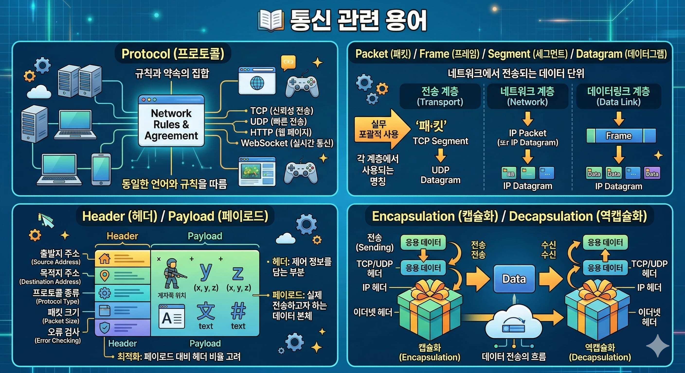  

---
  

## 📖 연결 관련 용어

네트워크 연결의 생성, 유지, 종료와 관련된 개념들이다. 특히 온라인 게임에서는 수많은 클라이언트와 서버 간의 연결을 효율적으로 관리하는 것이 핵심이다.

**Socket (소켓)**  
소켓은 네트워크 통신을 위한 프로그래밍 인터페이스이자 통신의 끝점을 의미한다. 애플리케이션이 네트워크를 통해 데이터를 주고받으려면 소켓을 생성해야 한다. 소켓은 IP 주소와 포트 번호의 조합으로 식별되며, 이를 통해 특정 프로그램 간의 통신 경로가 만들어진다. TCP 소켓은 연결 지향적이고 신뢰성 있는 통신을 제공하며, UDP 소켓은 비연결형으로 빠른 전송이 가능하다. 게임 서버는 수천 개의 소켓을 동시에 관리하면서 각 클라이언트와 통신한다.

**Endpoint (엔드포인트)**  
엔드포인트는 네트워크 통신의 양 끝점을 의미한다. 일반적으로 IP 주소와 포트 번호의 조합으로 표현되며, 통신하는 두 프로그램을 식별하는 데 사용된다. 예를 들어 게임 클라이언트가 192.168.1.100:12345에서 실행되고, 게임 서버가 203.0.113.50:7777에서 실행된다면, 이 두 개의 주소가 각각 엔드포인트가 된다. 네트워크 프로그래밍에서는 명확한 엔드포인트 정의가 통신의 시작점이다.

**Session (세션)**  
세션은 두 엔드포인트 간의 논리적인 연결 상태를 의미한다. 플레이어가 게임에 로그인하면 세션이 시작되고, 로그아웃하거나 연결이 끊어지면 세션이 종료된다. 세션 동안에는 사용자의 상태 정보, 인증 정보, 게임 진행 상황 등이 유지된다. 서버는 각 세션을 고유하게 식별하기 위해 세션 ID를 부여하며, 이를 통해 여러 요청을 동일한 사용자의 것으로 연결할 수 있다. 세션 관리는 온라인 게임의 핵심 요소 중 하나다.

**Connection (연결)**  
연결은 두 시스템 간에 데이터를 주고받을 수 있는 통신 경로가 확립된 상태를 의미한다. TCP에서는 3-way handshake를 통해 명시적인 연결을 생성하고, 이후 데이터 전송이 이루어지며, 4-way handshake로 연결을 종료한다. 연결이 유지되는 동안에는 양측의 상태 정보가 동기화되고, 신뢰성 있는 데이터 전송이 보장된다. 반면 UDP는 연결이라는 개념이 없이 데이터를 바로 전송하는 비연결형 프로토콜이다.

**Handshake (핸드셰이크)**  
핸드셰이크는 통신을 시작하기 전에 양측이 서로를 인식하고 통신 매개변수를 협상하는 과정이다. TCP의 3-way handshake가 대표적인 예로, 클라이언트가 SYN 패킷을 보내면 서버가 SYN-ACK로 응답하고, 클라이언트가 다시 ACK를 보내면서 연결이 확립된다. 이 과정을 통해 양측은 서로의 존재를 확인하고, 초기 시퀀스 번호를 교환하며, 통신 준비를 완료한다. 게임에서는 이 과정이 추가적인 지연시간을 발생시키므로, 실시간성이 중요한 데이터는 UDP를 사용하기도 한다.

**Port (포트)**  
포트는 하나의 컴퓨터에서 여러 네트워크 애플리케이션을 구분하기 위한 논리적인 번호다. IP 주소가 건물의 주소라면, 포트 번호는 건물 내의 호실 번호에 해당한다. 포트 번호는 0부터 65535까지 사용 가능하며, 0-1023번은 잘 알려진 포트로 예약되어 있다. 예를 들어 HTTP는 80번, HTTPS는 443번 포트를 사용한다. 게임 서버는 일반적으로 1024번 이상의 포트를 사용하며, 클라이언트는 연결할 때 임시 포트를 자동으로 할당받는다.

**Binding (바인딩)**  
바인딩은 소켓을 특정 IP 주소와 포트 번호에 연결하는 작업이다. 서버 프로그램은 시작할 때 소켓을 생성하고, 이를 특정 포트에 바인딩함으로써 해당 포트로 들어오는 연결을 받을 준비를 한다. 예를 들어 게임 서버가 7777번 포트에서 대기하려면, 소켓을 생성한 후 7777번 포트에 바인딩해야 한다. 바인딩이 완료되면 클라이언트는 해당 포트로 연결 요청을 보낼 수 있다. 이미 사용 중인 포트에 바인딩하려고 하면 오류가 발생한다.
  
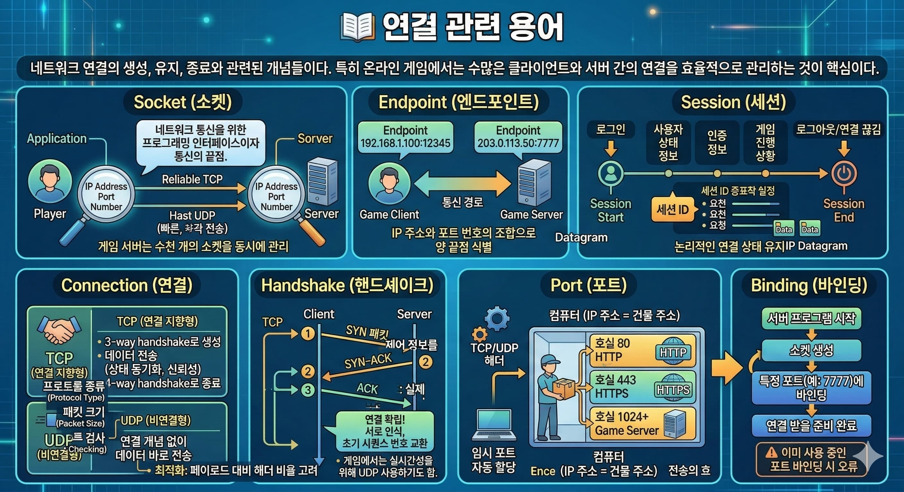   
    
---
  

## 📖 성능 관련 용어
네트워크 성능을 측정하고 평가하는 데 사용되는 용어들이다. 특히 실시간 멀티플레이 게임에서는 이러한 성능 지표들이 게임 플레이 경험에 직접적인 영향을 미친다.

**Latency (지연시간)**  
레이턴시는 데이터가 출발지에서 목적지까지 도달하는 데 걸리는 시간이다. 일반적으로 밀리초(ms) 단위로 측정되며, 낮을수록 좋다. 레이턴시는 물리적 거리, 네트워크 혼잡도, 라우터 처리 시간, 전송 매체의 특성 등 다양한 요인에 의해 결정된다. 게임에서 레이턴시가 높으면 플레이어의 입력과 화면의 반응 사이에 지연이 발생하여 게임 경험이 저하된다. FPS 게임에서는 30ms 이하의 레이턴시가 이상적이며, 100ms를 넘어가면 플레이가 불편해진다.

**RTT (Round-Trip Time, 왕복 시간)**  
RTT는 데이터가 출발지에서 목적지까지 갔다가 다시 돌아오는 데 걸리는 총 시간이다. Ping 명령어로 측정할 수 있으며, 네트워크의 응답 속도를 평가하는 기본 지표다. 레이턴시가 편도 시간이라면 RTT는 왕복 시간이다. TCP의 경우 데이터를 보낸 후 확인 응답을 받아야 하므로 RTT가 성능에 큰 영향을 미친다. 게임 서버는 주기적으로 클라이언트의 RTT를 측정하여 연결 상태를 모니터링하고, lag compensation 알고리즘에 활용한다.

**Bandwidth (대역폭)**  
대역폭은 네트워크에서 단위 시간당 전송할 수 있는 최대 데이터 양을 의미한다. 일반적으로 bps(bits per second) 단위로 표현되며, Mbps나 Gbps로 나타낸다. 대역폭이 넓을수록 더 많은 데이터를 동시에 전송할 수 있다. 예를 들어 100Mbps 대역폭은 이론상 초당 12.5MB의 데이터를 전송할 수 있다. 게임 개발에서는 플레이어당 필요한 대역폭을 계산하여 서버의 네트워크 용량을 설계해야 한다. MMO 게임보다 배틀로얄 게임이 일반적으로 더 많은 대역폭을 요구한다.

**Throughput (처리량)**  
처리량은 실제로 전송되는 데이터의 양을 의미한다. 대역폭이 이론적 최대값이라면, 처리량은 실제 측정값이다. 네트워크 혼잡, 패킷 손실, 프로토콜 오버헤드 등으로 인해 처리량은 항상 대역폭보다 작다. 예를 들어 100Mbps 대역폭의 네트워크에서 실제 처리량은 80Mbps 정도일 수 있다. 게임 서버 모니터링 시에는 처리량을 지속적으로 측정하여 병목 지점을 파악하고, 대역폭 사용률을 최적화한다.

**Jitter (지터)**  
지터는 패킷 도착 시간의 변동성을 의미한다. 이상적으로는 패킷들이 일정한 간격으로 도착해야 하지만, 네트워크 혼잡이나 경로 변경 등으로 인해 도착 시간이 불규칙해질 수 있다. 지터가 크면 음성 통화에서 끊김이 발생하거나, 게임에서 캐릭터의 움직임이 떨리는 현상이 나타난다. 실시간 게임에서는 지터를 완화하기 위해 버퍼를 사용하여 패킷을 일정 시간 저장한 후 순서대로 처리하는 기법을 사용한다. 그러나 버퍼는 추가적인 지연을 발생시키므로 적절한 균형이 필요하다.

**Packet Loss (패킷 손실)**  
패킷 손실은 전송된 패킷이 목적지에 도달하지 못하고 중간에 유실되는 현상이다. 네트워크 혼잡, 라우터 버퍼 오버플로우, 불안정한 무선 연결 등이 원인이 될 수 있다. TCP는 패킷 손실을 자동으로 감지하고 재전송하지만, 이 과정에서 지연이 발생한다. UDP는 재전송 메커니즘이 없으므로 손실된 패킷은 그대로 사라진다. 게임에서 1-2%의 패킷 손실은 큰 문제가 되지 않지만, 5%를 넘어가면 게임 플레이에 영향을 미친다. 실시간 게임은 UDP를 사용하면서 중요한 패킷만 선택적으로 재전송하는 전략을 사용한다.

**Congestion (혼잡)**  
혼잡은 네트워크에 전송할 데이터가 처리 능력을 초과하여 지연이나 패킷 손실이 발생하는 상태다. 라우터의 버퍼가 가득 차거나, 회선의 대역폭이 포화 상태에 이르면 혼잡이 발생한다. TCP는 혼잡을 감지하면 자동으로 전송 속도를 줄이는 혼잡 제어 메커니즘을 가지고 있다. 게임 서버는 혼잡 상황에서 우선순위가 낮은 데이터의 전송을 지연시키거나, 데이터 압축률을 높이거나, 업데이트 빈도를 줄이는 등의 대응을 한다.
  
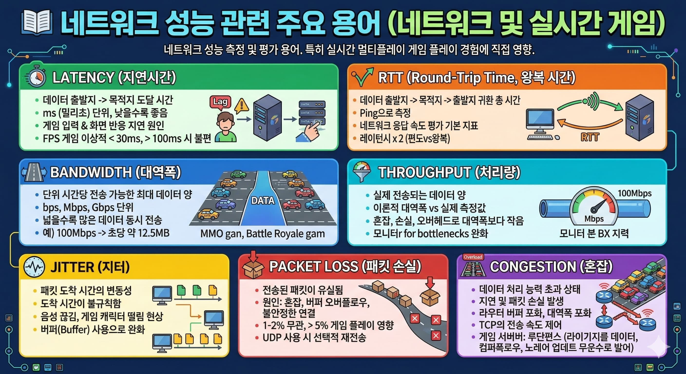   

---
  

## 📖 네트워크 장비 용어
데이터가 네트워크를 통해 전달될 때 거치는 여러 장비들과 서비스에 대한 용어다. 이러한 장비들의 역할을 이해하면 네트워크 구조와 문제 해결 방법을 더 잘 파악할 수 있다.

**Router (라우터)**  
라우터는 서로 다른 네트워크 간에 패킷을 전달하는 장비다. IP 주소를 확인하여 패킷이 목적지까지 가는 최적의 경로를 선택하고, 해당 경로로 패킷을 전송한다. 라우터는 라우팅 테이블을 유지하며, 이를 통해 각 목적지 네트워크로 가는 방법을 알고 있다. 가정에서 사용하는 공유기도 라우터의 일종이며, 인터넷 서비스 제공자의 네트워크와 가정 내부 네트워크를 연결한다. 게임 트래픽은 클라이언트에서 서버까지 도달하는 동안 수십 개의 라우터를 거치게 된다.

**Switch (스위치)**  
스위치는 같은 네트워크 내에서 장치들을 연결하고 데이터를 전달하는 장비다. MAC 주소를 기반으로 동작하며, 수신한 프레임을 목적지 포트로만 전송한다. 스위치는 MAC 주소 테이블을 학습하여 각 포트에 어떤 장치가 연결되어 있는지 파악한다. 라우터와 달리 스위치는 네트워크 계층이 아닌 데이터링크 계층에서 동작한다. 게임 회사의 서버실에서는 여러 대의 서버를 스위치로 연결하여 로컬 네트워크를 구성한다.

**Hub (허브)**  
허브는 여러 장치를 물리적으로 연결하는 가장 단순한 네트워크 장비다. 한 포트로 들어온 신호를 다른 모든 포트로 복사하여 전송하는 브로드캐스트 방식으로 동작한다. 허브는 지능적인 판단 없이 단순히 신호를 증폭하고 전달만 하므로, 네트워크 효율이 낮고 보안에도 취약하다. 현대 네트워크에서는 거의 사용되지 않으며, 스위치로 대체되었다. 그러나 네트워크의 역사와 발전 과정을 이해하는 데 중요한 개념이다.

**Gateway (게이트웨이)**  
게이트웨이는 서로 다른 프로토콜이나 네트워크 구조를 가진 네트워크들을 연결하는 장비 또는 소프트웨어다. 넓은 의미로는 한 네트워크에서 다른 네트워크로 나가는 출구 역할을 하는 장치를 의미한다. 대부분의 경우 기본 게이트웨이는 라우터를 가리킨다. 게임 서버 아키텍처에서는 게이트웨이 서버가 클라이언트의 연결을 받아 적절한 게임 서버로 분배하는 역할을 하기도 한다. 프로토콜 변환, 부하 분산, 보안 필터링 등의 기능을 수행할 수 있다.

**Firewall (방화벽)**  
방화벽은 네트워크 트래픽을 감시하고 보안 정책에 따라 특정 트래픽을 차단하거나 허용하는 시스템이다. 외부의 공격으로부터 내부 네트워크를 보호하고, 내부에서 외부로 나가는 트래픽도 제어할 수 있다. 패킷의 출발지, 목적지, 포트, 프로토콜 등을 검사하여 규칙에 맞는지 판단한다. 게임 서버는 방화벽을 통해 게임 포트만 외부에 개방하고, 나머지 포트는 차단하여 보안을 강화한다. DDoS 공격 방어, 비정상 트래픽 차단, 접근 제어 등이 방화벽의 주요 기능이다.

**NAT (Network Address Translation)**  
NAT는 사설 IP 주소와 공인 IP 주소를 상호 변환하는 기술이다. IPv4 주소 고갈 문제를 해결하고, 내부 네트워크를 외부로부터 숨겨 보안을 강화하는 효과가 있다. 가정이나 회사의 여러 장치가 하나의 공인 IP 주소를 공유하여 인터넷에 접속할 수 있게 한다. 그러나 NAT는 게임 개발에서 P2P 연결을 어렵게 만드는 주요 원인이다. NAT 뒤에 있는 클라이언트끼리 직접 연결하려면 NAT traversal 기술이 필요하다. STUN, TURN, ICE 등의 프로토콜이 이 문제를 해결하기 위해 사용된다.

**DNS (Domain Name System)**  
DNS는 사람이 읽을 수 있는 도메인 이름을 컴퓨터가 사용하는 IP 주소로 변환하는 시스템이다. 사용자가 game.example.com에 접속하려고 하면, DNS 서버에 질의하여 해당 도메인의 IP 주소를 얻는다. DNS는 계층적 구조로 되어 있으며, 루트 서버부터 시작하여 단계적으로 질의가 이루어진다. 게임에서는 서버 주소를 도메인으로 제공하면 IP 주소 변경 시에도 클라이언트 업데이트 없이 서버를 이전할 수 있다. 또한 지역별로 다른 IP를 반환하여 가장 가까운 서버로 연결하는 지리적 부하 분산도 가능하다.
  
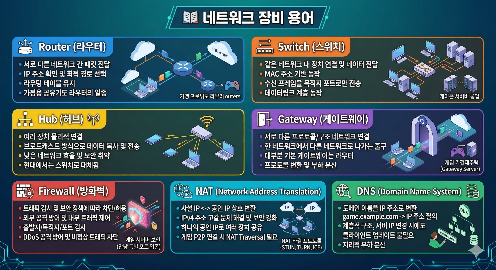   

---
  

## 📖 데이터 처리 용어
네트워크를 통해 전송하기 전후에 데이터를 변환하고 처리하는 과정과 관련된 용어들이다. 효율적이고 안전한 데이터 전송을 위해 필수적인 개념들이다.

**Serialization (직렬화) / Deserialization (역직렬화)**  
직렬화는 메모리에 있는 객체나 데이터 구조를 연속된 바이트 스트림으로 변환하는 과정이다. 네트워크를 통해 전송하거나 파일에 저장하기 위해서는 데이터를 직렬화해야 한다. 예를 들어 플레이어 정보를 담은 객체를 JSON, XML, 또는 바이너리 형태로 변환하는 것이 직렬화다. 역직렬화는 반대로 바이트 스트림을 다시 원래의 객체로 복원하는 과정이다. 게임에서는 게임 상태, 플레이어 데이터, 설정 정보 등을 저장하거나 전송할 때 직렬화를 사용한다. 직렬화 형식의 선택은 성능, 크기, 가독성 등을 고려해야 한다.

**Marshalling (마샬링)**  
마샬링은 직렬화와 유사하지만, 주로 서로 다른 시스템이나 프로그래밍 언어 간에 데이터를 전달할 때 사용되는 용어다. 데이터를 특정 형식으로 변환하여 전송 가능한 상태로 만드는 과정을 의미한다. RPC(Remote Procedure Call) 시스템에서 함수 매개변수를 네트워크를 통해 전달할 때 마샬링이 사용된다. 예를 들어 C++ 서버와 Java 클라이언트 사이에서 데이터를 주고받을 때, 각각의 데이터 타입을 공통 형식으로 변환하는 과정이 마샬링이다. 언마샬링은 수신한 데이터를 다시 해당 언어의 데이터 타입으로 복원하는 과정이다.

**Encoding (인코딩) / Decoding (디코딩)**  
인코딩은 데이터를 특정 형식이나 규칙에 따라 변환하는 과정이다. 문자 인코딩에서는 문자를 바이트로 변환하며, UTF-8, UTF-16, ASCII 등의 방식이 있다. Base64 인코딩은 바이너리 데이터를 텍스트 형태로 변환하여 텍스트 기반 프로토콜에서 전송할 수 있게 한다. 인코딩은 데이터의 내용을 변경하지 않고 형식만 바꾸는 것이 목적이다. 디코딩은 인코딩된 데이터를 원래 형태로 복원하는 과정이다. 게임에서는 채팅 메시지, 플레이어 이름 등의 텍스트 데이터를 인코딩하여 전송한다.

**Compression (압축) / Decompression (압축 해제)**  
압축은 데이터의 크기를 줄이는 기술이다. 중복된 정보를 제거하거나, 빈도가 높은 패턴을 짧은 코드로 대체하여 전체 데이터 크기를 감소시킨다. 무손실 압축은 원본을 완벽하게 복원할 수 있으며, ZIP, GZIP, LZ4 등이 여기에 해당한다. 손실 압축은 일부 정보를 버려 더 높은 압축률을 얻으며, JPEG, MP3 등이 대표적이다. 게임에서는 네트워크 대역폭을 절약하기 위해 전송 데이터를 압축하는데, 압축과 압축 해제에 소요되는 CPU 시간과 절약되는 네트워크 시간 사이의 균형을 고려해야 한다. 실시간 게임에서는 빠른 압축 알고리즘이 선호된다.

**Encryption (암호화) / Decryption (복호화)**  
암호화는 데이터를 읽을 수 없는 형태로 변환하여 보안을 제공하는 기술이다. 암호화 키를 가진 사람만 원본 데이터를 복원할 수 있다. 대칭키 암호화는 암호화와 복호화에 같은 키를 사용하며, AES가 대표적이다. 비대칭키 암호화는 공개키로 암호화하고 개인키로 복호화하며, RSA가 널리 사용된다. 복호화는 암호화된 데이터를 원래 상태로 되돌리는 과정이다. 게임에서는 로그인 정보, 결제 데이터, 개인정보 등 민감한 정보를 암호화하여 전송한다. 또한 치트 방지를 위해 게임 패킷을 암호화하기도 하지만, 이는 성능 오버헤드를 발생시키므로 신중히 결정해야 한다.
  
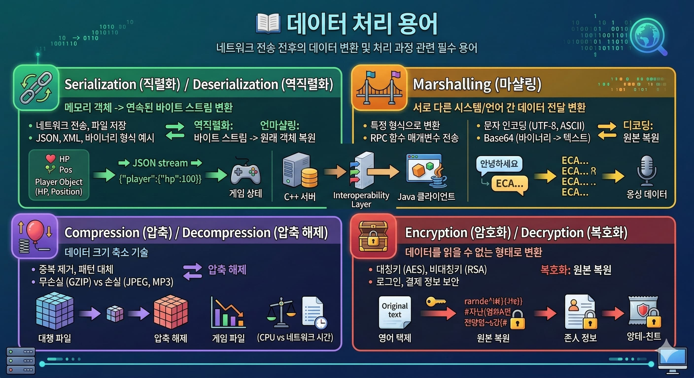   
    
---
  

## 📖 I/O 관련 용어
프로그램이 외부 시스템과 데이터를 주고받는 방식과 관련된 개념들이다. 네트워크 프로그래밍의 성능과 구조를 결정하는 핵심 요소들이다.

**Blocking I/O (블로킹 I/O)**  
블로킹 I/O는 입출력 작업이 완료될 때까지 프로그램의 실행이 멈추는 방식이다. 예를 들어 소켓에서 데이터를 읽는 함수를 호출하면, 데이터가 도착할 때까지 해당 함수는 반환하지 않고 대기한다. 프로그래밍이 간단하고 직관적이지만, 한 번에 하나의 작업만 처리할 수 있다는 단점이 있다. 여러 클라이언트를 동시에 처리하려면 각 클라이언트마다 별도의 스레드를 만들어야 하는데, 스레드가 많아지면 컨텍스트 스위칭 오버헤드가 커진다. 간단한 게임이나 소규모 서버에서는 블로킹 I/O로도 충분할 수 있다.

**Non-blocking I/O (논블로킹 I/O)**  
논블로킹 I/O는 입출력 작업이 즉시 반환하는 방식이다. 데이터가 준비되지 않았다면 에러를 반환하고, 프로그램은 다른 작업을 계속할 수 있다. 이를 통해 하나의 스레드로 여러 소켓을 동시에 처리할 수 있다. 그러나 단순 논블로킹 I/O만 사용하면 지속적으로 상태를 확인해야 하는 폴링(polling)이 필요하여 CPU를 낭비하게 된다. 이 문제를 해결하기 위해 I/O 멀티플렉싱 기술과 함께 사용된다. 대규모 동시 접속을 처리하는 게임 서버에서는 논블로킹 I/O가 필수적이다.

**Synchronous (동기)**  
동기 방식은 작업을 순차적으로 실행하고, 한 작업이 끝나야 다음 작업을 시작하는 방식이다. 함수를 호출하면 결과를 받을 때까지 대기하며, 실행 흐름이 명확하고 이해하기 쉽다. 그러나 대기 시간 동안 다른 작업을 할 수 없어 효율성이 떨어질 수 있다. 블로킹과 동기는 종종 혼동되지만, 블로킹은 I/O의 실행 방식이고 동기는 프로그래밍 패러다임이다. 동기 방식은 디버깅이 쉽고 코드의 흐름을 추적하기 용이하여, 복잡도가 낮은 상황에서 선호된다.

**Asynchronous (비동기)**  
비동기 방식은 작업을 시작하고 완료를 기다리지 않고 다음 작업을 진행하는 방식이다. 작업이 완료되면 콜백 함수나 이벤트를 통해 결과를 받는다. 대기 시간 동안 다른 작업을 수행할 수 있어 효율적이지만, 코드가 복잡해지고 디버깅이 어려워질 수 있다. 현대적인 프로그래밍 언어들은 async/await 문법을 제공하여 비동기 코드를 동기 코드처럼 작성할 수 있게 한다. 게임 서버에서는 데이터베이스 조회, 외부 API 호출 등 시간이 걸리는 작업을 비동기로 처리하여 성능을 향상시킨다.

**Multiplexing (멀티플렉싱)**  
멀티플렉싱은 하나의 채널을 통해 여러 신호나 데이터 스트림을 동시에 전송하는 기술이다. I/O 멀티플렉싱은 하나의 스레드로 여러 소켓을 동시에 관리하는 방법을 의미한다. select, poll, epoll 같은 시스템 콜을 사용하여 여러 소켓 중 읽기 또는 쓰기가 가능한 소켓을 효율적으로 찾아낸다. 이를 통해 수천 개의 동시 연결을 적은 수의 스레드로 처리할 수 있다. 게임 서버에서 I/O 멀티플렉싱은 확장성을 위한 핵심 기술이며, C10K 문제를 해결하는 대표적인 방법이다.

**Buffer (버퍼)**  
버퍼는 데이터를 임시로 저장하는 메모리 공간이다. 네트워크에서는 송신 버퍼와 수신 버퍼가 있어, 보낼 데이터와 받은 데이터를 일시적으로 저장한다. 버퍼는 데이터 생산 속도와 소비 속도의 차이를 완충하는 역할을 한다. 예를 들어 애플리케이션이 데이터를 빠르게 쓰면 송신 버퍼에 쌓이고, 네트워크가 여유가 있을 때 실제로 전송된다. 버퍼 크기가 너무 작으면 데이터가 자주 차단되고, 너무 크면 메모리 낭비와 지연 증가가 발생한다. 게임에서는 버퍼 크기를 조정하여 성능과 메모리 사용을 최적화한다.

**Queue (큐)**  
큐는 선입선출(FIFO) 방식의 자료구조로, 먼저 들어간 데이터가 먼저 나온다. 네트워크 프로그래밍에서 큐는 처리해야 할 이벤트나 메시지를 순서대로 관리하는 데 사용된다. 예를 들어 수신한 패킷을 큐에 넣고, 게임 로직 스레드가 순서대로 꺼내서 처리한다. 이를 통해 네트워크 스레드와 게임 로직 스레드를 분리하여 안정성과 성능을 향상시킬 수 있다. 우선순위 큐를 사용하면 중요한 메시지를 먼저 처리할 수도 있다. 큐의 크기 관리는 메모리 사용과 시스템 안정성에 영향을 미치므로 신중히 설계해야 한다.
    
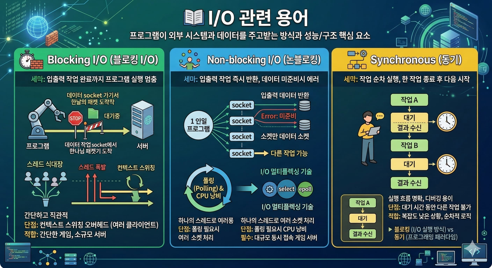   
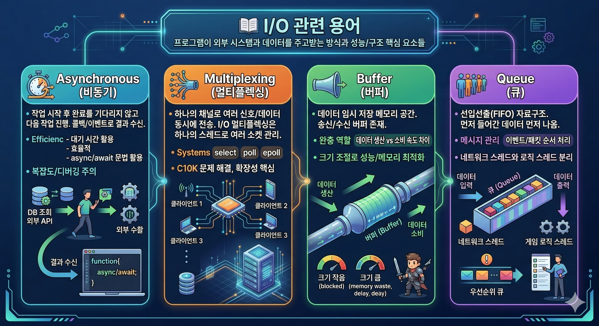   

---

**정리**

이 장에서 다룬 네트워크 핵심 용어들은 게임 네트워크 프로그래밍의 기초 어휘다. 각 용어의 정확한 의미를 이해하고 있어야 이후 학습할 프로토콜, 아키텍처, 최적화 기법들을 제대로 이해할 수 있다. 실제 개발 과정에서 이 용어들은 끊임없이 등장하며, 팀 내 소통과 문서 작성, 문제 해결의 기본 언어가 된다. 처음에는 낯설고 복잡하게 느껴질 수 있지만, 실제 코드를 작성하고 네트워크 문제를 해결하면서 자연스럽게 체득하게 된다. 이 용어들을 참조하며 다음 장들의 학습을 진행하면, 네트워크 프로그래밍의 전체 그림이 명확해질 것이다.    


# Chapter. 2. OSI 7계층 모델

**학습 이유**: 네트워크 통신의 표준 참조 모델로, 문제 발생 시 어느 계층의 문제인지 파악 가능

OSI 7계층 모델은 네트워크 통신을 이해하기 위한 가장 기본적인 개념 틀이다. 1984년 국제표준화기구(ISO)가 제정한 이 모델은 복잡한 네트워크 통신을 7개의 논리적 계층으로 분리하여 설명한다. 각 계층은 독립적인 역할을 수행하며, 상위 계층은 하위 계층이 제공하는 서비스를 사용한다. 이러한 계층 구조 덕분에 특정 계층의 기술이 변경되어도 다른 계층에 영향을 주지 않으며, 문제가 발생했을 때 어느 계층에서 문제가 생겼는지 체계적으로 분석할 수 있다.

게임 개발자에게 OSI 7계층 모델은 단순한 이론이 아니라 실용적인 문제 해결 도구다. 플레이어가 "게임이 연결되지 않아요"라고 말할 때, 이것이 물리적 케이블 문제인지, 라우터 설정 문제인지, 방화벽 차단 문제인지, 아니면 게임 서버 애플리케이션 문제인지를 계층별로 접근하여 빠르게 파악할 수 있다.

---

## 계층별 역할

OSI 7계층 모델은 하위 계층부터 상위 계층까지 순차적으로 구성되어 있다. 각 계층은 명확한 경계와 역할을 가지며, 데이터는 송신 측에서 7계층부터 1계층으로 내려가고, 수신 측에서는 1계층부터 7계층으로 올라간다.

```
┌─────────────────────────────────────────┐
│      7. 응용 계층 (Application)          │  ← 게임 클라이언트/서버
│      HTTP, FTP, SMTP, DNS               │
├─────────────────────────────────────────┤
│      6. 표현 계층 (Presentation)         │  ← 데이터 형식 변환
│      암호화, 압축, 인코딩                 │
├─────────────────────────────────────────┤
│      5. 세션 계층 (Session)              │  ← 세션 관리
│      연결 설정/유지/종료                  │
├─────────────────────────────────────────┤
│      4. 전송 계층 (Transport)            │  ← TCP, UDP
│      포트, 신뢰성, 흐름 제어              │
├─────────────────────────────────────────┤
│      3. 네트워크 계층 (Network)          │  ← IP 주소, 라우팅
│      IP, ICMP, ARP                      │
├─────────────────────────────────────────┤
│      2. 데이터링크 계층 (Data Link)      │  ← MAC 주소, 스위치
│      이더넷, Wi-Fi, PPP                  │
├─────────────────────────────────────────┤
│      1. 물리 계층 (Physical)             │  ← 전기/광 신호
│      케이블, 허브, 리피터                 │
└─────────────────────────────────────────┘
```

### 1. 물리 계층 (Physical Layer)
물리 계층은 OSI 모델의 최하위 계층으로, 실제 물리적인 매체를 통해 비트 스트림을 전송하는 역할을 담당한다. 디지털 데이터인 0과 1을 전기 신호, 광 신호, 또는 전파로 변환하여 물리적 매체를 통해 전달한다. 반대로 수신 측에서는 이러한 물리 신호를 다시 디지털 비트로 변환한다.

물리 계층의 핵심은 하드웨어 사양과 물리적 특성이다. 케이블의 종류(트위스티드 페어, 동축 케이블, 광섬유), 커넥터의 모양(RJ-45, USB), 전압 레벨, 신호 타이밍, 전송 속도(비트레이트) 등이 모두 물리 계층의 관심사다. 유선 네트워크에서는 전기 신호의 전압 변화로 데이터를 표현하고, 무선 네트워크에서는 전파의 주파수와 진폭을 변조하여 데이터를 전송한다.

이 계층에서 동작하는 대표적인 장비는 허브(Hub)와 리피터(Repeater)다. 허브는 한 포트로 들어온 신호를 다른 모든 포트로 단순히 복사하여 전달하며, 리피터는 약해진 신호를 증폭하여 먼 거리까지 전송할 수 있게 한다. 이들 장비는 데이터의 내용을 전혀 이해하지 못하고 단지 물리적 신호만을 처리한다.

게임 개발자 관점에서 물리 계층의 문제는 "케이블이 뽑혔다", "Wi-Fi 신호가 약하다", "네트워크 카드 고장" 같은 물리적 연결 장애로 나타난다. 이러한 문제는 소프트웨어로 해결할 수 없으며, 하드웨어를 점검하고 교체해야 한다.
  
### 2. 데이터링크 계층 (Data Link Layer)
데이터링크 계층은 직접 연결된 두 노드 간의 신뢰성 있는 데이터 전송을 담당한다. 물리 계층이 제공하는 불완전한 전송 매체 위에서 오류를 검출하고, 때로는 수정하여 신뢰성을 높인다. 이 계층의 가장 중요한 개념은 MAC(Media Access Control) 주소다.

MAC 주소는 48비트(6바이트) 길이의 물리적 주소로, 네트워크 인터페이스 카드(NIC)에 제조사가 할당한 고유한 식별자다. 예를 들어 "00:1A:2B:3C:4D:5E" 형식으로 표현되며, 앞의 3바이트는 제조사 코드, 뒤의 3바이트는 일련번호다. 데이터링크 계층은 이 MAC 주소를 사용하여 같은 로컬 네트워크 내의 장치들을 구분하고 통신한다.

이더넷(Ethernet)은 데이터링크 계층의 가장 널리 사용되는 프로토콜이다. 이더넷은 프레임이라는 단위로 데이터를 전송하며, 각 프레임은 출발지 MAC 주소, 목적지 MAC 주소, 데이터 타입, 실제 데이터, 그리고 오류 검출을 위한 FCS(Frame Check Sequence)를 포함한다. 무선 네트워크의 Wi-Fi도 데이터링크 계층 프로토콜이며, 이더넷과 유사한 방식으로 동작하지만 무선 환경의 특성을 고려한 추가 메커니즘을 가진다.

스위치(Switch)는 데이터링크 계층에서 동작하는 지능형 장비다. 스위치는 MAC 주소 테이블을 학습하여 각 포트에 어떤 장치가 연결되어 있는지 파악하고, 프레임을 목적지 포트로만 정확하게 전달한다. 이는 허브와 달리 네트워크 효율을 크게 향상시키며, 충돌 영역을 분리하여 성능을 개선한다.

게임 개발 맥락에서 데이터링크 계층의 문제는 "같은 네트워크 내에서 통신이 안 된다", "MAC 주소 충돌", "스위치 포트 문제" 등으로 나타난다. 로컬 네트워크 게임을 개발할 때는 브로드캐스트를 사용하여 같은 서브넷의 게임 서버를 발견하는 기능을 구현하기도 하는데, 이것이 데이터링크 계층의 기능을 활용하는 예다.

### 3. 네트워크 계층 (Network Layer)
네트워크 계층은 서로 다른 네트워크 간의 통신을 가능하게 하는 계층이다. 데이터링크 계층이 직접 연결된 장치 간 통신을 담당한다면, 네트워크 계층은 여러 네트워크를 거쳐 최종 목적지까지 데이터를 전달하는 라우팅을 담당한다. 이 계층의 핵심 프로토콜은 IP(Internet Protocol)다.

IP 주소는 네트워크 상의 장치를 논리적으로 식별하는 주소 체계다. IPv4는 32비트 주소를 사용하여 "192.168.1.100"처럼 점으로 구분된 4개의 숫자로 표현된다. IPv6는 128비트 주소를 사용하여 주소 고갈 문제를 해결했다. IP 주소는 네트워크 부분과 호스트 부분으로 나뉘며, 서브넷 마스크를 통해 이를 구분한다.

라우팅은 네트워크 계층의 가장 중요한 기능이다. 패킷이 출발지에서 목적지까지 도달하기 위해 어떤 경로를 거쳐야 하는지 결정하는 과정이다. 라우터는 라우팅 테이블을 유지하며, 이 테이블을 참조하여 수신한 패킷을 다음 홉(next hop)으로 전달한다. 라우팅 테이블은 정적으로 설정하거나, RIP, OSPF, BGP 같은 라우팅 프로토콜을 통해 동적으로 학습할 수 있다.

ICMP(Internet Control Message Protocol)는 네트워크 계층의 보조 프로토콜로, 오류 보고와 네트워크 진단에 사용된다. 우리가 흔히 사용하는 ping 명령어는 ICMP Echo Request를 보내고 Echo Reply를 받아 네트워크 연결 상태를 확인한다. traceroute 명령어도 ICMP를 활용하여 패킷이 거치는 라우터들의 경로를 추적한다.

ARP(Address Resolution Protocol)는 IP 주소를 MAC 주소로 변환하는 프로토콜이다. 네트워크 계층에서 IP 주소를 알지만, 실제로 프레임을 전송하려면 데이터링크 계층의 MAC 주소가 필요하다. ARP는 "이 IP 주소를 가진 장치의 MAC 주소가 무엇인가요?"라고 브로드캐스트로 질의하고, 해당 장치가 자신의 MAC 주소로 응답한다.

게임 서버를 운영할 때 네트워크 계층은 매우 중요하다. 게임 클라이언트는 서버의 IP 주소로 연결하며, 패킷은 여러 라우터를 거쳐 서버에 도달한다. "서버에 연결할 수 없습니다"라는 오류가 발생하면 ping으로 서버 IP에 도달 가능한지 확인하고, traceroute로 어느 지점에서 패킷이 막히는지 파악할 수 있다. 또한 방화벽 설정, NAT 통과, 지역별 라우팅 최적화 등도 네트워크 계층에서 다루는 주제다.

### 4. 전송 계층 (Transport Layer)
전송 계층은 종단 간(end-to-end) 통신을 제공하는 계층이다. 네트워크 계층이 IP 주소를 사용하여 호스트 간 통신을 담당한다면, 전송 계층은 포트 번호를 사용하여 호스트 내의 특정 애플리케이션 간 통신을 담당한다. 이 계층의 두 가지 주요 프로토콜인 TCP와 UDP는 게임 네트워크 프로그래밍의 핵심이다.

포트(Port)는 0부터 65535까지의 16비트 숫자로, 하나의 컴퓨터에서 동시에 실행되는 여러 네트워크 애플리케이션을 구분한다. IP 주소가 아파트 건물 주소라면, 포트는 호수 번호에 해당한다. 소켓은 IP 주소와 포트 번호의 조합으로 표현되며, 예를 들어 "192.168.1.100:7777"은 192.168.1.100 호스트의 7777번 포트를 의미한다.

TCP(Transmission Control Protocol)는 연결 지향적이고 신뢰성 있는 전송을 제공한다. 통신을 시작하기 전에 3-way handshake로 연결을 설정하고, 데이터 전송 중에는 시퀀스 번호와 확인 응답(ACK)을 사용하여 모든 데이터가 순서대로 정확하게 전달되도록 보장한다. 패킷이 손실되면 자동으로 재전송하며, 수신 측의 처리 속도에 맞춰 전송 속도를 조절하는 흐름 제어와, 네트워크 혼잡도에 따라 전송 속도를 조절하는 혼잡 제어 메커니즘을 가진다.

UDP(User Datagram Protocol)는 비연결형이며 신뢰성을 보장하지 않는다. 연결 설정 과정이 없이 바로 데이터를 전송하며, 확인 응답도 없고 재전송도 하지 않는다. 그래서 TCP보다 훨씬 빠르고 오버헤드가 작다. 실시간 게임에서 플레이어의 위치 정보는 UDP로 전송하는 것이 일반적이다. 한 프레임의 위치 정보가 손실되더라도 곧 다음 프레임의 새로운 위치 정보가 도착하기 때문에 재전송은 오히려 불필요한 지연만 발생시킨다.

전송 계층의 또 다른 중요한 역할은 포트 기반 멀티플렉싱과 디멀티플렉싱이다. 하나의 네트워크 인터페이스로 들어온 여러 애플리케이션의 데이터를 포트 번호를 보고 적절한 애플리케이션으로 분배하고, 반대로 여러 애플리케이션에서 나가는 데이터를 하나의 네트워크 인터페이스로 모아서 전송한다.

게임 개발자는 전송 계층을 직접 다룬다. 게임 서버는 특정 포트를 열어 클라이언트의 연결을 기다리며, 채팅 같은 중요한 데이터는 TCP로, 실시간 위치 정보는 UDP로 전송하는 등 프로토콜을 선택한다. "Connection Timeout", "Packet Loss", "Out of Order" 같은 문제들은 모두 전송 계층과 관련된 이슈다.

### 5. 세션 계층 (Session Layer)  
세션 계층은 응용 프로그램 간의 대화(session)를 관리하는 계층이다. 연결의 설정, 유지, 종료를 제어하고, 통신 중인 시스템 간의 동기화 포인트를 제공하며, 장애 발생 시 복구 메커니즘을 제공한다. 세션 계층은 전송 계층이 제공하는 연결 위에서 더 높은 수준의 대화 관리를 담당한다.

세션은 두 애플리케이션 간의 논리적 연결 상태를 의미한다. 게임에서 플레이어가 로그인하면 세션이 시작되고, 로그아웃하거나 타임아웃되면 세션이 종료된다. 세션 동안에는 사용자의 인증 정보, 게임 상태, 설정 등이 유지된다. 세션 ID를 통해 여러 요청을 동일한 사용자의 것으로 묶어서 처리할 수 있다.

세션 계층의 중요한 기능 중 하나는 대화 제어(dialog control)다. 반이중(half-duplex) 통신에서는 한 번에 한 방향으로만 데이터가 흐르고, 전이중(full-duplex) 통신에서는 양방향으로 동시에 데이터가 흐를 수 있다. 세션 계층은 이러한 통신 모드를 관리하고, 누가 언제 데이터를 전송할 수 있는지를 제어한다.

동기화(synchronization)는 세션 계층의 또 다른 핵심 기능이다. 긴 파일 전송 중에 주기적으로 동기화 포인트(checkpoint)를 설정하여, 오류 발생 시 처음부터 다시 시작하지 않고 마지막 동기화 포인트부터 재개할 수 있다. 이는 대용량 데이터 전송의 효율성을 크게 향상시킨다.

OSI 모델에서 세션 계층은 독립적인 계층이지만, 실제 인터넷 프로토콜 스택인 TCP/IP 모델에서는 명확하게 분리되지 않는다. 많은 경우 세션 관리 기능이 응용 계층에 통합되어 구현된다. 예를 들어 HTTP의 쿠키와 세션, WebSocket의 연결 관리 등이 세션 계층의 역할을 수행한다.

게임에서 세션 계층의 개념은 매우 중요하다. 플레이어의 로그인 세션 관리, 게임 방(room) 생성과 참여, 재접속(reconnection) 처리, 세션 타임아웃 관리 등이 모두 세션 계층의 개념을 활용한다. "세션이 만료되었습니다", "다시 로그인하세요" 같은 메시지는 세션 계층의 문제를 나타낸다.

### 6. 표현 계층 (Presentation Layer)  
표현 계층은 데이터의 표현 방식을 담당하는 계층이다. 서로 다른 시스템이 서로 다른 데이터 표현 방식을 사용할 수 있기 때문에, 네트워크를 통해 데이터를 교환하려면 공통의 형식으로 변환해야 한다. 표현 계층은 이러한 형식 변환, 암호화, 압축 등을 수행한다.

데이터 형식 변환의 대표적인 예는 문자 인코딩이다. 텍스트 데이터를 전송할 때 ASCII, UTF-8, UTF-16 등 다양한 인코딩 방식이 사용될 수 있다. 표현 계층은 송신 측의 인코딩을 수신 측이 이해할 수 있는 형식으로 변환한다. 또한 바이트 오더(endianness) 문제도 표현 계층에서 해결한다. 정수 0x12345678을 빅 엔디안 시스템은 12 34 56 78 순서로 저장하지만, 리틀 엔디안 시스템은 78 56 34 12 순서로 저장한다. 네트워크 바이트 오더는 항상 빅 엔디안을 사용하므로, 리틀 엔디안 시스템은 송신 전에 바이트 순서를 변환해야 한다.

암호화와 복호화도 표현 계층의 중요한 기능이다. SSL/TLS는 표현 계층에서 동작하며, 전송되는 데이터를 암호화하여 보안을 제공한다. 게임 서버와 클라이언트 간의 통신에서 로그인 정보, 결제 데이터 같은 민감한 정보는 반드시 암호화해야 한다. AES, RSA 같은 암호화 알고리즘이 표현 계층에서 사용된다.

데이터 압축도 표현 계층의 역할이다. 전송할 데이터의 크기를 줄여 네트워크 대역폭을 절약하고 전송 시간을 단축한다. GZIP, LZ4, Snappy 같은 압축 알고리즘을 사용하여 텍스트나 바이너리 데이터를 압축한다. 특히 게임에서 대량의 게임 상태 데이터를 전송할 때 압축은 성능 최적화의 중요한 기법이다.

직렬화(serialization)와 역직렬화도 표현 계층의 개념이다. 메모리에 있는 객체나 데이터 구조를 바이트 스트림으로 변환하여 네트워크로 전송하고, 수신 측에서 다시 객체로 복원한다. JSON, XML, Protocol Buffers, MessagePack 같은 직렬화 형식이 널리 사용된다.

OSI 모델에서 표현 계층은 독립적이지만, 실제로는 응용 계층과 함께 구현되는 경우가 많다. 게임 개발자는 표현 계층의 기능을 직접 구현하거나 라이브러리를 사용한다. 데이터 직렬화 형식 선택, 압축 알고리즘 적용, 암호화 강도 결정 등이 표현 계층과 관련된 개발 결정이다.

### 7. 응용 계층 (Application Layer)  
응용 계층은 OSI 모델의 최상위 계층으로, 사용자 또는 애플리케이션이 직접 상호작용하는 계층이다. 네트워크 서비스를 애플리케이션에 제공하며, 실제로 사용자에게 의미 있는 기능을 수행한다. 이 계층은 하위 6개 계층이 제공하는 모든 서비스를 활용하여 최종적인 애플리케이션 기능을 구현한다.

응용 계층의 대표적인 프로토콜들은 우리가 일상적으로 사용하는 서비스들이다. HTTP(Hypertext Transfer Protocol)는 웹 페이지를 전송하며, HTTPS는 HTTP에 SSL/TLS 암호화를 추가한 것이다. FTP(File Transfer Protocol)는 파일 전송에 사용되고, SMTP(Simple Mail Transfer Protocol)는 이메일 전송에, DNS(Domain Name System)는 도메인 이름을 IP 주소로 변환하는 데 사용된다.

게임에서 응용 계층은 게임 프로토콜과 게임 로직이 구현되는 계층이다. 게임 클라이언트와 서버는 응용 계층에서 게임 특화된 메시지를 주고받는다. 예를 들어 플레이어의 이동 명령, 공격 명령, 채팅 메시지, 아이템 거래 등의 게임 이벤트가 모두 응용 계층에서 처리된다. 개발자는 이러한 게임 메시지의 형식과 처리 로직을 직접 설계하고 구현한다.

웹 기반 게임이나 모바일 게임에서는 HTTP/HTTPS를 응용 계층 프로토콜로 사용하기도 한다. RESTful API를 통해 게임 서버와 통신하거나, WebSocket을 사용하여 실시간 양방향 통신을 구현한다. WebSocket은 HTTP로 초기 핸드셰이크를 수행한 후 전이중 통신 채널을 유지하여 실시간 게임에 적합하다.

게임 로비, 매치메이킹, 친구 목록, 인벤토리 관리, 상점 시스템 등 게임의 모든 기능이 응용 계층에서 구현된다. 게임 서버는 이러한 요청을 받아 비즈니스 로직을 실행하고, 데이터베이스를 조회하며, 결과를 클라이언트에 응답한다. 게임 개발자가 대부분의 시간을 보내는 것이 바로 이 응용 계층의 개발이다.

응용 계층에서 발생하는 문제는 "서버가 응답하지 않음", "잘못된 게임 상태", "동기화 오류" 같은 형태로 나타난다. 이러한 문제는 게임 로직의 버그이거나, 프로토콜 설계의 문제이거나, 서버 부하로 인한 성능 저하일 수 있다.

---

## TCP/IP 4계층 모델

**학습 이유**: 실제 인터넷에서 사용되는 프로토콜 체계

OSI 7계층 모델이 이론적인 참조 모델이라면, TCP/IP 4계층 모델은 실제 인터넷에서 사용되는 프로토콜 스택이다. 1970년대 미국 국방부의 ARPANET 프로젝트에서 시작된 TCP/IP는 현대 인터넷의 기반이 되었다. OSI 모델과 비교하면 계층 수가 적고 구조가 단순하지만, 실용성과 효율성에 초점을 맞춘 모델이다.

```
OSI 7계층              TCP/IP 4계층            주요 프로토콜
┌─────────────┐
│ 응용 계층    │
├─────────────┤
│ 표현 계층    │      ┌─────────────┐
├─────────────┤      │ 응용 계층    │        HTTP, FTP, SMTP
│ 세션 계층    │      │             │        DNS, WebSocket
└─────────────┘      └─────────────┘        게임 프로토콜
                            ↓
┌─────────────┐      ┌─────────────┐
│ 전송 계층    │  →   │ 전송 계층    │        TCP, UDP
└─────────────┘      └─────────────┘
                            ↓
┌─────────────┐      ┌─────────────┐
│ 네트워크계층 │  →   │ 인터넷 계층  │        IP, ICMP, ARP
└─────────────┘      └─────────────┘
                            ↓
┌─────────────┐      ┌─────────────┐
│데이터링크계층│      │네트워크      │        Ethernet, Wi-Fi
├─────────────┤  →   │인터페이스    │        PPP, 드라이버
│ 물리 계층    │      │계층          │
└─────────────┘      └─────────────┘
```

### 1. 네트워크 인터페이스 계층 (Network Interface Layer)
네트워크 인터페이스 계층은 OSI 모델의 물리 계층과 데이터링크 계층을 합친 것에 해당한다. 물리적 네트워크 하드웨어와 직접 상호작용하며, 비트를 물리적 신호로 변환하고, MAC 주소 기반의 로컬 네트워크 통신을 담당한다. 이더넷, Wi-Fi, PPP(Point-to-Point Protocol) 등이 이 계층에서 동작한다.

TCP/IP 모델에서 네트워크 인터페이스 계층은 상세하게 정의되지 않았다. 이는 TCP/IP가 다양한 물리적 네트워크 위에서 동작할 수 있도록 설계되었기 때문이다. 게임 개발자는 일반적으로 이 계층을 직접 다루지 않으며, 운영체제와 네트워크 드라이버가 처리한다.

### 2. 인터넷 계층 (Internet Layer)
인터넷 계층은 OSI 모델의 네트워크 계층에 해당하며, IP 프로토콜이 핵심이다. 이 계층은 패킷을 출발지에서 목적지까지 전달하는 라우팅을 담당한다. IP 주소 지정, 패킷 단편화와 재조립, 라우팅 등이 주요 기능이다.

인터넷 계층의 주요 프로토콜은 다음과 같다:

- **IP (Internet Protocol)**: 패킷 전달의 핵심 프로토콜
- **ICMP (Internet Control Message Protocol)**: 오류 보고와 진단
- **ARP (Address Resolution Protocol)**: IP 주소를 MAC 주소로 변환
- **IGMP (Internet Group Management Protocol)**: 멀티캐스트 그룹 관리

인터넷 계층은 비신뢰성(unreliable) 서비스를 제공한다. 즉, 패킷이 목적지에 도달하는 것을 보장하지 않으며, 순서도 보장하지 않는다. 신뢰성은 상위 계층인 전송 계층에서 제공한다.

### 3. 전송 계층 (Transport Layer)
전송 계층은 OSI 모델의 전송 계층과 동일하며, TCP와 UDP 프로토콜이 동작한다. 종단 간 통신을 제공하고, 포트 번호를 사용하여 애플리케이션을 구분한다.

TCP는 연결 지향적이고 신뢰성 있는 통신을 제공하며, 흐름 제어와 혼잡 제어를 수행한다. UDP는 비연결형이고 신뢰성을 보장하지 않지만, 오버헤드가 적고 빠르다. 게임 개발에서는 데이터의 특성에 따라 두 프로토콜을 적절히 선택하고 조합한다.

전송 계층은 인터넷 계층이 제공하는 비신뢰성 서비스 위에서 TCP의 경우 신뢰성을 추가한다. 이는 end-to-end 원칙에 따라 네트워크 내부가 아닌 종단 시스템에서 신뢰성을 보장하는 인터넷의 설계 철학을 보여준다.

### 4. 응용 계층 (Application Layer)
응용 계층은 OSI 모델의 세션 계층, 표현 계층, 응용 계층을 합친 것에 해당한다. 실제 애플리케이션이 동작하는 계층으로, HTTP, FTP, SMTP, DNS, WebSocket 등 다양한 응용 프로토콜이 이 계층에서 동작한다.

TCP/IP 모델은 OSI 모델처럼 세션 관리, 데이터 표현, 암호화 등을 별도 계층으로 분리하지 않고, 이러한 기능들을 응용 계층 프로토콜이나 애플리케이션이 필요에 따라 구현하도록 한다. 이는 더 유연하고 실용적인 접근 방식이다.

게임 개발에서는 응용 계층에서 대부분의 작업이 이루어진다. 게임 프로토콜 설계, 메시지 형식 정의, 직렬화 방법 선택, 암호화 적용, 세션 관리 등이 모두 응용 계층의 책임이다.

---
  

## OSI vs TCP/IP: 실무적 관점
OSI 7계층 모델과 TCP/IP 4계층 모델은 서로 다른 목적으로 만들어졌지만, 상호 보완적으로 사용된다. OSI 모델은 교육과 개념 이해에 유용하며, 네트워크 문제를 계층별로 분석하는 프레임워크를 제공한다. TCP/IP 모델은 실제 구현과 프로토콜 스택을 설명하는 데 적합하다.

게임 개발자는 두 모델을 모두 이해하고 있어야 한다. 문제를 진단할 때는 OSI 7계층으로 접근하여 "이것은 몇 계층의 문제인가?"를 분석하고, 실제 구현할 때는 TCP/IP 스택을 사용하여 소켓 프로그래밍을 한다.

예를 들어 "게임이 연결되지 않는다"는 문제를 접했을 때:

```
1계층 (물리): 케이블 연결 확인, Wi-Fi 신호 강도 확인
2계층 (데이터링크): MAC 주소 충돌, 스위치 문제 확인
3계층 (네트워크): ping으로 IP 도달성 확인, 라우팅 문제 확인
4계층 (전송): 포트가 열려있는지 확인, 방화벽 설정 확인
5-7계층 (응용): 게임 서버 상태 확인, 프로토콜 버전 확인
```

이렇게 계층별로 체계적으로 접근하면 문제를 빠르게 찾아낼 수 있다.

---

## 데이터 흐름: 계층을 거치는 여정
네트워크를 통해 데이터가 전송될 때, 각 계층을 거치면서 헤더가 추가되고 제거되는 과정을 이해하는 것이 중요하다. 이를 캡슐화(encapsulation)와 역캡슐화(decapsulation)라고 한다.

**송신 과정 (캡슐화):**

```
[응용 계층] 게임 데이터 생성
    { playerId: 123, position: {x: 100, y: 200} }
           ↓
[전송 계층] TCP/UDP 헤더 추가
    [TCP헤더 | 게임 데이터]
    - 출발지 포트: 54321
    - 목적지 포트: 7777
    - 시퀀스 번호: 1000
           ↓
[인터넷 계층] IP 헤더 추가
    [IP헤더 | TCP헤더 | 게임 데이터]
    - 출발지 IP: 192.168.1.100
    - 목적지 IP: 203.0.113.50
    - TTL: 64
           ↓
[네트워크 인터페이스] 이더넷 헤더 추가
    [Ethernet헤더 | IP헤더 | TCP헤더 | 게임 데이터 | FCS]
    - 출발지 MAC: AA:BB:CC:DD:EE:FF
    - 목적지 MAC: 11:22:33:44:55:66
           ↓
[물리 계층] 비트를 전기/광 신호로 변환
    → 네트워크를 통해 전송 →
```

**수신 과정 (역캡슐화):**

```
[물리 계층] 전기/광 신호를 비트로 변환
           ↓
[네트워크 인터페이스] 이더넷 헤더 확인 및 제거
    - MAC 주소 검증
    - FCS 오류 검사
    → [IP헤더 | TCP헤더 | 게임 데이터]
           ↓
[인터넷 계층] IP 헤더 확인 및 제거
    - 목적지 IP가 자신인지 확인
    - TTL 확인
    → [TCP헤더 | 게임 데이터]
           ↓
[전송 계층] TCP 헤더 확인 및 제거
    - 포트 번호로 애플리케이션 찾기
    - 시퀀스 번호 확인, ACK 전송
    → [게임 데이터]
           ↓
[응용 계층] 게임 애플리케이션이 데이터 처리
    { playerId: 123, position: {x: 100, y: 200} }
    → 플레이어 위치 업데이트
```

각 계층은 자신의 헤더만 처리하고, 나머지는 단순히 페이로드로 취급한다. 이러한 계층화 덕분에 각 계층이 독립적으로 동작하고, 한 계층의 변경이 다른 계층에 영향을 주지 않는다.
  
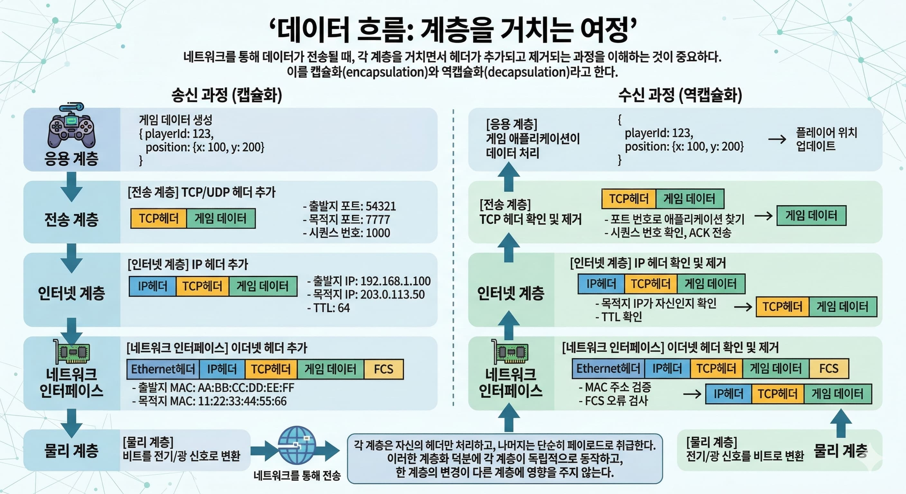  

---
  

## 게임 개발에서의 계층 모델 활용
게임 네트워크 프로그래밍에서 OSI/TCP-IP 계층 모델을 이해하는 것은 다음과 같은 실용적 이점을 제공한다:

**문제 진단의 체계화**  
플레이어가 "게임이 끊긴다"고 보고하면, 계층별로 접근하여 원인을 찾는다. 물리적 연결 문제인지, 네트워크 경로 문제인지, 방화벽 차단인지, 게임 서버 부하인지를 체계적으로 분석할 수 있다.

**프로토콜 선택과 설계**  
전송 계층에서 TCP와 UDP 중 무엇을 선택할지, 응용 계층에서 어떤 메시지 형식을 사용할지, 표현 계층에서 어떤 직렬화 방법을 적용할지를 결정할 때 계층 모델이 지침을 제공한다.

**성능 최적화**  
각 계층에서 발생하는 오버헤드를 이해하고 최소화할 수 있다. 예를 들어 작은 패킷을 자주 보내면 각 패킷마다 TCP/IP 헤더가 붙어 오버헤드가 크므로, 여러 메시지를 모아서 한 번에 전송하는 것이 효율적이다.

**보안 구현**  
표현 계층의 암호화, 전송 계층의 TLS, 응용 계층의 인증 등 각 계층에서 보안을 어떻게 구현할지 결정할 수 있다.

**인터페이스 설계**  
게임 엔진과 네트워크 모듈의 인터페이스를 설계할 때, 계층 모델을 참고하여 깨끗한 추상화를 만들 수 있다. 예를 들어 게임 로직은 응용 계층만 알고, 하위 계층은 네트워크 라이브러리가 처리하도록 분리한다.

---
  
**정리**  
OSI 7계층 모델과 TCP/IP 4계층 모델은 네트워크 통신을 이해하는 기본 틀이다. OSI 모델은 이론적이고 상세한 계층 분리를 제공하며, TCP/IP 모델은 실용적이고 실제 인터넷의 구현을 반영한다. 게임 개발자는 두 모델을 모두 이해하고, 문제를 진단할 때는 OSI 계층으로 분석하고, 구현할 때는 TCP/IP 스택을 사용하는 것이 효과적이다.

각 계층은 명확한 역할과 책임을 가지며, 하위 계층은 상위 계층에 서비스를 제공한다. 데이터는 송신 측에서 계층을 내려가면서 각 계층의 헤더로 캡슐화되고, 수신 측에서 계층을 올라가면서 역캡슐화된다. 이러한 계층적 구조 덕분에 복잡한 네트워크 통신을 관리 가능한 단위로 나누어 이해하고 구현할 수 있다.

다음 장에서는 이러한 계층들을 거쳐 패킷이 실제로 어떻게 여행하는지, 송신부터 수신까지의 전체 과정을 구체적으로 살펴볼 것이다. 계층 모델의 이론을 실제 데이터 흐름과 연결하여 이해하면, 네트워크 프로그래밍의 전체 그림이 명확해질 것이다.   
   
   

# Chapter. 3. 패킷의 여행: 송신부터 수신까지

**학습 이유**: 데이터가 실제로 전달되는 과정을 이해하면 네트워크 최적화와 디버깅이 쉬워진다

네트워크를 통해 데이터가 전달되는 과정은 마치 국제 택배를 보내는 것과 비슷하다. 물건을 보내기 위해 여러 단계의 포장을 하고, 각 물류 센터를 거치며, 최종 수신지에서 포장을 하나씩 풀어내는 과정을 거친다. 게임 데이터도 정확히 같은 방식으로 여행한다. 플레이어가 캐릭터를 움직이는 순간, 그 위치 정보는 여러 계층의 헤더로 포장되어 네트워크를 통과하고, 상대방의 컴퓨터에서 포장이 벗겨지면서 최종 데이터가 추출된다.

이 과정을 깊이 이해하면 왜 패킷이 손실되는지, 왜 지연이 발생하는지, 어떻게 최적화할 수 있는지를 파악할 수 있다. 게임 개발자에게 이것은 단순한 이론이 아니라 실전에서 반드시 필요한 지식이다.

---

## 📦 송신 과정 (캡슐화 - Encapsulation)
캡슐화는 데이터를 전송하기 위해 각 계층에서 필요한 제어 정보를 헤더로 추가하는 과정이다. 마치 러시아 인형처럼 데이터가 계층을 내려갈수록 점점 더 많은 포장지로 감싸진다고 생각하면 된다.

### 1단계: 응용 계층 - 데이터의 탄생
게임 애플리케이션에서 전송할 데이터가 생성된다. 예를 들어, FPS 게임에서 플레이어가 이동하면 다음과 같은 데이터가 만들어진다.

```
의사코드:
PlayerPositionData {
    player_id: 12345
    x: 100.5
    y: 200.3
    z: 50.0
    rotation: 45.2
    timestamp: 1234567890
}
```

이 단계에서는 순수한 게임 데이터만 존재한다. 아직 어떤 네트워크 헤더도 붙지 않은 상태다. 개발자가 직접 다루는 데이터가 바로 이 계층의 데이터다.

### 2단계: 전송 계층 - TCP/UDP 헤더 추가
응용 계층에서 내려온 데이터에 전송 계층 헤더가 추가된다. 게임이 TCP를 사용하는지 UDP를 사용하는지에 따라 헤더 내용이 달라진다.

**TCP를 사용하는 경우:**  
TCP 헤더에는 신뢰성 있는 통신을 위한 많은 정보가 포함된다. 출발지 포트 번호와 목적지 포트 번호는 어떤 애플리케이션이 데이터를 보내고 받는지 식별한다. 시퀀스 번호는 데이터의 순서를 보장하고, ACK 번호는 어디까지 데이터를 받았는지 확인한다. 플래그 필드는 연결 설정(SYN), 연결 종료(FIN), 데이터 확인(ACK) 등의 제어 정보를 담는다. 윈도우 크기는 흐름 제어를 위해 수신 버퍼의 여유 공간을 알려준다. 체크섬은 데이터 무결성을 검증한다.

```
의사코드:
TCP_Header {
    source_port: 50000          // 출발지 포트
    destination_port: 7777      // 게임 서버 포트
    sequence_number: 1001       // 순서 번호
    ack_number: 2001           // 확인 응답 번호
    flags: ACK | PSH           // 플래그
    window_size: 65535         // 윈도우 크기
    checksum: 0xABCD           // 체크섬
    urgent_pointer: 0
}
```

**UDP를 사용하는 경우:**  
UDP 헤더는 TCP에 비해 훨씬 단순하다. 단지 8바이트만 사용하며, 출발지 포트, 목적지 포트, 길이, 체크섬만 포함한다. 신뢰성 보장을 위한 어떤 메커니즘도 없다. 이것이 UDP가 빠른 이유다.

```
의사코드:
UDP_Header {
    source_port: 50000          // 출발지 포트
    destination_port: 7777      // 게임 서버 포트
    length: 50                  // 데이터 길이
    checksum: 0x1234           // 체크섬
}
```

이제 데이터는 **세그먼트(TCP)** 또는 **데이터그램(UDP)**이라고 불린다. 전송 계층의 역할은 프로세스 간 통신을 가능하게 하는 것이다.

### 3단계: 네트워크 계층 - IP 헤더 추가
전송 계층 세그먼트에 IP 헤더가 추가된다. IP 헤더는 패킷이 인터넷을 통해 목적지까지 찾아갈 수 있도록 주소 정보를 담는다.

IP 헤더에서 가장 중요한 것은 출발지 IP 주소와 목적지 IP 주소다. 이 주소를 기반으로 라우터들이 패킷을 전달할 경로를 결정한다. TTL(Time To Live)은 패킷이 무한히 순환하는 것을 방지하기 위한 생존 시간이다. 라우터를 거칠 때마다 1씩 감소하며, 0이 되면 패킷은 폐기된다. 프로토콜 번호는 상위 계층이 TCP인지 UDP인지 알려준다(TCP=6, UDP=17).

```
의사코드:
IP_Header {
    version: 4                      // IPv4
    header_length: 20               // 헤더 길이
    type_of_service: 0              // 서비스 타입
    total_length: 100               // 전체 길이
    identification: 54321           // 식별자
    flags: 0
    fragment_offset: 0              // 단편화 오프셋
    ttl: 64                         // 생존 시간
    protocol: 17                    // UDP (6=TCP, 17=UDP)
    header_checksum: 0x5678         // 헤더 체크섬
    source_ip: 192.168.1.100        // 출발지 IP
    destination_ip: 203.250.123.45  // 목적지 IP
}
```

이제 데이터는 **IP 패킷**이라고 불린다. 네트워크 계층의 역할은 호스트 간 통신, 즉 라우팅을 담당하는 것이다.

### 4단계: 데이터링크 계층 - 이더넷 헤더 추가
IP 패킷에 이더넷 헤더가 추가된다. 이더넷 헤더는 로컬 네트워크 내에서 실제 하드웨어 장치를 식별하는 MAC 주소를 담는다.

출발지 MAC 주소는 현재 컴퓨터의 네트워크 카드 주소다. 목적지 MAC 주소는 다음 홉(라우터 또는 최종 목적지)의 MAC 주소다. 중요한 점은 MAC 주소는 라우터를 거칠 때마다 변경된다는 것이다. IP 주소는 출발지부터 최종 목적지까지 그대로 유지되지만, MAC 주소는 각 로컬 네트워크 구간마다 바뀐다. EtherType 필드는 상위 프로토콜이 무엇인지 알려준다(0x0800 = IPv4, 0x86DD = IPv6).

```
의사코드:
Ethernet_Header {
    destination_mac: AA:BB:CC:DD:EE:FF  // 목적지 MAC 주소
    source_mac: 11:22:33:44:55:66       // 출발지 MAC 주소
    ethertype: 0x0800                    // IPv4
}
```

패킷 끝에는 **FCS(Frame Check Sequence)**가 추가된다. 이것은 프레임 전송 중 오류가 발생했는지 검사하는 4바이트 체크섬이다.

```
의사코드:
Ethernet_Trailer {
    fcs: 0x12345678  // 프레임 체크 시퀀스
}
```

이제 데이터는 **이더넷 프레임**이라고 불린다. 데이터링크 계층의 역할은 직접 연결된 노드 간 신뢰성 있는 전송을 보장하는 것이다.

### 5단계: 물리 계층 - 신호 변환
마지막으로 디지털 데이터가 물리적 신호로 변환된다. 유선 이더넷을 사용한다면 전기 신호로 변환되어 케이블을 통해 전송된다. Wi-Fi를 사용한다면 전파로 변환되어 공기 중을 통해 전달된다. 광케이블을 사용한다면 빛의 점멸로 변환된다.

물리 계층은 비트 스트림을 물리적 매체를 통해 전송하는 역할을 담당한다. 이 단계에서는 더 이상 프레임이나 패킷이라는 개념이 없고, 순수한 0과 1의 연속일 뿐이다.

---
  

## 🌐 네트워크 전송 과정
이제 캡슐화된 프레임이 실제로 네트워크를 통해 어떻게 이동하는지 살펴본다.

### 1. 로컬 네트워크 내 전송
패킷이 같은 네트워크 내의 장비로 전송될 때는 스위치를 통해 전달된다. 컴퓨터는 먼저 목적지 IP 주소가 같은 네트워크에 있는지 확인한다. 서브넷 마스크를 사용해 목적지가 로컬 네트워크 내부인지 외부인지 판단한다.

목적지가 같은 네트워크에 있다면 ARP(Address Resolution Protocol)를 사용해 목적지 IP에 해당하는 MAC 주소를 찾는다. ARP는 브로드캐스트 방식으로 "이 IP 주소의 MAC 주소가 뭐야?"라고 네트워크 전체에 물어본다. 해당 IP를 가진 장비가 "내 MAC 주소는 이거야"라고 응답하면, 출발지는 이 정보를 ARP 캐시에 저장한다.

이제 프레임이 생성되어 스위치로 전송된다. 스위치는 MAC 주소 테이블을 조회해 목적지 MAC 주소가 어느 포트에 연결되어 있는지 확인하고, 해당 포트로만 프레임을 전달한다. 이것을 스위칭이라고 한다. 허브와 달리 스위치는 모든 포트로 브로드캐스트하지 않고 목적지 포트로만 전송하므로 효율적이다.

```
ASCII 다이어그램:

[PC A]                    [PC B]
  |                          |
  | ARP Request (Broadcast)  |
  |------------------------->|
  |                          |
  | ARP Reply                |
  |<-------------------------|
  |                          |
  | Data Frame               |
  |------------------------->|
  |        (Switched)        |
```

### 2. 라우터 통과 - 인터넷으로 나가기
목적지가 다른 네트워크에 있다면 패킷은 라우터를 거쳐야 한다. 라우터는 네트워크와 네트워크를 연결하는 장비로, 패킷을 최적의 경로로 전달하는 역할을 한다.

컴퓨터는 목적지가 외부 네트워크라고 판단하면, 프레임의 목적지 MAC 주소를 게이트웨이(기본 라우터)의 MAC 주소로 설정한다. 주목할 점은 IP 패킷 내부의 목적지 IP는 최종 목적지이지만, 이더넷 프레임의 목적지 MAC은 다음 홉인 라우터의 MAC 주소라는 것이다.

라우터는 프레임을 받으면 이더넷 헤더를 벗긴다. 그리고 IP 헤더를 확인해 목적지 IP 주소를 본다. 라우팅 테이블을 조회해 이 IP로 가려면 다음에 어느 라우터로 보내야 하는지(Next Hop) 결정한다. 라우팅 테이블은 목적지 네트워크와 그 네트워크로 가기 위한 다음 홉의 주소를 매핑한 표다.

라우터는 TTL 값을 1 감소시킨다. 만약 TTL이 0이 되면 패킷을 폐기하고 ICMP Time Exceeded 메시지를 출발지에 보낸다. 이것은 무한 루프를 방지하기 위한 안전장치다.

그런 다음 라우터는 새로운 이더넷 프레임을 생성한다. 출발지 MAC 주소는 라우터 자신의 MAC 주소가 되고, 목적지 MAC 주소는 다음 홉 라우터의 MAC 주소가 된다. IP 패킷은 그대로 유지되지만, 이더넷 프레임은 라우터를 거칠 때마다 새로 생성된다.

```
ASCII 다이어그램:

[PC]--------[Router 1]--------[Router 2]--------[Router 3]--------[Server]
   Ethernet     │                │                │              Ethernet
   Frame        │                │                │              Frame
   (PC→R1)      │                │                │              (R3→Server)
                │                │                │
         IP Packet (PC → Server) 유지됨
         
각 구간마다:
- Ethernet Frame 새로 생성 (MAC 주소 변경)
- IP Packet 유지 (IP 주소 불변)
- TTL 1씩 감소
```

**라우터에서 일어나는 일:**

```
의사코드:
라우터 처리 과정:

1. 프레임 수신
2. FCS 검사 (오류 확인)
3. 이더넷 헤더 제거
4. IP 헤더 확인
   - 목적지 IP 추출
   - TTL 확인 및 감소
   - 체크섬 재계산
5. 라우팅 테이블 조회
   IF 목적지 == 직접 연결된 네트워크 THEN
       ARP로 목적지 MAC 찾기
   ELSE
       라우팅 테이블에서 Next Hop 찾기
       ARP로 Next Hop의 MAC 찾기
6. 새 이더넷 프레임 생성
   - 출발지 MAC = 현재 라우터 인터페이스 MAC
   - 목적지 MAC = Next Hop MAC
7. 프레임 전송
```
  
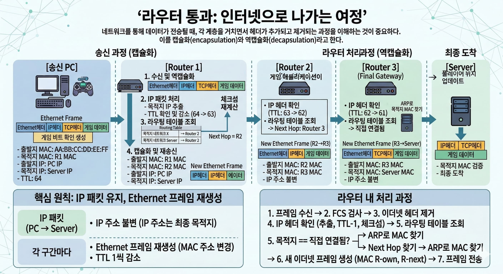  

### 3. 인터넷 백본 통과
패킷은 여러 ISP(Internet Service Provider)의 라우터들을 거치며 인터넷 백본을 통과한다. 각 라우터는 BGP(Border Gateway Protocol) 같은 라우팅 프로토콜을 사용해 최적의 경로를 찾는다.

인터넷은 AS(Autonomous System)라는 관리 도메인으로 구성되어 있다. 각 ISP는 하나 이상의 AS를 운영한다. BGP는 AS 간 경로를 교환하는 프로토콜로, 인터넷 전체의 경로 정보를 관리한다.

패킷은 수많은 홉을 거치며 최종 목적지에 가까워진다. 각 라우터는 자신의 라우팅 테이블을 기반으로 독립적으로 전달 결정을 내린다. 이것을 홉-바이-홉(hop-by-hop) 라우팅이라고 한다.

```
ASCII 다이어그램:

[당신의 PC]
    |
[가정용 공유기] (첫 홉)
    |
[ISP 액세스 라우터]
    |
[ISP 코어 라우터] ---- BGP 경로 교환 ----
    |                                    |
[ISP 경계 라우터]                  [다른 ISP]
    |                                    |
[인터넷 백본]                            |
    |_____________________________________|
    |
[목적지 ISP]
    |
[게임 서버 라우터]
    |
[게임 서버]
```
  
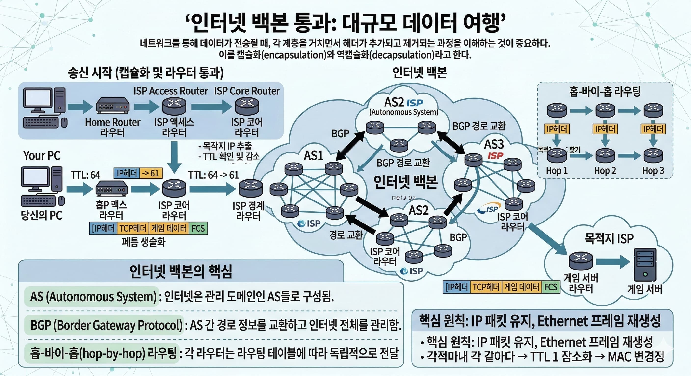  

---
  

## 📥 수신 과정 (역캡슐화 - Decapsulation)
패킷이 목적지에 도착하면 송신 과정의 반대로 각 계층의 헤더가 하나씩 벗겨진다. 이것을 역캡슐화라고 한다.

### 1단계: 물리 계층 - 신호 수신
네트워크 인터페이스 카드(NIC)가 물리적 신호를 감지한다. 전기 신호, 전파, 또는 빛의 패턴이 디지털 비트 스트림으로 변환된다. 이 과정에서 신호 잡음이나 간섭으로 인한 비트 오류가 발생할 수 있다.

### 2단계: 데이터링크 계층 - 프레임 검증
비트 스트림이 이더넷 프레임으로 재구성된다. 먼저 프레임의 목적지 MAC 주소를 확인한다. 자신의 MAC 주소가 아니면 프레임을 폐기한다(프로미스큐어스 모드가 아닌 경우).

FCS(Frame Check Sequence)를 계산해 전송 중 오류가 있는지 확인한다. 수신한 데이터로 체크섬을 계산하고, 프레임 끝의 FCS 값과 비교한다. 값이 다르면 프레임이 손상된 것이므로 폐기한다.

검증이 완료되면 이더넷 헤더와 트레일러를 제거하고, IP 패킷을 상위 계층으로 전달한다.

```
의사코드:
데이터링크 계층 처리:

1. 프레임 수신
2. 목적지 MAC 주소 확인
   IF 목적지 MAC ≠ 내 MAC AND 목적지 MAC ≠ 브로드캐스트 THEN
       프레임 폐기
       RETURN
3. FCS 검증
   calculated_fcs = compute_fcs(frame_data)
   IF calculated_fcs ≠ frame.fcs THEN
       프레임 폐기 (오류 검출)
       RETURN
4. 이더넷 헤더 제거
5. EtherType 확인 (IPv4/IPv6)
6. IP 패킷을 네트워크 계층으로 전달
```

### 3단계: 네트워크 계층 - IP 처리
IP 패킷 헤더를 확인한다. 목적지 IP 주소가 자신의 IP 주소인지 확인한다. 아니라면 라우팅이 잘못된 것이므로 패킷을 폐기한다(일반 호스트의 경우).

IP 헤더 체크섬을 검증해 헤더가 손상되지 않았는지 확인한다. 패킷이 단편화되어 있다면 모든 조각을 모아 재조립한다. IP는 MTU(Maximum Transmission Unit) 크기 제한 때문에 큰 패킷을 여러 조각으로 나눌 수 있다. 수신측은 Identification 필드와 Fragment Offset을 사용해 조각들을 올바른 순서로 재조립한다.

프로토콜 필드를 확인해 상위 계층이 TCP인지 UDP인지 판단하고, IP 헤더를 제거한 후 해당 전송 계층 프로토콜로 세그먼트를 전달한다.

```
의사코드:
네트워크 계층 처리:

1. IP 헤더 추출
2. 목적지 IP 확인
   IF 목적지 IP ≠ 내 IP THEN
       패킷 폐기
       RETURN
3. 헤더 체크섬 검증
4. TTL 확인 (0이면 폐기)
5. 단편화 확인
   IF 패킷이 단편화되어 있음 THEN
       fragment_buffer에 저장
       IF 모든 조각이 도착함 THEN
           패킷 재조립
       ELSE
           대기 (타임아웃 설정)
           RETURN
6. IP 헤더 제거
7. 프로토콜 필드 확인 (TCP=6, UDP=17)
8. 세그먼트를 전송 계층으로 전달
```

### 4단계: 전송 계층 - TCP/UDP 처리
전송 계층에서는 TCP와 UDP의 처리 방식이 크게 다르다.

**TCP 처리:**  
TCP는 연결 지향 프로토콜이므로 복잡한 처리 과정을 거친다. 먼저 목적지 포트 번호로 해당 소켓을 찾는다. 시퀀스 번호를 확인해 데이터의 순서를 검증한다. 만약 순서가 뒤바뀐 세그먼트가 도착하면 버퍼에 임시 저장하고, 올바른 순서가 될 때까지 기다린다.

체크섬을 검증해 데이터 무결성을 확인한다. 수신한 세그먼트에 대해 ACK를 보내 송신측에 정상 수신을 알린다. 수신 윈도우를 업데이트해 송신측에 자신의 버퍼 여유 공간을 알려준다.

모든 검증이 완료되면 TCP 헤더를 제거하고, 데이터를 수신 버퍼에 저장한다. 애플리케이션이 read/recv 시스템 콜을 호출할 때까지 버퍼에 데이터를 보관한다.

```
의사코드:
TCP 세그먼트 처리:

1. TCP 헤더 파싱
2. 목적지 포트로 소켓 찾기
3. 체크섬 검증
4. 시퀀스 번호 확인
   expected_seq = connection.next_expected_seq
   IF segment.seq == expected_seq THEN
       데이터를 수신 버퍼에 추가
       connection.next_expected_seq += segment.data_length
       
       // 버퍼에 대기 중인 다음 세그먼트 확인
       WHILE 버퍼에 next_expected_seq 존재 DO
           해당 세그먼트를 수신 버퍼에 추가
           next_expected_seq 업데이트
   ELSE IF segment.seq > expected_seq THEN
       // 미래의 세그먼트 (순서 뒤바뀜)
       out_of_order_buffer에 저장
   ELSE
       // 이미 받은 세그먼트 (중복)
       폐기
       
5. ACK 전송
   send_ack(connection.next_expected_seq)
   
6. 수신 윈도우 업데이트
7. TCP 헤더 제거
8. 데이터를 애플리케이션 계층으로 전달
```

**UDP 처리:**

UDP는 훨씬 단순하다. 목적지 포트 번호로 소켓을 찾고, 체크섬만 간단히 검증한다. 순서 보장, 재전송, 흐름 제어 같은 것은 전혀 하지 않는다. UDP 헤더를 제거하고 바로 데이터를 애플리케이션 버퍼에 전달한다.

```
의사코드:
UDP 데이터그램 처리:

1. UDP 헤더 파싱
2. 목적지 포트로 소켓 찾기
3. 체크섬 검증 (선택적)
   IF 체크섬 오류 THEN
       데이터그램 폐기
       RETURN
4. UDP 헤더 제거
5. 데이터를 즉시 애플리케이션 버퍼에 전달
   (순서 보장 없음, 재전송 없음)
```

### 5단계: 응용 계층 - 애플리케이션 수신
마침내 순수한 애플리케이션 데이터가 프로그램에 전달된다. 게임 클라이언트는 recv() 또는 recvfrom() 같은 시스템 콜을 호출해 데이터를 읽는다.

받은 데이터를 역직렬화해서 게임 내부 구조체로 변환한다. 예를 들어, 바이너리 데이터나 JSON을 파싱해 PlayerPosition 객체를 만든다. 그리고 해당 플레이어의 캐릭터를 새로운 위치로 이동시킨다.

```
의사코드:
애플리케이션 수신:

1. socket.receive() 호출
2. 수신 버퍼에서 데이터 읽기
3. 데이터 역직렬화
   player_data = deserialize(received_bytes)
   
4. 게임 상태 업데이트
   player = find_player(player_data.player_id)
   player.position.x = player_data.x
   player.position.y = player_data.y
   player.position.z = player_data.z
   player.rotation = player_data.rotation
   
5. 화면에 렌더링
   render_player(player)
```

---
  

## 🔄 전체 과정 시각화
패킷의 전체 여행을 한눈에 보면 다음과 같다.
  
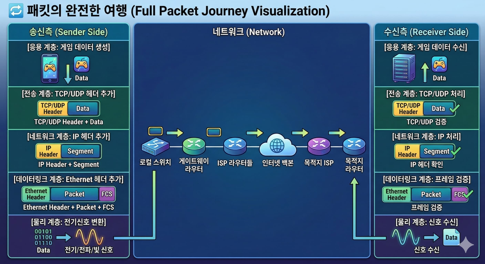  

---
  

## 🎮 게임 개발자 관점에서의 이해
이 모든 과정을 이해하면 다음과 같은 실전 문제를 해결할 수 있다.

**패킷 손실 디버깅:** UDP를 사용하는 게임에서 플레이어 위치가 가끔 튀는 현상이 발생한다면, 데이터링크 계층의 FCS 오류나 네트워크 혼잡으로 인한 패킷 드롭을 의심할 수 있다. 물리 계층의 신호 간섭, 라우터의 버퍼 오버플로우, 또는 방화벽의 패킷 필터링일 수도 있다.

**지연 시간 분석:** 네트워크 지연은 여러 계층에서 발생한다. 전송 계층에서 TCP의 재전송 타이머, 네트워크 계층에서 각 라우터의 처리 지연과 큐잉 지연, 물리 계층에서 전파 지연이 모두 누적된다. traceroute 도구로 각 홉의 지연을 측정할 수 있다.

**MTU와 단편화 문제:** 큰 패킷을 보냈는데 전송이 느려진다면 경로 상의 MTU가 작아서 패킷이 단편화되고 있을 수 있다. 단편화는 추가 오버헤드를 발생시키고, 하나의 조각이라도 손실되면 전체 패킷을 재전송해야 한다. Path MTU Discovery를 사용하거나 애초에 작은 패킷을 보내는 것이 좋다.

**NAT 통과:** P2P 게임을 만들 때 NAT 라우터 뒤의 클라이언트들이 서로 직접 연결하지 못하는 문제는 네트워크 계층과 전송 계층의 주소 변환 메커니즘을 이해해야 해결할 수 있다. STUN, TURN, ICE 같은 NAT 통과 기술을 사용해야 한다.

**보안 고려사항:** 각 계층에서 보안 위협이 존재한다. 물리 계층에서 도청, 데이터링크 계층에서 MAC 스푸핑, 네트워크 계층에서 IP 스푸핑, 전송 계층에서 포트 스캐닝, 응용 계층에서 프로토콜 공격이 가능하다. 암호화는 주로 전송 계층(TLS) 또는 응용 계층에서 구현한다.

패킷의 여행을 이해하는 것은 단순히 이론적 지식이 아니라, 실제 게임 개발 현장에서 네트워크 문제를 진단하고 해결하는 데 필수적인 기반 지식이다. 이제 여러분은 플레이어가 버튼을 누르는 순간부터 그 입력이 서버를 거쳐 다른 플레이어의 화면에 나타나기까지의 전 과정을 깊이 이해하게 되었다.

   

# Chapter. 4. 네트워크 주요 개념
네트워크의 기본 동작 원리를 이해했다면, 이제 실제로 데이터가 어떻게 식별되고 전달되는지에 대한 핵심 개념들을 배울 차례다. 이 장에서는 게임 개발자가 반드시 알아야 할 네트워크의 주요 개념들을 다룬다. IP 주소 체계, 포트, DNS, 라우팅 등은 단순히 이론적인 지식이 아니라 실제 게임 서버를 구축하고 디버깅하는 데 매일 사용하는 필수 도구들이다.

---

## IP 주소 체계

**학습 이유**: 네트워크 식별과 라우팅의 기본  
IP 주소는 네트워크 상에서 컴퓨터를 고유하게 식별하는 주소 체계다. 마치 우편 시스템에서 집 주소가 필요한 것처럼, 네트워크에서 데이터를 전달하려면 목적지의 IP 주소를 알아야 한다. 게임 개발자에게 IP 주소 체계를 이해하는 것은 서버 설정, 네트워크 디버깅, 그리고 멀티플레이 연결 문제 해결의 기초가 된다.

### IPv4: 32비트 주소 체계  
IPv4는 현재 가장 널리 사용되는 IP 주소 체계다. 32비트로 구성되어 있으며, 사람이 읽기 쉽도록 8비트씩 4개의 십진수로 표기한다. 예를 들어 `192.168.1.1`은 실제로는 `11000000.10101000.00000001.00000001`이라는 이진수다.

32비트로 표현할 수 있는 주소는 약 43억 개다. 이 숫자가 처음에는 충분해 보였지만, 인터넷이 폭발적으로 성장하면서 주소가 부족해지는 문제가 발생했다. 이것이 NAT과 사설 IP가 등장한 이유이며, 궁극적으로는 IPv6가 필요하게 된 배경이다.

```
IPv4 주소 구조:

192.168.1.1
│   │   │ │
│   │   │ └─ 호스트 부분 (Host)
│   │   └─── 호스트 부분
│   └─────── 네트워크 부분 (Network)
└─────────── 네트워크 부분

이진수 표현:
11000000.10101000.00000001.00000001
```

### 클래스 기반 주소 체계
초기 IPv4는 클래스 기반 주소 체계를 사용했다. 네트워크의 규모에 따라 클래스 A, B, C, D, E로 구분했다.

**클래스 A**: 첫 번째 비트가 0으로 시작하며, 범위는 `0.0.0.0 ~ 127.255.255.255`다. 첫 8비트가 네트워크 부분이고 나머지 24비트가 호스트 부분이다. 따라서 하나의 클래스 A 네트워크는 약 1,677만 개의 호스트를 수용할 수 있다. 초대형 조직을 위한 주소 체계였지만, 너무 크기 때문에 낭비가 심했다.

**클래스 B**: 첫 두 비트가 10으로 시작하며, 범위는 `128.0.0.0 ~ 191.255.255.255`다. 앞의 16비트가 네트워크 부분이고 뒤의 16비트가 호스트 부분이다. 하나의 네트워크에 약 65,536개의 호스트를 수용할 수 있다. 중대형 조직에 적합하다.

**클래스 C**: 첫 세 비트가 110으로 시작하며, 범위는 `192.0.0.0 ~ 223.255.255.255`다. 앞의 24비트가 네트워크 부분이고 마지막 8비트만 호스트 부분이다. 하나의 네트워크에 254개의 호스트만 수용할 수 있다. 소규모 조직에 적합하다.

**클래스 D**: 멀티캐스트용으로 예약된 주소 범위(`224.0.0.0 ~ 239.255.255.255`)다. 일대다 통신에 사용된다.

**클래스 E**: 실험용으로 예약된 주소 범위(`240.0.0.0 ~ 255.255.255.255`)다. 일반적으로 사용되지 않는다.

```
클래스별 주소 구조:

Class A:  0xxxxxxx.xxxxxxxx.xxxxxxxx.xxxxxxxx
          [Network][    Host          ]
          
Class B:  10xxxxxx.xxxxxxxx.xxxxxxxx.xxxxxxxx
          [   Network   ][    Host    ]
          
Class C:  110xxxxx.xxxxxxxx.xxxxxxxx.xxxxxxxx
          [      Network      ][ Host ]
```

### 서브넷 마스크
서브넷 마스크는 IP 주소의 어디까지가 네트워크 부분이고 어디부터가 호스트 부분인지 구분하는 비트 마스크다. 서브넷 마스크를 사용하면 클래스 기반 체계의 제약을 벗어나 네트워크를 유연하게 분할할 수 있다.

서브넷 마스크는 IP 주소와 같은 형식으로 표기되며, 네트워크 부분에 해당하는 비트는 1, 호스트 부분에 해당하는 비트는 0으로 설정한다. 예를 들어 `255.255.255.0`은 이진수로 `11111111.11111111.11111111.00000000`이며, 앞의 24비트가 네트워크 부분임을 의미한다.

IP 주소와 서브넷 마스크를 AND 연산하면 네트워크 주소를 얻을 수 있다. 이를 통해 두 IP가 같은 네트워크에 있는지 판단할 수 있다.

```
서브넷 마스크 예시:

IP 주소:         192.168.1.100
서브넷 마스크:    255.255.255.0

이진수 AND 연산:
  11000000.10101000.00000001.01100100  (IP 주소)
& 11111111.11111111.11111111.00000000  (서브넷 마스크)
  ─────────────────────────────────────
  11000000.10101000.00000001.00000000  (네트워크 주소)
  
결과: 192.168.1.0 (네트워크 주소)
```

### CIDR 표기법
CIDR(Classless Inter-Domain Routing)는 클래스 없는 주소 체계로, 더 유연한 네트워크 분할을 가능하게 한다. IP 주소 뒤에 슬래시와 네트워크 비트 수를 붙여 표기한다.

예를 들어 `192.168.1.0/24`는 앞의 24비트가 네트워크 부분이고 뒤의 8비트가 호스트 부분임을 의미한다. 이는 서브넷 마스크 `255.255.255.0`과 동일하다. `/24`는 254개의 사용 가능한 호스트 주소를 제공한다(0과 255는 예약되어 있다).

CIDR을 사용하면 네트워크를 임의의 크기로 나눌 수 있다. `/25`는 126개의 호스트, `/26`은 62개의 호스트, `/30`은 2개의 호스트만 수용한다. 게임 서버 인프라를 구축할 때 서브넷을 효율적으로 나누기 위해 CIDR 표기법을 이해하는 것이 중요하다.

```
CIDR 표기법 예시:

192.168.1.0/24   → 256개 주소 (254개 사용 가능)
192.168.1.0/25   → 128개 주소 (126개 사용 가능)
192.168.1.0/26   → 64개 주소 (62개 사용 가능)
192.168.1.0/27   → 32개 주소 (30개 사용 가능)
192.168.1.0/28   → 16개 주소 (14개 사용 가능)
192.168.1.0/30   → 4개 주소 (2개 사용 가능, 주로 라우터 간 연결용)

의사코드:
사용 가능한 호스트 수 = 2^(32 - 프리픽스 길이) - 2

예: /24 네트워크
    = 2^(32-24) - 2
    = 2^8 - 2
    = 256 - 2
    = 254개
```

### IPv6: 128비트 주소 체계
IPv6는 IPv4의 주소 고갈 문제를 해결하기 위해 등장한 차세대 IP 프로토콜이다. 128비트로 구성되어 있어 약 $$3.4 \times 10^{38}$$개의 주소를 표현할 수 있다. 이는 사실상 무한대에 가까운 숫자다.

IPv6 주소는 16비트씩 8개의 그룹으로 나뉘며, 각 그룹은 16진수 4자리로 표기하고 콜론으로 구분한다. 예를 들어 `2001:0db8:85a3:0000:0000:8a2e:0370:7334`처럼 표기한다.

연속된 0은 `::`로 축약할 수 있다. 단, 이 축약은 주소 내에서 한 번만 사용할 수 있다. 예를 들어 `2001:0db8:85a3::8a2e:0370:7334`처럼 쓸 수 있다. 각 그룹 내의 앞자리 0도 생략할 수 있다.

```
IPv6 주소 표기:

전체 표기:
2001:0db8:85a3:0000:0000:8a2e:0370:7334

축약 표기:
2001:db8:85a3::8a2e:370:7334

루프백 주소:
0000:0000:0000:0000:0000:0000:0000:0001
→ ::1

모든 주소 (any):
0000:0000:0000:0000:0000:0000:0000:0000
→ ::
```

IPv6는 NAT이 필요 없고, 보안 기능이 내장되어 있으며, 자동 설정(SLAAC)을 지원한다. 하지만 현재는 IPv4와 IPv6가 공존하는 전환기이며, 게임 개발자는 두 프로토콜을 모두 고려해야 한다. 듀얼 스택(IPv4와 IPv6 동시 지원)을 구현하거나, IPv6 전용 네트워크를 위한 대비가 필요하다.

### 공인 IP vs 사설 IP
IP 주소는 크게 공인 IP(Public IP)와 사설 IP(Private IP)로 나뉜다. 이 구분은 IPv4 주소 부족 문제를 완화하기 위한 핵심 메커니즘이다.

**공인 IP**는 인터넷에서 전 세계적으로 고유한 주소다. ISP(Internet Service Provider)가 할당하며, 인터넷 상의 모든 장비가 이 주소로 접근할 수 있다. 게임 서버를 공개적으로 운영하려면 공인 IP가 필요하다.

**사설 IP**는 로컬 네트워크 내에서만 사용하는 주소다. 인터넷으로 직접 라우팅되지 않으며, RFC 1918에서 다음 세 가지 대역을 사설 IP로 예약했다.

- **10.0.0.0 ~ 10.255.255.255** (`10.0.0.0/8`): 클래스 A 범위, 약 1,677만 개 주소
- **172.16.0.0 ~ 172.31.255.255** (`172.16.0.0/12`): 클래스 B 범위, 약 104만 개 주소
- **192.168.0.0 ~ 192.168.255.255** (`192.168.0.0/16`): 클래스 C 범위, 약 65,536개 주소

가정용 공유기는 대부분 `192.168.x.x` 대역을 사용한다. 기업 내부 네트워크는 `10.x.x.x` 대역을 많이 사용한다. 이 주소들은 여러 조직에서 중복해서 사용할 수 있다. 왜냐하면 로컬 네트워크 내부에서만 유효하기 때문이다.

```
네트워크 구조 예시:

인터넷 (공인 IP 공간)
    |
    | 공인 IP: 203.250.123.45
    |
[가정용 공유기/NAT]
    |
    | 사설 IP 대역: 192.168.1.0/24
    |
    ├─ PC1: 192.168.1.100
    ├─ PC2: 192.168.1.101
    ├─ 스마트폰: 192.168.1.102
    └─ 게임 콘솔: 192.168.1.103

모든 장비가 같은 공인 IP(203.250.123.45)를 공유함
```

### NAT (Network Address Translation)
NAT은 사설 IP와 공인 IP를 변환하는 기술이다. 가정이나 기업의 내부 네트워크는 사설 IP를 사용하고, 인터넷으로 나갈 때는 공유기나 라우터가 NAT을 통해 공인 IP로 변환한다.

NAT의 동작 방식은 다음과 같다. 내부 장비가 인터넷으로 패킷을 보낼 때, NAT 라우터는 출발지 IP를 사설 IP에서 공인 IP로 바꾼다. 동시에 출발지 포트도 고유한 값으로 매핑하여 NAT 테이블에 기록한다. 응답 패킷이 돌아오면 NAT 테이블을 조회하여 원래의 내부 IP와 포트로 변환하여 전달한다.

```
NAT 동작 과정:

1. 내부 장비가 외부로 패킷 전송
   출발: 192.168.1.100:50000
   목적: 8.8.8.8:80

2. NAT 라우터가 주소 변환
   출발: 203.250.123.45:12345  ← 변환됨
   목적: 8.8.8.8:80
   
   [NAT 테이블 기록]
   내부: 192.168.1.100:50000 ↔ 외부: 203.250.123.45:12345

3. 응답 패킷이 돌아옴
   출발: 8.8.8.8:80
   목적: 203.250.123.45:12345

4. NAT 라우터가 주소 역변환
   출발: 8.8.8.8:80
   목적: 192.168.1.100:50000  ← 변환됨
```

NAT의 종류는 여러 가지가 있다. **Full Cone NAT**은 가장 개방적이며, 일단 내부에서 외부로 매핑이 만들어지면 외부의 모든 장비가 그 매핑을 통해 내부로 접근할 수 있다. **Restricted Cone NAT**은 내부에서 한 번 통신한 외부 IP만 접근할 수 있다. **Port Restricted Cone NAT**은 IP뿐만 아니라 포트까지 일치해야 한다. **Symmetric NAT**은 가장 제한적이며, 목적지마다 다른 포트 매핑을 사용한다.
  
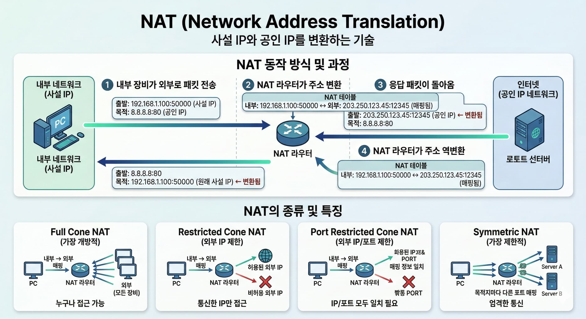  

### 포트 포워딩
포트 포워딩은 외부에서 내부 네트워크의 특정 장비로 접근할 수 있도록 NAT 설정을 고정하는 기술이다. 게임 서버를 가정에서 운영하거나, 특정 포트로 들어오는 연결을 내부 서버로 전달할 때 사용한다.

예를 들어 공유기의 공인 IP `203.250.123.45`의 포트 `7777`로 들어오는 모든 연결을 내부 IP `192.168.1.100`의 포트 `7777`로 전달하도록 설정할 수 있다. 이렇게 하면 외부 플레이어들이 `203.250.123.45:7777`로 접속하면 내부 게임 서버에 연결된다.

```
포트 포워딩 설정 예시:

공유기 설정:
외부 포트 7777 → 내부 IP 192.168.1.100:7777
외부 포트 7778 → 내부 IP 192.168.1.101:7778

의사코드:
IF 외부에서 203.250.123.45:7777로 패킷 도착 THEN
    목적지를 192.168.1.100:7777로 변경
    내부로 전달
```
  
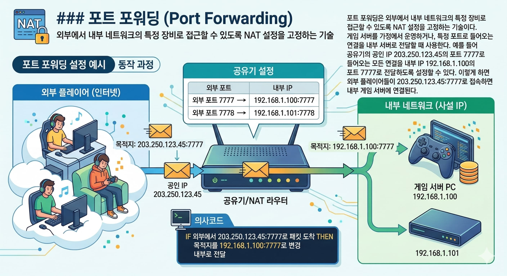   

### NAT 통과 (NAT Traversal) 문제
NAT은 보안과 주소 절약 측면에서 유용하지만, P2P 게임이나 음성 채팅 같은 양방향 통신에서는 큰 문제가 된다. 두 플레이어가 모두 NAT 뒤에 있으면 서로 직접 연결할 수 없다. 왜냐하면 둘 다 사설 IP를 가지고 있고, 외부에서 먼저 연결을 시도할 수 없기 때문이다.

이 문제를 해결하기 위한 여러 기술이 있다. **STUN(Session Traversal Utilities for NAT)**은 클라이언트가 자신의 공인 IP와 포트를 알아내는 프로토콜이다. **TURN(Traversal Using Relays around NAT)**은 직접 연결이 불가능할 때 중계 서버를 통해 데이터를 전달한다. **ICE(Interactive Connectivity Establishment)**는 STUN과 TURN을 결합하여 가능한 모든 연결 방법을 시도한다.

```
NAT 통과 시나리오:

[플레이어 A]           [STUN/TURN 서버]           [플레이어 B]
192.168.1.100          공인 IP 보유               192.168.2.100
NAT 뒤에 있음                                      NAT 뒤에 있음
    |                         |                         |
    |-- STUN 요청 ----------->|                         |
    |<- 공인 IP/Port 응답 ----|                         |
    |                         |<--------- STUN 요청 ----|
    |                         |-- 공인 IP/Port 응답 -->|
    |                         |                         |
    |-- 직접 연결 시도 ------------------------------>| (실패 가능)
    |                         |                         |
    |-- TURN으로 중계 요청 -->|                         |
    |                         |<-- TURN으로 중계 요청 --|
    |<== 중계 서버를 통한 통신 ==========================>|
```

게임 개발에서는 보통 다음과 같은 전략을 사용한다. 먼저 STUN으로 직접 P2P 연결을 시도하고, 실패하면 TURN 서버로 중계한다. 또는 아예 클라이언트-서버 모델을 사용하여 NAT 문제를 원천적으로 회피한다. 상용 게임 대부분은 중앙 서버를 두어 NAT 문제를 피한다.
  
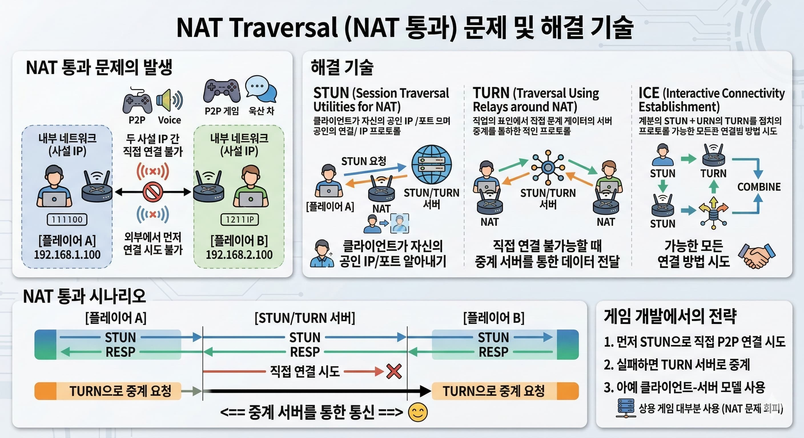   

---

## 포트 (Port)

**학습 이유**: 하나의 IP 주소에서 여러 애플리케이션 구분  
IP 주소가 컴퓨터를 식별한다면, 포트 번호는 그 컴퓨터 내의 특정 애플리케이션 또는 서비스를 식별한다. 하나의 컴퓨터에서 웹 서버, 게임 서버, 데이터베이스 서버가 동시에 실행될 수 있는 것은 각각 다른 포트를 사용하기 때문이다.

포트는 16비트 숫자로 표현되며, 범위는 0부터 65535까지다. 전송 계층(TCP/UDP)에서 사용되며, IP 주소와 포트 번호를 합쳐 **소켓(Socket)**이라고 부른다. 예를 들어 `192.168.1.100:7777`은 IP 주소 `192.168.1.100`의 포트 `7777`을 의미한다.

### 포트 번호 범위와 분류
포트는 용도에 따라 세 가지 범위로 분류된다.

**Well-known Ports (0-1023)**: 널리 알려진 표준 서비스를 위해 IANA(Internet Assigned Numbers Authority)가 예약한 포트다. 시스템 권한(root/admin)이 필요하며, 일반적으로 서버 애플리케이션이 사용한다. 대표적인 예는 다음과 같다.

- HTTP: 포트 80 (웹 서버)
- HTTPS: 포트 443 (암호화된 웹 서버)
- FTP: 포트 21 (파일 전송 프로토콜)
- SSH: 포트 22 (보안 셸)
- SMTP: 포트 25 (이메일 전송)
- DNS: 포트 53 (도메인 이름 서비스)
- POP3: 포트 110 (이메일 수신)
- IMAP: 포트 143 (이메일 수신)

**Registered Ports (1024-49151)**: 특정 애플리케이션이나 서비스를 위해 등록된 포트다. IANA에 등록할 수 있지만 강제는 아니다. 많은 상용 애플리케이션과 게임이 이 범위를 사용한다. 대표적인 예는 다음과 같다.

- MySQL: 포트 3306
- PostgreSQL: 포트 5432
- Redis: 포트 6379
- Minecraft: 포트 25565
- Steam: 다양한 포트 범위 사용

**Dynamic/Private Ports (49152-65535)**: 클라이언트가 임시로 사용하는 동적 포트(Ephemeral Ports)다. 클라이언트가 서버에 연결할 때 운영체제가 자동으로 할당한다. 서버는 잘 알려진 포트에서 대기하지만, 클라이언트는 임시 포트를 사용한다.

```
포트 사용 예시:

[게임 클라이언트]              [게임 서버]
IP: 192.168.1.100              IP: 203.250.123.45
Port: 51234 (임시 할당)        Port: 7777 (고정)
    |                              |
    |--- 연결 요청 (51234→7777) -->|
    |<-- 응답 (7777→51234) ---------|
    |                              |

의사코드:
클라이언트:
    socket = create_socket()
    source_port = OS가 자동 할당 (49152-65535 범위)
    connect(socket, server_ip="203.250.123.45", server_port=7777)

서버:
    socket = create_socket()
    bind(socket, port=7777)  // 고정 포트에 바인딩
    listen(socket)
    while true:
        client = accept(socket)
        handle_client(client)
```

### 소켓 (Socket) = IP 주소 + 포트 번호
네트워크 통신의 종단점(Endpoint)을 소켓이라고 한다. 소켓은 IP 주소와 포트 번호의 조합으로 표현된다. 예를 들어 `192.168.1.100:7777`은 하나의 소켓이다.

TCP 연결은 실제로 네 가지 정보로 고유하게 식별된다.

- 출발지 IP 주소
- 출발지 포트 번호
- 목적지 IP 주소
- 목적지 포트 번호

이 네 가지를 합쳐 **4-tuple**이라고 부르며, 이것이 하나의 TCP 연결을 고유하게 식별한다. 같은 서버 포트에 수천 명의 클라이언트가 동시에 연결할 수 있는 이유는 각 클라이언트의 IP와 포트가 다르기 때문이다.

```
동시 다중 연결 예시:

게임 서버 (203.250.123.45:7777)
    |
    ├─ 연결 1: 클라이언트 A (192.168.1.100:51234) ↔ 서버 (203.250.123.45:7777)
    ├─ 연결 2: 클라이언트 B (192.168.1.101:51235) ↔ 서버 (203.250.123.45:7777)
    ├─ 연결 3: 클라이언트 C (10.0.0.50:52000) ↔ 서버 (203.250.123.45:7777)
    └─ 연결 4: 클라이언트 D (172.16.0.10:51300) ↔ 서버 (203.250.123.45:7777)

각 연결은 4-tuple로 고유하게 식별됨
```

### 게임 서버 포트 선택 가이드
게임 서버를 개발할 때 포트를 어떻게 선택해야 할까? 다음 가이드라인을 고려한다.

**1024 이상의 포트를 사용한다**: Well-known 포트는 피하고, 관리자 권한 없이 사용할 수 있는 1024 이상의 포트를 선택한다.

**잘 알려진 다른 서비스의 포트를 피한다**: 예를 들어 MySQL의 3306, PostgreSQL의 5432 같은 포트는 피한다.

**방화벽 친화적인 포트를 고려한다**: 일부 기업 방화벽은 특정 포트 범위만 허용한다. 가능하면 10000 이상의 포트를 사용하는 것이 좋다.

**여러 포트를 사용할 수 있도록 설계한다**: 하나의 서버에 여러 게임 인스턴스를 실행할 경우를 대비해 포트를 설정 파일로 관리한다.

**UDP와 TCP를 구분한다**: 같은 포트 번호를 TCP와 UDP에서 동시에 사용할 수 있다. 포트 번호는 각 프로토콜에서 독립적이다.

```
의사코드:
게임 서버 설정 예시:

config = {
    tcp_port: 7777,        // 로그인, 채팅 등
    udp_port: 7777,        // 실시간 위치 동기화
    http_api_port: 8080,   // RESTful API
    websocket_port: 8081,  // 웹 클라이언트용
    admin_port: 9000       // 관리자 인터페이스
}

server_start(config):
    tcp_socket = bind_tcp(config.tcp_port)
    udp_socket = bind_udp(config.udp_port)
    http_server = start_http(config.http_api_port)
    ws_server = start_websocket(config.websocket_port)
    admin_server = start_admin(config.admin_port)
```

---

## DNS (Domain Name System)

**학습 이유**: 도메인 이름을 IP 주소로 변환  
사람은 숫자보다 이름을 기억하기 쉽다. `203.250.123.45`보다는 `game.example.com`이 훨씬 기억하기 쉽다. DNS는 도메인 이름을 IP 주소로 변환하는 인터넷의 전화번호부 역할을 한다. 게임 클라이언트가 서버에 연결할 때 도메인 이름을 사용하면 서버 IP가 변경되어도 클라이언트 업데이트 없이 대응할 수 있다.

### DNS 조회 과정
사용자가 웹 브라우저나 게임 클라이언트에서 `game.example.com`에 접속하려고 할 때, 내부적으로 다음과 같은 DNS 조회 과정이 일어난다.

**1단계: 로컬 캐시 확인** - 운영체제는 먼저 자신의 DNS 캐시를 확인한다. 최근에 조회한 도메인이라면 캐시에 저장되어 있어 즉시 반환한다.

**2단계: 리졸버(Resolver)에 질의** - 캐시에 없으면 설정된 DNS 리졸버(보통 ISP의 DNS 서버 또는 Google의 8.8.8.8)에 질의한다.

**3단계: 루트 네임서버 질의** - 리졸버는 루트 네임서버에 질의한다. 루트 서버는 `.com` 도메인을 담당하는 TLD(Top-Level Domain) 서버의 주소를 알려준다.

**4단계: TLD 네임서버 질의** - 리졸버는 `.com` TLD 서버에 질의한다. TLD 서버는 `example.com`을 담당하는 권한 있는(Authoritative) 네임서버의 주소를 알려준다.

**5단계: 권한 있는 네임서버 질의** - 리졸버는 `example.com`의 권한 있는 네임서버에 질의한다. 이 서버는 `game.example.com`의 실제 IP 주소를 반환한다.

**6단계: 결과 반환 및 캐싱** - 리졸버는 받은 IP 주소를 클라이언트에 반환하고, 자신의 캐시에도 저장한다.

```
DNS 조회 과정 시각화:

[게임 클라이언트]
    |
    | 1. game.example.com의 IP 주소는?
    ↓
[로컬 DNS 캐시]
    | (캐시 미스)
    ↓
[DNS 리졸버] (예: 8.8.8.8)
    |
    | 2. game.example.com의 IP 주소는?
    ↓
[루트 네임서버] (.)
    |
    | 3. .com TLD 서버는 여기 있어
    ↓
[TLD 네임서버] (.com)
    |
    | 4. example.com 서버는 여기 있어
    ↓
[권한 있는 네임서버] (example.com)
    |
    | 5. game.example.com = 203.250.123.45
    ↓
[DNS 리졸버]
    |
    | 6. IP 주소는 203.250.123.45야 (캐싱)
    ↓
[게임 클라이언트]
    |
    | 7. 203.250.123.45:7777로 연결
    ↓
[게임 서버]
```
  
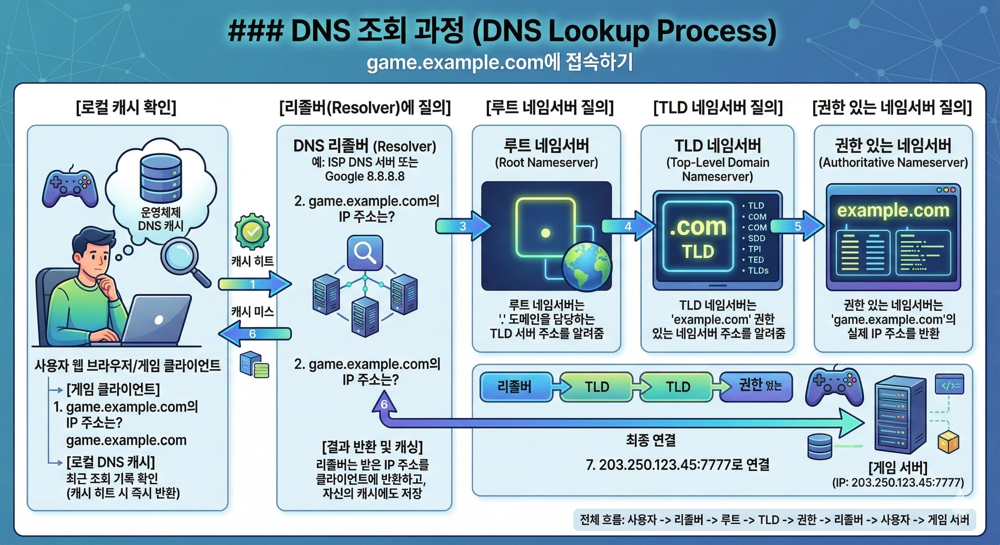  


### DNS 레코드 타입
DNS는 여러 종류의 레코드를 지원한다. 각 레코드 타입은 다른 정보를 제공한다.

**A 레코드 (Address Record)**: 도메인 이름을 IPv4 주소로 매핑한다. 가장 기본적인 DNS 레코드다. 예를 들어 `game.example.com`을 `203.250.123.45`로 매핑한다.

**AAAA 레코드 (IPv6 Address Record)**: 도메인 이름을 IPv6 주소로 매핑한다. 'AAAA'는 IPv6 주소가 IPv4의 4배 크기라는 의미다.

**CNAME 레코드 (Canonical Name Record)**: 도메인의 별칭을 정의한다. 한 도메인을 다른 도메인으로 리다이렉트한다. 예를 들어 `www.example.com`을 `example.com`의 CNAME으로 설정할 수 있다. 로드 밸런싱이나 CDN 설정에 자주 사용된다.

**MX 레코드 (Mail Exchange Record)**: 이메일 서버를 지정한다. 게임과 직접 관련은 없지만, 사용자 인증 이메일을 보낼 때 관련이 있다.

**TXT 레코드**: 임의의 텍스트 데이터를 저장한다. SPF, DKIM 같은 이메일 인증이나, 도메인 소유권 검증에 사용된다.

**SRV 레코드 (Service Record)**: 특정 서비스의 위치를 지정한다. 포트 번호까지 포함할 수 있어 게임 서버 디스커버리에 유용하다.

```
DNS 레코드 예시:

; A 레코드
game.example.com.    IN  A      203.250.123.45
game.example.com.    IN  A      203.250.123.46  (다중 A 레코드 가능)

; AAAA 레코드
game.example.com.    IN  AAAA   2001:db8:85a3::8a2e:370:7334

; CNAME 레코드
www.example.com.     IN  CNAME  example.com.
cdn.example.com.     IN  CNAME  cdn.cloudprovider.com.

; SRV 레코드 (게임 서버 디스커버리)
_gameserver._tcp.example.com. IN SRV 10 60 7777 game1.example.com.
_gameserver._tcp.example.com. IN SRV 10 40 7777 game2.example.com.

의사코드:
DNS 조회:
    result = dns_lookup("game.example.com", record_type="A")
    IF result.count > 1 THEN
        ip = random_select(result.addresses)  // 간단한 로드 밸런싱
    ELSE
        ip = result.addresses[0]
    connect_to_server(ip, port=7777)
```

### DNS 캐싱
DNS 조회는 상대적으로 느린 작업이다. 여러 서버를 거쳐야 하고 네트워크 왕복이 필요하기 때문이다. 이를 완화하기 위해 DNS는 다단계 캐싱을 사용한다.

**브라우저 캐시**: 웹 브라우저는 자체 DNS 캐시를 유지한다. 같은 도메인에 자주 접속하는 경우 매우 빠르다.

**운영체제 캐시**: OS 수준에서도 DNS 캐시를 유지한다. 모든 애플리케이션이 공유한다.

**리졸버 캐시**: ISP의 DNS 서버나 Public DNS(8.8.8.8)도 캐시를 유지한다. 많은 사용자가 같은 도메인을 조회하면 캐시 효율이 높아진다.

캐시의 유효 기간은 TTL(Time To Live)로 제어된다. DNS 레코드마다 TTL 값이 설정되어 있으며, 이 시간이 지나면 캐시가 무효화되고 다시 조회해야 한다.

### TTL (Time To Live)
TTL은 DNS 레코드가 캐시에 얼마나 오래 저장될 수 있는지를 초 단위로 지정한다. TTL이 짧으면 변경 사항이 빠르게 반영되지만 DNS 쿼리가 자주 발생한다. TTL이 길면 트래픽이 줄지만 변경 사항 반영이 느리다.

게임 서버의 경우 다음과 같은 전략을 고려한다. 안정적인 프로덕션 환경에서는 긴 TTL(3600초 = 1시간 이상)을 사용하여 DNS 부하를 줄인다. 서버 마이그레이션이나 긴급 점검이 예정되어 있다면 미리 TTL을 짧게(300초 = 5분) 변경하여 빠른 전환을 준비한다. 개발/테스트 환경에서는 짧은 TTL(60초)을 사용하여 유연성을 확보한다.

```
의사코드:
DNS 캐시 로직:

cache = {}

dns_resolve(domain):
    current_time = get_current_time()
    
    IF domain IN cache THEN
        cached_entry = cache[domain]
        IF current_time < cached_entry.expiry_time THEN
            RETURN cached_entry.ip_address  // 캐시 히트
        ELSE
            DELETE cache[domain]  // TTL 만료
    
    // 캐시 미스 또는 만료 - 실제 DNS 쿼리
    ip_address = perform_dns_query(domain)
    ttl = get_ttl_from_dns_response()
    
    cache[domain] = {
        ip_address: ip_address,
        expiry_time: current_time + ttl
    }
    
    RETURN ip_address
```

### 게임 개발에서의 DNS 활용
게임 개발자는 DNS를 다음과 같이 활용할 수 있다.

**서버 주소 추상화**: 하드코딩된 IP 주소 대신 도메인 이름을 사용하면 서버 IP 변경 시 클라이언트 업데이트가 불필요하다.

**지역별 서버 라우팅**: GeoDNS를 사용하여 사용자의 위치에 따라 가장 가까운 서버로 연결할 수 있다.

**로드 밸런싱**: 하나의 도메인에 여러 A 레코드를 설정하여 간단한 DNS 라운드 로빈 로드 밸런싱을 구현할 수 있다.

**페일오버**: 주 서버가 다운되면 DNS를 변경하여 백업 서버로 트래픽을 전환할 수 있다.

---
  

## 라우팅 (Routing)

**학습 이유**: 패킷이 목적지까지 가는 경로 결정  
라우팅은 패킷을 출발지에서 목적지까지 전달하기 위한 경로를 결정하는 과정이다. 인터넷은 수많은 라우터들이 연결된 거대한 네트워크이며, 각 라우터는 패킷을 다음 홉으로 전달할지 결정해야 한다. 게임 개발자가 라우팅을 이해하면 네트워크 지연의 원인을 파악하고, traceroute 같은 도구로 문제를 진단할 수 있다.

### 라우팅 테이블
라우터는 라우팅 테이블을 사용하여 패킷을 어디로 보낼지 결정한다. 라우팅 테이블은 목적지 네트워크와 그 네트워크로 가기 위한 다음 홉(Next Hop)의 정보를 담고 있다.

라우팅 테이블의 각 항목은 다음 정보를 포함한다.

- **목적지 네트워크**: CIDR 표기법으로 표현된 네트워크 주소 (예: `192.168.1.0/24`)
- **서브넷 마스크**: 네트워크 부분을 식별하는 마스크
- **다음 홉(Next Hop)**: 패킷을 전달할 다음 라우터의 IP 주소
- **인터페이스**: 패킷을 보낼 네트워크 인터페이스
- **메트릭(Metric)**: 경로의 비용 또는 우선순위

```
라우팅 테이블 예시:

목적지 네트워크     서브넷 마스크      다음 홉          인터페이스  메트릭
─────────────────────────────────────────────────────────────────────────
0.0.0.0           0.0.0.0           192.168.1.1      eth0        1
192.168.1.0       255.255.255.0     0.0.0.0          eth0        0
10.0.0.0          255.0.0.0         192.168.1.254    eth0        10
203.250.0.0       255.255.0.0       192.168.1.1      eth0        5

의사코드:
라우팅 결정 알고리즘:

route_packet(destination_ip):
    FOR EACH entry IN routing_table:
        IF (destination_ip AND entry.subnet_mask) == entry.network THEN
            matching_routes.add(entry)
    
    // 가장 구체적인 매칭 선택 (Longest Prefix Match)
    best_route = find_most_specific(matching_routes)
    
    IF best_route.next_hop == "0.0.0.0" THEN
        // 직접 연결된 네트워크
        send_directly(destination_ip, best_route.interface)
    ELSE
        // 다음 홉으로 전달
        forward_to(best_route.next_hop, best_route.interface)
```

**기본 게이트웨이(Default Gateway)**: 라우팅 테이블의 `0.0.0.0/0` 항목은 모든 주소와 매칭되며, 다른 특정 경로가 없을 때 사용하는 기본 경로다. 일반적으로 인터넷으로 나가는 라우터를 가리킨다.

### Static Routing vs Dynamic Routing
라우팅은 크게 정적 라우팅과 동적 라우팅으로 나뉜다.

**Static Routing (정적 라우팅)**: 관리자가 수동으로 라우팅 테이블을 설정한다. 경로가 고정되어 있으며 자동으로 변경되지 않는다. 장점은 간단하고 리소스를 적게 사용하며 예측 가능하다는 것이다. 단점은 네트워크 토폴로지가 변경되면 수동으로 업데이트해야 하고, 대규모 네트워크에서는 관리가 어렵다는 것이다. 소규모 네트워크나 특정 경로를 강제하고 싶을 때 사용한다.

**Dynamic Routing (동적 라우팅)**: 라우터들이 자동으로 정보를 교환하여 라우팅 테이블을 업데이트한다. 네트워크 변화에 자동으로 적응한다. 장점은 장애 발생 시 자동으로 대체 경로를 찾고, 대규모 네트워크에서 관리가 쉽다는 것이다. 단점은 라우팅 프로토콜이 복잡하고, 추가 네트워크 트래픽과 처리 오버헤드가 발생한다는 것이다.
  
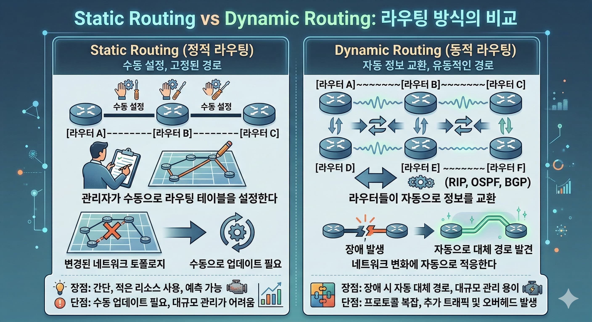  

### 라우팅 프로토콜
동적 라우팅을 구현하는 여러 프로토콜이 있다.

**RIP (Routing Information Protocol)**: 가장 오래되고 간단한 라우팅 프로토콜이다. Distance Vector 알고리즘을 사용하며, 홉 카운트를 메트릭으로 사용한다. 최대 15홉까지만 지원하므로 소규모 네트워크에 적합하다. 30초마다 전체 라우팅 테이블을 브로드캐스트하여 대역폭을 낭비한다. 현대 네트워크에서는 거의 사용되지 않는다.

**OSPF (Open Shortest Path First)**: Link State 알고리즘을 사용하는 현대적인 IGP(Interior Gateway Protocol)다. 네트워크 전체의 토폴로지 맵을 구축하고 Dijkstra 알고리즘으로 최단 경로를 계산한다. 대역폭, 지연, 신뢰성 등 다양한 메트릭을 고려할 수 있다. 빠른 수렴 속도와 효율적인 대역폭 사용으로 기업 네트워크에서 널리 사용된다.

**BGP (Border Gateway Protocol)**: 인터넷 백본에서 사용되는 EGP(Exterior Gateway Protocol)다. AS(Autonomous System) 간 라우팅을 담당한다. Path Vector 알고리즘을 사용하며, 정책 기반 라우팅을 지원한다. 인터넷 전체의 라우팅을 책임지는 프로토콜이다. 게임 회사가 ISP와 피어링할 때 BGP를 사용한다.

```
의사코드:
라우팅 프로토콜 비교:

RIP:
    metric = hop_count
    max_hops = 15
    update_interval = 30 seconds
    FOR EACH neighbor:
        send_entire_routing_table()

OSPF:
    build_topology_map()
    FOR EACH destination:
        shortest_path = dijkstra_algorithm(topology_map, destination)
    WHEN link_state_changes:
        flood_link_state_update()
        recalculate_routing_table()

BGP:
    FOR EACH peer_AS:
        exchange_path_information()
    SELECT best_path BASED ON:
        - AS path length
        - Local preference
        - Multi-Exit Discriminator (MED)
        - Policy rules
```

### Hop (홉): 라우터 간 이동 횟수
홉은 패킷이 출발지에서 목적지까지 거치는 라우터의 수를 의미한다. 홉 카운트가 많을수록 지연이 증가할 가능성이 높다. 각 라우터는 패킷을 처리하는 데 시간이 걸리고(처리 지연), 큐에서 대기하는 시간이 있기(큐잉 지연) 때문이다.

`traceroute`(Linux/Mac) 또는 `tracert`(Windows) 명령으로 패킷이 거치는 모든 홉을 확인할 수 있다. 이 도구는 게임 서버까지의 경로를 진단하는 데 매우 유용하다.

```
traceroute 예시:

$ traceroute game.example.com

 1  192.168.1.1 (192.168.1.1)  1.234 ms   // 가정용 공유기
 2  10.0.0.1 (10.0.0.1)  5.678 ms        // ISP 첫 번째 라우터
 3  203.250.100.1 (203.250.100.1)  12.345 ms  // ISP 코어 라우터
 4  203.250.200.1 (203.250.200.1)  15.678 ms  // ISP 경계 라우터
 5  220.120.30.1 (220.120.30.1)  25.123 ms   // 피어링 포인트
 6  203.250.123.45 (203.250.123.45)  28.456 ms  // 목적지 서버

총 6홉, 약 28ms 지연
```

일반적으로 인터넷 상의 두 지점 간 홉 수는 10~20개 정도다. 홉 수가 비정상적으로 많다면 라우팅이 비효율적이거나 루프가 발생한 것일 수 있다.
  
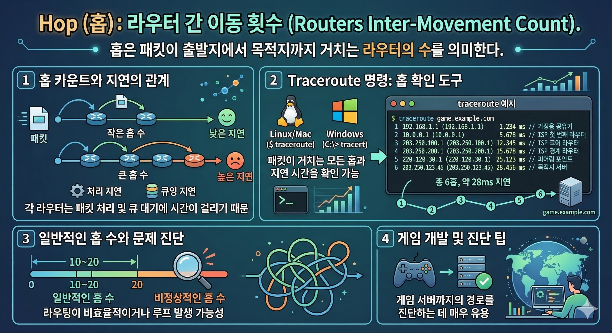  

### TTL과 패킷 생존 시간
IP 헤더의 TTL(Time To Live) 필드는 패킷이 라우터를 최대 몇 번까지 거칠 수 있는지를 제한한다. 라우터는 패킷을 전달할 때마다 TTL을 1씩 감소시킨다. TTL이 0이 되면 패킷을 폐기하고 ICMP Time Exceeded 메시지를 출발지에 보낸다.

TTL의 목적은 라우팅 루프로 인한 패킷의 무한 순환을 방지하는 것이다. 잘못된 라우팅 설정으로 패킷이 라우터 A → B → C → A로 계속 도는 경우, TTL이 없다면 패킷이 영원히 네트워크를 떠돌며 자원을 소모한다.

초기 TTL 값은 운영체제마다 다르다. Linux는 보통 64, Windows는 128, 일부 라우터는 255를 사용한다. traceroute는 TTL을 이용한 트릭이다. TTL을 1부터 증가시키며 패킷을 보내면, 각 홉의 라우터가 Time Exceeded를 응답하므로 경로 상의 모든 라우터를 식별할 수 있다.

```
의사코드:
라우터의 TTL 처리:

receive_packet(packet):
    packet.ttl = packet.ttl - 1
    
    IF packet.ttl <= 0 THEN
        send_icmp_time_exceeded(packet.source_ip)
        discard_packet(packet)
        RETURN
    
    next_hop = lookup_routing_table(packet.destination_ip)
    forward_packet(packet, next_hop)


traceroute 구현 원리:

traceroute(destination):
    FOR ttl = 1 TO 30:
        packet = create_packet(destination, ttl=ttl)
        send_packet(packet)
        
        response = wait_for_response(timeout=3 seconds)
        
        IF response.type == ICMP_TIME_EXCEEDED THEN
            print("Hop", ttl, ":", response.source_ip)
        ELSE IF response.type == ICMP_ECHO_REPLY THEN
            print("Hop", ttl, ":", destination, "(reached)")
            BREAK
        ELSE
            print("Hop", ttl, ": * * * (timeout)")
```

---
  

## MTU (Maximum Transmission Unit)

**학습 이유**: 네트워크에서 전송 가능한 최대 패킷 크기  
MTU는 데이터링크 계층에서 한 번에 전송할 수 있는 최대 프레임 크기를 의미한다. 이더넷의 표준 MTU는 1500바이트다. IP 패킷(IP 헤더 + 데이터)이 MTU를 초과하면 단편화(Fragmentation)가 발생한다.

MTU를 이해하는 것은 게임 개발에서 중요하다. 큰 패킷을 보내면 단편화로 인한 오버헤드와 지연이 발생하고, 하나의 조각만 손실되어도 전체 패킷을 재전송해야 한다.

### 일반적인 MTU 값

네트워크 타입에 따라 MTU는 다르다.

- **이더넷**: 1500바이트 (가장 일반적)
- **PPPoE**: 1492바이트 (PPP 헤더 8바이트 차감)
- **Wi-Fi**: 보통 1500바이트 (이더넷과 동일)
- **루프백**: 65536바이트 (로컬 루프백 인터페이스)
- **점보 프레임**: 9000바이트 (데이터센터 내부 네트워크)

```
MTU와 패킷 구조:

MTU 1500바이트 (이더넷 프레임)
├─ Ethernet Header: 14바이트
├─ IP Header: 20바이트 (최소)
├─ TCP/UDP Header: 20바이트 (TCP) 또는 8바이트 (UDP)
└─ Application Data: 최대 1460바이트 (TCP) 또는 1472바이트 (UDP)

계산:
TCP 최대 페이로드 = 1500 - 14 - 20 - 20 = 1446바이트 (이더넷 헤더 제외)
                   = 1500 - 20 - 20 = 1460바이트 (IP 기준)
UDP 최대 페이로드 = 1500 - 20 - 8 = 1472바이트 (IP 기준)
```

### 패킷 단편화 (Fragmentation)
IP 패킷이 MTU보다 크면 라우터가 패킷을 여러 조각으로 나눈다. 이것을 단편화라고 한다. 각 조각은 별도의 IP 패킷으로 전송되며, 최종 목적지에서 재조립된다.

단편화는 다음과 같은 문제를 일으킨다.

**추가 오버헤드**: 각 조각마다 IP 헤더가 추가되어 전체 전송량이 증가한다.

**재조립 부담**: 수신측이 모든 조각을 버퍼에 저장하고 재조립해야 한다. 메모리와 CPU를 소모한다.

**모두 도착해야 함**: 하나의 조각이라도 손실되면 전체 패킷을 재전송해야 한다. 단편화된 패킷은 신뢰성이 떨어진다.

**방화벽 문제**: 일부 방화벽은 단편화된 패킷을 차단한다. 보안 이유로 첫 번째 조각만 검사할 수 있어 뒤의 조각을 차단하는 경우가 있다.

```
패킷 단편화 예시:

원본 패킷: 3000바이트 데이터
MTU: 1500바이트

단편화:
Fragment 1:
├─ IP Header (20바이트)
│  - Identification: 12345
│  - Fragment Offset: 0
│  - More Fragments: 1
└─ Data: 1480바이트

Fragment 2:
├─ IP Header (20바이트)
│  - Identification: 12345
│  - Fragment Offset: 1480
│  - More Fragments: 1
└─ Data: 1480바이트

Fragment 3:
├─ IP Header (20바이트)
│  - Identification: 12345
│  - Fragment Offset: 2960
│  - More Fragments: 0
└─ Data: 40바이트

의사코드:
fragment_packet(packet, mtu):
    header_size = 20  // IP 헤더
    max_data_per_fragment = mtu - header_size
    total_data = packet.data.length
    offset = 0
    fragments = []
    
    WHILE offset < total_data:
        fragment_size = min(max_data_per_fragment, total_data - offset)
        fragment = create_ip_packet()
        fragment.identification = packet.identification
        fragment.fragment_offset = offset
        fragment.more_fragments = (offset + fragment_size < total_data)
        fragment.data = packet.data[offset : offset + fragment_size]
        fragments.add(fragment)
        offset += fragment_size
    
    RETURN fragments
```  
  
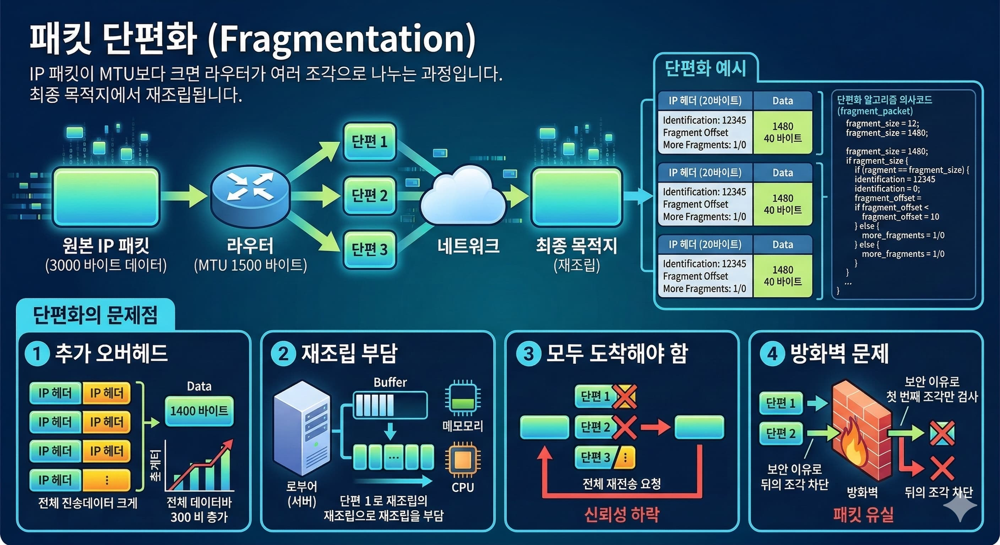  

### Path MTU Discovery
경로 상의 모든 링크 중 가장 작은 MTU를 Path MTU라고 한다. Path MTU Discovery(PMTUD)는 출발지와 목적지 사이의 최적 MTU를 자동으로 찾는 메커니즘이다.

PMTUD는 DF(Don't Fragment) 플래그를 설정한 패킷을 보낸다. 경로 상의 라우터가 MTU보다 큰 패킷을 받으면 단편화를 시도하지만, DF 플래그가 설정되어 있으면 패킷을 폐기하고 ICMP Fragmentation Needed 메시지를 보낸다. 이 메시지에는 해당 링크의 MTU 정보가 포함되어 있다. 송신측은 이 정보를 받아 패킷 크기를 줄이고 다시 시도한다. 이 과정을 반복하여 최적의 MTU를 찾는다.

문제는 일부 방화벽이 ICMP 메시지를 차단한다는 것이다. 이 경우 PMTUD가 작동하지 않아 "PMTUD Black Hole" 현상이 발생한다. 연결은 되지만 큰 패킷이 전송되지 않는 증상이 나타난다.

```
ASCII 다이어그램: Path MTU Discovery

[송신측]                [라우터 A]    [라우터 B]    [수신측]
MTU: 1500              MTU: 1500     MTU: 1400     MTU: 1500
    |                      |             |             |
    |-- 1500바이트(DF) --->|             |             |
    |                      |-- 전달 ---->|             |
    |                      |             |X MTU 초과   |
    |                      |<- ICMP -----|             |
    |<- Fragmentation -----|  MTU=1400   |             |
    |   Needed (MTU 1400)  |             |             |
    |                      |             |             |
    |-- 1400바이트(DF) --->|-- 전달 ---->|-- 전달 ---->|
    |                      |             |             |
    |<======================== ACK =====================|

의사코드:
path_mtu_discovery(destination):
    current_mtu = 1500  // 이더넷 초기값
    min_mtu = 576       // IPv4 최소 MTU
    
    WHILE true:
        packet = create_packet(size=current_mtu, df=true)
        send(packet, destination)
        
        response = wait_for_response()
        
        IF response == ICMP_FRAGMENTATION_NEEDED THEN
            suggested_mtu = response.mtu
            current_mtu = min(current_mtu, suggested_mtu)
            IF current_mtu < min_mtu THEN
                current_mtu = min_mtu
                BREAK
        ELSE IF response == ACK THEN
            // 성공
            BREAK
    
    RETURN current_mtu
```

### 게임에서의 MTU 고려사항
게임 개발 시 MTU를 고려하여 패킷 크기를 설계해야 한다.

**안전한 패킷 크기 유지**: UDP 게임 패킷은 1200바이트 이하로 유지하는 것이 좋다. 이는 대부분의 네트워크 환경에서 단편화를 피할 수 있는 안전한 크기다.

**큰 데이터는 분할 전송**: 맵 데이터나 파일 전송 같은 큰 데이터는 애플리케이션 레벨에서 직접 분할하여 여러 패킷으로 나누어 보낸다.

**TCP는 자동 처리**: TCP를 사용하면 MSS(Maximum Segment Size) 협상을 통해 자동으로 적절한 크기로 분할된다. 개발자가 직접 신경 쓸 필요가 없다.

**모니터링**: 프로덕션 환경에서 패킷 크기 분포를 모니터링하여 MTU 문제가 없는지 확인한다.

```
의사코드:
게임 패킷 크기 관리:

MAX_GAME_PACKET_SIZE = 1200  // 안전한 크기

send_game_state(state_data):
    serialized = serialize(state_data)
    
    IF serialized.size <= MAX_GAME_PACKET_SIZE THEN
        send_udp_packet(serialized)
    ELSE
        // 애플리케이션 레벨에서 분할
        chunks = split_data(serialized, MAX_GAME_PACKET_SIZE)
        FOR EACH chunk IN chunks:
            packet = {
                packet_id: generate_id(),
                chunk_index: chunk.index,
                total_chunks: chunks.length,
                data: chunk.data
            }
            send_udp_packet(packet)

receive_game_packet(packet):
    IF packet.total_chunks == 1 THEN
        process_complete_data(packet.data)
    ELSE
        add_to_reassembly_buffer(packet)
        IF all_chunks_received(packet.packet_id) THEN
            complete_data = reassemble(packet.packet_id)
            process_complete_data(complete_data)
```

---
  

## ARP (Address Resolution Protocol)

**학습 이유**: IP 주소로 MAC 주소를 찾는 프로토콜  
네트워크 계층(IP)과 데이터링크 계층(이더넷) 사이에는 주소 체계의 불일치가 있다. IP 패킷을 전송하려면 목적지 IP 주소를 알아야 하지만, 실제 이더넷 프레임을 보낼 때는 MAC 주소가 필요하다. ARP는 IP 주소를 MAC 주소로 변환하는 프로토콜이다.

ARP는 로컬 네트워크 내에서만 작동한다. 같은 네트워크에 있는 장비의 MAC 주소를 찾을 때 사용된다. 다른 네트워크로 패킷을 보낼 때는 게이트웨이 라우터의 MAC 주소를 찾는다.

### ARP 동작 과정
컴퓨터 A(`192.168.1.100`)가 같은 네트워크의 컴퓨터 B(`192.168.1.101`)에게 패킷을 보내려고 한다고 가정한다. A는 B의 IP 주소는 알지만 MAC 주소는 모른다.

**1단계: ARP 캐시 확인** - A는 먼저 자신의 ARP 캐시 테이블을 확인한다. 최근에 B와 통신했다면 캐시에 저장되어 있다.

**2단계: ARP Request (브로드캐스트)** - 캐시에 없으면 A는 ARP Request를 브로드캐스트한다. "192.168.1.101의 MAC 주소가 뭐예요?"라는 메시지를 네트워크의 모든 장비에게 보낸다. 목적지 MAC 주소를 `FF:FF:FF:FF:FF:FF`(브로드캐스트 주소)로 설정한다.

**3단계: ARP Reply (유니캐스트)** - 네트워크의 모든 장비가 ARP Request를 받지만, 192.168.1.101인 B만 응답한다. B는 자신의 MAC 주소를 담은 ARP Reply를 A에게 유니캐스트로 보낸다.

**4단계: ARP 캐시에 저장** - A는 받은 정보를 ARP 캐시에 저장한다. 일정 시간(보통 수 분) 동안 유지되며, 같은 IP로 패킷을 보낼 때 다시 ARP를 할 필요가 없다.

**5단계: 데이터 전송** - 이제 A는 B의 MAC 주소를 알았으므로 이더넷 프레임을 생성하여 데이터를 전송한다.

```
ASCII 다이어그램: ARP 과정

[PC A]              [Switch]              [PC B]         [PC C]
192.168.1.100                           192.168.1.101   192.168.1.102
MAC: AA:AA:AA:AA:AA:AA                  MAC: BB:BB:BB:BB:BB:BB

    |                   |                   |               |
    |-- ARP Request --->|                   |               |
    | (브로드캐스트)     |------------------>|               |
    |  "192.168.1.101   |                   |               |
    |   MAC 주소는?"    |------------------------------>    |
    |                   |                   |               |
    |                   |                   |               |
    |                   |   ARP Reply       |               |
    |<------------------|<------------------|               |
    | (유니캐스트)       |  "내 MAC은        |               |
    |  BB:BB:BB:BB:BB:BB  BB:BB:BB:BB:BB:BB"|               |
    |                   |                   |               |

의사코드:
send_packet(destination_ip, data):
    // 1. ARP 캐시 확인
    mac_address = lookup_arp_cache(destination_ip)
    
    IF mac_address == NULL THEN
        // 2. ARP Request 브로드캐스트
        arp_request = {
            operation: ARP_REQUEST,
            sender_ip: my_ip,
            sender_mac: my_mac,
            target_ip: destination_ip,
            target_mac: "00:00:00:00:00:00"  // 모름
        }
        broadcast(arp_request, destination_mac="FF:FF:FF:FF:FF:FF")
        
        // 3. ARP Reply 대기
        arp_reply = wait_for_arp_reply(timeout=3 seconds)
        
        IF arp_reply == NULL THEN
            ERROR "호스트에 도달할 수 없음"
            RETURN
        
        mac_address = arp_reply.sender_mac
        
        // 4. ARP 캐시에 저장
        add_to_arp_cache(destination_ip, mac_address, ttl=300 seconds)
    
    // 5. 이더넷 프레임 생성 및 전송
    frame = create_ethernet_frame(
        source_mac: my_mac,
        destination_mac: mac_address,
        data: data
    )
    send_frame(frame)
```
  
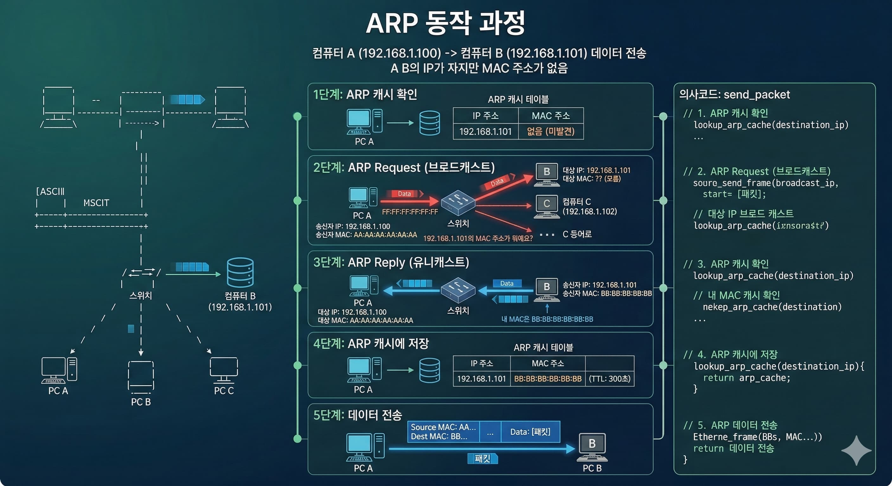  

### ARP 캐시 테이블
ARP 캐시는 최근 통신한 IP와 MAC 주소의 매핑을 저장한다. 매번 ARP를 하면 네트워크 트래픽이 증가하므로 캐싱이 필수적이다.

ARP 캐시 엔트리는 일정 시간 후 만료된다. Linux는 보통 60~300초, Windows는 2분 정도 유지한다. 이는 네트워크 카드가 교체되거나 IP가 재할당되는 경우를 대비한 것이다.

시스템에서 ARP 캐시를 확인하는 명령은 다음과 같다.

- Linux/Mac: `arp -a` 또는 `ip neigh show`
- Windows: `arp -a`

```
ARP 캐시 예시:

$ arp -a
? (192.168.1.1) at aa:bb:cc:dd:ee:ff [ether] on eth0
? (192.168.1.101) at 11:22:33:44:55:66 [ether] on eth0
? (192.168.1.105) at 77:88:99:aa:bb:cc [ether] on eth0

의사코드:
ARP 캐시 관리:

arp_cache = {}

add_to_arp_cache(ip, mac, ttl):
    arp_cache[ip] = {
        mac_address: mac,
        expiry_time: current_time() + ttl
    }

lookup_arp_cache(ip):
    IF ip NOT IN arp_cache THEN
        RETURN NULL
    
    entry = arp_cache[ip]
    IF current_time() > entry.expiry_time THEN
        DELETE arp_cache[ip]  // 만료된 엔트리 삭제
        RETURN NULL
    
    RETURN entry.mac_address

// 주기적 정리
cleanup_arp_cache():
    EVERY 60 seconds:
        FOR EACH ip, entry IN arp_cache:
            IF current_time() > entry.expiry_time THEN
                DELETE arp_cache[ip]
```

### 게임 개발에서의 ARP 고려사항
ARP는 대부분 운영체제가 자동으로 처리하므로 게임 개발자가 직접 다룰 일은 거의 없다. 하지만 다음 상황에서 ARP를 이해하는 것이 도움이 된다.

**로컬 네트워크 게임**: LAN 파티나 로컬 멀티플레이 게임에서 피어 디스커버리를 구현할 때 ARP를 이해하면 유용하다.

**네트워크 디버깅**: "같은 네트워크인데 왜 연결이 안 될까?" 같은 문제를 해결할 때 ARP 캐시를 확인할 수 있다. 잘못된 ARP 엔트리가 있으면 `arp -d` 명령으로 삭제한다.

**보안**: ARP 스푸핑 공격을 이해하면 게임 서버 보안을 강화할 수 있다. 공격자가 가짜 ARP Reply를 보내 트래픽을 가로챌 수 있다.

---

## ICMP (Internet Control Message Protocol)

**학습 이유**: 네트워크 진단 및 오류 보고  
ICMP는 IP 프로토콜의 보조 프로토콜로, 네트워크 상태를 진단하고 오류를 보고하는 데 사용된다. TCP나 UDP처럼 데이터 전송용이 아니라, 네트워크 제어와 관리를 위한 프로토콜이다. 게임 개발자에게 ICMP는 네트워크 문제를 진단하는 핵심 도구다.

### ICMP 메시지 타입
ICMP는 다양한 메시지 타입을 정의한다.

**Echo Request / Echo Reply (Type 8 / Type 0)**: ping 명령에 사용된다. 네트워크 연결 테스트와 왕복 시간(RTT) 측정에 사용된다.

**Destination Unreachable (Type 3)**: 목적지에 도달할 수 없을 때 발생한다. 여러 하위 코드가 있다.
- Code 0: Network Unreachable (네트워크에 도달할 수 없음)
- Code 1: Host Unreachable (호스트에 도달할 수 없음)
- Code 2: Protocol Unreachable (프로토콜에 도달할 수 없음)
- Code 3: Port Unreachable (포트에 도달할 수 없음)
- Code 4: Fragmentation Needed (단편화 필요하지만 DF 설정됨)

**Time Exceeded (Type 11)**: TTL이 0이 되어 패킷이 폐기될 때 발생한다. traceroute가 이 메시지를 활용한다.

**Redirect (Type 5)**: 더 나은 경로가 있을 때 라우터가 보내는 메시지다. 최적 경로로 재전송하도록 안내한다.

```
ICMP 패킷 구조:

[IP Header]
[ICMP Header]
├─ Type (8비트): 메시지 타입
├─ Code (8비트): 하위 코드
├─ Checksum (16비트): 체크섬
└─ Rest of Header (32비트): 메시지에 따라 다름
[ICMP Data]

의사코드:
ICMP 메시지 처리:

handle_icmp_message(icmp_packet):
    SWITCH icmp_packet.type:
        CASE 0:  // Echo Reply
            rtt = current_time() - icmp_packet.timestamp
            print("Reply from", icmp_packet.source_ip, "time=", rtt, "ms")
            
        CASE 3:  // Destination Unreachable
            SWITCH icmp_packet.code:
                CASE 1:
                    ERROR "Host unreachable"
                CASE 3:
                    ERROR "Port unreachable"
                CASE 4:
                    ERROR "Fragmentation needed"
            
        CASE 8:  // Echo Request
            send_icmp_reply(icmp_packet.source_ip)
            
        CASE 11:  // Time Exceeded
            print("TTL exceeded at", icmp_packet.source_ip)
```

### Ping: 네트워크 연결 테스트
ping은 가장 기본적인 네트워크 진단 도구다. ICMP Echo Request를 보내고 Echo Reply를 기다린다. 목적지가 살아 있는지, 왕복 시간이 얼마나 되는지 확인할 수 있다.

```
ping 실행 예시:

$ ping game.example.com

PING game.example.com (203.250.123.45): 56 data bytes
64 bytes from 203.250.123.45: icmp_seq=0 ttl=54 time=28.123 ms
64 bytes from 203.250.123.45: icmp_seq=1 ttl=54 time=27.456 ms
64 bytes from 203.250.123.45: icmp_seq=2 ttl=54 time=29.001 ms
64 bytes from 203.250.123.45: icmp_seq=3 ttl=54 time=28.789 ms

--- game.example.com ping statistics ---
4 packets transmitted, 4 packets received, 0% packet loss
round-trip min/avg/max/stddev = 27.456/28.342/29.001/0.629 ms

의사코드:
ping_implementation(destination_ip, count=4):
    FOR i = 0 TO count-1:
        // Echo Request 생성
        icmp_packet = {
            type: 8,  // Echo Request
            code: 0,
            checksum: calculate_checksum(),
            identifier: process_id,
            sequence: i,
            timestamp: current_time()
        }
        
        send_time = current_time()
        send_icmp(destination_ip, icmp_packet)
        
        // Echo Reply 대기
        reply = wait_for_icmp_reply(timeout=3 seconds)
        
        IF reply != NULL THEN
            rtt = current_time() - send_time
            print("Reply from", destination_ip, "time=", rtt, "ms", "ttl=", reply.ttl)
        ELSE
            print("Request timeout")
        
        sleep(1 second)
```

게임 클라이언트에서 서버 연결 전에 ping을 보내 서버 응답성을 확인할 수 있다. 여러 지역 서버 중 가장 빠른 서버를 자동으로 선택하는 기능을 구현할 때 유용하다.

### Traceroute: 경로 추적
traceroute는 패킷이 목적지까지 거치는 모든 라우터를 보여준다. TTL을 조작하는 영리한 트릭을 사용한다.

TTL을 1로 설정하여 패킷을 보내면 첫 번째 라우터가 Time Exceeded를 응답한다. TTL을 2로 설정하면 두 번째 라우터가 응답한다. 이런 식으로 TTL을 증가시키며 패킷을 보내면 경로 상의 모든 라우터를 식별할 수 있다.

```
traceroute 실행 예시:

$ traceroute game.example.com

traceroute to game.example.com (203.250.123.45), 30 hops max, 60 byte packets
 1  192.168.1.1 (192.168.1.1)  1.234 ms  1.123 ms  1.056 ms
 2  10.0.0.1 (10.0.0.1)  5.678 ms  5.543 ms  5.432 ms
 3  203.250.100.1 (203.250.100.1)  12.345 ms  12.234 ms  12.123 ms
 4  203.250.200.1 (203.250.200.1)  15.678 ms  15.543 ms  15.432 ms
 5  220.120.30.1 (220.120.30.1)  25.123 ms  25.012 ms  24.987 ms
 6  203.250.123.45 (203.250.123.45)  28.456 ms  28.345 ms  28.234 ms

의사코드:
traceroute_implementation(destination_ip, max_hops=30):
    FOR ttl = 1 TO max_hops:
        // 3번 시도 (통계적 정확성)
        rtts = []
        router_ip = NULL
        
        FOR attempt = 1 TO 3:
            packet = create_packet(destination_ip, ttl=ttl)
            send_time = current_time()
            send_packet(packet)
            
            response = wait_for_response(timeout=3 seconds)
            
            IF response != NULL THEN
                rtt = current_time() - send_time
                rtts.add(rtt)
                router_ip = response.source_ip
            ELSE
                rtts.add("*")
        
        // 결과 출력
        IF router_ip != NULL THEN
            print(ttl, router_ip, rtts)
            
            IF router_ip == destination_ip THEN
                print("Reached destination")
                BREAK
        ELSE
            print(ttl, "* * *")
```

게임 서버에 연결 문제가 있을 때 traceroute로 어느 구간에서 문제가 발생하는지 파악할 수 있다. 지연이 급증하는 홉이나, 응답이 없는 구간을 찾아낼 수 있다.

### ICMP와 방화벽
많은 방화벽과 서버가 보안상의 이유로 ICMP를 차단한다. 따라서 ping이나 traceroute가 작동하지 않는다고 해서 반드시 연결이 안 되는 것은 아니다. TCP/UDP 포트는 열려 있지만 ICMP만 차단된 경우가 많다.

게임 서버는 보안을 위해 ICMP를 제한하되, 최소한의 진단은 가능하도록 하는 것이 좋다. 예를 들어 내부 모니터링 시스템에서만 ICMP를 허용하고 외부에서는 차단할 수 있다.

---

이 장에서 다룬 IP 주소, 포트, DNS, 라우팅, MTU, ARP, ICMP는 모두 네트워크의 기본 빌딩 블록이다. 이 개념들을 깊이 이해하면 게임 서버 인프라를 설계하고, 네트워크 문제를 진단하고, 최적화를 수행하는 데 큰 도움이 된다. 다음 장에서는 이러한 네트워크 개념을 바탕으로 실제 네트워크 프로그래밍의 기초를 배운다.


# Chapter. 5. 네트워크 프로그래밍 기초 개념
네트워크 프로그래밍의 기초 개념은 온라인 게임 개발의 출발점이다. 이 장에서는 실제 코드를 작성하기 전에 반드시 이해해야 할 핵심 개념들을 다룬다. 소켓의 동작 원리부터 비동기 처리까지, 이론적 배경을 탄탄히 하면 이후 실전 개발에서 발생하는 문제들을 근본적으로 이해하고 해결할 수 있다.

---

## **소켓 (Socket)**

**학습 이유**: 소켓은 네트워크 통신을 위한 프로그래밍 인터페이스로, 모든 네트워크 애플리케이션의 시작점이다.

소켓은 네트워크 통신의 끝점(endpoint)을 나타내는 추상화된 개념이다. 마치 전화기의 수화기처럼, 소켓을 통해 데이터를 보내고 받을 수 있다. 운영체제는 소켓을 파일 디스크립터로 관리하며, 개발자는 이를 통해 네트워크 통신을 마치 파일을 읽고 쓰는 것처럼 다룰 수 있다.

소켓의 정의를 좀 더 기술적으로 표현하면, IP 주소와 포트 번호의 조합으로 식별되는 통신 엔드포인트다. 예를 들어 `192.168.1.100:8080`이라는 주소는 특정 컴퓨터의 특정 프로세스를 가리킨다. 이 조합이 바로 소켓의 정체성이다.

### **소켓의 종류**
네트워크 통신의 목적과 특성에 따라 여러 종류의 소켓이 존재한다.

**Stream Socket (SOCK_STREAM)**은 TCP 프로토콜을 사용하는 소켓이다. 이는 마치 전화 통화처럼 연결이 확립된 후 양방향으로 데이터를 주고받는다. 데이터의 순서가 보장되고, 손실 없이 전달되는 것이 특징이다. 게임에서 채팅 시스템이나 로그인 처리에 주로 사용된다.

**Datagram Socket (SOCK_DGRAM)**은 UDP 프로토콜을 사용한다. 이는 편지를 보내는 것과 유사하다. 연결 설정 없이 데이터를 보내며, 도착 보장이나 순서 보장이 없다. 하지만 그만큼 빠르고 가볍다. FPS 게임의 플레이어 위치 동기화처럼 실시간성이 중요하고 일부 데이터 손실을 감수할 수 있는 경우에 적합하다.

**Raw Socket**은 IP 레벨에서 직접 패킷을 다루는 저수준 소켓이다. TCP나 UDP 헤더를 직접 구성할 수 있어, 네트워크 분석 도구나 특수한 프로토콜 구현에 사용된다. 일반적인 게임 개발에서는 거의 사용하지 않지만, 네트워크 보안이나 진단 도구 개발 시 필요하다.

```
소켓 종류 비교:

Stream Socket (TCP)          Datagram Socket (UDP)
┌─────────────┐             ┌─────────────┐
│  연결 지향   │             │  비연결형    │
│  신뢰성 보장 │             │  빠른 전송   │
│  순서 보장   │             │  낮은 지연   │
│  느린 전송   │             │  손실 가능   │
└─────────────┘             └─────────────┘
     채팅                        위치 동기화
     로그인                      음성 통신
```

---
  

## **클라이언트-서버 통신 흐름**

**학습 이유**: 네트워크 애플리케이션의 기본 구조를 이해하면 코드 작성 시 각 단계의 의미와 순서를 명확히 알 수 있다.

네트워크 통신은 서버와 클라이언트가 정해진 절차에 따라 상호작용하는 과정이다. 이 흐름을 이해하는 것은 마치 춤의 스텝을 배우는 것과 같다. 각자의 역할과 순서를 정확히 알아야 조화로운 통신이 가능하다.

### **서버 측 흐름**
서버는 클라이언트의 연결을 기다리는 수동적인 역할을 한다. 먼저 **소켓 생성(socket)**부터 시작한다. 이는 전화기를 설치하는 것과 같다. 시스템에 "나는 네트워크 통신을 할 거야"라고 알리는 단계다.

다음으로 **주소 바인딩(bind)**을 수행한다. 생성한 소켓에 특정 IP 주소와 포트 번호를 할당하는 과정이다. 예를 들어 게임 서버가 `0.0.0.0:7777`에 바인딩하면, "이 컴퓨터의 모든 네트워크 인터페이스에서 7777번 포트로 들어오는 연결을 받겠다"는 의미다.

TCP를 사용하는 경우 **연결 대기(listen)** 단계가 필요하다. 이는 전화기의 벨을 켜는 것과 같다. 시스템에게 "이제 연결 요청을 받을 준비가 됐어"라고 알린다. 이때 대기 큐(backlog queue)의 크기를 지정하는데, 이는 동시에 처리할 수 있는 대기 중인 연결 요청의 수를 의미한다.

**연결 수락(accept)**은 실제로 클라이언트의 연결 요청을 받아들이는 단계다. 클라이언트가 연결을 시도하면 accept 함수가 반환되며, 해당 클라이언트와 통신할 수 있는 새로운 소켓을 생성한다. 이는 전화를 받아 통화를 시작하는 것과 유사하다.

이후 **데이터 송수신(send/recv)**을 통해 실제 게임 데이터를 주고받는다. 플레이어의 입력, 게임 상태, 이벤트 등 모든 정보가 이 단계에서 전달된다.

마지막으로 **연결 종료(close)**를 통해 소켓을 정리한다. 클라이언트가 게임을 종료하거나, 네트워크 오류가 발생했을 때 수행된다.

### **클라이언트 측 흐름**
클라이언트는 서버에 능동적으로 연결을 시도하는 역할을 한다. 마찬가지로 **소켓 생성(socket)**부터 시작하지만, 바인딩은 대부분 생략한다. 운영체제가 자동으로 사용 가능한 포트를 할당하기 때문이다.

TCP의 경우 **서버 연결(connect)** 단계에서 서버의 IP 주소와 포트 번호를 지정해 연결을 시도한다. 이는 전화를 거는 것과 같다. 3-way handshake가 내부적으로 수행되며, 연결이 성공하면 함수가 반환된다.

이후 **데이터 송수신(send/recv)**과 **연결 종료(close)**는 서버와 동일하다.

```
TCP 통신 흐름:

Server                          Client
┌──────┐                        ┌──────┐
│socket│                        │socket│
└──┬───┘                        └──┬───┘
   │                               │
┌──▼──┐                            │
│bind │                            │
└──┬──┘                            │
   │                               │
┌──▼───┐                           │
│listen│                           │
└──┬───┘                           │
   │                            ┌──▼────┐
┌──▼────┐    SYN                │connect│
│accept │◄──────────────────────└───┬───┘
└──┬────┘                          │
   │         SYN-ACK               │
   ├──────────────────────────────►│
   │                               │
   │         ACK                   │
   │◄──────────────────────────────┤
   │                               │
   │     [연결 수립 완료]            │
   │                               │
┌──▼──┐                         ┌──▼──┐
│send │◄───────────────────────►│recv │
│recv │        데이터 교환       │send │
└──┬──┘                         └──┬──┘
   │                               │
┌──▼───┐                       ┌───▼───┐
│close │                       │close  │
└──────┘                       └───────┘
```

UDP는 연결 설정 과정이 없어 훨씬 단순하다. 소켓 생성 후 바로 `sendto`와 `recvfrom` 함수로 데이터를 주고받을 수 있다.

---

## **Blocking vs Non-blocking I/O**

**학습 이유**: 동시에 여러 플레이어를 처리하는 게임 서버의 핵심 개념이며, 성능과 직결된다.

I/O 작업의 처리 방식은 게임 서버의 아키텍처를 결정하는 중요한 요소다. Blocking과 Non-blocking은 데이터를 기다리는 방식의 차이를 나타낸다.

### **Blocking I/O**
Blocking I/O는 가장 직관적인 방식이다. 데이터를 읽거나 쓸 때, 작업이 완료될 때까지 프로그램이 멈춰서 기다린다. 예를 들어 `recv` 함수를 호출하면, 데이터가 도착할 때까지 프로그램의 실행이 중단된다.

의사코드로 표현하면 다음과 같다:

```
socket = create_socket()
bind(socket, address)
listen(socket)

while true:
    client = accept(socket)  // 클라이언트 연결까지 대기 (Blocking)
    data = recv(client)       // 데이터 수신까지 대기 (Blocking)
    process(data)
    send(client, response)
```

이 방식의 장점은 코드가 매우 간단하고 이해하기 쉽다는 것이다. 순차적으로 작성하면 되므로 초보자도 쉽게 접근할 수 있다. 하지만 치명적인 단점이 있다. 한 번에 하나의 클라이언트만 처리할 수 있다는 것이다. 첫 번째 클라이언트의 데이터를 기다리는 동안, 다른 클라이언트들은 모두 대기해야 한다.

이 문제를 해결하기 위해 **멀티스레딩** 방식을 사용한다. 각 클라이언트마다 별도의 스레드를 생성해 독립적으로 처리한다:

```
socket = create_socket()
bind(socket, address)
listen(socket)

while true:
    client = accept(socket)
    create_thread(handle_client, client)  // 새 스레드에서 처리

function handle_client(client):
    while true:
        data = recv(client)  // 이 스레드만 Blocking
        process(data)
        send(client, response)
```

하지만 스레드를 무한정 생성할 수는 없다. 스레드는 메모리를 소비하고, 컨텍스트 스위칭 비용이 발생한다. 수천 명의 동시 접속자를 처리하는 게임 서버에서는 비효율적이다.

### **Non-blocking I/O**
Non-blocking I/O는 데이터가 준비되지 않았을 때 즉시 반환한다. 기다리지 않고 다른 작업을 계속 수행할 수 있다. `recv` 함수를 호출했는데 데이터가 없으면, 에러 코드(EWOULDBLOCK, EAGAIN)를 반환하고 프로그램은 계속 진행된다.

```
socket = create_socket()
set_nonblocking(socket)
bind(socket, address)
listen(socket)

clients = []

while true:
    // 새 연결 시도
    client = accept(socket)
    if client != WOULD_BLOCK:
        set_nonblocking(client)
        clients.add(client)
    
    // 모든 클라이언트 확인
    for each client in clients:
        data = recv(client)
        if data != WOULD_BLOCK:
            process(data)
            send(client, response)
```

이 방식은 단일 스레드로 여러 클라이언트를 처리할 수 있다. 하지만 **폴링(Polling)** 방식의 단점이 있다. 모든 소켓을 반복적으로 확인해야 하므로, 대부분의 시도가 "데이터 없음"으로 끝난다. CPU를 불필요하게 소모하는 busy-waiting 문제가 발생한다.

```
Blocking vs Non-blocking 비교:

Blocking I/O:
Thread 1: [====recv====][process][send]
Thread 2:         [====recv====][process][send]
Thread 3:                 [====recv====][process][send]
→ 여러 스레드 필요, 대기 시간에 다른 작업 불가

Non-blocking I/O (Polling):
Thread 1: [recv][recv][recv][process][send][recv][recv]...
          ^실패 ^실패 ^성공                    ^실패
→ 단일 스레드, CPU 낭비 발생
```

---

## **I/O Multiplexing**

**학습 이유**: Non-blocking I/O의 폴링 문제를 해결하고, 대규모 동시 접속을 효율적으로 처리하는 핵심 기술이다.

I/O Multiplexing은 여러 소켓 중에서 준비된 소켓만 선택적으로 처리하는 기법이다. 운영체제에게 "이 소켓들을 감시하다가, 데이터가 준비된 것만 알려줘"라고 요청하는 방식이다. 폴링의 CPU 낭비 없이 효율적으로 다중 연결을 처리할 수 있다.

### **select**
가장 오래되고 이식성이 높은 방법이다. 감시할 소켓들의 집합을 운영체제에 전달하고, 그중 하나라도 준비되면 깨어난다.

```
socket = create_socket()
bind(socket, address)
listen(socket)

clients = []
read_set = [socket]  // 감시할 소켓 집합

while true:
    ready_set = select(read_set, timeout)  // 준비된 소켓만 반환
    
    if socket in ready_set:
        // 새 연결 가능
        client = accept(socket)
        clients.add(client)
        read_set.add(client)
    
    for each client in ready_set:
        data = recv(client)  // 데이터가 준비됨을 보장
        if data is empty:
            // 연결 종료
            clients.remove(client)
            read_set.remove(client)
        else:
            process(data)
            send(client, response)
```

select의 단점은 감시할 수 있는 소켓 수에 제한이 있다는 것이다(보통 1024개). 또한 매번 소켓 집합 전체를 커널에 복사해야 하므로, 소켓 수가 많아질수록 비효율적이다.

### **poll**
select의 개선 버전으로, 소켓 수 제한이 없다. 소켓 목록을 배열로 관리하며, 각 소켓에 대해 감시할 이벤트를 지정할 수 있다.

```
pollfd = [
    {socket: server_socket, events: POLLIN},
    {socket: client1, events: POLLIN | POLLOUT},
    {socket: client2, events: POLLIN}
]

while true:
    ready_count = poll(pollfd, timeout)
    
    for each fd in pollfd:
        if fd.revents & POLLIN:
            // 읽기 가능
        if fd.revents & POLLOUT:
            // 쓰기 가능
```

poll도 여전히 전체 배열을 커널에 전달해야 하는 단점이 있다.

### **epoll (Linux)**
Linux에서 대규모 연결을 위해 설계된 고성능 방법이다. 감시할 소켓을 커널에 등록해두고, 변경사항만 알려주는 방식이다.

```
epoll_fd = epoll_create()
epoll_add(epoll_fd, server_socket, EPOLLIN)

while true:
    events = epoll_wait(epoll_fd, max_events, timeout)
    
    for each event in events:
        if event.fd == server_socket:
            client = accept(server_socket)
            epoll_add(epoll_fd, client, EPOLLIN)
        else:
            data = recv(event.fd)
            process(data)
```

epoll의 핵심은 **Edge-Triggered**와 **Level-Triggered** 모드다. Level-Triggered는 데이터가 있는 동안 계속 알려주고, Edge-Triggered는 상태가 변경될 때만 한 번 알려준다. Edge-Triggered가 더 효율적이지만 구현이 복잡하다.

### **kqueue (BSD/macOS)**
BSD 계열 운영체제의 고성능 이벤트 알림 메커니즘이다. epoll과 유사하지만 파일, 타이머, 프로세스 신호 등 더 다양한 이벤트를 처리할 수 있다.

### **IOCP (I/O Completion Port, Windows)**
Windows의 비동기 I/O 메커니즘으로, 완전히 다른 접근 방식을 사용한다. 작업을 미리 요청하고, 완료되면 결과를 가져오는 방식이다.

```
iocp = create_iocp()
associate(iocp, server_socket)

// 비동기 accept 요청
async_accept(server_socket, callback)

while true:
    result = get_completion(iocp, timeout)
    
    if result.operation == ACCEPT:
        client = result.socket
        associate(iocp, client)
        async_recv(client, buffer, callback)
    
    else if result.operation == RECV:
        process(result.buffer)
        async_send(result.socket, response, callback)
```

IOCP는 멀티코어 환경에서 특히 효율적이며, Windows 게임 서버 개발의 표준이다.

```
I/O Multiplexing 비교:

select/poll:
[소켓1][소켓2]...[소켓1000]
     ↓ 전체 복사
    커널
     ↓ 전체 검사
[준비된 소켓 반환]

epoll/kqueue:
    커널 내부 등록 목록
[소켓1][소켓2]...[소켓1000]
     ↓ 변경시에만 알림
[이벤트 큐]
     ↓ 준비된 것만
[준비된 소켓 반환]

→ 수천~수만 연결에서 압도적 성능
```

---
  

## **동기 vs 비동기**

**학습 이유**: 현대 게임 서버의 성능 최적화를 위한 핵심 프로그래밍 패러다임이다.

동기와 비동기는 작업의 완료를 기다리는 방식의 차이다. 이는 Blocking/Non-blocking과 다른 개념이지만 자주 혼동된다.

**동기(Synchronous)**는 작업을 요청하고 결과를 받을 때까지 다음 작업으로 넘어가지 않는다. 순차적 실행이 보장되므로 코드의 흐름을 이해하기 쉽다.

```
function login_player(username, password):
    user = database.query("SELECT * FROM users WHERE name = ?", username)
    if verify_password(user, password):
        token = generate_token(user)
        return token
    else:
        return error

// 순차적 실행
result1 = login_player("player1", "pass1")
result2 = login_player("player2", "pass2")  // result1 완료 후 실행
```

**비동기(Asynchronous)**는 작업을 요청하고 결과를 기다리지 않고 다음 작업을 진행한다. 작업이 완료되면 나중에 알림을 받는다.

```
function login_player_async(username, password, callback):
    database.query_async("SELECT * FROM users WHERE name = ?", username, 
        function(user):
            if verify_password(user, password):
                token = generate_token(user)
                callback(token)
            else:
                callback(error)
        )

// 동시 실행 가능
login_player_async("player1", "pass1", on_login_complete)
login_player_async("player2", "pass2", on_login_complete)
// 두 작업이 동시에 진행됨
```
  
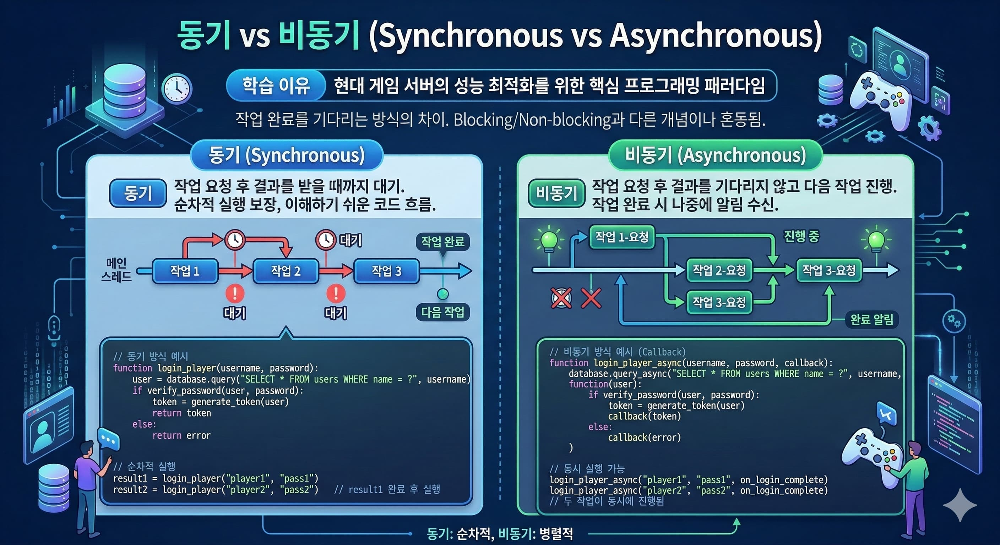  


비동기 프로그래밍의 진화 과정을 살펴보자.

### **콜백(Callback)**

가장 기본적인 비동기 패턴이다. 작업이 완료되면 호출될 함수를 전달한다.

```
function process_game_action(player_id, action, callback):
    get_player_async(player_id, function(player):
        validate_action_async(player, action, function(is_valid):
            if is_valid:
                apply_action_async(player, action, function(result):
                    update_db_async(player, function(success):
                        callback(success)
                    )
                )
            else:
                callback(error)
        )
    )
```

콜백의 문제는 **콜백 지옥(Callback Hell)**이다. 중첩이 깊어질수록 코드의 가독성이 급격히 떨어진다.

### **Future/Promise**
콜백 지옥을 해결하기 위한 패턴이다. 미래의 결과를 나타내는 객체를 반환한다.

```
function process_game_action(player_id, action):
    return get_player_async(player_id)
        .then(player => validate_action_async(player, action))
        .then(is_valid => {
            if is_valid:
                return apply_action_async(player, action)
            else:
                throw error
        })
        .then(result => update_db_async(player))
        .catch(error => handle_error(error))
```

체이닝 방식으로 순차적인 흐름을 표현할 수 있어 가독성이 향상된다.

### **async/await**
가장 최신의 비동기 패턴으로, 동기 코드처럼 작성하면서 비동기로 실행된다.

```
async function process_game_action(player_id, action):
    try:
        player = await get_player_async(player_id)
        is_valid = await validate_action_async(player, action)
        
        if is_valid:
            result = await apply_action_async(player, action)
            success = await update_db_async(player)
            return success
        else:
            throw error
    
    catch error:
        handle_error(error)
```

코드가 순차적으로 읽히지만, 실제로는 각 `await`에서 다른 작업이 진행될 수 있다.

```
동기 vs 비동기 실행 흐름:

동기:
Task1: [====실행====]
                    Task2: [====실행====]
                                        Task3: [====실행====]
총 시간: Task1 + Task2 + Task3

비동기:
Task1: [====실행====]
Task2: [====실행====]
Task3: [====실행====]
총 시간: max(Task1, Task2, Task3)

→ I/O 대기 시간을 활용해 동시 처리
```

---
 

## **버퍼링 (Buffering)**

**학습 이유**: 네트워크 데이터 전송의 임시 저장 메커니즘을 이해하면, 성능 문제와 버그를 해결할 수 있다.

버퍼는 데이터를 임시로 저장하는 메모리 영역이다. 네트워크 통신에서 버퍼는 필수적이다. 왜냐하면 데이터를 생성하는 속도와 전송하는 속도, 그리고 수신하는 속도가 모두 다르기 때문이다.

### **송신 버퍼 (Send Buffer)**
애플리케이션이 `send` 함수를 호출하면, 데이터는 즉시 네트워크로 전송되지 않는다. 먼저 커널의 송신 버퍼에 복사된다. 실제 전송은 운영체제가 적절한 시점에 수행한다.

```
// 게임 서버에서 플레이어에게 위치 업데이트 전송
position_data = {x: 100, y: 200, z: 50}
bytes_sent = send(client_socket, position_data)

// bytes_sent는 네트워크로 전송된 바이트가 아니라
// 송신 버퍼로 복사된 바이트 수
```

송신 버퍼가 가득 차면 어떻게 될까? Blocking 소켓에서는 `send` 함수가 공간이 생길 때까지 대기한다. Non-blocking 소켓에서는 `EWOULDBLOCK` 에러를 반환한다. 이는 "나중에 다시 시도하라"는 의미다.

송신 버퍼가 가득 차는 경우는 다음과 같다:
- 네트워크 대역폭보다 빠르게 데이터를 전송하려고 할 때
- 수신자의 수신 버퍼가 가득 차서 TCP 흐름 제어가 작동할 때
- 네트워크 지연이 심할 때

송신 버퍼 크기는 성능에 중요한 영향을 미친다. 너무 작으면 자주 대기하게 되고, 너무 크면 메모리를 낭비하고 지연시간이 증가한다.

```
// 송신 버퍼 크기 조정
buffer_size = 256 * 1024  // 256KB
set_socket_option(socket, SO_SNDBUF, buffer_size)
```

### **수신 버퍼 (Receive Buffer)**
네트워크로부터 도착한 데이터는 수신 버퍼에 저장된다. 애플리케이션이 `recv` 함수를 호출하면, 이 버퍼에서 데이터를 읽어간다.

```
buffer = allocate(4096)  // 4KB 버퍼
bytes_received = recv(client_socket, buffer)

// bytes_received는 실제로 읽은 바이트 수
// 4KB를 요청했지만 1KB만 읽을 수도 있음
```

수신 버퍼의 중요한 특징은 **스트림 특성**이다. TCP는 바이트 스트림이므로, 데이터의 경계가 없다. 100바이트를 보냈다고 해서 `recv`가 정확히 100바이트를 반환하는 것이 아니다. 50바이트씩 두 번에 나눠 받을 수도 있고, 200바이트를 한 번에 받을 수도 있다.

```
// 잘못된 코드 예시
struct GamePacket {
    int type;
    int data[10];
};

GamePacket packet;
recv(socket, &packet, sizeof(packet));  // 위험!
// 일부만 받을 수 있음

// 올바른 코드
bytes_total = 0
bytes_needed = sizeof(GamePacket)
buffer = allocate(bytes_needed)

while bytes_total < bytes_needed:
    bytes = recv(socket, buffer + bytes_total, bytes_needed - bytes_total)
    if bytes <= 0:
        // 연결 종료 또는 에러
        break
    bytes_total += bytes
```

수신 버퍼가 가득 차면 TCP의 흐름 제어가 작동한다. 수신자는 송신자에게 "더 이상 받을 수 없어, 잠시 기다려"라는 신호를 보낸다. 송신자는 전송을 중단하고 대기한다.

```
수신 버퍼 메커니즘:

네트워크 → [수신 버퍼] → recv() → 애플리케이션

상황 1: 정상
[데이터_______________] ← 충분한 공간
         ↑ recv()로 읽어감

상황 2: 버퍼 가득 참
[데이터데이터데이터데이터] ← 공간 없음
→ TCP 윈도우 크기 0 통지
→ 송신자 전송 중단

상황 3: 애플리케이션 읽기 후
[_____________________] ← 공간 생김
→ TCP 윈도우 크기 갱신 통지
→ 송신자 전송 재개
```
  
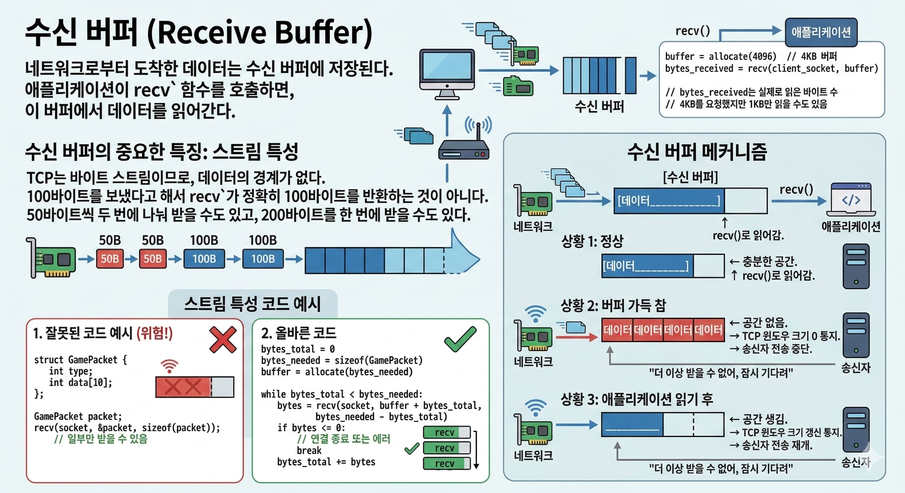  

### **버퍼 크기 조정**
버퍼 크기는 성능 최적화의 핵심 포인트다. 게임의 특성에 따라 적절한 크기를 설정해야 한다.

**대역폭-지연 곱(Bandwidth-Delay Product)**이라는 개념이 중요하다. 이는 네트워크를 "파이프"로 생각했을 때, 파이프 안에 동시에 존재할 수 있는 데이터의 양이다.

```
최적 버퍼 크기 = 대역폭 × RTT

예: 대역폭 1Mbps, RTT 100ms
최적 버퍼 = (1,000,000 bits/s) × (0.1s) = 100,000 bits = 12,500 bytes
```

게임 서버에서는 일반적으로 다음과 같이 설정한다:
- 실시간 액션 게임: 작은 버퍼 (4KB~32KB) - 지연 최소화
- MMORPG: 중간 버퍼 (64KB~256KB) - 균형
- 파일 다운로드: 큰 버퍼 (1MB 이상) - 처리량 최대화

---
  

## **바이트 오더 (Byte Order / Endianness)**

**학습 이유**: 서로 다른 시스템 간 데이터 교환 시 발생하는 오류를 방지하기 위한 필수 개념이다.

바이트 오더는 다중 바이트 데이터를 메모리에 저장하는 순서를 의미한다. 예를 들어 32비트 정수 `0x12345678`을 어떤 순서로 저장할 것인가의 문제다.

### **Big-Endian**
가장 큰 자릿수(Most Significant Byte)를 낮은 주소에 저장한다. 사람이 숫자를 쓰는 방식과 같다.

```
0x12345678을 Big-Endian으로 저장:

주소:  0x1000  0x1001  0x1002  0x1003
값:     0x12    0x34    0x56    0x78
       [최상위 바이트]  [최하위 바이트]
```

네트워크 프로토콜은 Big-Endian을 표준으로 사용한다. 이를 **Network Byte Order**라고 부른다.

### **Little-Endian**
가장 작은 자릿수(Least Significant Byte)를 낮은 주소에 저장한다. 대부분의 CPU(Intel x86, AMD64, ARM)가 사용하는 방식이다.

```
0x12345678을 Little-Endian으로 저장:

주소:  0x1000  0x1001  0x1002  0x1003
값:     0x78    0x56    0x34    0x12
       [최하위 바이트]  [최상위 바이트]
```

### **왜 중요한가?**

클라이언트(Little-Endian CPU)가 정수 `12345`를 그대로 네트워크로 전송하고, 서버가 이를 읽으면 완전히 다른 값이 된다.

```
클라이언트 (Little-Endian):
12345 (0x00003039)를 메모리에 저장
메모리: [39][30][00][00]

네트워크로 전송 (바이트 스트림):
[39][30][00][00]

서버 (Big-Endian)가 수신:
메모리에서 읽을 때 [39][30][00][00]를 0x39300000으로 해석
→ 전혀 다른 값!
```  

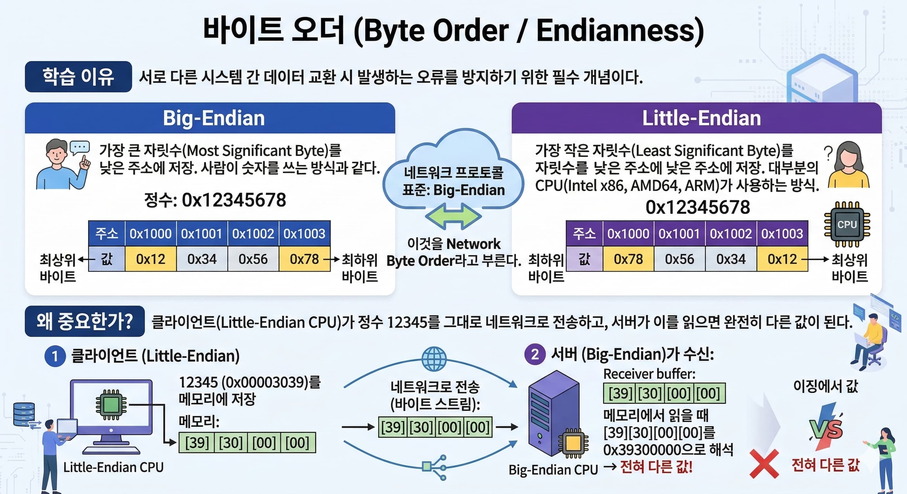  
  

### **변환 함수**

이 문제를 해결하기 위해 표준 변환 함수를 사용한다:

**htonl**: Host TO Network Long (32비트)
**htons**: Host TO Network Short (16비트)
**ntohl**: Network TO Host Long (32비트)
**ntohs**: Network TO Host Short (16비트)

```
// 송신 측
port_number = 7777
game_id = 12345

packet = {
    port: htons(port_number),    // 호스트 → 네트워크 바이트 오더
    id: htonl(game_id)
}
send(socket, packet)

// 수신 측
receive(socket, packet)
port_number = ntohs(packet.port)  // 네트워크 → 호스트 바이트 오더
game_id = ntohl(packet.id)
```

Big-Endian 시스템에서는 이 함수들이 아무 작업도 하지 않는다(이미 네트워크 바이트 오더이므로). Little-Endian 시스템에서만 바이트를 뒤집는다. 따라서 성능 걱정 없이 항상 사용하면 된다.

```
바이트 오더 변환 과정:

송신 (Little-Endian PC):
12345 → htonl() → 네트워크 → ntohl() → 12345
[39][30][00][00]          [00][00][30][39]

수신 (Big-Endian Server):
12345 ← ntohl() ← 네트워크 ← htonl() ← 12345
[00][00][30][39]          [00][00][30][39]
```

### **실전 적용**
게임 프로토콜을 설계할 때 주의사항:

```
// 잘못된 예: 구조체를 그대로 전송
struct GamePacket {
    int32_t player_id;      // 4 bytes
    int16_t x, y;           // 2 bytes each
    float velocity;         // 4 bytes
};

GamePacket packet;
send(socket, &packet, sizeof(packet));  // 위험!

// 올바른 예: 명시적 변환
struct GamePacket {
    int32_t player_id;
    int16_t x, y;
    float velocity;
};

GamePacket packet = {12345, 100, 200, 5.5f};

// 송신
buffer[0..3] = htonl(packet.player_id)
buffer[4..5] = htons(packet.x)
buffer[6..7] = htons(packet.y)
buffer[8..11] = serialize_float(packet.velocity)  // float도 변환 필요
send(socket, buffer, 12)

// 수신
packet.player_id = ntohl(buffer[0..3])
packet.x = ntohs(buffer[4..5])
packet.y = ntohs(buffer[6..7])
packet.velocity = deserialize_float(buffer[8..11])
```

부동소수점 수(float, double)는 표준 변환 함수가 없으므로, IEEE 754 표준에 따라 직접 변환하거나 라이브러리를 사용해야 한다.   