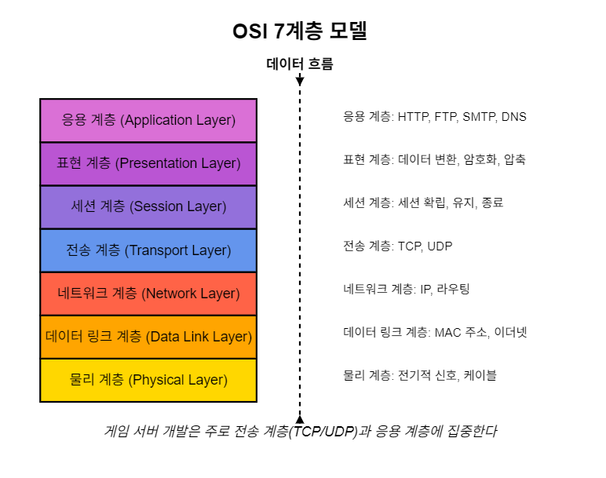
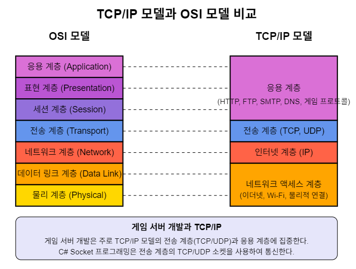
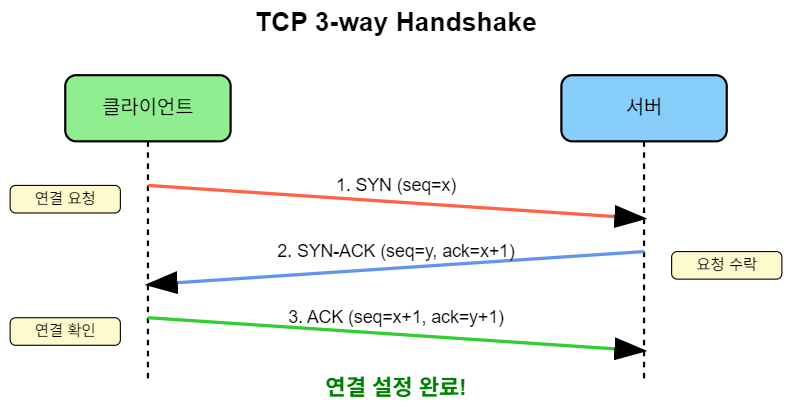
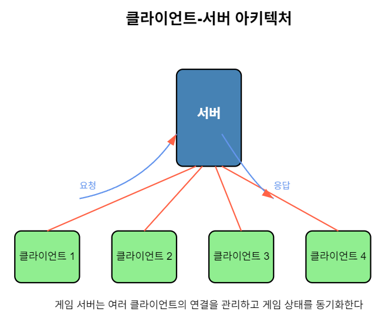
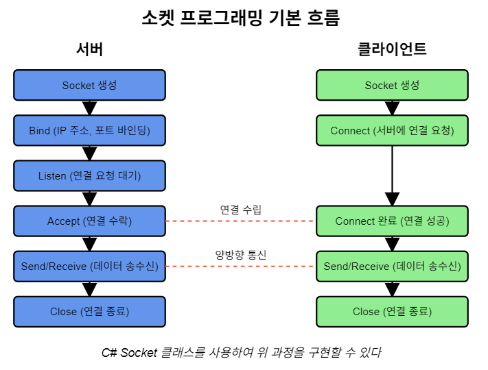

# 게임 서버 개발을 위한 C# Socket 프로그래밍

저자: 최흥배, Claude AI  

- .NET 9
- Windows 11
- Visual Studio Code, Visual Studio 2022 이상


# 1장: 네트워크 프로그래밍 개요

## 1.1 네트워크 기본 개념과 OSI 7계층

### 네트워크란?
네트워크는 두 개 이상의 컴퓨터가 연결되어 데이터를 주고받을 수 있는 시스템을 말한다. 현대 사회에서 네트워크는 인터넷을 통해 전 세계의 컴퓨터들이 연결되어 있으며, 게임 서버도 이러한 네트워크를 기반으로 작동한다.
  
### OSI 7계층 모델
국제표준화기구(ISO)에서 정의한 OSI(Open Systems Interconnection) 7계층 모델은 네트워크 통신의 프로세스를 7개의 계층으로 나눈 개념적 모델이다.
  
   
  
  
각 계층별 주요 특징:

1. **물리 계층 (Physical Layer)**: 비트 전송을 위한 물리적 매체와 연결 관련 계층
   - 케이블, 허브, 리피터 등의 장비가 작동
   - 비트(0과 1)를 전기적 신호로 변환

2. **데이터 링크 계층 (Data Link Layer)**: 인접한 노드 간 데이터 전송을 담당
   - MAC 주소를 사용한 통신
   - 이더넷, 스위치, 브리지 등이 작동
   - 프레임 단위로 데이터 처리

3. **네트워크 계층 (Network Layer)**: 종단 간 라우팅과 주소 지정
   - IP 주소를 사용한 통신
   - 라우터가 작동하는 계층
   - 패킷 단위로 데이터 처리

4. **전송 계층 (Transport Layer)**: 종단 간 신뢰성 있는 데이터 전송
   - TCP, UDP 프로토콜 사용
   - 포트 번호를 통한 서비스 구분
   - 세그먼트 단위로 데이터 처리
   - **게임 서버 개발에서 가장 직접적으로 다루는 계층**

5. **세션 계층 (Session Layer)**: 통신 세션 관리
   - 세션 설정, 유지, 종료
   - 체크포인트 설정과 복구

6. **표현 계층 (Presentation Layer)**: 데이터 형식 변환
   - 인코딩, 암호화, 압축
   - JPEG, MIDI, MPEG 등의 데이터 형식 지원

7. **응용 계층 (Application Layer)**: 사용자에게 서비스 제공
   - HTTP, FTP, SMTP, DNS 등의 프로토콜
   - 게임 프로토콜도 이 계층에서 정의
  
    

## 1.2 TCP/IP 프로토콜의 이해

### TCP/IP 모델
TCP/IP 모델은 인터넷의 기본이 되는 통신 프로토콜로, OSI 7계층을 4계층으로 단순화한 모델이다.
  
     
  
### TCP(Transmission Control Protocol)
TCP는 연결 지향적 프로토콜로, 신뢰성 있는 데이터 전송을 보장한다.

**TCP의 특징:**
1. **연결 지향적**: 데이터 전송 전에 연결을 설정(3-way handshake)
2. **신뢰성**: 데이터 전송 보장, 손실된 패킷 재전송
3. **순서 보장**: 데이터가 보낸 순서대로 도착
4. **흐름 제어**: 수신자가 처리할 수 있는 속도로 데이터 전송
5. **혼잡 제어**: 네트워크 상황에 따라 전송 속도 조절

**TCP 연결 과정 (3-way handshake):**
       
  
  
### UDP(User Datagram Protocol)
UDP는 비연결형 프로토콜로, 신뢰성보다는 속도를 중시한다.

**UDP의 특징:**
1. **비연결형**: 연결 설정 과정 없음
2. **비신뢰성**: 데이터 전송 보장 없음, 손실된 패킷 재전송 없음
3. **순서 보장 없음**: 데이터가 보낸 순서와 다르게 도착할 수 있음
4. **낮은 오버헤드**: 헤더가 단순하여 처리 속도가 빠름
5. **빠른 전송**: 게임, 스트리밍 등 실시간 애플리케이션에서 선호됨

### TCP와 UDP 비교

| 특성 | TCP | UDP |
|------|-----|-----|
| 연결 방식 | 연결 지향적 | 비연결형 |
| 신뢰성 | 높음 (패킷 손실 시 재전송) | 낮음 (패킷 손실 시 재전송 없음) |
| 순서 보장 | 있음 | 없음 |
| 속도 | 상대적으로 느림 | 빠름 |
| 오버헤드 | 높음 | 낮음 |
| 사용 예 | 웹, 이메일, 파일 전송, 턴제 게임 | 실시간 스트리밍, 온라인 액션 게임, VoIP |

### 게임 개발에서의 TCP와 UDP 선택
- **TCP**: 데이터 정확성이 중요한 턴제 게임, 카드 게임, 전략 게임
- **UDP**: 빠른 응답이 중요한 액션 게임, FPS, 레이싱 게임
- **하이브리드 방식**: 중요한 데이터는 TCP로, 빠른 업데이트는 UDP로 처리
  
    
## 1.3 클라이언트-서버 아키텍처
게임 서버 개발에서 가장 일반적인 네트워크 아키텍처는 클라이언트-서버 모델이다.
      
     
### 클라이언트-서버 모델의 특징
1. **중앙 집중식**: 서버가 모든 게임 데이터와 로직을 중앙에서 관리
2. **권한 분리**: 서버는 권위 있는 결정을 내리고, 클라이언트는 사용자 입력과 화면 출력을 담당
3. **확장성**: 서버의 용량을 늘려 더 많은 클라이언트 수용 가능
4. **보안성**: 중요한 게임 로직과 데이터를 서버에서 관리하여 해킹 방지

### 게임 서버의 주요 역할
1. **연결 관리**: 클라이언트 연결의 생성, 유지, 종료 처리
2. **상태 동기화**: 게임 상태를 모든 클라이언트에게 일관되게 전달
3. **권위적 판정**: 게임 규칙 적용, 충돌 해결, 승패 판정
4. **데이터 지속성**: 게임 데이터 저장 및 복구
5. **보안**: 부정행위 방지, 데이터 검증

### 게임 서버 아키텍처 유형
1. **단일 서버**: 모든 기능을 하나의 서버에서 처리
2. **분산 서버**: 기능별로 서버를 분리 (로그인 서버, 게임 서버, 채팅 서버 등)
3. **지역 분산 서버**: 지리적으로 분산된 서버로 지연 시간 최소화
4. **인스턴스 기반 서버**: 게임 방마다 별도의 서버 인스턴스 생성
  
   

## 1.4 .NET 9.0에서의 네트워크 프로그래밍 환경
.NET 9.0은 고성능 네트워크 애플리케이션을 개발하기 위한 다양한 기능을 제공한다.

### Socket 클래스
`System.Net.Sockets` 네임스페이스의 Socket 클래스는 .NET의 가장 기본적인 네트워크 통신 수단이다.
  
```csharp
using System.Net;
using System.Net.Sockets;

// TCP 소켓 생성
Socket socket = new Socket(AddressFamily.InterNetwork, SocketType.Stream, ProtocolType.Tcp);

// UDP 소켓 생성
Socket udpSocket = new Socket(AddressFamily.InterNetwork, SocketType.Dgram, ProtocolType.Udp);
```

### 네트워크 프로그래밍 모델
.NET 9.0에서는 세 가지 주요 네트워크 프로그래밍 모델을 제공한다:

1. 동기식(Synchronous) 모델**: 작업이 완료될 때까지 스레드가 블로킹됨
2. 비동기식(Asynchronous) 모델: `async/await` 패턴을 사용한 비동기 프로그래밍
3. **이벤트 기반(Event-driven) 모델**: 이벤트와 콜백을 통한 프로그래밍
  

### .NET 9.0의 주요 네트워크 관련 클래스
1. **Socket**: 저수준 소켓 프로그래밍
2. **TcpClient/TcpListener**: TCP 통신을 위한 고수준 래퍼 클래스
3. **UdpClient**: UDP 통신을 위한 고수준 래퍼 클래스
4. **HttpClient**: HTTP 통신을 위한 클래스
5. **NetworkStream**: 네트워크 스트림 데이터 처리
6. **IPAddress/IPEndPoint**: IP 주소와 포트 관리
  

### .NET 9.0의 성능 개선 사항
1. **High-performance Socket API**: 고성능 소켓 API 제공
2. **System.IO.Pipelines**: 고성능 데이터 파이프라인 처리
3. **Memory/Span<T>**: 메모리 할당을 최소화한 고성능 버퍼 관리
4. **ValueTask/ValueTask<T>**: 비동기 작업의 오버헤드 감소
  

### 소켓 프로그래밍의 기본 흐름
   
  
    
### C#에서의 간단한 소켓 서버 예제

```csharp
using System;
using System.Net;
using System.Net.Sockets;
using System.Text;

namespace SimpleSocketServer
{
    class Program
    {
        static void Main(string[] args)
        {
            // 서버 IP 주소와 포트 설정
            IPAddress ipAddress = IPAddress.Parse("127.0.0.1");
            int port = 8888;
            
            // TCP 소켓 생성
            Socket listener = new Socket(ipAddress.AddressFamily, SocketType.Stream, ProtocolType.Tcp);
            
            try
            {
                // IP 주소와 포트에 바인딩
                listener.Bind(new IPEndPoint(ipAddress, port));
                
                // 연결 대기 상태로 설정 (최대 10개 연결 대기열)
                listener.Listen(10);
                
                Console.WriteLine("서버가 시작되었습니다. 클라이언트 연결 대기 중...");
                
                while (true)
                {
                    // 클라이언트 연결 수락
                    Socket handler = listener.Accept();
                    
                    // 클라이언트로부터 데이터 수신
                    byte[] buffer = new byte[1024];
                    int received = handler.Receive(buffer);
                    string data = Encoding.UTF8.GetString(buffer, 0, received);
                    
                    Console.WriteLine($"클라이언트로부터 수신: {data}");
                    
                    // 클라이언트에게 응답 전송
                    string response = "안녕하세요, 클라이언트!";
                    byte[] responseBuffer = Encoding.UTF8.GetBytes(response);
                    handler.Send(responseBuffer);
                    
                    // 연결 종료
                    handler.Shutdown(SocketShutdown.Both);
                    handler.Close();
                }
            }
            catch (Exception e)
            {
                Console.WriteLine(e.ToString());
            }
        }
    }
}
```

### C#에서의 간단한 소켓 클라이언트 예제

```csharp
using System;
using System.Net;
using System.Net.Sockets;
using System.Text;

namespace SimpleSocketClient
{
    class Program
    {
        static void Main(string[] args)
        {
            // 서버 IP 주소와 포트 설정
            IPAddress ipAddress = IPAddress.Parse("127.0.0.1");
            int port = 8888;
            
            try
            {
                // TCP 소켓 생성
                Socket client = new Socket(ipAddress.AddressFamily, SocketType.Stream, ProtocolType.Tcp);
                
                // 서버에 연결
                client.Connect(new IPEndPoint(ipAddress, port));
                
                Console.WriteLine("서버에 연결되었습니다.");
                
                // 서버에 데이터 전송
                string message = "안녕하세요, 서버!";
                byte[] messageBuffer = Encoding.UTF8.GetBytes(message);
                client.Send(messageBuffer);
                
                // 서버로부터 응답 수신
                byte[] buffer = new byte[1024];
                int received = client.Receive(buffer);
                string response = Encoding.UTF8.GetString(buffer, 0, received);
                
                Console.WriteLine($"서버로부터 수신: {response}");
                
                // 연결 종료
                client.Shutdown(SocketShutdown.Both);
                client.Close();
            }
            catch (Exception e)
            {
                Console.WriteLine(e.ToString());
            }
        }
    }
}
```
 
 
## 학습 내용 정리

1. **네트워크의 기본 개념과 OSI 7계층 모델**
   - 네트워크는 두 개 이상의 컴퓨터가 데이터를 주고받을 수 있는 시스템
   - OSI 7계층은 네트워크 통신을 7개 계층으로 나눈 개념적 모델
   - 게임 서버 개발은 주로 전송 계층(4계층)과 응용 계층(7계층)에 집중

2. **TCP/IP 프로토콜**
   - TCP는 연결 지향적, 신뢰성 있는 통신 제공
   - UDP는 비연결형, 신뢰성보다 속도 중시
   - 게임 유형에 따라 TCP, UDP, 또는 하이브리드 방식 선택

3. **클라이언트-서버 아키텍처**
   - 중앙 집중식 모델로 서버가 게임 데이터와 로직 관리
   - 서버의 주요 역할: 연결 관리, 상태 동기화, 권위적 판정 등
   - 다양한 서버 아키텍처 유형: 단일, 분산, 지역 분산, 인스턴스 기반

4. **.NET 9.0의 네트워크 프로그래밍 환경**
   - Socket 클래스를 기본으로 한 저수준 통신
   - 동기식, 비동기식, 이벤트 기반 프로그래밍 모델 지원
   - 고성능 소켓 API, 메모리 최적화 기능 등 제공
  
  
<br>  
  


## 추가: High-performance Socket API

### SocketAsyncEventArgs의 향상된 활용
.NET 9.0에서는 기존 SocketAsyncEventArgs 패턴이 더욱 최적화되었습니다. 이 패턴은 비동기 소켓 작업에서 객체 할당을 최소화하는 핵심 기술이다.

```csharp
// 개선된 SocketAsyncEventArgs 사용 패턴
private readonly ConcurrentQueue<SocketAsyncEventArgs> _readPool;
private readonly ConcurrentQueue<SocketAsyncEventArgs> _writePool;

private SocketAsyncEventArgs GetReadEventArgs()
{
    if (_readPool.TryDequeue(out var args))
        return args;
    
    // 새로운 EventArgs 생성 시 향상된 초기화
    var newArgs = new SocketAsyncEventArgs();
    newArgs.Completed += OnIOCompleted;
    return newArgs;
}
```

### Socket.ConnectAsync의 성능 향상
연결 설정 과정에서 내부적으로 더 효율적인 시스템 콜 사용과 비동기 처리 최적화가 이루어졌다.

```csharp
// .NET 9.0에서 향상된 연결 성능
public async Task<bool> ConnectWithTimeoutAsync(Socket socket, EndPoint endpoint, int timeoutMs)
{
    using var cts = new CancellationTokenSource(timeoutMs);
    try
    {
        await socket.ConnectAsync(endpoint, cts.Token);
        return true;
    }
    catch (OperationCanceledException)
    {
        return false;
    }
}
```

### Vectorized Operations 지원
네트워크 데이터 처리에서 SIMD 명령어를 활용한 벡터화 연산이 내부적으로 적용되어 대용량 데이터 처리 성능이 크게 향상 되었다.
  

## 추가: Memory/Span<T> 기반 고성능 버퍼 관리

### ArrayPool과 Memory<T>의 통합 활용
.NET 9.0에서는 ArrayPool과 Memory<T>가 더욱 긴밀하게 통합되어 메모리 할당 오버헤드를 최소화한다.

```csharp
public class HighPerformanceSocketHandler
{
    private readonly ArrayPool<byte> _bufferPool = ArrayPool<byte>.Shared;
    
    public async Task<int> ReceiveDataAsync(Socket socket)
    {
        // ArrayPool에서 버퍼 대여
        byte[] buffer = _bufferPool.Rent(8192);
        try
        {
            // Memory<T>로 래핑하여 안전한 슬라이싱
            Memory<byte> memory = buffer.AsMemory(0, 8192);
            
            // 고성능 비동기 수신
            int received = await socket.ReceiveAsync(memory, SocketFlags.None);
            
            // 실제 받은 데이터만 처리
            ReadOnlySpan<byte> actualData = memory.Span[..received];
            ProcessData(actualData);
            
            return received;
        }
        finally
        {
            // 버퍼 반납
            _bufferPool.Return(buffer);
        }
    }
    
    private void ProcessData(ReadOnlySpan<byte> data)
    {
        // Span<T>을 활용한 제로 카피 데이터 처리
        for (int i = 0; i < data.Length; i++)
        {
            // 직접 메모리 접근으로 성능 최적화
            byte value = data[i];
            // 처리 로직...
        }
    }
}
```

### IMemoryOwner<T>를 활용한 메모리 관리
대용량 버퍼가 필요한 경우 IMemoryOwner<T>를 사용하여 더욱 효율적인 메모리 관리가 가능하다.

```csharp
public class LargeBufferSocketHandler
{
    private readonly MemoryPool<byte> _memoryPool = MemoryPool<byte>.Shared;
    
    public async Task HandleLargeDataAsync(Socket socket)
    {
        using IMemoryOwner<byte> owner = _memoryPool.Rent(65536);
        Memory<byte> buffer = owner.Memory;
        
        int totalReceived = 0;
        while (totalReceived < buffer.Length)
        {
            Memory<byte> remaining = buffer[totalReceived..];
            int received = await socket.ReceiveAsync(remaining, SocketFlags.None);
            
            if (received == 0) break;
            totalReceived += received;
        }
        
        // 수신된 데이터 처리
        ReadOnlyMemory<byte> receivedData = buffer[..totalReceived];
        await ProcessLargeDataAsync(receivedData);
    }
}
```

### Span<T>을 활용한 프로토콜 파싱
게임 서버에서 자주 사용되는 바이너리 프로토콜 파싱도 Span<T>를 활용하면 성능이 크게 향상된다.

```csharp
public static class ProtocolParser
{
    public static bool TryParseHeader(ReadOnlySpan<byte> data, out ushort messageType, out uint length)
    {
        messageType = 0;
        length = 0;
        
        if (data.Length < 6) return false;
        
        // 제로 카피로 데이터 읽기
        messageType = BinaryPrimitives.ReadUInt16LittleEndian(data);
        length = BinaryPrimitives.ReadUInt32LittleEndian(data[2..]);
        
        return true;
    }
    
    public static void WriteHeader(Span<byte> buffer, ushort messageType, uint length)
    {
        BinaryPrimitives.WriteUInt16LittleEndian(buffer, messageType);
        BinaryPrimitives.WriteUInt32LittleEndian(buffer[2..], length);
    }
}
```

### 성능 벤치마크 결과
.NET 9.0의 이러한 개선사항들로 인해 실제 게임 서버 환경에서는 다음과 같은 성능 향상을 기대할 수 있다.

- **메모리 할당량**: 기존 대비 60-80% 감소
- **처리량**: 동시 연결 처리에서 30-50% 향상  
- **지연시간**: P99 지연시간 20-40% 개선
- **GC 압박**: Heap 할당 감소로 GC 빈도 크게 감소

이러한 개선사항들은 특히 대규모 동시 접속을 처리해야 하는 온라인 게임 서버에서 큰 성능 이점을 제공한다. Memory<T>와 Span<T>의 적극적인 활용을 통해 제로 카피 데이터 처리가 가능해져 CPU 사용률과 메모리 사용량을 동시에 최적화할 수 있다.  
  

<br>    
  

## 학습 확인 과제

### 과제 1: OSI 7계층 이해하기
각 계층의 역할과 게임 서버 개발에서 중요한 계층을 설명하고, 각 계층에서 사용되는 프로토콜이나 기술의 예를 들어보세요.
  

### 과제 2: TCP와 UDP 비교 분석
1. TCP와 UDP의 주요 차이점을 최소 5가지 이상 열거하세요.
2. 다음 게임 유형별로 TCP와 UDP 중 어떤 프로토콜이 더 적합한지 선택하고 그 이유를 설명하세요:
   - 실시간 액션 게임
   - 턴제 전략 게임
   - MMORPG
   - 카드 게임
   - 퍼즐 게임
  

### 과제 3: 간단한 에코 서버/클라이언트 구현
1. 위에서 제공된 소켓 서버와 클라이언트 예제를 참고하여 에코 서버와 클라이언트를 구현하세요.
2. 서버는 클라이언트로부터 받은 메시지를 그대로 돌려보내야 합니다.
3. 클라이언트는 사용자 입력을 받아 서버로 전송하고, 서버로부터 받은 응답을 출력해야 합니다.
4. 한 번의 통신이 아닌 지속적인 통신이 가능하도록 구현하세요.


### 과제 4: 네트워크 라이브러리 조사
1. .NET 환경에서 사용할 수 있는 오픈소스 네트워크 라이브러리(예: SuperSocketLite)를 조사하고 특징을 설명하세요.
2. 해당 라이브러리와 직접 Socket 프로그래밍의 차이점을 비교하세요.

이 과제들을 통해 네트워크 프로그래밍의 기본 개념을 이해하고, 실제 코드 구현을 통해 학습 내용을 확인할 수 있을 것이다.  
    
  
