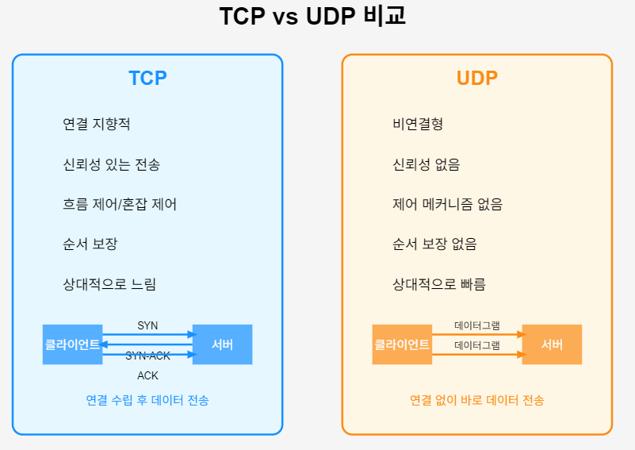
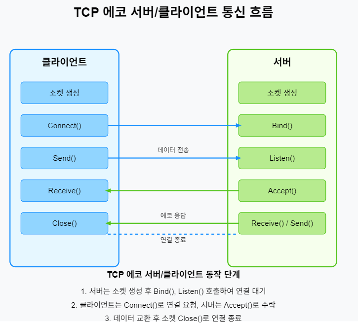
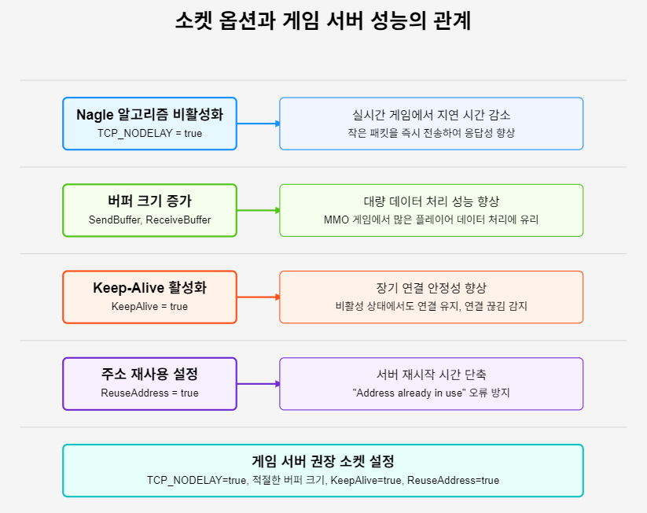

# 게임 서버 개발을 위한 C# Socket 프로그래밍

저자: 최흥배, Claude AI  

- .NET 9
- Windows 11
- Visual Studio Code, Visual Studio 2022 이상


# 2장: 소켓 프로그래밍의 기초

## 소켓의 개념과 종류
소켓은 네트워크 통신을 위한 엔드포인트로, 프로그램이 네트워크를 통해 데이터를 주고받을 수 있게 해주는 인터페이스다. 운영체제가 제공하는 API를 통해 애플리케이션이 네트워크 자원에 접근할 수 있다.

소켓의 주요 종류:
- **스트림 소켓(Stream Socket)**: TCP 프로토콜 기반. 신뢰성 있는 양방향 통신 제공
- **데이터그램 소켓(Datagram Socket)**: UDP 프로토콜 기반. 비연결형 통신 제공
- **로우 소켓(Raw Socket)**: 하위 수준 프로토콜에 직접 접근 가능

.NET에서는 `System.Net.Sockets` 네임스페이스를 통해 소켓 프로그래밍을 지원한다.

```csharp
// 기본 소켓 생성 예제
using System.Net.Sockets;

// TCP 소켓 생성
Socket tcpSocket = new Socket(AddressFamily.InterNetwork, 
                             SocketType.Stream, 
                             ProtocolType.Tcp);

// UDP 소켓 생성
Socket udpSocket = new Socket(AddressFamily.InterNetwork, 
                             SocketType.Dgram, 
                             ProtocolType.Udp);
```

## TCP 소켓 vs UDP 소켓

### TCP 소켓 (전송 제어 프로토콜)
- **연결 지향적**: 통신 전 연결 설정 필요
- **신뢰성 있는 전송**: 패킷 손실, 중복, 순서 문제 해결
- **흐름 제어와 혼잡 제어**: 네트워크와 수신자 상태에 맞춰 전송 속도 조절
- **게임 적용**: 정확한 데이터 전송이 중요한 경우 (게임 로그인, 아이템 거래 등)

### UDP 소켓 (사용자 데이터그램 프로토콜)
- **비연결형**: 연결 설정 없이 즉시 데이터 전송
- **신뢰성 없음**: 패킷 손실, 중복, 순서 보장 없음
- **낮은 오버헤드**: 헤더가 작고 처리 과정이 단순
- **게임 적용**: 실시간성이 중요한 경우 (캐릭터 위치, 실시간 액션 등)

```csharp
// TCP와 UDP 소켓 생성 비교
// TCP 소켓
using System.Net;
using System.Net.Sockets;

// TCP 소켓 생성 및 연결
Socket tcpClient = new Socket(AddressFamily.InterNetwork, SocketType.Stream, ProtocolType.Tcp);
tcpClient.Connect(new IPEndPoint(IPAddress.Parse("127.0.0.1"), 8080));
tcpClient.Send(new byte[] { 1, 2, 3, 4 }); // 데이터 전송
tcpClient.Close(); // 연결 종료

// UDP 소켓
Socket udpClient = new Socket(AddressFamily.InterNetwork, SocketType.Dgram, ProtocolType.Udp);
udpClient.SendTo(new byte[] { 1, 2, 3, 4 }, 
                new IPEndPoint(IPAddress.Parse("127.0.0.1"), 8080)); // 연결 없이 데이터 전송
udpClient.Close();
```  
  
   
    
  
## 간단한 TCP 에코 서버/클라이언트 구현
TCP 에코 서버는 클라이언트로부터 받은 데이터를 그대로 되돌려주는 간단한 서버다. 이는 네트워크 연결을 테스트하는 기본적인 예제다.

     

### TCP 에코 서버 구현

```csharp
using System;
using System.Net;
using System.Net.Sockets;
using System.Text;

namespace TcpEchoServer
{
    class Program
    {
        static void Main(string[] args)
        {
            // 서버 IP 주소와 포트 설정
            IPAddress ipAddress = IPAddress.Parse("127.0.0.1");
            int port = 8080;
            
            // TCP 소켓 생성
            Socket serverSocket = new Socket(AddressFamily.InterNetwork, 
                                            SocketType.Stream, 
                                            ProtocolType.Tcp);
            
            try
            {
                // 소켓과 로컬 엔드포인트 연결
                serverSocket.Bind(new IPEndPoint(ipAddress, port));
                
                // 연결 대기열 설정
                serverSocket.Listen(10);
                
                Console.WriteLine("에코 서버가 시작되었습니다.");
                Console.WriteLine($"IP 주소: {ipAddress}, 포트: {port}");
                
                while (true)
                {
                    Console.WriteLine("클라이언트 연결 대기 중...");
                    
                    // 클라이언트 연결 수락
                    Socket clientSocket = serverSocket.Accept();
                    
                    // 클라이언트 정보 출력
                    IPEndPoint? clientEndPoint = clientSocket.RemoteEndPoint as IPEndPoint;
                    Console.WriteLine($"클라이언트 연결됨: {clientEndPoint?.Address}:{clientEndPoint?.Port}");
                    
                    // 데이터 수신 버퍼
                    byte[] buffer = new byte[1024];
                    
                    try
                    {
                        while (true)
                        {
                            // 데이터 수신
                            int bytesRead = clientSocket.Receive(buffer);
                            
                            if (bytesRead == 0)
                            {
                                Console.WriteLine("클라이언트가 연결을 종료했습니다.");
                                break;
                            }
                            
                            // 수신된 데이터 처리
                            string data = Encoding.UTF8.GetString(buffer, 0, bytesRead);
                            Console.WriteLine($"수신한 데이터: {data}");
                            
                            // 데이터 에코(그대로 전송)
                            clientSocket.Send(buffer, 0, bytesRead, SocketFlags.None);
                        }
                    }
                    catch (Exception ex)
                    {
                        Console.WriteLine($"데이터 처리 중 오류 발생: {ex.Message}");
                    }
                    finally
                    {
                        // 클라이언트 소켓 닫기
                        clientSocket.Close();
                    }
                }
            }
            catch (Exception ex)
            {
                Console.WriteLine($"서버 오류 발생: {ex.Message}");
            }
            finally
            {
                // 서버 소켓 닫기
                serverSocket.Close();
            }
        }
    }
}
```

### TCP 에코 클라이언트 구현

```csharp
using System;
using System.Net;
using System.Net.Sockets;
using System.Text;

namespace TcpEchoClient
{
    class Program
    {
        static void Main(string[] args)
        {
            // 서버 IP 주소와 포트 설정
            IPAddress serverIP = IPAddress.Parse("127.0.0.1");
            int serverPort = 8080;
            
            // TCP 소켓 생성
            Socket clientSocket = new Socket(AddressFamily.InterNetwork, 
                                            SocketType.Stream, 
                                            ProtocolType.Tcp);
            
            try
            {
                // 서버에 연결
                clientSocket.Connect(new IPEndPoint(serverIP, serverPort));
                Console.WriteLine($"서버 {serverIP}:{serverPort}에 연결되었습니다.");
                
                while (true)
                {
                    // 사용자 입력 받기
                    Console.Write("전송할 메시지 (종료하려면 'exit' 입력): ");
                    string? message = Console.ReadLine();
                    
                    if (string.IsNullOrEmpty(message) || message.ToLower() == "exit")
                    {
                        break;
                    }
                    
                    // 메시지를 바이트 배열로 변환
                    byte[] sendData = Encoding.UTF8.GetBytes(message);
                    
                    // 데이터 전송
                    clientSocket.Send(sendData);
                    
                    // 응답 수신
                    byte[] receiveData = new byte[1024];
                    int bytesRead = clientSocket.Receive(receiveData);
                    
                    if (bytesRead == 0)
                    {
                        Console.WriteLine("서버가 연결을 종료했습니다.");
                        break;
                    }
                    
                    // 수신된 데이터 처리
                    string response = Encoding.UTF8.GetString(receiveData, 0, bytesRead);
                    Console.WriteLine($"서버로부터 받은 응답: {response}");
                }
            }
            catch (Exception ex)
            {
                Console.WriteLine($"클라이언트 오류 발생: {ex.Message}");
            }
            finally
            {
                // 클라이언트 소켓 닫기
                clientSocket.Close();
            }
        }
    }
}
```
  

## 간단한 UDP 에코 서버/클라이언트 구현
UDP는 비연결형 프로토콜로, 연결 설정 없이 데이터를 전송한다. 패킷 전달을 보장하지 않지만, 오버헤드가 적어 빠른 통신이 가능하다.

### UDP 에코 서버 구현

```csharp
using System;
using System.Net;
using System.Net.Sockets;
using System.Text;

namespace UdpEchoServer
{
    class Program
    {
        static void Main(string[] args)
        {
            // 서버 IP 주소와 포트 설정
            IPAddress ipAddress = IPAddress.Parse("127.0.0.1");
            int port = 9090;
            
            // UDP 소켓 생성
            Socket serverSocket = new Socket(AddressFamily.InterNetwork, 
                                            SocketType.Dgram, 
                                            ProtocolType.Udp);
            
            try
            {
                // 소켓과 로컬 엔드포인트 연결
                serverSocket.Bind(new IPEndPoint(ipAddress, port));
                
                Console.WriteLine("UDP 에코 서버가 시작되었습니다.");
                Console.WriteLine($"IP 주소: {ipAddress}, 포트: {port}");
                
                // 데이터 수신 버퍼
                byte[] buffer = new byte[1024];
                
                while (true)
                {
                    // 원격 엔드포인트 정보를 저장할 변수
                    EndPoint remoteEP = new IPEndPoint(IPAddress.Any, 0);
                    
                    Console.WriteLine("UDP 데이터 대기 중...");
                    
                    // 데이터 수신
                    int bytesRead = serverSocket.ReceiveFrom(buffer, ref remoteEP);
                    
                    // 클라이언트 정보 출력
                    Console.WriteLine($"클라이언트 {remoteEP}로부터 데이터 수신");
                    
                    // 수신된 데이터 처리
                    string data = Encoding.UTF8.GetString(buffer, 0, bytesRead);
                    Console.WriteLine($"수신한 데이터: {data}");
                    
                    // 데이터 에코(그대로 전송)
                    serverSocket.SendTo(buffer, 0, bytesRead, SocketFlags.None, remoteEP);
                }
            }
            catch (Exception ex)
            {
                Console.WriteLine($"서버 오류 발생: {ex.Message}");
            }
            finally
            {
                // 서버 소켓 닫기
                serverSocket.Close();
            }
        }
    }
}
```

### UDP 에코 클라이언트 구현

```csharp
using System;
using System.Net;
using System.Net.Sockets;
using System.Text;

namespace UdpEchoClient
{
    class Program
    {
        static void Main(string[] args)
        {
            // 서버 IP 주소와 포트 설정
            IPAddress serverIP = IPAddress.Parse("127.0.0.1");
            int serverPort = 9090;
            
            // UDP 소켓 생성
            Socket clientSocket = new Socket(AddressFamily.InterNetwork, 
                                            SocketType.Dgram, 
                                            ProtocolType.Udp);
            
            try
            {
                // 서버 엔드포인트 설정
                IPEndPoint serverEndPoint = new IPEndPoint(serverIP, serverPort);
                
                Console.WriteLine($"UDP 클라이언트 시작 (서버: {serverIP}:{serverPort})");
                
                while (true)
                {
                    // 사용자 입력 받기
                    Console.Write("전송할 메시지 (종료하려면 'exit' 입력): ");
                    string? message = Console.ReadLine();
                    
                    if (string.IsNullOrEmpty(message) || message.ToLower() == "exit")
                    {
                        break;
                    }
                    
                    // 메시지를 바이트 배열로 변환
                    byte[] sendData = Encoding.UTF8.GetBytes(message);
                    
                    // 데이터 전송
                    clientSocket.SendTo(sendData, serverEndPoint);
                    
                    // 응답 수신
                    byte[] receiveData = new byte[1024];
                    EndPoint remoteEP = new IPEndPoint(IPAddress.Any, 0);
                    int bytesRead = clientSocket.ReceiveFrom(receiveData, ref remoteEP);
                    
                    // 수신된 데이터 처리
                    string response = Encoding.UTF8.GetString(receiveData, 0, bytesRead);
                    Console.WriteLine($"서버로부터 받은 응답: {response}");
                }
            }
            catch (Exception ex)
            {
                Console.WriteLine($"클라이언트 오류 발생: {ex.Message}");
            }
            finally
            {
                // 클라이언트 소켓 닫기
                clientSocket.Close();
            }
        }
    }
}
```  
  
   
  
## 소켓 옵션과 설정
소켓 동작을 제어하고 최적화하기 위해 다양한 소켓 옵션을 설정할 수 있다. C#에서는 `Socket.SetSocketOption` 메서드를 사용하여 이러한 옵션을 설정할 수 있다.

### 주요 소켓 옵션
1. **재사용 옵션(Reuse Address)**
   - 소켓이 사용하던 주소를 즉시 재사용할 수 있게 한다.
   - 서버 재시작 시 "Address already in use" 오류 방지

```csharp
serverSocket.SetSocketOption(SocketOptionLevel.Socket, SocketOptionName.ReuseAddress, true);
```

2. **송신/수신 버퍼 크기 설정**
   - 데이터 전송과 수신에 사용되는 버퍼 크기 설정
   - 네트워크 성능에 영향을 미친다

```csharp
// 송신 버퍼 크기 설정 (64KB)
socket.SetSocketOption(SocketOptionLevel.Socket, SocketOptionName.SendBuffer, 65536);

// 수신 버퍼 크기 설정 (64KB)
socket.SetSocketOption(SocketOptionLevel.Socket, SocketOptionName.ReceiveBuffer, 65536);
```

3. **Nagle 알고리즘 비활성화**
   - 작은 패킷 여러 개를 모아서 한 번에 전송하는 Nagle 알고리즘 제어
   - 실시간 게임에서는 비활성화하는 것이, 일반적인 데이터 전송에는 활성화하는 것이 좋다

```csharp
socket.SetSocketOption(SocketOptionLevel.Tcp, SocketOptionName.NoDelay, true);
```

4. **타임아웃 설정**
   - 연결, 송신, 수신 작업의 제한 시간 설정

```csharp
// 연결 타임아웃 5초 설정
socket.SetSocketOption(SocketOptionLevel.Socket, SocketOptionName.ConnectTimeout, 5000);

// 수신 타임아웃 10초 설정
socket.SetSocketOption(SocketOptionLevel.Socket, SocketOptionName.ReceiveTimeout, 10000);

// 송신 타임아웃 10초 설정
socket.SetSocketOption(SocketOptionLevel.Socket, SocketOptionName.SendTimeout, 10000);
```

5. Keep-Alive 설정
   - 연결 유지를 위한 주기적인 패킷 전송 여부 설정

```csharp
socket.SetSocketOption(SocketOptionLevel.Socket, SocketOptionName.KeepAlive, true);
```

6. 브로드캐스트 허용 (UDP)
   - UDP 소켓이 브로드캐스트 패킷을 보낼 수 있도록 설정

```csharp
udpSocket.SetSocketOption(SocketOptionLevel.Socket, SocketOptionName.Broadcast, true);
```

7. TTL(Time To Live) 설정
   - 패킷이 네트워크에서 살아있을 수 있는 최대 홉(hop) 수 설정

```csharp
socket.SetSocketOption(SocketOptionLevel.IP, SocketOptionName.IpTimeToLive, 64);
```

### 소켓 옵션 활용 예제

```csharp
using System;
using System.Net;
using System.Net.Sockets;

namespace SocketOptionsExample
{
    class Program
    {
        static void Main(string[] args)
        {
            // TCP 소켓 생성
            Socket tcpSocket = new Socket(AddressFamily.InterNetwork, 
                                         SocketType.Stream, 
                                         ProtocolType.Tcp);
            
            try
            {
                // 소켓 옵션 설정
                
                // 1. 주소 재사용 설정
                tcpSocket.SetSocketOption(SocketOptionLevel.Socket, 
                                         SocketOptionName.ReuseAddress, 
                                         true);
                Console.WriteLine("주소 재사용 옵션 설정됨");
                
                // 2. 버퍼 크기 설정
                int sendBufferSize = 65536; // 64KB
                tcpSocket.SetSocketOption(SocketOptionLevel.Socket, 
                                         SocketOptionName.SendBuffer, 
                                         sendBufferSize);
                
                int receiveBufferSize = 65536; // 64KB
                tcpSocket.SetSocketOption(SocketOptionLevel.Socket, 
                                         SocketOptionName.ReceiveBuffer, 
                                         receiveBufferSize);
                Console.WriteLine($"송신 버퍼 크기: {sendBufferSize}, 수신 버퍼 크기: {receiveBufferSize}");
                
                // 3. Nagle 알고리즘 비활성화 (실시간 게임에 유리)
                tcpSocket.SetSocketOption(SocketOptionLevel.Tcp, 
                                         SocketOptionName.NoDelay, 
                                         true);
                Console.WriteLine("Nagle 알고리즘 비활성화됨");
                
                // 4. 타임아웃 설정
                int connectTimeout = 5000; // 5초
                tcpSocket.SetSocketOption(SocketOptionLevel.Socket, 
                                         SocketOptionName.ConnectTimeout, 
                                         connectTimeout);
                
                int receiveTimeout = 10000; // 10초
                tcpSocket.SetSocketOption(SocketOptionLevel.Socket, 
                                         SocketOptionName.ReceiveTimeout, 
                                         receiveTimeout);
                Console.WriteLine($"연결 타임아웃: {connectTimeout}ms, 수신 타임아웃: {receiveTimeout}ms");
                
                // 5. Keep-Alive 설정
                tcpSocket.SetSocketOption(SocketOptionLevel.Socket, 
                                         SocketOptionName.KeepAlive, 
                                         true);
                Console.WriteLine("Keep-Alive 활성화됨");
                
                // 현재 설정된 옵션 값 확인
                int currentSendBuffer = (int)tcpSocket.GetSocketOption(SocketOptionLevel.Socket, 
                                                                     SocketOptionName.SendBuffer);
                int currentReceiveBuffer = (int)tcpSocket.GetSocketOption(SocketOptionLevel.Socket, 
                                                                        SocketOptionName.ReceiveBuffer);
                bool currentNoDelay = (bool)tcpSocket.GetSocketOption(SocketOptionLevel.Tcp, 
                                                                    SocketOptionName.NoDelay);
                
                Console.WriteLine("\n현재 소켓 옵션 설정:");
                Console.WriteLine($"- 송신 버퍼 크기: {currentSendBuffer}");
                Console.WriteLine($"- 수신 버퍼 크기: {currentReceiveBuffer}");
                Console.WriteLine($"- NoDelay(Nagle 알고리즘 비활성화): {currentNoDelay}");
            }
            catch (Exception ex)
            {
                Console.WriteLine($"소켓 옵션 설정 중 오류 발생: {ex.Message}");
            }
            finally
            {
                tcpSocket.Close();
            }
        }
    }
}
```  
  
   
  
    
<br>  
  

## 학습 확인 과제

### 과제 1: 간단한 채팅 서버/클라이언트 구현
TCP 소켓을 사용하여 다중 클라이언트가 접속할 수 있는 간단한 채팅 서버와 클라이언트를 구현하라.

**요구사항:**
1. 서버는 여러 클라이언트의 동시 접속을 지원해야 한다.
2. 클라이언트는 사용자 이름을 설정할 수 있어야 한다.
3. 한 클라이언트가 보낸 메시지는 다른 모든 클라이언트에게 전달되어야 한다.
4. 클라이언트 접속/퇴장 시 모든 클라이언트에게 알림이 가야 한다.
5. TCP 소켓을 사용해야 한다.

  
### 과제 2: 소켓 옵션 실험 및 성능 측정
다양한 소켓 옵션 설정이 네트워크 성능에 미치는 영향을 실험하고 측정하라.

**요구사항:**
1. 다음 소켓 옵션의 조합을 테스트해야 한다:
   - Nagle 알고리즘 활성화/비활성화
   - 다양한 송수신 버퍼 크기 (8KB, 64KB, 256KB)
   - Keep-Alive 활성화/비활성화
2. 각 옵션 조합에 대해 다음을 측정해야 한다:
   - 지연 시간 (RTT, Round-Trip Time)
   - 처리량 (초당 처리 가능한 데이터양)
3. 측정 결과를 그래프나 표로 정리하고 분석 보고서를 작성해야 한다.
4. 게임 서버에 가장 적합한 소켓 옵션 조합을 추천해야 한다.
  

  
이 과제들을 통해 소켓 프로그래밍의 기본 개념과 TCP/UDP 통신의 차이점, 그리고 소켓 옵션 설정이 네트워크 성능에 미치는 영향을 실제로 경험하고 이해할 수 있을 것이다.
