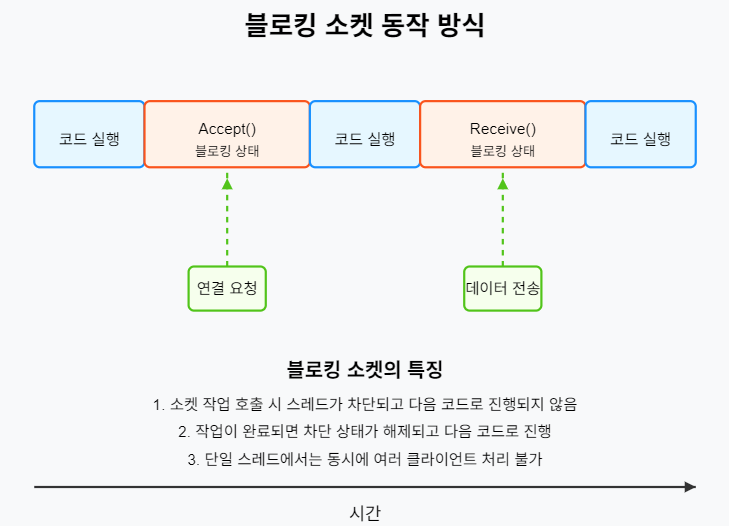
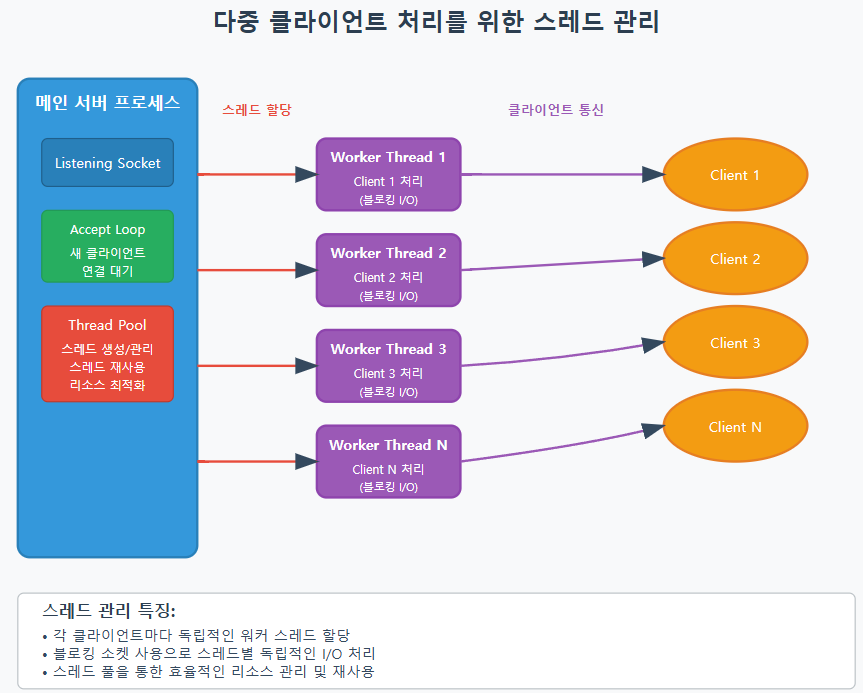
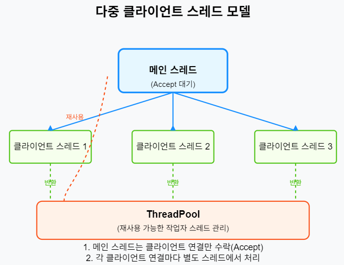
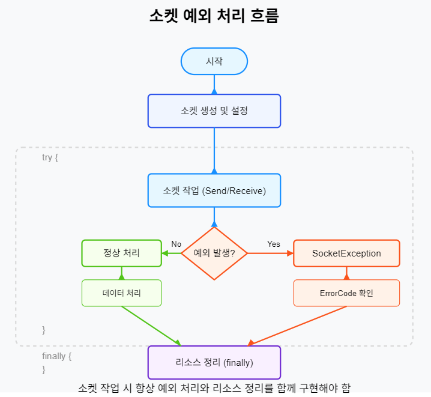
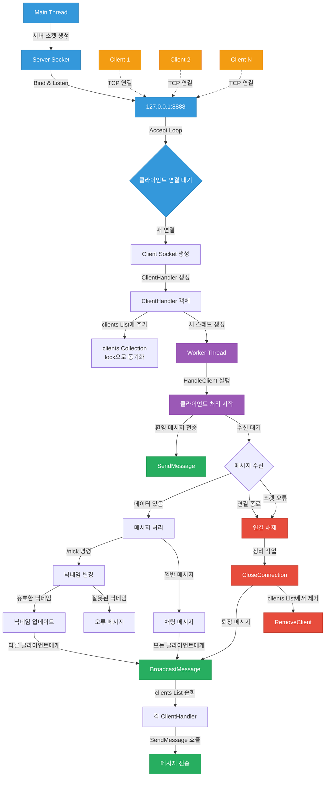
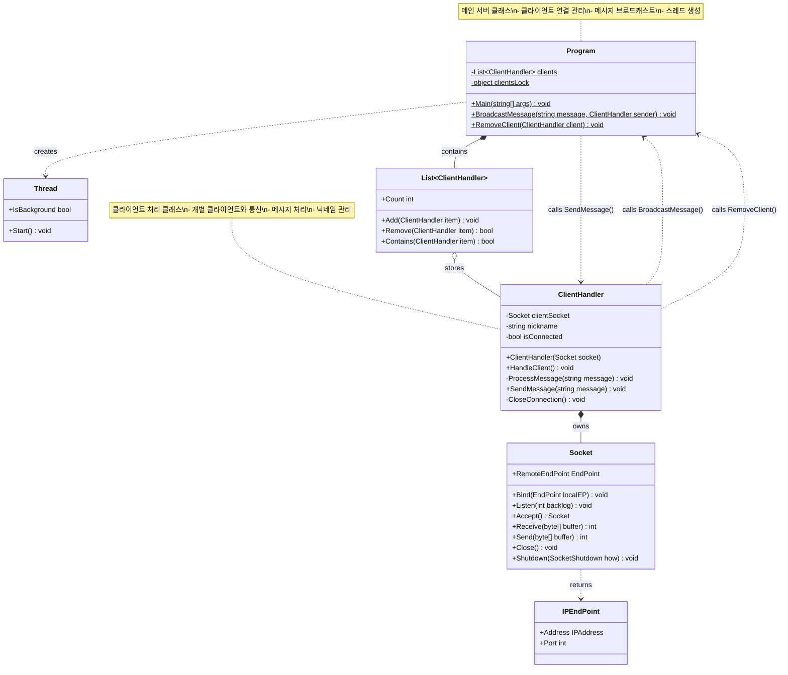
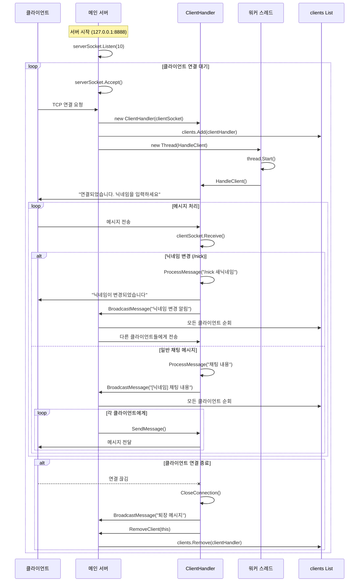
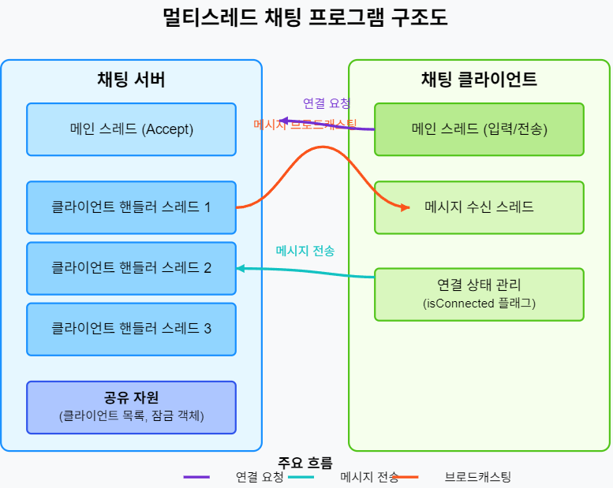

# 게임 서버 개발을 위한 C# Socket 프로그래밍

저자: 최흥배, Claude AI  

- .NET 9
- Windows 11
- Visual Studio Code, Visual Studio 2022 이상


# 3장: 동기식(Blocking) 소켓 프로그래밍

## 블로킹 소켓의 이해
블로킹 소켓은 가장 기본적인 소켓 통신 모델로, 특정 작업이 완료될 때까지 프로그램의 실행을 멈추고 대기하는 방식이다. 소켓 메서드 호출 시 해당 작업이 완료될 때까지 스레드가 차단(블로킹)된다.

### 블로킹 소켓의 주요 특징
- **직관적인 코드 흐름**: 순차적인 실행으로 코드 이해가 쉽다
- **리소스 효율성**: 비동기 방식에 비해 적은 오버헤드가 발생한다
- **처리량 제한**: 동시에 여러 클라이언트를 처리하기 어렵다
- **응답성 저하**: 긴 작업 시 UI 스레드 블로킹으로 인한 응답 지연 발생

### 주요 블로킹 소켓 메서드
- **Accept()**: 클라이언트 연결 요청이 올 때까지 대기
- **Connect()**: 서버와 연결이 수립될 때까지 대기
- **Send()/Receive()**: 데이터 송수신이 완료될 때까지 대기
- **Close()**: 소켓 연결 종료가 완료될 때까지 대기

```csharp
// 블로킹 소켓 동작 예제
using System;
using System.Net;
using System.Net.Sockets;
using System.Text;

class BlockingSocketExample
{
    static void Main()
    {
        // 서버 소켓 생성
        Socket serverSocket = new(AddressFamily.InterNetwork, 
                                SocketType.Stream, 
                                ProtocolType.Tcp);
        
        try
        {
            // 소켓을 로컬 엔드포인트에 바인딩
            serverSocket.Bind(new IPEndPoint(IPAddress.Any, 8080));
            
            // 연결 대기열 설정
            serverSocket.Listen(10);
            
            Console.WriteLine("서버가 시작되었습니다. 클라이언트 연결 대기 중...");
            
            while (true)
            {
                // 클라이언트 연결 요청이 올 때까지 블로킹됨
                Socket clientSocket = serverSocket.Accept();
                
                // 클라이언트로부터 데이터 수신
                byte[] buffer = new byte[1024];
                int bytesRead = clientSocket.Receive(buffer); // 데이터가 수신될 때까지 블로킹됨
                
                // 수신된 데이터 처리
                string data = Encoding.UTF8.GetString(buffer, 0, bytesRead);
                Console.WriteLine($"받은 메시지: {data}");
                
                // 응답 데이터 전송
                string response = "메시지를 받았습니다.";
                byte[] responseData = Encoding.UTF8.GetBytes(response);
                clientSocket.Send(responseData); // 데이터 전송이 완료될 때까지 블로킹됨
                
                // 클라이언트 소켓 닫기
                clientSocket.Close();
            }
        }
        catch (Exception ex)
        {
            Console.WriteLine($"오류 발생: {ex.Message}");
        }
        finally
        {
            // 서버 소켓 닫기
            serverSocket.Close();
        }
    }
}
```  
  
   
  

### 블로킹 소켓의 장단점
**장점:**
- 코드가 간결하고 직관적
- 프로그래밍 모델이 단순하여 초보자가 이해하기 쉬움
- 상태 관리가 단순함
- 메모리 사용량이 적음

**단점:**
- 동시에 여러 클라이언트 처리 시 별도의 스레드 필요
- 많은 동시 연결 처리 시 성능 저하
- 긴 작업 처리 시 전체 애플리케이션 응답성 저하
- 확장성이 제한됨
  

## 다중 클라이언트 처리를 위한 스레드 관리
블로킹 소켓으로 다중 클라이언트를 처리하려면 클라이언트마다 별도의 스레드를 할당해야 한다. 이를 위한 스레드 관리 기법을 알아본다.
  
   
- 메인 서버 프로세스: 리스닝 소켓으로 새로운 클라이언트 연결을 받아들이는 역할
- Accept Loop: 지속적으로 새 클라이언트 연결을 대기하고 수락하는 부분
- Thread Pool: 스레드를 효율적으로 생성하고 관리하는 시스템
- Worker Thread: 각 클라이언트와 1:1로 대응되는 작업 스레드
- Client: 서버에 연결된 각각의 클라이언트  
   
### 스레드 기본 개념
스레드는 프로세스 내에서 실행되는 흐름의 단위로, 하나의 프로세스에서 여러 스레드가 동시에 실행될 수 있다. C#에서는 `System.Threading` 네임스페이스를 통해 스레드 관련 기능을 제공한다.

```csharp
// 기본 스레드 생성 예제
using System;
using System.Threading;

class ThreadExample
{
    static void Main()
    {
        // 새 스레드 생성
        Thread thread = new(WorkerMethod);
        
        // 스레드 시작
        thread.Start();
        
        // 메인 스레드에서 다른 작업 수행
        for (int i = 0; i < 5; i++)
        {
            Console.WriteLine($"메인 스레드: {i}");
            Thread.Sleep(100);
        }
        
        // 워커 스레드 종료 대기
        thread.Join();
        
        Console.WriteLine("프로그램 종료");
    }
    
    static void WorkerMethod()
    {
        // 워커 스레드에서 수행할 작업
        for (int i = 0; i < 5; i++)
        {
            Console.WriteLine($"워커 스레드: {i}");
            Thread.Sleep(200);
        }
    }
}
```

### ThreadPool을 활용한 효율적인 스레드 관리
`ThreadPool`은 스레드를 효율적으로 관리하기 위한 메커니즘으로, 스레드 생성/파괴 비용을 줄여 성능을 향상시킨다.

```csharp
// ThreadPool 사용 예제
using System;
using System.Threading;

class ThreadPoolExample
{
    static void Main()
    {
        // ThreadPool을 사용한 작업 실행
        for (int i = 0; i < 5; i++)
        {
            int taskNum = i; // 클로저 문제 방지
            ThreadPool.QueueUserWorkItem(state => WorkerMethod(taskNum));
        }
        
        // 모든 작업이 완료될 때까지 대기
        Console.WriteLine("모든 작업 대기 중...");
        Thread.Sleep(2000);
        
        Console.WriteLine("프로그램 종료");
    }
    
    static void WorkerMethod(int taskNumber)
    {
        Console.WriteLine($"ThreadPool 스레드 #{Thread.CurrentThread.ManagedThreadId}: 작업 {taskNumber} 시작");
        Thread.Sleep(1000); // 작업 시뮬레이션
        Console.WriteLine($"ThreadPool 스레드 #{Thread.CurrentThread.ManagedThreadId}: 작업 {taskNumber} 완료");
    }
}
```
  

### 스레드 안전성과 동기화
여러 스레드가 동시에 공유 리소스에 접근할 때 발생할 수 있는 문제를 방지하기 위해 동기화 메커니즘을 사용한다.  
  
```csharp
// 스레드 동기화 예제
using System;
using System.Collections.Generic;
using System.Threading;

class ThreadSynchronizationExample
{
    // 공유 리소스
    private static List<string> sharedList = new();
    private static readonly object lockObject = new();
    
    static void Main()
    {
        // 여러 스레드 생성
        for (int i = 0; i < 5; i++)
        {
            int threadNum = i;
            Thread thread = new(() => AddItems(threadNum));
            thread.Start();
        }
        
        // 모든 스레드가 완료될 때까지 대기
        Thread.Sleep(2000);
        
        // 결과 출력
        lock (lockObject)
        {
            Console.WriteLine("공유 리스트 내용:");
            foreach (string item in sharedList)
            {
                Console.WriteLine(item);
            }
        }
    }
    
    static void AddItems(int threadNum)
    {
        for (int i = 0; i < 3; i++)
        {
            // lock을 사용한 동기화
            lock (lockObject)
            {
                sharedList.Add($"스레드 {threadNum}: 항목 {i}");
                Console.WriteLine($"스레드 {threadNum}이 항목 {i}를 추가했습니다.");
            }
            
            // 스레드 작업 시뮬레이션
            Thread.Sleep(100);
        }
    }
}
```
  
   

  
### 스레드 관리 모델 비교
1. **스레드 직접 생성 모델**
   - 장점: 제어가 용이하고 간단함
   - 단점: 과도한 스레드 생성 시 시스템 리소스 낭비
  
2. **ThreadPool 모델**
   - 장점: 스레드 재사용으로 효율적인 리소스 관리
   - 단점: 스레드 개수와 생명주기 직접 제어 불가

3. **작업 기반 모델 (Task)**
   - 장점: 비동기 작업 처리 용이, 결과 반환 쉬움
   - 단점: 단순 스레드 모델보다 조금 더 복잡함
  
```csharp
// Task 기반 스레드 관리 예제
using System;
using System.Threading.Tasks;

class TaskBasedExample
{
    static async Task Main()
    {
        Console.WriteLine("작업 시작");
        
        // 여러 작업 병렬 실행
        Task[] tasks = new Task[5];
        for (int i = 0; i < tasks.Length; i++)
        {
            int taskNum = i;
            tasks[i] = Task.Run(() => DoWork(taskNum));
        }
        
        // 모든 작업 완료 대기
        await Task.WhenAll(tasks);
        
        Console.WriteLine("모든 작업 완료");
    }
    
    static async Task DoWork(int taskNumber)
    {
        Console.WriteLine($"작업 {taskNumber} 시작");
        
        // 비동기 작업 시뮬레이션
        await Task.Delay(1000);
        
        Console.WriteLine($"작업 {taskNumber} 완료");
    }
}
```
  

## 소켓 연결 관리와 예외 처리
소켓 프로그래밍에서는 네트워크 환경의 불안정성, 클라이언트의 비정상 종료 등 다양한 상황에 대응해야 한다. 이를 위한 연결 관리와 예외 처리 방법을 알아본다.

### 소켓 연결 수명주기 관리
  
```csharp
// 소켓 연결 수명주기 관리 예제
using System;
using System.Net;
using System.Net.Sockets;
using System.Text;
using System.Threading;

class SocketLifecycleExample
{
    // 연결 상태 추적을 위한 플래그
    private static bool isConnected = false;
    
    static void Main()
    {
        Socket serverSocket = new(AddressFamily.InterNetwork, 
                                SocketType.Stream, 
                                ProtocolType.Tcp);
        
        try
        {
            // 서버 설정
            serverSocket.Bind(new IPEndPoint(IPAddress.Any, 8080));
            serverSocket.Listen(10);
            
            Console.WriteLine("서버가 시작되었습니다. 클라이언트 연결 대기 중...");
            
            // 클라이언트 연결 수락
            Socket clientSocket = serverSocket.Accept();
            
            // 연결 상태 설정
            isConnected = true;
            
            // 클라이언트 정보 출력
            IPEndPoint? clientEndPoint = clientSocket.RemoteEndPoint as IPEndPoint;
            Console.WriteLine($"클라이언트 연결됨: {clientEndPoint?.Address}:{clientEndPoint?.Port}");
            
            // 하트비트 스레드 시작
            Thread heartbeatThread = new(() => HeartbeatCheck(clientSocket));
            heartbeatThread.IsBackground = true;
            heartbeatThread.Start();
            
            try
            {
                while (isConnected)
                {
                    // 데이터 수신 준비
                    byte[] buffer = new byte[1024];
                    
                    try
                    {
                        // 연결 종료 감지를 위한 방법
                        int bytesRead = clientSocket.Receive(buffer);
                        
                        if (bytesRead == 0)
                        {
                            // 클라이언트가 정상적으로 연결 종료
                            Console.WriteLine("클라이언트가 연결을 종료했습니다.");
                            break;
                        }
                        
                        // 데이터 처리
                        string message = Encoding.UTF8.GetString(buffer, 0, bytesRead);
                        Console.WriteLine($"수신한 메시지: {message}");
                    }
                    catch (SocketException ex)
                    {
                        // 소켓 오류 처리
                        Console.WriteLine($"소켓 오류: {ex.Message}");
                        break;
                    }
                }
            }
            finally
            {
                // 연결 상태 업데이트
                isConnected = false;
                
                // 소켓 리소스 정리
                CleanupSocket(clientSocket);
            }
        }
        catch (Exception ex)
        {
            Console.WriteLine($"서버 오류: {ex.Message}");
        }
        finally
        {
            // 서버 소켓 정리
            serverSocket.Close();
        }
    }
    
    // 하트비트 체크 메서드 (연결 상태 주기적 확인)
    static void HeartbeatCheck(Socket socket)
    {
        while (isConnected)
        {
            try
            {
                // 연결 상태 확인 (1바이트 전송)
                if (socket.Poll(0, SelectMode.SelectWrite))
                {
                    // 데이터 전송 가능 상태이면 연결 유지 중
                    Console.WriteLine("연결 상태: 활성");
                }
                else
                {
                    Console.WriteLine("연결 상태: 비활성");
                    isConnected = false;
                    break;
                }
            }
            catch (SocketException)
            {
                Console.WriteLine("하트비트 체크 중 연결 끊김 감지");
                isConnected = false;
                break;
            }
            
            // 5초마다 체크
            Thread.Sleep(5000);
        }
    }
    
    // 소켓 정리 메서드
    static void CleanupSocket(Socket socket)
    {
        try
        {
            // 데이터 송수신 중단
            socket.Shutdown(SocketShutdown.Both);
        }
        catch (SocketException)
        {
            // 이미 연결이 끊긴 경우 무시
        }
        finally
        {
            // 소켓 닫기
            socket.Close();
        }
        
        Console.WriteLine("소켓 연결이 정리되었습니다.");
    }
}
```

### 주요 소켓 예외 유형 및 처리 방법
C# 소켓 프로그래밍에서 발생하는 주요 예외와 그 처리 방법이다:

1. **SocketException**: 가장 일반적인 소켓 관련 예외
   - **ErrorCode 10054**: 원격 호스트가 강제로 연결을 종료함
   - **ErrorCode 10053**: 연결이 소프트웨어에 의해 중단됨
   - **ErrorCode 10060**: 연결 시간 초과
   - **ErrorCode 10061**: 연결 거부됨

2. **ObjectDisposedException**: 이미 닫힌 소켓 사용 시 발생

3. **ArgumentException**: 잘못된 인자 전달 시 발생
  
```csharp
// 소켓 예외 처리 예제
try
{
    // 소켓 작업 (Send/Receive 등)
    int bytesRead = socket.Receive(buffer);
    // 데이터 처리...
}
catch (SocketException ex)
{
    switch (ex.ErrorCode)
    {
        case 10054: // 연결 재설정됨
            Console.WriteLine("클라이언트가 강제로 연결을 종료했습니다.");
            break;
        case 10053: // 소프트웨어에 의한 중단
            Console.WriteLine("연결이 소프트웨어에 의해 중단되었습니다.");
            break;
        case 10060: // 연결 시간 초과
            Console.WriteLine("연결 시간이 초과되었습니다.");
            break;
        case 10061: // 연결 거부됨
            Console.WriteLine("서버에서 연결을 거부했습니다.");
            break;
        default:
            Console.WriteLine($"소켓 오류: {ex.Message} (ErrorCode: {ex.ErrorCode})");
            break;
    }
    
    // 연결 상태 업데이트 및 정리 작업
    isConnected = false;
    CleanupSocket(socket);
}
catch (ObjectDisposedException)
{
    Console.WriteLine("이미 닫힌 소켓을 사용하려고 했습니다.");
}
catch (ArgumentException ex)
{
    Console.WriteLine($"잘못된 인자: {ex.Message}");
}
catch (Exception ex)
{
    Console.WriteLine($"예상치 못한 오류: {ex.Message}");
}
```   
   
   
  
<br>    
  

## 간단한 채팅 프로그램 구현 실습
이제 지금까지 배운 개념을 활용하여 간단한 멀티 클라이언트 채팅 프로그램을 구현해보자. 이 채팅 프로그램은 다음 기능을 제공한다:

1. 다중 클라이언트 연결 지원
2. 클라이언트 간 메시지 브로드캐스팅
3. 닉네임 설정 기능
4. 연결 종료 감지 및 처리

### 채팅 서버 구현
  
#### 채팅 서버 아키텍처 다이어그램
  


#### 채팅 서버 클래스 다이어그램  
  

   
#### 채팅 서버 시퀀스 다이어그램


   
#### 코드  
```csharp
using System;
using System.Collections.Generic;
using System.Net;
using System.Net.Sockets;
using System.Text;
using System.Threading;

namespace ChatServer
{
    class Program
    {
        // 연결된 클라이언트 목록
        private static readonly List<ClientHandler> clients = new();
        private static readonly object clientsLock = new();
        
        static void Main(string[] args)
        {
            // 서버 소켓 생성
            Socket serverSocket = new(AddressFamily.InterNetwork, 
                                    SocketType.Stream, 
                                    ProtocolType.Tcp);
            
            try
            {
                // 서버 설정
                IPAddress ipAddress = IPAddress.Parse("127.0.0.1");
                int port = 8888;
                serverSocket.Bind(new IPEndPoint(ipAddress, port));
                serverSocket.Listen(10);
                
                Console.WriteLine($"채팅 서버가 시작되었습니다. ({ipAddress}:{port})");
                
                while (true)
                {
                    Console.WriteLine("클라이언트 연결 대기 중...");
                    
                    // 클라이언트 연결 수락
                    Socket clientSocket = serverSocket.Accept();
                    
                    // 클라이언트 처리기 생성
                    ClientHandler clientHandler = new(clientSocket);
                    
                    // 연결된 클라이언트 추가
                    lock (clientsLock)
                    {
                        clients.Add(clientHandler);
                    }
                    
                    // 클라이언트 처리 스레드 시작
                    Thread clientThread = new(clientHandler.HandleClient);
                    clientThread.IsBackground = true;
                    clientThread.Start();
                }
            }
            catch (Exception ex)
            {
                Console.WriteLine($"서버 오류: {ex.Message}");
            }
            finally
            {
                // 서버 소켓 닫기
                serverSocket.Close();
            }
        }
        
        // 모든 클라이언트에게 메시지 브로드캐스팅
        public static void BroadcastMessage(string message, ClientHandler? sender = null)
        {
            lock (clientsLock)
            {
                foreach (ClientHandler client in clients)
                {
                    // 송신자에게는 메시지 전송 안 함 (옵션)
                    if (client != sender)
                    {
                        try
                        {
                            client.SendMessage(message);
                        }
                        catch (Exception ex)
                        {
                            Console.WriteLine($"메시지 전송 오류: {ex.Message}");
                        }
                    }
                }
            }
        }
        
        // 연결 종료된 클라이언트 제거
        public static void RemoveClient(ClientHandler client)
        {
            lock (clientsLock)
            {
                if (clients.Contains(client))
                {
                    clients.Remove(client);
                    Console.WriteLine($"클라이언트가 제거되었습니다. 현재 연결 수: {clients.Count}");
                }
            }
        }
    }
    
    // 클라이언트 처리 클래스
    class ClientHandler
    {
        private readonly Socket clientSocket;
        private string nickname = "Guest";
        private bool isConnected = true;
        
        public ClientHandler(Socket socket)
        {
            clientSocket = socket;
            
            // 클라이언트 정보 출력
            IPEndPoint? remoteEndPoint = clientSocket.RemoteEndPoint as IPEndPoint;
            Console.WriteLine($"클라이언트 연결됨: {remoteEndPoint?.Address}:{remoteEndPoint?.Port}");
        }
        
        // 클라이언트 처리 메서드
        public void HandleClient()
        {
            try
            {
                // 환영 메시지 전송
                SendMessage("채팅 서버에 연결되었습니다. 닉네임을 입력하세요: /nick <닉네임>");
                
                // 클라이언트로부터 데이터 수신 대기
                byte[] buffer = new byte[1024];
                
                while (isConnected)
                {
                    try
                    {
                        int bytesRead = clientSocket.Receive(buffer);
                        
                        if (bytesRead == 0)
                        {
                            // 클라이언트 연결 종료
                            break;
                        }
                        
                        // 수신된 메시지 처리
                        string message = Encoding.UTF8.GetString(buffer, 0, bytesRead);
                        ProcessMessage(message);
                    }
                    catch (SocketException)
                    {
                        // 소켓 오류 시 연결 종료
                        break;
                    }
                }
            }
            catch (Exception ex)
            {
                Console.WriteLine($"클라이언트 처리 오류: {ex.Message}");
            }
            finally
            {
                // 연결 종료 처리
                isConnected = false;
                CloseConnection();
                
                // 퇴장 메시지 브로드캐스팅
                Program.BroadcastMessage($"[시스템] {nickname}님이 퇴장했습니다.");
                
                // 클라이언트 목록에서 제거
                Program.RemoveClient(this);
            }
        }
        
        // 메시지 처리 메서드
        private void ProcessMessage(string message)
        {
            // 닉네임 변경 명령 처리
            if (message.StartsWith("/nick "))
            {
                string newNickname = message.Substring(6).Trim();
                
                if (!string.IsNullOrEmpty(newNickname))
                {
                    string oldNickname = nickname;
                    nickname = newNickname;
                    
                    // 변경 사실 알림
                    SendMessage($"닉네임이 {newNickname}(으)로 변경되었습니다.");
                    
                    // 다른 사용자에게 알림
                    Program.BroadcastMessage($"[시스템] {oldNickname}님이 {newNickname}(으)로 닉네임을 변경했습니다.", this);
                }
                else
                {
                    SendMessage("올바르지 않은 닉네임입니다.");
                }
            }
            // 일반 채팅 메시지 처리
            else
            {
                // 메시지 브로드캐스팅
                Program.BroadcastMessage($"[{nickname}] {message}");
                
                // 콘솔에 출력
                Console.WriteLine($"[{nickname}] {message}");
            }
        }
        
        // 메시지 전송 메서드
        public void SendMessage(string message)
        {
            if (isConnected)
            {
                byte[] data = Encoding.UTF8.GetBytes(message);
                clientSocket.Send(data);
            }
        }
        
        // 연결 종료 메서드
        private void CloseConnection()
        {
            if (clientSocket != null)
            {
                try
                {
                    clientSocket.Shutdown(SocketShutdown.Both);
                }
                catch (SocketException)
                {
                    // 이미 연결이 끊겼을 경우 무시
                }
                finally
                {
                    clientSocket.Close();
                }
                
                Console.WriteLine($"클라이언트 연결 종료: {nickname}");
            }
        }
    }
}
```

### 채팅 클라이언트 구현

```csharp
using System;
using System.Net;
using System.Net.Sockets;
using System.Text;
using System.Threading;

namespace ChatClient
{
    class Program
    {
        private static Socket? clientSocket;
        private static bool isConnected = false;
        
        static void Main(string[] args)
        {
            Console.WriteLine("채팅 클라이언트 시작");
            
            try
            {
                // 서버 정보 설정
                IPAddress serverIP = IPAddress.Parse("127.0.0.1");
                int serverPort = 8888;
                
                // 소켓 생성
                clientSocket = new Socket(AddressFamily.InterNetwork, 
                                        SocketType.Stream, 
                                        ProtocolType.Tcp);
                
                // 서버 연결
                Console.WriteLine($"서버 {serverIP}:{serverPort}에 연결 중...");
                clientSocket.Connect(new IPEndPoint(serverIP, serverPort));
                
                // 연결 성공
                isConnected = true;
                Console.WriteLine("서버에 연결되었습니다.");
                
                // 메시지 수신 스레드 시작
                Thread receiveThread = new(ReceiveMessages);
                receiveThread.IsBackground = true;
                receiveThread.Start();
                
                // 메시지 입력 및 전송
                while (isConnected)
                {
                    string? message = Console.ReadLine();
                    
                    if (string.IsNullOrEmpty(message))
                        continue;
                    
                    if (message.ToLower() == "/exit")
                        break;
                    
                    // 메시지 전송
                    SendMessage(message);
                }
            }
            catch (Exception ex)
            {
                Console.WriteLine($"오류 발생: {ex.Message}");
            }
            finally
            {
                // 연결 종료
                CloseConnection();
            }
            
            Console.WriteLine("프로그램을 종료하려면 아무 키나 누르세요...");
            Console.ReadKey();
        }
        
        // 메시지 수신 메서드
        static void ReceiveMessages()
        {
            try
            {
                byte[] buffer = new byte[1024];
                
                while (isConnected && clientSocket != null)
                {
                    try
                    {
                        // 메시지 수신
                        int bytesRead = clientSocket.Receive(buffer);
                        
                        if (bytesRead == 0)
                        {
                            // 서버 연결 종료
                            Console.WriteLine("서버와의 연결이 종료되었습니다.");
                            isConnected = false;
                            break;
                        }
                        
                        // 수신된 메시지 처리
                        string message = Encoding.UTF8.GetString(buffer, 0, bytesRead);
                        Console.WriteLine(message);
                    }
                    catch (SocketException ex)
                    {
                        Console.WriteLine($"메시지 수신 오류: {ex.Message}");
                        isConnected = false;
                        break;
                    }
                }
            }
            catch (Exception ex)
            {
                Console.WriteLine($"수신 스레드 오류: {ex.Message}");
            }
            finally
            {
                // 연결 종료
                isConnected = false;
                CloseConnection();
            }
        }
        
        // 메시지 전송 메서드
        static void SendMessage(string message)
        {
            if (isConnected && clientSocket != null)
            {
                try
                {
                    byte[] data = Encoding.UTF8.GetBytes(message);
                    clientSocket.Send(data);
                }
                catch (SocketException ex)
                {
                    Console.WriteLine($"메시지 전송 오류: {ex.Message}");
                    isConnected = false;
                }
            }
        }
        
        // 연결 종료 메서드
        static void CloseConnection()
        {
            if (clientSocket != null)
            {
                try
                {
                    if (clientSocket.Connected)
                    {
                        clientSocket.Shutdown(SocketShutdown.Both);
                    }
                }
                catch (SocketException)
                {
                    // 이미 연결이 끊겼을 경우 무시
                }
                finally
                {
                    clientSocket.Close();
                    clientSocket = null;
                }
                
                Console.WriteLine("서버와의 연결이 종료되었습니다.");
            }
            
            isConnected = false;
        }
    }
}
```
  
   

  
<br>  

## 학습 확인 과제

### 과제 1: 파일 전송 기능 추가
위에서 구현한 채팅 프로그램에 파일 전송 기능을 추가하라.

**요구사항:**
1. 클라이언트가 `/sendfile <파일경로>` 명령으로 파일을 다른 모든 클라이언트에게 전송할 수 있어야 한다.
2. 파일 전송 중에도 다른 메시지 송수신이 가능해야 한다.
3. 파일 전송 상태(진행률)를 실시간으로 표시해야 한다.
4. 파일 전송에 실패하면 적절한 오류 메시지를 표시해야 한다.

### 과제 2: 채팅방 기능 구현
여러 채팅방을 지원하는 기능을 추가하라.

**요구사항:**
1. 클라이언트가 `/join <방이름>` 명령으로 특정 채팅방에 입장할 수 있어야 한다.
2. 클라이언트가 `/create <방이름>` 명령으로 새 채팅방을 생성할 수 있어야 한다.
3. 클라이언트가 `/list` 명령으로 현재 존재하는 채팅방 목록을 볼 수 있어야 한다.
4. 클라이언트가 `/exit` 명령으로 현재 채팅방에서 나갈 수 있어야 한다.
5. 채팅방별로 메시지 브로드캐스팅이 이루어져야 한다.

### 과제 3: 성능 및 안정성 개선
프로그램의 성능과 안정성을 개선하라.

**요구사항:**
1. 동시 접속자 100명을 지원할 수 있도록 코드를 최적화해야 한다.
2. 갑작스러운 클라이언트 연결 종료를 적절히 처리해야 한다.
3. 서버에 과부하가 걸리지 않도록 리소스 사용을 관리해야 한다.
4. 소켓 버퍼 크기를 최적화하여 처리량을 개선해야 한다.
5. 스레드 생성 및 관리 전략을 개선하여 메모리 사용을 최적화해야 한다.
  
  
이 과제들을 통해 블로킹 소켓과 스레드 관리, 연결 관리, 예외 처리 등의 개념을 실제로 적용하고 심화하여 이해할 수 있을 것이다. 또한 실제 네트워크 프로그래밍에서 발생하는 여러 문제를 직접 해결해보는 경험을 쌓을 수 있다.
