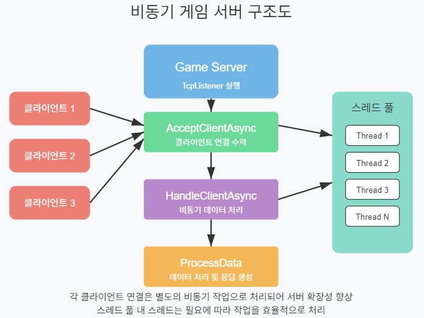

# 게임 서버 개발을 위한 C# Socket 프로그래밍

저자: 최흥배, Claude AI  

- .NET 9
- Windows 11
- Visual Studio Code, Visual Studio 2022 이상


# 제2부: 비동기 I/O와 고급 소켓 프로그래밍

# 4장: 비동기 소켓 프로그래밍
  
## 4.1 비동기 프로그래밍의 개념
비동기 프로그래밍은 게임 서버와 같은 고성능 네트워크 애플리케이션을 개발할 때 필수적인 개념이다. 전통적인 동기식 프로그래밍에서는 작업이 순차적으로 실행되어 한 작업이 완료될 때까지 다음 작업이 대기한다. 반면 비동기 프로그래밍에서는 작업을 시작한 후 완료를 기다리지 않고 다른 작업을 수행할 수 있다.

### 동기식 vs 비동기식 프로그래밍

```csharp
// 동기식 프로그래밍
public void SynchronousMethod()
{
    var data = ReadDataFromNetwork(); // 이 작업이 완료될 때까지 다음 라인 실행 불가
    ProcessData(data);
}

// 비동기식 프로그래밍
public async Task AsynchronousMethod()
{
    var dataTask = ReadDataFromNetworkAsync(); // 작업 시작 후 즉시 다음 라인으로 이동
    DoSomethingElse(); // 네트워크 작업 진행 중에도 실행 가능
    var data = await dataTask; // 데이터가 준비될 때까지만 대기
    ProcessData(data);
}
```

비동기 프로그래밍의 주요 이점:
- **리소스 효율성**: CPU가 I/O 작업을 기다리는 동안 다른 작업 수행 가능
- **확장성**: 더 많은 동시 연결 처리 가능
- **응답성**: UI 스레드 차단 방지 (클라이언트 애플리케이션의 경우)
  

## 4.2 .NET의 비동기 패턴 (TAP)
.NET에서는 Task-based Asynchronous Pattern(TAP)을 사용해 비동기 프로그래밍을 구현한다. 이 패턴은 `Task` 및 `Task<T>` 클래스를 사용하여 비동기 작업을 나타낸다.

### TAP의 주요 특징
1. **Task 객체**: 비동기 작업을 나타내는 객체
2. **async/await 키워드**: 비동기 코드 작성을 단순화하는 언어 기능
3. **연속성(Continuation)**: 한 작업이 완료된 후 다음 작업을 연결하는 기능

```csharp
// TAP 예제
public async Task<string> DownloadDataAsync(string url)
{
    using var httpClient = new HttpClient();
    return await httpClient.GetStringAsync(url);
}

// 사용 방법
public async Task ProcessWebDataAsync()
{
    try
    {
        string data = await DownloadDataAsync("https://example.com/api/data");
        Console.WriteLine($"다운로드한 데이터 크기: {data.Length}");
    }
    catch (Exception ex)
    {
        Console.WriteLine($"다운로드 중 오류 발생: {ex.Message}");
    }
}
```
  
   


## 4.3 비동기(비동기 I/O) 소켓 메서드
소켓 프로그래밍에서 비동기 작업은 네트워크 지연으로 인한 블로킹을 방지하기 위해 특히 중요하다. .NET에서는 소켓을 위한 여러 비동기 패턴을 제공한다.

### 4.3.1 APM(Asynchronous Programming Model) - 이전 방식
기존의 Begin/End 패턴은 .NET Framework 초기부터 사용되었지만, 현대 .NET에서는 권장되지 않는다.

```csharp
// APM 방식 (레거시)
public void StartConnection()
{
    Socket socket = new Socket(AddressFamily.InterNetwork, SocketType.Stream, ProtocolType.Tcp);
    
    // 비동기 연결 시작
    socket.BeginConnect("example.com", 80, ConnectCallback, socket);
    Console.WriteLine("연결 시도 중...");
}

private void ConnectCallback(IAsyncResult ar)
{
    try
    {
        Socket socket = (Socket)ar.AsyncState;
        socket.EndConnect(ar); // 연결 완료
        Console.WriteLine("연결 성공!");
        
        // 이제 데이터 송수신을 시작할 수 있음
        byte[] buffer = new byte[1024];
        socket.BeginReceive(buffer, 0, buffer.Length, SocketFlags.None, ReceiveCallback, 
            new StateObject { Socket = socket, Buffer = buffer });
    }
    catch (Exception ex)
    {
        Console.WriteLine($"연결 실패: {ex.Message}");
    }
}

private void ReceiveCallback(IAsyncResult ar)
{
    // 수신 완료 처리
    // ...
}

private class StateObject
{
    public Socket Socket { get; set; }
    public byte[] Buffer { get; set; }
}
```

### 4.3.2 TAP(Task-based Asynchronous Pattern) - 현대적 방식
현대 .NET에서는 `ConnectAsync`, `SendAsync`, `ReceiveAsync`와 같은 Task 기반 메서드를 사용한다.

```csharp
// TAP 방식 (현대적)
public async Task StartConnectionAsync()
{
    using Socket socket = new Socket(AddressFamily.InterNetwork, SocketType.Stream, ProtocolType.Tcp);
    
    try
    {
        // 비동기 연결
        await socket.ConnectAsync("example.com", 80);
        Console.WriteLine("연결 성공!");
        
        // 데이터 전송
        byte[] requestData = Encoding.ASCII.GetBytes("GET / HTTP/1.1\r\nHost: example.com\r\n\r\n");
        await socket.SendAsync(requestData, SocketFlags.None);
        
        // 응답 수신
        byte[] buffer = new byte[1024];
        int received = await socket.ReceiveAsync(buffer, SocketFlags.None);
        string response = Encoding.ASCII.GetString(buffer, 0, received);
        Console.WriteLine($"수신된 데이터: {response}");
    }
    catch (Exception ex)
    {
        Console.WriteLine($"오류 발생: {ex.Message}");
    }
}
```

### 4.3.3 두 패턴의 비교  
  
| 특성 | APM (Begin/End 패턴) | TAP (Task 기반 패턴) |
|------|----------------------|---------------------|
| 사용 방식 | `BeginXXX`/`EndXXX` 메서드 쌍 | `XXXAsync` 메서드와 `await` |
| 콜백 처리 | 별도의 콜백 메서드 필요 | `await`로 자연스러운 코드 흐름 |
| 오류 처리 | 콜백 내에서 try-catch 사용 | 일반 동기 코드와 동일한 try-catch 구조 |
| 상태 관리 | 상태 객체를 통해 수동으로 관리 | 자동으로 상태 캡처 및 복원 |
| 취소 지원 | 제한적 | CancellationToken으로 쉽게 구현 |
| 코드 가독성 | 복잡하고 이해하기 어려움 | 동기 코드와 유사하게 읽기 쉬움 |
| .NET 버전 | 레거시 (.NET Framework) | 현대적 (.NET Core, .NET 5+) |  
  
  

## 4.4 성능을 위한 `async/await` 패턴 활용
비동기 프로그래밍은 성능 향상에 도움이 되지만, 잘못 사용하면 오히려 성능 저하를 초래할 수 있다. 효과적인 `async/await` 사용법을 살펴보자.

### 4.4.1 비동기 작업 구성(Composition)
여러 비동기 작업을 효율적으로 구성하는 방법:

```csharp
// 순차적 실행
public async Task SequentialAsync()
{
    var result1 = await Operation1Async();
    var result2 = await Operation2Async(result1);
    return await Operation3Async(result2);
}

// 병렬 실행
public async Task ParallelAsync()
{
    Task<int> task1 = Operation1Async();
    Task<string> task2 = Operation2Async(0); // 기본값 사용
    
    // 두 작업 모두 동시에 진행됨
    var result1 = await task1;
    var result2 = await task2;
    
    return await Operation3Async(result2);
}

// Task.WhenAll을 사용한 병렬 실행
public async Task WhenAllExampleAsync()
{
    Task<int>[] tasks = new[]
    {
        FetchDataAsync(1),
        FetchDataAsync(2),
        FetchDataAsync(3)
    };
    
    // 모든 작업이 완료될 때까지 대기
    int[] results = await Task.WhenAll(tasks);
    return results.Sum();
}

// 가장 빠른 응답 사용
public async Task WhenAnyExampleAsync()
{
    Task<int>[] tasks = new[]
    {
        FetchDataAsync(1), // 서버 1에서 데이터 가져오기
        FetchDataAsync(2), // 서버 2에서 데이터 가져오기
        FetchDataAsync(3)  // 서버 3에서 데이터 가져오기
    };
    
    // 가장 먼저 완료되는 작업 결과 사용
    Task<int> completedTask = await Task.WhenAny(tasks);
    return await completedTask;
}
```

### 4.4.2 소켓 프로그래밍에서의 성능 최적화
소켓 프로그래밍에서 성능을 최적화하기 위한 비동기 패턴 적용:

#### 버퍼 재사용

```csharp
public class AsyncSocketClient
{
    private readonly Socket _socket;
    private readonly byte[] _receiveBuffer;
    
    public AsyncSocketClient()
    {
        _socket = new Socket(AddressFamily.InterNetwork, SocketType.Stream, ProtocolType.Tcp);
        _receiveBuffer = new byte[8192]; // 버퍼 한 번만 할당
    }
    
    public async Task ConnectAsync(string host, int port)
    {
        await _socket.ConnectAsync(host, port);
    }
    
    public async Task<int> ReceiveAsync()
    {
        // 항상 동일한 버퍼를 재사용하여 GC 부담 감소
        return await _socket.ReceiveAsync(_receiveBuffer, SocketFlags.None);
    }
    
    // ... 기타 메서드
}
```

#### ValueTask 사용
`ValueTask<T>`는 작업이 즉시 완료될 가능성이 높을 때 할당을 줄여준다.

```csharp
public class OptimizedBufferManager
{
    private readonly byte[] _buffer;
    private bool _inUse;
    
    public OptimizedBufferManager(int size)
    {
        _buffer = new byte[size];
    }
    
    public ValueTask<byte[]> GetBufferAsync()
    {
        if (!_inUse)
        {
            _inUse = true;
            return new ValueTask<byte[]>(_buffer); // 할당 없음
        }
        else
        {
            // 다른 버퍼를 비동기적으로 할당
            return new ValueTask<byte[]>(AllocateNewBufferAsync());
        }
    }
    
    private async Task<byte[]> AllocateNewBufferAsync()
    {
        await Task.Yield(); // 다른 작업에 양보
        return new byte[_buffer.Length];
    }
    
    public void ReleaseBuffer()
    {
        _inUse = false;
    }
}
```
  

#### 대규모 연결 처리를 위한 비동기 패턴

```csharp
public class GameServer
{
    private readonly TcpListener _listener;
    private readonly CancellationTokenSource _cts;
    private readonly List<TcpClient> _clients = new List<TcpClient>();
    private readonly SemaphoreSlim _maxClientsLock;
    
    public GameServer(string ipAddress, int port, int maxClients)
    {
        IPAddress ip = IPAddress.Parse(ipAddress);
        _listener = new TcpListener(ip, port);
        _cts = new CancellationTokenSource();
        _maxClientsLock = new SemaphoreSlim(maxClients); // 동시 접속자 수 제한
    }
    
    public async Task StartAsync()
    {
        _listener.Start();
        Console.WriteLine("서버 시작됨. 클라이언트 접속 대기 중...");
        
        try
        {
            while (!_cts.Token.IsCancellationRequested)
            {
                // 새 클라이언트 접속 대기
                await _maxClientsLock.WaitAsync(_cts.Token);
                
                // 접속 수락은 별도 작업으로 처리하여 대기 중인 다른 클라이언트 처리 지연 방지
                _ = AcceptClientAsync();
            }
        }
        catch (OperationCanceledException)
        {
            // 서버 종료 요청 - 정상 종료
        }
        catch (Exception ex)
        {
            Console.WriteLine($"서버 오류: {ex.Message}");
        }
        finally
        {
            _listener.Stop();
        }
    }
    
    private async Task AcceptClientAsync()
    {
        try
        {
            TcpClient client = await _listener.AcceptTcpClientAsync();
            
            lock (_clients)
            {
                _clients.Add(client);
            }
            
            // 클라이언트 처리는 별도 작업으로 실행
            _ = HandleClientAsync(client).ContinueWith(task =>
            {
                // 클라이언트 연결 종료 시 정리
                if (task.IsFaulted)
                {
                    Console.WriteLine($"클라이언트 처리 오류: {task.Exception?.InnerException?.Message}");
                }
                
                lock (_clients)
                {
                    _clients.Remove(client);
                }
                
                // 세마포어 반환하여 새 클라이언트 허용
                _maxClientsLock.Release();
                
                client.Dispose();
            });
        }
        catch (Exception ex)
        {
            Console.WriteLine($"클라이언트 접속 처리 오류: {ex.Message}");
            _maxClientsLock.Release();
        }
    }
    
    private async Task HandleClientAsync(TcpClient client)
    {
        NetworkStream stream = client.GetStream();
        byte[] buffer = new byte[4096];
        
        try
        {
            while (!_cts.Token.IsCancellationRequested)
            {
                // 비동기적으로 데이터 수신
                int bytesRead = await stream.ReadAsync(buffer, 0, buffer.Length, _cts.Token);
                
                if (bytesRead == 0)
                {
                    // 클라이언트 연결 종료
                    break;
                }
                
                // 데이터 처리 로직
                byte[] response = ProcessData(buffer, bytesRead);
                
                // 응답 전송
                await stream.WriteAsync(response, 0, response.Length, _cts.Token);
            }
        }
        catch (IOException)
        {
            // 클라이언트 연결 종료 - 정상적인 경우
        }
        catch (OperationCanceledException)
        {
            // 서버 종료 요청 - 정상 종료
        }
        catch (Exception ex)
        {
            Console.WriteLine($"클라이언트 처리 중 오류: {ex.Message}");
        }
    }
    
    private byte[] ProcessData(byte[] data, int length)
    {
        // 실제 데이터 처리 로직
        // ...
        return Encoding.UTF8.GetBytes("응답 데이터");
    }
    
    public void Stop()
    {
        _cts.Cancel();
    }
}
```  
  
   


### 4.4.3 비동기 소켓 프로그래밍의 일반적인 함정과 해결책
비동기 프로그래밍을 사용할 때 흔히 발생하는 문제점과 해결책:

1. **불필요한 작업 대기**
   ```csharp
   // 잘못된 방식
   public async Task DoWorkAsync()
   {
       Task task1 = LongRunningOperationAsync();
       await task1; // 완료될 때까지 대기
       
       Task task2 = AnotherOperationAsync();
       await task2; // 완료될 때까지 대기
       
       // 두 작업이 순차적으로 실행됨
   }
   
   // 개선된 방식
   public async Task DoWorkAsync()
   {
       Task task1 = LongRunningOperationAsync();
       Task task2 = AnotherOperationAsync();
       
       // 두 작업이 병렬로 실행됨
       await Task.WhenAll(task1, task2);
   }
   ```

2. **ConfigureAwait 오용**
   ```csharp
   // UI 애플리케이션에서 - 컨텍스트 캡처 필요
   public async Task UpdateUIAsync()
   {
       var data = await FetchDataAsync();
       UpdateUIElement(data); // UI 스레드에서 실행되어야 함
   }
   
   // 서버 애플리케이션에서 - 컨텍스트 캡처 불필요
   public async Task ProcessRequestAsync()
   {
       var data = await FetchDataAsync().ConfigureAwait(false);
       ProcessData(data); // 어떤 스레드에서든 실행 가능
   }
   ```

3. **예외 처리 누락**
   ```csharp
   // 문제점: 예외가 무시됨
   public void FireAndForget()
   {
       _ = DoWorkAsync(); // 예외가 발생해도 잡히지 않음
   }
   
   // 개선: 예외 처리 추가
   public void FireAndForget()
   {
       _ = DoWorkAsync().ContinueWith(task =>
       {
           if (task.IsFaulted)
           {
               Console.WriteLine($"작업 실패: {task.Exception?.InnerException?.Message}");
           }
       });
   }
   ```

4. **비동기 void 메서드**
   ```csharp
   // 문제점: 예외 처리 불가
   public async void ButtonClick()
   {
       await DoSomethingAsync(); // 예외가 발생하면 애플리케이션 크래시
   }
   
   // 개선: Task 반환
   public async Task ButtonClickAsync()
   {
       await DoSomethingAsync();
   }
   ```
  

## 4.5 실전 예제: 비동기 채팅 서버
이제 지금까지 배운 내용을 활용하여 간단한 비동기 채팅 서버를 구현해보자.
    
### 클래스 다이어그램


### 서버 시작 및 클라이언트 연결 시퀀스


### 메시지 처리 시퀀스


    
### 클라이언트 연결 해제 시퀀스


     
### 코드 
    
```csharp
using System;
using System.Collections.Concurrent;
using System.Net;
using System.Net.Sockets;
using System.Text;
using System.Threading;
using System.Threading.Tasks;

namespace AsyncChatServer
{
    class Program
    {
        static async Task Main(string[] args)
        {
            var server = new ChatServer("127.0.0.1",
                7000, // 포트
                200); // 최대 클라이언트 수
                
            Console.WriteLine("채팅 서버 시작 중...");
            await server.StartAsync();
        }
    }
    
    public class ChatServer
    {
        private readonly TcpListener _listener;
        private readonly CancellationTokenSource _cts;
        private readonly ConcurrentDictionary<string, ChatClient> _clients;
        private readonly SemaphoreSlim _maxClientsLock;
        
        public ChatServer(string ipAddress, int port, int maxClients)
        {
            IPAddress ip = IPAddress.Parse(ipAddress);
            _listener = new TcpListener(ip, port);
            _cts = new CancellationTokenSource();
            _clients = new ConcurrentDictionary<string, ChatClient>();
            _maxClientsLock = new SemaphoreSlim(maxClients);
        }
        
        public async Task StartAsync()
        {
            _listener.Start();
            Console.WriteLine($"서버가 {_listener.LocalEndpoint}에서 시작됨");
            
            try
            {
                while (!_cts.Token.IsCancellationRequested)
                {
                    await _maxClientsLock.WaitAsync(_cts.Token);
                    _ = AcceptClientAsync();
                }
            }
            catch (OperationCanceledException)
            {
                // 정상 종료
            }
            catch (Exception ex)
            {
                Console.WriteLine($"서버 오류: {ex.Message}");
            }
            finally
            {
                _listener.Stop();
                Console.WriteLine("서버가 종료됨");
            }
        }
        
        private async Task AcceptClientAsync()
        {
            TcpClient tcpClient = null;
            
            try
            {
                tcpClient = await _listener.AcceptTcpClientAsync();
                string clientId = Guid.NewGuid().ToString();
                
                var chatClient = new ChatClient(clientId, tcpClient);
                
                if (_clients.TryAdd(clientId, chatClient))
                {
                    Console.WriteLine($"클라이언트 연결됨: {clientId} (현재 접속자: {_clients.Count})");
                    
                    // 환영 메시지 전송
                    await chatClient.SendMessageAsync($"환영합니다! 당신의 ID: {clientId}");
                    
                    // 다른 사용자들에게 입장 알림
                    await BroadcastMessageAsync($"사용자가 입장했습니다: {clientId}", clientId);
                    
                    // 비동기적으로 클라이언트 메시지 처리
                    _ = HandleClientAsync(chatClient).ContinueWith(task =>
                    {
                        if (task.IsFaulted)
                        {
                            Console.WriteLine($"클라이언트 처리 오류: {task.Exception?.InnerException?.Message}");
                        }
                        
                        // 클라이언트 연결 종료 시 정리
                        if (_clients.TryRemove(clientId, out _))
                        {
                            Console.WriteLine($"클라이언트 연결 종료: {clientId} (현재 접속자: {_clients.Count})");
                            BroadcastMessageAsync($"사용자가 퇴장했습니다: {clientId}", null).Wait();
                        }
                        
                        // 리소스 정리
                        chatClient.Dispose();
                        
                        // 세마포어 반환
                        _maxClientsLock.Release();
                    });
                }
                else
                {
                    // 클라이언트 추가 실패
                    tcpClient.Dispose();
                    _maxClientsLock.Release();
                }
            }
            catch (Exception ex)
            {
                Console.WriteLine($"클라이언트 접속 처리 오류: {ex.Message}");
                tcpClient?.Dispose();
                _maxClientsLock.Release();
            }
        }
        
        private async Task HandleClientAsync(ChatClient client)
        {
            try
            {
                while (!_cts.Token.IsCancellationRequested)
                {
                    string message = await client.ReceiveMessageAsync();
                    
                    if (string.IsNullOrEmpty(message))
                    {
                        // 빈 메시지는 연결 종료를 의미
                        break;
                    }
                    
                    Console.WriteLine($"메시지 수신: [{client.Id}] {message}");
                    
                    // 모든 클라이언트에게 메시지 브로드캐스트
                    await BroadcastMessageAsync($"[{client.Id}] {message}", client.Id);
                }
            }
            catch (Exception)
            {
                // 예외 발생 시 클라이언트 연결 종료
            }
        }
        
        private async Task BroadcastMessageAsync(string message, string excludeClientId)
        {
            var tasks = new List<Task>();
            
            foreach (var client in _clients.Values)
            {
                if (client.Id != excludeClientId)
                {
                    tasks.Add(client.SendMessageAsync(message));
                }
            }
            
            await Task.WhenAll(tasks);
        }
        
        public void Stop()
        {
            _cts.Cancel();
        }
    }
    
    public class ChatClient : IDisposable
    {
        private readonly TcpClient _tcpClient;
        private readonly NetworkStream _stream;
        private readonly object _sendLock = new object();
        
        public string Id { get; }
        
        public ChatClient(string id, TcpClient tcpClient)
        {
            Id = id;
            _tcpClient = tcpClient;
            _stream = tcpClient.GetStream();
        }
        
        public async Task<string> ReceiveMessageAsync()
        {
            byte[] buffer = new byte[4096];
            int bytesRead = await _stream.ReadAsync(buffer, 0, buffer.Length);
            
            if (bytesRead == 0)
            {
                return null; // 연결 종료
            }
            
            return Encoding.UTF8.GetString(buffer, 0, bytesRead);
        }
        
        public async Task SendMessageAsync(string message)
        {
            byte[] buffer = Encoding.UTF8.GetBytes(message);
            
            // 동시 전송을 방지하기 위한 락
            lock (_sendLock)
            {
                await _stream.WriteAsync(buffer, 0, buffer.Length);
            }
        }
        
        public void Dispose()
        {
            _stream?.Dispose();
            _tcpClient?.Dispose();
        }
    }
}
```
 

## 4.6 과제
다음 과제를 통해 이 장에서 학습한 내용을 적용해보자.

### 과제 1: 비동기 에코 서버와 클라이언트 구현

목표: 비동기 소켓을 사용하여 에코 서버와 클라이언트를 구현한다.

요구사항:
1. 서버:
   - TCP 소켓을 사용하여 들어오는 연결을 수락한다.
   - 클라이언트로부터 받은 모든 메시지를 그대로 다시 전송한다.
   - 여러 클라이언트를 동시에 처리할 수 있어야 한다.
   - 모든 작업은 비동기적으로 수행한다 (`async/await` 활용).

2. 클라이언트:
   - 서버에 연결하고 사용자 입력을 전송한다.
   - 서버로부터 응답을 비동기적으로 수신한다.
   - 'exit' 명령어를 입력하면 연결을 종료한다.

힌트:
- `Socket` 또는 `TcpClient`/`TcpListener` 클래스를 사용한다.
- 서버에서는 `AcceptTcpClientAsync`를 사용하여 비동기적으로 연결을 수락한다.
- 클라이언트 처리는 별도의 작업으로 분리한다.
  

### 과제 2: 심화 - 비동기 채팅 애플리케이션 확장
목표: 4.5절에서 구현한 채팅 서버를 확장하여 더 많은 기능을 추가한다.

요구사항:
1. 개인 메시지 기능: 특정 사용자에게만 메시지를 보낼 수 있는 기능 (`/pm [사용자ID] [메시지]` 형식).
2. 채팅방 기능: 사용자가 여러 채팅방을 만들고 참가할 수 있는 기능 (`/join [방이름]`, `/leave` 명령어).
3. 파일 전송 기능: 간단한 파일 전송 구현 (`/send [파일경로]` 명령어).
4. 연결 상태 모니터링: 주기적으로 클라이언트 연결 상태를 확인하는 기능 (heartbeat 패턴).

힌트:
- 메시지 형식을 정의하여 명령어와 데이터를 구분한다 (예: JSON 형식).
- `ConcurrentDictionary`를 활용하여 채팅방 관리를 구현한다.
- 파일 전송을 위해 청크 단위로 데이터를 나누어 전송한다.
- `Timer` 또는 `PeriodicTimer`를 사용하여 heartbeat 검사를 구현한다.

이번 장에서 배운 비동기 소켓 프로그래밍 기법을 활용하여 효율적이고 확장 가능한 네트워크 애플리케이션을 구현해보자!

