# 게임 서버 개발을 위한 C# Socket 프로그래밍

저자: 최흥배, Claude AI  

- .NET 9
- Windows 11
- Visual Studio Code, Visual Studio 2022 이상


# 5장: 고성능 서버 구현 기법
  
## 5.1 비동기 I/O 모델의 심화
4장에서는 비동기 소켓 프로그래밍의 기본 개념을 학습했다. 이제 더 고성능 서버를 위한 심화된 비동기 I/O 모델에 대해 알아보자.

### 5.1.1 I/O 모델 비교
네트워크 프로그래밍에서는 다양한 I/O 모델이 존재한다:   

| I/O 모델 | 특징 | 장점 | 단점 |
|----------|------|------|------|
| **동기 블로킹** | 작업이 완료될 때까지 스레드가 대기 | 구현이 간단하고 직관적 | 확장성이 낮고 스레드 리소스 낭비 |
| **동기 논블로킹** | 작업 완료 여부를 지속적으로 확인 | 스레드 차단 없음 | CPU 자원 낭비(바쁜 대기) |
| **비동기 블로킹** | 다중 작업을 시작하고 완료까지 대기 | 병렬 처리 가능 | 스레드 블로킹으로 인한 확장성 제한 |
| **비동기 논블로킹** | 작업을 시작하고 완료 시 알림 수신 | 최대 확장성과 리소스 효율성 | 복잡한 구현과 디버깅 어려움 |


### 5.1.2 C#의 IOCP(I/O Completion Port) 모델
.NET의 비동기 소켓 구현은 Windows의 IOCP(I/O Completion Port) 모델을 기반으로 한다. 이는 고성능 서버 개발에 이상적인 비동기 논블로킹 모델이다.

```csharp
// IOCP 모델은 .NET의 ThreadPool과 통합되어 있어 직접 사용할 필요 없이
// 비동기 소켓 메서드가 내부적으로 사용한다
public class IOCPExplanation
{
    public async Task ExplainIOCPAsync()
    {
        // 1. ThreadPool의 작업자 스레드 수 확인
        int workerThreads, completionPortThreads;
        ThreadPool.GetMinThreads(out workerThreads, out completionPortThreads);
        Console.WriteLine($"최소 작업자 스레드: {workerThreads}, 완료 포트 스레드: {completionPortThreads}");
        
        // 2. 성능 최적화를 위한 스레드 풀 구성
        ThreadPool.SetMinThreads(Environment.ProcessorCount * 2, Environment.ProcessorCount * 2);
        
        // 이제 비동기 소켓 작업은 IOCP를 통해 효율적으로 처리된다
        using Socket socket = new Socket(AddressFamily.InterNetwork, SocketType.Stream, ProtocolType.Tcp);
        await socket.ConnectAsync("example.com", 80);
        
        // 비동기 소켓 메서드 호출 시 내부적으로 IOCP를 사용하여 처리된다
    }
}
```   
   
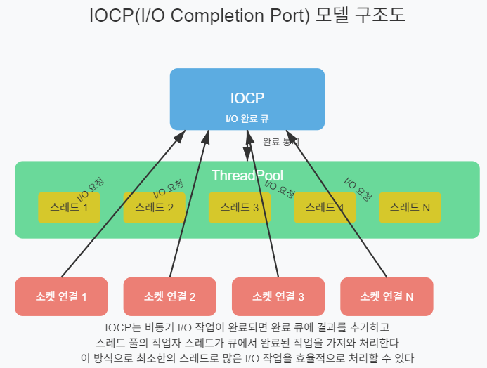   
  
  
## 5.2 소켓 풀링과 연결 관리
고성능 게임 서버는 수천 개의 동시 연결을 효율적으로 관리해야 한다. 소켓 풀링을 통해 연결 관리를 최적화하는 방법을 살펴보자.

### 5.2.1 소켓 풀링의 개념
소켓 풀링은 소켓 객체를 재사용하여 메모리 할당/해제의 오버헤드를 줄이고 성능을 향상시키는 기법이다.

```csharp
public class SocketPool
{
    private readonly ConcurrentBag<Socket> _pool;
    private readonly int _maxPoolSize;
    private readonly AddressFamily _addressFamily;
    private readonly SocketType _socketType;
    private readonly ProtocolType _protocolType;
    
    public SocketPool(int maxPoolSize, AddressFamily addressFamily = AddressFamily.InterNetwork,
                     SocketType socketType = SocketType.Stream, 
                     ProtocolType protocolType = ProtocolType.Tcp)
    {
        _maxPoolSize = maxPoolSize;
        _addressFamily = addressFamily;
        _socketType = socketType;
        _protocolType = protocolType;
        _pool = new ConcurrentBag<Socket>();
    }
    
    public Socket Rent()
    {
        if (_pool.TryTake(out Socket socket))
        {
            return socket;
        }
        
        // 풀에 소켓이 없으면 새로 생성
        return new Socket(_addressFamily, _socketType, _protocolType);
    }
    
    public void Return(Socket socket)
    {
        if (socket == null)
            throw new ArgumentNullException(nameof(socket));
            
        // 소켓이 여전히 유효한지 확인
        if (socket.Connected)
        {
            socket.Disconnect(true); // 연결 해제하되 소켓 재사용 가능하게 유지
        }
        
        // 풀이 최대 크기에 도달하지 않았으면 반환
        if (_pool.Count < _maxPoolSize)
        {
            _pool.Add(socket);
        }
        else
        {
            // 풀이 가득 찼으면 소켓 폐기
            socket.Dispose();
        }
    }
    
    public void Clear()
    {
        while (_pool.TryTake(out Socket socket))
        {
            socket.Dispose();
        }
    }
}
```  
   
#### Socket.Disconnect(bool reuseSocket) 메서드

##### 기본 개념

```csharp
socket.Disconnect(true);  // reuseSocket = true
socket.Disconnect(false); // reuseSocket = false
```

이 메서드는 현재 소켓 연결을 끊되, `reuseSocket` 매개변수에 따라 소켓의 재사용 가능성을 결정합니다.

##### reuseSocket 매개변수의 의미

**`true`인 경우:**
- 소켓 연결을 해제하지만 소켓 객체 자체는 유지
- 나중에 같은 소켓으로 다른 연결을 다시 시작할 수 있음
- 소켓의 내부 핸들과 리소스가 보존됨
- `Connect()` 메서드를 다시 호출해서 새로운 연결 가능

**`false`인 경우:**
- 소켓 연결을 완전히 해제하고 소켓도 완전히 닫음
- 해당 소켓 객체는 더 이상 사용 불가
- 새로운 연결을 위해서는 새로운 Socket 객체를 생성해야 함

##### 실제 사용 예제

```csharp
// 소켓 재사용 가능하게 연결 해제
Socket clientSocket = new Socket(AddressFamily.InterNetwork, SocketType.Stream, ProtocolType.Tcp);

// 첫 번째 연결
clientSocket.Connect("192.168.1.100", 8080);
// ... 데이터 송수신 ...

// 연결 해제 (소켓 재사용 가능)
clientSocket.Disconnect(true);

// 같은 소켓으로 다른 서버에 재연결 가능
clientSocket.Connect("192.168.1.200", 9090);
// ... 새로운 연결에서 데이터 송수신 ...

clientSocket.Close(); // 최종적으로 소켓 완전 해제
```

##### 장점과 사용 시나리오
**재사용의 장점:**
- 소켓 객체 생성/해제 오버헤드 감소
- 메모리 할당/해제 횟수 줄임
- 연결 풀링(Connection Pooling) 구현 시 유용
- 게임 서버에서 룸 변경 시나리오에 적합

**적합한 사용 사례:**
- 클라이언트가 여러 서버에 순차적으로 연결해야 할 때
- 연결 끊김 후 같은 서버에 재연결해야 할 때
- 연결 풀을 구현할 때
- 온라인 게임에서 서버 간 이동 시

##### 주의사항
1. **상태 확인:** 재연결하기 전에 소켓 상태를 확인해야 한다
```csharp
if (!socket.Connected)
{
    socket.Connect(newEndPoint);
}
```

2. **예외 처리:** Disconnect 호출 시 예외가 발생할 수 있다
```csharp
try 
{
    socket.Disconnect(true);
}
catch (SocketException ex)
{
    Console.WriteLine($"Disconnect 오류: {ex.Message}");
}
```

3. **비동기 버전:** `DisconnectAsync()` 메서드도 사용 가능하다
```csharp
await socket.DisconnectAsync(true);
```

##### 온라인 게임에서의 활용
온라인 게임 서버 개발에서는 다음과 같은 상황에서 유용하다:

```csharp
// 게임 룸 변경 시나리오
public async Task ChangeGameRoom(string newRoomServer, int port)
{
    // 현재 룸에서 연결 해제 (소켓 재사용 가능)
    if (gameSocket.Connected)
    {
        gameSocket.Disconnect(true);
    }
    
    // 새로운 룸 서버에 연결
    await gameSocket.ConnectAsync(newRoomServer, port);
    
    // 게임 상태 복원 및 새로운 룸 진입
}
```

이렇게 하면 클라이언트가 게임 룸을 변경할 때마다 새로운 소켓을 생성하지 않고도 효율적으로 서버 간 이동이 가능하다.  
  

### 5.2.2 연결 관리 시스템
대규모 게임 서버에서는 수천 개의 클라이언트 연결을 효율적으로 관리해야 한다.
  
**주요 구성 요소:**

1. **ConnectionManager**: 모든 클라이언트 연결을 중앙에서 관리하는 클래스
   - `ConcurrentDictionary`로 안전한 연결 관리
   - 타이머 기반 헬스체크 시스템
   - 소켓 풀을 통한 리소스 최적화

2. **ClientConnection**: 개별 클라이언트와의 연결을 관리하는 클래스
   - 연결 상태 추적 (New → Initializing → Connected → Disconnected)
   - 비동기 메시지 수신 및 처리
   - 하트비트를 통한 연결 유지

3. **핵심 메커니즘:**
   - **연결 라이프사이클**: 생성 → 초기화 → 메시지 처리 → 종료
   - **헬스체크**: 30초마다 모든 연결의 상태와 마지막 활동 시간 확인
   - **타임아웃 관리**: 비활성 연결 자동 정리
   - **하트비트**: 연결 유지를 위한 주기적 PING 전송
  
  
#### 클래스 다이어그램

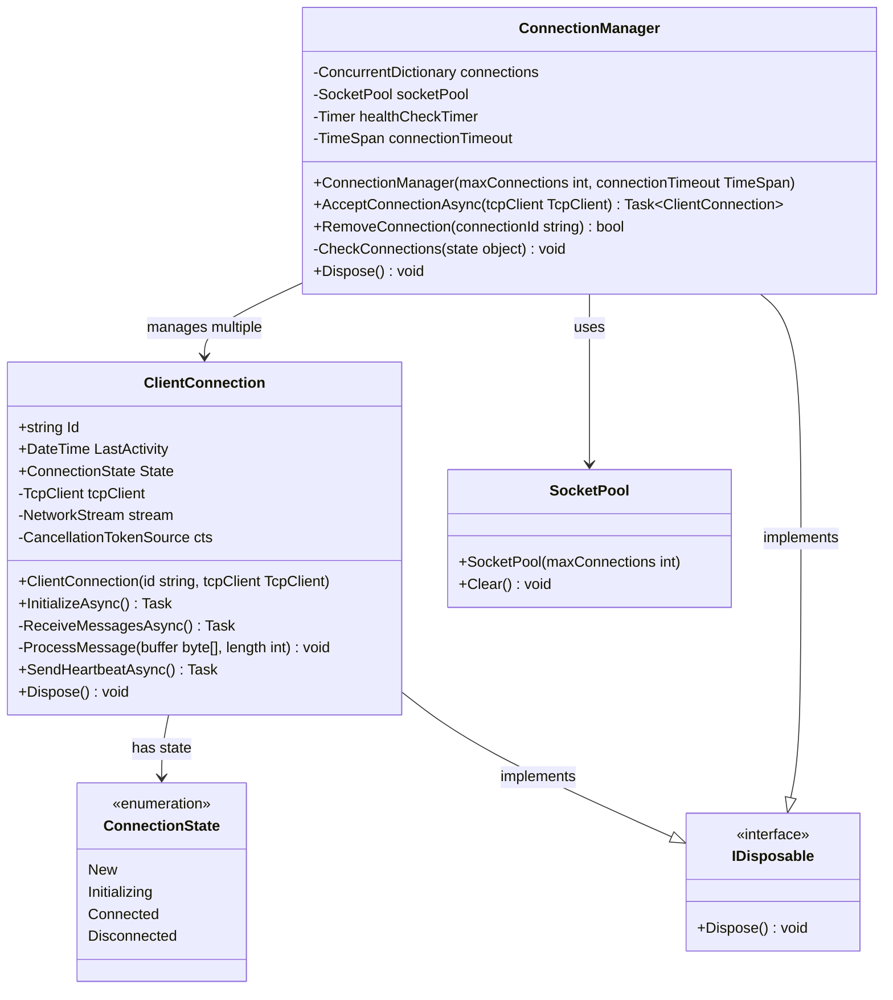

#### 연결 생성 및 초기화 시퀀스

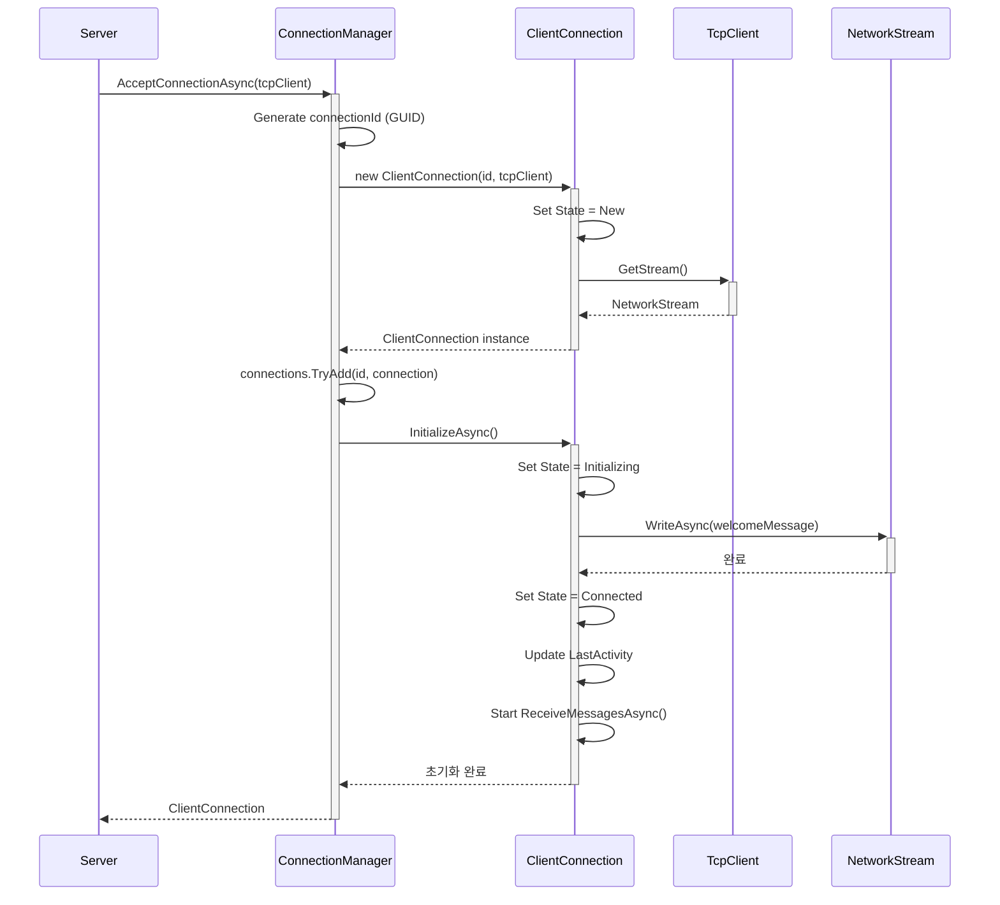

#### 메시지 수신 및 처리 시퀀스

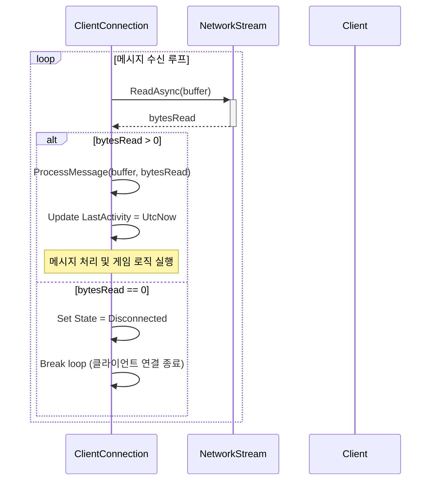

#### 상태 전이 다이어그램

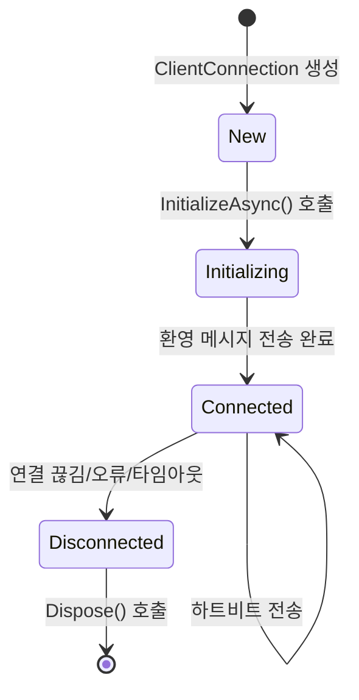

#### 헬스체크 및 연결 관리 시퀀스

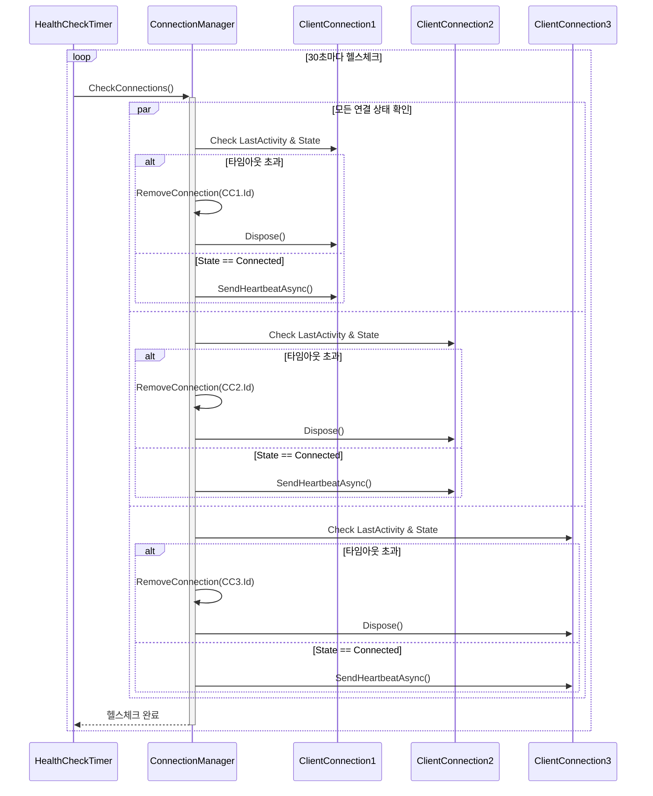

#### 연결 종료 및 정리 시퀀스

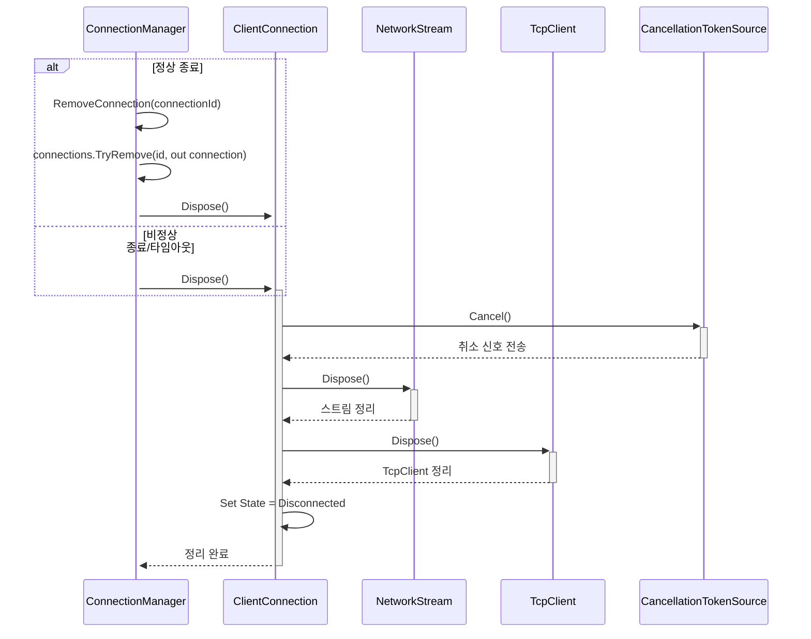

#### 코드  
  
```csharp
public class ConnectionManager
{
    private readonly ConcurrentDictionary<string, ClientConnection> _connections = 
        new ConcurrentDictionary<string, ClientConnection>();
    private readonly SocketPool _socketPool;
    private readonly Timer _healthCheckTimer;
    private readonly TimeSpan _connectionTimeout;
    
    public ConnectionManager(int maxConnections, TimeSpan connectionTimeout)
    {
        _socketPool = new SocketPool(maxConnections);
        _connectionTimeout = connectionTimeout;
        
        // 주기적으로 연결 상태 확인
        _healthCheckTimer = new Timer(CheckConnections, null, TimeSpan.FromSeconds(30), TimeSpan.FromSeconds(30));
    }
    
    public async Task<ClientConnection> AcceptConnectionAsync(TcpClient tcpClient)
    {
        string connectionId = Guid.NewGuid().ToString();
        var clientConnection = new ClientConnection(connectionId, tcpClient);
        
        if (_connections.TryAdd(connectionId, clientConnection))
        {
            // 연결 초기화 작업
            await clientConnection.InitializeAsync();
            return clientConnection;
        }
        else
        {
            clientConnection.Dispose();
            throw new InvalidOperationException("연결을 추가할 수 없습니다.");
        }
    }
    
    public bool RemoveConnection(string connectionId)
    {
        if (_connections.TryRemove(connectionId, out ClientConnection connection))
        {
            connection.Dispose();
            return true;
        }
        return false;
    }
    
    private void CheckConnections(object state)
    {
        foreach (var connection in _connections.Values)
        {
            // 마지막 활동 시간이 타임아웃을 초과하면 연결 종료
            if (DateTime.UtcNow - connection.LastActivity > _connectionTimeout)
            {
                Console.WriteLine($"연결 {connection.Id} 시간 초과로 종료");
                RemoveConnection(connection.Id);
            }
            else if (connection.State == ConnectionState.Connected)
            {
                // 주기적으로 연결 상태 확인 메시지 전송
                _ = connection.SendHeartbeatAsync();
            }
        }
    }
    
    public void Dispose()
    {
        _healthCheckTimer.Dispose();
        
        foreach (var connection in _connections.Values)
        {
            connection.Dispose();
        }
        
        _connections.Clear();
        _socketPool.Clear();
    }
}

public class ClientConnection : IDisposable
{
    public string Id { get; }
    public DateTime LastActivity { get; private set; }
    public ConnectionState State { get; private set; }
    
    private readonly TcpClient _tcpClient;
    private readonly NetworkStream _stream;
    private readonly CancellationTokenSource _cts = new CancellationTokenSource();
    
    public ClientConnection(string id, TcpClient tcpClient)
    {
        Id = id;
        _tcpClient = tcpClient;
        _stream = tcpClient.GetStream();
        LastActivity = DateTime.UtcNow;
        State = ConnectionState.New;
    }
    
    public async Task InitializeAsync()
    {
        // 연결 초기화 로직
        State = ConnectionState.Initializing;
        
        // 클라이언트에 환영 메시지 전송
        byte[] welcomeMessage = Encoding.UTF8.GetBytes("연결 성공!");
        await _stream.WriteAsync(welcomeMessage, 0, welcomeMessage.Length);
        
        State = ConnectionState.Connected;
        LastActivity = DateTime.UtcNow;
        
        // 비동기적으로 메시지 수신 시작
        _ = ReceiveMessagesAsync();
    }
    
    private async Task ReceiveMessagesAsync()
    {
        byte[] buffer = new byte[4096];
        
        try
        {
            while (!_cts.Token.IsCancellationRequested)
            {
                int bytesRead = await _stream.ReadAsync(buffer, 0, buffer.Length, _cts.Token);
                
                if (bytesRead == 0)
                {
                    // 클라이언트가 연결을 종료함
                    State = ConnectionState.Disconnected;
                    break;
                }
                
                // 메시지 처리
                ProcessMessage(buffer, bytesRead);
                
                // 활동 시간 업데이트
                LastActivity = DateTime.UtcNow;
            }
        }
        catch (Exception)
        {
            State = ConnectionState.Disconnected;
        }
    }
    
    private void ProcessMessage(byte[] buffer, int length)
    {
        // 실제 메시지 처리 로직
        string message = Encoding.UTF8.GetString(buffer, 0, length);
        Console.WriteLine($"클라이언트 {Id}로부터 메시지 수신: {message}");
        
        // 여기서 게임 로직에 따라 메시지 처리
    }
    
    public async Task SendHeartbeatAsync()
    {
        try
        {
            byte[] heartbeat = Encoding.UTF8.GetBytes("PING");
            await _stream.WriteAsync(heartbeat, 0, heartbeat.Length);
        }
        catch
        {
            State = ConnectionState.Disconnected;
        }
    }
    
    public void Dispose()
    {
        _cts.Cancel();
        _stream.Dispose();
        _tcpClient.Dispose();
        State = ConnectionState.Disconnected;
    }
}

public enum ConnectionState
{
    New,
    Initializing,
    Connected,
    Disconnected
}
```  
  
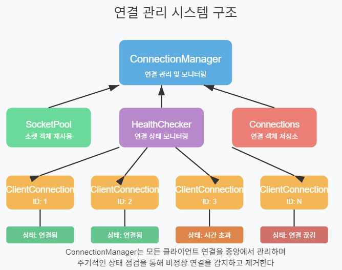   

#### 완전한 코드
위 코드에 좀 더 코드를 추가하여 완전하게 실행할 수 있는 코드로 만들었다.   
```
using System;
using System.Collections.Concurrent;
using System.Net;
using System.Net.Sockets;
using System.Text;
using System.Threading;
using System.Threading.Tasks;

namespace ConnectionManagerDemo
{
    class Program
    {
        static async Task Main(string[] args)
        {
            var server = new GameServer("127.0.0.1", 7000, 100, TimeSpan.FromMinutes(5));
            
            Console.WriteLine("게임 서버 시작 중...");
            Console.WriteLine("종료하려면 'quit' 입력");
            
            // 서버 시작
            var serverTask = server.StartAsync();
            
            // 콘솔 입력 처리
            while (true)
            {
                var input = Console.ReadLine();
                if (input?.ToLower() == "quit")
                {
                    break;
                }
                else if (input?.ToLower() == "status")
                {
                    Console.WriteLine($"현재 연결 수: {server.GetConnectionCount()}");
                }
            }
            
            Console.WriteLine("서버 종료 중...");
            server.Stop();
            await serverTask;
            Console.WriteLine("서버가 종료되었습니다.");
        }
    }
    
    public class GameServer
    {
        private readonly TcpListener _listener;
        private readonly ConnectionManager _connectionManager;
        private readonly CancellationTokenSource _cts;
        private bool _isRunning;
        
        public GameServer(string ipAddress, int port, int maxConnections, TimeSpan connectionTimeout)
        {
            IPAddress ip = IPAddress.Parse(ipAddress);
            _listener = new TcpListener(ip, port);
            _connectionManager = new ConnectionManager(maxConnections, connectionTimeout);
            _cts = new CancellationTokenSource();
        }
        
        public async Task StartAsync()
        {
            _listener.Start();
            _isRunning = true;
            Console.WriteLine($"서버가 {_listener.LocalEndpoint}에서 시작됨");
            
            try
            {
                while (!_cts.Token.IsCancellationRequested && _isRunning)
                {
                    var tcpClient = await _listener.AcceptTcpClientAsync();
                    Console.WriteLine($"새 클라이언트 연결: {tcpClient.Client.RemoteEndPoint}");
                    
                    // 비동기적으로 클라이언트 처리
                    _ = HandleClientAsync(tcpClient);
                }
            }
            catch (ObjectDisposedException)
            {
                // 정상 종료 시 발생할 수 있음
            }
            catch (Exception ex)
            {
                Console.WriteLine($"서버 오류: {ex.Message}");
            }
            finally
            {
                _listener?.Stop();
                _connectionManager?.Dispose();
                Console.WriteLine("서버 리스너 종료됨");
            }
        }
        
        private async Task HandleClientAsync(TcpClient tcpClient)
        {
            ClientConnection connection = null;
            
            try
            {
                connection = await _connectionManager.AcceptConnectionAsync(tcpClient);
                Console.WriteLine($"클라이언트 연결 초기화 완료: {connection.Id}");
                
                // 연결이 종료될 때까지 대기
                await connection.WaitForDisconnectionAsync();
            }
            catch (Exception ex)
            {
                Console.WriteLine($"클라이언트 처리 오류: {ex.Message}");
                connection?.Dispose();
            }
            finally
            {
                if (connection != null)
                {
                    _connectionManager.RemoveConnection(connection.Id);
                    Console.WriteLine($"클라이언트 연결 종료: {connection.Id}");
                }
            }
        }
        
        public int GetConnectionCount()
        {
            return _connectionManager.GetConnectionCount();
        }
        
        public void Stop()
        {
            _isRunning = false;
            _cts.Cancel();
            _listener?.Stop();
        }
    }
    
    public class ConnectionManager : IDisposable
    {
        private readonly ConcurrentDictionary<string, ClientConnection> _connections = 
            new ConcurrentDictionary<string, ClientConnection>();
        private readonly SocketPool _socketPool;
        private readonly Timer _healthCheckTimer;
        private readonly TimeSpan _connectionTimeout;
        private bool _disposed = false;
        
        public ConnectionManager(int maxConnections, TimeSpan connectionTimeout)
        {
            _socketPool = new SocketPool(maxConnections);
            _connectionTimeout = connectionTimeout;
            
            // 주기적으로 연결 상태 확인 (30초마다)
            _healthCheckTimer = new Timer(CheckConnections, null, 
                TimeSpan.FromSeconds(30), TimeSpan.FromSeconds(30));
            
            Console.WriteLine($"ConnectionManager 초기화됨 (최대 연결 수: {maxConnections}, 타임아웃: {connectionTimeout})");
        }
        
        public async Task<ClientConnection> AcceptConnectionAsync(TcpClient tcpClient)
        {
            if (_disposed)
                throw new ObjectDisposedException(nameof(ConnectionManager));
                
            string connectionId = Guid.NewGuid().ToString("N")[..8]; // 짧은 ID 사용
            var clientConnection = new ClientConnection(connectionId, tcpClient);
            
            if (_connections.TryAdd(connectionId, clientConnection))
            {
                Console.WriteLine($"새 연결 추가: {connectionId} (총 연결 수: {_connections.Count})");
                
                // 연결 초기화 작업
                await clientConnection.InitializeAsync();
                return clientConnection;
            }
            else
            {
                clientConnection.Dispose();
                throw new InvalidOperationException("연결을 추가할 수 없습니다.");
            }
        }
        
        public bool RemoveConnection(string connectionId)
        {
            if (_connections.TryRemove(connectionId, out ClientConnection connection))
            {
                connection.Dispose();
                Console.WriteLine($"연결 제거됨: {connectionId} (총 연결 수: {_connections.Count})");
                return true;
            }
            return false;
        }
        
        public int GetConnectionCount()
        {
            return _connections.Count;
        }
        
        private void CheckConnections(object state)
        {
            if (_disposed) return;
            
            var disconnectedConnections = new List<string>();
            var now = DateTime.UtcNow;
            
            foreach (var kvp in _connections)
            {
                var connection = kvp.Value;
                var timeSinceLastActivity = now - connection.LastActivity;
                
                // 마지막 활동 시간이 타임아웃을 초과하면 연결 종료
                if (timeSinceLastActivity > _connectionTimeout)
                {
                    Console.WriteLine($"연결 {connection.Id} 시간 초과로 종료 (마지막 활동: {timeSinceLastActivity.TotalMinutes:F1}분 전)");
                    disconnectedConnections.Add(connection.Id);
                }
                else if (connection.State == ConnectionState.Connected)
                {
                    // 주기적으로 연결 상태 확인 메시지 전송
                    _ = connection.SendHeartbeatAsync();
                }
            }
            
            // 타임아웃된 연결들 제거
            foreach (var connectionId in disconnectedConnections)
            {
                RemoveConnection(connectionId);
            }
            
            if (_connections.Count > 0)
            {
                Console.WriteLine($"헬스체크 완료 - 활성 연결: {_connections.Count}개, 제거된 연결: {disconnectedConnections.Count}개");
            }
        }
        
        public void Dispose()
        {
            if (_disposed) return;
            
            _disposed = true;
            _healthCheckTimer?.Dispose();
            
            foreach (var connection in _connections.Values)
            {
                connection.Dispose();
            }
            
            _connections.Clear();
            _socketPool?.Clear();
            Console.WriteLine("ConnectionManager가 정리됨");
        }
    }
    
    public class ClientConnection : IDisposable
    {
        public string Id { get; }
        public DateTime LastActivity { get; private set; }
        public ConnectionState State { get; private set; }
        
        private readonly TcpClient _tcpClient;
        private readonly NetworkStream _stream;
        private readonly CancellationTokenSource _cts = new CancellationTokenSource();
        private readonly TaskCompletionSource<bool> _disconnectionTcs = new TaskCompletionSource<bool>();
        private bool _disposed = false;
        
        public ClientConnection(string id, TcpClient tcpClient)
        {
            Id = id;
            _tcpClient = tcpClient;
            _stream = tcpClient.GetStream();
            LastActivity = DateTime.UtcNow;
            State = ConnectionState.New;
        }
        
        public async Task InitializeAsync()
        {
            if (_disposed) return;
            
            // 연결 초기화 로직
            State = ConnectionState.Initializing;
            Console.WriteLine($"클라이언트 {Id} 초기화 시작");
            
            try
            {
                // 클라이언트에 환영 메시지 전송
                string welcomeMsg = $"연결 성공! 당신의 ID: {Id}";
                byte[] welcomeMessage = Encoding.UTF8.GetBytes(welcomeMsg);
                await _stream.WriteAsync(welcomeMessage, 0, welcomeMessage.Length, _cts.Token);
                
                State = ConnectionState.Connected;
                LastActivity = DateTime.UtcNow;
                Console.WriteLine($"클라이언트 {Id} 초기화 완료");
                
                // 비동기적으로 메시지 수신 시작
                _ = ReceiveMessagesAsync();
            }
            catch (Exception ex)
            {
                Console.WriteLine($"클라이언트 {Id} 초기화 실패: {ex.Message}");
                State = ConnectionState.Disconnected;
                _disconnectionTcs.TrySetResult(true);
                throw;
            }
        }
        
        private async Task ReceiveMessagesAsync()
        {
            byte[] buffer = new byte[4096];
            
            try
            {
                while (!_cts.Token.IsCancellationRequested && State == ConnectionState.Connected)
                {
                    int bytesRead = await _stream.ReadAsync(buffer, 0, buffer.Length, _cts.Token);
                    
                    if (bytesRead == 0)
                    {
                        // 클라이언트가 연결을 종료함
                        Console.WriteLine($"클라이언트 {Id}가 연결을 종료함");
                        State = ConnectionState.Disconnected;
                        break;
                    }
                    
                    // 메시지 처리
                    ProcessMessage(buffer, bytesRead);
                    
                    // 활동 시간 업데이트
                    LastActivity = DateTime.UtcNow;
                }
            }
            catch (OperationCanceledException)
            {
                Console.WriteLine($"클라이언트 {Id} 메시지 수신이 취소됨");
            }
            catch (Exception ex)
            {
                Console.WriteLine($"클라이언트 {Id} 메시지 수신 오류: {ex.Message}");
            }
            finally
            {
                State = ConnectionState.Disconnected;
                _disconnectionTcs.TrySetResult(true);
            }
        }
        
        private void ProcessMessage(byte[] buffer, int length)
        {
            // 실제 메시지 처리 로직
            string message = Encoding.UTF8.GetString(buffer, 0, length).Trim();
            Console.WriteLine($"[{Id}] 수신: {message}");
            
            // 간단한 에코 응답
            if (!string.IsNullOrEmpty(message) && !_disposed)
            {
                var response = $"에코: {message}";
                _ = SendMessageAsync(response);
            }
        }
        
        private async Task SendMessageAsync(string message)
        {
            if (_disposed || State != ConnectionState.Connected) return;
            
            try
            {
                byte[] data = Encoding.UTF8.GetBytes(message);
                await _stream.WriteAsync(data, 0, data.Length, _cts.Token);
                Console.WriteLine($"[{Id}] 전송: {message}");
            }
            catch (Exception ex)
            {
                Console.WriteLine($"클라이언트 {Id} 메시지 전송 실패: {ex.Message}");
                State = ConnectionState.Disconnected;
            }
        }
        
        public async Task SendHeartbeatAsync()
        {
            if (_disposed || State != ConnectionState.Connected) return;
            
            try
            {
                byte[] heartbeat = Encoding.UTF8.GetBytes("PING");
                await _stream.WriteAsync(heartbeat, 0, heartbeat.Length, _cts.Token);
                Console.WriteLine($"[{Id}] 하트비트 전송");
            }
            catch (Exception ex)
            {
                Console.WriteLine($"클라이언트 {Id} 하트비트 전송 실패: {ex.Message}");
                State = ConnectionState.Disconnected;
                _disconnectionTcs.TrySetResult(true);
            }
        }
        
        public Task WaitForDisconnectionAsync()
        {
            return _disconnectionTcs.Task;
        }
        
        public void Dispose()
        {
            if (_disposed) return;
            
            _disposed = true;
            State = ConnectionState.Disconnected;
            
            _cts.Cancel();
            _disconnectionTcs.TrySetResult(true);
            
            try
            {
                _stream?.Dispose();
            }
            catch { }
            
            try
            {
                _tcpClient?.Dispose();
            }
            catch { }
            
            _cts.Dispose();
            Console.WriteLine($"클라이언트 {Id} 리소스 정리 완료");
        }
    }
    
    public class SocketPool
    {
        private readonly int _maxConnections;
        
        public SocketPool(int maxConnections)
        {
            _maxConnections = maxConnections;
        }
        
        public void Clear()
        {
            // 소켓 풀 정리 로직
            Console.WriteLine("SocketPool 정리됨");
        }
    }
    
    public enum ConnectionState
    {
        New,
        Initializing,
        Connected,
        Disconnected
    }
}
```  
  
##### 주요 기능
1. **완전한 서버 구현**: `GameServer` 클래스로 TCP 리스너와 연결 관리를 통합
2. **실시간 모니터링**: 콘솔에서 연결 상태와 메시지 처리 과정을 실시간으로 확인 가능
3. **에코 서버**: 클라이언트가 보낸 메시지를 그대로 돌려보내는 간단한 게임 로직
4. **헬스체크 시스템**: 30초마다 모든 연결의 상태를 확인하고 타임아웃된 연결 자동 제거

##### 실행 방법
1. **서버 실행**:
   ```bash
   dotnet run
   ```

2. **클라이언트 테스트** (텔넷 사용):
   ```bash
   telnet 127.0.0.1 7000
   ```

3. **서버 명령어**:
   - `status`: 현재 연결 수 확인
   - `quit`: 서버 종료

##### 주요 개선사항
- **완전한 예외 처리**: 모든 비동기 작업에 대한 예외 처리 추가
- **리소스 정리**: `IDisposable` 패턴을 통한 안전한 리소스 해제
- **상태 추적**: 연결 상태를 명확히 추적하고 로깅
- **비동기 처리**: 모든 네트워크 작업을 비동기로 처리
- **스레드 안전성**: `ConcurrentDictionary`와 적절한 락 사용
  
  
    
## 5.3 버퍼 관리와 메모리 최적화
네트워크 게임 서버의 성능은 메모리 관리 효율성에 크게 의존한다. 버퍼 관리를 최적화하는 방법을 알아보자.

### 5.3.1 버퍼 풀링 구현
버퍼 풀링은 메모리 할당/해제의 오버헤드를 줄이고 가비지 컬렉션 압력을 최소화한다.

```csharp
public class BufferManager
{
    private readonly byte[] _buffer;
    private readonly Stack<int> _freeIndexPool;
    private readonly int _bufferSize;
    private readonly ReaderWriterLockSlim _lock = new ReaderWriterLockSlim();
    
    public BufferManager(int totalBytes, int bufferSize)
    {
        _bufferSize = bufferSize;
        _buffer = new byte[totalBytes];
        
        // 버퍼 인덱스 풀 초기화
        int count = totalBytes / bufferSize;
        _freeIndexPool = new Stack<int>(count);
        
        for (int i = 0; i < count; i++)
        {
            _freeIndexPool.Push(count - i - 1);
        }
    }
    
    public ArraySegment<byte> GetBuffer()
    {
        try
        {
            _lock.EnterWriteLock();
            
            if (_freeIndexPool.Count > 0)
            {
                int index = _freeIndexPool.Pop();
                return new ArraySegment<byte>(_buffer, index * _bufferSize, _bufferSize);
            }
            else
            {
                throw new InvalidOperationException("버퍼 풀이 소진되었습니다.");
            }
        }
        finally
        {
            _lock.ExitWriteLock();
        }
    }
    
    public void ReturnBuffer(ArraySegment<byte> buffer)
    {
        try
        {
            _lock.EnterWriteLock();
            
            // 반환된 버퍼가 이 풀의 것인지 확인
            if (buffer.Array != _buffer)
            {
                throw new ArgumentException("반환된 버퍼가 이 풀에서 할당되지 않았습니다.");
            }
            
            int index = buffer.Offset / _bufferSize;
            
            // 버퍼 인덱스를 풀에 반환
            _freeIndexPool.Push(index);
        }
        finally
        {
            _lock.ExitWriteLock();
        }
    }
}
```  
  
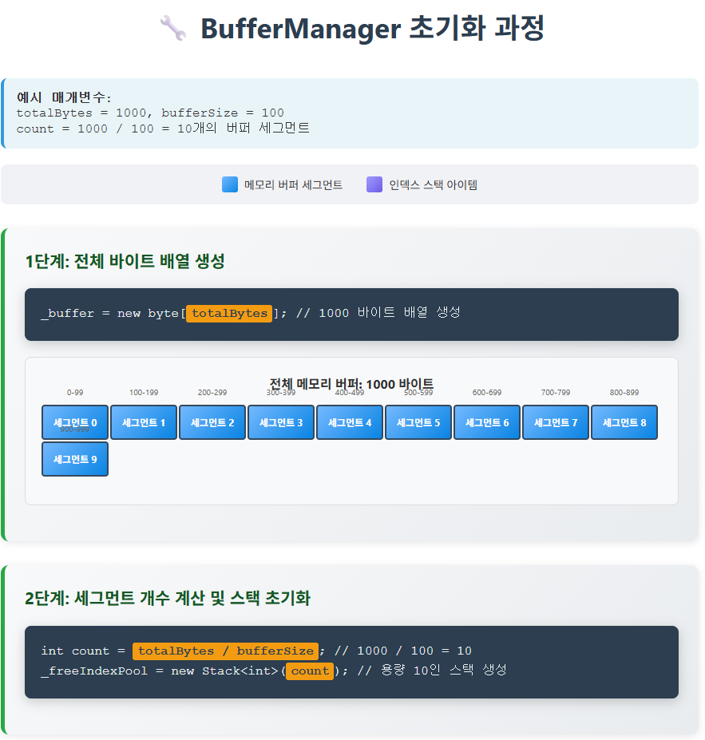   
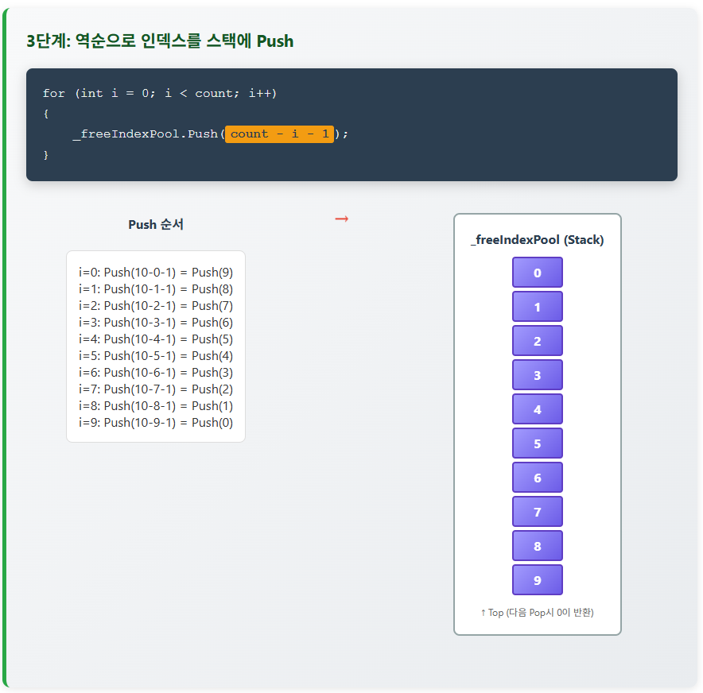   
  

### 5.3.2 메모리 최적화 기법

#### ArrayPool 활용
.NET에서 제공하는 `ArrayPool<T>`를 사용하여 배열 재사용:

```csharp
public class OptimizedNetworkHandler
{
    private readonly ArrayPool<byte> _arrayPool = ArrayPool<byte>.Shared;
    
    public async Task ProcessNetworkRequestAsync(Socket socket)
    {
        // 공유 풀에서 버퍼 대여
        byte[] buffer = _arrayPool.Rent(4096);
        
        try
        {
            int bytesRead = await socket.ReceiveAsync(
                new Memory<byte>(buffer), SocketFlags.None);
                
            // 데이터 처리
            ProcessData(new ReadOnlySpan<byte>(buffer, 0, bytesRead));
        }
        finally
        {
            // 버퍼 반환
            _arrayPool.Return(buffer);
        }
    }
    
    private void ProcessData(ReadOnlySpan<byte> data)
    {
        // 데이터 처리 로직
    }
}
```

#### Span<T>와 Memory<T> 활용
`Span<T>`와 `Memory<T>`를 사용하여 배열 복사 없이 메모리 슬라이싱:

```csharp
public class SpanBasedProtocolParser
{
    public void ParsePacket(ReadOnlySpan<byte> data)
    {
        if (data.Length < 8)
            throw new ArgumentException("패킷 데이터가 너무 짧습니다.");
        
        // 헤더 읽기 (첫 4바이트)
        ReadOnlySpan<byte> headerSpan = data.Slice(0, 4);
        int header = BitConverter.ToInt32(headerSpan);
        
        // 패킷 타입 읽기 (다음 4바이트)
        ReadOnlySpan<byte> typeSpan = data.Slice(4, 4);
        int packetType = BitConverter.ToInt32(typeSpan);
        
        // 페이로드 처리 (나머지 바이트)
        ReadOnlySpan<byte> payloadSpan = data.Slice(8);
        
        // 패킷 타입에 따라 처리
        switch (packetType)
        {
            case 1: // 채팅 메시지
                ProcessChatMessage(payloadSpan);
                break;
            case 2: // 게임 이벤트
                ProcessGameEvent(payloadSpan);
                break;
            // 기타 패킷 타입 처리
        }
    }
    
    private void ProcessChatMessage(ReadOnlySpan<byte> payload)
    {
        // 채팅 메시지 처리
    }
    
    private void ProcessGameEvent(ReadOnlySpan<byte> payload)
    {
        // 게임 이벤트 처리
    }
}
```  
  
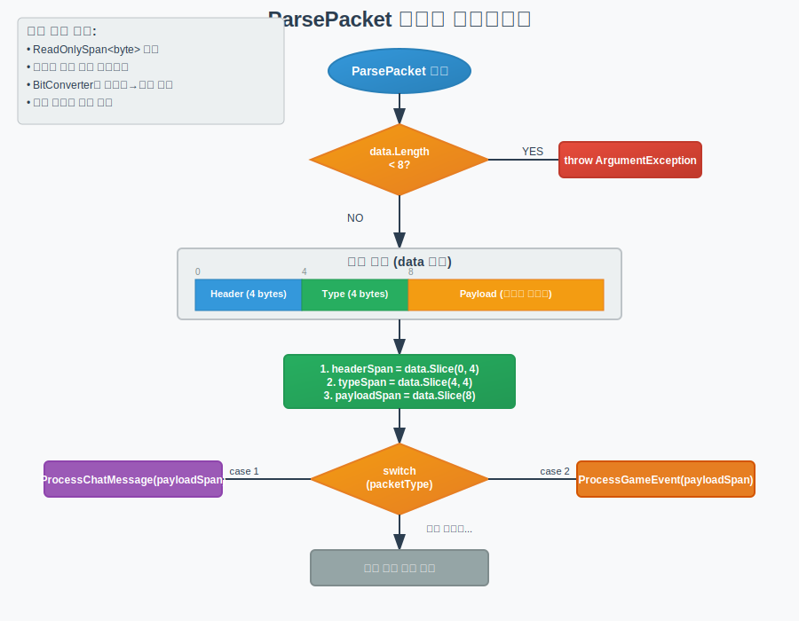    
  
1.  **시작(Start)**: `ParsePacket` 함수가 호출되어 실행을 시작합니다.
2.  **길이 확인(data.Length \< 8?)**: 패킷의 전체 길이가 최소 요구사항인 8바이트보다 작은지 확인합니다.
      * **Yes**: 길이가 8바이트보다 작으면 코드는 예외(Exception)를 발생시키고 처리를 중단합니다.
      * **No**: 길이가 충분하면 다음 단계로 진행합니다.
3.  **패킷 분석(Parse Packet)**:
    \*
      * 전체 데이터(`data`)는 세 부분으로 나뉩니다.
          * **Header (0-3 바이트)**: 처음 4바이트는 헤더 정보입니다.
          * **Type (4-7 바이트)**: 다음 4바이트는 패킷의 종류를 나타냅니다.
          * **Payload (8바이트부터 끝까지)**: 나머지 데이터는 실제 내용(페이로드)입니다.
4.  **타입에 따른 분기(switch (packetType))**: 분석된 `packetType` 값에 따라 어떤 처리를 할지 결정합니다.
      * **case 1**: 타입이 1이면, 페이로드 데이터를 `ProcessChatMessage` 함수로 넘겨 채팅 메시지를 처리합니다.
      * **case 2**: 타입이 2이면, 페이로드 데이터를 `ProcessGameEvent` 함수로 넘겨 게임 이벤트를 처리합니다.
      * (그 외 다른 case들도 유사하게 처리됩니다.)

  
### 5.3.3 메시지 프레이밍과 패킷 처리
네트워크 프로토콜을 위한 효율적인 메시지 프레이밍 구현:

```csharp
public class MessageFramer
{
    private readonly byte[] _lengthBuffer = new byte[4];
    private readonly List<byte> _messageBuffer = new List<byte>();
    private int _expectedLength = -1;
    
    public IEnumerable<byte[]> ProcessBytes(byte[] data, int bytesRead)
    {
        for (int i = 0; i < bytesRead; i++)
        {
            _messageBuffer.Add(data[i]);
            
            // 길이 헤더 완성 시 예상 길이 계산
            if (_messageBuffer.Count == 4 && _expectedLength == -1)
            {
                _messageBuffer.CopyTo(0, _lengthBuffer, 0, 4);
                _expectedLength = BitConverter.ToInt32(_lengthBuffer, 0);
                
                // 비정상적으로 큰 메시지 크기 검사
                if (_expectedLength > 1024 * 1024) // 1MB 제한
                {
                    throw new ProtocolViolationException("메시지 크기가 너무 큽니다.");
                }
            }
            
            // 전체 메시지가 수신되면 반환
            if (_expectedLength > 0 && _messageBuffer.Count >= _expectedLength + 4)
            {
                byte[] completeMessage = _messageBuffer.GetRange(4, _expectedLength).ToArray();
                
                // 버퍼 초기화
                _messageBuffer.RemoveRange(0, _expectedLength + 4);
                _expectedLength = -1;
                
                yield return completeMessage;
                
                // 남은 바이트가 또 다른 메시지를 구성하는지 확인
                if (_messageBuffer.Count >= 4)
                {
                    _messageBuffer.CopyTo(0, _lengthBuffer, 0, 4);
                    _expectedLength = BitConverter.ToInt32(_lengthBuffer, 0);
                    
                    if (_expectedLength > 1024 * 1024)
                    {
                        throw new ProtocolViolationException("메시지 크기가 너무 큽니다.");
                    }
                    
                    // 이미 완전한 메시지가 있으면 처리
                    if (_messageBuffer.Count >= _expectedLength + 4)
                    {
                        i--; // 다음 반복에서 같은 로직을 실행하기 위해
                    }
                }
            }
        }
    }
}
```
  
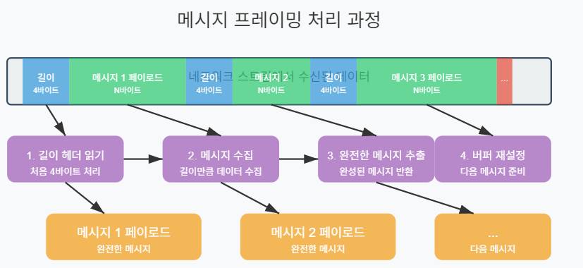   


## 5.4 SocketAsyncEventArgs 클래스 활용  
`SocketAsyncEventArgs` 클래스는 고성능 소켓 프로그래밍을 위한 .NET의 강력한 도구다. 이 클래스를 사용하면 비동기 소켓 작업의 메모리 오버헤드를 크게 줄일 수 있다.

### 5.4.1 SocketAsyncEventArgs 개요
`SocketAsyncEventArgs`의 주요 이점:

1. **객체 재사용**: 메모리 할당을 최소화하여 GC 부담 감소
2. **버퍼 관리**: 내장된 버퍼 관리 시스템
3. **비동기 콜백**: 효율적인 이벤트 기반 비동기 처리

```csharp
public class SocketAsyncEventArgsBasics
{
    private void ExplainBasics()
    {
        // 1. 인스턴스 생성
        var args = new SocketAsyncEventArgs();
        
        // 2. 완료 이벤트 핸들러 등록
        args.Completed += OnSocketOperationCompleted;
        
        // 3. 버퍼 설정
        byte[] buffer = new byte[4096];
        args.SetBuffer(buffer, 0, buffer.Length);
        
        // 4. 사용자 정의 상태 객체 설정
        args.UserToken = new MyConnectionState();
        
        // 5. 소켓 연산에 사용
        Socket socket = new Socket(AddressFamily.InterNetwork, SocketType.Stream, ProtocolType.Tcp);
        socket.ConnectAsync(args); // 비동기 연결 시작
    }
    
    private void OnSocketOperationCompleted(object sender, SocketAsyncEventArgs e)
    {
        // 작업 결과 확인
        if (e.SocketError == SocketError.Success)
        {
            // 성공한 경우 작업 유형에 따라 처리
            switch (e.LastOperation)
            {
                case SocketAsyncOperation.Connect:
                    ProcessConnect(e);
                    break;
                case SocketAsyncOperation.Receive:
                    ProcessReceive(e);
                    break;
                case SocketAsyncOperation.Send:
                    ProcessSend(e);
                    break;
                default:
                    throw new ArgumentException("지원되지 않는 비동기 소켓 작업");
            }
        }
        else
        {
            ProcessError(e);
        }
    }
    
    private void ProcessConnect(SocketAsyncEventArgs e)
    {
        // 연결 처리 로직
        // 연결 후 수신 작업 준비
        e.SetBuffer(0, e.Buffer.Length);
        Socket socket = (Socket)e.UserToken;
        
        bool willRaiseEvent = socket.ReceiveAsync(e);
        if (!willRaiseEvent)
        {
            // 작업이 동기적으로 완료된 경우
            ProcessReceive(e);
        }
    }
    
    private void ProcessReceive(SocketAsyncEventArgs e)
    {
        // 수신된 데이터 처리 로직
        if (e.BytesTransferred > 0)
        {
            // 데이터 처리
            // ...
            
            // 다시 수신 시작
            Socket socket = (Socket)e.UserToken;
            bool willRaiseEvent = socket.ReceiveAsync(e);
            if (!willRaiseEvent)
            {
                ProcessReceive(e);
            }
        }
        else
        {
            // 연결 종료 처리
            CloseSocket(e);
        }
    }
    
    private void ProcessSend(SocketAsyncEventArgs e)
    {
        // 전송 완료 처리 로직
    }
    
    private void ProcessError(SocketAsyncEventArgs e)
    {
        // 오류 처리 로직
        Socket socket = e.UserToken as Socket;
        
        // 연결 종료
        CloseSocket(e);
        
        Console.WriteLine($"소켓 오류: {e.SocketError}");
    }
    
    private void CloseSocket(SocketAsyncEventArgs e)
    {
        Socket socket = e.UserToken as Socket;
        
        try
        {
            socket.Shutdown(SocketShutdown.Both);
        }
        catch (Exception)
        {
            // 이미 닫혀 있을 수 있음
        }
        
        socket.Close();
    }
    
    private class MyConnectionState
    {
        // 연결별 상태 정보
    }
}
```
  
이 코드는 **`SocketAsyncEventArgs` (SAEA)** 클래스를 사용하여 고성능 비동기 소켓 통신을 구현하는 기본 구조를 보여준다. 이 패턴은 기존 `Begin/End` 방식이나 `async/await`에 비해 **메모리 할당을 최소화**하여 서버의 성능과 확장성을 극대화하는 데 중점을 둔다.
  
핵심 비유를 하자면, `SocketAsyncEventArgs` 객체는 **"재사용 가능한 작업 주문서"** 와 같다. 매번 새로운 작업(연결, 송신, 수신)을 요청할 때마다 새 주문서를 만드는 대신, 하나의 주문서를 계속해서 재사용하는 방식이다. 이 주문서에는 작업에 필요한 모든 정보(데이터를 담을 공간, 작업 완료 후 해야 할 일, 추가 정보 등)가 담겨 있다.
  
#### 코드 상세 분석
코드를 단계별로 나누어 "재사용 가능한 작업 주문서" 비유와 함께 살펴보겠다.

##### 1. `ExplainBasics`: 작업 준비 및 첫 주문 📝
이 메서드는 `SocketAsyncEventArgs` 객체를 설정하고 첫 번째 비동기 작업을 시작하는 과정을 보여준다.

* **`var args = new SocketAsyncEventArgs();`**
    * "작업 주문서(`args`)"를 하나 새로 만든다. 이 주문서는 앞으로 연결, 데이터 수신, 데이터 송신 등 다양한 작업을 위해 계속 재사용된다.

* **`args.Completed += OnSocketOperationCompleted;`**
    * 주문서에 "작업이 끝나면 `OnSocketOperationCompleted` 함수를 호출해주세요"라고 **완료 콜백(callback)을 등록**한다. 어떤 작업이든 이 주문서를 사용하면, 작업 완료 시 항상 이 함수가 실행된다.

* **`byte[] buffer = new byte[4096]; args.SetBuffer(buffer, 0, buffer.Length);`**
    * 데이터를 담을 **버퍼(메모리 공간)를 생성**하고 주문서에 첨부합니다. 데이터를 받거나 보낼 때 이 버퍼를 사용하게 됩니다. 매번 버퍼를 새로 만드는 것이 아니라, 이 큰 버퍼를 계속 재활용하므로 가비지 컬렉션(GC) 부담이 크게 줄어든다.

* **`args.UserToken = new MyConnectionState();`**
    * 주문서에 **사용자 정의 정보(`UserToken`)를 붙인다.** 이것은 해당 연결에만 필요한 고유한 상태 정보(예: 사용자 ID, 연결 시간, 임시 데이터 등)를 저장하는 데 유용하니다. 여기서는 `MyConnectionState`라는 객체를 사용했다.

* **`socket.ConnectAsync(args);`**
    * 설정이 완료된 "작업 주문서(`args`)"를 소켓에 전달하여 **첫 번째 비동기 작업(연결)**을 시작한다. 이제 프로그램은 연결이 완료될 때까지 기다리지 않고 다른 일을 할 수 있다. 연결 작업이 끝나면, 등록해둔 `OnSocketOperationCompleted` 콜백 함수가 자동으로 호출됩니다.

##### 2. `OnSocketOperationCompleted`: 작업 결과 보고 및 다음 지시 📢
모든 비동기 작업이 완료되면 공통적으로 이 메서드가 호출된다. 여기서는 완료된 작업의 결과를 확인하고 다음 행동을 결정한다.

* **`if (e.SocketError == SocketError.Success)`**
    * 주문서(`e`)에 적힌 작업 결과가 **성공**인지 먼저 확인한다.

* **`switch (e.LastOperation)`**
    * 작업이 성공했다면, **어떤 종류의 작업이 완료되었는지 확인**한다.
        * `SocketAsyncOperation.Connect`: **연결** 작업이었으면 `ProcessConnect` 메서드를 호출한다.
        * `SocketAsyncOperation.Receive`: **데이터 수신** 작업이었으면 `ProcessReceive` 메서드를 호출한다.
        * `SocketAsyncOperation.Send`: **데이터 송신** 작업이었으면 `ProcessSend` 메서드를 호출한다.
    * 이렇게 `switch` 문을 통해 완료된 작업에 맞는 후속 처리를 위임합니다.

* **`else { ProcessError(e); }`**
    * 만약 작업 중 오류가 발생했다면, `ProcessError` 메서드를 호출하여 오류 상황을 처리한다.
  
  
##### 3. `Process...` 메서드들: 실제 작업 처리 🛠️
각각의 `Process` 메서드는 특정 작업이 성공적으로 완료된 후의 구체적인 로직을 담당합니다.

* **`ProcessConnect`**: 연결 성공 후 처리
    1.  연결이 성공했으므로, 이제 서버로부터 **데이터를 받을 준비**를 합니다.
    2.  재사용하는 주문서(`e`)에 다음 작업인 **`ReceiveAsync` (비동기 수신)**를 설정하고 다시 소켓에 요청한다.

* **`ProcessReceive`**: 데이터 수신 성공 후 처리
    1.  **`e.BytesTransferred > 0`**: 수신된 데이터가 있는지 확인한다. 0보다 크면 데이터가 도착한 것이다.
    2.  도착한 데이터를 처리하는 로직을 수행한니다. (코드에서는 생략됨)
    3.  **다시 `ReceiveAsync`를 호출**하여 다음 데이터를 받을 준비를 한다. 이것이 바로 **수신 루프(Receive Loop)**의 핵심이다. 하나의 작업이 끝나면 곧바로 다음 작업을 요청하여 지속적으로 데이터를 수신 대기하는 구조이다.
    4.  **`!willRaiseEvent`**: `ReceiveAsync`와 같은 비동기 메서드는 때때로 **동기적으로 즉시 완료**될 수 있다. (예: 데이터가 이미 OS 버퍼에 도착해 있는 경우). `willRaiseEvent`가 `false`이면 작업이 즉시 완료되었다는 뜻이므로, 콜백(`OnSocketOperationCompleted`)이 호출되지 않는다. 따라서 이 경우 `ProcessReceive`를 직접 다시 호출하여 로직이 끊기지 않도록 해야 한다.
    5.  **`e.BytesTransferred == 0`**: 수신된 데이터가 0바이트이면 이는 상대방이 **연결을 정상적으로 종료**했다는 신호입니다. `CloseSocket`을 호출하여 소켓을 닫습니다.

    6. **`ProcessError` / `CloseSocket`**: 오류 및 종료 처리
    * 오류가 발생했거나 연결이 종료될 때 소켓을 안전하게 닫는 역할을 한다.

##### `SocketAsyncEventArgs` 패턴의 핵심 장점
1.  **성능 향상**: `SocketAsyncEventArgs` 객체와 버퍼를 **재사용**하므로, 반복적인 메모리 할당 및 해제(가비지 컬렉션)가 줄어들어 시스템 부하가 감소하고 응답 속도가 빨라진다.
2.  **확장성**: 적은 리소스를 사용하기 때문에 동시에 많은 클라이언트 연결을 효율적으로 처리할 수 있어, 대규모 서버 애플리케이션에 적합하다.
3.  **중앙화된 콜백**: 모든 비동기 작업의 완료 처리가 `Completed` 이벤트 핸들러 한 곳으로 모이므로, 코드 구조가 일관되고 관리가 용이하다.

  
### 5.4.2 SocketAsyncEventArgs 풀링
`SocketAsyncEventArgs` 객체 풀링을 통해 성능을 극대화할 수 있다.

```csharp
public class SocketAsyncEventArgsPool
{
    private readonly Stack<SocketAsyncEventArgs> _pool;
    
    public SocketAsyncEventArgsPool(int capacity)
    {
        _pool = new Stack<SocketAsyncEventArgs>(capacity);
    }
    
    public void Push(SocketAsyncEventArgs item)
    {
        if (item == null)
            throw new ArgumentNullException(nameof(item));
            
        lock (_pool)
        {
            _pool.Push(item);
        }
    }
    
    public SocketAsyncEventArgs Pop()
    {
        lock (_pool)
        {
            if (_pool.Count > 0)
            {
                return _pool.Pop();
            }
            else
            {
                return null;
            }
        }
    }
    
    public int Count
    {
        get
        {
            lock (_pool)
            {
                return _pool.Count;
            }
        }
    }
}
```

### 5.4.3 고성능 서버 구현

`SocketAsyncEventArgs`를 활용한 전체 서버 구현:

```csharp
public class HighPerformanceServer
{
    private readonly int _maxConnections;
    private readonly int _receiveBufferSize;
    private readonly BufferManager _bufferManager;
    private readonly SocketAsyncEventArgsPool _readPool;
    private readonly SocketAsyncEventArgsPool _writePool;
    private readonly Semaphore _maxConnectionsEnforcer;
    private Socket _listenSocket;
    
    public HighPerformanceServer(int maxConnections, int receiveBufferSize)
    {
        _maxConnections = maxConnections;
        _receiveBufferSize = receiveBufferSize;
        
        // 모든 소켓 작업에 사용할 버퍼 풀 생성
        // 수신 버퍼와 송신 버퍼를 각각 따로 할당
        int totalBytes = maxConnections * 2 * receiveBufferSize;
        _bufferManager = new BufferManager(totalBytes, receiveBufferSize);
        
        _readPool = new SocketAsyncEventArgsPool(maxConnections);
        _writePool = new SocketAsyncEventArgsPool(maxConnections);
        
        // 최대 연결 수 제한을 위한 세마포어
        _maxConnectionsEnforcer = new Semaphore(maxConnections, maxConnections);
    }
    
    public void Initialize()
    {
        // 버퍼 풀 초기화
        _bufferManager.InitializeBuffer();
        
        // SocketAsyncEventArgs 객체 풀 준비
        SocketAsyncEventArgs readArgs;
        
        for (int i = 0; i < _maxConnections; i++)
        {
            // 수신용 SocketAsyncEventArgs 준비
            readArgs = new SocketAsyncEventArgs();
            readArgs.Completed += IO_Completed;
            readArgs.UserToken = new AsyncUserToken();
            
            // 버퍼 할당
            _bufferManager.SetBuffer(readArgs);
            
            // 풀에 추가
            _readPool.Push(readArgs);
        }
        
        // 송신용 SocketAsyncEventArgs 준비 (비슷한 방식)
        for (int i = 0; i < _maxConnections; i++)
        {
            SocketAsyncEventArgs writeArgs = new SocketAsyncEventArgs();
            writeArgs.Completed += IO_Completed;
            writeArgs.UserToken = new AsyncUserToken();
            
            _bufferManager.SetBuffer(writeArgs);
            _writePool.Push(writeArgs);
        }
    }
    
    public void Start(IPEndPoint localEndPoint)
    {
        // 서버 소켓 생성 및 바인딩
        _listenSocket = new Socket(localEndPoint.AddressFamily, 
                                  SocketType.Stream, ProtocolType.Tcp);
        _listenSocket.Bind(localEndPoint);
        
        // 최대 100개의 대기 연결 허용
        _listenSocket.Listen(100);
        
        // 연결 수락 시작
        StartAccept(null);
        
        Console.WriteLine($"서버가 {localEndPoint}에서 시작됨");
    }
    
    private void StartAccept(SocketAsyncEventArgs acceptEventArg)
    {
        if (acceptEventArg == null)
        {
            acceptEventArg = new SocketAsyncEventArgs();
            acceptEventArg.Completed += AcceptEventArg_Completed;
        }
        else
        {
            // 소켓 핸들 정리
            acceptEventArg.AcceptSocket = null;
        }
        
        // 새 연결을 받기 전에 세마포어 대기
        _maxConnectionsEnforcer.WaitOne();
        
        bool willRaiseEvent = _listenSocket.AcceptAsync(acceptEventArg);
        if (!willRaiseEvent)
        {
            // 동기적으로 완료된 경우
            ProcessAccept(acceptEventArg);
        }
    }
    
    private void AcceptEventArg_Completed(object sender, SocketAsyncEventArgs e)
    {
        ProcessAccept(e);
    }
    
    private void ProcessAccept(SocketAsyncEventArgs e)
    {
        if (e.SocketError == SocketError.Success)
        {
            // 풀에서 수신용 SocketAsyncEventArgs 가져오기
            SocketAsyncEventArgs readEventArgs = _readPool.Pop();
            
            // 풀이 비어있으면 연결 거부
            if (readEventArgs == null)
            {
                Console.WriteLine("서버가 최대 용량에 도달했습니다. 연결 거부됨.");
                e.AcceptSocket.Close();
            }
            else
            {
                // 새 소켓에 대한 참조 저장
                AsyncUserToken token = (AsyncUserToken)readEventArgs.UserToken;
                token.Socket = e.AcceptSocket;
                
                Console.WriteLine($"클라이언트가 연결됨: {e.AcceptSocket.RemoteEndPoint}");
                
                // 데이터 수신 시작
                bool willRaiseEvent = e.AcceptSocket.ReceiveAsync(readEventArgs);
                if (!willRaiseEvent)
                {
                    ProcessReceive(readEventArgs);
                }
            }
            
            // 다음 연결 수락 준비
            StartAccept(e);
        }
        else
        {
            // 오류 발생 시 다시 시도
            StartAccept(e);
        }
    }
    
    private void IO_Completed(object sender, SocketAsyncEventArgs e)
    {
        // 완료된 I/O 작업의 유형에 따라 처리
        switch (e.LastOperation)
        {
            case SocketAsyncOperation.Receive:
                ProcessReceive(e);
                break;
            case SocketAsyncOperation.Send:
                ProcessSend(e);
                break;
            default:
                throw new ArgumentException("지원되지 않는 작업 유형");
        }
    }
    
    private void ProcessReceive(SocketAsyncEventArgs e)
    {
        AsyncUserToken token = (AsyncUserToken)e.UserToken;
        
        // 연결이 정상적으로 닫혔거나 오류가 발생한 경우
        if (e.BytesTransferred == 0 || e.SocketError != SocketError.Success)
        {
            CloseClientSocket(e);
            return;
        }
        
        // 수신된 데이터 처리
        byte[] data = new byte[e.BytesTransferred];
        Buffer.BlockCopy(e.Buffer, e.Offset, data, 0, e.BytesTransferred);
        
        // 데이터 처리 로직 (여기에서는 에코 서버로 구현)
        SendResponse(token.Socket, data);
        
        // 다시 수신 대기
        bool willRaiseEvent = token.Socket.ReceiveAsync(e);
        if (!willRaiseEvent)
        {
            ProcessReceive(e);
        }
    }
    
    private void SendResponse(Socket socket, byte[] data)
    {
        // 풀에서 송신용 SocketAsyncEventArgs 가져오기
        SocketAsyncEventArgs writeEventArgs = _writePool.Pop();
        
        if (writeEventArgs == null)
        {
            // 풀이 고갈되었으면 다시 시도를 위해 큐에 넣을 수 있음
            // 여기서는 간단히 오류 로그만 남김
            Console.WriteLine("송신 풀이 고갈되었습니다.");
            return;
        }
        
        // 버퍼에 데이터 복사
        Buffer.BlockCopy(data, 0, writeEventArgs.Buffer, writeEventArgs.Offset, data.Length);
        writeEventArgs.SetBuffer(writeEventArgs.Offset, data.Length);
        
        AsyncUserToken token = (AsyncUserToken)writeEventArgs.UserToken;
        token.Socket = socket;
        
        // 비동기 전송 시작
        bool willRaiseEvent = socket.SendAsync(writeEventArgs);
        if (!willRaiseEvent)
        {
            ProcessSend(writeEventArgs);
        }
    }
    
    private void ProcessSend(SocketAsyncEventArgs e)
    {
        if (e.SocketError == SocketError.Success)
        {
            // 전송 완료, SocketAsyncEventArgs 재사용을 위해 풀에 반환
            AsyncUserToken token = (AsyncUserToken)e.UserToken;
            token.Socket = null;
            _writePool.Push(e);
        }
        else
        {
            CloseClientSocket(e);
        }
    }
    
    private void CloseClientSocket(SocketAsyncEventArgs e)
    {
        AsyncUserToken token = e.UserToken as AsyncUserToken;
        
        // 소켓 연결 종료
        try
        {
            token.Socket.Shutdown(SocketShutdown.Both);
        }
        catch (Exception) { /* 이미 닫혀 있을 수 있음 */ }
        
        token.Socket.Close();
        token.Socket = null;
        
        // 연결 개수 제한 세마포어 증가
        _maxConnectionsEnforcer.Release();
        
        // SocketAsyncEventArgs를 풀로 반환
        _readPool.Push(e);
    }
    
    // 서버 중지
    public void Stop()
    {
        try
        {
            _listenSocket.Close();
        }
        catch (Exception ex)
        {
            Console.WriteLine($"서버 종료 중 오류: {ex.Message}");
        }
    }
    
    // 연결당 상태 정보를 저장하는 클래스
    private class AsyncUserToken
    {
        public Socket Socket { get; set; }
        // 추가 상태 정보 저장 가능
    }
    
    // 버퍼 관리를 위한 클래스
    private class BufferManager
    {
        private readonly int _bufferSize;
        private readonly int _totalBytes;
        private byte[] _buffer;
        private Stack<int> _freeIndexPool;
        private int _currentIndex;
        private readonly object _lockObject = new object();
        
        public BufferManager(int totalBytes, int bufferSize)
        {
            _totalBytes = totalBytes;
            _bufferSize = bufferSize;
        }
        
        public void InitializeBuffer()
        {
            _buffer = new byte[_totalBytes];
            _freeIndexPool = new Stack<int>();
            _currentIndex = 0;
        }
        
        public bool SetBuffer(SocketAsyncEventArgs args)
        {
            lock (_lockObject)
            {
                if (_freeIndexPool.Count > 0)
                {
                    // 이전에 사용했던 인덱스 재사용
                    int offset = _freeIndexPool.Pop();
                    args.SetBuffer(_buffer, offset, _bufferSize);
                }
                else
                {
                    // 새 인덱스 할당
                    if ((_totalBytes - _bufferSize) < _currentIndex)
                    {
                        return false; // 버퍼 풀 고갈
                    }
                    
                    args.SetBuffer(_buffer, _currentIndex, _bufferSize);
                    _currentIndex += _bufferSize;
                }
                
                return true;
            }
        }
        
        public void FreeBuffer(SocketAsyncEventArgs args)
        {
            lock (_lockObject)
            {
                _freeIndexPool.Push(args.Offset);
                args.SetBuffer(null, 0, 0);
            }
        }
    }
}
```  
  
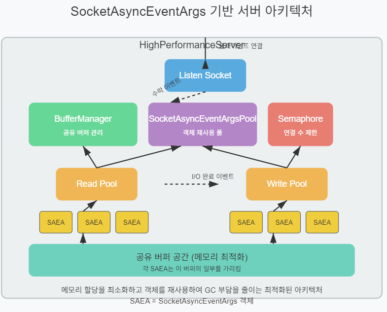   


### 5.4.4 성능 비교
아래 표는 다양한 소켓 프로그래밍 방식의 성능을 비교한 것이다:
  

## 5.5 과제
다음 과제를 통해 이 장에서 학습한 내용을 적용해보자.

### 과제 1: 고성능 버퍼 풀 구현
**목표**: `ArrayPool<T>`와 `Memory<T>`를 활용한 버퍼 풀 클래스를 구현하라.

**요구사항**:
1. 재사용 가능한 버퍼 크기별로 별도의 풀을 관리한다 (예: 4KB, 16KB, 64KB).
2. 메모리 단편화를 최소화하는 전략을 구현한다.
3. 스레드 안전하게 구현한다.
4. 버퍼 사용 통계를 수집하는 기능을 추가한다 (할당 횟수, 최대 동시 사용량 등).

**힌트**:
- `ArrayPool<T>.Create()` 메서드를 사용하여 커스텀 풀을 생성할 수 있다.
- 메모리 오버헤드를 줄이기 위해 버퍼 크기를 2의 제곱수로 설정한다.
  

### 과제 2: SocketAsyncEventArgs 기반 에코 서버 구현
**목표**: `SocketAsyncEventArgs`를 사용하여 고성능 에코 서버를 구현하라.

**요구사항**:
1. `SocketAsyncEventArgs` 객체 풀링을 구현한다.
2. 공유 버퍼 관리를 위한 `BufferManager`를 구현한다.
3. 최대 10,000개의 동시 연결을 처리할 수 있어야 한다.
4. 클라이언트 연결/연결 해제 이벤트를 처리한다.
5. 성능 측정을 위한 간단한 모니터링 기능을 추가한다 (초당 요청 수, 활성 연결 수).

**힌트**:
- 5.4절의 예제 코드를 참고하되, 에코 서버 기능에 맞게 수정한다.
- 클라이언트 측 테스트 코드도 함께 구현하여 성능을 측정한다.
  

### 과제 3: 심화 - 고성능 게임 서버 프레임워크 설계
**목표**: 이 장에서 배운 기법들을 종합하여 게임 서버 프레임워크를 설계하라.

**요구사항**:
1. 비동기 I/O 모델을 활용한 고성능 네트워크 레이어를 구현한다.
2. 메모리 풀링, 객체 풀링을 통해 GC 부담을 최소화한다.
3. 게임 로직 처리를 위한 스레드 안전한 작업 큐를 구현한다.
4. 패킷 직렬화/역직렬화를 효율적으로 처리하는 메시지 프로토콜을 설계한다.
5. 간단한 게임 로직(예: 위치 동기화, 채팅)을 구현하여 프레임워크를 테스트한다.

**힌트**:
- 네트워크 레이어와 게임 로직 레이어를 명확히 분리한다.
- 비동기 작업 처리를 위해 `Channel<T>` 또는 커스텀 메시지 큐를 활용한다.
- 프로토콜 설계 시 `System.IO.Pipelines`를 고려해본다.

각 과제는 고성능 네트워크 프로그래밍의 핵심 개념을 다루며, 실제 게임 서버 개발에 필요한 기술을 연습할 수 있다. 코드 작성 후에는 성능 프로파일링을 통해 병목 지점을 찾고 최적화하는 과정도 경험해보자.
