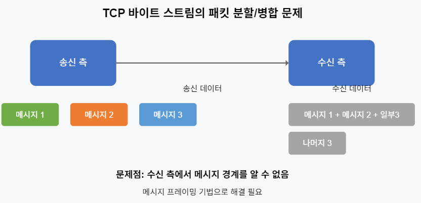
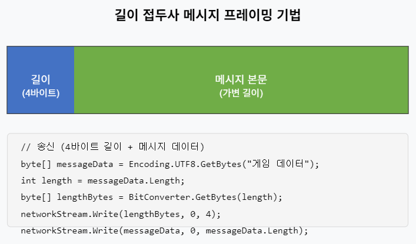
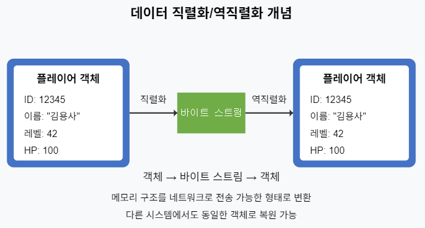
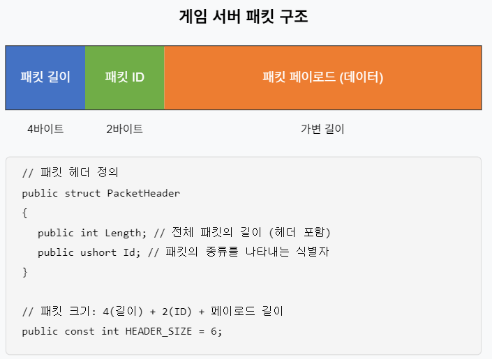
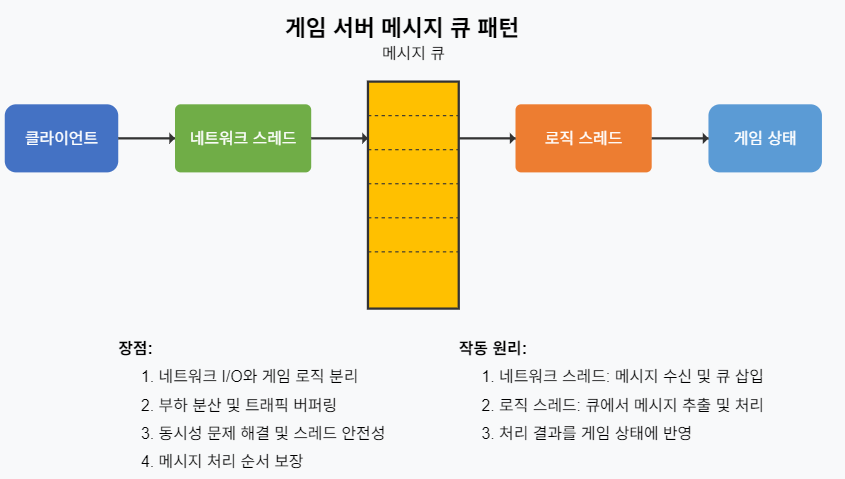

# 게임 서버 개발을 위한 C# Socket 프로그래밍

저자: 최흥배, Claude AI  

- .NET 9
- Windows 11
- Visual Studio Code, Visual Studio 2022 이상


# 6장: 네트워크 데이터 처리
  
## 6.1 바이트 스트림과 메시지 프레이밍

### 6.1.1 TCP 통신에서의 바이트 스트림 이해
네트워크 통신에서 가장 기본적인 데이터 형태는 바이트 스트림이다. TCP는 연결 지향적 프로토콜로, 데이터를 연속된 바이트 스트림으로 전송한다. 이는 마치 물이 파이프를 통해 흐르는 것과 같다.

```csharp
// TCP 바이트 스트림 송신 예제
byte[] messageData = Encoding.UTF8.GetBytes("Hello World");
networkStream.Write(messageData, 0, messageData.Length);
```

그러나 TCP의 이런 특성은 게임 서버 개발에서 문제가 될 수 있다:

1. **경계가 없는 데이터**: TCP는 데이터의 경계를 보존하지 않는다. 여러 메시지가 하나로 합쳐지거나(패킷 병합), 하나의 메시지가 여러 조각으로 나뉠 수 있다(패킷 분할).
2. **메시지 구분의 어려움**: 수신 측에서는 어디서 메시지가 시작하고 끝나는지 알 수 없다.
  
   
  
  
### 6.1.2 메시지 프레이밍 기법
메시지 프레이밍(Message Framing)은 연속된 바이트 스트림에서 개별 메시지의 경계를 구분하는 기술이다. 게임 서버에서는 주로 다음과 같은 방법을 사용한다:

#### 1. 고정 길이 메시지
모든 메시지가 동일한 크기를 가진다. 구현이 간단하지만 낭비가 발생할 수 있다.

```csharp
const int FIXED_SIZE = 1024;
byte[] buffer = new byte[FIXED_SIZE];

// 수신
int bytesRead = networkStream.Read(buffer, 0, FIXED_SIZE);
if (bytesRead == FIXED_SIZE)
{
    // 하나의 완전한 메시지 처리
}
```

#### 2. 구분자 기반 메시지
특별한 문자나 바이트 시퀀스로 메시지의 끝을 표시한다. 텍스트 기반 프로토콜에 유용하다.

```csharp
const byte DELIMITER = 0xFF; // 0xFF를 메시지 끝 표시로 사용

// 송신
byte[] messageData = Encoding.UTF8.GetBytes("Hello World");
byte[] framedMessage = new byte[messageData.Length + 1];
Array.Copy(messageData, framedMessage, messageData.Length);
framedMessage[messageData.Length] = DELIMITER;
networkStream.Write(framedMessage, 0, framedMessage.Length);
```

HTTP나 SMTP 같은 프로토콜에서는 `\r\n\r\n`과 같은 구분자를 사용한다.

#### 3. 길이 접두사 메시지 (Length-Prefixed)
메시지 앞에 길이 정보를 포함시키는 방법이다. 게임 서버에서 가장 널리 사용된다.

```csharp
// 송신
byte[] messageData = Encoding.UTF8.GetBytes("Hello World");
byte[] lengthPrefix = BitConverter.GetBytes(messageData.Length);
networkStream.Write(lengthPrefix, 0, lengthPrefix.Length);
networkStream.Write(messageData, 0, messageData.Length);
```  
  
     


### 6.1.3 메시지 프레이밍 구현 예제
아래는 C#에서 길이 접두사 방식의 메시지 프레이밍을 구현한 예제다:

```csharp
public class MessageFramer
{
    private readonly NetworkStream _stream;
    private readonly byte[] _lengthBuffer = new byte[4];
    private readonly byte[] _messageBuffer = new byte[1024 * 64]; // 64KB 최대 메시지 크기

    public MessageFramer(NetworkStream stream)
    {
        _stream = stream;
    }

    public async Task SendMessageAsync(byte[] message)
    {
        if (message.Length > _messageBuffer.Length)
        {
            throw new ArgumentException($"메시지가 너무 큽니다. 최대 크기: {_messageBuffer.Length}");
        }

        // 길이 접두사 전송
        byte[] lengthPrefix = BitConverter.GetBytes(message.Length);
        await _stream.WriteAsync(lengthPrefix, 0, lengthPrefix.Length);
        
        // 메시지 본문 전송
        await _stream.WriteAsync(message, 0, message.Length);
    }

    public async Task<byte[]> ReceiveMessageAsync()
    {
        // 길이 접두사 수신 (4바이트)
        int bytesRead = 0;
        while (bytesRead < 4)
        {
            int read = await _stream.ReadAsync(_lengthBuffer, bytesRead, 4 - bytesRead);
            if (read == 0)
                throw new EndOfStreamException("연결이 닫혔습니다.");
            bytesRead += read;
        }

        // 메시지 길이 추출
        int messageLength = BitConverter.ToInt32(_lengthBuffer, 0);
        if (messageLength > _messageBuffer.Length)
        {
            throw new InvalidDataException($"메시지 길이가 너무 큽니다: {messageLength}");
        }

        // 메시지 본문 수신
        bytesRead = 0;
        while (bytesRead < messageLength)
        {
            int read = await _stream.ReadAsync(_messageBuffer, bytesRead, messageLength - bytesRead);
            if (read == 0)
                throw new EndOfStreamException("연결이 닫혔습니다.");
            bytesRead += read;
        }

        // 수신된 메시지 반환
        byte[] message = new byte[messageLength];
        Array.Copy(_messageBuffer, message, messageLength);
        return message;
    }
}
```

이 클래스는 TCP 스트림에서 메시지를 송수신하는 과정에서 메시지 프레이밍을 처리한다. 각 메시지는 4바이트 길이 접두사를 갖는다.
 

## 6.2 데이터 직렬화/역직렬화 기법

### 6.2.1 직렬화의 개념
데이터 직렬화(Serialization)는 객체를 바이트 스트림으로 변환하는 과정이며, 역직렬화(Deserialization)는 바이트 스트림을 다시 객체로 변환하는 과정이다. 네트워크를 통해 객체를 전송하기 위해서는 반드시 직렬화 과정이 필요하다.
  
   


### 6.2.2 직렬화 방식
게임 서버에서 사용할 수 있는 여러 직렬화 방식을 알아보자:

#### 1. 이진 직렬화 (Binary Serialization)
메모리에 있는 객체의 바이트 표현을 그대로 저장하는 방식이다. 효율적이지만 버전 관리가 어렵고 플랫폼 간 호환성이 낮을 수 있다.

```csharp
using System;
using System.Buffers;
using System.Buffers.Binary;
using System.IO;
using System.Text;

// 플레이어 클래스 정의
public class Player
{
    public int Id { get; set; }
    public string Name { get; set; }
    public int Level { get; set; }
    public float HP { get; set; }
}

// 1. BinaryReader/BinaryWriter 사용 (기본 방법)
public class BasicBinarySerializer
{
    public byte[] Serialize(Player player)
    {
        using (var ms = new MemoryStream())
        using (var writer = new BinaryWriter(ms, Encoding.UTF8))
        {
            writer.Write(player.Id);
            writer.Write(player.Name ?? string.Empty);
            writer.Write(player.Level);
            writer.Write(player.HP);
            
            return ms.ToArray();
        }
    }

    public Player Deserialize(byte[] data)
    {
        using (var ms = new MemoryStream(data))
        using (var reader = new BinaryReader(ms, Encoding.UTF8))
        {
            return new Player
            {
                Id = reader.ReadInt32(),
                Name = reader.ReadString(),
                Level = reader.ReadInt32(),
                HP = reader.ReadSingle()
            };
        }
    }
}

// 2. Span<byte>와 BinaryPrimitives 사용 (고성능, .NET Core 2.1+)
public class SpanBinarySerializer
{
    public byte[] Serialize(Player player)
    {
        var nameBytes = Encoding.UTF8.GetBytes(player.Name ?? string.Empty);
        var totalSize = sizeof(int) +        // Id
                       sizeof(int) +        // Name length
                       nameBytes.Length +   // Name bytes
                       sizeof(int) +        // Level
                       sizeof(float);       // HP
        
        var buffer = new byte[totalSize];
        var span = buffer.AsSpan();
        int offset = 0;
        
        BinaryPrimitives.WriteInt32LittleEndian(span.Slice(offset), player.Id);
        offset += sizeof(int);
        
        BinaryPrimitives.WriteInt32LittleEndian(span.Slice(offset), nameBytes.Length);
        offset += sizeof(int);
        
        nameBytes.CopyTo(span.Slice(offset));
        offset += nameBytes.Length;
        
        BinaryPrimitives.WriteInt32LittleEndian(span.Slice(offset), player.Level);
        offset += sizeof(int);
        
        BinaryPrimitives.WriteSingleLittleEndian(span.Slice(offset), player.HP);
        
        return buffer;
    }

    public Player Deserialize(byte[] data)
    {
        var span = data.AsSpan();
        int offset = 0;
        
        var id = BinaryPrimitives.ReadInt32LittleEndian(span.Slice(offset));
        offset += sizeof(int);
        
        var nameLength = BinaryPrimitives.ReadInt32LittleEndian(span.Slice(offset));
        offset += sizeof(int);
        
        var name = Encoding.UTF8.GetString(span.Slice(offset, nameLength));
        offset += nameLength;
        
        var level = BinaryPrimitives.ReadInt32LittleEndian(span.Slice(offset));
        offset += sizeof(int);
        
        var hp = BinaryPrimitives.ReadSingleLittleEndian(span.Slice(offset));
        
        return new Player
        {
            Id = id,
            Name = name,
            Level = level,
            HP = hp
        };
    }
}

// 3. ArrayPool과 Span을 활용한 제로 할당 직렬화 (최고 성능)
public class PooledBinarySerializer
{
    private readonly ArrayPool<byte> _arrayPool = ArrayPool<byte>.Shared;
    
    public byte[] Serialize(Player player)
    {
        var nameBytes = Encoding.UTF8.GetBytes(player.Name ?? string.Empty);
        var totalSize = sizeof(int) + sizeof(int) + nameBytes.Length + sizeof(int) + sizeof(float);
        
        var rentedArray = _arrayPool.Rent(totalSize);
        try
        {
            var span = rentedArray.AsSpan(0, totalSize);
            int offset = 0;
            
            BinaryPrimitives.WriteInt32LittleEndian(span.Slice(offset), player.Id);
            offset += sizeof(int);
            
            BinaryPrimitives.WriteInt32LittleEndian(span.Slice(offset), nameBytes.Length);
            offset += sizeof(int);
            
            nameBytes.CopyTo(span.Slice(offset));
            offset += nameBytes.Length;
            
            BinaryPrimitives.WriteInt32LittleEndian(span.Slice(offset), player.Level);
            offset += sizeof(int);
            
            BinaryPrimitives.WriteSingleLittleEndian(span.Slice(offset), player.HP);
            
            return span.ToArray();
        }
        finally
        {
            _arrayPool.Return(rentedArray);
        }
    }

    public Player Deserialize(ReadOnlySpan<byte> data)
    {
        int offset = 0;
        
        var id = BinaryPrimitives.ReadInt32LittleEndian(data.Slice(offset));
        offset += sizeof(int);
        
        var nameLength = BinaryPrimitives.ReadInt32LittleEndian(data.Slice(offset));
        offset += sizeof(int);
        
        var name = Encoding.UTF8.GetString(data.Slice(offset, nameLength));
        offset += nameLength;
        
        var level = BinaryPrimitives.ReadInt32LittleEndian(data.Slice(offset));
        offset += sizeof(int);
        
        var hp = BinaryPrimitives.ReadSingleLittleEndian(data.Slice(offset));
        
        return new Player { Id = id, Name = name, Level = level, HP = hp };
    }
}

// 4. unsafe 코드를 사용한 구조체 직렬화 (고정 크기 데이터용)
public unsafe class UnsafeBinarySerializer
{
    // 고정 크기 구조체용 Player
    public struct FixedPlayer
    {
        public int Id;
        public int Level;
        public float HP;
        public fixed byte Name[64]; // 고정 크기 문자열
    }
    
    public byte[] SerializeFixed(int id, string name, int level, float hp)
    {
        var buffer = new byte[sizeof(FixedPlayer)];
        fixed (byte* ptr = buffer)
        {
            var player = (FixedPlayer*)ptr;
            player->Id = id;
            player->Level = level;
            player->HP = hp;
            
            // 문자열 복사
            var nameBytes = Encoding.UTF8.GetBytes(name ?? string.Empty);
            var copyLength = Math.Min(nameBytes.Length, 63); // null terminator 위해 -1
            fixed (byte* namePtr = player->Name)
            {
                for (int i = 0; i < copyLength; i++)
                    namePtr[i] = nameBytes[i];
                namePtr[copyLength] = 0; // null terminator
            }
        }
        return buffer;
    }
}

// 5. 게임 서버용 패킷 직렬화 헬퍼
public static class GamePacketSerializer
{
    private static readonly SpanBinarySerializer _serializer = new SpanBinarySerializer();
    
    public static byte[] SerializeWithHeader(Player player, ushort packetType)
    {
        var playerData = _serializer.Serialize(player);
        var totalSize = sizeof(ushort) + sizeof(int) + playerData.Length;
        var buffer = new byte[totalSize];
        var span = buffer.AsSpan();
        
        int offset = 0;
        BinaryPrimitives.WriteUInt16LittleEndian(span.Slice(offset), packetType);
        offset += sizeof(ushort);
        
        BinaryPrimitives.WriteInt32LittleEndian(span.Slice(offset), playerData.Length);
        offset += sizeof(int);
        
        playerData.CopyTo(span.Slice(offset));
        
        return buffer;
    }
    
    public static (ushort packetType, Player player) DeserializeWithHeader(ReadOnlySpan<byte> data)
    {
        int offset = 0;
        
        var packetType = BinaryPrimitives.ReadUInt16LittleEndian(data.Slice(offset));
        offset += sizeof(ushort);
        
        var dataLength = BinaryPrimitives.ReadInt32LittleEndian(data.Slice(offset));
        offset += sizeof(int);
        
        var player = _serializer.Deserialize(data.Slice(offset, dataLength).ToArray());
        
        return (packetType, player);
    }
}

// 사용 예제
public class SerializationExample
{
    public static void TestAllSerializers()
    {
        var player = new Player
        {
            Id = 12345,
            Name = "TestPlayer",
            Level = 50,
            HP = 1500.5f
        };

        // 1. 기본 BinaryWriter/Reader
        var basicSerializer = new BasicBinarySerializer();
        byte[] basicData = basicSerializer.Serialize(player);
        Player basicPlayer = basicSerializer.Deserialize(basicData);
        Console.WriteLine($"Basic Binary 크기: {basicData.Length} bytes");

        // 2. Span 기반 직렬화
        var spanSerializer = new SpanBinarySerializer();
        byte[] spanData = spanSerializer.Serialize(player);
        Player spanPlayer = spanSerializer.Deserialize(spanData);
        Console.WriteLine($"Span Binary 크기: {spanData.Length} bytes");

        // 3. ArrayPool 활용
        var pooledSerializer = new PooledBinarySerializer();
        byte[] pooledData = pooledSerializer.Serialize(player);
        Player pooledPlayer = pooledSerializer.Deserialize(pooledData);
        Console.WriteLine($"Pooled Binary 크기: {pooledData.Length} bytes");

        // 4. 게임 패킷 직렬화
        byte[] packetData = GamePacketSerializer.SerializeWithHeader(player, 0x1001);
        var (packetType, deserializedPlayer) = GamePacketSerializer.DeserializeWithHeader(packetData);
        Console.WriteLine($"Packet 크기: {packetData.Length} bytes, Type: 0x{packetType:X}");
    }
}
```  
  
각각의 특징은 다음과 같다:  
- BasicBinarySerializer: BinaryReader/BinaryWriter 사용, 가장 간단하고 직관적입니다
- SpanBinarySerializer: Span<T>와 BinaryPrimitives 사용, 고성능이며 메모리 효율적입니다
- PooledBinarySerializer: ArrayPool 활용으로 GC 압박을 최소화합니다
- UnsafeBinarySerializer: unsafe 코드로 최고 성능을 제공합니다 (고정 크기 데이터용)
- GamePacketSerializer: 게임 서버용 패킷 헤더가 포함된 직렬화입니다
    
    
#### 2. JSON 직렬화 (JSON Serialization)
객체를 JSON 텍스트로 변환하는 방식이다. 사람이 읽을 수 있고 다양한 플랫폼에서 지원되지만, 이진 형식에 비해 크기가 크다.

```csharp
// JSON 직렬화
public byte[] JsonSerialize(Player player)
{
    string jsonString = JsonSerializer.Serialize(player);
    return Encoding.UTF8.GetBytes(jsonString);
}

// JSON 역직렬화
public Player JsonDeserialize(byte[] data)
{
    string jsonString = Encoding.UTF8.GetString(data);
    return JsonSerializer.Deserialize<Player>(jsonString);
}
```

#### 3. 커스텀 직렬화 (Custom Serialization)
게임 서버에서는 성능을 극대화하기 위해 커스텀 직렬화 방식을 자주 사용한다. 데이터 형식을 정확히 알고 있을 때 매우 효율적이다.

```csharp
// 커스텀 직렬화
public byte[] CustomSerialize(Player player)
{
    using (MemoryStream ms = new MemoryStream())
    using (BinaryWriter writer = new BinaryWriter(ms))
    {
        writer.Write(player.Id);
        writer.Write(player.Name);
        writer.Write(player.Level);
        writer.Write(player.HP);
        return ms.ToArray();
    }
}

// 커스텀 역직렬화
public Player CustomDeserialize(byte[] data)
{
    using (MemoryStream ms = new MemoryStream(data))
    using (BinaryReader reader = new BinaryReader(ms))
    {
        Player player = new Player
        {
            Id = reader.ReadInt32(),
            Name = reader.ReadString(),
            Level = reader.ReadInt32(),
            HP = reader.ReadSingle()
        };
        return player;
    }
}
```

#### 4. MemoryPack (.NET 9 신기능)
.NET 9에서는 MemoryPack이라는 고성능 바이너리 직렬화 라이브러리가 추가되었다. 이는 게임 서버에 매우 적합하다.

```csharp
using MemoryPack;

// MemoryPack 속성 추가
[MemoryPackable]
public partial class Player
{
    public int Id { get; set; }
    public string Name { get; set; }
    public int Level { get; set; }
    public float HP { get; set; }
}

// MemoryPack 직렬화
public byte[] MemoryPackSerialize(Player player)
{
    return MemoryPackSerializer.Serialize(player);
}

// MemoryPack 역직렬화
public Player MemoryPackDeserialize(byte[] data)
{
    return MemoryPackSerializer.Deserialize<Player>(data);
}
```

### 6.2.3 직렬화 방식 성능 비교
게임 서버에서는 성능이 중요하므로, 다양한 직렬화 방식의 성능을 비교해보자:

| 직렬화 방식 | 속도 | 크기 효율성 | 호환성 | 유지보수성 |
|------------|------|------------|-------|-----------|
| 이진 직렬화 | 빠름 | 좋음 | 낮음 | 낮음 |
| JSON 직렬화 | 느림 | 낮음 | 높음 | 높음 |
| 커스텀 직렬화 | 매우 빠름 | 매우 좋음 | 매우 낮음 | 매우 낮음 |
| MemoryPack | 매우 빠름 | 매우 좋음 | 중간 | 높음 |

게임 서버에서는 일반적으로 MemoryPack이나 커스텀 직렬화가 권장된다.
  

## 6.3 프로토콜 설계와 패킷 구조

### 6.3.1 게임 서버 프로토콜 개요
프로토콜은 통신 규약으로, 어떤 형식과 절차에 따라 데이터를 교환할지 정의한다. 게임 서버에서는 클라이언트와 서버 간의 통신을 위한 프로토콜 설계가 중요하다.

좋은 게임 프로토콜의 특징:

1. **효율성**: 최소한의 데이터로 필요한 정보를 전달해야 한다.
2. **확장성**: 게임 기능 추가에 따라 확장이 용이해야 한다.
3. **견고성**: 네트워크 지연이나 패킷 손실에 대응할 수 있어야 한다.
4. **보안성**: 해킹이나 조작에 취약하지 않아야 한다.

### 6.3.2 패킷 구조 설계
게임 서버의 패킷은 일반적으로 다음과 같은 구조를 갖는다:
  
   

패킷 구조 구현 예제:

```csharp
// 패킷 헤더 정의
public struct PacketHeader
{
    public int Length;   // 전체 패킷의 길이 (헤더 포함)
    public ushort Id;    // 패킷의 종류를 식별하는 ID
}

// 패킷 인터페이스
public interface IPacket
{
    ushort Id { get; }
    void Serialize(BinaryWriter writer);
    void Deserialize(BinaryReader reader);
}

// 패킷 구현 예제 - 채팅 메시지
public class ChatMessagePacket : IPacket
{
    public ushort Id => 101; // 채팅 패킷 ID
    
    public string Sender { get; set; }
    public string Message { get; set; }
    
    public void Serialize(BinaryWriter writer)
    {
        writer.Write(Sender);
        writer.Write(Message);
    }
    
    public void Deserialize(BinaryReader reader)
    {
        Sender = reader.ReadString();
        Message = reader.ReadString();
    }
}

// 패킷 직렬화 예제
public byte[] SerializePacket(IPacket packet)
{
    using (MemoryStream ms = new MemoryStream())
    {
        using (BinaryWriter writer = new BinaryWriter(ms))
        {
            // 임시로 길이 필드 위치 예약 (나중에 채울 것)
            writer.Write(0);
            
            // 패킷 ID 작성
            writer.Write(packet.Id);
            
            // 패킷 내용 직렬화
            packet.Serialize(writer);
            
            // 패킷 길이 계산 및 업데이트
            byte[] data = ms.ToArray();
            int packetLength = data.Length;
            
            // 길이 필드 업데이트
            using (MemoryStream updateMs = new MemoryStream(data))
            using (BinaryWriter updateWriter = new BinaryWriter(updateMs))
            {
                updateWriter.Write(packetLength);
            }
            
            return data;
        }
    }
}

// 패킷 역직렬화 헬퍼 클래스
public class PacketProcessor
{
    private readonly Dictionary<ushort, Func<IPacket>> _packetFactories = new();
    
    public PacketProcessor()
    {
        // 패킷 타입 등록
        RegisterPacket<ChatMessagePacket>();
        // 다른 패킷 타입도 여기서 등록
    }
    
    public void RegisterPacket<T>() where T : IPacket, new()
    {
        IPacket instance = new T();
        _packetFactories[instance.Id] = () => new T();
    }
    
    public IPacket DeserializePacket(byte[] data)
    {
        using (MemoryStream ms = new MemoryStream(data))
        using (BinaryReader reader = new BinaryReader(ms))
        {
            // 헤더 읽기
            int length = reader.ReadInt32();
            ushort id = reader.ReadUInt16();
            
            // 패킷 생성
            if (!_packetFactories.TryGetValue(id, out var factory))
            {
                throw new InvalidOperationException($"알 수 없는 패킷 ID: {id}");
            }
            
            // 패킷 인스턴스 생성 및 역직렬화
            IPacket packet = factory();
            packet.Deserialize(reader);
            
            return packet;
        }
    }
}
```

### 6.3.3 패킷 ID 관리
패킷 ID는 메시지 종류를 구분하는 중요한 요소다. 효율적인 패킷 ID 관리 방법은 다음과 같다:

```csharp
// 패킷 ID를 열거형으로 관리
public enum PacketId : ushort
{
    // 시스템 패킷 (1~99)
    Connect = 1,
    Disconnect = 2,
    Heartbeat = 3,
    
    // 인증 관련 패킷 (100~199)
    LoginRequest = 100,
    LoginResponse = 101,
    
    // 채팅 관련 패킷 (200~299)
    ChatMessage = 200,
    WhisperMessage = 201,
    
    // 게임 상태 패킷 (300~399)
    PlayerMove = 300,
    PlayerAction = 301,
    SpawnObject = 302,
    
    // 기타 패킷 (400~)
    // ...
}
```

이러한 구조는 패킷 유형을 쉽게 관리하고 확장할 수 있게 해준다.
  

## 6.4 메시지 큐와 처리 패턴

### 6.4.1 메시지 큐의 필요성
게임 서버에서 메시지 큐를 사용하는 이유:

1. **비동기 처리**: 네트워크 I/O와 메시지 처리를 분리하여 효율성 증가
2. **부하 분산**: 일시적인 트래픽 급증 시 버퍼 역할
3. **순서 보장**: 메시지가 도착한 순서대로 처리 가능
4. **스레드 안전성**: 멀티스레드 환경에서 안전한 메시지 처리
  
   


### 6.4.2 메시지 큐 구현
C#에서 스레드 안전한 메시지 큐 구현:

```csharp
public class MessageQueue<T>
{
    private readonly ConcurrentQueue<T> _queue = new ConcurrentQueue<T>();
    private readonly SemaphoreSlim _semaphore = new SemaphoreSlim(0);
    
    // 메시지 큐에 항목 추가
    public void Enqueue(T item)
    {
        _queue.Enqueue(item);
        _semaphore.Release(); // 대기 중인 스레드에 신호
    }
    
    // 메시지 큐에서 항목 추출 (비동기)
    public async Task<T> DequeueAsync(CancellationToken cancellation = default)
    {
        await _semaphore.WaitAsync(cancellation);
        
        if (_queue.TryDequeue(out T item))
        {
            return item;
        }
        
        throw new InvalidOperationException("큐가 비어 있습니다.");
    }
    
    // 메시지 큐에서 모든 항목 추출
    public List<T> DequeueAll()
    {
        List<T> items = new List<T>();
        
        while (_queue.TryDequeue(out T item))
        {
            items.Add(item);
            
            // 세마포어 조정 (가져온 항목만큼 감소)
            try
            {
                _semaphore.Wait(0);
            }
            catch (InvalidOperationException)
            {
                // 세마포어가 이미 0이면 예외 발생 (무시)
            }
        }
        
        return items;
    }
    
    // 큐에 있는 항목 수
    public int Count => _queue.Count;
}
```

### 6.4.3 메시지 처리 패턴
게임 서버에서 효율적인 메시지 처리를 위한 몇 가지 패턴:

#### 1. 패킷 핸들러 패턴
각 메시지 유형마다 별도의 핸들러를 만들어 처리하는 방식:

```csharp
// 패킷 핸들러 인터페이스
public interface IPacketHandler
{
    void Handle(IPacket packet, GameSession session);
}

// 채팅 메시지 핸들러
public class ChatMessageHandler : IPacketHandler
{
    public void Handle(IPacket packet, GameSession session)
    {
        if (packet is ChatMessagePacket chatPacket)
        {
            Console.WriteLine($"{chatPacket.Sender}: {chatPacket.Message}");
            
            // 다른 플레이어들에게 메시지 브로드캐스트
            // ...
        }
    }
}

// 패킷 핸들러 관리자
public class PacketHandlerManager
{
    private readonly Dictionary<ushort, IPacketHandler> _handlers = new();
    
    // 핸들러 등록
    public void RegisterHandler(ushort packetId, IPacketHandler handler)
    {
        _handlers[packetId] = handler;
    }
    
    // 패킷 처리
    public void ProcessPacket(IPacket packet, GameSession session)
    {
        if (_handlers.TryGetValue(packet.Id, out var handler))
        {
            handler.Handle(packet, session);
        }
        else
        {
            Console.WriteLine($"처리기가 없는 패킷: {packet.Id}");
        }
    }
}
```

#### 2. 명령 패턴
메시지를 명령 객체로 캡슐화하여 처리하는 방식:

```csharp
// 명령 인터페이스
public interface ICommand
{
    void Execute();
}

// 플레이어 이동 명령
public class MovePlayerCommand : ICommand
{
    private readonly int _playerId;
    private readonly float _x;
    private readonly float _y;
    private readonly GameWorld _world;
    
    public MovePlayerCommand(int playerId, float x, float y, GameWorld world)
    {
        _playerId = playerId;
        _x = x;
        _y = y;
        _world = world;
    }
    
    public void Execute()
    {
        var player = _world.GetPlayer(_playerId);
        if (player != null)
        {
            player.Position = new Vector2(_x, _y);
            
            // 위치 업데이트 패킷 생성 및 브로드캐스트
            // ...
        }
    }
}

// 명령 처리기
public class CommandProcessor
{
    private readonly MessageQueue<ICommand> _commandQueue = new();
    
    // 명령 큐에 추가
    public void EnqueueCommand(ICommand command)
    {
        _commandQueue.Enqueue(command);
    }
    
    // 모든 명령 실행
    public void ProcessCommands()
    {
        var commands = _commandQueue.DequeueAll();
        foreach (var command in commands)
        {
            command.Execute();
        }
    }
}
```

#### 3. 이벤트 기반 처리 패턴
이벤트와 구독자 패턴을 사용하여 메시지를 처리하는 방식:

```csharp
// 이벤트 데이터 기본 클래스
public class GameEvent
{
    public DateTime Timestamp { get; } = DateTime.UtcNow;
}

// 플레이어 이동 이벤트
public class PlayerMoveEvent : GameEvent
{
    public int PlayerId { get; set; }
    public Vector2 NewPosition { get; set; }
}

// 이벤트 버스
public class EventBus
{
    private readonly Dictionary<Type, List<Action<GameEvent>>> _subscribers = new();
    
    // 이벤트 구독
    public void Subscribe<T>(Action<T> handler) where T : GameEvent
    {
        Type eventType = typeof(T);
        
        if (!_subscribers.TryGetValue(eventType, out var handlers))
        {
            handlers = new List<Action<GameEvent>>();
            _subscribers[eventType] = handlers;
        }
        
        // 타입 변환을 포함한 핸들러 래핑
        handlers.Add(e => handler((T)e));
    }
    
    // 이벤트 발행
    public void Publish(GameEvent gameEvent)
    {
        Type eventType = gameEvent.GetType();
        
        if (_subscribers.TryGetValue(eventType, out var handlers))
        {
            foreach (var handler in handlers)
            {
                handler(gameEvent);
            }
        }
    }
}

// 사용 예
public class GameServer
{
    private readonly EventBus _eventBus = new();
    
    public GameServer()
    {
        // 이벤트 구독
        _eventBus.Subscribe<PlayerMoveEvent>(OnPlayerMove);
    }
    
    private void OnPlayerMove(PlayerMoveEvent moveEvent)
    {
        Console.WriteLine($"플레이어 {moveEvent.PlayerId}가 {moveEvent.NewPosition}로 이동");
        
        // 주변 플레이어에게 알림
        // ...
    }
    
    // 패킷 처리 시
    public void ProcessMovePacket(PlayerMovePacket packet)
    {
        // 패킷을 이벤트로 변환하여 발행
        _eventBus.Publish(new PlayerMoveEvent 
        { 
            PlayerId = packet.PlayerId,
            NewPosition = new Vector2(packet.X, packet.Y)
        });
    }
}
```

### 6.4.4 메시지 처리 최적화
게임 서버에서 메시지 처리 성능을 높이기 위한 최적화 기법:

1. **객체 풀링**: 메시지 객체를 재사용하여 GC 부담 감소

```csharp
public class ObjectPool<T> where T : class, new()
{
    private readonly ConcurrentBag<T> _objects = new();
    
    public T Get()
    {
        if (_objects.TryTake(out T item))
        {
            return item;
        }
        
        return new T();
    }
    
    public void Return(T item)
    {
        _objects.Add(item);
    }
}

// 사용 예
public class PacketPool
{
    private readonly ObjectPool<ChatMessagePacket> _chatPacketPool = new();
    
    public ChatMessagePacket GetChatPacket()
    {
        return _chatPacketPool.Get();
    }
    
    public void ReturnChatPacket(ChatMessagePacket packet)
    {
        // 객체 상태 초기화
        packet.Sender = null;
        packet.Message = null;
        
        _chatPacketPool.Return(packet);
    }
}
```

2. **배치 처리**: 여러 메시지를 그룹으로 처리하여 성능 향상

```csharp
// 일정 시간마다 큐의 모든 메시지를 한 번에 처리
public void ProcessMessageBatch()
{
    var messages = _messageQueue.DequeueAll();
    
    if (messages.Count > 0)
    {
        Console.WriteLine($"{messages.Count}개의 메시지를 일괄 처리합니다.");
        
        foreach (var message in messages)
        {
            ProcessMessage(message);
        }
    }
}
```

3. **우선순위 큐**: 중요한 메시지를 먼저 처리

```csharp
public class PriorityMessageQueue<T>
{
    private readonly PriorityQueue<T, int> _queue = new();
    private readonly object _lock = new();
    
    // 우선순위와 함께 메시지 추가 (낮은 값이 높은 우선순위)
    public void Enqueue(T item, int priority)
    {
        lock (_lock)
        {
            _queue.Enqueue(item, priority);
        }
    }
    
    // 가장 높은 우선순위의 메시지 추출
    public bool TryDequeue(out T item)
    {
        lock (_lock)
        {
            return _queue.TryDequeue(out item, out _);
        }
    }
    
    public int Count
    {
        get
        {
            lock (_lock)
            {
                return _queue.Count;
            }
        }
    }
}
```
  
  
## 6.5 과제
다음 과제를 통해 이 장에서 배운 내용을 테스트하고 응용해보자.

### 과제 1: 메시지 프레이밍 구현
TCP 소켓 통신에서 길이 접두사 방식의 메시지 프레이밍을 구현하고, 1MB 이상의 대용량 메시지도 올바르게 전송되는지 테스트해보자.

### 과제 2: 객체 직렬화 성능 비교
Player 클래스를 정의하고, 다양한 직렬화 방식(JSON, 커스텀, MemoryPack)의 성능을 비교하는 벤치마크 프로그램을 작성하자. 각 방식의 속도와 크기 효율성을 측정하여 결과를 보고서로 작성하자.

### 과제 3: 게임 프로토콜 설계
간단한 2D 게임에 필요한 프로토콜을 설계하자. 플레이어 이동, 채팅, 아이템 습득 등 최소 5개 이상의 패킷 유형을 정의하고, 각 패킷의 구조와 직렬화/역직렬화 방법을 구현하자.

### 과제 4: 메시지 큐 시스템 구현
멀티스레드 게임 서버에서 사용할 수 있는 메시지 큐 시스템을 구현하자. 네트워크 스레드에서 메시지를 받아 큐에 넣고, 게임 로직 스레드에서 처리하는 구조를 만들자. 명령 패턴이나 이벤트 기반 패턴을 적용해 보자.

### 과제 5: 스트레스 테스트
구현한 메시지 처리 시스템에 초당 수천 개의 메시지를 보내는 스트레스 테스트를 수행하자. 시스템이 안정적으로 동작하는지, 메모리 누수는 없는지 확인하고, 성능 병목점을 찾아 최적화 방안을 제시하자.


