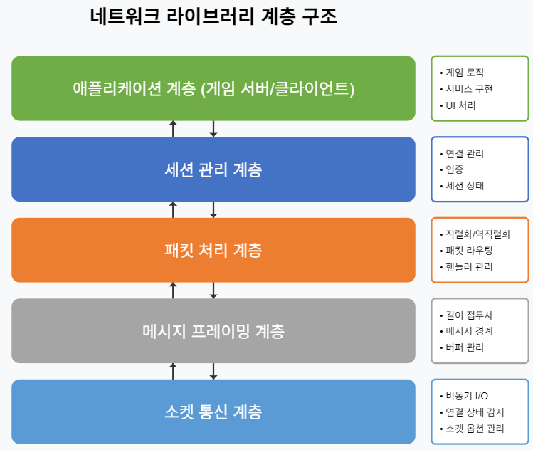
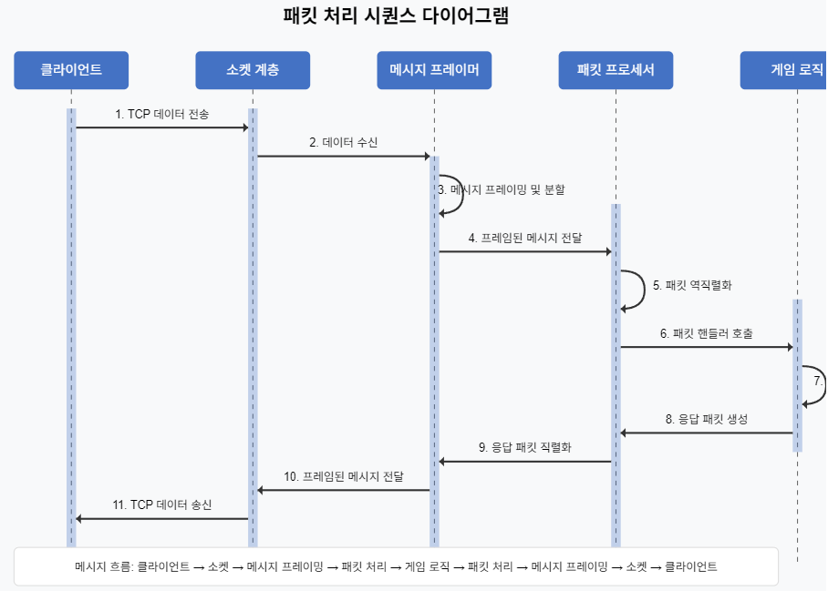
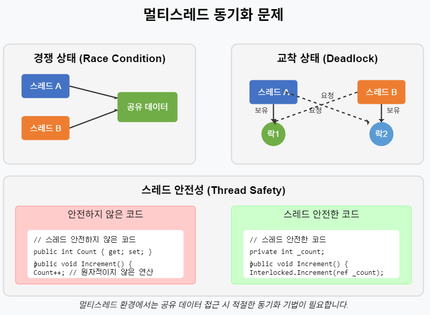
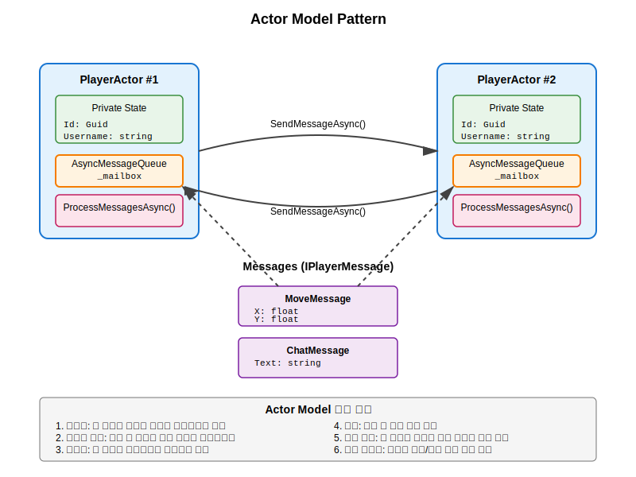
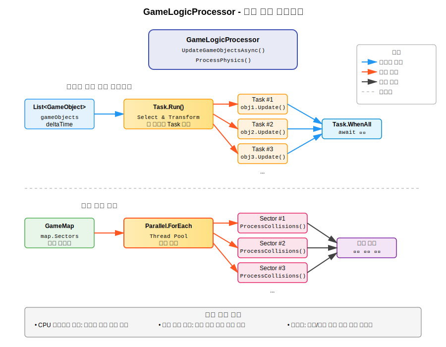

# 게임 서버 개발을 위한 C# Socket 프로그래밍

저자: 최흥배, Claude AI  

- .NET 9
- Windows 11
- Visual Studio Code, Visual Studio 2022 이상

-----  
  
# 제3부: 네트워크 라이브러리 개발
    
# 7장: 네트워크 라이브러리 설계

## 7.1 라이브러리 아키텍처 설계

### 7.1.1 네트워크 라이브러리의 목적과 특성
네트워크 라이브러리는 게임 서버 개발의 복잡한 네트워크 관련 코드를 추상화하고 재사용 가능한 형태로 제공한다. 좋은 네트워크 라이브러리는 다음과 같은 특성을 갖는다:

1. **추상화** - 하위 계층의 복잡한 소켓 작업을 단순한 인터페이스로 추상화
2. **확장성** - 새로운 프로토콜이나 기능을 쉽게 추가할 수 있는 구조
3. **성능** - 고성능 네트워킹을 위한 최적화
4. **안정성** - 오류 처리와 예외 상황에 강건한 구조
5. **사용 편의성** - 직관적인 API와 명확한 문서화
  

### 7.1.2 계층형 아키텍처
효과적인 네트워크 라이브러리는 계층형 아키텍처를 사용하여 각 계층이 독립적으로 기능하고 교체 가능하도록 설계한다.
  
     

각 계층의 역할과 책임:

1. **소켓 통신 계층**
   - .NET Socket API를 래핑하여 비동기 I/O 작업 처리
   - 네트워크 연결 수립 및 종료
   - 저수준 소켓 옵션 관리

2. **메시지 프레이밍 계층**
   - TCP 바이트 스트림에서 개별 메시지 경계 구분
   - 버퍼 관리 및 메모리 최적화
   - 메시지 분할 및 병합 처리

3. **패킷 처리 계층**
   - 바이트 데이터와 객체 간 직렬화/역직렬화
   - 패킷 타입에 따른 라우팅
   - 패킷 핸들러 관리

4. **세션 관리 계층**
   - 클라이언트 연결 세션 관리
   - 인증 및 보안
   - 세션 이벤트 (연결, 연결 해제, 타임아웃) 처리

5. **애플리케이션 계층**
   - 실제 게임 로직 구현
   - 네트워크 라이브러리를 활용한 서비스 구현
   - 사용자 인터페이스 처리

### 7.1.3 객체 지향 설계 원칙 적용
네트워크 라이브러리 설계에 적용해야 할 주요 객체 지향 설계 원칙:

#### SOLID 원칙 적용

1. **단일 책임 원칙 (SRP)**
   - 각 클래스는 한 가지 책임만 가져야 한다
   - 예: 세션 관리와 패킷 직렬화는 분리된 클래스로 구현

2. **개방-폐쇄 원칙 (OCP)**
   - 확장에는 열려 있고, 수정에는 닫혀 있어야 한다
   - 예: 새로운 패킷 타입을 추가할 때 기존 코드 수정 없이 확장 가능하도록 설계

3. **리스코프 치환 원칙 (LSP)**
   - 하위 타입은 상위 타입을 대체할 수 있어야 한다
   - 예: 다양한 세션 구현체가 ISession 인터페이스를 완벽히 구현

4. **인터페이스 분리 원칙 (ISP)**
   - 클라이언트는 사용하지 않는 인터페이스에 의존하지 않아야 한다
   - 예: 큰 인터페이스 대신 역할별로 작은 인터페이스 설계

5. **의존성 역전 원칙 (DIP)**
   - 구체적인 구현보다 추상화에 의존해야 한다
   - 예: 구체적인 TcpSession 대신 ISession 인터페이스에 의존

```csharp
// 의존성 역전 원칙의 적용 예
public class GameServer
{
    private readonly ISessionManager _sessionManager;
    private readonly IPacketProcessor _packetProcessor;
    
    // 추상화에 의존하는 생성자 주입
    public GameServer(ISessionManager sessionManager, IPacketProcessor packetProcessor)
    {
        _sessionManager = sessionManager;
        _packetProcessor = packetProcessor;
    }
    
    // ...
}
```

### 7.1.4 핵심 컴포넌트
네트워크 라이브러리의 핵심 컴포넌트와 관계:

1. **서버 (Server)**
   - 소켓 리스너 관리
   - 연결 수락 및 세션 생성
   - 전체 세션 관리

2. **세션 (Session)**
   - 개별 클라이언트 연결 표현
   - 비동기 송수신 처리
   - 연결 상태 관리

3. **패킷 프로세서 (PacketProcessor)**
   - 패킷 직렬화/역직렬화
   - 메시지 타입에 따른 라우팅
   - 패킷 핸들러 등록 및 호출

4. **메시지 프레이머 (MessageFramer)**
   - 메시지 경계 관리
   - 길이 접두사 처리
   - 분할 패킷 재조립

5. **이벤트 디스패처 (EventDispatcher)**
   - 이벤트 발행 및 구독 관리
   - 비동기 이벤트 처리
   - 콜백 관리

이러한 컴포넌트들은 다음 섹션에서 설명할 인터페이스를 통해 상호작용한다.
  

## 7.2 인터페이스 정의와 계층 구조

### 7.2.1 핵심 인터페이스 설계
네트워크 라이브러리의 핵심 인터페이스들을 정의하자:

```csharp
// 서버 인터페이스
public interface INetworkServer
{
    void Start(int port);
    void Stop();
    IReadOnlyCollection<ISession> GetSessions();
    event Action<ISession> SessionConnected;
    event Action<ISession> SessionDisconnected;
}

// 세션 인터페이스
public interface ISession
{
    Guid Id { get; }
    bool IsConnected { get; }
    EndPoint RemoteEndPoint { get; }
    void Send(IPacket packet);
    void Disconnect();
    event Action<IPacket> PacketReceived;
    event Action Disconnected;
}

// 패킷 인터페이스
public interface IPacket
{
    ushort Id { get; }

    /// <summary>
    /// 패킷 데이터를 BinaryWriter를 사용해 직렬화합니다. (Id 제외)
    /// </summary>
    void Serialize(BinaryWriter writer);

    /// <summary>
    /// BinaryReader를 사용해 패킷 데이터를 역직렬화합니다. (Id 제외)
    /// </summary>
    void Deserialize(BinaryReader reader);
}

// 패킷 프로세서 인터페이스
public interface IPacketProcessor
{
    void RegisterPacket<T>() where T : IPacket, new();
    void RegisterPacketHandler<T>(Action<T, ISession> handler) where T : IPacket;
    void UnregisterPacketHandler<T>() where T : IPacket;
    IPacket ProcessPacket(byte[] data, ISession session);
    byte[] SerializePacket(IPacket packet);
}

// 메시지 프레이머 인터페이스
public interface IMessageFramer
{
    event Action<byte[]> MessageReceived;
    void ProcessReceivedData(byte[] data, int offset, int count);
    byte[] FrameMessage(byte[] message);
}
```

### 7.2.2 계층 간 상호작용
각 계층이 서로 어떻게 상호작용하는지 시퀀스 다이어그램으로 살펴보자:
  
   

### 7.2.3 계층별 클래스 구현
각 인터페이스에 대한 구체적인 구현을 살펴보자:

#### 소켓 통신 계층 구현

```csharp
public class TcpNetworkServer : INetworkServer
{
    private readonly Func<IMessageFramer> _messageFramerFactory;
    private readonly IPacketProcessor _packetProcessor;
    private readonly ConcurrentDictionary<Guid, ISession> _sessions = new();
    private TcpListener _listener;
    private Thread _acceptThread;
    private bool _isRunning = false;

    // 패킷 처리를 외부로 위임하기 위한 콜백 추가
    private readonly Action<ISession, byte[]> _onPacketReceived;

    public event Action<ISession> SessionConnected;
    public event Action<ISession> SessionDisconnected;

    public TcpNetworkServer(Func<IMessageFramer> messageFramerFactory, IPacketProcessor packetProcessor, Action<ISession, byte[]> onPacketReceived)
    {
        _messageFramerFactory = messageFramerFactory;
        _packetProcessor = packetProcessor;
        _onPacketReceived = onPacketReceived; // 콜백 저장
    }

    public void Start(int port)
    {
        if (_listener != null)
        {
            throw new InvalidOperationException("Server is already running.");
        }

        _listener = new TcpListener(IPAddress.Any, port);
        _isRunning = true;
        _listener.Start();
        
        _acceptThread = new Thread(AcceptLoop);
        _acceptThread.Start();
        
        Console.WriteLine($"Server started on port {port}.");
    }

    private void AcceptLoop()
    {
        try
        {
            while (_isRunning)
            {
                var tcpClient = _listener.AcceptTcpClient();
                Console.WriteLine("Client connected.");
                // 클라이언트 처리를 위한 새 스레드 시작
                var clientThread = new Thread(() => HandleNewClient(tcpClient));
                clientThread.Start();
            }
        }
        catch (SocketException ex) when (ex.SocketErrorCode == SocketError.Interrupted)
        {
            // 정상적인 종료
            Console.WriteLine("Server stopping gracefully.");
        }
        catch (Exception ex)
        {
            if (_isRunning)
            {
                Console.WriteLine($"Server error in AcceptLoop: {ex.Message}");
            }
        }
    }

    private void HandleNewClient(TcpClient tcpClient)
    {
        try
        {
            var messageFramer = _messageFramerFactory();
            // TcpSession 생성 시 콜백 전달
            var session = new TcpSession(tcpClient, messageFramer, _packetProcessor, _onPacketReceived);

            if (!_sessions.TryAdd(session.Id, session))
            {
                session.Disconnect();
                return;
            }

            session.Disconnected += () =>
            {
                if (_sessions.TryRemove(session.Id, out _))
                {
                    SessionDisconnected?.Invoke(session);
                    Console.WriteLine($"Session disconnected: {session.Id} | Remote: {session.RemoteEndPoint}");
                }
            };

            SessionConnected?.Invoke(session);
            Console.WriteLine($"Session connected: {session.Id} | Remote: {session.RemoteEndPoint}");

            // 세션의 수신 루프를 시작 (내부적으로 스레드 생성)
            session.Start();
        }
        catch (Exception ex)
        {
            Console.WriteLine($"Error handling new client: {ex.Message}");
            tcpClient?.Close();
        }
    }

    public void Stop()
    {
        if (!_isRunning) return;

        _isRunning = false;
        _listener.Stop();
        
        _acceptThread?.Join(); // Accept 스레드가 끝날 때까지 대기

        var disconnectTasks = _sessions.Values.ToList();
        foreach (var session in disconnectTasks)
        {
            session.Disconnect();
        }

        _sessions.Clear();
        _listener = null;
        Console.WriteLine("Server stopped.");
    }

    public IReadOnlyCollection<ISession> GetSessions()
    {
        return _sessions.Values.ToList().AsReadOnly();
    }
}
```

#### 세션 관리 계층 구현

```csharp
public class TcpSession : ISession
{
    private readonly TcpClient _tcpClient;
    private readonly NetworkStream _networkStream;
    private readonly IMessageFramer _messageFramer;
    private readonly IPacketProcessor _packetProcessor;
    private readonly Action<ISession, byte[]> _onPacketReceived;
    private Thread _receiveThread;
    private volatile bool _isDisconnecting = false;

    public Guid Id { get; } = Guid.NewGuid();
    public bool IsConnected => _tcpClient?.Connected ?? false;
    public EndPoint RemoteEndPoint => _tcpClient?.Client?.RemoteEndPoint;

    public event Action<IPacket> PacketReceived; // 이 이벤트는 더 이상 직접 사용되지 않음
    public event Action Disconnected;

    public TcpSession(TcpClient tcpClient, IMessageFramer messageFramer, IPacketProcessor packetProcessor, Action<ISession, byte[]> onPacketReceived)
    {
        _tcpClient = tcpClient;
        _networkStream = tcpClient.GetStream();
        _messageFramer = messageFramer;
        _packetProcessor = packetProcessor;
        _onPacketReceived = onPacketReceived;

        _messageFramer.MessageReceived += OnMessageReceived;
    }
    
    // 이 메서드는 이제 패킷을 중앙 큐로 보냄
    private void OnMessageReceived(byte[] data)
    {
        if (_isDisconnecting) return;
        _onPacketReceived(this, data);
    }

    public void Start()
    {
        _receiveThread = new Thread(ReceiveLoop);
        _receiveThread.Start();
    }

    private void ReceiveLoop()
    {
        var receiveBuffer = new byte[8192];
        try
        {
            while (!_isDisconnecting && IsConnected)
            {
                int bytesRead = _networkStream.Read(receiveBuffer, 0, receiveBuffer.Length);
                if (bytesRead == 0)
                {
                    break; // 원격 호스트가 연결을 종료
                }
                _messageFramer.ProcessReceivedData(new ArraySegment<byte>(receiveBuffer, 0, bytesRead));
            }
        }
        catch (IOException ex) when (ex.InnerException is SocketException)
        {
             /* 소켓 강제 종료 */
        }
        catch (Exception ex)
        {
            if (!_isDisconnecting)
            {
                 Console.WriteLine($"[{Id}] Receive loop error: {ex.Message}");
            }
        }
        finally
        {
            Disconnect();
        }
    }

    public void Send(IPacket packet)
    {
        if (!IsConnected || _isDisconnecting)
            return;

        try
        {
            byte[] packetData = _packetProcessor.SerializePacket(packet);
            byte[] framedData = _messageFramer.FrameMessage(packetData);
            _networkStream.Write(framedData, 0, framedData.Length);
        }
        catch (Exception ex)
        {
            Console.WriteLine($"[{Id}] Send error: {ex.Message}");
            Disconnect();
        }
    }

    public void Disconnect()
    {
        if (_isDisconnecting) return;
        _isDisconnecting = true;
        
        _tcpClient?.Close();
        _networkStream?.Dispose();

        Disconnected?.Invoke();
    }
}
```

#### 메시지 프레이밍 계층 구현

```csharp
public class LengthPrefixedMessageFramer : IMessageFramer
{
    private readonly MemoryStream _receiveBuffer = new MemoryStream();
    private const int HeaderSize = 4; // int32

    public event Action<byte[]> MessageReceived;

    public void ProcessReceivedData(ArraySegment<byte> data)
    {
        // 수신된 데이터를 내부 버퍼에 추가합니다.
        _receiveBuffer.Write(data.Array, data.Offset, data.Count);

        // 버퍼에 완전한 메시지가 있는지 반복해서 확인합니다.
        while (true)
        {
            // 버퍼의 시작 위치로 포지션을 옮깁니다.
            _receiveBuffer.Position = 0;

            // 헤더(길이 정보)를 읽을 만큼 데이터가 충분하지 않으면 중단합니다.
            if (_receiveBuffer.Length < HeaderSize)
            {
                break;
            }

            // 메시지 길이를 읽습니다.
            byte[] lengthBuffer = new byte[HeaderSize];
            _receiveBuffer.Read(lengthBuffer, 0, HeaderSize);
            int messageLength = BitConverter.ToInt32(lengthBuffer, 0);

            // 메시지 본문을 포함한 전체 패킷을 읽을 만큼 데이터가 충분하지 않으면 중단합니다.
            if (_receiveBuffer.Length < HeaderSize + messageLength)
            {
                break;
            }

            // 메시지 본문을 읽습니다.
            byte[] message = new byte[messageLength];
            _receiveBuffer.Read(message, 0, messageLength);

            // 완전한 메시지를 받았으므로 이벤트를 발생시킵니다.
            MessageReceived?.Invoke(message);

            // 처리된 데이터를 버퍼에서 제거합니다. (가장 효율적인 방법)
            long remainingLength = _receiveBuffer.Length - _receiveBuffer.Position;
            if (remainingLength > 0)
            {
                byte[] remainingData = new byte[remainingLength];
                _receiveBuffer.Read(remainingData, 0, (int)remainingLength);
                _receiveBuffer.SetLength(0); // 버퍼를 비웁니다.
                _receiveBuffer.Write(remainingData, 0, remainingData.Length);
            }
            else
            {
                _receiveBuffer.SetLength(0); // 모든 데이터를 처리했으면 버퍼를 비웁니다.
            }
        }

        // 처리 후 남은 데이터가 있다면, 버퍼의 시작 부분으로 데이터를 옮깁니다.
        // 위 while 루프 안에서 이미 처리되었으므로 추가 작업이 필요 없습니다.
    }

    public byte[] FrameMessage(byte[] message)
    {
        byte[] lengthPrefix = BitConverter.GetBytes(message.Length);
        byte[] framedMessage = new byte[HeaderSize + message.Length];

        Buffer.BlockCopy(lengthPrefix, 0, framedMessage, 0, HeaderSize);
        Buffer.BlockCopy(message, 0, framedMessage, HeaderSize, message.Length);

        return framedMessage;
    }
}
```

#### 패킷 처리 계층 구현

```csharp
public class PacketProcessor : IPacketProcessor
{
    private readonly ConcurrentDictionary<ushort, Type> _packetTypes = new();
    private readonly ConcurrentDictionary<Type, Action<IPacket, ISession>> _packetHandlers = new();

    public void RegisterPacket<T>() where T : IPacket, new()
    {
        var instance = new T();
        if (!_packetTypes.TryAdd(instance.Id, typeof(T)))
        {
            Console.WriteLine($"Warning: Packet with ID {instance.Id} is already registered.");
        }
    }

    public void RegisterPacketHandler<T>(Action<T, ISession> handler) where T : IPacket
    {
        Type packetType = typeof(T);
        _packetHandlers[packetType] = (packet, session) => handler((T)packet, session);
    }

    public void UnregisterPacketHandler<T>() where T : IPacket
    {
        _packetHandlers.TryRemove(typeof(T), out _);
    }

    /// <summary>
    /// async-await를 사용하지 않는 동기 버전의 패킷 처리 메서드입니다.
    /// </summary>
    public IPacket ProcessPacket(byte[] data, ISession session)
    {
        using var ms = new MemoryStream(data);
        using var reader = new BinaryReader(ms, Encoding.UTF8);

        ushort packetId = reader.ReadUInt16();

        if (!_packetTypes.TryGetValue(packetId, out Type packetType))
        {
            throw new InvalidDataException($"Unknown packet ID: {packetId}");
        }

        var packet = (IPacket)Activator.CreateInstance(packetType);
        packet.Deserialize(reader);

        if (_packetHandlers.TryGetValue(packetType, out var handler))
        {
            // 등록된 핸들러를 동기적으로 호출합니다.
            handler(packet, session);
        }

        return packet; // Task 대신 IPacket 객체를 직접 반환합니다.
    }

    public byte[] SerializePacket(IPacket packet)
    {
        using var ms = new MemoryStream();
        using var writer = new BinaryWriter(ms, Encoding.UTF8);

        writer.Write(packet.Id);
        packet.Serialize(writer);

        return ms.ToArray();
    }
}
```
  
  
## 7.3 델리게이트를 이용한 네트워크 이벤트 처리
게임 서버의 네트워크 이벤트를 처리하는 가장 직관적이고 효율적인 방법 중 하나는 C#의 **델리게이트(delegate)** 와 **이벤트(event)** 를 사용하는 것이다. 이 방식은 복잡한 이벤트 시스템을 직접 구현할 필요 없이, 이벤트 게시자(publisher)와 구독자(subscriber)를 명확하게 분리하여 코드의 유연성과 유지보수성을 높여준다.  

### 7.3.1 델리게이트 기반 방식의 이점
  * **단순성 및 가독성**: 이벤트 소스(예: `NetworkServer`)에 핸들러를 직접 연결하므로 코드 흐름이 명확하고 이해하기 쉽다.
  * **성능**: 이벤트 발행 시 추가적인 클래스 생성이나 복잡한 조회 과정이 없어 오버헤드가 적다.
  * **타입 안정성**: 컴파일 시점에 이벤트 핸들러의 시그니처가 올바른지 검사하여 런타임 오류를 줄여준다.
  * **느슨한 결합**: 이벤트 게시자는 구독자에 대한 구체적인 정보를 알 필요가 없으므로 컴포넌트 간의 의존성이 낮아진다.

### 7.3.2 델리게이트 정의 및 구현
먼저 `INetworkServer`와 `ISession` 인터페이스에 발생할 수 있는 네트워크 이벤트를 `delegate`로 정의하고 `event`로 선언한다.

```csharp
// 연결 끊김 이유 열거형
public enum DisconnectReason
{
    ClientRequest,
    Timeout,
    Error,
    ServerShutdown
}

// INetworkServer 인터페이스의 이벤트 정의
public interface INetworkServer
{
    void Start(int port);
    void Stop();
    IReadOnlyCollection<ISession> GetSessions();
    event Action<ISession> SessionConnected;
    event Action<ISession> SessionDisconnected;
}

// ISession 인터페이스의 이벤트 정의
public interface ISession
{
    Guid Id { get; }
    bool IsConnected { get; }
    EndPoint RemoteEndPoint { get; }
    void Send(IPacket packet);
    void Disconnect();
    event Action<IPacket> PacketReceived;
    event Action Disconnected;
}
```

  * `Action<T>`과 `Func<T, TResult>` 델리게이트는 .NET에 내장되어 있어 별도의 델리게이트 타입을 선언할 필요가 없다.
  * `SessionConnected`: 새로운 클라이언트 세션이 연결될 때 발생한다.
  * `SessionDisconnected`: 세션 연결이 끊어졌을 때 발생하며, 끊어진 이유(`DisconnectReason`)를 함께 전달한다.
  * `PacketReceived`: 해당 세션에서 새로운 패킷을 수신했을 때 발생한다. 패킷 처리는 비동기로 이루어질 수 있으므로 `Task`를 반환하는 `Func` 델리게이트를 사용한다.

-----

### 7.3.3 델리게이트 활용 예제
`GameServer` 클래스에서 `INetworkServer`가 제공하는 이벤트를 직접 구독하여 네트워크 로직을 처리하는 예제이다.

```csharp
// 게임 서버 클래스
public class GameServer
{
    private readonly INetworkServer _networkServer;
    private readonly IPacketProcessor _packetProcessor;
    private readonly ConcurrentDictionary<Guid, PlayerInfo> _players = new();

    public GameServer()
    {
        _packetProcessor = new PacketProcessor();
        
        // 서버 생성 시 중앙 패킷 처리 콜백을 전달합니다.
        _networkServer = new TcpNetworkServer(
            () => new LengthPrefixedMessageFramer(), 
            _packetProcessor, 
            OnPacketReceived
        );

        RegisterPacketHandlers();
    }

    // 서버를 시작하는 동기 메서드
    public void Start(int port)
    {
        Console.WriteLine($"게임 서버를 포트 {port}에서 시작합니다...");

        // 네트워크 서버 이벤트에 핸들러(메서드)를 직접 구독
        _networkServer.SessionConnected += OnSessionConnected;
        _networkServer.SessionDisconnected += OnSessionDisconnected;
        
        // 동기 Start 메서드 호출
        _networkServer.Start(port);
    }

    // 패킷 핸들러들을 등록합니다.
    private void RegisterPacketHandlers()
    {
        // 수신할 패킷 타입을 등록합니다.
        _packetProcessor.RegisterPacket<LoginPacket>();
        _packetProcessor.RegisterPacket<ChatPacket>();
        
        // 각 패킷 타입에 대한 처리 메서드를 등록합니다.
        _packetProcessor.RegisterPacketHandler<LoginPacket>(HandleLoginPacket);
        _packetProcessor.RegisterPacketHandler<ChatPacket>(HandleChatPacket);
    }
    
    // 모든 세션에서 받은 패킷 데이터가 이 메서드로 모입니다.
    private void OnPacketReceived(ISession session, byte[] data)
    {
        // PacketProcessor가 데이터를 파싱하고 등록된 핸들러를 호출해줍니다.
        _packetProcessor.ProcessPacket(data, session);
    }

    // 새 클라이언트가 연결되었을 때 호출될 메서드
    private void OnSessionConnected(ISession session)
    {
        Console.WriteLine($"새 클라이언트 연결: {session.RemoteEndPoint}");
        // 별도의 패킷 수신 구독이 필요 없습니다. 중앙 처리 방식이므로.
    }

    // 클라이언트 연결이 끊어졌을 때 호출될 메서드
    private void OnSessionDisconnected(ISession session)
    {
        Console.WriteLine($"클라이언트 연결 끊김: {session.RemoteEndPoint}");
        
        if (_players.TryRemove(session.Id, out var player))
        {
            // 다른 플레이어들에게 연결 해제 알림
            BroadcastPlayerDisconnected(player);
        }
    }

    // 로그인 패킷 처리 핸들러
    private void HandleLoginPacket(LoginPacket packet, ISession session)
    {
        Console.WriteLine($"패킷 수신: {packet.GetType().Name} from {session.RemoteEndPoint}");
        var player = new PlayerInfo
        {
            Id = session.Id,
            Username = packet.Username
        };
        _players[session.Id] = player;
        
        // 로그인 응답 보내기
        session.Send(new LoginResponsePacket
        {
            Success = true,
            Message = "로그인 성공!"
        });
        
        // 다른 플레이어들에게 새 플레이어 알림
        BroadcastNewPlayer(player);
    }

    // 채팅 패킷 처리 핸들러
    private void HandleChatPacket(ChatPacket packet, ISession session)
    {
        Console.WriteLine($"패킷 수신: {packet.GetType().Name} from {session.RemoteEndPoint}");
        if (!_players.TryGetValue(session.Id, out var player))
            return;

        // 모든 플레이어에게 채팅 메시지 브로드캐스트
        var chatMessage = new ChatMessagePacket
        {
            SenderId = player.Id,
            SenderName = player.Username,
            Message = packet.Message,
            Timestamp = DateTime.UtcNow
        };
        
        BroadcastPacket(chatMessage);
    }

    // 모든 세션에 패킷을 브로드캐스트하는 동기 메서드
    private void BroadcastPacket(IPacket packet)
    {
        foreach (var session in _networkServer.GetSessions().Where(s => s.IsConnected))
        {
            session.Send(packet);
        }
    }

    private void BroadcastNewPlayer(PlayerInfo player)
    {
        Console.WriteLine($"새 플레이어 '{player.Username}' 접속을 모두에게 알립니다.");
        // 예시: 새 플레이어 접속 알림 패킷
        var packet = new PlayerConnectedPacket
        {
            PlayerId = player.Id,
            Username = player.Username
        };
        BroadcastPacket(packet);
    }

    private void BroadcastPlayerDisconnected(PlayerInfo player)
    {
        Console.WriteLine($"플레이어 '{player.Username}' 접속 종료를 모두에게 알립니다.");
        // 예시: 플레이어 접속 종료 알림 패킷
        var packet = new PlayerDisconnectedPacket
        {
            PlayerId = player.Id
        };
        BroadcastPacket(packet);
    }
}

// 아래 클래스들은 예시이며, 실제 프로젝트에서는 별도의 파일로 정의해야 합니다.
public class PlayerInfo
{
    public Guid Id { get; set; }
    public string Username { get; set; }
}

// --- 예시 패킷 클래스들 ---
// 실제 구현에서는 IPacket 인터페이스를 구현해야 합니다.

public class LoginPacket : IPacket
{
    public ushort Id => 1;
    public string Username { get; set; }

    public void Serialize(BinaryWriter writer) => writer.Write(Username);
    public void Deserialize(BinaryReader reader) => Username = reader.ReadString();
}

public class ChatPacket : IPacket
{
    public ushort Id => 2;
    public string Message { get; set; }

    public void Serialize(BinaryWriter writer) => writer.Write(Message);
    public void Deserialize(BinaryReader reader) => Message = reader.ReadString();
}

public class LoginResponsePacket : IPacket
{
    public ushort Id => 101;
    public bool Success { get; set; }
    public string Message { get; set; }

    public void Serialize(BinaryWriter writer)
    {
        writer.Write(Success);
        writer.Write(Message);
    }

    public void Deserialize(BinaryReader reader)
    {
        Success = reader.ReadBoolean();
        Message = reader.ReadString();
    }
}

public class ChatMessagePacket : IPacket
{
    public ushort Id => 102;
    public Guid SenderId { get; set; }
    public string SenderName { get; set; }
    public string Message { get; set; }
    public DateTime Timestamp { get; set; }

    public void Serialize(BinaryWriter writer)
    {
        writer.Write(SenderId.ToByteArray());
        writer.Write(SenderName);
        writer.Write(Message);
        writer.Write(Timestamp.ToBinary());
    }

    public void Deserialize(BinaryReader reader)
    {
        SenderId = new Guid(reader.ReadBytes(16));
        SenderName = reader.ReadString();
        Message = reader.ReadString();
        Timestamp = DateTime.FromBinary(reader.ReadInt64());
    }
}

public class PlayerConnectedPacket : IPacket
{
    public ushort Id => 103;
    public Guid PlayerId { get; set; }
    public string Username { get; set; }
    
    public void Serialize(BinaryWriter writer)
    {
        writer.Write(PlayerId.ToByteArray());
        writer.Write(Username);
    }

    public void Deserialize(BinaryReader reader)
    {
        PlayerId = new Guid(reader.ReadBytes(16));
        Username = reader.ReadString();
    }
}

public class PlayerDisconnectedPacket : IPacket
{
    public ushort Id => 104;
    public Guid PlayerId { get; set; }
    
    public void Serialize(BinaryWriter writer) => writer.Write(PlayerId.ToByteArray());
    public void Deserialize(BinaryReader reader) => PlayerId = new Guid(reader.ReadBytes(16));
}
```
  
  
## 7.4 멀티스레드 환경에서의 동기화 문제
  
### 7.4.1 멀티스레드 이슈 이해
게임 서버는 많은 클라이언트를 동시에 처리해야 하므로 멀티스레드 환경에서 작동한다. 이로 인해 다음과 같은 동기화 문제가 발생할 수 있다:

1. **경쟁 상태(Race Condition)** - 여러 스레드가 동시에 같은 데이터에 접근하여 예상치 못한 결과 발생
2. **교착 상태(Deadlock)** - 여러 스레드가 서로의 잠금을 기다리며 진행 불가
3. **기아 상태(Starvation)** - 특정 스레드가 자원을 할당받지 못하는 상태
4. **스레드 안전성** - 멀티스레딩 환경에서 객체의 상태 일관성 보장
  
   

### 7.4.2 C#의 동기화 기법
C#에서 제공하는 다양한 동기화 기법과 이를 게임 서버에 적용하는 방법:

#### 1. Lock 문
가장 기본적인 동기화 방법으로, 코드 블록을 한 번에 하나의 스레드만 실행할 수 있게 한다.

```csharp
public class GameWorld
{
    private readonly Dictionary<Guid, PlayerEntity> _players = new();
    private readonly object _playersLock = new();
    
    public void AddPlayer(PlayerEntity player)
    {
        lock (_playersLock)
        {
            _players[player.Id] = player;
        }
    }
    
    public void RemovePlayer(Guid playerId)
    {
        lock (_playersLock)
        {
            _players.Remove(playerId);
        }
    }
    
    public PlayerEntity GetPlayer(Guid playerId)
    {
        lock (_playersLock)
        {
            if (_players.TryGetValue(playerId, out var player))
            {
                return player;
            }
            return null;
        }
    }
}
```

#### 2. Interlocked 클래스
원자적 연산을 제공하는 정적 메서드 모음으로, 카운터 증감 등의 간단한 작업에 유용하다.

```csharp
public class ConnectionCounter
{
    private int _activeConnections;
    
    public void IncrementConnections()
    {
        Interlocked.Increment(ref _activeConnections);
    }
    
    public void DecrementConnections()
    {
        Interlocked.Decrement(ref _activeConnections);
    }
    
    public int GetActiveConnections()
    {
        return Interlocked.CompareExchange(ref _activeConnections, 0, 0);
    }
}
```

#### 3. 스레드 안전한 컬렉션
`System.Collections.Concurrent` 네임스페이스의 스레드 안전 컬렉션은 멀티스레드 환경에 최적화되어 있다.

```csharp
public class SessionManager
{
    private readonly ConcurrentDictionary<Guid, ISession> _sessions = new();
    
    public bool AddSession(ISession session)
    {
        return _sessions.TryAdd(session.Id, session);
    }
    
    public bool RemoveSession(Guid sessionId)
    {
        return _sessions.TryRemove(sessionId, out _);
    }
    
    public ISession GetSession(Guid sessionId)
    {
        if (_sessions.TryGetValue(sessionId, out var session))
        {
            return session;
        }
        return null;
    }
    
    public IEnumerable<ISession> GetAllSessions()
    {
        return _sessions.Values;
    }
}
```

#### 4. ReaderWriterLockSlim
여러 스레드가 동시에 읽을 수 있지만, 쓰기는 한 번에 하나의 스레드만 가능하게 하는 잠금 기법이다.

```csharp
public class GameState
{
    private readonly Dictionary<string, object> _gameData = new();
    private readonly ReaderWriterLockSlim _rwLock = new();
    
    public void SetData(string key, object value)
    {
        try
        {
            _rwLock.EnterWriteLock();
            _gameData[key] = value;
        }
        finally
        {
            _rwLock.ExitWriteLock();
        }
    }
    
    public object GetData(string key)
    {
        try
        {
            _rwLock.EnterReadLock();
            
            if (_gameData.TryGetValue(key, out var value))
            {
                return value;
            }
            
            return null;
        }
        finally
        {
            _rwLock.ExitReadLock();
        }
    }
}
```

#### 5. 비동기 동기화 기법
.NET의 `Task` 기반 비동기 프로그래밍 패턴과 `async`/`await`를 활용한 동기화 기법이다.

```csharp
public class AsyncMessageQueue<T>
{
    private readonly Queue<T> _queue = new();
    private readonly SemaphoreSlim _signal = new(0);
    private readonly SemaphoreSlim _mutex = new(1);
    
    public async Task EnqueueAsync(T item)
    {
        await _mutex.WaitAsync();
        
        try
        {
            _queue.Enqueue(item);
        }
        finally
        {
            _mutex.Release();
        }
        
        _signal.Release();
    }
    
    public async Task<T> DequeueAsync(CancellationToken cancellation = default)
    {
        await _signal.WaitAsync(cancellation);
        await _mutex.WaitAsync(cancellation);
        
        try
        {
            return _queue.Dequeue();
        }
        finally
        {
            _mutex.Release();
        }
    }
    
    public async Task<int> GetCountAsync()
    {
        await _mutex.WaitAsync();
        
        try
        {
            return _queue.Count;
        }
        finally
        {
            _mutex.Release();
        }
    }
}
```

### 7.4.3 동시성 패턴
게임 서버 개발에 유용한 동시성 패턴들:

#### 1. 액터 모델 (Actor Model)
각 개체(액터)가 자신의 상태를 캡슐화하고 메시지 전달로만 통신하는 패턴이다. 게임 서버에서 플레이어나 게임 객체를 액터로 모델링할 수 있다.

  


```csharp
public class PlayerActor
{
    private readonly AsyncMessageQueue<IPlayerMessage> _mailbox = new();
    private readonly CancellationTokenSource _cts = new();
    private Task _processingTask;
    
    public Guid Id { get; }
    public string Username { get; private set; }
    // 플레이어 상태...
    
    public PlayerActor(Guid id)
    {
        Id = id;
    }
    
    public async Task StartAsync()
    {
        _processingTask = ProcessMessagesAsync(_cts.Token);
    }
    
    public async Task StopAsync()
    {
        _cts.Cancel();
        await _processingTask;
    }
    
    public Task SendMessageAsync(IPlayerMessage message)
    {
        return _mailbox.EnqueueAsync(message);
    }
    
    private async Task ProcessMessagesAsync(CancellationToken cancellation)
    {
        while (!cancellation.IsCancellationRequested)
        {
            try
            {
                var message = await _mailbox.DequeueAsync(cancellation);
                await ProcessMessageAsync(message);
            }
            catch (OperationCanceledException)
            {
                // 정상적인 종료
                break;
            }
            catch (Exception ex)
            {
                Console.WriteLine($"메시지 처리 오류: {ex.Message}");
            }
        }
    }
    
    private async Task ProcessMessageAsync(IPlayerMessage message)
    {
        switch (message)
        {
            case MoveMessage moveMsg:
                // 플레이어 이동 처리
                break;
                
            case ChatMessage chatMsg:
                // 채팅 메시지 처리
                break;
                
            // 다른 메시지 타입 처리...
        }
    }
}

// 메시지 인터페이스 및 구현
public interface IPlayerMessage { }

public class MoveMessage : IPlayerMessage
{
    public float X { get; set; }
    public float Y { get; set; }
}

public class ChatMessage : IPlayerMessage
{
    public string Text { get; set; }
}
```

#### 2. 작업 병렬화 (Task Parallelism)
.NET의 Task Parallel Library(TPL)를 활용하여 작업을 병렬로 처리하는 패턴이다.

```csharp
public class GameLogicProcessor
{
    // 모든 게임 객체 동시 업데이트
    public async Task UpdateGameObjectsAsync(List<GameObject> gameObjects, float deltaTime)
    {
        var tasks = gameObjects.Select(obj => Task.Run(() => obj.Update(deltaTime)));
        await Task.WhenAll(tasks);
    }
    
    // 게임 맵의 구역별 물리 계산 병렬 처리
    public void ProcessPhysics(GameMap map)
    {
        Parallel.ForEach(map.Sectors, sector =>
        {
            sector.ProcessCollisions();
        });
    }
}
```  
  
  

##### 1. UpdateGameObjectsAsync (비동기 처리)
- `Task.Run()`으로 각 게임 객체마다 개별 Task 생성
- 모든 객체가 동시에 `Update(deltaTime)` 실행
- `Task.WhenAll()`로 모든 작업 완료 대기
- **장점**: I/O 바운드 작업에 효율적, 비동기 패턴 활용

##### 2. ProcessPhysics (병렬 처리)
- `Parallel.ForEach()`로 맵 구역별 물리 연산 병렬화
- Thread Pool의 여러 스레드가 동시에 충돌 검사 수행
- CPU 바운드 작업에 최적화
- **장점**: CPU 코어를 최대한 활용, 동기적 완료 보장
  
이러한 병렬 처리 접근법은:
- 멀티코어 CPU를 효율적으로 활용
- 대량의 게임 객체 처리 시 성능 대폭 향상
- 프레임 레이트 안정성 확보
- 서버 처리 용량 증대

특히 MMORPG나 배틀로얄 같은 대규모 멀티플레이어 게임에서 필수적인 패턴이다.  

  
#### 3. 불변 객체 (Immutable Objects)
객체 생성 후 상태가 변하지 않는 불변 객체를 활용하여 동시성 문제를 방지하는 패턴이다.

```csharp
// 불변 게임 이벤트 예시
public sealed class GameEvent
{
    public Guid Id { get; }
    public EventType Type { get; }
    public DateTime Timestamp { get; }
    public IReadOnlyDictionary<string, object> Parameters { get; }
    
    public GameEvent(Guid id, EventType type, Dictionary<string, object> parameters)
    {
        Id = id;
        Type = type;
        Timestamp = DateTime.UtcNow;
        Parameters = new ReadOnlyDictionary<string, object>(
            new Dictionary<string, object>(parameters));
    }
    
    // 새 파라미터로 새 인스턴스 생성
    public GameEvent WithParameter(string key, object value)
    {
        var newParams = new Dictionary<string, object>(Parameters.ToDictionary(kv => kv.Key, kv => kv.Value));
        newParams[key] = value;
        return new GameEvent(Id, Type, newParams);
    }
}

public enum EventType
{
    PlayerJoined,
    PlayerLeft,
    GameStart,
    GameEnd,
    ItemCollected
    // 기타 이벤트 타입...
}
```
 
### 7.4.4 성능과 교착 상태 방지
멀티스레드 환경에서 최적의 성능을 내면서도 교착 상태를 방지하는 전략:

1. **세밀한 잠금 설계** - 잠금 범위를 최소화하여 경쟁 감소

```csharp
// 나쁜 예
public void ProcessAllItems()
{
    lock (_lock)
    {
        // 모든 아이템을 처리하는 긴 작업
        foreach (var item in _items)
        {
            ProcessItem(item); // 시간이 오래 걸릴 수 있음
        }
    }
}

// 좋은 예
public void ProcessAllItems()
{
    List<Item> itemsCopy;
    
    lock (_lock)
    {
        // 잠금 내에서는 복사만 빠르게 수행
        itemsCopy = _items.ToList();
    }
    
    // 잠금 외부에서 실제 처리 수행
    foreach (var item in itemsCopy)
    {
        ProcessItem(item);
    }
}
```

2. **잠금 순서 일관성** - 여러 잠금이 필요할 때는 항상 같은 순서로 획득하여 교착 상태 방지

```csharp
public void TransferItem(Inventory sourceInventory, Inventory targetInventory, Item item)
{
    // Guid를 이용한 정렬로 잠금 순서 일관성 확보
    bool sourceFirst = sourceInventory.Id.CompareTo(targetInventory.Id) < 0;
    
    object firstLock = sourceFirst ? sourceInventory.Lock : targetInventory.Lock;
    object secondLock = sourceFirst ? targetInventory.Lock : sourceInventory.Lock;
    
    lock (firstLock)
    {
        lock (secondLock)
        {
            // 아이템 이전 처리
            sourceInventory.RemoveItem(item);
            targetInventory.AddItem(item);
        }
    }
}
```

3. **무잠금 자료구조(Lock-Free Data Structures)** - 가능한 경우 잠금 없이 원자적 연산을 활용

```csharp
public class LockFreeCounter
{
    private int _value;
    
    public int Increment()
    {
        while (true)
        {
            int current = _value;
            int next = current + 1;
            
            // CAS(Compare-And-Swap) 연산으로 원자적 업데이트 시도
            if (Interlocked.CompareExchange(ref _value, next, current) == current)
            {
                return next;
            }
            
            // 실패 시 재시도
        }
    }
    
    public int GetValue()
    {
        return Interlocked.CompareExchange(ref _value, 0, 0);
    }
}
```

4. **타임아웃 적용** - 교착 상태에 빠지지 않도록 잠금 획득에 타임아웃 설정

```csharp
public async Task<bool> TryProcessWithTimeout(Item item)
{
    if (await _semaphore.WaitAsync(TimeSpan.FromSeconds(5)))
    {
        try
        {
            // 아이템 처리
            ProcessItem(item);
            return true;
        }
        finally
        {
            _semaphore.Release();
        }
    }
    
    // 타임아웃 발생
    Console.WriteLine("잠금 획득 타임아웃");
    return false;
}
```
  

  
## 7.5 과제
다음 과제를 통해 이 장에서 배운 내용을 테스트하고 응용해보자.

### 과제 1: 기본 네트워크 라이브러리 구현
7장에서 설명한 계층형 아키텍처를 바탕으로 기본적인 네트워크 라이브러리를 구현하자. 최소한 다음 기능을 포함해야 한다:
- TCP 소켓 연결 관리
- 메시지 프레이밍 처리
- 간단한 패킷 직렬화/역직렬화
- 세션 관리 기능

### 과제 2: 이벤트 기반 채팅 시스템 구현
구현한 네트워크 라이브러리를 바탕으로 이벤트 기반 채팅 시스템을 구현하자. 다음 이벤트를 처리할 수 있어야 한다:
- 사용자 연결/연결 해제
- 채팅 메시지 송수신
- 귓속말 기능
- 채팅방 기능 (생성, 입장, 퇴장)

### 과제 3: 멀티스레드 안전성 테스트
구현한 라이브러리가 멀티스레드 환경에서 안전하게 동작하는지 테스트하는 프로그램을 작성하자. 다음 테스트 시나리오를 포함하자:
- 동시에 여러 클라이언트 연결/연결 해제
- 대량의 메시지 동시 송수신
- 메모리 누수 검사
- 스트레스 테스트 (최대 동시 접속자 수 측정)

### 과제 4: 네트워크 라이브러리 벤치마킹
라이브러리의 성능을 측정하고 병목점을 찾는 벤치마크 프로그램을 작성하자. 다음 지표를 측정하자:
- 초당 처리 패킷 수
- 메시지 처리 지연 시간
- CPU 및 메모리 사용량
- 네트워크 대역폭 사용량

### 과제 5: 고급 기능 추가
구현한 라이브러리에 다음 중 하나 이상의 고급 기능을 추가하고 테스트하자:
- 패킷 압축 기능
- 패킷 암호화 기능
- 재연결 및 자동 복구 메커니즘
- 진단 및 모니터링 기능

이 과제들을 통해 실제 네트워크 라이브러리 개발 경험을 쌓고, 다음 장에서 이 라이브러리를 활용하여 채팅 서버와 오목 게임 서버를 구현할 준비를 할 수 있다.
  
  
