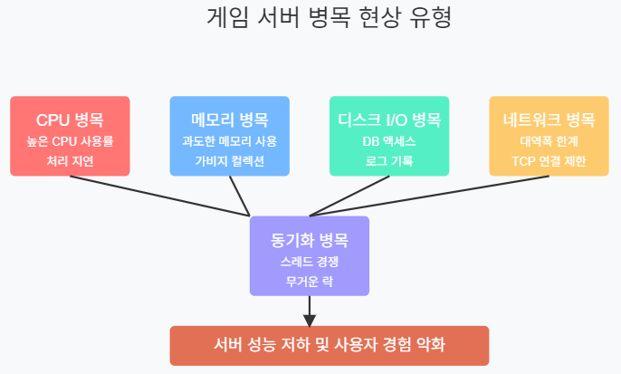
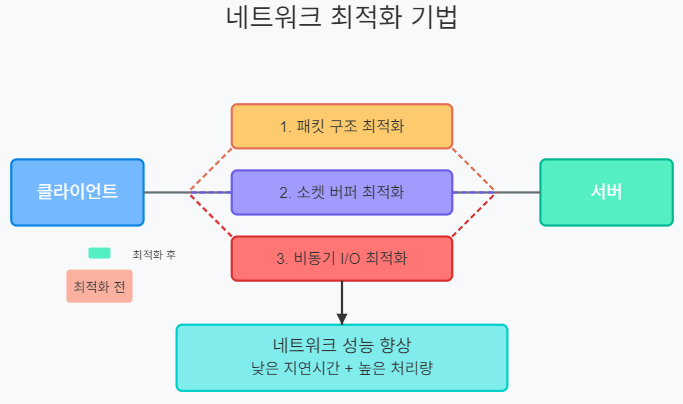
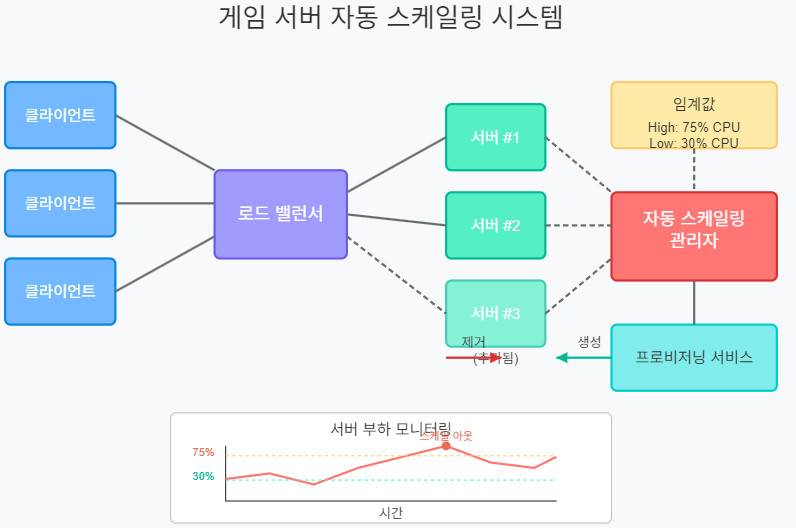

# 게임 서버 개발을 위한 C# Socket 프로그래밍

저자: 최흥배, Claude AI  

- .NET 9
- Windows 11
- Visual Studio Code, Visual Studio 2022 이상
  
-----  
  
# 8장: 서버 성능 테스트와 최적화
  
## 8.1 서버 성능 측정 방법
게임 서버의 성능을 측정하는 것은 실제 서비스 환경에서 안정적으로 운영하기 위한 필수 단계다. 성능 측정을 통해 서버가 얼마나 많은 동시 접속자를 처리할 수 있는지, 어떤 부분에서 병목 현상이 발생하는지 확인할 수 있다.

### 8.1.1 성능 지표 이해하기
게임 서버 성능 측정에서 중요한 지표는 다음과 같다:

1. **초당 처리 요청 수(RPS, Requests Per Second)**: 서버가 1초 동안 처리할 수 있는 클라이언트 요청의 수
2. **응답 시간(Response Time)**: 클라이언트 요청부터 응답까지 걸리는 시간
3. **CPU 사용률**: 서버의 CPU 자원 사용 상태
4. **메모리 사용량**: 서버가 사용하는 메모리의 양
5. **네트워크 처리량**: 초당 송수신되는 데이터의 양

### 8.1.2 성능 테스트 도구 만들기
성능 테스트를 위한 가상 클라이언트 도구를 C#으로 구현해보자:

```csharp
using System;
using System.Collections.Generic;
using System.Diagnostics;
using System.Net.Sockets;
using System.Text;
using System.Threading;
using System.Threading.Tasks;

namespace GameServerLoadTester
{
    class Program
    {
        static int _connectedClients = 0;
        static int _completedRequests = 0;
        static Stopwatch _stopwatch = new Stopwatch();
        
        static async Task Main(string[] args)
        {
            Console.WriteLine("게임 서버 부하 테스트 도구");
            
            Console.Write("서버 IP: ");
            string serverIP = Console.ReadLine() ?? "127.0.0.1";
            
            Console.Write("서버 Port: ");
            int serverPort = int.Parse(Console.ReadLine() ?? "9000");
            
            Console.Write("동시 접속 클라이언트 수: ");
            int clientCount = int.Parse(Console.ReadLine() ?? "100");
            
            Console.Write("테스트 시간(초): ");
            int testDuration = int.Parse(Console.ReadLine() ?? "60");
            
            // 테스트 시작
            _stopwatch.Start();
            var cts = new CancellationTokenSource();
            cts.CancelAfter(TimeSpan.FromSeconds(testDuration));
            
            // 결과 출력 스레드 시작
            _ = Task.Run(() => PrintResults(testDuration), cts.Token);
            
            // 클라이언트 생성 및 연결
            var clients = new List<Task>();
            for (int i = 0; i < clientCount; i++)
            {
                clients.Add(RunClientAsync(serverIP, serverPort, cts.Token));
                // 서버 부하를 점진적으로 증가시키기 위해 약간의 지연 추가
                await Task.Delay(10);
            }
            
            // 모든 클라이언트가 완료될 때까지 대기
            await Task.WhenAll(clients);
            
            // 최종 결과 출력
            Console.WriteLine("\n===== 최종 테스트 결과 =====");
            Console.WriteLine($"총 완료된 요청: {_completedRequests}");
            Console.WriteLine($"테스트 시간: {_stopwatch.Elapsed.TotalSeconds:F2}초");
            Console.WriteLine($"평균 RPS: {_completedRequests / _stopwatch.Elapsed.TotalSeconds:F2}");
        }
        
        static async Task RunClientAsync(string serverIP, int serverPort, CancellationToken token)
        {
            try
            {
                using var client = new TcpClient();
                await client.ConnectAsync(serverIP, serverPort);
                Interlocked.Increment(ref _connectedClients);
                
                using var stream = client.GetStream();
                byte[] buffer = new byte[1024];
                
                // 클라이언트 루프
                while (!token.IsCancellationRequested)
                {
                    // 간단한 에코 테스트 메시지 전송
                    string message = $"ECHO:{DateTime.Now.Ticks}";
                    byte[] data = Encoding.UTF8.GetBytes(message);
                    
                    await stream.WriteAsync(data, 0, data.Length, token);
                    
                    // 응답 대기
                    int bytes = await stream.ReadAsync(buffer, 0, buffer.Length, token);
                    
                    // 완료된 요청 카운트 증가
                    Interlocked.Increment(ref _completedRequests);
                    
                    // 각 요청 사이의 지연시간 (실제 사용자 행동 시뮬레이션)
                    await Task.Delay(Random.Shared.Next(50, 200), token);
                }
            }
            catch (OperationCanceledException)
            {
                // 정상적인 취소 처리
            }
            catch (Exception ex)
            {
                Console.WriteLine($"클라이언트 오류: {ex.Message}");
            }
            finally
            {
                Interlocked.Decrement(ref _connectedClients);
            }
        }
        
        static async Task PrintResults(int testDuration)
        {
            int prevCompletedRequests = 0;
            int seconds = 0;
            
            while (seconds < testDuration)
            {
                await Task.Delay(1000);
                seconds++;
                
                int currentRequests = _completedRequests;
                int requestsInLastSecond = currentRequests - prevCompletedRequests;
                prevCompletedRequests = currentRequests;
                
                Console.WriteLine($"[{seconds}초] 접속 클라이언트: {_connectedClients}, " +
                                 $"현재 RPS: {requestsInLastSecond}, " +
                                 $"누적 요청: {currentRequests}");
            }
        }
    }
}
```

이 도구는:
- 지정된 수의 가상 클라이언트를 생성
- 각 클라이언트는 서버에 연결하여 지속적으로 요청 전송
- 초당 처리량(RPS)과 연결된 클라이언트 수를 실시간으로 모니터링
- 테스트 종료 후 최종 결과 출력
  

## 8.2 병목 현상 식별과 해결

### 8.2.1 일반적인 병목 현상 유형
게임 서버에서 발생하는 일반적인 병목 현상은 다음과 같다:

1. **CPU 병목**: 높은 CPU 사용률로 인한 처리 지연
2. **메모리 병목**: 과도한 메모리 사용 또는 가비지 컬렉션으로 인한 성능 저하
3. **디스크 I/O 병목**: 데이터베이스 액세스, 로그 기록 등의 작업 지연
4. **네트워크 병목**: 네트워크 대역폭 한계 또는 TCP 연결 처리 한계
5. **동기화 병목**: 스레드 간 경쟁 조건, 데드락, 무거운 락 사용
  
   

### 8.2.2 CPU 병목 식별 및 해결
CPU 병목은 가장 흔하게 발생하는 성능 문제 중 하나다.

**식별 방법:**
- Windows 작업 관리자나 리눅스 `top` 명령어로 CPU 사용률 모니터링
- .NET Counter를 통한 프로세스 CPU 사용량 추적
- 성능 프로파일러를 통한 CPU 사용량이 높은 메서드 식별

**해결 방법:**
1. **비효율적인 알고리즘 최적화**
   ```csharp
   // 최적화 전: O(n²) 복잡도
   public List<int> FindDuplicates(List<int> list)
   {
       var duplicates = new List<int>();
       for (int i = 0; i < list.Count; i++)
       {
           for (int j = i + 1; j < list.Count; j++)
           {
               if (list[i] == list[j] && !duplicates.Contains(list[i]))
               {
                   duplicates.Add(list[i]);
               }
           }
       }
       return duplicates;
   }
   
   // 최적화 후: O(n) 복잡도
   public List<int> FindDuplicatesOptimized(List<int> list)
   {
       var seen = new HashSet<int>();
       var duplicates = new HashSet<int>();
       
       foreach (var item in list)
       {
           if (!seen.Add(item)) // 이미 있으면 Add가 false 반환
           {
               duplicates.Add(item);
           }
       }
       
       return duplicates.ToList();
   }
   ```

2. **병렬 처리 적용**
   ```csharp
   // 병렬 처리를 통한 처리 속도 향상
   public void ProcessItems(List<GameItem> items)
   {
       Parallel.ForEach(items, item =>
       {
           // 각 아이템 독립적으로 처리
           ProcessSingleItem(item);
       });
   }
   ```

3. **비동기 작업 활용**
   ```csharp
   public async Task ProcessRequestAsync(GameRequest request)
   {
       // CPU 바운드 작업의 경우 Task.Run 사용
       await Task.Run(() => {
           // CPU 집약적 작업 수행
           CalculateComplexLogic(request);
       });
       
       // I/O 바운드 작업은 직접 await
       await SaveResultToDatabase(request.Result);
   }
   ```

### 8.2.3 메모리 병목 식별 및 해결
메모리 병목은 게임 서버에서 특히 장시간 실행 시 발생할 수 있다.

**식별 방법:**
- 작업 관리자에서 메모리 사용량 모니터링
- `dotnet-counters`를 사용하여 GC 통계 확인
- 메모리 덤프 분석 도구 사용 (예: dotMemory, Visual Studio 진단 도구)

**해결 방법:**
1. **오브젝트 풀링 사용**
   ```csharp
   public class GameObjectPool<T> where T : class, new()
   {
       private readonly ConcurrentBag<T> _objects;
       private readonly Func<T> _objectGenerator;
       
       public GameObjectPool(Func<T> objectGenerator)
       {
           _objects = new ConcurrentBag<T>();
           _objectGenerator = objectGenerator ?? throw new ArgumentNullException(nameof(objectGenerator));
       }
       
       public T Get() => _objects.TryTake(out T item) ? item : _objectGenerator();
       
       public void Return(T item) => _objects.Add(item);
   }
   
   // 사용 예
   var packetPool = new GameObjectPool<Packet>(() => new Packet());
   
   // 패킷 얻기
   var packet = packetPool.Get();
   
   // 사용 후 반환
   packetPool.Return(packet);
   ```

2. **가비지 생성 최소화**
   ```csharp
   // 최적화 전: 문자열 연결 시 많은 가비지 생성
   public string BuildMessage(string userName, int score, string achievement)
   {
       return userName + " scored " + score + " points and earned " + achievement + "!";
   }
   
   // 최적화 후: StringBuilder 사용
   public string BuildMessageOptimized(string userName, int score, string achievement)
   {
       var sb = new StringBuilder(64); // 초기 용량 지정
       sb.Append(userName)
         .Append(" scored ")
         .Append(score)
         .Append(" points and earned ")
         .Append(achievement)
         .Append('!');
       return sb.ToString();
   }
   ```

3. **구조체 활용 (값 타입)**
   ```csharp
   // 클래스(참조 타입) 대신 구조체(값 타입) 사용
   public readonly struct Vector2D
   {
       public readonly float X;
       public readonly float Y;
       
       public Vector2D(float x, float y)
       {
           X = x;
           Y = y;
       }
       
       public float DistanceTo(Vector2D other)
       {
           float dx = X - other.X;
           float dy = Y - other.Y;
           return MathF.Sqrt(dx * dx + dy * dy);
       }
   }
   ```

## 8.3 프로파일링과 성능 최적화 기법

### 8.3.1 프로파일링 도구 활용
.NET 환경에서 사용할 수 있는 주요 프로파일링 도구:

1. **Visual Studio 프로파일러**: CPU 사용, 메모리 할당, 핫 경로 분석 제공
2. **dotnet-counters**: 런타임 성능 카운터 모니터링
3. **dotnet-trace**: 런타임 이벤트 추적
4. **PerfView**: 심층 성능 분석 도구

**사용 예시 (dotnet-counters):**

```bash
# 실행 중인 프로세스 목록 표시
dotnet-counters ps

# 특정 프로세스 모니터링 (12345는 프로세스 ID)
dotnet-counters monitor -p 12345 --counters System.Runtime,Microsoft.AspNetCore.Hosting,System.Net.Http

# 결과 기록
dotnet-counters collect -p 12345 -o counter_log.json
```

### 8.3.2 CPU 프로파일링 및 최적화
다음은 CPU 프로파일링 결과를 통한 최적화 사례다:

```csharp
// 최적화 전: 불필요한 중간 객체 생성 및 복제
public List<PlayerData> FilterActivePlayers(List<PlayerData> players)
{
    // 중간 리스트 생성
    var onlinePlayers = players.Where(p => p.IsOnline).ToList();
    
    // 또 다른 중간 리스트 생성
    var activePlayers = onlinePlayers.Where(p => p.LastActivity > DateTime.Now.AddMinutes(-10)).ToList();
    
    // 최종 리스트 생성 및 정렬
    return activePlayers.OrderByDescending(p => p.Score).ToList();
}

// 최적화 후: 체이닝 및 단일 열거
public List<PlayerData> FilterActivePlayersOptimized(List<PlayerData> players)
{
    var tenMinutesAgo = DateTime.Now.AddMinutes(-10);
    
    // 단일 열거로 처리
    return players.Where(p => p.IsOnline && p.LastActivity > tenMinutesAgo)
                  .OrderByDescending(p => p.Score)
                  .ToList();
}
```

### 8.3.3 네트워크 최적화 기법
게임 서버의 네트워크 성능을 최적화하는 방법:

1. **패킷 구조 최적화**
   ```csharp
   // 최적화 전: 불필요한 메타데이터 포함
   public class GamePacket
   {
       public int PacketId { get; set; }
       public string Sender { get; set; } // 매번 문자열 전송
       public DateTime Timestamp { get; set; } // 8바이트 DateTime
       public string Action { get; set; } // 매번 문자열 전송
       public Dictionary<string, object> Parameters { get; set; } // 가변 크기
   }
   
   // 최적화 후: 바이너리 포맷 및 크기 감소
   public class OptimizedGamePacket
   {
       public byte PacketType { get; set; } // 1바이트
       public int SenderId { get; set; } // 4바이트 (문자열 대신 ID)
       public int ActionId { get; set; } // 4바이트 (문자열 대신 열거형 ID)
       public byte[] Payload { get; set; } // 필요한 데이터만 포함
   }
   ```

2. **소켓 버퍼 조정**
   ```csharp
   // 소켓 버퍼 최적화
   public void OptimizeSocketBuffers(Socket socket)
   {
       // 수신 버퍼 크기 증가 (기본값보다 크게)
       socket.ReceiveBufferSize = 65536;
       
       // 송신 버퍼 크기 증가
       socket.SendBufferSize = 65536;
       
       // Nagle 알고리즘 비활성화 (빠른 응답 시간을 위해)
       socket.NoDelay = true;
   }
   ```

3. **비동기 I/O 최적화**
   ```csharp
   // 비동기 I/O 작업 최적화
   public class OptimizedNetworkHandler
   {
       private readonly Socket _socket;
       private readonly SocketAsyncEventArgs _receiveArgs;
       private readonly SocketAsyncEventArgs _sendArgs;
       private readonly byte[] _receiveBuffer;
       
       public OptimizedNetworkHandler(Socket socket)
       {
           _socket = socket;
           _receiveBuffer = new byte[8192];
           
           // SocketAsyncEventArgs 재사용
           _receiveArgs = new SocketAsyncEventArgs();
           _receiveArgs.SetBuffer(_receiveBuffer, 0, _receiveBuffer.Length);
           _receiveArgs.Completed += OnReceiveCompleted;
           
           _sendArgs = new SocketAsyncEventArgs();
           _sendArgs.Completed += OnSendCompleted;
       }
       
       public void StartReceive()
       {
           if (!_socket.ReceiveAsync(_receiveArgs))
           {
               ProcessReceive(_receiveArgs);
           }
       }
       
       private void OnReceiveCompleted(object sender, SocketAsyncEventArgs e)
       {
           ProcessReceive(e);
       }
       
       private void ProcessReceive(SocketAsyncEventArgs e)
       {
           if (e.BytesTransferred > 0 && e.SocketError == SocketError.Success)
           {
               // 데이터 처리...
               
               // 다시 비동기 수신 시작
               StartReceive();
           }
           else
           {
               CloseConnection();
           }
       }
       
       // 송신 메서드와 이벤트 핸들러 생략...
   }
   ```
  
   


### 8.3.4 데이터베이스 접근 최적화
게임 서버에서 데이터베이스 접근 최적화는 중요한 성능 향상 요소다:

```csharp
// 최적화 전: 매 요청마다 연결 열고 닫기
public async Task<PlayerData> GetPlayerDataUnoptimized(int playerId)
{
    using (var connection = new SqlConnection(_connectionString))
    {
        await connection.OpenAsync();
        
        using (var command = new SqlCommand("SELECT * FROM Players WHERE Id = @PlayerId", connection))
        {
            command.Parameters.AddWithValue("@PlayerId", playerId);
            
            using (var reader = await command.ExecuteReaderAsync())
            {
                if (await reader.ReadAsync())
                {
                    return new PlayerData
                    {
                        Id = reader.GetInt32(0),
                        Name = reader.GetString(1),
                        Score = reader.GetInt32(2),
                        // 기타 속성 읽기
                    };
                }
                
                return null;
            }
        }
    }
}

// 최적화 후: 연결 풀링 및 캐싱 활용
public class DatabaseService
{
    private readonly string _connectionString;
    private readonly IMemoryCache _cache;
    
    public DatabaseService(string connectionString, IMemoryCache cache)
    {
        _connectionString = connectionString;
        _cache = cache;
    }
    
    public async Task<PlayerData> GetPlayerData(int playerId)
    {
        // 먼저 캐시에서 확인
        string cacheKey = $"player:{playerId}";
        if (_cache.TryGetValue(cacheKey, out PlayerData cachedPlayer))
        {
            return cachedPlayer;
        }
        
        // 캐시에 없으면 DB에서 조회 (연결 풀링 자동 사용)
        using (var connection = new SqlConnection(_connectionString))
        {
            await connection.OpenAsync();
            
            // 필요한 열만 명시적으로 선택
            using (var command = new SqlCommand(
                "SELECT Id, Name, Score, Level, LastActivity FROM Players WHERE Id = @PlayerId", 
                connection))
            {
                command.Parameters.AddWithValue("@PlayerId", playerId);
                
                using (var reader = await command.ExecuteReaderAsync())
                {
                    if (await reader.ReadAsync())
                    {
                        var player = new PlayerData
                        {
                            Id = reader.GetInt32(0),
                            Name = reader.GetString(1),
                            Score = reader.GetInt32(2),
                            Level = reader.GetInt32(3),
                            LastActivity = reader.GetDateTime(4)
                        };
                        
                        // 캐시에 저장 (5분 만료)
                        _cache.Set(cacheKey, player, TimeSpan.FromMinutes(5));
                        
                        return player;
                    }
                    
                    return null;
                }
            }
        }
    }
    
    // 일괄 처리를 위한 메서드
    public async Task<List<PlayerData>> GetTopPlayers(int count)
    {
        string cacheKey = $"top-players:{count}";
        if (_cache.TryGetValue(cacheKey, out List<PlayerData> cachedPlayers))
        {
            return cachedPlayers;
        }
        
        using (var connection = new SqlConnection(_connectionString))
        {
            await connection.OpenAsync();
            
            // 인덱스를 활용한 효율적인 쿼리
            using (var command = new SqlCommand(
                "SELECT TOP (@Count) Id, Name, Score FROM Players ORDER BY Score DESC", 
                connection))
            {
                command.Parameters.AddWithValue("@Count", count);
                
                using (var reader = await command.ExecuteReaderAsync())
                {
                    var players = new List<PlayerData>();
                    
                    while (await reader.ReadAsync())
                    {
                        players.Add(new PlayerData
                        {
                            Id = reader.GetInt32(0),
                            Name = reader.GetString(1),
                            Score = reader.GetInt32(2)
                        });
                    }
                    
                    // 1분 캐시 (랭킹은 자주 변경될 수 있음)
                    _cache.Set(cacheKey, players, TimeSpan.FromMinutes(1));
                    
                    return players;
                }
            }
        }
    }
}
```
  

## 8.4 부하 분산과 스케일링
게임 서버의 부하를 분산하고 확장하는 방법을 살펴보자.

### 8.4.1 수직적 스케일링 vs 수평적 스케일링

**수직적 스케일링 (Scale Up)**:
- 단일 서버의 하드웨어 자원(CPU, 메모리 등) 증가
- 구현이 간단하지만 확장성에 한계 존재

**수평적 스케일링 (Scale Out)**:
- 여러 서버에 부하 분산
- 더 많은 동시 접속자 처리 가능
- 복잡한 구현과 관리 필요

### 8.4.2 로드 밸런싱 구현
간단한 로드 밸런서 구현 예시:

```csharp
public class GameServerLoadBalancer
{
    private class ServerInfo
    {
        public string Endpoint { get; set; }
        public int CurrentConnections { get; set; }
        public bool IsHealthy { get; set; } = true;
        public DateTime LastHealthCheck { get; set; } = DateTime.Now;
    }
    
    private readonly List<ServerInfo> _gameServers = new List<ServerInfo>();
    private readonly ReaderWriterLockSlim _lock = new ReaderWriterLockSlim();
    
    public GameServerLoadBalancer(IEnumerable<string> initialServers)
    {
        foreach (var server in initialServers)
        {
            _gameServers.Add(new ServerInfo { Endpoint = server });
        }
        
        // 상태 확인 타이머 시작
        StartHealthChecks();
    }
    
    public string GetNextServer()
    {
        _lock.EnterReadLock();
        try
        {
            // 가장 적은 연결 수를 가진 정상 서버 선택
            var server = _gameServers
                .Where(s => s.IsHealthy)
                .OrderBy(s => s.CurrentConnections)
                .FirstOrDefault();
                
            if (server != null)
            {
                server.CurrentConnections++;
                return server.Endpoint;
            }
            
            throw new InvalidOperationException("사용 가능한 정상 서버가 없습니다.");
        }
        finally
        {
            _lock.ExitReadLock();
        }
    }
    
    public void ReleaseServer(string endpoint)
    {
        _lock.EnterWriteLock();
        try
        {
            var server = _gameServers.FirstOrDefault(s => s.Endpoint == endpoint);
            if (server != null && server.CurrentConnections > 0)
            {
                server.CurrentConnections--;
            }
        }
        finally
        {
            _lock.ExitWriteLock();
        }
    }
    
    public void AddServer(string endpoint)
    {
        _lock.EnterWriteLock();
        try
        {
            if (!_gameServers.Any(s => s.Endpoint == endpoint))
            {
                _gameServers.Add(new ServerInfo { Endpoint = endpoint });
            }
        }
        finally
        {
            _lock.ExitWriteLock();
        }
    }
    
    public void RemoveServer(string endpoint)
    {
        _lock.EnterWriteLock();
        try
        {
            var server = _gameServers.FirstOrDefault(s => s.Endpoint == endpoint);
            if (server != null)
            {
                _gameServers.Remove(server);
            }
        }
        finally
        {
            _lock.ExitWriteLock();
        }
    }
    
    private void StartHealthChecks()
    {
        var timer = new Timer(CheckServerHealth, null, 
            TimeSpan.FromSeconds(0), 
            TimeSpan.FromSeconds(10));
    }
    
    private async void CheckServerHealth(object state)
    {
        _lock.EnterUpgradeableReadLock();
        try
        {
            foreach (var server in _gameServers)
            {
                bool isHealthy = await CheckHealth(server.Endpoint);
                
                if (isHealthy != server.IsHealthy)
                {
                    _lock.EnterWriteLock();
                    try
                    {
                        server.IsHealthy = isHealthy;
                        server.LastHealthCheck = DateTime.Now;
                    }
                    finally
                    {
                        _lock.ExitWriteLock();
                    }
                }
            }
        }
        finally
        {
            _lock.ExitUpgradeableReadLock();
        }
    }
    
    private async Task<bool> CheckHealth(string endpoint)
    {
        try
        {
            using (var client = new HttpClient())
            {
                client.Timeout = TimeSpan.FromSeconds(5);
                var response = await client.GetAsync($"http://{endpoint}/health");
                return response.IsSuccessStatusCode;
            }
        }
        catch
        {
            return false;
        }
    }
}
```

### 8.4.3 자동 스케일링 시스템
서버 부하에 따라 자동으로 인스턴스를 추가/제거하는 시스템 예시:  

```csharp
public class AutoScalingManager
{
    private readonly GameServerLoadBalancer _loadBalancer;
    private readonly IServerProvisioner _provisioner;
    private readonly IServerMonitor _monitor;
    
    private readonly int _minServers;
    private readonly int _maxServers;
    private readonly double _highCpuThreshold;
    private readonly double _lowCpuThreshold;
    
    private readonly List<string> _activeServers = new List<string>();
    private readonly object _lock = new object();
    
    public AutoScalingManager(
        GameServerLoadBalancer loadBalancer,
        IServerProvisioner provisioner,
        IServerMonitor monitor,
        int minServers = 2,
        int maxServers = 10,
        double highCpuThreshold = 75.0,
        double lowCpuThreshold = 30.0)
    {
        _loadBalancer = loadBalancer;
        _provisioner = provisioner;
        _monitor = monitor;
        _minServers = minServers;
        _maxServers = maxServers;
        _highCpuThreshold = highCpuThreshold;
        _lowCpuThreshold = lowCpuThreshold;
        
        // 초기 서버 프로비저닝
        InitializeServers();
        
        // 모니터링 타이머 시작
        StartMonitoring();
    }
    
    private async void InitializeServers()
    {
        for (int i = 0; i < _minServers; i++)
        {
            await ProvisionNewServer();
        }
    }
    
    private void StartMonitoring()
    {
        var timer = new Timer(CheckServerLoad, null,
            TimeSpan.FromMinutes(1),
            TimeSpan.FromMinutes(1));
    }
    
    private async void CheckServerLoad(object state)
    {
        var serverMetrics = await _monitor.GetServerMetrics(_activeServers);
        
        // 평균 CPU 사용률 계산
        double avgCpuUsage = serverMetrics.Average(m => m.CpuUsage);
        
        if (avgCpuUsage > _highCpuThreshold && _activeServers.Count < _maxServers)
        {
            // 높은 부하, 서버 추가
            await ProvisionNewServer();
        }
        else if (avgCpuUsage < _lowCpuThreshold && _activeServers.Count > _minServers)
        {
            // 낮은 부하, 서버 제거 (가장 부하가 적은 서버)
            var leastBusyServer = serverMetrics
                .OrderBy(m => m.CpuUsage)
                .First();
                
            await DeprovisionServer(leastBusyServer.Endpoint);
        }
    }
    
    private async Task ProvisionNewServer()
    {
        try
        {
            string endpoint = await _provisioner.ProvisionNewServer();
            
            lock (_lock)
            {
                _activeServers.Add(endpoint);
                _loadBalancer.AddServer(endpoint);
            }
            
            Console.WriteLine($"새 서버 프로비저닝 완료: {endpoint}");
        }
        catch (Exception ex)
        {
            Console.WriteLine($"서버 프로비저닝 오류: {ex.Message}");
        }
    }
    
    private async Task DeprovisionServer(string endpoint)
    {
        try
        {
            // 로드 밸런서에서 제거
            _loadBalancer.RemoveServer(endpoint);
            
            // 활성 서버 목록에서 제거
            lock (_lock)
            {
                _activeServers.Remove(endpoint);
            }
            
            // 실제 서버 종료
            await _provisioner.DeprovisionServer(endpoint);
            
            Console.WriteLine($"서버 철수 완료: {endpoint}");
        }
        catch (Exception ex)
        {
            Console.WriteLine($"서버 철수 오류: {ex.Message}");
        }
    }
}

// 인터페이스들
public interface IServerProvisioner
{
    Task<string> ProvisionNewServer();
    Task DeprovisionServer(string endpoint);
}

public interface IServerMonitor
{
    Task<List<ServerMetrics>> GetServerMetrics(List<string> endpoints);
}

public class ServerMetrics
{
    public string Endpoint { get; set; }
    public double CpuUsage { get; set; } // 퍼센트
    public double MemoryUsage { get; set; } // 퍼센트
    public int ActiveConnections { get; set; }
}
```
  
   


## 8.5 실전 성능 최적화 사례 연구

### 8.5.1 채팅 서버 최적화 사례
채팅 서버에서 발생한 성능 문제와 해결 과정을 살펴보자:

**문제 상황:**
- 동시 접속자 1,000명 이상일 때 응답 지연 발생
- 메시지 전송 시 CPU 사용률 급증
- 메모리 사용량 지속적 증가

**문제 분석:**
1. 프로파일링 결과 메시지 처리 및 브로드캐스팅 부분에서 병목 확인
2. 메모리 릭 발견: 연결 해제 시 리소스 정리 문제
3. 데이터베이스 쿼리 과도한 발생

**최적화 방법:**

```csharp
// 최적화 전: 비효율적인 브로드캐스팅
public void BroadcastMessage(string roomId, string message, string excludeUserId = null)
{
    var room = _chatRooms[roomId];
    
    foreach (var user in room.Users)
    {
        if (user.Id != excludeUserId)
        {
            // 각 사용자마다 새 메시지 객체 생성
            var chatMessage = new ChatMessage
            {
                SenderName = message.SenderName,
                Content = message.Content,
                Timestamp = DateTime.Now
            };
            
            // JSON 직렬화 (매번 새로 수행)
            string json = JsonSerializer.Serialize(chatMessage);
            byte[] data = Encoding.UTF8.GetBytes(json);
            
            // 비동기 전송을 동기적으로 대기 (성능 저하)
            user.Connection.SendAsync(data).Wait();
        }
    }
}

// 최적화 후: 효율적인 브로드캐스팅
public async Task BroadcastMessageAsync(string roomId, ChatMessage message, string excludeUserId = null)
{
    if (!_chatRooms.TryGetValue(roomId, out var room))
    {
        return;
    }
    
    // 한 번만 직렬화
    string json = JsonSerializer.Serialize(message);
    byte[] data = Encoding.UTF8.GetBytes(json);
    
    // 모든 전송 작업을 병렬로 시작
    var sendTasks = room.Users
        .Where(u => u.Id != excludeUserId && u.Connection.IsConnected)
        .Select(u => u.Connection.SendAsync(data))
        .ToArray();
    
    // 모든 전송이 완료될 때까지 대기
    await Task.WhenAll(sendTasks);
}

// 메모리 릭 해결: 리소스 정리 개선
public class ChatConnection : IDisposable
{
    private readonly Socket _socket;
    private readonly SocketAsyncEventArgs _receiveArgs;
    private readonly SocketAsyncEventArgs _sendArgs;
    private readonly CancellationTokenSource _cts = new CancellationTokenSource();
    private bool _disposed = false;
    
    // 리소스 해제 개선
    public void Dispose()
    {
        if (!_disposed)
        {
            _disposed = true;
            
            try
            {
                _cts.Cancel();
                _socket.Shutdown(SocketShutdown.Both);
            }
            catch { /* 무시 */ }
            
            _socket.Close();
            _receiveArgs.Dispose();
            _sendArgs.Dispose();
            _cts.Dispose();
        }
    }
}

// 데이터베이스 최적화: 배치 처리
public async Task SaveChatLogsAsync(List<ChatMessage> messages)
{
    if (messages.Count == 0)
    {
        return;
    }
    
    using (var connection = new SqlConnection(_connectionString))
    {
        await connection.OpenAsync();
        
        // 단일 트랜잭션으로 처리
        using (var transaction = connection.BeginTransaction())
        {
            using (var command = new SqlCommand(
                "INSERT INTO ChatLogs (RoomId, SenderId, Content, Timestamp) " +
                "VALUES (@RoomId, @SenderId, @Content, @Timestamp)", connection, transaction))
            {
                // 파라미터 한 번만 정의
                var roomIdParam = command.Parameters.Add("@RoomId", SqlDbType.VarChar, 50);
                var senderIdParam = command.Parameters.Add("@SenderId", SqlDbType.VarChar, 50);
                var contentParam = command.Parameters.Add("@Content", SqlDbType.NVarChar, 1000);
                var timestampParam = command.Parameters.Add("@Timestamp", SqlDbType.DateTime2);
                
                foreach (var message in messages)
                {
                    // 파라미터 값만 변경
                    roomIdParam.Value = message.RoomId;
                    senderIdParam.Value = message.SenderId;
                    contentParam.Value = message.Content;
                    timestampParam.Value = message.Timestamp;
                    
                    await command.ExecuteNonQueryAsync();
                }
            }
            
            transaction.Commit();
        }
    }
}
```

**최적화 결과:**
- CPU 사용률 60% 감소
- 메모리 사용량 안정화
- 동시 접속자 5,000명까지 처리 가능

### 8.5.2 오목 게임 서버 최적화 사례
오목 게임 서버에서 발생한 성능 문제와 해결 과정:

**문제 상황:**
- 동시 진행 게임 수가 증가하면 승패 판정 지연 발생
- 게임 상태 업데이트 시 과도한 GC 발생
- 게임 진행 중 네트워크 지연으로 인한 사용자 불만

**문제 분석:**
1. 프로파일링 결과 승패 판정 알고리즘 비효율성 발견
2. 게임 상태 객체 생성 최적화 필요
3. 네트워크 메시지 포맷 비효율성 발견

**최적화 방법:**

```csharp
// 최적화 전: 비효율적인 승패 판정 알고리즘
public bool CheckWin(int x, int y, StoneType stone)
{
    // 8방향 모두 매번 체크
    return CheckDirection(x, y, 1, 0, stone) || // 가로
           CheckDirection(x, y, 0, 1, stone) || // 세로
           CheckDirection(x, y, 1, 1, stone) || // 대각선 1
           CheckDirection(x, y, 1, -1, stone);  // 대각선 2
}

private bool CheckDirection(int x, int y, int dx, int dy, StoneType stone)
{
    int count = 1; // 현재 위치 돌 포함
    
    // 양의 방향 체크
    for (int i = 1; i < 5; i++)
    {
        int nx = x + dx * i;
        int ny = y + dy * i;
        
        if (nx < 0 || nx >= BoardSize || ny < 0 || ny >= BoardSize || 
            _board[nx, ny] != stone)
        {
            break;
        }
        
        count++;
    }
    
    // 음의 방향 체크
    for (int i = 1; i < 5; i++)
    {
        int nx = x - dx * i;
        int ny = y - dy * i;
        
        if (nx < 0 || nx >= BoardSize || ny < 0 || ny >= BoardSize || 
            _board[nx, ny] != stone)
        {
            break;
        }
        
        count++;
    }
    
    return count >= 5;
}

// 최적화 후: 효율적인 승패 판정 알고리즘
public class OptimizedOmokGame
{
    private readonly byte[,] _board;
    private readonly int _boardSize;
    
    // 방향별 오프셋 (dx, dy)
    private static readonly (int dx, int dy)[] Directions = new[]
    {
        (1, 0),  // 가로
        (0, 1),  // 세로
        (1, 1),  // 대각선 1
        (1, -1)  // 대각선 2
    };
    
    public OptimizedOmokGame(int boardSize = 15)
    {
        _boardSize = boardSize;
        _board = new byte[boardSize, boardSize];
    }
    
    public bool PlaceStone(int x, int y, byte player)
    {
        if (x < 0 || x >= _boardSize || y < 0 || y >= _boardSize || _board[x, y] != 0)
        {
            return false;
        }
        
        _board[x, y] = player;
        
        return CheckWin(x, y, player);
    }
    
    public bool CheckWin(int x, int y, byte player)
    {
        // 각 방향마다 한 번만 검사
        foreach (var (dx, dy) in Directions)
        {
            int count = 1; // 현재 위치 돌 포함
            
            // 양방향 동시에 검사 (루프 한 번으로)
            for (int dir = 0; dir < 2; dir++)
            {
                int dirX = dir == 0 ? dx : -dx;
                int dirY = dir == 0 ? dy : -dy;
                
                for (int i = 1; i < 5; i++)
                {
                    int nx = x + dirX * i;
                    int ny = y + dirY * i;
                    
                    if (nx < 0 || nx >= _boardSize || ny < 0 || ny >= _boardSize || 
                        _board[nx, ny] != player)
                    {
                        break;
                    }
                    
                    if (++count >= 5)
                    {
                        return true;
                    }
                }
            }
        }
        
        return false;
    }
}

// 게임 상태 최적화: 변경 부분만 전송
public class GameStateUpdate
{
    public int GameId { get; set; }
    public int MoveNumber { get; set; }
    public byte X { get; set; }
    public byte Y { get; set; }
    public byte Player { get; set; }
    
    // 직렬화 최적화
    public byte[] Serialize()
    {
        var buffer = new byte[8];
        BitConverter.GetBytes(GameId).CopyTo(buffer, 0);
        buffer[4] = (byte)MoveNumber;
        buffer[5] = X;
        buffer[6] = Y;
        buffer[7] = Player;
        return buffer;
    }
    
    public static GameStateUpdate Deserialize(byte[] data)
    {
        return new GameStateUpdate
        {
            GameId = BitConverter.ToInt32(data, 0),
            MoveNumber = data[4],
            X = data[5],
            Y = data[6],
            Player = data[7]
        };
    }
}

// 네트워크 지연 개선: 예측 및 보정 적용
public class GameClient
{
    private readonly OmokGame _localGame;
    private readonly GameNetworkClient _network;
    private int _lastConfirmedMove = 0;
    
    public void ProcessLocalMove(int x, int y)
    {
        // 로컬에서 즉시 적용 (예측)
        var moveResult = _localGame.PlaceStone(x, y, LocalPlayer);
        RenderBoard();
        
        // 서버에 전송
        _network.SendMove(x, y);
    }
    
    public void ProcessServerUpdate(GameStateUpdate update)
    {
        if (update.MoveNumber <= _lastConfirmedMove)
        {
            return; // 이미 처리된 업데이트
        }
        
        _lastConfirmedMove = update.MoveNumber;
        
        // 보정: 로컬 게임 상태와 서버 상태가 다르면 서버 상태로 강제 조정
        if (_localGame.GetStone(update.X, update.Y) != update.Player)
        {
            _localGame.ForceSetStone(update.X, update.Y, update.Player);
            RenderBoard(); // 화면 갱신
        }
    }
}
```

**최적화 결과:**
- 승패 판정 알고리즘 처리 시간 80% 감소
- GC 발생 빈도 70% 감소
- 네트워크 지연에도 부드러운 게임 진행 가능
  


## 8.6 학습 확인 과제

### 과제 1: 간단한 성능 프로파일러 만들기
다음 요구사항을 충족하는 간단한 성능 프로파일러를 구현하세요:

1. 메서드 실행 시간 측정
2. 메모리 사용량 추적
3. 결과를 로그 파일로 저장
4. 테스트 서버에 적용하여 성능 병목 지점 식별

### 과제 2: 채팅 서버 최적화
제공된 채팅 서버 코드에서 다음 부분을 최적화하세요:

1. 메시지 브로드캐스팅 성능 개선
2. 메모리 사용량 최적화
3. 로드 테스트 수행 및 결과 분석

### 과제 3: 게임 서버 부하 테스트 시나리오 작성
게임 서버의 다음 시나리오에 대한 부하 테스트 계획을 작성하세요:

1. 동시 접속자 수 점진적 증가 (100 → 1,000 → 5,000)
2. 다양한 게임 액션 시뮬레이션
3. 네트워크 지연 상황에서의 동작 테스트
4. 부하 테스트 결과 분석 및 최적화 방안 제시

### 과제 4: 자동 스케일링 시스템 구현
클라우드 환경에서 게임 서버의 자동 스케일링 시스템을 구현하세요:

1. 서버 부하 모니터링 구현
2. CPU 및 메모리 사용률에 따른 스케일 아웃/인 로직 구현
3. 새 서버 인스턴스 프로비저닝 및 로드 밸런서 연동
4. 테스트 및 결과 분석
  

## 요약
이번 장에서는 게임 서버의 성능을 측정하고 최적화하는 다양한 방법을 살펴봤다. 주요 내용은 다음과 같다:

- 서버 성능 측정을 위한 지표와 도구
- CPU, 메모리, 네트워크, 데이터베이스 등 다양한 병목 현상의 식별과 해결 방법
- 프로파일링 도구를 활용한 성능 분석
- 부하 분산과 자동 스케일링을 통한 확장성 확보
- 실제 채팅 서버와 오목 게임 서버의 최적화 사례 분석

다음 장에서는 이러한 성능 최적화 기법을 바탕으로 실제 게임 서비스를 위한 보안과 안정성 확보 방법에 대해 알아볼 것이다.

