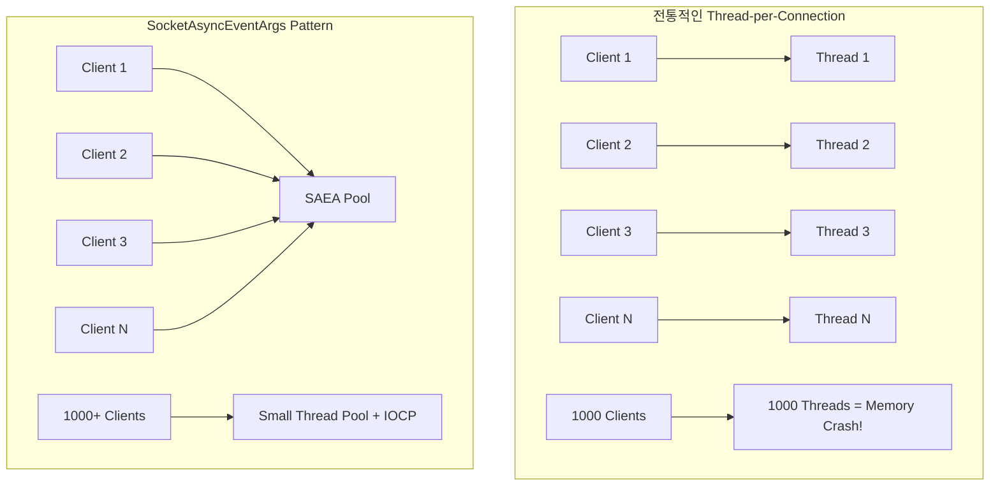
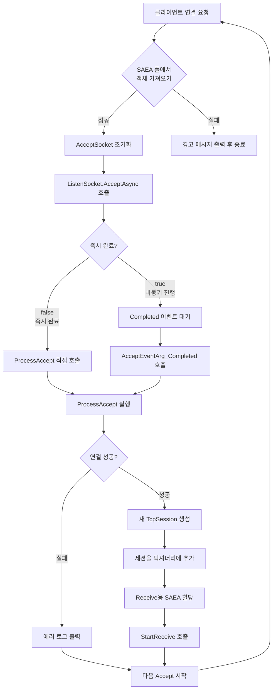
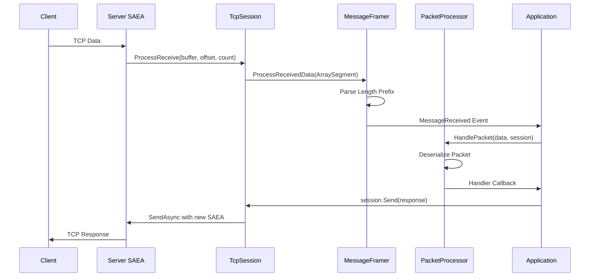

# 게임 서버 개발을 위한 C# Socket 프로그래밍

저자: 최흥배, Claude AI  

- .NET 9
- Windows 11
- Visual Studio Code, Visual Studio 2022 이상
  
-----  
  
# 10장. `SocketAsyncEventArgs` (EAP) 모델 심화
.NET Framework 3.5에서는 고성능 및 고확장성(High Scalability) 네트워크 애플리케이션을 위해 **`System.Net.Sockets.SocketAsyncEventArgs` 클래스를 중심으로 하는 새로운 소켓 API 세트**가 도입되었다.   
이전의 `Begin/End` 방식(비동기 프로그래밍 모델, APM)에 비해 성능이 크게 향상되었으며, 특히 대규모 동시 접속을 처리하는 서버 개발에 최적화되어 있다.
  
## SocketAsyncEventArgs란?
**SocketAsyncEventArgs**는 .NET Framework에서 제공하는 **Event-based Asynchronous Pattern (EAP)** 모델을 구현한 클래스이다. 고성능 네트워크 서버 개발에서 **스레드 풀 고갈 문제**를 해결하고 **메모리 할당을 최소화**하기 위해 설계되었다.

```
┌─────────────────────────────────────────────────────────────┐
│                    SocketAsyncEventArgs                     │
│                                                             │
│  ┌─────────────┐    ┌─────────────┐    ┌─────────────┐      │
│  │   Buffer    │    │ UserToken   │    │ Completed   │      │
│  │   Pool      │    │   Object    │    │   Event     │      │
│  └─────────────┘    └─────────────┘    └─────────────┘      │
│                                                             │
│  ┌─────────────┐    ┌─────────────┐    ┌─────────────┐      │
│  │SocketError  │    │LastOperation│    │BytesTransfer│      │
│  │             │    │             │    │    red      │      │
│  └─────────────┘    └─────────────┘    └─────────────┘      │
└─────────────────────────────────────────────────────────────┘
```

### 🎯 핵심 특징
1. **객체 재사용**: SAEA 객체를 풀링하여 메모리 할당/해제 오버헤드 제거
2. **이벤트 기반**: 콜백 방식으로 비동기 완료 통지
3. **Zero-copy**: 버퍼를 미리 할당하고 재사용
4. **스레드 효율성**: I/O 완료 포트(IOCP) 활용으로 스레드 사용량 최소화

---

## EAP vs 기존 방식 비교



### 📊 성능 비교

| 방식 | 스레드 수 | 메모리 사용량 | 컨텍스트 스위칭 | 확장성 |
|------|-----------|---------------|----------------|--------|
| Thread-per-Connection | N개 클라이언트 = N개 스레드 | 높음 (각 스레드당 1MB) | 매우 높음 | 제한적 (~100-200 동시접속) |
| SocketAsyncEventArgs | 고정된 적은 수 | 낮음 (버퍼 풀링) | 낮음 | 높음 (10,000+ 동시접속) |

---

## API 설명 및 사용법

### 🔧 주요 속성 및 메서드

```csharp
public class SocketAsyncEventArgs : EventArgs, IDisposable
{
    // 핵심 속성들
    public byte[] Buffer { get; }           // 데이터 버퍼
    public int Offset { get; set; }         // 버퍼 시작 오프셋
    public int Count { get; set; }          // 처리할 바이트 수
    public int BytesTransferred { get; }    // 실제 전송된 바이트 수
    public SocketError SocketError { get; } // 소켓 에러 상태
    public object UserToken { get; set; }   // 사용자 정의 데이터
    public Socket AcceptSocket { get; set; } // Accept 시 연결된 소켓
    public SocketAsyncOperation LastOperation { get; } // 마지막 수행 작업
    
    // 핵심 이벤트
    public event EventHandler<SocketAsyncEventArgs> Completed;
    
    // 핵심 메서드
    public void SetBuffer(byte[] buffer, int offset, int count);
    public void SetBuffer(int offset, int count);
    public void Dispose();
}
```

### 🔄 기본 사용 패턴

```
┌─────────────────────────────────────────────────────────────┐
│                   SAEA 사용 패턴                            │
└─────────────────────────────────────────────────────────────┘
                            │
                            ▼
              ┌─────────────────────────┐
              │   1. SAEA 객체 생성      │
              │      및 초기화           │
              └─────────────────────────┘
                            │
                            ▼
              ┌─────────────────────────┐
              │   2. 버퍼 설정 및        │
              │   Completed 이벤트 등록  │
              └─────────────────────────┘
                            │
                            ▼
              ┌─────────────────────────┐
              │   3. 비동기 작업 시작     │
              │   (AcceptAsync,         │
              │    ReceiveAsync 등)     │
              └─────────────────────────┘
                            │
                            ▼
              ┌─────────────────────────┐
              │   4. 결과 확인          │
              │   (true = 비동기 진행,  │
              │    false = 즉시 완료)   │
              └─────────────────────────┘
                     │              │
                false │              │ true
                     ▼              ▼
    ┌─────────────────────┐    ┌──────────────────┐
    │   즉시 결과 처리     │     │  Completed 이벤트 │
    │   ProcessXXX() 호출  │    │  콜백에서 처리     │
    └─────────────────────┘    └──────────────────┘
                     │              │
                     └──────┬───────┘
                            ▼
              ┌─────────────────────────┐
              │   5. SAEA 객체 풀로      │
              │      반환 또는 재사용     │
              └─────────────────────────┘
```

---

## 코드 상세 분석

### 전체 아키텍처

```
                    ┌─────────────────────────────────────┐
                    │           TcpNetworkServer          │
                    │  ┌─────────────────────────────┐    │
                    │  │     SAEA Pool Manager       │    │
                    │  │  ┌─────────┐ ┌─────────┐    │    │
                    │  │  │ Accept  │ │ Receive │    │    │
                    │  │  │  Pool   │ │  Pool   │    │    │
                    │  │  └─────────┘ └─────────┘    │    │
                    │  └─────────────────────────────┘    │
                    └─────────────────────────────────────┘
                                      │
                    ┌─────────────────┼─────────────────┐
                    │                 │                 │
                    ▼                 ▼                 ▼
        ┌─────────────────┐ ┌─────────────────┐ ┌─────────────────┐
        │   TcpSession    │ │   TcpSession    │ │   TcpSession    │
        │                 │ │                 │ │                 │
        │ ┌─────────────┐ │ │ ┌─────────────┐ │ │ ┌─────────────┐ │
        │ │MessageFramer│ │ │ │MessageFramer│ │ │ │MessageFramer│ │
        │ └─────────────┘ │ │ └─────────────┘ │ │ └─────────────┘ │
        └─────────────────┘ └─────────────────┘ └─────────────────┘
                    │                 │                 │
                    └─────────────────┼─────────────────┘
                                      │
                            ┌─────────────────┐
                            │ PacketProcessor │
                            └─────────────────┘
```

### 🔍 핵심 구성 요소 분석

#### 1. **TcpNetworkServer** - SAEA 풀 관리자

```csharp
public class TcpNetworkServer : INetworkServer
{
    // SocketAsyncEventArgs 객체들을 재사용하기 위한 풀
    private readonly Stack<SocketAsyncEventArgs> _acceptEventArgsPool;
    private readonly Stack<SocketAsyncEventArgs> _receiveEventArgsPool;
```

**💡 핵심 아이디어**: 
- `Stack<T>`을 사용하여 SAEA 객체를 풀링
- `Accept`용과 `Receive`용을 분리하여 관리
- 서버 시작 시 미리 모든 SAEA 객체를 생성

```
Stack<SocketAsyncEventArgs> Pool:
┌─────────────────────────────────┐
│  ┌─────┐  ┌─────┐  ┌─────┐      │
│  │SAEA3│  │SAEA2│  │SAEA1│ ← Top│
│  └─────┘  └─────┘  └─────┘      │
└─────────────────────────────────┘
      ▲         ▲         ▲
      │         │         │
   Push()    Push()    Pop()
  (반환)     (반환)    (사용)
```

#### 2. **Accept 처리 과정**

```csharp
private void StartAccept(SocketAsyncEventArgs acceptEventArg)
{
    if (acceptEventArg == null)
    {
        // 풀에서 Accept SAEA를 가져옴
        if (!_acceptEventArgsPool.TryPop(out acceptEventArg))
        {
            Console.WriteLine("Warning: No available SocketAsyncEventArgs for accept operation.");
            return;
        }
    }
    else
    {
        // 재사용을 위해 이전 소켓 정보 초기화
        acceptEventArg.AcceptSocket = null;
    }

    try
    {
        bool willRaiseEvent = _listenSocket.AcceptAsync(acceptEventArg);
        if (!willRaiseEvent)
        {
            ProcessAccept(acceptEventArg);
        }
    }
    catch (ObjectDisposedException) { /* 서버가 멈추는 중 */ }
    catch (Exception ex)
    {
        Console.WriteLine($"Error starting accept: {ex.Message}");
    }
}
```

**🎯 Accept 플로우 차트**:



#### 3. **Receive 처리 과정**

```csharp
private void StartReceive(SocketAsyncEventArgs e)
{
    var session = (TcpSession)e.UserToken;

    try
    {
        bool willRaiseEvent = session.IsConnected && session.RemoteEndPoint != null && ((Socket)session.GetType().GetField("_socket", System.Reflection.BindingFlags.NonPublic | System.Reflection.BindingFlags.Instance).GetValue(session)).ReceiveAsync(e);
        if (!willRaiseEvent)
        {
            ProcessReceive(e);
        }
    }
    catch (ObjectDisposedException)
    {
            // 세션이 이미 닫혔을 수 있음
            ReturnReceiveEventArgs(e);
    }
    catch (Exception ex)
    {
            Console.WriteLine($"Error starting receive for session {session.Id}: {ex.Message}");
            session.Close();
            ReturnReceiveEventArgs(e);
    }
}
```

**📡 Receive 데이터 플로우**:

```
Client → TCP Buffer → Socket.ReceiveAsync() → SAEA Buffer
                                                    │
                                                    ▼
                                            ProcessReceive()
                                                    │
                                                    ▼
                                          TcpSession.ProcessReceive()
                                                    │
                                                    ▼
                                        MessageFramer.ProcessReceivedData()
                                                    │
                                                    ▼
                                            Complete Messages
                                                    │
                                                    ▼
                                          PacketProcessor.HandlePacket()
```

#### 4. **TcpSession** - 개별 클라이언트 관리

```csharp
public class TcpSession : ISession
{
    internal void ProcessReceive(byte[] buffer, int offset, int count)
    {
        // MessageFramer를 통해 메시지를 파싱합니다.
        _messageFramer.ProcessReceivedData(new ArraySegment<byte>(buffer, offset, count));
    }

    public void Send(IPacket packet)
    {
        if (!IsConnected)
        {
            return;
        }

        byte[] packetData = _packetProcessor.SerializePacket(packet);
        byte[] framedData = _messageFramer.FrameMessage(packetData);

        // Send를 위한 새로운 SocketAsyncEventArgs를 생성하여 비동기 전송
        var sendArgs = new SocketAsyncEventArgs();
        sendArgs.SetBuffer(framedData, 0, framedData.Length);
        sendArgs.Completed += IO_Completed;
        sendArgs.UserToken = this;

        try
        {
            bool willRaiseEvent = _socket.SendAsync(sendArgs);
            if (!willRaiseEvent)
            {
                ProcessSend(sendArgs);
            }
        }
        catch (ObjectDisposedException)
        {
            Close();
        }
        catch (Exception ex)
        {
            Console.WriteLine($"Send Error: {ex.Message}");
            Close();
        }
    }
}
```

**🔄 Send 작업 특이점**:
- **Receive SAEA는 풀링**하지만, **Send SAEA는 매번 새로 생성**
- 이유: Send는 패킷마다 다른 데이터를 담고 있어 재사용이 복잡함
- Send 완료 후 `Dispose()`로 즉시 해제
- 이 예제에서는 매번 생성을 했지만 고성능 서버를 만들 때는 이것도 풀링을 해야한다.  

#### 5. **MessageFramer** - TCP 스트림 분할 처리

```csharp
public void ProcessReceivedData(ArraySegment<byte> data)
{
    _receiveBuffer.Write(data.Array, data.Offset, data.Count);

    while (true)
    {
        _receiveBuffer.Position = 0;

        if (_receiveBuffer.Length < HeaderSize)
        {
            break; // 헤더를 읽기에 충분한 데이터가 없음
        }

        byte[] lengthBuffer = new byte[HeaderSize];
        _receiveBuffer.Read(lengthBuffer, 0, HeaderSize);
        int messageLength = BitConverter.ToInt32(lengthBuffer, 0);

        if (_receiveBuffer.Length < HeaderSize + messageLength)
        {
            break; // 전체 메시지를 읽기에 충분한 데이터가 없음
        }

        byte[] message = new byte[messageLength];
        _receiveBuffer.Read(message, 0, messageLength);

        MessageReceived?.Invoke(message); // 완전한 메시지 전달

        // 남은 데이터 처리...
    }
}
```

**📦 TCP 스트림 파싱 원리**:

```
TCP Stream: [Length][Data][Length][Data][Partial...]
                ↓
   MemoryStream Buffer: 누적 저장
                ↓
   While Loop: 완전한 메시지 추출
                ↓
   Event Trigger: MessageReceived 발생
```

### 🎮 채팅 서버 예제 분석

#### **서버 초기화 과정**

```csharp
// 최대 연결 1000개, 버퍼 크기 4096으로 서버 초기화
_server = new TcpNetworkServer(1000, 4096, _packetProcessor, OnPacketReceived);
```

**💾 메모리 사용량 계산**:
- Accept SAEA Pool: 1000개 × 작은 메모리 = ~수 KB
- Receive SAEA Pool: 1000개 × 4096 bytes = ~4MB
- **총합**: 약 4MB (vs Thread-per-Connection: 1000MB!)

```
Memory Usage Comparison:
┌─────────────────────────────────────────┐
│           Thread-per-Connection         │
│  ┌─────┐┌─────┐┌─────┐     ┌─────┐      │
│  │ 1MB ││ 1MB ││ 1MB │ ... │ 1MB │      │
│  └─────┘└─────┘└─────┘     └─────┘      │
│         Total: 1000MB                   │
└─────────────────────────────────────────┘
               vs
┌─────────────────────────────────────────┐
│          SocketAsyncEventArgs           │
│  ┌──────────────────────────────────┐   │
│  │     SAEA Pool: ~4MB              │   │
│  │  ┌────┐┌────┐┌────┐    ┌────┐    │   │
│  │  │4KB ││4KB ││4KB │... │4KB │    │   │
│  │  └────┘└────┘└────┘    └────┘    │   │
│  └──────────────────────────────────┘   │
│         Total: 4MB                      │
└─────────────────────────────────────────┘
```

#### **패킷 처리 파이프라인**



### ⚡ 성능 최적화 포인트

#### 1. **버퍼 크기 튜닝**
```csharp
// 작은 버퍼: 메모리 절약, 하지만 더 많은 Receive 호출
private readonly int _bufferSize = 1024;  // 게임: 작은 패킷 위주

// 큰 버퍼: 처리량 증가, 하지만 메모리 사용량 증가  
private readonly int _bufferSize = 8192;  // 파일 전송: 큰 데이터 위주
```

#### 2. **풀 크기 최적화**
```csharp
// 보수적 접근: 예상 동시접속자와 동일
int poolSize = maxConnections;

// 적극적 접근: 10-20% 더 할당 (버스트 트래픽 대응)
int poolSize = (int)(maxConnections * 1.2);
```

#### 3. **CPU 코어 활용**
```
Single Thread IOCP:
CPU Core 1: [====IOCP Thread====]
CPU Core 2: [        ]
CPU Core 3: [        ]
CPU Core 4: [        ]

Multi-threaded Processing:
CPU Core 1: [====IOCP Thread====]
CPU Core 2: [==Packet Process==]  
CPU Core 3: [==Game Logic====]
CPU Core 4: [==Database====]
```

### 🔧 실전 개발 팁

#### 1. **에러 처리 전략**
```csharp
private void ProcessReceive(SocketAsyncEventArgs e)
{
    var session = (TcpSession)e.UserToken;
    
    // 정상 수신
    if (e.BytesTransferred > 0 && e.SocketError == SocketError.Success)
    {
        session.ProcessReceive(e.Buffer, e.Offset, e.BytesTransferred);
        StartReceive(e); // 계속 수신
    }
    // 연결 종료 또는 에러
    else
    {
        session.Close();
        ReturnReceiveEventArgs(e); // 풀로 반환
    }
}
```

#### 2. **메모리 누수 방지**
```csharp
public void Stop()
{
    // 모든 세션 정리
    foreach (var session in _sessions.Values.ToList())
    {
        session.Disconnect();
    }
    _sessions.Clear();
    
    // SAEA 풀 정리 - 중요!
    while(_acceptEventArgsPool.TryPop(out var args)) 
        args.Dispose();
    while(_receiveEventArgsPool.TryPop(out var args)) 
        args.Dispose();
}
```

#### 3. **모니터링 지표**
```csharp
// 성능 모니터링을 위한 카운터들
private long _totalBytesReceived = 0;
private long _totalBytesSent = 0;
private int _activeConnections = 0;
private int _availableReceiveEventArgs => _receiveEventArgsPool.Count;
private int _availableAcceptEventArgs => _acceptEventArgsPool.Count;
```

이 SocketAsyncEventArgs 패턴을 마스터하면 **수천 명의 동시 접속자**를 안정적으로 처리할 수 있는 고성능 게임 서버를 구축할 수 있습니다! 🚀
  
---
  
## SocketAsyncEventArgs 클래스 완전 분석

### 🎯 SocketAsyncEventArgs 개요

```
┌─────────────────────────────────────────────────────────────────┐
│                    SocketAsyncEventArgs                         │
│  ┌─────────────────────────────────────────────────────────┐    │
│  │                   주요 속성들                             │    │
│  │  ┌─────────────┐ ┌─────────────┐ ┌─────────────┐        │    │
│  │  │   Buffer    │ │  UserToken  │ │SocketError  │        │    │
│  │  │Management   │ │  Context    │ │  Handling   │        │    │
│  │  └─────────────┘ └─────────────┘ └─────────────┘        │    │
│  └─────────────────────────────────────────────────────────┘    │
│  ┌─────────────────────────────────────────────────────────┐    │
│  │                   이벤트 시스템                           │    │
│  │  ┌─────────────┐ ┌─────────────┐ ┌─────────────┐        │    │
│  │  │ Completed   │ │LastOperation│ │BytesTransfer│        │    │
│  │  │   Event     │ │  Tracking   │ │   Results   │        │    │
│  │  └─────────────┘ └─────────────┘ └─────────────┘        │    │
│  └─────────────────────────────────────────────────────────┘    │
└─────────────────────────────────────────────────────────────────┘
```

### 🔧 핵심 속성 상세 분석

#### 1. **Buffer 관리 속성들**

```csharp
public class SocketAsyncEventArgs : EventArgs, IDisposable
{
    // 핵심 버퍼 속성들
    public byte[] Buffer { get; }           // 실제 데이터 버퍼
    public IList<ArraySegment<byte>> BufferList { get; set; }  // 분산 버퍼 리스트
    public int Offset { get; set; }         // 버퍼 내 시작 위치
    public int Count { get; set; }          // 처리할 바이트 수
    public int BytesTransferred { get; }    // 실제 전송/수신된 바이트 수
}
```

**📦 Buffer vs BufferList 사용 시나리오**:

```csharp
// === 단일 버퍼 사용 예제 ===
public class SingleBufferExample
{
    private SocketAsyncEventArgs _receiveArgs;
    private byte[] _buffer = new byte[4096];

    public void InitializeSingleBuffer()
    {
        _receiveArgs = new SocketAsyncEventArgs();
        
        // 전체 버퍼 설정
        _receiveArgs.SetBuffer(_buffer, 0, _buffer.Length);
        
        Console.WriteLine($"Buffer Size: {_receiveArgs.Count}");
        Console.WriteLine($"Buffer Offset: {_receiveArgs.Offset}");
        
        _receiveArgs.Completed += OnReceiveCompleted;
    }

    private void OnReceiveCompleted(object sender, SocketAsyncEventArgs e)
    {
        Console.WriteLine($"Received {e.BytesTransferred} bytes");
        
        // 실제 수신된 데이터 처리
        for (int i = e.Offset; i < e.Offset + e.BytesTransferred; i++)
        {
            byte receivedByte = e.Buffer[i];
            // 데이터 처리...
        }
    }
}

// === 분산 버퍼 사용 예제 ===
public class ScatterGatherExample
{
    private SocketAsyncEventArgs _sendArgs;

    public void InitializeScatterGather()
    {
        _sendArgs = new SocketAsyncEventArgs();
        
        // 여러 버퍼 조각을 하나의 전송 작업으로 결합
        var bufferList = new List<ArraySegment<byte>>
        {
            new ArraySegment<byte>(Encoding.UTF8.GetBytes("HTTP/1.1 200 OK\r\n")),
            new ArraySegment<byte>(Encoding.UTF8.GetBytes("Content-Type: text/html\r\n")),
            new ArraySegment<byte>(Encoding.UTF8.GetBytes("Content-Length: 13\r\n\r\n")),
            new ArraySegment<byte>(Encoding.UTF8.GetBytes("Hello, World!"))
        };
        
        _sendArgs.BufferList = bufferList;
        _sendArgs.Completed += OnSendCompleted;
        
        Console.WriteLine($"Total segments: {bufferList.Count}");
    }

    private void OnSendCompleted(object sender, SocketAsyncEventArgs e)
    {
        Console.WriteLine($"Sent {e.BytesTransferred} bytes using scatter-gather");
    }
}
```

**💡 Buffer vs BufferList 선택 가이드**:

```
단일 버퍼 (Buffer):
┌─────────────────────────────────┐
│     연속된 하나의 메모리 블록       │
│  ┌─────────────────────────┐    │
│  │████████████████████████ │    │
│  └─────────────────────────┘    │
│    ↑ 단순한 데이터 전송에 최적      │
└─────────────────────────────────┘

분산 버퍼 (BufferList):
┌─────────────────────────────────┐
│      여러 메모리 조각들을 결합      │
│  ┌─────┐ ┌─────┐ ┌─────┐        │
│  │█████│ │█████│ │█████│        │
│  └─────┘ └─────┘ └─────┘        │
│    ↑ HTTP 헤더+바디, 복합 패킷     │
└─────────────────────────────────┘
```

#### 2. **소켓 정보 및 상태 속성들**

```csharp
public class SocketAsyncEventArgs : EventArgs, IDisposable
{
    // 소켓 연결 관련
    public Socket AcceptSocket { get; set; }           // Accept 작업에서 생성된 소켓
    public Socket ConnectSocket { get; }               // Connect 작업에 사용할 소켓
    public EndPoint RemoteEndPoint { get; set; }       // 원격 엔드포인트
    
    // 작업 상태 및 결과
    public SocketError SocketError { get; }            // 작업 완료 후 에러 상태
    public SocketAsyncOperation LastOperation { get; } // 마지막 수행된 작업 유형
    public Exception ConnectByNameError { get; }       // 이름으로 연결 시 발생한 에러
    
    // 사용자 정의 데이터
    public object UserToken { get; set; }              // 사용자 정의 컨텍스트 객체
}
```

**🎪 UserToken 활용 패턴**:

```csharp
// === UserToken을 활용한 세션 관리 ===
public class SessionContext
{
    public Guid SessionId { get; set; }
    public DateTime ConnectedTime { get; set; }
    public string UserName { get; set; }
    public long TotalBytesReceived { get; set; }
    public Queue<byte[]> SendQueue { get; set; } = new Queue<byte[]>();
}

public class TokenBasedSessionManager
{
    private Dictionary<Guid, Socket> _sessionSockets = new Dictionary<Guid, Socket>();

    public void StartReceive(Socket clientSocket)
    {
        var receiveArgs = new SocketAsyncEventArgs();
        receiveArgs.SetBuffer(new byte[4096], 0, 4096);
        
        // UserToken에 세션 정보 저장
        var sessionContext = new SessionContext
        {
            SessionId = Guid.NewGuid(),
            ConnectedTime = DateTime.Now,
            UserName = "Unknown"
        };
        
        receiveArgs.UserToken = sessionContext;
        receiveArgs.Completed += OnReceiveCompleted;
        
        _sessionSockets[sessionContext.SessionId] = clientSocket;
        
        bool willRaiseEvent = clientSocket.ReceiveAsync(receiveArgs);
        if (!willRaiseEvent)
        {
            OnReceiveCompleted(null, receiveArgs);
        }
    }

    private void OnReceiveCompleted(object sender, SocketAsyncEventArgs e)
    {
        var context = (SessionContext)e.UserToken;
        
        if (e.SocketError == SocketError.Success && e.BytesTransferred > 0)
        {
            context.TotalBytesReceived += e.BytesTransferred;
            
            Console.WriteLine($"Session {context.SessionId}: " +
                            $"Received {e.BytesTransferred} bytes, " +
                            $"Total: {context.TotalBytesReceived} bytes");
            
            // 데이터 처리...
            ProcessReceivedData(context, e.Buffer, e.Offset, e.BytesTransferred);
            
            // 다음 수신 준비
            bool willRaiseEvent = _sessionSockets[context.SessionId].ReceiveAsync(e);
            if (!willRaiseEvent)
            {
                OnReceiveCompleted(null, e);
            }
        }
        else
        {
            // 연결 종료 처리
            CleanupSession(context.SessionId);
            e.Dispose();
        }
    }

    private void ProcessReceivedData(SessionContext context, byte[] buffer, int offset, int count)
    {
        // 실제 데이터 처리 로직
        string receivedText = Encoding.UTF8.GetString(buffer, offset, count);
        Console.WriteLine($"[{context.UserName}]: {receivedText}");
    }

    private void CleanupSession(Guid sessionId)
    {
        if (_sessionSockets.TryRemove(sessionId, out Socket socket))
        {
            socket.Close();
            Console.WriteLine($"Session {sessionId} cleaned up");
        }
    }
}
```

#### 3. **이벤트 시스템**

```csharp
public class SocketAsyncEventArgs : EventArgs, IDisposable
{
    // 핵심 이벤트
    public event EventHandler<SocketAsyncEventArgs> Completed;
    
    // 작업 완료 상태
    public SocketAsyncOperation LastOperation { get; }
}

// LastOperation 열거형 값들
public enum SocketAsyncOperation
{
    None,           // 작업 없음
    Accept,         // 클라이언트 연결 수락
    Connect,        // 서버에 연결
    Disconnect,     // 연결 해제
    Receive,        // 데이터 수신
    ReceiveFrom,    // UDP 데이터 수신
    ReceiveMessageFrom, // UDP 메시지 수신 (추가 정보 포함)
    Send,           // 데이터 송신
    SendPackets,    // 다중 패킷 송신
    SendTo          // UDP 데이터 송신
}
```

**🎭 통합 이벤트 핸들러 패턴**:

```csharp
public class UnifiedEventHandler
{
    private SocketAsyncEventArgs _multiPurposeArgs;

    public void InitializeUnifiedHandler()
    {
        _multiPurposeArgs = new SocketAsyncEventArgs();
        _multiPurposeArgs.Completed += OnIOCompleted;
        _multiPurposeArgs.SetBuffer(new byte[4096], 0, 4096);
    }

    // 모든 비동기 작업에 대한 통합 핸들러
    private void OnIOCompleted(object sender, SocketAsyncEventArgs e)
    {
        switch (e.LastOperation)
        {
            case SocketAsyncOperation.Accept:
                ProcessAccept(e);
                break;
                
            case SocketAsyncOperation.Connect:
                ProcessConnect(e);
                break;
                
            case SocketAsyncOperation.Receive:
                ProcessReceive(e);
                break;
                
            case SocketAsyncOperation.Send:
                ProcessSend(e);
                break;
                
            case SocketAsyncOperation.Disconnect:
                ProcessDisconnect(e);
                break;
                
            default:
                Console.WriteLine($"Unknown operation: {e.LastOperation}");
                break;
        }
    }

    private void ProcessAccept(SocketAsyncEventArgs e)
    {
        if (e.SocketError == SocketError.Success)
        {
            Console.WriteLine($"Client accepted: {e.AcceptSocket.RemoteEndPoint}");
            // 새 클라이언트 처리 로직
        }
        else
        {
            Console.WriteLine($"Accept failed: {e.SocketError}");
        }
    }

    private void ProcessConnect(SocketAsyncEventArgs e)
    {
        if (e.SocketError == SocketError.Success)
        {
            Console.WriteLine("Successfully connected to server");
            // 연결 후 처리 로직
        }
        else
        {
            Console.WriteLine($"Connection failed: {e.SocketError}");
        }
    }

    private void ProcessReceive(SocketAsyncEventArgs e)
    {
        if (e.SocketError == SocketError.Success && e.BytesTransferred > 0)
        {
            Console.WriteLine($"Received {e.BytesTransferred} bytes");
            // 수신 데이터 처리
            
            // ASCII 아트로 데이터 시각화
            Console.WriteLine("┌─────────────────────────────────┐");
            Console.WriteLine("│        Received Data            │");
            Console.WriteLine("├─────────────────────────────────┤");
            
            string data = Encoding.UTF8.GetString(e.Buffer, e.Offset, e.BytesTransferred);
            Console.WriteLine($"│ {data.PadRight(31)} │");
            
            Console.WriteLine("└─────────────────────────────────┘");
        }
        else
        {
            Console.WriteLine("Connection closed or error occurred");
        }
    }

    private void ProcessSend(SocketAsyncEventArgs e)
    {
        if (e.SocketError == SocketError.Success)
        {
            Console.WriteLine($"Successfully sent {e.BytesTransferred} bytes");
        }
        else
        {
            Console.WriteLine($"Send failed: {e.SocketError}");
        }
    }

    private void ProcessDisconnect(SocketAsyncEventArgs e)
    {
        if (e.SocketError == SocketError.Success)
        {
            Console.WriteLine("Successfully disconnected");
        }
        else
        {
            Console.WriteLine($"Disconnect failed: {e.SocketError}");
        }
    }
}
```

---

## Socket 클래스 비동기 메서드 완전 분석

### 🔌 AcceptAsync 메서드

```csharp
public bool AcceptAsync(SocketAsyncEventArgs e)
```

**🎯 기능**: 클라이언트 연결 요청을 비동기적으로 수락

**📝 반환값 의미**:
- `true`: 비동기 작업이 시작됨, `Completed` 이벤트로 완료 통지
- `false`: 작업이 즉시 완료됨, 바로 결과 처리 가능

```csharp
public class AcceptAsyncExample
{
    private Socket _listenSocket;
    private SocketAsyncEventArgs _acceptArgs;

    public void StartListening(int port)
    {
        // 리스닝 소켓 설정
        _listenSocket = new Socket(AddressFamily.InterNetwork, SocketType.Stream, ProtocolType.Tcp);
        _listenSocket.Bind(new IPEndPoint(IPAddress.Any, port));
        _listenSocket.Listen(100);

        // Accept용 SocketAsyncEventArgs 설정
        _acceptArgs = new SocketAsyncEventArgs();
        _acceptArgs.Completed += OnAcceptCompleted;

        Console.WriteLine($"Server listening on port {port}");
        StartAccept();
    }

    private void StartAccept()
    {
        // 이전 Accept 소켓 초기화 (재사용을 위해)
        _acceptArgs.AcceptSocket = null;

        try
        {
            bool willRaiseEvent = _listenSocket.AcceptAsync(_acceptArgs);
            
            if (!willRaiseEvent)
            {
                // 즉시 완료된 경우 직접 처리
                ProcessAccept(_acceptArgs);
            }
            // true인 경우 OnAcceptCompleted에서 처리됨
        }
        catch (Exception ex)
        {
            Console.WriteLine($"Accept error: {ex.Message}");
        }
    }

    private void OnAcceptCompleted(object sender, SocketAsyncEventArgs e)
    {
        ProcessAccept(e);
    }

    private void ProcessAccept(SocketAsyncEventArgs e)
    {
        if (e.SocketError == SocketError.Success)
        {
            Socket clientSocket = e.AcceptSocket;
            
            Console.WriteLine("┌─────────────────────────────────────┐");
            Console.WriteLine("│         New Client Connected       │");
            Console.WriteLine("├─────────────────────────────────────┤");
            Console.WriteLine($"│ Remote: {clientSocket.RemoteEndPoint?.ToString().PadRight(23)} │");
            Console.WriteLine($"│ Local:  {clientSocket.LocalEndPoint?.ToString().PadRight(23)} │");
            Console.WriteLine("└─────────────────────────────────────┘");

            // 새 클라이언트 처리 시작
            StartReceiveFromClient(clientSocket);
        }
        else
        {
            Console.WriteLine($"Accept failed: {e.SocketError}");
        }

        // 다음 연결 대기
        StartAccept();
    }

    private void StartReceiveFromClient(Socket clientSocket)
    {
        var receiveArgs = new SocketAsyncEventArgs();
        receiveArgs.SetBuffer(new byte[1024], 0, 1024);
        receiveArgs.UserToken = clientSocket;
        receiveArgs.Completed += OnReceiveCompleted;

        bool willRaiseEvent = clientSocket.ReceiveAsync(receiveArgs);
        if (!willRaiseEvent)
        {
            OnReceiveCompleted(null, receiveArgs);
        }
    }

    private void OnReceiveCompleted(object sender, SocketAsyncEventArgs e)
    {
        var clientSocket = (Socket)e.UserToken;
        
        if (e.SocketError == SocketError.Success && e.BytesTransferred > 0)
        {
            string receivedData = Encoding.UTF8.GetString(e.Buffer, 0, e.BytesTransferred);
            Console.WriteLine($"Received from client: {receivedData}");

            // Echo back to client
            byte[] echoData = Encoding.UTF8.GetBytes($"Echo: {receivedData}");
            clientSocket.Send(echoData);

            // Continue receiving
            bool willRaiseEvent = clientSocket.ReceiveAsync(e);
            if (!willRaiseEvent)
            {
                OnReceiveCompleted(null, e);
            }
        }
        else
        {
            // Client disconnected
            Console.WriteLine("Client disconnected");
            clientSocket.Close();
            e.Dispose();
        }
    }
}
```

### 🔗 ConnectAsync 메서드

```csharp
public bool ConnectAsync(SocketAsyncEventArgs e)
```

**🎯 기능**: 원격 서버에 비동기적으로 연결

```csharp
public class ConnectAsyncExample
{
    private Socket _clientSocket;
    private SocketAsyncEventArgs _connectArgs;

    public void ConnectToServer(string host, int port)
    {
        _clientSocket = new Socket(AddressFamily.InterNetwork, SocketType.Stream, ProtocolType.Tcp);
        
        _connectArgs = new SocketAsyncEventArgs();
        _connectArgs.RemoteEndPoint = new IPEndPoint(IPAddress.Parse(host), port);
        _connectArgs.Completed += OnConnectCompleted;

        Console.WriteLine($"Attempting to connect to {host}:{port}...");

        bool willRaiseEvent = _clientSocket.ConnectAsync(_connectArgs);
        if (!willRaiseEvent)
        {
            ProcessConnect(_connectArgs);
        }
    }

    private void OnConnectCompleted(object sender, SocketAsyncEventArgs e)
    {
        ProcessConnect(e);
    }

    private void ProcessConnect(SocketAsyncEventArgs e)
    {
        if (e.SocketError == SocketError.Success)
        {
            Console.WriteLine("┌─────────────────────────────────────┐");
            Console.WriteLine("│       Connection Successful        │");
            Console.WriteLine("├─────────────────────────────────────┤");
            Console.WriteLine($"│ Connected to: {e.RemoteEndPoint?.ToString().PadRight(19)} │");
            Console.WriteLine($"│ Local address: {_clientSocket.LocalEndPoint?.ToString().PadRight(18)} │");
            Console.WriteLine("└─────────────────────────────────────┘");

            // 연결 후 데이터 전송 시작
            StartCommunication();
        }
        else
        {
            Console.WriteLine($"Connection failed: {e.SocketError}");
            
            // 재연결 로직 예제
            if (ShouldRetryConnection(e.SocketError))
            {
                Console.WriteLine("Retrying connection in 3 seconds...");
                Task.Delay(3000).ContinueWith(_ => RetryConnection());
            }
        }
    }

    private bool ShouldRetryConnection(SocketError error)
    {
        return error == SocketError.ConnectionRefused || 
               error == SocketError.TimedOut ||
               error == SocketError.NetworkUnreachable;
    }

    private void RetryConnection()
    {
        _clientSocket?.Close();
        _clientSocket = new Socket(AddressFamily.InterNetwork, SocketType.Stream, ProtocolType.Tcp);
        
        bool willRaiseEvent = _clientSocket.ConnectAsync(_connectArgs);
        if (!willRaiseEvent)
        {
            ProcessConnect(_connectArgs);
        }
    }

    private void StartCommunication()
    {
        // 서버에 초기 메시지 전송
        string greeting = "Hello from client!";
        byte[] data = Encoding.UTF8.GetBytes(greeting);
        
        var sendArgs = new SocketAsyncEventArgs();
        sendArgs.SetBuffer(data, 0, data.Length);
        sendArgs.Completed += OnSendCompleted;

        bool willRaiseEvent = _clientSocket.SendAsync(sendArgs);
        if (!willRaiseEvent)
        {
            OnSendCompleted(null, sendArgs);
        }
    }

    private void OnSendCompleted(object sender, SocketAsyncEventArgs e)
    {
        if (e.SocketError == SocketError.Success)
        {
            Console.WriteLine($"Successfully sent {e.BytesTransferred} bytes");
            e.Dispose();
        }
        else
        {
            Console.WriteLine($"Send failed: {e.SocketError}");
        }
    }
}
```

### 📥 ReceiveAsync 메서드

```csharp
public bool ReceiveAsync(SocketAsyncEventArgs e)
```

**🎯 기능**: 소켓에서 데이터를 비동기적으로 수신

```csharp
public class ReceiveAsyncExample
{
    private Socket _socket;
    private SocketAsyncEventArgs _receiveArgs;
    private MemoryStream _messageBuffer = new MemoryStream();

    public void StartReceiving(Socket connectedSocket)
    {
        _socket = connectedSocket;
        
        _receiveArgs = new SocketAsyncEventArgs();
        _receiveArgs.SetBuffer(new byte[4096], 0, 4096);
        _receiveArgs.Completed += OnReceiveCompleted;

        StartReceive();
    }

    private void StartReceive()
    {
        try
        {
            bool willRaiseEvent = _socket.ReceiveAsync(_receiveArgs);
            if (!willRaiseEvent)
            {
                ProcessReceive(_receiveArgs);
            }
        }
        catch (ObjectDisposedException)
        {
            Console.WriteLine("Socket has been disposed");
        }
        catch (Exception ex)
        {
            Console.WriteLine($"Receive error: {ex.Message}");
        }
    }

    private void OnReceiveCompleted(object sender, SocketAsyncEventArgs e)
    {
        ProcessReceive(e);
    }

    private void ProcessReceive(SocketAsyncEventArgs e)
    {
        if (e.SocketError == SocketError.Success && e.BytesTransferred > 0)
        {
            // 수신된 데이터를 버퍼에 누적
            _messageBuffer.Write(e.Buffer, e.Offset, e.BytesTransferred);

            // 데이터 시각화
            DisplayReceivedData(e.Buffer, e.Offset, e.BytesTransferred);

            // 완전한 메시지 파싱 시도
            TryParseCompleteMessages();

            // 다음 데이터 수신 계속
            StartReceive();
        }
        else if (e.BytesTransferred == 0)
        {
            Console.WriteLine("Remote endpoint closed the connection gracefully");
            CleanupConnection();
        }
        else
        {
            Console.WriteLine($"Receive error: {e.SocketError}");
            CleanupConnection();
        }
    }

    private void DisplayReceivedData(byte[] buffer, int offset, int count)
    {
        Console.WriteLine("┌─────────────────────────────────────────────────┐");
        Console.WriteLine($"│ Received {count,3} bytes                            │");
        Console.WriteLine("├─────────────────────────────────────────────────┤");
        
        // Hex dump 형태로 데이터 표시
        for (int i = 0; i < count; i += 16)
        {
            string hexPart = "";
            string asciiPart = "";
            
            for (int j = 0; j < 16 && i + j < count; j++)
            {
                byte b = buffer[offset + i + j];
                hexPart += $"{b:X2} ";
                asciiPart += (b >= 32 && b <= 126) ? (char)b : '.';
            }
            
            Console.WriteLine($"│ {hexPart.PadRight(48)} {asciiPart.PadRight(16)} │");
        }
        
        Console.WriteLine("└─────────────────────────────────────────────────┘");
    }

    private void TryParseCompleteMessages()
    {
        byte[] bufferData = _messageBuffer.ToArray();
        int processedBytes = 0;

        // 간단한 length-prefixed 메시지 파싱 예제
        while (processedBytes + 4 <= bufferData.Length)
        {
            // 메시지 길이 읽기 (4바이트)
            int messageLength = BitConverter.ToInt32(bufferData, processedBytes);
            
            if (messageLength <= 0 || messageLength > 65536) // 유효성 검사
            {
                Console.WriteLine("Invalid message length detected");
                break;
            }

            if (processedBytes + 4 + messageLength <= bufferData.Length)
            {
                // 완전한 메시지 추출
                byte[] messageData = new byte[messageLength];
                Array.Copy(bufferData, processedBytes + 4, messageData, 0, messageLength);
                
                ProcessCompleteMessage(messageData);
                processedBytes += 4 + messageLength;
            }
            else
            {
                // 아직 완전한 메시지가 아님
                break;
            }
        }

        // 처리된 바이트 제거
        if (processedBytes > 0)
        {
            byte[] remainingData = new byte[bufferData.Length - processedBytes];
            Array.Copy(bufferData, processedBytes, remainingData, 0, remainingData.Length);
            
            _messageBuffer.SetLength(0);
            _messageBuffer.Write(remainingData, 0, remainingData.Length);
        }
    }

    private void ProcessCompleteMessage(byte[] messageData)
    {
        string message = Encoding.UTF8.GetString(messageData);
        Console.WriteLine($"📨 Complete message received: {message}");
    }

    private void CleanupConnection()
    {
        _socket?.Close();
        _receiveArgs?.Dispose();
        _messageBuffer?.Dispose();
    }
}
```

### 📤 SendAsync 메서드

```csharp
public bool SendAsync(SocketAsyncEventArgs e)
```

**🎯 기능**: 소켓을 통해 데이터를 비동기적으로 전송

```csharp
public class SendAsyncExample
{
    private Socket _socket;
    private Queue<byte[]> _sendQueue = new Queue<byte[]>();
    private bool _isSending = false;
    private readonly object _sendLock = new object();

    public void Initialize(Socket connectedSocket)
    {
        _socket = connectedSocket;
    }

    public void QueueMessage(string message)
    {
        // 메시지를 length-prefixed 형태로 프레이밍
        byte[] messageBytes = Encoding.UTF8.GetBytes(message);
        byte[] lengthPrefix = BitConverter.GetBytes(messageBytes.Length);
        
        byte[] framedMessage = new byte[4 + messageBytes.Length];
        Array.Copy(lengthPrefix, 0, framedMessage, 0, 4);
        Array.Copy(messageBytes, 0, framedMessage, 4, messageBytes.Length);

        lock (_sendLock)
        {
            _sendQueue.Enqueue(framedMessage);
            
            if (!_isSending)
            {
                _isSending = true;
                StartSend();
            }
        }
    }

    private void StartSend()
    {
        if (_sendQueue.Count == 0)
        {
            _isSending = false;
            return;
        }

        byte[] dataToSend = _sendQueue.Dequeue();
        
        var sendArgs = new SocketAsyncEventArgs();
        sendArgs.SetBuffer(dataToSend, 0, dataToSend.Length);
        sendArgs.Completed += OnSendCompleted;
        sendArgs.UserToken = dataToSend; // 전송 데이터 참조 보관

        Console.WriteLine($"📤 Sending {dataToSend.Length} bytes...");
        
        try
        {
            bool willRaiseEvent = _socket.SendAsync(sendArgs);
            if (!willRaiseEvent)
            {
                ProcessSend(sendArgs);
            }
        }
        catch (Exception ex)
        {
            Console.WriteLine($"Send error: {ex.Message}");
            sendArgs.Dispose();
            _isSending = false;
        }
    }

    private void OnSendCompleted(object sender, SocketAsyncEventArgs e)
    {
        ProcessSend(e);
    }

    private void ProcessSend(SocketAsyncEventArgs e)
    {
        var originalData = (byte[])e.UserToken;
        
        if (e.SocketError == SocketError.Success)
        {
            if (e.BytesTransferred == originalData.Length)
            {
                // 전체 데이터가 성공적으로 전송됨
                Console.WriteLine("┌─────────────────────────────────────┐");
                Console.WriteLine("│        Send Successful              │");
                Console.WriteLine("├─────────────────────────────────────┤");
                Console.WriteLine($"│ Bytes sent: {e.BytesTransferred,23} │");
                Console.WriteLine($"│ Queue size: {_sendQueue.Count,23} │");
                Console.WriteLine("└─────────────────────────────────────┘");

                // 다음 메시지 전송
                e.Dispose();
                StartSend();
            }
            else
            {
                // 부분 전송 - 나머지 데이터 계속 전송
                HandlePartialSend(e, originalData);
            }
        }
        else
        {
            Console.WriteLine($"Send failed: {e.SocketError}");
            e.Dispose();
            _isSending = false;
        }
    }

    private void HandlePartialSend(SocketAsyncEventArgs e, byte[] originalData)
    {
        // 전송되지 않은 나머지 데이터 계산
        int remainingBytes = originalData.Length - e.BytesTransferred;
        byte[] remainingData = new byte[remainingBytes];
        Array.Copy(originalData, e.BytesTransferred, remainingData, 0, remainingBytes);

        Console.WriteLine($"⚠️  Partial send: {e.BytesTransferred}/{originalData.Length} bytes");
        Console.WriteLine($"🔄 Continuing with remaining {remainingBytes} bytes...");

        // 나머지 데이터로 버퍼 업데이트
        e.SetBuffer(remainingData, 0, remainingData.Length);
        e.UserToken = remainingData;

        try
        {
            bool willRaiseEvent = _socket.SendAsync(e);
            if (!willRaiseEvent)
            {
                ProcessSend(e);
            }
        }
        catch (Exception ex)
        {
            Console.WriteLine($"Continuation send error: {ex.Message}");
            e.Dispose();
            _isSending = false;
        }
    }

    // 대용량 파일 전송 예제
    public void SendFileAsync(string filePath)
    {
        if (!File.Exists(filePath))
        {
            Console.WriteLine("File not found");
            return;
        }

        Task.Run(() =>
        {
            using (var fileStream = new FileStream(filePath, FileMode.Open, FileAccess.Read))
            {
                byte[] buffer = new byte[64 * 1024]; // 64KB 청크
                int bytesRead;
                long totalSent = 0;
                long fileSize = fileStream.Length;

                while ((bytesRead = fileStream.Read(buffer, 0, buffer.Length)) > 0)
                {
                    byte[] chunkToSend = new byte[bytesRead];
                    Array.Copy(buffer, 0, chunkToSend, 0, bytesRead);

                    lock (_sendLock)
                    {
                        _sendQueue.Enqueue(chunkToSend);
                        if (!_isSending)
                        {
                            _isSending = true;
                            StartSend();
                        }
                    }

                    totalSent += bytesRead;
                    
                    // 진행률 표시
                    double progress = (double)totalSent / fileSize * 100;
                    Console.WriteLine($"📁 File transfer progress: {progress:F1}% ({totalSent}/{fileSize} bytes)");

                    // 큐가 너무 커지지 않도록 제어
                    while (_sendQueue.Count > 10)
                    {
                        Thread.Sleep(10);
                    }
                }
            }
        });
    }
}
```

### 🔌 DisconnectAsync 메서드

```csharp
public bool DisconnectAsync(SocketAsyncEventArgs e)
```

**🎯 기능**: 소켓 연결을 비동기적으로 해제하고 재사용 가능하게 준비

```csharp
public class DisconnectAsyncExample
{
    private Socket _socket;
    private SocketAsyncEventArgs _disconnectArgs;

    public void Initialize(Socket connectedSocket)
    {
        _socket = connectedSocket;
        
        _disconnectArgs = new SocketAsyncEventArgs();
        _disconnectArgs.DisconnectReuseSocket = true; // 소켓 재사용 가능하게 설정
        _disconnectArgs.Completed += OnDisconnectCompleted;
    }

    public void GracefulDisconnect()
    {
        Console.WriteLine("Initiating graceful disconnect...");
        
        try
        {
            bool willRaiseEvent = _socket.DisconnectAsync(_disconnectArgs);
            if (!willRaiseEvent)
            {
                ProcessDisconnect(_disconnectArgs);
            }
        }
        catch (Exception ex)
        {
            Console.WriteLine($"Disconnect error: {ex.Message}");
            ForceClose();
        }
    }

    private void OnDisconnectCompleted(object sender, SocketAsyncEventArgs e)
    {
        ProcessDisconnect(e);
    }

    private void ProcessDisconnect(SocketAsyncEventArgs e)
    {
        if (e.SocketError == SocketError.Success)
        {
            Console.WriteLine("┌─────────────────────────────────────┐");
            Console.WriteLine("│       Disconnect Successful        │");
            Console.WriteLine("├─────────────────────────────────────┤");
            Console.WriteLine("│ Socket is ready for reuse          │");
            Console.WriteLine($"│ DisconnectReuseSocket: {e.DisconnectReuseSocket,11} │");
            Console.WriteLine("└─────────────────────────────────────┘");

            // 소켓을 다시 사용할 수 있음
            if (e.DisconnectReuseSocket)
            {
                PrepareSocketForReuse();
            }
        }
        else
        {
            Console.WriteLine($"Disconnect failed: {e.SocketError}");
            ForceClose();
        }
    }

    private void PrepareSocketForReuse()
    {
        Console.WriteLine("🔄 Socket prepared for reuse - can reconnect without creating new socket");
        
        // 소켓 상태 초기화
        // 이제 이 소켓으로 다시 ConnectAsync를 호출할 수 있음
    }

    private void ForceClose()
    {
        try
        {
            _socket?.Shutdown(SocketShutdown.Both);
        }
        catch { }
        finally
        {
            _socket?.Close();
            Console.WriteLine("💥 Socket forcefully closed");
        }
    }
}
```

### 📡 UDP 관련 메서드들

#### **SendToAsync / ReceiveFromAsync**

```csharp
// UDP 전용 메서드들
public bool SendToAsync(SocketAsyncEventArgs e)      // UDP 데이터 전송
public bool ReceiveFromAsync(SocketAsyncEventArgs e) // UDP 데이터 수신
```

```csharp
public class UdpAsyncExample
{
    private Socket _udpSocket;
    private SocketAsyncEventArgs _receiveArgs;
    private SocketAsyncEventArgs _sendArgs;

    public void InitializeUdpServer(int port)
    {
        _udpSocket = new Socket(AddressFamily.InterNetwork, SocketType.Dgram, ProtocolType.Udp);
        _udpSocket.Bind(new IPEndPoint(IPAddress.Any, port));

        // Receive 설정
        _receiveArgs = new SocketAsyncEventArgs();
        _receiveArgs.SetBuffer(new byte[1024], 0, 1024);
        _receiveArgs.RemoteEndPoint = new IPEndPoint(IPAddress.Any, 0);
        _receiveArgs.Completed += OnReceiveFromCompleted;

        // Send 설정
        _sendArgs = new SocketAsyncEventArgs();
        _sendArgs.Completed += OnSendToCompleted;

        Console.WriteLine($"UDP Server listening on port {port}");
        StartReceiveFrom();
    }

    private void StartReceiveFrom()
    {
        try
        {
            bool willRaiseEvent = _udpSocket.ReceiveFromAsync(_receiveArgs);
            if (!willRaiseEvent)
            {
                ProcessReceiveFrom(_receiveArgs);
            }
        }
        catch (Exception ex)
        {
            Console.WriteLine($"ReceiveFrom error: {ex.Message}");
        }
    }

    private void OnReceiveFromCompleted(object sender, SocketAsyncEventArgs e)
    {
        ProcessReceiveFrom(e);
    }

    private void ProcessReceiveFrom(SocketAsyncEventArgs e)
    {
        if (e.SocketError == SocketError.Success && e.BytesTransferred > 0)
        {
            string receivedData = Encoding.UTF8.GetString(e.Buffer, 0, e.BytesTransferred);
            
            Console.WriteLine("┌─────────────────────────────────────────────────┐");
            Console.WriteLine("│              UDP Packet Received               │");
            Console.WriteLine("├─────────────────────────────────────────────────┤");
            Console.WriteLine($"│ From: {e.RemoteEndPoint?.ToString().PadRight(39)} │");
            Console.WriteLine($"│ Size: {e.BytesTransferred,39} bytes │");
            Console.WriteLine($"│ Data: {receivedData.PadRight(39)} │");
            Console.WriteLine("└─────────────────────────────────────────────────┘");

            // Echo back to sender
            SendEcho(e.RemoteEndPoint, $"Echo: {receivedData}");
        }
        else
        {
            Console.WriteLine($"ReceiveFrom error: {e.SocketError}");
        }

        // Continue receiving
        StartReceiveFrom();
    }

    private void SendEcho(EndPoint clientEndPoint, string message)
    {
        byte[] responseData = Encoding.UTF8.GetBytes(message);
        
        _sendArgs.SetBuffer(responseData, 0, responseData.Length);
        _sendArgs.RemoteEndPoint = clientEndPoint;

        try
        {
            bool willRaiseEvent = _udpSocket.SendToAsync(_sendArgs);
            if (!willRaiseEvent)
            {
                ProcessSendTo(_sendArgs);
            }
        }
        catch (Exception ex)
        {
            Console.WriteLine($"SendTo error: {ex.Message}");
        }
    }

    private void OnSendToCompleted(object sender, SocketAsyncEventArgs e)
    {
        ProcessSendTo(e);
    }

    private void ProcessSendTo(SocketAsyncEventArgs e)
    {
        if (e.SocketError == SocketError.Success)
        {
            Console.WriteLine($"📤 UDP response sent to {e.RemoteEndPoint}: {e.BytesTransferred} bytes");
        }
        else
        {
            Console.WriteLine($"SendTo failed: {e.SocketError}");
        }
    }
}
```

### 🎯 종합 성능 비교

```
API 메서드별 성능 특성:

┌─────────────────────────────────────────────────────────┐
│                   메서드별 특성 비교                      │
├─────────────────┬─────────────┬─────────────┬─────────────┤
│     메서드      │   빈도      │  메모리     │   복잡도    │
├─────────────────┼─────────────┼─────────────┼─────────────┤
│ AcceptAsync     │    낮음     │    낮음     │    낮음     │
│ ConnectAsync    │    낮음     │    낮음     │    중간     │
│ ReceiveAsync    │    높음     │    중간     │    높음     │
│ SendAsync       │    높음     │    중간     │    중간     │
│ DisconnectAsync │    낮음     │    낮음     │    낮음     │
│ SendToAsync     │    높음     │    낮음     │    낮음     │
│ ReceiveFromAsync│    높음     │    낮음     │    중간     │
└─────────────────┴─────────────┴─────────────┴─────────────┘

최적화 포인트:
🔥 ReceiveAsync: 버퍼 풀링 + 메시지 파싱 최적화 필수
🔥 SendAsync: 큐잉 시스템 + 부분 전송 처리 필요
⚡ UDP 메서드들: 단순하지만 패킷 손실 고려 필요
```

이러한 API들을 마스터하면 **초고성능 네트워크 애플리케이션**을 구축할 수 있다! 🚀

