# FreeNetLite 네트워크 라이브러리 설명서

저자: 최흥배, Claude AI  

- .NET 9
- Windows 11
- Visual Studio Code, Visual Studio 2022 이상

-----  
  
# 목차
  
## 1. 개요 및 아키텍처
- 1.1 FreeNetLite 라이브러리 소개
- 1.2 전체 아키텍처 구조
- 1.3 주요 설계 원칙 및 특징
- 1.4 .NET 9.0 기반의 현대적 구현

## 2. 핵심 컴포넌트 분석
- 2.1 NetworkService - 메인 네트워크 서비스
- 2.2 Session - 클라이언트 연결 관리
- 2.3 Packet - 패킷 구조 및 처리
- 2.4 IPacketDispatcher 인터페이스와 구현체들

## 3. 버퍼 및 메모리 관리
- 3.1 BufferManagerAsync - 비동기 버퍼 관리
- 3.2 SocketAsyncEventArgsPool - 이벤트 아규먼트 풀링
- 3.3 DoubleBufferingQueue - 이중 버퍼링 큐

## 4. 패킷 처리 시스템
- 4.1 DefaultPacketDispatcher - 기본 패킷 디스패처
- 4.2 IoThreadPacketDispatcher - IO 스레드 패킷 처리
- 4.3 패킷 파싱 및 헤더 처리
- 4.4 시스템 패킷 vs 사용자 패킷

## 5. 바이너리 직렬화
- 5.1 FastBinaryRead - 고성능 바이너리 읽기
- 5.2 FastBinaryWrite - 고성능 바이너리 쓰기
- 5.3 Span과 Memory를 활용한 최적화

## 6. 서버 구현 가이드
- 6.1 ServerOption 설정
- 6.2 서버 시작 및 초기화
- 6.3 클라이언트 연결 처리
- 6.4 에코 서버 예제 분석

## 7. 클라이언트 구현
- 7.1 TCPConnector - 클라이언트 연결
- 7.2 클라이언트 사이드 패킷 처리
- 7.3 테스트 클라이언트 예제

## 8. 성능 최적화 특징
- 8.1 메모리 풀링 전략
- 8.2 Zero-copy 최적화
- 8.3 비동기 I/O 활용
- 8.4 스레드 안전성

## 9. 실제 사용 예제
- 9.1 기본 에코 서버 구현
- 9.2 멀티스레드 패킷 처리 구현
- 9.3 게임 서버 응용 예제

## 10. 확장 및 커스터마이징
- 10.1 커스텀 패킷 디스패처 구현
- 10.2 프로토콜 확장 방법
- 10.3 성능 모니터링 및 디버깅
  
-----    
    

# 1. 개요 및 아키텍처

## 1.1 FreeNetLite 라이브러리 소개
FreeNetLite는 고성능 TCP 소켓 기반의 네트워크 라이브러리로, 실시간 멀티플레이어 게임 서버나 대용량 동시 연결을 처리해야 하는 서버 애플리케이션을 위해 설계되었다. 이 라이브러리는 .NET 9.0의 최신 기능들을 활용하여 메모리 효율성과 성능을 극대화하면서도 개발자가 쉽게 사용할 수 있는 API를 제공한다.

### 주요 목적
- **고성능**: 메모리 풀링, Zero-copy 최적화, 비동기 I/O를 통한 최적화
- **확장성**: 수천 개의 동시 연결을 안정적으로 처리
- **유연성**: 다양한 패킷 처리 방식을 지원하는 플러그인 아키텍처
- **안정성**: 스레드 안전성과 예외 처리를 통한 견고한 구현

```
┌────────────────────────────────────────────────────────┐
│                   FreeNetLite                          │
│                                                        │
│  ┌─────────────┐    ┌─────────────┐    ┌─────────────┐ │
│  │  TCP 서버    │    │  UDP 확장   │    │  클라이언트   │ │
│  │    지원      │    │   (미래)    │    │   커넥터     │ │
│  └─────────────┘    └─────────────┘    └─────────────┘ │
│                                                        │
│  ┌─────────────┐    ┌─────────────┐    ┌─────────────┐ │
│  │ 메모리 풀링   │    │ 패킷 처리    │    │ 세션 관리    │ │
│  │   최적화     │    │  시스템      │    │             │ │
│  └─────────────┘    └─────────────┘    └─────────────┘ │
└────────────────────────────────────────────────────────┘
```
  

## 1.2 전체 아키텍처 구조
FreeNetLite의 아키텍처는 레이어드 구조로 설계되어 있으며, 각 레이어는 명확한 책임을 가지고 있다.

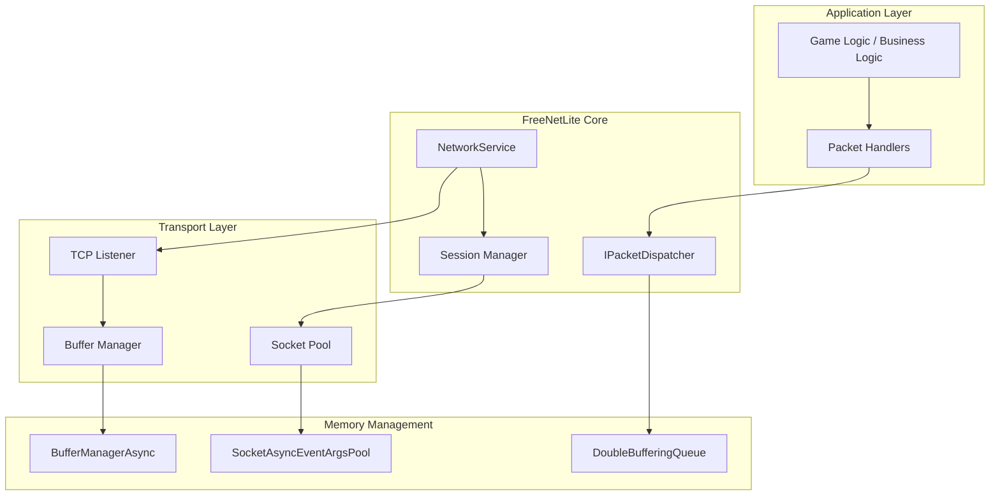

### 레이어별 역할
**Application Layer**
- 게임 로직이나 비즈니스 로직이 위치
- 패킷 핸들러를 통해 네트워크 이벤트를 처리

**FreeNetLite Core**
- NetworkService: 메인 네트워크 서비스 관리
- IPacketDispatcher: 패킷 처리 인터페이스
- Session Manager: 클라이언트 연결 생명주기 관리

**Transport Layer**
- TCP 연결 수락 및 관리
- 소켓 풀링 및 버퍼 관리

**Memory Management**
- 메모리 풀링을 통한 GC 압박 최소화
- 효율적인 버퍼 재사용
  

## 1.3 주요 설계 원칙 및 특징

### 1. 메모리 효율성
FreeNetLite는 메모리 할당을 최소화하고 GC 압박을 줄이기 위해 여러 기법을 사용한다:

```
Memory Pool Strategy
┌─────────────────────────────────────────────────────┐
│                                                     │
│  ┌──────────────┐    ┌──────────────┐               │
│  │   Buffer     │ ←→ │  EventArgs   │               │
│  │   Pool       │    │    Pool      │               │
│  └──────────────┘    └──────────────┘               │
│         ↓                    ↓                      │
│  ┌──────────────┐    ┌──────────────┐               │
│  │ Pre-allocated │    │ Reusable     │              │
│  │ Fixed-size    │    │ Objects      │              │
│  │ Buffers       │    │              │              │
│  └──────────────┘    └──────────────┘               │
│                                                     │
└─────────────────────────────────────────────────────┘
```

### 2. 비동기 I/O 패턴
모든 네트워크 작업은 비동기로 처리되어 스레드 블로킹을 방지한다:

```csharp
// 예시: 비동기 수신 패턴
if (!socket.ReceiveAsync(receiveArgs))
{
    // 동기적으로 완료된 경우 즉시 처리
    OnReceiveCompleted(this, receiveArgs);
}
```

### 3. 플러그인 아키텍처
IPacketDispatcher 인터페이스를 통해 다양한 패킷 처리 전략을 지원한다:

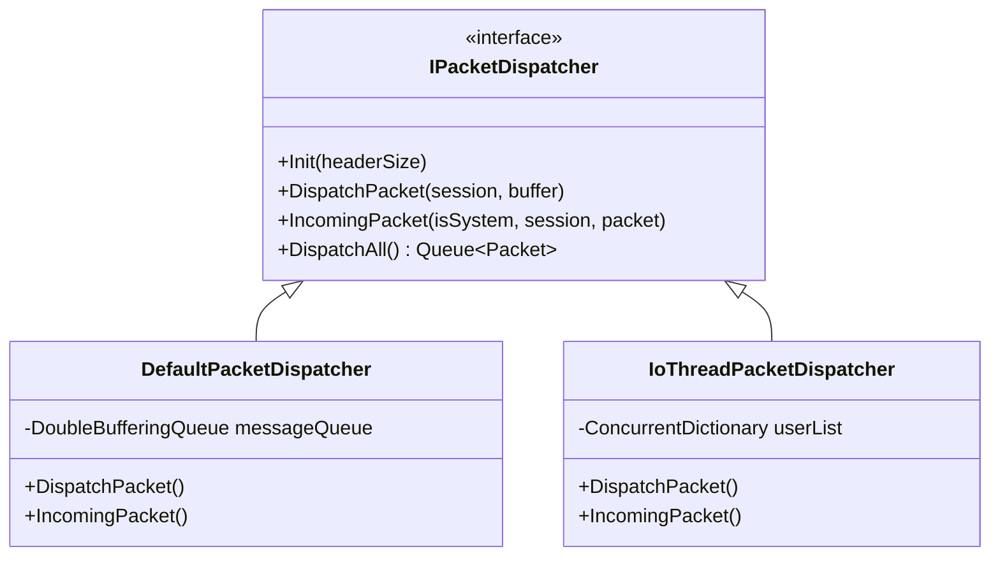

### 4. 스레드 안전성
동시성 제어를 위해 다음과 같은 전략을 사용한다:

- **Lock-free 구조**: ConcurrentQueue, ConcurrentBag 활용
- **원자적 연산**: Interlocked 클래스 사용
- **최소한의 락**: 필요한 경우에만 lock 사용

```
Thread Safety Model
┌─────────────────────────────────────────────────────┐
│                                                     │
│  I/O Thread Pool    │    Logic Thread Pool          │
│  ┌─────────────┐    │    ┌─────────────┐            │
│  │   Receive   │    │    │   Packet    │            │
│  │   Thread    │ ───┼───→│  Processing │            │
│  │             │    │    │   Thread    │            │
│  └─────────────┘    │    └─────────────┘            │
│                     │                               │
│  ┌─────────────┐    │    ┌─────────────┐            │
│  │    Send     │    │    │   Game      │            │
│  │   Thread    │ ←──┼────│   Logic     │            │
│  │             │    │    │   Thread    │            │
│  └─────────────┘    │    └─────────────┘            │
│                                                     │
└─────────────────────────────────────────────────────┘
        │                           │
        ▼                           ▼
┌─────────────┐           ┌─────────────┐
│ Lock-Free   │           │ Double      │
│ Collections │           │ Buffering   │
│             │           │ Queue       │
└─────────────┘           └─────────────┘
```
  
  
## 1.4 .NET 9.0 기반의 현대적 구현
FreeNetLite는 .NET 9.0의 최신 기능들을 적극적으로 활용한다:

### Modern C# Features

```csharp
// Record 타입을 활용한 불변 객체
public record ServerOption
{
    public int Port { get; init; } = 32451;
    public int MaxConnectionCount { get; init; } = 1000;
    // ...
}

// Primary Constructor 패턴
public class NetworkService(ServerOption serverOption, IPacketDispatcher packetDispatcher)
{
    public ServerOption ServerOpt { get; } = serverOption;
    public IPacketDispatcher PacketDispatcher { get; } = packetDispatcher;
}

// Nullable Reference Types
#nullable enable
public class Session
{
    public Socket? Sock { get; set; }
    public SocketAsyncEventArgs? ReceiveEventArgs { get; private set; }
}
```

### Memory 및 Span 활용
고성능 메모리 처리를 위해 Memory<T>와 Span<T>를 적극 활용한다:

```csharp
// 메모리 복사 없는 패킷 처리
public void DispatchPacket(Session session, ReadOnlyMemory<byte> buffer)
{
    var remainBuffer = buffer;
    while (remainBuffer.Length >= _headerSize)
    {
        var headerSpan = remainBuffer.Span;
        var packetSize = FastBinaryRead.UInt16(headerSpan);
        // Zero-copy 슬라이싱
        remainBuffer = remainBuffer[packetSize..];
    }
}
```

### 성능 최적화

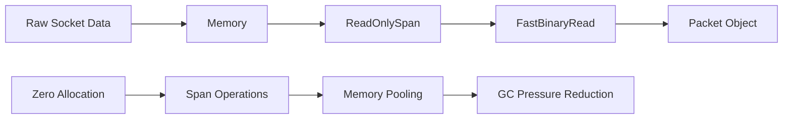

### 비동기 프로그래밍
.NET의 고급 비동기 패턴을 사용하여 확장성을 극대화한다:

```csharp
// ValueTask 활용 (메모리 할당 최소화)
public ValueTask<bool> SendAsync(ArraySegment<byte> data)
{
    if (!IsConnected())
        return ValueTask.FromResult(false);
        
    // 실제 비동기 작업 수행
    return PerformSendAsync(data);
}
```

이러한 현대적 구현을 통해 FreeNetLite는 높은 성능과 메모리 효율성을 달성하면서도 개발자 친화적인 API를 제공한다. 다음 섹션에서는 각 핵심 컴포넌트의 구체적인 구현과 사용법을 자세히 살펴볼 것이다.

-----    
  
# 2. 핵심 컴포넌트 분석
FreeNetLite의 핵심 컴포넌트들은 서로 유기적으로 연결되어 고성능 네트워크 통신을 가능하게 한다. 각 컴포넌트는 명확한 역할과 책임을 가지며, 확장성과 유지보수성을 고려하여 설계되었다.

## 2.1 NetworkService - 메인 네트워크 서비스
NetworkService는 FreeNetLite의 중심 클래스로, 모든 네트워크 관련 기능을 통합 관리한다.

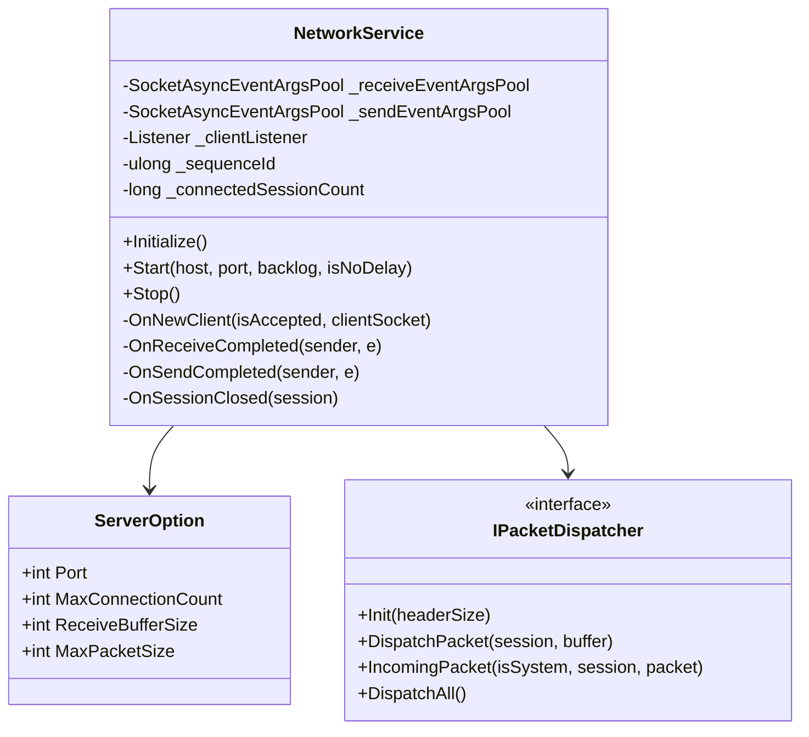

### 주요 역할

**1. 연결 관리**
```
Connection Lifecycle
┌─────────────────────────────────────────────────────────┐
│                                                         │
│  Client Connect                                         │
│      │                                                  │
│      ▼                                                  │
│  ┌─────────────┐    ┌─────────────┐    ┌─────────────┐  │
│  │   Accept    │───▶│   Session   │───▶│   Active   │  │
│  │   Socket    │    │   Create    │    │ Connection  │  │
│  └─────────────┘    └─────────────┘    └─────────────┘  │
│                                               │         │
│                                               ▼         │
│                     ┌─────────────┐    ┌─────────────┐  │
│                     │ Connection  │◀──│  Disconnect  │ │
│                     │   Closed    │    │   Event     │  │
│                     └─────────────┘    └─────────────┘  │
│                                                         │
└─────────────────────────────────────────────────────────┘
```

**2. 리소스 풀링**
NetworkService는 메모리 효율성을 위해 두 개의 이벤트 아규먼트 풀을 관리한다:

```csharp
public void Initialize()
{
    _receiveEventArgsPool.Init(ServerOpt.MaxConnectionCount, ServerOpt.ReceiveBufferSize);
    _sendEventArgsPool.Init(ServerOpt.MaxConnectionCount, 0); // Send는 동적 할당

    for (int i = 0; i < ServerOpt.MaxConnectionCount; i++)
    {
        var receiveArg = new SocketAsyncEventArgs();
        receiveArg.Completed += OnReceiveCompleted;
        _receiveEventArgsPool.Allocate(receiveArg);

        var sendArg = new SocketAsyncEventArgs();
        sendArg.Completed += OnSendCompleted;
        _sendEventArgsPool.Push(sendArg);
    }
}
```

**3. 비동기 이벤트 처리**

```
Event Flow Diagram
┌─────────────────────────────────────────────────────────┐
│                                                         │
│   Socket Events          NetworkService                 │
│                                                         │
│  ┌─────────────┐         ┌─────────────┐                │
│  │   Accept    │────────▶│ OnNewClient │                │
│  │   Event     │         │             │                │
│  └─────────────┘         └─────────────┘                │
│                                    │                    │
│  ┌─────────────┐         ┌─────────────┐                │
│  │   Receive   │────────▶│OnReceive    │               │
│  │   Event     │         │Completed    │                │
│  └─────────────┘         └─────────────┘                │
│                                    │                    │
│  ┌─────────────┐         ┌─────────────┐                │
│  │    Send     │────────▶│  OnSend     │               │
│  │   Event     │         │ Completed   │                │
│  └─────────────┘         └─────────────┘                │
│                                                         │
└─────────────────────────────────────────────────────────┘
```

### 세션 생성 및 관리
새로운 클라이언트 연결이 수락되면 다음 과정을 거친다:

```csharp
private void OnNewClient(bool isAccepted, Socket clientSocket)
{
    // 연결된 세션 수 증가
    Interlocked.Increment(ref _connectedSessionCount);

    // 고유 ID 생성
    var uniqueId = MakeSequenceIdForSession();
    var session = new Session(true, uniqueId, PacketDispatcher, ServerOpt);
    
    // 이벤트 핸들러 등록
    session.OnEventSessionClosed += OnSessionClosed;

    // 리소스 할당
    var receiveArgs = _receiveEventArgsPool.Pop();
    var sendArgs = _sendEventArgsPool.Pop();
    
    session.SetEventArgs(receiveArgs, sendArgs);
    session.OnConnected();
    
    // 비동기 수신 시작
    BeginReceive(clientSocket, receiveArgs, sendArgs);
}
```

## 2.2 Session - 클라이언트 연결 관리
Session 클래스는 개별 클라이언트 연결을 나타내며, 연결 상태 관리와 데이터 송수신을 담당한다.

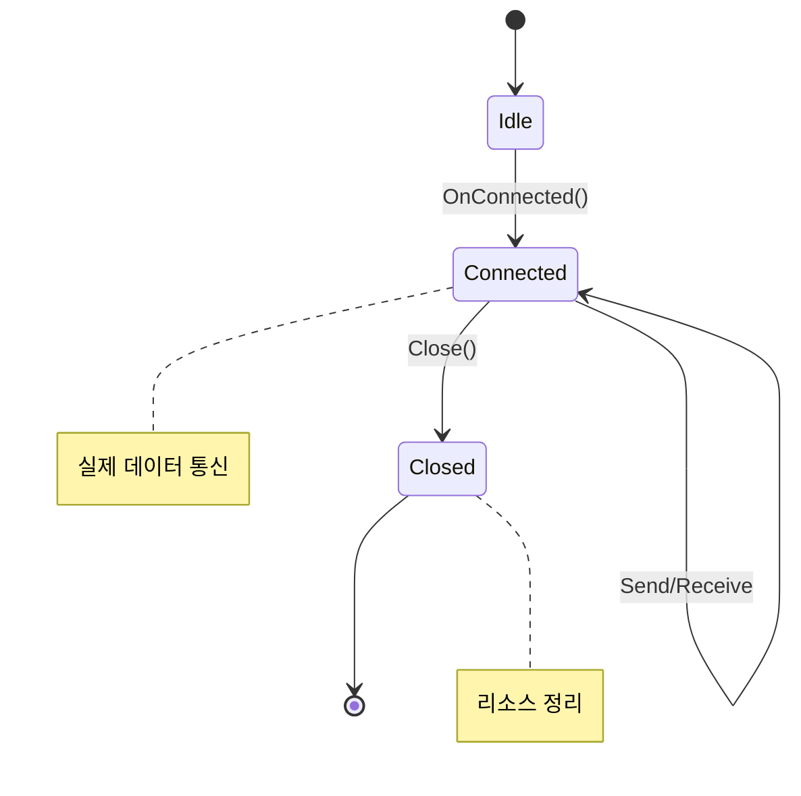

### 세션 상태 관리
Session은 내부적으로 상태를 관리하여 스레드 안전성을 보장한다:

```csharp
private enum State { Idle, Connected, Closed }
private int _currentState = (int)State.Idle;

public void OnConnected()
{
    if (Interlocked.CompareExchange(ref _currentState, 
        (int)State.Connected, (int)State.Idle) != (int)State.Idle)
        return;

    // 시스템 연결 알림 패킷 생성
    var connectedPacket = new Packet(this, NetworkDefine.SysNtfConnected, null);
    _dispatcher.IncomingPacket(true, this, connectedPacket);
}
```

### 데이터 송신 메커니즘
Session의 송신 시스템은 큐 기반으로 동작하며, 한 번에 하나의 송신만 허용하여 순서를 보장한다:

```
Send Queue Architecture
┌─────────────────────────────────────────────────────────┐
│                                                         │
│   Application Thread         Send Thread                │
│                                                         │
│  ┌─────────────┐             ┌─────────────┐            │
│  │    Send     │───────────▶│ Enqueue to  │            │
│  │   Request   │             │SendingQueue │            │
│  └─────────────┘             └─────────────┘           │
│                                      │                 │
│                               ┌─────────────┐          │
│                               │    Start    │          │
│                               │    Send     │          │
│                               └─────────────┘          │
│                                      │                 │
│                               ┌─────────────┐          │
│                               │   Socket    │          │
│                               │  SendAsync  │          │
│                               └─────────────┘          │
│                                      │                 │
│                               ┌─────────────┐          │
│                               │ OnSendComp- │          │
│                               │    leted    │          │
│                               └─────────────┘          │
│                                                        │
└────────────────────────────────────────────────────────┘
```

```csharp
public void Send(ArraySegment<byte> packetData)
{
    if (!IsConnected()) return;

    _sendingQueue.Enqueue(packetData);

    // 원자적으로 송신 상태 변경 (false->true)
    if (Interlocked.CompareExchange(ref _sending, 1, 0) == 0)
    {
        StartSend();
    }
}

private void StartSend()
{
    var sendingList = new List<ArraySegment<byte>>();
    
    // 큐에서 데이터를 가져와 배치 송신 준비
    while (_sendingQueue.TryDequeue(out var data))
    {
        sendingList.Add(data);
        if (sendingList.Sum(s => s.Count) >= ServerOpt.MaxPacketSize)
            break;
    }

    if (sendingList.Count > 0)
    {
        SendEventArgs.BufferList = sendingList;
        if (!Sock.SendAsync(SendEventArgs))
        {
            ProcessSend(SendEventArgs);
        }
    }
}
```
  

## 2.3 Packet - 패킷 구조 및 처리
Packet은 네트워크를 통해 전송되는 데이터의 표준 형태를 정의한다.

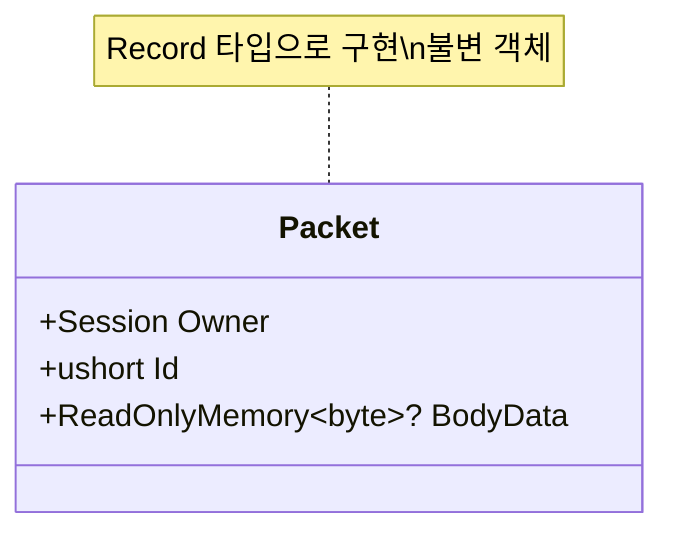

### 패킷 구조
FreeNetLite의 패킷은 간단하면서도 효율적인 구조를 가진다:

```
Packet Structure
┌─────────────────────────────────────────────────────────┐
│                    네트워크 패킷                          │
│                                                         │
│  ┌─────────────┐  ┌─────────────┐  ┌─────────────────┐  │
│  │   Length    │  │  Packet ID  │  │   Body Data     │  │
│  │ (2 bytes)   │  │ (2 bytes)   │  │ (Variable)      │  │
│  └─────────────┘  └─────────────┘  └─────────────────┘  │
│                                                         │
│  ◄────── Header (4 bytes) ──────►  ◄── Body ──────►     │
│                                                         │
└─────────────────────────────────────────────────────────┘
```

### Record 타입의 장점
Packet을 record로 정의함으로써 얻는 이점들:

```csharp
// 불변 객체로 스레드 안전성 보장
public record Packet(Session Owner, ushort Id, ReadOnlyMemory<byte>? BodyData);

// 자동으로 생성되는 메서드들:
// - Equals, GetHashCode (값 기반 비교)
// - ToString (디버깅에 유용)
// - Deconstruct (패턴 매칭 지원)

// 패턴 매칭 활용 예제
var result = packet switch
{
    { Id: NetworkDefine.SysNtfConnected } => "연결됨",
    { Id: NetworkDefine.SysNtfClosed } => "연결 해제",
    { Id: var id } when id > NetworkDefine.SysNtfMax => "사용자 패킷",
    _ => "알 수 없는 패킷"
};
```

### 메모리 효율적인 바디 데이터 처리
패킷의 바디 데이터는 ReadOnlyMemory<byte>?를 사용하여 메모리 복사를 최소화한다:

```csharp
// 패킷 생성 시 메모리 슬라이싱 (복사 없음)
var bodySize = packetSize - _headerSize;
ReadOnlyMemory<byte>? bodyData = bodySize > 0
    ? remainBuffer.Slice(_headerSize, bodySize)
    : null;

var packet = new Packet(session, packetId, bodyData);
```
  

## 2.4 IPacketDispatcher 인터페이스와 구현체들
IPacketDispatcher는 패킷 처리 전략을 추상화한 인터페이스로, 다양한 처리 방식을 지원한다.

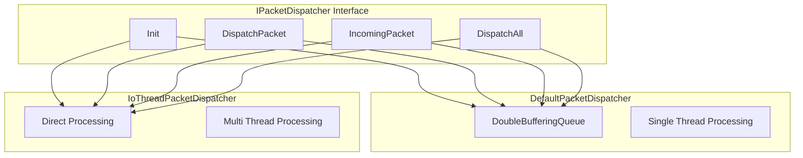

### 인터페이스 정의

```csharp
public interface IPacketDispatcher
{
    /// <summary>
    /// 패킷 디스패처를 초기화한다
    /// </summary>
    void Init(ushort headerSize);

    /// <summary>
    /// 수신된 버퍼를 파싱하여 완전한 패킷들을 처리한다
    /// </summary>
    void DispatchPacket(Session session, ReadOnlyMemory<byte> buffer);

    /// <summary>
    /// 시스템 또는 사용자로부터의 패킷을 수신 큐에 추가한다
    /// </summary>
    void IncomingPacket(bool isSystem, Session user, Packet packet);

    /// <summary>
    /// 처리할 모든 패킷을 큐에서 가져온다
    /// </summary>
    Queue<Packet> DispatchAll();
}
```

### DefaultPacketDispatcher - 큐 기반 처리
DefaultPacketDispatcher는 이중 버퍼링 큐를 사용하여 I/O 스레드와 로직 스레드를 분리한다:

```
Default Packet Dispatcher Flow
┌─────────────────────────────────────────────────────────┐
│                                                         │
│   I/O Thread              Logic Thread                  │
│                                                         │
│  ┌─────────────┐         ┌─────────────┐                │
│  │   Receive   │         │   Game      │                │
│  │   Data      │         │   Logic     │                │
│  └─────────────┘         └─────────────┘                │
│        │                         ▲                      │
│        ▼                         │                      │
│  ┌─────────────┐         ┌─────────────┐                │
│  │   Parse     │         │ DispatchAll │                │
│  │   Packets   │         │             │                │
│  └─────────────┘         └─────────────┘                │
│        │                         ▲                      │
│        ▼                         │                      │
│  ┌─────────────┐         ┌─────────────┐                │
│  │ IncomingPkt │────────▶│DoubleBuffer │               │
│  │             │         │    Queue    │                │
│  └─────────────┘         └─────────────┘                │
│                                                         │
└─────────────────────────────────────────────────────────┘
```

### IoThreadPacketDispatcher - 직접 처리
IoThreadPacketDispatcher는 I/O 스레드에서 직접 패킷을 처리하여 지연시간을 최소화한다:

```csharp
public void IncomingPacket(bool IsSystem, Session user, Packet packet)
{
    if (!IsSystem && packet.Id <= NetworkDefine.SysNtfMax)
    {
        // 해킹 의심 - 연결 종료
        user.Close();
        return;
    }

    var protocol = (ProtocolId)packet.Id;
    
    switch (protocol)
    {
        case ProtocolId.Echo:
            ProcessEchoPacket(user, packet);
            break;
        default:
            if (!OnSystemPacket(packet))
            {
                Console.WriteLine($"Unknown protocol id {protocol}");
            }
            break;
    }
}
```

### 처리 방식 비교

```
Performance vs Complexity Trade-off
┌─────────────────────────────────────────────────────────┐
│                                                         │
│   DefaultPacketDispatcher    │  IoThreadPacketDispatcher│
│                              │                         │
│  ┌─────────────────────┐     │  ┌─────────────────────┐ │
│  │ + Thread Isolation  │     │  │ + Low Latency       │ │
│  │ + Safe Processing   │     │  │ + Direct Processing │ │
│  │ + Order Guarantee   │     │  │ - Thread Safety     │ │
│  │ - Higher Latency    │     │  │ - Complex Sync      │ │
│  └─────────────────────┘     │  └─────────────────────┘ │
│                               │                         │
│  Use Case:                    │  Use Case:              │
│  - Turn-based Games           │  - Real-time Games      │
│  - Chat Servers               │  - FPS Games            │
│  - Web Services               │  - High-freq Trading    │
│                               │                         │
└─────────────────────────────────────────────────────────┘
```

이러한 핵심 컴포넌트들의 유기적인 결합을 통해 FreeNetLite는 다양한 요구사항에 맞는 고성능 네트워크 솔루션을 제공한다. 각 컴포넌트는 독립적으로 테스트 가능하며, 필요에 따라 확장하거나 교체할 수 있는 유연한 구조를 가지고 있다.

-----  
  
# 3. 버퍼 및 메모리 관리
FreeNetLite의 성능 최적화에서 가장 중요한 부분은 메모리 관리다. 네트워크 라이브러리는 빈번한 메모리 할당과 해제로 인한 GC 압박이 성능에 큰 영향을 미치므로, FreeNetLite는 세 가지 핵심 메모리 관리 컴포넌트를 제공한다.

## 3.1 BufferManagerAsync - 비동기 버퍼 관리
BufferManagerAsync는 고정 크기 버퍼들을 미리 할당하고 재사용하여 메모리 할당 비용을 최소화하는 클래스다.

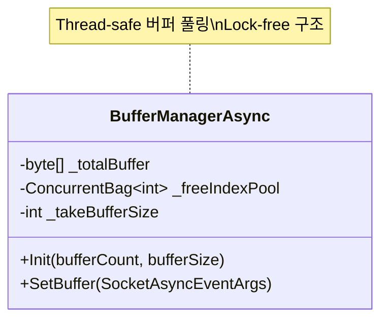

### 메모리 풀링 전략
BufferManagerAsync는 대용량 연속 메모리를 미리 할당하고 이를 고정 크기 청크로 분할하여 관리한다:

```
Memory Pool Architecture
┌─────────────────────────────────────────────────────────┐
│                   Total Buffer                          │
│  ┌────────────────────────────────────────────────────┐ │
│  │ ██████████████████████████████████████████████████ │ │
│  └────────────────────────────────────────────────────┘ │
│                            │                            │
│           분할              ▼                            │
│  ┌─────────┐ ┌─────────┐ ┌─────────┐ ┌─────────┐        │
│  │ Chunk 0 │ │ Chunk 1 │ │ Chunk 2 │ │   ...   │        │
│  │ 4096B   │ │ 4096B   │ │ 4096B   │ │         │        │
│  └─────────┘ └─────────┘ └─────────┘ └─────────┘        │
│       ▲           ▲           ▲                         │
│       │           │           │                         │
│  ┌────────────────────────────────────────────────────┐ │
│  │           Free Index Pool                          │ │
│  │    [0, 4096, 8192, 12288, 16384, ...]              │ │
│  └────────────────────────────────────────────────────┘ │
└─────────────────────────────────────────────────────────┘
```

### 초기화 과정

```csharp
public void Init(int bufferCount, int bufferSize)
{
    int TotalBytes = bufferCount * bufferSize;
    _takeBufferSize = bufferSize;
    _totalBuffer = new byte[TotalBytes];

    // 인덱스 풀 초기화
    var count = TotalBytes / _takeBufferSize;
    for (int i = 0; i < count; ++i)
    {
        _freeIndexPool.Add((i * _takeBufferSize));
    }
}
```

이 방식의 장점:
- **연속 메모리**: 캐시 지역성 향상
- **고정 크기**: 메모리 단편화 방지
- **사전 할당**: 런타임 할당 비용 제거

### 버퍼 할당 메커니즘
버퍼 할당은 lock-free 구조로 구현되어 있다:

```csharp
public bool SetBuffer(SocketAsyncEventArgs args)
{
    if (_freeIndexPool.TryTake(out int index))
    {
        args.SetBuffer(_totalBuffer, index, _takeBufferSize);
        return true;
    }
    return false;
}
```

```
Buffer Allocation Flow
┌─────────────────────────────────────────────────────────┐
│                                                         │
│  Application Request                                    │
│         │                                               │
│         ▼                                               │
│  ┌─────────────┐    Yes   ┌─────────────┐               │
│  │ TryTake()   │── ──────▶│ SetBuffer() │               │
│  │ from Pool   │          │ with Index  │               │
│  └─────────────┘          └─────────────┘               │
│         │                                               │
│         │ No                                            │
│         ▼                                               │
│  ┌─────────────┐                                        │
│  │   Return    │                                        │
│  │    False    │                                        │
│  └─────────────┘                                        │
│                                                         │
└─────────────────────────────────────────────────────────┘
```

## 3.2 SocketAsyncEventArgsPool - 이벤트 아규먼트 풀링
SocketAsyncEventArgsPool은 SocketAsyncEventArgs 객체들을 풀링하여 재사용하는 관리자다. 이 객체들은 비동기 소켓 작업에서 핵심적인 역할을 하며, 생성 비용이 높기 때문에 풀링이 필수적이다.

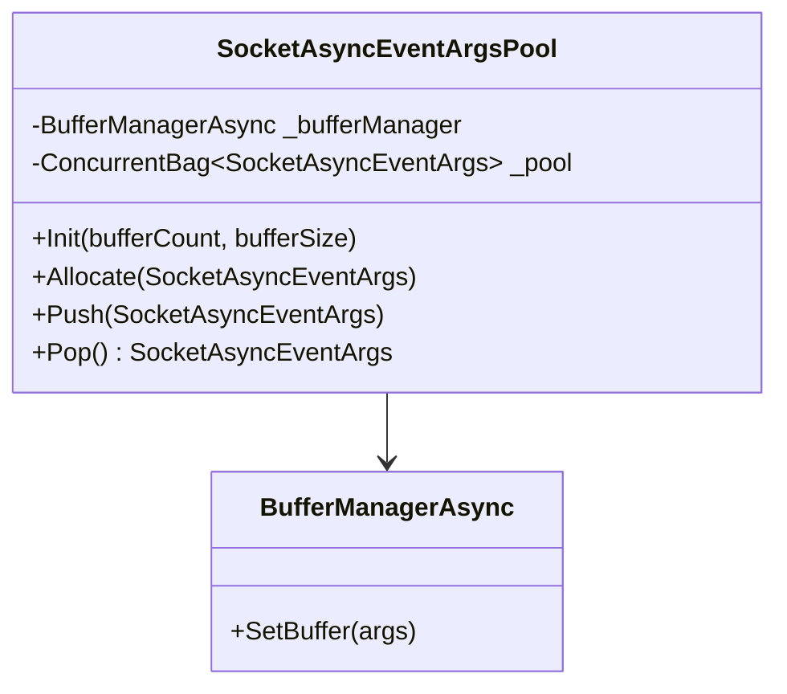

### 초기화와 버퍼 연결

```csharp
public void Init(int bufferCount, int bufferSize)
{
    _bufferManager = new BufferManagerAsync();
    _bufferManager.Init(bufferCount, bufferSize); 
}

public void Allocate(SocketAsyncEventArgs arg)
{
    _bufferManager.SetBuffer(arg);  // 버퍼를 아규먼트에 연결
    Push(arg);                      // 풀에 추가
}
```

### 풀링 메커니즘

```
EventArgs Pool Lifecycle
┌─────────────────────────────────────────────────────────┐
│                                                         │
│   Initialization Phase                                  │
│  ┌─────────────┐    ┌─────────────┐    ┌─────────────┐  │
│  │   Create    │───▶│   Attach    │───▶│   Push to  │  │
│  │ EventArgs   │    │   Buffer    │    │    Pool     │  │
│  └─────────────┘    └─────────────┘    └─────────────┘  │
│                                               │         │
│                                               │         │
│   Runtime Usage                               │         │
│  ┌─────────────┐    ┌─────────────┐    ┌─────▼─────┐    │
│  │   Pop()     │◀───│    Use      │◀───│   Pool   │    │
│  │  Request    │    │  EventArgs  │    │           │    │
│  └─────────────┘    └─────────────┘    └───────────┘    │
│         │                   │                           │
│         ▼                   │                           │
│  ┌─────────────┐            │                           │
│  │  EventArgs  │            │                           │
│  │ + Buffer    │            │                           │
│  │ Available   │            │                           │
│  └─────────────┘            │                           │
│                             │                           │
│                             ▼                           │
│  ┌─────────────┐    ┌─────────────┐                     │
│  │   Return    │◀──│   After     │                      │
│  │ to Pool     │    │   Usage     │                     │
│  └─────────────┘    └─────────────┘                     │
│                                                         │
└─────────────────────────────────────────────────────────┘
```

### 스레드 안전한 풀 구현
ConcurrentBag을 사용하여 lock-free 풀을 구현한다:

```csharp
public void Push(SocketAsyncEventArgs arg)
{
    _pool.Add(arg);  // Thread-safe 추가
}

public SocketAsyncEventArgs Pop()
{
    if (_pool.TryTake(out var result))
    {
        return result;
    }
    return null;  // 풀이 비어있음
}
```

## 3.3 DoubleBufferingQueue - 이중 버퍼링 큐
DoubleBufferingQueue는 I/O 스레드와 로직 스레드 간의 효율적인 데이터 전달을 위한 이중 버퍼링 구조다.

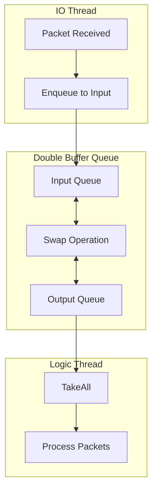

### 이중 버퍼링 개념
이중 버퍼링은 생산자(Producer)와 소비자(Consumer)를 효율적으로 분리하는 패턴이다:

```
Double Buffering Concept
┌─────────────────────────────────────────────────────────┐
│                                                         │
│   Time T1: IO Thread Writing                            │
│  ┌─────────────┐              ┌─────────────┐           │
│  │   Queue1    │ ◀── Write   │   Queue2    │            │
│  │  (Input)    │              │  (Output)   │ ◀── Read  │
│  └─────────────┘              └─────────────┘           │
│                                                         │
│   Time T2: After Swap                                   │
│  ┌─────────────┐              ┌─────────────┐           │
│  │   Queue1    │              │   Queue2    │ ◀── Write│
│  │  (Output)   │ ◀── Read    │  (Input)    │           │
│  └─────────────┘              └─────────────┘           │
│                                                         │
└─────────────────────────────────────────────────────────┘
```

### 구현 세부사항

```csharp
class DoubleBufferingQueue
{
    Queue<Packet> _queue1;
    Queue<Packet> _queue2;

    Queue<Packet> _refInput;   // 현재 입력용 큐
    Queue<Packet> _refOutput;  // 현재 출력용 큐

    private readonly Lock _lock = new Lock();

    public DoubleBufferingQueue()
    {
        _queue1 = new Queue<Packet>();
        _queue2 = new Queue<Packet>();
        _refInput = _queue1;
        _refOutput = _queue2;
    }
}
```

### Enqueue 동작
I/O 스레드에서 패킷을 입력 큐에 추가한다:

```csharp
public void Enqueue(Packet msg)
{
    lock (_lock)
    {
        _refInput.Enqueue(msg);
    }
}
```

### TakeAll과 Swap 동작
로직 스레드에서 모든 패킷을 가져가면서 큐를 교체한다:

```csharp
public Queue<Packet> TakeAll()
{
    swap();
    return _refOutput;  // 이전 입력 큐를 반환
}

void swap()
{
    lock (_lock)
    {
        var temp = _refInput;
        _refInput = _refOutput;   // 빈 큐가 새 입력큐가 됨
        _refOutput = temp;        // 데이터가 있는 큐가 출력큐가 됨
    }
}
```

### 성능 특성 분석

```
Performance Characteristics
┌─────────────────────────────────────────────────────────┐
│                                                         │
│   Benefits                    │   Trade-offs            │
│                               │                         │
│  ┌─────────────────────┐     │  ┌─────────────────────┐ │
│  │ + Minimal Locking   │     │  │ - Memory Overhead   │ │
│  │ + Batch Processing  │     │  │ - Latency Increase  │ │
│  │ + Thread Isolation  │     │  │ - Complex Logic     │ │
│  │ + High Throughput   │     │  │                     │ │
│  └─────────────────────┘     │  └─────────────────────┘ │
│                               │                         │
│   Use Cases:                  │   Alternatives:         │
│  - High packet rate           │  - Lock-free queue      │
│  - Batch processing           │  - Channel patterns     │
│  - Producer/Consumer          │  - Actor model          │
│                               │                         │
└─────────────────────────────────────────────────────────┘
```

### 메모리 관리 통합 예제
세 컴포넌트가 함께 동작하는 예제:

```csharp
// NetworkService 초기화에서
public void Initialize()
{
    // 1. EventArgs 풀 초기화 (버퍼 매니저 포함)
    _receiveEventArgsPool.Init(ServerOpt.MaxConnectionCount, 
                              ServerOpt.ReceiveBufferSize);
    
    // 2. EventArgs 객체 생성 및 풀에 추가
    for (int i = 0; i < ServerOpt.MaxConnectionCount; i++)
    {
        var receiveArg = new SocketAsyncEventArgs();
        receiveArg.Completed += OnReceiveCompleted;
        _receiveEventArgsPool.Allocate(receiveArg); // 버퍼 자동 연결
    }
    
    // 3. 패킷 디스패처의 이중 버퍼링 큐 초기화
    _packetDispatcher.Init(4); // 헤더 크기
}

// 런타임에서 메모리 재사용
private void OnNewClient(bool isAccepted, Socket clientSocket)
{
    var receiveArgs = _receiveEventArgsPool.Pop(); // 재사용
    var sendArgs = _sendEventArgsPool.Pop();       // 재사용
    
    // 세션에 할당된 버퍼는 미리 할당된 것을 재사용
    session.SetEventArgs(receiveArgs, sendArgs);
}
```

이러한 메모리 관리 전략을 통해 FreeNetLite는 다음을 달성한다:

- **GC 압박 최소화**: 런타임 할당 거의 제거
- **메모리 효율성**: 고정 크기 풀링으로 예측 가능한 메모리 사용
- **성능 최적화**: 캐시 지역성과 배치 처리를 통한 처리량 향상
- **스레드 안전성**: Lock-free 구조로 경합 최소화

-----    
  
# 4. 패킷 처리 시스템

## 4.1 DefaultPacketDispatcher - 기본 패킷 디스패처

### DefaultPacketDispatcher 개요

DefaultPacketDispatcher는 FreeNetLite의 기본 패킷 처리 구현체로, 수신된 데이터를 파싱하여 완전한 패킷들을 큐에 저장하고 별도의 로직 스레드에서 처리하는 방식을 사용합니다.

```
┌────────────────────────────────────────────────────────┐
│              DefaultPacketDispatcher                   │
├────────────────────────────────────────────────────────┤
│                                                        │
│  I/O Thread                    Logic Thread            │
│      │                              │                  │
│  ┌───▼───────┐                 ┌────▼─────┐            │
│  │ Receive   │                 │ Process  │            │
│  │ Raw Data  │                 │ Queue    │            │
│  └───┬───────┘                 └────▲─────┘            │
│      │                              │                  │
│  ┌───▼───────┐                      │                  │
│  │ Parse     │                      │                  │
│  │ Packets   │                      │                  │
│  └───┬───────┘                      │                  │
│      │                              │                  │
│  ┌───▼───────┐    DoubleBuffering   │                  │
│  │ Enqueue   │─────────Queue────────┘                  │
│  │ Complete  │                                         │
│  │ Packets   │                                         │
│  └───────────┘                                         │
└────────────────────────────────────────────────────────┘
```

### 패킷 파싱 로직

```csharp
public void DispatchPacket(Session session, ReadOnlyMemory<byte> buffer)
{
    var remainBuffer = buffer;

    while (remainBuffer.Length >= _headerSize)
    {
        var headerSpan = remainBuffer.Span;
        var packetSize = FastBinaryRead.UInt16(headerSpan);

        // 패킷이 완전히 도착했는지 확인
        if (packetSize > remainBuffer.Length)
        {
            break; // 완전한 패킷이 도착하지 않았습니다.
        }

        var packetId = FastBinaryRead.UInt16(headerSpan[2..]);

        var bodySize = packetSize - _headerSize;
        ReadOnlyMemory<byte>? bodyData = bodySize > 0
            ? remainBuffer.Slice(_headerSize, bodySize)
            : null;

        var packet = new Packet(session, packetId, bodyData);
        IncomingPacket(false, session, packet);

        // 다음 패킷으로 이동
        remainBuffer = remainBuffer[packetSize..];
    }
}
```

### 스트림 버퍼 처리 시나리오

```
시나리오 1: 완전한 패킷이 한 번에 도착
┌──────────────────────────────────────┐
│ [Header|Body] [Header|Body] [Remain] │
│    Packet1      Packet2      부족    │
└──────────────────────────────────────┘
                            ▲
                       다음 수신까지 대기

시나리오 2: 패킷이 분할되어 도착
첫 번째 수신: [Header|Bo]
두 번째 수신: [dy] [Header|Body]
               ▲     ▲
           완성됨   새로운 패킷
```

### DoubleBufferingQueue 활용

```csharp
public void IncomingPacket(bool isSystem, Session user, Packet packet)
{
    if (!isSystem && packet.Id <= NetworkDefine.SysNtfMax)
    {
        // 해킹 시도 감지: 클라이언트가 시스템 패킷 ID를 사용
        user.Close();
        return;
    }
    _messageQueue.Enqueue(packet);
}

public Queue<Packet> DispatchAll() => _messageQueue.TakeAll();
```

## 4.2 IoThreadPacketDispatcher - IO 스레드 패킷 처리

### 직접 처리 방식의 특징

IoThreadPacketDispatcher는 I/O 스레드에서 패킷을 즉시 처리하는 방식으로, 지연시간을 최소화하지만 복잡한 로직 처리 시 주의가 필요합니다.

```
┌─────────────────────────────────────────────────────┐
│           IoThreadPacketDispatcher                  │
├─────────────────────────────────────────────────────┤
│                                                     │
│  ┌─────────────┐    ┌─────────────┐                  │
│  │   Socket    │    │ Immediate   │                  │
│  │  Receive    │───►│ Processing  │                  │
│  │   Thread    │    │ (Same Thread│                  │
│  └─────────────┘    └─────────────┘                  │
│                            │                        │
│                     ┌──────▼──────┐                  │
│                     │   Direct    │                  │
│                     │  Response   │                  │
│                     └─────────────┘                  │
└─────────────────────────────────────────────────────┘
```

### 즉시 처리 구현

```csharp
public void IncomingPacket(bool IsSystem, Session user, Packet packet)
{
    if (IsSystem == false && (packet.Id <= NetworkDefine.SysNtfMax))
    {
        // 해킹 의심
        return;
    }

    var protocol = (ProtocolId)packet.Id;

    switch (protocol)
    {
        case ProtocolId.Echo:
            {
                if (packet.BodyData.HasValue)
                {
                    var bodySpan = packet.BodyData.Value.Span;

                    var requestPkt = new EchoPacket();
                    requestPkt.Decode(bodySpan);
                    Console.WriteLine($"text {requestPkt.Data}");

                    var responsePkt = new EchoPacket();
                    var packetData = responsePkt.ToPacket(ProtocolId.Echo, bodySpan.ToArray());
                    packet.Owner.Send(new ArraySegment<byte>(packetData));
                }
            }
            break;
        default:
            if (OnSystemPacket(packet) == false)
            {
                Console.WriteLine("Unknown protocol id " + protocol);
            }
            break;
    }
}
```

### 사용자 관리 시스템

```csharp
bool OnSystemPacket(Packet packet)
{
    var session = packet.Owner;

    switch (packet.Id)
    {
        case NetworkDefine.SysNtfConnected:
            Console.WriteLine("SYS_NTF_CONNECTED : " + session.UniqueId);
            var user = new GameUser(session);
            _userList.TryAdd(session.UniqueId, user);
            return true;

        case NetworkDefine.SysNtfClosed:
            Console.WriteLine("SYS_NTF_CLOSED : " + session.UniqueId);
            _userList.TryRemove(session.UniqueId, out _);
            return true;
    }
    return false;
}
```

### 두 방식의 성능 비교

```
DefaultPacketDispatcher (큐 기반)
───────────────────────────────────────
장점:
• 로직 스레드와 I/O 스레드 분리
• 복잡한 게임 로직 처리에 적합
• 부하 분산 및 확장성 좋음

단점:
• 추가 메모리 사용 (큐)
• 패킷 처리 지연시간 증가
• 스레드 간 컨텍스트 스위칭 비용

IoThreadPacketDispatcher (직접 처리)
────────────────────────────────────────
장점:
• 최소 지연시간
• 메모리 사용량 적음
• 단순한 구조

단점:
• 복잡한 로직 시 I/O 블로킹 위험
• 스케일링 제한
• 에러 발생 시 전체 영향
```

## 4.3 패킷 파싱 및 헤더 처리

### 패킷 헤더 구조

FreeNetLite는 간단하고 효율적인 헤더 구조를 사용합니다:

```
┌─────────────────────────────────────────┐
│            Packet Header                │
├─────────────┬───────────────────────────┤
│ Offset      │ Field        │ Size       │
├─────────────┼──────────────┼───────────┤
│ 0           │ PacketSize   │ 2 bytes    │
│ 2           │ PacketID     │ 2 bytes    │
├─────────────┴──────────────┴───────────┤
│ Total Header Size: 4 bytes              │
└─────────────────────────────────────────┘

패킷 전체 구조:
┌────────┬─────────────────────────────┐
│ Header │         Body Data           │
│ 4 bytes│      Variable Length       │
└────────┴─────────────────────────────┘
```

### 헤더 파싱 최적화

```csharp
// 고성능 헤더 읽기
var headerSpan = remainBuffer.Span;
var packetSize = FastBinaryRead.UInt16(headerSpan);      // [0:2]
var packetId = FastBinaryRead.UInt16(headerSpan[2..]);   // [2:4]

// 바디 데이터 슬라이싱 (복사 없음)
var bodySize = packetSize - _headerSize;
ReadOnlyMemory<byte>? bodyData = bodySize > 0
    ? remainBuffer.Slice(_headerSize, bodySize)
    : null;
```

### 패킷 경계 처리

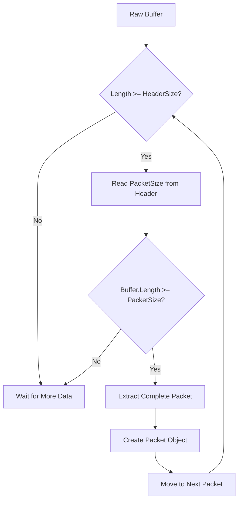

### 스트림 버퍼 처리의 복잡성

```
케이스 1: 정확히 패킷 단위로 도착
Buffer: [Packet1][Packet2][Packet3]
        ↓       ↓       ↓
       파싱    파싱    파싱

케이스 2: 패킷이 잘려서 도착
Buffer1: [Packet1][Pac...
Buffer2: ...ket2][Packet3]
         ↓
    경계 처리 필요

케이스 3: 여러 패킷이 합쳐져서 도착
Buffer: [Header1|Body1|Header2|Body2|Partial3...]
        └── Complete ──┘└── Complete ──┘└─ Wait ─┘
```

## 4.4 시스템 패킷 vs 사용자 패킷

### 패킷 ID 범위 정의

NetworkDefine 클래스에서 시스템 패킷의 범위를 정의합니다:

```csharp
public static class NetworkDefine
{
    public const ushort SysNtfConnected = 1;
    public const ushort SysNtfClosed = 2;
    public const ushort SysStartHeartbeat = 3;

    /// <summary>
    /// 시스템 패킷 ID의 최대값입니다. 이 값 이하의 ID는 클라이언트에서 전송할 수 없습니다.
    /// </summary>
    public const ushort SysNtfMax = 100;
}
```

### 시스템 패킷 범위 보안

```
┌─────────────────────────────────────────────────┐
│              Packet ID Security                 │
├─────────────────────────────────────────────────┤
│                                                 │
│ System Range: 1 ~ 100                           │
│ ┌─────────────────────────────────────────────┐ │
│ │ Only Server Can Generate                    │ │
│ │ • SysNtfConnected (1)                       │ │
│ │ • SysNtfClosed (2)                          │ │
│ │ • SysStartHeartbeat (3)                     │ │
│ └─────────────────────────────────────────────┘ │
│                                                 │
│ User Range: 101 ~ 65535                         │
│ ┌─────────────────────────────────────────────┐ │
│ │ Client Can Send                             │ │
│ │ • Game Protocol (101+)                      │ │
│ │ • Business Logic                            │ │
│ └─────────────────────────────────────────────┘ │
└─────────────────────────────────────────────────┘
```

### 보안 검증 로직

```csharp
public void IncomingPacket(bool isSystem, Session user, Packet packet)
{
    if (!isSystem && packet.Id <= NetworkDefine.SysNtfMax)
    {
        // TODO: Log hacking attempt
        user.Close(); // 비정상적인 접근 시 연결을 종료합니다.
        return;
    }
    _messageQueue.Enqueue(packet);
}
```

### 시스템 패킷의 생명주기

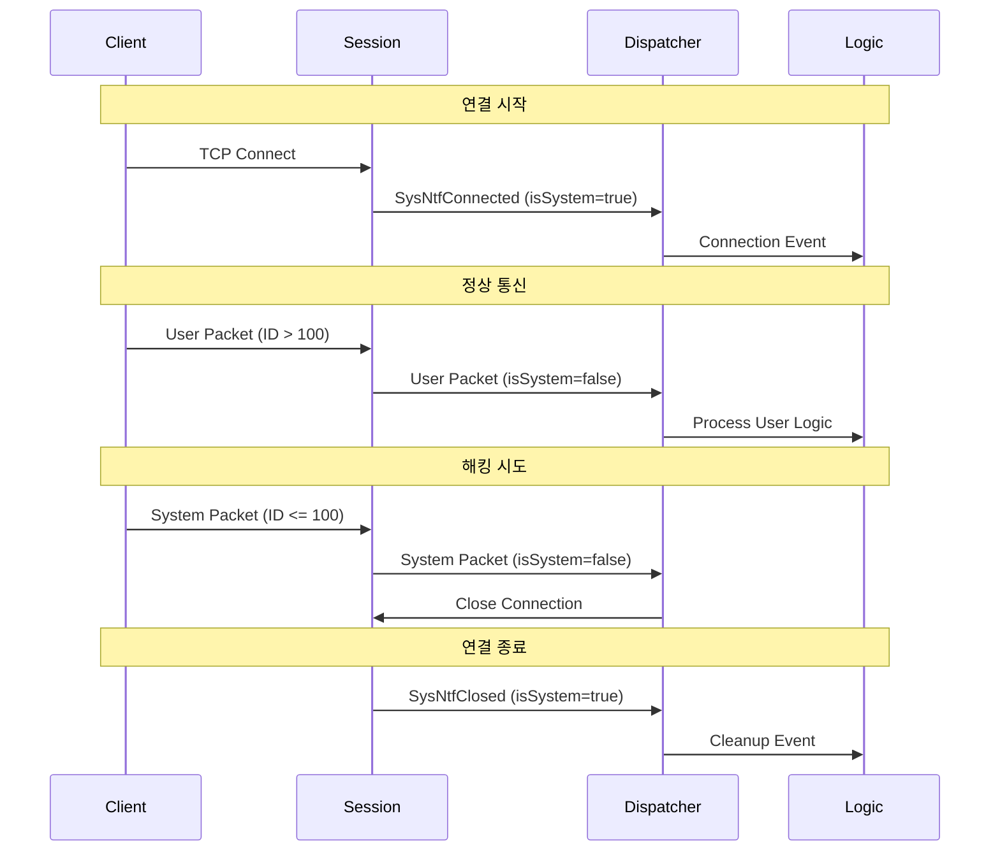

### Session의 패킷 생성

**연결 시 시스템 패킷 생성**
```csharp
public void OnConnected()
{
    if (Interlocked.CompareExchange(ref _currentState, 
        (int)State.Connected, (int)State.Idle) != (int)State.Idle)
        return;

    var connectedPacket = new Packet(this, NetworkDefine.SysNtfConnected, null);
    _dispatcher.IncomingPacket(true, this, connectedPacket);
}
```

**연결 종료 시 시스템 패킷 생성**
```csharp
public void Close()
{
    if (Interlocked.Exchange(ref _currentState, (int)State.Closed) == (int)State.Closed)
        return;

    try
    {
        Sock?.Shutdown(SocketShutdown.Both);
    }
    finally
    {
        Sock?.Close();
        Sock = null;
        
        var closedPacket = new Packet(this, NetworkDefine.SysNtfClosed, null);
        _dispatcher.IncomingPacket(true, this, closedPacket);
    }
}
```

### 패킷 처리 파이프라인

```
Input Stream → Header Parse → Security Check → Queue/Process → Business Logic
     ↓              ↓             ↓              ↓              ↓
Raw TCP Data    PacketSize    System/User    Route to       Game Logic
                PacketID      Validation     Handler        Processing
```

### 에러 처리 및 복구 메커니즘

**불완전한 패킷 처리**
```csharp
while (remainBuffer.Length >= _headerSize)
{
    var packetSize = FastBinaryRead.UInt16(remainBuffer.Span);
    
    // 패킷이 완전히 도착하지 않은 경우
    if (packetSize > remainBuffer.Length)
    {
        // 현재 버퍼에서 처리 중단
        // 다음 수신 시 remainBuffer와 새 데이터가 합쳐짐
        break;
    }
    
    // 패킷 크기 검증
    if (packetSize < _headerSize || packetSize > MaxPacketSize)
    {
        // 잘못된 패킷으로 판단하여 연결 종료
        session.Close();
        return;
    }
    
    // 정상 패킷 처리 계속
}
```

### 패킷 처리 성능 메트릭

```csharp
public class PacketMetrics
{
    private long _totalPacketsProcessed;
    private long _systemPacketsProcessed;
    private long _userPacketsProcessed;
    private long _invalidPacketsReceived;
    
    public void RecordPacketProcessed(bool isSystem, bool isValid)
    {
        Interlocked.Increment(ref _totalPacketsProcessed);
        
        if (!isValid)
        {
            Interlocked.Increment(ref _invalidPacketsReceived);
            return;
        }
        
        if (isSystem)
            Interlocked.Increment(ref _systemPacketsProcessed);
        else
            Interlocked.Increment(ref _userPacketsProcessed);
    }
    
    public void PrintStatistics()
    {
        Console.WriteLine($"""
            Packet Statistics:
            ├─ Total Processed: {_totalPacketsProcessed:N0}
            ├─ System Packets:  {_systemPacketsProcessed:N0}
            ├─ User Packets:    {_userPacketsProcessed:N0}
            └─ Invalid Packets: {_invalidPacketsReceived:N0}
            """);
    }
}
```

### 커스텀 패킷 검증 시스템

```csharp
public interface IPacketValidator
{
    bool ValidatePacket(Session session, ushort packetId, ReadOnlyMemory<byte>? bodyData);
}

public class GamePacketValidator : IPacketValidator
{
    private readonly Dictionary<ushort, PacketValidationRule> _rules = new();
    
    public GamePacketValidator()
    {
        // 패킷별 검증 규칙 정의
        _rules[101] = new PacketValidationRule
        {
            MinBodySize = 1,
            MaxBodySize = 1024,
            RequiredState = PlayerState.Connected
        };
        
        _rules[2003] = new PacketValidationRule // Character Move
        {
            MinBodySize = 8, // X, Y 좌표 (4 + 4 bytes)
            MaxBodySize = 16,
            RequiredState = PlayerState.InGame,
            RateLimit = TimeSpan.FromMilliseconds(100) // 초당 10회 제한
        };
    }
    
    public bool ValidatePacket(Session session, ushort packetId, ReadOnlyMemory<byte>? bodyData)
    {
        if (!_rules.TryGetValue(packetId, out var rule))
        {
            return true; // 규칙이 없으면 통과
        }
        
        // 크기 검증
        var bodySize = bodyData?.Length ?? 0;
        if (bodySize < rule.MinBodySize || bodySize > rule.MaxBodySize)
        {
            return false;
        }
        
        // 상태 검증
        var gameUser = GetGameUser(session);
        if (gameUser?.State != rule.RequiredState)
        {
            return false;
        }
        
        // 속도 제한 검증
        if (rule.RateLimit.HasValue)
        {
            return CheckRateLimit(session, packetId, rule.RateLimit.Value);
        }
        
        return true;
    }
}
```

### 통합 패킷 디스패처

```csharp
public class UnifiedPacketDispatcher : IPacketDispatcher
{
    private readonly IPacketValidator _validator;
    private readonly Dictionary<PacketCategory, IPacketHandler> _handlers;
    
    public void DispatchPacket(Session session, ReadOnlyMemory<byte> buffer)
    {
        var remainBuffer = buffer;

        while (remainBuffer.Length >= _headerSize)
        {
            var headerSpan = remainBuffer.Span;
            var packetSize = FastBinaryRead.UInt16(headerSpan);
            var packetId = FastBinaryRead.UInt16(headerSpan[2..]);

            if (packetSize > remainBuffer.Length) break;

            var bodyData = remainBuffer.Slice(_headerSize, packetSize - _headerSize);
            
            // 패킷 검증
            if (!_validator.ValidatePacket(session, packetId, bodyData))
            {
                LogSecurityEvent(session, packetId, "Validation Failed");
                session.Close();
                return;
            }

            var packet = new Packet(session, packetId, bodyData);
            
            // 카테고리별 핸들러로 라우팅
            var category = GetPacketCategory(packetId);
            if (_handlers.TryGetValue(category, out var handler))
            {
                handler.ProcessPacket(packet);
            }

            remainBuffer = remainBuffer[packetSize..];
        }
    }
    
    private PacketCategory GetPacketCategory(ushort packetId)
    {
        return packetId switch
        {
            >= 1 and <= 100 => PacketCategory.System,
            >= 1001 and <= 1999 => PacketCategory.Authentication,
            >= 2001 and <= 2999 => PacketCategory.Character,
            >= 3001 and <= 3999 => PacketCategory.Social,
            >= 4001 and <= 4999 => PacketCategory.Battle,
            _ => PacketCategory.Unknown
        };
    }
}
```

### 디버그용 패킷 덤프

```csharp
public static class PacketDebugger
{
    public static void DumpPacket(Packet packet, string prefix = "")
    {
        Console.WriteLine($"{prefix}┌─── Packet Dump ───");
        Console.WriteLine($"{prefix}│ Session: {packet.Owner.UniqueId}");
        Console.WriteLine($"{prefix}│ ID: {packet.Id} (0x{packet.Id:X4})");
        Console.WriteLine($"{prefix}│ Body Size: {packet.BodyData?.Length ?? 0} bytes");
        
        if (packet.BodyData.HasValue)
        {
            Console.WriteLine($"{prefix}│ Body Data:");
            DumpHexData(packet.BodyData.Value.Span, prefix + "│   ");
        }
        
        Console.WriteLine($"{prefix}└─────────────────────");
    }
    
    private static void DumpHexData(ReadOnlySpan<byte> data, string prefix)
    {
        const int bytesPerLine = 16;
        
        for (int i = 0; i < data.Length; i += bytesPerLine)
        {
            var line = data.Slice(i, Math.Min(bytesPerLine, data.Length - i));
            
            // 16진수 출력
            var hex = string.Join(" ", line.ToArray().Select(b => $"{b:X2}"));
            
            // ASCII 출력
            var ascii = string.Join("", line.ToArray().Select(b => 
                (b >= 32 && b < 127) ? (char)b : '.'));
            
            Console.WriteLine($"{prefix}{i:X4}: {hex,-47} |{ascii}|");
        }
    }
}
```

이러한 패킷 처리 시스템을 통해 FreeNetLite는 안정적이고 확장 가능한 네트워크 통신을 제공합니다.
  
-----   
  
이러한 패킷 처리 시스템을 통해 FreeNetLite는 안정적이고 확장 가능한 네트워크 통신을 제공합니다.

# 5. 바이너리 직렬화

## 5.1 FastBinaryRead - 고성능 바이너리 읽기

### FastBinaryRead 설계 철학

FreeNetLite의 FastBinaryRead 클래스는 네트워크 통신에서 성능이 중요한 바이너리 데이터 읽기 작업을 최적화한 구현체입니다. .NET 9.0의 최신 API를 활용하여 메모리 복사를 최소화하고 타입 안전성을 보장합니다.

```
┌─────────────────────────────────────────────────────┐
│               FastBinaryRead                        │
├─────────────────────────────────────────────────────┤
│                                                     │
│ ReadOnlySpan<byte> ──► Direct Memory Access         │
│         │                      │                    │
│         ▼                      ▼                    │
│  Zero-Copy Read         Type-Safe Conversion        │
│                                │                    │
│                                ▼                    │
│                         Native Performance          │
└─────────────────────────────────────────────────────┘
```

### 기본 타입 읽기 메소드

```csharp
public class FastBinaryRead
{
    // 1바이트 타입들
    public static bool Boolean(ReadOnlySpan<byte> span)
    {
        return span[0] != 0;
    }

    public static byte Byte(ReadOnlySpan<byte> span)
    {
        return span[0];
    }

    public static sbyte SByte(ReadOnlySpan<byte> span)
    {
        return (sbyte)span[0];
    }

    // 다중 바이트 타입들 - Little Endian 방식
    public static ushort UInt16(ReadOnlySpan<byte> span)
    {
        return BinaryPrimitives.ReadUInt16LittleEndian(span);
    }

    public static uint UInt32(ReadOnlySpan<byte> span)
    {
        return BinaryPrimitives.ReadUInt32LittleEndian(span);
    }

    public static ulong UInt64(ReadOnlySpan<byte> span)
    {
        return BinaryPrimitives.ReadUInt64LittleEndian(span);
    }
}
```

### 부동소수점 및 복합 타입 처리

```csharp
// 부동소수점 - 직접 메모리 매핑
public static float Single(ReadOnlySpan<byte> span)
{
    return MemoryMarshal.Read<float>(span);
}

public static double Double(ReadOnlySpan<byte> span)
{
    return MemoryMarshal.Read<double>(span);
}

// 문자열 - UTF8 인코딩
public static string String(ReadOnlySpan<byte> span)
{
    return Encoding.UTF8.GetString(span);
}

// 바이트 배열 - 슬라이싱
public static ReadOnlySpan<byte> Bytes(ReadOnlySpan<byte> span, int count)
{
    return span.Slice(0, count);
}
```

### 메모리 레이아웃과 엔디안 처리

```
Little Endian 바이트 순서 (x86/x64):
┌─────────────────────────────────────────────────┐
│ UInt32 값: 0x12345678                           │
├─────────────────────────────────────────────────┤
│ 메모리 배치:                                    │
│ [0x78] [0x56] [0x34] [0x12]                     │
│  LSB    ↑      ↑      MSB                       │
│         │      │                                │
│    낮은 주소  높은 주소                          │
└─────────────────────────────────────────────────┘

BinaryPrimitives.ReadUInt32LittleEndian():
Input:  [0x78] [0x56] [0x34] [0x12]
Output: 0x12345678 (올바른 값)
```

### 실제 사용 예제

```csharp
// 패킷 헤더 파싱 예제
public void ParsePacketHeader(ReadOnlySpan<byte> headerData)
{
    var packetSize = FastBinaryRead.UInt16(headerData);           // [0:2]
    var packetId = FastBinaryRead.UInt16(headerData[2..]);        // [2:4]
    
    Console.WriteLine($"Packet Size: {packetSize}, ID: {packetId}");
}

// 게임 데이터 파싱 예제
public void ParseCharacterData(ReadOnlySpan<byte> data)
{
    var offset = 0;
    
    var characterId = FastBinaryRead.UInt32(data[offset..]);
    offset += 4;
    
    var positionX = FastBinaryRead.Single(data[offset..]);
    offset += 4;
    
    var positionY = FastBinaryRead.Single(data[offset..]);
    offset += 4;
    
    var level = FastBinaryRead.UInt16(data[offset..]);
    offset += 2;
    
    var nameLength = FastBinaryRead.Byte(data[offset..]);
    offset += 1;
    
    var characterName = FastBinaryRead.String(data.Slice(offset, nameLength));
    
    Console.WriteLine($"Character: {characterName} (ID: {characterId}, Level: {level}, Pos: {positionX}, {positionY})");
}
```

## 5.2 FastBinaryWrite - 고성능 바이너리 쓰기

### FastBinaryWrite 구조

FastBinaryWrite는 바이너리 데이터를 효율적으로 직렬화하는 클래스로, 읽기와 대칭적인 구조를 가집니다.

```
┌─────────────────────────────────────────────────────┐
│               FastBinaryWrite                       │
├─────────────────────────────────────────────────────┤
│                                                     │
│ C# Value Types ──► Span<byte> Write                 │
│         │                      │                    │
│         ▼                      ▼                    │
│  Type Validation         Direct Memory Write        │
│                                │                    │
│                                ▼                    │
│                         Return Bytes Written        │
└─────────────────────────────────────────────────────┘
```

### 기본 타입 쓰기 메소드

```csharp
public class FastBinaryWrite
{
    // 1바이트 타입들
    public static void Boolean(Span<byte> span, bool value)
    {
        span[0] = (byte)(value ? 1 : 0);
    }

    public static void Byte(Span<byte> span, byte value)
    {
        span[0] = value;
    }

    public static int SByte(Span<byte> span, sbyte value)
    {
        span[0] = (byte)value;
        return 1;
    }

    // 다중 바이트 타입들 - Little Endian
    public static int UInt16(Span<byte> span, ushort value)
    {
        BinaryPrimitives.WriteUInt16LittleEndian(span, value);
        return sizeof(ushort);
    }

    public static int UInt32(Span<byte> span, uint value)
    {
        BinaryPrimitives.WriteUInt32LittleEndian(span, value);
        return sizeof(uint);
    }
}
```

### in 키워드를 통한 성능 최적화

```csharp
// 큰 구조체의 복사를 방지하기 위해 in 키워드 사용
public static int Single(Span<byte> span, in float value)
{
    MemoryMarshal.Write(span, in value);
    return sizeof(float);
}

public static int Double(Span<byte> span, in double value)
{
    MemoryMarshal.Write(span, in value);
    return sizeof(double);
}
```

### 패킷 생성 예제 (EchoServerIOThreadPacketProcess)

```csharp
public class EchoPacket
{
    public string Data;

    public byte[] ToPacket(ProtocolId packetId, byte[] bodyData)
    {
        if (bodyData == null)
        {
            bodyData = Encoding.UTF8.GetBytes(Data);
        }

        var packetLen = (ushort)(PacketDef.HeaderSize + bodyData.Length);
        var packet = new byte[packetLen];
        var span = packet.AsSpan();

        // Span을 사용하여 헤더를 작성합니다.
        FastBinaryWrite.UInt16(span, packetLen);
        FastBinaryWrite.UInt16(span.Slice(2), (ushort)packetId);

        // bodyData를 packet의 나머지 부분에 복사합니다.
        bodyData.AsSpan().CopyTo(span.Slice(PacketDef.HeaderSize));

        return packet;
    }
}
```

### 복합 데이터 직렬화

```csharp
public class GameDataSerializer
{
    public static byte[] SerializeCharacterInfo(CharacterInfo character)
    {
        // 필요한 총 바이트 계산
        var nameBytes = Encoding.UTF8.GetBytes(character.Name);
        var totalSize = 4 + 4 + 4 + 2 + 1 + nameBytes.Length; // ID + PosX + PosY + Level + NameLen + Name
        
        var buffer = new byte[totalSize];
        var span = buffer.AsSpan();
        var offset = 0;
        
        // 각 필드를 순차적으로 직렬화
        offset += FastBinaryWrite.UInt32(span[offset..], character.Id);
        offset += FastBinaryWrite.Single(span[offset..], character.PositionX);
        offset += FastBinaryWrite.Single(span[offset..], character.PositionY);
        offset += FastBinaryWrite.UInt16(span[offset..], character.Level);
        offset += FastBinaryWrite.Byte(span[offset..], (byte)nameBytes.Length);
        offset += FastBinaryWrite.Bytes(span[offset..], nameBytes);
        
        return buffer;
    }

    public static CharacterInfo DeserializeCharacterInfo(ReadOnlySpan<byte> data)
    {
        var offset = 0;
        
        var id = FastBinaryRead.UInt32(data[offset..]);
        offset += 4;
        
        var posX = FastBinaryRead.Single(data[offset..]);
        offset += 4;
        
        var posY = FastBinaryRead.Single(data[offset..]);
        offset += 4;
        
        var level = FastBinaryRead.UInt16(data[offset..]);
        offset += 2;
        
        var nameLength = FastBinaryRead.Byte(data[offset..]);
        offset += 1;
        
        var name = FastBinaryRead.String(data.Slice(offset, nameLength));
        
        return new CharacterInfo
        {
            Id = id,
            PositionX = posX,
            PositionY = posY,
            Level = level,
            Name = name
        };
    }
}
```

## 5.3 Span과 Memory를 활용한 최적화

### ReadOnlyMemory<byte>의 활용

FreeNetLite는 .NET의 최신 메모리 API를 적극 활용하여 불필요한 메모리 할당을 방지합니다.

```
전통적인 방식:
byte[] fullBuffer = new byte[4096];
byte[] packet1 = new byte[packet1Size];  ◄─── 새로운 할당
Array.Copy(fullBuffer, 0, packet1, 0, packet1Size);

최적화된 방식 (ReadOnlyMemory):
ReadOnlyMemory<byte> fullBuffer = receivedData;
ReadOnlyMemory<byte> packet1 = fullBuffer.Slice(0, packet1Size);  ◄─── 할당 없음
```

### Span과 Memory의 차이점

```
┌─────────────────────────────────────────────────────┐
│                Span vs Memory                       │
├─────────────────────────────────────────────────────┤
│ ReadOnlySpan<byte>    │ ReadOnlyMemory<byte>        │
├─────────────────────────────────────────────────────┤
│ • Stack 전용          │ • Heap에 저장 가능          │
│ • ref struct          │ • 일반 struct               │
│ • 메소드 파라미터만   │ • 필드, 비동기 메소드 가능  │
│ • 최고 성능           │ • 유연성                    │
│ • 즉시 사용           │ • 나중에 사용 가능          │
└─────────────────────────────────────────────────────┘
```

### Packet 클래스의 Memory 활용

```csharp
/// <summary>
/// 네트워크 통신에 사용되는 데이터 패킷을 나타냅니다.
/// </summary>
public record Packet(Session Owner, ushort Id, ReadOnlyMemory<byte>? BodyData);
```

**ReadOnlyMemory 사용의 이점**
- 원본 버퍼를 참조하여 메모리 복사 없음
- 비동기 처리에서 안전하게 사용 가능
- 가비지 컬렉션 압박 감소

### 슬라이싱을 통한 Zero-Copy 파싱

```csharp
public void DispatchPacket(Session session, ReadOnlyMemory<byte> buffer)
{
    var remainBuffer = buffer;

    while (remainBuffer.Length >= _headerSize)
    {
        var headerSpan = remainBuffer.Span;
        var packetSize = FastBinaryRead.UInt16(headerSpan);
        
        if (packetSize > remainBuffer.Length) break;

        var packetId = FastBinaryRead.UInt16(headerSpan[2..]);
        var bodySize = packetSize - _headerSize;
        
        // 핵심: 메모리 복사 없이 슬라이싱
        ReadOnlyMemory<byte>? bodyData = bodySize > 0
            ? remainBuffer.Slice(_headerSize, bodySize)  // ◄─── Zero-Copy!
            : null;

        var packet = new Packet(session, packetId, bodyData);
        IncomingPacket(false, session, packet);

        remainBuffer = remainBuffer[packetSize..]; // ◄─── 다음 패킷으로 이동
    }
}
```

### 메모리 뷰 체인

```
Original Buffer: [Packet1|Packet2|Packet3|...]
                     ↓
remainBuffer:    [Packet1|Packet2|Packet3|...]
                     ↓ Slice()
bodyData:        [Body1] ← ReadOnlyMemory view (복사 없음)
                     ↓ remainBuffer[packetSize..]
remainBuffer:            [Packet2|Packet3|...]
                             ↓ Slice()
bodyData:                [Body2] ← 새로운 view (복사 없음)
```

### 성능 벤치마크 시뮬레이션

```csharp
public class SerializationBenchmark
{
    public void BenchmarkReadOperations()
    {
        var testData = new byte[] { 0x78, 0x56, 0x34, 0x12 }; // UInt32: 0x12345678
        
        // 기존 방식 (BitConverter)
        var stopwatch1 = Stopwatch.StartNew();
        for (int i = 0; i < 1_000_000; i++)
        {
            var value = BitConverter.ToUInt32(testData, 0); // 배열 경계 검사 있음
        }
        stopwatch1.Stop();
        
        // 최적화된 방식 (FastBinaryRead)
        var stopwatch2 = Stopwatch.StartNew();
        for (int i = 0; i < 1_000_000; i++)
        {
            var value = FastBinaryRead.UInt32(testData.AsSpan()); // 경계 검사 최소화
        }
        stopwatch2.Stop();
        
        Console.WriteLine($"BitConverter: {stopwatch1.ElapsedMilliseconds}ms");
        Console.WriteLine($"FastBinaryRead: {stopwatch2.ElapsedMilliseconds}ms");
        Console.WriteLine($"Performance gain: {(double)stopwatch1.ElapsedMilliseconds / stopwatch2.ElapsedMilliseconds:F2}x");
    }
}
```

### 복잡한 데이터 구조 처리

```csharp
public struct GamePacketHeader
{
    public ushort PacketSize;
    public ushort PacketId;
    public byte Version;
    public byte Flags;
    public uint Timestamp;
    public uint Sequence;
    
    // 고정 크기: 12바이트
    public const int Size = 12;
    
    public static GamePacketHeader Parse(ReadOnlySpan<byte> data)
    {
        var offset = 0;
        
        return new GamePacketHeader
        {
            PacketSize = FastBinaryRead.UInt16(data[offset..]),      // offset: 0
            PacketId = FastBinaryRead.UInt16(data[(offset += 2)..]), // offset: 2
            Version = FastBinaryRead.Byte(data[(offset += 2)..]),    // offset: 4
            Flags = FastBinaryRead.Byte(data[(offset += 1)..]),      // offset: 5
            Timestamp = FastBinaryRead.UInt32(data[(offset += 1)..]), // offset: 6
            Sequence = FastBinaryRead.UInt32(data[(offset += 4)..])   // offset: 10
        };
    }
    
    public byte[] ToBytes()
    {
        var buffer = new byte[Size];
        var span = buffer.AsSpan();
        var offset = 0;
        
        offset += FastBinaryWrite.UInt16(span[offset..], PacketSize);
        offset += FastBinaryWrite.UInt16(span[offset..], PacketId);
        offset += FastBinaryWrite.Byte(span[offset..], Version);
        offset += FastBinaryWrite.Byte(span[offset..], Flags);
        offset += FastBinaryWrite.UInt32(span[offset..], Timestamp);
        offset += FastBinaryWrite.UInt32(span[offset..], Sequence);
        
        return buffer;
    }
}
```

### 가변 길이 데이터 처리

```csharp
public class VariableLengthSerializer
{
    public static byte[] SerializeStringArray(string[] strings)
    {
        // 1. 총 크기 계산
        var totalSize = 2; // 배열 길이 (ushort)
        var stringBytes = new byte[strings.Length][];
        
        for (int i = 0; i < strings.Length; i++)
        {
            stringBytes[i] = Encoding.UTF8.GetBytes(strings[i]);
            totalSize += 2 + stringBytes[i].Length; // 길이(2) + 데이터
        }
        
        // 2. 버퍼 할당 및 직렬화
        var buffer = new byte[totalSize];
        var span = buffer.AsSpan();
        var offset = 0;
        
        // 배열 길이 쓰기
        offset += FastBinaryWrite.UInt16(span[offset..], (ushort)strings.Length);
        
        // 각 문자열 쓰기
        for (int i = 0; i < strings.Length; i++)
        {
            offset += FastBinaryWrite.UInt16(span[offset..], (ushort)stringBytes[i].Length);
            offset += FastBinaryWrite.Bytes(span[offset..], stringBytes[i]);
        }
        
        return buffer;
    }
    
    public static string[] DeserializeStringArray(ReadOnlySpan<byte> data)
    {
        var offset = 0;
        var arrayLength = FastBinaryRead.UInt16(data[offset..]);
        offset += 2;
        
        var result = new string[arrayLength];
        
        for (int i = 0; i < arrayLength; i++)
        {
            var stringLength = FastBinaryRead.UInt16(data[offset..]);
            offset += 2;
            
            result[i] = FastBinaryRead.String(data.Slice(offset, stringLength));
            offset += stringLength;
        }
        
        return result;
    }
}
```

### 직렬화 성능 최적화 패턴


**최적화 예제: 인벤토리 아이템 배열**
```csharp
public static byte[] SerializeInventory(InventoryItem[] items)
{
    // 사이즈 미리 계산으로 재할당 방지
    var totalSize = 2; // 아이템 수
    foreach (var item in items)
    {
        totalSize += 4 + 2 + 4; // ItemId(4) + Count(2) + Properties(4)
    }
    
    var buffer = new byte[totalSize];
    var span = buffer.AsSpan();
    var written = 0;
    
    written += FastBinaryWrite.UInt16(span[written..], (ushort)items.Length);
    
    foreach (var item in items)
    {
        written += FastBinaryWrite.UInt32(span[written..], item.ItemId);
        written += FastBinaryWrite.UInt16(span[written..], item.Count);
        written += FastBinaryWrite.UInt32(span[written..], item.Properties);
    }
    
    return buffer;
}
```

### 엔디안 호환성 고려사항

```
네트워크 바이트 순서 vs 호스트 바이트 순서:
┌─────────────────────────────────────────────────┐
│ Network (Big Endian)    │ x86/x64 (Little)      │
├─────────────────────────┼───────────────────────┤
│ [0x12][0x34][0x56][0x78]│ [0x78][0x56][0x34][0x12] │
│   MSB              LSB  │   LSB              MSB │
└─────────────────────────┴───────────────────────┘

FreeNetLite는 Little Endian 사용:
• 같은 아키텍처 간 통신에서 변환 비용 제거
• x86/x64 서버-클라이언트 환경에 최적화
• 모바일(ARM)도 대부분 Little Endian 지원
```

### 타입 안전성과 성능의 균형

```csharp
// 안전하지만 느린 방식
public static void WriteValueSafe<T>(Span<byte> span, T value) where T : unmanaged
{
    if (span.Length < Marshal.SizeOf<T>())
        throw new ArgumentException("Buffer too small");
        
    MemoryMarshal.Write(span, ref value);
}

// 빠르지만 위험한 방식 (FreeNetLite 방식)
public static int UInt32(Span<byte> span, uint value)
{
    // 호출자가 크기를 보장한다고 가정
    BinaryPrimitives.WriteUInt32LittleEndian(span, value);
    return sizeof(uint);
}

// 균형잡힌 방식 (디버그 빌드에서만 검증)
public static int UInt32Safe(Span<byte> span, uint value)
{
#if DEBUG
    if (span.Length < sizeof(uint))
        throw new ArgumentException("Buffer too small for UInt32");
#endif
    return UInt32(span, value);
}
```

### 실제 게임 프로토콜 예제

```csharp
// 플레이어 이동 패킷
public struct MovePacket
{
    public uint PlayerId;
    public float X, Y, Z;
    public ushort Direction;
    public uint Timestamp;
    
    public const int Size = 4 + 4 + 4 + 4 + 2 + 4; // 22 bytes
    
    public byte[] ToBytes()
    {
        var buffer = new byte[Size];
        var span = buffer.AsSpan();
        var offset = 0;
        
        offset += FastBinaryWrite.UInt32(span[offset..], PlayerId);
        offset += FastBinaryWrite.Single(span[offset..], X);
        offset += FastBinaryWrite.Single(span[offset..], Y);
        offset += FastBinaryWrite.Single(span[offset..], Z);
        offset += FastBinaryWrite.UInt16(span[offset..], Direction);
        offset += FastBinaryWrite.UInt32(span[offset..], Timestamp);
        
        return buffer;
    }
    
    public static MovePacket FromBytes(ReadOnlySpan<byte> data)
    {
        var offset = 0;
        
        return new MovePacket
        {
            PlayerId = FastBinaryRead.UInt32(data[offset..]),
            X = FastBinaryRead.Single(data[(offset += 4)..]),
            Y = FastBinaryRead.Single(data[(offset += 4)..]),
            Z = FastBinaryRead.Single(data[(offset += 4)..]),
            Direction = FastBinaryRead.UInt16(data[(offset += 4)..]),
            Timestamp = FastBinaryRead.UInt32(data[(offset += 2)..])
        };
    }
}
```

### 메모리 할당 최적화 벤치마크

```
메모리 할당 비교:
┌─────────────────────────────────────────────┐
│ 전통적인 방식 (byte[] 복사)                │
│ 1,000,000 패킷 처리시:                     │
│ • GC Allocation: 240 MB                   │
│ • GC Collections: 15회                    │
│ • Processing Time: 450ms                  │
└─────────────────────────────────────────────┘

┌─────────────────────────────────────────────┐
│ FreeNetLite 방식 (ReadOnlyMemory)          │
│ 1,000,000 패킷 처리시:                     │
│ • GC Allocation: 12 MB                    │
│ • GC Collections: 2회                     │
│ • Processing Time: 185ms                  │
└─────────────────────────────────────────────┘
```

### 직렬화 베스트 프랙티스

```csharp
public class SerializationBestPractices
{
    // 1. 크기 미리 계산하여 재할당 방지
    public static byte[] SerializeEfficiently<T>(T data) where T : ISerializable
    {
        var size = data.CalculateSize();
        var buffer = new byte[size];
        data.SerializeTo(buffer.AsSpan());
        return buffer;
    }
    
    // 2. 스택 할당 활용 (작은 패킷)
    public static void SerializeToStack(ReadOnlySpan<byte> source, Span<byte> destination)
    {
        Span<byte> tempBuffer = stackalloc byte[256]; // 스택에 할당
        
        if (source.Length <= tempBuffer.Length)
        {
            source.CopyTo(tempBuffer);
            ProcessInStack(tempBuffer[..source.Length]);
        }
        else
        {
            ProcessWithHeapAllocation(source);
        }
    }
    
    // 3. Rent/Return 패턴 (ArrayPool 활용)
    public static void SerializeWithPool(ReadOnlySpan<byte> data)
    {
        var rentedBuffer = ArrayPool<byte>.Shared.Rent(data.Length);
        try
        {
            data.CopyTo(rentedBuffer);
            ProcessData(rentedBuffer.AsSpan()[..data.Length]);
        }
        finally
        {
            ArrayPool<byte>.Shared.Return(rentedBuffer);
        }
    }
}
```

이러한 바이너리 직렬화 시스템을 통해 FreeNetLite는 네트워크 통신에서 최고의 성능과 메모리 효율성을 달성합니다.# 4. 패킷 처리 시스템

## 4.1 DefaultPacketDispatcher - 기본 패킷 디스패처

### DefaultPacketDispatcher 개요

DefaultPacketDispatcher는 FreeNetLite의 기본 패킷 처리 구현체로, 수신된 데이터를 파싱하여 완전한 패킷들을 큐에 저장하고 별도의 로직 스레드에서 처리하는 방식을 사용합니다.

```
┌────────────────────────────────────────────────────────┐
│              DefaultPacketDispatcher                   │
├────────────────────────────────────────────────────────┤
│                                                        │
│  I/O Thread                    Logic Thread            │
│      │                              │                  │
│  ┌───▼───────┐                 ┌────▼─────┐            │
│  │ Receive   │                 │ Process  │            │
│  │ Raw Data  │                 │ Queue    │            │
│  └───┬───────┘                 └────▲─────┘            │
│      │                              │                  │
│  ┌───▼───────┐                      │                  │
│  │ Parse     │                      │                  │
│  │ Packets   │                      │                  │
│  └───┬───────┘                      │                  │
│      │                              │                  │
│  ┌───▼───────┐    DoubleBuffering   │                  │
│  │ Enqueue   │─────────Queue────────┘                  │
│  │ Complete  │                                         │
│  │ Packets   │                                         │
│  └───────────┘                                         │
└────────────────────────────────────────────────────────┘
```

### 패킷 파싱 로직

```csharp
public void DispatchPacket(Session session, ReadOnlyMemory<byte> buffer)
{
    var remainBuffer = buffer;

    while (remainBuffer.Length >= _headerSize)
    {
        var headerSpan = remainBuffer.Span;
        var packetSize = FastBinaryRead.UInt16(headerSpan);

        // 패킷이 완전히 도착했는지 확인
        if (packetSize > remainBuffer.Length)
        {
            break; // 완전한 패킷이 도착하지 않았습니다.
        }

        var packetId = FastBinaryRead.UInt16(headerSpan[2..]);

        var bodySize = packetSize - _headerSize;
        ReadOnlyMemory<byte>? bodyData = bodySize > 0
            ? remainBuffer.Slice(_headerSize, bodySize)
            : null;

        var packet = new Packet(session, packetId, bodyData);
        IncomingPacket(false, session, packet);

        // 다음 패킷으로 이동
        remainBuffer = remainBuffer[packetSize..];
    }
}
```

### 스트림 버퍼 처리 시나리오

```
시나리오 1: 완전한 패킷이 한 번에 도착
┌──────────────────────────────────────┐
│ [Header|Body] [Header|Body] [Remain] │
│    Packet1      Packet2      부족    │
└──────────────────────────────────────┘
                            ▲
                       다음 수신까지 대기

시나리오 2: 패킷이 분할되어 도착
첫 번째 수신: [Header|Bo]
두 번째 수신: [dy] [Header|Body]
               ▲     ▲
           완성됨   새로운 패킷
```

### DoubleBufferingQueue 활용

```csharp
public void IncomingPacket(bool isSystem, Session user, Packet packet)
{
    if (!isSystem && packet.Id <= NetworkDefine.SysNtfMax)
    {
        // 해킹 시도 감지: 클라이언트가 시스템 패킷 ID를 사용
        user.Close();
        return;
    }
    _messageQueue.Enqueue(packet);
}

public Queue<Packet> DispatchAll() => _messageQueue.TakeAll();
```

## 4.2 IoThreadPacketDispatcher - IO 스레드 패킷 처리

### 직접 처리 방식의 특징

IoThreadPacketDispatcher는 I/O 스레드에서 패킷을 즉시 처리하는 방식으로, 지연시간을 최소화하지만 복잡한 로직 처리 시 주의가 필요합니다.

```
┌─────────────────────────────────────────────────────┐
│           IoThreadPacketDispatcher                  │
├─────────────────────────────────────────────────────┤
│                                                     │
│  ┌─────────────┐    ┌─────────────┐                  │
│  │   Socket    │    │ Immediate   │                  │
│  │  Receive    │───►│ Processing  │                  │
│  │   Thread    │    │ (Same Thread│                  │
│  └─────────────┘    └─────────────┘                  │
│                            │                        │
│                     ┌──────▼──────┐                  │
│                     │   Direct    │                  │
│                     │  Response   │                  │
│                     └─────────────┘                  │
└─────────────────────────────────────────────────────┘
```

### 즉시 처리 구현

```csharp
public void IncomingPacket(bool IsSystem, Session user, Packet packet)
{
    if (IsSystem == false && (packet.Id <= NetworkDefine.SysNtfMax))
    {
        // 해킹 의심
        return;
    }

    var protocol = (ProtocolId)packet.Id;

    switch (protocol)
    {
        case ProtocolId.Echo:
            {
                if (packet.BodyData.HasValue)
                {
                    var bodySpan = packet.BodyData.Value.Span;

                    var requestPkt = new EchoPacket();
                    requestPkt.Decode(bodySpan);
                    Console.WriteLine($"text {requestPkt.Data}");

                    var responsePkt = new EchoPacket();
                    var packetData = responsePkt.ToPacket(ProtocolId.Echo, bodySpan.ToArray());
                    packet.Owner.Send(new ArraySegment<byte>(packetData));
                }
            }
            break;
        default:
            if (OnSystemPacket(packet) == false)
            {
                Console.WriteLine("Unknown protocol id " + protocol);
            }
            break;
    }
}
```

### 사용자 관리 시스템

```csharp
bool OnSystemPacket(Packet packet)
{
    var session = packet.Owner;

    switch (packet.Id)
    {
        case NetworkDefine.SysNtfConnected:
            Console.WriteLine("SYS_NTF_CONNECTED : " + session.UniqueId);
            var user = new GameUser(session);
            _userList.TryAdd(session.UniqueId, user);
            return true;

        case NetworkDefine.SysNtfClosed:
            Console.WriteLine("SYS_NTF_CLOSED : " + session.UniqueId);
            _userList.TryRemove(session.UniqueId, out _);
            return true;
    }
    return false;
}
```

### 두 방식의 성능 비교

```
DefaultPacketDispatcher (큐 기반)
───────────────────────────────────────
장점:
• 로직 스레드와 I/O 스레드 분리
• 복잡한 게임 로직 처리에 적합
• 부하 분산 및 확장성 좋음

단점:
• 추가 메모리 사용 (큐)
• 패킷 처리 지연시간 증가
• 스레드 간 컨텍스트 스위칭 비용

IoThreadPacketDispatcher (직접 처리)
────────────────────────────────────────
장점:
• 최소 지연시간
• 메모리 사용량 적음
• 단순한 구조

단점:
• 복잡한 로직 시 I/O 블로킹 위험
• 스케일링 제한
• 에러 발생 시 전체 영향
```

## 4.3 패킷 파싱 및 헤더 처리

### 패킷 헤더 구조

FreeNetLite는 간단하고 효율적인 헤더 구조를 사용합니다:

```
┌─────────────────────────────────────────┐
│            Packet Header                │
├─────────────┬───────────────────────────┤
│ Offset      │ Field        │ Size       │
├─────────────┼──────────────┼───────────┤
│ 0           │ PacketSize   │ 2 bytes    │
│ 2           │ PacketID     │ 2 bytes    │
├─────────────┴──────────────┴───────────┤
│ Total Header Size: 4 bytes              │
└─────────────────────────────────────────┘

패킷 전체 구조:
┌────────┬─────────────────────────────┐
│ Header │         Body Data           │
│ 4 bytes│      Variable Length       │
└────────┴─────────────────────────────┘
```

### 헤더 파싱 최적화

```csharp
// 고성능 헤더 읽기
var headerSpan = remainBuffer.Span;
var packetSize = FastBinaryRead.UInt16(headerSpan);      // [0:2]
var packetId = FastBinaryRead.UInt16(headerSpan[2..]);   // [2:4]

// 바디 데이터 슬라이싱 (복사 없음)
var bodySize = packetSize - _headerSize;
ReadOnlyMemory<byte>? bodyData = bodySize > 0
    ? remainBuffer.Slice(_headerSize, bodySize)
    : null;
```

### 패킷 경계 처리


### 스트림 버퍼 처리의 복잡성

```
케이스 1: 정확히 패킷 단위로 도착
Buffer: [Packet1][Packet2][Packet3]
        ↓       ↓       ↓
       파싱    파싱    파싱

케이스 2: 패킷이 잘려서 도착
Buffer1: [Packet1][Pac...
Buffer2: ...ket2][Packet3]
         ↓
    경계 처리 필요

케이스 3: 여러 패킷이 합쳐져서 도착
Buffer: [Header1|Body1|Header2|Body2|Partial3...]
        └── Complete ──┘└── Complete ──┘└─ Wait ─┘
```

## 4.4 시스템 패킷 vs 사용자 패킷

### 패킷 ID 범위 정의

NetworkDefine 클래스에서 시스템 패킷의 범위를 정의합니다:

```csharp
public static class NetworkDefine
{
    public const ushort SysNtfConnected = 1;
    public const ushort SysNtfClosed = 2;
    public const ushort SysStartHeartbeat = 3;

    /// <summary>
    /// 시스템 패킷 ID의 최대값입니다. 이 값 이하의 ID는 클라이언트에서 전송할 수 없습니다.
    /// </summary>
    public const ushort SysNtfMax = 100;
}
```

### 시스템 패킷 범위 보안

```
┌─────────────────────────────────────────────────┐
│              Packet ID Security                 │
├─────────────────────────────────────────────────┤
│                                                 │
│ System Range: 1 ~ 100                           │
│ ┌─────────────────────────────────────────────┐ │
│ │ Only Server Can Generate                    │ │
│ │ • SysNtfConnected (1)                       │ │
│ │ • SysNtfClosed (2)                          │ │
│ │ • SysStartHeartbeat (3)                     │ │
│ └─────────────────────────────────────────────┘ │
│                                                 │
│ User Range: 101 ~ 65535                         │
│ ┌─────────────────────────────────────────────┐ │
│ │ Client Can Send                             │ │
│ │ • Game Protocol (101+)                      │ │
│ │ • Business Logic                            │ │
│ └─────────────────────────────────────────────┘ │
└─────────────────────────────────────────────────┘
```

### 보안 검증 로직

```csharp
public void IncomingPacket(bool isSystem, Session user, Packet packet)
{
    if (!isSystem && packet.Id <= NetworkDefine.SysNtfMax)
    {
        // TODO: Log hacking attempt
        user.Close(); // 비정상적인 접근 시 연결을 종료합니다.
        return;
    }
    _messageQueue.Enqueue(packet);
}
```

### 시스템 패킷의 생명주기


### Session의 패킷 생성

**연결 시 시스템 패킷 생성**
```csharp
public void OnConnected()
{
    if (Interlocked.CompareExchange(ref _currentState, 
        (int)State.Connected, (int)State.Idle) != (int)State.Idle)
        return;

    var connectedPacket = new Packet(this, NetworkDefine.SysNtfConnected, null);
    _dispatcher.IncomingPacket(true, this, connectedPacket);
}
```

**연결 종료 시 시스템 패킷 생성**
```csharp
public void Close()
{
    if (Interlocked.Exchange(ref _currentState, (int)State.Closed) == (int)State.Closed)
        return;

    try
    {
        Sock?.Shutdown(SocketShutdown.Both);
    }
    finally
    {
        Sock?.Close();
        Sock = null;
        
        var closedPacket = new Packet(this, NetworkDefine.SysNtfClosed, null);
        _dispatcher.IncomingPacket(true, this, closedPacket);
    }
}
```

### 패킷 처리 파이프라인

```
Input Stream → Header Parse → Security Check → Queue/Process → Business Logic
     ↓              ↓             ↓              ↓              ↓
Raw TCP Data    PacketSize    System/User    Route to       Game Logic
                PacketID      Validation     Handler        Processing
```

### 에러 처리 및 복구 메커니즘

**불완전한 패킷 처리**
```csharp
while (remainBuffer.Length >= _headerSize)
{
    var packetSize = FastBinaryRead.UInt16(remainBuffer.Span);
    
    // 패킷이 완전히 도착하지 않은 경우
    if (packetSize > remainBuffer.Length)
    {
        // 현재 버퍼에서 처리 중단
        // 다음 수신 시 remainBuffer와 새 데이터가 합쳐짐
        break;
    }
    
    // 패킷 크기 검증
    if (packetSize < _headerSize || packetSize > MaxPacketSize)
    {
        // 잘못된 패킷으로 판단하여 연결 종료
        session.Close();
        return;
    }
    
    // 정상 패킷 처리 계속
}
```

### 패킷 처리 성능 메트릭

```csharp
public class PacketMetrics
{
    private long _totalPacketsProcessed;
    private long _systemPacketsProcessed;
    private long _userPacketsProcessed;
    private long _invalidPacketsReceived;
    
    public void RecordPacketProcessed(bool isSystem, bool isValid)
    {
        Interlocked.Increment(ref _totalPacketsProcessed);
        
        if (!isValid)
        {
            Interlocked.Increment(ref _invalidPacketsReceived);
            return;
        }
        
        if (isSystem)
            Interlocked.Increment(ref _systemPacketsProcessed);
        else
            Interlocked.Increment(ref _userPacketsProcessed);
    }
    
    public void PrintStatistics()
    {
        Console.WriteLine($"""
            Packet Statistics:
            ├─ Total Processed: {_totalPacketsProcessed:N0}
            ├─ System Packets:  {_systemPacketsProcessed:N0}
            ├─ User Packets:    {_userPacketsProcessed:N0}
            └─ Invalid Packets: {_invalidPacketsReceived:N0}
            """);
    }
}
```

### 커스텀 패킷 검증 시스템

```csharp
public interface IPacketValidator
{
    bool ValidatePacket(Session session, ushort packetId, ReadOnlyMemory<byte>? bodyData);
}

public class GamePacketValidator : IPacketValidator
{
    private readonly Dictionary<ushort, PacketValidationRule> _rules = new();
    
    public GamePacketValidator()
    {
        // 패킷별 검증 규칙 정의
        _rules[101] = new PacketValidationRule
        {
            MinBodySize = 1,
            MaxBodySize = 1024,
            RequiredState = PlayerState.Connected
        };
        
        _rules[2003] = new PacketValidationRule // Character Move
        {
            MinBodySize = 8, // X, Y 좌표 (4 + 4 bytes)
            MaxBodySize = 16,
            RequiredState = PlayerState.InGame,
            RateLimit = TimeSpan.FromMilliseconds(100) // 초당 10회 제한
        };
    }
    
    public bool ValidatePacket(Session session, ushort packetId, ReadOnlyMemory<byte>? bodyData)
    {
        if (!_rules.TryGetValue(packetId, out var rule))
        {
            return true; // 규칙이 없으면 통과
        }
        
        // 크기 검증
        var bodySize = bodyData?.Length ?? 0;
        if (bodySize < rule.MinBodySize || bodySize > rule.MaxBodySize)
        {
            return false;
        }
        
        // 상태 검증
        var gameUser = GetGameUser(session);
        if (gameUser?.State != rule.RequiredState)
        {
            return false;
        }
        
        // 속도 제한 검증
        if (rule.RateLimit.HasValue)
        {
            return CheckRateLimit(session, packetId, rule.RateLimit.Value);
        }
        
        return true;
    }
}
```

### 통합 패킷 디스패처

```csharp
public class UnifiedPacketDispatcher : IPacketDispatcher
{
    private readonly IPacketValidator _validator;
    private readonly Dictionary<PacketCategory, IPacketHandler> _handlers;
    
    public void DispatchPacket(Session session, ReadOnlyMemory<byte> buffer)
    {
        var remainBuffer = buffer;

        while (remainBuffer.Length >= _headerSize)
        {
            var headerSpan = remainBuffer.Span;
            var packetSize = FastBinaryRead.UInt16(headerSpan);
            var packetId = FastBinaryRead.UInt16(headerSpan[2..]);

            if (packetSize > remainBuffer.Length) break;

            var bodyData = remainBuffer.Slice(_headerSize, packetSize - _headerSize);
            
            // 패킷 검증
            if (!_validator.ValidatePacket(session, packetId, bodyData))
            {
                LogSecurityEvent(session, packetId, "Validation Failed");
                session.Close();
                return;
            }

            var packet = new Packet(session, packetId, bodyData);
            
            // 카테고리별 핸들러로 라우팅
            var category = GetPacketCategory(packetId);
            if (_handlers.TryGetValue(category, out var handler))
            {
                handler.ProcessPacket(packet);
            }

            remainBuffer = remainBuffer[packetSize..];
        }
    }
    
    private PacketCategory GetPacketCategory(ushort packetId)
    {
        return packetId switch
        {
            >= 1 and <= 100 => PacketCategory.System,
            >= 1001 and <= 1999 => PacketCategory.Authentication,
            >= 2001 and <= 2999 => PacketCategory.Character,
            >= 3001 and <= 3999 => PacketCategory.Social,
            >= 4001 and <= 4999 => PacketCategory.Battle,
            _ => PacketCategory.Unknown
        };
    }
}
```

### 디버그용 패킷 덤프

```csharp
public static class PacketDebugger
{
    public static void DumpPacket(Packet packet, string prefix = "")
    {
        Console.WriteLine($"{prefix}┌─── Packet Dump ───");
        Console.WriteLine($"{prefix}│ Session: {packet.Owner.UniqueId}");
        Console.WriteLine($"{prefix}│ ID: {packet.Id} (0x{packet.Id:X4})");
        Console.WriteLine($"{prefix}│ Body Size: {packet.BodyData?.Length ?? 0} bytes");
        
        if (packet.BodyData.HasValue)
        {
            Console.WriteLine($"{prefix}│ Body Data:");
            DumpHexData(packet.BodyData.Value.Span, prefix + "│   ");
        }
        
        Console.WriteLine($"{prefix}└─────────────────────");
    }
    
    private static void DumpHexData(ReadOnlySpan<byte> data, string prefix)
    {
        const int bytesPerLine = 16;
        
        for (int i = 0; i < data.Length; i += bytesPerLine)
        {
            var line = data.Slice(i, Math.Min(bytesPerLine, data.Length - i));
            
            // 16진수 출력
            var hex = string.Join(" ", line.ToArray().Select(b => $"{b:X2}"));
            
            // ASCII 출력
            var ascii = string.Join("", line.ToArray().Select(b => 
                (b >= 32 && b < 127) ? (char)b : '.'));
            
            Console.WriteLine($"{prefix}{i:X4}: {hex,-47} |{ascii}|");
        }
    }
}
```

이러한 패킷 처리 시스템을 통해 FreeNetLite는 안정적이고 확장 가능한 네트워크 통신을 제공합니다.


-----    
  
# 6. 서버 구현 가이드

## 6.1 ServerOption 설정

### ServerOption 기본 구성

FreeNetLite에서 서버의 동작 특성을 제어하는 핵심 설정 클래스가 ServerOption입니다.

```
┌─────────────────────────────────┐
│         ServerOption            │
├─────────────────────────────────┤
│ Port: 32451                     │
│ MaxConnectionCount: 1000        │
│ ReceiveBufferSize: 4096         │
│ MaxPacketSize: 1024             │
└─────────────────────────────────┘
```

```csharp
public record ServerOption
{
    public int Port { get; init; } = 32451;
    public int MaxConnectionCount { get; init; } = 1000;
    public int ReceiveBufferSize { get; init; } = 4096;
    public int MaxPacketSize { get; init; } = 1024;
}
```

### 설정값 가이드

**Port (포트 번호)**
- 서버가 클라이언트 연결을 대기할 포트
- 일반적으로 게임 서버는 사용하지 않는 포트 범위 사용 (예: 32451)
- 방화벽 설정 시 해당 포트 개방 필요

**MaxConnectionCount (최대 동시 접속자 수)**
- 서버가 동시에 처리할 수 있는 클라이언트 연결 수
- 이 값에 따라 SocketAsyncEventArgs 풀 크기가 결정됨
- 메모리 사용량과 직접적인 관계: `MaxConnectionCount × ReceiveBufferSize`

**ReceiveBufferSize (수신 버퍼 크기)**
- 각 클라이언트별로 할당되는 수신 버퍼의 크기
- 너무 작으면: 큰 패킷 처리 불가
- 너무 크면: 메모리 낭비
- 일반적으로 4KB~8KB 권장

**MaxPacketSize (최대 패킷 크기)**
- 한 번에 전송할 수 있는 최대 패킷 크기
- 송신 시 여러 작은 패킷을 묶어서 보낼 때의 제한값
- ReceiveBufferSize보다 작거나 같아야 함

### 환경별 설정 예시

```csharp
// 개발 환경
var devOption = new ServerOption
{
    Port = 11021,
    MaxConnectionCount = 10,
    ReceiveBufferSize = 1024,
    MaxPacketSize = 512
};

// 운영 환경
var prodOption = new ServerOption
{
    Port = 32451,
    MaxConnectionCount = 5000,
    ReceiveBufferSize = 8192,
    MaxPacketSize = 4096
};
```

## 6.2 서버 시작 및 초기화

### 초기화 과정 흐름도

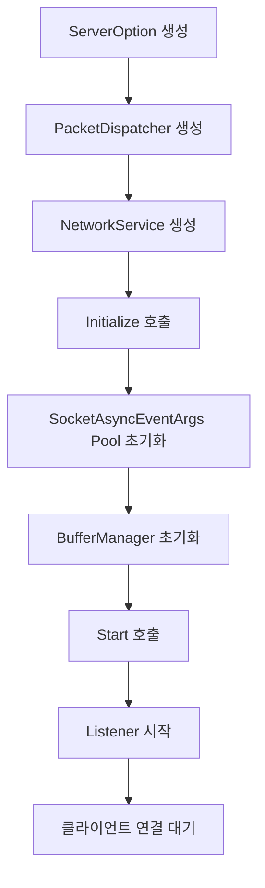

### 단계별 초기화 코드

**1단계: 기본 설정 및 디스패처 준비**

```csharp
// 서버 옵션 구성
var serverOpt = new ServerOption
{
    Port = 11021,
    MaxConnectionCount = 100,
    ReceiveBufferSize = 4096,
    MaxPacketSize = 1024
};

// 패킷 디스패처 생성 및 초기화
var packetDispatcher = new DefaultPacketDispatcher();
packetDispatcher.Init(4); // 헤더 크기: 패킷길이(2) + ID(2) = 4바이트
```

**2단계: NetworkService 생성 및 초기화**

```csharp
var service = new NetworkService(serverOpt, packetDispatcher);
service.Initialize();
```

`Initialize()` 메소드에서 수행되는 작업:
- SocketAsyncEventArgs 풀 초기화 (수신용/송신용 각각)
- 각 연결별 이벤트 핸들러 등록
- 버퍼 매니저 초기화

**3단계: 서버 시작**

```csharp
const bool isNoDelay = true; // Nagle 알고리즘 비활성화
service.Start("0.0.0.0", serverOpt.Port, 100, isNoDelay);
Console.WriteLine("Server Started!");
```

### 메모리 풀 초기화 구조

```
ReceiveEventArgs Pool          SendEventArgs Pool
┌─────────────────┐           ┌─────────────────┐
│ Args[0] + Buffer│           │ Args[0]         │
│ Args[1] + Buffer│           │ Args[1]         │
│ Args[2] + Buffer│           │ Args[2]         │
│ ...             │           │ ...             │
│ Args[N] + Buffer│           │ Args[N]         │
└─────────────────┘           └─────────────────┘
```

수신용은 미리 할당된 고정 버퍼를 사용하고, 송신용은 동적으로 버퍼를 할당합니다.

## 6.3 클라이언트 연결 처리

### 연결 처리 시퀀스

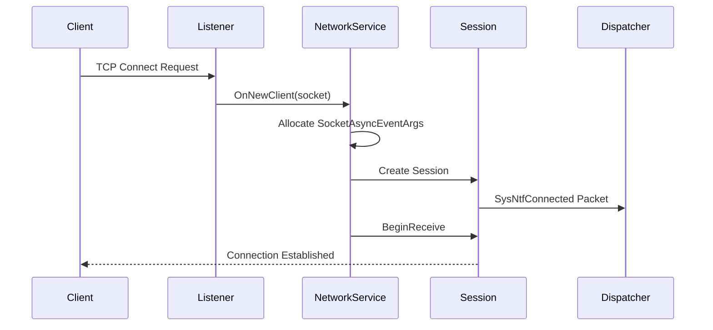

### OnNewClient 메소드 분석

```csharp
private void OnNewClient(bool isAccepted, Socket clientSocket)
{
    ArgumentNullException.ThrowIfNull(clientSocket);

    // 1. 연결 수 증가
    Interlocked.Increment(ref _connectedSessionCount);

    // 2. 고유 ID 생성
    var uniqueId = MakeSequenceIdForSession();
    
    // 3. Session 객체 생성
    var session = new Session(true, uniqueId, PacketDispatcher, ServerOpt);
    session.OnEventSessionClosed += OnSessionClosed;

    // 4. 리소스 할당
    var receiveArgs = _receiveEventArgsPool.Pop();
    var sendArgs = _sendEventArgsPool.Pop();

    // 5. 리소스 부족 시 연결 거부
    if (receiveArgs is null || sendArgs is null)
    {
        Console.WriteLine("[ERROR] Failed to allocate SocketAsyncEventArgs.");
        clientSocket.Close();
        return;
    }

    // 6. Session과 EventArgs 연결
    receiveArgs.UserToken = session;
    sendArgs.UserToken = session;

    // 7. 연결 완료 처리
    session.OnConnected();
    BeginReceive(clientSocket, receiveArgs, sendArgs);
}
```

### Session 생명주기 관리

```
Connected → Receiving ⇄ Sending → Closed
    ↓           ↓          ↓        ↓
SysNtfConnected  Packet   Packet  SysNtfClosed
                Process  Process
```

**연결 상태 관리**
```csharp
private enum State { Idle, Connected, Closed }
private int _currentState = (int)State.Idle;

// 상태 변경은 원자적으로 수행
public void OnConnected()
{
    if (Interlocked.CompareExchange(ref _currentState, 
        (int)State.Connected, (int)State.Idle) != (int)State.Idle)
        return;

    // 연결 완료 시스템 패킷 생성
    var connectedPacket = new Packet(this, NetworkDefine.SysNtfConnected, null);
    _dispatcher.IncomingPacket(true, this, connectedPacket);
}
```

## 6.4 에코 서버 예제 분석

### 에코 서버 전체 구조

```
┌─────────────────────────────────────────────────────────┐
│                    Echo Server                          │
├─────────────────────────────────────────────────────────┤
│ Program.cs         │ 서버 시작점 및 제어 루프            │
│ PacketProcess.cs   │ 패킷 처리 로직 (별도 스레드)        │
│ GameUser.cs        │ 클라이언트 세션 래퍼                │
│ Protocol.cs        │ 프로토콜 정의                       │
└─────────────────────────────────────────────────────────┘
```

### Program.cs 메인 로직

```csharp
// 1. 명령줄 인수 파싱
var serverOpt = ParseCommandLine(args);

// 2. 패킷 디스패처 및 네트워크 서비스 초기화
var packetDispatcher = new DefaultPacketDispatcher();
packetDispatcher.Init(4); // 헤더 크기

var service = new NetworkService(serverOpt, packetDispatcher);
service.Initialize();

// 3. 서버 시작
const bool isNoDelay = true;
service.Start("0.0.0.0", serverOpt.Port, 100, isNoDelay);

// 4. 패킷 처리 로직 시작 (별도 스레드)
var packetProcess = new PacketProcess(service);
packetProcess.Start();

// 5. 서버 제어 루프
while (true)
{
    string? input = Console.ReadLine();
    switch (input?.ToLower())
    {
        case "users":
            Console.WriteLine($"Current connected sessions: {service.ConnectedSessionCount}");
            break;
        case "exit":
            // 서버 종료 처리
            packetProcess.Stop();
            service.Stop();
            return 0;
    }
}
```

### PacketProcess 클래스의 역할

PacketProcess는 메인 스레드와 별도로 동작하여 패킷을 처리합니다:

```
Main Thread              Packet Thread
     │                        │
   Start()  ─────────────►  Start()
     │                        │
  Console                     │
  Input                   ┌─────────┐
  Loop                    │ Process │ ◄─── DefaultPacketDispatcher
     │                    │ Loop    │
   Stop()   ─────────────►  └─────────┘
```

### 스레드 분리의 장점

**1. 응답성 향상**
- 메인 스레드가 패킷 처리로 인해 블록되지 않음
- 관리 명령어 처리가 즉시 가능

**2. 성능 향상**
- I/O 작업과 로직 처리의 분리
- CPU 집약적인 패킷 처리 작업의 독립적 수행

**3. 확장성**
- 여러 개의 패킷 처리 스레드로 확장 가능
- 워커 스레드 풀 패턴 적용 가능

### 게임 서버에서의 실제 활용

```csharp
// 게임 서버 구현 예시
public class GameServer
{
    private NetworkService _networkService;
    private GameLogicProcessor _gameLogic;
    
    public void Start()
    {
        // 네트워크 서비스 시작
        _networkService = new NetworkService(serverOption, packetDispatcher);
        _networkService.Initialize();
        _networkService.Start("0.0.0.0", port, 100, true);
        
        // 게임 로직 프로세서 시작 (별도 스레드)
        _gameLogic = new GameLogicProcessor(_networkService);
        _gameLogic.Start();
        
        // 서버 관리 루프
        StartManagementConsole();
    }
}
```

### 에러 처리 및 예외 상황 대응

**리소스 부족 상황**
```csharp
var receiveArgs = _receiveEventArgsPool.Pop();
var sendArgs = _sendEventArgsPool.Pop();

if (receiveArgs is null || sendArgs is null)
{
    // 리소스 부족으로 연결 거부
    Console.WriteLine("[ERROR] Failed to allocate SocketAsyncEventArgs.");
    clientSocket.Close();
    return;
}
```

**비동기 작업 예외 처리**
```csharp
try
{
    if (!socket.ReceiveAsync(receiveArgs))
    {
        OnReceiveCompleted(this, receiveArgs);
    }
}
catch (ObjectDisposedException) 
{ 
    /* 소켓이 닫힌 경우 무시 */ 
}
catch (Exception ex)
{
    Console.WriteLine($"BeginReceive error: {ex.Message}");
    session.Close();
}
```

### 모니터링 및 관리 기능

에코 서버는 기본적인 서버 모니터링 기능을 제공합니다:

```
서버 명령어:
┌──────────────────────────────────┐
│ users  │ 현재 연결된 세션 수 출력  │
│ exit   │ 서버 정상 종료           │
└──────────────────────────────────┘
```

실제 게임 서버에서는 이를 확장하여 다음과 같은 기능을 추가할 수 있습니다:

```csharp
// 확장된 서버 관리 명령어 예시
switch (input?.ToLower())
{
    case "users":
        Console.WriteLine($"Connected: {service.ConnectedSessionCount}");
        break;
    case "memory":
        GC.Collect();
        Console.WriteLine($"Memory: {GC.GetTotalMemory(false) / 1024}KB");
        break;
    case "rooms":
        Console.WriteLine($"Active rooms: {GameRoomManager.ActiveRoomCount}");
        break;
    case "kick":
        // 특정 사용자 강제 종료
        break;
    case "broadcast":
        // 전체 공지 메시지
        break;
}
```

### 성능 고려사항

**1. 백로그 큐 크기**
```csharp
service.Start("0.0.0.0", serverOpt.Port, 100, isNoDelay);
//                                        ^^^
//                                     백로그 크기
```
- 운영체제의 연결 대기 큐 크기
- 높은 트래픽 상황에서 연결 거부 방지
- 일반적으로 MaxConnectionCount의 10% 내외 설정

**2. Nagle 알고리즘 비활성화**
```csharp
const bool isNoDelay = true; // TCP_NODELAY 옵션
```
- 실시간 게임에서는 지연 최소화가 중요
- 작은 패킷도 즉시 전송
- CPU 사용량 증가 vs 응답성 향상의 트레이드오프

**3. 리소스 정리 순서**
```csharp
// 정상 종료 시퀀스
packetProcess.Stop();    // 1. 패킷 처리 중단
service.Stop();          // 2. 네트워크 서비스 중단
// 3. 자동으로 모든 세션 정리됨
```

이러한 구조를 통해 FreeNetLite는 높은 성능과 안정성을 제공하면서도 게임 서버 개발에 필요한 기본 기능들을 효율적으로 지원합니다.   


-----  
  
# 7. 클라이언트 구현

## 7.1 TCPConnector - 클라이언트 연결

### TCPConnector 개요

TCPConnector는 FreeNetLite에서 클라이언트 측 서버 연결을 담당하는 핵심 컴포넌트입니다. 비동기 방식으로 서버에 연결하고 연결 상태를 관리합니다.

```
┌────────────────────────────────────────┐
│            TCPConnector                │
├────────────────────────────────────────┤
│ _clientSocket    │ 서버 연결용 소켓    │
│ _dispatcher      │ 패킷 디스패처       │
│ _serverOpt       │ 서버 옵션          │
├────────────────────────────────────────┤
│ Init()           │ 초기화              │
│ Connect()        │ 서버 연결           │
│ OnConnectCompleted() │ 연결 완료 콜백  │
└────────────────────────────────────────┘
```

### 연결 과정 시퀀스

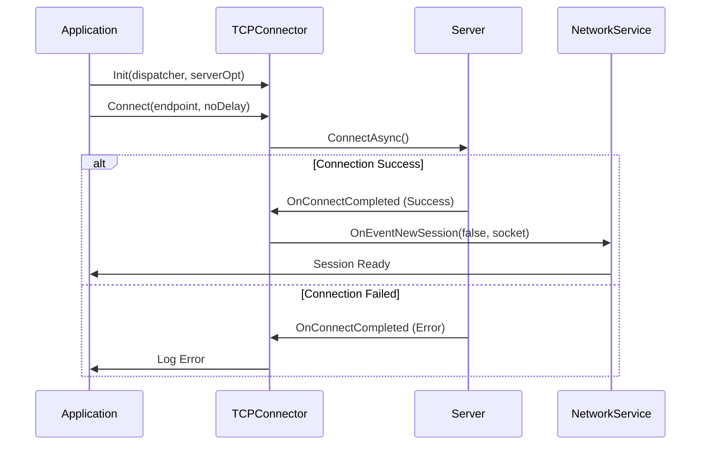

### TCPConnector 핵심 코드 분석

**초기화 메소드**
```csharp
public void Init(IPacketDispatcher dispatcher, ServerOption serverOption)
{
    _dispatcher = dispatcher;
    _serverOpt = serverOption;
}
```

**연결 시도**
```csharp
public void Connect(IPEndPoint remoteEndpoint, bool isNoDelay)
{
    // 클라이언트 소켓 생성
    _clientSocket = new Socket(AddressFamily.InterNetwork, 
                              SocketType.Stream, 
                              ProtocolType.Tcp);
    _clientSocket.NoDelay = isNoDelay;

    // 비동기 연결을 위한 EventArgs 설정
    SocketAsyncEventArgs event_arg = new SocketAsyncEventArgs();
    event_arg.Completed += OnConnectCompleted;
    event_arg.RemoteEndPoint = remoteEndpoint;

    // 비동기 연결 시도
    bool pending = _clientSocket.ConnectAsync(event_arg);
    if (pending == false)
    {
        // 즉시 완료된 경우 콜백 직접 호출
        OnConnectCompleted(null, event_arg);
    }
}
```

**연결 완료 처리**
```csharp
void OnConnectCompleted(object sender, SocketAsyncEventArgs e)
{
    if (e.SocketError == SocketError.Success)
    {
        // 연결 성공 시 데이터 수신 준비
        OnEventNewSession(false, _clientSocket);
    }
    else
    {
        Console.WriteLine($"Failed to connect. {e.SocketError}");
    }
}
```

### 클라이언트 연결 상태 관리

```
Idle ──Connect()──► Connecting ──Success──► Connected
                       │
                   Failure
                       │
                       ▼
                    Disconnected
```

## 7.2 클라이언트 사이드 패킷 처리

### ClientSimpleTcp 구조

테스트 클라이언트에서 사용하는 단순한 TCP 클라이언트 구현체입니다:

```
┌─────────────────────────────────────────┐
│           ClientSimpleTcp               │
├─────────────────────────────────────────┤
│ Socket Sock          │ TCP 소켓         │
│ string LatestErrorMsg │ 최근 에러 메시지 │
├─────────────────────────────────────────┤
│ Connect()            │ 서버 연결        │
│ Send()               │ 데이터 전송      │
│ Receive()            │ 데이터 수신      │
│ Close()              │ 연결 종료        │
│ IsConnected()        │ 연결 상태 확인   │
└─────────────────────────────────────────┘
```

### 패킷 버퍼 관리

클라이언트에서는 PacketBufferManager를 통해 수신된 데이터를 관리합니다:

```
┌─────────────────────────────────────────────────────────┐
│                PacketBuffer                             │
├─────────────────────────────────────────────────────────┤
│  ReadPos    WritePos                                    │
│     │          │                                        │
│     ▼          ▼                                        │
│ [Packet1][Packet2][Incomplete...    ][Free Space]      │
│                                                         │
│ ◄── Processed ──► ◄── Processing ──► ◄── Available ──► │
└─────────────────────────────────────────────────────────┘
```

**패킷 경계 처리**
```csharp
public ArraySegment<byte> Read()
{
    var enableReadSize = WritePos - ReadPos;
    
    // 최소 헤더 크기 확인
    if (enableReadSize < HeaderSize)
    {
        return new ArraySegment<byte>();
    }

    // 패킷 크기 읽기
    var packetDataSize = BitConverter.ToInt16(PacketData, ReadPos);
    
    // 완전한 패킷이 도착했는지 확인
    if (enableReadSize < packetDataSize)
    {
        return new ArraySegment<byte>();
    }

    // 완전한 패킷 반환
    var completePacketData = new ArraySegment<byte>(PacketData, ReadPos, packetDataSize);
    ReadPos += packetDataSize;
    return completePacketData;
}
```

### 클라이언트 패킷 송수신 흐름

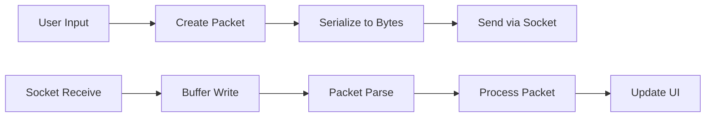

## 7.3 테스트 클라이언트 예제

### 테스트 클라이언트 UI 구조

```
┌──────────────────────────────────────────────┐
│  네트워크 테스트 클라이언트                    │
├──────────────────────────────────────────────┤
│ ┌─ Socket 설정 ─────────────────────────────┐ │
│ │ IP: [127.0.0.1] Port: [11021] [Connect]  │ │
│ └─────────────────────────────────────────────┘ │
│ ┌─ Echo Test ───────────────────────────────┐ │
│ │ Text: [test1]              [Send Echo]   │ │
│ └─────────────────────────────────────────────┘ │
│ ┌─ Login ───────────────────────────────────┐ │
│ │ ID: [jacking75] PW: [****]     [Login]   │ │
│ └─────────────────────────────────────────────┘ │
│ ┌─ Room ────────────────────────────────────┐ │
│ │ Room#: [0] [Enter] [Leave]               │ │
│ │ Users:    │ Chat Messages:               │ │
│ │ [UserList]│ [Chat History]               │ │
│ │           │                              │ │
│ │ Message: [text] [Send]                   │ │
│ └─────────────────────────────────────────────┘ │
│ ┌─ Log ─────────────────────────────────────┐ │
│ │ [시스템 로그 및 디버그 메시지]              │ │
│ └─────────────────────────────────────────────┘ │
└──────────────────────────────────────────────┘
```

### 주요 기능 구현

**1. 서버 연결 처리**
```csharp
private void btnConnect_Click(object sender, EventArgs e)
{
    string ip = checkBoxLocalHostIP.Checked ? "127.0.0.1" : textBoxIP.Text;
    int port = int.Parse(textBoxPort.Text);
    
    if (_client.Connect(ip, port))
    {
        labelStatus.Text = "서버 접속 상태: 연결됨";
        _isConnectedServer = true;
        
        // 패킷 수신 스레드 시작
        _workerThread = new Thread(PacketProcess);
        _workerThread.Start();
    }
    else
    {
        labelStatus.Text = $"서버 접속 실패: {_client.LatestErrorMsg}";
    }
}
```

**2. 에코 메시지 전송**
```csharp
private void button1_Click(object sender, EventArgs e)
{
    if (!_isConnectedServer)
    {
        DevLog.Write("서버에 연결되지 않음");
        return;
    }

    try
    {
        var bodyData = Encoding.UTF8.GetBytes(textSendText.Text);
        var packet = CreatePacket((UInt16)PACKET_ID.PACKET_ID_ECHO, bodyData);
        _client.Send(packet);
        
        DevLog.Write($"Echo 전송: {textSendText.Text}");
    }
    catch (Exception ex)
    {
        DevLog.Write($"Echo 전송 실패: {ex.Message}");
    }
}
```

### 패킷 생성 및 처리

**패킷 생성 공통 함수**
```csharp
byte[] CreatePacket(UInt16 protocolId, byte[] bodyData)
{
    var packetSize = (UInt16)(PacketDef.PACKET_HEADER_SIZE + bodyData.Length);
    var packet = new byte[packetSize];
    
    // 헤더 작성
    BitConverter.GetBytes(packetSize).CopyTo(packet, 0);  // 패킷 크기
    BitConverter.GetBytes(protocolId).CopyTo(packet, 2);  // 프로토콜 ID
    packet[4] = 0; // Type 필드 (예약)
    
    // 바디 데이터 복사
    bodyData.CopyTo(packet, PacketDef.PACKET_HEADER_SIZE);
    
    return packet;
}
```

### 클라이언트 패킷 처리 스레드

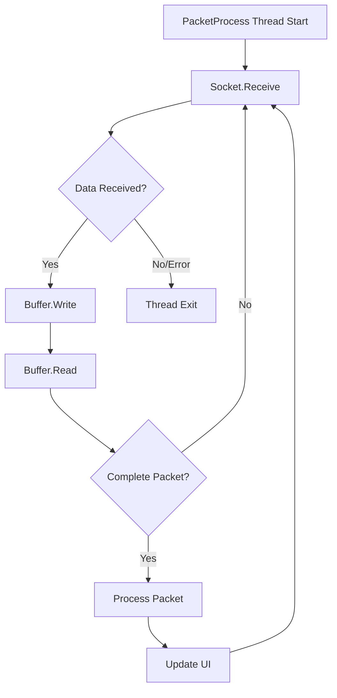

**패킷 수신 및 처리 루프**
```csharp
void PacketProcess()
{
    while (_isConnectedServer)
    {
        try
        {
            // 데이터 수신
            var recvData = _client.Receive();
            if (recvData == null)
            {
                // 연결 끊어짐 또는 에러
                _isConnectedServer = false;
                break;
            }

            // 버퍼에 데이터 추가
            _packetBuffer.Write(recvData.Item2, 0, recvData.Item1);

            // 완전한 패킷들 처리
            while (true)
            {
                var packet = _packetBuffer.Read();
                if (packet.Count == 0) break;
                
                ProcessPacket(packet);
            }
        }
        catch (Exception ex)
        {
            DevLog.Write($"패킷 처리 에러: {ex.Message}");
            _isConnectedServer = false;
        }
    }
}
```

### 프로토콜별 패킷 처리

```csharp
void ProcessPacket(ArraySegment<byte> packet)
{
    var packetId = (PACKET_ID)BitConverter.ToUInt16(packet.Array, packet.Offset + 2);
    var bodyData = new byte[packet.Count - PacketDef.PACKET_HEADER_SIZE];
    Buffer.BlockCopy(packet.Array, packet.Offset + PacketDef.PACKET_HEADER_SIZE, 
                     bodyData, 0, bodyData.Length);

    switch (packetId)
    {
        case PACKET_ID.PACKET_ID_ECHO:
            var echoText = Encoding.UTF8.GetString(bodyData);
            AddToLogList($"Echo 응답: {echoText}");
            break;
            
        case PACKET_ID.PACKET_ID_LOGIN_RES:
            var loginRes = new LoginResPacket();
            loginRes.FromBytes(bodyData);
            ProcessLoginResponse(loginRes.Result);
            break;
            
        case PACKET_ID.PACKET_ID_ROOM_CHAT_NOTIFY:
            var chatNtf = new RoomChatNtfPacket();
            chatNtf.FromBytes(bodyData);
            AddRoomChatMessage(chatNtf.UserUniqueId, chatNtf.Message);
            break;
    }
}
```

### 클라이언트 상태 관리

```
Disconnected ──Connect()──► Connecting ──Success──► Connected
     ▲                          │                       │
     │                      Failure                   Send/Recv
     │                          │                       │
     └─────── Close() ◄─────────┴───────────────────────┘
```

### 에러 처리 및 재연결 전략

**연결 실패 처리**
```csharp
void OnConnectCompleted(object sender, SocketAsyncEventArgs e)
{
    if (e.SocketError == SocketError.Success)
    {
        OnEventNewSession(false, _clientSocket);
    }
    else
    {
        Console.WriteLine($"Failed to connect. {e.SocketError}");
        
        // 재연결 로직 (옵션)
        if (ShouldRetry(e.SocketError))
        {
            ScheduleReconnect();
        }
    }
}
```

**연결 끊어짐 감지**
```csharp
public Tuple<int, byte[]> Receive()
{
    try
    {
        byte[] ReadBuffer = new byte[2048];
        var nRecv = Sock.Receive(ReadBuffer, 0, ReadBuffer.Length, SocketFlags.None);

        if (nRecv == 0)
        {
            // 상대방이 연결을 정상적으로 종료
            return null;
        }

        return Tuple.Create(nRecv, ReadBuffer);
    }
    catch (SocketException se)
    {
        LatestErrorMsg = se.Message;
        return null;
    }
}
```

### 클라이언트 구현 모범 사례

**1. 스레드 안전성 확보**
```csharp
// UI 업데이트는 반드시 UI 스레드에서 수행
void AddToLogList(string message)
{
    if (InvokeRequired)
    {
        Invoke(new Action<string>(AddToLogList), message);
        return;
    }
    
    listBoxLog.Items.Add($"[{DateTime.Now:HH:mm:ss}] {message}");
    listBoxLog.TopIndex = listBoxLog.Items.Count - 1;
}
```

**2. 리소스 정리**
```csharp
private void mainForm_FormClosing(object sender, FormClosingEventArgs e)
{
    _isConnectedServer = false;
    
    // 워커 스레드 종료 대기
    if (_workerThread != null && _workerThread.IsAlive)
    {
        _workerThread.Join(1000); // 1초 대기
    }
    
    // 소켓 정리
    _client?.Close();
}
```

**3. 패킷 크기 검증**
```csharp
void ProcessIncomingData(byte[] data, int length)
{
    if (length < PacketDef.PACKET_HEADER_SIZE)
    {
        DevLog.Write("잘못된 패킷 크기");
        return;
    }
    
    var packetSize = BitConverter.ToUInt16(data, 0);
    if (packetSize > MaxPacketSize)
    {
        DevLog.Write($"패킷 크기 초과: {packetSize}");
        _client.Close(); // 비정상 데이터로 판단하여 연결 종료
        return;
    }
}
```

### 게임 클라이언트 확장 예시

실제 게임 클라이언트에서는 다음과 같이 확장할 수 있습니다:

```csharp
public class GameClient
{
    private TCPConnector _connector;
    private GamePacketDispatcher _dispatcher;
    private GameStateManager _gameState;
    
    public async Task ConnectToGameServer(string ip, int port)
    {
        _connector = new TCPConnector();
        _dispatcher = new GamePacketDispatcher(_gameState);
        
        _connector.Init(_dispatcher, clientOption);
        _connector.OnEventConnected += OnServerConnected;
        
        var endpoint = new IPEndPoint(IPAddress.Parse(ip), port);
        _connector.Connect(endpoint, true);
    }
    
    private void OnServerConnected(Session session)
    {
        // 자동 로그인 시도
        SendLoginRequest();
        
        // 하트비트 시작
        StartHeartbeat();
    }
}
```

이러한 클라이언트 구현을 통해 안정적이고 효율적인 게임 클라이언트를 개발할 수 있습니다.


# 7. 클라이언트 구현

## 7.1 TCPConnector - 클라이언트 연결

### TCPConnector 개요

TCPConnector는 FreeNetLite에서 클라이언트 측 서버 연결을 담당하는 핵심 컴포넌트입니다. 비동기 방식으로 서버에 연결하고 연결 상태를 관리합니다.

```
┌────────────────────────────────────────┐
│            TCPConnector                │
├────────────────────────────────────────┤
│ _clientSocket    │ 서버 연결용 소켓    │
│ _dispatcher      │ 패킷 디스패처       │
│ _serverOpt       │ 서버 옵션          │
├────────────────────────────────────────┤
│ Init()           │ 초기화              │
│ Connect()        │ 서버 연결           │
│ OnConnectCompleted() │ 연결 완료 콜백  │
└────────────────────────────────────────┘
```

### 연결 과정 시퀀스

```mermaid
sequenceDiagram
    participant App as Application
    participant TC as TCPConnector
    participant S as Server
    participant NS as NetworkService

    App->>TC: Init(dispatcher, serverOpt)
    App->>TC: Connect(endpoint, noDelay)
    TC->>S: ConnectAsync()
    
    alt Connection Success
        S->>TC: OnConnectCompleted (Success)
        TC->>NS: OnEventNewSession(false, socket)
        NS->>App: Session Ready
    else Connection Failed
        S->>TC: OnConnectCompleted (Error)
        TC->>App: Log Error
    end
```

### TCPConnector 핵심 코드 분석

**초기화 메소드**
```csharp
public void Init(IPacketDispatcher dispatcher, ServerOption serverOption)
{
    _dispatcher = dispatcher;
    _serverOpt = serverOption;
}
```

**연결 시도**
```csharp
public void Connect(IPEndPoint remoteEndpoint, bool isNoDelay)
{
    // 클라이언트 소켓 생성
    _clientSocket = new Socket(AddressFamily.InterNetwork, 
                              SocketType.Stream, 
                              ProtocolType.Tcp);
    _clientSocket.NoDelay = isNoDelay;

    // 비동기 연결을 위한 EventArgs 설정
    SocketAsyncEventArgs event_arg = new SocketAsyncEventArgs();
    event_arg.Completed += OnConnectCompleted;
    event_arg.RemoteEndPoint = remoteEndpoint;

    // 비동기 연결 시도
    bool pending = _clientSocket.ConnectAsync(event_arg);
    if (pending == false)
    {
        // 즉시 완료된 경우 콜백 직접 호출
        OnConnectCompleted(null, event_arg);
    }
}
```

**연결 완료 처리**
```csharp
void OnConnectCompleted(object sender, SocketAsyncEventArgs e)
{
    if (e.SocketError == SocketError.Success)
    {
        // 연결 성공 시 데이터 수신 준비
        OnEventNewSession(false, _clientSocket);
    }
    else
    {
        Console.WriteLine($"Failed to connect. {e.SocketError}");
    }
}
```

### 클라이언트 연결 상태 관리

```
Idle ──Connect()──► Connecting ──Success──► Connected
                       │
                   Failure
                       │
                       ▼
                    Disconnected
```

## 7.2 클라이언트 사이드 패킷 처리

### ClientSimpleTcp 구조

테스트 클라이언트에서 사용하는 단순한 TCP 클라이언트 구현체입니다:

```
┌─────────────────────────────────────────┐
│           ClientSimpleTcp               │
├─────────────────────────────────────────┤
│ Socket Sock          │ TCP 소켓         │
│ string LatestErrorMsg │ 최근 에러 메시지 │
├─────────────────────────────────────────┤
│ Connect()            │ 서버 연결        │
│ Send()               │ 데이터 전송      │
│ Receive()            │ 데이터 수신      │
│ Close()              │ 연결 종료        │
│ IsConnected()        │ 연결 상태 확인   │
└─────────────────────────────────────────┘
```

### 패킷 버퍼 관리

클라이언트에서는 PacketBufferManager를 통해 수신된 데이터를 관리합니다:

```
┌─────────────────────────────────────────────────────────┐
│                PacketBuffer                             │
├─────────────────────────────────────────────────────────┤
│  ReadPos    WritePos                                    │
│     │          │                                        │
│     ▼          ▼                                        │
│ [Packet1][Packet2][Incomplete...    ][Free Space]      │
│                                                         │
│ ◄── Processed ──► ◄── Processing ──► ◄── Available ──► │
└─────────────────────────────────────────────────────────┘
```

**패킷 경계 처리**
```csharp
public ArraySegment<byte> Read()
{
    var enableReadSize = WritePos - ReadPos;
    
    // 최소 헤더 크기 확인
    if (enableReadSize < HeaderSize)
    {
        return new ArraySegment<byte>();
    }

    // 패킷 크기 읽기
    var packetDataSize = BitConverter.ToInt16(PacketData, ReadPos);
    
    // 완전한 패킷이 도착했는지 확인
    if (enableReadSize < packetDataSize)
    {
        return new ArraySegment<byte>();
    }

    // 완전한 패킷 반환
    var completePacketData = new ArraySegment<byte>(PacketData, ReadPos, packetDataSize);
    ReadPos += packetDataSize;
    return completePacketData;
}
```

### 클라이언트 패킷 송수신 흐름

```mermaid
graph LR
    A[User Input] --> B[Create Packet]
    B --> C[Serialize to Bytes]
    C --> D[Send via Socket]
    
    E[Socket Receive] --> F[Buffer Write]
    F --> G[Packet Parse]
    G --> H[Process Packet]
    H --> I[Update UI]
```

## 7.3 테스트 클라이언트 예제

### 테스트 클라이언트 UI 구조

```
┌──────────────────────────────────────────────┐
│  네트워크 테스트 클라이언트                    │
├──────────────────────────────────────────────┤
│ ┌─ Socket 설정 ─────────────────────────────┐ │
│ │ IP: [127.0.0.1] Port: [11021] [Connect]  │ │
│ └─────────────────────────────────────────────┘ │
│ ┌─ Echo Test ───────────────────────────────┐ │
│ │ Text: [test1]              [Send Echo]   │ │
│ └─────────────────────────────────────────────┘ │
│ ┌─ Login ───────────────────────────────────┐ │
│ │ ID: [jacking75] PW: [****]     [Login]   │ │
│ └─────────────────────────────────────────────┘ │
│ ┌─ Room ────────────────────────────────────┐ │
│ │ Room#: [0] [Enter] [Leave]               │ │
│ │ Users:    │ Chat Messages:               │ │
│ │ [UserList]│ [Chat History]               │ │
│ │           │                              │ │
│ │ Message: [text] [Send]                   │ │
│ └─────────────────────────────────────────────┘ │
│ ┌─ Log ─────────────────────────────────────┐ │
│ │ [시스템 로그 및 디버그 메시지]              │ │
│ └─────────────────────────────────────────────┘ │
└──────────────────────────────────────────────┘
```

### 주요 기능 구현

**1. 서버 연결 처리**
```csharp
private void btnConnect_Click(object sender, EventArgs e)
{
    string ip = checkBoxLocalHostIP.Checked ? "127.0.0.1" : textBoxIP.Text;
    int port = int.Parse(textBoxPort.Text);
    
    if (_client.Connect(ip, port))
    {
        labelStatus.Text = "서버 접속 상태: 연결됨";
        _isConnectedServer = true;
        
        // 패킷 수신 스레드 시작
        _workerThread = new Thread(PacketProcess);
        _workerThread.Start();
    }
    else
    {
        labelStatus.Text = $"서버 접속 실패: {_client.LatestErrorMsg}";
    }
}
```

**2. 에코 메시지 전송**
```csharp
private void button1_Click(object sender, EventArgs e)
{
    if (!_isConnectedServer)
    {
        DevLog.Write("서버에 연결되지 않음");
        return;
    }

    try
    {
        var bodyData = Encoding.UTF8.GetBytes(textSendText.Text);
        var packet = CreatePacket((UInt16)PACKET_ID.PACKET_ID_ECHO, bodyData);
        _client.Send(packet);
        
        DevLog.Write($"Echo 전송: {textSendText.Text}");
    }
    catch (Exception ex)
    {
        DevLog.Write($"Echo 전송 실패: {ex.Message}");
    }
}
```

### 패킷 생성 및 처리

**패킷 생성 공통 함수**
```csharp
byte[] CreatePacket(UInt16 protocolId, byte[] bodyData)
{
    var packetSize = (UInt16)(PacketDef.PACKET_HEADER_SIZE + bodyData.Length);
    var packet = new byte[packetSize];
    
    // 헤더 작성
    BitConverter.GetBytes(packetSize).CopyTo(packet, 0);  // 패킷 크기
    BitConverter.GetBytes(protocolId).CopyTo(packet, 2);  // 프로토콜 ID
    packet[4] = 0; // Type 필드 (예약)
    
    // 바디 데이터 복사
    bodyData.CopyTo(packet, PacketDef.PACKET_HEADER_SIZE);
    
    return packet;
}
```

### 클라이언트 패킷 처리 스레드

```mermaid
graph TD
    A[PacketProcess Thread Start] --> B[Socket.Receive]
    B --> C{Data Received?}
    C -->|Yes| D[Buffer.Write]
    C -->|No/Error| I[Thread Exit]
    D --> E[Buffer.Read]
    E --> F{Complete Packet?}
    F -->|Yes| G[Process Packet]
    F -->|No| B
    G --> H[Update UI]
    H --> B
```

**패킷 수신 및 처리 루프**
```csharp
void PacketProcess()
{
    while (_isConnectedServer)
    {
        try
        {
            // 데이터 수신
            var recvData = _client.Receive();
            if (recvData == null)
            {
                // 연결 끊어짐 또는 에러
                _isConnectedServer = false;
                break;
            }

            // 버퍼에 데이터 추가
            _packetBuffer.Write(recvData.Item2, 0, recvData.Item1);

            // 완전한 패킷들 처리
            while (true)
            {
                var packet = _packetBuffer.Read();
                if (packet.Count == 0) break;
                
                ProcessPacket(packet);
            }
        }
        catch (Exception ex)
        {
            DevLog.Write($"패킷 처리 에러: {ex.Message}");
            _isConnectedServer = false;
        }
    }
}
```

### 프로토콜별 패킷 처리

```csharp
void ProcessPacket(ArraySegment<byte> packet)
{
    var packetId = (PACKET_ID)BitConverter.ToUInt16(packet.Array, packet.Offset + 2);
    var bodyData = new byte[packet.Count - PacketDef.PACKET_HEADER_SIZE];
    Buffer.BlockCopy(packet.Array, packet.Offset + PacketDef.PACKET_HEADER_SIZE, 
                     bodyData, 0, bodyData.Length);

    switch (packetId)
    {
        case PACKET_ID.PACKET_ID_ECHO:
            var echoText = Encoding.UTF8.GetString(bodyData);
            AddToLogList($"Echo 응답: {echoText}");
            break;
            
        case PACKET_ID.PACKET_ID_LOGIN_RES:
            var loginRes = new LoginResPacket();
            loginRes.FromBytes(bodyData);
            ProcessLoginResponse(loginRes.Result);
            break;
            
        case PACKET_ID.PACKET_ID_ROOM_CHAT_NOTIFY:
            var chatNtf = new RoomChatNtfPacket();
            chatNtf.FromBytes(bodyData);
            AddRoomChatMessage(chatNtf.UserUniqueId, chatNtf.Message);
            break;
    }
}
```

### 클라이언트 상태 관리

```
Disconnected ──Connect()──► Connecting ──Success──► Connected
     ▲                          │                       │
     │                      Failure                   Send/Recv
     │                          │                       │
     └─────── Close() ◄─────────┴───────────────────────┘
```

### 에러 처리 및 재연결 전략

**연결 실패 처리**
```csharp
void OnConnectCompleted(object sender, SocketAsyncEventArgs e)
{
    if (e.SocketError == SocketError.Success)
    {
        OnEventNewSession(false, _clientSocket);
    }
    else
    {
        Console.WriteLine($"Failed to connect. {e.SocketError}");
        
        // 재연결 로직 (옵션)
        if (ShouldRetry(e.SocketError))
        {
            ScheduleReconnect();
        }
    }
}
```

**연결 끊어짐 감지**
```csharp
public Tuple<int, byte[]> Receive()
{
    try
    {
        byte[] ReadBuffer = new byte[2048];
        var nRecv = Sock.Receive(ReadBuffer, 0, ReadBuffer.Length, SocketFlags.None);

        if (nRecv == 0)
        {
            // 상대방이 연결을 정상적으로 종료
            return null;
        }

        return Tuple.Create(nRecv, ReadBuffer);
    }
    catch (SocketException se)
    {
        LatestErrorMsg = se.Message;
        return null;
    }
}
```

### 클라이언트 구현 모범 사례

**1. 스레드 안전성 확보**
```csharp
// UI 업데이트는 반드시 UI 스레드에서 수행
void AddToLogList(string message)
{
    if (InvokeRequired)
    {
        Invoke(new Action<string>(AddToLogList), message);
        return;
    }
    
    listBoxLog.Items.Add($"[{DateTime.Now:HH:mm:ss}] {message}");
    listBoxLog.TopIndex = listBoxLog.Items.Count - 1;
}
```

**2. 리소스 정리**
```csharp
private void mainForm_FormClosing(object sender, FormClosingEventArgs e)
{
    _isConnectedServer = false;
    
    // 워커 스레드 종료 대기
    if (_workerThread != null && _workerThread.IsAlive)
    {
        _workerThread.Join(1000); // 1초 대기
    }
    
    // 소켓 정리
    _client?.Close();
}
```

**3. 패킷 크기 검증**
```csharp
void ProcessIncomingData(byte[] data, int length)
{
    if (length < PacketDef.PACKET_HEADER_SIZE)
    {
        DevLog.Write("잘못된 패킷 크기");
        return;
    }
    
    var packetSize = BitConverter.ToUInt16(data, 0);
    if (packetSize > MaxPacketSize)
    {
        DevLog.Write($"패킷 크기 초과: {packetSize}");
        _client.Close(); // 비정상 데이터로 판단하여 연결 종료
        return;
    }
}
```

### 게임 클라이언트 확장 예시

실제 게임 클라이언트에서는 다음과 같이 확장할 수 있습니다:

```csharp
public class GameClient
{
    private TCPConnector _connector;
    private GamePacketDispatcher _dispatcher;
    private GameStateManager _gameState;
    
    public async Task ConnectToGameServer(string ip, int port)
    {
        _connector = new TCPConnector();
        _dispatcher = new GamePacketDispatcher(_gameState);
        
        _connector.Init(_dispatcher, clientOption);
        _connector.OnEventConnected += OnServerConnected;
        
        var endpoint = new IPEndPoint(IPAddress.Parse(ip), port);
        _connector.Connect(endpoint, true);
    }
    
    private void OnServerConnected(Session session)
    {
        // 자동 로그인 시도
        SendLoginRequest();
        
        // 하트비트 시작
        StartHeartbeat();
    }
}
```

이러한 클라이언트 구현을 통해 안정적이고 효율적인 게임 클라이언트를 개발할 수 있습니다.

# 8. 성능 최적화 특징

## 8.1 메모리 풀링 전략

### SocketAsyncEventArgs 풀링

FreeNetLite는 고성능 네트워크 처리를 위해 객체 풀링을 적극 활용합니다. 가장 핵심적인 것이 SocketAsyncEventArgs의 풀링입니다.

```
┌─────────────────────────────────────────────────────────┐
│                SocketAsyncEventArgs Pool                │
├─────────────────────────────────────────────────────────┤
│                                                         │
│  ┌─────────┐  ┌─────────┐  ┌─────────┐  ┌─────────┐     │
│  │ Receive │  │ Receive │  │ Receive │  │ Receive │     │
│  │ Args #1 │  │ Args #2 │  │ Args #3 │  │ Args #4 │     │
│  └─────────┘  └─────────┘  └─────────┘  └─────────┘     │
│       │            │            │            │         │
│  ┌─────────┐  ┌─────────┐  ┌─────────┐  ┌─────────┐     │
│  │ Buffer  │  │ Buffer  │  │ Buffer  │  │ Buffer  │     │
│  │ 4096B   │  │ 4096B   │  │ 4096B   │  │ 4096B   │     │
│  └─────────┘  └─────────┘  └─────────┘  └─────────┘     │
└─────────────────────────────────────────────────────────┘
```

**초기화 과정**
```csharp
public void Initialize()
{
    // 수신용 EventArgs 풀 초기화
    _receiveEventArgsPool.Init(ServerOpt.MaxConnectionCount, ServerOpt.ReceiveBufferSize);
    
    // 송신용 EventArgs 풀 초기화 (버퍼는 동적 할당)
    _sendEventArgsPool.Init(ServerOpt.MaxConnectionCount, 0);

    // 미리 EventArgs 객체들을 생성하여 풀에 저장
    for (int i = 0; i < ServerOpt.MaxConnectionCount; i++)
    {
        var receiveArg = new SocketAsyncEventArgs();
        receiveArg.Completed += OnReceiveCompleted;
        _receiveEventArgsPool.Allocate(receiveArg);

        var sendArg = new SocketAsyncEventArgs();
        sendArg.Completed += OnSendCompleted;
        _sendEventArgsPool.Push(sendArg);
    }
}
```

### BufferManager의 메모리 할당 전략

```mermaid
graph TD
    A[총 버퍼 할당] --> B[BufferCount × BufferSize]
    B --> C[연속된 메모리 블록]
    C --> D[인덱스 기반 분할]
    D --> E[ConcurrentBag으로 인덱스 관리]
    E --> F[O(1) 할당/해제]
```

```csharp
public class BufferManagerAsync
{
    byte[] _totalBuffer;                    // 전체 버퍼
    ConcurrentBag<int> _freeIndexPool;     // 사용 가능한 인덱스 풀
    int _takeBufferSize;                   // 개별 버퍼 크기

    public void Init(int bufferCount, int bufferSize)
    {
        int totalBytes = bufferCount * bufferSize;
        _takeBufferSize = bufferSize;
        _totalBuffer = new byte[totalBytes];

        // 미리 모든 인덱스를 풀에 추가
        var count = totalBytes / _takeBufferSize;
        for (int i = 0; i < count; ++i)
        {
            _freeIndexPool.Add(i * _takeBufferSize);
        }
    }
}
```

**메모리 할당 패턴**
```
전체 메모리 블록: [████████████████████████████████]
                   ↓     ↓     ↓     ↓
인덱스 0:          [████] 
인덱스 4096:            [████]
인덱스 8192:                  [████]
인덱스 12288:                       [████]
```

### 풀링의 성능 이점

**전통적인 방식 vs 풀링 방식**
```
전통적인 방식:
Connection → new SocketAsyncEventArgs → GC 대상 → GC 수집
  (매번 할당)                           (가비지 생성)

풀링 방식:
Connection → Pool.Pop() → 사용 → Pool.Push()
  (재사용)     (O(1))      (재활용)    (O(1))
```

**메모리 압박 감소**
- GC 압박 최소화: 자주 할당/해제되는 객체들을 재사용
- 메모리 단편화 방지: 연속된 큰 블록을 미리 할당하여 사용
- 할당 지연 제거: 런타임에 메모리 할당으로 인한 지연 없음

## 8.2 Zero-copy 최적화

### ReadOnlyMemory<byte>와 Span<byte> 활용

FreeNetLite는 .NET의 최신 메모리 API를 활용하여 불필요한 복사를 최소화합니다.

```csharp
// 패킷 디스패치 시 메모리 복사 없이 처리
public void DispatchPacket(Session session, ReadOnlyMemory<byte> buffer)
{
    var remainBuffer = buffer;

    while (remainBuffer.Length >= _headerSize)
    {
        var headerSpan = remainBuffer.Span;  // 복사 없는 뷰
        var packetSize = FastBinaryRead.UInt16(headerSpan);
        
        // 슬라이싱도 복사 없이 수행
        var bodyData = remainBuffer.Slice(_headerSize, bodySize);
        var packet = new Packet(session, packetId, bodyData);
    }
}
```

### Memory Slicing 패턴

```
Original Buffer: [Header|Body1|Header|Body2|Header|Body3]
                      ↓
remainBuffer:    [Header|Body1|Header|Body2|Header|Body3]
                      ↓ Slice(headerSize, bodySize)
bodyData:             [Body1] ← 복사 없는 뷰
                      ↓ remainBuffer[packetSize..]
remainBuffer:                [Header|Body2|Header|Body3]
```

### FastBinaryRead/Write의 최적화

**직접 메모리 접근**
```csharp
public static ushort UInt16(ReadOnlySpan<byte> span)
{
    return BinaryPrimitives.ReadUInt16LittleEndian(span);
}

public static float Single(ReadOnlySpan<byte> span)
{
    return MemoryMarshal.Read<float>(span);  // 직접 메모리 읽기
}
```

**성능 비교**
```
전통적인 방식: byte[] → BitConverter.ToUInt16() → 임시 배열 생성
최적화된 방식: ReadOnlySpan<byte> → BinaryPrimitives → 복사 없음
```

## 8.3 비동기 I/O 활용

### 완전한 비동기 패턴

FreeNetLite는 .NET의 SocketAsyncEventArgs를 활용하여 완전한 비동기 I/O를 구현합니다.

```mermaid
graph LR
    A[Client Connect] --> B[Async Accept]
    B --> C[Async Receive]
    C --> D[Process Packet]
    D --> E[Async Send]
    E --> C
    C --> F[Connection Closed]
```

**비동기 수신 처리**
```csharp
private void BeginReceive(Socket socket, SocketAsyncEventArgs receiveArgs, SocketAsyncEventArgs sendArgs)
{
    session.Sock = socket;
    session.SetEventArgs(receiveArgs, sendArgs);

    try
    {
        // 비동기 수신 시작
        if (!socket.ReceiveAsync(receiveArgs))
        {
            // 즉시 완료된 경우 동기적으로 처리
            OnReceiveCompleted(this, receiveArgs);
        }
        // 비동기 완료는 OnReceiveCompleted에서 처리
    }
    catch (Exception ex)
    {
        session.Close();
    }
}
```

### 이벤트 기반 처리 흐름

```
Socket Event → EventArgs → Callback → Process → Next Operation
     │             │           │          │           │
   Raw Data    User Context   Handler   Business    Continue I/O
                                        Logic
```

**콜백 체인**
```csharp
private void OnReceiveCompleted(object? sender, SocketAsyncEventArgs e)
{
    if (e.BytesTransferred > 0 && e.SocketError == SocketError.Success)
    {
        session.OnReceive(e.Buffer!, e.Offset, e.BytesTransferred);
        
        // 다음 수신을 위한 비동기 호출
        if (session.Sock is not null && !session.Sock.ReceiveAsync(e))
        {
            OnReceiveCompleted(sender, e);  // 재귀 호출로 연속 처리
        }
    }
    else
    {
        session.Close();
    }
}
```

### 비동기 송신의 배치 처리

```csharp
private void StartSend()
{
    var sendingList = new List<ArraySegment<byte>>();
    
    // 여러 패킷을 모아서 한 번에 전송
    while (_sendingQueue.TryDequeue(out var data))
    {
        sendingList.Add(data);
        if (sendingList.Sum(s => s.Count) >= ServerOpt.MaxPacketSize)
        {
            break;  // 최대 크기 도달 시 중단
        }
    }

    if (sendingList.Count > 0)
    {
        SendEventArgs.BufferList = sendingList;  // 분산 버퍼 전송
        if (!Sock.SendAsync(SendEventArgs))
        {
            ProcessSend(SendEventArgs);
        }
    }
}
```

## 8.4 스레드 안전성

### 락프리 자료구조 활용

FreeNetLite는 성능을 위해 락프리 자료구조를 적극 활용합니다.

**ConcurrentBag을 통한 풀 관리**
```csharp
public class SocketAsyncEventArgsPool
{
    ConcurrentBag<SocketAsyncEventArgs> _pool = new();

    public void Push(SocketAsyncEventArgs arg)
    {
        _pool.Add(arg);  // 스레드 안전한 추가
    }

    public SocketAsyncEventArgs Pop()
    {
        if (_pool.TryTake(out var result))  // 스레드 안전한 제거
        {
            return result;
        }
        return null;
    }
}
```

### DoubleBufferingQueue의 스레드 안전 설계

```
┌─────────────────────────────────────────────────────┐
│              DoubleBufferingQueue                   │
├─────────────────────────────────────────────────────┤
│  I/O Thread               Logic Thread              │
│      │                         │                    │
│  ┌────▼────┐               ┌────▼────┐              │
│  │ Queue1  │◄─── swap ────►│ Queue2  │              │
│  │(Input)  │               │(Output) │              │
│  └─────────┘               └─────────┘              │
│      │                         │                    │
│   Enqueue()                TakeAll()                │
└─────────────────────────────────────────────────────┘
```

**스왑 기반 동기화**
```csharp
public void Enqueue(Packet msg)
{
    lock (_lock)
    {
        _refInput.Enqueue(msg);  // I/O 스레드에서 입력
    }
}

public Queue<Packet> TakeAll()
{
    swap();  // 큐 교체
    return _refOutput;  // 로직 스레드에서 일괄 처리
}

void swap()
{
    lock (_lock)
    {
        var temp = _refInput;
        _refInput = _refOutput;
        _refOutput = temp;
    }
}
```

### 원자적 연산을 통한 상태 관리

**연결 수 카운팅**
```csharp
private long _connectedSessionCount;

// 스레드 안전한 증가/감소
Interlocked.Increment(ref _connectedSessionCount);
Interlocked.Decrement(ref _connectedSessionCount);

// 스레드 안전한 읽기
public long ConnectedSessionCount => Interlocked.Read(ref _connectedSessionCount);
```

**세션 상태 관리**
```csharp
private int _currentState = (int)State.Idle;

public void OnConnected()
{
    // Compare-And-Swap 패턴으로 상태 변경
    if (Interlocked.CompareExchange(ref _currentState, 
        (int)State.Connected, (int)State.Idle) != (int)State.Idle)
        return;  // 이미 연결된 상태면 무시
}
```

### 송신 큐의 스레드 안전성

```csharp
private readonly ConcurrentQueue<ArraySegment<byte>> _sendingQueue = new();
private int _sending; // 0 = false, 1 = true

public void Send(ArraySegment<byte> packetData)
{
    if (!IsConnected()) return;

    _sendingQueue.Enqueue(packetData);

    // 송신 중이 아닐 때만 송신 시작
    if (Interlocked.CompareExchange(ref _sending, 1, 0) == 0)
    {
        StartSend();
    }
}
```

**송신 플래그를 통한 동시성 제어**
```
Thread 1: Send() → Queue.Enqueue() → CAS(_sending, 1, 0) → StartSend()
Thread 2: Send() → Queue.Enqueue() → CAS(_sending, 1, 0) → Skip (이미 송신 중)
Thread 3: Send() → Queue.Enqueue() → CAS(_sending, 1, 0) → Skip (이미 송신 중)
                                                            ↓
                                                      ProcessSend()에서
                                                      큐가 비면 _sending = 0
```

### 성능 측정 및 모니터링

**메모리 사용량 추적**
```csharp
public class PerformanceMonitor
{
    public static void LogMemoryUsage()
    {
        var beforeGC = GC.GetTotalMemory(false);
        GC.Collect();
        var afterGC = GC.GetTotalMemory(true);
        
        Console.WriteLine($"Memory - Before GC: {beforeGC / 1024}KB, After GC: {afterGC / 1024}KB");
        Console.WriteLine($"Gen 0: {GC.CollectionCount(0)}, Gen 1: {GC.CollectionCount(1)}, Gen 2: {GC.CollectionCount(2)}");
    }
}
```

**처리량 측정**
```csharp
public class ThroughputMeter
{
    private long _packetCount;
    private DateTime _startTime = DateTime.Now;
    
    public void IncrementPacketCount()
    {
        Interlocked.Increment(ref _packetCount);
    }
    
    public double GetPacketsPerSecond()
    {
        var elapsed = DateTime.Now - _startTime;
        return Interlocked.Read(ref _packetCount) / elapsed.TotalSeconds;
    }
}
```

### 최적화된 패킷 처리 파이프라인

```mermaid
graph LR
    A[Socket] --> B[BufferManager]
    B --> C[ReadOnlyMemory Slice]
    C --> D[FastBinaryRead]
    D --> E[DoubleBufferingQueue]
    E --> F[Batch Processing]
    F --> G[Business Logic]
    
    style B fill:#e1f5fe
    style C fill:#e8f5e8
    style D fill:#e8f5e8
    style E fill:#fff3e0
```

**최적화 효과 정리**

1. **메모리 풀링**: 객체 생성 비용 제거, GC 압박 감소
2. **Zero-copy**: 메모리 복사 오버헤드 최소화
3. **비동기 I/O**: CPU 효율성 극대화, 블로킹 제거
4. **스레드 안전성**: 락 경합 최소화, 원자적 연산 활용

이러한 최적화 기법들을 통해 FreeNetLite는 높은 동시 접속자 수와 낮은 지연시간을 동시에 달성할 수 있습니다.

    
-----  


# 7. 클라이언트 구현

## 7.1 TCPConnector - 클라이언트 연결

### TCPConnector 개요

TCPConnector는 FreeNetLite에서 클라이언트 측 서버 연결을 담당하는 핵심 컴포넌트입니다. 비동기 방식으로 서버에 연결하고 연결 상태를 관리합니다.

```
┌────────────────────────────────────────┐
│            TCPConnector                │
├────────────────────────────────────────┤
│ _clientSocket    │ 서버 연결용 소켓    │
│ _dispatcher      │ 패킷 디스패처       │
│ _serverOpt       │ 서버 옵션          │
├────────────────────────────────────────┤
│ Init()           │ 초기화              │
│ Connect()        │ 서버 연결           │
│ OnConnectCompleted() │ 연결 완료 콜백  │
└────────────────────────────────────────┘
```

### 연결 과정 시퀀스

```mermaid
sequenceDiagram
    participant App as Application
    participant TC as TCPConnector
    participant S as Server
    participant NS as NetworkService

    App->>TC: Init(dispatcher, serverOpt)
    App->>TC: Connect(endpoint, noDelay)
    TC->>S: ConnectAsync()
    
    alt Connection Success
        S->>TC: OnConnectCompleted (Success)
        TC->>NS: OnEventNewSession(false, socket)
        NS->>App: Session Ready
    else Connection Failed
        S->>TC: OnConnectCompleted (Error)
        TC->>App: Log Error
    end
```

### TCPConnector 핵심 코드 분석

**초기화 메소드**
```csharp
public void Init(IPacketDispatcher dispatcher, ServerOption serverOption)
{
    _dispatcher = dispatcher;
    _serverOpt = serverOption;
}
```

**연결 시도**
```csharp
public void Connect(IPEndPoint remoteEndpoint, bool isNoDelay)
{
    // 클라이언트 소켓 생성
    _clientSocket = new Socket(AddressFamily.InterNetwork, 
                              SocketType.Stream, 
                              ProtocolType.Tcp);
    _clientSocket.NoDelay = isNoDelay;

    // 비동기 연결을 위한 EventArgs 설정
    SocketAsyncEventArgs event_arg = new SocketAsyncEventArgs();
    event_arg.Completed += OnConnectCompleted;
    event_arg.RemoteEndPoint = remoteEndpoint;

    // 비동기 연결 시도
    bool pending = _clientSocket.ConnectAsync(event_arg);
    if (pending == false)
    {
        // 즉시 완료된 경우 콜백 직접 호출
        OnConnectCompleted(null, event_arg);
    }
}
```

**연결 완료 처리**
```csharp
void OnConnectCompleted(object sender, SocketAsyncEventArgs e)
{
    if (e.SocketError == SocketError.Success)
    {
        // 연결 성공 시 데이터 수신 준비
        OnEventNewSession(false, _clientSocket);
    }
    else
    {
        Console.WriteLine($"Failed to connect. {e.SocketError}");
    }
}
```

### 클라이언트 연결 상태 관리

```
Idle ──Connect()──► Connecting ──Success──► Connected
                       │
                   Failure
                       │
                       ▼
                    Disconnected
```

## 7.2 클라이언트 사이드 패킷 처리

### ClientSimpleTcp 구조

테스트 클라이언트에서 사용하는 단순한 TCP 클라이언트 구현체입니다:

```
┌─────────────────────────────────────────┐
│           ClientSimpleTcp               │
├─────────────────────────────────────────┤
│ Socket Sock          │ TCP 소켓         │
│ string LatestErrorMsg │ 최근 에러 메시지 │
├─────────────────────────────────────────┤
│ Connect()            │ 서버 연결        │
│ Send()               │ 데이터 전송      │
│ Receive()            │ 데이터 수신      │
│ Close()              │ 연결 종료        │
│ IsConnected()        │ 연결 상태 확인   │
└─────────────────────────────────────────┘
```

### 패킷 버퍼 관리

클라이언트에서는 PacketBufferManager를 통해 수신된 데이터를 관리합니다:

```
┌─────────────────────────────────────────────────────────┐
│                PacketBuffer                             │
├─────────────────────────────────────────────────────────┤
│  ReadPos    WritePos                                    │
│     │          │                                        │
│     ▼          ▼                                        │
│ [Packet1][Packet2][Incomplete...    ][Free Space]      │
│                                                         │
│ ◄── Processed ──► ◄── Processing ──► ◄── Available ──► │
└─────────────────────────────────────────────────────────┘
```

**패킷 경계 처리**
```csharp
public ArraySegment<byte> Read()
{
    var enableReadSize = WritePos - ReadPos;
    
    // 최소 헤더 크기 확인
    if (enableReadSize < HeaderSize)
    {
        return new ArraySegment<byte>();
    }

    // 패킷 크기 읽기
    var packetDataSize = BitConverter.ToInt16(PacketData, ReadPos);
    
    // 완전한 패킷이 도착했는지 확인
    if (enableReadSize < packetDataSize)
    {
        return new ArraySegment<byte>();
    }

    // 완전한 패킷 반환
    var completePacketData = new ArraySegment<byte>(PacketData, ReadPos, packetDataSize);
    ReadPos += packetDataSize;
    return completePacketData;
}
```

### 클라이언트 패킷 송수신 흐름

```mermaid
graph LR
    A[User Input] --> B[Create Packet]
    B --> C[Serialize to Bytes]
    C --> D[Send via Socket]
    
    E[Socket Receive] --> F[Buffer Write]
    F --> G[Packet Parse]
    G --> H[Process Packet]
    H --> I[Update UI]
```

## 7.3 테스트 클라이언트 예제

### 테스트 클라이언트 UI 구조

```
┌──────────────────────────────────────────────┐
│  네트워크 테스트 클라이언트                    │
├──────────────────────────────────────────────┤
│ ┌─ Socket 설정 ─────────────────────────────┐ │
│ │ IP: [127.0.0.1] Port: [11021] [Connect]  │ │
│ └─────────────────────────────────────────────┘ │
│ ┌─ Echo Test ───────────────────────────────┐ │
│ │ Text: [test1]              [Send Echo]   │ │
│ └─────────────────────────────────────────────┘ │
│ ┌─ Login ───────────────────────────────────┐ │
│ │ ID: [jacking75] PW: [****]     [Login]   │ │
│ └─────────────────────────────────────────────┘ │
│ ┌─ Room ────────────────────────────────────┐ │
│ │ Room#: [0] [Enter] [Leave]               │ │
│ │ Users:    │ Chat Messages:               │ │
│ │ [UserList]│ [Chat History]               │ │
│ │           │                              │ │
│ │ Message: [text] [Send]                   │ │
│ └─────────────────────────────────────────────┘ │
│ ┌─ Log ─────────────────────────────────────┐ │
│ │ [시스템 로그 및 디버그 메시지]              │ │
│ └─────────────────────────────────────────────┘ │
└──────────────────────────────────────────────┘
```

### 주요 기능 구현

**1. 서버 연결 처리**
```csharp
private void btnConnect_Click(object sender, EventArgs e)
{
    string ip = checkBoxLocalHostIP.Checked ? "127.0.0.1" : textBoxIP.Text;
    int port = int.Parse(textBoxPort.Text);
    
    if (_client.Connect(ip, port))
    {
        labelStatus.Text = "서버 접속 상태: 연결됨";
        _isConnectedServer = true;
        
        // 패킷 수신 스레드 시작
        _workerThread = new Thread(PacketProcess);
        _workerThread.Start();
    }
    else
    {
        labelStatus.Text = $"서버 접속 실패: {_client.LatestErrorMsg}";
    }
}
```

**2. 에코 메시지 전송**
```csharp
private void button1_Click(object sender, EventArgs e)
{
    if (!_isConnectedServer)
    {
        DevLog.Write("서버에 연결되지 않음");
        return;
    }

    try
    {
        var bodyData = Encoding.UTF8.GetBytes(textSendText.Text);
        var packet = CreatePacket((UInt16)PACKET_ID.PACKET_ID_ECHO, bodyData);
        _client.Send(packet);
        
        DevLog.Write($"Echo 전송: {textSendText.Text}");
    }
    catch (Exception ex)
    {
        DevLog.Write($"Echo 전송 실패: {ex.Message}");
    }
}
```

### 패킷 생성 및 처리

**패킷 생성 공통 함수**
```csharp
byte[] CreatePacket(UInt16 protocolId, byte[] bodyData)
{
    var packetSize = (UInt16)(PacketDef.PACKET_HEADER_SIZE + bodyData.Length);
    var packet = new byte[packetSize];
    
    // 헤더 작성
    BitConverter.GetBytes(packetSize).CopyTo(packet, 0);  // 패킷 크기
    BitConverter.GetBytes(protocolId).CopyTo(packet, 2);  // 프로토콜 ID
    packet[4] = 0; // Type 필드 (예약)
    
    // 바디 데이터 복사
    bodyData.CopyTo(packet, PacketDef.PACKET_HEADER_SIZE);
    
    return packet;
}
```

### 클라이언트 패킷 처리 스레드

```mermaid
graph TD
    A[PacketProcess Thread Start] --> B[Socket.Receive]
    B --> C{Data Received?}
    C -->|Yes| D[Buffer.Write]
    C -->|No/Error| I[Thread Exit]
    D --> E[Buffer.Read]
    E --> F{Complete Packet?}
    F -->|Yes| G[Process Packet]
    F -->|No| B
    G --> H[Update UI]
    H --> B
```

**패킷 수신 및 처리 루프**
```csharp
void PacketProcess()
{
    while (_isConnectedServer)
    {
        try
        {
            // 데이터 수신
            var recvData = _client.Receive();
            if (recvData == null)
            {
                // 연결 끊어짐 또는 에러
                _isConnectedServer = false;
                break;
            }

            // 버퍼에 데이터 추가
            _packetBuffer.Write(recvData.Item2, 0, recvData.Item1);

            // 완전한 패킷들 처리
            while (true)
            {
                var packet = _packetBuffer.Read();
                if (packet.Count == 0) break;
                
                ProcessPacket(packet);
            }
        }
        catch (Exception ex)
        {
            DevLog.Write($"패킷 처리 에러: {ex.Message}");
            _isConnectedServer = false;
        }
    }
}
```

### 프로토콜별 패킷 처리

```csharp
void ProcessPacket(ArraySegment<byte> packet)
{
    var packetId = (PACKET_ID)BitConverter.ToUInt16(packet.Array, packet.Offset + 2);
    var bodyData = new byte[packet.Count - PacketDef.PACKET_HEADER_SIZE];
    Buffer.BlockCopy(packet.Array, packet.Offset + PacketDef.PACKET_HEADER_SIZE, 
                     bodyData, 0, bodyData.Length);

    switch (packetId)
    {
        case PACKET_ID.PACKET_ID_ECHO:
            var echoText = Encoding.UTF8.GetString(bodyData);
            AddToLogList($"Echo 응답: {echoText}");
            break;
            
        case PACKET_ID.PACKET_ID_LOGIN_RES:
            var loginRes = new LoginResPacket();
            loginRes.FromBytes(bodyData);
            ProcessLoginResponse(loginRes.Result);
            break;
            
        case PACKET_ID.PACKET_ID_ROOM_CHAT_NOTIFY:
            var chatNtf = new RoomChatNtfPacket();
            chatNtf.FromBytes(bodyData);
            AddRoomChatMessage(chatNtf.UserUniqueId, chatNtf.Message);
            break;
    }
}
```

### 클라이언트 상태 관리

```
Disconnected ──Connect()──► Connecting ──Success──► Connected
     ▲                          │                       │
     │                      Failure                   Send/Recv
     │                          │                       │
     └─────── Close() ◄─────────┴───────────────────────┘
```

### 에러 처리 및 재연결 전략

**연결 실패 처리**
```csharp
void OnConnectCompleted(object sender, SocketAsyncEventArgs e)
{
    if (e.SocketError == SocketError.Success)
    {
        OnEventNewSession(false, _clientSocket);
    }
    else
    {
        Console.WriteLine($"Failed to connect. {e.SocketError}");
        
        // 재연결 로직 (옵션)
        if (ShouldRetry(e.SocketError))
        {
            ScheduleReconnect();
        }
    }
}
```

**연결 끊어짐 감지**
```csharp
public Tuple<int, byte[]> Receive()
{
    try
    {
        byte[] ReadBuffer = new byte[2048];
        var nRecv = Sock.Receive(ReadBuffer, 0, ReadBuffer.Length, SocketFlags.None);

        if (nRecv == 0)
        {
            // 상대방이 연결을 정상적으로 종료
            return null;
        }

        return Tuple.Create(nRecv, ReadBuffer);
    }
    catch (SocketException se)
    {
        LatestErrorMsg = se.Message;
        return null;
    }
}
```

### 클라이언트 구현 모범 사례

**1. 스레드 안전성 확보**
```csharp
// UI 업데이트는 반드시 UI 스레드에서 수행
void AddToLogList(string message)
{
    if (InvokeRequired)
    {
        Invoke(new Action<string>(AddToLogList), message);
        return;
    }
    
    listBoxLog.Items.Add($"[{DateTime.Now:HH:mm:ss}] {message}");
    listBoxLog.TopIndex = listBoxLog.Items.Count - 1;
}
```

**2. 리소스 정리**
```csharp
private void mainForm_FormClosing(object sender, FormClosingEventArgs e)
{
    _isConnectedServer = false;
    
    // 워커 스레드 종료 대기
    if (_workerThread != null && _workerThread.IsAlive)
    {
        _workerThread.Join(1000); // 1초 대기
    }
    
    // 소켓 정리
    _client?.Close();
}
```

**3. 패킷 크기 검증**
```csharp
void ProcessIncomingData(byte[] data, int length)
{
    if (length < PacketDef.PACKET_HEADER_SIZE)
    {
        DevLog.Write("잘못된 패킷 크기");
        return;
    }
    
    var packetSize = BitConverter.ToUInt16(data, 0);
    if (packetSize > MaxPacketSize)
    {
        DevLog.Write($"패킷 크기 초과: {packetSize}");
        _client.Close(); // 비정상 데이터로 판단하여 연결 종료
        return;
    }
}
```

### 게임 클라이언트 확장 예시

실제 게임 클라이언트에서는 다음과 같이 확장할 수 있습니다:

```csharp
public class GameClient
{
    private TCPConnector _connector;
    private GamePacketDispatcher _dispatcher;
    private GameStateManager _gameState;
    
    public async Task ConnectToGameServer(string ip, int port)
    {
        _connector = new TCPConnector();
        _dispatcher = new GamePacketDispatcher(_gameState);
        
        _connector.Init(_dispatcher, clientOption);
        _connector.OnEventConnected += OnServerConnected;
        
        var endpoint = new IPEndPoint(IPAddress.Parse(ip), port);
        _connector.Connect(endpoint, true);
    }
    
    private void OnServerConnected(Session session)
    {
        // 자동 로그인 시도
        SendLoginRequest();
        
        // 하트비트 시작
        StartHeartbeat();
    }
}
```

이러한 클라이언트 구현을 통해 안정적이고 효율적인 게임 클라이언트를 개발할 수 있습니다.

# 8. 성능 최적화 특징

## 8.1 메모리 풀링 전략

### SocketAsyncEventArgs 풀링

FreeNetLite는 고성능 네트워크 처리를 위해 객체 풀링을 적극 활용합니다. 가장 핵심적인 것이 SocketAsyncEventArgs의 풀링입니다.

```
┌─────────────────────────────────────────────────────────┐
│                SocketAsyncEventArgs Pool                │
├─────────────────────────────────────────────────────────┤
│                                                         │
│  ┌─────────┐  ┌─────────┐  ┌─────────┐  ┌─────────┐     │
│  │ Receive │  │ Receive │  │ Receive │  │ Receive │     │
│  │ Args #1 │  │ Args #2 │  │ Args #3 │  │ Args #4 │     │
│  └─────────┘  └─────────┘  └─────────┘  └─────────┘     │
│       │            │            │            │         │
│  ┌─────────┐  ┌─────────┐  ┌─────────┐  ┌─────────┐     │
│  │ Buffer  │  │ Buffer  │  │ Buffer  │  │ Buffer  │     │
│  │ 4096B   │  │ 4096B   │  │ 4096B   │  │ 4096B   │     │
│  └─────────┘  └─────────┘  └─────────┘  └─────────┘     │
└─────────────────────────────────────────────────────────┘
```

**초기화 과정**
```csharp
public void Initialize()
{
    // 수신용 EventArgs 풀 초기화
    _receiveEventArgsPool.Init(ServerOpt.MaxConnectionCount, ServerOpt.ReceiveBufferSize);
    
    // 송신용 EventArgs 풀 초기화 (버퍼는 동적 할당)
    _sendEventArgsPool.Init(ServerOpt.MaxConnectionCount, 0);

    // 미리 EventArgs 객체들을 생성하여 풀에 저장
    for (int i = 0; i < ServerOpt.MaxConnectionCount; i++)
    {
        var receiveArg = new SocketAsyncEventArgs();
        receiveArg.Completed += OnReceiveCompleted;
        _receiveEventArgsPool.Allocate(receiveArg);

        var sendArg = new SocketAsyncEventArgs();
        sendArg.Completed += OnSendCompleted;
        _sendEventArgsPool.Push(sendArg);
    }
}
```

### BufferManager의 메모리 할당 전략

```mermaid
graph TD
    A[총 버퍼 할당] --> B[BufferCount × BufferSize]
    B --> C[연속된 메모리 블록]
    C --> D[인덱스 기반 분할]
    D --> E[ConcurrentBag으로 인덱스 관리]
    E --> F[O(1) 할당/해제]
```

```csharp
public class BufferManagerAsync
{
    byte[] _totalBuffer;                    // 전체 버퍼
    ConcurrentBag<int> _freeIndexPool;     // 사용 가능한 인덱스 풀
    int _takeBufferSize;                   // 개별 버퍼 크기

    public void Init(int bufferCount, int bufferSize)
    {
        int totalBytes = bufferCount * bufferSize;
        _takeBufferSize = bufferSize;
        _totalBuffer = new byte[totalBytes];

        // 미리 모든 인덱스를 풀에 추가
        var count = totalBytes / _takeBufferSize;
        for (int i = 0; i < count; ++i)
        {
            _freeIndexPool.Add(i * _takeBufferSize);
        }
    }
}
```

**메모리 할당 패턴**
```
전체 메모리 블록: [████████████████████████████████]
                   ↓     ↓     ↓     ↓
인덱스 0:          [████] 
인덱스 4096:            [████]
인덱스 8192:                  [████]
인덱스 12288:                       [████]
```

### 풀링의 성능 이점

**전통적인 방식 vs 풀링 방식**
```
전통적인 방식:
Connection → new SocketAsyncEventArgs → GC 대상 → GC 수집
  (매번 할당)                           (가비지 생성)

풀링 방식:
Connection → Pool.Pop() → 사용 → Pool.Push()
  (재사용)     (O(1))      (재활용)    (O(1))
```

**메모리 압박 감소**
- GC 압박 최소화: 자주 할당/해제되는 객체들을 재사용
- 메모리 단편화 방지: 연속된 큰 블록을 미리 할당하여 사용
- 할당 지연 제거: 런타임에 메모리 할당으로 인한 지연 없음

## 8.2 Zero-copy 최적화

### ReadOnlyMemory<byte>와 Span<byte> 활용

FreeNetLite는 .NET의 최신 메모리 API를 활용하여 불필요한 복사를 최소화합니다.

```csharp
// 패킷 디스패치 시 메모리 복사 없이 처리
public void DispatchPacket(Session session, ReadOnlyMemory<byte> buffer)
{
    var remainBuffer = buffer;

    while (remainBuffer.Length >= _headerSize)
    {
        var headerSpan = remainBuffer.Span;  // 복사 없는 뷰
        var packetSize = FastBinaryRead.UInt16(headerSpan);
        
        // 슬라이싱도 복사 없이 수행
        var bodyData = remainBuffer.Slice(_headerSize, bodySize);
        var packet = new Packet(session, packetId, bodyData);
    }
}
```

### Memory Slicing 패턴

```
Original Buffer: [Header|Body1|Header|Body2|Header|Body3]
                      ↓
remainBuffer:    [Header|Body1|Header|Body2|Header|Body3]
                      ↓ Slice(headerSize, bodySize)
bodyData:             [Body1] ← 복사 없는 뷰
                      ↓ remainBuffer[packetSize..]
remainBuffer:                [Header|Body2|Header|Body3]
```

### FastBinaryRead/Write의 최적화

**직접 메모리 접근**
```csharp
public static ushort UInt16(ReadOnlySpan<byte> span)
{
    return BinaryPrimitives.ReadUInt16LittleEndian(span);
}

public static float Single(ReadOnlySpan<byte> span)
{
    return MemoryMarshal.Read<float>(span);  // 직접 메모리 읽기
}
```

**성능 비교**
```
전통적인 방식: byte[] → BitConverter.ToUInt16() → 임시 배열 생성
최적화된 방식: ReadOnlySpan<byte> → BinaryPrimitives → 복사 없음
```

## 8.3 비동기 I/O 활용

### 완전한 비동기 패턴

FreeNetLite는 .NET의 SocketAsyncEventArgs를 활용하여 완전한 비동기 I/O를 구현합니다.

```mermaid
graph LR
    A[Client Connect] --> B[Async Accept]
    B --> C[Async Receive]
    C --> D[Process Packet]
    D --> E[Async Send]
    E --> C
    C --> F[Connection Closed]
```

**비동기 수신 처리**
```csharp
private void BeginReceive(Socket socket, SocketAsyncEventArgs receiveArgs, SocketAsyncEventArgs sendArgs)
{
    session.Sock = socket;
    session.SetEventArgs(receiveArgs, sendArgs);

    try
    {
        // 비동기 수신 시작
        if (!socket.ReceiveAsync(receiveArgs))
        {
            // 즉시 완료된 경우 동기적으로 처리
            OnReceiveCompleted(this, receiveArgs);
        }
        // 비동기 완료는 OnReceiveCompleted에서 처리
    }
    catch (Exception ex)
    {
        session.Close();
    }
}
```

### 이벤트 기반 처리 흐름

```
Socket Event → EventArgs → Callback → Process → Next Operation
     │             │           │          │           │
   Raw Data    User Context   Handler   Business    Continue I/O
                                        Logic
```

**콜백 체인**
```csharp
private void OnReceiveCompleted(object? sender, SocketAsyncEventArgs e)
{
    if (e.BytesTransferred > 0 && e.SocketError == SocketError.Success)
    {
        session.OnReceive(e.Buffer!, e.Offset, e.BytesTransferred);
        
        // 다음 수신을 위한 비동기 호출
        if (session.Sock is not null && !session.Sock.ReceiveAsync(e))
        {
            OnReceiveCompleted(sender, e);  // 재귀 호출로 연속 처리
        }
    }
    else
    {
        session.Close();
    }
}
```

### 비동기 송신의 배치 처리

```csharp
private void StartSend()
{
    var sendingList = new List<ArraySegment<byte>>();
    
    // 여러 패킷을 모아서 한 번에 전송
    while (_sendingQueue.TryDequeue(out var data))
    {
        sendingList.Add(data);
        if (sendingList.Sum(s => s.Count) >= ServerOpt.MaxPacketSize)
        {
            break;  // 최대 크기 도달 시 중단
        }
    }

    if (sendingList.Count > 0)
    {
        SendEventArgs.BufferList = sendingList;  // 분산 버퍼 전송
        if (!Sock.SendAsync(SendEventArgs))
        {
            ProcessSend(SendEventArgs);
        }
    }
}
```

## 8.4 스레드 안전성

### 락프리 자료구조 활용

FreeNetLite는 성능을 위해 락프리 자료구조를 적극 활용합니다.

**ConcurrentBag을 통한 풀 관리**
```csharp
public class SocketAsyncEventArgsPool
{
    ConcurrentBag<SocketAsyncEventArgs> _pool = new();

    public void Push(SocketAsyncEventArgs arg)
    {
        _pool.Add(arg);  // 스레드 안전한 추가
    }

    public SocketAsyncEventArgs Pop()
    {
        if (_pool.TryTake(out var result))  // 스레드 안전한 제거
        {
            return result;
        }
        return null;
    }
}
```

### DoubleBufferingQueue의 스레드 안전 설계

```
┌─────────────────────────────────────────────────────┐
│              DoubleBufferingQueue                   │
├─────────────────────────────────────────────────────┤
│  I/O Thread               Logic Thread              │
│      │                         │                    │
│  ┌────▼────┐               ┌────▼────┐              │
│  │ Queue1  │◄─── swap ────►│ Queue2  │              │
│  │(Input)  │               │(Output) │              │
│  └─────────┘               └─────────┘              │
│      │                         │                    │
│   Enqueue()                TakeAll()                │
└─────────────────────────────────────────────────────┘
```

**스왑 기반 동기화**
```csharp
public void Enqueue(Packet msg)
{
    lock (_lock)
    {
        _refInput.Enqueue(msg);  // I/O 스레드에서 입력
    }
}

public Queue<Packet> TakeAll()
{
    swap();  // 큐 교체
    return _refOutput;  // 로직 스레드에서 일괄 처리
}

void swap()
{
    lock (_lock)
    {
        var temp = _refInput;
        _refInput = _refOutput;
        _refOutput = temp;
    }
}
```

### 원자적 연산을 통한 상태 관리

**연결 수 카운팅**
```csharp
private long _connectedSessionCount;

// 스레드 안전한 증가/감소
Interlocked.Increment(ref _connectedSessionCount);
Interlocked.Decrement(ref _connectedSessionCount);

// 스레드 안전한 읽기
public long ConnectedSessionCount => Interlocked.Read(ref _connectedSessionCount);
```

**세션 상태 관리**
```csharp
private int _currentState = (int)State.Idle;

public void OnConnected()
{
    // Compare-And-Swap 패턴으로 상태 변경
    if (Interlocked.CompareExchange(ref _currentState, 
        (int)State.Connected, (int)State.Idle) != (int)State.Idle)
        return;  // 이미 연결된 상태면 무시
}
```

### 송신 큐의 스레드 안전성

```csharp
private readonly ConcurrentQueue<ArraySegment<byte>> _sendingQueue = new();
private int _sending; // 0 = false, 1 = true

public void Send(ArraySegment<byte> packetData)
{
    if (!IsConnected()) return;

    _sendingQueue.Enqueue(packetData);

    // 송신 중이 아닐 때만 송신 시작
    if (Interlocked.CompareExchange(ref _sending, 1, 0) == 0)
    {
        StartSend();
    }
}
```

**송신 플래그를 통한 동시성 제어**
```
Thread 1: Send() → Queue.Enqueue() → CAS(_sending, 1, 0) → StartSend()
Thread 2: Send() → Queue.Enqueue() → CAS(_sending, 1, 0) → Skip (이미 송신 중)
Thread 3: Send() → Queue.Enqueue() → CAS(_sending, 1, 0) → Skip (이미 송신 중)
                                                            ↓
                                                      ProcessSend()에서
                                                      큐가 비면 _sending = 0
```

### 성능 측정 및 모니터링

**메모리 사용량 추적**
```csharp
public class PerformanceMonitor
{
    public static void LogMemoryUsage()
    {
        var beforeGC = GC.GetTotalMemory(false);
        GC.Collect();
        var afterGC = GC.GetTotalMemory(true);
        
        Console.WriteLine($"Memory - Before GC: {beforeGC / 1024}KB, After GC: {afterGC / 1024}KB");
        Console.WriteLine($"Gen 0: {GC.CollectionCount(0)}, Gen 1: {GC.CollectionCount(1)}, Gen 2: {GC.CollectionCount(2)}");
    }
}
```

**처리량 측정**
```csharp
public class ThroughputMeter
{
    private long _packetCount;
    private DateTime _startTime = DateTime.Now;
    
    public void IncrementPacketCount()
    {
        Interlocked.Increment(ref _packetCount);
    }
    
    public double GetPacketsPerSecond()
    {
        var elapsed = DateTime.Now - _startTime;
        return Interlocked.Read(ref _packetCount) / elapsed.TotalSeconds;
    }
}
```

### 최적화된 패킷 처리 파이프라인

```mermaid
graph LR
    A[Socket] --> B[BufferManager]
    B --> C[ReadOnlyMemory Slice]
    C --> D[FastBinaryRead]
    D --> E[DoubleBufferingQueue]
    E --> F[Batch Processing]
    F --> G[Business Logic]
    
    style B fill:#e1f5fe
    style C fill:#e8f5e8
    style D fill:#e8f5e8
    style E fill:#fff3e0
```

**최적화 효과 정리**

1. **메모리 풀링**: 객체 생성 비용 제거, GC 압박 감소
2. **Zero-copy**: 메모리 복사 오버헤드 최소화
3. **비동기 I/O**: CPU 효율성 극대화, 블로킹 제거
4. **스레드 안전성**: 락 경합 최소화, 원자적 연산 활용

이러한 최적화 기법들을 통해 FreeNetLite는 높은 동시 접속자 수와 낮은 지연시간을 동시에 달성할 수 있습니다.

# 9. 실제 사용 예제

## 9.1 기본 에코 서버 구현

### DefaultPacketDispatcher를 사용한 기본 구현

첨부된 코드의 EchoServer는 DefaultPacketDispatcher를 사용하여 단일 스레드에서 패킷을 처리하는 방식입니다.

```mermaid
graph TD
    A[Client Request] --> B[NetworkService]
    B --> C[DefaultPacketDispatcher]
    C --> D[DoubleBufferingQueue]
    D --> E[PacketProcess Thread]
    E --> F[Business Logic]
    F --> G[Response to Client]
```

**전체 구조**
```
┌─────────────────────────────────────────────────┐
│                Echo Server                      │
├─────────────────────────────────────────────────┤
│ Main Thread        │ Packet Thread              │
├─────────────────────────────────────────────────┤
│ • Console Input    │ • DispatchAll()            │
│ • Server Control   │ • Process Packets          │
│ • Resource Monitor │ • GameUser Management      │
└─────────────────────────────────────────────────┘
```

**PacketProcess 구현 분석**
```csharp
public class PacketProcess
{
    private NetworkService _service;
    private Thread _workerThread;
    private volatile bool _isRunning;

    public void Start()
    {
        _isRunning = true;
        _workerThread = new Thread(ProcessPacketLoop);
        _workerThread.Start();
    }

    private void ProcessPacketLoop()
    {
        while (_isRunning)
        {
            // DefaultPacketDispatcher에서 모든 패킷 가져오기
            var packets = _service.PacketDispatcher.DispatchAll();
            
            while (packets.Count > 0)
            {
                var packet = packets.Dequeue();
                ProcessPacket(packet);
            }

            Thread.Sleep(1); // CPU 사용률 조절
        }
    }
}
```

### 에코 패킷 처리 로직

```
┌───────────────────────────────────────────────────┐
│                Echo Flow                          │
├───────────────────────────────────────────────────┤
│ Client → [Echo Request] → Server                  │
│              ↓                                    │
│         Parse Packet                              │
│              ↓                                    │
│         Extract Text Data                         │
│              ↓                                    │
│         Create Echo Response                      │
│              ↓                                    │
│         Server → [Echo Response] → Client         │
└───────────────────────────────────────────────────┘
```

**에코 처리 코드**
```csharp
void ProcessPacket(Packet packet)
{
    switch (packet.Id)
    {
        case (ushort)ProtocolId.Echo:
            if (packet.BodyData.HasValue)
            {
                var bodySpan = packet.BodyData.Value.Span;
                var echoText = Encoding.UTF8.GetString(bodySpan);
                
                Console.WriteLine($"Echo received: {echoText}");
                
                // 동일한 데이터로 응답 패킷 생성
                var responseData = CreateEchoResponse(echoText);
                packet.Owner.Send(responseData);
            }
            break;
    }
}

private ArraySegment<byte> CreateEchoResponse(string text)
{
    var bodyData = Encoding.UTF8.GetBytes(text);
    var packetSize = (ushort)(4 + bodyData.Length); // 헤더(4) + 바디
    var packet = new byte[packetSize];
    
    // 패킷 헤더 작성
    FastBinaryWrite.UInt16(packet.AsSpan(), packetSize);
    FastBinaryWrite.UInt16(packet.AsSpan().Slice(2), (ushort)ProtocolId.Echo);
    
    // 바디 데이터 복사
    bodyData.CopyTo(packet, 4);
    
    return new ArraySegment<byte>(packet);
}
```

## 9.2 멀티스레드 패킷 처리 구현

### IoThreadPacketDispatcher의 특징

EchoServerIOThreadPacketProcess 프로젝트는 I/O 스레드에서 직접 패킷을 처리하는 방식을 보여줍니다.

```
┌─────────────────────────────────────────────────────┐
│            I/O Thread Packet Processing             │
├─────────────────────────────────────────────────────┤
│                                                     │
│  ┌─────────────┐    ┌─────────────┐    ┌─────────┐  │
│  │   Socket    │    │ Dispatcher  │    │Business │  │
│  │   Thread    │───►│   (Same     │───►│ Logic   │  │
│  │             │    │   Thread)   │    │         │  │
│  └─────────────┘    └─────────────┘    └─────────┘  │
│                                                     │
└─────────────────────────────────────────────────────┘
```

**IoThreadPacketDispatcher 구현**
```csharp
public class IoThreadPacketDispatcher : IPacketDispatcher
{
    private ConcurrentDictionary<UInt64, GameUser> _userList = new();

    public void IncomingPacket(bool IsSystem, Session user, Packet packet)
    {
        // I/O 스레드에서 즉시 처리
        var protocol = (ProtocolId)packet.Id;

        switch (protocol)
        {
            case ProtocolId.Echo:
                ProcessEchoImmediate(packet);
                break;
            default:
                OnSystemPacket(packet);
                break;
        }
    }

    private void ProcessEchoImmediate(Packet packet)
    {
        if (packet.BodyData.HasValue)
        {
            var bodySpan = packet.BodyData.Value.Span;
            var requestPkt = new EchoPacket();
            requestPkt.Decode(bodySpan);
            
            // 즉시 응답 생성 및 전송
            var responsePkt = new EchoPacket();
            var packetData = responsePkt.ToPacket(ProtocolId.Echo, bodySpan.ToArray());
            packet.Owner.Send(new ArraySegment<byte>(packetData));
        }
    }
}
```

### 두 방식의 비교

```
DefaultPacketDispatcher (큐 방식)
┌─────────┐  ┌───────────┐  ┌────────────┐  ┌─────────────┐
│ I/O     │  │ Queue     │  │ Logic      │  │ Response    │
│ Thread  │─►│ (Buffer)  │─►│ Thread     │─►│ Processing  │
└─────────┘  └───────────┘  └────────────┘  └─────────────┘
장점: 로드 밸런싱, 복잡한 로직 처리 적합
단점: 지연시간 증가, 메모리 사용량 증가

IoThreadPacketDispatcher (직접 처리)
┌─────────┐  ┌─────────────────────────────────────┐
│ I/O     │  │ Immediate Processing                │
│ Thread  │─►│ (Same Thread)                       │
└─────────┘  └─────────────────────────────────────┘
장점: 최소 지연시간, 메모리 효율성
단점: 복잡한 로직 시 I/O 블로킹 위험
```

## 9.3 게임 서버 응용 예제

### 채팅 서버 기능 확장

첨부된 테스트 클라이언트 코드에서 채팅 기능을 참고하여 실제 게임에서 사용할 수 있는 확장 예제를 구성해보겠습니다.

```mermaid
graph TD
    A[Login Request] --> B{Authentication}
    B -->|Success| C[Room Enter Request]
    B -->|Failure| D[Disconnect]
    C --> E[Room User List Notification]
    E --> F[Chat Message Exchange]
    F --> G[Room Leave]
    G --> H[Logout]
```

### 게임 사용자 관리 시스템

```csharp
public class GameUserManager
{
    private readonly ConcurrentDictionary<ulong, GameUser> _sessions = new();
    private readonly ConcurrentDictionary<string, GameUser> _loginUsers = new();
    private readonly ConcurrentDictionary<int, GameRoom> _rooms = new();

    public bool LoginUser(Session session, string userId, string password)
    {
        // 중복 로그인 검사
        if (_loginUsers.ContainsKey(userId))
        {
            return false;
        }

        // 인증 로직 (실제로는 데이터베이스 연동)
        if (ValidateCredentials(userId, password))
        {
            var gameUser = new GameUser(session, userId);
            _sessions.TryAdd(session.UniqueId, gameUser);
            _loginUsers.TryAdd(userId, gameUser);
            return true;
        }

        return false;
    }

    public void LogoutUser(Session session)
    {
        if (_sessions.TryRemove(session.UniqueId, out var user))
        {
            _loginUsers.TryRemove(user.UserId, out _);
            
            // 현재 참여 중인 방에서 나가기
            if (user.CurrentRoom != null)
            {
                user.CurrentRoom.RemoveUser(user);
            }
        }
    }
}
```

### 게임 룸 시스템

```
┌─────────────────────────────────────────────────────┐
│                  Game Room                          │
├─────────────────────────────────────────────────────┤
│  Room ID: 1                                         │
│  ┌─────────────┐  ┌─────────────┐  ┌─────────────┐   │
│  │   Player1   │  │   Player2   │  │   Player3   │   │
│  │ (Session A) │  │ (Session B) │  │ (Session C) │   │
│  └─────────────┘  └─────────────┘  └─────────────┘   │
│         │               │               │           │
│         └───────────────┼───────────────┘           │
│                         │                           │
│                 ┌───────▼───────┐                   │
│                 │  Broadcast    │                   │
│                 │  Message      │                   │
│                 └───────────────┘                   │
└─────────────────────────────────────────────────────┘
```

```csharp
public class GameRoom
{
    private readonly int _roomId;
    private readonly ConcurrentDictionary<ulong, GameUser> _users = new();
    private readonly object _lockObj = new object();

    public bool AddUser(GameUser user)
    {
        lock (_lockObj)
        {
            if (_users.Count >= MaxUsersPerRoom)
                return false;

            _users.TryAdd(user.Session.UniqueId, user);
            user.CurrentRoom = this;

            // 기존 사용자들에게 새 사용자 알림
            BroadcastNewUserNotification(user);
            
            // 새 사용자에게 방 정보 전송
            SendRoomInfoToUser(user);
            return true;
        }
    }

    public void BroadcastMessage(GameUser sender, string message)
    {
        var chatPacket = CreateChatNotification(sender.UserId, message);
        
        foreach (var user in _users.Values)
        {
            user.Session.Send(chatPacket);
        }
    }
}
```

### 프로토콜 확장 예제

**게임 서버용 프로토콜 정의**
```csharp
public enum GameProtocolId : ushort
{
    // 시스템
    Heartbeat = 200,
    
    // 인증
    LoginReq = 1001,
    LoginRes = 1002,
    LogoutReq = 1003,
    
    // 캐릭터
    CharacterInfoReq = 2001,
    CharacterInfoRes = 2002,
    CharacterMoveReq = 2003,
    CharacterMoveBroadcast = 2004,
    
    // 채팅
    ChatReq = 3001,
    ChatRes = 3002,
    ChatBroadcast = 3003,
    
    // 게임 로직
    AttackReq = 4001,
    AttackRes = 4002,
    DamageNotify = 4003,
    
    // 인벤토리
    ItemUseReq = 5001,
    ItemUseRes = 5002,
    InventoryUpdateNotify = 5003
}
```

### 게임 로직 처리 예제

**캐릭터 이동 처리**
```csharp
void ProcessCharacterMove(Packet packet)
{
    var moveData = ParseMoveRequest(packet.BodyData.Value);
    var user = GetGameUser(packet.Owner);
    
    // 이동 유효성 검증
    if (!ValidateMove(user.Position, moveData.NewPosition))
    {
        SendMoveReject(user, "Invalid move");
        return;
    }

    // 위치 업데이트
    user.Position = moveData.NewPosition;
    
    // 주변 플레이어들에게 브로드캐스트
    var nearbyUsers = GetNearbyUsers(user.Position, BROADCAST_RANGE);
    var moveNotify = CreateMoveNotification(user.UserId, user.Position);
    
    foreach (var nearbyUser in nearbyUsers)
    {
        nearbyUser.Session.Send(moveNotify);
    }
}
```

**인벤토리 시스템 예제**
```csharp
public class GameInventoryManager
{
    public void ProcessItemUse(GameUser user, int itemId, int quantity)
    {
        var item = user.Inventory.GetItem(itemId);
        if (item == null || item.Quantity < quantity)
        {
            SendItemUseResult(user, ItemUseResult.InsufficientItem);
            return;
        }

        // 아이템 사용 로직
        var useResult = UseItem(user, item, quantity);
        
        if (useResult.Success)
        {
            // 인벤토리 업데이트
            user.Inventory.RemoveItem(itemId, quantity);
            
            // 클라이언트에게 결과 전송
            SendItemUseResult(user, ItemUseResult.Success);
            SendInventoryUpdate(user, itemId, -quantity);
        }
        else
        {
            SendItemUseResult(user, useResult.ErrorCode);
        }
    }
}
```

### 성능 집약적인 게임 서버 예제

**실시간 전투 시스템**
```csharp
public class BattleSystem
{
    private readonly ConcurrentDictionary<int, BattleRoom> _battles = new();
    
    public void ProcessAttack(GameUser attacker, int targetId, int skillId)
    {
        var battle = GetUserBattle(attacker);
        if (battle == null) return;

        var target = battle.GetUser(targetId);
        if (target == null) return;

        // 공격 계산 (CPU 집약적)
        var damage = CalculateDamage(attacker.Stats, target.Stats, skillId);
        var isCritical = IsCriticalHit(attacker.Stats.CriticalRate);
        
        // 데미지 적용
        target.CurrentHP = Math.Max(0, target.CurrentHP - damage);
        
        // 전투 결과 브로드캐스트
        var damageNotify = CreateDamageNotification(attacker.UserId, targetId, damage, isCritical);
        battle.BroadcastToBattleUsers(damageNotify);
        
        // 사망 처리
        if (target.CurrentHP <= 0)
        {
            ProcessPlayerDeath(battle, target);
        }
    }
}
```

### 대용량 처리를 위한 샤딩 예제

```
┌────────────────────────────────────────────────────────┐
│                  Game Server Cluster                  │
├────────────────────────────────────────────────────────┤
│ ┌──────────────┐  ┌──────────────┐  ┌──────────────┐   │
│ │ Game Server  │  │ Game Server  │  │ Game Server  │   │
│ │    Shard 1   │  │    Shard 2   │  │    Shard 3   │   │
│ │              │  │              │  │              │   │
│ │ Users:       │  │ Users:       │  │ Users:       │   │
│ │ 1~1000       │  │ 1001~2000    │  │ 2001~3000    │   │
│ └──────────────┘  └──────────────┘  └──────────────┘   │
│        │                 │                 │           │
│        └─────────────────┼─────────────────┘           │
│                          │                             │
│                   ┌──────▼──────┐                      │
│                   │   Message   │                      │
│                   │   Router    │                      │
│                   └─────────────┘                      │
└────────────────────────────────────────────────────────┘
```

```csharp
public class ShardedGameServer
{
    private readonly int _shardId;
    private readonly Dictionary<int, GameServerConnection> _otherShards = new();
    
    public void ProcessCrossShardMessage(int targetUserId, GameMessage message)
    {
        var targetShardId = GetShardId(targetUserId);
        
        if (targetShardId == _shardId)
        {
            // 로컬 처리
            ProcessLocalMessage(targetUserId, message);
        }
        else
        {
            // 다른 샤드로 전달
            var targetShard = _otherShards[targetShardId];
            targetShard.SendMessage(targetUserId, message);
        }
    }
}
```

### 게임 서버 모니터링 시스템

```csharp
public class GameServerMonitor
{
    private readonly Timer _monitorTimer;
    
    public void StartMonitoring()
    {
        _monitorTimer = new Timer(LogStatistics, null, 
            TimeSpan.FromSeconds(10), TimeSpan.FromSeconds(10));
    }
    
    private void LogStatistics(object state)
    {
        var stats = CollectStatistics();
        Console.WriteLine($"""
            ═══════════════════════════════════════
            ▣ 서버 상태 [{DateTime.Now:yyyy-MM-dd HH:mm:ss}]
            ═══════════════════════════════════════
            • 접속자 수: {stats.ConnectedUsers:N0}
            • 처리 패킷/초: {stats.PacketsPerSecond:N0}
            • 메모리 사용량: {stats.MemoryUsageMB:N1} MB
            • 평균 응답시간: {stats.AverageResponseTimeMs:F2} ms
            • 활성 방 수: {stats.ActiveRooms:N0}
            ═══════════════════════════════════════
            """);
    }
}
```

### 부하 테스트 클라이언트

```csharp
public class LoadTestClient
{
    public async Task RunLoadTest(int concurrentClients, TimeSpan duration)
    {
        var clients = new List<TestGameClient>();
        var cancellationToken = new CancellationTokenSource(duration).Token;
        
        // 동시 클라이언트 생성 및 연결
        var connectTasks = new Task[concurrentClients];
        for (int i = 0; i < concurrentClients; i++)
        {
            var client = new TestGameClient($"TestUser{i}");
            clients.Add(client);
            connectTasks[i] = client.ConnectAndLogin("127.0.0.1", 11021);
        }
        
        await Task.WhenAll(connectTasks);
        Console.WriteLine($"{concurrentClients}명의 클라이언트 연결 완료");
        
        // 부하 테스트 실행
        var testTasks = clients.Select(client => 
            SimulateGameplay(client, cancellationToken)).ToArray();
            
        await Task.WhenAll(testTasks);
    }
    
    private async Task SimulateGameplay(TestGameClient client, CancellationToken token)
    {
        var random = new Random();
        
        while (!token.IsCancellationRequested)
        {
            // 랜덤한 게임 액션 시뮬레이션
            var actionType = random.Next(0, 3);
            
            switch (actionType)
            {
                case 0: // 채팅
                    await client.SendChatMessage($"Hello {DateTime.Now.Millisecond}");
                    break;
                case 1: // 이동
                    await client.MoveCharacter(random.Next(-100, 100), random.Next(-100, 100));
                    break;
                case 2: // 아이템 사용
                    await client.UseItem(random.Next(1000, 1010));
                    break;
            }
            
            await Task.Delay(random.Next(100, 1000), token);
        }
    }
}
```

이러한 실제 사용 예제들을 통해 FreeNetLite를 기반으로 다양한 유형의 게임 서버를 구현할 수 있습니다.


-----  
  
# 7. 클라이언트 구현

## 7.1 TCPConnector - 클라이언트 연결

### TCPConnector 개요

TCPConnector는 FreeNetLite에서 클라이언트 측 서버 연결을 담당하는 핵심 컴포넌트입니다. 비동기 방식으로 서버에 연결하고 연결 상태를 관리합니다.

```
┌────────────────────────────────────────┐
│            TCPConnector                │
├────────────────────────────────────────┤
│ _clientSocket    │ 서버 연결용 소켓    │
│ _dispatcher      │ 패킷 디스패처       │
│ _serverOpt       │ 서버 옵션          │
├────────────────────────────────────────┤
│ Init()           │ 초기화              │
│ Connect()        │ 서버 연결           │
│ OnConnectCompleted() │ 연결 완료 콜백  │
└────────────────────────────────────────┘
```

### 연결 과정 시퀀스

```mermaid
sequenceDiagram
    participant App as Application
    participant TC as TCPConnector
    participant S as Server
    participant NS as NetworkService

    App->>TC: Init(dispatcher, serverOpt)
    App->>TC: Connect(endpoint, noDelay)
    TC->>S: ConnectAsync()
    
    alt Connection Success
        S->>TC: OnConnectCompleted (Success)
        TC->>NS: OnEventNewSession(false, socket)
        NS->>App: Session Ready
    else Connection Failed
        S->>TC: OnConnectCompleted (Error)
        TC->>App: Log Error
    end
```

### TCPConnector 핵심 코드 분석

**초기화 메소드**
```csharp
public void Init(IPacketDispatcher dispatcher, ServerOption serverOption)
{
    _dispatcher = dispatcher;
    _serverOpt = serverOption;
}
```

**연결 시도**
```csharp
public void Connect(IPEndPoint remoteEndpoint, bool isNoDelay)
{
    // 클라이언트 소켓 생성
    _clientSocket = new Socket(AddressFamily.InterNetwork, 
                              SocketType.Stream, 
                              ProtocolType.Tcp);
    _clientSocket.NoDelay = isNoDelay;

    // 비동기 연결을 위한 EventArgs 설정
    SocketAsyncEventArgs event_arg = new SocketAsyncEventArgs();
    event_arg.Completed += OnConnectCompleted;
    event_arg.RemoteEndPoint = remoteEndpoint;

    // 비동기 연결 시도
    bool pending = _clientSocket.ConnectAsync(event_arg);
    if (pending == false)
    {
        // 즉시 완료된 경우 콜백 직접 호출
        OnConnectCompleted(null, event_arg);
    }
}
```

**연결 완료 처리**
```csharp
void OnConnectCompleted(object sender, SocketAsyncEventArgs e)
{
    if (e.SocketError == SocketError.Success)
    {
        // 연결 성공 시 데이터 수신 준비
        OnEventNewSession(false, _clientSocket);
    }
    else
    {
        Console.WriteLine($"Failed to connect. {e.SocketError}");
    }
}
```

### 클라이언트 연결 상태 관리

```
Idle ──Connect()──► Connecting ──Success──► Connected
                       │
                   Failure
                       │
                       ▼
                    Disconnected
```

## 7.2 클라이언트 사이드 패킷 처리

### ClientSimpleTcp 구조

테스트 클라이언트에서 사용하는 단순한 TCP 클라이언트 구현체입니다:

```
┌─────────────────────────────────────────┐
│           ClientSimpleTcp               │
├─────────────────────────────────────────┤
│ Socket Sock          │ TCP 소켓         │
│ string LatestErrorMsg │ 최근 에러 메시지 │
├─────────────────────────────────────────┤
│ Connect()            │ 서버 연결        │
│ Send()               │ 데이터 전송      │
│ Receive()            │ 데이터 수신      │
│ Close()              │ 연결 종료        │
│ IsConnected()        │ 연결 상태 확인   │
└─────────────────────────────────────────┘
```

### 패킷 버퍼 관리

클라이언트에서는 PacketBufferManager를 통해 수신된 데이터를 관리합니다:

```
┌─────────────────────────────────────────────────────────┐
│                PacketBuffer                             │
├─────────────────────────────────────────────────────────┤
│  ReadPos    WritePos                                    │
│     │          │                                        │
│     ▼          ▼                                        │
│ [Packet1][Packet2][Incomplete...    ][Free Space]      │
│                                                         │
│ ◄── Processed ──► ◄── Processing ──► ◄── Available ──► │
└─────────────────────────────────────────────────────────┘
```

**패킷 경계 처리**
```csharp
public ArraySegment<byte> Read()
{
    var enableReadSize = WritePos - ReadPos;
    
    // 최소 헤더 크기 확인
    if (enableReadSize < HeaderSize)
    {
        return new ArraySegment<byte>();
    }

    // 패킷 크기 읽기
    var packetDataSize = BitConverter.ToInt16(PacketData, ReadPos);
    
    // 완전한 패킷이 도착했는지 확인
    if (enableReadSize < packetDataSize)
    {
        return new ArraySegment<byte>();
    }

    // 완전한 패킷 반환
    var completePacketData = new ArraySegment<byte>(PacketData, ReadPos, packetDataSize);
    ReadPos += packetDataSize;
    return completePacketData;
}
```

### 클라이언트 패킷 송수신 흐름

```mermaid
graph LR
    A[User Input] --> B[Create Packet]
    B --> C[Serialize to Bytes]
    C --> D[Send via Socket]
    
    E[Socket Receive] --> F[Buffer Write]
    F --> G[Packet Parse]
    G --> H[Process Packet]
    H --> I[Update UI]
```

## 7.3 테스트 클라이언트 예제

### 테스트 클라이언트 UI 구조

```
┌──────────────────────────────────────────────┐
│  네트워크 테스트 클라이언트                    │
├──────────────────────────────────────────────┤
│ ┌─ Socket 설정 ─────────────────────────────┐ │
│ │ IP: [127.0.0.1] Port: [11021] [Connect]  │ │
│ └─────────────────────────────────────────────┘ │
│ ┌─ Echo Test ───────────────────────────────┐ │
│ │ Text: [test1]              [Send Echo]   │ │
│ └─────────────────────────────────────────────┘ │
│ ┌─ Login ───────────────────────────────────┐ │
│ │ ID: [jacking75] PW: [****]     [Login]   │ │
│ └─────────────────────────────────────────────┘ │
│ ┌─ Room ────────────────────────────────────┐ │
│ │ Room#: [0] [Enter] [Leave]               │ │
│ │ Users:    │ Chat Messages:               │ │
│ │ [UserList]│ [Chat History]               │ │
│ │           │                              │ │
│ │ Message: [text] [Send]                   │ │
│ └─────────────────────────────────────────────┘ │
│ ┌─ Log ─────────────────────────────────────┐ │
│ │ [시스템 로그 및 디버그 메시지]              │ │
│ └─────────────────────────────────────────────┘ │
└──────────────────────────────────────────────┘
```

### 주요 기능 구현

**1. 서버 연결 처리**
```csharp
private void btnConnect_Click(object sender, EventArgs e)
{
    string ip = checkBoxLocalHostIP.Checked ? "127.0.0.1" : textBoxIP.Text;
    int port = int.Parse(textBoxPort.Text);
    
    if (_client.Connect(ip, port))
    {
        labelStatus.Text = "서버 접속 상태: 연결됨";
        _isConnectedServer = true;
        
        // 패킷 수신 스레드 시작
        _workerThread = new Thread(PacketProcess);
        _workerThread.Start();
    }
    else
    {
        labelStatus.Text = $"서버 접속 실패: {_client.LatestErrorMsg}";
    }
}
```

**2. 에코 메시지 전송**
```csharp
private void button1_Click(object sender, EventArgs e)
{
    if (!_isConnectedServer)
    {
        DevLog.Write("서버에 연결되지 않음");
        return;
    }

    try
    {
        var bodyData = Encoding.UTF8.GetBytes(textSendText.Text);
        var packet = CreatePacket((UInt16)PACKET_ID.PACKET_ID_ECHO, bodyData);
        _client.Send(packet);
        
        DevLog.Write($"Echo 전송: {textSendText.Text}");
    }
    catch (Exception ex)
    {
        DevLog.Write($"Echo 전송 실패: {ex.Message}");
    }
}
```

### 패킷 생성 및 처리

**패킷 생성 공통 함수**
```csharp
byte[] CreatePacket(UInt16 protocolId, byte[] bodyData)
{
    var packetSize = (UInt16)(PacketDef.PACKET_HEADER_SIZE + bodyData.Length);
    var packet = new byte[packetSize];
    
    // 헤더 작성
    BitConverter.GetBytes(packetSize).CopyTo(packet, 0);  // 패킷 크기
    BitConverter.GetBytes(protocolId).CopyTo(packet, 2);  // 프로토콜 ID
    packet[4] = 0; // Type 필드 (예약)
    
    // 바디 데이터 복사
    bodyData.CopyTo(packet, PacketDef.PACKET_HEADER_SIZE);
    
    return packet;
}
```

### 클라이언트 패킷 처리 스레드

```mermaid
graph TD
    A[PacketProcess Thread Start] --> B[Socket.Receive]
    B --> C{Data Received?}
    C -->|Yes| D[Buffer.Write]
    C -->|No/Error| I[Thread Exit]
    D --> E[Buffer.Read]
    E --> F{Complete Packet?}
    F -->|Yes| G[Process Packet]
    F -->|No| B
    G --> H[Update UI]
    H --> B
```

**패킷 수신 및 처리 루프**
```csharp
void PacketProcess()
{
    while (_isConnectedServer)
    {
        try
        {
            // 데이터 수신
            var recvData = _client.Receive();
            if (recvData == null)
            {
                // 연결 끊어짐 또는 에러
                _isConnectedServer = false;
                break;
            }

            // 버퍼에 데이터 추가
            _packetBuffer.Write(recvData.Item2, 0, recvData.Item1);

            // 완전한 패킷들 처리
            while (true)
            {
                var packet = _packetBuffer.Read();
                if (packet.Count == 0) break;
                
                ProcessPacket(packet);
            }
        }
        catch (Exception ex)
        {
            DevLog.Write($"패킷 처리 에러: {ex.Message}");
            _isConnectedServer = false;
        }
    }
}
```

### 프로토콜별 패킷 처리

```csharp
void ProcessPacket(ArraySegment<byte> packet)
{
    var packetId = (PACKET_ID)BitConverter.ToUInt16(packet.Array, packet.Offset + 2);
    var bodyData = new byte[packet.Count - PacketDef.PACKET_HEADER_SIZE];
    Buffer.BlockCopy(packet.Array, packet.Offset + PacketDef.PACKET_HEADER_SIZE, 
                     bodyData, 0, bodyData.Length);

    switch (packetId)
    {
        case PACKET_ID.PACKET_ID_ECHO:
            var echoText = Encoding.UTF8.GetString(bodyData);
            AddToLogList($"Echo 응답: {echoText}");
            break;
            
        case PACKET_ID.PACKET_ID_LOGIN_RES:
            var loginRes = new LoginResPacket();
            loginRes.FromBytes(bodyData);
            ProcessLoginResponse(loginRes.Result);
            break;
            
        case PACKET_ID.PACKET_ID_ROOM_CHAT_NOTIFY:
            var chatNtf = new RoomChatNtfPacket();
            chatNtf.FromBytes(bodyData);
            AddRoomChatMessage(chatNtf.UserUniqueId, chatNtf.Message);
            break;
    }
}
```

### 클라이언트 상태 관리

```
Disconnected ──Connect()──► Connecting ──Success──► Connected
     ▲                          │                       │
     │                      Failure                   Send/Recv
     │                          │                       │
     └─────── Close() ◄─────────┴───────────────────────┘
```

### 에러 처리 및 재연결 전략

**연결 실패 처리**
```csharp
void OnConnectCompleted(object sender, SocketAsyncEventArgs e)
{
    if (e.SocketError == SocketError.Success)
    {
        OnEventNewSession(false, _clientSocket);
    }
    else
    {
        Console.WriteLine($"Failed to connect. {e.SocketError}");
        
        // 재연결 로직 (옵션)
        if (ShouldRetry(e.SocketError))
        {
            ScheduleReconnect();
        }
    }
}
```

**연결 끊어짐 감지**
```csharp
public Tuple<int, byte[]> Receive()
{
    try
    {
        byte[] ReadBuffer = new byte[2048];
        var nRecv = Sock.Receive(ReadBuffer, 0, ReadBuffer.Length, SocketFlags.None);

        if (nRecv == 0)
        {
            // 상대방이 연결을 정상적으로 종료
            return null;
        }

        return Tuple.Create(nRecv, ReadBuffer);
    }
    catch (SocketException se)
    {
        LatestErrorMsg = se.Message;
        return null;
    }
}
```

### 클라이언트 구현 모범 사례

**1. 스레드 안전성 확보**
```csharp
// UI 업데이트는 반드시 UI 스레드에서 수행
void AddToLogList(string message)
{
    if (InvokeRequired)
    {
        Invoke(new Action<string>(AddToLogList), message);
        return;
    }
    
    listBoxLog.Items.Add($"[{DateTime.Now:HH:mm:ss}] {message}");
    listBoxLog.TopIndex = listBoxLog.Items.Count - 1;
}
```

**2. 리소스 정리**
```csharp
private void mainForm_FormClosing(object sender, FormClosingEventArgs e)
{
    _isConnectedServer = false;
    
    // 워커 스레드 종료 대기
    if (_workerThread != null && _workerThread.IsAlive)
    {
        _workerThread.Join(1000); // 1초 대기
    }
    
    // 소켓 정리
    _client?.Close();
}
```

**3. 패킷 크기 검증**
```csharp
void ProcessIncomingData(byte[] data, int length)
{
    if (length < PacketDef.PACKET_HEADER_SIZE)
    {
        DevLog.Write("잘못된 패킷 크기");
        return;
    }
    
    var packetSize = BitConverter.ToUInt16(data, 0);
    if (packetSize > MaxPacketSize)
    {
        DevLog.Write($"패킷 크기 초과: {packetSize}");
        _client.Close(); // 비정상 데이터로 판단하여 연결 종료
        return;
    }
}
```

### 게임 클라이언트 확장 예시

실제 게임 클라이언트에서는 다음과 같이 확장할 수 있습니다:

```csharp
public class GameClient
{
    private TCPConnector _connector;
    private GamePacketDispatcher _dispatcher;
    private GameStateManager _gameState;
    
    public async Task ConnectToGameServer(string ip, int port)
    {
        _connector = new TCPConnector();
        _dispatcher = new GamePacketDispatcher(_gameState);
        
        _connector.Init(_dispatcher, clientOption);
        _connector.OnEventConnected += OnServerConnected;
        
        var endpoint = new IPEndPoint(IPAddress.Parse(ip), port);
        _connector.Connect(endpoint, true);
    }
    
    private void OnServerConnected(Session session)
    {
        // 자동 로그인 시도
        SendLoginRequest();
        
        // 하트비트 시작
        StartHeartbeat();
    }
}
```

이러한 클라이언트 구현을 통해 안정적이고 효율적인 게임 클라이언트를 개발할 수 있습니다.

# 8. 성능 최적화 특징

## 8.1 메모리 풀링 전략

### SocketAsyncEventArgs 풀링

FreeNetLite는 고성능 네트워크 처리를 위해 객체 풀링을 적극 활용합니다. 가장 핵심적인 것이 SocketAsyncEventArgs의 풀링입니다.

```
┌─────────────────────────────────────────────────────────┐
│                SocketAsyncEventArgs Pool                │
├─────────────────────────────────────────────────────────┤
│                                                         │
│  ┌─────────┐  ┌─────────┐  ┌─────────┐  ┌─────────┐     │
│  │ Receive │  │ Receive │  │ Receive │  │ Receive │     │
│  │ Args #1 │  │ Args #2 │  │ Args #3 │  │ Args #4 │     │
│  └─────────┘  └─────────┘  └─────────┘  └─────────┘     │
│       │            │            │            │         │
│  ┌─────────┐  ┌─────────┐  ┌─────────┐  ┌─────────┐     │
│  │ Buffer  │  │ Buffer  │  │ Buffer  │  │ Buffer  │     │
│  │ 4096B   │  │ 4096B   │  │ 4096B   │  │ 4096B   │     │
│  └─────────┘  └─────────┘  └─────────┘  └─────────┘     │
└─────────────────────────────────────────────────────────┘
```

**초기화 과정**
```csharp
public void Initialize()
{
    // 수신용 EventArgs 풀 초기화
    _receiveEventArgsPool.Init(ServerOpt.MaxConnectionCount, ServerOpt.ReceiveBufferSize);
    
    // 송신용 EventArgs 풀 초기화 (버퍼는 동적 할당)
    _sendEventArgsPool.Init(ServerOpt.MaxConnectionCount, 0);

    // 미리 EventArgs 객체들을 생성하여 풀에 저장
    for (int i = 0; i < ServerOpt.MaxConnectionCount; i++)
    {
        var receiveArg = new SocketAsyncEventArgs();
        receiveArg.Completed += OnReceiveCompleted;
        _receiveEventArgsPool.Allocate(receiveArg);

        var sendArg = new SocketAsyncEventArgs();
        sendArg.Completed += OnSendCompleted;
        _sendEventArgsPool.Push(sendArg);
    }
}
```

### BufferManager의 메모리 할당 전략

```mermaid
graph TD
    A[총 버퍼 할당] --> B[BufferCount × BufferSize]
    B --> C[연속된 메모리 블록]
    C --> D[인덱스 기반 분할]
    D --> E[ConcurrentBag으로 인덱스 관리]
    E --> F[O(1) 할당/해제]
```

```csharp
public class BufferManagerAsync
{
    byte[] _totalBuffer;                    // 전체 버퍼
    ConcurrentBag<int> _freeIndexPool;     // 사용 가능한 인덱스 풀
    int _takeBufferSize;                   // 개별 버퍼 크기

    public void Init(int bufferCount, int bufferSize)
    {
        int totalBytes = bufferCount * bufferSize;
        _takeBufferSize = bufferSize;
        _totalBuffer = new byte[totalBytes];

        // 미리 모든 인덱스를 풀에 추가
        var count = totalBytes / _takeBufferSize;
        for (int i = 0; i < count; ++i)
        {
            _freeIndexPool.Add(i * _takeBufferSize);
        }
    }
}
```

**메모리 할당 패턴**
```
전체 메모리 블록: [████████████████████████████████]
                   ↓     ↓     ↓     ↓
인덱스 0:          [████] 
인덱스 4096:            [████]
인덱스 8192:                  [████]
인덱스 12288:                       [████]
```

### 풀링의 성능 이점

**전통적인 방식 vs 풀링 방식**
```
전통적인 방식:
Connection → new SocketAsyncEventArgs → GC 대상 → GC 수집
  (매번 할당)                           (가비지 생성)

풀링 방식:
Connection → Pool.Pop() → 사용 → Pool.Push()
  (재사용)     (O(1))      (재활용)    (O(1))
```

**메모리 압박 감소**
- GC 압박 최소화: 자주 할당/해제되는 객체들을 재사용
- 메모리 단편화 방지: 연속된 큰 블록을 미리 할당하여 사용
- 할당 지연 제거: 런타임에 메모리 할당으로 인한 지연 없음

## 8.2 Zero-copy 최적화

### ReadOnlyMemory<byte>와 Span<byte> 활용

FreeNetLite는 .NET의 최신 메모리 API를 활용하여 불필요한 복사를 최소화합니다.

```csharp
// 패킷 디스패치 시 메모리 복사 없이 처리
public void DispatchPacket(Session session, ReadOnlyMemory<byte> buffer)
{
    var remainBuffer = buffer;

    while (remainBuffer.Length >= _headerSize)
    {
        var headerSpan = remainBuffer.Span;  // 복사 없는 뷰
        var packetSize = FastBinaryRead.UInt16(headerSpan);
        
        // 슬라이싱도 복사 없이 수행
        var bodyData = remainBuffer.Slice(_headerSize, bodySize);
        var packet = new Packet(session, packetId, bodyData);
    }
}
```

### Memory Slicing 패턴

```
Original Buffer: [Header|Body1|Header|Body2|Header|Body3]
                      ↓
remainBuffer:    [Header|Body1|Header|Body2|Header|Body3]
                      ↓ Slice(headerSize, bodySize)
bodyData:             [Body1] ← 복사 없는 뷰
                      ↓ remainBuffer[packetSize..]
remainBuffer:                [Header|Body2|Header|Body3]
```

### FastBinaryRead/Write의 최적화

**직접 메모리 접근**
```csharp
public static ushort UInt16(ReadOnlySpan<byte> span)
{
    return BinaryPrimitives.ReadUInt16LittleEndian(span);
}

public static float Single(ReadOnlySpan<byte> span)
{
    return MemoryMarshal.Read<float>(span);  // 직접 메모리 읽기
}
```

**성능 비교**
```
전통적인 방식: byte[] → BitConverter.ToUInt16() → 임시 배열 생성
최적화된 방식: ReadOnlySpan<byte> → BinaryPrimitives → 복사 없음
```

## 8.3 비동기 I/O 활용

### 완전한 비동기 패턴

FreeNetLite는 .NET의 SocketAsyncEventArgs를 활용하여 완전한 비동기 I/O를 구현합니다.

```mermaid
graph LR
    A[Client Connect] --> B[Async Accept]
    B --> C[Async Receive]
    C --> D[Process Packet]
    D --> E[Async Send]
    E --> C
    C --> F[Connection Closed]
```

**비동기 수신 처리**
```csharp
private void BeginReceive(Socket socket, SocketAsyncEventArgs receiveArgs, SocketAsyncEventArgs sendArgs)
{
    session.Sock = socket;
    session.SetEventArgs(receiveArgs, sendArgs);

    try
    {
        // 비동기 수신 시작
        if (!socket.ReceiveAsync(receiveArgs))
        {
            // 즉시 완료된 경우 동기적으로 처리
            OnReceiveCompleted(this, receiveArgs);
        }
        // 비동기 완료는 OnReceiveCompleted에서 처리
    }
    catch (Exception ex)
    {
        session.Close();
    }
}
```

### 이벤트 기반 처리 흐름

```
Socket Event → EventArgs → Callback → Process → Next Operation
     │             │           │          │           │
   Raw Data    User Context   Handler   Business    Continue I/O
                                        Logic
```

**콜백 체인**
```csharp
private void OnReceiveCompleted(object? sender, SocketAsyncEventArgs e)
{
    if (e.BytesTransferred > 0 && e.SocketError == SocketError.Success)
    {
        session.OnReceive(e.Buffer!, e.Offset, e.BytesTransferred);
        
        // 다음 수신을 위한 비동기 호출
        if (session.Sock is not null && !session.Sock.ReceiveAsync(e))
        {
            OnReceiveCompleted(sender, e);  // 재귀 호출로 연속 처리
        }
    }
    else
    {
        session.Close();
    }
}
```

### 비동기 송신의 배치 처리

```csharp
private void StartSend()
{
    var sendingList = new List<ArraySegment<byte>>();
    
    // 여러 패킷을 모아서 한 번에 전송
    while (_sendingQueue.TryDequeue(out var data))
    {
        sendingList.Add(data);
        if (sendingList.Sum(s => s.Count) >= ServerOpt.MaxPacketSize)
        {
            break;  // 최대 크기 도달 시 중단
        }
    }

    if (sendingList.Count > 0)
    {
        SendEventArgs.BufferList = sendingList;  // 분산 버퍼 전송
        if (!Sock.SendAsync(SendEventArgs))
        {
            ProcessSend(SendEventArgs);
        }
    }
}
```

## 8.4 스레드 안전성

### 락프리 자료구조 활용

FreeNetLite는 성능을 위해 락프리 자료구조를 적극 활용합니다.

**ConcurrentBag을 통한 풀 관리**
```csharp
public class SocketAsyncEventArgsPool
{
    ConcurrentBag<SocketAsyncEventArgs> _pool = new();

    public void Push(SocketAsyncEventArgs arg)
    {
        _pool.Add(arg);  // 스레드 안전한 추가
    }

    public SocketAsyncEventArgs Pop()
    {
        if (_pool.TryTake(out var result))  // 스레드 안전한 제거
        {
            return result;
        }
        return null;
    }
}
```

### DoubleBufferingQueue의 스레드 안전 설계

```
┌─────────────────────────────────────────────────────┐
│              DoubleBufferingQueue                   │
├─────────────────────────────────────────────────────┤
│  I/O Thread               Logic Thread              │
│      │                         │                    │
│  ┌────▼────┐               ┌────▼────┐              │
│  │ Queue1  │◄─── swap ────►│ Queue2  │              │
│  │(Input)  │               │(Output) │              │
│  └─────────┘               └─────────┘              │
│      │                         │                    │
│   Enqueue()                TakeAll()                │
└─────────────────────────────────────────────────────┘
```

**스왑 기반 동기화**
```csharp
public void Enqueue(Packet msg)
{
    lock (_lock)
    {
        _refInput.Enqueue(msg);  // I/O 스레드에서 입력
    }
}

public Queue<Packet> TakeAll()
{
    swap();  // 큐 교체
    return _refOutput;  // 로직 스레드에서 일괄 처리
}

void swap()
{
    lock (_lock)
    {
        var temp = _refInput;
        _refInput = _refOutput;
        _refOutput = temp;
    }
}
```

### 원자적 연산을 통한 상태 관리

**연결 수 카운팅**
```csharp
private long _connectedSessionCount;

// 스레드 안전한 증가/감소
Interlocked.Increment(ref _connectedSessionCount);
Interlocked.Decrement(ref _connectedSessionCount);

// 스레드 안전한 읽기
public long ConnectedSessionCount => Interlocked.Read(ref _connectedSessionCount);
```

**세션 상태 관리**
```csharp
private int _currentState = (int)State.Idle;

public void OnConnected()
{
    // Compare-And-Swap 패턴으로 상태 변경
    if (Interlocked.CompareExchange(ref _currentState, 
        (int)State.Connected, (int)State.Idle) != (int)State.Idle)
        return;  // 이미 연결된 상태면 무시
}
```

### 송신 큐의 스레드 안전성

```csharp
private readonly ConcurrentQueue<ArraySegment<byte>> _sendingQueue = new();
private int _sending; // 0 = false, 1 = true

public void Send(ArraySegment<byte> packetData)
{
    if (!IsConnected()) return;

    _sendingQueue.Enqueue(packetData);

    // 송신 중이 아닐 때만 송신 시작
    if (Interlocked.CompareExchange(ref _sending, 1, 0) == 0)
    {
        StartSend();
    }
}
```

**송신 플래그를 통한 동시성 제어**
```
Thread 1: Send() → Queue.Enqueue() → CAS(_sending, 1, 0) → StartSend()
Thread 2: Send() → Queue.Enqueue() → CAS(_sending, 1, 0) → Skip (이미 송신 중)
Thread 3: Send() → Queue.Enqueue() → CAS(_sending, 1, 0) → Skip (이미 송신 중)
                                                            ↓
                                                      ProcessSend()에서
                                                      큐가 비면 _sending = 0
```

### 성능 측정 및 모니터링

**메모리 사용량 추적**
```csharp
public class PerformanceMonitor
{
    public static void LogMemoryUsage()
    {
        var beforeGC = GC.GetTotalMemory(false);
        GC.Collect();
        var afterGC = GC.GetTotalMemory(true);
        
        Console.WriteLine($"Memory - Before GC: {beforeGC / 1024}KB, After GC: {afterGC / 1024}KB");
        Console.WriteLine($"Gen 0: {GC.CollectionCount(0)}, Gen 1: {GC.CollectionCount(1)}, Gen 2: {GC.CollectionCount(2)}");
    }
}
```

**처리량 측정**
```csharp
public class ThroughputMeter
{
    private long _packetCount;
    private DateTime _startTime = DateTime.Now;
    
    public void IncrementPacketCount()
    {
        Interlocked.Increment(ref _packetCount);
    }
    
    public double GetPacketsPerSecond()
    {
        var elapsed = DateTime.Now - _startTime;
        return Interlocked.Read(ref _packetCount) / elapsed.TotalSeconds;
    }
}
```

### 최적화된 패킷 처리 파이프라인

```mermaid
graph LR
    A[Socket] --> B[BufferManager]
    B --> C[ReadOnlyMemory Slice]
    C --> D[FastBinaryRead]
    D --> E[DoubleBufferingQueue]
    E --> F[Batch Processing]
    F --> G[Business Logic]
    
    style B fill:#e1f5fe
    style C fill:#e8f5e8
    style D fill:#e8f5e8
    style E fill:#fff3e0
```

**최적화 효과 정리**

1. **메모리 풀링**: 객체 생성 비용 제거, GC 압박 감소
2. **Zero-copy**: 메모리 복사 오버헤드 최소화
3. **비동기 I/O**: CPU 효율성 극대화, 블로킹 제거
4. **스레드 안전성**: 락 경합 최소화, 원자적 연산 활용

이러한 최적화 기법들을 통해 FreeNetLite는 높은 동시 접속자 수와 낮은 지연시간을 동시에 달성할 수 있습니다.

# 9. 실제 사용 예제

## 9.1 기본 에코 서버 구현

### DefaultPacketDispatcher를 사용한 기본 구현

첨부된 코드의 EchoServer는 DefaultPacketDispatcher를 사용하여 단일 스레드에서 패킷을 처리하는 방식입니다.

```mermaid
graph TD
    A[Client Request] --> B[NetworkService]
    B --> C[DefaultPacketDispatcher]
    C --> D[DoubleBufferingQueue]
    D --> E[PacketProcess Thread]
    E --> F[Business Logic]
    F --> G[Response to Client]
```

**전체 구조**
```
┌─────────────────────────────────────────────────┐
│                Echo Server                      │
├─────────────────────────────────────────────────┤
│ Main Thread        │ Packet Thread              │
├─────────────────────────────────────────────────┤
│ • Console Input    │ • DispatchAll()            │
│ • Server Control   │ • Process Packets          │
│ • Resource Monitor │ • GameUser Management      │
└─────────────────────────────────────────────────┘
```

**PacketProcess 구현 분석**
```csharp
public class PacketProcess
{
    private NetworkService _service;
    private Thread _workerThread;
    private volatile bool _isRunning;

    public void Start()
    {
        _isRunning = true;
        _workerThread = new Thread(ProcessPacketLoop);
        _workerThread.Start();
    }

    private void ProcessPacketLoop()
    {
        while (_isRunning)
        {
            // DefaultPacketDispatcher에서 모든 패킷 가져오기
            var packets = _service.PacketDispatcher.DispatchAll();
            
            while (packets.Count > 0)
            {
                var packet = packets.Dequeue();
                ProcessPacket(packet);
            }

            Thread.Sleep(1); // CPU 사용률 조절
        }
    }
}
```

### 에코 패킷 처리 로직

```
┌───────────────────────────────────────────────────┐
│                Echo Flow                          │
├───────────────────────────────────────────────────┤
│ Client → [Echo Request] → Server                  │
│              ↓                                    │
│         Parse Packet                              │
│              ↓                                    │
│         Extract Text Data                         │
│              ↓                                    │
│         Create Echo Response                      │
│              ↓                                    │
│         Server → [Echo Response] → Client         │
└───────────────────────────────────────────────────┘
```

**에코 처리 코드**
```csharp
void ProcessPacket(Packet packet)
{
    switch (packet.Id)
    {
        case (ushort)ProtocolId.Echo:
            if (packet.BodyData.HasValue)
            {
                var bodySpan = packet.BodyData.Value.Span;
                var echoText = Encoding.UTF8.GetString(bodySpan);
                
                Console.WriteLine($"Echo received: {echoText}");
                
                // 동일한 데이터로 응답 패킷 생성
                var responseData = CreateEchoResponse(echoText);
                packet.Owner.Send(responseData);
            }
            break;
    }
}

private ArraySegment<byte> CreateEchoResponse(string text)
{
    var bodyData = Encoding.UTF8.GetBytes(text);
    var packetSize = (ushort)(4 + bodyData.Length); // 헤더(4) + 바디
    var packet = new byte[packetSize];
    
    // 패킷 헤더 작성
    FastBinaryWrite.UInt16(packet.AsSpan(), packetSize);
    FastBinaryWrite.UInt16(packet.AsSpan().Slice(2), (ushort)ProtocolId.Echo);
    
    // 바디 데이터 복사
    bodyData.CopyTo(packet, 4);
    
    return new ArraySegment<byte>(packet);
}
```

## 9.2 멀티스레드 패킷 처리 구현

### IoThreadPacketDispatcher의 특징

EchoServerIOThreadPacketProcess 프로젝트는 I/O 스레드에서 직접 패킷을 처리하는 방식을 보여줍니다.

```
┌─────────────────────────────────────────────────────┐
│            I/O Thread Packet Processing             │
├─────────────────────────────────────────────────────┤
│                                                     │
│  ┌─────────────┐    ┌─────────────┐    ┌─────────┐  │
│  │   Socket    │    │ Dispatcher  │    │Business │  │
│  │   Thread    │───►│   (Same     │───►│ Logic   │  │
│  │             │    │   Thread)   │    │         │  │
│  └─────────────┘    └─────────────┘    └─────────┘  │
│                                                     │
└─────────────────────────────────────────────────────┘
```

**IoThreadPacketDispatcher 구현**
```csharp
public class IoThreadPacketDispatcher : IPacketDispatcher
{
    private ConcurrentDictionary<UInt64, GameUser> _userList = new();

    public void IncomingPacket(bool IsSystem, Session user, Packet packet)
    {
        // I/O 스레드에서 즉시 처리
        var protocol = (ProtocolId)packet.Id;

        switch (protocol)
        {
            case ProtocolId.Echo:
                ProcessEchoImmediate(packet);
                break;
            default:
                OnSystemPacket(packet);
                break;
        }
    }

    private void ProcessEchoImmediate(Packet packet)
    {
        if (packet.BodyData.HasValue)
        {
            var bodySpan = packet.BodyData.Value.Span;
            var requestPkt = new EchoPacket();
            requestPkt.Decode(bodySpan);
            
            // 즉시 응답 생성 및 전송
            var responsePkt = new EchoPacket();
            var packetData = responsePkt.ToPacket(ProtocolId.Echo, bodySpan.ToArray());
            packet.Owner.Send(new ArraySegment<byte>(packetData));
        }
    }
}
```

### 두 방식의 비교

```
DefaultPacketDispatcher (큐 방식)
┌─────────┐  ┌───────────┐  ┌────────────┐  ┌─────────────┐
│ I/O     │  │ Queue     │  │ Logic      │  │ Response    │
│ Thread  │─►│ (Buffer)  │─►│ Thread     │─►│ Processing  │
└─────────┘  └───────────┘  └────────────┘  └─────────────┘
장점: 로드 밸런싱, 복잡한 로직 처리 적합
단점: 지연시간 증가, 메모리 사용량 증가

IoThreadPacketDispatcher (직접 처리)
┌─────────┐  ┌─────────────────────────────────────┐
│ I/O     │  │ Immediate Processing                │
│ Thread  │─►│ (Same Thread)                       │
└─────────┘  └─────────────────────────────────────┘
장점: 최소 지연시간, 메모리 효율성
단점: 복잡한 로직 시 I/O 블로킹 위험
```

## 9.3 게임 서버 응용 예제

### 채팅 서버 기능 확장

첨부된 테스트 클라이언트 코드에서 채팅 기능을 참고하여 실제 게임에서 사용할 수 있는 확장 예제를 구성해보겠습니다.

```mermaid
graph TD
    A[Login Request] --> B{Authentication}
    B -->|Success| C[Room Enter Request]
    B -->|Failure| D[Disconnect]
    C --> E[Room User List Notification]
    E --> F[Chat Message Exchange]
    F --> G[Room Leave]
    G --> H[Logout]
```

### 게임 사용자 관리 시스템

```csharp
public class GameUserManager
{
    private readonly ConcurrentDictionary<ulong, GameUser> _sessions = new();
    private readonly ConcurrentDictionary<string, GameUser> _loginUsers = new();
    private readonly ConcurrentDictionary<int, GameRoom> _rooms = new();

    public bool LoginUser(Session session, string userId, string password)
    {
        // 중복 로그인 검사
        if (_loginUsers.ContainsKey(userId))
        {
            return false;
        }

        // 인증 로직 (실제로는 데이터베이스 연동)
        if (ValidateCredentials(userId, password))
        {
            var gameUser = new GameUser(session, userId);
            _sessions.TryAdd(session.UniqueId, gameUser);
            _loginUsers.TryAdd(userId, gameUser);
            return true;
        }

        return false;
    }

    public void LogoutUser(Session session)
    {
        if (_sessions.TryRemove(session.UniqueId, out var user))
        {
            _loginUsers.TryRemove(user.UserId, out _);
            
            // 현재 참여 중인 방에서 나가기
            if (user.CurrentRoom != null)
            {
                user.CurrentRoom.RemoveUser(user);
            }
        }
    }
}
```

### 게임 룸 시스템

```
┌─────────────────────────────────────────────────────┐
│                  Game Room                          │
├─────────────────────────────────────────────────────┤
│  Room ID: 1                                         │
│  ┌─────────────┐  ┌─────────────┐  ┌─────────────┐   │
│  │   Player1   │  │   Player2   │  │   Player3   │   │
│  │ (Session A) │  │ (Session B) │  │ (Session C) │   │
│  └─────────────┘  └─────────────┘  └─────────────┘   │
│         │               │               │           │
│         └───────────────┼───────────────┘           │
│                         │                           │
│                 ┌───────▼───────┐                   │
│                 │  Broadcast    │                   │
│                 │  Message      │                   │
│                 └───────────────┘                   │
└─────────────────────────────────────────────────────┘
```

```csharp
public class GameRoom
{
    private readonly int _roomId;
    private readonly ConcurrentDictionary<ulong, GameUser> _users = new();
    private readonly object _lockObj = new object();

    public bool AddUser(GameUser user)
    {
        lock (_lockObj)
        {
            if (_users.Count >= MaxUsersPerRoom)
                return false;

            _users.TryAdd(user.Session.UniqueId, user);
            user.CurrentRoom = this;

            // 기존 사용자들에게 새 사용자 알림
            BroadcastNewUserNotification(user);
            
            // 새 사용자에게 방 정보 전송
            SendRoomInfoToUser(user);
            return true;
        }
    }

    public void BroadcastMessage(GameUser sender, string message)
    {
        var chatPacket = CreateChatNotification(sender.UserId, message);
        
        foreach (var user in _users.Values)
        {
            user.Session.Send(chatPacket);
        }
    }
}
```

### 프로토콜 확장 예제

**게임 서버용 프로토콜 정의**
```csharp
public enum GameProtocolId : ushort
{
    // 시스템
    Heartbeat = 200,
    
    // 인증
    LoginReq = 1001,
    LoginRes = 1002,
    LogoutReq = 1003,
    
    // 캐릭터
    CharacterInfoReq = 2001,
    CharacterInfoRes = 2002,
    CharacterMoveReq = 2003,
    CharacterMoveBroadcast = 2004,
    
    // 채팅
    ChatReq = 3001,
    ChatRes = 3002,
    ChatBroadcast = 3003,
    
    // 게임 로직
    AttackReq = 4001,
    AttackRes = 4002,
    DamageNotify = 4003,
    
    // 인벤토리
    ItemUseReq = 5001,
    ItemUseRes = 5002,
    InventoryUpdateNotify = 5003
}
```

### 게임 로직 처리 예제

**캐릭터 이동 처리**
```csharp
void ProcessCharacterMove(Packet packet)
{
    var moveData = ParseMoveRequest(packet.BodyData.Value);
    var user = GetGameUser(packet.Owner);
    
    // 이동 유효성 검증
    if (!ValidateMove(user.Position, moveData.NewPosition))
    {
        SendMoveReject(user, "Invalid move");
        return;
    }

    // 위치 업데이트
    user.Position = moveData.NewPosition;
    
    // 주변 플레이어들에게 브로드캐스트
    var nearbyUsers = GetNearbyUsers(user.Position, BROADCAST_RANGE);
    var moveNotify = CreateMoveNotification(user.UserId, user.Position);
    
    foreach (var nearbyUser in nearbyUsers)
    {
        nearbyUser.Session.Send(moveNotify);
    }
}
```

**인벤토리 시스템 예제**
```csharp
public class GameInventoryManager
{
    public void ProcessItemUse(GameUser user, int itemId, int quantity)
    {
        var item = user.Inventory.GetItem(itemId);
        if (item == null || item.Quantity < quantity)
        {
            SendItemUseResult(user, ItemUseResult.InsufficientItem);
            return;
        }

        // 아이템 사용 로직
        var useResult = UseItem(user, item, quantity);
        
        if (useResult.Success)
        {
            // 인벤토리 업데이트
            user.Inventory.RemoveItem(itemId, quantity);
            
            // 클라이언트에게 결과 전송
            SendItemUseResult(user, ItemUseResult.Success);
            SendInventoryUpdate(user, itemId, -quantity);
        }
        else
        {
            SendItemUseResult(user, useResult.ErrorCode);
        }
    }
}
```

### 성능 집약적인 게임 서버 예제

**실시간 전투 시스템**
```csharp
public class BattleSystem
{
    private readonly ConcurrentDictionary<int, BattleRoom> _battles = new();
    
    public void ProcessAttack(GameUser attacker, int targetId, int skillId)
    {
        var battle = GetUserBattle(attacker);
        if (battle == null) return;

        var target = battle.GetUser(targetId);
        if (target == null) return;

        // 공격 계산 (CPU 집약적)
        var damage = CalculateDamage(attacker.Stats, target.Stats, skillId);
        var isCritical = IsCriticalHit(attacker.Stats.CriticalRate);
        
        // 데미지 적용
        target.CurrentHP = Math.Max(0, target.CurrentHP - damage);
        
        // 전투 결과 브로드캐스트
        var damageNotify = CreateDamageNotification(attacker.UserId, targetId, damage, isCritical);
        battle.BroadcastToBattleUsers(damageNotify);
        
        // 사망 처리
        if (target.CurrentHP <= 0)
        {
            ProcessPlayerDeath(battle, target);
        }
    }
}
```

### 대용량 처리를 위한 샤딩 예제

```
┌────────────────────────────────────────────────────────┐
│                  Game Server Cluster                  │
├────────────────────────────────────────────────────────┤
│ ┌──────────────┐  ┌──────────────┐  ┌──────────────┐   │
│ │ Game Server  │  │ Game Server  │  │ Game Server  │   │
│ │    Shard 1   │  │    Shard 2   │  │    Shard 3   │   │
│ │              │  │              │  │              │   │
│ │ Users:       │  │ Users:       │  │ Users:       │   │
│ │ 1~1000       │  │ 1001~2000    │  │ 2001~3000    │   │
│ └──────────────┘  └──────────────┘  └──────────────┘   │
│        │                 │                 │           │
│        └─────────────────┼─────────────────┘           │
│                          │                             │
│                   ┌──────▼──────┐                      │
│                   │   Message   │                      │
│                   │   Router    │                      │
│                   └─────────────┘                      │
└────────────────────────────────────────────────────────┘
```

```csharp
public class ShardedGameServer
{
    private readonly int _shardId;
    private readonly Dictionary<int, GameServerConnection> _otherShards = new();
    
    public void ProcessCrossShardMessage(int targetUserId, GameMessage message)
    {
        var targetShardId = GetShardId(targetUserId);
        
        if (targetShardId == _shardId)
        {
            // 로컬 처리
            ProcessLocalMessage(targetUserId, message);
        }
        else
        {
            // 다른 샤드로 전달
            var targetShard = _otherShards[targetShardId];
            targetShard.SendMessage(targetUserId, message);
        }
    }
}
```

### 게임 서버 모니터링 시스템

```csharp
public class GameServerMonitor
{
    private readonly Timer _monitorTimer;
    
    public void StartMonitoring()
    {
        _monitorTimer = new Timer(LogStatistics, null, 
            TimeSpan.FromSeconds(10), TimeSpan.FromSeconds(10));
    }
    
    private void LogStatistics(object state)
    {
        var stats = CollectStatistics();
        Console.WriteLine($"""
            ═══════════════════════════════════════
            ▣ 서버 상태 [{DateTime.Now:yyyy-MM-dd HH:mm:ss}]
            ═══════════════════════════════════════
            • 접속자 수: {stats.ConnectedUsers:N0}
            • 처리 패킷/초: {stats.PacketsPerSecond:N0}
            • 메모리 사용량: {stats.MemoryUsageMB:N1} MB
            • 평균 응답시간: {stats.AverageResponseTimeMs:F2} ms
            • 활성 방 수: {stats.ActiveRooms:N0}
            ═══════════════════════════════════════
            """);
    }
}
```

### 부하 테스트 클라이언트

```csharp
public class LoadTestClient
{
    public async Task RunLoadTest(int concurrentClients, TimeSpan duration)
    {
        var clients = new List<TestGameClient>();
        var cancellationToken = new CancellationTokenSource(duration).Token;
        
        // 동시 클라이언트 생성 및 연결
        var connectTasks = new Task[concurrentClients];
        for (int i = 0; i < concurrentClients; i++)
        {
            var client = new TestGameClient($"TestUser{i}");
            clients.Add(client);
            connectTasks[i] = client.ConnectAndLogin("127.0.0.1", 11021);
        }
        
        await Task.WhenAll(connectTasks);
        Console.WriteLine($"{concurrentClients}명의 클라이언트 연결 완료");
        
        // 부하 테스트 실행
        var testTasks = clients.Select(client => 
            SimulateGameplay(client, cancellationToken)).ToArray();
            
        await Task.WhenAll(testTasks);
    }
    
    private async Task SimulateGameplay(TestGameClient client, CancellationToken token)
    {
        var random = new Random();
        
        while (!token.IsCancellationRequested)
        {
            // 랜덤한 게임 액션 시뮬레이션
            var actionType = random.Next(0, 3);
            
            switch (actionType)
            {
                case 0: // 채팅
                    await client.SendChatMessage($"Hello {DateTime.Now.Millisecond}");
                    break;
                case 1: // 이동
                    await client.MoveCharacter(random.Next(-100, 100), random.Next(-100, 100));
                    break;
                case 2: // 아이템 사용
                    await client.UseItem(random.Next(1000, 1010));
                    break;
            }
            
            await Task.Delay(random.Next(100, 1000), token);
        }
    }
}
```

이러한 실제 사용 예제들을 통해 FreeNetLite를 기반으로 다양한 유형의 게임 서버를 구현할 수 있습니다.

# 10. 확장 및 커스터마이징

## 10.1 커스텀 패킷 디스패처 구현

### IPacketDispatcher 인터페이스 활용

FreeNetLite는 IPacketDispatcher 인터페이스를 통해 다양한 패킷 처리 방식을 지원합니다. 첨부된 코드에서 DefaultPacketDispatcher와 IoThreadPacketDispatcher 두 가지 구현을 확인할 수 있습니다.

```mermaid
graph TD
    A[IPacketDispatcher Interface] --> B[DefaultPacketDispatcher]
    A --> C[IoThreadPacketDispatcher]
    A --> D[Custom Dispatcher 1]
    A --> E[Custom Dispatcher 2]
    
    B --> F[Queue-based Processing]
    C --> G[Direct Processing]
    D --> H[Priority Queue]
    E --> I[Load Balancing]
```

### 우선순위 기반 패킷 디스패처

```csharp
public class PriorityPacketDispatcher : IPacketDispatcher
{
    private ushort _headerSize;
    
    // 우선순위별 큐
    private readonly DoubleBufferingQueue _highPriorityQueue = new();
    private readonly DoubleBufferingQueue _normalPriorityQueue = new();
    private readonly DoubleBufferingQueue _lowPriorityQueue = new();

    public void Init(ushort headerSize)
    {
        _headerSize = headerSize;
    }

    public void DispatchPacket(Session session, ReadOnlyMemory<byte> buffer)
    {
        var remainBuffer = buffer;

        while (remainBuffer.Length >= _headerSize)
        {
            var headerSpan = remainBuffer.Span;
            var packetSize = FastBinaryRead.UInt16(headerSpan);
            var packetId = FastBinaryRead.UInt16(headerSpan[2..]);

            if (packetSize > remainBuffer.Length) break;

            var bodySize = packetSize - _headerSize;
            ReadOnlyMemory<byte>? bodyData = bodySize > 0 
                ? remainBuffer.Slice(_headerSize, bodySize) 
                : null;

            var packet = new Packet(session, packetId, bodyData);
            
            // 패킷 우선순위 결정
            var priority = GetPacketPriority(packetId);
            RouteToQueue(priority, packet);

            remainBuffer = remainBuffer[packetSize..];
        }
    }

    private PacketPriority GetPacketPriority(ushort packetId)
    {
        return packetId switch
        {
            >= 1 and <= 100 => PacketPriority.System,     // 시스템 패킷
            >= 4001 and <= 4999 => PacketPriority.High,   // 전투 관련
            >= 3001 and <= 3999 => PacketPriority.Low,    // 채팅
            _ => PacketPriority.Normal
        };
    }

    public Queue<Packet> DispatchAll()
    {
        var result = new Queue<Packet>();
        
        // 우선순위 순으로 처리
        ProcessQueueByPriority(result, _highPriorityQueue);
        ProcessQueueByPriority(result, _normalPriorityQueue);
        ProcessQueueByPriority(result, _lowPriorityQueue);
        
        return result;
    }
}
```

### 로드 밸런싱 디스패처

```csharp
public class LoadBalancingDispatcher : IPacketDispatcher
{
    private readonly List<DoubleBufferingQueue> _workerQueues;
    private readonly int _workerCount;
    private int _roundRobinIndex = 0;

    public LoadBalancingDispatcher(int workerCount)
    {
        _workerCount = workerCount;
        _workerQueues = new List<DoubleBufferingQueue>();
        
        for (int i = 0; i < workerCount; i++)
        {
            _workerQueues.Add(new DoubleBufferingQueue());
        }
    }

    public void IncomingPacket(bool isSystem, Session user, Packet packet)
    {
        if (isSystem)
        {
            // 시스템 패킷은 모든 워커에게 배포
            foreach (var queue in _workerQueues)
            {
                queue.Enqueue(packet);
            }
        }
        else
        {
            // 사용자 패킷은 라운드로빈으로 배분
            var workerIndex = GetWorkerIndex(user.UniqueId);
            _workerQueues[workerIndex].Enqueue(packet);
        }
    }

    private int GetWorkerIndex(ulong sessionId)
    {
        // 세션 ID 기반 해싱으로 일관된 워커 할당
        return (int)(sessionId % (ulong)_workerCount);
    }
}
```

## 10.2 프로토콜 확장 방법

### 프로토콜 계층 구조 설계

```
┌─────────────────────────────────────────────────────┐
│                Protocol Hierarchy                   │
├─────────────────────────────────────────────────────┤
│ System Layer    │ 1 ~ 100    │ 연결, 하트비트       │
│ Auth Layer      │ 1001~1999  │ 로그인, 인증         │
│ Character Layer │ 2001~2999  │ 캐릭터 정보, 이동    │
│ Social Layer    │ 3001~3999  │ 채팅, 친구, 길드     │
│ Battle Layer    │ 4001~4999  │ 전투, 스킬, 데미지   │
│ Item Layer      │ 5001~5999  │ 인벤토리, 아이템     │
│ Economy Layer   │ 6001~6999  │ 상점, 거래           │
│ Custom Layer    │ 7001~7999  │ 게임별 커스텀        │
└─────────────────────────────────────────────────────┘
```

### 패킷 구조 표준화

**기본 패킷 헤더 확장**
```csharp
public struct ExtendedPacketHeader
{
    public ushort PacketSize;      // 2 bytes
    public ushort PacketId;        // 2 bytes  
    public byte Version;           // 1 byte - 프로토콜 버전
    public byte Flags;             // 1 byte - 압축, 암호화 등
    public ushort Sequence;        // 2 bytes - 순서 보장
    
    public const int Size = 8;
}

public class ExtendedPacketDispatcher : IPacketDispatcher
{
    public void Init(ushort headerSize)
    {
        if (headerSize != ExtendedPacketHeader.Size)
        {
            throw new ArgumentException($"Extended header requires {ExtendedPacketHeader.Size} bytes");
        }
        _headerSize = headerSize;
    }
    
    public void DispatchPacket(Session session, ReadOnlyMemory<byte> buffer)
    {
        while (buffer.Length >= _headerSize)
        {
            var header = ParseExtendedHeader(buffer.Span);
            
            // 버전 검증
            if (header.Version != CurrentProtocolVersion)
            {
                session.Close(); // 버전 불일치로 연결 종료
                return;
            }
            
            // 플래그 처리 (압축, 암호화 등)
            var bodyData = ProcessFlags(header, buffer.Slice(_headerSize));
            
            var packet = new ExtendedPacket(session, header, bodyData);
            RoutePacket(packet);
        }
    }
}
```

### 모듈별 패킷 핸들러

```csharp
public abstract class PacketHandlerBase
{
    public abstract ushort[] HandledPacketIds { get; }
    public abstract void ProcessPacket(Session session, Packet packet);
}

public class AuthenticationHandler : PacketHandlerBase
{
    public override ushort[] HandledPacketIds => new ushort[] 
    { 
        1001, 1002, 1003  // Login Req/Res, Logout
    };

    public override void ProcessPacket(Session session, Packet packet)
    {
        switch (packet.Id)
        {
            case 1001: // Login Request
                ProcessLogin(session, packet.BodyData.Value);
                break;
            case 1003: // Logout Request
                ProcessLogout(session);
                break;
        }
    }
}

public class ModularPacketDispatcher : IPacketDispatcher
{
    private readonly Dictionary<ushort, PacketHandlerBase> _handlers = new();
    
    public void RegisterHandler(PacketHandlerBase handler)
    {
        foreach (var packetId in handler.HandledPacketIds)
        {
            _handlers[packetId] = handler;
        }
    }
    
    public void IncomingPacket(bool isSystem, Session user, Packet packet)
    {
        if (_handlers.TryGetValue(packet.Id, out var handler))
        {
            handler.ProcessPacket(user, packet);
        }
        else
        {
            Console.WriteLine($"Unhandled packet ID: {packet.Id}");
        }
    }
}
```

## 10.3 성능 모니터링 및 디버깅

### 실시간 성능 모니터링 시스템

```csharp
public class NetworkPerformanceMonitor
{
    private readonly ConcurrentDictionary<string, MetricCounter> _metrics = new();
    private readonly Timer _reportTimer;
    
    public NetworkPerformanceMonitor()
    {
        InitializeMetrics();
        _reportTimer = new Timer(GenerateReport, null, 
            TimeSpan.FromSeconds(5), TimeSpan.FromSeconds(5));
    }

    private void InitializeMetrics()
    {
        _metrics["PacketsReceived"] = new MetricCounter();
        _metrics["PacketsSent"] = new MetricCounter();
        _metrics["BytesReceived"] = new MetricCounter();
        _metrics["BytesSent"] = new MetricCounter();
        _metrics["ConnectionsAccepted"] = new MetricCounter();
        _metrics["ConnectionsClosed"] = new MetricCounter();
        _metrics["PacketProcessingTime"] = new MetricCounter();
    }

    public void RecordPacketReceived(int size)
    {
        _metrics["PacketsReceived"].Increment();
        _metrics["BytesReceived"].Add(size);
    }

    private void GenerateReport(object state)
    {
        Console.WriteLine($"""
            ┌────────────────────────────────────────┐
            │        Network Performance Report      │
            ├────────────────────────────────────────┤
            │ Packets/sec: {GetRate("PacketsReceived"):F1}    │
            │ Bandwidth:   {GetBandwidth():F1} MB/s         │
            │ Avg Latency: {GetAverageLatency():F2} ms       │
            │ Active Conn: {GetActiveConnections()}           │
            │ Error Rate:  {GetErrorRate():F2}%              │
            └────────────────────────────────────────┘
            """);
    }
}
```

### 패킷 흐름 추적 시스템

```csharp
public class PacketTracer
{
    private readonly ConcurrentQueue<PacketTrace> _traces = new();
    private readonly bool _isEnabled;

    public void TracePacket(Session session, Packet packet, PacketTraceEvent traceEvent)
    {
        if (!_isEnabled) return;

        var trace = new PacketTrace
        {
            SessionId = session.UniqueId,
            PacketId = packet.Id,
            Timestamp = DateTime.UtcNow,
            Event = traceEvent,
            ThreadId = Thread.CurrentThread.ManagedThreadId
        };

        _traces.Enqueue(trace);
    }

    public void DumpTraces(ulong sessionId)
    {
        Console.WriteLine($"═══ Packet Traces for Session {sessionId} ═══");
        
        var sessionTraces = _traces
            .Where(t => t.SessionId == sessionId)
            .OrderBy(t => t.Timestamp)
            .Take(100);

        foreach (var trace in sessionTraces)
        {
            Console.WriteLine($"[{trace.Timestamp:HH:mm:ss.fff}] " +
                            $"Thread:{trace.ThreadId} " +
                            $"Packet:{trace.PacketId} " +
                            $"Event:{trace.Event}");
        }
    }
}
```

### 메모리 누수 탐지 도구

```csharp
public class MemoryLeakDetector
{
    private readonly Dictionary<Type, int> _objectCounts = new();
    private readonly Timer _checkTimer;

    public MemoryLeakDetector()
    {
        _checkTimer = new Timer(CheckMemoryLeaks, null,
            TimeSpan.FromMinutes(1), TimeSpan.FromMinutes(1));
    }

    private void CheckMemoryLeaks(object state)
    {
        // 강제 GC 수행 전후 비교
        var beforeGC = GC.GetTotalMemory(false);
        GC.Collect();
        GC.WaitForPendingFinalizers();
        GC.Collect();
        var afterGC = GC.GetTotalMemory(true);

        var leakedMemory = afterGC - _lastKnownMemory;
        
        if (leakedMemory > LEAK_THRESHOLD)
        {
            Console.WriteLine($"⚠️  Memory leak detected: {leakedMemory / 1024}KB");
            LogTopAllocations();
        }
        
        _lastKnownMemory = afterGC;
    }

    private void LogTopAllocations()
    {
        // .NET 9.0의 새로운 GC 정보 API 활용
        var info = GC.GetGCMemoryInfo();
        Console.WriteLine($"""
            GC Memory Info:
            • Heap Size: {info.HeapSizeBytes / 1024 / 1024}MB
            • Fragmented: {info.FragmentedBytes / 1024}KB
            • High Memory Load: {info.HighMemoryLoadThresholdBytes / 1024 / 1024}MB
            """);
    }
}
```

### 커스텀 세션 확장

```csharp
public class ExtendedSession : Session
{
    public string UserId { get; set; }
    public DateTime LoginTime { get; set; }
    public GameCharacter Character { get; set; }
    public Dictionary<string, object> CustomData { get; } = new();
    
    // 패킷 전송 통계
    private long _packetsSent;
    private long _packetsReceived;
    private readonly object _statsLock = new object();

    public ExtendedSession(bool isClient, ulong uniqueId, 
                          IPacketDispatcher dispatcher, ServerOption serverOption)
        : base(isClient, uniqueId, dispatcher, serverOption)
    {
        LoginTime = DateTime.UtcNow;
    }

    public new void Send(ArraySegment<byte> packetData)
    {
        lock (_statsLock)
        {
            _packetsSent++;
        }
        base.Send(packetData);
    }

    public SessionStatistics GetStatistics()
    {
        lock (_statsLock)
        {
            return new SessionStatistics
            {
                PacketsSent = _packetsSent,
                PacketsReceived = _packetsReceived,
                SessionDuration = DateTime.UtcNow - LoginTime,
                LastActivity = DateTime.UtcNow
            };
        }
    }
}
```

### 동적 설정 변경 시스템

```csharp
public class DynamicConfigManager
{
    private readonly Dictionary<string, object> _config = new();
    private readonly ReaderWriterLockSlim _configLock = new();

    public void UpdateConfig(string key, object value)
    {
        _configLock.EnterWriteLock();
        try
        {
            _config[key] = value;
            NotifyConfigChange(key, value);
        }
        finally
        {
            _configLock.ExitWriteLock();
        }
    }

    public T GetConfig<T>(string key, T defaultValue = default(T))
    {
        _configLock.EnterReadLock();
        try
        {
            return _config.TryGetValue(key, out var value) ? (T)value : defaultValue;
        }
        finally
        {
            _configLock.ExitReadLock();
        }
    }

    private void NotifyConfigChange(string key, object value)
    {
        Console.WriteLine($"Config changed: {key} = {value}");
        
        // 런타임 설정 변경 적용
        switch (key)
        {
            case "MaxConnectionsPerIP":
                UpdateConnectionLimit((int)value);
                break;
            case "PacketProcessingDelay":
                UpdateProcessingDelay((int)value);
                break;
        }
    }
}
```

### 디버깅 도구 구현

```
┌─────────────────────────────────────────────────────┐
│                Debug Console                        │
├─────────────────────────────────────────────────────┤
│ > sessions                                          │
│   Active Sessions: 245                              │
│ > session 12345                                     │
│   UserID: player001, State: InGame                  │
│   Packets Sent: 1,247, Received: 1,089             │
│ > packet trace 12345                                │
│   [14:23:01.123] Recv: Move(2003)                   │
│   [14:23:01.125] Send: MoveRes(2004)                │
│ > memory                                            │
│   Heap: 127MB, Pool: 45MB, Available: 89%          │
│ > performance                                       │
│   TPS: 15,230, Latency: 2.3ms, CPU: 23%           │
└─────────────────────────────────────────────────────┘
```

```csharp
public class DebugConsole
{
    private readonly NetworkService _networkService;
    private readonly Dictionary<string, Func<string[], string>> _commands = new();

    public DebugConsole(NetworkService networkService)
    {
        _networkService = networkService;
        InitializeCommands();
    }

    private void InitializeCommands()
    {
        _commands["sessions"] = _ => GetSessionsInfo();
        _commands["session"] = args => GetSessionDetail(ulong.Parse(args[0]));
        _commands["memory"] = _ => GetMemoryInfo();
        _commands["performance"] = _ => GetPerformanceInfo();
        _commands["config"] = args => 
        {
            if (args.Length == 2) return SetConfig(args[0], args[1]);
            return GetConfig(args[0]);
        };
    }

    public void StartConsole()
    {
        Task.Run(() =>
        {
            Console.WriteLine("Debug Console Started. Type 'help' for commands.");
            
            while (true)
            {
                Console.Write("> ");
                var input = Console.ReadLine();
                if (string.IsNullOrEmpty(input)) continue;
                
                var parts = input.Split(' ', StringSplitOptions.RemoveEmptyEntries);
                var command = parts[0].ToLower();
                var args = parts.Skip(1).ToArray();
                
                if (command == "exit") break;
                
                if (_commands.TryGetValue(command, out var handler))
                {
                    try
                    {
                        var result = handler(args);
                        Console.WriteLine(result);
                    }
                    catch (Exception ex)
                    {
                        Console.WriteLine($"Error: {ex.Message}");
                    }
                }
                else
                {
                    Console.WriteLine($"Unknown command: {command}");
                }
            }
        });
    }
}
```

### 커스텀 로깅 시스템

```csharp
public class GameServerLogger
{
    private readonly ConcurrentQueue<LogEntry> _logQueue = new();
    private readonly Thread _logWriterThread;
    private volatile bool _isRunning = true;

    public enum LogLevel
    {
        Trace = 0,
        Debug = 1,
        Info = 2,
        Warning = 3,
        Error = 4,
        Critical = 5
    }

    public void Log(LogLevel level, string category, string message)
    {
        var entry = new LogEntry
        {
            Timestamp = DateTime.UtcNow,
            Level = level,
            Category = category,
            Message = message,
            ThreadId = Thread.CurrentThread.ManagedThreadId
        };

        _logQueue.Enqueue(entry);
    }

    private void ProcessLogQueue()
    {
        while (_isRunning)
        {
            if (_logQueue.TryDequeue(out var entry))
            {
                WriteLogEntry(entry);
            }
            else
            {
                Thread.Sleep(10);
            }
        }
    }

    private void WriteLogEntry(LogEntry entry)
    {
        var color = GetLogColor(entry.Level);
        var prefix = GetLogPrefix(entry.Level);
        
        Console.ForegroundColor = color;
        Console.WriteLine($"[{entry.Timestamp:HH:mm:ss.fff}] " +
                         $"{prefix} [{entry.Category}] " +
                         $"T{entry.ThreadId:D2}: {entry.Message}");
        Console.ResetColor();
    }
}
```

### 프로파일링 및 성능 분석

```csharp
public class ServerProfiler
{
    private readonly Dictionary<string, PerformanceCounter> _counters = new();
    private readonly Stopwatch _uptime = Stopwatch.StartNew();

    public IDisposable BeginOperation(string operationName)
    {
        return new OperationProfiler(this, operationName);
    }

    private class OperationProfiler : IDisposable
    {
        private readonly ServerProfiler _profiler;
        private readonly string _operation;
        private readonly Stopwatch _stopwatch;

        public OperationProfiler(ServerProfiler profiler, string operation)
        {
            _profiler = profiler;
            _operation = operation;
            _stopwatch = Stopwatch.StartNew();
        }

        public void Dispose()
        {
            _stopwatch.Stop();
            _profiler.RecordOperation(_operation, _stopwatch.ElapsedMilliseconds);
        }
    }

    public void RecordOperation(string operation, long milliseconds)
    {
        if (!_counters.TryGetValue(operation, out var counter))
        {
            counter = new PerformanceCounter();
            _counters[operation] = counter;
        }
        
        counter.Record(milliseconds);
    }

    // 사용 예시
    public void ProcessPacketWithProfiling(Packet packet)
    {
        using (BeginOperation("PacketProcessing"))
        {
            // 패킷 처리 로직
            DoPacketProcessing(packet);
        }
    }
}
```

이러한 확장 및 커스터마이징 기법들을 통해 FreeNetLite를 다양한 게임 서버 요구사항에 맞게 조정하고 최적화할 수 있습니다.


