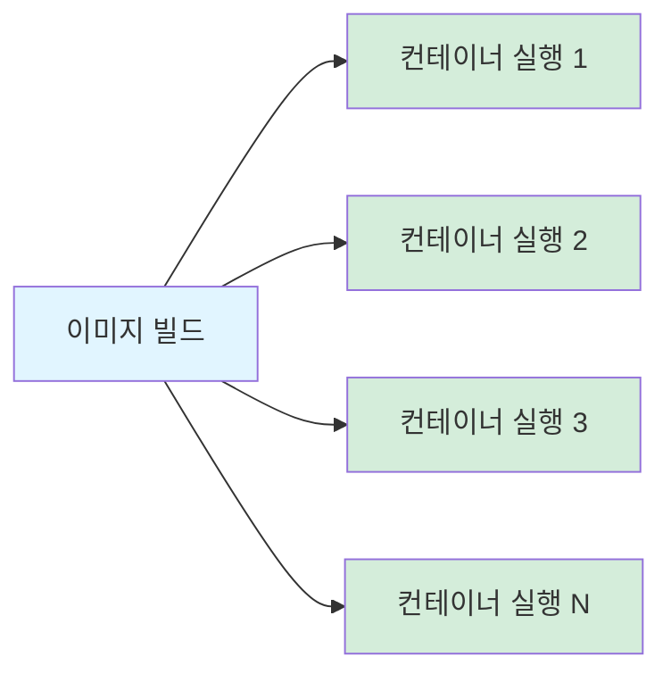
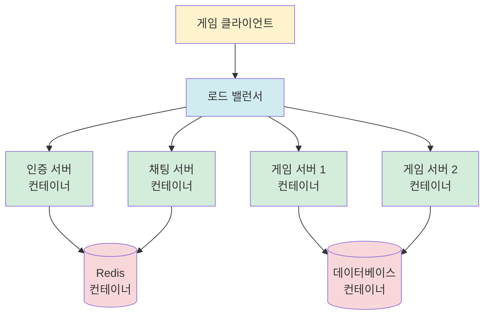
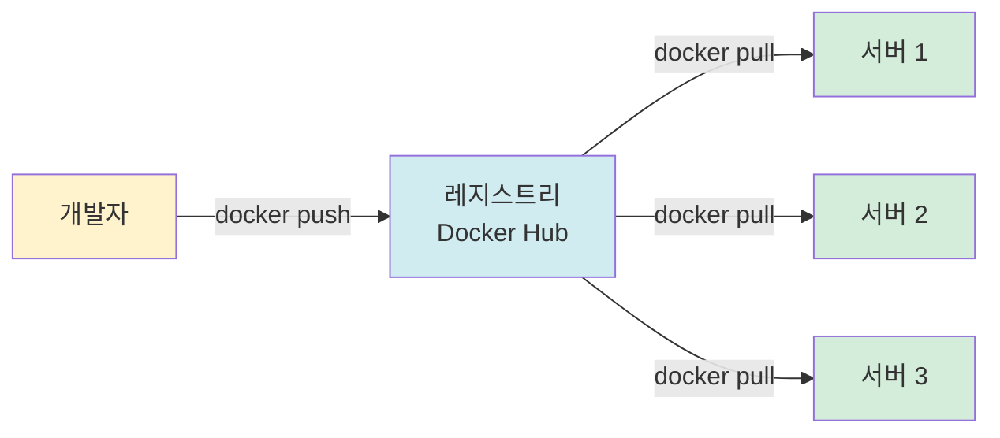
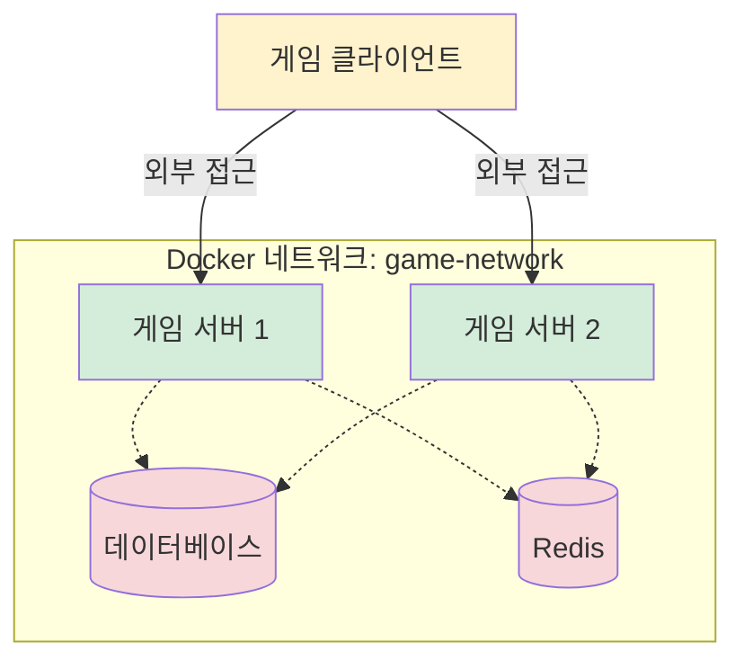
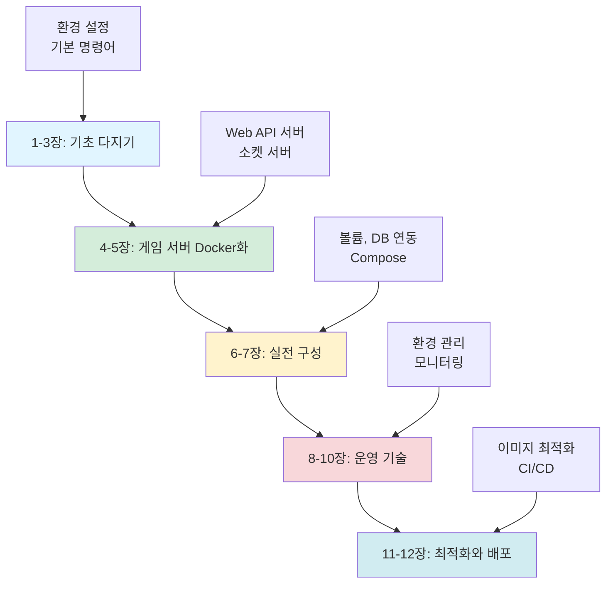
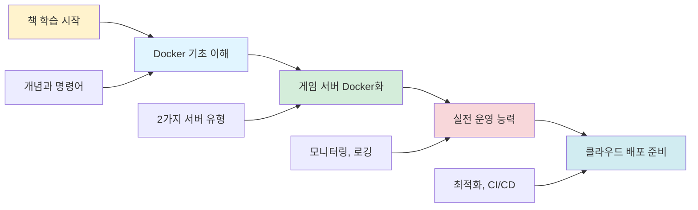

# 게임 서버 개발자를 위한 Docker  

저자: 최흥배, AI-Assisted   
    
권장 개발 환경
- **OS**: Windows 11 이상, WSL2 

-----    
  
# 1장. Docker와 게임 서버 개발

## 1.1 왜 게임 서버에 Docker를 사용하는가?

### 게임 서버 개발의 전통적인 어려움

게임 서버를 개발하고 운영하다 보면 여러 가지 문제에 부딪힌다. 개발자의 로컬 환경에서는 잘 작동하던 서버가 테스트 서버나 실서비스 환경에서는 이상하게 동작하는 경우가 있다. "내 컴퓨터에서는 잘 되는데요"라는 말은 개발팀과 운영팀 사이에서 자주 오가는 불편한 농담이다.

이런 문제가 발생하는 이유는 명확하다. 각 환경마다 운영체제 버전, 설치된 라이브러리, 환경 변수 설정이 다르기 때문이다. .NET 런타임 버전이 다르거나, 필요한 의존성 패키지가 누락되거나, 데이터베이스 연결 설정이 달라서 문제가 발생한다.

```
개발자 PC              테스트 서버            실서비스 서버
┌─────────────┐       ┌─────────────┐       ┌─────────────┐
│ Windows 11  │       │ Ubuntu 20.04│       │ Ubuntu 22.04│
│ .NET 8.0    │       │ .NET 7.0    │       │ .NET 8.0    │
│ Redis 7.0   │       │ Redis 6.2   │       │ Redis 7.2   │
│ MySQL 8.0   │       │ MySQL 5.7   │       │ MySQL 8.0   │
└─────────────┘       └─────────────┘       └─────────────┘
     ✓                     ✗                     ?
  잘 작동함              오류 발생            예측 불가
```

### Docker가 해결하는 문제들

Docker는 이러한 환경 차이 문제를 근본적으로 해결한다. 게임 서버와 필요한 모든 의존성을 하나의 패키지로 묶어서 어디서든 동일하게 실행할 수 있게 만든다.

**환경 일관성 보장**

Docker 컨테이너는 이미지와 실행 설정이 같다면 애플리케이션 의존성을 거의 동일하게 제공한다. 개발자의 노트북에서 실행한 게임 서버와 클라우드 서버에서 실행한 게임 서버가 같은 런타임, 라이브러리, 설정 파일을 사용하도록 만들 수 있다. 다만 CPU 아키텍처, Linux/Windows 컨테이너 종류, 호스트 커널 기능, 파일 시스템 성능, 네트워크/방화벽 설정은 호스트의 영향을 받을 수 있으므로 운영 환경에서는 별도 검증이 필요하다.

**빠른 배포와 확장**

게임이 인기를 얻어 동시 접속자가 급증하면 서버를 빠르게 늘려야 한다. 전통적인 방식으로는 새 서버를 준비하고, 운영체제를 설치하고, 의존성을 설치하고, 게임 서버를 배포하는 데 시간이 오래 걸린다. Docker를 사용하면 몇 초 만에 새로운 게임 서버 인스턴스를 시작할 수 있다.



**격리와 보안**

각 게임 서버가 독립된 컨테이너에서 실행되므로, 한 서버의 문제가 다른 서버에 영향을 주지 않는다. 메모리 누수가 발생하거나 크래시가 나더라도 해당 컨테이너만 재시작하면 된다. 다른 서버들은 정상적으로 계속 동작한다.

**리소스 효율성**

가상 머신과 달리 Docker 컨테이너는 운영체제 커널을 공유하므로 훨씬 가볍다. 같은 하드웨어에서 더 많은 게임 서버 인스턴스를 실행할 수 있다.

```
가상 머신 방식                     Docker 컨테이너 방식
┌──────────────────┐              ┌──────────────────┐
│   게임 서버 1    │              │   게임 서버 1    │
├──────────────────┤              ├──────────────────┤
│   Guest OS       │              │ 컨테이너 격리 계층│
├──────────────────┤              ├──────────────────┤
│   Hypervisor     │              │   Docker Engine  │
├──────────────────┤              ├──────────────────┤
│   Host OS        │              │   Host OS/Kernel  │
└──────────────────┘              └──────────────────┘
메모리: 보통 GB 단위                메모리: 보통 MB 단위부터
시작 시간: 수십 초~분               시작 시간: 보통 초 단위
```

### 게임 서버 개발 시나리오별 Docker 활용

**로컬 개발 환경**

개발자마다 다른 운영체제를 사용할 수 있다. 어떤 개발자는 Windows를, 어떤 개발자는 macOS를, 또 다른 개발자는 Linux를 사용한다. Docker를 사용하면 모두가 동일한 개발 환경에서 작업할 수 있다.

**테스트 환경**

여러 버전의 게임 서버를 동시에 테스트해야 할 때가 있다. Docker를 사용하면 각 버전을 독립된 컨테이너로 실행하여 충돌 없이 테스트할 수 있다.

**스테이징과 프로덕션**

스테이징 환경에서 검증된 같은 이미지와 같은 실행 설정을 프로덕션에 배포한다. "스테이징에서는 문제없었는데 실서버에서만 버그가 발생한다"는 상황을 크게 줄일 수 있지만, 호스트 자원, 커널/플랫폼, 외부 서비스, 네트워크 정책 차이는 별도로 확인해야 한다.

**마이크로서비스 아키텍처**

대규모 게임 서버는 여러 서비스로 나뉜다. 인증 서버, 게임 로직 서버, 채팅 서버, 랭킹 서버 등이 각각 독립적으로 동작한다. Docker를 사용하면 각 서비스를 독립적으로 개발, 배포, 확장할 수 있다.



## 1.2 Docker의 핵심 개념

Docker를 제대로 이해하려면 몇 가지 핵심 개념을 알아야 한다. 이 개념들은 실습을 진행하면서 계속 등장하므로 명확히 이해하고 넘어가는 것이 중요하다.

### 이미지(Image)

이미지는 게임 서버를 실행하는 데 필요한 모든 것을 담은 템플릿이다. 운영체제, .NET 런타임, 게임 서버 코드, 설정 파일 등이 모두 포함된다. 이미지는 읽기 전용이며, 한 번 만들어지면 변경되지 않는다.

게임 CD나 설치 파일을 생각하면 이해하기 쉽다. CD 자체는 변하지 않지만, 그것을 사용해서 여러 컴퓨터에 게임을 설치할 수 있다.

```
이미지 = 게임 서버 실행을 위한 모든 파일의 스냅샷

┌─────────────────────────────────┐
│  게임 서버 이미지               │
├─────────────────────────────────┤
│  • Ubuntu 22.04                 │
│  • .NET 8.0 Runtime             │
│  • 게임 서버 실행 파일          │
│  • appsettings.json             │
│  • 의존성 라이브러리            │
└─────────────────────────────────┘
```

### 컨테이너(Container)

컨테이너는 이미지를 실행한 인스턴스다. 하나의 이미지로 여러 컨테이너를 만들 수 있다. 각 컨테이너는 독립적으로 실행되며, 서로 격리되어 있다.

게임 CD로 여러 컴퓨터에 게임을 설치하는 것과 비슷하다. CD(이미지)는 하나지만, 각 컴퓨터에서 실행되는 게임(컨테이너)은 독립적이다.

```
하나의 이미지 → 여러 개의 컨테이너

     [게임 서버 이미지]
            │
            ├──→ [컨테이너 1] 포트 8001
            ├──→ [컨테이너 2] 포트 8002
            └──→ [컨테이너 3] 포트 8003
```

### Dockerfile

Dockerfile은 이미지를 만드는 방법을 정의한 텍스트 파일이다. 어떤 베이스 이미지를 사용할지, 어떤 파일을 복사할지, 어떤 명령을 실행할지를 순서대로 작성한다.

게임 설치 스크립트나 레시피라고 생각하면 된다. "먼저 이것을 설치하고, 그 다음 이 파일을 복사하고, 마지막으로 이 명령을 실행한다"는 식의 지시사항이다.

```dockerfile
# 간단한 Dockerfile 예시
FROM mcr.microsoft.com/dotnet/aspnet:8.0
WORKDIR /app
COPY GameServer.dll .
EXPOSE 8080
CMD ["dotnet", "GameServer.dll"]
```

### 레지스트리(Registry)

레지스트리는 이미지를 저장하고 공유하는 저장소다. Docker Hub가 가장 유명한 공개 레지스트리이며, 회사 내부용 프라이빗 레지스트리도 운영할 수 있다.

앱 스토어나 구글 플레이 스토어와 비슷한 역할을 한다. 개발자가 이미지를 업로드하면, 다른 사람들이 그 이미지를 다운로드해서 사용할 수 있다.



### 볼륨(Volume)

컨테이너는 기본적으로 일시적이다. 컨테이너를 삭제하면 그 안의 데이터도 함께 사라진다. 게임 서버의 경우 플레이어 데이터, 로그, 설정 등을 영구적으로 보관해야 한다. 볼륨은 이런 데이터를 컨테이너 외부에 저장하는 방법이다.

```
볼륨 없이                        볼륨 사용
┌──────────────┐                ┌──────────────┐
│  컨테이너    │                │  컨테이너    │
│              │                │              │
│  ┌────────┐  │                │  ┌────────┐  │
│  │ 데이터 │  │                │  │ 데이터 │◄─┼──┐
│  └────────┘  │                │  └────────┘  │  │
└──────────────┘                └──────────────┘  │
      │                                           │
   삭제하면                                       │
   데이터 손실                          ┌─────────▼──┐
                                       │  볼륨      │
                                       │  (영구저장)│
                                       └────────────┘
```

### 네트워크(Network)

컨테이너들이 서로 통신하려면 네트워크가 필요하다. Docker는 여러 네트워크 모드를 제공하며, 각 컨테이너를 적절한 네트워크에 연결할 수 있다.

게임 서버와 데이터베이스가 각각 컨테이너로 실행된다면, 이 둘을 같은 네트워크에 연결해야 서로 통신할 수 있다.



### Docker의 작동 원리

Docker는 운영체제 수준의 격리 기술을 사용한다. Linux 컨테이너는 Linux 커널의 namespace, cgroup 같은 기능으로 프로세스를 격리하며, 가상 머신처럼 전체 운영체제를 매번 부팅하지 않는다. 단, Windows에서 Docker Desktop으로 Linux 컨테이너를 실행할 때는 보통 WSL2 기반의 경량 Linux VM 안에서 Docker Engine이 동작하므로, Windows 커널을 직접 공유하는 것은 아니다. Windows 컨테이너는 Windows 커널 계열을 사용한다.

```
┌─────────────────────────────────────────────────┐
│                                                 │
│  ┌──────────┐  ┌──────────┐  ┌──────────┐     │
│  │게임서버 1│  │게임서버 2│  │데이터베이스│   │  컨테이너 계층
│  └──────────┘  └──────────┘  └──────────┘     │
│                                                 │
├─────────────────────────────────────────────────┤
│              Docker Engine                      │  Docker 엔진
├─────────────────────────────────────────────────┤
│              Linux Kernel / Windows Kernel      │  컨테이너 종류에 따라 공유
└─────────────────────────────────────────────────┘
```

이 구조 덕분에 컨테이너는 가볍고 빠르다. 전체 운영체제를 부팅하지 않으므로 몇 초 안에 시작할 수 있다.

### 이미지 레이어 시스템

Docker 이미지는 여러 레이어로 구성된다. 각 레이어는 읽기 전용이며, 변경사항만 새로운 레이어로 추가된다. 이 구조 덕분에 이미지 크기가 작아지고, 빌드 속도가 빨라진다.

```
게임 서버 이미지 레이어 구조

┌─────────────────────────────┐
│  게임 서버 실행 파일        │  ← Layer 4 (최종 레이어)
├─────────────────────────────┤
│  .NET SDK 및 빌드 도구      │  ← Layer 3
├─────────────────────────────┤
│  .NET Runtime               │  ← Layer 2
├─────────────────────────────┤
│  Ubuntu Base OS             │  ← Layer 1 (베이스 레이어)
└─────────────────────────────┘

각 레이어는 독립적으로 캐싱되고 재사용됨
```

예를 들어 게임 서버 코드만 수정했다면, Ubuntu나 .NET 런타임 레이어는 그대로 재사용하고 마지막 레이어만 다시 빌드한다.

## 1.3 이 책에서 다룰 내용

이 책은 게임 서버 개발자가 Docker를 실무에서 바로 활용할 수 있도록 실습 중심으로 구성했다.

### 학습 로드맵



### 2가지 게임 서버 유형

이 책에서는 실무에서 가장 많이 사용하는 2가지 게임 서버 유형을 다룬다.

**ASP.NET Web API 게임 서버**

HTTP/HTTPS 기반의 RESTful API 서버다. 모바일 게임이나 턴제 게임에서 주로 사용한다. 클라이언트가 HTTP 요청을 보내면 서버가 JSON 형태로 응답한다.

```
클라이언트                       Web API 서버
    │                                │
    │  POST /api/login               │
    │  { "userId": "player1" }       │
    ├───────────────────────────────>│
    │                                │
    │  200 OK                        │
    │  { "token": "abc123" }         │
    │<───────────────────────────────┤
    │                                │
    │  GET /api/player/inventory     │
    ├───────────────────────────────>│
    │                                │
    │  200 OK                        │
    │  { "items": [...] }            │
    │<───────────────────────────────┤
```

**Socket 게임 서버**

TCP 소켓 기반의 실시간 통신 서버다. MMORPG나 실시간 대전 게임에서 사용한다. 클라이언트와 서버가 지속적인 연결을 유지하며 빠르게 데이터를 주고받는다.

```
클라이언트                       Socket 서버
    │                                │
    │  연결 요청                     │
    ├───────────────────────────────>│
    │                                │
    │  연결 승인                     │
    │<───────────────────────────────┤
    │                                │
    │  패킷: 이동 (x:100, y:200)     │
    ├───────────────────────────────>│
    │                                │
    │  패킷: 다른 플레이어 위치      │
    │<───────────────────────────────┤
    │                                │
    │  패킷: 공격                    │
    ├───────────────────────────────>│
    │                                │
    │  패킷: 데미지 결과             │
    │<───────────────────────────────┤
```

### 실습 환경: Windows + WSL

모든 실습은 Windows 환경에서 WSL2를 사용해서 진행한다. WSL2는 Windows에서 Microsoft가 제공하는 Linux 커널을 경량 가상 머신 형태로 실행하게 해주는 기술이며, Docker Desktop의 Linux 컨테이너 백엔드로 널리 사용된다.

```
┌─────────────────────────────────────────┐
│           Windows 11                    │
│                                         │
│  ┌───────────────────────────────────┐ │
│  │         WSL2 Ubuntu                │ │
│  │                                   │ │
│  │  ┌─────────────────────────────┐ │ │
│  │  │   Docker Engine             │ │ │
│  │  │                             │ │ │
│  │  │  [컨테이너] [컨테이너]     │ │ │
│  │  └─────────────────────────────┘ │ │
│  └───────────────────────────────────┘ │
│                                         │
│  [VS Code] [터미널] [브라우저]         │
└─────────────────────────────────────────┘
```

Windows에서 편하게 VS Code로 코딩하고, WSL의 Linux 환경에서 Docker를 실행한다. 두 환경이 자연스럽게 연결되어 개발 경험이 매우 좋다.

### 각 장의 구성

각 장은 다음과 같은 구조로 이루어진다.

**이론 설명**: 개념을 명확히 이해할 수 있도록 그림과 함께 설명한다.

**실습 예제**: 직접 따라 할 수 있는 코드와 명령어를 제공한다. 모든 예제는 실제로 동작하는 완전한 코드다.

**문제 해결**: 실습 중 발생할 수 있는 문제와 해결 방법을 안내한다.

**핵심 정리**: 각 장의 끝에서 핵심 내용을 요약한다.

### 예상 학습 시간

이 책의 내용을 처음부터 끝까지 실습하면서 학습하는 데 대략 20-30시간이 필요하다.

- 1-3장 (기초): 4-6시간
- 4-5장 (게임 서버 Docker화): 6-8시간
- 6-7장 (실전 구성): 4-6시간
- 8-10장 (운영): 4-6시간
- 11-12장 (최적화): 2-4시간

실습을 건너뛰고 개념만 빠르게 파악하려면 5-8시간 정도면 충분하다.

### 학습 후 기대 효과

이 책의 학습을 마치면 다음과 같은 것들을 할 수 있게 된다.

- ASP.NET Web API 게임 서버를 Docker 컨테이너로 실행할 수 있다.
- TCP 소켓 게임 서버를 Docker화하고 클라이언트와 연결할 수 있다.
- Docker Compose로 게임 서버, 데이터베이스, 캐시 서버를 함께 구성할 수 있다.
- 개발, 테스트, 운영 환경을 일관되게 관리할 수 있다.
- 게임 서버를 클라우드 환경에 배포할 준비를 할 수 있다.
- 컨테이너 기반 마이크로서비스 아키텍처를 이해하고 적용할 수 있다.



### 선수 지식

이 책을 학습하기 위해 필요한 기본 지식은 다음과 같다.

- C# 프로그래밍 기초
- ASP.NET Core 또는 .NET 기본 개념
- 기본적인 Linux 명령어 (cd, ls, mkdir 등)
- 네트워크 기초 (IP, 포트, HTTP의 개념)

Docker나 컨테이너 관련 지식은 전혀 없어도 된다. 이 책이 처음부터 차근차근 안내한다.

### 다음 장에서는

2장에서는 Windows에 WSL2를 설치하고, Docker Desktop을 설치한다. 개발 환경을 완벽하게 구축하고, 첫 Docker 명령어를 실행해본다. 실제 게임 서버를 만들기 전에 필요한 모든 준비를 마친다.

---

**핵심 정리**

- Docker는 게임 서버 개발에서 환경 일관성, 빠른 배포, 효율적인 리소스 사용을 제공한다.
- 이미지는 템플릿이고, 컨테이너는 실행 인스턴스다.
- 이 책은 Web API와 Socket 2가지 게임 서버를 다룬다.
- 모든 실습은 Windows + WSL 환경에서 진행한다.
- 실습 중심으로 구성되어 있으며, 따라하면서 배울 수 있다.  