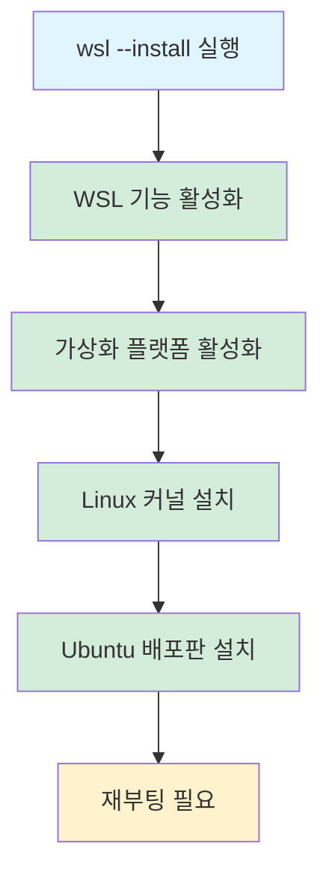
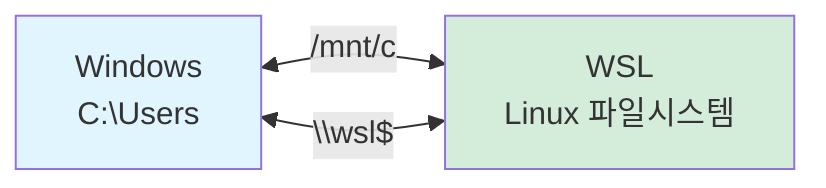
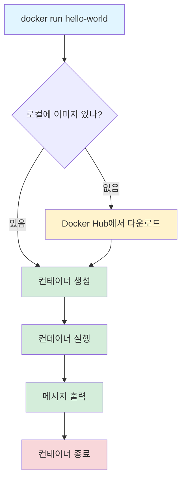
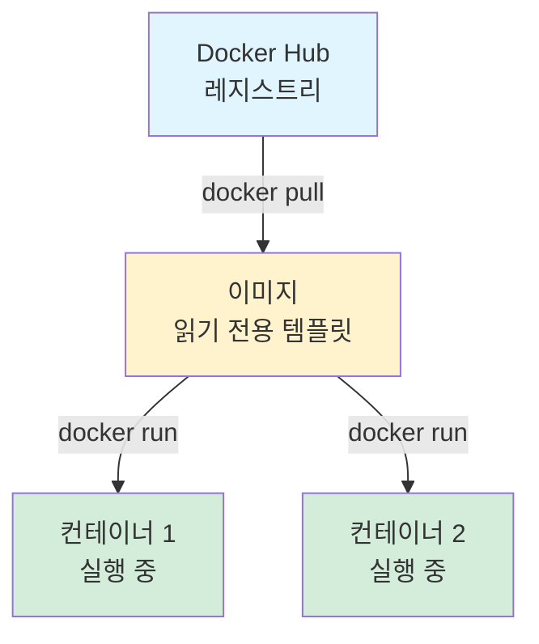

# 게임 서버 개발자를 위한 Docker  

저자: 최흥배, AI-Assisted   
    
권장 개발 환경
- **OS**: Windows 11 이상, WSL2 

-----    
  
# 2장. Windows WSL 환경 구축

이 장에서는 Windows에서 Docker를 사용하기 위한 환경을 처음부터 끝까지 구축한다. WSL2 설치부터 Docker Desktop 설정, 개발 도구 준비까지 모든 과정을 단계별로 진행한다.

## 2.1 WSL2 설치 및 설정

WSL(Windows Subsystem for Linux)은 Windows에서 Linux 사용자 공간을 실행할 수 있게 해주는 기술이다. WSL2는 실제 Linux 커널을 사용하는 경량 VM 구조라 Docker Desktop의 Linux 컨테이너 백엔드로 적합하다. 다만 시스템 서비스 자동 시작, 파일 I/O 성능, 네트워크 포워딩처럼 Windows/WSL 통합 지점에서는 일반 Linux 서버와 차이가 있을 수 있다.

### 시스템 요구사항 확인

WSL2를 설치하기 전에 시스템이 요구사항을 만족하는지 확인해야 한다.

- Windows 10 버전 2004 이상 (빌드 19041 이상) 또는 Windows 11
- 64비트 프로세서
- 최소 4GB RAM (8GB 이상 권장)
- BIOS에서 가상화 기능 활성화

Windows 버전을 확인하려면 `Win + R`을 누르고 `winver`를 입력한다. 버전과 빌드 번호가 표시된다.

```
┌─────────────────────────────────┐
│  Windows 정보                   │
├─────────────────────────────────┤
│  버전: 22H2                     │
│  OS 빌드: 19045.xxxx            │
│                                 │
│  ✓ WSL2 설치 가능               │
└─────────────────────────────────┘
```

### WSL2 설치하기

Windows 10 버전 2004 이상에서는 한 줄의 명령으로 WSL을 설치할 수 있다.

**1단계: PowerShell을 관리자 권한으로 실행한다**

시작 메뉴에서 "PowerShell"을 검색하고 마우스 오른쪽 버튼을 클릭한 후 "관리자 권한으로 실행"을 선택한다.

**2단계: WSL 설치 명령 실행**

```powershell
wsl --install
```

이 명령은 다음 작업들을 자동으로 수행한다.

- WSL 기능 활성화
- Virtual Machine Platform 기능 활성화
- Linux 커널 업데이트 패키지 다운로드
- WSL2를 기본 버전으로 설정
- Ubuntu 배포판 설치



설치가 완료되면 컴퓨터를 재부팅해야 한다.

**3단계: 재부팅 후 Ubuntu 초기 설정**

재부팅 후 자동으로 Ubuntu 터미널이 열리며 사용자 계정을 생성하라는 메시지가 표시된다.

```
Installing, this may take a few minutes...
Please create a default UNIX user account.
Enter new UNIX username: gamedev
New password: 
Retype new password:
```

사용자 이름과 비밀번호를 입력한다. 이 비밀번호는 `sudo` 명령을 사용할 때 필요하므로 기억해야 한다.

### WSL2 버전 확인

설치가 제대로 되었는지 확인하려면 PowerShell에서 다음 명령을 실행한다.

```powershell
wsl --list --verbose
```

출력 결과는 다음과 같다.

```
  NAME      STATE           VERSION
* Ubuntu    Running         2
```

VERSION이 2로 표시되면 WSL2가 정상적으로 설치된 것이다.

### 구형 Windows에서 수동 설치

Windows 10 버전이 낮거나 `wsl --install` 명령이 작동하지 않으면 수동으로 설치해야 한다.

**1단계: 필수 기능 활성화**

PowerShell(관리자)에서 다음 명령을 실행한다.

```powershell
dism.exe /online /enable-feature /featurename:Microsoft-Windows-Subsystem-Linux /all /norestart

dism.exe /online /enable-feature /featurename:VirtualMachinePlatform /all /norestart
```

**2단계: 재부팅**

컴퓨터를 재부팅한다.

**3단계: WSL2 Linux 커널 업데이트**

Microsoft 공식 사이트에서 WSL2 Linux 커널 업데이트 패키지를 다운로드한다.

https://aka.ms/wsl2kernel

다운로드한 파일을 실행하여 설치한다.

**4단계: WSL2를 기본 버전으로 설정**

```powershell
wsl --set-default-version 2
```

**5단계: Linux 배포판 설치**

Microsoft Store를 열고 "Ubuntu"를 검색하여 설치한다. "Ubuntu 22.04 LTS"를 권장한다.

### Ubuntu 업데이트

WSL Ubuntu를 처음 실행하면 패키지를 업데이트하는 것이 좋다.

Ubuntu 터미널을 열고 다음 명령을 실행한다.

```bash
sudo apt update
sudo apt upgrade -y
```

비밀번호를 입력하면 모든 패키지가 최신 버전으로 업데이트된다.

```
┌─────────────────────────────────────┐
│  gamedev@DESKTOP-123:~$             │
├─────────────────────────────────────┤
│  $ sudo apt update                  │
│  Hit:1 http://archive.ubuntu.com... │
│  Get:2 http://security.ubuntu.com...│
│                                     │
│  $ sudo apt upgrade -y              │
│  Reading package lists... Done      │
│  Upgrading packages...              │
│                                     │
│  ✓ 시스템 최신 상태                 │
└─────────────────────────────────────┘
```

### WSL 기본 설정

WSL의 리소스 사용량을 제한하거나 설정을 변경하고 싶다면 `.wslconfig` 파일을 만든다.

Windows 사용자 폴더(보통 `C:\Users\사용자이름`)에 `.wslconfig` 파일을 생성하고 다음 내용을 입력한다.

```ini
[wsl2]
memory=4GB
processors=2
swap=2GB
```

이 설정은 WSL2가 최대 4GB 메모리와 2개의 CPU 코어를 사용하도록 제한한다. 개발 중인 게임 서버의 규모에 따라 조정한다.

설정을 적용하려면 PowerShell에서 WSL을 종료하고 다시 시작한다.

```powershell
wsl --shutdown
wsl
```

### WSL 파일 시스템 이해

WSL과 Windows는 서로의 파일 시스템에 접근할 수 있다.

**WSL에서 Windows 파일 접근**

Windows의 C 드라이브는 WSL에서 `/mnt/c`로 접근한다.

```bash
cd /mnt/c/Users/사용자이름/Desktop
ls
```

**Windows에서 WSL 파일 접근**

Windows 탐색기 주소창에 `\\wsl$`를 입력하면 WSL 파일 시스템이 표시된다.

```
Windows 탐색기
└── \\wsl$
    └── Ubuntu
        ├── home
        │   └── gamedev
        │       └── projects
        └── etc
```



## 2.2 Docker Desktop 설치

Docker Desktop은 Windows에서 Docker를 쉽게 사용할 수 있게 해주는 애플리케이션이다. WSL2와 통합되어 Linux 컨테이너를 네이티브 속도로 실행한다.

### Docker Desktop 다운로드

Docker 공식 웹사이트에서 Docker Desktop을 다운로드한다.

https://www.docker.com/products/docker-desktop

"Download for Windows" 버튼을 클릭하여 설치 파일을 다운로드한다.

### Docker Desktop 설치

**1단계: 설치 파일 실행**

다운로드한 `Docker Desktop Installer.exe` 파일을 실행한다.

**2단계: 설정 확인**

설치 중에 다음 옵션들을 확인한다.

- ✓ Use WSL 2 instead of Hyper-V (recommended)
- ✓ Add shortcut to desktop

"Use WSL 2 instead of Hyper-V" 옵션이 체크되어 있는지 반드시 확인한다.

```
┌─────────────────────────────────────┐
│  Docker Desktop Setup               │
├─────────────────────────────────────┤
│                                     │
│  ☑ Use WSL 2 instead of Hyper-V     │
│    (recommended)                    │
│                                     │
│  ☑ Add shortcut to desktop          │
│                                     │
│  [    Install    ]  [  Cancel  ]   │
└─────────────────────────────────────┘
```

**3단계: 설치 완료 및 재시작**

설치가 완료되면 컴퓨터를 재시작한다.

### Docker Desktop 초기 설정

재부팅 후 Docker Desktop이 자동으로 실행된다.

**1단계: 서비스 약관 동의**

서비스 약관을 읽고 "Accept" 버튼을 클릭한다.

**2단계: 설문조사 건너뛰기**

선택 사항인 설문조사는 "Skip"을 클릭하여 건너뛸 수 있다.

**3단계: Docker Desktop 시작**

Docker Desktop이 시작되면 시스템 트레이에 고래 아이콘이 표시된다. 아이콘이 정지 상태가 되면 Docker가 정상적으로 실행 중인 것이다.

```
시스템 트레이
┌─────────────────┐
│  🐋 Docker      │
│  Engine running │
└─────────────────┘
```

### WSL 통합 확인

Docker Desktop이 WSL2와 제대로 통합되었는지 확인한다.

**1단계: Docker Desktop 설정 열기**

시스템 트레이의 Docker 아이콘을 클릭하고 "Settings"를 선택한다.

**2단계: Resources > WSL Integration 메뉴**

왼쪽 메뉴에서 "Resources"를 클릭하고 "WSL Integration"을 선택한다.

**3단계: Ubuntu 활성화**

"Enable integration with my default WSL distro" 옵션을 활성화하고, Ubuntu 배포판도 토글을 켜서 활성화한다.

```
Docker Desktop Settings
┌─────────────────────────────────────┐
│  Resources > WSL Integration        │
├─────────────────────────────────────┤
│                                     │
│  ☑ Enable integration with my       │
│    default WSL distro               │
│                                     │
│  Ubuntu-22.04        [ON]  ←─ 활성화│
│                                     │
│  [  Apply & Restart  ]              │
└─────────────────────────────────────┘
```

"Apply & Restart" 버튼을 클릭하여 설정을 적용한다.

### Docker 설치 확인

WSL Ubuntu 터미널을 열고 Docker가 정상적으로 설치되었는지 확인한다.

```bash
docker --version
```

출력 예시:

```
Docker version 24.0.6, build ed223bc
```

Docker Compose 버전도 확인한다.

```bash
docker compose version
```

출력 예시:

```
Docker Compose version v2.23.0
```

### 첫 번째 Docker 명령 실행

Docker가 제대로 작동하는지 테스트한다.

```bash
docker run hello-world
```

이 명령은 다음 작업을 수행한다.

1. 로컬에 `hello-world` 이미지가 있는지 확인
2. 없으면 Docker Hub에서 이미지 다운로드
3. 컨테이너를 생성하고 실행
4. 메시지를 출력하고 종료



정상적으로 실행되면 다음과 같은 메시지가 출력된다.

```
Unable to find image 'hello-world:latest' locally
latest: Pulling from library/hello-world
c1ec31eb5944: Pull complete
Digest: sha256:4bd78111b6914a99dbc560e6a20eab57ff6655aea4a80c50b0c5491968cbc2e6
Status: Downloaded newer image for hello-world:latest

Hello from Docker!
This message shows that your installation appears to be working correctly.

To generate this message, Docker took the following steps:
 1. The Docker client contacted the Docker daemon.
 2. The Docker daemon pulled the "hello-world" image from the Docker Hub.
 3. The Docker daemon created a new container from that image which runs the
    executable that produces the output you are currently reading.
 4. The Docker daemon streamed that output to the Docker client, which sent it
    to your terminal.
```

## 2.3 개발 환경 준비 (VS Code, .NET SDK)

게임 서버를 개발하려면 코드 편집기와 .NET SDK가 필요하다.

### Visual Studio Code 설치

VS Code는 가볍고 강력한 코드 편집기로, Docker와 WSL을 훌륭하게 지원한다.

**1단계: VS Code 다운로드**

https://code.visualstudio.com

"Download for Windows" 버튼을 클릭하여 설치 파일을 다운로드한다.

**2단계: 설치**

다운로드한 파일을 실행하고 기본 설정으로 설치한다. 설치 중 다음 옵션들을 체크한다.

- ✓ Add "Open with Code" action to Windows Explorer file context menu
- ✓ Add "Open with Code" action to Windows Explorer directory context menu
- ✓ Register Code as an editor for supported file types
- ✓ Add to PATH

**3단계: 필수 확장 설치**

VS Code를 실행하고 다음 확장들을 설치한다.

Extensions 탭(`Ctrl+Shift+X`)을 열고 검색하여 설치한다.

1. **WSL** - Microsoft 제공, WSL과 원활하게 작업
2. **Docker** - Microsoft 제공, Dockerfile 편집 및 컨테이너 관리
3. **C# Dev Kit** - Microsoft 제공, C# 개발 지원
4. **Remote - SSH** - Microsoft 제공 (선택사항)

```
VS Code Extensions
┌─────────────────────────────────────┐
│  [검색: wsl]                        │
├─────────────────────────────────────┤
│  WSL                                │
│  Microsoft                          │
│  [Install]                          │
├─────────────────────────────────────┤
│  Docker                             │
│  Microsoft                          │
│  [Install]                          │
├─────────────────────────────────────┤
│  C# Dev Kit                         │
│  Microsoft                          │
│  [Install]                          │
└─────────────────────────────────────┘
```

### WSL에서 VS Code 사용

WSL에서 VS Code를 실행하는 방법을 알아본다.

**방법 1: WSL 터미널에서 실행**

WSL Ubuntu 터미널에서 프로젝트 폴더로 이동하고 `code .` 명령을 실행한다.

```bash
mkdir -p ~/projects/game-server
cd ~/projects/game-server
code .
```

VS Code가 WSL 모드로 열린다. 왼쪽 하단에 "WSL: Ubuntu"가 표시된다.

**방법 2: VS Code에서 WSL 연결**

VS Code를 실행하고 `F1`을 누른 후 "WSL: Connect to WSL"을 선택한다.

```
┌─────────────────────────────────────┐
│  > WSL: Connect to WSL              │
├─────────────────────────────────────┤
│  WSL: New WSL Window                │
│  WSL: New WSL Window using Distro...│
│  WSL: Open Folder in WSL...         │
└─────────────────────────────────────┘
```

### .NET SDK 설치 (WSL)

게임 서버를 개발하려면 .NET SDK가 필요하다. WSL Ubuntu에 .NET 8.0 SDK를 설치한다.

**1단계: Microsoft 패키지 저장소 추가**

WSL Ubuntu 터미널에서 다음 명령을 실행한다.

```bash
wget https://packages.microsoft.com/config/ubuntu/22.04/packages-microsoft-prod.deb -O packages-microsoft-prod.deb
sudo dpkg -i packages-microsoft-prod.deb
rm packages-microsoft-prod.deb
```

**2단계: .NET SDK 설치**

```bash
sudo apt update
sudo apt install -y dotnet-sdk-8.0
```

**3단계: 설치 확인**

```bash
dotnet --version
```

출력 예시:

```
8.0.100
```

정상적으로 설치되었다.

### 간단한 테스트 프로젝트 생성

.NET이 제대로 작동하는지 확인하기 위해 간단한 콘솔 애플리케이션을 만든다.

```bash
cd ~/projects
dotnet new console -n HelloDocker
cd HelloDocker
```

`Program.cs` 파일을 열어본다.

```bash
cat Program.cs
```

기본 코드가 표시된다.

```csharp
// See https://aka.ms/new-console-template for more information
Console.WriteLine("Hello, World!");
```

프로그램을 실행한다.

```bash
dotnet run
```

출력:

```
Hello, World!
```

### 개발 도구 설치 (선택사항)

게임 서버 개발에 유용한 추가 도구들을 설치할 수 있다.

**Git 설치**

버전 관리를 위해 Git을 설치한다.

```bash
sudo apt install -y git
git --version
```

**기본 Git 설정**

```bash
git config --global user.name "Your Name"
git config --global user.email "your.email@example.com"
```

**cURL 설치**

API 테스트에 유용한 cURL을 설치한다.

```bash
sudo apt install -y curl
curl --version
```

**jq 설치**

JSON 응답을 예쁘게 표시하는 jq를 설치한다.

```bash
sudo apt install -y jq
echo '{"name":"player1","level":10}' | jq
```

출력:

```json
{
  "name": "player1",
  "level": 10
}
```

## 2.4 첫 Docker 명령어 실습

환경 설정이 모두 완료되었으니 이제 본격적으로 Docker를 사용해본다.

### Docker 기본 구조 이해

Docker를 사용할 때 이해해야 할 기본 구조는 다음과 같다.



### 이미지 검색

Docker Hub에서 사용 가능한 이미지를 검색한다.

```bash
docker search nginx
```

출력 예시:

```
NAME                               DESCRIPTION                                     STARS     OFFICIAL
nginx                              Official build of Nginx.                        19000     [OK]
nginx/nginx-ingress                NGINX Ingress Controller for Kubernetes         85
nginxinc/nginx-unprivileged        Unprivileged NGINX Dockerfiles                  150
```

### 이미지 다운로드

Nginx 웹 서버 이미지를 다운로드한다.

```bash
docker pull nginx:latest
```

다운로드 과정이 표시된다.

```
latest: Pulling from library/nginx
a480a496ba95: Pull complete
f3ace1b8ce45: Pull complete
11d6fdd0e8a7: Pull complete
...
Digest: sha256:...
Status: Downloaded newer image for nginx:latest
docker.io/library/nginx:latest
```

### 다운로드한 이미지 확인

로컬에 저장된 이미지 목록을 확인한다.

```bash
docker images
```

또는

```bash
docker image ls
```

출력 예시:

```
REPOSITORY    TAG       IMAGE ID       CREATED         SIZE
nginx         latest    a72860cb95fd   2 weeks ago     188MB
hello-world   latest    d2c94e258dcb   7 months ago    13.3kB
```

### 컨테이너 실행

Nginx 컨테이너를 실행한다.

```bash
docker run -d -p 8080:80 --name my-nginx nginx:latest
```

명령어 옵션 설명:

- `-d`: 백그라운드에서 실행 (detached mode)
- `-p 8080:80`: 호스트의 8080 포트를 컨테이너의 80 포트로 매핑
- `--name my-nginx`: 컨테이너 이름을 "my-nginx"로 지정
- `nginx:latest`: 사용할 이미지

```
포트 매핑
┌─────────────────┐        ┌─────────────────┐
│  Windows/WSL    │        │  컨테이너       │
│                 │        │                 │
│  localhost:8080 ├───────>│  nginx:80       │
│                 │        │                 │
└─────────────────┘        └─────────────────┘
```

컨테이너가 성공적으로 시작되면 컨테이너 ID가 출력된다.

```
f3c8d9a1b2e4c5d6e7f8a9b0c1d2e3f4a5b6c7d8e9f0a1b2c3d4e5f6a7b8c9d0
```

### 웹 브라우저로 확인

Windows 웹 브라우저를 열고 다음 주소로 접속한다.

```
http://localhost:8080
```

Nginx 기본 페이지가 표시되면 성공이다.

```
┌─────────────────────────────────────┐
│  Welcome to nginx!                  │
├─────────────────────────────────────┤
│  If you see this page, the nginx    │
│  web server is successfully         │
│  installed and working.             │
│                                     │
│  ✓ Docker 컨테이너 정상 동작        │
└─────────────────────────────────────┘
```

### 실행 중인 컨테이너 확인

현재 실행 중인 컨테이너 목록을 확인한다.

```bash
docker ps
```

출력 예시:

```
CONTAINER ID   IMAGE          COMMAND                  CREATED          STATUS          PORTS                  NAMES
f3c8d9a1b2e4   nginx:latest   "/docker-entrypoint.…"   2 minutes ago    Up 2 minutes    0.0.0.0:8080->80/tcp   my-nginx
```

모든 컨테이너(중지된 것 포함)를 보려면 `-a` 옵션을 추가한다.

```bash
docker ps -a
```

### 컨테이너 로그 확인

컨테이너의 로그를 확인한다.

```bash
docker logs my-nginx
```

웹 브라우저로 접속했을 때의 액세스 로그가 표시된다.

```
172.17.0.1 - - [22/Nov/2025:10:30:15 +0000] "GET / HTTP/1.1" 200 615
172.17.0.1 - - [22/Nov/2025:10:30:15 +0000] "GET /favicon.ico HTTP/1.1" 404 555
```

실시간으로 로그를 보려면 `-f` 옵션을 사용한다.

```bash
docker logs -f my-nginx
```

종료하려면 `Ctrl+C`를 누른다.

### 컨테이너 내부 접속

실행 중인 컨테이너 내부로 들어가본다.

```bash
docker exec -it my-nginx bash
```

컨테이너의 쉘 프롬프트가 표시된다.

```
root@f3c8d9a1b2e4:/#
```

컨테이너 내부에서 명령을 실행할 수 있다.

```bash
ls /usr/share/nginx/html/
cat /usr/share/nginx/html/index.html
```

Nginx의 기본 HTML 파일이 표시된다.

컨테이너에서 나가려면 `exit`을 입력한다.

```bash
exit
```

### 컨테이너 중지

실행 중인 컨테이너를 중지한다.

```bash
docker stop my-nginx
```

컨테이너가 중지되었는지 확인한다.

```bash
docker ps
```

아무것도 표시되지 않는다. 모든 컨테이너를 보면 중지된 상태를 확인할 수 있다.

```bash
docker ps -a
```

```
CONTAINER ID   IMAGE          COMMAND                  CREATED         STATUS                     PORTS     NAMES
f3c8d9a1b2e4   nginx:latest   "/docker-entrypoint.…"   10 minutes ago  Exited (0) 10 seconds ago            my-nginx
```

### 컨테이너 재시작

중지된 컨테이너를 다시 시작한다.

```bash
docker start my-nginx
```

`docker ps`로 확인하면 다시 실행 중인 것을 볼 수 있다.

### 컨테이너 삭제

컨테이너를 삭제하려면 먼저 중지해야 한다.

```bash
docker stop my-nginx
docker rm my-nginx
```

또는 강제 삭제도 가능하다.

```bash
docker rm -f my-nginx
```

삭제 확인:

```bash
docker ps -a
```

my-nginx 컨테이너가 목록에서 사라진다.

### 이미지 삭제

더 이상 사용하지 않는 이미지를 삭제한다.

```bash
docker rmi nginx:latest
```

이미지를 사용 중인 컨테이너가 있으면 삭제되지 않는다. 먼저 컨테이너를 삭제해야 한다.

### 실습: ASP.NET 샘플 실행

.NET 공식 이미지를 사용하여 ASP.NET 샘플 애플리케이션을 실행해본다.

```bash
docker run -d -p 5000:8080 --name aspnet-sample mcr.microsoft.com/dotnet/samples:aspnetapp
```

웹 브라우저에서 `http://localhost:5000`으로 접속한다.

ASP.NET 샘플 페이지가 표시된다.

```
┌─────────────────────────────────────┐
│  ASP.NET Core                       │
├─────────────────────────────────────┤
│  Welcome                            │
│  Learn about building Web apps      │
│  with ASP.NET Core.                 │
│                                     │
│  ✓ .NET 컨테이너 정상 동작          │
└─────────────────────────────────────┘
```

작업이 끝나면 정리한다.

```bash
docker stop aspnet-sample
docker rm aspnet-sample
```

### 명령어 정리

지금까지 사용한 주요 명령어를 정리한다.

```bash
# 이미지 관련
docker search <이미지명>         # 이미지 검색
docker pull <이미지명>           # 이미지 다운로드
docker images                    # 이미지 목록
docker rmi <이미지명>            # 이미지 삭제

# 컨테이너 관련
docker run <옵션> <이미지명>     # 컨테이너 생성 및 실행
docker ps                        # 실행 중인 컨테이너 목록
docker ps -a                     # 모든 컨테이너 목록
docker stop <컨테이너명>         # 컨테이너 중지
docker start <컨테이너명>        # 컨테이너 시작
docker restart <컨테이너명>      # 컨테이너 재시작
docker rm <컨테이너명>           # 컨테이너 삭제
docker logs <컨테이너명>         # 로그 확인
docker exec -it <컨테이너명> bash  # 컨테이너 내부 접속
```

### 환경 확인 체크리스트

모든 설정이 제대로 되었는지 최종 확인한다.

```
환경 구축 체크리스트
┌─────────────────────────────────────┐
│  ☑ WSL2 설치 및 Ubuntu 실행         │
│  ☑ Docker Desktop 설치 및 실행      │
│  ☑ WSL 통합 활성화                  │
│  ☑ VS Code 설치 및 확장 설치        │
│  ☑ .NET SDK 8.0 설치                │
│  ☑ docker run hello-world 성공      │
│  ☑ Nginx 컨테이너 실행 및 접속 성공 │
│                                     │
│  ✓ 모든 환경 구축 완료              │
└─────────────────────────────────────┘
```

다음 명령으로 한 번에 확인할 수 있다.

```bash
# WSL 버전 확인
wsl --list --verbose

# Docker 버전 확인
docker --version
docker compose version

# .NET 버전 확인
dotnet --version

# Git 버전 확인
git --version
```

모든 명령이 정상적으로 버전을 출력하면 환경 구축이 완료된 것이다.

---

**핵심 정리**

- WSL2는 Windows에서 진짜 Linux를 실행하는 기술이다.
- Docker Desktop은 WSL2와 통합되어 네이티브 성능을 제공한다.
- VS Code의 WSL 확장을 사용하면 WSL 환경에서 편하게 개발할 수 있다.
- .NET SDK는 WSL Ubuntu에 직접 설치한다.
- docker run, docker ps, docker logs 등 기본 명령어로 컨테이너를 관리한다.
- 포트 매핑(-p)을 통해 호스트에서 컨테이너의 서비스에 접근할 수 있다.  