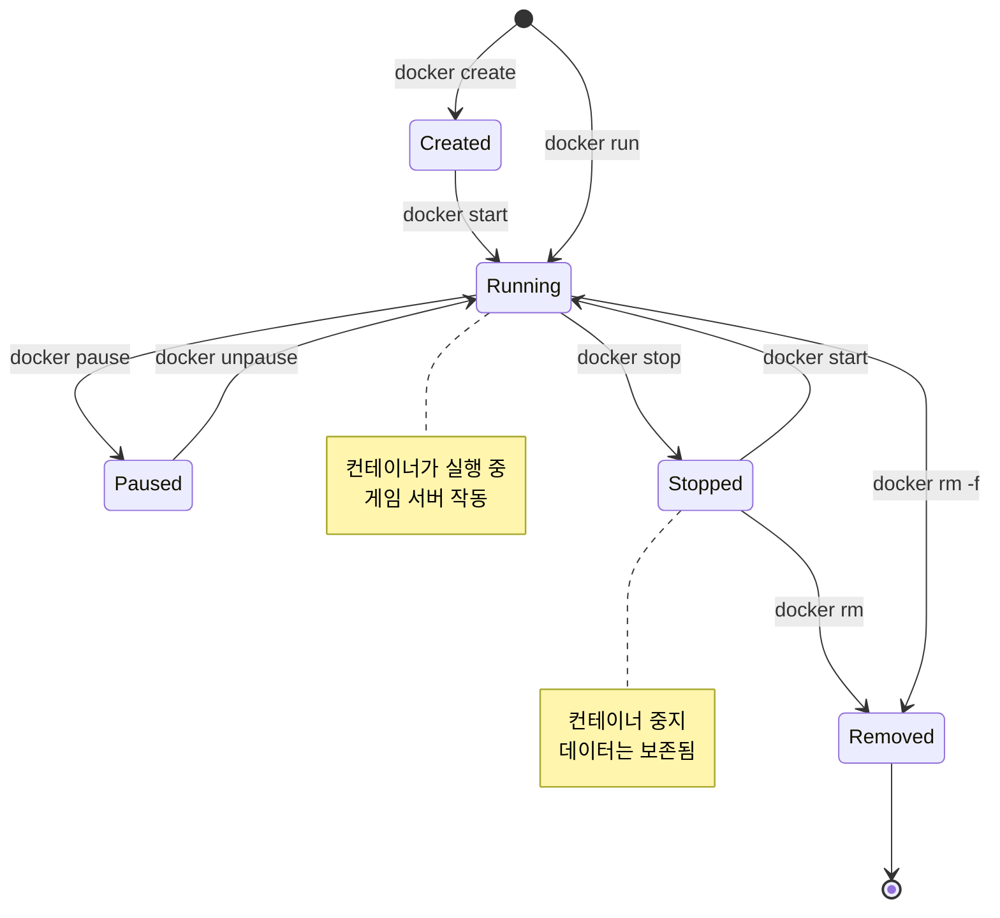
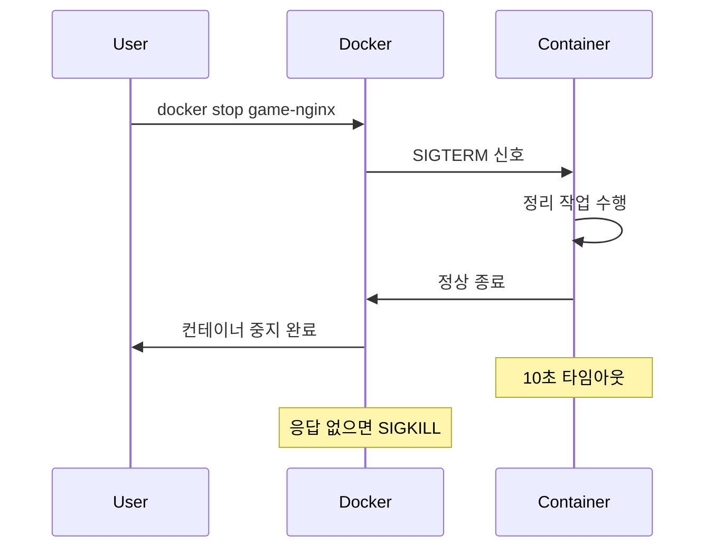
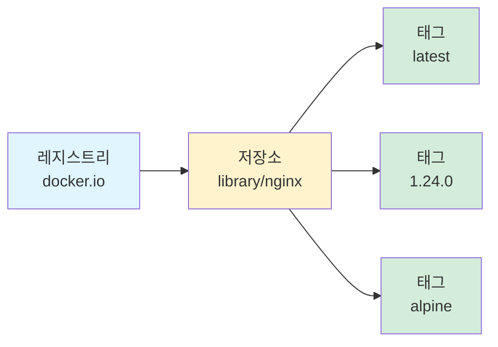
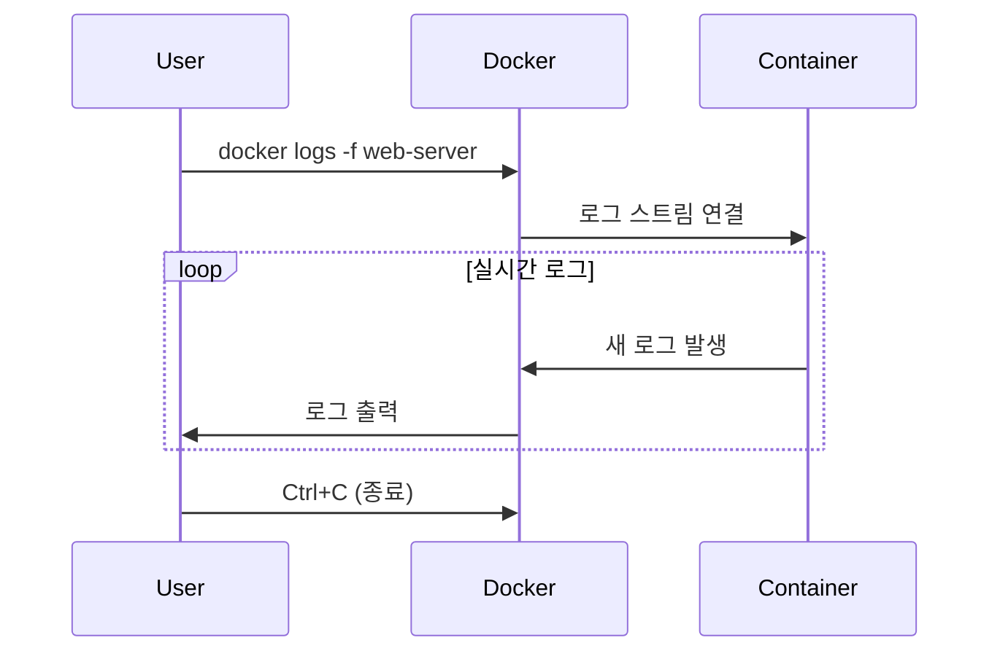
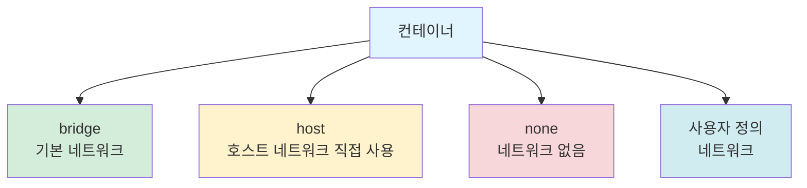
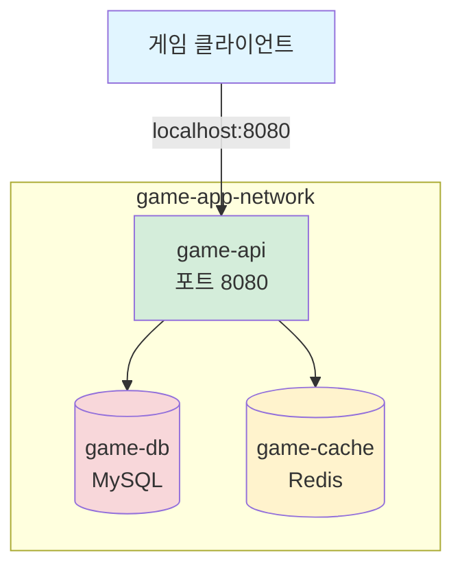

# 게임 서버 개발자를 위한 Docker  

저자: 최흥배, AI-Assisted   
    
권장 개발 환경
- **OS**: Windows 11 이상, WSL2 

-----    
  
# 3장. Docker 기본 실습

이 장에서는 Docker의 핵심 기능들을 실습을 통해 익힌다. 컨테이너의 생명주기, 이미지 관리, 로그 확인, 네트워크 설정 등 게임 서버 개발에 필수적인 Docker 기능들을 단계별로 학습한다.

## 3.1 컨테이너 생명주기 (run, stop, start, rm)

컨테이너는 생성, 실행, 중지, 삭제의 생명주기를 가진다. 게임 서버를 운영하려면 이 생명주기를 정확히 이해하고 제어할 수 있어야 한다.

### 컨테이너 생명주기 이해



### docker run: 컨테이너 생성 및 실행

`docker run`은 가장 자주 사용하는 명령으로, 이미지로부터 컨테이너를 생성하고 바로 실행한다.

**기본 형식**

```bash
docker run [옵션] 이미지명 [명령어]
```

**실습 1: 기본 실행**

간단한 Ubuntu 컨테이너를 실행한다.

```bash
docker run ubuntu:22.04 echo "Hello from Docker!"
```

출력:

```
Hello from Docker!
```

이 명령은 다음 작업을 수행한다:

1. ubuntu:22.04 이미지가 로컬에 없으면 Docker Hub에서 다운로드
2. 새로운 컨테이너 생성
3. 컨테이너 내부에서 `echo "Hello from Docker!"` 명령 실행
4. 명령 완료 후 컨테이너 자동 종료

```
생명주기 흐름
┌──────────┐    ┌──────────┐    ┌──────────┐    ┌──────────┐
│  이미지  │───>│  생성    │───>│  실행    │───>│  종료    │
│  준비    │    │  Create  │    │  Run     │    │  Exit    │
└──────────┘    └──────────┘    └──────────┘    └──────────┘
```

**실습 2: 인터랙티브 모드 실행**

컨테이너 내부에서 직접 명령을 입력하려면 `-it` 옵션을 사용한다.

```bash
docker run -it ubuntu:22.04 bash
```

컨테이너의 bash 쉘이 실행되고 프롬프트가 표시된다.

```
root@a1b2c3d4e5f6:/#
```

컨테이너 내부에서 명령을 실행할 수 있다.

```bash
whoami
pwd
ls /
```

종료하려면 `exit`를 입력한다.

```bash
exit
```

옵션 설명:
- `-i` (interactive): 표준 입력을 활성화하여 상호작용 가능
- `-t` (tty): 터미널 할당

**실습 3: 백그라운드 실행**

게임 서버처럼 계속 실행되어야 하는 컨테이너는 백그라운드 모드로 실행한다.

```bash
docker run -d --name game-redis redis:7.2
```

옵션 설명:
- `-d` (detached): 백그라운드 모드로 실행
- `--name game-redis`: 컨테이너 이름 지정

명령을 실행하면 컨테이너 ID가 출력된다.

```
8f9e0a1b2c3d4e5f6a7b8c9d0e1f2a3b4c5d6e7f8a9b0c1d2e3f4a5b6c7d8e9
```

### docker ps: 컨테이너 목록 확인

실행 중인 컨테이너를 확인한다.

```bash
docker ps
```

출력 예시:

```
CONTAINER ID   IMAGE        COMMAND                  CREATED          STATUS          PORTS      NAMES
8f9e0a1b2c3d   redis:7.2    "docker-entrypoint.s…"   30 seconds ago   Up 29 seconds   6379/tcp   game-redis
```

각 컬럼의 의미:
- **CONTAINER ID**: 컨테이너 고유 ID (처음 12자리)
- **IMAGE**: 사용된 이미지
- **COMMAND**: 실행 중인 명령
- **CREATED**: 생성 시간
- **STATUS**: 현재 상태
- **PORTS**: 포트 매핑 정보
- **NAMES**: 컨테이너 이름

모든 컨테이너(중지된 것 포함)를 보려면 `-a` 옵션을 추가한다.

```bash
docker ps -a
```

**실습 4: 다양한 run 옵션 조합**

실제 게임 서버처럼 여러 옵션을 조합한다.

```bash
docker run -d \
  --name game-nginx \
  -p 8080:80 \
  -e NGINX_HOST=gameserver.local \
  nginx:latest
```

옵션 설명:
- `-d`: 백그라운드 실행
- `--name game-nginx`: 컨테이너 이름
- `-p 8080:80`: 포트 매핑 (호스트:컨테이너)
- `-e`: 환경 변수 설정

웹 브라우저에서 `http://localhost:8080`으로 접속하면 Nginx 페이지가 표시된다.

### docker stop: 컨테이너 중지

실행 중인 컨테이너를 정상적으로 중지한다.

```bash
docker stop game-nginx
```

`docker stop`은 컨테이너에 SIGTERM 신호를 보내 정상 종료를 요청한다. 10초 이내에 종료되지 않으면 강제 종료(SIGKILL)한다.



여러 컨테이너를 한 번에 중지할 수 있다.

```bash
docker stop game-nginx game-redis
```

모든 실행 중인 컨테이너를 중지하려면:

```bash
docker stop $(docker ps -q)
```

`docker ps -q`는 실행 중인 컨테이너 ID만 출력한다.

### docker start: 중지된 컨테이너 재시작

중지된 컨테이너를 다시 시작한다.

```bash
docker start game-nginx
```

여러 컨테이너를 동시에 시작할 수 있다.

```bash
docker start game-nginx game-redis
```

`docker start`와 `docker run`의 차이:
- `docker run`: 새로운 컨테이너를 생성하고 실행
- `docker start`: 기존 컨테이너를 재시작 (설정 유지)

```
docker run vs docker start
┌─────────────────────────────────────────┐
│  docker run                             │
│  이미지 → 새 컨테이너 생성 → 실행       │
└─────────────────────────────────────────┘

┌─────────────────────────────────────────┐
│  docker start                           │
│  기존 컨테이너 → 재시작 (설정 보존)     │
└─────────────────────────────────────────┘
```

### docker restart: 재시작

컨테이너를 중지했다가 다시 시작한다.

```bash
docker restart game-nginx
```

설정 변경 후 재시작이 필요할 때 유용하다.

### docker rm: 컨테이너 삭제

더 이상 필요 없는 컨테이너를 삭제한다.

**중지된 컨테이너 삭제**

```bash
docker stop game-nginx
docker rm game-nginx
```

**실행 중인 컨테이너 강제 삭제**

```bash
docker rm -f game-nginx
```

`-f` 옵션은 컨테이너를 강제로 중지하고 삭제한다.

**여러 컨테이너 삭제**

```bash
docker rm game-nginx game-redis
```

**중지된 모든 컨테이너 삭제**

```bash
docker container prune
```

확인 메시지가 표시된다.

```
WARNING! This will remove all stopped containers.
Are you sure you want to continue? [y/N] y
```

`y`를 입력하면 모든 중지된 컨테이너가 삭제된다.

### 실습 예제: 게임 서버 시뮬레이션

실제 게임 서버를 운영하는 것처럼 컨테이너를 관리해본다.

**1단계: 게임 서버 3대 시작**

```bash
docker run -d --name game-server-1 -p 8001:80 nginx:latest
docker run -d --name game-server-2 -p 8002:80 nginx:latest
docker run -d --name game-server-3 -p 8003:80 nginx:latest
```

**2단계: 모든 서버 확인**

```bash
docker ps
```

출력:

```
CONTAINER ID   IMAGE          PORTS                  NAMES
abc123def456   nginx:latest   0.0.0.0:8001->80/tcp   game-server-1
def456abc789   nginx:latest   0.0.0.0:8002->80/tcp   game-server-2
789abc123def   nginx:latest   0.0.0.0:8003->80/tcp   game-server-3
```

```
게임 서버 구성
┌──────────────────┐
│  game-server-1   │  포트 8001
├──────────────────┤
│  game-server-2   │  포트 8002
├──────────────────┤
│  game-server-3   │  포트 8003
└──────────────────┘
```

**3단계: 한 서버 점검을 위해 중지**

```bash
docker stop game-server-2
```

**4단계: 점검 완료 후 재시작**

```bash
docker start game-server-2
```

**5단계: 전체 재시작 (업데이트 시뮬레이션)**

```bash
docker restart game-server-1 game-server-2 game-server-3
```

**6단계: 모든 서버 종료 및 삭제**

```bash
docker stop game-server-1 game-server-2 game-server-3
docker rm game-server-1 game-server-2 game-server-3
```

또는 한 줄로:

```bash
docker rm -f game-server-1 game-server-2 game-server-3
```

### 컨테이너 이름 vs ID

컨테이너는 이름이나 ID로 참조할 수 있다.

```bash
# 이름으로 참조
docker stop game-nginx

# ID로 참조 (전체 ID)
docker stop 8f9e0a1b2c3d4e5f6a7b8c9d0e1f2a3b4c5d6e7f8a9b0c1d2e3f4a5b6c7d8e9

# ID로 참조 (짧은 형식, 처음 몇 자리만)
docker stop 8f9e0a1b
```

이름이 없는 컨테이너는 Docker가 자동으로 생성한 이름을 사용한다 (예: quirky_einstein, brave_hawking).

## 3.2 이미지 다루기 (pull, images, rmi)

이미지는 컨테이너를 생성하는 템플릿이다. 게임 서버를 Docker로 운영하려면 이미지를 효과적으로 관리해야 한다.

### 이미지 구조 이해

Docker 이미지는 레이어(layer) 구조로 되어 있다.

```
이미지 레이어 구조
┌─────────────────────────────────┐
│  게임 서버 실행 파일             │  ← Layer 4 (5MB)
├─────────────────────────────────┤
│  .NET SDK 및 빌드 도구           │  ← Layer 3 (200MB)
├─────────────────────────────────┤
│  .NET Runtime                    │  ← Layer 2 (80MB)
├─────────────────────────────────┤
│  Ubuntu Base                     │  ← Layer 1 (30MB)
└─────────────────────────────────┘
         총 크기: 315MB
```

각 레이어는 읽기 전용이며, 변경사항은 새로운 레이어로 추가된다. 이 구조 덕분에 여러 이미지가 레이어를 공유하여 디스크 공간을 절약할 수 있다.

### docker pull: 이미지 다운로드

Docker Hub나 다른 레지스트리에서 이미지를 다운로드한다.

**기본 형식**

```bash
docker pull [옵션] 이미지명[:태그]
```

**실습 1: 최신 버전 다운로드**

```bash
docker pull nginx
```

태그를 지정하지 않으면 자동으로 `latest` 태그가 사용된다.

출력:

```
Using default tag: latest
latest: Pulling from library/nginx
a480a496ba95: Pull complete
f3ace1b8ce45: Pull complete
11d6fdd0e8a7: Pull complete
46ab79094dae: Pull complete
5027458d6d3f: Pull complete
09cbf5c2b7f2: Pull complete
Digest: sha256:4c0fdaa8b6341bfdeca5f18f7837462c80cff90527ee35ef185571e1c327beac
Status: Downloaded newer image for nginx:latest
docker.io/library/nginx:latest
```

각 줄은 하나의 레이어를 다운로드하는 것을 나타낸다.

**실습 2: 특정 버전 다운로드**

```bash
docker pull nginx:1.24.0
docker pull redis:7.2-alpine
docker pull mcr.microsoft.com/dotnet/aspnet:8.0
```

이미지 이름 형식:
- `nginx` = `docker.io/library/nginx:latest`
- `nginx:1.24.0` = `docker.io/library/nginx:1.24.0`
- `mcr.microsoft.com/dotnet/aspnet:8.0` = Microsoft 레지스트리의 이미지



**실습 3: 모든 태그 확인**

특정 이미지의 사용 가능한 태그는 Docker Hub 웹사이트에서 확인한다.

https://hub.docker.com/_/nginx

또는 명령어로 검색한다.

```bash
docker search nginx --limit 5
```

### docker images: 로컬 이미지 목록

로컬에 저장된 이미지 목록을 확인한다.

```bash
docker images
```

또는

```bash
docker image ls
```

출력 예시:

```
REPOSITORY                          TAG       IMAGE ID       CREATED        SIZE
nginx                               latest    a72860cb95fd   2 weeks ago    188MB
nginx                               1.24.0    d453dd892d93   3 months ago   187MB
redis                               7.2       7614ae9453d1   1 week ago     117MB
mcr.microsoft.com/dotnet/aspnet     8.0       f6d8b4d12a8e   5 days ago     216MB
ubuntu                              22.04     c6b84b685f35   4 weeks ago    77.9MB
```

컬럼 설명:
- **REPOSITORY**: 이미지 저장소 이름
- **TAG**: 이미지 태그/버전
- **IMAGE ID**: 이미지 고유 식별자
- **CREATED**: 이미지 생성 시간
- **SIZE**: 이미지 크기

**유용한 필터링 옵션**

특정 이미지만 보기:

```bash
docker images nginx
```

출력:

```
REPOSITORY   TAG       IMAGE ID       CREATED        SIZE
nginx        latest    a72860cb95fd   2 weeks ago    188MB
nginx        1.24.0    d453dd892d93   3 months ago   187MB
```

Dangling 이미지(태그가 없는 이미지) 확인:

```bash
docker images -f "dangling=true"
```

### docker image inspect: 이미지 상세 정보

이미지의 자세한 정보를 확인한다.

```bash
docker image inspect nginx:latest
```

JSON 형식으로 상세 정보가 출력된다. 특정 정보만 추출하려면:

```bash
docker image inspect nginx:latest --format='{{.Config.Env}}'
docker image inspect nginx:latest --format='{{.Size}}'
```

### docker rmi: 이미지 삭제

더 이상 필요 없는 이미지를 삭제한다.

**기본 삭제**

```bash
docker rmi nginx:1.24.0
```

또는 이미지 ID 사용:

```bash
docker rmi d453dd892d93
```

**여러 이미지 삭제**

```bash
docker rmi nginx:1.24.0 redis:7.2 ubuntu:22.04
```

**강제 삭제**

해당 이미지를 사용하는 컨테이너가 있으면 삭제할 수 없다. 강제 삭제하려면:

```bash
docker rmi -f nginx:latest
```

하지만 강제 삭제는 권장하지 않는다. 먼저 컨테이너를 정리하는 것이 좋다.

```bash
# 1. 컨테이너 확인
docker ps -a --filter ancestor=nginx:latest

# 2. 컨테이너 삭제
docker rm $(docker ps -a -q --filter ancestor=nginx:latest)

# 3. 이미지 삭제
docker rmi nginx:latest
```

**사용하지 않는 이미지 정리**

```bash
docker image prune
```

Dangling 이미지(태그 없는 이미지)만 삭제된다.

모든 사용하지 않는 이미지를 삭제하려면:

```bash
docker image prune -a
```

경고 메시지가 표시된다.

```
WARNING! This will remove all images without at least one container associated to them.
Are you sure you want to continue? [y/N]
```

### 실습 예제: 이미지 관리 시나리오

게임 서버 개발에서 이미지를 관리하는 실제 시나리오를 실습한다.

**시나리오: .NET 버전 업그레이드**

```bash
# 1. 현재 사용 중인 .NET 이미지 확인
docker images | grep dotnet

# 2. 새 버전 다운로드
docker pull mcr.microsoft.com/dotnet/aspnet:8.0
docker pull mcr.microsoft.com/dotnet/sdk:8.0

# 3. 구 버전 이미지 확인
docker images mcr.microsoft.com/dotnet/aspnet

# 4. 구 버전을 사용하는 컨테이너 확인
docker ps -a --filter ancestor=mcr.microsoft.com/dotnet/aspnet:7.0

# 5. 컨테이너가 없으면 구 버전 삭제
docker rmi mcr.microsoft.com/dotnet/aspnet:7.0
```

**시나리오: 디스크 공간 정리**

```bash
# 1. 현재 이미지 크기 확인
docker images

# 2. 중지된 컨테이너 정리
docker container prune

# 3. Dangling 이미지 정리
docker image prune

# 4. 사용하지 않는 모든 이미지 정리 (선택적)
docker image prune -a

# 5. 전체 시스템 정리 (컨테이너, 이미지, 네트워크, 볼륨)
docker system prune
```

### docker tag: 이미지 태그 지정

기존 이미지에 새로운 태그를 추가한다.

```bash
docker tag nginx:latest my-nginx:v1.0
docker tag nginx:latest my-registry.com/my-nginx:v1.0
```

이미지 자체는 복사되지 않고, 같은 이미지를 가리키는 새로운 태그만 만들어진다.

```
태그 지정
┌──────────────────────────────────┐
│  이미지 ID: a72860cb95fd          │
├──────────────────────────────────┤
│  태그:                            │
│  - nginx:latest                  │
│  - my-nginx:v1.0                 │
│  - my-registry.com/my-nginx:v1.0 │
└──────────────────────────────────┘
```

확인:

```bash
docker images | grep nginx
```

출력:

```
nginx                        latest    a72860cb95fd   2 weeks ago   188MB
my-nginx                     v1.0      a72860cb95fd   2 weeks ago   188MB
my-registry.com/my-nginx     v1.0      a72860cb95fd   2 weeks ago   188MB
```

모두 같은 IMAGE ID를 가지므로 실제로는 같은 이미지다.

### 이미지 저장과 로드

이미지를 파일로 저장하고 다시 불러올 수 있다. 인터넷이 없는 환경에서 유용하다.

**이미지를 파일로 저장**

```bash
docker save nginx:latest -o nginx-latest.tar
```

또는 압축하여 저장:

```bash
docker save nginx:latest | gzip > nginx-latest.tar.gz
```

파일 크기 확인:

```bash
ls -lh nginx-latest.tar.gz
```

**파일에서 이미지 로드**

```bash
docker load -i nginx-latest.tar
```

또는 압축된 파일:

```bash
gunzip -c nginx-latest.tar.gz | docker load
```

이 기능은 게임 서버 이미지를 다른 개발자와 공유하거나 오프라인 환경에 배포할 때 유용하다.

## 3.3 로그 확인과 디버깅 (logs, exec)

게임 서버를 운영하면 문제가 발생할 수밖에 없다. Docker는 로그 확인과 디버깅을 위한 강력한 도구를 제공한다.

### docker logs: 컨테이너 로그 확인

컨테이너의 표준 출력(stdout)과 표준 에러(stderr)를 확인한다.

**기본 사용법**

```bash
docker logs 컨테이너명
```

**실습 1: 웹 서버 로그 확인**

```bash
# Nginx 컨테이너 실행
docker run -d --name web-server -p 8080:80 nginx:latest

# 로그 확인
docker logs web-server
```

웹 브라우저에서 `http://localhost:8080`에 접속한 후 다시 로그를 확인하면 접속 기록이 표시된다.

```
172.17.0.1 - - [22/Nov/2025:15:30:45 +0000] "GET / HTTP/1.1" 200 615
172.17.0.1 - - [22/Nov/2025:15:30:45 +0000] "GET /favicon.ico HTTP/1.1" 404 555
```

**실시간 로그 추적**

`-f` (follow) 옵션을 사용하면 로그를 실시간으로 볼 수 있다.

```bash
docker logs -f web-server
```

새로운 로그가 발생하면 즉시 표시된다. 종료하려면 `Ctrl+C`를 누른다.



**최근 로그만 보기**

```bash
# 마지막 10줄만 보기
docker logs --tail 10 web-server

# 마지막 50줄만 보기
docker logs --tail 50 web-server
```

**시간 기반 필터링**

```bash
# 특정 시간 이후 로그
docker logs --since 5m web-server        # 최근 5분
docker logs --since 1h web-server        # 최근 1시간
docker logs --since 2025-11-22 web-server # 특정 날짜 이후

# 특정 시간 전까지 로그
docker logs --until 10m web-server       # 10분 전까지
```

**타임스탬프 표시**

```bash
docker logs -t web-server
```

출력:

```
2025-11-22T15:30:45.123456789Z 172.17.0.1 - - [22/Nov/2025:15:30:45 +0000] "GET / HTTP/1.1" 200 615
```

**실습 2: Redis 로그 확인**

```bash
# Redis 컨테이너 실행
docker run -d --name cache-server redis:7.2

# 로그 확인
docker logs cache-server
```

Redis 시작 로그가 표시된다.

```
1:C 22 Nov 2025 15:35:12.345 # oO0OoO0OoO0Oo Redis is starting oO0OoO0OoO0Oo
1:C 22 Nov 2025 15:35:12.345 # Redis version=7.2.3, bits=64, commit=00000000
1:M 22 Nov 2025 15:35:12.345 * Ready to accept connections tcp
```

### docker exec: 실행 중인 컨테이너에 명령 실행

`docker exec`는 실행 중인 컨테이너 내부에서 명령을 실행한다. 디버깅과 문제 해결에 필수적이다.

**기본 형식**

```bash
docker exec [옵션] 컨테이너명 명령어
```

**실습 1: 컨테이너 내부에서 명령 실행**

```bash
# 컨테이너 내부의 파일 목록 확인
docker exec web-server ls /usr/share/nginx/html

# 환경 변수 확인
docker exec web-server env

# 실행 중인 프로세스 확인
docker exec web-server ps aux
```

**실습 2: 인터랙티브 쉘 접속**

가장 유용한 사용법은 컨테이너 내부로 들어가는 것이다.

```bash
docker exec -it web-server bash
```

컨테이너의 bash 쉘이 실행된다.

```
root@8f9e0a1b2c3d:/# 
```

컨테이너 내부에서 자유롭게 작업할 수 있다.

```bash
# 현재 디렉토리 확인
pwd

# Nginx 설정 파일 확인
cat /etc/nginx/nginx.conf

# 로그 파일 직접 확인
tail -f /var/log/nginx/access.log

# 패키지 설치 (데비안 기반)
apt-get update
apt-get install -y vim

# 파일 편집
vim /usr/share/nginx/html/index.html
```

작업이 끝나면 `exit`로 나온다.

```bash
exit
```

**실습 3: Redis 클라이언트 접속**

```bash
docker exec -it cache-server redis-cli
```

Redis CLI가 실행된다.

```
127.0.0.1:6379>
```

Redis 명령을 실행할 수 있다.

```redis
SET game:player:1 "level:10"
GET game:player:1
KEYS game:*
exit
```

**실습 4: 특정 사용자로 명령 실행**

```bash
# root 대신 다른 사용자로 실행
docker exec -u nginx web-server whoami
```

출력:

```
nginx
```

### docker attach: 컨테이너 표준 입출력 연결

실행 중인 컨테이너의 표준 입출력에 연결한다. 주로 포그라운드로 실행되는 프로세스의 로그를 볼 때 사용한다.

```bash
docker attach web-server
```

`Ctrl+C`를 누르면 컨테이너가 종료되므로 주의해야 한다. 연결만 해제하려면 `Ctrl+P`, `Ctrl+Q`를 순서대로 누른다.

### 실습 예제: 게임 서버 디버깅 시나리오

실제 게임 서버에서 발생할 수 있는 문제를 디버깅하는 시나리오다.

**시나리오: 게임 서버가 응답하지 않음**

```bash
# 1. 컨테이너 상태 확인
docker ps -a

# 2. 컨테이너가 실행 중이면 로그 확인
docker logs game-server

# 3. 최근 로그 실시간 확인
docker logs -f --tail 50 game-server

# 4. 컨테이너 내부 접속하여 프로세스 확인
docker exec -it game-server bash
ps aux
top
exit

# 5. 리소스 사용량 확인
docker stats game-server
```

**시나리오: 설정 파일 문제 확인**

```bash
# 1. 설정 파일 내용 확인
docker exec game-server cat /app/appsettings.json

# 2. 설정 파일 편집이 필요하면 내부 접속
docker exec -it game-server bash

# 3. 에디터 설치 (필요시)
apt-get update && apt-get install -y nano

# 4. 설정 파일 편집
nano /app/appsettings.json

# 5. 저장 후 컨테이너 재시작
exit
docker restart game-server

# 6. 로그로 재시작 확인
docker logs -f game-server
```

**시나리오: 데이터베이스 연결 테스트**

```bash
# 1. 컨테이너 내부에서 네트워크 연결 테스트
docker exec game-server ping db-server

# 2. 포트 연결 테스트 (nc 설치 필요)
docker exec game-server apt-get update
docker exec game-server apt-get install -y netcat
docker exec game-server nc -zv db-server 5432

# 3. DNS 확인
docker exec game-server nslookup db-server
```

### docker cp: 파일 복사

컨테이너와 호스트 간에 파일을 복사한다.

**컨테이너에서 호스트로 복사**

```bash
docker cp web-server:/etc/nginx/nginx.conf ./nginx.conf
```

**호스트에서 컨테이너로 복사**

```bash
docker cp ./custom-index.html web-server:/usr/share/nginx/html/index.html
```

로그 파일을 호스트로 복사하여 분석하는 경우:

```bash
docker cp game-server:/app/logs/game.log ./game-logs/
```

## 3.4 포트 매핑과 네트워크 기초

게임 서버는 클라이언트와 통신해야 하므로 네트워크 설정이 매우 중요하다.

### 포트 매핑 이해

Docker 컨테이너는 격리된 네트워크 환경에서 실행된다. 외부에서 접근하려면 포트 매핑이 필요하다.

```
포트 매핑
┌─────────────────────┐        ┌─────────────────────┐
│  호스트 (Windows)   │        │  컨테이너           │
│                     │        │                     │
│  localhost:8080 ────┼───────>│  nginx:80           │
│  localhost:8081 ────┼───────>│  game-api:5000      │
│  localhost:3306 ────┼───────>│  mysql:3306         │
│                     │        │                     │
└─────────────────────┘        └─────────────────────┘
```

### 포트 매핑 기본 사용법

**-p 옵션: 단일 포트 매핑**

```bash
docker run -d -p 호스트포트:컨테이너포트 이미지명
```

**실습 1: 기본 포트 매핑**

```bash
docker run -d -p 8080:80 --name web1 nginx:latest
```

- 호스트의 8080 포트 → 컨테이너의 80 포트
- `http://localhost:8080`으로 접속 가능

**실습 2: 여러 포트 매핑**

```bash
docker run -d \
  -p 8080:80 \
  -p 8443:443 \
  --name web2 nginx:latest
```

- 8080 → 80 (HTTP)
- 8443 → 443 (HTTPS)

**실습 3: 모든 인터페이스에 바인딩**

```bash
docker run -d -p 8080:80 --name web3 nginx:latest
```

기본적으로 모든 네트워크 인터페이스(0.0.0.0)에 바인딩된다.

특정 IP에만 바인딩하려면:

```bash
docker run -d -p 127.0.0.1:8080:80 --name web4 nginx:latest
```

이렇게 하면 localhost에서만 접근 가능하다.

**실습 4: 동적 포트 할당**

호스트 포트를 지정하지 않으면 Docker가 자동으로 할당한다.

```bash
docker run -d -p 80 --name web5 nginx:latest
```

할당된 포트 확인:

```bash
docker port web5
```

출력:

```
80/tcp -> 0.0.0.0:32768
```

Docker가 32768번 포트를 자동 할당했다.

### 게임 서버 포트 매핑 예제

**실습: 여러 게임 서버 인스턴스**

```bash
# 게임 서버 인스턴스 1
docker run -d -p 8001:80 --name game-instance-1 nginx:latest

# 게임 서버 인스턴스 2
docker run -d -p 8002:80 --name game-instance-2 nginx:latest

# 게임 서버 인스턴스 3
docker run -d -p 8003:80 --name game-instance-3 nginx:latest
```

각 인스턴스는 독립적인 포트로 접근할 수 있다.

```
게임 서버 인스턴스
┌────────────────────────────────┐
│  game-instance-1  :8001        │
├────────────────────────────────┤
│  game-instance-2  :8002        │
├────────────────────────────────┤
│  game-instance-3  :8003        │
└────────────────────────────────┘
```

확인:

```bash
curl http://localhost:8001
curl http://localhost:8002
curl http://localhost:8003
```

### Docker 네트워크 기초

Docker는 여러 네트워크 드라이버를 제공한다.



### bridge 네트워크 (기본)

컨테이너를 실행하면 기본적으로 `bridge` 네트워크에 연결된다.

```bash
# 기본 bridge 네트워크 정보 확인
docker network inspect bridge
```

같은 bridge 네트워크의 컨테이너끼리는 서로 통신할 수 있다.

**실습: 컨테이너 간 통신**

```bash
# 첫 번째 컨테이너 (웹 서버)
docker run -d --name web nginx:latest

# 두 번째 컨테이너 (클라이언트)
docker run -it --name client ubuntu:22.04 bash
```

client 컨테이너 내부에서:

```bash
# 필요한 도구 설치
apt-get update
apt-get install -y curl iputils-ping

# web 컨테이너의 IP 확인 (다른 터미널에서)
docker inspect web --format='{{range .NetworkSettings.Networks}}{{.IPAddress}}{{end}}'
# 출력 예: 172.17.0.2

# client에서 web에 접근
ping 172.17.0.2
curl http://172.17.0.2
```

하지만 IP 주소는 변할 수 있으므로 권장하지 않는다. 대신 사용자 정의 네트워크를 사용한다.

### 사용자 정의 네트워크

사용자 정의 네트워크를 만들면 컨테이너 이름으로 통신할 수 있다.

**네트워크 생성**

```bash
docker network create game-network
```

**네트워크 목록 확인**

```bash
docker network ls
```

출력:

```
NETWORK ID     NAME           DRIVER    SCOPE
abc123def456   bridge         bridge    local
def456abc789   game-network   bridge    local
789abc123def   host           host      local
123def456abc   none           null      local
```

**네트워크에 컨테이너 연결**

```bash
# 웹 서버 실행
docker run -d --name web --network game-network nginx:latest

# 클라이언트 실행
docker run -it --name client --network game-network ubuntu:22.04 bash
```

client 컨테이너 내부에서:

```bash
apt-get update && apt-get install -y curl

# 이제 컨테이너 이름으로 접근 가능!
curl http://web
ping web
```

DNS가 자동으로 설정되어 `web`이라는 이름이 해당 컨테이너 IP로 해석된다.

```
사용자 정의 네트워크
┌──────────────────────────────────┐
│  game-network                    │
├──────────────────────────────────┤
│                                  │
│  ┌──────┐         ┌──────┐      │
│  │ web  │<───────>│client│      │
│  └──────┘         └──────┘      │
│                                  │
│  DNS: web → 컨테이너 IP          │
└──────────────────────────────────┘
```

### 실습 예제: 게임 서버 + 데이터베이스 구성

실제 게임 서버처럼 여러 컨테이너를 네트워크로 연결한다.

```bash
# 1. 게임 전용 네트워크 생성
docker network create game-app-network

# 2. MySQL 데이터베이스 실행
docker run -d \
  --name game-db \
  --network game-app-network \
  -e MYSQL_ROOT_PASSWORD=secret \
  -e MYSQL_DATABASE=gamedb \
  mysql:8.0

# 3. Redis 캐시 서버 실행
docker run -d \
  --name game-cache \
  --network game-app-network \
  redis:7.2

# 4. 임시 게임 서버 (Nginx로 시뮬레이션)
docker run -d \
  --name game-api \
  --network game-app-network \
  -p 8080:80 \
  nginx:latest
```

네트워크 구성 확인:

```bash
docker network inspect game-app-network
```

**연결 테스트**

```bash
# 테스트 컨테이너 실행
docker run -it --network game-app-network ubuntu:22.04 bash
```

테스트 컨테이너 내부에서:

```bash
apt-get update
apt-get install -y mysql-client redis-tools curl dnsutils

# DNS 확인
nslookup game-db
nslookup game-cache
nslookup game-api

# MySQL 연결 테스트
mysql -h game-db -u root -psecret -e "SHOW DATABASES;"

# Redis 연결 테스트
redis-cli -h game-cache ping

# 게임 API 연결 테스트
curl http://game-api

exit
```

모든 서비스가 이름으로 통신할 수 있다!



### 네트워크 관리 명령어

**기존 컨테이너를 네트워크에 연결**

```bash
docker network connect game-app-network existing-container
```

**컨테이너를 네트워크에서 분리**

```bash
docker network disconnect game-app-network existing-container
```

**네트워크 삭제**

```bash
# 먼저 연결된 컨테이너 중지/삭제
docker stop game-api game-db game-cache
docker rm game-api game-db game-cache

# 네트워크 삭제
docker network rm game-app-network
```

**사용하지 않는 네트워크 정리**

```bash
docker network prune
```

### 포트 확인 팁

**특정 컨테이너의 포트 매핑 확인**

```bash
docker port game-api
```

출력:

```
80/tcp -> 0.0.0.0:8080
```

**모든 컨테이너의 포트 확인**

```bash
docker ps --format "table {{.Names}}\t{{.Ports}}"
```

출력:

```
NAMES           PORTS
game-api        0.0.0.0:8080->80/tcp
game-db         3306/tcp, 33060/tcp
game-cache      6379/tcp
```

### 실습 정리

이 장에서 배운 내용을 정리한다.

```bash
# 1. 모든 컨테이너 중지 및 삭제
docker stop $(docker ps -aq)
docker rm $(docker ps -aq)

# 2. 사용하지 않는 이미지 삭제
docker image prune -a

# 3. 사용자 정의 네트워크 삭제
docker network prune

# 4. 전체 시스템 정리
docker system prune -a --volumes
```

---

**핵심 정리**

- 컨테이너는 생성, 실행, 중지, 삭제의 생명주기를 가진다.
- `docker run`은 이미지로부터 새 컨테이너를 생성하고 실행한다.
- `docker ps`로 컨테이너 상태를 확인하고, `docker logs`로 로그를 본다.
- `docker exec -it`로 실행 중인 컨테이너 내부에 접속할 수 있다.
- 포트 매핑(`-p`)을 통해 호스트에서 컨테이너 서비스에 접근한다.
- 사용자 정의 네트워크를 만들면 컨테이너 이름으로 통신할 수 있다.
- 게임 서버, 데이터베이스, 캐시 등 여러 컨테이너를 네트워크로 연결하여 구성한다.  