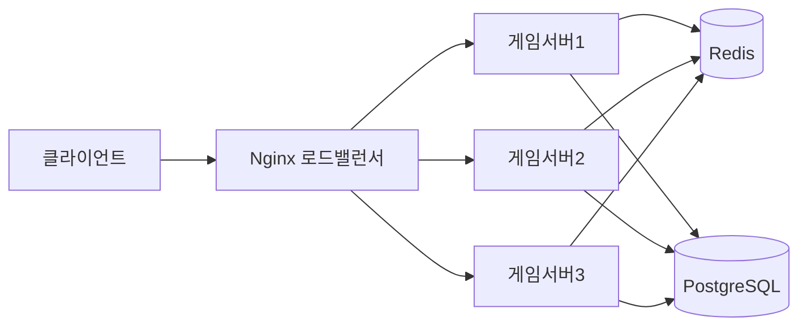

# 게임 서버 개발자를 위한 Docker  

저자: 최흥배, AI-Assisted   
    
권장 개발 환경
- **OS**: Windows 11 이상, WSL2 

-----    
  
# 7장. Docker Compose로 멀티 서버 구성

## 7.1 Docker Compose 소개

### Docker Compose가 필요한 이유

게임 서버를 운영하다 보면 단일 컨테이너만으로는 부족한 경우가 많다. 실제 게임 서버 환경에서는 다음과 같은 구성이 일반적이다.

- 게임 로직을 처리하는 API 서버
- 세션 정보를 저장하는 Redis
- 게임 데이터를 저장하는 데이터베이스
- 매칭 서버, 랭킹 서버 등의 부가 서비스

이런 여러 컨테이너를 매번 `docker run` 명령어로 하나씩 실행하고 네트워크를 연결하는 것은 매우 번거롭다. Docker Compose는 이러한 멀티 컨테이너 환경을 하나의 YAML 파일로 정의하고 간단한 명령어로 관리할 수 있게 해준다.

### Docker Compose의 핵심 개념

Docker Compose는 `docker-compose.yml` 파일에 여러 서비스를 정의한다. 각 서비스는 하나의 컨테이너를 의미하며, 서비스 간의 의존성, 네트워크, 볼륨 등을 선언적으로 기술한다.

```
┌─────────────────────────────────────────┐
│       docker-compose.yml                │
├─────────────────────────────────────────┤
│  services:                              │
│    gameserver:  ─────┐                  │
│    redis:       ─────┼─> 컨테이너 생성   │
│    database:    ─────┘                  │
│                                         │
│  networks:      ─────> 네트워크 구성     │
│  volumes:       ─────> 볼륨 구성         │
└─────────────────────────────────────────┘
```

### Docker Compose 설치 확인

Docker Desktop을 설치했다면 Docker Compose는 이미 포함되어 있다. WSL 터미널에서 확인해본다.

```bash
docker compose version
```

출력 예시:
```
Docker Compose version v2.23.0
```

> **참고**: 최신 Docker Desktop과 Docker Engine에서는 Compose v2 명령인 `docker compose`를 사용한다. 예전 자료의 `docker-compose`는 Compose v1 실행 파일 이름이며, 현재는 새 프로젝트에서 권장되지 않는다. Compose 파일의 최상위 `version` 속성도 호환성을 위해 남아 있을 뿐 최신 Compose에서는 생략하는 편이 좋다.

---

## 7.2 게임 서버 + Redis 구성 실습

### 실습 시나리오

세션 기반 로그인 시스템을 갖춘 간단한 게임 서버를 만든다. 사용자가 로그인하면 세션 토큰을 발급하고, 이를 Redis에 저장한다. 이후 요청 시 Redis에서 세션을 검증한다.

### 프로젝트 구조

```
game-redis-compose/
├── GameServer/
│   ├── Program.cs
│   ├── GameServer.csproj
│   └── Dockerfile
└── docker-compose.yml
```

### 1단계: Redis를 사용하는 게임 서버 작성

먼저 ASP.NET Web API 프로젝트를 생성한다.

```bash
mkdir -p game-redis-compose/GameServer
cd game-redis-compose/GameServer
dotnet new webapi -n GameServer
```

`GameServer.csproj`에 Redis 클라이언트 패키지를 추가한다.

```bash
dotnet add package StackExchange.Redis
```

`Program.cs`를 다음과 같이 작성한다.

```csharp
using StackExchange.Redis;

var builder = WebApplication.CreateBuilder(args);

// Redis 연결 설정
var redisConnection = builder.Configuration.GetValue<string>("Redis:ConnectionString") 
    ?? "localhost:6379";
var redis = ConnectionMultiplexer.Connect(redisConnection);
builder.Services.AddSingleton<IConnectionMultiplexer>(redis);

builder.Services.AddEndpointsApiExplorer();
builder.Services.AddSwaggerGen();

var app = builder.Build();

if (app.Environment.IsDevelopment())
{
    app.UseSwagger();
    app.UseSwaggerUI();
}

// 로그인 API
app.MapPost("/login", async (IConnectionMultiplexer redis, string username) =>
{
    var db = redis.GetDatabase();
    var sessionToken = Guid.NewGuid().ToString();
    
    // 세션을 Redis에 저장 (30분 TTL)
    await db.StringSetAsync($"session:{sessionToken}", username, TimeSpan.FromMinutes(30));
    
    return Results.Ok(new { Token = sessionToken, Username = username });
});

// 세션 검증 API
app.MapGet("/validate", async (IConnectionMultiplexer redis, string token) =>
{
    var db = redis.GetDatabase();
    var username = await db.StringGetAsync($"session:{token}");
    
    if (username.IsNullOrEmpty)
    {
        return Results.Unauthorized();
    }
    
    return Results.Ok(new { Username = username.ToString(), Valid = true });
});

// 현재 세션 수 조회
app.MapGet("/sessions/count", async (IConnectionMultiplexer redis) =>
{
    var server = redis.GetServer(redis.GetEndPoints().First());
    var keys = server.Keys(pattern: "session:*").ToList();
    
    return Results.Ok(new { SessionCount = keys.Count });
});

app.Run();
```

### 2단계: Dockerfile 작성

`GameServer/Dockerfile`을 작성한다.

```dockerfile
FROM mcr.microsoft.com/dotnet/aspnet:8.0 AS base
WORKDIR /app
EXPOSE 8080

FROM mcr.microsoft.com/dotnet/sdk:8.0 AS build
WORKDIR /src
COPY ["GameServer.csproj", "./"]
RUN dotnet restore "GameServer.csproj"
COPY . .
RUN dotnet build "GameServer.csproj" -c Release -o /app/build

FROM build AS publish
RUN dotnet publish "GameServer.csproj" -c Release -o /app/publish

FROM base AS final
WORKDIR /app
COPY --from=publish /app/publish .
ENTRYPOINT ["dotnet", "GameServer.dll"]
```

### 3단계: docker-compose.yml 작성

프로젝트 루트에 `docker-compose.yml`을 작성한다.

```yaml
services:
  gameserver:
    build:
      context: ./GameServer
      dockerfile: Dockerfile
    ports:
      - "5000:8080"
    environment:
      - ASPNETCORE_ENVIRONMENT=Development
      - Redis__ConnectionString=redis:6379
    depends_on:
      - redis
    networks:
      - game-network

  redis:
    image: redis:7-alpine
    ports:
      - "6379:6379"
    volumes:
      - redis-data:/data
    networks:
      - game-network

networks:
  game-network:
    driver: bridge

volumes:
  redis-data:
```

### 구성 요소 설명

**services 섹션**

- `gameserver`: 우리가 만든 게임 서버다. `build` 섹션에서 Dockerfile 위치를 지정한다.
- `redis`: Docker Hub의 공식 Redis 이미지를 사용한다.

**environment**

- `Redis__ConnectionString`: 환경 변수로 Redis 연결 정보를 전달한다. Docker Compose 내부에서는 서비스 이름(`redis`)으로 접근할 수 있다.

**depends_on**

- `gameserver`가 `redis`에 의존한다는 것을 명시한다. Redis가 먼저 시작된 후 게임 서버가 시작된다.

**networks**

- `game-network`라는 사용자 정의 네트워크를 만들고, 모든 서비스를 이 네트워크에 연결한다.

**volumes**

- `redis-data`: Redis 데이터를 영속적으로 저장한다.

### 4단계: 실행하기

```bash
cd game-redis-compose
docker compose up --build
```

출력 로그를 보면 Redis와 게임 서버가 순차적으로 시작되는 것을 확인할 수 있다.

```
[+] Running 3/3
 ✔ Network game-redis-compose_game-network  Created
 ✔ Container game-redis-compose-redis-1     Started
 ✔ Container game-redis-compose-gameserver-1 Started
```

### 5단계: 테스트하기

새 터미널을 열어 API를 테스트한다.

**로그인 테스트**

```bash
curl -X POST "http://localhost:5000/login?username=player1"
```

응답:
```json
{
  "token": "a1b2c3d4-e5f6-7890-abcd-ef1234567890",
  "username": "player1"
}
```

**세션 검증 테스트**

토큰을 복사하여 검증한다.

```bash
curl "http://localhost:5000/validate?token=a1b2c3d4-e5f6-7890-abcd-ef1234567890"
```

응답:
```json
{
  "username": "player1",
  "valid": true
}
```

**활성 세션 수 확인**

```bash
curl "http://localhost:5000/sessions/count"
```

응답:
```json
{
  "sessionCount": 1
}
```

### 6단계: Redis 데이터 확인

Redis에 직접 접속하여 데이터를 확인할 수 있다.

```bash
docker compose exec redis redis-cli
```

Redis CLI 내에서:

```
127.0.0.1:6379> KEYS session:*
1) "session:a1b2c3d4-e5f6-7890-abcd-ef1234567890"

127.0.0.1:6379> GET session:a1b2c3d4-e5f6-7890-abcd-ef1234567890
"player1"

127.0.0.1:6379> TTL session:a1b2c3d4-e5f6-7890-abcd-ef1234567890
(integer) 1789
```

### 7단계: 정리하기

모든 컨테이너를 중지하고 제거한다.

```bash
docker compose down
```

볼륨까지 함께 삭제하려면:

```bash
docker compose down -v
```

---

## 7.3 게임 서버 + DB (PostgreSQL/MySQL) 구성

### 실습 시나리오

플레이어 정보와 게임 기록을 데이터베이스에 저장하는 게임 서버를 구성한다. PostgreSQL을 사용하여 플레이어 등록, 조회, 점수 업데이트 기능을 구현한다.

### 프로젝트 구조

```
game-db-compose/
├── GameServer/
│   ├── Program.cs
│   ├── Models/
│   │   └── Player.cs
│   ├── GameServer.csproj
│   └── Dockerfile
├── init-db/
│   └── init.sql
└── docker-compose.yml
```

### 1단계: 데이터베이스 초기화 스크립트 작성

`init-db/init.sql` 파일을 생성한다.

```sql
-- 플레이어 테이블 생성
CREATE TABLE IF NOT EXISTS players (
    id SERIAL PRIMARY KEY,
    username VARCHAR(50) UNIQUE NOT NULL,
    email VARCHAR(100) UNIQUE NOT NULL,
    score INTEGER DEFAULT 0,
    level INTEGER DEFAULT 1,
    created_at TIMESTAMP DEFAULT CURRENT_TIMESTAMP,
    updated_at TIMESTAMP DEFAULT CURRENT_TIMESTAMP
);

-- 게임 기록 테이블 생성
CREATE TABLE IF NOT EXISTS game_records (
    id SERIAL PRIMARY KEY,
    player_id INTEGER REFERENCES players(id),
    score INTEGER NOT NULL,
    play_time INTEGER NOT NULL,
    created_at TIMESTAMP DEFAULT CURRENT_TIMESTAMP
);

-- 인덱스 생성
CREATE INDEX idx_players_username ON players(username);
CREATE INDEX idx_game_records_player_id ON game_records(player_id);

-- 샘플 데이터 삽입
INSERT INTO players (username, email, score, level) VALUES
    ('player1', 'player1@game.com', 1500, 5),
    ('player2', 'player2@game.com', 2300, 8),
    ('player3', 'player3@game.com', 800, 3)
ON CONFLICT (username) DO NOTHING;
```

### 2단계: 게임 서버 모델 작성

`GameServer/Models/Player.cs`를 작성한다.

```csharp
namespace GameServer.Models;

public class Player
{
    public int Id { get; set; }
    public string Username { get; set; } = string.Empty;
    public string Email { get; set; } = string.Empty;
    public int Score { get; set; }
    public int Level { get; set; }
    public DateTime CreatedAt { get; set; }
    public DateTime UpdatedAt { get; set; }
}

public class GameRecord
{
    public int Id { get; set; }
    public int PlayerId { get; set; }
    public int Score { get; set; }
    public int PlayTime { get; set; }
    public DateTime CreatedAt { get; set; }
}

public class CreatePlayerRequest
{
    public string Username { get; set; } = string.Empty;
    public string Email { get; set; } = string.Empty;
}

public class UpdateScoreRequest
{
    public int Score { get; set; }
    public int PlayTime { get; set; }
}
```

### 3단계: 게임 서버 코드 작성

필요한 패키지를 추가한다.

```bash
cd GameServer
dotnet add package Npgsql
dotnet add package Dapper
```

`Program.cs`를 작성한다.

```csharp
using Dapper;
using GameServer.Models;
using Npgsql;

var builder = WebApplication.CreateBuilder(args);

builder.Services.AddEndpointsApiExplorer();
builder.Services.AddSwaggerGen();

var app = builder.Build();

if (app.Environment.IsDevelopment())
{
    app.UseSwagger();
    app.UseSwaggerUI();
}

// 데이터베이스 연결 문자열
var connectionString = builder.Configuration.GetConnectionString("DefaultConnection");

// 플레이어 생성
app.MapPost("/players", async (CreatePlayerRequest request) =>
{
    using var connection = new NpgsqlConnection(connectionString);
    
    var sql = @"
        INSERT INTO players (username, email) 
        VALUES (@Username, @Email) 
        RETURNING id, username, email, score, level, created_at, updated_at";
    
    var player = await connection.QuerySingleAsync<Player>(sql, request);
    
    return Results.Created($"/players/{player.Id}", player);
});

// 플레이어 조회
app.MapGet("/players/{id}", async (int id) =>
{
    using var connection = new NpgsqlConnection(connectionString);
    
    var sql = "SELECT * FROM players WHERE id = @Id";
    var player = await connection.QuerySingleOrDefaultAsync<Player>(sql, new { Id = id });
    
    return player is not null ? Results.Ok(player) : Results.NotFound();
});

// 플레이어 목록 조회 (점수 순)
app.MapGet("/players", async (int page = 1, int pageSize = 10) =>
{
    using var connection = new NpgsqlConnection(connectionString);
    
    var offset = (page - 1) * pageSize;
    var sql = @"
        SELECT * FROM players 
        ORDER BY score DESC, level DESC 
        LIMIT @PageSize OFFSET @Offset";
    
    var players = await connection.QueryAsync<Player>(sql, new { PageSize = pageSize, Offset = offset });
    
    return Results.Ok(players);
});

// 점수 업데이트 및 게임 기록 저장
app.MapPost("/players/{id}/score", async (int id, UpdateScoreRequest request) =>
{
    using var connection = new NpgsqlConnection(connectionString);
    await connection.OpenAsync();
    using var transaction = await connection.BeginTransactionAsync();
    
    try
    {
        // 점수 업데이트
        var updateSql = @"
            UPDATE players 
            SET score = score + @Score, 
                level = CASE WHEN score + @Score >= level * 1000 THEN level + 1 ELSE level END,
                updated_at = CURRENT_TIMESTAMP 
            WHERE id = @Id
            RETURNING *";
        
        var player = await connection.QuerySingleOrDefaultAsync<Player>(
            updateSql, 
            new { Id = id, Score = request.Score },
            transaction);
        
        if (player is null)
        {
            await transaction.RollbackAsync();
            return Results.NotFound();
        }
        
        // 게임 기록 저장
        var recordSql = @"
            INSERT INTO game_records (player_id, score, play_time) 
            VALUES (@PlayerId, @Score, @PlayTime)";
        
        await connection.ExecuteAsync(
            recordSql, 
            new { PlayerId = id, Score = request.Score, PlayTime = request.PlayTime },
            transaction);
        
        await transaction.CommitAsync();
        
        return Results.Ok(player);
    }
    catch
    {
        await transaction.RollbackAsync();
        throw;
    }
});

// 플레이어 게임 기록 조회
app.MapGet("/players/{id}/records", async (int id) =>
{
    using var connection = new NpgsqlConnection(connectionString);
    
    var sql = @"
        SELECT * FROM game_records 
        WHERE player_id = @PlayerId 
        ORDER BY created_at DESC 
        LIMIT 20";
    
    var records = await connection.QueryAsync<GameRecord>(sql, new { PlayerId = id });
    
    return Results.Ok(records);
});

// 데이터베이스 헬스체크
app.MapGet("/health", async () =>
{
    try
    {
        using var connection = new NpgsqlConnection(connectionString);
        await connection.OpenAsync();
        var result = await connection.QuerySingleAsync<int>("SELECT 1");
        return Results.Ok(new { Status = "Healthy", Database = "Connected" });
    }
    catch (Exception ex)
    {
        return Results.Json(
            new { Status = "Unhealthy", Error = ex.Message }, 
            statusCode: 503);
    }
});

app.Run();
```

### 4단계: appsettings.json 수정

`GameServer/appsettings.json`에 연결 문자열을 추가한다.

```json
{
  "Logging": {
    "LogLevel": {
      "Default": "Information",
      "Microsoft.AspNetCore": "Warning"
    }
  },
  "AllowedHosts": "*",
  "ConnectionStrings": {
    "DefaultConnection": "Host=postgres;Database=gamedb;Username=gameuser;Password=gamepass123"
  }
}
```

### 5단계: docker-compose.yml 작성

```yaml
services:
  gameserver:
    build:
      context: ./GameServer
      dockerfile: Dockerfile
    ports:
      - "5000:8080"
    environment:
      - ASPNETCORE_ENVIRONMENT=Development
      - ConnectionStrings__DefaultConnection=Host=postgres;Database=gamedb;Username=gameuser;Password=gamepass123
    depends_on:
      postgres:
        condition: service_healthy
    networks:
      - game-network
    restart: on-failure

  postgres:
    image: postgres:15-alpine
    ports:
      - "5432:5432"
    environment:
      - POSTGRES_DB=gamedb
      - POSTGRES_USER=gameuser
      - POSTGRES_PASSWORD=gamepass123
    volumes:
      - postgres-data:/var/lib/postgresql/data
      - ./init-db:/docker-entrypoint-initdb.d
    networks:
      - game-network
    healthcheck:
      test: ["CMD-SHELL", "pg_isready -U gameuser -d gamedb"]
      interval: 5s
      timeout: 5s
      retries: 5

networks:
  game-network:
    driver: bridge

volumes:
  postgres-data:
```

### 구성 요소 설명

**healthcheck**

PostgreSQL이 완전히 준비될 때까지 기다린다. `pg_isready` 명령으로 데이터베이스 준비 상태를 확인한다.

**depends_on with condition**

`service_healthy` 조건으로 PostgreSQL의 헬스체크가 통과된 후에 게임 서버가 시작된다.

**volumes (postgres)**

- `postgres-data`: 데이터베이스 데이터를 영속적으로 저장한다.
- `./init-db`: 초기화 SQL 스크립트를 자동으로 실행한다.

**restart: on-failure**

게임 서버가 실패하면 자동으로 재시작한다. PostgreSQL이 준비되지 않아 초기 연결이 실패해도 재시도한다.

### 6단계: 실행 및 테스트

```bash
docker compose up --build
```

**헬스체크 확인**

```bash
curl http://localhost:5000/health
```

**플레이어 목록 조회**

```bash
curl http://localhost:5000/players
```

**새 플레이어 생성**

```bash
curl -X POST http://localhost:5000/players \
  -H "Content-Type: application/json" \
  -d '{"username":"newplayer","email":"new@game.com"}'
```

**점수 업데이트**

```bash
curl -X POST http://localhost:5000/players/1/score \
  -H "Content-Type: application/json" \
  -d '{"score":500,"playTime":300}'
```

**게임 기록 조회**

```bash
curl http://localhost:5000/players/1/records
```

### 7단계: PostgreSQL 직접 접속

데이터베이스에 직접 접속하여 데이터를 확인한다.

```bash
docker compose exec postgres psql -U gameuser -d gamedb
```

SQL 쿼리 실행:

```sql
-- 플레이어 목록 조회
SELECT * FROM players ORDER BY score DESC;

-- 특정 플레이어의 게임 기록
SELECT * FROM game_records WHERE player_id = 1;

-- 총 플레이어 수
SELECT COUNT(*) FROM players;
```

### MySQL로 변경하기

PostgreSQL 대신 MySQL을 사용하려면 다음과 같이 수정한다.

**docker-compose.yml (MySQL 버전)**

```yaml
services:
  gameserver:
    build:
      context: ./GameServer
      dockerfile: Dockerfile
    ports:
      - "5000:8080"
    environment:
      - ASPNETCORE_ENVIRONMENT=Development
      - ConnectionStrings__DefaultConnection=Server=mysql;Database=gamedb;User=gameuser;Password=gamepass123;
    depends_on:
      mysql:
        condition: service_healthy
    networks:
      - game-network

  mysql:
    image: mysql:8.0
    ports:
      - "3306:3306"
    environment:
      - MYSQL_ROOT_PASSWORD=rootpass123
      - MYSQL_DATABASE=gamedb
      - MYSQL_USER=gameuser
      - MYSQL_PASSWORD=gamepass123
    volumes:
      - mysql-data:/var/lib/mysql
      - ./init-db:/docker-entrypoint-initdb.d
    networks:
      - game-network
    healthcheck:
      test: ["CMD", "mysqladmin", "ping", "-h", "localhost", "-u", "root", "-prootpass123"]
      interval: 5s
      timeout: 5s
      retries: 5

networks:
  game-network:
    driver: bridge

volumes:
  mysql-data:
```

NuGet 패키지도 변경해야 한다.

```bash
dotnet remove package Npgsql
dotnet add package MySqlConnector
```

---

## 7.4 로드 밸런싱 기초

### 실습 시나리오

여러 게임 서버 인스턴스를 동시에 실행하고, Nginx를 로드 밸런서로 사용하여 트래픽을 분산한다. 이를 통해 높은 동시 접속자 수를 처리할 수 있는 구조를 만든다.

### 아키텍처 다이어그램



### 프로젝트 구조

```
game-loadbalancer/
├── GameServer/
│   ├── Program.cs
│   ├── GameServer.csproj
│   └── Dockerfile
├── nginx/
│   └── nginx.conf
└── docker-compose.yml
```

### 1단계: 로드 밸런싱을 지원하는 게임 서버 작성

각 서버 인스턴스를 식별할 수 있도록 호스트 이름을 응답에 포함한다.

`GameServer/Program.cs`:

```csharp
using StackExchange.Redis;

var builder = WebApplication.CreateBuilder(args);

// Redis 연결
var redisConnection = builder.Configuration.GetValue<string>("Redis:ConnectionString") ?? "localhost:6379";
var redis = ConnectionMultiplexer.Connect(redisConnection);
builder.Services.AddSingleton<IConnectionMultiplexer>(redis);

builder.Services.AddEndpointsApiExplorer();
builder.Services.AddSwaggerGen();

var app = builder.Build();

// 서버 인스턴스 식별용
var serverName = Environment.MachineName;

if (app.Environment.IsDevelopment())
{
    app.UseSwagger();
    app.UseSwaggerUI();
}

// 서버 정보 API
app.MapGet("/", () => new
{
    Server = serverName,
    Message = "Game Server is running",
    Timestamp = DateTime.UtcNow
});

// 카운터 증가 (공유 상태 테스트)
app.MapPost("/counter/increment", async (IConnectionMultiplexer redis) =>
{
    var db = redis.GetDatabase();
    var count = await db.StringIncrementAsync("global:counter");
    
    return new
    {
        Server = serverName,
        GlobalCounter = (long)count
    };
});

// 현재 카운터 값 조회
app.MapGet("/counter", async (IConnectionMultiplexer redis) =>
{
    var db = redis.GetDatabase();
    var count = await db.StringGetAsync("global:counter");
    
    return new
    {
        Server = serverName,
        GlobalCounter = count.HasValue ? (long)count : 0
    };
});

// 세션 생성
app.MapPost("/session/create", async (IConnectionMultiplexer redis, string username) =>
{
    var db = redis.GetDatabase();
    var sessionId = Guid.NewGuid().ToString();
    
    await db.HashSetAsync($"session:{sessionId}", new HashEntry[]
    {
        new HashEntry("username", username),
        new HashEntry("server", serverName),
        new HashEntry("created", DateTime.UtcNow.ToString("O"))
    });
    
    await db.KeyExpireAsync($"session:{sessionId}", TimeSpan.FromMinutes(30));
    
    return new
    {
        SessionId = sessionId,
        Username = username,
        CreatedBy = serverName
    };
});

// 세션 조회
app.MapGet("/session/{sessionId}", async (IConnectionMultiplexer redis, string sessionId) =>
{
    var db = redis.GetDatabase();
    var session = await db.HashGetAllAsync($"session:{sessionId}");
    
    if (session.Length == 0)
    {
        return Results.NotFound();
    }
    
    var sessionData = session.ToDictionary(
        x => x.Name.ToString(),
        x => x.Value.ToString()
    );
    
    sessionData["handledBy"] = serverName;
    
    return Results.Ok(sessionData);
});

// 헬스체크
app.MapGet("/health", () => new
{
    Status = "Healthy",
    Server = serverName
});

app.Run();
```

### 2단계: Nginx 설정 파일 작성

`nginx/nginx.conf`:

```nginx
upstream gameservers {
    # 라운드 로빈 방식 (기본값)
    server gameserver1:8080;
    server gameserver2:8080;
    server gameserver3:8080;
}

server {
    listen 80;
    
    location / {
        proxy_pass http://gameservers;
        proxy_set_header Host $host;
        proxy_set_header X-Real-IP $remote_addr;
        proxy_set_header X-Forwarded-For $proxy_add_x_forwarded_for;
        proxy_set_header X-Forwarded-Proto $scheme;
        
        # 타임아웃 설정
        proxy_connect_timeout 60s;
        proxy_send_timeout 60s;
        proxy_read_timeout 60s;
    }
    
    # 헬스체크 엔드포인트
    location /health {
        proxy_pass http://gameservers/health;
    }
    
    # Nginx 자체 상태
    location /nginx_status {
        stub_status on;
        access_log off;
    }
}
```

### 3단계: docker-compose.yml 작성

```yaml
services:
  nginx:
    image: nginx:alpine
    ports:
      - "8080:80"
    volumes:
      - ./nginx/nginx.conf:/etc/nginx/nginx.conf:ro
    depends_on:
      - gameserver1
      - gameserver2
      - gameserver3
    networks:
      - game-network

  gameserver1:
    build:
      context: ./GameServer
      dockerfile: Dockerfile
    environment:
      - ASPNETCORE_ENVIRONMENT=Development
      - Redis__ConnectionString=redis:6379
    depends_on:
      - redis
    networks:
      - game-network

  gameserver2:
    build:
      context: ./GameServer
      dockerfile: Dockerfile
    environment:
      - ASPNETCORE_ENVIRONMENT=Development
      - Redis__ConnectionString=redis:6379
    depends_on:
      - redis
    networks:
      - game-network

  gameserver3:
    build:
      context: ./GameServer
      dockerfile: Dockerfile
    environment:
      - ASPNETCORE_ENVIRONMENT=Development
      - Redis__ConnectionString=redis:6379
    depends_on:
      - redis
    networks:
      - game-network

  redis:
    image: redis:7-alpine
    networks:
      - game-network
    volumes:
      - redis-data:/data

networks:
  game-network:
    driver: bridge

volumes:
  redis-data:
```

### 4단계: 실행 및 테스트

```bash
docker compose up --build
```

**서버 정보 확인 (여러 번 호출)**

```bash
# 여러 번 실행하면 다른 서버에서 응답하는 것을 확인할 수 있다
curl http://localhost:8080/
curl http://localhost:8080/
curl http://localhost:8080/
```

응답 예시:
```json
{"server":"gameserver1","message":"Game Server is running","timestamp":"2025-11-22T..."}
{"server":"gameserver2","message":"Game Server is running","timestamp":"2025-11-22T..."}
{"server":"gameserver3","message":"Game Server is running","timestamp":"2025-11-22T..."}
```

**글로벌 카운터 테스트**

```bash
# 여러 번 증가시키기
for i in {1..10}; do
  curl -X POST http://localhost:8080/counter/increment
  echo ""
done
```

각 요청이 다른 서버에서 처리되지만, Redis를 통해 공유된 카운터 값이 정확하게 증가하는 것을 확인할 수 있다.

**세션 생성 및 조회 테스트**

```bash
# 세션 생성
RESPONSE=$(curl -X POST "http://localhost:8080/session/create?username=player1")
echo $RESPONSE

# SessionId 추출
SESSION_ID=$(echo $RESPONSE | grep -o '"sessionId":"[^"]*' | cut -d'"' -f4)

# 세션 조회 (여러 번)
curl http://localhost:8080/session/$SESSION_ID
curl http://localhost:8080/session/$SESSION_ID
curl http://localhost:8080/session/$SESSION_ID
```

세션이 어느 서버에서 생성되었든, 다른 서버에서도 동일한 세션 정보를 조회할 수 있다.

### 5단계: 부하 테스트

간단한 스크립트로 동시 요청을 보내본다.

```bash
# 100개의 동시 요청
for i in {1..100}; do
  curl -X POST http://localhost:8080/counter/increment &
done
wait

# 최종 카운터 확인
curl http://localhost:8080/counter
```

**Nginx 상태 확인**

```bash
curl http://localhost:8080/nginx_status
```

### 6단계: 스케일링 실습

Docker Compose의 `scale` 기능을 사용하여 서버 인스턴스를 동적으로 조정할 수 있다.

먼저 `docker-compose.yml`을 수정하여 서비스 이름을 일반화한다.

```yaml
services:
  nginx:
    image: nginx:alpine
    ports:
      - "8080:80"
    volumes:
      - ./nginx/nginx.conf:/etc/nginx/nginx.conf:ro
    depends_on:
      - gameserver
    networks:
      - game-network

  gameserver:
    build:
      context: ./GameServer
      dockerfile: Dockerfile
    environment:
      - ASPNETCORE_ENVIRONMENT=Development
      - Redis__ConnectionString=redis:6379
    depends_on:
      - redis
    networks:
      - game-network
    deploy:
      replicas: 3

  redis:
    image: redis:7-alpine
    networks:
      - game-network
    volumes:
      - redis-data:/data

networks:
  game-network:
    driver: bridge

volumes:
  redis-data:
```

`nginx.conf`도 수정한다:

```nginx
upstream gameservers {
    server gameserver:8080;
}

server {
    listen 80;
    
    location / {
        proxy_pass http://gameservers;
        proxy_set_header Host $host;
        proxy_set_header X-Real-IP $remote_addr;
        proxy_set_header X-Forwarded-For $proxy_add_x_forwarded_for;
    }
}
```

스케일 조정:

```bash
# 5개의 게임 서버 인스턴스로 확장
docker compose up --scale gameserver=5 -d

# 확인
docker compose ps
```

### 로드 밸런싱 알고리즘 변경

Nginx는 다양한 로드 밸런싱 알고리즘을 지원한다.

**라운드 로빈 (기본)**

```nginx
upstream gameservers {
    server gameserver1:8080;
    server gameserver2:8080;
    server gameserver3:8080;
}
```

**최소 연결 (Least Connections)**

활성 연결이 가장 적은 서버로 요청을 전달한다.

```nginx
upstream gameservers {
    least_conn;
    server gameserver1:8080;
    server gameserver2:8080;
    server gameserver3:8080;
}
```

**IP 해시 (IP Hash)**

클라이언트 IP를 기반으로 항상 동일한 서버로 요청을 전달한다. 세션 고정(sticky session)에 유용하다.

```nginx
upstream gameservers {
    ip_hash;
    server gameserver1:8080;
    server gameserver2:8080;
    server gameserver3:8080;
}
```

**가중치 기반 (Weighted)**

서버 성능에 따라 가중치를 부여한다.

```nginx
upstream gameservers {
    server gameserver1:8080 weight=3;
    server gameserver2:8080 weight=2;
    server gameserver3:8080 weight=1;
}
```

### 헬스체크와 자동 복구

Nginx Plus (상용 버전)에서는 능동적 헬스체크를 지원하지만, 오픈소스 버전에서는 수동적 헬스체크만 가능하다.

```nginx
upstream gameservers {
    server gameserver1:8080 max_fails=3 fail_timeout=30s;
    server gameserver2:8080 max_fails=3 fail_timeout=30s;
    server gameserver3:8080 max_fails=3 fail_timeout=30s;
}
```

- `max_fails`: 연속 실패 횟수
- `fail_timeout`: 실패 후 재시도 전 대기 시간

서버가 다운되면 자동으로 트래픽을 다른 서버로 전달한다.

**테스트하기**

```bash
# 하나의 서버 중지
docker compose stop gameserver2

# 요청 보내기 (계속 동작함)
curl http://localhost:8080/

# 서버 재시작
docker compose start gameserver2
```

---

## 7장 요약

이 장에서는 Docker Compose를 활용하여 멀티 서버 환경을 구성하는 방법을 학습했다.

**주요 학습 내용**

- Docker Compose의 기본 개념과 `docker-compose.yml` 작성법
- 게임 서버와 Redis를 연동한 세션 관리 시스템 구축
- 게임 서버와 PostgreSQL/MySQL을 연동한 데이터 영속화
- Nginx를 활용한 로드 밸런싱 구현
- 여러 게임 서버 인스턴스를 통한 수평적 확장

**핵심 명령어**

```bash
# 서비스 시작
docker compose up

# 백그라운드 실행
docker compose up -d

# 빌드 후 시작
docker compose up --build

# 특정 서비스 스케일링
docker compose up --scale gameserver=5

# 서비스 중지
docker compose down

# 볼륨까지 삭제
docker compose down -v

# 로그 확인
docker compose logs -f

# 특정 서비스의 컨테이너에 접속
docker compose exec redis redis-cli
```

**실무 적용 팁**

- 개발 환경에서는 Redis와 데이터베이스를 컨테이너로 실행하면 설치와 관리가 편리하다.
- 로드 밸런싱 구조에서는 상태를 Redis나 데이터베이스 같은 공유 저장소에 보관해야 한다.
- `depends_on`의 `condition: service_healthy`를 활용하면 서비스 시작 순서를 안전하게 제어할 수 있다.
- 환경 변수를 통해 연결 정보를 관리하면 코드 수정 없이 설정을 변경할 수 있다.

다음 장에서는 환경 변수와 설정 관리를 더 깊이 다루며, 개발/스테이징/운영 환경을 효과적으로 분리하는 방법을 배운다.   