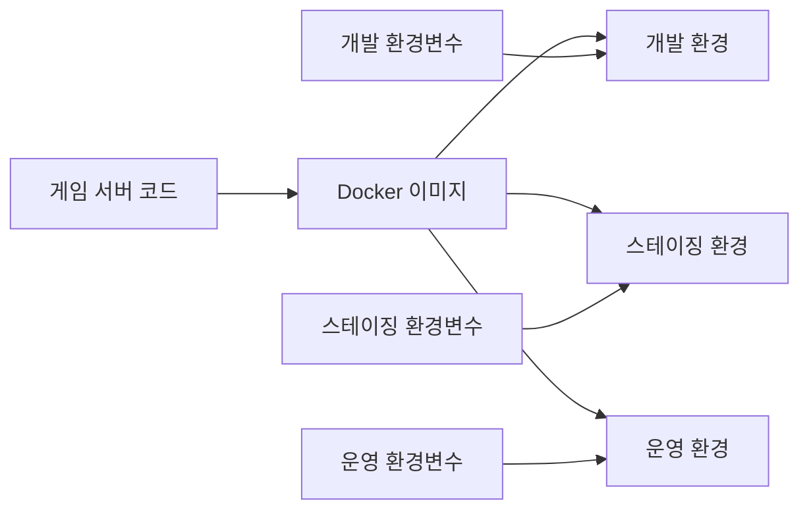

# 게임 서버 개발자를 위한 Docker  

저자: 최흥배, AI-Assisted   
    
권장 개발 환경
- **OS**: Windows 11 이상, WSL2 

-----    
  
# 8장. 환경 변수와 설정 관리

## 8.1 환경 변수로 설정 분리하기

### 왜 환경 변수가 필요한가?

게임 서버를 개발하다 보면 다양한 환경에서 실행해야 한다. 로컬 개발 환경에서는 테스트용 데이터베이스를 사용하고, 스테이징 서버에서는 실제와 유사한 환경을 구성하며, 운영 서버에서는 실제 서비스용 설정을 사용한다. 이때 환경마다 코드를 수정하면 실수가 발생하기 쉽고 관리가 어렵다.

환경 변수를 사용하면 다음과 같은 이점이 있다.

- 코드 수정 없이 설정을 변경할 수 있다
- 민감한 정보(비밀번호, API 키)를 코드에서 분리할 수 있다
- 같은 이미지를 여러 환경에서 재사용할 수 있다
- 설정 관리가 체계적이고 안전해진다



### 환경 변수 기본 사용법

먼저 간단한 예제로 환경 변수를 사용하는 방법을 알아본다.

**테스트용 프로젝트 생성**

```bash
mkdir env-practice
cd env-practice
dotnet new webapi -n EnvGameServer
cd EnvGameServer
```

**Program.cs 수정**

```csharp
var builder = WebApplication.CreateBuilder(args);

var app = builder.Build();

// 환경 변수 읽기
app.MapGet("/config", () =>
{
    var serverName = Environment.GetEnvironmentVariable("SERVER_NAME") ?? "Unknown";
    var maxPlayers = Environment.GetEnvironmentVariable("MAX_PLAYERS") ?? "100";
    var gameMode = Environment.GetEnvironmentVariable("GAME_MODE") ?? "Normal";
    var debugMode = Environment.GetEnvironmentVariable("DEBUG_MODE") ?? "false";
    
    return new
    {
        ServerName = serverName,
        MaxPlayers = int.Parse(maxPlayers),
        GameMode = gameMode,
        DebugMode = bool.Parse(debugMode),
        Environment = app.Environment.EnvironmentName
    };
});

app.MapGet("/", () => "Environment Variable Practice Server");

app.Run();
```

**Dockerfile 작성**

```dockerfile
FROM mcr.microsoft.com/dotnet/aspnet:8.0 AS base
WORKDIR /app
EXPOSE 8080

FROM mcr.microsoft.com/dotnet/sdk:8.0 AS build
WORKDIR /src
COPY ["EnvGameServer.csproj", "./"]
RUN dotnet restore
COPY . .
RUN dotnet build -c Release -o /app/build

FROM build AS publish
RUN dotnet publish -c Release -o /app/publish

FROM base AS final
WORKDIR /app
COPY --from=publish /app/publish .
ENTRYPOINT ["dotnet", "EnvGameServer.dll"]
```

### Docker 명령어로 환경 변수 전달하기

**단일 환경 변수 전달 (-e 옵션)**

```bash
docker build -t env-gameserver .

docker run -d -p 5000:8080 \
  -e SERVER_NAME="Development Server" \
  -e MAX_PLAYERS=50 \
  -e GAME_MODE=Debug \
  -e DEBUG_MODE=true \
  env-gameserver
```

**테스트**

```bash
curl http://localhost:5000/config
```

응답:
```json
{
  "serverName": "Development Server",
  "maxPlayers": 50,
  "gameMode": "Debug",
  "debugMode": true,
  "environment": "Production"
}
```

**여러 환경 변수를 파일로 전달 (--env-file 옵션)**

`dev.env` 파일을 생성한다.

```bash
SERVER_NAME=Development Server
MAX_PLAYERS=50
GAME_MODE=Debug
DEBUG_MODE=true
LOG_LEVEL=Debug
```

이 파일을 사용하여 컨테이너를 실행한다.

```bash
docker run -d -p 5001:8080 \
  --env-file dev.env \
  env-gameserver
```

### ASP.NET Core 설정 시스템과 통합하기

ASP.NET Core는 강력한 설정 시스템을 제공한다. 환경 변수를 `IConfiguration`을 통해 타입 안전하게 사용할 수 있다.

**설정 클래스 정의**

`GameServerSettings.cs` 파일을 생성한다.

```csharp
namespace EnvGameServer;

public class GameServerSettings
{
    public string ServerName { get; set; } = "Default Server";
    public int MaxPlayers { get; set; } = 100;
    public string GameMode { get; set; } = "Normal";
    public bool DebugMode { get; set; } = false;
    public LogSettings Logging { get; set; } = new();
}

public class LogSettings
{
    public string Level { get; set; } = "Information";
    public string OutputPath { get; set; } = "/var/log";
}

public class DatabaseSettings
{
    public string Host { get; set; } = "localhost";
    public int Port { get; set; } = 5432;
    public string Database { get; set; } = "gamedb";
    public string Username { get; set; } = "gameuser";
    public string Password { get; set; } = "";
    
    public string GetConnectionString()
    {
        return $"Host={Host};Port={Port};Database={Database};Username={Username};Password={Password}";
    }
}
```

**appsettings.json 수정**

```json
{
  "Logging": {
    "LogLevel": {
      "Default": "Information",
      "Microsoft.AspNetCore": "Warning"
    }
  },
  "AllowedHosts": "*",
  "GameServer": {
    "ServerName": "Default Server",
    "MaxPlayers": 100,
    "GameMode": "Normal",
    "DebugMode": false,
    "Logging": {
      "Level": "Information",
      "OutputPath": "/var/log"
    }
  },
  "Database": {
    "Host": "localhost",
    "Port": 5432,
    "Database": "gamedb",
    "Username": "gameuser",
    "Password": ""
  }
}
```

**Program.cs에서 설정 사용**

```csharp
using EnvGameServer;

var builder = WebApplication.CreateBuilder(args);

// 설정 바인딩
builder.Services.Configure<GameServerSettings>(
    builder.Configuration.GetSection("GameServer"));
builder.Services.Configure<DatabaseSettings>(
    builder.Configuration.GetSection("Database"));

var app = builder.Build();

// 설정 정보 API
app.MapGet("/config", (IConfiguration config) =>
{
    var gameSettings = config.GetSection("GameServer").Get<GameServerSettings>();
    var dbSettings = config.GetSection("Database").Get<DatabaseSettings>();
    
    return new
    {
        Server = gameSettings,
        Database = new
        {
            dbSettings.Host,
            dbSettings.Port,
            dbSettings.Database,
            dbSettings.Username,
            HasPassword = !string.IsNullOrEmpty(dbSettings.Password)
        }
    };
});

app.Run();
```

### 환경 변수 우선순위

ASP.NET Core의 설정 시스템은 다음 순서로 값을 읽는다. 뒤의 것이 앞의 것을 덮어쓴다.

1. appsettings.json
2. appsettings.{Environment}.json
3. 사용자 시크릿 (개발 환경)
4. 환경 변수
5. 커맨드 라인 인수

환경 변수는 계층 구조를 `__` (더블 언더스코어)로 표현한다.

```bash
# appsettings.json의 GameServer:ServerName을 덮어쓴다
GameServer__ServerName="Production Server"

# Database:Host를 덮어쓴다
Database__Host="prod-db.example.com"

# Database:Password를 덮어쓴다
Database__Password="secure-password-123"
```

**실습: 환경 변수로 설정 덮어쓰기**

```bash
docker run -d -p 5002:8080 \
  -e GameServer__ServerName="Custom Server" \
  -e GameServer__MaxPlayers=200 \
  -e GameServer__DebugMode=true \
  -e Database__Host=db.example.com \
  -e Database__Password=mypassword \
  env-gameserver

curl http://localhost:5002/config
```

---

## 8.2 .env 파일 활용

### .env 파일의 필요성

환경 변수가 많아지면 명령어가 길어지고 관리하기 어렵다. `.env` 파일을 사용하면 환경 변수를 파일로 관리할 수 있어 가독성이 좋고 버전 관리가 쉽다.

### 프로젝트 구조

```
env-config-practice/
├── GameServer/
│   ├── Program.cs
│   ├── GameServerSettings.cs
│   ├── appsettings.json
│   ├── GameServer.csproj
│   └── Dockerfile
├── .env.development
├── .env.staging
├── .env.production
├── .env.example
└── docker-compose.yml
```

### .env 파일 작성

**.env.example (템플릿)**

민감한 정보는 제외하고 예제 값만 포함한다. 이 파일은 Git에 커밋한다.

```bash
# Server Configuration
GameServer__ServerName=Example Server
GameServer__MaxPlayers=100
GameServer__GameMode=Normal
GameServer__DebugMode=false

# Database Configuration
Database__Host=localhost
Database__Port=5432
Database__Database=gamedb
Database__Username=gameuser
Database__Password=CHANGE_ME

# Redis Configuration
Redis__Host=localhost
Redis__Port=6379
Redis__Password=

# Logging
GameServer__Logging__Level=Information
GameServer__Logging__OutputPath=/var/log/gameserver
```

**.env.development**

개발 환경용 설정이다.

```bash
# Server Configuration
GameServer__ServerName=Dev Game Server
GameServer__MaxPlayers=10
GameServer__GameMode=Debug
GameServer__DebugMode=true

# Database Configuration
Database__Host=localhost
Database__Port=5432
Database__Database=gamedb_dev
Database__Username=devuser
Database__Password=devpass123

# Redis Configuration
Redis__Host=localhost
Redis__Port=6379
Redis__Password=

# Logging
GameServer__Logging__Level=Debug
GameServer__Logging__OutputPath=/var/log/gameserver
ASPNETCORE_ENVIRONMENT=Development
```

**.env.staging**

스테이징 환경용 설정이다.

```bash
# Server Configuration
GameServer__ServerName=Staging Game Server
GameServer__MaxPlayers=100
GameServer__GameMode=Normal
GameServer__DebugMode=false

# Database Configuration
Database__Host=staging-db.internal
Database__Port=5432
Database__Database=gamedb_staging
Database__Username=staginguser
Database__Password=staging_secure_pass_456

# Redis Configuration
Redis__Host=staging-redis.internal
Redis__Port=6379
Redis__Password=redis_staging_pass

# Logging
GameServer__Logging__Level=Information
GameServer__Logging__OutputPath=/var/log/gameserver
ASPNETCORE_ENVIRONMENT=Staging
```

**.env.production**

운영 환경용 설정이다. 이 파일은 Git에 커밋하지 않는다.

```bash
# Server Configuration
GameServer__ServerName=Production Game Server
GameServer__MaxPlayers=1000
GameServer__GameMode=Normal
GameServer__DebugMode=false

# Database Configuration
Database__Host=prod-db.internal
Database__Port=5432
Database__Database=gamedb_prod
Database__Username=produser
Database__Password=PRODUCTION_SECRET_PASSWORD_HERE

# Redis Configuration
Redis__Host=prod-redis.internal
Redis__Port=6379
Redis__Password=REDIS_PRODUCTION_PASSWORD

# Logging
GameServer__Logging__Level=Warning
GameServer__Logging__OutputPath=/var/log/gameserver
ASPNETCORE_ENVIRONMENT=Production
```

### .gitignore 설정

민감한 정보가 포함된 파일은 Git에서 제외한다.

```bash
# .gitignore
.env.production
.env.staging
.env.local
.env
*.env
!.env.example
!.env.development
```

### Docker Compose에서 .env 파일 사용하기

**docker-compose.yml**

```yaml
services:
  gameserver:
    build:
      context: ./GameServer
      dockerfile: Dockerfile
    ports:
      - "${SERVER_PORT:-5000}:8080"
    env_file:
      - .env.development
    networks:
      - game-network
    depends_on:
      - postgres
      - redis

  postgres:
    image: postgres:15-alpine
    ports:
      - "${DB_PORT:-5432}:5432"
    environment:
      - POSTGRES_DB=${Database__Database}
      - POSTGRES_USER=${Database__Username}
      - POSTGRES_PASSWORD=${Database__Password}
    volumes:
      - postgres-data:/var/lib/postgresql/data
    networks:
      - game-network

  redis:
    image: redis:7-alpine
    ports:
      - "${REDIS_PORT:-6379}:6379"
    command: >
      sh -c "
      if [ -n '${Redis__Password}' ]; then
        redis-server --requirepass ${Redis__Password}
      else
        redis-server
      fi
      "
    volumes:
      - redis-data:/data
    networks:
      - game-network

networks:
  game-network:
    driver: bridge

volumes:
  postgres-data:
  redis-data:
```

### 환경별 실행 방법

**개발 환경 실행**

```bash
docker compose --env-file .env.development up
```

**스테이징 환경 실행**

```bash
docker compose --env-file .env.staging up
```

**운영 환경 실행**

```bash
docker compose --env-file .env.production up -d
```

### 환경 변수 검증하기

서버가 시작될 때 필수 환경 변수가 설정되어 있는지 검증하는 것이 좋다.

**ValidationExtensions.cs**

```csharp
namespace EnvGameServer;

public static class ConfigurationValidationExtensions
{
    public static void ValidateConfiguration(this IConfiguration configuration)
    {
        var errors = new List<string>();
        
        // 필수 설정 검증
        ValidateRequired(configuration, "GameServer:ServerName", errors);
        ValidateRequired(configuration, "Database:Host", errors);
        ValidateRequired(configuration, "Database:Password", errors);
        ValidateRequired(configuration, "Redis:Host", errors);
        
        // 숫자 범위 검증
        ValidateRange(configuration, "GameServer:MaxPlayers", 1, 10000, errors);
        ValidateRange(configuration, "Database:Port", 1, 65535, errors);
        
        if (errors.Any())
        {
            var errorMessage = "Configuration validation failed:\n" + 
                             string.Join("\n", errors);
            throw new InvalidOperationException(errorMessage);
        }
    }
    
    private static void ValidateRequired(
        IConfiguration config, 
        string key, 
        List<string> errors)
    {
        var value = config[key];
        if (string.IsNullOrWhiteSpace(value))
        {
            errors.Add($"Required configuration '{key}' is missing or empty");
        }
    }
    
    private static void ValidateRange(
        IConfiguration config, 
        string key, 
        int min, 
        int max, 
        List<string> errors)
    {
        var value = config[key];
        if (string.IsNullOrWhiteSpace(value))
        {
            errors.Add($"Required configuration '{key}' is missing");
            return;
        }
        
        if (!int.TryParse(value, out var intValue))
        {
            errors.Add($"Configuration '{key}' must be a valid integer");
            return;
        }
        
        if (intValue < min || intValue > max)
        {
            errors.Add($"Configuration '{key}' must be between {min} and {max}");
        }
    }
}
```

**Program.cs에서 검증 적용**

```csharp
var builder = WebApplication.CreateBuilder(args);

// 설정 검증
try
{
    builder.Configuration.ValidateConfiguration();
}
catch (InvalidOperationException ex)
{
    Console.WriteLine($"FATAL: {ex.Message}");
    Environment.Exit(1);
}

// 나머지 코드...
```

---

## 8.3 개발/스테이징/운영 환경 구분

### 환경별 appsettings 파일 활용

ASP.NET Core는 환경별로 다른 설정 파일을 자동으로 로드한다.

**파일 구조**

```
GameServer/
├── appsettings.json                    # 기본 설정
├── appsettings.Development.json        # 개발 환경
├── appsettings.Staging.json            # 스테이징 환경
└── appsettings.Production.json         # 운영 환경
```

**appsettings.json (기본값)**

```json
{
  "Logging": {
    "LogLevel": {
      "Default": "Information"
    }
  },
  "GameServer": {
    "ServerName": "Game Server",
    "MaxPlayers": 100,
    "TickRate": 30,
    "Features": {
      "EnableChat": true,
      "EnableVoice": false,
      "EnableMatchmaking": true
    }
  }
}
```

**appsettings.Development.json**

```json
{
  "Logging": {
    "LogLevel": {
      "Default": "Debug",
      "Microsoft.AspNetCore": "Information"
    }
  },
  "GameServer": {
    "ServerName": "Dev Server",
    "MaxPlayers": 10,
    "TickRate": 10,
    "DebugMode": true,
    "Features": {
      "EnableVoice": true
    }
  },
  "Database": {
    "Host": "localhost",
    "Database": "gamedb_dev"
  }
}
```

**appsettings.Production.json**

```json
{
  "Logging": {
    "LogLevel": {
      "Default": "Warning",
      "Microsoft.AspNetCore": "Error"
    }
  },
  "GameServer": {
    "ServerName": "Production Server",
    "MaxPlayers": 1000,
    "TickRate": 60,
    "DebugMode": false
  }
}
```

### 환경별 기능 활성화/비활성화

**FeatureFlags.cs**

```csharp
namespace EnvGameServer;

public class FeatureFlags
{
    public bool EnableSwagger { get; set; } = false;
    public bool EnableDetailedErrors { get; set; } = false;
    public bool EnableMetrics { get; set; } = true;
    public bool EnableHealthCheck { get; set; } = true;
    public bool AllowCors { get; set; } = false;
}
```

**Program.cs에서 환경별 설정 적용**

```csharp
var builder = WebApplication.CreateBuilder(args);

// 환경별 기능 플래그 로드
var featureFlags = builder.Configuration
    .GetSection("FeatureFlags")
    .Get<FeatureFlags>() ?? new FeatureFlags();

// Swagger는 개발 환경에서만
if (builder.Environment.IsDevelopment() || featureFlags.EnableSwagger)
{
    builder.Services.AddEndpointsApiExplorer();
    builder.Services.AddSwaggerGen();
}

// CORS 설정
if (featureFlags.AllowCors)
{
    builder.Services.AddCors(options =>
    {
        options.AddPolicy("AllowAll",
            policy => policy.AllowAnyOrigin()
                           .AllowAnyMethod()
                           .AllowAnyHeader());
    });
}

var app = builder.Build();

// 개발 환경에서만 상세 오류 표시
if (builder.Environment.IsDevelopment() || featureFlags.EnableDetailedErrors)
{
    app.UseDeveloperExceptionPage();
}

// Swagger UI
if (builder.Environment.IsDevelopment() || featureFlags.EnableSwagger)
{
    app.UseSwagger();
    app.UseSwaggerUI();
}

if (featureFlags.AllowCors)
{
    app.UseCors("AllowAll");
}

// 환경 정보 API
app.MapGet("/env", () => new
{
    Environment = app.Environment.EnvironmentName,
    IsDevelopment = app.Environment.IsDevelopment(),
    IsStaging = app.Environment.IsStaging(),
    IsProduction = app.Environment.IsProduction(),
    Features = featureFlags
});

app.Run();
```

### 멀티 스테이지 Docker 빌드로 환경 구분

**Dockerfile.multistage**

```dockerfile
# Base stage
FROM mcr.microsoft.com/dotnet/aspnet:8.0 AS base
WORKDIR /app
EXPOSE 8080

# Build stage
FROM mcr.microsoft.com/dotnet/sdk:8.0 AS build
WORKDIR /src
COPY ["GameServer.csproj", "./"]
RUN dotnet restore
COPY . .
RUN dotnet build -c Release -o /app/build

# Publish stage
FROM build AS publish
RUN dotnet publish -c Release -o /app/publish

# Development stage
FROM base AS development
WORKDIR /app
COPY --from=publish /app/publish .
ENV ASPNETCORE_ENVIRONMENT=Development
ENTRYPOINT ["dotnet", "GameServer.dll"]

# Staging stage
FROM base AS staging
WORKDIR /app
COPY --from=publish /app/publish .
ENV ASPNETCORE_ENVIRONMENT=Staging
ENTRYPOINT ["dotnet", "GameServer.dll"]

# Production stage
FROM base AS production
WORKDIR /app
COPY --from=publish /app/publish .
ENV ASPNETCORE_ENVIRONMENT=Production
# 프로덕션에서는 비root 유저로 실행
USER app
ENTRYPOINT ["dotnet", "GameServer.dll"]
```

**환경별 빌드**

```bash
# 개발 환경 이미지
docker build --target development -t gameserver:dev .

# 스테이징 환경 이미지
docker build --target staging -t gameserver:staging .

# 운영 환경 이미지
docker build --target production -t gameserver:prod .
```

### Docker Compose로 환경별 구성 관리

**docker-compose.base.yml (공통 설정)**

```yaml
x-gameserver-common: &gameserver-common
  build:
    context: ./GameServer
    dockerfile: Dockerfile
  networks:
    - game-network
  depends_on:
    - postgres
    - redis

services:
  postgres:
    image: postgres:15-alpine
    volumes:
      - postgres-data:/var/lib/postgresql/data
    networks:
      - game-network

  redis:
    image: redis:7-alpine
    volumes:
      - redis-data:/data
    networks:
      - game-network

networks:
  game-network:
    driver: bridge

volumes:
  postgres-data:
  redis-data:
```

**docker-compose.dev.yml**

```yaml
services:
  gameserver:
    <<: *gameserver-common
    ports:
      - "5000:8080"
    env_file:
      - .env.development
    volumes:
      # 개발 시 소스 코드 실시간 반영
      - ./GameServer:/app
    environment:
      - ASPNETCORE_ENVIRONMENT=Development

  postgres:
    ports:
      - "5432:5432"

  redis:
    ports:
      - "6379:6379"
```

**docker-compose.staging.yml**

```yaml
services:
  gameserver:
    <<: *gameserver-common
    ports:
      - "80:8080"
    env_file:
      - .env.staging
    environment:
      - ASPNETCORE_ENVIRONMENT=Staging
    restart: unless-stopped

  postgres:
    restart: unless-stopped

  redis:
    restart: unless-stopped
```

**docker-compose.prod.yml**

```yaml
services:
  gameserver:
    <<: *gameserver-common
    ports:
      - "80:8080"
    env_file:
      - .env.production
    environment:
      - ASPNETCORE_ENVIRONMENT=Production
    restart: always
    deploy:
      replicas: 3
      resources:
        limits:
          cpus: '2'
          memory: 2G
        reservations:
          cpus: '1'
          memory: 1G

  postgres:
    restart: always
    deploy:
      resources:
        limits:
          cpus: '2'
          memory: 4G

  redis:
    restart: always
    deploy:
      resources:
        limits:
          cpus: '1'
          memory: 1G
```

**실행 방법**

```bash
# 개발 환경
docker compose -f docker-compose.base.yml -f docker-compose.dev.yml up

# 스테이징 환경
docker compose -f docker-compose.base.yml -f docker-compose.staging.yml up

# 운영 환경
docker compose -f docker-compose.base.yml -f docker-compose.prod.yml up -d

> 참고: `deploy.replicas`는 Swarm/Kubernetes 같은 오케스트레이션 환경을 전제로 설명되는 속성이다. 로컬 Docker Compose만으로 운영 확장을 설명할 때는 `docker compose up --scale game-api=3`처럼 명령에서 스케일을 지정하거나, 실제 운영에서는 Swarm/Kubernetes/ECS 같은 오케스트레이터를 함께 검토한다.
```

---

## 8.4 민감 정보 관리 (Secrets)

### 민감 정보의 종류

게임 서버에서 관리해야 할 민감 정보는 다음과 같다.

- 데이터베이스 비밀번호
- API 키 (결제, 소셜 로그인 등)
- JWT 시크릿 키
- 암호화 키
- 외부 서비스 인증 정보

이러한 정보는 코드나 일반 환경 변수 파일에 저장하면 안 된다.

### Docker Secrets 사용하기

Docker Swarm이나 Kubernetes에서는 Secrets 기능을 제공한다. 여기서는 개발 환경에서 사용할 수 있는 방법을 다룬다.

**시크릿 파일 생성**

```bash
mkdir secrets

# 데이터베이스 비밀번호
echo "super_secure_db_password_123" > secrets/db_password.txt

# JWT 시크릿
echo "jwt_secret_key_for_token_signing_very_long_and_secure" > secrets/jwt_secret.txt

# API 키
echo "sk_live_1234567890abcdef" > secrets/payment_api_key.txt

# 파일 권한 설정
chmod 600 secrets/*.txt
```

**.gitignore에 추가**

```bash
secrets/
*.txt
```

**docker-compose에서 시크릿 사용**

```yaml
services:
  gameserver:
    build:
      context: ./GameServer
      dockerfile: Dockerfile
    ports:
      - "5000:8080"
    environment:
      - ASPNETCORE_ENVIRONMENT=Development
      - Database__Host=postgres
      - Database__Username=gameuser
    secrets:
      - db_password
      - jwt_secret
      - payment_api_key
    networks:
      - game-network

secrets:
  db_password:
    file: ./secrets/db_password.txt
  jwt_secret:
    file: ./secrets/jwt_secret.txt
  payment_api_key:
    file: ./secrets/payment_api_key.txt

networks:
  game-network:
```

컨테이너 내부에서 시크릿은 `/run/secrets/` 디렉토리에 파일로 마운트된다.

**시크릿 읽기 헬퍼 클래스**

`SecretReader.cs`:

```csharp
namespace EnvGameServer;

public static class SecretReader
{
    private const string SecretPath = "/run/secrets";
    
    public static string ReadSecret(string secretName)
    {
        var path = Path.Combine(SecretPath, secretName);
        
        if (File.Exists(path))
        {
            return File.ReadAllText(path).Trim();
        }
        
        // Docker secrets가 없으면 환경 변수에서 읽기 (개발 환경)
        var envValue = Environment.GetEnvironmentVariable(secretName.ToUpper());
        if (!string.IsNullOrEmpty(envValue))
        {
            return envValue;
        }
        
        throw new FileNotFoundException($"Secret '{secretName}' not found");
    }
    
    public static string ReadSecretOrDefault(string secretName, string defaultValue = "")
    {
        try
        {
            return ReadSecret(secretName);
        }
        catch
        {
            return defaultValue;
        }
    }
}
```

**Program.cs에서 시크릿 사용**

```csharp
var builder = WebApplication.CreateBuilder(args);

// 시크릿 읽기
var dbPassword = SecretReader.ReadSecret("db_password");
var jwtSecret = SecretReader.ReadSecret("jwt_secret");
var paymentApiKey = SecretReader.ReadSecret("payment_api_key");

// 데이터베이스 연결 문자열 구성
var dbHost = builder.Configuration["Database:Host"];
var dbUser = builder.Configuration["Database:Username"];
var connectionString = $"Host={dbHost};Database=gamedb;Username={dbUser};Password={dbPassword}";

builder.Services.AddSingleton(new DatabaseSettings 
{ 
    ConnectionString = connectionString 
});

// JWT 설정
builder.Services.AddAuthentication(/* JWT 설정 */)
    .AddJwtBearer(options =>
    {
        options.TokenValidationParameters = new TokenValidationParameters
        {
            IssuerSigningKey = new SymmetricSecurityKey(
                Encoding.UTF8.GetBytes(jwtSecret))
        };
    });

var app = builder.Build();

// 시크릿이 제대로 로드되었는지 확인 (디버그용, 운영에서는 제거)
app.MapGet("/secrets/status", () => new
{
    DbPasswordLoaded = !string.IsNullOrEmpty(dbPassword),
    JwtSecretLoaded = !string.IsNullOrEmpty(jwtSecret),
    PaymentApiKeyLoaded = !string.IsNullOrEmpty(paymentApiKey)
});

app.Run();
```

### 환경 변수로 시크릿 전달 (개발 환경)

Docker Secrets는 Swarm 모드에서만 완전히 작동한다. 개발 환경에서는 환경 변수를 사용할 수 있다.

**.env.local (로컬 개발용, Git에 커밋하지 않음)**

```bash
DB_PASSWORD=dev_password_123
JWT_SECRET=dev_jwt_secret_key
PAYMENT_API_KEY=sk_test_1234567890
```

**docker-compose.dev.yml**

```yaml
services:
  gameserver:
    build:
      context: ./GameServer
      dockerfile: Dockerfile
    ports:
      - "5000:8080"
    env_file:
      - .env.development
      - .env.local  # 시크릿이 포함된 파일
    networks:
      - game-network
```

### AWS Secrets Manager 연동 (실전 예제)

실제 운영 환경에서는 AWS Secrets Manager, Azure Key Vault, HashiCorp Vault 같은 전문 시크릿 관리 서비스를 사용한다.

**AWS SDK 패키지 추가**

```bash
dotnet add package AWSSDK.SecretsManager
```

**AwsSecretManager.cs**

```csharp
using Amazon.SecretsManager;
using Amazon.SecretsManager.Model;
using System.Text.Json;

namespace EnvGameServer;

public class AwsSecretManager
{
    private readonly IAmazonSecretsManager _client;
    
    public AwsSecretManager()
    {
        _client = new AmazonSecretsManagerClient();
    }
    
    public async Task<string> GetSecretAsync(string secretName)
    {
        try
        {
            var request = new GetSecretValueRequest
            {
                SecretId = secretName
            };
            
            var response = await _client.GetSecretValueAsync(request);
            
            return response.SecretString;
        }
        catch (Exception ex)
        {
            Console.WriteLine($"Error retrieving secret '{secretName}': {ex.Message}");
            throw;
        }
    }
    
    public async Task<T> GetSecretAsJsonAsync<T>(string secretName)
    {
        var secretString = await GetSecretAsync(secretName);
        return JsonSerializer.Deserialize<T>(secretString) 
            ?? throw new InvalidOperationException("Failed to deserialize secret");
    }
}

public class DatabaseSecret
{
    public string Username { get; set; } = "";
    public string Password { get; set; } = "";
    public string Host { get; set; } = "";
    public string Database { get; set; } = "";
}
```

**Program.cs에서 사용**

```csharp
var builder = WebApplication.CreateBuilder(args);

// AWS Secrets Manager 사용
if (builder.Environment.IsProduction())
{
    var secretManager = new AwsSecretManager();
    
    // 데이터베이스 시크릿 가져오기
    var dbSecret = await secretManager
        .GetSecretAsJsonAsync<DatabaseSecret>("prod/gameserver/database");
    
    var connectionString = 
        $"Host={dbSecret.Host};Database={dbSecret.Database};" +
        $"Username={dbSecret.Username};Password={dbSecret.Password}";
    
    builder.Configuration["ConnectionStrings:DefaultConnection"] = connectionString;
}
```

### 실습: 완전한 시크릿 관리 시스템

**프로젝트 구조**

```
secret-practice/
├── GameServer/
│   ├── Program.cs
│   ├── SecretReader.cs
│   ├── GameServer.csproj
│   └── Dockerfile
├── secrets/
│   ├── db_password.txt
│   ├── jwt_secret.txt
│   └── redis_password.txt
├── .env.development
├── .env.production.example
└── docker-compose.yml
```

**완전한 Program.cs 예제**

```csharp
using EnvGameServer;
using Microsoft.IdentityModel.Tokens;
using System.Text;

var builder = WebApplication.CreateBuilder(args);

// 환경 확인
var isDevelopment = builder.Environment.IsDevelopment();
var isProduction = builder.Environment.IsProduction();

// 설정 클래스 바인딩
builder.Services.Configure<GameServerSettings>(
    builder.Configuration.GetSection("GameServer"));

// 시크릿 로드
string dbPassword, jwtSecret, redisPassword;

if (isProduction)
{
    // 운영: Docker Secrets 사용
    dbPassword = SecretReader.ReadSecret("db_password");
    jwtSecret = SecretReader.ReadSecret("jwt_secret");
    redisPassword = SecretReader.ReadSecretOrDefault("redis_password");
}
else
{
    // 개발: 환경 변수 또는 기본값
    dbPassword = builder.Configuration["Secrets:DbPassword"] ?? "dev_pass";
    jwtSecret = builder.Configuration["Secrets:JwtSecret"] ?? "dev_jwt_key_min_32_chars_long";
    redisPassword = builder.Configuration["Secrets:RedisPassword"] ?? "";
}

// 데이터베이스 연결 문자열 구성
var dbHost = builder.Configuration["Database:Host"] ?? "localhost";
var dbUser = builder.Configuration["Database:Username"] ?? "gameuser";
var dbName = builder.Configuration["Database:Database"] ?? "gamedb";
var connectionString = 
    $"Host={dbHost};Database={dbName};Username={dbUser};Password={dbPassword}";

// Redis 연결
var redisHost = builder.Configuration["Redis:Host"] ?? "localhost";
var redisConnection = string.IsNullOrEmpty(redisPassword)
    ? $"{redisHost}:6379"
    : $"{redisHost}:6379,password={redisPassword}";

builder.Services.AddSingleton(new ConnectionStrings
{
    Database = connectionString,
    Redis = redisConnection
});

// JWT 인증 (간단한 예제)
builder.Services.AddSingleton(new JwtSettings
{
    SecretKey = jwtSecret,
    Issuer = builder.Configuration["Jwt:Issuer"] ?? "GameServer",
    Audience = builder.Configuration["Jwt:Audience"] ?? "GameClient"
});

var app = builder.Build();

// 헬스체크
app.MapGet("/health", () => new
{
    Status = "Healthy",
    Environment = app.Environment.EnvironmentName,
    Timestamp = DateTime.UtcNow
});

// 설정 상태 (민감 정보는 숨김)
app.MapGet("/config/status", (IConfiguration config) =>
{
    return new
    {
        Environment = app.Environment.EnvironmentName,
        Database = new
        {
            Host = config["Database:Host"],
            HasPassword = !string.IsNullOrEmpty(dbPassword),
            PasswordLength = dbPassword.Length
        },
        Redis = new
        {
            Host = config["Redis:Host"],
            HasPassword = !string.IsNullOrEmpty(redisPassword)
        },
        Jwt = new
        {
            HasSecret = !string.IsNullOrEmpty(jwtSecret),
            SecretLength = jwtSecret.Length,
            IsSecure = jwtSecret.Length >= 32
        }
    };
});

app.Run();

public class ConnectionStrings
{
    public string Database { get; set; } = "";
    public string Redis { get; set; } = "";
}

public class JwtSettings
{
    public string SecretKey { get; set; } = "";
    public string Issuer { get; set; } = "";
    public string Audience { get; set; } = "";
}
```

**docker-compose.yml**

```yaml
services:
  gameserver:
    build:
      context: ./GameServer
      dockerfile: Dockerfile
    ports:
      - "5000:8080"
    environment:
      - ASPNETCORE_ENVIRONMENT=Development
      - Database__Host=postgres
      - Database__Username=gameuser
      - Database__Database=gamedb
      - Redis__Host=redis
      - Secrets__DbPassword=dev_password_123
      - Secrets__JwtSecret=development_jwt_secret_key_minimum_32_characters
    depends_on:
      - postgres
      - redis
    networks:
      - game-network

  postgres:
    image: postgres:15-alpine
    environment:
      - POSTGRES_USER=gameuser
      - POSTGRES_PASSWORD=dev_password_123
      - POSTGRES_DB=gamedb
    volumes:
      - postgres-data:/var/lib/postgresql/data
    networks:
      - game-network

  redis:
    image: redis:7-alpine
    volumes:
      - redis-data:/data
    networks:
      - game-network

networks:
  game-network:

volumes:
  postgres-data:
  redis-data:
```

**테스트**

```bash
docker compose up --build

# 헬스체크
curl http://localhost:5000/health

# 설정 상태 확인
curl http://localhost:5000/config/status
```

응답 예시:
```json
{
  "environment": "Development",
  "database": {
    "host": "postgres",
    "hasPassword": true,
    "passwordLength": 17
  },
  "redis": {
    "host": "redis",
    "hasPassword": false
  },
  "jwt": {
    "hasSecret": true,
    "secretLength": 52,
    "isSecure": true
  }
}
```

### 보안 체크리스트

환경 변수와 시크릿을 관리할 때 다음 사항을 확인한다.

- [ ] `.env.production`, `.env.local` 등 민감한 파일을 `.gitignore`에 추가했다
- [ ] `.env.example` 파일에 실제 시크릿 값을 포함하지 않았다
- [ ] 운영 환경에서는 Docker Secrets나 전문 시크릿 관리 서비스를 사용한다
- [ ] 비밀번호는 충분히 복잡하고 길다 (최소 16자 이상)
- [ ] JWT 시크릿 키는 최소 32바이트 이상이다
- [ ] 로그나 응답에 시크릿 값을 출력하지 않는다
- [ ] 필수 환경 변수가 누락되면 서버가 시작되지 않도록 검증한다
- [ ] 개발/스테이징/운영 환경의 시크릿을 분리했다
- [ ] 시크릿 파일의 권한을 제한했다 (600)
- [ ] 정기적으로 시크릿을 로테이션한다

---

## 8장 요약

이 장에서는 Docker 환경에서 설정과 민감 정보를 안전하게 관리하는 방법을 학습했다.

**주요 학습 내용**

- 환경 변수를 사용하여 코드에서 설정을 분리하는 방법
- `.env` 파일로 환경별 설정을 체계적으로 관리하는 방법
- 개발, 스테이징, 운영 환경을 명확하게 구분하는 방법
- Docker Secrets와 시크릿 관리 서비스를 활용한 민감 정보 보호

**핵심 명령어와 개념**

```bash
# 환경 변수로 컨테이너 실행
docker run -e KEY=VALUE image

# env 파일 사용
docker run --env-file .env image

# 특정 환경 설정으로 Compose 실행
docker compose --env-file .env.production up

# 멀티 Compose 파일 사용
docker compose -f base.yml -f prod.yml up
```

**ASP.NET Core 환경 변수 매핑**

```bash
# appsettings.json의 Database:Host를 덮어쓴다
Database__Host=prod-server

# 계층 구조는 __ (더블 언더스코어)로 표현한다
GameServer__Logging__Level=Debug
```

**실무 적용 팁**

- 환경별로 별도의 `.env` 파일을 만들고, `.env.example`로 템플릿을 제공한다
- 민감한 정보는 절대 Git에 커밋하지 않는다
- 운영 환경에서는 Docker Secrets나 전문 시크릿 관리 서비스를 사용한다
- 서버 시작 시 필수 설정이 있는지 검증한다
- 로그나 API 응답에 시크릿 값이 노출되지 않도록 주의한다

다음 장에서는 Docker 네트워킹을 심화 학습하여 컨테이너 간 통신과 외부 접근을 제어하는 방법을 배운다.  