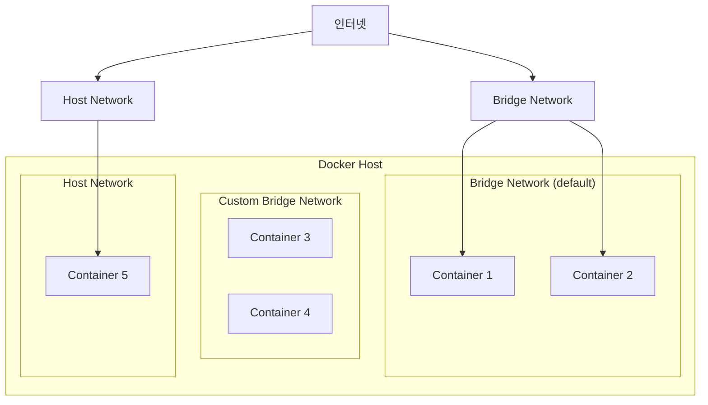

# 게임 서버 개발자를 위한 Docker  

저자: 최흥배, AI-Assisted   
    
권장 개발 환경
- **OS**: Windows 11 이상, WSL2 

-----    
  
# 9장. 네트워킹 심화

## 9.1 Docker 네트워크 종류

### Docker 네트워크 개요

Docker는 컨테이너 간 통신과 외부 접근을 제어하기 위해 여러 네트워크 드라이버를 제공한다. 게임 서버를 운영할 때는 네트워크 구조를 올바르게 설계하는 것이 중요하다. 잘못 설계하면 보안 문제가 발생하거나 성능이 저하될 수 있다.



### 네트워크 드라이버 종류

**1. Bridge (기본 네트워크)**

가장 일반적으로 사용되는 네트워크 드라이버다. 컨테이너들이 같은 브리지 네트워크에 연결되어 서로 통신할 수 있다.

```
┌─────────────────────────────────────┐
│         Docker Host                 │
│  ┌──────────────────────────────┐  │
│  │   docker0 bridge             │  │
│  │                              │  │
│  │  ┌────────┐    ┌────────┐   │  │
│  │  │Container│    │Container│  │  │
│  │  │   A     │◄──►│   B     │  │  │
│  │  └────────┘    └────────┘   │  │
│  └──────────────────────────────┘  │
│             ▲                       │
│             │ Port Mapping          │
└─────────────┼───────────────────────┘
              │
           External
           Network
```

**2. Host**

컨테이너가 호스트의 네트워크를 직접 사용한다. 네트워크 오버헤드가 없어 성능이 좋지만, 포트 충돌에 주의해야 한다.

**3. None**

네트워크를 사용하지 않는다. 완전히 격리된 컨테이너가 필요할 때 사용한다.

**4. Overlay**

Docker Swarm이나 Kubernetes 같은 오케스트레이션 환경에서 여러 호스트에 걸친 컨테이너 통신에 사용된다.

### 현재 네트워크 확인

```bash
# 네트워크 목록 조회
docker network ls
```

출력 예시:
```
NETWORK ID     NAME      DRIVER    SCOPE
a1b2c3d4e5f6   bridge    bridge    local
1234567890ab   host      host      local
abcdef123456   none      null      local
```

**네트워크 상세 정보 확인**

```bash
docker network inspect bridge
```

### 실습: 네트워크 드라이버 비교

**테스트용 간단한 서버 만들기**

`NetworkTestServer/Program.cs`:

```csharp
var builder = WebApplication.CreateBuilder(args);
var app = builder.Build();

var hostname = System.Net.Dns.GetHostName();
var addresses = System.Net.Dns.GetHostAddresses(hostname);

app.MapGet("/", () => new
{
    Hostname = hostname,
    IpAddresses = addresses.Select(a => a.ToString()).ToArray(),
    NetworkType = Environment.GetEnvironmentVariable("NETWORK_TYPE") ?? "Unknown",
    Timestamp = DateTime.UtcNow
});

app.MapGet("/ping", () => "pong");

app.Run();
```

`Dockerfile`:

```dockerfile
FROM mcr.microsoft.com/dotnet/aspnet:8.0
WORKDIR /app
EXPOSE 8080

FROM mcr.microsoft.com/dotnet/sdk:8.0 AS build
WORKDIR /src
COPY ["NetworkTestServer.csproj", "./"]
RUN dotnet restore
COPY . .
RUN dotnet publish -c Release -o /app/publish

FROM mcr.microsoft.com/dotnet/aspnet:8.0
WORKDIR /app
COPY --from=build /app/publish .
ENTRYPOINT ["dotnet", "NetworkTestServer.dll"]
```

**빌드**

```bash
docker build -t network-test .
```

**Bridge 네트워크 테스트**

```bash
# 기본 브리지 네트워크로 실행
docker run -d --name test-bridge -p 5001:8080 \
  -e NETWORK_TYPE=bridge \
  network-test

# 확인
curl http://localhost:5001/
```

**Host 네트워크 테스트**

```bash
# Host 네트워크로 실행 (포트 매핑 불필요)
docker run -d --name test-host --network host \
  -e ASPNETCORE_URLS=http://+:5002 \
  -e NETWORK_TYPE=host \
  network-test

# 확인
curl http://localhost:5002/
```

**네트워크 성능 비교**

```bash
# Bridge 네트워크 지연시간 측정
time curl http://localhost:5001/ping

# Host 네트워크 지연시간 측정
time curl http://localhost:5002/ping
```

Host 네트워크가 일반적으로 더 빠르지만, 포트 관리의 유연성이 떨어진다.

**정리**

```bash
docker stop test-bridge test-host
docker rm test-bridge test-host
```

---

## 9.2 커스텀 네트워크 생성

### 왜 커스텀 네트워크가 필요한가?

기본 브리지 네트워크는 몇 가지 제약이 있다.

- 컨테이너 이름으로 DNS 해석이 안 된다 (IP 주소만 사용 가능)
- 네트워크 격리가 어렵다
- 설정 커스터마이징이 제한적이다

커스텀 브리지 네트워크를 사용하면 이런 문제를 해결할 수 있다.

### 네트워크 생성 기본

**간단한 네트워크 생성**

```bash
docker network create game-network
```

**서브넷과 게이트웨이 지정**

```bash
docker network create \
  --driver bridge \
  --subnet=172.20.0.0/16 \
  --gateway=172.20.0.1 \
  game-network-custom
```

**네트워크 옵션 확인**

```bash
docker network inspect game-network-custom
```

### 실습: 게임 서버 네트워크 아키텍처 구성

게임 서버를 위한 3계층 네트워크를 구성한다.

```
┌────────────────────────────────────────────────┐
│                 Public Network                 │
│         (외부 접근 가능한 게임 서버)            │
│  ┌──────────────┐         ┌──────────────┐    │
│  │  Game Server │         │  Game Server │    │
│  │      1       │         │      2       │    │
│  └──────┬───────┘         └──────┬───────┘    │
└─────────┼────────────────────────┼────────────┘
          │                        │
┌─────────┼────────────────────────┼────────────┐
│         │   Internal Network     │            │
│         │  (내부 서비스 통신)      │            │
│  ┌──────▼───────┐         ┌──────▼───────┐   │
│  │    Redis     │         │  Auth Server │   │
│  └──────┬───────┘         └──────┬───────┘   │
└─────────┼────────────────────────┼───────────┘
          │                        │
┌─────────┼────────────────────────┼───────────┐
│         │    Data Network        │           │
│         │  (데이터베이스 전용)     │           │
│  ┌──────▼───────────────────────▼───────┐   │
│  │          PostgreSQL                  │   │
│  └──────────────────────────────────────┘   │
└────────────────────────────────────────────┘
```

**프로젝트 구조**

```
multi-tier-network/
├── GameServer/
│   ├── Program.cs
│   ├── GameServer.csproj
│   └── Dockerfile
├── AuthServer/
│   ├── Program.cs
│   ├── AuthServer.csproj
│   └── Dockerfile
└── docker-compose.yml
```

**네트워크 생성**

```bash
# 공개 네트워크 (게임 클라이언트 접근)
docker network create \
  --driver bridge \
  --subnet=172.21.0.0/16 \
  public-network

# 내부 네트워크 (서비스 간 통신)
docker network create \
  --driver bridge \
  --subnet=172.22.0.0/16 \
  internal-network

# 데이터 네트워크 (데이터베이스 전용)
docker network create \
  --driver bridge \
  --subnet=172.23.0.0/16 \
  --internal \
  data-network
```

`--internal` 옵션은 외부 접근을 완전히 차단한다.

### 게임 서버 코드

`GameServer/Program.cs`:

```csharp
using StackExchange.Redis;

var builder = WebApplication.CreateBuilder(args);

// Redis 연결 (internal-network를 통해)
var redis = ConnectionMultiplexer.Connect("redis:6379");
builder.Services.AddSingleton<IConnectionMultiplexer>(redis);

// HTTP 클라이언트 (Auth Server 호출용)
builder.Services.AddHttpClient();

var app = builder.Build();

var serverName = Environment.MachineName;

// 공개 API (클라이언트가 호출)
app.MapGet("/", () => new
{
    Server = serverName,
    Message = "Game Server Running",
    Network = "Public"
});

// 로그인 API
app.MapPost("/login", async (
    HttpClient http,
    IConnectionMultiplexer redis,
    string username) =>
{
    try
    {
        // Auth Server에 인증 요청 (internal-network)
        var authResponse = await http.GetAsync($"http://authserver:8080/validate/{username}");
        
        if (!authResponse.IsSuccessStatusCode)
        {
            return Results.Unauthorized();
        }
        
        var authData = await authResponse.Content.ReadAsStringAsync();
        
        // 세션을 Redis에 저장 (internal-network)
        var db = redis.GetDatabase();
        var sessionId = Guid.NewGuid().ToString();
        await db.StringSetAsync($"session:{sessionId}", username, TimeSpan.FromHours(1));
        
        return Results.Ok(new
        {
            SessionId = sessionId,
            Username = username,
            Server = serverName,
            AuthData = authData
        });
    }
    catch (Exception ex)
    {
        return Results.Problem($"Login failed: {ex.Message}");
    }
});

// 게임 데이터 조회
app.MapGet("/game/{sessionId}", async (
    IConnectionMultiplexer redis,
    string sessionId) =>
{
    var db = redis.GetDatabase();
    var username = await db.StringGetAsync($"session:{sessionId}");
    
    if (username.IsNullOrEmpty)
    {
        return Results.Unauthorized();
    }
    
    return Results.Ok(new
    {
        Username = username.ToString(),
        Server = serverName,
        GameData = "Player game data here"
    });
});

app.Run();
```

### 인증 서버 코드

`AuthServer/Program.cs`:

```csharp
using Npgsql;
using Dapper;

var builder = WebApplication.CreateBuilder(args);
var app = builder.Build();

// PostgreSQL 연결 (data-network)
var connectionString = "Host=postgres;Database=gamedb;Username=gameuser;Password=gamepass123";

app.MapGet("/validate/{username}", async (string username) =>
{
    using var connection = new NpgsqlConnection(connectionString);
    
    var user = await connection.QuerySingleOrDefaultAsync<dynamic>(
        "SELECT username, email FROM users WHERE username = @Username",
        new { Username = username });
    
    if (user == null)
    {
        return Results.NotFound();
    }
    
    return Results.Ok(new
    {
        user.username,
        user.email,
        ValidatedBy = Environment.MachineName,
        ValidatedAt = DateTime.UtcNow
    });
});

app.MapGet("/health", () => "Auth Server Healthy");

app.Run();
```

### Docker Compose 구성

`docker-compose.yml`:

```yaml
services:
  gameserver:
    build: ./GameServer
    ports:
      - "5000:8080"
    networks:
      - public-network
      - internal-network
    depends_on:
      - redis
      - authserver
    deploy:
      replicas: 2

  authserver:
    build: ./AuthServer
    networks:
      - internal-network
      - data-network
    depends_on:
      - postgres

  redis:
    image: redis:7-alpine
    networks:
      - internal-network
    volumes:
      - redis-data:/data

  postgres:
    image: postgres:15-alpine
    environment:
      - POSTGRES_DB=gamedb
      - POSTGRES_USER=gameuser
      - POSTGRES_PASSWORD=gamepass123
    networks:
      - data-network
    volumes:
      - postgres-data:/var/lib/postgresql/data
      - ./init.sql:/docker-entrypoint-initdb.d/init.sql

networks:
  public-network:
    driver: bridge
  internal-network:
    driver: bridge
  data-network:
    driver: bridge
    internal: true  # 외부 접근 차단

volumes:
  redis-data:
  postgres-data:
```

**네트워크 구조 설명**

- `gameserver`: public-network와 internal-network에 연결되어 있다
  - public-network: 클라이언트가 접근
  - internal-network: Redis, AuthServer와 통신
- `authserver`: internal-network와 data-network에 연결되어 있다
  - internal-network: GameServer와 통신
  - data-network: PostgreSQL과 통신
- `redis`: internal-network에만 연결되어 있다
- `postgres`: data-network에만 연결되어 있다 (완전히 격리됨)

### 실행 및 테스트

**초기화 SQL 작성**

`init.sql`:

```sql
CREATE TABLE users (
    id SERIAL PRIMARY KEY,
    username VARCHAR(50) UNIQUE NOT NULL,
    email VARCHAR(100) NOT NULL,
    created_at TIMESTAMP DEFAULT CURRENT_TIMESTAMP
);

INSERT INTO users (username, email) VALUES
    ('player1', 'player1@game.com'),
    ('player2', 'player2@game.com'),
    ('player3', 'player3@game.com');
```

**실행**

```bash
docker compose up --build
```

**테스트**

```bash
# 로그인
curl -X POST "http://localhost:5000/login?username=player1"

# 응답 예시:
# {
#   "sessionId": "abc123...",
#   "username": "player1",
#   "server": "gameserver-1",
#   "authData": "{\"username\":\"player1\",\"email\":\"player1@game.com\",..."
# }

# 세션으로 게임 데이터 조회
curl "http://localhost:5000/game/abc123..."
```

**네트워크 격리 확인**

```bash
# PostgreSQL에 외부에서 접근 시도 (실패해야 함)
docker run --rm postgres:15-alpine psql -h postgres -U gameuser -d gamedb

# internal-network에서는 접근 가능
docker compose exec authserver sh
# 컨테이너 내부에서
wget -qO- http://redis:6379  # 접근 가능
```

---

## 9.3 서버 간 통신 구성

### DNS 기반 서비스 디스커버리

커스텀 브리지 네트워크에서는 컨테이너 이름이나 서비스 이름으로 다른 컨테이너에 접근할 수 있다. Docker가 내부 DNS 서버를 제공하기 때문이다.

```
┌─────────────────────────────────────┐
│      Custom Bridge Network          │
│                                     │
│  ┌──────────┐      DNS Query       │
│  │Container │ ──"redis"────┐       │
│  │    A     │              │       │
│  └──────────┘              ▼       │
│                    ┌──────────────┐ │
│                    │Docker DNS    │ │
│                    │Server        │ │
│                    └──────┬───────┘ │
│                           │         │
│                    Returns IP      │
│  ┌──────────┐            │         │
│  │ Redis    │◄───────────┘         │
│  │Container │                      │
│  └──────────┘                      │
└─────────────────────────────────────┘
```

### 실습: 마이크로서비스 게임 아키텍처

게임 서버를 여러 마이크로서비스로 분리한다.

```
Client
  │
  ▼
API Gateway (Nginx)
  │
  ├──► Game Server (게임 로직)
  │      │
  │      ├──► Match Server (매칭)
  │      ├──► Ranking Server (랭킹)
  │      └──► Inventory Server (인벤토리)
  │
  └──► All Services
         │
         ├──► Redis (캐시)
         └──► PostgreSQL (데이터)
```

**프로젝트 구조**

```
microservice-game/
├── ApiGateway/
│   └── nginx.conf
├── GameServer/
│   ├── Program.cs
│   └── Dockerfile
├── MatchServer/
│   ├── Program.cs
│   └── Dockerfile
├── RankingServer/
│   ├── Program.cs
│   └── Dockerfile
├── InventoryServer/
│   ├── Program.cs
│   └── Dockerfile
└── docker-compose.yml
```

### 매칭 서버

`MatchServer/Program.cs`:

```csharp
using StackExchange.Redis;

var builder = WebApplication.CreateBuilder(args);
var redis = ConnectionMultiplexer.Connect("redis:6379");
builder.Services.AddSingleton<IConnectionMultiplexer>(redis);
var app = builder.Build();

// 매칭 큐에 등록
app.MapPost("/match/join", async (
    IConnectionMultiplexer redis,
    string playerId,
    string gameMode) =>
{
    var db = redis.GetDatabase();
    var queueKey = $"matchqueue:{gameMode}";
    
    // 플레이어를 매칭 큐에 추가
    await db.ListRightPushAsync(queueKey, playerId);
    
    var queueLength = await db.ListLengthAsync(queueKey);
    
    return new
    {
        PlayerId = playerId,
        GameMode = gameMode,
        QueuePosition = queueLength,
        EstimatedWaitTime = queueLength * 5  // 간단한 예측
    };
});

// 매칭 찾기
app.MapGet("/match/find/{gameMode}", async (
    IConnectionMultiplexer redis,
    string gameMode) =>
{
    var db = redis.GetDatabase();
    var queueKey = $"matchqueue:{gameMode}";
    var queueLength = await db.ListLengthAsync(queueKey);
    
    if (queueLength < 2)
    {
        return Results.NotFound("Not enough players");
    }
    
    // 2명을 매칭
    var player1 = await db.ListLeftPopAsync(queueKey);
    var player2 = await db.ListLeftPopAsync(queueKey);
    
    var matchId = Guid.NewGuid().ToString();
    
    // 매칭 정보 저장
    await db.HashSetAsync($"match:{matchId}", new HashEntry[]
    {
        new HashEntry("player1", player1.ToString()),
        new HashEntry("player2", player2.ToString()),
        new HashEntry("gameMode", gameMode),
        new HashEntry("createdAt", DateTime.UtcNow.ToString("O"))
    });
    
    return Results.Ok(new
    {
        MatchId = matchId,
        Player1 = player1.ToString(),
        Player2 = player2.ToString(),
        GameMode = gameMode
    });
});

app.Run();
```

### 랭킹 서버

`RankingServer/Program.cs`:

```csharp
using StackExchange.Redis;

var builder = WebApplication.CreateBuilder(args);
var redis = ConnectionMultiplexer.Connect("redis:6379");
builder.Services.AddSingleton<IConnectionMultiplexer>(redis);
var app = builder.Build();

// 점수 업데이트
app.MapPost("/ranking/update", async (
    IConnectionMultiplexer redis,
    string playerId,
    int score) =>
{
    var db = redis.GetDatabase();
    
    // Sorted Set에 점수 저장
    await db.SortedSetAddAsync("global:ranking", playerId, score);
    
    // 플레이어 순위 조회
    var rank = await db.SortedSetRankAsync("global:ranking", playerId, Order.Descending);
    
    return new
    {
        PlayerId = playerId,
        Score = score,
        Rank = rank.HasValue ? rank.Value + 1 : -1
    };
});

// 상위 랭킹 조회
app.MapGet("/ranking/top/{count}", async (
    IConnectionMultiplexer redis,
    int count = 10) =>
{
    var db = redis.GetDatabase();
    
    // 상위 N명 조회 (점수 높은 순)
    var topPlayers = await db.SortedSetRangeByRankWithScoresAsync(
        "global:ranking",
        0,
        count - 1,
        Order.Descending);
    
    var rankings = topPlayers.Select((player, index) => new
    {
        Rank = index + 1,
        PlayerId = player.Element.ToString(),
        Score = (int)player.Score
    });
    
    return Results.Ok(rankings);
});

// 특정 플레이어 순위
app.MapGet("/ranking/player/{playerId}", async (
    IConnectionMultiplexer redis,
    string playerId) =>
{
    var db = redis.GetDatabase();
    
    var score = await db.SortedSetScoreAsync("global:ranking", playerId);
    var rank = await db.SortedSetRankAsync("global:ranking", playerId, Order.Descending);
    
    if (!score.HasValue)
    {
        return Results.NotFound();
    }
    
    return Results.Ok(new
    {
        PlayerId = playerId,
        Score = (int)score.Value,
        Rank = rank.HasValue ? rank.Value + 1 : -1
    });
});

app.Run();
```

### 인벤토리 서버

`InventoryServer/Program.cs`:

```csharp
using Npgsql;
using Dapper;

var builder = WebApplication.CreateBuilder(args);
var app = builder.Build();

var connectionString = "Host=postgres;Database=gamedb;Username=gameuser;Password=gamepass123";

// 인벤토리 조회
app.MapGet("/inventory/{playerId}", async (string playerId) =>
{
    using var connection = new NpgsqlConnection(connectionString);
    
    var items = await connection.QueryAsync<dynamic>(
        "SELECT * FROM inventory WHERE player_id = @PlayerId",
        new { PlayerId = playerId });
    
    return Results.Ok(items);
});

// 아이템 추가
app.MapPost("/inventory/{playerId}/add", async (
    string playerId,
    string itemId,
    int quantity) =>
{
    using var connection = new NpgsqlConnection(connectionString);
    
    var sql = @"
        INSERT INTO inventory (player_id, item_id, quantity)
        VALUES (@PlayerId, @ItemId, @Quantity)
        ON CONFLICT (player_id, item_id)
        DO UPDATE SET quantity = inventory.quantity + @Quantity
        RETURNING *";
    
    var result = await connection.QuerySingleAsync<dynamic>(sql, new
    {
        PlayerId = playerId,
        ItemId = itemId,
        Quantity = quantity
    });
    
    return Results.Ok(result);
});

app.Run();
```

### 게임 서버 (서비스 조합)

`GameServer/Program.cs`:

```csharp
var builder = WebApplication.CreateBuilder(args);
builder.Services.AddHttpClient();
var app = builder.Build();

// 매칭 시작
app.MapPost("/game/match", async (
    HttpClient http,
    string playerId,
    string gameMode) =>
{
    var response = await http.PostAsync(
        $"http://matchserver:8080/match/join?playerId={playerId}&gameMode={gameMode}",
        null);
    
    var result = await response.Content.ReadAsStringAsync();
    return Results.Content(result, "application/json");
});

// 게임 종료 및 점수 업데이트
app.MapPost("/game/finish", async (
    HttpClient http,
    string playerId,
    int score,
    string itemId) =>
{
    // 랭킹 업데이트
    var rankingResponse = await http.PostAsync(
        $"http://rankingserver:8080/ranking/update?playerId={playerId}&score={score}",
        null);
    var rankingResult = await rankingResponse.Content.ReadAsStringAsync();
    
    // 인벤토리에 보상 추가
    var inventoryResponse = await http.PostAsync(
        $"http://inventoryserver:8080/inventory/{playerId}/add?itemId={itemId}&quantity=1",
        null);
    var inventoryResult = await inventoryResponse.Content.ReadAsStringAsync();
    
    return Results.Ok(new
    {
        Ranking = rankingResult,
        Inventory = inventoryResult
    });
});

// 플레이어 종합 정보
app.MapGet("/player/{playerId}/status", async (
    HttpClient http,
    string playerId) =>
{
    // 병렬로 여러 서비스 호출
    var rankingTask = http.GetStringAsync($"http://rankingserver:8080/ranking/player/{playerId}");
    var inventoryTask = http.GetStringAsync($"http://inventoryserver:8080/inventory/{playerId}");
    
    await Task.WhenAll(rankingTask, inventoryTask);
    
    return Results.Ok(new
    {
        PlayerId = playerId,
        Ranking = rankingTask.Result,
        Inventory = inventoryTask.Result
    });
});

app.Run();
```

### Docker Compose 구성

`docker-compose.yml`:

```yaml
services:
  nginx:
    image: nginx:alpine
    ports:
      - "8080:80"
    volumes:
      - ./ApiGateway/nginx.conf:/etc/nginx/nginx.conf:ro
    depends_on:
      - gameserver
    networks:
      - frontend

  gameserver:
    build: ./GameServer
    deploy:
      replicas: 2
    networks:
      - frontend
      - backend
    depends_on:
      - matchserver
      - rankingserver
      - inventoryserver

  matchserver:
    build: ./MatchServer
    networks:
      - backend
    depends_on:
      - redis

  rankingserver:
    build: ./RankingServer
    networks:
      - backend
    depends_on:
      - redis

  inventoryserver:
    build: ./InventoryServer
    networks:
      - backend
    depends_on:
      - postgres

  redis:
    image: redis:7-alpine
    networks:
      - backend
    volumes:
      - redis-data:/data

  postgres:
    image: postgres:15-alpine
    environment:
      - POSTGRES_DB=gamedb
      - POSTGRES_USER=gameuser
      - POSTGRES_PASSWORD=gamepass123
    networks:
      - backend
    volumes:
      - postgres-data:/var/lib/postgresql/data
      - ./init-inventory.sql:/docker-entrypoint-initdb.d/init.sql

networks:
  frontend:
    driver: bridge
  backend:
    driver: bridge
    internal: false  # 서비스 간 통신용

volumes:
  redis-data:
  postgres-data:
```

### Nginx 설정

`ApiGateway/nginx.conf`:

```nginx
events {
    worker_connections 1024;
}

http {
    upstream gameservers {
        server gameserver:8080;
    }

    server {
        listen 80;

        location /game/ {
            proxy_pass http://gameservers/game/;
            proxy_set_header Host $host;
            proxy_set_header X-Real-IP $remote_addr;
        }

        location /player/ {
            proxy_pass http://gameservers/player/;
            proxy_set_header Host $host;
            proxy_set_header X-Real-IP $remote_addr;
        }

        location /health {
            return 200 "Healthy\n";
            add_header Content-Type text/plain;
        }
    }
}
```

### 초기화 SQL

`init-inventory.sql`:

```sql
CREATE TABLE inventory (
    id SERIAL PRIMARY KEY,
    player_id VARCHAR(50) NOT NULL,
    item_id VARCHAR(50) NOT NULL,
    quantity INTEGER DEFAULT 1,
    created_at TIMESTAMP DEFAULT CURRENT_TIMESTAMP,
    updated_at TIMESTAMP DEFAULT CURRENT_TIMESTAMP,
    UNIQUE(player_id, item_id)
);

CREATE INDEX idx_inventory_player ON inventory(player_id);
```

### 테스트

```bash
docker compose up --build

# 매칭 참가
curl -X POST "http://localhost:8080/game/match?playerId=player1&gameMode=deathmatch"

# 게임 종료 및 보상
curl -X POST "http://localhost:8080/game/finish?playerId=player1&score=1500&itemId=sword_legendary"

# 플레이어 상태 조회
curl "http://localhost:8080/player/player1/status"
```

---

## 9.4 외부 접근 제어

### 포트 발행 전략

Docker 컨테이너의 포트를 외부에 노출할 때는 보안을 고려해야 한다.

**1. 모든 인터페이스에 바인딩 (비권장)**

```bash
docker run -p 5432:5432 postgres
# 0.0.0.0:5432로 바인딩되어 모든 외부에서 접근 가능
```

**2. 로컬호스트만 바인딩 (권장)**

```bash
docker run -p 127.0.0.1:5432:5432 postgres
# localhost에서만 접근 가능
```

**3. 특정 IP에 바인딩**

```bash
docker run -p 192.168.1.100:5432:5432 postgres
# 특정 IP에서만 접근 가능
```

### 실습: 보안 강화된 게임 서버 구성

**시나리오**

- 게임 서버: 외부 접근 허용 (클라이언트 연결)
- 관리자 API: 로컬호스트만 접근 허용
- 데이터베이스: 외부 접근 완전 차단
- Redis: 내부 네트워크만 접근 허용

**docker-compose.yml**

```yaml
services:
  gameserver:
    build: ./GameServer
    ports:
      # 게임 API - 모든 곳에서 접근 가능
      - "8080:8080"
      # 관리자 API - 로컬호스트만
      - "127.0.0.1:8081:8081"
    environment:
      - GAME_API_PORT=8080
      - ADMIN_API_PORT=8081
    networks:
      - public
      - internal

  postgres:
    image: postgres:15-alpine
    # 포트를 전혀 발행하지 않음 (내부에서만 접근)
    environment:
      - POSTGRES_PASSWORD=secure_password
    networks:
      - internal
    volumes:
      - postgres-data:/var/lib/postgresql/data

  redis:
    image: redis:7-alpine
    # 로컬호스트에만 발행 (디버깅 용도)
    ports:
      - "127.0.0.1:6379:6379"
    command: redis-server --requirepass redis_password
    networks:
      - internal
    volumes:
      - redis-data:/data

  # 관리자 전용 도구
  pgadmin:
    image: dpage/pgadmin4
    ports:
      # 로컬호스트에서만 접근
      - "127.0.0.1:5050:80"
    environment:
      - PGADMIN_DEFAULT_EMAIL=admin@game.com
      - PGADMIN_DEFAULT_PASSWORD=admin_password
    networks:
      - internal

networks:
  public:
    driver: bridge
  internal:
    driver: bridge
    # 외부 접근 차단 옵션
    internal: false  # true로 설정하면 인터넷 접근도 차단됨

volumes:
  postgres-data:
  redis-data:
```

### 방화벽 규칙 (iptables)

Docker는 iptables를 사용하여 네트워크 규칙을 관리한다. 추가 보안이 필요하면 직접 규칙을 설정할 수 있다.

```bash
# Docker 체인 확인
sudo iptables -L DOCKER -n

# 특정 IP에서만 게임 서버 접근 허용
sudo iptables -I DOCKER-USER -p tcp --dport 8080 -s 203.0.113.0/24 -j ACCEPT
sudo iptables -I DOCKER-USER -p tcp --dport 8080 -j DROP

# 규칙 저장
sudo iptables-save > /etc/iptables/rules.v4
```

### IP 화이트리스트 구현

애플리케이션 레벨에서 IP 필터링을 구현할 수 있다.

`GameServer/IpFilterMiddleware.cs`:

```csharp
using System.Net;

namespace GameServer;

public class IpFilterMiddleware
{
    private readonly RequestDelegate _next;
    private readonly HashSet<string> _allowedIps;

    public IpFilterMiddleware(RequestDelegate next, IConfiguration config)
    {
        _next = next;
        
        var allowedIps = config.GetSection("Security:AllowedIPs").Get<string[]>() 
            ?? Array.Empty<string>();
        _allowedIps = new HashSet<string>(allowedIps);
    }

    public async Task InvokeAsync(HttpContext context)
    {
        // 관리자 엔드포인트만 IP 필터링
        if (context.Request.Path.StartsWithSegments("/admin"))
        {
            var remoteIp = context.Connection.RemoteIpAddress?.ToString();
            
            if (remoteIp == null || !IsAllowedIp(remoteIp))
            {
                context.Response.StatusCode = 403;
                await context.Response.WriteAsync("Access denied");
                return;
            }
        }

        await _next(context);
    }

    private bool IsAllowedIp(string ip)
    {
        // 로컬호스트는 항상 허용
        if (ip == "127.0.0.1" || ip == "::1")
        {
            return true;
        }

        return _allowedIps.Contains(ip);
    }
}
```

`Program.cs`에 미들웨어 추가:

```csharp
var builder = WebApplication.CreateBuilder(args);
var app = builder.Build();

// IP 필터링 미들웨어
app.UseMiddleware<IpFilterMiddleware>();

// 일반 API (모두 접근 가능)
app.MapGet("/", () => "Game Server");

// 관리자 API (IP 제한)
app.MapGet("/admin/stats", () => new
{
    TotalPlayers = 1000,
    ActiveSessions = 250,
    ServerLoad = 0.65
});

app.MapPost("/admin/shutdown", () =>
{
    // 서버 종료 로직
    return "Server shutting down...";
});

app.Run();
```

`appsettings.json`:

```json
{
  "Security": {
    "AllowedIPs": [
      "192.168.1.100",
      "203.0.113.50"
    ]
  }
}
```

### 속도 제한 (Rate Limiting)

DDoS 공격을 방지하기 위해 요청 속도를 제한한다.

**ASP.NET Core 7+의 내장 Rate Limiting 사용**

```csharp
using System.Threading.RateLimiting;

var builder = WebApplication.CreateBuilder(args);

// Rate Limiting 설정
builder.Services.AddRateLimiter(options =>
{
    // 고정 윈도우 방식
    options.AddFixedWindowLimiter("fixed", opt =>
    {
        opt.PermitLimit = 10;
        opt.Window = TimeSpan.FromSeconds(10);
        opt.QueueProcessingOrder = QueueProcessingOrder.OldestFirst;
        opt.QueueLimit = 2;
    });

    // 슬라이딩 윈도우 방식
    options.AddSlidingWindowLimiter("sliding", opt =>
    {
        opt.PermitLimit = 100;
        opt.Window = TimeSpan.FromMinutes(1);
        opt.SegmentsPerWindow = 6;
    });

    // IP 기반 제한
    options.AddPolicy("perIp", context =>
    {
        var ip = context.Connection.RemoteIpAddress?.ToString() ?? "unknown";
        
        return RateLimitPartition.GetFixedWindowLimiter(ip, _ => new FixedWindowRateLimiterOptions
        {
            PermitLimit = 50,
            Window = TimeSpan.FromMinutes(1)
        });
    });
});

var app = builder.Build();

app.UseRateLimiter();

// 일반 엔드포인트 (제한 없음)
app.MapGet("/", () => "Game Server");

// Rate Limiting 적용
app.MapGet("/api/data", () => "Data").RequireRateLimiting("fixed");

// IP 기반 제한
app.MapPost("/login", () => "Login success").RequireRateLimiting("perIp");

app.Run();
```

### Nginx를 통한 추가 보안

Nginx를 리버스 프록시로 사용하여 추가 보안 계층을 구성한다.

`nginx-security.conf`:

```nginx
events {
    worker_connections 1024;
}

http {
    # Rate Limiting 존 정의
    limit_req_zone $binary_remote_addr zone=general:10m rate=10r/s;
    limit_req_zone $binary_remote_addr zone=login:10m rate=5r/m;

    # 연결 수 제한
    limit_conn_zone $binary_remote_addr zone=addr:10m;

    # 보안 헤더
    add_header X-Frame-Options "SAMEORIGIN" always;
    add_header X-Content-Type-Options "nosniff" always;
    add_header X-XSS-Protection "1; mode=block" always;

    # IP 블랙리스트
    geo $block_ip {
        default 0;
        # 악성 IP 차단
        203.0.113.0/24 1;
        198.51.100.0/24 1;
    }

    upstream gameservers {
        server gameserver:8080;
    }

    server {
        listen 80;

        # IP 차단
        if ($block_ip) {
            return 403;
        }

        # 일반 요청 Rate Limiting
        location / {
            limit_req zone=general burst=20 nodelay;
            limit_conn addr 10;
            
            proxy_pass http://gameservers;
            proxy_set_header X-Real-IP $remote_addr;
            proxy_set_header X-Forwarded-For $proxy_add_x_forwarded_for;
        }

        # 로그인 엔드포인트 엄격한 제한
        location /login {
            limit_req zone=login burst=2 nodelay;
            limit_conn addr 5;
            
            proxy_pass http://gameservers/login;
            proxy_set_header X-Real-IP $remote_addr;
        }

        # 관리자 엔드포인트 IP 제한
        location /admin {
            allow 127.0.0.1;
            allow 192.168.1.0/24;
            deny all;
            
            proxy_pass http://gameservers/admin;
        }

        # 정적 파일 캐싱
        location ~* \.(jpg|jpeg|png|gif|ico|css|js)$ {
            expires 1y;
            add_header Cache-Control "public, immutable";
        }
    }
}
```

### SSL/TLS 적용 (HTTPS)

게임 서버에 SSL 인증서를 적용한다.

```yaml
services:
  nginx:
    image: nginx:alpine
    ports:
      - "80:80"
      - "443:443"
    volumes:
      - ./nginx.conf:/etc/nginx/nginx.conf:ro
      - ./certs:/etc/nginx/certs:ro
    networks:
      - public

networks:
  public:
```

`nginx.conf` (HTTPS 설정):

```nginx
http {
    # HTTP를 HTTPS로 리다이렉트
    server {
        listen 80;
        server_name game.example.com;
        return 301 https://$server_name$request_uri;
    }

    # HTTPS 서버
    server {
        listen 443 ssl http2;
        server_name game.example.com;

        ssl_certificate /etc/nginx/certs/fullchain.pem;
        ssl_certificate_key /etc/nginx/certs/privkey.pem;

        # SSL 설정
        ssl_protocols TLSv1.2 TLSv1.3;
        ssl_ciphers HIGH:!aNULL:!MD5;
        ssl_prefer_server_ciphers on;

        location / {
            proxy_pass http://gameserver:8080;
            proxy_set_header Host $host;
            proxy_set_header X-Real-IP $remote_addr;
            proxy_set_header X-Forwarded-Proto $scheme;
        }
    }
}
```

---

## 9장 요약

이 장에서는 Docker 네트워킹의 심화 개념과 게임 서버에 적용하는 방법을 학습했다.

**주요 학습 내용**

- Docker 네트워크 드라이버의 종류와 특징 (Bridge, Host, None, Overlay)
- 커스텀 네트워크 생성과 서비스 격리 전략
- 마이크로서비스 아키텍처에서의 서비스 간 통신 구현
- 포트 발행 전략과 외부 접근 제어 방법

**핵심 명령어**

```bash
# 네트워크 목록 확인
docker network ls

# 네트워크 상세 정보
docker network inspect <network-name>

# 커스텀 네트워크 생성
docker network create --driver bridge my-network

# 서브넷과 게이트웨이 지정
docker network create --subnet=172.20.0.0/16 --gateway=172.20.0.1 my-network

# 내부 네트워크 생성 (외부 차단)
docker network create --internal data-network

# 컨테이너를 네트워크에 연결
docker network connect my-network container-name

# 컨테이너를 네트워크에서 분리
docker network disconnect my-network container-name

# 사용하지 않는 네트워크 정리
docker network prune
```

**Docker Compose 네트워크 설정**

```yaml
networks:
  frontend:
    driver: bridge
  backend:
    driver: bridge
    internal: true  # 외부 접근 차단
  custom:
    driver: bridge
    ipam:
      config:
        - subnet: 172.20.0.0/16
          gateway: 172.20.0.1
```

**보안 체크리스트**

- [ ] 데이터베이스는 외부에 포트를 노출하지 않는다
- [ ] 관리자 API는 로컬호스트나 특정 IP에서만 접근 가능하게 한다
- [ ] 내부 서비스는 internal 네트워크를 사용한다
- [ ] Rate Limiting을 적용하여 DDoS를 방지한다
- [ ] Nginx로 추가 보안 계층을 구성한다
- [ ] SSL/TLS를 적용하여 통신을 암호화한다
- [ ] IP 화이트리스트/블랙리스트를 관리한다

**네트워크 설계 원칙**

- 서비스를 계층별로 분리한다 (Public, Internal, Data)
- 최소 권한 원칙을 적용한다 (필요한 포트만 노출)
- DNS 기반 서비스 디스커버리를 활용한다 (서비스 이름으로 통신)
- 네트워크 격리를 통해 보안을 강화한다

다음 장에서는 컨테이너 모니터링과 로깅 전략을 다루며, 운영 환경에서 게임 서버의 상태를 효과적으로 관리하는 방법을 배운다.  