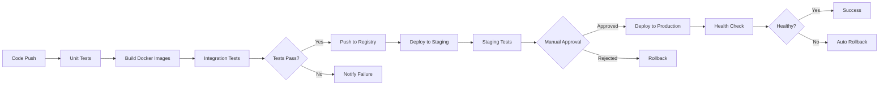

# 게임 서버 개발자를 위한 Docker  

저자: 최흥배, AI-Assisted   
    
권장 개발 환경
- **OS**: Windows 11 이상, WSL2 

-----    
  
# 12장. 실전 배포 시나리오

지금까지 Docker를 사용하여 게임 서버를 컨테이너화하고 최적화하는 방법을 배웠다. 이제 실제 운영 환경에 배포하는 과정을 단계별로 실습한다. 개발 환경에서 시작하여 테스트를 거쳐 프로덕션까지 배포하는 전체 흐름을 알아본다.

## 12.1 개발 환경에서 테스트까지

### 환경별 구성 전략

게임 서버는 일반적으로 다음과 같은 환경을 거쳐 배포된다.

```
개발(Dev) → 테스트(Test) → 스테이징(Staging) → 프로덕션(Production)
```

각 환경의 특징은 다음과 같다.

```
┌──────────────┬──────────────┬──────────────┬──────────────┐
│   개발(Dev)   │  테스트(Test) │ 스테이징(Stg) │ 프로덕션(Prod)│
├──────────────┼──────────────┼──────────────┼──────────────┤
│ 로컬 PC      │ 공유 서버     │ 운영 유사     │ 실제 서비스   │
│ 빠른 반복    │ 자동 테스트   │ 최종 검증     │ 안정성 최우선 │
│ 디버그 모드  │ 릴리스 모드   │ 릴리스 모드   │ 릴리스 모드   │
│ 작은 데이터  │ 샘플 데이터   │ 운영급 데이터 │ 실제 데이터   │
└──────────────┴──────────────┴──────────────┴──────────────┘
```

### 개발 환경 구성

먼저 로컬 개발 환경을 구성한다. 개발 중에는 코드 변경을 빠르게 반영할 수 있어야 한다.

프로젝트 구조:

```
game-server-deploy/
├── docker-compose.dev.yml
├── docker-compose.test.yml
├── docker-compose.staging.yml
├── docker-compose.prod.yml
├── .env.dev
├── .env.test
├── .env.staging
├── .env.prod
├── GameServer/
│   ├── Dockerfile
│   ├── Dockerfile.dev
│   ├── GameServer.csproj
│   └── Program.cs
└── SocketServer/
    ├── Dockerfile
    ├── Dockerfile.dev
    ├── SocketServer.csproj
    └── Program.cs
```

개발용 Dockerfile을 작성한다.

```dockerfile
# GameServer/Dockerfile.dev
FROM mcr.microsoft.com/dotnet/sdk:8.0
WORKDIR /app

# 개발 도구 설치
RUN dotnet tool install --global dotnet-ef

# 소스 코드 복사
COPY . .

# 개발 모드로 실행 (핫 리로드 지원)
CMD ["dotnet", "watch", "run", "--urls", "http://0.0.0.0:5000"]
```

개발용 Docker Compose 파일을 작성한다.

```yaml
# docker-compose.dev.yml
services:
  game-api:
    build:
      context: ./GameServer
      dockerfile: Dockerfile.dev
    container_name: game-api-dev
    ports:
      - "5000:5000"
    volumes:
      # 소스 코드 마운트 (핫 리로드)
      - ./GameServer:/app
      # nuget 패키지 캐시
      - game-nuget:/root/.nuget/packages
    environment:
      - ASPNETCORE_ENVIRONMENT=Development
      - ASPNETCORE_URLS=http://+:5000
      - Logging__Console__FormatterName=Simple
      - ConnectionStrings__Redis=redis:6379
    depends_on:
      - redis
    networks:
      - dev-network
      
  socket-server:
    build:
      context: ./SocketServer
      dockerfile: Dockerfile.dev
    container_name: socket-dev
    ports:
      - "9000:9000"
    volumes:
      - ./SocketServer:/app
      - socket-nuget:/root/.nuget/packages
    environment:
      - ASPNETCORE_ENVIRONMENT=Development
    networks:
      - dev-network
      
  redis:
    image: redis:7-alpine
    container_name: redis-dev
    ports:
      - "6379:6379"
    networks:
      - dev-network
      
  db:
    image: postgres:15-alpine
    container_name: db-dev
    ports:
      - "5432:5432"
    environment:
      - POSTGRES_DB=gamedb
      - POSTGRES_USER=gameuser
      - POSTGRES_PASSWORD=devpassword
    volumes:
      - db-data-dev:/var/lib/postgresql/data
    networks:
      - dev-network

networks:
  dev-network:
    driver: bridge

volumes:
  game-nuget:
  socket-nuget:
  db-data-dev:
```

환경 변수 파일을 작성한다.

```bash
# .env.dev
COMPOSE_PROJECT_NAME=gameserver-dev
ENVIRONMENT=Development

# Database
DB_HOST=db
DB_PORT=5432
DB_NAME=gamedb
DB_USER=gameuser
DB_PASSWORD=devpassword

# Redis
REDIS_HOST=redis
REDIS_PORT=6379

# Application
LOG_LEVEL=Debug
MAX_PLAYERS=100
```

개발 환경을 실행한다.

```bash
# 개발 환경 시작
docker compose -f docker-compose.dev.yml --env-file .env.dev up -d

# 로그 확인 (실시간)
docker compose -f docker-compose.dev.yml logs -f game-api

# 코드를 수정하면 자동으로 재시작됨
# GameServer/Program.cs 파일을 수정해보자

# 개발 환경 종료
docker compose -f docker-compose.dev.yml down
```

### 테스트 환경 구성

테스트 환경에서는 자동화된 테스트를 실행한다.

```yaml
# docker-compose.test.yml
services:
  game-api:
    build:
      context: ./GameServer
      dockerfile: Dockerfile
      target: build
    container_name: game-api-test
    command: dotnet test --logger "console;verbosity=detailed"
    environment:
      - ASPNETCORE_ENVIRONMENT=Test
      - ConnectionStrings__Redis=redis:6379
      - ConnectionStrings__Database=Host=db;Database=gamedb_test;Username=gameuser;Password=testpassword
    depends_on:
      - redis
      - db
    networks:
      - test-network
      
  integration-tests:
    build:
      context: ./GameServer
      dockerfile: Dockerfile
    container_name: integration-test
    environment:
      - TEST_API_URL=http://game-api:5000
      - TEST_SOCKET_URL=socket-server:9000
    command: |
      sh -c "
        sleep 10 &&
        dotnet test ./Tests/IntegrationTests.csproj --logger 'console;verbosity=detailed'
      "
    depends_on:
      - game-api
      - socket-server
    networks:
      - test-network
      
  socket-server:
    build:
      context: ./SocketServer
      dockerfile: Dockerfile
    container_name: socket-test
    environment:
      - ASPNETCORE_ENVIRONMENT=Test
    networks:
      - test-network
      
  redis:
    image: redis:7-alpine
    container_name: redis-test
    networks:
      - test-network
      
  db:
    image: postgres:15-alpine
    container_name: db-test
    environment:
      - POSTGRES_DB=gamedb_test
      - POSTGRES_USER=gameuser
      - POSTGRES_PASSWORD=testpassword
    networks:
      - test-network

networks:
  test-network:
    driver: bridge
```

테스트를 실행한다.

```bash
# 테스트 환경 빌드 및 실행
docker compose -f docker-compose.test.yml up --build --abort-on-container-exit

# 테스트 결과 확인
docker compose -f docker-compose.test.yml logs integration-tests

# 테스트 환경 정리
docker compose -f docker-compose.test.yml down -v
```

### 스테이징 환경 구성

스테이징 환경은 프로덕션과 동일한 구성으로 최종 검증을 수행한다.

```yaml
# docker-compose.staging.yml
services:
  game-api:
    build:
      context: ./GameServer
      dockerfile: Dockerfile
    image: game-server:${VERSION:-latest}
    container_name: game-api-staging
    restart: unless-stopped
    ports:
      - "5000:5000"
    environment:
      - ASPNETCORE_ENVIRONMENT=Staging
      - ConnectionStrings__Redis=redis:6379
      - ConnectionStrings__Database=${DB_CONNECTION_STRING}
    env_file:
      - .env.staging
    depends_on:
      redis:
        condition: service_healthy
      db:
        condition: service_healthy
    healthcheck:
      test: ["CMD", "curl", "-f", "http://localhost:5000/health"]
      interval: 30s
      timeout: 10s
      retries: 3
      start_period: 40s
    networks:
      - staging-network
    deploy:
      resources:
        limits:
          cpus: '1.0'
          memory: 1G
        reservations:
          cpus: '0.5'
          memory: 512M
          
  socket-server:
    build:
      context: ./SocketServer
      dockerfile: Dockerfile
    image: socket-server:${VERSION:-latest}
    container_name: socket-staging
    restart: unless-stopped
    ports:
      - "9000:9000"
    environment:
      - ASPNETCORE_ENVIRONMENT=Staging
    env_file:
      - .env.staging
    healthcheck:
      test: ["CMD", "nc", "-z", "localhost", "9000"]
      interval: 30s
      timeout: 10s
      retries: 3
    networks:
      - staging-network
    deploy:
      resources:
        limits:
          cpus: '1.0'
          memory: 1G
          
  redis:
    image: redis:7-alpine
    container_name: redis-staging
    restart: unless-stopped
    volumes:
      - redis-data-staging:/data
    healthcheck:
      test: ["CMD", "redis-cli", "ping"]
      interval: 10s
      timeout: 5s
      retries: 5
    networks:
      - staging-network
      
  db:
    image: postgres:15-alpine
    container_name: db-staging
    restart: unless-stopped
    environment:
      - POSTGRES_DB=${DB_NAME}
      - POSTGRES_USER=${DB_USER}
      - POSTGRES_PASSWORD=${DB_PASSWORD}
    volumes:
      - db-data-staging:/var/lib/postgresql/data
    healthcheck:
      test: ["CMD-SHELL", "pg_isready -U ${DB_USER}"]
      interval: 10s
      timeout: 5s
      retries: 5
    networks:
      - staging-network

networks:
  staging-network:
    driver: bridge

volumes:
  redis-data-staging:
  db-data-staging:
```

스테이징 환경 변수:

```bash
# .env.staging
COMPOSE_PROJECT_NAME=gameserver-staging
VERSION=1.0.0
ENVIRONMENT=Staging

# Database
DB_NAME=gamedb_staging
DB_USER=gameuser
DB_PASSWORD=staging_secure_password_here

# Application
LOG_LEVEL=Information
MAX_PLAYERS=500
```

스테이징 환경을 배포한다.

```bash
# 버전 지정하여 배포
export VERSION=1.0.0
docker compose -f docker-compose.staging.yml --env-file .env.staging up -d

# 헬스체크 확인
docker compose -f docker-compose.staging.yml ps

# 로그 확인
docker compose -f docker-compose.staging.yml logs -f --tail=100

# 성능 테스트 실행
curl http://localhost:5000/health
```

### 실습: 환경별 배포 스크립트

각 환경별 배포를 자동화하는 스크립트를 작성한다.

```bash
#!/bin/bash
# deploy.sh

set -e

ENVIRONMENT=$1
VERSION=${2:-latest}

if [ -z "$ENVIRONMENT" ]; then
    echo "Usage: ./deploy.sh [dev|test|staging|prod] [version]"
    exit 1
fi

echo "======================================"
echo "Deploying to $ENVIRONMENT environment"
echo "Version: $VERSION"
echo "======================================"

# 환경별 설정
case $ENVIRONMENT in
    dev)
        COMPOSE_FILE="docker-compose.dev.yml"
        ENV_FILE=".env.dev"
        ;;
    test)
        COMPOSE_FILE="docker-compose.test.yml"
        ENV_FILE=".env.test"
        ;;
    staging)
        COMPOSE_FILE="docker-compose.staging.yml"
        ENV_FILE=".env.staging"
        ;;
    prod)
        COMPOSE_FILE="docker-compose.prod.yml"
        ENV_FILE=".env.prod"
        ;;
    *)
        echo "Unknown environment: $ENVIRONMENT"
        exit 1
        ;;
esac

# 이미지 빌드
echo "Building images..."
export VERSION=$VERSION
docker compose -f $COMPOSE_FILE --env-file $ENV_FILE build

# 테스트 환경인 경우 테스트 실행
if [ "$ENVIRONMENT" = "test" ]; then
    echo "Running tests..."
    docker compose -f $COMPOSE_FILE up --abort-on-container-exit
    TEST_RESULT=$?
    docker compose -f $COMPOSE_FILE down -v
    
    if [ $TEST_RESULT -ne 0 ]; then
        echo "Tests failed!"
        exit 1
    fi
    echo "Tests passed!"
    exit 0
fi

# 기존 컨테이너 중지
echo "Stopping existing containers..."
docker compose -f $COMPOSE_FILE --env-file $ENV_FILE down

# 새 컨테이너 시작
echo "Starting new containers..."
docker compose -f $COMPOSE_FILE --env-file $ENV_FILE up -d

# 헬스체크 대기
echo "Waiting for health checks..."
sleep 10

# 상태 확인
docker compose -f $COMPOSE_FILE --env-file $ENV_FILE ps

echo "======================================"
echo "Deployment completed successfully!"
echo "======================================"
```

스크립트를 실행 가능하게 만들고 사용한다.

```bash
# 실행 권한 부여
chmod +x deploy.sh

# 개발 환경 배포
./deploy.sh dev

# 테스트 실행
./deploy.sh test

# 스테이징 배포 (버전 지정)
./deploy.sh staging 1.0.0

# 상태 확인
docker ps
```

## 12.2 클라우드 환경 배포 준비

### 컨테이너 레지스트리 사용

클라우드 환경에 배포하려면 이미지를 컨테이너 레지스트리에 푸시해야 한다. Docker Hub를 사용하는 예제를 실습한다.

```bash
# Docker Hub 로그인
docker login

# 이미지에 태그 추가
docker tag game-server:1.0.0 yourusername/game-server:1.0.0
docker tag game-server:1.0.0 yourusername/game-server:latest

# 이미지 푸시
docker push yourusername/game-server:1.0.0
docker push yourusername/game-server:latest

# 소켓 서버도 동일하게
docker tag socket-server:1.0.0 yourusername/socket-server:1.0.0
docker push yourusername/socket-server:1.0.0
```

프라이빗 레지스트리를 사용할 수도 있다.

```bash
# 로컬 레지스트리 실행
docker run -d -p 5000:5000 --name registry registry:2

# 이미지 태그
docker tag game-server:1.0.0 localhost:5000/game-server:1.0.0

# 푸시
docker push localhost:5000/game-server:1.0.0

# 다른 서버에서 풀
docker pull localhost:5000/game-server:1.0.0
```

### 프로덕션 Docker Compose 구성

프로덕션 환경용 Docker Compose 파일을 작성한다.

```yaml
# docker-compose.prod.yml
services:
  game-api:
    image: yourusername/game-server:${VERSION}
    container_name: game-api-prod
    restart: always
    read_only: true
    tmpfs:
      - /tmp
    security_opt:
      - no-new-privileges:true
    cap_drop:
      - ALL
    cap_add:
      - NET_BIND_SERVICE
    ports:
      - "5000:5000"
    environment:
      - ASPNETCORE_ENVIRONMENT=Production
      - ASPNETCORE_URLS=http://+:5000
    env_file:
      - .env.prod
    depends_on:
      redis:
        condition: service_healthy
      db:
        condition: service_healthy
    healthcheck:
      test: ["CMD", "curl", "-f", "http://localhost:5000/health"]
      interval: 30s
      timeout: 10s
      retries: 3
      start_period: 40s
    networks:
      - prod-network
    deploy:
      replicas: 3
      resources:
        limits:
          cpus: '2.0'
          memory: 2G
        reservations:
          cpus: '1.0'
          memory: 1G
    logging:
      driver: "json-file"
      options:
        max-size: "10m"
        max-file: "3"
        
  socket-server:
    image: yourusername/socket-server:${VERSION}
    container_name: socket-prod
    restart: always
    read_only: true
    tmpfs:
      - /tmp
    security_opt:
      - no-new-privileges:true
    cap_drop:
      - ALL
    cap_add:
      - NET_BIND_SERVICE
    ports:
      - "9000:9000"
    environment:
      - ASPNETCORE_ENVIRONMENT=Production
    env_file:
      - .env.prod
    healthcheck:
      test: ["CMD", "nc", "-z", "localhost", "9000"]
      interval: 30s
      timeout: 10s
      retries: 3
    networks:
      - prod-network
    deploy:
      replicas: 2
      resources:
        limits:
          cpus: '2.0'
          memory: 2G
    logging:
      driver: "json-file"
      options:
        max-size: "10m"
        max-file: "3"
        
  nginx:
    image: nginx:alpine
    container_name: nginx-prod
    restart: always
    ports:
      - "80:80"
      - "443:443"
    volumes:
      - ./nginx/nginx.conf:/etc/nginx/nginx.conf:ro
      - ./nginx/ssl:/etc/nginx/ssl:ro
    depends_on:
      - game-api
    networks:
      - prod-network
    logging:
      driver: "json-file"
      options:
        max-size: "10m"
        max-file: "3"
        
  redis:
    image: redis:7-alpine
    container_name: redis-prod
    restart: always
    command: redis-server --appendonly yes --requirepass ${REDIS_PASSWORD}
    volumes:
      - redis-data-prod:/data
    healthcheck:
      test: ["CMD", "redis-cli", "--raw", "incr", "ping"]
      interval: 10s
      timeout: 5s
      retries: 5
    networks:
      - prod-network
    logging:
      driver: "json-file"
      options:
        max-size: "5m"
        max-file: "3"
        
  db:
    image: postgres:15-alpine
    container_name: db-prod
    restart: always
    environment:
      - POSTGRES_DB=${DB_NAME}
      - POSTGRES_USER=${DB_USER}
      - POSTGRES_PASSWORD=${DB_PASSWORD}
    volumes:
      - db-data-prod:/var/lib/postgresql/data
      - ./db/init.sql:/docker-entrypoint-initdb.d/init.sql:ro
    healthcheck:
      test: ["CMD-SHELL", "pg_isready -U ${DB_USER}"]
      interval: 10s
      timeout: 5s
      retries: 5
    networks:
      - prod-network
    logging:
      driver: "json-file"
      options:
        max-size: "5m"
        max-file: "3"
        
  prometheus:
    image: prom/prometheus:latest
    container_name: prometheus-prod
    restart: always
    volumes:
      - ./prometheus/prometheus.yml:/etc/prometheus/prometheus.yml:ro
      - prometheus-data:/prometheus
    command:
      - '--config.file=/etc/prometheus/prometheus.yml'
      - '--storage.tsdb.path=/prometheus'
      - '--storage.tsdb.retention.time=30d'
    networks:
      - prod-network
      
  grafana:
    image: grafana/grafana:latest
    container_name: grafana-prod
    restart: always
    environment:
      - GF_SECURITY_ADMIN_PASSWORD=${GRAFANA_PASSWORD}
      - GF_USERS_ALLOW_SIGN_UP=false
    volumes:
      - grafana-data:/var/lib/grafana
    depends_on:
      - prometheus
    networks:
      - prod-network

networks:
  prod-network:
    driver: bridge

volumes:
  redis-data-prod:
  db-data-prod:
  prometheus-data:
  grafana-data:
```

Nginx 설정 파일:

```nginx
# nginx/nginx.conf
events {
    worker_connections 1024;
}

http {
    upstream game_api {
        least_conn;
        server game-api-prod:5000 max_fails=3 fail_timeout=30s;
    }

    server {
        listen 80;
        server_name yourdomain.com;

        # HTTP to HTTPS redirect
        return 301 https://$server_name$request_uri;
    }

    server {
        listen 443 ssl http2;
        server_name yourdomain.com;

        ssl_certificate /etc/nginx/ssl/cert.pem;
        ssl_certificate_key /etc/nginx/ssl/key.pem;

        # Security headers
        add_header Strict-Transport-Security "max-age=31536000" always;
        add_header X-Frame-Options "DENY" always;
        add_header X-Content-Type-Options "nosniff" always;

        # API 프록시
        location /api/ {
            proxy_pass http://game_api;
            proxy_http_version 1.1;
            proxy_set_header Upgrade $http_upgrade;
            proxy_set_header Connection 'upgrade';
            proxy_set_header Host $host;
            proxy_cache_bypass $http_upgrade;
            proxy_set_header X-Real-IP $remote_addr;
            proxy_set_header X-Forwarded-For $proxy_add_x_forwarded_for;
            proxy_set_header X-Forwarded-Proto $scheme;
            
            # 타임아웃 설정
            proxy_connect_timeout 60s;
            proxy_send_timeout 60s;
            proxy_read_timeout 60s;
        }

        # 헬스체크
        location /health {
            proxy_pass http://game_api/health;
            access_log off;
        }
    }
}
```

프로덕션 환경 변수:

```bash
# .env.prod
COMPOSE_PROJECT_NAME=gameserver-prod
VERSION=1.0.0
ENVIRONMENT=Production

# Database
DB_NAME=gamedb_prod
DB_USER=gameuser
DB_PASSWORD=STRONG_PASSWORD_HERE

# Redis
REDIS_PASSWORD=STRONG_REDIS_PASSWORD

# Grafana
GRAFANA_PASSWORD=STRONG_GRAFANA_PASSWORD

# Application
LOG_LEVEL=Warning
MAX_PLAYERS=10000
```

### 백업 및 복구 전략

데이터베이스와 볼륨 백업 스크립트를 작성한다.

```bash
#!/bin/bash
# backup.sh

BACKUP_DIR="/backups"
DATE=$(date +%Y%m%d_%H%M%S)

echo "Starting backup at $DATE"

# 데이터베이스 백업
docker exec db-prod pg_dump -U gameuser gamedb_prod | gzip > "$BACKUP_DIR/db_$DATE.sql.gz"

# Redis 백업
docker exec redis-prod redis-cli --rdb /data/dump.rdb SAVE
docker cp redis-prod:/data/dump.rdb "$BACKUP_DIR/redis_$DATE.rdb"

# 볼륨 백업
docker run --rm \
  -v db-data-prod:/data \
  -v $BACKUP_DIR:/backup \
  alpine tar czf /backup/db-volume_$DATE.tar.gz -C /data .

# 오래된 백업 삭제 (30일 이상)
find $BACKUP_DIR -name "*.gz" -mtime +30 -delete
find $BACKUP_DIR -name "*.rdb" -mtime +30 -delete

echo "Backup completed: $DATE"
```

복구 스크립트:

```bash
#!/bin/bash
# restore.sh

BACKUP_FILE=$1

if [ -z "$BACKUP_FILE" ]; then
    echo "Usage: ./restore.sh <backup_file>"
    exit 1
fi

echo "Restoring from $BACKUP_FILE"

# 데이터베이스 복구
gunzip < $BACKUP_FILE | docker exec -i db-prod psql -U gameuser -d gamedb_prod

echo "Restore completed"
```

## 12.3 CI/CD 파이프라인 기초

### GitHub Actions 워크플로우

GitHub Actions를 사용한 CI/CD 파이프라인을 구성한다.

```yaml
# .github/workflows/ci-cd.yml
name: CI/CD Pipeline

on:
  push:
    branches: [ main, develop ]
  pull_request:
    branches: [ main ]

env:
  REGISTRY: docker.io
  IMAGE_NAME_API: yourusername/game-server
  IMAGE_NAME_SOCKET: yourusername/socket-server

jobs:
  test:
    runs-on: ubuntu-latest
    
    steps:
    - name: Checkout code
      uses: actions/checkout@v3
      
    - name: Setup .NET
      uses: actions/setup-dotnet@v3
      with:
        dotnet-version: '8.0.x'
        
    - name: Restore dependencies
      run: dotnet restore
      
    - name: Build
      run: dotnet build --no-restore --configuration Release
      
    - name: Run unit tests
      run: dotnet test --no-build --configuration Release --verbosity normal
      
    - name: Start test environment
      run: docker compose -f docker-compose.test.yml up -d
      
    - name: Wait for services
      run: sleep 30
      
    - name: Run integration tests
      run: |
        docker compose -f docker-compose.test.yml exec -T game-api \
          dotnet test ./Tests/IntegrationTests.csproj
      
    - name: Stop test environment
      run: docker compose -f docker-compose.test.yml down -v

  build-and-push:
    needs: test
    runs-on: ubuntu-latest
    if: github.ref == 'refs/heads/main'
    
    steps:
    - name: Checkout code
      uses: actions/checkout@v3
      
    - name: Set up Docker Buildx
      uses: docker/setup-buildx-action@v2
      
    - name: Log in to Docker Hub
      uses: docker/login-action@v2
      with:
        username: ${{ secrets.DOCKER_USERNAME }}
        password: ${{ secrets.DOCKER_PASSWORD }}
        
    - name: Extract metadata
      id: meta
      uses: docker/metadata-action@v4
      with:
        images: ${{ env.REGISTRY }}/${{ env.IMAGE_NAME_API }}
        tags: |
          type=ref,event=branch
          type=semver,pattern={{version}}
          type=sha,prefix={{branch}}-
          
    - name: Build and push API image
      uses: docker/build-push-action@v4
      with:
        context: ./GameServer
        file: ./GameServer/Dockerfile
        push: true
        tags: ${{ steps.meta.outputs.tags }}
        labels: ${{ steps.meta.outputs.labels }}
        cache-from: type=registry,ref=${{ env.IMAGE_NAME_API }}:buildcache
        cache-to: type=registry,ref=${{ env.IMAGE_NAME_API }}:buildcache,mode=max
        
    - name: Build and push Socket image
      uses: docker/build-push-action@v4
      with:
        context: ./SocketServer
        file: ./SocketServer/Dockerfile
        push: true
        tags: ${{ env.REGISTRY }}/${{ env.IMAGE_NAME_SOCKET }}:${{ github.sha }}
        cache-from: type=registry,ref=${{ env.IMAGE_NAME_SOCKET }}:buildcache
        cache-to: type=registry,ref=${{ env.IMAGE_NAME_SOCKET }}:buildcache,mode=max

  deploy-staging:
    needs: build-and-push
    runs-on: ubuntu-latest
    if: github.ref == 'refs/heads/main'
    
    steps:
    - name: Checkout code
      uses: actions/checkout@v3
      
    - name: Deploy to staging
      uses: appleboy/ssh-action@master
      with:
        host: ${{ secrets.STAGING_HOST }}
        username: ${{ secrets.STAGING_USER }}
        key: ${{ secrets.STAGING_SSH_KEY }}
        script: |
          cd /opt/gameserver
          export VERSION=${{ github.sha }}
          docker compose -f docker-compose.staging.yml pull
          docker compose -f docker-compose.staging.yml up -d
          docker compose -f docker-compose.staging.yml ps
          
    - name: Health check
      run: |
        sleep 30
        curl -f http://${{ secrets.STAGING_HOST }}:5000/health || exit 1

  deploy-production:
    needs: deploy-staging
    runs-on: ubuntu-latest
    if: github.ref == 'refs/heads/main'
    environment:
      name: production
      url: https://yourdomain.com
    
    steps:
    - name: Checkout code
      uses: actions/checkout@v3
      
    - name: Deploy to production
      uses: appleboy/ssh-action@master
      with:
        host: ${{ secrets.PROD_HOST }}
        username: ${{ secrets.PROD_USER }}
        key: ${{ secrets.PROD_SSH_KEY }}
        script: |
          cd /opt/gameserver
          export VERSION=${{ github.sha }}
          
          # 블루-그린 배포
          docker compose -f docker-compose.prod.yml pull
          docker compose -f docker-compose.prod.yml up -d --no-deps game-api
          
          # 헬스체크 대기
          sleep 30
          
          # 이전 컨테이너 제거
          docker compose -f docker-compose.prod.yml up -d --remove-orphans
```

CI/CD 파이프라인 흐름:



### GitLab CI/CD 예제

GitLab CI를 사용하는 경우의 설정이다.

```yaml
# .gitlab-ci.yml
stages:
  - test
  - build
  - deploy-staging
  - deploy-production

variables:
  DOCKER_DRIVER: overlay2
  REGISTRY: registry.gitlab.com
  IMAGE_API: $REGISTRY/$CI_PROJECT_PATH/game-api
  IMAGE_SOCKET: $REGISTRY/$CI_PROJECT_PATH/socket-server

test:
  stage: test
  image: mcr.microsoft.com/dotnet/sdk:8.0
  services:
    - docker:dind
  script:
    - dotnet restore
    - dotnet build --configuration Release
    - dotnet test --configuration Release --no-build
    - docker compose -f docker-compose.test.yml up --abort-on-container-exit
  only:
    - branches

build:
  stage: build
  image: docker:latest
  services:
    - docker:dind
  before_script:
    - docker login -u $CI_REGISTRY_USER -p $CI_REGISTRY_PASSWORD $CI_REGISTRY
  script:
    - docker build -t $IMAGE_API:$CI_COMMIT_SHA ./GameServer
    - docker build -t $IMAGE_SOCKET:$CI_COMMIT_SHA ./SocketServer
    - docker tag $IMAGE_API:$CI_COMMIT_SHA $IMAGE_API:latest
    - docker tag $IMAGE_SOCKET:$CI_COMMIT_SHA $IMAGE_SOCKET:latest
    - docker push $IMAGE_API:$CI_COMMIT_SHA
    - docker push $IMAGE_API:latest
    - docker push $IMAGE_SOCKET:$CI_COMMIT_SHA
    - docker push $IMAGE_SOCKET:latest
  only:
    - main

deploy-staging:
  stage: deploy-staging
  image: alpine:latest
  before_script:
    - apk add --no-cache openssh-client
    - eval $(ssh-agent -s)
    - echo "$STAGING_SSH_KEY" | tr -d '\r' | ssh-add -
    - mkdir -p ~/.ssh
    - chmod 700 ~/.ssh
  script:
    - ssh $STAGING_USER@$STAGING_HOST "
        cd /opt/gameserver &&
        export VERSION=$CI_COMMIT_SHA &&
        docker compose -f docker-compose.staging.yml pull &&
        docker compose -f docker-compose.staging.yml up -d"
  only:
    - main
  environment:
    name: staging
    url: http://staging.yourdomain.com

deploy-production:
  stage: deploy-production
  image: alpine:latest
  before_script:
    - apk add --no-cache openssh-client
    - eval $(ssh-agent -s)
    - echo "$PROD_SSH_KEY" | tr -d '\r' | ssh-add -
    - mkdir -p ~/.ssh
    - chmod 700 ~/.ssh
  script:
    - ssh $PROD_USER@$PROD_HOST "
        cd /opt/gameserver &&
        export VERSION=$CI_COMMIT_SHA &&
        ./rolling-update.sh"
  only:
    - main
  when: manual
  environment:
    name: production
    url: https://yourdomain.com
```

## 12.4 롤링 업데이트 전략

### 무중단 배포 스크립트

게임 서버는 플레이어가 항상 접속해 있으므로 무중단 배포가 중요하다. 롤링 업데이트 스크립트를 작성한다.

```bash
#!/bin/bash
# rolling-update.sh

set -e

VERSION=$1
COMPOSE_FILE="docker-compose.prod.yml"
SERVICE_NAME="game-api"
REPLICAS=3

if [ -z "$VERSION" ]; then
    echo "Usage: ./rolling-update.sh <version>"
    exit 1
fi

echo "======================================"
echo "Starting rolling update to version $VERSION"
echo "======================================"

# 새 이미지 풀
echo "Pulling new image..."
export VERSION=$VERSION
docker compose -f $COMPOSE_FILE pull $SERVICE_NAME

# 현재 실행 중인 컨테이너 목록
CONTAINERS=$(docker compose -f $COMPOSE_FILE ps -q $SERVICE_NAME)
CONTAINER_ARRAY=($CONTAINERS)

# 하나씩 교체
for i in "${!CONTAINER_ARRAY[@]}"; do
    CONTAINER_ID=${CONTAINER_ARRAY[$i]}
    
    echo "Updating container $((i+1))/$REPLICAS..."
    
    # 새 컨테이너 시작
    docker compose -f $COMPOSE_FILE up -d --no-deps --scale $SERVICE_NAME=$((REPLICAS+1)) $SERVICE_NAME
    
    # 헬스체크 대기
    echo "Waiting for health check..."
    sleep 30
    
    # 새 컨테이너가 정상인지 확인
    NEW_CONTAINER=$(docker ps --filter "ancestor=yourusername/game-server:$VERSION" --format "{{.ID}}" | head -1)
    HEALTH=$(docker inspect --format='{{.State.Health.Status}}' $NEW_CONTAINER)
    
    if [ "$HEALTH" != "healthy" ]; then
        echo "New container is not healthy! Rolling back..."
        docker stop $NEW_CONTAINER
        docker rm $NEW_CONTAINER
        exit 1
    fi
    
    # 이전 컨테이너 중지
    echo "Stopping old container..."
    docker stop $CONTAINER_ID
    docker rm $CONTAINER_ID
    
    # 스케일 조정
    docker compose -f $COMPOSE_FILE up -d --no-deps --scale $SERVICE_NAME=$REPLICAS $SERVICE_NAME
    
    echo "Container $((i+1)) updated successfully"
    sleep 10
done

# 사용하지 않는 이미지 정리
echo "Cleaning up old images..."
docker image prune -f

echo "======================================"
echo "Rolling update completed successfully!"
echo "======================================"
```

### 블루-그린 배포

전체 환경을 복제하여 전환하는 블루-그린 배포 전략이다.

```yaml
# docker-compose.blue-green.yml
services:
  # Blue 환경
  game-api-blue:
    image: yourusername/game-server:${BLUE_VERSION}
    container_name: game-api-blue
    restart: unless-stopped
    environment:
      - ASPNETCORE_ENVIRONMENT=Production
      - ENVIRONMENT_COLOR=blue
    env_file:
      - .env.prod
    networks:
      - prod-network
    healthcheck:
      test: ["CMD", "curl", "-f", "http://localhost:5000/health"]
      interval: 10s
      
  # Green 환경
  game-api-green:
    image: yourusername/game-server:${GREEN_VERSION}
    container_name: game-api-green
    restart: unless-stopped
    environment:
      - ASPNETCORE_ENVIRONMENT=Production
      - ENVIRONMENT_COLOR=green
    env_file:
      - .env.prod
    networks:
      - prod-network
    healthcheck:
      test: ["CMD", "curl", "-f", "http://localhost:5000/health"]
      interval: 10s
      
  # 트래픽 라우터
  nginx:
    image: nginx:alpine
    container_name: nginx-router
    restart: always
    ports:
      - "80:80"
    volumes:
      - ./nginx/router.conf:/etc/nginx/nginx.conf:ro
    depends_on:
      - game-api-blue
      - game-api-green
    networks:
      - prod-network

networks:
  prod-network:
    driver: bridge
```

블루-그린 전환 스크립트:

```bash
#!/bin/bash
# blue-green-deploy.sh

CURRENT_ENV=$1  # blue 또는 green
NEW_VERSION=$2

if [ -z "$CURRENT_ENV" ] || [ -z "$NEW_VERSION" ]; then
    echo "Usage: ./blue-green-deploy.sh [blue|green] <new_version>"
    exit 1
fi

# 반대 환경 결정
if [ "$CURRENT_ENV" = "blue" ]; then
    TARGET_ENV="green"
else
    TARGET_ENV="blue"
fi

echo "Current environment: $CURRENT_ENV"
echo "Deploying to: $TARGET_ENV with version $NEW_VERSION"

# 새 환경에 배포
export ${TARGET_ENV^^}_VERSION=$NEW_VERSION
docker compose -f docker-compose.blue-green.yml up -d game-api-$TARGET_ENV

# 헬스체크 대기
echo "Waiting for health check..."
for i in {1..30}; do
    HEALTH=$(docker inspect --format='{{.State.Health.Status}}' game-api-$TARGET_ENV)
    if [ "$HEALTH" = "healthy" ]; then
        echo "New environment is healthy!"
        break
    fi
    echo "Waiting... ($i/30)"
    sleep 2
done

if [ "$HEALTH" != "healthy" ]; then
    echo "New environment failed health check. Aborting."
    docker compose -f docker-compose.blue-green.yml stop game-api-$TARGET_ENV
    exit 1
fi

# Nginx 설정 전환
echo "Switching traffic to $TARGET_ENV..."
sed -i "s/game-api-$CURRENT_ENV/game-api-$TARGET_ENV/g" nginx/router.conf
docker compose -f docker-compose.blue-green.yml restart nginx

echo "Traffic switched successfully!"

# 이전 환경 종료 (선택사항)
read -p "Stop $CURRENT_ENV environment? (y/n) " -n 1 -r
echo
if [[ $REPLY =~ ^[Yy]$ ]]; then
    docker compose -f docker-compose.blue-green.yml stop game-api-$CURRENT_ENV
    echo "$CURRENT_ENV environment stopped"
fi

echo "Deployment completed!"
```

### 카나리 배포

일부 트래픽만 새 버전으로 보내는 카나리 배포 방식이다.

```nginx
# nginx/canary.conf
upstream game_api {
    # 90% 트래픽은 안정 버전으로
    server game-api-stable:5000 weight=9;
    
    # 10% 트래픽은 카나리 버전으로
    server game-api-canary:5000 weight=1;
}

server {
    listen 80;
    
    location /api/ {
        proxy_pass http://game_api;
        proxy_set_header Host $host;
        proxy_set_header X-Real-IP $remote_addr;
    }
}
```

카나리 배포 스크립트:

```bash
#!/bin/bash
# canary-deploy.sh

NEW_VERSION=$1
CANARY_PERCENTAGE=${2:-10}

echo "Deploying canary version $NEW_VERSION with $CANARY_PERCENTAGE% traffic"

# 카나리 컨테이너 시작
docker run -d \
    --name game-api-canary \
    --network prod-network \
    -e ASPNETCORE_ENVIRONMENT=Production \
    yourusername/game-server:$NEW_VERSION

# 헬스체크 대기
sleep 30

# 메트릭 모니터링 (5분간)
echo "Monitoring canary metrics for 5 minutes..."
sleep 300

# 에러율 확인
ERROR_RATE=$(curl -s http://prometheus:9090/api/v1/query?query=rate(http_requests_total{status=~"5.."}[5m]) | jq '.data.result[0].value[1]')

echo "Canary error rate: $ERROR_RATE"

# 에러율이 낮으면 전체 배포
if (( $(echo "$ERROR_RATE < 0.01" | bc -l) )); then
    echo "Canary looks good! Rolling out to all servers..."
    ./rolling-update.sh $NEW_VERSION
    docker stop game-api-canary
    docker rm game-api-canary
else
    echo "Canary has high error rate! Rolling back..."
    docker stop game-api-canary
    docker rm game-api-canary
    exit 1
fi
```

### 롤백 전략

문제 발생 시 빠르게 이전 버전으로 되돌리는 롤백 스크립트다.

```bash
#!/bin/bash
# rollback.sh

PREVIOUS_VERSION=$1

if [ -z "$PREVIOUS_VERSION" ]; then
    # 이전 버전 자동 감지
    PREVIOUS_VERSION=$(docker images yourusername/game-server --format "{{.Tag}}" | grep -v latest | head -2 | tail -1)
fi

echo "Rolling back to version: $PREVIOUS_VERSION"

# 확인
read -p "Are you sure you want to rollback? (yes/no) " -r
if [ "$REPLY" != "yes" ]; then
    echo "Rollback cancelled"
    exit 0
fi

# 빠른 롤백
export VERSION=$PREVIOUS_VERSION
docker compose -f docker-compose.prod.yml pull
docker compose -f docker-compose.prod.yml up -d

# 헬스체크
echo "Waiting for services to be healthy..."
sleep 30

docker compose -f docker-compose.prod.yml ps

echo "Rollback completed to version $PREVIOUS_VERSION"
```

### 배포 체크리스트

배포 전 확인할 사항들을 스크립트로 자동화한다.

```bash
#!/bin/bash
# pre-deploy-checklist.sh

echo "====================================="
echo "Pre-Deployment Checklist"
echo "====================================="

FAILED=0

# 1. 이미지 존재 확인
echo -n "Checking if images exist... "
if docker pull yourusername/game-server:$VERSION > /dev/null 2>&1; then
    echo "✓"
else
    echo "✗ Image not found in registry"
    FAILED=1
fi

# 2. 환경 변수 확인
echo -n "Checking environment variables... "
if [ -f .env.prod ]; then
    echo "✓"
else
    echo "✗ .env.prod file missing"
    FAILED=1
fi

# 3. 디스크 공간 확인
echo -n "Checking disk space... "
DISK_USAGE=$(df -h / | tail -1 | awk '{print $5}' | sed 's/%//')
if [ $DISK_USAGE -lt 80 ]; then
    echo "✓ ($DISK_USAGE% used)"
else
    echo "✗ Disk usage too high: $DISK_USAGE%"
    FAILED=1
fi

# 4. 데이터베이스 백업 확인
echo -n "Checking recent backup... "
LAST_BACKUP=$(find /backups -name "db_*.sql.gz" -mtime -1 | wc -l)
if [ $LAST_BACKUP -gt 0 ]; then
    echo "✓"
else
    echo "⚠ No recent backup found (creating one now)"
    ./backup.sh
fi

# 5. 서비스 상태 확인
echo -n "Checking current services... "
UNHEALTHY=$(docker compose -f docker-compose.prod.yml ps | grep -c unhealthy)
if [ $UNHEALTHY -eq 0 ]; then
    echo "✓"
else
    echo "✗ $UNHEALTHY unhealthy services"
    FAILED=1
fi

# 6. 네트워크 연결 확인
echo -n "Checking external connectivity... "
if curl -f -s http://yourdomain.com/health > /dev/null; then
    echo "✓"
else
    echo "✗ Cannot reach production endpoint"
    FAILED=1
fi

echo "====================================="
if [ $FAILED -eq 0 ]; then
    echo "All checks passed! ✓"
    echo "Ready to deploy."
    exit 0
else
    echo "Some checks failed! ✗"
    echo "Please fix issues before deploying."
    exit 1
fi
```

### 실습: 전체 배포 프로세스

전체 배포 과정을 처음부터 끝까지 실습한다.

```bash
# 1. 배포 전 체크
./pre-deploy-checklist.sh

# 2. 백업 생성
./backup.sh

# 3. 스테이징 배포
./deploy.sh staging 1.1.0

# 4. 스테이징 테스트
curl http://staging.yourdomain.com/health
# 실제 테스트 시나리오 실행

# 5. 프로덕션 배포 (롤링 업데이트)
./rolling-update.sh 1.1.0

# 6. 모니터링
docker compose -f docker-compose.prod.yml logs -f --tail=50

# 문제 발생 시 롤백
./rollback.sh 1.0.0
```

### 정리

이번 장에서는 게임 서버를 실제 운영 환경에 배포하는 전 과정을 배웠다.

주요 내용을 정리하면 다음과 같다.

**환경별 구성**
- 개발, 테스트, 스테이징, 프로덕션 환경을 분리한다
- 각 환경에 맞는 Docker Compose 파일과 환경 변수를 사용한다
- 개발 환경은 핫 리로드를 지원하여 빠른 개발이 가능하다
- 테스트 환경에서는 자동화된 테스트를 실행한다

**클라우드 배포 준비**
- 컨테이너 레지스트리에 이미지를 푸시한다
- Nginx를 리버스 프록시로 사용하여 로드 밸런싱한다
- SSL/TLS를 적용하여 보안을 강화한다
- 백업과 복구 전략을 수립한다

**CI/CD 파이프라인**
- GitHub Actions나 GitLab CI로 자동화 파이프라인을 구성한다
- 코드 푸시 시 자동으로 테스트, 빌드, 배포가 실행된다
- 스테이징 배포 후 수동 승인으로 프로덕션 배포를 제어한다
- 실패 시 자동으로 롤백한다

**무중단 배포 전략**
- 롤링 업데이트로 하나씩 교체하여 서비스 중단을 방지한다
- 블루-그린 배포로 전체 환경을 전환한다
- 카나리 배포로 일부 트래픽만 새 버전으로 보낸다
- 문제 발생 시 빠르게 롤백할 수 있는 체계를 갖춘다

이제 Docker를 사용하여 게임 서버를 안정적으로 개발하고 배포할 수 있다. 작은 규모로 시작하여 점진적으로 확장하면서 경험을 쌓아가면 된다. 실제 서비스에 적용할 때는 모니터링을 강화하고 문제 발생 시 빠르게 대응할 수 있는 운영 체계를 갖추는 것이 중요하다.  