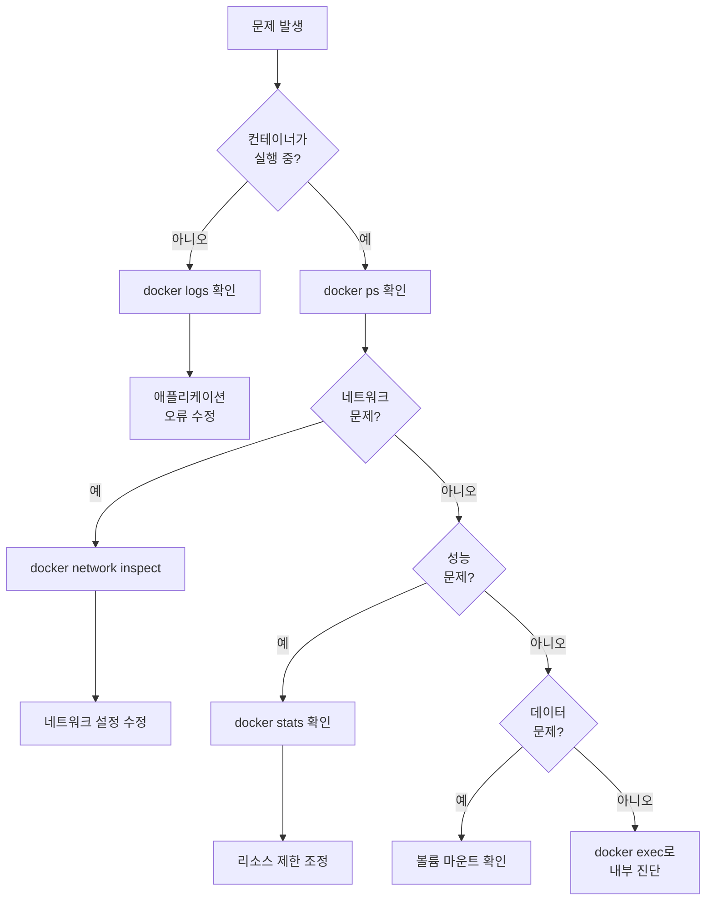

# 게임 서버 개발자를 위한 Docker  

저자: 최흥배, AI-Assisted   
    
권장 개발 환경
- **OS**: Windows 11 이상, WSL2 

-----    
  
# 부록

## 부록 A. Docker 명령어 치트시트

Docker를 사용하다 보면 자주 쓰는 명령어들이 있다. 이 치트시트는 게임 서버 개발 시 가장 많이 사용하는 명령어들을 빠르게 참조할 수 있도록 정리했다.

### 컨테이너 관리

```bash
# 컨테이너 실행
docker run -d --name game-server -p 8080:80 my-game-image

# 실행 중인 컨테이너 목록 확인
docker ps

# 모든 컨테이너 목록 확인 (중지된 것 포함)
docker ps -a

# 컨테이너 중지
docker stop game-server

# 컨테이너 시작
docker start game-server

# 컨테이너 재시작
docker restart game-server

# 컨테이너 삭제
docker rm game-server

# 중지된 모든 컨테이너 삭제
docker container prune

# 실행 중인 컨테이너 강제 중지 후 삭제
docker rm -f game-server
```

### 이미지 관리

```bash
# 이미지 빌드
docker build -t game-server:1.0 .

# 이미지 목록 확인
docker images

# 이미지 다운로드
docker pull mcr.microsoft.com/dotnet/aspnet:8.0

# 이미지 삭제
docker rmi game-server:1.0

# 사용하지 않는 이미지 삭제
docker image prune

# 댕글링 이미지까지 모두 삭제
docker image prune -a

# 이미지 태그 추가
docker tag game-server:1.0 game-server:latest
```

### 로그 및 디버깅

```bash
# 컨테이너 로그 확인
docker logs game-server

# 실시간 로그 확인
docker logs -f game-server

# 최근 100줄만 확인
docker logs --tail 100 game-server

# 타임스탬프 포함해서 로그 확인
docker logs -t game-server

# 컨테이너 내부 접속
docker exec -it game-server /bin/bash

# 컨테이너에서 명령어 실행
docker exec game-server ls /app

# 컨테이너 상세 정보 확인
docker inspect game-server

# 컨테이너 리소스 사용량 확인
docker stats game-server

# 모든 컨테이너 리소스 사용량 확인
docker stats
```

### 네트워크 관리

```bash
# 네트워크 목록 확인
docker network ls

# 커스텀 네트워크 생성
docker network create game-network

# 네트워크 상세 정보 확인
docker network inspect game-network

# 컨테이너를 네트워크에 연결
docker network connect game-network game-server

# 컨테이너를 네트워크에서 분리
docker network disconnect game-network game-server

# 네트워크 삭제
docker network rm game-network

# 사용하지 않는 네트워크 삭제
docker network prune
```

### 볼륨 관리

```bash
# 볼륨 생성
docker volume create game-data

# 볼륨 목록 확인
docker volume ls

# 볼륨 상세 정보 확인
docker volume inspect game-data

# 볼륨 삭제
docker volume rm game-data

# 사용하지 않는 볼륨 삭제
docker volume prune

# 볼륨을 마운트하여 컨테이너 실행
docker run -v game-data:/app/data game-server
```

### Docker Compose

```bash
# 서비스 시작 (백그라운드)
docker compose up -d

# 서비스 시작 (포어그라운드)
docker compose up

# 특정 서비스만 시작
docker compose up -d game-server

# 서비스 중지
docker compose stop

# 서비스 중지 및 컨테이너 삭제
docker compose down

# 볼륨까지 함께 삭제
docker compose down -v

# 서비스 재시작
docker compose restart

# 서비스 로그 확인
docker compose logs

# 특정 서비스 로그 확인
docker compose logs game-server

# 실시간 로그 확인
docker compose logs -f

# 실행 중인 서비스 확인
docker compose ps

# 이미지 빌드
docker compose build

# 빌드 후 서비스 시작
docker compose up -d --build
```

### 시스템 관리

```bash
# 디스크 사용량 확인
docker system df

# 사용하지 않는 모든 리소스 정리
docker system prune

# 볼륨까지 포함해서 정리
docker system prune -a --volumes

# Docker 정보 확인
docker info

# Docker 버전 확인
docker version
```

### 실전 활용 예제

```bash
# 게임 서버를 백그라운드로 실행하고 포트 매핑
docker run -d --name game-api \
  -p 8080:80 \
  -e ASPNETCORE_ENVIRONMENT=Production \
  -v game-logs:/app/logs \
  game-server:latest

# 소켓 서버를 특정 네트워크에 연결하여 실행
docker run -d --name socket-server \
  --network game-network \
  -p 9000:9000 \
  socket-game:latest

# Redis와 함께 게임 서버 실행
docker run -d --name redis redis:alpine
docker run -d --name game-server \
  --link redis:redis \
  -e REDIS_HOST=redis \
  game-server:latest

# 개발 환경에서 코드 변경 반영을 위한 바인드 마운트
docker run -d --name dev-server \
  -p 5000:80 \
  -v $(pwd):/app \
  -v /app/bin \
  -v /app/obj \
  game-server:dev

# 컨테이너 리소스 제한
docker run -d --name game-server \
  --memory="512m" \
  --cpus="1.0" \
  game-server:latest

# 헬스체크가 포함된 컨테이너 실행
docker run -d --name game-server \
  --health-cmd="curl -f http://localhost/health || exit 1" \
  --health-interval=30s \
  --health-timeout=3s \
  --health-retries=3 \
  game-server:latest
```

### WSL2에서 유용한 명령어

```bash
# WSL에서 Docker 서비스 상태 확인
sudo service docker status

# WSL에서 Docker 서비스 시작
sudo service docker start

# Windows에서 WSL 디스크 정리
wsl --shutdown
diskpart
# select vdisk file="C:\Users\YourName\AppData\Local\Packages\CanonicalGroupLimited...\LocalState\ext4.vhdx"
# compact vdisk

# WSL 메모리 설정 (.wslconfig 파일)
# C:\Users\YourName\.wslconfig
[wsl2]
memory=4GB
processors=2
```

이 치트시트를 참조하면 Docker 명령어를 매번 검색하지 않고도 빠르게 작업할 수 있다. 자주 사용하는 명령어는 별도로 메모해두거나, 셸 alias로 등록하면 더욱 편리하다.

---

## 부록 B. Dockerfile 작성 가이드

Dockerfile은 Docker 이미지를 만드는 설계도다. 게임 서버용 Dockerfile을 작성할 때 알아야 할 핵심 지시어와 베스트 프랙티스를 정리했다.

### Dockerfile 기본 구조

```dockerfile
# 베이스 이미지 지정
FROM 베이스이미지:태그

# 메타데이터 추가
LABEL maintainer="your-email@example.com"
LABEL version="1.0"
LABEL description="Game Server"

# 작업 디렉토리 설정
WORKDIR /app

# 파일 복사
COPY 소스경로 대상경로

# 명령어 실행
RUN 명령어

# 환경 변수 설정
ENV 변수명=값

# 포트 노출
EXPOSE 포트번호

# 볼륨 선언
VOLUME ["/data"]

# 컨테이너 시작 명령
CMD ["실행파일", "인자1", "인자2"]
```

### 주요 지시어 설명

**FROM** - 베이스 이미지를 지정한다. 모든 Dockerfile은 FROM으로 시작한다.

```dockerfile
# ASP.NET 런타임 이미지
FROM mcr.microsoft.com/dotnet/aspnet:8.0

# Alpine Linux 기반 경량 이미지
FROM mcr.microsoft.com/dotnet/aspnet:8.0-alpine

# 멀티 스테이지 빌드의 빌드 단계
FROM mcr.microsoft.com/dotnet/sdk:8.0 AS build
```

**WORKDIR** - 작업 디렉토리를 설정한다. 이후 명령어는 이 디렉토리를 기준으로 실행된다.

```dockerfile
WORKDIR /app
# 이후 모든 명령은 /app 디렉토리에서 실행됨
```

**COPY와 ADD** - 파일을 이미지로 복사한다. 일반적으로 COPY를 사용하는 것이 권장된다.

```dockerfile
# 프로젝트 파일만 먼저 복사 (캐시 활용)
COPY *.csproj ./
RUN dotnet restore

# 나머지 파일 복사
COPY . ./

# 특정 파일만 복사
COPY appsettings.json /app/config/

# 여러 파일 복사
COPY file1.txt file2.txt /app/data/
```

**RUN** - 이미지 빌드 시 명령어를 실행한다. 각 RUN은 새로운 레이어를 생성한다.

```dockerfile
# 패키지 설치
RUN apt-get update && apt-get install -y curl

# 여러 명령을 한 RUN으로 합치기 (레이어 최소화)
RUN apt-get update && \
    apt-get install -y curl wget && \
    rm -rf /var/lib/apt/lists/*

# .NET 빌드
RUN dotnet build -c Release -o /app/build
RUN dotnet publish -c Release -o /app/publish
```

**ENV** - 환경 변수를 설정한다. 빌드와 런타임 모두에서 사용된다.

```dockerfile
ENV ASPNETCORE_ENVIRONMENT=Production
ENV REDIS_HOST=localhost
ENV REDIS_PORT=6379

# 여러 환경 변수를 한 번에 설정
ENV APP_NAME="GameServer" \
    APP_VERSION="1.0" \
    LOG_LEVEL="Information"
```

**EXPOSE** - 컨테이너가 리스닝할 포트를 문서화한다. 실제 포트는 런타임에 -p 옵션으로 매핑한다.

```dockerfile
# HTTP 포트
EXPOSE 80

# HTTPS 포트
EXPOSE 443

# 게임 소켓 포트
EXPOSE 9000
```

**CMD와 ENTRYPOINT** - 컨테이너 시작 시 실행할 명령을 지정한다.

```dockerfile
# CMD: 기본 명령 (docker run 시 덮어쓸 수 있음)
CMD ["dotnet", "GameServer.dll"]

# ENTRYPOINT: 고정 명령 (항상 실행됨)
ENTRYPOINT ["dotnet", "GameServer.dll"]

# 함께 사용 (ENTRYPOINT는 고정, CMD는 기본 인자)
ENTRYPOINT ["dotnet"]
CMD ["GameServer.dll"]
```

### ASP.NET Web API 게임 서버 Dockerfile

```dockerfile
# 멀티 스테이지 빌드 - 빌드 단계
FROM mcr.microsoft.com/dotnet/sdk:8.0 AS build
WORKDIR /src

# 프로젝트 파일 복사 및 복원
COPY ["GameServer.WebAPI/GameServer.WebAPI.csproj", "GameServer.WebAPI/"]
RUN dotnet restore "GameServer.WebAPI/GameServer.WebAPI.csproj"

# 전체 소스 복사 및 빌드
COPY . .
WORKDIR "/src/GameServer.WebAPI"
RUN dotnet build "GameServer.WebAPI.csproj" -c Release -o /app/build

# 퍼블리시 단계
FROM build AS publish
RUN dotnet publish "GameServer.WebAPI.csproj" -c Release -o /app/publish /p:UseAppHost=false

# 최종 런타임 이미지
FROM mcr.microsoft.com/dotnet/aspnet:8.0 AS final
WORKDIR /app

# 비루트 사용자 생성 (보안)
RUN addgroup --system --gid 1000 appgroup && \
    adduser --system --uid 1000 --gid 1000 appuser

# 빌드된 파일 복사
COPY --from=publish /app/publish .

# 소유자 변경
RUN chown -R appuser:appgroup /app

# 비루트 사용자로 전환
USER appuser

# 환경 변수 설정
ENV ASPNETCORE_URLS=http://+:80
ENV ASPNETCORE_ENVIRONMENT=Production

# 포트 노출
EXPOSE 80

# 헬스체크 추가
HEALTHCHECK --interval=30s --timeout=3s --start-period=5s --retries=3 \
    CMD curl -f http://localhost/health || exit 1

# 엔트리포인트 설정
ENTRYPOINT ["dotnet", "GameServer.WebAPI.dll"]
```

### 소켓 게임 서버 Dockerfile

```dockerfile
FROM mcr.microsoft.com/dotnet/sdk:8.0 AS build
WORKDIR /src

COPY ["GameServer.Socket/GameServer.Socket.csproj", "GameServer.Socket/"]
RUN dotnet restore "GameServer.Socket/GameServer.Socket.csproj"

COPY . .
WORKDIR "/src/GameServer.Socket"
RUN dotnet build "GameServer.Socket.csproj" -c Release -o /app/build

FROM build AS publish
RUN dotnet publish "GameServer.Socket.csproj" -c Release -o /app/publish

FROM mcr.microsoft.com/dotnet/runtime:8.0 AS final
WORKDIR /app

# 타임존 설정
ENV TZ=Asia/Seoul
RUN ln -snf /usr/share/zoneinfo/$TZ /etc/localtime && echo $TZ > /etc/timezone

COPY --from=publish /app/publish .

# 소켓 포트 노출
EXPOSE 9000

# 로그 디렉토리 생성
RUN mkdir -p /app/logs

# 볼륨 선언
VOLUME ["/app/logs"]

ENTRYPOINT ["dotnet", "GameServer.Socket.dll"]
```

### 개발 환경용 Dockerfile

```dockerfile
FROM mcr.microsoft.com/dotnet/sdk:8.0
WORKDIR /app

# 개발 도구 설치
RUN dotnet tool install --global dotnet-ef && \
    dotnet tool install --global dotnet-watch

ENV PATH="${PATH}:/root/.dotnet/tools"

# 핫 리로드를 위한 환경 변수
ENV DOTNET_USE_POLLING_FILE_WATCHER=true
ENV ASPNETCORE_ENVIRONMENT=Development

EXPOSE 5000

# 개발 모드로 실행
CMD ["dotnet", "watch", "run", "--urls", "http://0.0.0.0:5000"]
```

### Dockerfile 작성 베스트 프랙티스

**레이어 캐싱 활용** - 자주 변경되지 않는 부분을 먼저 배치한다.

```dockerfile
# 좋은 예: 프로젝트 파일을 먼저 복사하여 의존성 캐싱
COPY *.csproj ./
RUN dotnet restore
COPY . ./
RUN dotnet build

# 나쁜 예: 모든 파일을 먼저 복사하면 캐시 활용 불가
COPY . ./
RUN dotnet restore
RUN dotnet build
```

**레이어 최소화** - 여러 RUN 명령을 하나로 합친다.

```dockerfile
# 좋은 예
RUN apt-get update && \
    apt-get install -y curl wget && \
    rm -rf /var/lib/apt/lists/*

# 나쁜 예
RUN apt-get update
RUN apt-get install -y curl
RUN apt-get install -y wget
RUN rm -rf /var/lib/apt/lists/*
```

**.dockerignore 활용** - 불필요한 파일은 이미지에 포함하지 않는다.

```
# .dockerignore 파일
bin/
obj/
*.user
.git/
.vs/
.vscode/
*.md
Dockerfile
.dockerignore
docker-compose.yml
```

**멀티 스테이지 빌드 사용** - 최종 이미지 크기를 줄인다.

```dockerfile
# 빌드 도구가 포함된 큰 이미지에서 빌드
FROM mcr.microsoft.com/dotnet/sdk:8.0 AS build
# ... 빌드 과정 ...

# 런타임만 있는 작은 이미지로 복사
FROM mcr.microsoft.com/dotnet/aspnet:8.0 AS final
COPY --from=build /app/publish .
```

**보안 강화** - 비루트 사용자로 실행한다.

```dockerfile
# 사용자 생성
RUN addgroup --system --gid 1000 appgroup && \
    adduser --system --uid 1000 --gid 1000 appuser

# 권한 변경
RUN chown -R appuser:appgroup /app

# 사용자 전환
USER appuser
```

**명시적 태그 사용** - latest 태그는 피한다.

```dockerfile
# 좋은 예
FROM mcr.microsoft.com/dotnet/aspnet:8.0

# 나쁜 예
FROM mcr.microsoft.com/dotnet/aspnet:latest
```

### 환경별 Dockerfile 관리

프로젝트 구조를 다음과 같이 구성할 수 있다.

```
project/
├── Dockerfile              # 프로덕션용
├── Dockerfile.dev          # 개발용
├── Dockerfile.test         # 테스트용
└── docker-compose.yml
```

빌드 시 특정 Dockerfile을 지정한다.

```bash
# 개발용 이미지 빌드
docker build -f Dockerfile.dev -t game-server:dev .

# 프로덕션용 이미지 빌드
docker build -f Dockerfile -t game-server:prod .
```

이 가이드를 참고하여 게임 서버에 최적화된 Dockerfile을 작성할 수 있다. 상황에 맞게 지시어를 조합하고, 베스트 프랙티스를 적용하면 효율적이고 안전한 이미지를 만들 수 있다.

---

## 부록 C. docker-compose.yml 템플릿

Docker Compose는 여러 컨테이너를 정의하고 실행하는 도구다. 게임 서버 개발에서 자주 사용하는 구성을 템플릿으로 정리했다.

### 기본 구조

```yaml
services:
  서비스명:
    image: 이미지명
    build: 빌드설정
    container_name: 컨테이너명
    ports:
      - "호스트포트:컨테이너포트"
    environment:
      - 환경변수=값
    volumes:
      - 볼륨:경로
    networks:
      - 네트워크명
    depends_on:
      - 의존서비스
    restart: 재시작정책

networks:
  네트워크명:

volumes:
  볼륨명:
```

### 템플릿 1: ASP.NET Web API + Redis

```yaml
services:
  game-api:
    build:
      context: .
      dockerfile: Dockerfile
    container_name: game-api
    ports:
      - "8080:80"
    environment:
      - ASPNETCORE_ENVIRONMENT=Production
      - REDIS_HOST=redis
      - REDIS_PORT=6379
      - ConnectionStrings__Redis=redis:6379
    depends_on:
      - redis
    networks:
      - game-network
    restart: unless-stopped
    volumes:
      - game-logs:/app/logs
    healthcheck:
      test: ["CMD", "curl", "-f", "http://localhost/health"]
      interval: 30s
      timeout: 3s
      retries: 3
      start_period: 10s

  redis:
    image: redis:7-alpine
    container_name: game-redis
    ports:
      - "6379:6379"
    networks:
      - game-network
    restart: unless-stopped
    volumes:
      - redis-data:/data
    command: redis-server --appendonly yes
    healthcheck:
      test: ["CMD", "redis-cli", "ping"]
      interval: 10s
      timeout: 3s
      retries: 3

networks:
  game-network:
    driver: bridge

volumes:
  game-logs:
  redis-data:
```

### 템플릿 2: 소켓 서버 + PostgreSQL

```yaml
services:
  socket-server:
    build:
      context: ./GameServer.Socket
      dockerfile: Dockerfile
    container_name: socket-game-server
    ports:
      - "9000:9000"
    environment:
      - SOCKET_PORT=9000
      - DB_HOST=postgres
      - DB_PORT=5432
      - DB_NAME=gamedb
      - DB_USER=gameuser
      - DB_PASSWORD=gamepass123
    depends_on:
      postgres:
        condition: service_healthy
    networks:
      - game-network
    restart: unless-stopped
    volumes:
      - socket-logs:/app/logs

  postgres:
    image: postgres:15-alpine
    container_name: game-postgres
    ports:
      - "5432:5432"
    environment:
      - POSTGRES_USER=gameuser
      - POSTGRES_PASSWORD=gamepass123
      - POSTGRES_DB=gamedb
      - PGDATA=/var/lib/postgresql/data/pgdata
    networks:
      - game-network
    restart: unless-stopped
    volumes:
      - postgres-data:/var/lib/postgresql/data
      - ./init.sql:/docker-entrypoint-initdb.d/init.sql
    healthcheck:
      test: ["CMD-SHELL", "pg_isready -U gameuser -d gamedb"]
      interval: 10s
      timeout: 5s
      retries: 5

networks:
  game-network:
    driver: bridge

volumes:
  socket-logs:
  postgres-data:
```

### 템플릿 3: Web API + 소켓 서버 + MySQL + Redis (풀스택)

```yaml
services:
  web-api:
    build:
      context: ./GameServer.WebAPI
      dockerfile: Dockerfile
    container_name: game-web-api
    ports:
      - "8080:80"
    environment:
      - ASPNETCORE_ENVIRONMENT=Production
      - ConnectionStrings__DefaultConnection=Server=mysql;Database=gamedb;User=root;Password=rootpass123;
      - ConnectionStrings__Redis=redis:6379
    depends_on:
      mysql:
        condition: service_healthy
      redis:
        condition: service_healthy
    networks:
      - game-network
    restart: unless-stopped
    volumes:
      - api-logs:/app/logs

  socket-server:
    build:
      context: ./GameServer.Socket
      dockerfile: Dockerfile
    container_name: game-socket-server
    ports:
      - "9000:9000"
    environment:
      - SOCKET_PORT=9000
      - DB_CONNECTION=Server=mysql;Database=gamedb;User=root;Password=rootpass123;
      - REDIS_CONNECTION=redis:6379
    depends_on:
      mysql:
        condition: service_healthy
      redis:
        condition: service_healthy
    networks:
      - game-network
    restart: unless-stopped
    volumes:
      - socket-logs:/app/logs

  mysql:
    image: mysql:8.0
    container_name: game-mysql
    ports:
      - "3306:3306"
    environment:
      - MYSQL_ROOT_PASSWORD=rootpass123
      - MYSQL_DATABASE=gamedb
      - MYSQL_USER=gameuser
      - MYSQL_PASSWORD=gamepass123
    networks:
      - game-network
    restart: unless-stopped
    volumes:
      - mysql-data:/var/lib/mysql
      - ./schema.sql:/docker-entrypoint-initdb.d/schema.sql
    # 최신 MySQL에서는 기본 인증(caching_sha2_password)을 사용한다.
    # 아주 오래된 클라이언트 호환이 필요할 때만 MySQL 버전을 고정하고 별도 검증한다.
    healthcheck:
      test: ["CMD", "mysqladmin", "ping", "-h", "localhost", "-u", "root", "-prootpass123"]
      interval: 10s
      timeout: 5s
      retries: 5

  redis:
    image: redis:7-alpine
    container_name: game-redis
    ports:
      - "6379:6379"
    networks:
      - game-network
    restart: unless-stopped
    volumes:
      - redis-data:/data
    command: redis-server --appendonly yes --requirepass redispass123
    healthcheck:
      test: ["CMD-SHELL", "redis-cli -a redispass123 --no-auth-warning ping | grep -q PONG"]
      interval: 10s
      timeout: 3s
      retries: 3

networks:
  game-network:
    driver: bridge
    ipam:
      config:
        - subnet: 172.20.0.0/16

volumes:
  api-logs:
  socket-logs:
  mysql-data:
  redis-data:
```

### 템플릿 4: 개발 환경 (핫 리로드 지원)

```yaml
services:
  game-api-dev:
    build:
      context: ./GameServer.WebAPI
      dockerfile: Dockerfile.dev
    container_name: game-api-dev
    ports:
      - "5000:5000"
    environment:
      - ASPNETCORE_ENVIRONMENT=Development
      - ASPNETCORE_URLS=http://+:5000
    networks:
      - game-network
    volumes:
      - ./GameServer.WebAPI:/app
      - /app/bin
      - /app/obj
    stdin_open: true
    tty: true

  redis-dev:
    image: redis:7-alpine
    container_name: redis-dev
    ports:
      - "6379:6379"
    networks:
      - game-network

networks:
  game-network:
    driver: bridge
```

### 템플릿 5: 로드 밸런싱 (Nginx)

```yaml
services:
  nginx:
    image: nginx:alpine
    container_name: game-nginx
    ports:
      - "80:80"
    volumes:
      - ./nginx.conf:/etc/nginx/nginx.conf:ro
    depends_on:
      - game-api-1
      - game-api-2
      - game-api-3
    networks:
      - game-network
    restart: unless-stopped

  game-api-1:
    build:
      context: .
      dockerfile: Dockerfile
    container_name: game-api-1
    expose:
      - "80"
    environment:
      - ASPNETCORE_ENVIRONMENT=Production
      - INSTANCE_ID=1
    networks:
      - game-network
    restart: unless-stopped

  game-api-2:
    build:
      context: .
      dockerfile: Dockerfile
    container_name: game-api-2
    expose:
      - "80"
    environment:
      - ASPNETCORE_ENVIRONMENT=Production
      - INSTANCE_ID=2
    networks:
      - game-network
    restart: unless-stopped

  game-api-3:
    build:
      context: .
      dockerfile: Dockerfile
    container_name: game-api-3
    expose:
      - "80"
    environment:
      - ASPNETCORE_ENVIRONMENT=Production
      - INSTANCE_ID=3
    networks:
      - game-network
    restart: unless-stopped

networks:
  game-network:
    driver: bridge
```

nginx.conf 파일 예시:

```nginx
events {
    worker_connections 1024;
}

http {
    upstream game_backend {
        least_conn;
        server game-api-1:80;
        server game-api-2:80;
        server game-api-3:80;
    }

    server {
        listen 80;

        location / {
            proxy_pass http://game_backend;
            proxy_set_header Host $host;
            proxy_set_header X-Real-IP $remote_addr;
            proxy_set_header X-Forwarded-For $proxy_add_x_forwarded_for;
        }

        location /health {
            access_log off;
            return 200 "healthy\n";
        }
    }
}
```

### 템플릿 6: 모니터링 스택 (Prometheus + Grafana)

```yaml
services:
  game-api:
    build:
      context: .
      dockerfile: Dockerfile
    container_name: game-api
    ports:
      - "8080:80"
    networks:
      - game-network
    restart: unless-stopped

  prometheus:
    image: prom/prometheus:latest
    container_name: game-prometheus
    ports:
      - "9090:9090"
    volumes:
      - ./prometheus.yml:/etc/prometheus/prometheus.yml
      - prometheus-data:/prometheus
    command:
      - '--config.file=/etc/prometheus/prometheus.yml'
      - '--storage.tsdb.path=/prometheus'
    networks:
      - game-network
    restart: unless-stopped

  grafana:
    image: grafana/grafana:latest
    container_name: game-grafana
    ports:
      - "3000:3000"
    environment:
      - GF_SECURITY_ADMIN_PASSWORD=admin123
    volumes:
      - grafana-data:/var/lib/grafana
    depends_on:
      - prometheus
    networks:
      - game-network
    restart: unless-stopped

networks:
  game-network:
    driver: bridge

volumes:
  prometheus-data:
  grafana-data:
```

### 환경별 설정 분리

docker-compose.yml (기본):

```yaml
services:
  game-api:
    build: .
    ports:
      - "${API_PORT:-8080}:80"
    environment:
      - ASPNETCORE_ENVIRONMENT=${ENVIRONMENT:-Production}
```

docker-compose.dev.yml (개발):

```yaml
services:
  game-api:
    build:
      dockerfile: Dockerfile.dev
    volumes:
      - ./GameServer.WebAPI:/app
    environment:
      - ASPNETCORE_ENVIRONMENT=Development
```

docker-compose.prod.yml (운영):

```yaml
services:
  game-api:
    deploy:
      replicas: 3
      resources:
        limits:
          cpus: '1.0'
          memory: 512M
    logging:
      driver: "json-file"
      options:
        max-size: "10m"
        max-file: "3"
```

사용 방법:

```bash
# 개발 환경
docker compose -f docker-compose.yml -f docker-compose.dev.yml up

# 운영 환경
docker compose -f docker-compose.yml -f docker-compose.prod.yml up
```

### .env 파일 활용

.env 파일:

```env
# 서버 설정
API_PORT=8080
SOCKET_PORT=9000
ENVIRONMENT=Production

# 데이터베이스
DB_HOST=mysql
DB_PORT=3306
DB_NAME=gamedb
DB_USER=gameuser
DB_PASSWORD=gamepass123

# Redis
REDIS_HOST=redis
REDIS_PORT=6379
REDIS_PASSWORD=redispass123

# 버전
IMAGE_VERSION=1.0
```

docker-compose.yml에서 사용:

```yaml
services:
  game-api:
    image: game-api:${IMAGE_VERSION}
    ports:
      - "${API_PORT}:80"
    environment:
      - DB_CONNECTION=Server=${DB_HOST};Port=${DB_PORT};Database=${DB_NAME};User=${DB_USER};Password=${DB_PASSWORD};
```

이 템플릿들을 프로젝트에 맞게 수정하여 사용하면 게임 서버 인프라를 빠르게 구축할 수 있다.

---

## 부록 D. 문제 해결 가이드

Docker를 사용하다 보면 다양한 문제를 마주치게 된다. 게임 서버 개발 시 자주 발생하는 문제와 해결 방법을 정리했다.

### WSL2 관련 문제

**문제: WSL2에서 Docker 서비스가 시작되지 않는다**

```
Cannot connect to the Docker daemon at unix:///var/run/docker.sock
```

해결 방법:

```bash
# Docker 서비스 시작
sudo service docker start

# 서비스 상태 확인
sudo service docker status

# WSL 안에 Docker Engine을 직접 설치한 경우의 임시 자동 시작 설정 (.bashrc 또는 .zshrc에 추가)
# Docker Desktop 사용자는 보통 Docker Desktop을 실행하면 된다.
echo "sudo service docker start > /dev/null 2>&1" >> ~/.bashrc
```

**문제: WSL2 메모리 사용량이 과도하게 높다**

해결 방법:

Windows에서 `C:\Users\사용자명\.wslconfig` 파일 생성:

```
[wsl2]
memory=4GB
processors=2
swap=2GB
localhostForwarding=true
```

설정 적용:

```powershell
wsl --shutdown
wsl
```

**문제: WSL2 디스크 공간이 부족하다**

해결 방법:

```bash
# Docker 정리
docker system prune -a --volumes

# WSL 종료
wsl --shutdown
```

Windows PowerShell에서 디스크 압축:

```powershell
# WSL 디스크 파일 찾기
diskpart
select vdisk file="C:\Users\사용자명\AppData\Local\Packages\CanonicalGroupLimited.Ubuntu_...\LocalState\ext4.vhdx"
attach vdisk readonly
compact vdisk
detach vdisk
exit
```

### 컨테이너 실행 문제

**문제: 컨테이너가 즉시 종료된다**

```bash
# 로그 확인
docker logs 컨테이너명

# 상세 정보 확인
docker inspect 컨테이너명

# 종료 코드 확인
docker ps -a
```

일반적인 원인:

1. 애플리케이션 오류 - 로그에서 예외 확인
2. CMD/ENTRYPOINT 잘못 설정 - Dockerfile 확인
3. 환경 변수 누락 - 필수 설정 확인

해결 방법:

```dockerfile
# Dockerfile에서 디버깅
# 임시로 sleep 추가
CMD ["sh", "-c", "sleep 3600"]

# 또는 대화형 모드로 실행
docker run -it --entrypoint /bin/bash 이미지명
```

**문제: 포트가 이미 사용 중이다**

```
Error starting userland proxy: listen tcp 0.0.0.0:8080: bind: address already in use
```

해결 방법:

```bash
# Windows에서 포트 사용 프로세스 확인
netstat -ano | findstr :8080

# Linux/WSL에서 포트 사용 프로세스 확인
sudo lsof -i :8080
sudo netstat -tulpn | grep :8080

# 프로세스 종료
kill -9 프로세스ID

# 또는 다른 포트 사용
docker run -p 8081:80 이미지명
```

**문제: 컨테이너 내부에서 인터넷 연결이 안 된다**

해결 방법:

```bash
# DNS 확인
docker run --rm alpine ping google.com

# DNS 서버 지정
docker run --dns 8.8.8.8 --dns 8.8.4.4 이미지명

# Docker 데몬 재시작
sudo service docker restart
```

### 네트워크 문제

**문제: 컨테이너 간 통신이 안 된다**

```bash
# 네트워크 확인
docker network inspect 네트워크명

# 같은 네트워크에 있는지 확인
docker inspect 컨테이너명 | grep NetworkMode

# 연결 테스트
docker exec 컨테이너1 ping 컨테이너2
```

해결 방법:

```yaml
# docker-compose.yml에서 명시적 네트워크 설정
services:
  service1:
    networks:
      - app-network
  service2:
    networks:
      - app-network

networks:
  app-network:
    driver: bridge
```

**문제: 호스트에서 컨테이너에 접근할 수 없다**

```bash
# 포트 매핑 확인
docker port 컨테이너명

# 방화벽 확인
sudo ufw status

# Windows 방화벽에서 포트 허용 확인
```

해결 방법:

```bash
# 올바른 포트 매핑
docker run -p 8080:80 이미지명

# 모든 인터페이스에서 리스닝
docker run -p 0.0.0.0:8080:80 이미지명

# WSL2에서는 localhost 포워딩 확인
# .wslconfig에 localhostForwarding=true 설정
```

### 빌드 문제

**문제: 이미지 빌드가 느리다**

해결 방법:

```dockerfile
# .dockerignore 파일 작성
bin/
obj/
.git/
.vs/
*.md

# 레이어 캐싱 활용
# 자주 변경되지 않는 것부터 복사
COPY *.csproj ./
RUN dotnet restore
COPY . ./
RUN dotnet build
```

**문제: 빌드 중 "no space left on device" 오류**

해결 방법:

```bash
# 사용하지 않는 리소스 정리
docker system prune -a --volumes

# 빌드 캐시 정리
docker builder prune

# WSL 디스크 공간 확인
df -h
```

**문제: Dockerfile에서 파일을 찾을 수 없다**

```
COPY failed: file not found in build context
```

해결 방법:

```bash
# 빌드 컨텍스트 확인
docker build -t test . --no-cache --progress=plain

# 올바른 경로로 빌드
docker build -f Dockerfile -t 이미지명 .

# .dockerignore 확인
cat .dockerignore
```

### 볼륨 및 데이터 문제

**문제: 볼륨 데이터가 사라진다**

해결 방법:

```bash
# 볼륨이 제대로 마운트되었는지 확인
docker inspect 컨테이너명 | grep -A 10 Mounts

# 명시적 볼륨 생성
docker volume create 볼륨명
docker run -v 볼륨명:/data 이미지명

# docker-compose.yml에서 볼륨 선언
volumes:
  data-volume:

services:
  app:
    volumes:
      - data-volume:/app/data
```

**문제: 볼륨 권한 오류 (Permission denied)**

해결 방법:

```dockerfile
# Dockerfile에서 권한 설정
RUN mkdir -p /app/data && chown appuser:appgroup /app/data

# 또는 컨테이너 실행 시
docker run -v $(pwd)/data:/app/data --user $(id -u):$(id -g) 이미지명
```

### 환경 변수 문제

**문제: 환경 변수가 인식되지 않는다**

해결 방법:

```bash
# 환경 변수 확인
docker exec 컨테이너명 env

# 올바른 형식으로 전달
docker run -e VAR1=value1 -e VAR2=value2 이미지명

# 파일로 전달
docker run --env-file .env 이미지명
```

docker-compose.yml:

```yaml
services:
  app:
    environment:
      - DB_HOST=mysql
      - DB_PORT=3306
    # 또는
    env_file:
      - .env
```

### 성능 문제

**문제: 컨테이너 성능이 느리다**

진단:

```bash
# 리소스 사용량 확인
docker stats

# 상세 정보
docker stats --no-stream --format "table {{.Name}}\t{{.CPUPerc}}\t{{.MemUsage}}"
```

해결 방법:

```yaml
# docker-compose.yml에서 리소스 제한
services:
  app:
    deploy:
      resources:
        limits:
          cpus: '2.0'
          memory: 2G
        reservations:
          cpus: '1.0'
          memory: 1G
```

**문제: WSL2에서 파일 I/O가 느리다**

해결 방법:

```bash
# WSL 파일 시스템에서 작업 (빠름)
cd /home/user/project

# Windows 파일 시스템은 피하기 (느림)
# /mnt/c/Users/...
```

### 데이터베이스 연결 문제

**문제: 게임 서버가 DB에 연결할 수 없다**

```
Unable to connect to database
```

진단:

```bash
# 네트워크 확인
docker exec game-server ping mysql

# 포트 확인
docker exec game-server nc -zv mysql 3306

# DB 로그 확인
docker logs mysql
```

해결 방법:

```yaml
# docker-compose.yml에서 의존성 및 헬스체크 설정
services:
  game-server:
    depends_on:
      mysql:
        condition: service_healthy
    environment:
      - DB_HOST=mysql
      
  mysql:
    healthcheck:
      test: ["CMD", "mysqladmin", "ping", "-h", "localhost"]
      interval: 10s
      timeout: 5s
      retries: 5
```

### Docker Compose 문제

**문제: docker compose up이 실패한다**

```bash
# 상세 오류 확인
docker compose up --verbose

# 설정 검증
docker compose config

# 특정 서비스만 시작
docker compose up 서비스명
```

**문제: 서비스 시작 순서 문제**

해결 방법:

```yaml
# depends_on과 healthcheck 조합
services:
  app:
    depends_on:
      db:
        condition: service_healthy
      redis:
        condition: service_started
        
  db:
    healthcheck:
      test: ["CMD", "pg_isready"]
      interval: 5s
```

### 로깅 문제

**문제: 로그가 보이지 않는다**

해결 방법:

```bash
# 로그 드라이버 확인
docker inspect 컨테이너명 | grep LogConfig

# 로그 실시간 확인
docker logs -f 컨테이너명

# 타임스탬프 포함
docker logs -t 컨테이너명

# 최근 로그만
docker logs --tail 100 컨테이너명
```

애플리케이션에서 표준 출력으로 로깅:

```csharp
// ASP.NET에서 콘솔 로깅 설정
builder.Logging.ClearProviders();
builder.Logging.AddConsole();
```

### 일반적인 디버깅 절차



### 유용한 디버깅 명령어

```bash
# 컨테이너 내부 쉘 접속
docker exec -it 컨테이너명 /bin/bash

# 파일 시스템 확인
docker exec 컨테이너명 ls -la /app

# 프로세스 확인
docker exec 컨테이너명 ps aux

# 네트워크 연결 확인
docker exec 컨테이너명 netstat -tuln

# 환경 변수 확인
docker exec 컨테이너명 env

# 파일 내용 확인
docker exec 컨테이너명 cat /app/appsettings.json

# 컨테이너에서 파일 복사
docker cp 컨테이너명:/app/logs/error.log ./

# 컨테이너로 파일 복사
docker cp ./config.json 컨테이너명:/app/
```

문제 해결 시 이 가이드를 참조하면 대부분의 상황을 해결할 수 있다. 문제가 해결되지 않는 경우, Docker 로그와 애플리케이션 로그를 함께 확인하고, 필요하면 커뮤니티나 공식 문서를 참조한다.    