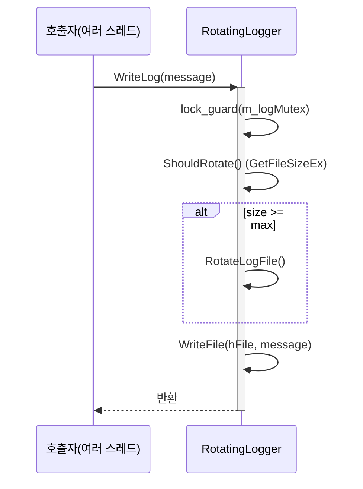

# 게임 서버 개발자를 위한 최신 Win32 API 프로그래밍  

저자: 최흥배, Claude AI   
    
권장 개발 환경
- **IDE**: Visual Studio 2022 (Community 이상)
- **컴파일러**: MSVC v143 (C++20 지원)
- **OS**: Windows 10 이상

-----  

# Chapter 3. 파일 시스템
게임 서버에서 파일 시스템은 매우 중요한 역할을 한다. 설정 파일 읽기, 로그 파일 작성, 게임 데이터 저장, 그리고 실시간 파일 변경 감지 등 다양한 용도로 활용된다. 이 장에서는 Win32 API를 사용한 효율적인 파일 시스템 프로그래밍 기법을 학습하겠다.

## 3.1 파일 I/O 기본

### 3.1.1 CreateFile - 파일 핸들 생성
Win32에서 모든 파일 작업은 파일 핸들을 통해 이루어진다. `CreateFile` 함수는 파일을 열거나 생성하여 핸들을 반환한다.

```cpp
#include <windows.h>
#include <iostream>
#include <string>

class FileManager {
private:
    HANDLE m_hFile;
    std::wstring m_fileName;

public:
    FileManager() : m_hFile(INVALID_HANDLE_VALUE) {}
    
    ~FileManager() {
        CloseFile();
    }

    bool OpenFile(const std::wstring& fileName, DWORD desiredAccess, 
                  DWORD creationDisposition = OPEN_EXISTING) {
        CloseFile(); // 기존 파일이 열려있다면 닫기
        
        m_fileName = fileName;
        m_hFile = CreateFileW(
            fileName.c_str(),           // 파일명
            desiredAccess,              // 접근 권한 (GENERIC_READ, GENERIC_WRITE 등)
            FILE_SHARE_READ,            // 공유 모드
            nullptr,                    // 보안 속성
            creationDisposition,        // 생성 방식
            FILE_ATTRIBUTE_NORMAL,      // 파일 속성
            nullptr                     // 템플릿 파일
        );
        
        if (m_hFile == INVALID_HANDLE_VALUE) {
            std::wcout << L"파일 열기 실패: " << fileName 
                      << L", 오류 코드: " << GetLastError() << std::endl;
            return false;
        }
        
        return true;
    }
    
    void CloseFile() {
        if (m_hFile != INVALID_HANDLE_VALUE) {
            CloseHandle(m_hFile);
            m_hFile = INVALID_HANDLE_VALUE;
        }
    }
    
    HANDLE GetHandle() const { return m_hFile; }
    bool IsValid() const { return m_hFile != INVALID_HANDLE_VALUE; }
};
```

### 3.1.2 ReadFile과 WriteFile - 기본 파일 읽기/쓰기
파일 읽기와 쓰기는 게임 서버에서 가장 기본적인 작업이다.

```cpp
#include <vector>

class GameConfigLoader {
private:
    FileManager m_fileManager;
    
public:
    bool LoadConfig(const std::wstring& configFile) {
        if (!m_fileManager.OpenFile(configFile, GENERIC_READ)) {
            return false;
        }
        
        // 파일 크기 확인
        LARGE_INTEGER fileSize;
        if (!GetFileSizeEx(m_fileManager.GetHandle(), &fileSize)) {
            std::wcout << L"파일 크기 확인 실패" << std::endl;
            return false;
        }
        
        // 파일이 너무 크면 거부 (예: 10MB 제한)
        if (fileSize.QuadPart > 10 * 1024 * 1024) {
            std::wcout << L"파일이 너무 큽니다: " << fileSize.QuadPart << L" bytes" << std::endl;
            return false;
        }
        
        // 버퍼 준비
        std::vector<char> buffer(static_cast<size_t>(fileSize.QuadPart));
        
        // 파일 읽기
        DWORD bytesRead = 0;
        if (!ReadFile(m_fileManager.GetHandle(), buffer.data(), 
                     static_cast<DWORD>(buffer.size()), &bytesRead, nullptr)) {
            std::wcout << L"파일 읽기 실패, 오류 코드: " << GetLastError() << std::endl;
            return false;
        }
        
        // 읽은 데이터 처리
        std::string configData(buffer.begin(), buffer.begin() + bytesRead);
        return ProcessConfigData(configData);
    }
    
private:
    bool ProcessConfigData(const std::string& data) {
        // 설정 데이터 파싱 로직
        std::cout << "설정 파일 로드 완료: " << data.size() << " bytes" << std::endl;
        
        /*
        ┌─────────────────────────────────────┐
        │          Config Data Flow           │
        ├─────────────────────────────────────┤
        │  File → Buffer → Parser → Settings  │
        │                                     │
        │  [config.txt] ─→ [Memory Buffer]    │
        │       │              │              │
        │       ▼              ▼              │
        │  [ReadFile]    [ProcessConfig]      │
        │                      │              │
        │                      ▼              │
        │               [Game Settings]       │
        └─────────────────────────────────────┘
        */
        
        return true;
    }
};
```

### 3.1.3 로그 파일 작성 시스템
게임 서버에서 로그는 필수적이다. 효율적인 로그 시스템을 구현해보겠다.

```cpp
#include <mutex>
#include <sstream>
#include <iomanip>

enum class LogLevel {
    DEBUG = 0,
    INFO = 1,
    WARNING = 2,
    ERROR = 3
};

class GameLogger {
private:
    FileManager m_logFile;
    std::mutex m_logMutex;
    LogLevel m_minLogLevel;
    std::wstring m_logFilePath;
    
public:
    GameLogger(LogLevel minLevel = LogLevel::INFO) 
        : m_minLogLevel(minLevel) {}
    
    bool Initialize(const std::wstring& logFilePath) {
        std::lock_guard<std::mutex> lock(m_logMutex);
        
        m_logFilePath = logFilePath;
        
        // 로그 파일을 쓰기 모드로 열기 (없으면 생성)
        if (!m_logFile.OpenFile(logFilePath, GENERIC_WRITE, CREATE_ALWAYS)) {
            return false;
        }
        
        WriteLogHeader();
        return true;
    }
    
    void LogDebug(const std::string& message) { Log(LogLevel::DEBUG, message); }
    void LogInfo(const std::string& message) { Log(LogLevel::INFO, message); }
    void LogWarning(const std::string& message) { Log(LogLevel::WARNING, message); }
    void LogError(const std::string& message) { Log(LogLevel::ERROR, message); }
    
private:
    void Log(LogLevel level, const std::string& message) {
        if (level < m_minLogLevel) return;
        
        std::lock_guard<std::mutex> lock(m_logMutex);
        
        // 현재 시간 가져오기
        SYSTEMTIME st;
        GetLocalTime(&st);
        
        // 로그 메시지 포맷팅
        std::ostringstream oss;
        oss << "[" << std::setfill('0') << std::setw(4) << st.wYear 
            << "-" << std::setw(2) << st.wMonth 
            << "-" << std::setw(2) << st.wDay 
            << " " << std::setw(2) << st.wHour 
            << ":" << std::setw(2) << st.wMinute 
            << ":" << std::setw(2) << st.wSecond 
            << "." << std::setw(3) << st.wMilliseconds << "] "
            << "[" << GetLogLevelString(level) << "] "
            << message << "\r\n";
        
        std::string logEntry = oss.str();
        
        // 파일에 쓰기
        DWORD bytesWritten;
        WriteFile(m_logFile.GetHandle(), logEntry.c_str(), 
                 static_cast<DWORD>(logEntry.length()), &bytesWritten, nullptr);
        
        // 즉시 디스크에 반영 (중요한 로그의 경우)
        if (level >= LogLevel::ERROR) {
            FlushFileBuffers(m_logFile.GetHandle());
        }
    }
    
    void WriteLogHeader() {
        std::string header = "=== Game Server Log Started ===\r\n";
        DWORD bytesWritten;
        WriteFile(m_logFile.GetHandle(), header.c_str(), 
                 static_cast<DWORD>(header.length()), &bytesWritten, nullptr);
    }
    
    const char* GetLogLevelString(LogLevel level) {
        switch (level) {
            case LogLevel::DEBUG: return "DEBUG";
            case LogLevel::INFO: return "INFO ";
            case LogLevel::WARNING: return "WARN ";
            case LogLevel::ERROR: return "ERROR";
            default: return "UNKNW";
        }
    }
};

// 사용 예제
void TestLogger() {
    GameLogger logger(LogLevel::DEBUG);
    
    if (logger.Initialize(L"gameserver.log")) {
        logger.LogInfo("게임 서버 시작");
        logger.LogDebug("디버그 정보: 플레이어 연결 시도");
        logger.LogWarning("경고: 메모리 사용량이 높습니다");
        logger.LogError("오류: 데이터베이스 연결 실패");
    }
}
```
  


## 3.2 비동기 파일 I/O (Overlapped I/O)
게임 서버에서는 파일 I/O로 인한 블로킹을 피하기 위해 비동기 I/O가 중요하다.

### 3.2.1 Overlapped I/O 기초

```cpp
#include <vector>
#include <future>

class AsyncFileReader {
private:
    FileManager m_fileManager;
    
    struct AsyncReadContext {
        OVERLAPPED overlapped;
        std::vector<char> buffer;
        std::promise<bool> promise;
        DWORD bytesRead;
        
        AsyncReadContext(size_t bufferSize) : buffer(bufferSize), bytesRead(0) {
            ZeroMemory(&overlapped, sizeof(OVERLAPPED));
        }
    };
    
public:
    std::future<bool> ReadFileAsync(const std::wstring& fileName, 
                                   std::vector<char>& outBuffer) {
        // 비동기 읽기를 위해 FILE_FLAG_OVERLAPPED 플래그 사용
        if (!m_fileManager.OpenFile(fileName, GENERIC_READ, OPEN_EXISTING)) {
            std::promise<bool> promise;
            promise.set_value(false);
            return promise.get_future();
        }
        
        // 파일 크기 확인
        LARGE_INTEGER fileSize;
        if (!GetFileSizeEx(m_fileManager.GetHandle(), &fileSize)) {
            std::promise<bool> promise;
            promise.set_value(false);
            return promise.get_future();
        }
        
        // 비동기 읽기 컨텍스트 생성
        auto context = std::make_unique<AsyncReadContext>(
            static_cast<size_t>(fileSize.QuadPart));
        
        auto future = context->promise.get_future();
        
        // 비동기 읽기 시작
        if (!ReadFileEx(m_fileManager.GetHandle(), 
                       context->buffer.data(),
                       static_cast<DWORD>(context->buffer.size()),
                       &context->overlapped,
                       [](DWORD errorCode, DWORD bytesTransferred, LPOVERLAPPED overlapped) {
                           // 완료 콜백
                           AsyncReadContext* ctx = CONTAINING_RECORD(
                               overlapped, AsyncReadContext, overlapped);
                           
                           if (errorCode == 0) {
                               ctx->bytesRead = bytesTransferred;
                               ctx->promise.set_value(true);
                           } else {
                               ctx->promise.set_value(false);
                           }
                       })) {
            context->promise.set_value(false);
        } else {
            // 읽기 요청이 성공적으로 큐잉됨
            context.release(); // 콜백에서 정리됨
        }
        
        return future;
    }
};
```

### 3.2.2 IOCP(I/O Completion Port)를 이용한 고성능 파일 I/O

```cpp
class IOCPFileManager {
private:
    HANDLE m_hIOCP;
    std::vector<std::thread> m_workerThreads;
    std::atomic<bool> m_running;
    
    enum class IOOperation {
        READ = 1,
        WRITE = 2
    };
    
    struct IOContext {
        OVERLAPPED overlapped;
        IOOperation operation;
        std::vector<char> buffer;
        HANDLE fileHandle;
        std::function<void(bool, DWORD)> callback;
        
        IOContext(IOOperation op, size_t bufferSize) 
            : operation(op), buffer(bufferSize) {
            ZeroMemory(&overlapped, sizeof(OVERLAPPED));
        }
    };
    
public:
    IOCPFileManager(int workerThreadCount = 4) : m_running(false) {
        m_hIOCP = CreateIoCompletionPort(INVALID_HANDLE_VALUE, nullptr, 0, workerThreadCount);
        if (m_hIOCP == nullptr) {
            throw std::runtime_error("IOCP 생성 실패");
        }
    }
    
    ~IOCPFileManager() {
        Stop();
        if (m_hIOCP != nullptr) {
            CloseHandle(m_hIOCP);
        }
    }
    
    bool Start(int workerThreadCount = 4) {
        if (m_running) return false;
        
        m_running = true;
        
        // 워커 스레드 생성
        for (int i = 0; i < workerThreadCount; ++i) {
            m_workerThreads.emplace_back([this]() { WorkerThread(); });
        }
        
        return true;
    }
    
    void Stop() {
        if (!m_running) return;
        
        m_running = false;
        
        // 워커 스레드들에게 종료 신호 전송
        for (size_t i = 0; i < m_workerThreads.size(); ++i) {
            PostQueuedCompletionStatus(m_hIOCP, 0, 0, nullptr);
        }
        
        // 모든 워커 스레드 대기
        for (auto& thread : m_workerThreads) {
            if (thread.joinable()) {
                thread.join();
            }
        }
        
        m_workerThreads.clear();
    }
    
    bool ReadFileAsync(const std::wstring& fileName, 
                      std::function<void(bool, const std::vector<char>&)> callback) {
        // 파일 열기 (Overlapped 모드)
        HANDLE hFile = CreateFileW(
            fileName.c_str(),
            GENERIC_READ,
            FILE_SHARE_READ,
            nullptr,
            OPEN_EXISTING,
            FILE_FLAG_OVERLAPPED,  // 중요: Overlapped 플래그
            nullptr
        );
        
        if (hFile == INVALID_HANDLE_VALUE) {
            return false;
        }
        
        // 파일을 IOCP에 연결
        if (CreateIoCompletionPort(hFile, m_hIOCP, 
                                  reinterpret_cast<ULONG_PTR>(hFile), 0) == nullptr) {
            CloseHandle(hFile);
            return false;
        }
        
        // 파일 크기 확인
        LARGE_INTEGER fileSize;
        if (!GetFileSizeEx(hFile, &fileSize)) {
            CloseHandle(hFile);
            return false;
        }
        
        // I/O 컨텍스트 생성
        auto context = std::make_unique<IOContext>(
            IOOperation::READ, static_cast<size_t>(fileSize.QuadPart));
        context->fileHandle = hFile;
        context->callback = [callback](bool success, DWORD bytesTransferred) {
            // 실제 콜백에서는 데이터도 전달해야 함
            std::vector<char> emptyBuffer; // 임시
            callback(success, emptyBuffer);
        };
        
        // 비동기 읽기 시작
        DWORD bytesRead;
        if (!ReadFile(hFile, context->buffer.data(), 
                     static_cast<DWORD>(context->buffer.size()),
                     &bytesRead, &context->overlapped)) {
            DWORD error = GetLastError();
            if (error != ERROR_IO_PENDING) {
                CloseHandle(hFile);
                return false;
            }
        }
        
        // 컨텍스트 해제 (IOCP 워커에서 처리됨)
        context.release();
        return true;
    }
    
private:
    void WorkerThread() {
        DWORD bytesTransferred;
        ULONG_PTR completionKey;
        LPOVERLAPPED overlapped;
        
        /*
        ┌────────────────────────────────────────┐
        │           IOCP Worker Thread           │
        ├────────────────────────────────────────┤
        │                                        │
        │  ┌─────────────────────────────────┐   │
        │  │  GetQueuedCompletionStatus()    │   │
        │  └──────────────┬──────────────────┘   │
        │                 │                      │
        │                 ▼                      │
        │  ┌─────────────────────────────────┐   │
        │  │     Process Completed I/O       │   │
        │  │    - Read/Write operations      │   │
        │  │    - Call user callbacks        │   │
        │  └─────────────────────────────────┘   │
        │                 │                      │
        │                 ▼                      │
        │  ┌─────────────────────────────────┐   │
        │  │      Cleanup Resources          │   │
        │  └─────────────────────────────────┘   │
        └────────────────────────────────────────┘
        */
        
        while (m_running) {
            BOOL result = GetQueuedCompletionStatus(
                m_hIOCP,
                &bytesTransferred,
                &completionKey,
                &overlapped,
                INFINITE
            );
            
            // 종료 신호 확인
            if (!m_running || (overlapped == nullptr && completionKey == 0)) {
                break;
            }
            
            if (overlapped != nullptr) {
                // I/O 컨텍스트 복원
                IOContext* context = CONTAINING_RECORD(overlapped, IOContext, overlapped);
                
                bool success = (result != FALSE) && (GetLastError() == 0);
                
                // 콜백 호출
                if (context->callback) {
                    context->callback(success, bytesTransferred);
                }
                
                // 리소스 정리
                if (context->fileHandle != INVALID_HANDLE_VALUE) {
                    CloseHandle(context->fileHandle);
                }
                
                delete context;
            }
        }
    }
};

// 사용 예제
void TestAsyncFileIO() {
    IOCPFileManager ioManager;
    ioManager.Start(4); // 4개의 워커 스레드
    
    // 비동기 파일 읽기
    ioManager.ReadFileAsync(L"large_game_data.bin", 
        [](bool success, const std::vector<char>& data) {
            if (success) {
                std::cout << "파일 읽기 완료: " << data.size() << " bytes" << std::endl;
                // 게임 데이터 처리...
            } else {
                std::cout << "파일 읽기 실패" << std::endl;
            }
        });
    
    // 메인 스레드는 다른 작업 수행 가능
    std::this_thread::sleep_for(std::chrono::seconds(1));
    
    ioManager.Stop();
}
```
  
</br>  

## 3.3 디렉토리 모니터링 (ReadDirectoryChangesW)
게임 서버에서는 설정 파일이나 리소스 파일의 변경을 실시간으로 감지해야 할 때가 있습니다.

### 3.3.1 기본 디렉토리 모니터링

```cpp
#include <unordered_map>
#include <functional>

class DirectoryWatcher {
private:
    HANDLE m_hDirectory;
    HANDLE m_hStopEvent;
    std::thread m_watchThread;
    std::wstring m_watchPath;
    
    // 변경 이벤트 콜백 타입
    using ChangeCallback = std::function<void(const std::wstring&, DWORD)>;
    ChangeCallback m_callback;
    
    // 변경 버퍼
    static const size_t BUFFER_SIZE = 64 * 1024;
    char m_buffer[BUFFER_SIZE];
    
public:
    DirectoryWatcher() : m_hDirectory(INVALID_HANDLE_VALUE), m_hStopEvent(nullptr) {}
    
    ~DirectoryWatcher() {
        Stop();
    }
    
    bool Start(const std::wstring& path, ChangeCallback callback) {
        if (m_hDirectory != INVALID_HANDLE_VALUE) {
            return false; // 이미 실행 중
        }
        
        m_watchPath = path;
        m_callback = callback;
        
        // 디렉토리 핸들 열기
        m_hDirectory = CreateFileW(
            path.c_str(),
            FILE_LIST_DIRECTORY,
            FILE_SHARE_READ | FILE_SHARE_WRITE | FILE_SHARE_DELETE,
            nullptr,
            OPEN_EXISTING,
            FILE_FLAG_BACKUP_SEMANTICS | FILE_FLAG_OVERLAPPED,
            nullptr
        );
        
        if (m_hDirectory == INVALID_HANDLE_VALUE) {
            std::wcout << L"디렉토리 열기 실패: " << path 
                      << L", 오류: " << GetLastError() << std::endl;
            return false;
        }
        
        // 중지 이벤트 생성
        m_hStopEvent = CreateEvent(nullptr, TRUE, FALSE, nullptr);
        if (m_hStopEvent == nullptr) {
            CloseHandle(m_hDirectory);
            m_hDirectory = INVALID_HANDLE_VALUE;
            return false;
        }
        
        // 모니터링 스레드 시작
        m_watchThread = std::thread([this]() { WatchThread(); });
        
        std::wcout << L"디렉토리 모니터링 시작: " << path << std::endl;
        return true;
    }
    
    void Stop() {
        if (m_hStopEvent != nullptr) {
            SetEvent(m_hStopEvent);
        }
        
        if (m_watchThread.joinable()) {
            m_watchThread.join();
        }
        
        if (m_hDirectory != INVALID_HANDLE_VALUE) {
            CloseHandle(m_hDirectory);
            m_hDirectory = INVALID_HANDLE_VALUE;
        }
        
        if (m_hStopEvent != nullptr) {
            CloseHandle(m_hStopEvent);
            m_hStopEvent = nullptr;
        }
    }
    
private:
    void WatchThread() {
        OVERLAPPED overlapped;
        DWORD bytesReturned;
        
        while (true) {
            ZeroMemory(&overlapped, sizeof(OVERLAPPED));
            overlapped.hEvent = CreateEvent(nullptr, TRUE, FALSE, nullptr);
            
            // 디렉토리 변경 감시 시작
            BOOL result = ReadDirectoryChangesW(
                m_hDirectory,
                m_buffer,
                BUFFER_SIZE,
                TRUE, // 하위 디렉토리도 감시
                FILE_NOTIFY_CHANGE_FILE_NAME |
                FILE_NOTIFY_CHANGE_DIR_NAME |
                FILE_NOTIFY_CHANGE_LAST_WRITE |
                FILE_NOTIFY_CHANGE_SIZE,
                &bytesReturned,
                &overlapped,
                nullptr
            );
            
            if (!result) {
                std::wcout << L"ReadDirectoryChangesW 실패: " << GetLastError() << std::endl;
                CloseHandle(overlapped.hEvent);
                break;
            }
            
            // 완료 또는 중지 이벤트 대기
            HANDLE events[] = { overlapped.hEvent, m_hStopEvent };
            DWORD waitResult = WaitForMultipleObjects(2, events, FALSE, INFINITE);
            
            if (waitResult == WAIT_OBJECT_0) {
                // 변경 감지됨
                if (GetOverlappedResult(m_hDirectory, &overlapped, &bytesReturned, FALSE)) {
                    ProcessChanges(m_buffer, bytesReturned);
                }
            } else if (waitResult == WAIT_OBJECT_0 + 1) {
                // 중지 요청됨
                CloseHandle(overlapped.hEvent);
                break;
            }
            
            CloseHandle(overlapped.hEvent);
        }
    }
    
    void ProcessChanges(const char* buffer, DWORD bufferSize) {
        const FILE_NOTIFY_INFORMATION* info = 
            reinterpret_cast<const FILE_NOTIFY_INFORMATION*>(buffer);
        
        /*
        ┌─────────────────────────────────────────┐
        │        Directory Change Events          │
        ├─────────────────────────────────────────┤
        │                                         │
        │  File Created    → FILE_ACTION_ADDED    │
        │  File Deleted    → FILE_ACTION_REMOVED  │
        │  File Modified   → FILE_ACTION_MODIFIED │
        │  File Renamed    → FILE_ACTION_RENAMED  │
        │                                         │
        │  ┌─────────────────────────────────┐    │
        │  │     Process Each Change         │    │
        │  │                                 │    │
        │  │  ┌─────────────────────────┐    │    │
        │  │  │   Extract Filename      │    │    │
        │  │  └─────────────────────────┘    │    │
        │  │              │                  │    │
        │  │              ▼                  │    │
        │  │  ┌─────────────────────────┐    │    │
        │  │  │   Call User Callback    │    │    │
        │  │  └─────────────────────────┘    │    │
        │  └─────────────────────────────────┘    │
        └─────────────────────────────────────────┘
        */
        
        while (true) {
            // 파일명 추출 (유니코드)
            std::wstring fileName(info->FileName, info->FileNameLength / sizeof(WCHAR));
            
            // 전체 경로 생성
            std::wstring fullPath = m_watchPath + L"\\" + fileName;
            
            // 콜백 호출
            if (m_callback) {
                m_callback(fullPath, info->Action);
            }
            
            // 변경 이벤트 출력
            PrintChangeEvent(fullPath, info->Action);
            
            // 다음 항목으로 이동
            if (info->NextEntryOffset == 0) {
                break;
            }
            
            info = reinterpret_cast<const FILE_NOTIFY_INFORMATION*>(
                reinterpret_cast<const char*>(info) + info->NextEntryOffset);
        }
    }
    
    void PrintChangeEvent(const std::wstring& filePath, DWORD action) {
        std::wcout << L"[파일 변경] ";
        
        switch (action) {
            case FILE_ACTION_ADDED:
                std::wcout << L"생성됨: ";
                break;
            case FILE_ACTION_REMOVED:
                std::wcout << L"삭제됨: ";
                break;
            case FILE_ACTION_MODIFIED:
                std::wcout << L"수정됨: ";
                break;
            case FILE_ACTION_RENAMED_OLD_NAME:
                std::wcout << L"이름 변경(이전): ";
                break;
            case FILE_ACTION_RENAMED_NEW_NAME:
                std::wcout << L"이름 변경(새로운): ";
                break;
            default:
                std::wcout << L"알 수 없음: ";
                break;
        }
        
        std::wcout << filePath << std::endl;
    }
};
```  
  
이 코드는 **특정 디렉토리에서 일어나는 파일 변경을 실시간으로 감시하기 위한 클래스**이다.
즉, 파일이 새로 생기거나, 삭제되거나, 이름이 바뀌거나, 수정되는 등의 이벤트를 자동으로 감지하여 알림을 받을 수 있게 해준다.

이 기능은 **게임 리소스 자동 리로드**, **로그 파일 변경 감시**, **서버 설정 파일 변경 감지** 등과 같은 상황에서 매우 유용하게 사용된다.


#### 1. 전체 구조 개요
이 클래스는 윈도우 API의 `ReadDirectoryChangesW()` 함수를 이용해 디렉토리 변경 이벤트를 감시한다.
감시는 별도의 **스레드(thread)** 에서 수행되며,
변경이 감지되면 사용자가 등록한 **콜백 함수(callback)** 를 호출한다.

구성은 다음과 같다.

| 구성 요소                | 역할                         |
| -------------------- | -------------------------- |
| `Start()`            | 감시를 시작한다                   |
| `Stop()`             | 감시를 중단한다                   |
| `WatchThread()`      | 실제 감시를 수행하는 백그라운드 스레드 함수이다 |
| `ProcessChanges()`   | 감지된 변경 정보를 분석하여 콜백을 호출한다   |
| `PrintChangeEvent()` | 변경 내용을 콘솔에 출력한다            |


#### 2. 주요 멤버 변수

```cpp
HANDLE m_hDirectory;   // 감시할 디렉토리의 핸들
HANDLE m_hStopEvent;   // 감시 중지를 알리는 이벤트
std::thread m_watchThread; // 감시를 수행할 스레드
std::wstring m_watchPath;  // 감시 중인 경로
ChangeCallback m_callback; // 변경이 발생했을 때 호출할 함수
char m_buffer[BUFFER_SIZE]; // 변경 정보를 저장할 버퍼
```

이 클래스는 `HANDLE`과 이벤트 객체를 이용해 윈도우의 **비동기 I/O(Overlapped I/O)** 모델로 작동한다.
즉, 메인 스레드의 작업을 방해하지 않고 백그라운드에서 파일 변화를 감시한다.


#### 3. 감시 시작 (`Start`)
감시를 시작할 때 `Start()` 함수가 호출된다.

```cpp
bool Start(const std::wstring& path, ChangeCallback callback)
```

이 함수의 주요 단계는 다음과 같다.

1. **이미 실행 중인지 확인**

   ```cpp
   if (m_hDirectory != INVALID_HANDLE_VALUE) return false;
   ```

2. **디렉토리 핸들 열기**

   ```cpp
   m_hDirectory = CreateFileW(
       path.c_str(),
       FILE_LIST_DIRECTORY,
       FILE_SHARE_READ | FILE_SHARE_WRITE | FILE_SHARE_DELETE,
       nullptr,
       OPEN_EXISTING,
       FILE_FLAG_BACKUP_SEMANTICS | FILE_FLAG_OVERLAPPED,
       nullptr
   );
   ```

   * `FILE_LIST_DIRECTORY`: 디렉토리를 감시하기 위한 권한이다.
   * `FILE_FLAG_OVERLAPPED`: 비동기 방식으로 읽기 작업을 수행한다.

3. **중지 이벤트 생성**

   ```cpp
   m_hStopEvent = CreateEvent(nullptr, TRUE, FALSE, nullptr);
   ```

4. **감시 스레드 실행**

   ```cpp
   m_watchThread = std::thread([this]() { WatchThread(); });
   ```

   별도의 스레드에서 실제 감시 루프를 수행한다.


#### 4. 감시 중지 (`Stop`)
`Stop()` 함수는 감시를 안전하게 종료한다.

```cpp
void Stop() {
    if (m_hStopEvent != nullptr)
        SetEvent(m_hStopEvent); // 중지 요청 신호
    if (m_watchThread.joinable())
        m_watchThread.join();   // 스레드 종료 대기
    ...
}
```

이 과정에서는 디렉토리 핸들과 이벤트를 모두 닫아 리소스 누수를 방지한다.


#### 5. 감시 스레드 (`WatchThread`)
실제 감시 작업은 `WatchThread()` 안에서 수행된다.
이 함수는 계속해서 디렉토리 변화를 감시하고, 변경이 감지되면 데이터를 처리한다.

주요 흐름

```cpp
BOOL result = ReadDirectoryChangesW(
    m_hDirectory,
    m_buffer,
    BUFFER_SIZE,
    TRUE,  // 하위 폴더 포함
    FILE_NOTIFY_CHANGE_FILE_NAME |
    FILE_NOTIFY_CHANGE_DIR_NAME |
    FILE_NOTIFY_CHANGE_LAST_WRITE |
    FILE_NOTIFY_CHANGE_SIZE,
    &bytesReturned,
    &overlapped,
    nullptr
);
```

* `ReadDirectoryChangesW()` 함수는 지정된 디렉토리의 변경사항을 감시한다.
* 감시 항목에는 **파일 이름 변경, 디렉토리 이름 변경, 쓰기 시간 변경, 크기 변경**이 포함된다.

이후 `WaitForMultipleObjects()`를 통해 두 이벤트 중 하나를 기다린다:

1. **변경 이벤트 발생 시** → `ProcessChanges()` 호출
2. **중지 요청 발생 시** → 감시 종료


#### 6. 변경 처리 (`ProcessChanges`)
이 함수는 버퍼에 담긴 변경 정보를 분석한다.

```cpp
void ProcessChanges(const char* buffer, DWORD bufferSize)
```

* `FILE_NOTIFY_INFORMATION` 구조체를 이용해 파일 이름, 변경 종류를 추출한다.
* 각 항목마다 다음 과정을 수행한다.

처리 순서 요약  

```
변경 데이터 → 파일 이름 추출 → 전체 경로 생성 → 콜백 호출 → 콘솔 출력
```

코드 핵심  

```cpp
std::wstring fileName(info->FileName, info->FileNameLength / sizeof(WCHAR));
std::wstring fullPath = m_watchPath + L"\\" + fileName;

if (m_callback)
    m_callback(fullPath, info->Action);
```

즉, 변경된 파일의 전체 경로를 생성하고 사용자가 등록한 콜백 함수를 호출한다.

#### 7. 이벤트 출력 (`PrintChangeEvent`)
감지된 이벤트를 콘솔에 보기 좋게 출력한다.

```cpp
void PrintChangeEvent(const std::wstring& filePath, DWORD action)
```

* `FILE_ACTION_ADDED` → “생성됨”
* `FILE_ACTION_REMOVED` → “삭제됨”
* `FILE_ACTION_MODIFIED` → “수정됨”
* `FILE_ACTION_RENAMED_OLD_NAME` → “이름 변경(이전)”
* `FILE_ACTION_RENAMED_NEW_NAME` → “이름 변경(새로운)”

출력 예시:

```
[파일 변경] 수정됨: C:\Project\test.txt
```

#### 8. 사용 예시

```cpp
DirectoryWatcher watcher;
watcher.Start(L"C:\\MyFolder", [](const std::wstring& file, DWORD action) {
    std::wcout << L"콜백 호출됨: " << file << std::endl;
});
```

이 코드를 실행하면 `C:\MyFolder` 폴더의 모든 파일 변경을 자동으로 감시한다.
새 파일이 생기거나 수정되면 콜백이 즉시 호출된다.


#### 9. 정리
이 `DirectoryWatcher` 클래스는 **윈도우 환경에서 실시간 디렉토리 변경을 감지하는 고성능 감시 도구**다.

* 백그라운드 스레드를 이용해 비동기적으로 동작하며,
* 이벤트 기반 방식으로 효율적으로 파일 변경을 처리한다.
* 실시간 파일 모니터링, 자동 리로드 시스템, 로그 감시 등에 활용할 수 있다.

이 코드를 이해하면, **운영체제의 이벤트 처리 방식**, **비동기 I/O**, **스레드 동기화**에 대한 기초를 실무적으로 익힐 수 있다.


### 3.3.2 게임 서버용 설정 파일 감시자

```cpp
class GameConfigWatcher {
private:
    DirectoryWatcher m_watcher;
    std::unordered_map<std::wstring, std::function<void()>> m_configCallbacks;
    std::mutex m_callbackMutex;
    
public:
    bool StartWatching(const std::wstring& configDir) {
        return m_watcher.Start(configDir, 
            [this](const std::wstring& filePath, DWORD action) {
                OnFileChanged(filePath, action);
            });
    }
    
    void RegisterConfigFile(const std::wstring& fileName, std::function<void()> reloadCallback) {
        std::lock_guard<std::mutex> lock(m_callbackMutex);
        m_configCallbacks[fileName] = reloadCallback;
    }
    
    void Stop() {
        m_watcher.Stop();
    }
    
private:
    void OnFileChanged(const std::wstring& filePath, DWORD action) {
        // 파일 수정 이벤트만 처리
        if (action != FILE_ACTION_MODIFIED) {
            return;
        }
        
        // 파일명만 추출
        size_t pos = filePath.find_last_of(L'\\');
        if (pos == std::wstring::npos) {
            return;
        }
        
        std::wstring fileName = filePath.substr(pos + 1);
        
        // 등록된 설정 파일인지 확인
        std::lock_guard<std::mutex> lock(m_callbackMutex);
        auto it = m_configCallbacks.find(fileName);
        if (it != m_configCallbacks.end() && it->second) {
            std::wcout << L"설정 파일 다시 로드: " << fileName << std::endl;
            
            // 약간의 지연 후 리로드 (파일 쓰기 완료 대기)
            std::thread([callback = it->second]() {
                std::this_thread::sleep_for(std::chrono::milliseconds(100));
                callback();
            }).detach();
        }
    }
};

// 사용 예제
class GameServer {
private:
    GameConfigWatcher m_configWatcher;
    
    struct ServerConfig {
        int maxPlayers = 100;
        int port = 8080;
        std::string serverName = "GameServer";
    } m_config;
    
public:
    bool Start() {
        // 설정 파일 초기 로드
        LoadConfig();
        
        // 설정 파일 감시 시작
        if (!m_configWatcher.StartWatching(L"./config")) {
            std::wcout << L"설정 파일 감시 시작 실패" << std::endl;
            return false;
        }
        
        // 설정 파일 변경 시 리로드 콜백 등록
        m_configWatcher.RegisterConfigFile(L"server.conf", 
            [this]() { LoadConfig(); });
        
        std::wcout << L"게임 서버 시작됨" << std::endl;
        return true;
    }
    
    void Stop() {
        m_configWatcher.Stop();
        std::wcout << L"게임 서버 중지됨" << std::endl;
    }
    
private:
    void LoadConfig() {
        std::wcout << L"서버 설정 로드 중..." << std::endl;
        
        // 실제로는 파일에서 설정을 읽어옴
        // 여기서는 시뮬레이션
        m_config.maxPlayers = 150;
        m_config.port = 8080;
        m_config.serverName = "Updated Game Server";
        
        std::wcout << L"설정 로드 완료 - 최대 플레이어: " << m_config.maxPlayers 
                  << L", 포트: " << m_config.port << std::endl;
    }
};

void TestConfigWatcher() {
    GameServer server;
    
    if (server.Start()) {
        std::wcout << L"설정 파일을 수정해보세요..." << std::endl;
        std::wcout << L"종료하려면 Enter를 누르세요." << std::endl;
        
        std::cin.get();
        server.Stop();
    }
}
```

이 코드는 **게임 서버에서 설정 파일의 변경을 자동으로 감지하고, 변경 시 해당 설정을 다시 로드하는 기능**을 구현한 예제다.
게임 서버는 다양한 설정 파일(예: 서버 포트, 최대 플레이어 수, 서버 이름 등)을 기반으로 동작하는데, 운영 중에 이러한 설정을 수정해야 할 경우 서버를 재시작하지 않고도 **자동으로 설정이 반영되도록 하는 것이 목적**이다.
이러한 기능을 통해 **운영 효율성을 높이고, 실시간 설정 변경을 지원**할 수 있다.


#### 1. GameConfigWatcher 클래스의 개요
`GameConfigWatcher` 클래스는 설정 파일이 있는 디렉터리를 감시하고, 파일이 수정될 때마다 미리 등록된 콜백 함수를 호출하는 역할을 한다.
즉, 특정 설정 파일이 변경되면 자동으로 “이 파일이 변경되었음”을 감지하여 지정된 동작(예: 설정 다시 읽기)을 수행한다.

```cpp
class GameConfigWatcher {
private:
    DirectoryWatcher m_watcher;
    std::unordered_map<std::wstring, std::function<void()>> m_configCallbacks;
    std::mutex m_callbackMutex;
```

* `m_watcher`: 실제 디렉터리의 파일 변화를 감시하는 객체다. (OS의 파일 시스템 이벤트를 이용함)
* `m_configCallbacks`: 파일 이름과 해당 파일이 변경되었을 때 호출할 콜백 함수를 매핑하는 자료구조다.
* `m_callbackMutex`: 콜백 등록이나 실행 시 멀티스레드 환경에서의 동시 접근을 막기 위해 사용한다.


#### 2. 설정 파일 감시 시작
```cpp
bool StartWatching(const std::wstring& configDir) {
    return m_watcher.Start(configDir, 
        [this](const std::wstring& filePath, DWORD action) {
            OnFileChanged(filePath, action);
        });
}
```

이 함수는 감시를 시작할 디렉터리(`configDir`)를 지정하고,
해당 디렉터리 내 파일이 변경될 때 호출될 콜백(`OnFileChanged`)을 등록한다.
즉, 파일이 수정되거나 추가·삭제될 때마다 `OnFileChanged` 함수가 실행된다.

#### 3. 설정 파일과 콜백 등록
  
```cpp
void RegisterConfigFile(const std::wstring& fileName, std::function<void()> reloadCallback) {
    std::lock_guard<std::mutex> lock(m_callbackMutex);
    m_configCallbacks[fileName] = reloadCallback;
}
```

이 함수는 감시할 **파일 이름**과 **파일 변경 시 실행할 콜백 함수**를 등록한다.
예를 들어 `server.conf` 파일이 변경되면 `LoadConfig()` 함수를 호출하도록 등록할 수 있다.

#### 4. 감시 중지

```cpp
void Stop() {
    m_watcher.Stop();
}
```

더 이상 설정 파일을 감시하지 않도록 중지시키는 함수다.
서버 종료 시 함께 호출한다.

#### 5. 파일 변경 처리 로직
`OnFileChanged()` 함수는 디렉터리 감시 중 이벤트가 발생했을 때 실행되는 핵심 부분이다.

```cpp
void OnFileChanged(const std::wstring& filePath, DWORD action) {
    if (action != FILE_ACTION_MODIFIED) {
        return;
    }
```

* 파일이 수정(`FILE_ACTION_MODIFIED`)된 경우에만 처리하도록 제한한다.
  (파일 생성, 삭제 등의 이벤트는 무시함)

```cpp
    size_t pos = filePath.find_last_of(L'\\');
    if (pos == std::wstring::npos) return;
    std::wstring fileName = filePath.substr(pos + 1);
```

* 경로 전체에서 **파일 이름만 추출**한다.

```cpp
    std::lock_guard<std::mutex> lock(m_callbackMutex);
    auto it = m_configCallbacks.find(fileName);
    if (it != m_configCallbacks.end() && it->second) {
        std::wcout << L"설정 파일 다시 로드: " << fileName << std::endl;
        
        std::thread([callback = it->second]() {
            std::this_thread::sleep_for(std::chrono::milliseconds(100));
            callback();
        }).detach();
    }
}
```

* 해당 파일이 등록된 설정 파일인지 확인한다.
* 등록되어 있다면 콜백 함수를 100ms 지연 후 호출한다.
  (파일이 완전히 저장되기 전에 읽는 것을 방지하기 위한 대기 시간이다)
* 콜백은 별도의 스레드에서 비동기적으로 실행되어 서버의 메인 로직을 방해하지 않는다.

#### 6. GameServer 클래스와의 연동
이제 `GameConfigWatcher`를 실제로 사용하는 `GameServer` 클래스가 등장한다.

```cpp
class GameServer {
private:
    GameConfigWatcher m_configWatcher;
    
    struct ServerConfig {
        int maxPlayers = 100;
        int port = 8080;
        std::string serverName = "GameServer";
    } m_config;
```

* `GameServer`는 `GameConfigWatcher`를 내부에 포함하여 설정 파일 변경을 감시한다.
* `ServerConfig` 구조체는 실제 서버 설정값을 보관한다.

#### 7. 서버 시작 로직

```cpp
bool Start() {
    LoadConfig();
    
    if (!m_configWatcher.StartWatching(L"./config")) {
        std::wcout << L"설정 파일 감시 시작 실패" << std::endl;
        return false;
    }
    
    m_configWatcher.RegisterConfigFile(L"server.conf", 
        [this]() { LoadConfig(); });
    
    std::wcout << L"게임 서버 시작됨" << std::endl;
    return true;
}
```

1. 서버 시작 시 먼저 `LoadConfig()`를 통해 초기 설정을 불러온다.
2. `./config` 디렉터리를 감시하도록 감시자를 실행한다.
3. `server.conf` 파일이 변경되면 `LoadConfig()`를 다시 호출하도록 콜백을 등록한다.

이로써 서버는 `server.conf` 파일이 수정될 때마다 자동으로 설정을 다시 읽게 된다.


#### 8. 서버 종료 로직

```cpp
void Stop() {
    m_configWatcher.Stop();
    std::wcout << L"게임 서버 중지됨" << std::endl;
}
```

서버를 종료할 때 감시자도 함께 정리한다.

#### 9. 설정 파일 로드

```cpp
void LoadConfig() {
    std::wcout << L"서버 설정 로드 중..." << std::endl;

    // 실제 구현에서는 파일 읽기를 수행함
    m_config.maxPlayers = 150;
    m_config.port = 8080;
    m_config.serverName = "Updated Game Server";

    std::wcout << L"설정 로드 완료 - 최대 플레이어: " << m_config.maxPlayers 
              << L", 포트: " << m_config.port << std::endl;
}
```

* 실제 환경에서는 설정 파일을 파싱하여 값을 읽겠지만,
  예제에서는 단순히 값을 변경하는 시뮬레이션으로 대체되어 있다.
* 변경된 설정 내용은 콘솔에 출력된다.

#### 10. 테스트 함수

```cpp
void TestConfigWatcher() {
    GameServer server;
    
    if (server.Start()) {
        std::wcout << L"설정 파일을 수정해보세요..." << std::endl;
        std::wcout << L"종료하려면 Enter를 누르세요." << std::endl;
        
        std::cin.get();
        server.Stop();
    }
}
```

이 테스트 함수는 실제로 설정 감시 기능이 동작하는지 확인하기 위한 코드다.
프로그램을 실행한 후 `server.conf` 파일을 수정하면, 콘솔에 “설정 파일 다시 로드” 메시지가 출력되며 설정이 갱신된다.

#### 정리

* **`GameConfigWatcher`**: 디렉터리 내 파일 변경 감시 및 콜백 호출 담당
* **`GameServer`**: 설정 파일 로드 및 서버 운영 담당
* **핵심 아이디어**: 설정 파일 수정 시 자동 리로드를 통해 서버 재시작 없이 설정 반영
* **활용 사례**: 운영 중 서버 파라미터, 밸런싱 값, 아이템 설정 등을 실시간으로 조정할 때 유용함

이러한 구조는 게임 서버뿐 아니라 **모든 실시간 서비스 환경**에서 적용 가능한 설계 패턴이다.


</br>  
    
## 3.4 로그 파일 관리 및 로테이션
게임 서버는 장시간 실행되므로 로그 파일이 무한정 커지는 것을 방지해야 합니다.

```cpp
class RotatingLogger {
private:
    FileManager m_currentLogFile;
    std::wstring m_logDirectory;
    std::wstring m_logBaseName;
    size_t m_maxFileSize;
    int m_maxFileCount;
    int m_currentFileIndex;
    std::mutex m_logMutex;
    
public:
    RotatingLogger(const std::wstring& logDir, const std::wstring& baseName,
                   size_t maxFileSize = 10 * 1024 * 1024, // 10MB
                   int maxFileCount = 10)
        : m_logDirectory(logDir), m_logBaseName(baseName),
          m_maxFileSize(maxFileSize), m_maxFileCount(maxFileCount),
          m_currentFileIndex(0) {
        
        // 로그 디렉토리 생성
        CreateDirectoryW(m_logDirectory.c_str(), nullptr);
    }
    
    bool Initialize() {
        std::lock_guard<std::mutex> lock(m_logMutex);
        
        // 기존 로그 파일들 스캔
        FindLatestLogFile();
        
        // 새 로그 파일 생성
        return CreateNewLogFile();
    }
    
    void WriteLog(const std::string& message) {
        std::lock_guard<std::mutex> lock(m_logMutex);
        
        // 현재 파일 크기 확인
        if (ShouldRotate()) {
            RotateLogFile();
        }
        
        // 로그 쓰기
        DWORD bytesWritten;
        WriteFile(m_currentLogFile.GetHandle(), message.c_str(),
                 static_cast<DWORD>(message.length()), &bytesWritten, nullptr);
    }
    
private:
    void FindLatestLogFile() {
        WIN32_FIND_DATAW findData;
        std::wstring searchPattern = m_logDirectory + L"\\" + m_logBaseName + L"_*.log";
        
        HANDLE hFind = FindFirstFileW(searchPattern.c_str(), &findData);
        if (hFind == INVALID_HANDLE_VALUE) {
            m_currentFileIndex = 0;
            return;
        }
        
        int maxIndex = -1;
        do {
            std::wstring fileName = findData.cFileName;
            
            // 파일명에서 인덱스 추출
            size_t underscorePos = fileName.find(L'_');
            size_t dotPos = fileName.find(L'.', underscorePos);
            
            if (underscorePos != std::wstring::npos && dotPos != std::wstring::npos) {
                std::wstring indexStr = fileName.substr(underscorePos + 1, 
                                                       dotPos - underscorePos - 1);
                try {
                    int index = std::stoi(indexStr);
                    maxIndex = std::max(maxIndex, index);
                } catch (...) {
                    // 인덱스 파싱 실패, 무시
                }
            }
        } while (FindNextFileW(hFind, &findData));
        
        FindClose(hFind);
        m_currentFileIndex = maxIndex + 1;
    }
    
    bool CreateNewLogFile() {
        std::wstring fileName = m_logDirectory + L"\\" + m_logBaseName + 
                               L"_" + std::to_wstring(m_currentFileIndex) + L".log";
        
        return m_currentLogFile.OpenFile(fileName, GENERIC_WRITE, CREATE_ALWAYS);
    }
    
    bool ShouldRotate() {
        if (!m_currentLogFile.IsValid()) {
            return false;
        }
        
        LARGE_INTEGER fileSize;
        if (!GetFileSizeEx(m_currentLogFile.GetHandle(), &fileSize)) {
            return false;
        }
        
        return static_cast<size_t>(fileSize.QuadPart) >= m_maxFileSize;
    }
    
    void RotateLogFile() {
        /*
        ┌─────────────────────────────────────────┐
        │          Log Rotation Process           │
        ├─────────────────────────────────────────┤
        │                                         │
        │  ┌─────────────────────────────────┐    │
        │  │     Close Current Log File      │    │
        │  └──────────────┬──────────────────┘    │
        │                 │                       │
        │                 ▼                       │
        │  ┌─────────────────────────────────┐    │
        │  │    Delete Old Log Files         │    │
        │  │   (if count > maxFileCount)     │    │
        │  └──────────────┬──────────────────┘    │
        │                 │                       │
        │                 ▼                       │
        │  ┌─────────────────────────────────┐    │
        │  │    Create New Log File          │    │
        │  │   (increment file index)        │    │
        │  └─────────────────────────────────┘    │
        └─────────────────────────────────────────┘
        */
        
        // 현재 파일 닫기
        m_currentLogFile.CloseFile();
        
        // 오래된 로그 파일 삭제
        DeleteOldLogFiles();
        
        // 새 파일 인덱스 증가
        m_currentFileIndex++;
        
        // 새 로그 파일 생성
        CreateNewLogFile();
        
        std::wcout << L"로그 파일 로테이션 완료: " << m_currentFileIndex << std::endl;
    }
    
    void DeleteOldLogFiles() {
        if (m_currentFileIndex < m_maxFileCount) {
            return; // 아직 삭제할 필요 없음
        }
        
        // 삭제할 파일 인덱스 계산
        int deleteIndex = m_currentFileIndex - m_maxFileCount + 1;
        
        std::wstring fileName = m_logDirectory + L"\\" + m_logBaseName + 
                               L"_" + std::to_wstring(deleteIndex) + L".log";
        
        if (DeleteFileW(fileName.c_str())) {
            std::wcout << L"오래된 로그 파일 삭제: " << fileName << std::endl;
        }
    }
};

// 고급 로그 시스템 (로테이션 + 압축)
class AdvancedLogger {
private:
    RotatingLogger m_logger;
    std::queue<std::string> m_logQueue;
    std::mutex m_queueMutex;
    std::condition_variable m_queueCV;
    std::thread m_writerThread;
    std::atomic<bool> m_running;
    
public:
    AdvancedLogger(const std::wstring& logDir, const std::wstring& baseName)
        : m_logger(logDir, baseName), m_running(false) {}
    
    ~AdvancedLogger() {
        Stop();
    }
    
    bool Start() {
        if (!m_logger.Initialize()) {
            return false;
        }
        
        m_running = true;
        m_writerThread = std::thread([this]() { WriterThread(); });
        
        return true;
    }
    
    void Stop() {
        m_running = false;
        m_queueCV.notify_all();
        
        if (m_writerThread.joinable()) {
            m_writerThread.join();
        }
    }
    
    void Log(LogLevel level, const std::string& message) {
        if (!m_running) return;
        
        // 타임스탬프 추가
        SYSTEMTIME st;
        GetLocalTime(&st);
        
        std::ostringstream oss;
        oss << "[" << std::setfill('0') << std::setw(4) << st.wYear 
            << "-" << std::setw(2) << st.wMonth 
            << "-" << std::setw(2) << st.wDay 
            << " " << std::setw(2) << st.wHour 
            << ":" << std::setw(2) << st.wMinute 
            << ":" << std::setw(2) << st.wSecond 
            << "." << std::setw(3) << st.wMilliseconds << "] "
            << "[" << GetLogLevelString(level) << "] "
            << message << "\r\n";
        
        // 큐에 추가
        {
            std::lock_guard<std::mutex> lock(m_queueMutex);
            m_logQueue.push(oss.str());
        }
        
        m_queueCV.notify_one();
    }
    
private:
    void WriterThread() {
        while (m_running) {
            std::unique_lock<std::mutex> lock(m_queueMutex);
            
            // 로그 메시지 대기
            m_queueCV.wait(lock, [this]() { 
                return !m_logQueue.empty() || !m_running; 
            });
            
            // 큐에서 모든 메시지 처리
            while (!m_logQueue.empty()) {
                std::string logMessage = m_logQueue.front();
                m_logQueue.pop();
                
                lock.unlock();
                
                // 파일에 쓰기
                m_logger.WriteLog(logMessage);
                
                lock.lock();
            }
        }
    }
    
    const char* GetLogLevelString(LogLevel level) {
        switch (level) {
            case LogLevel::DEBUG: return "DEBUG";
            case LogLevel::INFO: return "INFO ";
            case LogLevel::WARNING: return "WARN ";
            case LogLevel::ERROR: return "ERROR";
            default: return "UNKNW";
        }
    }
};

// 사용 예제
void TestRotatingLogger() {
    AdvancedLogger logger(L"./logs", L"gameserver");
    
    if (logger.Start()) {
        // 대량의 로그 생성 (로테이션 테스트)
        for (int i = 0; i < 10000; ++i) {
            logger.Log(LogLevel::INFO, 
                      "게임 서버 로그 메시지 " + std::to_string(i) + 
                      " - 이것은 로그 로테이션을 테스트하기 위한 긴 메시지입니다.");
            
            if (i % 100 == 0) {
                logger.Log(LogLevel::ERROR, "오류 메시지 " + std::to_string(i));
            }
            
            // 약간의 지연
            std::this_thread::sleep_for(std::chrono::milliseconds(1));
        }
        
        std::this_thread::sleep_for(std::chrono::seconds(1));
        logger.Stop();
    }
}
```
   
이 코드는 “용량 기반 로그 로테이션”을 제공하는 `RotatingLogger`와, 비동기 쓰기(생산자/소비자 큐)로 파일 I/O를 분리한 `AdvancedLogger`로 구성되어 있다. Windows API를 사용하며 파일명은 `<base>_<index>.log` 형태로 순차 증가한다. 핵심 동작, 메모리·동기화 흐름, 버그 가능성, 개선안을 순서대로 설명한다.

### 1) `RotatingLogger`의 동작 원리

#### 파일 수명 주기

```text
디렉토리:  <logDir>
파일명:    <baseName>_<index>.log   (index = 0, 1, 2, ...)
```

* 시작 시 `Initialize()`가 디렉토리를 만들고(`CreateDirectoryW`), 기존 파일을 스캔해 가장 큰 인덱스를 찾아 `m_currentFileIndex = maxIndex + 1`로 맞춘 뒤 **항상 새 파일**을 만든다(CREATE_ALWAYS)다.
* `WriteLog()`는 쓰기 전 `ShouldRotate()`로 현 파일 크기를 확인하고, 임계값 이상이면 `RotateLogFile()`을 호출한다.
* 회전 시 **현재 파일을 닫고 → 오래된 파일 정리 → 인덱스 증가 → 새 파일 생성** 순서로 진행한다.

#### 회전(로테이션) 절차

```mermaid
flowchart TD
  A[WriteLog()] --> B{ShouldRotate?}
  B -- No --> C[WriteFile(...) 계속]
  B -- Yes --> R[RotateLogFile()]
  R --> R1[CloseFile()]
  R1 --> R2[DeleteOldLogFiles()]
  R2 --> R3[m_currentFileIndex++]
  R3 --> R4[CreateNewLogFile()]
  R4 --> C
```

#### 주요 멤버와 책임
* `m_currentLogFile`: 실제 파일 핸들을 쥐고 있는 래퍼(코드엔 정의가 없으나 `OpenFile/CloseFile/IsValid/GetHandle`을 제공한다고 가정한다)다.
* `m_logDirectory`, `m_logBaseName`: 파일 위치/접두명이다.
* `m_maxFileSize`, `m_maxFileCount`: 회전 기준(바이트), 보관 개수 한계다.
* `m_currentFileIndex`: 다음에 만들 파일의 인덱스다.
* `m_logMutex`: 로거 전역 직렬화다(멀티 스레드에서 `WriteLog` 동시 호출 시 안전)다.

#### 쓰기 흐름(락 관점)




### 2) 파일 스캔과 네이밍 로직
`FindLatestLogFile()`는 `<base>_*.log`를 열거하고 파일명에서 `_`와 `.` 사이의 숫자를 추출해 최댓값을 찾는다.

```cpp
size_t underscorePos = fileName.find(L'_');
size_t dotPos = fileName.find(L'.', underscorePos);
std::wstring indexStr = fileName.substr(underscorePos + 1, dotPos - underscorePos - 1);
int index = std::stoi(indexStr);
maxIndex = std::max(maxIndex, index);
```

#### 주의점
* `baseName` 자체에 `_`가 포함되면 첫 번째 `_` 기준 파싱이 틀어질 수 있다(마지막 `_`/마지막 `.`로 파싱하는 편이 안전)다.
* `Initialize()`는 “마지막 파일 이어쓰기”가 아니라 **무조건 새 파일 생성**이다. 재시작 후에도 이전 파일의 남은 여유를 사용하려면 “가장 최신 파일을 열고 파일 포인터를 끝으로 이동(SetFilePointerEx)” 하는 전략이 필요하다.
  

### 3) 로테이션/보존 개수에서의 미묘한 버그
현재 순서: `Close → DeleteOldLogFiles() → index++ → CreateNewLogFile()`다.
`DeleteOldLogFiles()`의 기준은 **증가 전 인덱스**다:

```cpp
if (m_currentFileIndex < m_maxFileCount) return; // 아직 삭제 안 함
int deleteIndex = m_currentFileIndex - m_maxFileCount + 1;
DeleteFileW(<base>_<deleteIndex>.log);
```

#### 문제가 되는 시나리오(예: maxFileCount=10)

* `m_currentFileIndex == 9`일 때 회전:

  * `9 < 10`이라 삭제 안 함 → `index++` 후 10번 파일 생성 → 디스크엔 0~10 총 11개가 존재하게 된다.
* 다음 회전(`m_currentFileIndex == 10`):

  * 삭제 대상이 `10 - 10 + 1 = 1`이라 1번만 지우고 0번은 남는다.
* 결과적으로 **가장 오래된 0번이 계속 살아남고**, 매 회전마다 “만들고 하나만 삭제”라 총 개수가 잠시 11로 튀는 상태를 반복한다.

#### 간단한 해결책

* **인덱스를 먼저 증가**하고, 증가된 값 기준으로 삭제 대상을 계산한다.
* 또는 보관 초과 시 **여러 개**를 지워서 항상 `<= maxFileCount - 1` 상태에서 새 파일을 만들게 한다.

예시 수정안(증가 먼저·여러 개 삭제):

```cpp
void RotateLogFile() {
    m_currentLogFile.CloseFile();

    // 인덱스 증가를 먼저 한다
    ++m_currentFileIndex;

    // 초과분을 모두 정리
    while (GetExistingLogCount() >= m_maxFileCount) {
        int deleteIndex = m_currentFileIndex - GetExistingLogCount(); // 또는 별도 oldestIndex 추적
        std::wstring path = BuildPath(deleteIndex);
        DeleteFileW(path.c_str());
    }

    CreateNewLogFile();
}
```

혹은 현 구조를 크게 바꾸지 않으려면:

```cpp
void DeleteOldLogFiles() {
    // 현재 index로 새 파일을 만들 예정이라면, 실제 보관 파일 수가 (max-1)을 넘지 않게 만든다
    for (;;) {
        int oldest = m_currentFileIndex - (m_maxFileCount - 1);
        if (oldest < 0) break;
        std::wstring path = BuildPath(oldest);
        if (!DeleteFileW(path.c_str())) break;
        // 계속 지워서 새 파일 만든 후 총 개수가 maxFileCount를 넘지 않도록 보장
        m_currentFileIndex = std::max(m_currentFileIndex, oldest); // 필요 시 정합성 보정
        // 루프 조건/정책은 프로젝트 규칙에 맞게 조정
        break; // 최소 1개만 지우려면 break, 권장: while로 필요한 만큼 삭제
    }
}
```

가장 명확한 방법은 **현재 존재하는 파일 목록을 모두 수집하여 최신 N개만 남기고 나머지를 삭제**하는 것이다.


### 4) `ShouldRotate()`의 판단과 쓰기 위치

```cpp
bool ShouldRotate() {
    if (!m_currentLogFile.IsValid()) return false;
    LARGE_INTEGER s;
    if (!GetFileSizeEx(m_currentLogFile.GetHandle(), &s)) return false;
    return (size_t)s.QuadPart >= m_maxFileSize;
}
```

* 새 파일은 항상 `CREATE_ALWAYS`로 만들기 때문에 파일 포인터는 0에서 시작하고, 이어지는 `WriteFile`이 포인터를 전진시킨다.
* 기존 파일에 **추가**하려는 요구가 있으면, 열 때 `OPEN_ALWAYS` + `FILE_APPEND_DATA`를 사용하거나 `SetFilePointerEx(h, 0, nullptr, FILE_END)`로 끝으로 이동해야 한다.

  
### 5) 스레드 안전성과 I/O

* `WriteLog()`은 `m_logMutex`로 직렬화되어 회전과 쓰기가 충돌하지 않게 한다.
* 다만 프로세스 **다중 인스턴스**가 같은 디렉토리에 쓰는 경우엔 파일 삭제/생성 충돌이 날 수 있다. 이 경우 OS 파일 잠금(`CreateFile`의 공유 플래그)이나 **파일명에 PID/날짜를 포함**하는 전략이 필요하다.


### 6) `AdvancedLogger`의 큐 기반 비동기 쓰기

#### 전체 구조


* `Log()`는 타임스탬프와 레벨을 붙여 문자열 한 줄을 만들어 큐에 push하고 `notify_one()` 한다.
* `WriterThread()`는 큐가 비면 대기하고, 깨어나면 큐를 **가능한 많이** 비우며 파일에 쓴다.

#### WriterThread 루프의 종료 조건 버그

현재 코드:

```cpp
void WriterThread() {
  while (m_running) {
    unique_lock lock(m_queueMutex);
    m_queueCV.wait(lock, [&]{ return !m_logQueue.empty() || !m_running; });
    while (!m_logQueue.empty()) {
      auto msg = m_logQueue.front(); m_logQueue.pop();
      lock.unlock();
      m_logger.WriteLog(msg);
      lock.lock();
    }
  }
}
```

* `Stop()`이 `m_running=false`로 만들고 `notify_all()`을 호출한다.
* 그러나 **루프 조건이 `while (m_running)`**라 마지막 알림 이후 큐에 남은 메시지가 있어도 **즉시 루프를 탈출**할 수 있다.
* 실제로는 `wait`에서 깨어난 뒤 내부 while로 큐를 비우는 타이밍이 있긴 하지만, **`Stop()` 호출 직후 새 메시지가 들어오는 경쟁**이나 타이밍에 따라 꼬리가 드랍될 위험이 있다.

#### 확실한 종료 패턴(권장)

```cpp
void WriterThread() {
  std::unique_lock<std::mutex> lock(m_queueMutex);
  for (;;) {
    m_queueCV.wait(lock, [this]{
      return !m_logQueue.empty() || !m_running;
    });

    while (!m_logQueue.empty()) {
      std::string msg = std::move(m_logQueue.front());
      m_logQueue.pop();
      lock.unlock();
      m_logger.WriteLog(msg);
      lock.lock();
    }

    if (!m_running) break; // 큐를 다 비운 뒤 종료
  }
}
```

* 바깥 루프 조건을 없애고, **“큐를 비운 뒤 종료”**를 보장한다.

#### 배치 쓰기(선택 최적화)

* 큐에서 여러 메시지를 모아 하나의 큰 버퍼로 `WriteFile` 호출 횟수를 줄이면 syscall 오버헤드를 줄일 수 있다.
* 간단히 `std::string batch;`에 splice하고 한 번에 쓰는 정도로 효과가 크다.


### 7) 기타 주의/개선 포인트

1. **파일 공유/열기 플래그**
   `OpenFile` 구현에서 `GENERIC_WRITE | FILE_SHARE_READ` 정도를 권장한다(다른 도구가 읽을 수 있게)다. 필요하면 `FILE_APPEND_DATA`와 `FILE_FLAG_WRITE_THROUGH`/`FILE_FLAG_SEQUENTIAL_SCAN` 등을 정책에 맞게 고른다.

2. **시간 형식**
   현재 `GetLocalTime` + `ostringstream`로 포맷한다. 타임존/서머타임 이슈가 있는 환경이면 `GetSystemTimePreciseAsFileTime` → 변환 또는 `std::chrono`＋`strftime` 기반을 고려한다.

3. **압축**
   클래스 주석은 “로테이션 + 압축”이라지만, 실제 압축 처리는 없다. 회전 직후 백그라운드로 직전 파일을 `.log.gz`로 압축하고 원본 삭제하는 워커를 추가하면 좋다.

4. **파일 스캔의 안정성**

   * 파일명 파싱은 **마지막 구분자** 기준이 안전하다:

     ```cpp
     auto u = fileName.rfind(L'_');
     auto d = fileName.rfind(L'.');
     if (u != npos && d != npos && u < d) { /* ... */ }
     ```
   * 숫자 자릿수를 고정(예: `%06d`)하면 정렬·가독성이 좋아진다.

5. **로그 메시지 종단**
   `\r\n`을 사용한다. Windows 텍스트 편집 친화성은 좋지만, 리눅스 툴로 후처리할 계획이면 `\n`만 쓰거나 설정화한다.

6. **초기화 실패 처리**
   `Initialize()`가 실패하면 상위에서 재시도나 폴백(콘솔 출력) 전략을 갖추면 운영 안정성에 도움 된다.

7. **다중 프로세스/서버 샤딩**
   파일명에 날짜 혹은 PID/노드ID를 추가해 충돌을 줄이고, 보관 정책을 더 단순하게 만들 수 있다:

   ```
   <base>-YYYYMMDD-HHMM_<pid>_<index>.log
   ```

### 8) 빠르게 보는 핵심 코드 스니펫 해설

#### 회전 임계 검사

```cpp
return static_cast<size_t>(fileSize.QuadPart) >= m_maxFileSize;
```

* **쓰기 전** 검사다. 레코드 단위 경계가 크면 “한 줄이 임계보다 약간 커서 두 번 회전”할 수 있어, “임계 초과분 허용(soft limit)”을 정책으로 인정하거나 **쓰기 후 검사**로 바꿀 수 있다.

#### 삭제 대상 계산(현재 코드)

```cpp
if (m_currentFileIndex < m_maxFileCount) return;
int deleteIndex = m_currentFileIndex - m_maxFileCount + 1;
DeleteFileW(path_of(deleteIndex));
```

* 앞서 지적한 이유로 **가장 오래된 0번이 남을 수** 있다. 인덱스 증가 후 판단/여러 개 삭제로 보정하는 게 안전하다.

#### 파일 생성

```cpp
CreateNewLogFile() // CREATE_ALWAYS
```

* 항상 새로 만든다. 재시작 시 “이전 최신 파일 이어쓰기”가 필요하면 OPEN_ALWAYS + FILE_END 이동이 필요하다.

  
### 9) `AdvancedLogger` 종료·드레인 보정 예시

```cpp
void Stop() {
  {
    std::lock_guard<std::mutex> lk(m_queueMutex);
    m_running = false;
  }
  m_queueCV.notify_all();
  if (m_writerThread.joinable()) m_writerThread.join();
}

void WriterThread() {
  std::unique_lock<std::mutex> lock(m_queueMutex);
  for (;;) {
    m_queueCV.wait(lock, [this]{ return !m_logQueue.empty() || !m_running; });
    // 남은 것 전부 처리
    while (!m_logQueue.empty()) {
      std::string msg = std::move(m_logQueue.front());
      m_logQueue.pop();
      lock.unlock();
      m_logger.WriteLog(msg);
      lock.lock();
    }
    if (!m_running) break; // 큐 비운 뒤 종료
  }
}
```

### 11) 적용하기 좋은 실전 체크리스트

* [ ] 회전 시 보관 개수 초과가 **절대로** 발생하지 않도록 삭제 정책을 수정한다(여러 개 삭제 or 인덱스 증가 후 계산)다.
* [ ] `FindLatestLogFile` 파싱을 마지막 구분자 기준으로 바꾼다(언더스코어 포함 베이스네임 안전)다.
* [ ] 재시작 시 이어쓰기가 필요하면 OPEN_ALWAYS + 파일 포인터 END 이동을 지원한다.
* [ ] `AdvancedLogger`는 **큐 드레인 후 종료**하도록 루프 조건을 바꾼다.
* [ ] 필요 시 배치 쓰기(여러 로그를 묶어 한 번에 WriteFile)를 도입해 syscall 횟수를 줄인다.
* [ ] (선택) 압축 워커를 추가하여 회전 직후 직전 파일을 `.gz`로 압축 후 원본 삭제한다.
* [ ] (선택) 다중 인스턴스 대비 파일명에 PID/날짜를 포함하거나 파일 잠금을 도입한다.
  
</br>    
  

## 3.5 실습 예제: 종합 파일 시스템
지금까지 학습한 내용을 종합하여 게임 서버용 파일 시스템을 구현해보겠다.

```cpp
int main() {
    // 1. 기본 파일 I/O 테스트
    std::wcout << L"=== 기본 파일 I/O 테스트 ===" << std::endl;
    GameConfigLoader configLoader;
    configLoader.LoadConfig(L"test_config.txt");
    
    // 2. 로거 테스트
    std::wcout << L"\n=== 로거 테스트 ===" << std::endl;
    TestLogger();
    
    // 3. 비동기 파일 I/O 테스트
    std::wcout << L"\n=== 비동기 파일 I/O 테스트 ===" << std::endl;
    TestAsyncFileIO();
    
    // 4. 디렉토리 감시 테스트
    std::wcout << L"\n=== 디렉토리 감시 테스트 ===" << std::endl;
    TestConfigWatcher();
    
    // 5. 로그 로테이션 테스트
    std::wcout << L"\n=== 로그 로테이션 테스트 ===" << std::endl;
    TestRotatingLogger();
    
    std::wcout << L"\n모든 테스트 완료!" << std::endl;
    return 0;
}
```

이 장에서는 게임 서버 개발에 필요한 파일 시스템 프로그래밍의 핵심 기능들을 다뤘다. 동기/비동기 파일 I/O, 디렉토리 모니터링, 그리고 로그 관리 시스템을 통해 안정적이고 효율적인 게임 서버를 구축할 수 있는 기반을 마련했다. 다음 장에서는 프로세스와 스레드 관리에 대해 알아보겠다.


 