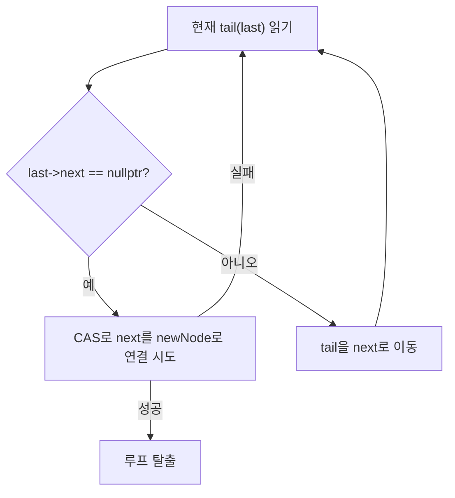
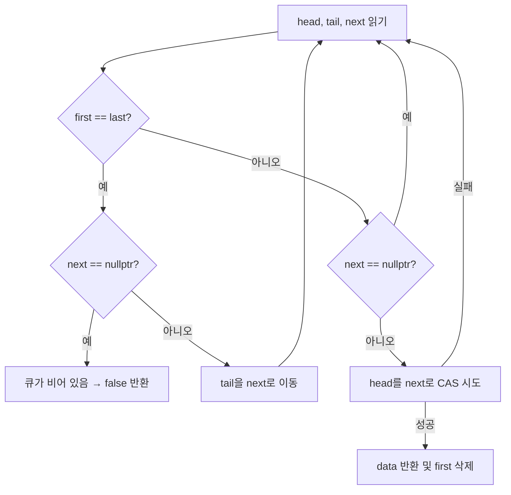
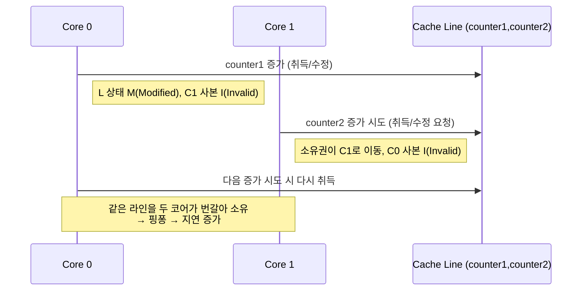
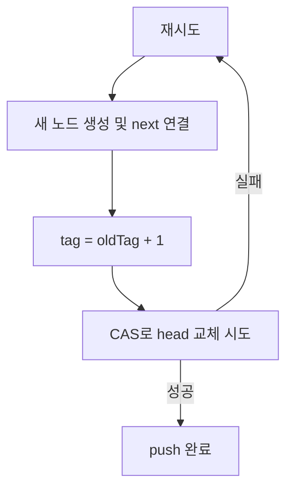
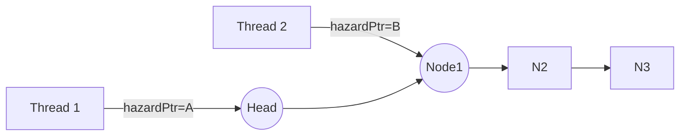

# 게임 서버 개발자를 위한 최신 Win32 API 프로그래밍  

저자: 최흥배, Claude AI   
    
권장 개발 환경
- **IDE**: Visual Studio 2022 (Community 이상)
- **컴파일러**: MSVC v143 (C++20 지원)
- **OS**: Windows 10 이상

-----  

# Chapter 6. 인터락 연산과 무잠금 프로그래밍

## 6.1 들어가며
게임 서버에서 높은 성능을 얻기 위해서는 동시성 프로그래밍이 필수적입이다. 하지만 전통적인 뮤텍스나 크리티컬 섹션 같은 잠금 메커니즘은 컨텍스트 스위칭과 대기 시간으로 인해 성능 병목을 만들 수 있다. 이런 문제를 해결하기 위해 등장한 것이 바로 **인터락 연산(Interlocked Operations)** 과 **무잠금 프로그래밍(Lock-Free Programming)** 이다.

```
전통적인 잠금 방식:
┌─────┐    ┌─────┐    ┌─────┐
│Thread│───▶│Lock │───▶│Work │
│  A   │    │Wait │    │Done │
└─────┘    └─────┘    └─────┘
     
┌─────┐    ┌─────┐    ┌─────┐
│Thread│───▶│Wait │───▶│Lock │───▶│Work │
│  B   │    │...  │    │Wait │    │Done │
└─────┘    └─────┘    └─────┘    └─────┘

무잠금 방식:
┌─────┐    ┌─────┐
│Thread│───▶│Work │
│  A   │    │Done │
└─────┘    └─────┘
     
┌─────┐    ┌─────┐
│Thread│───▶│Work │
│  B   │    │Done │
└─────┘    └─────┘
```
  

## 6.2 InterlockedXXX 함수군 완전 정복

### 6.2.1 기본 개념
인터락 연산은 CPU 레벨에서 원자적(atomic)으로 수행되는 연산이다. 이는 다른 스레드의 간섭 없이 해당 연산이 완전히 완료됨을 보장한다.

```cpp
#include <Windows.h>
#include <iostream>
#include <thread>
#include <vector>

// 잘못된 예시 - 경합 조건(Race Condition) 발생
class BadCounter {
private:
    int count = 0;
    
public:
    void increment() {
        count++;  // 원자적이지 않음!
    }
    
    int getCount() const { return count; }
};

// 올바른 예시 - 인터락 연산 사용
class GoodCounter {
private:
    LONG count = 0;
    
public:
    void increment() {
        InterlockedIncrement(&count);  // 원자적 연산!
    }
    
    LONG getCount() const { 
        return InterlockedCompareExchange(&count, 0, 0);  // 원자적 읽기
    }
};
```

### 6.2.2 주요 InterlockedXXX 함수들

#### 기본 산술 연산

```cpp
#include <Windows.h>
#include <iostream>

void demonstrateBasicOperations() {
    LONG value = 100;
    
    std::cout << "=== 기본 산술 연산 ===\n";
    std::cout << "초기값: " << value << "\n";
    
    // 증가/감소
    LONG oldValue = InterlockedIncrement(&value);
    std::cout << "Increment 후: " << value << " (이전값: " << oldValue-1 << ")\n";
    
    oldValue = InterlockedDecrement(&value);
    std::cout << "Decrement 후: " << value << " (이전값: " << oldValue+1 << ")\n";
    
    // 덧셈/뺄셈
    oldValue = InterlockedExchangeAdd(&value, 50);
    std::cout << "50 추가 후: " << value << " (이전값: " << oldValue << ")\n";
    
    oldValue = InterlockedExchangeAdd(&value, -25);
    std::cout << "25 빼기 후: " << value << " (이전값: " << oldValue << ")\n";
    
    // 비트 연산
    oldValue = InterlockedAnd(&value, 0xFF);  // 하위 8비트만 유지
    std::cout << "AND 0xFF 후: " << value << " (이전값: " << oldValue << ")\n";
    
    oldValue = InterlockedOr(&value, 0x100);  // 9번째 비트 설정
    std::cout << "OR 0x100 후: " << value << " (이전값: " << oldValue << ")\n";
}
```

#### 교환(Exchange) 연산

```cpp
void demonstrateExchangeOperations() {
    LONG value = 42;
    PVOID pointer = nullptr;
    
    std::cout << "\n=== 교환 연산 ===\n";
    
    // 단순 교환
    LONG oldValue = InterlockedExchange(&value, 100);
    std::cout << "Exchange: 새값=" << value << ", 이전값=" << oldValue << "\n";
    
    // 조건부 교환 (Compare and Swap)
    LONG expected = 100;
    LONG newValue = 200;
    LONG actualOld = InterlockedCompareExchange(&value, newValue, expected);
    
    if (actualOld == expected) {
        std::cout << "CAS 성공: " << expected << " → " << newValue << "\n";
    } else {
        std::cout << "CAS 실패: 예상=" << expected << ", 실제=" << actualOld << "\n";
    }
    
    // 포인터 교환
    int data = 123;
    PVOID newPtr = &data;
    PVOID oldPtr = InterlockedExchangePointer(&pointer, newPtr);
    std::cout << "포인터 교환: 이전=" << oldPtr << ", 새포인터=" << pointer << "\n";
}
```

### 6.2.3 64비트 연산

```cpp
void demonstrate64BitOperations() {
    LONG64 bigValue = 0x123456789ABCDEF0LL;
    
    std::cout << "\n=== 64비트 연산 ===\n";
    std::cout << "초기값: 0x" << std::hex << bigValue << "\n";
    
    // 64비트 증가
    LONG64 oldBig = InterlockedIncrement64(&bigValue);
    std::cout << "Increment64 후: 0x" << std::hex << bigValue << "\n";
    
    // 64비트 교환
    LONG64 newBig = 0xFEDCBA9876543210LL;
    oldBig = InterlockedExchange64(&bigValue, newBig);
    std::cout << "Exchange64: 새값=0x" << std::hex << bigValue 
              << ", 이전값=0x" << oldBig << "\n";
    
    std::cout << std::dec;  // 10진수로 복원
}
```

### 6.2.4 스핀락 구현하기

```cpp
class SpinLock {
private:
    LONG lockFlag = 0;
    
public:
    void lock() {
        while (InterlockedCompareExchange(&lockFlag, 1, 0) != 0) {
            // CPU 사이클 절약을 위한 힌트
            YieldProcessor();
        }
    }
    
    void unlock() {
        InterlockedExchange(&lockFlag, 0);
    }
    
    bool tryLock() {
        return InterlockedCompareExchange(&lockFlag, 1, 0) == 0;
    }
};

// RAII 스타일 락 가드
class SpinLockGuard {
private:
    SpinLock& lock_;
    
public:
    explicit SpinLockGuard(SpinLock& lock) : lock_(lock) {
        lock_.lock();
    }
    
    ~SpinLockGuard() {
        lock_.unlock();
    }
    
    // 복사 금지
    SpinLockGuard(const SpinLockGuard&) = delete;
    SpinLockGuard& operator=(const SpinLockGuard&) = delete;
};

// 사용 예시
void demonstrateSpinLock() {
    SpinLock spinLock;
    int sharedData = 0;
    
    auto worker = [&](int id) {
        for (int i = 0; i < 1000; ++i) {
            SpinLockGuard guard(spinLock);
            sharedData++;
            std::cout << "Thread " << id << ": " << sharedData << "\n";
        }
    };
    
    std::thread t1(worker, 1);
    std::thread t2(worker, 2);
    
    t1.join();
    t2.join();
    
    std::cout << "최종 값: " << sharedData << "\n";
}
```
    
이번 예제에서는 **스핀락(SpinLock)** 을 직접 구현해보며,
멀티스레드 환경에서 **짧은 시간 동안 자원을 보호해야 할 때 사용하는 경량 동기화 기법**을 살펴보겠다.

스핀락은 **뮤텍스(Mutex)** 나 **Critical Section**보다 훨씬 가볍고 빠르지만,
**CPU를 계속 점유하면서 대기**한다는 특징이 있다.
따라서 “잠금 시간이 짧고, 충돌이 자주 일어나지 않는 상황”에서 가장 효율적이다.

예를 들어, **짧은 계산 후 즉시 해제되는 공유 변수 보호**나
**짧은 임계 구역(critical section)** 을 여러 스레드가 자주 접근하는 경우에 사용하면 효과적이다.

#### 1. SpinLock 클래스 구조

```cpp
class SpinLock {
private:
    LONG lockFlag = 0;
```

* `lockFlag`는 잠금 상태를 나타내는 플래그 변수다.

  * `0`: 잠금이 해제된 상태 (Unlocked)
  * `1`: 잠금이 걸린 상태 (Locked)
* Windows에서 제공하는 **원자적(atomic)** 연산 함수를 이용해 플래그를 제어한다.

#### 2. lock() 함수 — 락 획득 과정

```cpp
void lock() {
    while (InterlockedCompareExchange(&lockFlag, 1, 0) != 0) {
        // CPU 사이클 절약을 위한 힌트
        YieldProcessor();
    }
}
```

이 부분이 스핀락의 핵심이다.

* `InterlockedCompareExchange()`는 **원자적으로** 값을 비교하고 교체하는 함수이다.

  * 첫 번째 인자(`lockFlag`)가 기대값(`0`)이면 `1`로 바꾸고,
  * 성공하면 이전 값 `0`을 반환한다.
  * 실패하면 다른 스레드가 이미 잠금 중이므로 `!= 0`이 되어 루프를 돈다.

즉, **다른 스레드가 잠금을 해제할 때까지 계속 반복(Spin)** 한다.
이를 “**busy waiting**” 또는 “**spin-waiting**”이라고 부른다.

`YieldProcessor()`는 CPU가 쉬는 대신 **다른 스레드에게 실행 기회를 잠깐 양보하도록 힌트**를 주는 함수다.
이를 통해 CPU 사이클 낭비를 줄이고, 과도한 전력 소모를 방지한다.

#### 3. unlock() 함수 — 락 해제

```cpp
void unlock() {
    InterlockedExchange(&lockFlag, 0);
}
```

락을 해제할 때는 단순히 `lockFlag`를 0으로 돌려놓는다.
이때도 `InterlockedExchange()`를 사용하여 원자적으로 수행한다.
즉, 중간에 다른 스레드가 끼어들 수 없다.

#### 4. tryLock() 함수 — 즉시 시도

```cpp
bool tryLock() {
    return InterlockedCompareExchange(&lockFlag, 1, 0) == 0;
}
```

이 함수는 잠금을 기다리지 않고 **즉시 시도만 해보는 비차단(non-blocking)** 버전이다.

* 성공하면 `true`를 반환하고,
* 이미 잠금 중이면 `false`를 반환한다.

이를 통해 “잠금 실패 시 다른 작업을 먼저 수행”하는 유연한 로직을 구현할 수 있다.

#### 5. SpinLockGuard — RAII 패턴으로 안전한 사용

```cpp
class SpinLockGuard {
private:
    SpinLock& lock_;
    
public:
    explicit SpinLockGuard(SpinLock& lock) : lock_(lock) {
        lock_.lock();
    }
    
    ~SpinLockGuard() {
        lock_.unlock();
    }
};
```

이 클래스는 C++의 **RAII(Resource Acquisition Is Initialization)** 패턴을 사용한다.
즉, 객체가 생성될 때 락을 자동으로 걸고,
객체가 소멸될 때 락을 자동으로 해제한다.

이렇게 하면 `unlock()` 호출을 깜빡해서 **데드락(deadlock)** 이 발생하는 실수를 방지할 수 있다.

예를 들어 다음과 같은 코드는 매우 안전하다.

```cpp
{
    SpinLockGuard guard(spinLock);
    sharedData++;   // 임계 구역
}   // 스코프를 벗어나면 자동으로 unlock()
```

#### 6. 사용 예시 — 두 스레드가 공유 변수 접근

```cpp
void demonstrateSpinLock() {
    SpinLock spinLock;
    int sharedData = 0;
    
    auto worker = [&](int id) {
        for (int i = 0; i < 1000; ++i) {
            SpinLockGuard guard(spinLock);
            sharedData++;
            std::cout << "Thread " << id << ": " << sharedData << "\n";
        }
    };
```

여기서는 `sharedData`라는 공유 자원을 두 스레드가 동시에 수정한다.
만약 락이 없다면, 스레드 간 경합으로 인해 **데이터 손상(race condition)** 이 발생한다.

`SpinLockGuard`를 사용함으로써 다음과 같은 흐름이 보장된다.

1. 한 스레드가 `SpinLockGuard`를 생성하면 `lock()`을 호출한다.
2. 다른 스레드는 잠금이 풀릴 때까지 `YieldProcessor()`로 대기한다.
3. 락을 보유한 스레드가 스코프를 벗어나면 `~SpinLockGuard()`에서 자동으로 `unlock()`된다.

#### 7. 실행 결과 예시

```
Thread 1: 1
Thread 2: 2
Thread 1: 3
Thread 2: 4
...
최종 값: 2000
```

결과적으로 `sharedData`는 2000이 되어,
모든 증가 연산이 정확히 수행되었음을 확인할 수 있다.

만약 락이 없었다면, 동시 접근으로 인해 결과가 2000보다 작게 나왔을 것이다.

#### 8. 스핀락의 장단점 정리

| 구분            | 설명                                                                            |
| ------------- | ----------------------------------------------------------------------------- |
| **장점**        | - 매우 빠름 (컨텍스트 스위칭 없음)<br>- 커널 모드 진입이 필요 없음<br>- 짧은 임계 구역에서 뛰어난 성능             |
| **단점**        | - 잠금 중에도 CPU를 계속 사용함<br>- 긴 대기 시간이 발생하면 비효율적<br>- 코어 수가 적거나 경쟁이 심한 경우 오히려 느려짐 |
| **적합한 사용 예시** | - 공유 자원 보호 구간이 짧은 경우<br>- 락 충돌 확률이 낮은 경우<br>- 게임 서버의 실시간 카운터, 간단한 캐시 갱신 등     |


#### 9. 결론
스핀락은 “**짧은 시간 동안만 공유 데이터를 보호해야 하는 상황**”에서 강력한 성능을 발휘한다.
하지만 장시간 점유하거나 많은 스레드가 경쟁하는 경우에는 오히려 시스템 효율을 떨어뜨린다.

즉, **스핀락은 경량 동기화 도구로서 빠른 응답성과 짧은 보호 구간이 필요한 코드에 적합한 선택**이다.
이 예제는 멀티스레드 환경에서 **최소한의 오버헤드로 동기화를 구현하는 방법**을 잘 보여주는 예다.


</br>  
  
## 6.3 무잠금 큐와 스택 구현

### 6.3.1 무잠금 스택 (Lock-Free Stack)

```cpp
template<typename T>
class LockFreeStack {
private:
    struct Node {
        T data;
        Node* next;
        
        Node(const T& item) : data(item), next(nullptr) {}
    };
    
    Node* head = nullptr;
    
public:
    ~LockFreeStack() {
        while (Node* node = head) {
            head = node->next;
            delete node;
        }
    }
    
    void push(const T& item) {
        Node* newNode = new Node(item);
        
        do {
            newNode->next = head;
        } while (InterlockedCompareExchangePointer(
            reinterpret_cast<PVOID*>(&head),
            newNode,
            newNode->next) != newNode->next);
    }
    
    bool pop(T& result) {
        Node* oldHead;
        
        do {
            oldHead = head;
            if (oldHead == nullptr) {
                return false;  // 스택이 비어있음
            }
        } while (InterlockedCompareExchangePointer(
            reinterpret_cast<PVOID*>(&head),
            oldHead->next,
            oldHead) != oldHead);
        
        result = oldHead->data;
        delete oldHead;
        return true;
    }
    
    bool empty() const {
        return head == nullptr;
    }
};
```
  
이 코드는 **멀티스레드 환경에서 동기화를 위한 잠금(lock)** 없이 동작하는 **무잠금 스택(Lock-Free Stack)** 을 구현한 예제이다. 일반적인 스택은 여러 스레드가 동시에 접근할 때 **데이터 경합(race condition)** 을 방지하기 위해 `mutex`나 `critical section`과 같은 **락(lock)**을 사용한다. 그러나 락은 성능 저하를 일으키거나 데드락(deadlock) 위험을 유발할 수 있다.
이러한 문제를 해결하기 위해 **CAS(Compare-And-Swap)** 연산을 이용한 **무잠금(lock-free)** 방식이 사용된다.
이 구현은 `InterlockedCompareExchangePointer` 함수를 사용하여 원자적으로(head 포인터 변경을) 수행함으로써 여러 스레드가 동시에 접근하더라도 스택의 일관성을 유지하도록 한다.

#### 클래스 구조

```cpp
template<typename T>
class LockFreeStack {
private:
    struct Node {
        T data;
        Node* next;
        
        Node(const T& item) : data(item), next(nullptr) {}
    };
    
    Node* head = nullptr;
```

* `LockFreeStack`은 템플릿 클래스로, 어떤 타입의 데이터든 스택 형태로 저장할 수 있다.
* 내부 구조체 `Node`는 스택의 한 요소를 표현하며, `data`와 `다음 노드를 가리키는 포인터(next)`를 가진다.
* `head`는 스택의 맨 위(top)를 가리키는 포인터다.

즉, `head`가 `nullptr`이면 스택이 비어 있는 상태다.

#### 소멸자(Destructor)

```cpp
~LockFreeStack() {
    while (Node* node = head) {
        head = node->next;
        delete node;
    }
}
```

소멸자는 스택이 파괴될 때 모든 노드를 순차적으로 삭제한다.
`while` 루프를 사용하여 `head`가 가리키는 노드를 하나씩 삭제하고 `next`로 이동한다.
이 부분은 단일 스레드에서 호출된다는 가정 하에 작성되었으며, 동시 접근을 고려하지 않는다.


#### push 함수

```cpp
void push(const T& item) {
    Node* newNode = new Node(item);
    
    do {
        newNode->next = head;
    } while (InterlockedCompareExchangePointer(
        reinterpret_cast<PVOID*>(&head),
        newNode,
        newNode->next) != newNode->next);
}
```

* 새 노드를 생성한 뒤, 반복문(`do-while`) 내에서 원자적 비교-교환(CAS) 연산을 수행한다.
* `InterlockedCompareExchangePointer`는 **head가 예상한 값(newNode->next)**일 경우에만 **head를 새로운 노드(newNode)**로 교체한다.
* 만약 다른 스레드가 같은 시점에 `head`를 변경했다면 교환에 실패하고, 다시 시도한다.

즉, 이 과정은 다음과 같다:

1. 새 노드의 `next`를 현재의 `head`로 설정한다.
2. `head`를 새 노드로 교체하려 시도한다.
3. 실패 시(`head`가 다른 스레드에 의해 변경된 경우) 다시 시도한다.

이 과정을 통해 락 없이 안전하게 여러 스레드가 동시에 데이터를 push할 수 있다.


#### pop 함수

```cpp
bool pop(T& result) {
    Node* oldHead;
    
    do {
        oldHead = head;
        if (oldHead == nullptr) {
            return false;  // 스택이 비어있음
        }
    } while (InterlockedCompareExchangePointer(
        reinterpret_cast<PVOID*>(&head),
        oldHead->next,
        oldHead) != oldHead);
    
    result = oldHead->data;
    delete oldHead;
    return true;
}
```

* `pop` 함수는 스택의 맨 위 요소를 제거하고 그 값을 `result`에 반환한다.
* 먼저 `oldHead`에 현재 `head`를 저장한다.
* 스택이 비어 있다면(`nullptr`) 즉시 `false`를 반환한다.
* `InterlockedCompareExchangePointer`를 이용해 `head`를 `oldHead->next`로 교체하려 시도한다.

  * 이때 `head`가 여전히 `oldHead`를 가리키고 있어야 성공한다.
  * 만약 다른 스레드가 이미 pop 또는 push를 수행했다면 실패하고 다시 시도한다.
* 성공 시 `oldHead`의 데이터를 복사하고, 메모리를 해제한다.

이 과정을 통해 `pop` 또한 **락 없이 원자적으로** 처리된다.


#### empty 함수

```cpp
bool empty() const {
    return head == nullptr;
}
```

스택이 비어 있는지를 단순히 확인하는 함수이다.
`head`가 `nullptr`이면 `true`, 아니면 `false`를 반환한다.


#### 정리
이 코드는 **멀티스레드 환경에서 높은 성능**을 유지하면서 **데이터 일관성을 보장하는 스택 구조**를 구현한 예제이다.
핵심은 `InterlockedCompareExchangePointer`를 사용한 **원자적 포인터 교환 연산(CAS)**이다.
이를 통해 락을 사용하지 않고도 동시에 여러 스레드가 안전하게 push/pop 연산을 수행할 수 있다.

단, 이 구현은 메모리 재활용 문제(hazard pointer, ABA 문제 등)를 고려하지 않았으므로 실제 상용 환경에서는 추가적인 메모리 관리 기법이 필요하다.


### 6.3.2 무잠금 큐 (Lock-Free Queue)

```cpp
template<typename T>
class LockFreeQueue {
private:
    struct Node {
        std::atomic<T*> data;
        std::atomic<Node*> next;
        
        Node() : data(nullptr), next(nullptr) {}
    };
    
    std::atomic<Node*> head;
    std::atomic<Node*> tail;
    
public:
    LockFreeQueue() {
        Node* dummy = new Node;
        head.store(dummy);
        tail.store(dummy);
    }
    
    ~LockFreeQueue() {
        Node* current = head.load();
        while (current != nullptr) {
            Node* next = current->next.load();
            delete current->data.load();
            delete current;
            current = next;
        }
    }
    
    void enqueue(const T& item) {
        Node* newNode = new Node;
        T* data = new T(item);
        newNode->data.store(data);
        
        while (true) {
            Node* last = tail.load();
            Node* next = last->next.load();
            
            if (last == tail.load()) {  // tail이 변경되지 않았는지 확인
                if (next == nullptr) {
                    // tail이 정말 마지막 노드를 가리키고 있음
                    if (last->next.compare_exchange_weak(next, newNode)) {
                        break;
                    }
                } else {
                    // tail이 뒤처져 있음, 도움을 줌
                    tail.compare_exchange_weak(last, next);
                }
            }
        }
        
        // tail을 새 노드로 이동
        tail.compare_exchange_weak(tail.load(), newNode);
    }
    
    bool dequeue(T& result) {
        while (true) {
            Node* first = head.load();
            Node* last = tail.load();
            Node* next = first->next.load();
            
            if (first == head.load()) {  // head가 변경되지 않았는지 확인
                if (first == last) {
                    if (next == nullptr) {
                        return false;  // 큐가 비어있음
                    }
                    // tail이 뒤처져 있음, 도움을 줌
                    tail.compare_exchange_weak(last, next);
                } else {
                    if (next == nullptr) {
                        continue;  // 일관성이 깨졌음, 재시도
                    }
                    
                    // 데이터 읽기
                    T* data = next->data.load();
                    if (data == nullptr) {
                        continue;  // 다른 스레드가 이미 처리함
                    }
                    
                    // head 이동 시도
                    if (head.compare_exchange_weak(first, next)) {
                        result = *data;
                        delete data;
                        delete first;
                        return true;
                    }
                }
            }
        }
    }
    
    bool empty() const {
        Node* first = head.load();
        Node* last = tail.load();
        return (first == last) && (first->next.load() == nullptr);
    }
};
```  
  
이번에는 **무잠금 큐(Lock-Free Queue)**에 대해 살펴본다.
이 자료구조는 여러 스레드가 동시에 큐에 데이터를 추가하거나 제거할 때도 **락(lock)**을 사용하지 않고 안전하게 동작하도록 설계된 큐다.

락을 사용하는 전통적인 큐는 `mutex` 등을 이용해 임계구역을 보호하지만, 그로 인해 **성능 저하**, **교착상태(deadlock)**, **우선순위 역전(priority inversion)** 문제가 발생할 수 있다.
이러한 문제를 해결하기 위해 **원자적(atomic)** 연산과 **CAS(Compare-And-Swap)**을 이용해 큐의 상태를 동기화하는 무잠금 방식이 사용된다.

이 구현은 **Michael & Scott (1996)** 의 고전적인 **Lock-Free Queue 알고리즘**을 기반으로 하며, C++의 `std::atomic`을 사용하여 포인터와 데이터를 원자적으로 조작한다.


#### 전체 구조 요약
큐는 **연결 리스트 기반의 구조**로 되어 있으며, 항상 존재하는 **더미(dummy) 노드**를 두어 head와 tail이 가리키는 위치를 명확히 유지한다.

```plaintext
[Head] → [Dummy] → [Node1] → [Node2] → ... → [Tail]
```

* **head**: dequeue(삭제) 연산의 시작점이다.
* **tail**: enqueue(삽입) 연산의 끝을 가리킨다.
* **dummy 노드**: 비어있는 큐에서도 head와 tail이 동일한 노드를 가리키도록 유지하는 역할을 한다.

다음은 큐의 대략적인 개념 구조를 표현한 아스키 다이어그램이다.

```
초기 상태 (비어있는 큐)
 ┌──────┐
 │ head │──────┐
 └──────┘      │
                ▼
           [ dummy ]
                ▲
 ┌──────┐      │
 │ tail │──────┘
 └──────┘
```

#### 노드 정의 및 멤버 변수

```cpp
struct Node {
    std::atomic<T*> data;
    std::atomic<Node*> next;

    Node() : data(nullptr), next(nullptr) {}
};

std::atomic<Node*> head;
std::atomic<Node*> tail;
```

* `Node`는 각 큐 요소를 담는 구조체이다.

  * `data`: 노드가 저장하는 데이터(포인터 형태).
  * `next`: 다음 노드를 가리키는 포인터이다.

* `head`와 `tail`은 모두 `std::atomic<Node*>`로 선언되어 원자적으로 접근된다.

즉, 여러 스레드가 동시에 head나 tail을 수정하더라도 안전하게 동작한다.

#### 생성자와 소멸자

```cpp
LockFreeQueue() {
    Node* dummy = new Node;
    head.store(dummy);
    tail.store(dummy);
}
```

* 큐는 시작 시 더미 노드를 하나 생성한다.
* `head`와 `tail`이 동일한 노드를 가리키므로, 큐가 비어 있음을 나타낸다.

```cpp
~LockFreeQueue() {
    Node* current = head.load();
    while (current != nullptr) {
        Node* next = current->next.load();
        delete current->data.load();
        delete current;
        current = next;
    }
}
```

* 큐가 소멸될 때 모든 노드를 순차적으로 해제한다.
* 데이터와 노드를 하나씩 삭제하며 메모리 누수를 방지한다.

#### enqueue 함수 (데이터 추가)

```cpp
void enqueue(const T& item) {
    Node* newNode = new Node;
    T* data = new T(item);
    newNode->data.store(data);
    
    while (true) {
        Node* last = tail.load();
        Node* next = last->next.load();
        
        if (last == tail.load()) {  // tail이 변하지 않았는지 확인
            if (next == nullptr) {
                if (last->next.compare_exchange_weak(next, newNode)) {
                    break;
                }
            } else {
                tail.compare_exchange_weak(last, next);
            }
        }
    }
    
    tail.compare_exchange_weak(tail.load(), newNode);
}
```

**작동 과정은 다음과 같다.**

1. 새로운 노드를 만든다 (`newNode`).
2. 현재 tail이 가리키는 마지막 노드를 읽어온다 (`last`).
3. 만약 `last->next`가 `nullptr`이라면, `last`가 실제 마지막 노드임을 의미한다.

   * 이때 `compare_exchange_weak`를 사용해 `last->next`를 `newNode`로 바꾸려 시도한다.
   * 성공하면 새로운 노드를 연결하고 루프를 탈출한다.
4. 만약 `last->next`가 존재한다면, tail이 뒤처져 있는 상태이므로 `tail`을 앞으로 이동시켜 도와준다.

마지막에 `tail`을 새 노드로 이동시켜 최신 상태로 유지한다.

아래는 enqueue 과정의 흐름을 머메이드 다이어그램으로 표현한 것이다.



#### dequeue 함수 (데이터 제거)

```cpp
bool dequeue(T& result) {
    while (true) {
        Node* first = head.load();
        Node* last = tail.load();
        Node* next = first->next.load();
        
        if (first == head.load()) {
            if (first == last) {
                if (next == nullptr) {
                    return false;  // 큐가 비어있음
                }
                tail.compare_exchange_weak(last, next);
            } else {
                if (next == nullptr) continue;
                
                T* data = next->data.load();
                if (data == nullptr) continue;
                
                if (head.compare_exchange_weak(first, next)) {
                    result = *data;
                    delete data;
                    delete first;
                    return true;
                }
            }
        }
    }
}
```

**작동 과정은 다음과 같다.**

1. `head`, `tail`, `first->next`를 읽어온다.
2. `first == last`이고 `next == nullptr`이면 큐가 비어있는 상태이다.
3. `tail`이 뒤처져 있으면 다른 스레드를 돕기 위해 앞으로 이동시킨다.
4. `next` 노드의 데이터를 읽는다.
5. `head`를 `next`로 변경하는 CAS 연산을 수행한다.

   * 성공하면 데이터를 반환하고 이전 `first` 노드를 삭제한다.

아래는 dequeue의 동작 과정을 간단히 표현한 머메이드 다이어그램이다.



#### empty 함수

```cpp
bool empty() const {
    Node* first = head.load();
    Node* last = tail.load();
    return (first == last) && (first->next.load() == nullptr);
}
```

* head와 tail이 같은 노드를 가리키고, 다음 노드가 없으면 큐가 비어 있다고 판단한다.

#### 정리
이 `LockFreeQueue`는 **동시성(concurrency)**이 높은 환경에서 뛰어난 성능을 발휘하는 큐 구조다.
CAS 연산을 통해 락을 완전히 제거하면서도 데이터의 일관성을 보장한다.

핵심 포인트는 다음과 같다.

1. **dummy 노드**를 사용하여 head와 tail의 일관성을 유지한다.
2. `enqueue`와 `dequeue` 모두 **compare_exchange_weak**를 사용해 경쟁 상황을 처리한다.
3. **tail 보정(tail catching up)** 메커니즘으로 다른 스레드의 진행을 돕는다.

단, 이 코드 역시 **ABA 문제**나 **메모리 재활용(hazard pointer)**에 대한 처리가 되어 있지 않기 때문에
실제 상용 환경에서는 추가적인 메모리 안전장치가 필요하다.


  
### 6.3.3 성능 테스트

```cpp
#include <chrono>
#include <queue>
#include <mutex>

// 전통적인 잠금 기반 큐
template<typename T>
class LockedQueue {
private:
    std::queue<T> queue_;
    std::mutex mutex_;
    
public:
    void enqueue(const T& item) {
        std::lock_guard<std::mutex> lock(mutex_);
        queue_.push(item);
    }
    
    bool dequeue(T& result) {
        std::lock_guard<std::mutex> lock(mutex_);
        if (queue_.empty()) {
            return false;
        }
        result = queue_.front();
        queue_.pop();
        return true;
    }
    
    bool empty() const {
        std::lock_guard<std::mutex> lock(mutex_);
        return queue_.empty();
    }
};

void performanceTest() {
    const int OPERATIONS = 1000000;
    const int THREAD_COUNT = 4;
    
    // 무잠금 큐 테스트
    {
        LockFreeQueue<int> lockFreeQueue;
        auto start = std::chrono::high_resolution_clock::now();
        
        std::vector<std::thread> threads;
        
        // Producer 스레드들
        for (int t = 0; t < THREAD_COUNT / 2; ++t) {
            threads.emplace_back([&lockFreeQueue, OPERATIONS]() {
                for (int i = 0; i < OPERATIONS; ++i) {
                    lockFreeQueue.enqueue(i);
                }
            });
        }
        
        // Consumer 스레드들
        for (int t = 0; t < THREAD_COUNT / 2; ++t) {
            threads.emplace_back([&lockFreeQueue, OPERATIONS]() {
                int value;
                int consumed = 0;
                while (consumed < OPERATIONS) {
                    if (lockFreeQueue.dequeue(value)) {
                        consumed++;
                    } else {
                        std::this_thread::yield();
                    }
                }
            });
        }
        
        for (auto& t : threads) {
            t.join();
        }
        
        auto end = std::chrono::high_resolution_clock::now();
        auto duration = std::chrono::duration_cast<std::chrono::milliseconds>(end - start);
        
        std::cout << "무잠금 큐: " << duration.count() << "ms\n";
    }
    
    // 잠금 기반 큐 테스트
    {
        LockedQueue<int> lockedQueue;
        auto start = std::chrono::high_resolution_clock::now();
        
        std::vector<std::thread> threads;
        
        // Producer 스레드들
        for (int t = 0; t < THREAD_COUNT / 2; ++t) {
            threads.emplace_back([&lockedQueue, OPERATIONS]() {
                for (int i = 0; i < OPERATIONS; ++i) {
                    lockedQueue.enqueue(i);
                }
            });
        }
        
        // Consumer 스레드들
        for (int t = 0; t < THREAD_COUNT / 2; ++t) {
            threads.emplace_back([&lockedQueue, OPERATIONS]() {
                int value;
                int consumed = 0;
                while (consumed < OPERATIONS) {
                    if (lockedQueue.dequeue(value)) {
                        consumed++;
                    } else {
                        std::this_thread::yield();
                    }
                }
            });
        }
        
        for (auto& t : threads) {
            t.join();
        }
        
        auto end = std::chrono::high_resolution_clock::now();
        auto duration = std::chrono::duration_cast<std::chrono::milliseconds>(end - start);
        
        std::cout << "잠금 기반 큐: " << duration.count() << "ms\n";
    }
}
```
  

</br>    

## 6.4 메모리 배리어와 캐시 일관성

### 6.4.1 메모리 순서 문제

```cpp
// 위험한 코드 예시
class DangerousFlag {
private:
    bool ready = false;
    int data = 0;
    
public:
    // Writer 스레드
    void setData(int value) {
        data = value;      // 1. 데이터 설정
        ready = true;      // 2. 플래그 설정
    }
    
    // Reader 스레드
    int getData() {
        if (ready) {       // 3. 플래그 확인
            return data;   // 4. 데이터 읽기
        }
        return -1;
    }
};
```

CPU는 성능 최적화를 위해 명령어 순서를 재배열할 수 있다. 이로 인해 `ready = true`가 `data = value`보다 먼저 실행될 수 있어, Reader가 잘못된 데이터를 읽을 수 있다.

```
메모리 재배열의 위험성:

예상한 순서:        실제 실행 순서:
┌─────────────┐    ┌─────────────┐
│ data = value│    │ ready = true│  ← 재배열됨!
└─────────────┘    └─────────────┘
┌─────────────┐    ┌─────────────┐
│ ready = true│    │ data = value│
└─────────────┘    └─────────────┘

Reader가 ready=true를 확인했지만
data는 아직 설정되지 않았을 수 있음!
```

### 6.4.2 메모리 배리어 사용하기

```cpp
class SafeFlag {
private:
    volatile bool ready = false;
    volatile int data = 0;
    
public:
    // Writer 스레드
    void setData(int value) {
        data = value;
        
        // 메모리 배리어: 이전 모든 쓰기가 완료된 후 다음 쓰기 실행
        MemoryBarrier();
        
        ready = true;
    }
    
    // Reader 스레드
    int getData() {
        if (ready) {
            // 메모리 배리어: ready 읽기 이후에 data 읽기 실행
            MemoryBarrier();
            return data;
        }
        return -1;
    }
};

// 더 나은 방법: InterlockedXXX 함수 사용
class BetterFlag {
private:
    LONG ready = 0;
    LONG data = 0;
    
public:
    void setData(int value) {
        InterlockedExchange(&data, value);
        InterlockedExchange(&ready, 1);  // 자동으로 메모리 배리어 효과
    }
    
    int getData() {
        if (InterlockedCompareExchange(&ready, 0, 0) == 1) {
            return InterlockedCompareExchange(&data, 0, 0);
        }
        return -1;
    }
};
```

### 6.4.3 캐시 라인 최적화

```cpp
// 잘못된 예시: False Sharing 발생
struct BadCounters {
    LONG counter1;  // 같은 캐시 라인에 위치
    LONG counter2;  // 같은 캐시 라인에 위치
};

// 올바른 예시: 캐시 라인 정렬
struct alignas(64) GoodCounters {  // 64바이트 정렬 (일반적인 캐시 라인 크기)
    LONG counter1;
    char padding1[60];  // 패딩으로 다른 캐시 라인에 배치
    
    LONG counter2;
    char padding2[60];
};

// C++17 이후 더 간단한 방법
struct ModernCounters {
    alignas(std::hardware_destructive_interference_size) LONG counter1;
    alignas(std::hardware_destructive_interference_size) LONG counter2;
};

void demonstrateFalseSharing() {
    const int ITERATIONS = 10000000;
    
    // False Sharing 테스트
    {
        BadCounters badCounters = {0, 0};
        auto start = std::chrono::high_resolution_clock::now();
        
        std::thread t1([&]() {
            for (int i = 0; i < ITERATIONS; ++i) {
                InterlockedIncrement(&badCounters.counter1);
            }
        });
        
        std::thread t2([&]() {
            for (int i = 0; i < ITERATIONS; ++i) {
                InterlockedIncrement(&badCounters.counter2);
            }
        });
        
        t1.join();
        t2.join();
        
        auto end = std::chrono::high_resolution_clock::now();
        auto duration = std::chrono::duration_cast<std::chrono::milliseconds>(end - start);
        std::cout << "False Sharing: " << duration.count() << "ms\n";
    }
    
    // 캐시 라인 최적화 테스트
    {
        GoodCounters goodCounters = {0};
        auto start = std::chrono::high_resolution_clock::now();
        
        std::thread t1([&]() {
            for (int i = 0; i < ITERATIONS; ++i) {
                InterlockedIncrement(&goodCounters.counter1);
            }
        });
        
        std::thread t2([&]() {
            for (int i = 0; i < ITERATIONS; ++i) {
                InterlockedIncrement(&goodCounters.counter2);
            }
        });
        
        t1.join();
        t2.join();
        
        auto end = std::chrono::high_resolution_clock::now();
        auto duration = std::chrono::duration_cast<std::chrono::milliseconds>(end - start);
        std::cout << "캐시 라인 최적화: " << duration.count() << "ms\n";
    }
}
```
  
이 코드는 “False Sharing(거짓 공유)”로 인한 성능 하락을 재현하고, 캐시 라인 정렬로 이를 제거하는 방법을 보여주는 예제다. 아래에서 왜 느려지는지, 어떤 정렬이 필요한지, 코드가 실제로 무엇을 보장하는지, 실무에서의 주의점을 순서대로 설명한다.

#### 무엇이 느려지는가: False Sharing 개념
서로 다른 스레드가 “각자 다른 변수”를 업데이트하더라도, 그 변수들이 **같은 캐시 라인**에 있으면 캐시 일관성 프로토콜(MESI 등) 때문에 그 라인을 서로 뺏고 빼앗기는 **캐시 라인 핑퐁**이 발생한다. 그 결과 메모리 대역폭과 코어 간 연결이 낭비되어 성능이 급격히 떨어진다.

간단 ASCII 도식이다.

```
코어0                                  코어1
 └─ counter1 증가 (line X 소유)          └─ counter2 증가를 시도
      │                                        │
      ├─ line X: Modified                      ├─ line X를 Read/Modify 위해 요청
      └─ 쓰기 완료 시점에                       └─ 코어0의 line X가 Invalidate
         코어1의 line X를 Invalidate               (소유권 이동)
```

두 변수를 같은 라인에 올려둔 것이 원인이다.


#### 코드로 보는 재현과 해결

잘못된 예시: 같은 라인에 배치되는 두 카운터

```cpp
struct BadCounters {
    LONG counter1;  // 같은 캐시 라인
    LONG counter2;  // 같은 캐시 라인
};
```

두 스레드가 각각 `counter1`, `counter2`만 `InterlockedIncrement`로 올려도, 두 필드는 보통 64바이트 캐시 라인 하나에 함께 놓이므로 지속적 invalidation이 발생한다. 이때 `InterlockedIncrement`는 원자적 증가를 보장하지만, **캐시 라인 소유권 경쟁**까지 해결해주지는 않는다.
  

올바른 예시: 캐시 라인 정렬 + 패딩으로 물리적 분리

```cpp
struct alignas(64) GoodCounters {
    LONG counter1;
    char padding1[60];  // 4 + 60 = 64B (첫 라인 채움)

    LONG counter2;
    char padding2[60];  // 64B (둘째 라인 채움)
};
```

핵심은 두 가지다.

1. `struct alignas(64)`로 **구조체 시작 주소를 64바이트 경계**에 맞춘다.
2. `counter1` 뒤를 64바이트까지 **패딩으로 꽉 채워** `counter2`가 정확히 다음 캐시 라인 시작에 오게 한다.

이렇게 하면 두 스레드가 서로 다른 라인을 소유해 갱신하므로 invalidation 핑퐁이 사라진다.
    
  
더 현대적인 방법: 구현 제공 상수 사용

```cpp
struct ModernCounters {
    alignas(std::hardware_destructive_interference_size) LONG counter1;
    alignas(std::hardware_destructive_interference_size) LONG counter2;
};
```

* C++17부터 `<new>`에 `std::hardware_destructive_interference_size`가 정의되며, 구현이 아는 **파괴적 간섭 크기(보통 캐시 라인 크기)** 로 정렬을 맞춘다.
* 단, 구현/표준 라이브러리에 따라 값이 0일 수도 있으므로, **실무에서는 64 바이트를 합리적 기본값으로 두고, 값이 0이면 64로 대체**하는 방식을 자주 쓴다.


#### 시나리오 흐름



GoodCounters/ModernCounters에서는 `counter1`과 `counter2`가 **서로 다른 라인**이라 위 핑퐁이 발생하지 않는다.


#### `demonstrateFalseSharing()` 동작 설명

```cpp
const int ITERATIONS = 10000000;
```

* 각 스레드가 1천만 번 증가를 수행한다.
  

구간 1: BadCounters 테스트

* 두 스레드가 같은 라인상의 서로 다른 필드를 증가한다.
* `InterlockedIncrement`는 Windows의 원자적 증가 API로, 내부적으로 강한 메모리 장벽과 캐시 라인 잠금을 수반한다.
* 여기에 **라인 경쟁까지 겹치므로** 측정 시간이 크게 나온다.
* 출력: `False Sharing: XXXms`
  

구간 2: GoodCounters 테스트

* 같은 패턴이지만 각 필드가 **서로 다른 캐시 라인**에 존재한다.
* 일관성 프로토콜에 의한 핑퐁이 없어져 시간이 눈에 띄게 줄어든다.
* 출력: `캐시 라인 최적화: YYYms`

> 실제 수치는 CPU/코어 수, 주파수 스케일링, 스케줄러, 전원 정책에 따라 달라진다. 정확한 비교를 원하면 코어 고정(스레드 어피니티), 고정 성능 모드, 워밍업 등을 권장한다.


#### 실무에서의 주의·팁

1. **정렬만으로는 부족할 수 있다**
   구조체에 `alignas(64)`를 붙이지 않고 내부에 패딩만 두면, **구조체 시작 주소가 64바이트 경계가 아닐 수도** 있어 `counter2`가 라인 경계를 정확히 맞추지 못할 수 있다. 그러므로 **구조체 자체를 64B 정렬**해야 한다.

2. **배열/컨테이너에 담을 때**
   `std::vector<GoodCounters>`처럼 **타입 자체가 64B 정렬**이면 각 원소가 64B 배수 주소에 놓인다. 반대로 `std::vector<LONG>`에 `alignas(64)`를 변수에만 붙이면, 배열 요소 사이 간격이 촘촘해 다시 같은 라인에 들어갈 수 있다. **타입에 정렬을 부여**하라.

   ```cpp
   struct alignas(64) PaddedCounter { std::atomic<long> v{0}; char pad[64 - sizeof(std::atomic<long>)]; };
   std::vector<PaddedCounter> counters(N); // 각 원소가 서로 다른 라인에 놓임
   ```

3. **원자성 선택**
   예제는 `InterlockedIncrement`를 쓰지만, C++ 표준 원자 타입으로도 구현할 수 있다.

   ```cpp
   std::atomic<long> c1{0}, c2{0};
   c1.fetch_add(1, std::memory_order_relaxed);
   ```

   단, 실험의 포인트가 **라인 경쟁**이므로 메모리 오더는 `relaxed`로 충분하다. 불필요한 장벽은 측정에 잡음을 준다.

4. **라인 크기 가정**
   대부분의 x86-64 CPU는 64바이트 캐시 라인을 쓴다. 일부 아키텍처/미래 CPU에서 값이 다를 수 있으므로, 가능하면 `std::hardware_destructive_interference_size`를 쓰고, 값이 0이면 64를 사용하는 **폴백**을 둔다.

5. **컴파일러 최적화**
   최적화가 루프를 과도하게 바꾸지 않도록 실제 실행 사이드이펙트(원자 증가, `volatile` 등)가 필요하다. 예제는 원자적 API를 사용하므로 문제가 없다.

6. **측정 노이즈 줄이기**

   * 스레드 어피니티를 서로 다른 물리 코어로 고정한다.
   * 고정 성능 모드(고성능 전원 계획)로 설정한다.
   * 워밍업 루프를 둬서 터보/온도 영향 초기화를 한다.

#### 요약
* **문제**: 서로 다른 변수가 같은 캐시 라인에 있으면, 두 스레드가 동시에 갱신할 때 **False Sharing**으로 캐시 라인 핑퐁이 발생해 느려진다.
* **해결**: 두 변수를 **서로 다른 캐시 라인**에 강제 배치한다. `alignas(64)`로 구조체 시작 주소를 정렬하고, **패딩으로 각 필드가 정확히 64바이트 경계**에 오게 하거나, `std::hardware_destructive_interference_size`를 활용한다.
* **실무 팁**: 타입 수준 정렬, 컨테이너 사용 시 정렬 유지, 불필요한 메모리 장벽 제거, 라인 크기의 폴백 처리 등을 지키면 된다.

이대로 적용하면 동일한 증가 작업이라도 **측정 시간이 유의미하게 감소**하는 것을 볼 수 있다.
  

</br>    

## 6.5 ABA 문제 해결 방법

### 6.5.1 ABA 문제란?
ABA 문제는 무잠금 프로그래밍에서 발생하는 고전적인 문제다:

```
초기 상태: A
Thread 1이 A를 읽음
Thread 2가 A를 B로 변경
Thread 2가 다시 B를 A로 변경
Thread 1이 Compare-And-Swap 수행 → 성공! (하지만 중간에 변경이 있었음)
```

```cpp
// ABA 문제가 발생할 수 있는 코드
template<typename T>
class ProblematicStack {
private:
    struct Node {
        T data;
        Node* next;
    };
    
    Node* head = nullptr;
    
public:
    bool pop(T& result) {
        Node* oldHead = head;
        if (oldHead == nullptr) return false;
        
        // 여기서 다른 스레드가 개입할 수 있음!
        // head → A → B → C
        // 다른 스레드가 A, B를 제거하고 새로운 A를 삽입
        // head → A(new) → D → E
        
        Node* newHead = oldHead->next;
        
        // oldHead가 여전히 A를 가리키므로 CAS가 성공하지만
        // 실제로는 완전히 다른 A임!
        if (InterlockedCompareExchangePointer(
            reinterpret_cast<PVOID*>(&head), newHead, oldHead) == oldHead) {
            result = oldHead->data;
            delete oldHead;  // 이미 삭제된 메모리에 접근할 수 있음!
            return true;
        }
        return false;
    }
};
```

### 7.5.2 해결 방법 1: 버전 태그 사용

```cpp
template<typename T>
class VersionedStack {
private:
    struct Node {
        T data;
        Node* next;
        
        Node(const T& item) : data(item), next(nullptr) {}
    };
    
    struct TaggedPointer {
        Node* ptr;
        LONG tag;
        
        TaggedPointer() : ptr(nullptr), tag(0) {}
        TaggedPointer(Node* p, LONG t) : ptr(p), tag(t) {}
    };
    
    alignas(8) TaggedPointer head;  // 8바이트 정렬 보장
    
public:
    void push(const T& item) {
        Node* newNode = new Node(item);
        TaggedPointer oldHead, newHead;
        
        do {
            oldHead = head;
            newNode->next = oldHead.ptr;
            newHead.ptr = newNode;
            newHead.tag = oldHead.tag + 1;  // 버전 증가
        } while (InterlockedCompareExchange64(
            reinterpret_cast<LONG64*>(&head),
            *reinterpret_cast<LONG64*>(&newHead),
            *reinterpret_cast<LONG64*>(&oldHead)) != 
            *reinterpret_cast<LONG64*>(&oldHead));
    }
    
    bool pop(T& result) {
        TaggedPointer oldHead, newHead;
        
        do {
            oldHead = head;
            if (oldHead.ptr == nullptr) {
                return false;
            }
            
            newHead.ptr = oldHead.ptr->next;
            newHead.tag = oldHead.tag + 1;  // 버전 증가
            
        } while (InterlockedCompareExchange64(
            reinterpret_cast<LONG64*>(&head),
            *reinterpret_cast<LONG64*>(&newHead),
            *reinterpret_cast<LONG64*>(&oldHead)) != 
            *reinterpret_cast<LONG64*>(&oldHead));
        
        result = oldHead.ptr->data;
        delete oldHead.ptr;
        return true;
    }
};
```
  
**무잠금 스택(lock-free stack)**에서 발생하는 **ABA 문제(ABA Problem)**를 해결하기 위한 방법 중 하나인 **버전 태그(Version Tag)**를 사용하는 방법을 설명한다.

#### 🧩 구조 개요
이 스택은 각 포인터에 **버전 번호(tag)**를 붙여서 관리한다.
즉, head는 단순한 포인터가 아니라 `(포인터 + 버전)` 쌍으로 동작한다.
이를 통해 동일한 포인터 값이라도 버전이 다르면 “다른 상태”로 인식할 수 있게 된다.

아래는 이 구조를 단순화한 개념도이다.

```
head ───▶ (ptr = NodeA, tag = 5)
             ↓
            NodeA → NodeB → ...
```

포인터가 같더라도 tag 값이 바뀌면 이전 상태와 다른 것으로 간주한다.


#### 코드 구조 분석

##### 1️⃣ Node 구조체

```cpp
struct Node {
    T data;
    Node* next;
    
    Node(const T& item) : data(item), next(nullptr) {}
};
```

* 스택의 각 요소를 나타내는 노드다.
* `data`는 실제 저장 데이터이며, `next`는 다음 노드를 가리킨다.


##### 2️⃣ TaggedPointer 구조체

```cpp
struct TaggedPointer {
    Node* ptr;
    LONG tag;
    
    TaggedPointer() : ptr(nullptr), tag(0) {}
    TaggedPointer(Node* p, LONG t) : ptr(p), tag(t) {}
};
```

* 이 구조체는 포인터(`ptr`)와 버전 번호(`tag`)를 함께 관리한다.
* 즉, **포인터의 상태를 버전까지 포함해 원자적으로 비교**할 수 있다.
* `tag`는 매번 push나 pop이 발생할 때마다 +1 증가한다.


##### 3️⃣ 멤버 변수

```cpp
alignas(8) TaggedPointer head;
```

* `head`는 스택의 맨 위를 가리킨다.
* `alignas(8)`을 사용하여 8바이트 정렬을 보장한다.
  이는 64비트 원자 연산(`InterlockedCompareExchange64`)이 정상적으로 동작하도록 하기 위함이다.


#### 🧱 push 함수

```cpp
void push(const T& item) {
    Node* newNode = new Node(item);
    TaggedPointer oldHead, newHead;
    
    do {
        oldHead = head;
        newNode->next = oldHead.ptr;
        newHead.ptr = newNode;
        newHead.tag = oldHead.tag + 1;  // 버전 증가
    } while (InterlockedCompareExchange64(
        reinterpret_cast<LONG64*>(&head),
        *reinterpret_cast<LONG64*>(&newHead),
        *reinterpret_cast<LONG64*>(&oldHead)) != 
        *reinterpret_cast<LONG64*>(&oldHead));
}
```

**동작 과정:**

1. 새 노드를 만든다.
2. 현재 `head`를 읽고, 새 노드의 `next`를 기존 head로 연결한다.
3. `tag`를 +1 증가시켜 새로운 버전을 만든다.
4. CAS를 이용해 `head`를 `(newNode, newTag)`로 교체하려 시도한다.

   * 실패 시 다른 스레드가 개입한 것이므로 다시 시도한다.
   * 성공 시 새로운 head가 설정된다.

아래는 push 동작의 흐름을 단순화한 다이어그램이다.



#### 🧱 pop 함수

```cpp
bool pop(T& result) {
    TaggedPointer oldHead, newHead;
    
    do {
        oldHead = head;
        if (oldHead.ptr == nullptr) {
            return false;
        }
        
        newHead.ptr = oldHead.ptr->next;
        newHead.tag = oldHead.tag + 1;  // 버전 증가
        
    } while (InterlockedCompareExchange64(
        reinterpret_cast<LONG64*>(&head),
        *reinterpret_cast<LONG64*>(&newHead),
        *reinterpret_cast<LONG64*>(&oldHead)) != 
        *reinterpret_cast<LONG64*>(&oldHead));
    
    result = oldHead.ptr->data;
    delete oldHead.ptr;
    return true;
}
```

**동작 과정:**

1. 현재 head를 읽는다.
2. 비어 있다면 false 반환.
3. `next` 노드를 새로운 head로 설정한다.
4. `tag`를 +1 증가시켜 버전을 변경한다.
5. CAS를 통해 head를 `(newPtr, newTag)`로 교체한다.
6. 성공하면 이전 노드를 삭제하고 데이터를 반환한다.

이 과정을 통해 다른 스레드가 head를 잠깐 변경했다 다시 되돌리더라도,
**버전이 달라지므로 ABA 문제를 방지할 수 있다.**

#### ⚙️ 동작 예시 (ASCII 그림)

```
초기 상태:
 head → (ptr=A, tag=5)
 A → B → C

스레드 1이 pop 수행 중:
 oldHead = (A,5)
 newHead = (B,6)

CAS 성공 → head = (B,6)
```

만약 그 사이에 스레드 2가 A를 pop했다가 다시 push해서 A의 주소가 재사용되더라도,
이제 head의 tag 값은 6이므로 `(A,5)`와는 다르다고 인식된다.
따라서 CAS 비교에서 실패하게 되어 ABA 문제를 예방할 수 있다.

#### ✅ 정리
이 `VersionedStack`의 핵심은 **포인터의 버전을 함께 관리**하는 것이다.
이로써 동일한 포인터가 재사용되더라도 다른 상태로 인식할 수 있게 되어
무잠금 구조의 가장 큰 취약점 중 하나인 **ABA 문제**를 효과적으로 차단할 수 있다.

**요약하자면:**

| 개념                               | 설명                          |
| -------------------------------- | --------------------------- |
| **TaggedPointer**                | 포인터와 버전 번호를 묶은 구조체          |
| **tag 증가**                       | 매 연산마다 버전을 1 증가시켜 상태 변화 추적  |
| **InterlockedCompareExchange64** | 포인터 + 버전을 동시에 비교하는 64비트 CAS |
| **효과**                           | ABA 문제 방지, 무잠금 스택의 안정성 향상   |

이 방식은 비교적 단순하면서도 효율적이며, 실무에서 자주 사용되는 고전적인 ABA 해결 방법 중 하나다.
    
  
### 7.5.3 해결 방법 2: Hazard Pointer

```cpp
template<typename T>
class HazardPointerStack {
private:
    struct Node {
        T data;
        std::atomic<Node*> next;
        
        Node(const T& item) : data(item), next(nullptr) {}
    };
    
    std::atomic<Node*> head{nullptr};
    
    // Hazard Pointer 시스템 (간단화된 버전)
    thread_local static Node* hazardPtr;
    static std::atomic<std::vector<Node*>*> toDelete;
    
    void retireNode(Node* node) {
        // 실제 구현에서는 더 복잡한 지연 삭제 메커니즘 필요
        static thread_local std::vector<Node*> retired;
        retired.push_back(node);
        
        if (retired.size() > 10) {  // 임계값 도달시 정리
            cleanupRetired(retired);
        }
    }
    
    void cleanupRetired(std::vector<Node*>& retired) {
        // 다른 스레드의 hazard pointer와 비교하여 안전한 노드만 삭제
        // 실제 구현에서는 전역 hazard pointer 목록과 비교 필요
        for (auto* node : retired) {
            if (node != hazardPtr) {  // 단순화된 검사
                delete node;
            }
        }
        retired.clear();
    }
    
public:
    void push(const T& item) {
        Node* newNode = new Node(item);
        Node* oldHead = head.load();
        
        do {
            newNode->next = oldHead;
        } while (!head.compare_exchange_weak(oldHead, newNode));
    }
    
    bool pop(T& result) {
        Node* oldHead;
        
        do {
            oldHead = head.load();
            if (oldHead == nullptr) {
                return false;
            }
            
            // Hazard Pointer 설정
            hazardPtr = oldHead;
            
            // 다시 확인 (hazard pointer 설정 후 head가 변경되었을 수 있음)
            if (head.load() != oldHead) {
                continue;
            }
            
        } while (!head.compare_exchange_weak(oldHead, oldHead->next.load()));
        
        result = oldHead->data;
        hazardPtr = nullptr;  // Hazard Pointer 해제
        
        retireNode(oldHead);  // 지연 삭제
        return true;
    }
};

// thread_local 변수 정의
template<typename T>
thread_local typename HazardPointerStack<T>::Node* HazardPointerStack<T>::hazardPtr = nullptr;

template<typename T>
std::atomic<std::vector<typename HazardPointerStack<T>::Node*>*> HazardPointerStack<T>::toDelete{nullptr};
```
   
**무잠금 스택(lock-free stack)**에서 발생하는 **ABA 문제와 메모리 해제 안전성 문제**를 해결하기 위한 또 다른 방법인
**Hazard Pointer(해저드 포인터)** 기법을 설명한다.

이 방법은 단순히 포인터의 버전을 관리하던 이전 방식(버전 태그 방식)보다 한 단계 발전된 **메모리 안전 관리 기법**이다.
특히, 여러 스레드가 동시에 노드를 삭제하거나 접근하는 상황에서 **삭제된 메모리에 접근하는 문제(dangling pointer)**를 예방하기 위해 사용된다.


#### ⚙️ 코드 개요
이 `HazardPointerStack`은 기본적인 무잠금 스택 구조에
“해저드 포인터를 이용한 안전한 삭제 메커니즘”을 추가한 형태이다.

스택의 기본 연산(push, pop)은 여전히 **CAS(Compare-And-Swap)**를 사용해 락 없이 수행되며,
단지 pop 시 노드가 삭제되기 전에 “다른 스레드가 접근 중인지”를 확인하는 절차가 추가된다.


#### 🧱 Node 구조체

```cpp
struct Node {
    T data;
    std::atomic<Node*> next;
    
    Node(const T& item) : data(item), next(nullptr) {}
};
```

각 노드는 데이터를 저장하고 다음 노드를 가리키는 포인터(`next`)를 가진다.
`std::atomic`으로 선언되어 있어 여러 스레드가 동시에 접근하더라도 안전하다.


#### 🧩 주요 멤버 변수

```cpp
std::atomic<Node*> head{nullptr};

// Hazard Pointer 시스템 (간단화된 버전)
thread_local static Node* hazardPtr;
static std::atomic<std::vector<Node*>*> toDelete;
```

* **`head`** : 스택의 맨 위 노드를 가리킨다.
* **`hazardPtr` (thread_local)** : 각 스레드마다 별도로 존재하는 포인터다.

  * 현재 스레드가 접근 중인 노드를 표시한다.
  * 즉, "이 노드는 내가 보고 있으니 삭제하지 마라"라는 뜻이다.
* **`toDelete`** : 삭제가 보류된 노드들을 임시로 저장해두는 리스트다.

이 구조 덕분에 여러 스레드가 같은 스택에 접근하더라도,
다른 스레드가 접근 중인 노드를 함부로 지우지 않는다.


#### 🧱 push 함수

```cpp
void push(const T& item) {
    Node* newNode = new Node(item);
    Node* oldHead = head.load();
    
    do {
        newNode->next = oldHead;
    } while (!head.compare_exchange_weak(oldHead, newNode));
}
```

push는 기본적인 무잠금 방식으로 동작한다.

1. 새 노드를 만든다.
2. 현재 head를 읽고, 새 노드의 `next`를 기존 head로 연결한다.
3. `CAS(compare_exchange_weak)` 연산을 통해 head를 새 노드로 교체한다.
4. 다른 스레드가 동시에 push를 시도하면 실패하고 다시 시도한다.

ASCII 다이어그램으로 표현하면 다음과 같다.

```
push 전:  [newNode]       head → [A] → [B]
push 후:  head → [newNode] → [A] → [B]
```


#### 🧱 pop 함수
이제 핵심인 pop 부분을 살펴보자.

```cpp
bool pop(T& result) {
    Node* oldHead;
    
    do {
        oldHead = head.load();
        if (oldHead == nullptr) {
            return false;
        }
        
        // Hazard Pointer 설정
        hazardPtr = oldHead;
        
        // 다시 확인 (hazard pointer 설정 후 head가 변경되었을 수 있음)
        if (head.load() != oldHead) {
            continue;
        }
        
    } while (!head.compare_exchange_weak(oldHead, oldHead->next.load()));
    
    result = oldHead->data;
    hazardPtr = nullptr;  // Hazard Pointer 해제
    
    retireNode(oldHead);  // 지연 삭제
    return true;
}
```

**동작 과정**

1. `head`를 읽고, pop할 노드를 `oldHead`에 저장한다.
2. `hazardPtr`에 `oldHead`를 저장한다. → 현재 스레드가 접근 중인 노드를 표시한다.
3. 다른 스레드가 `head`를 바꿨을 가능성이 있으므로 다시 확인한다.
4. 문제가 없으면 `CAS`로 head를 다음 노드로 변경한다.
5. 데이터 복사 후 hazard pointer를 해제하고(`nullptr`), 노드를 삭제 예약(retire)한다.


#### 🧹 retireNode와 cleanupRetired
pop된 노드를 즉시 삭제하지 않고, 임시로 보관한다.
이것이 **지연 삭제(deferred reclamation)**이다.

```cpp
void retireNode(Node* node) {
    static thread_local std::vector<Node*> retired;
    retired.push_back(node);
    
    if (retired.size() > 10) {  // 일정 개수 쌓이면 정리
        cleanupRetired(retired);
    }
}
```

일정 개수 이상 쌓이면 `cleanupRetired`를 호출해 실제 삭제를 시도한다.

```cpp
void cleanupRetired(std::vector<Node*>& retired) {
    for (auto* node : retired) {
        if (node != hazardPtr) {  // 다른 스레드가 접근 중이면 삭제 금지
            delete node;
        }
    }
    retired.clear();
}
```

다른 스레드의 hazard pointer와 비교하여
아무도 접근하지 않는 노드만 안전하게 삭제한다.


#### 🧩 Hazard Pointer의 개념 다이어그램



* Thread 1은 현재 `Head` 노드를 읽는 중이므로 hazardPtr = `Head`
* Thread 2는 `Node1`을 읽는 중이므로 hazardPtr = `Node1`
* 어떤 스레드가 `Node1`을 삭제하려 해도
  “Thread 2가 접근 중이므로 삭제 금지” 판정이 내려진다.


#### ⚙️ 정리

| 항목          | 설명                                               |
| ----------- | ------------------------------------------------ |
| **목적**      | 무잠금 스택에서 안전하게 메모리를 관리하기 위함                       |
| **핵심 아이디어** | 스레드별 hazard pointer를 통해 삭제해도 되는 노드와 접근 중인 노드를 구분 |
| **장점**      | 메모리 해제 타이밍 문제 해결, ABA 문제 완화                      |
| **단점**      | 구현 복잡도 증가, 메모리 지연 삭제로 인한 오버헤드 발생 가능              |


#### ✅ 결론
Hazard Pointer는 **무잠금 자료구조의 안전한 메모리 해제**를 보장하는 강력한 기법이다.
이 방식 덕분에 “락 없이 동시 접근은 가능하지만 메모리는 안전하게 관리”할 수 있다.

즉, 이 코드는 단순히 빠른 스택이 아니라,
**여러 스레드가 동시에 데이터를 안전하게 pop하고 push할 수 있도록 설계된 고급 병렬 프로그래밍 예제**라고 할 수 있다.
  
  
</br>  

## 6.6 실제 게임 서버에서의 활용

### 6.6.1 게임 이벤트 큐

```cpp
class GameEventQueue {
public:
    enum class EventType {
        PLAYER_MOVE,
        PLAYER_ATTACK,
        ITEM_PICKUP,
        CHAT_MESSAGE
    };
    
    struct GameEvent {
        EventType type;
        int playerId;
        std::string data;
        std::chrono::steady_clock::time_point timestamp;
        
        GameEvent(EventType t, int id, const std::string& d)
            : type(t), playerId(id), data(d), 
              timestamp(std::chrono::steady_clock::now()) {}
    };
    
private:
    LockFreeQueue<GameEvent> eventQueue;
    std::atomic<bool> running{true};
    
public:
    void pushEvent(EventType type, int playerId, const std::string& data) {
        eventQueue.enqueue(GameEvent(type, playerId, data));
    }
    
    void processEvents() {
        GameEvent event(EventType::PLAYER_MOVE, 0, "");
        
        while (running.load()) {
            if (eventQueue.dequeue(event)) {
                handleEvent(event);
            } else {
                std::this_thread::sleep_for(std::chrono::microseconds(100));
            }
        }
    }
    
    void stop() {
        running.store(false);
    }
    
private:
    void handleEvent(const GameEvent& event) {
        switch (event.type) {
            case EventType::PLAYER_MOVE:
                std::cout << "Player " << event.playerId 
                         << " moved to " << event.data << "\n";
                break;
                
            case EventType::PLAYER_ATTACK:
                std::cout << "Player " << event.playerId 
                         << " attacked " << event.data << "\n";
                break;
                
            case EventType::ITEM_PICKUP:
                std::cout << "Player " << event.playerId 
                         << " picked up " << event.data << "\n";
                break;
                
            case EventType::CHAT_MESSAGE:
                std::cout << "Player " << event.playerId 
                         << " says: " << event.data << "\n";
                break;
        }
    }
};
```

### 6.6.2 고성능 카운터

```cpp
class GameStatistics {
private:
    alignas(64) LONG64 totalPlayers = 0;
    alignas(64) LONG64 totalMessages = 0;
    alignas(64) LONG64 totalBytesTransferred = 0;
    alignas(64) LONG64 errorsCount = 0;
    
public:
    void playerConnected() {
        InterlockedIncrement64(&totalPlayers);
    }
    
    void playerDisconnected() {
        InterlockedDecrement64(&totalPlayers);
    }
    
    void messageProcessed() {
        InterlockedIncrement64(&totalMessages);
    }
    
    void bytesTransferred(LONG64 bytes) {
        InterlockedExchangeAdd64(&totalBytesTransferred, bytes);
    }
    
    void errorOccurred() {
        InterlockedIncrement64(&errorsCount);
    }
    
    struct Statistics {
        LONG64 players;
        LONG64 messages;
        LONG64 bytes;
        LONG64 errors;
    };
    
    Statistics getStatistics() const {
        return {
            InterlockedCompareExchange64(&totalPlayers, 0, 0),
            InterlockedCompareExchange64(&totalMessages, 0, 0),
            InterlockedCompareExchange64(&totalBytesTransferred, 0, 0),
            InterlockedCompareExchange64(&errorsCount, 0, 0)
        };
    }
    
    void printStatistics() const {
        auto stats = getStatistics();
        std::cout << "=== 게임 서버 통계 ===\n";
        std::cout << "접속자 수: " << stats.players << "\n";
        std::cout << "처리된 메시지: " << stats.messages << "\n";
        std::cout << "전송된 바이트: " << stats.bytes << "\n";
        std::cout << "오류 수: " << stats.errors << "\n";
    }
};
```

### 6.6.3 종합 예제 프로그램

```cpp
#include <Windows.h>
#include <iostream>
#include <thread>
#include <vector>
#include <random>
#include <chrono>

int main() {
    std::cout << "=== 게임 서버 무잠금 프로그래밍 데모 ===\n\n";
    
    // 1. 기본 InterlockedXXX 함수 데모
    std::cout << "1. 기본 Interlocked 연산 데모\n";
    demonstrateBasicOperations();
    demonstrateExchangeOperations();
    demonstrate64BitOperations();
    
    // 2. 스핀락 데모
    std::cout << "\n2. 스핀락 데모\n";
    demonstrateSpinLock();
    
    // 3. 성능 비교
    std::cout << "\n3. 성능 비교 (무잠금 vs 잠금)\n";
    performanceTest();
    
    // 4. False Sharing 데모
    std::cout << "\n4. False Sharing 데모\n";
    demonstrateFalseSharing();
    
    // 5. 게임 서버 시뮬레이션
    std::cout << "\n5. 게임 서버 시뮬레이션\n";
    
    GameEventQueue eventQueue;
    GameStatistics stats;
    
    // 이벤트 처리 스레드
    std::thread processor([&]() {
        eventQueue.processEvents();
    });
    
    // 시뮬레이션된 게임 클라이언트들
    std::vector<std::thread> clients;
    std::random_device rd;
    std::mt19937 gen(rd());
    std::uniform_int_distribution<> eventDist(0, 3);
    std::uniform_int_distribution<> playerDist(1, 100);
    
    for (int i = 0; i < 4; ++i) {
        clients.emplace_back([&, i]() {
            stats.playerConnected();
            
            for (int j = 0; j < 1000; ++j) {
                int playerId = playerDist(gen);
                auto eventType = static_cast<GameEventQueue::EventType>(eventDist(gen));
                
                std::string data = "data_" + std::to_string(j);
                eventQueue.pushEvent(eventType, playerId, data);
                
                stats.messageProcessed();
                stats.bytesTransferred(data.length());
                
                std::this_thread::sleep_for(std::chrono::microseconds(100));
            }
            
            stats.playerDisconnected();
        });
    }
    
    // 통계 출력 스레드
    std::thread statisticsThread([&]() {
        for (int i = 0; i < 10; ++i) {
            std::this_thread::sleep_for(std::chrono::seconds(1));
            stats.printStatistics();
            std::cout << "------------------------\n";
        }
    });
    
    // 모든 클라이언트 대기
    for (auto& client : clients) {
        client.join();
    }
    
    // 정리
    std::this_thread::sleep_for(std::chrono::seconds(2));
    eventQueue.stop();
    processor.join();
    statisticsThread.join();
    
    std::cout << "\n최종 통계:\n";
    stats.printStatistics();
    
    return 0;
}
```
  
</br>  

## 6.7 성능 최적화 팁

### 6.7.1 적절한 기법 선택

```
사용 시나리오별 최적 기법:

간단한 카운터:
└─ InterlockedIncrement/Decrement

플래그나 상태:
└─ InterlockedCompareExchange

큐/스택 (높은 경합):
└─ Lock-Free 자료구조

큐/스택 (낮은 경합):
└─ Mutex + STL 컨테이너

복잡한 동기화:
└─ 전통적인 동기화 객체
```

### 6.7.2 벤치마킹 도구

```cpp
class PerformanceMeasurer {
private:
    std::chrono::high_resolution_clock::time_point startTime;
    std::string operation;
    
public:
    PerformanceMeasurer(const std::string& op) : operation(op) {
        startTime = std::chrono::high_resolution_clock::now();
    }
    
    ~PerformanceMeasurer() {
        auto endTime = std::chrono::high_resolution_clock::now();
        auto duration = std::chrono::duration_cast<std::chrono::microseconds>(
            endTime - startTime);
        
        std::cout << operation << ": " << duration.count() << " μs\n";
    }
};

#define MEASURE_PERFORMANCE(name) PerformanceMeasurer _perf(name)

void benchmarkOperations() {
    const int ITERATIONS = 1000000;
    LONG value = 0;
    
    {
        MEASURE_PERFORMANCE("InterlockedIncrement");
        for (int i = 0; i < ITERATIONS; ++i) {
            InterlockedIncrement(&value);
        }
    }
    
    {
        MEASURE_PERFORMANCE("InterlockedExchangeAdd");
        for (int i = 0; i < ITERATIONS; ++i) {
            InterlockedExchangeAdd(&value, 1);
        }
    }
    
    {
        MEASURE_PERFORMANCE("InterlockedCompareExchange");
        for (int i = 0; i < ITERATIONS; ++i) {
            LONG expected = value;
            InterlockedCompareExchange(&value, expected + 1, expected);
        }
    }
}
```
  
</br>  

## 6.8 마무리
이번 장에서는 게임 서버의 성능을 크게 향상시킬 수 있는 인터락 연산과 무잠금 프로그래밍에 대해 알아보았다. 주요 내용을 정리하면:

1. **InterlockedXXX 함수군**: CPU 레벨에서 원자적으로 수행되는 연산들
2. **무잠금 자료구조**: 뛰어난 성능을 제공하지만 구현이 복잡
3. **메모리 배리어**: 메모리 순서 문제 해결을 위한 필수 개념
4. **ABA 문제**: 무잠금 프로그래밍의 대표적인 함정과 해결책

무잠금 프로그래밍은 강력하지만 복잡하다. 항상 정확성을 먼저 확보한 후 성능 최적화를 진행하시기 바란다. 다음 장에서는 시스템 성능을 모니터링하고 분석하는 방법에 대해 알아보겠다.

```
무잠금 프로그래밍의 핵심:
    ┌─────────────┐
    │  정확성    │ ← 가장 중요!
    └─────────────┘
    ┌─────────────┐
    │   성능     │ ← 그 다음
    └─────────────┘
    ┌─────────────┐
    │  복잡성    │ ← 감수해야 할 비용
    └─────────────┘
```   
  