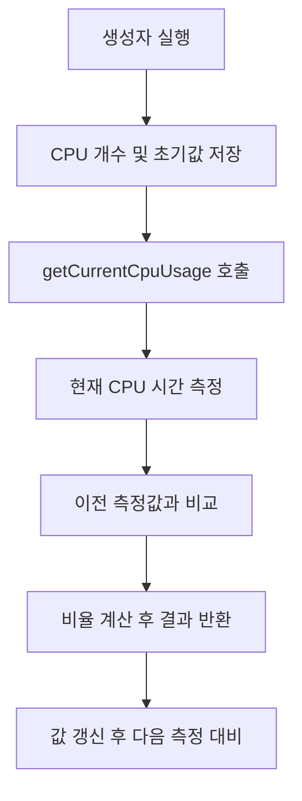
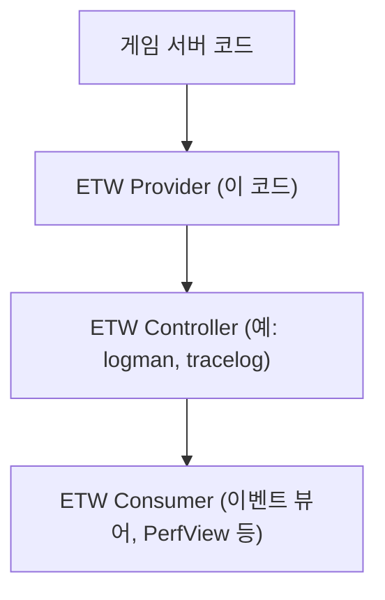
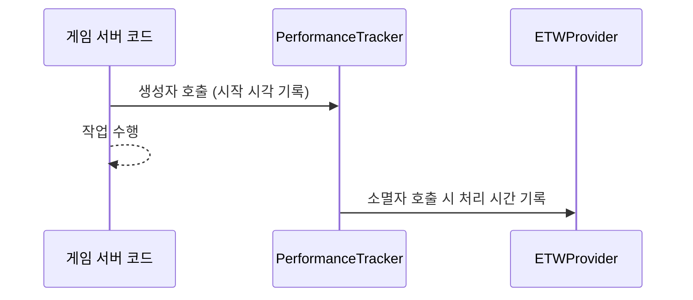

# 게임 서버 개발자를 위한 최신 Win32 API 프로그래밍  

저자: 최흥배, Claude AI   
    
권장 개발 환경
- **IDE**: Visual Studio 2022 (Community 이상)
- **컴파일러**: MSVC v143 (C++20 지원)
- **OS**: Windows 10 이상

-----  

# Chapter 7. 성능 카운터와 프로파일링

## 7.1 들어가며
게임 서버는 수많은 플레이어의 요청을 동시에 처리해야 하므로, 성능 모니터링과 최적화가 매우 중요하다. 성능 문제를 조기에 발견하고 해결하기 위해서는 적절한 모니터링 도구와 프로파일링 기법이 필요하다.

```
게임 서버 성능 모니터링 계층:

┌─────────────────────────────┐
│    Application Level        │  ← 게임 로직 성능
├─────────────────────────────┤
│    Framework Level          │  ← 네트워크, DB 성능
├─────────────────────────────┤
│    OS Level                 │  ← CPU, 메모리, I/O
├─────────────────────────────┤
│    Hardware Level           │  ← 물리적 하드웨어
└─────────────────────────────┘
```

이번 장에서는 Windows에서 제공하는 Performance Counter API, ETW(Event Tracing for Windows), 그리고 Visual Studio 프로파일러를 활용한 성능 분석 방법을 알아보겠다.
  

</br>  
  
## 7.2 Performance Counter API 활용

### 7.2.1 Performance Counter 기초
Performance Counter는 Windows 시스템에서 다양한 성능 지표를 실시간으로 모니터링할 수 있게 해주는 API이다.

```cpp
#include <Windows.h>
#include <Pdh.h>
#include <iostream>
#include <string>
#include <vector>

#pragma comment(lib, "Pdh.lib")

class PerformanceMonitor {
private:
    PDH_HQUERY queryHandle = nullptr;
    
    struct CounterInfo {
        PDH_HCOUNTER handle;
        std::string name;
        std::string description;
        
        CounterInfo(const std::string& n, const std::string& d) 
            : handle(nullptr), name(n), description(d) {}
    };
    
    std::vector<CounterInfo> counters;
    
public:
    PerformanceMonitor() {
        PDH_STATUS status = PdhOpenQueryW(nullptr, 0, &queryHandle);
        if (status != ERROR_SUCCESS) {
            throw std::runtime_error("PDH 쿼리 생성 실패: " + std::to_string(status));
        }
    }
    
    ~PerformanceMonitor() {
        if (queryHandle) {
            // 모든 카운터 제거
            for (auto& counter : counters) {
                if (counter.handle) {
                    PdhRemoveCounter(counter.handle);
                }
            }
            PdhCloseQuery(queryHandle);
        }
    }
    
    bool addCounter(const std::string& counterPath, const std::string& description) {
        CounterInfo info(counterPath, description);
        
        // 카운터 경로를 와이드 문자로 변환
        std::wstring wCounterPath(counterPath.begin(), counterPath.end());
        
        PDH_STATUS status = PdhAddCounterW(queryHandle, wCounterPath.c_str(), 
                                          0, &info.handle);
        
        if (status != ERROR_SUCCESS) {
            std::cout << "카운터 추가 실패 [" << counterPath << "]: " 
                     << std::to_string(status) << std::endl;
            return false;
        }
        
        counters.push_back(info);
        return true;
    }
    
    void collectData() {
        PDH_STATUS status = PdhCollectQueryData(queryHandle);
        if (status != ERROR_SUCCESS) {
            std::cout << "데이터 수집 실패: " << std::to_string(status) << std::endl;
        }
    }
    
    double getCounterValue(size_t index) {
        if (index >= counters.size()) {
            return -1.0;
        }
        
        PDH_FMT_COUNTERVALUE counterValue;
        PDH_STATUS status = PdhGetFormattedCounterValue(
            counters[index].handle, 
            PDH_FMT_DOUBLE, 
            nullptr, 
            &counterValue
        );
        
        if (status != ERROR_SUCCESS) {
            return -1.0;
        }
        
        return counterValue.doubleValue;
    }
    
    void printAllCounters() {
        std::cout << "\n=== 성능 카운터 현황 ===\n";
        for (size_t i = 0; i < counters.size(); ++i) {
            double value = getCounterValue(i);
            std::cout << counters[i].description << ": ";
            
            if (value >= 0) {
                std::cout << value;
            } else {
                std::cout << "N/A";
            }
            std::cout << std::endl;
        }
        std::cout << "========================\n\n";
    }
};
```

### 7.2.2 시스템 리소스 모니터링

```cpp
class SystemResourceMonitor {
private:
    PerformanceMonitor perfMon;
    bool initialized = false;
    
public:
    SystemResourceMonitor() {
        try {
            // CPU 사용률 모니터링
            perfMon.addCounter("\\Processor(_Total)\\% Processor Time", 
                             "전체 CPU 사용률 (%)");
            
            // 메모리 사용량 모니터링
            perfMon.addCounter("\\Memory\\Available MBytes", 
                             "사용 가능한 메모리 (MB)");
            perfMon.addCounter("\\Memory\\Committed Bytes", 
                             "커밋된 메모리 (Bytes)");
            
            // 디스크 I/O 모니터링
            perfMon.addCounter("\\PhysicalDisk(_Total)\\Disk Reads/sec", 
                             "디스크 읽기/초");
            perfMon.addCounter("\\PhysicalDisk(_Total)\\Disk Writes/sec", 
                             "디스크 쓰기/초");
            
            // 네트워크 I/O 모니터링
            perfMon.addCounter("\\Network Interface(*)\\Bytes Total/sec", 
                             "네트워크 총 바이트/초");
            
            // 프로세스별 모니터링 (현재 프로세스)
            std::string processName = getCurrentProcessName();
            
            perfMon.addCounter("\\Process(" + processName + ")\\% Processor Time", 
                             "프로세스 CPU 사용률 (%)");
            perfMon.addCounter("\\Process(" + processName + ")\\Working Set", 
                             "프로세스 워킹셋 (Bytes)");
            perfMon.addCounter("\\Process(" + processName + ")\\Private Bytes", 
                             "프로세스 전용 메모리 (Bytes)");
            
            initialized = true;
            
            // 첫 번째 데이터 수집 (초기화용)
            perfMon.collectData();
            Sleep(1000);  // 1초 대기 후 다시 수집
            
        } catch (const std::exception& e) {
            std::cout << "성능 모니터 초기화 실패: " << e.what() << std::endl;
        }
    }
    
    void update() {
        if (!initialized) return;
        
        perfMon.collectData();
    }
    
    void printSystemStatus() {
        if (!initialized) {
            std::cout << "성능 모니터가 초기화되지 않았습니다.\n";
            return;
        }
        
        perfMon.printAllCounters();
    }
    
private:
    std::string getCurrentProcessName() {
        char buffer[MAX_PATH];
        DWORD size = GetModuleFileNameA(nullptr, buffer, MAX_PATH);
        
        if (size > 0) {
            std::string fullPath(buffer);
            size_t lastSlash = fullPath.find_last_of("\\/");
            if (lastSlash != std::string::npos) {
                std::string fileName = fullPath.substr(lastSlash + 1);
                size_t lastDot = fileName.find_last_of(".");
                if (lastDot != std::string::npos) {
                    return fileName.substr(0, lastDot);
                }
                return fileName;
            }
        }
        
        return "Unknown";
    }
};
```

### 7.2.3 게임 서버 전용 성능 카운터

```cpp
class GameServerPerformanceCounter {
private:
    // 게임 서버 특화 메트릭
    std::atomic<uint64_t> totalConnections{0};
    std::atomic<uint64_t> activeConnections{0};
    std::atomic<uint64_t> messagesPerSecond{0};
    std::atomic<uint64_t> bytesPerSecond{0};
    std::atomic<uint64_t> totalErrors{0};
    
    // 성능 측정을 위한 시간 정보
    std::chrono::steady_clock::time_point lastUpdateTime;
    std::atomic<uint64_t> messageCount{0};
    std::atomic<uint64_t> byteCount{0};
    
    SystemResourceMonitor systemMonitor;
    
public:
    GameServerPerformanceCounter() {
        lastUpdateTime = std::chrono::steady_clock::now();
    }
    
    // 연결 관련 메트릭
    void onPlayerConnect() {
        totalConnections.fetch_add(1);
        activeConnections.fetch_add(1);
    }
    
    void onPlayerDisconnect() {
        activeConnections.fetch_sub(1);
    }
    
    // 메시지 처리 메트릭
    void onMessageProcessed(size_t bytes) {
        messageCount.fetch_add(1);
        byteCount.fetch_add(bytes);
    }
    
    // 에러 메트릭
    void onError() {
        totalErrors.fetch_add(1);
    }
    
    // 초당 통계 업데이트
    void updatePerSecondStats() {
        auto now = std::chrono::steady_clock::now();
        auto elapsed = std::chrono::duration_cast<std::chrono::milliseconds>(
            now - lastUpdateTime);
        
        if (elapsed.count() >= 1000) {  // 1초마다 업데이트
            uint64_t currentMessages = messageCount.exchange(0);
            uint64_t currentBytes = byteCount.exchange(0);
            
            double seconds = elapsed.count() / 1000.0;
            messagesPerSecond.store(static_cast<uint64_t>(currentMessages / seconds));
            bytesPerSecond.store(static_cast<uint64_t>(currentBytes / seconds));
            
            lastUpdateTime = now;
        }
        
        // 시스템 리소스 모니터링 업데이트
        systemMonitor.update();
    }
    
    // 통계 출력
    void printGameServerStats() {
        std::cout << "\n=== 게임 서버 성능 통계 ===\n";
        std::cout << "총 연결 수: " << totalConnections.load() << std::endl;
        std::cout << "활성 연결 수: " << activeConnections.load() << std::endl;
        std::cout << "메시지/초: " << messagesPerSecond.load() << std::endl;
        std::cout << "바이트/초: " << formatBytes(bytesPerSecond.load()) << std::endl;
        std::cout << "총 에러 수: " << totalErrors.load() << std::endl;
        std::cout << "===========================\n";
        
        // 시스템 리소스 현황
        systemMonitor.printSystemStatus();
    }
    
    // 성능 데이터 구조체
    struct PerformanceData {
        uint64_t totalConnections;
        uint64_t activeConnections;
        uint64_t messagesPerSecond;
        uint64_t bytesPerSecond;
        uint64_t totalErrors;
    };
    
    PerformanceData getPerformanceData() const {
        return {
            totalConnections.load(),
            activeConnections.load(),
            messagesPerSecond.load(),
            bytesPerSecond.load(),
            totalErrors.load()
        };
    }
    
private:
    std::string formatBytes(uint64_t bytes) {
        const char* units[] = {"B", "KB", "MB", "GB", "TB"};
        int unit = 0;
        double size = static_cast<double>(bytes);
        
        while (size >= 1024.0 && unit < 4) {
            size /= 1024.0;
            unit++;
        }
        
        char buffer[64];
        snprintf(buffer, sizeof(buffer), "%.2f %s", size, units[unit]);
        return std::string(buffer);
    }
};
```
   

</br>  
  
## 7.3 CPU 사용률 및 메모리 사용량 모니터링

### 7.3.1 정밀한 CPU 사용률 측정

```cpp
#include <Windows.h>
#include <iostream>
#include <thread>
#include <chrono>

class PreciseCpuMonitor {
private:
    ULARGE_INTEGER lastCPU, lastSysCPU, lastUserCPU;
    int numProcessors;
    HANDLE self;
    
public:
    PreciseCpuMonitor() {
        SYSTEM_INFO sysInfo;
        FILETIME ftime, fsys, fuser;
        
        GetSystemInfo(&sysInfo);
        numProcessors = sysInfo.dwNumberOfProcessors;
        
        GetSystemTimeAsFileTime(&ftime);
        memcpy(&lastCPU, &ftime, sizeof(FILETIME));
        
        self = GetCurrentProcess();
        GetProcessTimes(self, &ftime, &ftime, &fsys, &fuser);
        memcpy(&lastSysCPU, &fsys, sizeof(FILETIME));
        memcpy(&lastUserCPU, &fuser, sizeof(FILETIME));
    }
    
    double getCurrentCpuUsage() {
        FILETIME ftime, fsys, fuser;
        ULARGE_INTEGER now, sys, user;
        double percent;
        
        GetSystemTimeAsFileTime(&ftime);
        memcpy(&now, &ftime, sizeof(FILETIME));
        
        GetProcessTimes(self, &ftime, &ftime, &fsys, &fuser);
        memcpy(&sys, &fsys, sizeof(FILETIME));
        memcpy(&user, &fuser, sizeof(FILETIME));
        
        percent = static_cast<double>(sys.QuadPart - lastSysCPU.QuadPart) +
                 static_cast<double>(user.QuadPart - lastUserCPU.QuadPart);
        
        percent /= static_cast<double>(now.QuadPart - lastCPU.QuadPart);
        percent /= numProcessors;
        
        lastCPU = now;
        lastUserCPU = user;
        lastSysCPU = sys;
        
        return percent * 100.0;
    }
    
    void printCpuInfo() {
        SYSTEM_INFO sysInfo;
        GetSystemInfo(&sysInfo);
        
        std::cout << "\n=== CPU 정보 ===\n";
        std::cout << "프로세서 수: " << sysInfo.dwNumberOfProcessors << std::endl;
        std::cout << "프로세서 아키텍처: ";
        
        switch (sysInfo.wProcessorArchitecture) {
            case PROCESSOR_ARCHITECTURE_AMD64:
                std::cout << "x64 (AMD64)" << std::endl;
                break;
            case PROCESSOR_ARCHITECTURE_ARM:
                std::cout << "ARM" << std::endl;
                break;
            case PROCESSOR_ARCHITECTURE_ARM64:
                std::cout << "ARM64" << std::endl;
                break;
            case PROCESSOR_ARCHITECTURE_INTEL:
                std::cout << "x86 (Intel)" << std::endl;
                break;
            default:
                std::cout << "알 수 없음" << std::endl;
                break;
        }
        
        std::cout << "페이지 크기: " << sysInfo.dwPageSize << " bytes" << std::endl;
        std::cout << "===============\n\n";
    }
};
```
  
이번에는 **프로세스의 CPU 사용률을 정밀하게 측정하는 방법**을 살펴본다.
이 클래스는 Windows 환경에서 **현재 실행 중인 프로세스가 CPU를 얼마나 사용하는지 (%)로 계산**하는 기능을 제공한다.

일반적으로 `task manager`(작업 관리자)에서도 CPU 사용률을 볼 수 있지만,
이 코드는 **C++ 프로그램 내에서 실시간으로 CPU 사용량을 계산**할 때 유용하다.
예를 들어, **서버 성능 모니터링**, **리소스 사용 추적**, **병목 구간 분석** 등에 활용할 수 있다.


#### 🧩 전체 개념 요약
이 프로그램은 Windows API의 `GetProcessTimes()` 함수를 이용해 “프로세스가 시스템 CPU를 얼마나 사용했는지”를 주기적으로 측정한다.

CPU 사용률은 다음 공식으로 계산된다:

```
CPU 사용률(%) =
 (현재 프로세스의 사용자 모드 + 커널 모드 CPU 시간 증가량)
 ------------------------------------------------------- × 100
         (시스템 전체 시간 증가량 × 프로세서 수)
```

즉, 측정 시점 사이에서 **프로세스가 얼마나 CPU를 사용했는가**를 시간 비율로 계산하는 구조이다.


#### 🧱 클래스 멤버 구성

```cpp
class PreciseCpuMonitor {
private:
    ULARGE_INTEGER lastCPU, lastSysCPU, lastUserCPU;
    int numProcessors;
    HANDLE self;
```

* **`lastCPU`** : 마지막으로 측정한 시스템 전체 시간
* **`lastSysCPU`** : 마지막으로 측정한 커널 모드 시간
* **`lastUserCPU`** : 마지막으로 측정한 사용자 모드 시간
* **`numProcessors`** : CPU 코어 개수
* **`self`** : 현재 프로세스 핸들 (`GetCurrentProcess()`로 얻음)

이 변수들을 통해 이전 상태를 기억하고, 현재 상태와 비교해 CPU 점유율을 계산한다.


#### 🧭 생성자: 초기 상태 기록

```cpp
PreciseCpuMonitor() {
    SYSTEM_INFO sysInfo;
    FILETIME ftime, fsys, fuser;
    
    GetSystemInfo(&sysInfo);
    numProcessors = sysInfo.dwNumberOfProcessors;
    
    GetSystemTimeAsFileTime(&ftime);
    memcpy(&lastCPU, &ftime, sizeof(FILETIME));
    
    self = GetCurrentProcess();
    GetProcessTimes(self, &ftime, &ftime, &fsys, &fuser);
    memcpy(&lastSysCPU, &fsys, sizeof(FILETIME));
    memcpy(&lastUserCPU, &fuser, sizeof(FILETIME));
}
```

이 생성자는 다음 과정을 수행한다.

1. **CPU 개수(numProcessors)**를 얻는다.
2. **현재 시스템 시간**(`GetSystemTimeAsFileTime`)을 저장한다.
3. **프로세스의 CPU 시간**(`GetProcessTimes`)을 읽어서 저장한다.

이 정보를 기준점으로 두고, 이후 측정에서 변화량을 계산한다.


#### ⚙️ getCurrentCpuUsage() 함수

```cpp
double getCurrentCpuUsage() {
    FILETIME ftime, fsys, fuser;
    ULARGE_INTEGER now, sys, user;
    double percent;
    
    GetSystemTimeAsFileTime(&ftime);
    memcpy(&now, &ftime, sizeof(FILETIME));
    
    GetProcessTimes(self, &ftime, &ftime, &fsys, &fuser);
    memcpy(&sys, &fsys, sizeof(FILETIME));
    memcpy(&user, &fuser, sizeof(FILETIME));
    
    percent = static_cast<double>(sys.QuadPart - lastSysCPU.QuadPart) +
             static_cast<double>(user.QuadPart - lastUserCPU.QuadPart);
    
    percent /= static_cast<double>(now.QuadPart - lastCPU.QuadPart);
    percent /= numProcessors;
    
    lastCPU = now;
    lastUserCPU = user;
    lastSysCPU = sys;
    
    return percent * 100.0;
}
```

이 함수는 실제 CPU 사용률을 계산한다.
핵심 로직은 **이전 측정값과 현재 측정값의 차이(증가분)**을 이용하는 것이다.

**작동 과정은 다음과 같다.**

1. 현재 시스템 시간(`now`)과 프로세스 CPU 시간(`sys`, `user`)을 읽는다.
2. 이전 측정값(`lastSysCPU`, `lastUserCPU`)과의 차이를 계산한다.
3. 시간 증가분으로 나누어 **비율(percent)**을 구한다.
4. CPU 코어 수로 나누어 **평균 사용률**을 계산한다.
5. 마지막으로 현재 값을 저장하여 다음 계산 시 기준으로 사용한다.


#### 🧮 ASCII 다이어그램 (시간 흐름 예시)

```
┌───────────────────────────────┐
│   측정 주기 내 CPU 사용량 계산   │
└───────────────────────────────┘
   ↓ 시간 흐름 ↓

   [t1 시점]  ──▶ lastSysCPU = 1000
                    lastUserCPU = 2000
                    lastCPU = 4000

   [t2 시점]  ──▶ sys = 1300
                    user = 2500
                    now = 4600

   CPU 사용률 = ( (1300-1000) + (2500-2000) ) / (4600-4000) = 0.8
   코어가 4개면 0.8 / 4 = 0.2 → 20%
```

즉, 일정 시간 간격으로 이 함수를 반복 호출하면 CPU 점유율 변화를 실시간으로 확인할 수 있다.


#### 🧾 printCpuInfo() 함수

```cpp
void printCpuInfo() {
    SYSTEM_INFO sysInfo;
    GetSystemInfo(&sysInfo);
    
    std::cout << "\n=== CPU 정보 ===\n";
    std::cout << "프로세서 수: " << sysInfo.dwNumberOfProcessors << std::endl;
    std::cout << "프로세서 아키텍처: ";
    
    switch (sysInfo.wProcessorArchitecture) {
        case PROCESSOR_ARCHITECTURE_AMD64:
            std::cout << "x64 (AMD64)" << std::endl;
            break;
        case PROCESSOR_ARCHITECTURE_ARM:
            std::cout << "ARM" << std::endl;
            break;
        case PROCESSOR_ARCHITECTURE_ARM64:
            std::cout << "ARM64" << std::endl;
            break;
        case PROCESSOR_ARCHITECTURE_INTEL:
            std::cout << "x86 (Intel)" << std::endl;
            break;
        default:
            std::cout << "알 수 없음" << std::endl;
            break;
    }
    
    std::cout << "페이지 크기: " << sysInfo.dwPageSize << " bytes" << std::endl;
    std::cout << "===============\n\n";
}
```

이 함수는 **CPU의 기본 하드웨어 정보를 출력**한다.

* CPU 개수
* 아키텍처(x86, x64, ARM 등)
* 페이지 크기 (메모리 관리 단위 크기)

이 정보는 CPU 사용률과 함께 시스템 성능 분석 시 유용하게 사용된다.

  
#### 🧩 머메이드 다이어그램 (전체 흐름 요약)




#### ✅ 정리

| 구분         | 설명                                                            |
| ---------- | ------------------------------------------------------------- |
| **목적**     | 프로세스의 CPU 사용률을 정밀하게 측정                                        |
| **사용 API** | `GetSystemTimeAsFileTime`, `GetProcessTimes`, `GetSystemInfo` |
| **핵심 로직**  | 이전 측정값과 현재 측정값의 차이로 CPU 점유율 계산                                |
| **특징**     | 멀티코어 환경에서도 정확한 평균 사용률 계산 가능                                   |
| **활용 예시**  | 서버 모니터링, 성능 로깅, 부하 테스트                                        |


이 `PreciseCpuMonitor` 클래스는 단순하지만 매우 정밀한 CPU 측정 도구다.
`std::this_thread::sleep_for`로 일정 간격마다 `getCurrentCpuUsage()`를 호출하면
시간에 따라 CPU 사용률을 실시간으로 모니터링할 수 있다.

이는 시스템 최적화나 성능 분석을 공부하는 학생들에게 **운영체제의 CPU 스케줄링 원리를 이해**하는 데에도 큰 도움이 된다.


### 7.3.2 상세한 메모리 모니터링

```cpp
class DetailedMemoryMonitor {
public:
    struct MemoryInfo {
        SIZE_T workingSetSize;      // 워킹셋 크기
        SIZE_T privateBytes;        // 전용 메모리
        SIZE_T virtualSize;         // 가상 메모리 크기
        SIZE_T peakWorkingSetSize;  // 최대 워킹셋 크기
        SIZE_T peakPagefileUsage;   // 최대 페이지파일 사용량
        
        // 시스템 전체 메모리 정보
        DWORDLONG totalPhysicalMemory;
        DWORDLONG availablePhysicalMemory;
        DWORDLONG totalPageFile;
        DWORDLONG availablePageFile;
        DWORDLONG totalVirtual;
        DWORDLONG availableVirtual;
    };
    
    static MemoryInfo getCurrentMemoryInfo() {
        MemoryInfo info = {};
        
        // 프로세스별 메모리 정보
        PROCESS_MEMORY_COUNTERS_EX pmc;
        if (GetProcessMemoryInfo(GetCurrentProcess(), 
                               reinterpret_cast<PROCESS_MEMORY_COUNTERS*>(&pmc), 
                               sizeof(pmc))) {
            info.workingSetSize = pmc.WorkingSetSize;
            info.privateBytes = pmc.PrivateUsage;
            info.virtualSize = pmc.PagefileUsage;
            info.peakWorkingSetSize = pmc.PeakWorkingSetSize;
            info.peakPagefileUsage = pmc.PeakPagefileUsage;
        }
        
        // 시스템 전체 메모리 정보
        MEMORYSTATUSEX memStatus;
        memStatus.dwLength = sizeof(memStatus);
        if (GlobalMemoryStatusEx(&memStatus)) {
            info.totalPhysicalMemory = memStatus.ullTotalPhys;
            info.availablePhysicalMemory = memStatus.ullAvailPhys;
            info.totalPageFile = memStatus.ullTotalPageFile;
            info.availablePageFile = memStatus.ullAvailPageFile;
            info.totalVirtual = memStatus.ullTotalVirtual;
            info.availableVirtual = memStatus.ullAvailVirtual;
        }
        
        return info;
    }
    
    static void printMemoryInfo(const MemoryInfo& info) {
        std::cout << "\n=== 메모리 사용 현황 ===\n";
        
        // 프로세스 메모리 정보
        std::cout << "[프로세스 메모리]\n";
        std::cout << "워킹셋: " << formatBytes(info.workingSetSize) 
                 << " (최대: " << formatBytes(info.peakWorkingSetSize) << ")\n";
        std::cout << "전용 메모리: " << formatBytes(info.privateBytes) << "\n";
        std::cout << "가상 메모리: " << formatBytes(info.virtualSize) 
                 << " (최대: " << formatBytes(info.peakPagefileUsage) << ")\n\n";
        
        // 시스템 메모리 정보
        std::cout << "[시스템 메모리]\n";
        std::cout << "물리 메모리: " << formatBytes(info.availablePhysicalMemory) 
                 << " / " << formatBytes(info.totalPhysicalMemory)
                 << " (" << getUsagePercentage(info.availablePhysicalMemory, 
                                             info.totalPhysicalMemory) << "% 사용 가능)\n";
        
        std::cout << "페이지 파일: " << formatBytes(info.availablePageFile) 
                 << " / " << formatBytes(info.totalPageFile)
                 << " (" << getUsagePercentage(info.availablePageFile, 
                                             info.totalPageFile) << "% 사용 가능)\n";
        
        std::cout << "가상 메모리: " << formatBytes(info.availableVirtual) 
                 << " / " << formatBytes(info.totalVirtual)
                 << " (" << getUsagePercentage(info.availableVirtual, 
                                             info.totalVirtual) << "% 사용 가능)\n";
        std::cout << "========================\n\n";
    }
    
    // 메모리 누수 감지
    static void detectMemoryLeaks() {
        static MemoryInfo initialInfo = getCurrentMemoryInfo();
        MemoryInfo currentInfo = getCurrentMemoryInfo();
        
        SIZE_T workingSetGrowth = currentInfo.workingSetSize - initialInfo.workingSetSize;
        SIZE_T privateGrowth = currentInfo.privateBytes - initialInfo.privateBytes;
        
        std::cout << "\n=== 메모리 증가량 분석 ===\n";
        std::cout << "워킹셋 증가: " << formatBytes(workingSetGrowth) << "\n";
        std::cout << "전용 메모리 증가: " << formatBytes(privateGrowth) << "\n";
        
        // 경고 임계값 (100MB)
        const SIZE_T WARNING_THRESHOLD = 100 * 1024 * 1024;
        
        if (workingSetGrowth > WARNING_THRESHOLD) {
            std::cout << "⚠️  워킹셋이 크게 증가했습니다! 메모리 누수를 확인하세요.\n";
        }
        
        if (privateGrowth > WARNING_THRESHOLD) {
            std::cout << "⚠️  전용 메모리가 크게 증가했습니다! 메모리 누수를 확인하세요.\n";
        }
        
        std::cout << "========================\n\n";
    }
    
private:
    static std::string formatBytes(SIZE_T bytes) {
        const char* units[] = {"B", "KB", "MB", "GB", "TB"};
        int unit = 0;
        double size = static_cast<double>(bytes);
        
        while (size >= 1024.0 && unit < 4) {
            size /= 1024.0;
            unit++;
        }
        
        char buffer[64];
        snprintf(buffer, sizeof(buffer), "%.2f %s", size, units[unit]);
        return std::string(buffer);
    }
    
    static double getUsagePercentage(DWORDLONG available, DWORDLONG total) {
        if (total == 0) return 0.0;
        return (1.0 - static_cast<double>(available) / static_cast<double>(total)) * 100.0;
    }
};
```
  
이번에는 **프로세스와 시스템 전체의 메모리 사용량을 상세하게 측정하고 출력하는 클래스**를 살펴본다.
이 클래스는 단순히 “얼마나 메모리를 쓰고 있나”를 보여주는 수준을 넘어,
**워킹셋(Working Set)**, **전용 메모리(Private Bytes)**, **가상 메모리(Virtual Memory)** 등
세부적인 메모리 지표를 함께 제공하여 **성능 분석과 메모리 누수 감지**에 활용할 수 있다.

이 코드는 특히 **게임 서버, 렌더링 엔진, 데이터베이스 서버** 등과 같이
프로세스가 장시간 실행되는 프로그램에서 **메모리 누수(memory leak)**를 탐지할 때 유용하다.


#### 🧩 클래스 전체 구조 개요

```cpp
class DetailedMemoryMonitor {
public:
    struct MemoryInfo { ... };
    static MemoryInfo getCurrentMemoryInfo();
    static void printMemoryInfo(const MemoryInfo& info);
    static void detectMemoryLeaks();

private:
    static std::string formatBytes(SIZE_T bytes);
    static double getUsagePercentage(DWORDLONG available, DWORDLONG total);
};
```

이 클래스는 **정적 메서드(static function)** 중심으로 구성되어 있다.
즉, 객체를 만들지 않아도 바로 사용할 수 있다.

예시:

```cpp
auto info = DetailedMemoryMonitor::getCurrentMemoryInfo();
DetailedMemoryMonitor::printMemoryInfo(info);
```

#### 🧱 MemoryInfo 구조체

```cpp
struct MemoryInfo {
    SIZE_T workingSetSize;      // 워킹셋 크기
    SIZE_T privateBytes;        // 전용 메모리
    SIZE_T virtualSize;         // 가상 메모리 크기
    SIZE_T peakWorkingSetSize;  // 최대 워킹셋 크기
    SIZE_T peakPagefileUsage;   // 최대 페이지파일 사용량
    
    // 시스템 전체 메모리 정보
    DWORDLONG totalPhysicalMemory;
    DWORDLONG availablePhysicalMemory;
    DWORDLONG totalPageFile;
    DWORDLONG availablePageFile;
    DWORDLONG totalVirtual;
    DWORDLONG availableVirtual;
};
```

`MemoryInfo` 구조체는 **두 가지 범주의 메모리 정보**를 함께 담는다.

| 구분              | 설명                            |
| --------------- | ----------------------------- |
| **프로세스 메모리 정보** | 현재 프로그램(프로세스)이 실제로 사용하는 메모리   |
| **시스템 메모리 정보**  | 컴퓨터 전체의 물리적 메모리, 가상 메모리 사용 현황 |


#### 🧮 getCurrentMemoryInfo() 함수
이 함수는 **현재 시점의 메모리 상태를 측정**한다.

```cpp
static MemoryInfo getCurrentMemoryInfo() {
    MemoryInfo info = {};
    
    PROCESS_MEMORY_COUNTERS_EX pmc;
    if (GetProcessMemoryInfo(GetCurrentProcess(), 
                           reinterpret_cast<PROCESS_MEMORY_COUNTERS*>(&pmc), 
                           sizeof(pmc))) {
        info.workingSetSize = pmc.WorkingSetSize;
        info.privateBytes = pmc.PrivateUsage;
        info.virtualSize = pmc.PagefileUsage;
        info.peakWorkingSetSize = pmc.PeakWorkingSetSize;
        info.peakPagefileUsage = pmc.PeakPagefileUsage;
    }
```

여기서 사용하는 함수는 Windows API의 `GetProcessMemoryInfo()`이다.
이 함수는 현재 프로세스가 사용 중인 메모리 상태를 상세히 알려준다.

| 항목                      | 설명                            |
| ----------------------- | ----------------------------- |
| **Working Set**         | 실제 물리 RAM에 올라와 있는 프로세스의 메모리 양 |
| **Private Bytes**       | 이 프로세스만 사용하는 메모리 양 (공유 불가 영역) |
| **Virtual Size**        | 프로세스가 예약한 가상 주소 공간 크기         |
| **Peak Working Set**    | 실행 중 가장 많이 사용했던 RAM 양         |
| **Peak Pagefile Usage** | 가장 많이 사용된 스왑(가상) 메모리 양        |

이후 시스템 전체 메모리 상태를 조회한다.

```cpp
MEMORYSTATUSEX memStatus;
memStatus.dwLength = sizeof(memStatus);
if (GlobalMemoryStatusEx(&memStatus)) {
    info.totalPhysicalMemory = memStatus.ullTotalPhys;
    info.availablePhysicalMemory = memStatus.ullAvailPhys;
    info.totalPageFile = memStatus.ullTotalPageFile;
    info.availablePageFile = memStatus.ullAvailPageFile;
    info.totalVirtual = memStatus.ullTotalVirtual;
    info.availableVirtual = memStatus.ullAvailVirtual;
}
```

이때 사용하는 `GlobalMemoryStatusEx()`는 시스템 전체의 메모리 용량과 사용률을 알려주는 함수이다.

#### 📊 printMemoryInfo() 함수
이 함수는 `MemoryInfo` 데이터를 보기 좋게 출력한다.

```cpp
static void printMemoryInfo(const MemoryInfo& info) {
    std::cout << "\n=== 메모리 사용 현황 ===\n";
    
    // 프로세스 메모리
    std::cout << "[프로세스 메모리]\n";
    std::cout << "워킹셋: " << formatBytes(info.workingSetSize) 
             << " (최대: " << formatBytes(info.peakWorkingSetSize) << ")\n";
```

출력 예시는 다음과 같다.

```
=== 메모리 사용 현황 ===
[프로세스 메모리]
워킹셋: 120.45 MB (최대: 200.00 MB)
전용 메모리: 80.12 MB
가상 메모리: 350.67 MB (최대: 400.00 MB)

[시스템 메모리]
물리 메모리: 8.12 GB / 16.00 GB (49% 사용 가능)
페이지 파일: 13.50 GB / 20.00 GB (32% 사용 가능)
가상 메모리: 1.50 TB / 2.00 TB (25% 사용 가능)
========================
```

ASCII 그림으로 나타내면 다음과 같다.

```
┌─────────────────────────────┐
│       DetailedMemoryMonitor │
├─────────────────────────────┤
│ [프로세스 메모리]             │
│   워킹셋 / 전용 / 가상 메모리  │
│                             │
│ [시스템 메모리]               │
│   물리 / 페이지 / 가상 메모리  │
└─────────────────────────────┘
```

#### 🧩 detectMemoryLeaks() 함수
이 함수는 **프로세스의 메모리 누수(memory leak)**를 감지한다.

```cpp
static void detectMemoryLeaks() {
    static MemoryInfo initialInfo = getCurrentMemoryInfo();
    MemoryInfo currentInfo = getCurrentMemoryInfo();
    
    SIZE_T workingSetGrowth = currentInfo.workingSetSize - initialInfo.workingSetSize;
    SIZE_T privateGrowth = currentInfo.privateBytes - initialInfo.privateBytes;
```

작동 과정은 다음과 같다.

1. **프로그램 시작 시점의 메모리 사용량(initialInfo)**을 저장한다.
2. **현재 시점의 메모리(currentInfo)**을 측정한다.
3. 두 값의 차이를 비교하여 증가량을 계산한다.

```cpp
if (workingSetGrowth > 100MB) 경고 출력
if (privateGrowth > 100MB) 경고 출력
```

즉, 일정 기간 동안 메모리가 100MB 이상 증가하면 “누수 의심” 경고를 띄운다.

#### 🧮 formatBytes() 함수

```cpp
static std::string formatBytes(SIZE_T bytes) {
    const char* units[] = {"B", "KB", "MB", "GB", "TB"};
    int unit = 0;
    double size = static_cast<double>(bytes);
    
    while (size >= 1024.0 && unit < 4) {
        size /= 1024.0;
        unit++;
    }
    
    char buffer[64];
    snprintf(buffer, sizeof(buffer), "%.2f %s", size, units[unit]);
    return std::string(buffer);
}
```

이 함수는 바이트 단위를 사람이 읽기 쉬운 형식(예: MB, GB)으로 변환한다.

#### 🧩 getUsagePercentage() 함수

```cpp
static double getUsagePercentage(DWORDLONG available, DWORDLONG total) {
    if (total == 0) return 0.0;
    return (1.0 - static_cast<double>(available) / static_cast<double>(total)) * 100.0;
}
```

이 함수는 사용 가능한 메모리 비율을 계산하여 “사용 중 비율(%)”로 표시한다.

#### 🧠 머메이드 다이어그램으로 보는 흐름

```mermaid
flowchart TD
A[프로그램 실행] --> B[초기 메모리 측정 (initialInfo 저장)]
B --> C[현재 메모리 측정 (getCurrentMemoryInfo)]
C --> D[증가량 계산]
D --> E{증가량 > 100MB?}
E -- 예 --> F[경고: 메모리 누수 의심]
E -- 아니오 --> G[정상 상태 유지]
```

#### ✅ 정리

| 구분         | 설명                                                          |
| ---------- | ----------------------------------------------------------- |
| **목적**     | 프로세스 및 시스템 전체 메모리 사용량을 실시간 분석                               |
| **핵심 기능**  | 메모리 사용 현황 출력, 증가량 분석, 메모리 누수 감지                             |
| **사용 API** | `GetProcessMemoryInfo`, `GlobalMemoryStatusEx`              |
| **출력 정보**  | Working Set, Private Bytes, Virtual Memory, System Memory 등 |
| **추가 기능**  | 100MB 이상 증가 시 자동 경고 메시지 출력                                  |
  

이 `DetailedMemoryMonitor` 클래스는 **운영체제 수준의 메모리 상태를 프로그래밍적으로 측정할 수 있는 도구**다.
학생들이 이 코드를 통해 배우게 되는 핵심은 다음과 같다.

* 프로그램의 **실제 메모리 사용량을 정확히 측정하는 방법**
* **시스템 메모리와 프로세스 메모리의 차이점** 이해
* **메모리 누수 감지 로직**의 기본 개념

이러한 모니터링 코드는 단순한 디버깅 도구를 넘어서,
성능 최적화와 안정적인 서버 운영을 위한 **필수 기술적 기반**이 된다.


### 7.3.3 실시간 모니터링 대시보드

```cpp
class PerformanceDashboard {
private:
    PreciseCpuMonitor cpuMonitor;
    GameServerPerformanceCounter gameCounter;
    bool running = false;
    std::thread monitorThread;
    
public:
    void start() {
        running = true;
        monitorThread = std::thread(&PerformanceDashboard::monitorLoop, this);
    }
    
    void stop() {
        running = false;
        if (monitorThread.joinable()) {
            monitorThread.join();
        }
    }
    
    GameServerPerformanceCounter& getGameCounter() {
        return gameCounter;
    }
    
private:
    void monitorLoop() {
        const auto UPDATE_INTERVAL = std::chrono::seconds(5);
        auto lastUpdate = std::chrono::steady_clock::now();
        
        cpuMonitor.printCpuInfo();
        
        while (running) {
            auto now = std::chrono::steady_clock::now();
            if (now - lastUpdate >= UPDATE_INTERVAL) {
                clearScreen();
                printDashboard();
                lastUpdate = now;
            }
            
            gameCounter.updatePerSecondStats();
            std::this_thread::sleep_for(std::chrono::milliseconds(100));
        }
    }
    
    void clearScreen() {
        // Windows에서 콘솔 화면 지우기
        COORD coordScreen = {0, 0};
        DWORD cCharsWritten;
        CONSOLE_SCREEN_BUFFER_INFO csbi;
        HANDLE hConsole = GetStdHandle(STD_OUTPUT_HANDLE);
        
        GetConsoleScreenBufferInfo(hConsole, &csbi);
        DWORD dwConSize = csbi.dwSize.X * csbi.dwSize.Y;
        
        FillConsoleOutputCharacter(hConsole, TEXT(' '), dwConSize, 
                                 coordScreen, &cCharsWritten);
        GetConsoleScreenBufferInfo(hConsole, &csbi);
        FillConsoleOutputAttribute(hConsole, csbi.wAttributes, dwConSize, 
                                 coordScreen, &cCharsWritten);
        SetConsoleCursorPosition(hConsole, coordScreen);
    }
    
    void printDashboard() {
        auto currentTime = std::chrono::system_clock::now();
        auto time_t = std::chrono::system_clock::to_time_t(currentTime);
        
        std::cout << "┌─────────────────────────────────────────────────────┐\n";
        std::cout << "│              게임 서버 성능 대시보드                │\n";
        std::cout << "│  업데이트 시간: " << std::ctime(&time_t);
        std::cout << "└─────────────────────────────────────────────────────┘\n\n";
        
        // CPU 사용률
        double cpuUsage = cpuMonitor.getCurrentCpuUsage();
        std::cout << "CPU 사용률: " << std::fixed << std::setprecision(1) 
                 << cpuUsage << "% ";
        printProgressBar(cpuUsage, 100.0);
        std::cout << "\n\n";
        
        // 메모리 정보
        auto memInfo = DetailedMemoryMonitor::getCurrentMemoryInfo();
        double memUsagePercent = DetailedMemoryMonitor::getUsagePercentage(
            memInfo.availablePhysicalMemory, memInfo.totalPhysicalMemory);
        
        std::cout << "메모리 사용률: " << std::fixed << std::setprecision(1) 
                 << memUsagePercent << "% ";
        printProgressBar(memUsagePercent, 100.0);
        std::cout << "\n";
        
        std::cout << "프로세스 메모리: " 
                 << DetailedMemoryMonitor::formatBytes(memInfo.workingSetSize) << "\n\n";
        
        // 게임 서버 통계
        auto gameStats = gameCounter.getPerformanceData();
        std::cout << "┌─ 게임 서버 통계 ─┐\n";
        std::cout << "│ 활성 연결: " << std::setw(6) << gameStats.activeConnections << " │\n";
        std::cout << "│ 메시지/초: " << std::setw(6) << gameStats.messagesPerSecond << " │\n";
        std::cout << "│ 바이트/초: " << std::setw(6) << gameStats.bytesPerSecond << " │\n";
        std::cout << "│ 총 에러수: " << std::setw(6) << gameStats.totalErrors << " │\n";
        std::cout << "└──────────────────┘\n\n";
        
        // 성능 경고
        printPerformanceWarnings(cpuUsage, memUsagePercent, gameStats);
    }
    
    void printProgressBar(double current, double max, int width = 30) {
        double percentage = (current / max) * 100.0;
        int filledWidth = static_cast<int>((current / max) * width);
        
        std::cout << "[";
        for (int i = 0; i < width; ++i) {
            if (i < filledWidth) {
                std::cout << "█";
            } else {
                std::cout << "░";
            }
        }
        std::cout << "]";
    }
    
    void printPerformanceWarnings(double cpuUsage, double memUsage, 
                                const GameServerPerformanceCounter::PerformanceData& gameStats) {
        std::vector<std::string> warnings;
        
        if (cpuUsage > 80.0) {
            warnings.push_back("⚠️  CPU 사용률이 높습니다 (" + 
                             std::to_string(static_cast<int>(cpuUsage)) + "%)");
        }
        
        if (memUsage > 85.0) {
            warnings.push_back("⚠️  메모리 사용률이 높습니다 (" + 
                             std::to_string(static_cast<int>(memUsage)) + "%)");
        }
        
        if (gameStats.messagesPerSecond > 10000) {
            warnings.push_back("📈 높은 메시지 처리량 감지됨 (" + 
                             std::to_string(gameStats.messagesPerSecond) + "/초)");
        }
        
        if (gameStats.totalErrors > 100) {
            warnings.push_back("❌ 에러 발생량이 많습니다 (" + 
                             std::to_string(gameStats.totalErrors) + "개)");
        }
        
        if (!warnings.empty()) {
            std::cout << "┌─ 경고 사항 ─┐\n";
            for (const auto& warning : warnings) {
                std::cout << "│ " << warning << "\n";
            }
            std::cout << "└─────────────┘\n\n";
        }
    }
};
```
  
</br>    


## 7.4 ETW (Event Tracing for Windows) 기초

### 7.4.1 ETW 개념과 구조

```
ETW 아키텍처:

┌─────────────┐    ┌─────────────┐    ┌─────────────┐
│   Provider  │───▶│   Session   │──▶│  Consumer   │
│ (이벤트 생성)│     │ (이벤트 수집) │    │ (이벤트 분석)│
└─────────────┘    └─────────────┘    └─────────────┘
       │                   │                   │
       ▼                   ▼                   ▼
  게임 서버 코드      Windows 커널       분석 도구
```

ETW는 Windows에서 제공하는 고성능 이벤트 추적 시스템으로, 최소한의 오버헤드로 상세한 성능 데이터를 수집할 수 있다.

### 7.4.2 ETW Provider 구현

```cpp
#include <Windows.h>
#include <evntprov.h>
#include <iostream>
#include <string>

#pragma comment(lib, "Advapi32.lib")

// 커스텀 ETW Provider GUID (새로 생성해야 함)
// PowerShell에서 [System.Guid]::NewGuid() 로 생성 가능
DEFINE_GUID(GameServerProviderGuid, 
    0x12345678, 0x1234, 0x5678, 0x12, 0x34, 0x56, 0x78, 0x9A, 0xBC, 0xDE, 0xF0);

class ETWProvider {
private:
    REGHANDLE registrationHandle = 0;
    bool initialized = false;
    
public:
    ETWProvider() {
        ULONG result = EventRegister(&GameServerProviderGuid, nullptr, nullptr, 
                                   &registrationHandle);
        
        if (result == ERROR_SUCCESS) {
            initialized = true;
            std::cout << "ETW Provider 등록 성공\n";
        } else {
            std::cout << "ETW Provider 등록 실패: " << result << "\n";
        }
    }
    
    ~ETWProvider() {
        if (initialized) {
            EventUnregister(registrationHandle);
        }
    }
    
    // 간단한 이벤트 기록
    void logEvent(UCHAR level, const std::string& message) {
        if (!initialized) return;
        
        EVENT_DESCRIPTOR eventDesc;
        EventDescCreate(&eventDesc, 1, 0, 0, level, 0, 0, 0);
        
        EVENT_DATA_DESCRIPTOR dataDesc;
        EventDataDescCreate(&dataDesc, message.c_str(), 
                          static_cast<ULONG>(message.length() + 1));
        
        EventWrite(registrationHandle, &eventDesc, 1, &dataDesc);
    }
    
    // 게임 서버 특화 이벤트들
    void logPlayerConnect(int playerId, const std::string& playerName) {
        if (!initialized) return;
        
        EVENT_DESCRIPTOR eventDesc;
        EventDescCreate(&eventDesc, 100, 0, 0, TRACE_LEVEL_INFORMATION, 1, 0, 0);
        
        EVENT_DATA_DESCRIPTOR dataDescs[2];
        EventDataDescCreate(&dataDescs[0], &playerId, sizeof(playerId));
        EventDataDescCreate(&dataDescs[1], playerName.c_str(), 
                          static_cast<ULONG>(playerName.length() + 1));
        
        EventWrite(registrationHandle, &eventDesc, 2, dataDescs);
        
        std::cout << "ETW: 플레이어 연결 - ID: " << playerId 
                 << ", 이름: " << playerName << "\n";
    }
    
    void logMessageProcessed(int messageType, DWORD processingTime) {
        if (!initialized) return;
        
        EVENT_DESCRIPTOR eventDesc;
        EventDescCreate(&eventDesc, 101, 0, 0, TRACE_LEVEL_VERBOSE, 2, 0, 0);
        
        EVENT_DATA_DESCRIPTOR dataDescs[2];
        EventDataDescCreate(&dataDescs[0], &messageType, sizeof(messageType));
        EventDataDescCreate(&dataDescs[1], &processingTime, sizeof(processingTime));
        
        EventWrite(registrationHandle, &eventDesc, 2, dataDescs);
    }
    
    void logError(const std::string& errorMessage, DWORD errorCode) {
        if (!initialized) return;
        
        EVENT_DESCRIPTOR eventDesc;
        EventDescCreate(&eventDesc, 102, 0, 0, TRACE_LEVEL_ERROR, 3, 0, 0);
        
        EVENT_DATA_DESCRIPTOR dataDescs[2];
        EventDataDescCreate(&dataDescs[0], errorMessage.c_str(), 
                          static_cast<ULONG>(errorMessage.length() + 1));
        EventDataDescCreate(&dataDescs[1], &errorCode, sizeof(errorCode));
        
        EventWrite(registrationHandle, &eventDesc, 2, dataDescs);
        
        std::cout << "ETW: 에러 - " << errorMessage 
                 << " (코드: " << errorCode << ")\n";
    }
    
    // 성능 측정 도우미 클래스
    class PerformanceTracker {
    private:
        ETWProvider& provider;
        int operationType;
        LARGE_INTEGER startTime;
        
    public:
        PerformanceTracker(ETWProvider& p, int type) 
            : provider(p), operationType(type) {
            QueryPerformanceCounter(&startTime);
        }
        
        ~PerformanceTracker() {
            LARGE_INTEGER endTime, frequency;
            QueryPerformanceCounter(&endTime);
            QueryPerformanceFrequency(&frequency);
            
            DWORD elapsed = static_cast<DWORD>(
                ((endTime.QuadPart - startTime.QuadPart) * 1000) / frequency.QuadPart
            );
            
            provider.logMessageProcessed(operationType, elapsed);
        }
    };
    
    PerformanceTracker trackPerformance(int operationType) {
        return PerformanceTracker(*this, operationType);
    }
};
```
     
이 코드는 **Windows ETW(Event Tracing for Windows)**를 활용해 게임 서버에서 발생하는 주요 이벤트(예: 플레이어 연결, 메시지 처리, 오류 발생 등)를 **효율적으로 기록하고 추적**하기 위한 예제이다.
ETW는 윈도우에서 제공하는 고성능 이벤트 로깅 시스템으로, 디버깅이나 성능 분석 시 매우 유용하다.
이 코드는 특히 **게임 서버의 실행 중 발생하는 이벤트를 ETW 세션에 기록하는 “Provider”** 역할을 수행한다.


#### 전체 구조 개요

ETW 시스템은 다음과 같은 구조를 가진다.



* **Provider**: 이벤트를 발생시키는 주체 (이 코드)
* **Controller**: 어떤 Provider의 이벤트를 수집할지 제어함
* **Consumer**: 수집된 이벤트를 분석하거나 시각화함


#### 1. ETW Provider 등록

```cpp
ULONG result = EventRegister(&GameServerProviderGuid, nullptr, nullptr, &registrationHandle);
```

* `EventRegister` 함수는 ETW Provider를 윈도우 커널에 등록한다.
* `GameServerProviderGuid`는 Provider를 고유하게 식별하는 GUID이다.
* PowerShell에서 `[System.Guid]::NewGuid()` 명령으로 새 GUID를 생성할 수 있다.
* 등록에 성공하면 `registrationHandle`이 발급되어 이후 이벤트 기록에 사용된다.

등록 성공 여부는 다음과 같이 출력된다.

```cpp
if (result == ERROR_SUCCESS) {
    std::cout << "ETW Provider 등록 성공\n";
} else {
    std::cout << "ETW Provider 등록 실패: " << result << "\n";
}
```


#### 2. 기본 이벤트 기록 함수

```cpp
void logEvent(UCHAR level, const std::string& message);
```

이 함수는 가장 단순한 형태의 이벤트를 기록한다.
ETW 이벤트는 **EVENT_DESCRIPTOR**와 **EVENT_DATA_DESCRIPTOR** 구조체를 이용해 정의된다.

* `EventDescCreate` → 이벤트의 ID, 수준(Level) 등을 설정한다.
* `EventDataDescCreate` → 실제 이벤트 데이터를 지정한다.
* `EventWrite` → 이벤트를 기록한다.

예를 들어 다음과 같이 실행될 수 있다.

```cpp
logEvent(TRACE_LEVEL_INFORMATION, "서버가 시작되었습니다.");
```


#### 3. 게임 서버 특화 이벤트 기록

##### (1) 플레이어 연결 이벤트

```cpp
void logPlayerConnect(int playerId, const std::string& playerName);
```

플레이어가 서버에 접속할 때 호출된다.

```cpp
EventDescCreate(&eventDesc, 100, 0, 0, TRACE_LEVEL_INFORMATION, 1, 0, 0);
```

* 이벤트 ID `100`은 플레이어 연결을 의미한다.
* 이벤트 수준(Level)은 `TRACE_LEVEL_INFORMATION`이다.

이벤트 데이터는 두 개이다.

1. 플레이어 ID (`int`)
2. 플레이어 이름 (`string`)

```cpp
EventDataDescCreate(&dataDescs[0], &playerId, sizeof(playerId));
EventDataDescCreate(&dataDescs[1], playerName.c_str(), static_cast<ULONG>(playerName.length() + 1));
```

결과적으로 ETW 로그에 다음과 같은 형태의 이벤트가 기록된다.

```
ETW: 플레이어 연결 - ID: 42, 이름: DragonKnight
```

##### (2) 메시지 처리 이벤트

```cpp
void logMessageProcessed(int messageType, DWORD processingTime);
```

특정 메시지 타입의 처리 시간을 기록한다.

* 이벤트 ID `101`
* 수준(Level): `TRACE_LEVEL_VERBOSE`
* `processingTime`은 밀리초 단위로 계산된다.

이 정보는 성능 분석 시 매우 중요하다.
특정 메시지가 과도하게 오래 걸리는 경우, 병목 구간을 식별할 수 있다.

##### (3) 오류 이벤트

```cpp
void logError(const std::string& errorMessage, DWORD errorCode);
```

서버에서 예외나 오류가 발생했을 때 기록한다.

* 이벤트 ID `102`
* 수준(Level): `TRACE_LEVEL_ERROR`

이벤트 예시 출력:

```
ETW: 에러 - Database connection failed (코드: 5001)
```


#### 4. 성능 측정 도우미 (PerformanceTracker)
성능 측정을 자동화하기 위한 **RAII (Resource Acquisition Is Initialization)** 패턴 클래스이다.

```cpp
class PerformanceTracker {
private:
    ETWProvider& provider;
    int operationType;
    LARGE_INTEGER startTime;
    
public:
    PerformanceTracker(ETWProvider& p, int type)
        : provider(p), operationType(type) {
        QueryPerformanceCounter(&startTime);
    }

    ~PerformanceTracker() {
        LARGE_INTEGER endTime, frequency;
        QueryPerformanceCounter(&endTime);
        QueryPerformanceFrequency(&frequency);
        DWORD elapsed = static_cast<DWORD>(
            ((endTime.QuadPart - startTime.QuadPart) * 1000) / frequency.QuadPart
        );
        provider.logMessageProcessed(operationType, elapsed);
    }
};
```
  
##### 작동 흐름 (RAII 개념)



`PerformanceTracker`는 생성 시점에 시간을 기록하고, 소멸 시 자동으로 수행 시간을 ETW에 기록한다.
이 덕분에 별도의 타이머 코드 없이 함수의 실행 시간을 자동으로 추적할 수 있다.

 
#### 5. 전체 동작 요약
ETWProvider 클래스의 주요 흐름은 다음과 같다.

```plaintext
[ETWProvider 생성]
    ↓
EventRegister() 로 등록
    ↓
[이벤트 발생 시]
    ↓
EventDescCreate() → EventDataDescCreate() → EventWrite()
    ↓
[ETW 세션으로 전달]
```


#### 마무리
이 코드는 **게임 서버의 동작 상태와 성능을 ETW 기반으로 실시간 기록**하기 위한 기본 구조를 보여준다.
이를 통해 서버의 병목, 오류, 플레이어 활동 등을 세밀하게 분석할 수 있다.
ETW는 CPU 오버헤드가 매우 낮기 때문에, **실시간 서비스 환경에서도 안정적으로 로깅이 가능**하다는 장점이 있다.

이 구조를 기반으로 하면, 게임 서버의 안정성과 성능 가시성을 대폭 향상시킬 수 있다.


### 7.4.3 ETW를 활용한 성능 분석

```cpp
class GameServerWithETW {
private:
    ETWProvider etwProvider;
    
public:
    void simulateGameOperations() {
        std::cout << "\n=== ETW를 활용한 게임 서버 시뮬레이션 ===\n";
        
        // 플레이어 연결 시뮬레이션
        for (int i = 1; i <= 5; ++i) {
            std::string playerName = "Player" + std::to_string(i);
            etwProvider.logPlayerConnect(i, playerName);
            Sleep(100);
        }
        
        // 메시지 처리 시뮬레이션
        std::random_device rd;
        std::mt19937 gen(rd());
        std::uniform_int_distribution<> msgTypeDist(1, 10);
        std::uniform_int_distribution<> delayDist(10, 100);
        
        for (int i = 0; i < 20; ++i) {
            int messageType = msgTypeDist(gen);
            int delay = delayDist(gen);
            
            {
                auto tracker = etwProvider.trackPerformance(messageType);
                // 메시지 처리 시뮬레이션
                Sleep(delay);
            }
            
            // 가끔 에러 발생 시뮬레이션
            if (i % 7 == 0) {
                etwProvider.logError("시뮬레이션 에러", 12345);
            }
        }
        
        std::cout << "\n시뮬레이션 완료. ETW 이벤트가 기록되었습니다.\n";
        std::cout << "Windows Event Viewer 또는 WPA(Windows Performance Analyzer)에서 확인하세요.\n";
    }
    
    // ETW 세션 생성 가이드 출력
    void printETWUsageGuide() {
        std::cout << "\n=== ETW 사용 가이드 ===\n";
        std::cout << "1. 관리자 권한으로 명령 프롬프트 실행\n";
        std::cout << "2. ETW 세션 시작:\n";
        std::cout << "   wpr -start GeneralProfile\n";
        std::cout << "   또는\n";
        std::cout << "   logman create trace GameServerTrace -p {12345678-1234-5678-1234-56789ABCDEF0}\n";
        std::cout << "   logman start GameServerTrace\n\n";
        
        std::cout << "3. 게임 서버 실행 및 테스트\n\n";
        
        std::cout << "4. ETW 세션 중지 및 로그 저장:\n";
        std::cout << "   wpr -stop trace.etl\n";
        std::cout << "   또는\n";
        std::cout << "   logman stop GameServerTrace\n\n";
        
        std::cout << "5. 분석:\n";
        std::cout << "   - WPA (Windows Performance Analyzer)로 trace.etl 열기\n";
        std::cout << "   - 또는 tracerpt 명령으로 텍스트 변환\n";
        std::cout << "========================\n\n";
    }
};
```

</br>      
  
  
## 7.5 Visual Studio 프로파일러 연동

### 7.5.1 프로파일링을 위한 코드 준비

```cpp
#include <Windows.h>
#include <iostream>
#include <vector>
#include <algorithm>
#include <random>
#include <chrono>
#include <thread>

// Visual Studio 프로파일러 API (선택사항)
#ifdef _WIN32
#include <VSPerf.h>
#pragma comment(lib, "VSPerf.lib")
#endif

class ProfilingDemo {
private:
    std::vector<int> data;
    std::mt19937 rng;
    
public:
    ProfilingDemo(size_t size = 1000000) : data(size), rng(std::random_device{}()) {
        generateTestData();
    }
    
    void generateTestData() {
        std::cout << "테스트 데이터 생성 중...\n";
        
        std::uniform_int_distribution<int> dist(1, 100000);
        for (auto& value : data) {
            value = dist(rng);
        }
    }
    
    // CPU 집약적 작업 시뮬레이션
    void cpuIntensiveOperation() {
        std::cout << "CPU 집약적 작업 실행 중...\n";
        
        // 정렬 작업
        std::sort(data.begin(), data.end());
        
        // 복잡한 계산
        double result = 0.0;
        for (size_t i = 0; i < data.size(); ++i) {
            result += std::sin(data[i]) * std::cos(data[i]) * std::sqrt(data[i]);
        }
        
        std::cout << "계산 결과: " << result << "\n";
    }
    
    // 메모리 집약적 작업 시뮬레이션
    void memoryIntensiveOperation() {
        std::cout << "메모리 집약적 작업 실행 중...\n";
        
        std::vector<std::vector<int>> matrix;
        const size_t MATRIX_SIZE = 1000;
        
        // 대량의 메모리 할당
        matrix.reserve(MATRIX_SIZE);
        for (size_t i = 0; i < MATRIX_SIZE; ++i) {
            matrix.emplace_back(MATRIX_SIZE, static_cast<int>(i));
        }
        
        // 메모리 접근 패턴 테스트
        int sum = 0;
        for (size_t i = 0; i < MATRIX_SIZE; ++i) {
            for (size_t j = 0; j < MATRIX_SIZE; ++j) {
                sum += matrix[i][j];
            }
        }
        
        std::cout << "매트릭스 합계: " << sum << "\n";
    }
    
    // I/O 집약적 작업 시뮬레이션
    void ioIntensiveOperation() {
        std::cout << "I/O 집약적 작업 실행 중...\n";
        
        const std::string filename = "test_data.txt";
        
        // 파일 쓰기
        HANDLE hFile = CreateFileA(filename.c_str(), GENERIC_WRITE, 0, nullptr,
                                  CREATE_ALWAYS, FILE_ATTRIBUTE_NORMAL, nullptr);
        
        if (hFile != INVALID_HANDLE_VALUE) {
            for (size_t i = 0; i < data.size() / 100; ++i) {  // 일부 데이터만 저장
                std::string line = std::to_string(data[i]) + "\n";
                DWORD bytesWritten;
                WriteFile(hFile, line.c_str(), static_cast<DWORD>(line.length()),
                         &bytesWritten, nullptr);
            }
            CloseHandle(hFile);
        }
        
        // 파일 읽기
        hFile = CreateFileA(filename.c_str(), GENERIC_READ, 0, nullptr,
                           OPEN_EXISTING, FILE_ATTRIBUTE_NORMAL, nullptr);
        
        if (hFile != INVALID_HANDLE_VALUE) {
            char buffer[1024];
            DWORD bytesRead;
            int totalBytes = 0;
            
            while (ReadFile(hFile, buffer, sizeof(buffer) - 1, &bytesRead, nullptr)
                   && bytesRead > 0) {
                totalBytes += bytesRead;
                buffer[bytesRead] = '\0';
            }
            
            CloseHandle(hFile);
            DeleteFileA(filename.c_str());  // 정리
            
            std::cout << "총 읽은 바이트: " << totalBytes << "\n";
        }
    }
    
    // 멀티스레드 작업 시뮬레이션
    void multithreadedOperation() {
        std::cout << "멀티스레드 작업 실행 중...\n";
        
        const int NUM_THREADS = std::thread::hardware_concurrency();
        std::vector<std::thread> threads;
        std::vector<long long> results(NUM_THREADS, 0);
        
        size_t chunkSize = data.size() / NUM_THREADS;
        
        for (int i = 0; i < NUM_THREADS; ++i) {
            threads.emplace_back([this, i, chunkSize, &results]() {
                size_t start = i * chunkSize;
                size_t end = (i == NUM_THREADS - 1) ? data.size() : (i + 1) * chunkSize;
                
                long long sum = 0;
                for (size_t j = start; j < end; ++j) {
                    sum += data[j] * data[j];  // 제곱 합계
                }
                
                results[i] = sum;
            });
        }
        
        for (auto& t : threads) {
            t.join();
        }
        
        long long totalSum = 0;
        for (long long result : results) {
            totalSum += result;
        }
        
        std::cout << "멀티스레드 계산 결과: " << totalSum << "\n";
    }
    
    // 전체 벤치마크 실행
    void runAllBenchmarks() {
        std::cout << "\n=== Visual Studio 프로파일링 데모 ===\n";
        std::cout << "이 프로그램을 Visual Studio에서 프로파일링하세요.\n";
        std::cout << "메뉴: 디버그 > 성능 프로파일러 > CPU 사용량\n\n";
        
        auto runWithTiming = [](const std::string& name, std::function<void()> func) {
            std::cout << "\n--- " << name << " ---\n";
            auto start = std::chrono::high_resolution_clock::now();
            
            func();
            
            auto end = std::chrono::high_resolution_clock::now();
            auto duration = std::chrono::duration_cast<std::chrono::milliseconds>(end - start);
            std::cout << "실행 시간: " << duration.count() << "ms\n";
        };
        
        runWithTiming("CPU 집약적 작업", [this]() { cpuIntensiveOperation(); });
        runWithTiming("메모리 집약적 작업", [this]() { memoryIntensiveOperation(); });
        runWithTiming("I/O 집약적 작업", [this]() { ioIntensiveOperation(); });
        runWithTiming("멀티스레드 작업", [this]() { multithreadedOperation(); });
        
        std::cout << "\n=== 프로파일링 완료 ===\n";
    }
};
```

### 7.5.2 프로파일링 최적화 팁

```cpp
class ProfilingOptimizationTips {
public:
    // 핫스팟 최적화 예시
    static void demonstrateOptimization() {
        std::cout << "\n=== 성능 최적화 예시 ===\n";
        
        const size_t VECTOR_SIZE = 1000000;
        std::vector<int> data(VECTOR_SIZE);
        
        // 데이터 초기화
        for (size_t i = 0; i < VECTOR_SIZE; ++i) {
            data[i] = static_cast<int>(i % 1000);
        }
        
        // 최적화 전: 비효율적인 검색
        std::cout << "최적화 전 - 선형 검색:\n";
        auto start = std::chrono::high_resolution_clock::now();
        
        int target = 500;
        int count = 0;
        for (size_t iteration = 0; iteration < 1000; ++iteration) {
            for (size_t i = 0; i < VECTOR_SIZE; ++i) {
                if (data[i] == target) {
                    count++;
                }
            }
        }
        
        auto end = std::chrono::high_resolution_clock::now();
        auto duration1 = std::chrono::duration_cast<std::chrono::milliseconds>(end - start);
        std::cout << "찾은 개수: " << count << ", 시간: " << duration1.count() << "ms\n";
        
        // 최적화 후: 정렬 후 이진 검색
        std::cout << "\n최적화 후 - 정렬 + 이진 검색:\n";
        std::sort(data.begin(), data.end());
        
        start = std::chrono::high_resolution_clock::now();
        
        count = 0;
        for (size_t iteration = 0; iteration < 1000; ++iteration) {
            auto range = std::equal_range(data.begin(), data.end(), target);
            count += static_cast<int>(range.second - range.first);
        }
        
        end = std::chrono::high_resolution_clock::now();
        auto duration2 = std::chrono::duration_cast<std::chrono::milliseconds>(end - start);
        std::cout << "찾은 개수: " << count << ", 시간: " << duration2.count() << "ms\n";
        
        std::cout << "성능 향상: " << (static_cast<double>(duration1.count()) / duration2.count()) 
                 << "배 빨라짐\n";
    }
    
    // 캐시 효율성 최적화
    static void demonstrateCacheOptimization() {
        std::cout << "\n=== 캐시 최적화 예시 ===\n";
        
        const size_t MATRIX_SIZE = 1000;
        std::vector<std::vector<int>> matrix(MATRIX_SIZE, std::vector<int>(MATRIX_SIZE, 1));
        
        // 캐시 비효율적: 열 우선 접근
        std::cout << "캐시 비효율적 (열 우선 접근):\n";
        auto start = std::chrono::high_resolution_clock::now();
        
        long long sum1 = 0;
        for (size_t j = 0; j < MATRIX_SIZE; ++j) {
            for (size_t i = 0; i < MATRIX_SIZE; ++i) {
                sum1 += matrix[i][j];  // 메모리 점프 발생
            }
        }
        
        auto end = std::chrono::high_resolution_clock::now();
        auto duration1 = std::chrono::duration_cast<std::chrono::microseconds>(end - start);
        
        // 캐시 효율적: 행 우선 접근
        std::cout << "캐시 효율적 (행 우선 접근):\n";
        start = std::chrono::high_resolution_clock::now();
        
        long long sum2 = 0;
        for (size_t i = 0; i < MATRIX_SIZE; ++i) {
            for (size_t j = 0; j < MATRIX_SIZE; ++j) {
                sum2 += matrix[i][j];  // 순차적 메모리 접근
            }
        }
        
        end = std::chrono::high_resolution_clock::now();
        auto duration2 = std::chrono::duration_cast<std::chrono::microseconds>(end - start);
        
        std::cout << "비효율적 방법: " << duration1.count() << "μs (합계: " << sum1 << ")\n";
        std::cout << "효율적 방법: " << duration2.count() << "μs (합계: " << sum2 << ")\n";
        std::cout << "성능 향상: " << (static_cast<double>(duration1.count()) / duration2.count()) 
                 << "배 빨라짐\n";
    }
    
    // 메모리 할당 최적화
    static void demonstrateMemoryOptimization() {
        std::cout << "\n=== 메모리 할당 최적화 ===\n";
        
        const int ITERATIONS = 100000;
        
        // 비효율적: 반복적인 동적 할당
        std::cout << "비효율적 (반복 할당):\n";
        auto start = std::chrono::high_resolution_clock::now();
        
        for (int i = 0; i < ITERATIONS; ++i) {
            std::vector<int> temp(100);
            std::fill(temp.begin(), temp.end(), i);
        }
        
        auto end = std::chrono::high_resolution_clock::now();
        auto duration1 = std::chrono::duration_cast<std::chrono::milliseconds>(end - start);
        
        // 효율적: 재사용
        std::cout << "효율적 (재사용):\n";
        start = std::chrono::high_resolution_clock::now();
        
        std::vector<int> reusable;
        reusable.reserve(100);  // 미리 용량 확보
        
        for (int i = 0; i < ITERATIONS; ++i) {
            reusable.clear();
            reusable.resize(100);
            std::fill(reusable.begin(), reusable.end(), i);
        }
        
        end = std::chrono::high_resolution_clock::now();
        auto duration2 = std::chrono::duration_cast<std::chrono::milliseconds>(end - start);
        
        std::cout << "반복 할당: " << duration1.count() << "ms\n";
        std::cout << "재사용: " << duration2.count() << "ms\n";
        std::cout << "성능 향상: " << (static_cast<double>(duration1.count()) / duration2.count()) 
                 << "배 빨라짐\n";
    }
};
```

### 7.5.3 Visual Studio 프로파일러 활용 가이드

```cpp
void printVisualStudioProfilingGuide() {
    std::cout << R"(
=== Visual Studio 2022 프로파일러 활용 가이드 ===

1. 성능 프로파일러 시작:
   - 메뉴: 디버그 > 성능 프로파일러 (Alt+F2)
   - 또는 프로젝트 우클릭 > 성능 프로파일러

2. 프로파일링 도구 선택:
   ✓ CPU 사용량: 함수별 실행 시간 분석
   ✓ 메모리 사용량: 메모리 누수 및 할당 패턴 분석
   ✓ .NET 개체 할당 추적: 관리 코드 메모리 분석
   ✓ GPU 사용량: DirectX/OpenGL 성능 분석

3. 분석 결과 해석:
   
   [CPU 사용량]
   - 핫 패스 (Hot Path): 가장 많은 시간을 소비하는 경로
   - 호출 트리 (Call Tree): 함수 호출 계층 구조
   - 모듈 (Modules): 라이브러리별 성능 분석
   
   [메모리 사용량]
   - 힙 스냅샷: 특정 시점의 메모리 상태
   - 차이점 분석: 스냅샷 간 메모리 변화량
   - 할당 백트레이스: 메모리 할당 위치 추적

4. 최적화 우선순위:
   1순위: CPU 사용량이 높은 함수
   2순위: 자주 호출되는 함수
   3순위: 메모리 사용량이 급격히 증가하는 부분

5. 프로파일링 팁:
   - Release 모드에서 프로파일링 수행
   - 대표적인 워크로드로 테스트
   - 여러 번 실행하여 평균값 확인
   - 작은 변경 후 즉시 측정

6. 게임 서버 특화 메트릭:
   - 메시지 처리 시간
   - 동시 접속자 수별 성능 변화
   - 메모리 증가율
   - CPU 코어별 사용률

========================
)";
}
```
  
</br>  
  

## 7.6 종합 예제: 게임 서버 성능 모니터링 시스템

```cpp
#include <Windows.h>
#include <iostream>
#include <thread>
#include <atomic>
#include <memory>
#include <chrono>

class ComprehensiveGameServerMonitor {
private:
    std::unique_ptr<PerformanceDashboard> dashboard;
    std::unique_ptr<ETWProvider> etwProvider;
    std::unique_ptr<ProfilingDemo> profilingDemo;
    
    std::atomic<bool> running{false};
    std::thread monitorThread;
    
public:
    ComprehensiveGameServerMonitor() {
        dashboard = std::make_unique<PerformanceDashboard>();
        etwProvider = std::make_unique<ETWProvider>();
        profilingDemo = std::make_unique<ProfilingDemo>();
    }
    
    void start() {
        std::cout << "=== 종합 게임 서버 성능 모니터링 시스템 ===\n\n";
        
        running = true;
        
        // 대시보드 시작
        dashboard->start();
        
        // 시뮬레이션 스레드 시작
        monitorThread = std::thread(&ComprehensiveGameServerMonitor::simulationLoop, this);
        
        std::cout << "모니터링 시스템이 시작되었습니다.\n";
        std::cout << "아무 키나 누르면 종료됩니다...\n\n";
    }
    
    void stop() {
        running = false;
        
        if (monitorThread.joinable()) {
            monitorThread.join();
        }
        
        dashboard->stop();
        
        std::cout << "\n모니터링 시스템이 종료되었습니다.\n";
    }
    
    void waitForInput() {
        std::cin.get();
        stop();
    }
    
private:
    void simulationLoop() {
        auto& gameCounter = dashboard->getGameCounter();
        std::random_device rd;
        std::mt19937 gen(rd());
        std::uniform_int_distribution<> playerDist(1, 1000);
        std::uniform_int_distribution<> actionDist(1, 5);
        
        int iteration = 0;
        
        while (running) {
            iteration++;
            
            // 플레이어 활동 시뮬레이션
            if (iteration % 10 == 0) {  // 10번에 한 번 플레이어 연결
                int playerId = playerDist(gen);
                std::string playerName = "Player" + std::to_string(playerId);
                
                gameCounter.onPlayerConnect();
                etwProvider->logPlayerConnect(playerId, playerName);
            }
            
            // 메시지 처리 시뮬레이션
            for (int i = 0; i < 5; ++i) {
                int messageType = actionDist(gen);
                size_t messageSize = 64 + (messageType * 32);
                
                {
                    auto tracker = etwProvider->trackPerformance(messageType);
                    // 메시지 처리 시뮬레이션
                    std::this_thread::sleep_for(std::chrono::microseconds(100));
                }
                
                gameCounter.onMessageProcessed(messageSize);
            }
            
            // 가끔 에러 발생
            if (iteration % 100 == 0) {
                gameCounter.onError();
                etwProvider->logError("시뮬레이션 에러", 500 + iteration);
            }
            
            // 가끔 플레이어 연결 해제
            if (iteration % 15 == 0) {
                gameCounter.onPlayerDisconnect();
            }
            
            std::this_thread::sleep_for(std::chrono::milliseconds(50));
        }
    }
};

int main() {
    try {
        // Visual Studio 프로파일링 가이드 출력
        printVisualStudioProfilingGuide();
        
        // 최적화 데모 실행
        std::cout << "\n성능 최적화 데모를 실행하시겠습니까? (y/n): ";
        char choice;
        std::cin >> choice;
        std::cin.ignore();  // 개행 문자 제거
        
        if (choice == 'y' || choice == 'Y') {
            ProfilingOptimizationTips::demonstrateOptimization();
            ProfilingOptimizationTips::demonstrateCacheOptimization();
            ProfilingOptimizationTips::demonstrateMemoryOptimization();
            
            std::cout << "\n계속하려면 Enter를 누르세요...";
            std::cin.get();
        }
        
        // ETW 사용 가이드 출력
        GameServerWithETW etwDemo;
        etwDemo.printETWUsageGuide();
        
        // 종합 모니터링 시스템 시작
        ComprehensiveGameServerMonitor monitor;
        monitor.start();
        monitor.waitForInput();
        
        std::cout << "\n=== 최종 성능 분석 리포트 ===\n";
        
        // 메모리 누수 검사
        DetailedMemoryMonitor::detectMemoryLeaks();
        
        // 최종 메모리 상태
        auto finalMemInfo = DetailedMemoryMonitor::getCurrentMemoryInfo();
        DetailedMemoryMonitor::printMemoryInfo(finalMemInfo);
        
        std::cout << "프로파일링이 완료되었습니다.\n";
        std::cout << "Visual Studio에서 수집된 데이터를 분석하세요.\n";
        
    } catch (const std::exception& e) {
        std::cerr << "오류 발생: " << e.what() << std::endl;
        return 1;
    }
    
    return 0;
}
```
  
</br>  
  

## 7.7 성능 최적화 체크리스트

```cpp
void printPerformanceOptimizationChecklist() {
    std::cout << R"(
=== 게임 서버 성능 최적화 체크리스트 ===

[ ] CPU 최적화
    [ ] 핫스팟 함수 식별 및 최적화
    [ ] 불필요한 연산 제거
    [ ] 루프 최적화 (언롤링, 캐시 친화적 접근)
    [ ] 알고리즘 복잡도 개선 (O(n²) → O(n log n))
    [ ] SIMD 명령어 활용 검토

[ ] 메모리 최적화
    [ ] 메모리 풀 사용
    [ ] 객체 재사용 패턴 적용
    [ ] 불필요한 동적 할당 제거
    [ ] 캐시 라인 정렬 (64바이트)
    [ ] False Sharing 방지

[ ] I/O 최적화
    [ ] 비동기 I/O 사용
    [ ] 배치 처리로 I/O 요청 최소화
    [ ] 적절한 버퍼 크기 설정
    [ ] SSD 특성에 맞는 접근 패턴

[ ] 네트워크 최적화
    [ ] 메시지 압축 및 배치 처리
    [ ] 불필요한 네트워크 호출 제거
    [ ] 연결 풀링 사용
    [ ] TCP Nagle 알고리즘 고려

[ ] 동시성 최적화
    [ ] 락 경합 최소화
    [ ] 무잠금 자료구조 활용
    [ ] 스레드 풀 적절한 크기 설정
    [ ] 컨텍스트 스위칭 최소화

[ ] 모니터링 및 프로파일링
    [ ] 지속적인 성능 측정
    [ ] 메모리 누수 모니터링
    [ ] 병목 지점 식별
    [ ] ETW 이벤트 로깅

================================================
)";
}
```
  
</br>  
  
  
## 7.8 마무리
이번 장에서는 게임 서버의 성능을 모니터링하고 분석하는 다양한 방법을 알아보았다:

1. **Performance Counter API**: 시스템 리소스 실시간 모니터링
2. **CPU 및 메모리 모니터링**: 정밀한 성능 측정 기법
3. **ETW (Event Tracing for Windows)**: 고성능 이벤트 로깅 시스템  
4. **Visual Studio 프로파일러**: 통합 개발 환경에서의 성능 분석

```
성능 모니터링의 핵심 원칙:

측정 → 분석 → 최적화 → 검증
   ↑                    ↓
   ←  ←  ←  ←  ←  ←  ←  ←
   
지속적인 성능 개선 사이클
```

성능 최적화는 단발성이 아닌 지속적인 과정이다. 정기적인 모니터링과 프로파일링을 통해 성능 저하를 조기에 발견하고 대응하는 것이 중요하다. 다음 장에서는 WMI를 활용한 시스템 정보 수집에 대해 자세히 알아보겠다.  