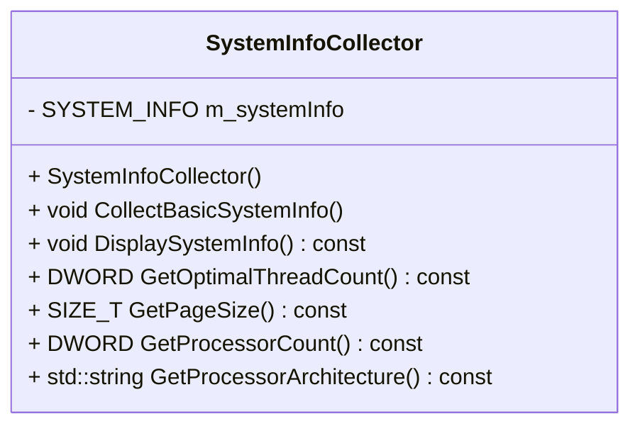
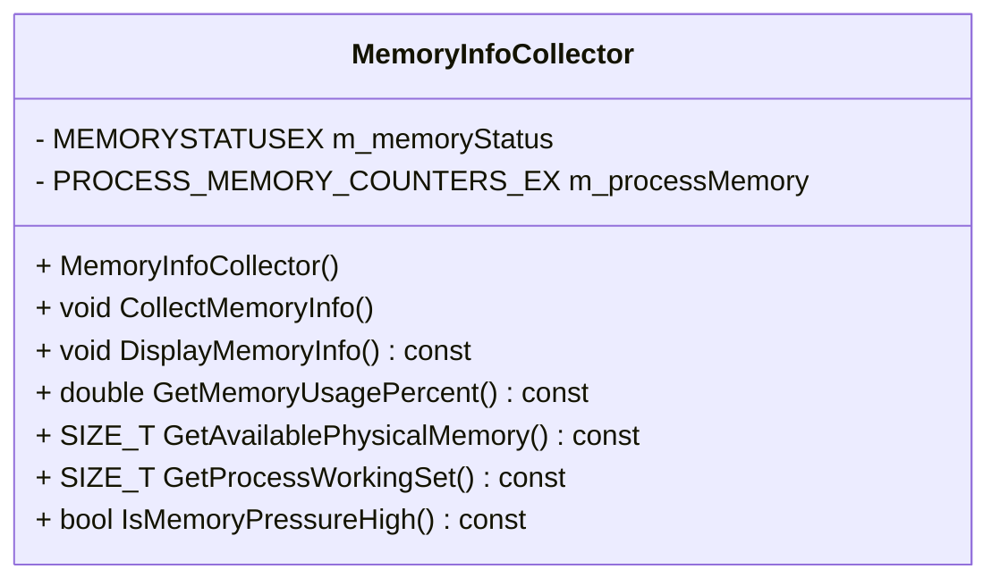

# 게임 서버 개발자를 위한 최신 Win32 API 프로그래밍  

저자: 최흥배, Claude AI   
    
권장 개발 환경
- **IDE**: Visual Studio 2022 (Community 이상)
- **컴파일러**: MSVC v143 (C++20 지원)
- **OS**: Windows 10 이상

-----  

# Chapter 8. 시스템 정보 수집
게임 서버 개발에서 시스템 정보 수집은 서버의 상태를 파악하고, 최적의 성능을 유지하며, 문제를 사전에 예방하는 핵심 요소이다. 이번 장에서는 Win32 API를 활용하여 다양한 시스템 정보를 수집하고 모니터링하는 방법을 알아보겠다.

## 8.1 GetSystemInfo를 통한 하드웨어 정보

### 8.1.1 시스템 정보의 중요성
게임 서버는 다음과 같은 이유로 시스템 정보를 파악해야 한다:

```
    게임 서버
        ↓
┌─────────────────┐     ┌─────────────────┐     ┌─────────────────┐
│   CPU 정보       │ →   │   메모리 정보    │ →    │   시스템 설정    │
│ - 코어 수        │     │ - 물리 메모리    │      │ - 페이지 크기    │
│ - 아키텍처       │     │ - 가용 메모리    │      │ - 프로세서 수    │
└─────────────────┘     └─────────────────┘     └─────────────────┘
        ↓                       ↓                       ↓
    스레드 풀 크기 결정      메모리 할당 전략         최적화 전략 수립
```
  
### 8.1.2 GetSystemInfo 함수 활용
`GetSystemInfo` 함수는 시스템의 기본적인 하드웨어 정보를 제공한다:

```cpp
// SystemInfoCollector.h
#pragma once
#include <windows.h>
#include <iostream>
#include <string>
#include <iomanip>

class SystemInfoCollector {
private:
    SYSTEM_INFO m_systemInfo;
    
public:
    SystemInfoCollector();
    void CollectBasicSystemInfo();
    void DisplaySystemInfo() const;
    
    // 게임 서버 최적화를 위한 정보 추출
    DWORD GetOptimalThreadCount() const;
    SIZE_T GetPageSize() const;
    DWORD GetProcessorCount() const;
    std::string GetProcessorArchitecture() const;
};
```

```cpp
// SystemInfoCollector.cpp
#include "SystemInfoCollector.h"

SystemInfoCollector::SystemInfoCollector() {
    ZeroMemory(&m_systemInfo, sizeof(SYSTEM_INFO));
}

void SystemInfoCollector::CollectBasicSystemInfo() {
    GetSystemInfo(&m_systemInfo);
}

void SystemInfoCollector::DisplaySystemInfo() const {
    std::cout << "\n";
    std::cout << "╔══════════════════════════════════════════════════════════════╗\n";
    std::cout << "║                     시스템 정보 보고서                        ║\n";
    std::cout << "╠══════════════════════════════════════════════════════════════╣\n";
    
    std::cout << "║ 프로세서 아키텍처: " << std::setw(39) << std::left 
              << GetProcessorArchitecture() << " ║\n";
    
    std::cout << "║ 프로세서 수:       " << std::setw(39) << std::left 
              << m_systemInfo.dwNumberOfProcessors << " ║\n";
    
    std::cout << "║ 페이지 크기:       " << std::setw(34) << std::left 
              << (m_systemInfo.dwPageSize / 1024) << " KB  ║\n";
    
    std::cout << "║ 최소 주소:         0x" << std::setw(36) << std::left 
              << std::hex << (uintptr_t)m_systemInfo.lpMinimumApplicationAddress 
              << std::dec << " ║\n";
    
    std::cout << "║ 최대 주소:         0x" << std::setw(36) << std::left 
              << std::hex << (uintptr_t)m_systemInfo.lpMaximumApplicationAddress 
              << std::dec << " ║\n";
    
    std::cout << "║ 활성 프로세서 마스크: 0x" << std::setw(34) << std::left 
              << std::hex << m_systemInfo.dwActiveProcessorMask << std::dec << " ║\n";
    
    std::cout << "║ 할당 단위:         " << std::setw(34) << std::left 
              << (m_systemInfo.dwAllocationGranularity / 1024) << " KB  ║\n";
    
    std::cout << "╚══════════════════════════════════════════════════════════════╝\n";
}

DWORD SystemInfoCollector::GetOptimalThreadCount() const {
    // 게임 서버에서는 보통 CPU 코어 수의 2배 정도의 스레드를 사용
    return m_systemInfo.dwNumberOfProcessors * 2;
}

SIZE_T SystemInfoCollector::GetPageSize() const {
    return m_systemInfo.dwPageSize;
}

DWORD SystemInfoCollector::GetProcessorCount() const {
    return m_systemInfo.dwNumberOfProcessors;
}

std::string SystemInfoCollector::GetProcessorArchitecture() const {
    switch (m_systemInfo.wProcessorArchitecture) {
        case PROCESSOR_ARCHITECTURE_AMD64:
            return "x64 (AMD64)";
        case PROCESSOR_ARCHITECTURE_ARM:
            return "ARM";
        case PROCESSOR_ARCHITECTURE_ARM64:
            return "ARM64";
        case PROCESSOR_ARCHITECTURE_IA64:
            return "Intel Itanium (IA64)";
        case PROCESSOR_ARCHITECTURE_INTEL:
            return "x86 (Intel)";
        default:
            return "Unknown";
    }
}
```
  
**Windows API의 `GetSystemInfo()` 함수**를 활용해 시스템의 기본 하드웨어 정보를 수집하고 표시하는 방법을 다룬다.
`GetSystemInfo`는 운영체제에서 제공하는 함수로, **CPU 아키텍처, 프로세서 수, 메모리 페이지 크기, 주소 범위 등**의 정보를 얻을 수 있다.

이 함수는 특히 **게임 서버나 멀티스레드 프로그램의 성능 최적화**에서 유용하다. 예를 들어, 서버의 CPU 코어 수를 기반으로 스레드 풀 크기를 결정할 수 있고, 페이지 크기(Page Size)를 이용해 메모리 관리 단위를 조정할 수도 있다.


아래 클래스는 `SystemInfoCollector`라는 이름으로 설계되어 있다.
이 클래스는 시스템 정보를 수집(`CollectBasicSystemInfo`)하고, 콘솔에 보기 좋게 출력(`DisplaySystemInfo`)하는 기능을 제공한다.




#### 1️⃣ 헤더 파일 (SystemInfoCollector.h)
이 파일은 클래스의 **인터페이스 정의**를 포함한다.

```cpp
#pragma once
#include <windows.h>
#include <iostream>
#include <string>
#include <iomanip>

class SystemInfoCollector {
private:
    SYSTEM_INFO m_systemInfo;   // Windows 시스템 정보 구조체
    
public:
    SystemInfoCollector();
    void CollectBasicSystemInfo();
    void DisplaySystemInfo() const;
    
    DWORD GetOptimalThreadCount() const;
    SIZE_T GetPageSize() const;
    DWORD GetProcessorCount() const;
    std::string GetProcessorArchitecture() const;
};
```

**핵심 포인트**

* `SYSTEM_INFO`는 Windows API에서 제공하는 구조체로, CPU 및 메모리 관련 정보를 담는다.
* `CollectBasicSystemInfo()`는 정보를 수집하고,
  `DisplaySystemInfo()`는 이를 시각적으로 출력한다.
* 나머지 `Get` 함수들은 게임 서버 최적화를 위해 개별 항목을 손쉽게 가져올 수 있도록 제공된다.


#### 2️⃣ 생성자 및 시스템 정보 수집

```cpp
SystemInfoCollector::SystemInfoCollector() {
    ZeroMemory(&m_systemInfo, sizeof(SYSTEM_INFO));
}

void SystemInfoCollector::CollectBasicSystemInfo() {
    GetSystemInfo(&m_systemInfo);
}
```

**설명**

* 생성자에서는 구조체를 0으로 초기화한다.
* `GetSystemInfo()`를 호출하면 운영체제가 현재 시스템의 정보를 채워 넣는다.

즉, 이 시점에서 `m_systemInfo`는 CPU 수, 페이지 크기, 메모리 주소 등 다양한 정보를 담게 된다.


#### 3️⃣ 시스템 정보 출력

```cpp
void SystemInfoCollector::DisplaySystemInfo() const {
    std::cout << "\n";
    std::cout << "╔══════════════════════════════════════════════════════════════╗\n";
    std::cout << "║                     시스템 정보 보고서                        ║\n";
    std::cout << "╠══════════════════════════════════════════════════════════════╣\n";
    
    std::cout << "║ 프로세서 아키텍처: " << std::setw(39) << std::left 
              << GetProcessorArchitecture() << " ║\n";
    
    std::cout << "║ 프로세서 수:       " << std::setw(39) << std::left 
              << m_systemInfo.dwNumberOfProcessors << " ║\n";
    
    std::cout << "║ 페이지 크기:       " << std::setw(34) << std::left 
              << (m_systemInfo.dwPageSize / 1024) << " KB  ║\n";
    
    std::cout << "║ 최소 주소:         0x" << std::setw(36) << std::left 
              << std::hex << (uintptr_t)m_systemInfo.lpMinimumApplicationAddress 
              << std::dec << " ║\n";
    
    std::cout << "║ 최대 주소:         0x" << std::setw(36) << std::left 
              << std::hex << (uintptr_t)m_systemInfo.lpMaximumApplicationAddress 
              << std::dec << " ║\n";
    
    std::cout << "║ 활성 프로세서 마스크: 0x" << std::setw(34) << std::left 
              << std::hex << m_systemInfo.dwActiveProcessorMask << std::dec << " ║\n";
    
    std::cout << "║ 할당 단위:         " << std::setw(34) << std::left 
              << (m_systemInfo.dwAllocationGranularity / 1024) << " KB  ║\n";
    
    std::cout << "╚══════════════════════════════════════════════════════════════╝\n";
}
```

**설명**

* 콘솔에 깔끔한 박스 형태의 보고서를 출력한다.
* `std::setw`와 `std::left`를 사용해 열 정렬을 맞춘다.
* `std::hex` / `std::dec`를 이용해 16진수 주소를 표시한다.
* 출력 예시는 다음과 같다.

```
╔══════════════════════════════════════════════════════════════╗
║                     시스템 정보 보고서                        ║
╠══════════════════════════════════════════════════════════════╣
║ 프로세서 아키텍처: x64 (AMD64)                              ║
║ 프로세서 수:       8                                        ║
║ 페이지 크기:       4 KB                                     ║
║ 최소 주소:         0x0000000000010000                       ║
║ 최대 주소:         0x00007FFFFFFEFFFF                       ║
║ 활성 프로세서 마스크: 0xFF                                 ║
║ 할당 단위:         64 KB                                   ║
╚══════════════════════════════════════════════════════════════╝
```


#### 4️⃣ 게임 서버 최적화 관련 함수

```cpp
DWORD SystemInfoCollector::GetOptimalThreadCount() const {
    // 게임 서버에서는 보통 CPU 코어 수의 2배 정도의 스레드를 사용
    return m_systemInfo.dwNumberOfProcessors * 2;
}

SIZE_T SystemInfoCollector::GetPageSize() const {
    return m_systemInfo.dwPageSize;
}

DWORD SystemInfoCollector::GetProcessorCount() const {
    return m_systemInfo.dwNumberOfProcessors;
}
```

**설명**

* `GetOptimalThreadCount()`는 CPU 코어 수를 기반으로 스레드 수를 계산한다.
  → 보통 게임 서버에서는 **코어 수 × 2** 정도가 효율적이다.
* `GetPageSize()`는 메모리 페이지 단위를 반환하여 메모리 풀 관리에 활용할 수 있다.


#### 5️⃣ CPU 아키텍처 판별

```cpp
std::string SystemInfoCollector::GetProcessorArchitecture() const {
    switch (m_systemInfo.wProcessorArchitecture) {
        case PROCESSOR_ARCHITECTURE_AMD64:
            return "x64 (AMD64)";
        case PROCESSOR_ARCHITECTURE_ARM:
            return "ARM";
        case PROCESSOR_ARCHITECTURE_ARM64:
            return "ARM64";
        case PROCESSOR_ARCHITECTURE_IA64:
            return "Intel Itanium (IA64)";
        case PROCESSOR_ARCHITECTURE_INTEL:
            return "x86 (Intel)";
        default:
            return "Unknown";
    }
}
```

**설명**

* 시스템의 CPU 아키텍처를 문자열 형태로 반환한다.
* 이를 통해 프로그램이 실행 중인 환경을 구체적으로 확인할 수 있다.


#### 🧠 정리

| 항목                            | 의미                | 활용 예시            |
| ----------------------------- | ----------------- | ---------------- |
| `dwNumberOfProcessors`        | CPU 코어 수          | 스레드 풀 크기 설정      |
| `dwPageSize`                  | 메모리 페이지 크기        | 메모리 풀 최적화        |
| `lpMinimumApplicationAddress` | 프로세스 접근 가능한 최소 주소 | 메모리 매핑 확인        |
| `lpMaximumApplicationAddress` | 프로세스 접근 가능한 최대 주소 | 가상 메모리 한계 확인     |
| `dwAllocationGranularity`     | 메모리 할당 단위         | 파일 매핑 시 블록 크기 조정 |
  
  
`GetSystemInfo()` 함수는 Windows 기반의 게임 서버나 시스템 관리 프로그램에서 매우 유용한 API다.
이를 통해 **CPU 아키텍처, 코어 수, 페이지 크기** 등 하드웨어 특성을 파악할 수 있으며,
이 정보를 활용해 **스레드 풀 크기 조정, 메모리 풀 관리, 최적화 정책 설계** 등을 수행할 수 있다.

즉, 이 클래스는 서버 프로그램이 실행되는 환경을 스스로 분석하여
최적의 성능을 낼 수 있도록 돕는 기초적인 시스템 진단 도구라고 할 수 있다.

  
### 8.1.3 메모리 정보 수집
게임 서버에서는 메모리 사용량을 지속적으로 모니터링해야 한다:

```cpp
// MemoryInfoCollector.h
#pragma once
#include <windows.h>
#include <psapi.h>
#include <iostream>
#include <iomanip>

#pragma comment(lib, "psapi.lib")

class MemoryInfoCollector {
private:
    MEMORYSTATUSEX m_memoryStatus;
    PROCESS_MEMORY_COUNTERS_EX m_processMemory;
    
public:
    MemoryInfoCollector();
    void CollectMemoryInfo();
    void DisplayMemoryInfo() const;
    
    // 게임 서버 메모리 관리를 위한 정보
    double GetMemoryUsagePercent() const;
    SIZE_T GetAvailablePhysicalMemory() const;
    SIZE_T GetProcessWorkingSet() const;
    bool IsMemoryPressureHigh() const;
};
```

```cpp
// MemoryInfoCollector.cpp
#include "MemoryInfoCollector.h"

MemoryInfoCollector::MemoryInfoCollector() {
    m_memoryStatus.dwLength = sizeof(MEMORYSTATUSEX);
    ZeroMemory(&m_processMemory, sizeof(PROCESS_MEMORY_COUNTERS_EX));
}

void MemoryInfoCollector::CollectMemoryInfo() {
    // 전체 시스템 메모리 정보
    GlobalMemoryStatusEx(&m_memoryStatus);
    
    // 현재 프로세스의 메모리 정보
    HANDLE hProcess = GetCurrentProcess();
    GetProcessMemoryInfo(hProcess, 
                        (PROCESS_MEMORY_COUNTERS*)&m_processMemory, 
                        sizeof(PROCESS_MEMORY_COUNTERS_EX));
}

void MemoryInfoCollector::DisplayMemoryInfo() const {
    std::cout << "\n";
    std::cout << "╔══════════════════════════════════════════════════════════════╗\n";
    std::cout << "║                     메모리 정보 보고서                        ║\n";
    std::cout << "╠══════════════════════════════════════════════════════════════╣\n";
    
    // 물리 메모리 정보
    std::cout << "║ 전체 물리 메모리:   " << std::setw(30) << std::left 
              << (m_memoryStatus.ullTotalPhys / (1024 * 1024)) << " MB      ║\n";
    
    std::cout << "║ 사용 가능 물리:     " << std::setw(30) << std::left 
              << (m_memoryStatus.ullAvailPhys / (1024 * 1024)) << " MB      ║\n";
    
    std::cout << "║ 메모리 사용률:      " << std::setw(30) << std::left 
              << m_memoryStatus.dwMemoryLoad << " %       ║\n";
    
    // 가상 메모리 정보  
    std::cout << "║ 전체 가상 메모리:   " << std::setw(30) << std::left 
              << (m_memoryStatus.ullTotalVirtual / (1024 * 1024)) << " MB      ║\n";
    
    std::cout << "║ 사용 가능 가상:     " << std::setw(30) << std::left 
              << (m_memoryStatus.ullAvailVirtual / (1024 * 1024)) << " MB      ║\n";
    
    // 프로세스 메모리 정보
    std::cout << "╠══════════════════════════════════════════════════════════════╣\n";
    std::cout << "║ 프로세스 워킹셋:    " << std::setw(30) << std::left 
              << (m_processMemory.WorkingSetSize / (1024 * 1024)) << " MB      ║\n";
    
    std::cout << "║ 프로세스 피크 워킹셋: " << std::setw(28) << std::left 
              << (m_processMemory.PeakWorkingSetSize / (1024 * 1024)) << " MB      ║\n";
    
    std::cout << "║ 페이지파일 사용량:  " << std::setw(30) << std::left 
              << (m_processMemory.PagefileUsage / (1024 * 1024)) << " MB      ║\n";
    
    std::cout << "╚══════════════════════════════════════════════════════════════╝\n";
    
    // 메모리 압박 상황 표시
    if (IsMemoryPressureHigh()) {
        std::cout << "\n⚠️  경고: 메모리 사용률이 높습니다! (>" << 80 << "%)\n";
    }
}

double MemoryInfoCollector::GetMemoryUsagePercent() const {
    return static_cast<double>(m_memoryStatus.dwMemoryLoad);
}

SIZE_T MemoryInfoCollector::GetAvailablePhysicalMemory() const {
    return m_memoryStatus.ullAvailPhys;
}

SIZE_T MemoryInfoCollector::GetProcessWorkingSet() const {
    return m_processMemory.WorkingSetSize;
}

bool MemoryInfoCollector::IsMemoryPressureHigh() const {
    return m_memoryStatus.dwMemoryLoad > 80;
}
```
   
게임 서버나 대규모 온라인 시스템에서는 **메모리 사용량을 지속적으로 모니터링**해야 한다.
메모리는 한정된 자원이기 때문에, 과도한 사용이나 누수(memory leak)가 발생하면 서버의 안정성이 급격히 떨어진다.
이를 방지하기 위해 시스템 전체 메모리뿐만 아니라 **현재 프로세스가 사용하는 메모리량**까지 정기적으로 점검해야 한다.

이번 예제는 Windows API를 이용해 이러한 정보를 수집하고, 보기 좋은 형태로 출력하는 `MemoryInfoCollector` 클래스를 구현한 코드이다.

이 클래스는 시스템 전체와 현재 프로세스의 메모리 정보를 모두 수집한다.
아래는 클래스 구조를 나타낸 다이어그램이다.



* `MEMORYSTATUSEX`: 시스템 전체 메모리 상태를 담는 구조체이다.
* `PROCESS_MEMORY_COUNTERS_EX`: 현재 실행 중인 프로세스(서버 프로그램)의 메모리 사용량을 담는다.


#### 1️⃣ 헤더 파일 구조 (MemoryInfoCollector.h)

```cpp
#pragma once
#include <windows.h>
#include <psapi.h>
#include <iostream>
#include <iomanip>

#pragma comment(lib, "psapi.lib")

class MemoryInfoCollector {
private:
    MEMORYSTATUSEX m_memoryStatus;
    PROCESS_MEMORY_COUNTERS_EX m_processMemory;
    
public:
    MemoryInfoCollector();
    void CollectMemoryInfo();
    void DisplayMemoryInfo() const;
    
    double GetMemoryUsagePercent() const;
    SIZE_T GetAvailablePhysicalMemory() const;
    SIZE_T GetProcessWorkingSet() const;
    bool IsMemoryPressureHigh() const;
};
```

**설명**

* `psapi.h` 헤더는 프로세스의 메모리 사용량을 얻기 위한 함수(`GetProcessMemoryInfo`)를 제공한다.
* `#pragma comment(lib, "psapi.lib")`는 해당 라이브러리를 링커에 자동으로 추가하도록 한다.
* 이 클래스는 시스템 메모리(`m_memoryStatus`)와 프로세스 메모리(`m_processMemory`)를 함께 관리한다.


#### 2️⃣ 생성자와 메모리 정보 수집

```cpp
MemoryInfoCollector::MemoryInfoCollector() {
    m_memoryStatus.dwLength = sizeof(MEMORYSTATUSEX);
    ZeroMemory(&m_processMemory, sizeof(PROCESS_MEMORY_COUNTERS_EX));
}

void MemoryInfoCollector::CollectMemoryInfo() {
    GlobalMemoryStatusEx(&m_memoryStatus);
    
    HANDLE hProcess = GetCurrentProcess();
    GetProcessMemoryInfo(hProcess, 
                        (PROCESS_MEMORY_COUNTERS*)&m_processMemory, 
                        sizeof(PROCESS_MEMORY_COUNTERS_EX));
}
```

**설명**

* `GlobalMemoryStatusEx()`는 시스템 전체의 메모리 상태를 가져온다.
  (예: 전체 물리 메모리, 사용 가능 메모리, 메모리 사용률 등)
* `GetProcessMemoryInfo()`는 현재 실행 중인 프로그램의 메모리 사용 현황을 가져온다.
* 이 두 함수를 통해 **“시스템 수준”과 “프로세스 수준”의 메모리 상태를 모두 확인**할 수 있다.


#### 3️⃣ 메모리 정보 출력

```cpp
void MemoryInfoCollector::DisplayMemoryInfo() const {
    std::cout << "\n";
    std::cout << "╔══════════════════════════════════════════════════════════════╗\n";
    std::cout << "║                     메모리 정보 보고서                        ║\n";
    std::cout << "╠══════════════════════════════════════════════════════════════╣\n";
    
    std::cout << "║ 전체 물리 메모리:   " << std::setw(30) << std::left 
              << (m_memoryStatus.ullTotalPhys / (1024 * 1024)) << " MB      ║\n";
    
    std::cout << "║ 사용 가능 물리:     " << std::setw(30) << std::left 
              << (m_memoryStatus.ullAvailPhys / (1024 * 1024)) << " MB      ║\n";
    
    std::cout << "║ 메모리 사용률:      " << std::setw(30) << std::left 
              << m_memoryStatus.dwMemoryLoad << " %       ║\n";
```

**설명 (1/2)**

* 물리 메모리 정보(전체, 남은 양, 사용률)를 표시한다.
* `ullTotalPhys`와 `ullAvailPhys`는 바이트 단위로 제공되므로 MB로 변환한다.
* `dwMemoryLoad`는 시스템 전체 메모리 사용률(%)이다.

**설명 (2/2)**
가상 메모리 및 프로세스 정보도 이어서 출력한다.

```cpp
    std::cout << "║ 전체 가상 메모리:   " << std::setw(30) << std::left 
              << (m_memoryStatus.ullTotalVirtual / (1024 * 1024)) << " MB      ║\n";
    std::cout << "║ 사용 가능 가상:     " << std::setw(30) << std::left 
              << (m_memoryStatus.ullAvailVirtual / (1024 * 1024)) << " MB      ║\n";

    std::cout << "╠══════════════════════════════════════════════════════════════╣\n";
    std::cout << "║ 프로세스 워킹셋:    " << std::setw(30) << std::left 
              << (m_processMemory.WorkingSetSize / (1024 * 1024)) << " MB      ║\n";
    std::cout << "║ 프로세스 피크 워킹셋: " << std::setw(28) << std::left 
              << (m_processMemory.PeakWorkingSetSize / (1024 * 1024)) << " MB      ║\n";
    std::cout << "║ 페이지파일 사용량:  " << std::setw(30) << std::left 
              << (m_processMemory.PagefileUsage / (1024 * 1024)) << " MB      ║\n";
    std::cout << "╚══════════════════════════════════════════════════════════════╝\n";
    
    if (IsMemoryPressureHigh()) {
        std::cout << "\n⚠️  경고: 메모리 사용률이 높습니다! (>" << 80 << "%)\n";
    }
}
```

**출력 예시**

```
╔══════════════════════════════════════════════════════════════╗
║                     메모리 정보 보고서                        ║
╠══════════════════════════════════════════════════════════════╣
║ 전체 물리 메모리:   16384 MB                                 ║
║ 사용 가능 물리:     8250 MB                                  ║
║ 메모리 사용률:      49 %                                     ║
║ 전체 가상 메모리:   134217728 MB                             ║
║ 사용 가능 가상:     134216320 MB                             ║
╠══════════════════════════════════════════════════════════════╣
║ 프로세스 워킹셋:    250 MB                                   ║
║ 프로세스 피크 워킹셋: 310 MB                                 ║
║ 페이지파일 사용량:  400 MB                                   ║
╚══════════════════════════════════════════════════════════════╝
```


#### 4️⃣ 메모리 관련 유틸리티 함수들

```cpp
double MemoryInfoCollector::GetMemoryUsagePercent() const {
    return static_cast<double>(m_memoryStatus.dwMemoryLoad);
}

SIZE_T MemoryInfoCollector::GetAvailablePhysicalMemory() const {
    return m_memoryStatus.ullAvailPhys;
}

SIZE_T MemoryInfoCollector::GetProcessWorkingSet() const {
    return m_processMemory.WorkingSetSize;
}

bool MemoryInfoCollector::IsMemoryPressureHigh() const {
    return m_memoryStatus.dwMemoryLoad > 80;
}
```

**설명**

* `GetMemoryUsagePercent()` : 시스템 전체 메모리 사용률을 반환한다.
* `GetAvailablePhysicalMemory()` : 현재 사용 가능한 물리 메모리의 바이트 수를 반환한다.
* `GetProcessWorkingSet()` : 현재 프로세스의 워킹셋(실제 메모리 상주량)을 반환한다.
* `IsMemoryPressureHigh()` : 메모리 사용률이 80%를 넘는지 검사해, 과도한 부하 상태인지 판단한다.


#### 🧠 전체 동작 흐름 요약
아래 ASCII 다이어그램은 `MemoryInfoCollector`의 동작 과정을 나타낸 것이다.

```
┌─────────────────────────────┐
│ MemoryInfoCollector 생성자   │
│ (구조체 초기화)               │
└──────────────┬──────────────┘
               │
               ▼
┌─────────────────────────────┐
│ CollectMemoryInfo() 호출     │
│ ├─ GlobalMemoryStatusEx()   │
│ └─ GetProcessMemoryInfo()   │
└──────────────┬──────────────┘
               │
               ▼
┌─────────────────────────────┐
│ DisplayMemoryInfo() 출력     │
│ ├─ 시스템 메모리 정보 표시     │
│ ├─ 프로세스 메모리 정보 표시   │
│ └─ 경고 메시지 출력 (조건부)   │
└─────────────────────────────┘
```


#### 🎯 결론
`MemoryInfoCollector` 클래스는 게임 서버의 **안정성과 효율성을 유지하기 위한 핵심 도구**이다.
이 클래스를 통해 개발자는

* 시스템 전체 메모리 사용률을 파악하고,
* 서버 프로세스의 실제 메모리 점유량을 모니터링하며,
* 과도한 메모리 사용 시 즉시 경고를 출력할 수 있다.

결국 이 코드는 단순한 정보 수집기가 아니라,
**게임 서버의 상태를 실시간으로 진단하고 장애를 예방하는 안전 장치**라고 할 수 있다.


</br>  
  

## 8.2 WMI를 이용한 시스템 모니터링

### 8.2.1 WMI (Windows Management Instrumentation) 소개
WMI는 Windows 시스템의 관리 정보에 액세스할 수 있는 강력한 인터페이스이다:

```
    WMI 아키텍처
         ↓
┌─────────────────┐
│   WMI Client    │ ← 우리의 게임 서버 애플리케이션
│  (Game Server)  │
└─────────────────┘
         ↓ COM Interface
┌─────────────────┐
│   WMI Service   │ ← Windows Management Service  
└─────────────────┘
         ↓
┌─────────────────┐
│  WMI Providers  │ ← 시스템 정보 제공자들
│ - Registry      │
│ - File System   │  
│ - Performance   │
│ - Network       │
└─────────────────┘
```

### 8.2.2 WMI를 이용한 CPU 정보 수집

```cpp
// WMISystemMonitor.h
#pragma once
#include <windows.h>
#include <comdef.h>
#include <Wbemidl.h>
#include <iostream>
#include <string>
#include <vector>

#pragma comment(lib, "wbemuuid.lib")

class WMISystemMonitor {
private:
    IWbemLocator* m_pLoc;
    IWbemServices* m_pSvc;
    bool m_bInitialized;
    
public:
    WMISystemMonitor();
    ~WMISystemMonitor();
    
    bool Initialize();
    void Cleanup();
    
    // CPU 정보 수집
    void GetCPUInfo();
    void GetCPUUsage();
    
    // 시스템 프로세스 정보
    void GetRunningProcesses();
    
    // 네트워크 정보
    void GetNetworkAdapters();
    
private:
    std::string BSTRToString(BSTR bstr);
    void DisplayCPUInfo(IWbemClassObject* pclsObj);
};
```

```cpp
// WMISystemMonitor.cpp
#include "WMISystemMonitor.h"

WMISystemMonitor::WMISystemMonitor() 
    : m_pLoc(nullptr), m_pSvc(nullptr), m_bInitialized(false) {
}

WMISystemMonitor::~WMISystemMonitor() {
    Cleanup();
}

bool WMISystemMonitor::Initialize() {
    HRESULT hres;
    
    // COM 초기화
    hres = CoInitializeEx(0, COINIT_MULTITHREADED);
    if (FAILED(hres)) {
        std::cout << "COM 초기화 실패: 0x" << std::hex << hres << std::endl;
        return false;
    }
    
    // COM 보안 초기화
    hres = CoInitializeSecurity(
        NULL,
        -1,                          // COM authentication
        NULL,                        // Authentication services
        NULL,                        // Reserved
        RPC_C_AUTHN_LEVEL_NONE,      // Default authentication 
        RPC_C_IMP_LEVEL_IMPERSONATE, // Default Impersonation  
        NULL,                        // Authentication info
        EOAC_NONE,                   // Additional capabilities 
        NULL                         // Reserved
    );
    
    if (FAILED(hres)) {
        std::cout << "COM 보안 초기화 실패: 0x" << std::hex << hres << std::endl;
        CoUninitialize();
        return false;
    }
    
    // WMI Locator 생성
    hres = CoCreateInstance(
        CLSID_WbemLocator,
        0,
        CLSCTX_INPROC_SERVER,
        IID_IWbemLocator, 
        (LPVOID*)&m_pLoc
    );
    
    if (FAILED(hres)) {
        std::cout << "WMI Locator 생성 실패: 0x" << std::hex << hres << std::endl;
        CoUninitialize();
        return false;
    }
    
    // WMI 서비스 연결
    hres = m_pLoc->ConnectServer(
        _bstr_t(L"ROOT\\CIMV2"), // WMI namespace
        NULL,                    // User name
        NULL,                    // User password
        0,                       // Locale
        NULL,                    // Security flags
        0,                       // Authority
        0,                       // Context object 
        &m_pSvc                  // pointer to IWbemServices proxy
    );
    
    if (FAILED(hres)) {
        std::cout << "WMI 서비스 연결 실패: 0x" << std::hex << hres << std::endl;
        m_pLoc->Release();
        CoUninitialize();
        return false;
    }
    
    // 프록시 보안 설정
    hres = CoSetProxyBlanket(
        m_pSvc,                        // Indicates the proxy to set
        RPC_C_AUTHN_WINNT,            // RPC_C_AUTHN_xxx
        RPC_C_AUTHZ_NONE,             // RPC_C_AUTHZ_xxx
        NULL,                         // Server principal name 
        RPC_C_AUTHN_LEVEL_CALL,       // RPC_C_AUTHN_LEVEL_xxx 
        RPC_C_IMP_LEVEL_IMPERSONATE,  // RPC_C_IMP_LEVEL_xxx
        NULL,                         // client identity
        EOAC_NONE                     // proxy capabilities 
    );
    
    if (FAILED(hres)) {
        std::cout << "프록시 보안 설정 실패: 0x" << std::hex << hres << std::endl;
        m_pSvc->Release();
        m_pLoc->Release();
        CoUninitialize();
        return false;
    }
    
    m_bInitialized = true;
    return true;
}

void WMISystemMonitor::GetCPUInfo() {
    if (!m_bInitialized) {
        std::cout << "WMI가 초기화되지 않았습니다.\n";
        return;
    }
    
    HRESULT hres;
    IEnumWbemClassObject* pEnumerator = NULL;
    
    // CPU 정보 쿼리
    hres = m_pSvc->ExecQuery(
        bstr_t("WQL"),
        bstr_t("SELECT * FROM Win32_Processor"),
        WBEM_FLAG_FORWARD_ONLY | WBEM_FLAG_RETURN_IMMEDIATELY,
        NULL,
        &pEnumerator
    );
    
    if (FAILED(hres)) {
        std::cout << "CPU 정보 쿼리 실패: 0x" << std::hex << hres << std::endl;
        return;
    }
    
    std::cout << "\n";
    std::cout << "╔══════════════════════════════════════════════════════════════╗\n";
    std::cout << "║                      CPU 정보 (WMI)                         ║\n";
    std::cout << "╠══════════════════════════════════════════════════════════════╣\n";
    
    IWbemClassObject *pclsObj = NULL;
    ULONG uReturn = 0;
    
    while (pEnumerator) {
        HRESULT hr = pEnumerator->Next(WBEM_INFINITE, 1, &pclsObj, &uReturn);
        
        if (0 == uReturn) {
            break;
        }
        
        DisplayCPUInfo(pclsObj);
        pclsObj->Release();
    }
    
    std::cout << "╚══════════════════════════════════════════════════════════════╝\n";
    
    pEnumerator->Release();
}

void WMISystemMonitor::DisplayCPUInfo(IWbemClassObject* pclsObj) {
    VARIANT vtProp;
    
    // CPU 이름
    HRESULT hr = pclsObj->Get(L"Name", 0, &vtProp, 0, 0);
    if (SUCCEEDED(hr) && vtProp.vt == VT_BSTR) {
        std::cout << "║ CPU 이름: " << BSTRToString(vtProp.bstrVal) << std::endl;
    }
    VariantClear(&vtProp);
    
    // 제조사
    hr = pclsObj->Get(L"Manufacturer", 0, &vtProp, 0, 0);
    if (SUCCEEDED(hr) && vtProp.vt == VT_BSTR) {
        std::cout << "║ 제조사: " << BSTRToString(vtProp.bstrVal) << std::endl;
    }
    VariantClear(&vtProp);
    
    // 코어 수
    hr = pclsObj->Get(L"NumberOfCores", 0, &vtProp, 0, 0);
    if (SUCCEEDED(hr)) {
        std::cout << "║ 코어 수: " << vtProp.uintVal << std::endl;
    }
    VariantClear(&vtProp);
    
    // 논리 프로세서 수
    hr = pclsObj->Get(L"NumberOfLogicalProcessors", 0, &vtProp, 0, 0);
    if (SUCCEEDED(hr)) {
        std::cout << "║ 논리 프로세서 수: " << vtProp.uintVal << std::endl;
    }
    VariantClear(&vtProp);
    
    // 최대 클럭 속도
    hr = pclsObj->Get(L"MaxClockSpeed", 0, &vtProp, 0, 0);
    if (SUCCEEDED(hr)) {
        std::cout << "║ 최대 클럭 속도: " << vtProp.uintVal << " MHz" << std::endl;
    }
    VariantClear(&vtProp);
    
    // L3 캐시 크기
    hr = pclsObj->Get(L"L3CacheSize", 0, &vtProp, 0, 0);
    if (SUCCEEDED(hr)) {
        std::cout << "║ L3 캐시: " << vtProp.uintVal << " KB" << std::endl;
    }
    VariantClear(&vtProp);
}

std::string WMISystemMonitor::BSTRToString(BSTR bstr) {
    if (!bstr) return "";
    
    int len = WideCharToMultiByte(CP_UTF8, 0, bstr, -1, nullptr, 0, nullptr, nullptr);
    std::string result(len, 0);
    WideCharToMultiByte(CP_UTF8, 0, bstr, -1, &result[0], len, nullptr, nullptr);
    result.resize(len - 1); // null terminator 제거
    return result;
}

void WMISystemMonitor::Cleanup() {
    if (m_pSvc) {
        m_pSvc->Release();
        m_pSvc = nullptr;
    }
    
    if (m_pLoc) {
        m_pLoc->Release();
        m_pLoc = nullptr;
    }
    
    if (m_bInitialized) {
        CoUninitialize();
        m_bInitialized = false;
    }
}
```
    
</br>  
  
## 8.3 네트워크 인터페이스 정보 수집

### 8.3.1 네트워크 모니터링의 중요성
게임 서버에서 네트워크 상태는 매우 중요하다:

```
    네트워크 모니터링 대상
              ↓
┌─────────────────┐    ┌─────────────────┐    ┌─────────────────┐
│ 대역폭 사용량   │    │   연결 상태     │    │  패킷 손실률    │
│ - 송신/수신     │    │ - 활성 연결     │    │ - 에러율        │
│ - 피크 시간대   │    │ - 대기 연결     │    │ - 재전송률      │
└─────────────────┘    └─────────────────┘    └─────────────────┘
        ↓                      ↓                      ↓
  서버 용량 계획        연결 풀 관리           네트워크 최적화
```

### 8.3.2 IP Helper API를 이용한 네트워크 정보 수집

```cpp
// NetworkInfoCollector.h
#pragma once
#include <windows.h>
#include <iphlpapi.h>
#include <iostream>
#include <vector>
#include <string>
#include <iomanip>

#pragma comment(lib, "iphlpapi.lib")

struct NetworkAdapterInfo {
    std::string friendlyName;
    std::string description;
    std::string physicalAddress;
    DWORD type;
    DWORD operStatus;
    ULONG64 bytesReceived;
    ULONG64 bytesSent;
    ULONG64 packetsReceived;
    ULONG64 packetsSent;
};

class NetworkInfoCollector {
private:
    std::vector<NetworkAdapterInfo> m_adapters;
    
public:
    NetworkInfoCollector();
    ~NetworkInfoCollector();
    
    bool CollectNetworkInfo();
    void DisplayNetworkInfo() const;
    void DisplayNetworkStatistics() const;
    
    // 게임 서버용 네트워크 모니터링
    ULONG64 GetTotalBytesReceived() const;
    ULONG64 GetTotalBytesSent() const;
    double GetNetworkUtilization(DWORD adapterIndex) const;
    
private:
    std::string GetAdapterTypeString(DWORD type) const;
    std::string GetOperStatusString(DWORD status) const;
    std::string FormatMacAddress(const BYTE* addr, DWORD length) const;
    std::string FormatBytes(ULONG64 bytes) const;
};
```

```cpp
// NetworkInfoCollector.cpp
#include "NetworkInfoCollector.h"

NetworkInfoCollector::NetworkInfoCollector() {
}

NetworkInfoCollector::~NetworkInfoCollector() {
}

bool NetworkInfoCollector::CollectNetworkInfo() {
    m_adapters.clear();
    
    // 어댑터 정보 크기 얻기
    DWORD dwSize = 0;
    DWORD dwRetVal = GetAdaptersAddresses(AF_UNSPEC, 
                                         GAA_FLAG_INCLUDE_PREFIX, 
                                         NULL, 
                                         NULL, 
                                         &dwSize);
    
    if (dwRetVal != ERROR_BUFFER_OVERFLOW) {
        std::cout << "GetAdaptersAddresses 크기 조회 실패: " << dwRetVal << std::endl;
        return false;
    }
    
    // 메모리 할당
    PIP_ADAPTER_ADDRESSES pAddresses = (IP_ADAPTER_ADDRESSES*)malloc(dwSize);
    if (!pAddresses) {
        std::cout << "메모리 할당 실패\n";
        return false;
    }
    
    // 어댑터 정보 수집
    dwRetVal = GetAdaptersAddresses(AF_UNSPEC,
                                   GAA_FLAG_INCLUDE_PREFIX,
                                   NULL,
                                   pAddresses,
                                   &dwSize);
    
    if (dwRetVal != NO_ERROR) {
        std::cout << "GetAdaptersAddresses 실패: " << dwRetVal << std::endl;
        free(pAddresses);
        return false;
    }
    
    // 어댑터 정보 파싱
    PIP_ADAPTER_ADDRESSES pCurrAddresses = pAddresses;
    while (pCurrAddresses) {
        NetworkAdapterInfo info;
        
        // 이름 변환 (Wide char to Multi-byte)
        if (pCurrAddresses->FriendlyName) {
            int len = WideCharToMultiByte(CP_UTF8, 0, 
                                        pCurrAddresses->FriendlyName, -1, 
                                        nullptr, 0, nullptr, nullptr);
            if (len > 0) {
                std::string temp(len, 0);
                WideCharToMultiByte(CP_UTF8, 0, 
                                  pCurrAddresses->FriendlyName, -1, 
                                  &temp[0], len, nullptr, nullptr);
                info.friendlyName = temp.c_str(); // null terminator 제거
            }
        }
        
        info.description = pCurrAddresses->Description ? 
                          pCurrAddresses->Description : "Unknown";
        
        info.physicalAddress = FormatMacAddress(
            pCurrAddresses->PhysicalAddress,
            pCurrAddresses->PhysicalAddressLength
        );
        
        info.type = pCurrAddresses->IfType;
        info.operStatus = pCurrAddresses->OperStatus;
        
        // 통계 정보는 별도 API로 수집
        MIB_IF_ROW2 ifRow;
        ZeroMemory(&ifRow, sizeof(MIB_IF_ROW2));
        ifRow.InterfaceIndex = pCurrAddresses->IfIndex;
        
        if (GetIfEntry2(&ifRow) == NO_ERROR) {
            info.bytesReceived = ifRow.InOctets;
            info.bytesSent = ifRow.OutOctets;
            info.packetsReceived = ifRow.InUcastPkts;
            info.packetsSent = ifRow.OutUcastPkts;
        }
        
        m_adapters.push_back(info);
        pCurrAddresses = pCurrAddresses->Next;
    }
    
    free(pAddresses);
    return true;
}

void NetworkInfoCollector::DisplayNetworkInfo() const {
    std::cout << "\n";
    std::cout << "╔══════════════════════════════════════════════════════════════╗\n";
    std::cout << "║                   네트워크 어댑터 정보                        ║\n";
    std::cout << "╠══════════════════════════════════════════════════════════════╣\n";
    
    for (size_t i = 0; i < m_adapters.size(); ++i) {
        const auto& adapter = m_adapters[i];
        
        std::cout << "║ 어댑터 #" << (i + 1) << std::endl;
        std::cout << "║ ├─ 이름: " << adapter.friendlyName << std::endl;
        std::cout << "║ ├─ 설명: " << adapter.description << std::endl;
        std::cout << "║ ├─ MAC 주소: " << adapter.physicalAddress << std::endl;
        std::cout << "║ ├─ 타입: " << GetAdapterTypeString(adapter.type) << std::endl;
        std::cout << "║ └─ 상태: " << GetOperStatusString(adapter.operStatus) << std::endl;
        
        if (i < m_adapters.size() - 1) {
            std::cout << "║" << std::endl;
        }
    }
    
    std::cout << "╚══════════════════════════════════════════════════════════════╝\n";
}

void NetworkInfoCollector::DisplayNetworkStatistics() const {
    std::cout << "\n";
    std::cout << "╔══════════════════════════════════════════════════════════════╗\n";
    std::cout << "║                   네트워크 통계 정보                          ║\n";
    std::cout << "╠══════════════════════════════════════════════════════════════╣\n";
    
    ULONG64 totalReceived = 0;
    ULONG64 totalSent = 0;
    
    for (size_t i = 0; i < m_adapters.size(); ++i) {
        const auto& adapter = m_adapters[i];
        
        // 활성 어댑터만 표시
        if (adapter.operStatus == IfOperStatusUp) {
            std::cout << "║ " << adapter.friendlyName << std::endl;
            std::cout << "║ ├─ 수신: " << FormatBytes(adapter.bytesReceived) 
                      << " (" << adapter.packetsReceived << " 패킷)" << std::endl;
            std::cout << "║ └─ 송신: " << FormatBytes(adapter.bytesSent) 
                      << " (" << adapter.packetsSent << " 패킷)" << std::endl;
            std::cout << "║" << std::endl;
            
            totalReceived += adapter.bytesReceived;
            totalSent += adapter.bytesSent;
        }
    }
    
    std::cout << "║ 전체 통계:" << std::endl;
    std::cout << "║ ├─ 총 수신: " << FormatBytes(totalReceived) << std::endl;
    std::cout << "║ └─ 총 송신: " << FormatBytes(totalSent) << std::endl;
    
    std::cout << "╚══════════════════════════════════════════════════════════════╝\n";
}

std::string NetworkInfoCollector::GetAdapterTypeString(DWORD type) const {
    switch (type) {
        case IF_TYPE_ETHERNET_CSMACD: return "이더넷";
        case IF_TYPE_IEEE80211: return "무선 LAN";
        case IF_TYPE_SOFTWARE_LOOPBACK: return "루프백";
        case IF_TYPE_TUNNEL: return "터널";
        case IF_TYPE_PPP: return "PPP";
        default: return "기타 (" + std::to_string(type) + ")";
    }
}

std::string NetworkInfoCollector::GetOperStatusString(DWORD status) const {
    switch (status) {
        case IfOperStatusUp: return "활성";
        case IfOperStatusDown: return "비활성";
        case IfOperStatusTesting: return "테스트 중";
        case IfOperStatusUnknown: return "알 수 없음";
        case IfOperStatusDormant: return "대기";
        case IfOperStatusNotPresent: return "없음";
        case IfOperStatusLowerLayerDown: return "하위 계층 다운";
        default: return "정의되지 않음";
    }
}

std::string NetworkInfoCollector::FormatMacAddress(const BYTE* addr, DWORD length) const {
    if (!addr || length == 0) {
        return "N/A";
    }
    
    std::string result;
    for (DWORD i = 0; i < length; ++i) {
        if (i > 0) result += ":";
        
        char hex[3];
        sprintf_s(hex, "%02X", addr[i]);
        result += hex;
    }
    
    return result;
}

std::string NetworkInfoCollector::FormatBytes(ULONG64 bytes) const {
    const char* units[] = {"B", "KB", "MB", "GB", "TB"};
    double size = static_cast<double>(bytes);
    int unitIndex = 0;
    
    while (size >= 1024.0 && unitIndex < 4) {
        size /= 1024.0;
        unitIndex++;
    }
    
    char buffer[64];
    sprintf_s(buffer, "%.2f %s", size, units[unitIndex]);
    return std::string(buffer);
}

ULONG64 NetworkInfoCollector::GetTotalBytesReceived() const {
    ULONG64 total = 0;
    for (const auto& adapter : m_adapters) {
        if (adapter.operStatus == IfOperStatusUp) {
            total += adapter.bytesReceived;
        }
    }
    return total;
}

ULONG64 NetworkInfoCollector::GetTotalBytesSent() const {
    ULONG64 total = 0;
    for (const auto& adapter : m_adapters) {
        if (adapter.operStatus == IfOperStatusUp) {
            total += adapter.bytesSent;
        }
    }
    return total;
}
```
  
</br>  
  
## 8.4 실시간 리소스 모니터링 도구 제작

### 8.4.1 실시간 모니터링 아키텍처
게임 서버를 위한 실시간 모니터링 시스템을 구축해보겠다:

```
    실시간 모니터링 시스템
              ↓
┌─────────────────┐    ┌─────────────────┐    ┌─────────────────┐
│  데이터 수집기  │ →  │   데이터 저장   │ →  │   알림 시스템   │
│ - CPU 사용률    │    │ - 메모리 DB     │    │ - 임계값 감시   │
│ - 메모리 사용률 │    │ - 순환 버퍼     │    │ - 로그 기록     │
│ - 네트워크 I/O  │    │ - 압축 저장     │    │ - 관리자 통지   │
│ - 디스크 I/O    │    └─────────────────┘    └─────────────────┘
└─────────────────┘
        ↓
┌─────────────────┐
│   실시간 출력   │
│ - 콘솔 디스플레이│
│ - 웹 대시보드   │
│ - 그래프 차트   │
└─────────────────┘
```

### 8.4.2 실시간 모니터링 도구 구현

```cpp
// RealTimeMonitor.h
#pragma once
#include <windows.h>
#include <pdh.h>
#include <iostream>
#include <vector>
#include <string>
#include <thread>
#include <atomic>
#include <chrono>
#include <queue>
#include <mutex>
#include <iomanip>

#pragma comment(lib, "pdh.lib")

struct SystemMetrics {
    double cpuUsage;
    double memoryUsage;
    ULONG64 networkBytesReceived;
    ULONG64 networkBytesSent;
    double diskReadRate;
    double diskWriteRate;
    std::chrono::steady_clock::time_point timestamp;
};

class RealTimeMonitor {
private:
    // PDH 핸들
    PDH_HQUERY m_hQuery;
    PDH_HCOUNTER m_hCpuCounter;
    PDH_HCOUNTER m_hMemoryCounter;
    PDH_HCOUNTER m_hNetworkRecvCounter;
    PDH_HCOUNTER m_hNetworkSentCounter;
    PDH_HCOUNTER m_hDiskReadCounter;
    PDH_HCOUNTER m_hDiskWriteCounter;
    
    // 모니터링 상태
    std::atomic<bool> m_running;
    std::thread m_monitorThread;
    
    // 데이터 저장
    std::queue<SystemMetrics> m_metricsHistory;
    std::mutex m_historyMutex;
    size_t m_maxHistorySize;
    
    // 알림 임계값
    double m_cpuThreshold;
    double m_memoryThreshold;
    
public:
    RealTimeMonitor();
    ~RealTimeMonitor();
    
    bool Initialize();
    void StartMonitoring();
    void StopMonitoring();
    void SetThresholds(double cpuThreshold, double memoryThreshold);
    
    // 실시간 데이터 접근
    SystemMetrics GetCurrentMetrics();
    std::vector<SystemMetrics> GetHistoryMetrics(size_t count = 60);
    
    // 디스플레이
    void DisplayRealTimeStatus();
    void DisplayHistoryGraph();
    
private:
    void MonitoringLoop();
    bool CollectMetrics(SystemMetrics& metrics);
    void CheckThresholds(const SystemMetrics& metrics);
    void DisplayProgressBar(const std::string& label, double value, double max = 100.0);
    void ClearScreen();
    void GotoXY(int x, int y);
};
```

```cpp
// RealTimeMonitor.cpp
#include "RealTimeMonitor.h"

RealTimeMonitor::RealTimeMonitor() 
    : m_hQuery(NULL)
    , m_hCpuCounter(NULL)
    , m_hMemoryCounter(NULL)
    , m_hNetworkRecvCounter(NULL)
    , m_hNetworkSentCounter(NULL)
    , m_hDiskReadCounter(NULL)
    , m_hDiskWriteCounter(NULL)
    , m_running(false)
    , m_maxHistorySize(300)  // 5분간 데이터 (1초 간격)
    , m_cpuThreshold(80.0)
    , m_memoryThreshold(85.0) {
}

RealTimeMonitor::~RealTimeMonitor() {
    StopMonitoring();
    
    if (m_hQuery) {
        PdhCloseQuery(m_hQuery);
    }
}

bool RealTimeMonitor::Initialize() {
    PDH_STATUS status;
    
    // PDH 쿼리 생성
    status = PdhOpenQuery(NULL, 0, &m_hQuery);
    if (status != ERROR_SUCCESS) {
        std::cout << "PDH 쿼리 생성 실패: 0x" << std::hex << status << std::endl;
        return false;
    }
    
    // CPU 사용률 카운터
    status = PdhAddEnglishCounter(m_hQuery, 
                                 L"\\Processor(_Total)\\% Processor Time", 
                                 0, 
                                 &m_hCpuCounter);
    if (status != ERROR_SUCCESS) {
        std::cout << "CPU 카운터 추가 실패: 0x" << std::hex << status << std::endl;
        return false;
    }
    
    // 메모리 사용률 카운터
    status = PdhAddEnglishCounter(m_hQuery, 
                                 L"\\Memory\\% Committed Bytes In Use", 
                                 0, 
                                 &m_hMemoryCounter);
    if (status != ERROR_SUCCESS) {
        std::cout << "메모리 카운터 추가 실패: 0x" << std::hex << status << std::endl;
        return false;
    }
    
    // 네트워크 수신 카운터
    status = PdhAddEnglishCounter(m_hQuery, 
                                 L"\\Network Interface(*)\\Bytes Received/sec", 
                                 0, 
                                 &m_hNetworkRecvCounter);
    if (status != ERROR_SUCCESS) {
        std::cout << "네트워크 수신 카운터 추가 실패: 0x" << std::hex << status << std::endl;
    }
    
    // 네트워크 송신 카운터
    status = PdhAddEnglishCounter(m_hQuery, 
                                 L"\\Network Interface(*)\\Bytes Sent/sec", 
                                 0, 
                                 &m_hNetworkSentCounter);
    if (status != ERROR_SUCCESS) {
        std::cout << "네트워크 송신 카운터 추가 실패: 0x" << std::hex << status << std::endl;
    }
    
    // 디스크 읽기 카운터
    status = PdhAddEnglishCounter(m_hQuery, 
                                 L"\\PhysicalDisk(_Total)\\Disk Read Bytes/sec", 
                                 0, 
                                 &m_hDiskReadCounter);
    if (status != ERROR_SUCCESS) {
        std::cout << "디스크 읽기 카운터 추가 실패: 0x" << std::hex << status << std::endl;
    }
    
    // 디스크 쓰기 카운터
    status = PdhAddEnglishCounter(m_hQuery, 
                                 L"\\PhysicalDisk(_Total)\\Disk Write Bytes/sec", 
                                 0, 
                                 &m_hDiskWriteCounter);
    if (status != ERROR_SUCCESS) {
        std::cout << "디스크 쓰기 카운터 추가 실패: 0x" << std::hex << status << std::endl;
    }
    
    // 첫 번째 샘플 수집 (베이스라인)
    status = PdhCollectQueryData(m_hQuery);
    if (status != ERROR_SUCCESS) {
        std::cout << "첫 번째 샘플 수집 실패: 0x" << std::hex << status << std::endl;
        return false;
    }
    
    return true;
}

void RealTimeMonitor::StartMonitoring() {
    if (m_running.load()) {
        return;
    }
    
    m_running.store(true);
    m_monitorThread = std::thread(&RealTimeMonitor::MonitoringLoop, this);
    
    std::cout << "실시간 모니터링 시작됨...\n";
    std::cout << "종료하려면 Ctrl+C를 누르세요.\n\n";
}

void RealTimeMonitor::StopMonitoring() {
    if (!m_running.load()) {
        return;
    }
    
    m_running.store(false);
    if (m_monitorThread.joinable()) {
        m_monitorThread.join();
    }
    
    std::cout << "\n실시간 모니터링 중지됨.\n";
}

void RealTimeMonitor::MonitoringLoop() {
    while (m_running.load()) {
        SystemMetrics metrics;
        
        if (CollectMetrics(metrics)) {
            // 히스토리에 추가
            {
                std::lock_guard<std::mutex> lock(m_historyMutex);
                m_metricsHistory.push(metrics);
                
                // 최대 크기 초과시 오래된 데이터 제거
                while (m_metricsHistory.size() > m_maxHistorySize) {
                    m_metricsHistory.pop();
                }
            }
            
            // 임계값 확인
            CheckThresholds(metrics);
            
            // 실시간 디스플레이 업데이트
            DisplayRealTimeStatus();
        }
        
        // 1초 대기
        std::this_thread::sleep_for(std::chrono::seconds(1));
    }
}

bool RealTimeMonitor::CollectMetrics(SystemMetrics& metrics) {
    PDH_STATUS status = PdhCollectQueryData(m_hQuery);
    if (status != ERROR_SUCCESS) {
        return false;
    }
    
    PDH_FMT_COUNTERVALUE counterValue;
    
    // CPU 사용률
    if (m_hCpuCounter) {
        status = PdhGetFormattedCounterValue(m_hCpuCounter, 
                                           PDH_FMT_DOUBLE, 
                                           NULL, 
                                           &counterValue);
        if (status == ERROR_SUCCESS) {
            metrics.cpuUsage = counterValue.doubleValue;
        }
    }
    
    // 메모리 사용률
    if (m_hMemoryCounter) {
        status = PdhGetFormattedCounterValue(m_hMemoryCounter, 
                                           PDH_FMT_DOUBLE, 
                                           NULL, 
                                           &counterValue);
        if (status == ERROR_SUCCESS) {
            metrics.memoryUsage = counterValue.doubleValue;
        }
    }
    
    // 네트워크 수신
    if (m_hNetworkRecvCounter) {
        status = PdhGetFormattedCounterValue(m_hNetworkRecvCounter, 
                                           PDH_FMT_LARGE, 
                                           NULL, 
                                           &counterValue);
        if (status == ERROR_SUCCESS) {
            metrics.networkBytesReceived = counterValue.largeValue;
        }
    }
    
    // 네트워크 송신
    if (m_hNetworkSentCounter) {
        status = PdhGetFormattedCounterValue(m_hNetworkSentCounter, 
                                           PDH_FMT_LARGE, 
                                           NULL, 
                                           &counterValue);
        if (status == ERROR_SUCCESS) {
            metrics.networkBytesSent = counterValue.largeValue;
        }
    }
    
    // 디스크 읽기
    if (m_hDiskReadCounter) {
        status = PdhGetFormattedCounterValue(m_hDiskReadCounter, 
                                           PDH_FMT_DOUBLE, 
                                           NULL, 
                                           &counterValue);
        if (status == ERROR_SUCCESS) {
            metrics.diskReadRate = counterValue.doubleValue;
        }
    }
    
    // 디스크 쓰기
    if (m_hDiskWriteCounter) {
        status = PdhGetFormattedCounterValue(m_hDiskWriteCounter, 
                                           PDH_FMT_DOUBLE, 
                                           NULL, 
                                           &counterValue);
        if (status == ERROR_SUCCESS) {
            metrics.diskWriteRate = counterValue.doubleValue;
        }
    }
    
    metrics.timestamp = std::chrono::steady_clock::now();
    return true;
}

void RealTimeMonitor::DisplayRealTimeStatus() {
    static int frameCount = 0;
    
    SystemMetrics current = GetCurrentMetrics();
    
    // 화면 지우기 (커서를 맨 위로)
    GotoXY(0, 0);
    
    std::cout << "╔══════════════════════════════════════════════════════════════╗\n";
    std::cout << "║                  게임 서버 실시간 모니터링                    ║\n";
    std::cout << "╠══════════════════════════════════════════════════════════════╣\n";
    
    // CPU 사용률
    std::cout << "║ CPU 사용률:  ";
    DisplayProgressBar("", current.cpuUsage);
    std::cout << "║\n";
    
    // 메모리 사용률
    std::cout << "║ 메모리 사용률: ";
    DisplayProgressBar("", current.memoryUsage);
    std::cout << "║\n";
    
    std::cout << "║                                                              ║\n";
    
    // 네트워크 I/O
    std::cout << "║ 네트워크 수신: " << std::setw(15) << std::right 
              << (current.networkBytesReceived / 1024) << " KB/s" 
              << std::setw(25) << " " << "║\n";
    
    std::cout << "║ 네트워크 송신: " << std::setw(15) << std::right 
              << (current.networkBytesSent / 1024) << " KB/s" 
              << std::setw(25) << " " << "║\n";
    
    std::cout << "║                                                              ║\n";
    
    // 디스크 I/O
    std::cout << "║ 디스크 읽기:   " << std::setw(15) << std::right 
              << (current.diskReadRate / 1024) << " KB/s" 
              << std::setw(25) << " " << "║\n";
    
    std::cout << "║ 디스크 쓰기:   " << std::setw(15) << std::right 
              << (current.diskWriteRate / 1024) << " KB/s" 
              << std::setw(25) << " " << "║\n";
    
    std::cout << "║                                                              ║\n";
    
    // 상태 표시
    std::string status = "정상";
    if (current.cpuUsage > m_cpuThreshold || current.memoryUsage > m_memoryThreshold) {
        status = "⚠️  경고";
    }
    
    std::cout << "║ 시스템 상태:   " << std::setw(15) << std::left << status 
              << std::setw(27) << " " << "║\n";
    
    std::cout << "║ 업데이트:      " << std::setw(15) << std::left << (++frameCount) 
              << std::setw(27) << " " << "║\n";
    
    std::cout << "╚══════════════════════════════════════════════════════════════╝\n";
    
    // 버퍼 플러시
    std::cout.flush();
}

void RealTimeMonitor::DisplayProgressBar(const std::string& label, double value, double max) {
    const int barWidth = 30;
    double percentage = (value / max) * 100.0;
    int filledLength = static_cast<int>((value / max) * barWidth);
    
    std::cout << "[";
    for (int i = 0; i < barWidth; ++i) {
        if (i < filledLength) {
            if (percentage > 80) {
                std::cout << "█";  // 높은 사용률 - 빨간색 느낌
            } else if (percentage > 60) {
                std::cout << "▓";  // 중간 사용률 - 노란색 느낌
            } else {
                std::cout << "▒";  // 낮은 사용률 - 초록색 느낌
            }
        } else {
            std::cout << "░";
        }
    }
    std::cout << "] " << std::setw(6) << std::fixed << std::setprecision(1) 
              << percentage << "%";
}

void RealTimeMonitor::CheckThresholds(const SystemMetrics& metrics) {
    static bool cpuWarningShown = false;
    static bool memoryWarningShown = false;
    
    // CPU 임계값 확인
    if (metrics.cpuUsage > m_cpuThreshold) {
        if (!cpuWarningShown) {
            std::cout << "\n⚠️  경고: CPU 사용률이 " << m_cpuThreshold 
                      << "%를 초과했습니다! (" << metrics.cpuUsage << "%)\n";
            cpuWarningShown = true;
        }
    } else {
        cpuWarningShown = false;
    }
    
    // 메모리 임계값 확인
    if (metrics.memoryUsage > m_memoryThreshold) {
        if (!memoryWarningShown) {
            std::cout << "\n⚠️  경고: 메모리 사용률이 " << m_memoryThreshold 
                      << "%를 초과했습니다! (" << metrics.memoryUsage << "%)\n";
            memoryWarningShown = true;
        }
    } else {
        memoryWarningShown = false;
    }
}

SystemMetrics RealTimeMonitor::GetCurrentMetrics() {
    std::lock_guard<std::mutex> lock(m_historyMutex);
    if (!m_metricsHistory.empty()) {
        return m_metricsHistory.back();
    }
    return SystemMetrics{};
}

void RealTimeMonitor::GotoXY(int x, int y) {
    COORD coord;
    coord.X = x;
    coord.Y = y;
    SetConsoleCursorPosition(GetStdHandle(STD_OUTPUT_HANDLE), coord);
}

void RealTimeMonitor::SetThresholds(double cpuThreshold, double memoryThreshold) {
    m_cpuThreshold = cpuThreshold;
    m_memoryThreshold = memoryThreshold;
}
```

### 8.4.3 통합 사용 예제
이제 모든 컴포넌트를 통합하여 사용하는 예제를 만들어보겠다:

```cpp
// main.cpp
#include "SystemInfoCollector.h"
#include "MemoryInfoCollector.h"
#include "WMISystemMonitor.h"
#include "NetworkInfoCollector.h"
#include "RealTimeMonitor.h"
#include <iostream>
#include <conio.h>

void DisplayMenu() {
    std::cout << "\n";
    std::cout << "╔══════════════════════════════════════════════════════════════╗\n";
    std::cout << "║              게임 서버 시스템 정보 수집 도구                  ║\n";
    std::cout << "╠══════════════════════════════════════════════════════════════╣\n";
    std::cout << "║ 1. 기본 시스템 정보 수집                                     ║\n";
    std::cout << "║ 2. 메모리 정보 수집                                          ║\n";
    std::cout << "║ 3. WMI CPU 정보 수집                                         ║\n";
    std::cout << "║ 4. 네트워크 인터페이스 정보                                  ║\n";
    std::cout << "║ 5. 실시간 모니터링 시작                                      ║\n";
    std::cout << "║ 0. 종료                                                      ║\n";
    std::cout << "╚══════════════════════════════════════════════════════════════╝\n";
    std::cout << "선택하세요: ";
}

int main() {
    // 콘솔 코드페이지를 UTF-8로 설정 (한글 출력 지원)
    SetConsoleOutputCP(CP_UTF8);
    
    std::cout << "게임 서버 시스템 정보 수집 도구를 시작합니다...\n";
    
    SystemInfoCollector systemInfo;
    MemoryInfoCollector memoryInfo;
    WMISystemMonitor wmiMonitor;
    NetworkInfoCollector networkInfo;
    RealTimeMonitor realTimeMonitor;
    
    // 기본 초기화
    systemInfo.CollectBasicSystemInfo();
    
    int choice;
    do {
        DisplayMenu();
        std::cin >> choice;
        
        switch (choice) {
            case 1:
                std::cout << "\n=== 기본 시스템 정보 ===\n";
                systemInfo.DisplaySystemInfo();
                
                std::cout << "\n게임 서버 최적화 권장사항:\n";
                std::cout << "- 권장 스레드 풀 크기: " 
                          << systemInfo.GetOptimalThreadCount() << " 스레드\n";
                std::cout << "- 페이지 크기: " 
                          << (systemInfo.GetPageSize() / 1024) << " KB\n";
                std::cout << "- 프로세서 수: " 
                          << systemInfo.GetProcessorCount() << " 개\n";
                break;
                
            case 2:
                std::cout << "\n=== 메모리 정보 수집 ===\n";
                memoryInfo.CollectMemoryInfo();
                memoryInfo.DisplayMemoryInfo();
                
                if (memoryInfo.IsMemoryPressureHigh()) {
                    std::cout << "\n💡 권장사항: 메모리 사용률이 높습니다. "
                              << "메모리 할당 전략을 검토하세요.\n";
                }
                break;
                
            case 3:
                std::cout << "\n=== WMI CPU 정보 ===\n";
                if (wmiMonitor.Initialize()) {
                    wmiMonitor.GetCPUInfo();
                } else {
                    std::cout << "WMI 초기화에 실패했습니다.\n";
                }
                break;
                
            case 4:
                std::cout << "\n=== 네트워크 정보 ===\n";
                if (networkInfo.CollectNetworkInfo()) {
                    networkInfo.DisplayNetworkInfo();
                    networkInfo.DisplayNetworkStatistics();
                } else {
                    std::cout << "네트워크 정보 수집에 실패했습니다.\n";
                }
                break;
                
            case 5:
                std::cout << "\n=== 실시간 모니터링 ===\n";
                if (realTimeMonitor.Initialize()) {
                    std::cout << "임계값 설정 (기본값: CPU 80%, 메모리 85%)\n";
                    std::cout << "CPU 임계값 (%): ";
                    double cpuThreshold, memoryThreshold;
                    std::cin >> cpuThreshold;
                    std::cout << "메모리 임계값 (%): ";
                    std::cin >> memoryThreshold;
                    
                    realTimeMonitor.SetThresholds(cpuThreshold, memoryThreshold);
                    realTimeMonitor.StartMonitoring();
                    
                    std::cout << "아무 키나 누르면 모니터링을 중지합니다...\n";
                    _getch();
                    realTimeMonitor.StopMonitoring();
                } else {
                    std::cout << "실시간 모니터링 초기화에 실패했습니다.\n";
                }
                break;
                
            case 0:
                std::cout << "프로그램을 종료합니다.\n";
                break;
                
            default:
                std::cout << "잘못된 선택입니다. 다시 선택해주세요.\n";
                break;
        }
        
        if (choice != 0 && choice != 5) {
            std::cout << "\n계속하려면 아무 키나 누르세요...";
            _getch();
        }
        
    } while (choice != 0);
    
    return 0;
}
```
  
</br>  
  
## 8.5 성능 고려사항과 최적화

### 8.5.1 모니터링 오버헤드 최소화
시스템 정보 수집은 성능에 영향을 줄 수 있으므로 최적화가 필요하다:

```cpp
// PerformanceOptimizedMonitor.h
#pragma once
#include <windows.h>
#include <atomic>
#include <thread>
#include <chrono>

class PerformanceOptimizedMonitor {
private:
    // 샘플링 주기 조절
    std::chrono::milliseconds m_samplingInterval;
    
    // 적응적 모니터링
    bool m_adaptiveMode;
    double m_cpuThreshold;
    
    // 캐시된 정보
    mutable std::atomic<std::chrono::steady_clock::time_point> m_lastUpdate;
    mutable std::atomic<double> m_cachedCpuUsage;
    
public:
    PerformanceOptimizedMonitor() 
        : m_samplingInterval(1000)  // 기본 1초
        , m_adaptiveMode(true)
        , m_cpuThreshold(50.0) {
    }
    
    // 적응적 샘플링 주기 조절
    void AdaptSamplingRate(double currentLoad) {
        if (!m_adaptiveMode) return;
        
        if (currentLoad > 80.0) {
            // 높은 부하시 더 자주 모니터링
            m_samplingInterval = std::chrono::milliseconds(500);
        } else if (currentLoad < 20.0) {
            // 낮은 부하시 덜 자주 모니터링  
            m_samplingInterval = std::chrono::milliseconds(5000);
        } else {
            // 보통 부하시 기본 주기
            m_samplingInterval = std::chrono::milliseconds(1000);
        }
    }
    
    // 캐시된 값 사용으로 성능 최적화
    double GetCachedCpuUsage() const {
        auto now = std::chrono::steady_clock::now();
        auto lastUpdate = m_lastUpdate.load();
        
        // 캐시가 유효한지 확인 (1초 이내)
        if (now - lastUpdate < std::chrono::seconds(1)) {
            return m_cachedCpuUsage.load();
        }
        
        // 새로운 값 수집 및 캐시 업데이트
        double newValue = CollectCurrentCpuUsage();
        m_cachedCpuUsage.store(newValue);
        m_lastUpdate.store(now);
        
        return newValue;
    }
    
private:
    double CollectCurrentCpuUsage() const {
        // 실제 CPU 사용률 수집 구현
        // (이전에 구현한 PDH 코드 사용)
        return 0.0;
    }
};
```

### 8.5.2 배치 수집 최적화
여러 메트릭을 한 번에 수집하여 시스템 호출 횟수를 줄인다:

```cpp
// BatchMetricsCollector.h
#pragma once
#include <windows.h>
#include <vector>
#include <string>

struct BatchedMetrics {
    // 시스템 메트릭
    double cpuUsage;
    double memoryUsage;
    ULONG64 networkIO;
    ULONG64 diskIO;
    
    // 프로세스 메트릭
    SIZE_T processMemory;
    DWORD threadCount;
    ULONGLONG processTime;
    
    std::chrono::steady_clock::time_point timestamp;
};

class BatchMetricsCollector {
private:
    PDH_HQUERY m_hQuery;
    std::vector<PDH_HCOUNTER> m_counters;
    
public:
    BatchedMetrics CollectAllMetrics() {
        BatchedMetrics metrics{};
        
        // 단일 PDH 쿼리로 모든 카운터 수집
        PDH_STATUS status = PdhCollectQueryData(m_hQuery);
        if (status == ERROR_SUCCESS) {
            // 모든 카운터 값을 한 번에 읽기
            for (size_t i = 0; i < m_counters.size(); ++i) {
                PDH_FMT_COUNTERVALUE value;
                if (PdhGetFormattedCounterValue(m_counters[i], 
                                              PDH_FMT_DOUBLE, 
                                              NULL, 
                                              &value) == ERROR_SUCCESS) {
                    // 각 메트릭에 값 할당
                    AssignMetricValue(metrics, i, value.doubleValue);
                }
            }
        }
        
        metrics.timestamp = std::chrono::steady_clock::now();
        return metrics;
    }
    
private:
    void AssignMetricValue(BatchedMetrics& metrics, size_t index, double value) {
        switch (index) {
            case 0: metrics.cpuUsage = value; break;
            case 1: metrics.memoryUsage = value; break;
            case 2: metrics.networkIO = static_cast<ULONG64>(value); break;
            case 3: metrics.diskIO = static_cast<ULONG64>(value); break;
            // 추가 메트릭들...
        }
    }
};
```
  
</br>  
  
  
## 요약
이번 장에서는 게임 서버 개발에 필요한 다양한 시스템 정보 수집 방법을 학습했다. `GetSystemInfo`를 통한 기본 하드웨어 정보 수집부터 WMI를 이용한 고급 시스템 모니터링, 네트워크 인터페이스 정보 수집, 그리고 실시간 리소스 모니터링 도구 제작까지 다뤘다.

주요 학습 내용:
- Win32 API를 이용한 시스템 정보 수집의 기본 원리
- WMI (Windows Management Instrumentation)를 활용한 상세한 시스템 정보 조회
- IP Helper API를 통한 네트워크 상태 모니터링
- PDH (Performance Data Helper)를 이용한 실시간 성능 카운터 수집
- 게임 서버 운영에 필요한 모니터링 전략과 최적화 방법

이러한 시스템 정보 수집 기능은 게임 서버의 안정적인 운영과 성능 최적화에 필수적인 요소이다. 다음 장에서는 보안과 권한 관리에 대해 알아보겠다.  