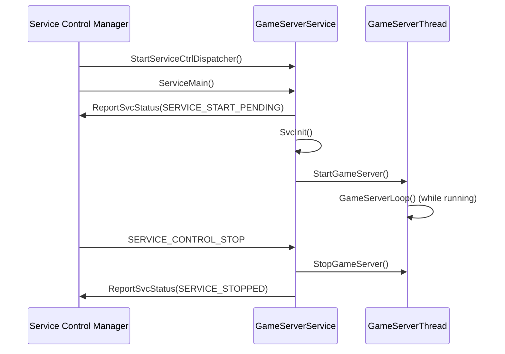
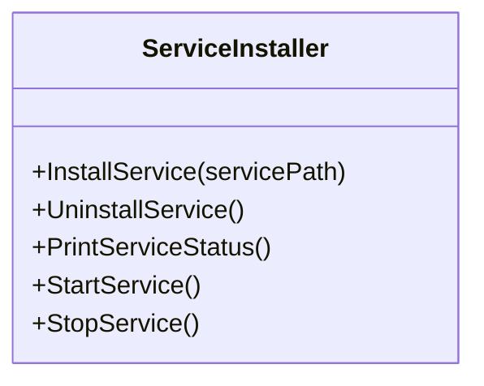
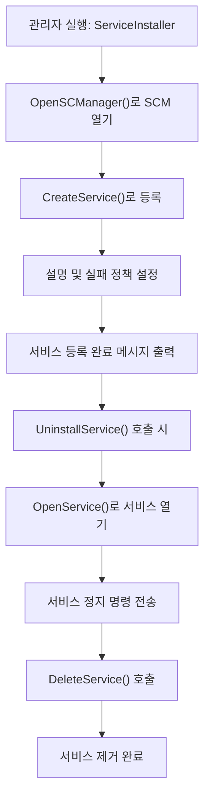
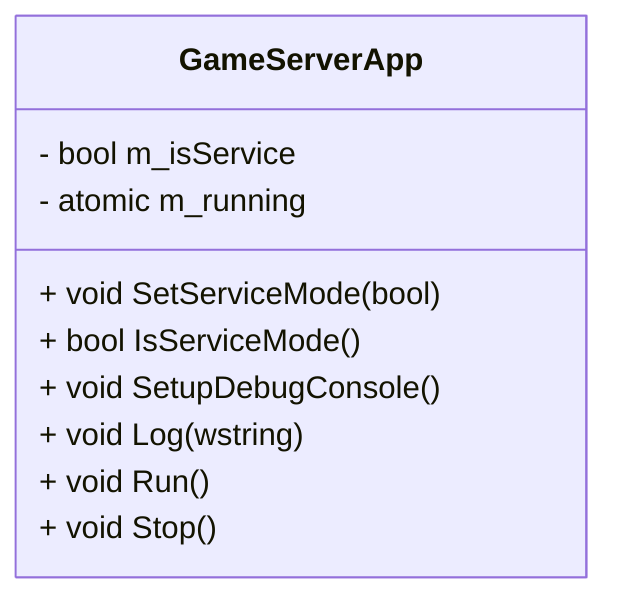
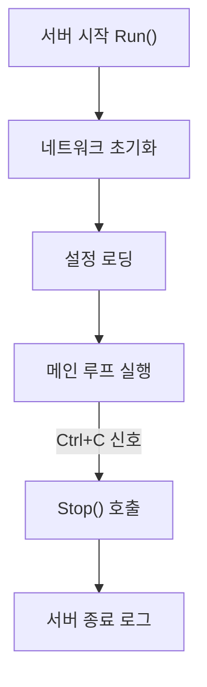

# 게임 서버 개발자를 위한 최신 Win32 API 프로그래밍  

저자: 최흥배, Claude AI   
    
권장 개발 환경
- **IDE**: Visual Studio 2022 (Community 이상)
- **컴파일러**: MSVC v143 (C++20 지원)
- **OS**: Windows 10 이상

-----  

# Chapter 10. 서비스 프로그래밍
게임 서버는 24시간 연속으로 동작해야 하는 특성상 Windows 서비스로 구현하는 것이 일반적이다. 이 장에서는 게임 서버를 안정적인 Windows 서비스로 개발하고 배포하는 방법을 다룬다.

## 10.1 Windows 서비스 기초

### 10.1.1 서비스의 특징과 장점
Windows 서비스는 백그라운드에서 실행되는 특별한 형태의 애플리케이션이다. 게임 서버에 적합한 이유는 다음과 같다.

```
   ┌──────────────────────────────────────────┐
   │            Windows System                │
   ├──────────────────────────────────────────┤
   │  Session 0 (Services)                    │
   │  ┌─────────────────────────────────────┐ │
   │  │  ┌─────────┐  ┌─────────┐         │ │ │
   │  │  │Game Srv │  │Database │         │ │ │
   │  │  │Service  │  │Service  │   ...   │ │ │
   │  │  └─────────┘  └─────────┘         │ │ │
   │  └─────────────────────────────────────┘ │
   ├──────────────────────────────────────────┤
   │  Session 1+ (Interactive Sessions)       │
   │  ┌─────────────────────────────────────┐ │
   │  │  User Applications                  │ │
   │  └─────────────────────────────────────┘ │
   └──────────────────────────────────────────┘
```

서비스의 주요 장점:
- 시스템 부팅 시 자동 시작
- 사용자 로그아웃과 무관하게 동작
- 시스템 권한으로 실행 가능
- SCM(Service Control Manager)을 통한 관리

### 10.1.2 기본 서비스 템플릿
다음은 게임 서버 서비스의 기본 구조이다:

```cpp
#include <windows.h>
#include <winsvc.h>
#include <tchar.h>
#include <strsafe.h>
#include <iostream>
#include <thread>
#include <atomic>

#define SVCNAME TEXT("GameServerService")

class GameServerService {
private:
    SERVICE_STATUS          gSvcStatus;
    SERVICE_STATUS_HANDLE   gSvcStatusHandle;
    HANDLE                  ghSvcStopEvent = nullptr;
    std::atomic<bool>       m_running{false};
    std::thread             m_gameThread;

public:
    void WINAPI ServiceMain(DWORD dwArgc, LPTSTR* lpszArgv);
    void WINAPI ServiceCtrlHandler(DWORD dwCtrl);
    void ReportSvcStatus(DWORD dwCurrentState, DWORD dwWin32ExitCode, DWORD dwWaitHint);
    void SvcInit(DWORD dwArgc, LPTSTR* lpszArgv);
    void SvcReportEvent(LPTSTR szFunction);
    
    // 게임 서버 로직
    void GameServerLoop();
    void StartGameServer();
    void StopGameServer();
};

// 전역 서비스 인스턴스
GameServerService g_service;

// 서비스 메인 함수 래퍼
void WINAPI ServiceMain(DWORD dwArgc, LPTSTR* lpszArgv) {
    g_service.ServiceMain(dwArgc, lpszArgv);
}

// 서비스 제어 핸들러 래퍼
void WINAPI ServiceCtrlHandler(DWORD dwCtrl) {
    g_service.ServiceCtrlHandler(dwCtrl);
}

void GameServerService::ServiceMain(DWORD dwArgc, LPTSTR* lpszArgv) {
    // 서비스 제어 핸들러 등록
    gSvcStatusHandle = RegisterServiceCtrlHandler(
        SVCNAME,
        ServiceCtrlHandler);

    if (!gSvcStatusHandle) {
        SvcReportEvent(TEXT("RegisterServiceCtrlHandler"));
        return;
    }

    // 서비스 상태 초기화
    gSvcStatus.dwServiceType = SERVICE_WIN32_OWN_PROCESS;
    gSvcStatus.dwServiceSpecificExitCode = 0;

    // 서비스 시작 상태 보고
    ReportSvcStatus(SERVICE_START_PENDING, NO_ERROR, 3000);

    // 서비스 초기화 수행
    SvcInit(dwArgc, lpszArgv);
}

void GameServerService::SvcInit(DWORD dwArgc, LPTSTR* lpszArgv) {
    // 정지 이벤트 생성
    ghSvcStopEvent = CreateEvent(
        nullptr,    // 기본 보안 속성
        TRUE,       // 수동 리셋 이벤트
        FALSE,      // 초기 상태는 non-signaled
        nullptr);   // 이름 없음

    if (ghSvcStopEvent == nullptr) {
        ReportSvcStatus(SERVICE_STOPPED, GetLastError(), 0);
        return;
    }

    // 서비스 실행 중 상태 보고
    ReportSvcStatus(SERVICE_RUNNING, NO_ERROR, 0);

    // 게임 서버 시작
    StartGameServer();

    // 정지 신호 대기
    WaitForSingleObject(ghSvcStopEvent, INFINITE);

    // 게임 서버 정지
    StopGameServer();

    ReportSvcStatus(SERVICE_STOPPED, NO_ERROR, 0);
}

void GameServerService::StartGameServer() {
    m_running = true;
    m_gameThread = std::thread(&GameServerService::GameServerLoop, this);
}

void GameServerService::StopGameServer() {
    m_running = false;
    if (m_gameThread.joinable()) {
        m_gameThread.join();
    }
}

void GameServerService::GameServerLoop() {
    // 실제 게임 서버 로직
    while (m_running) {
        // 클라이언트 연결 처리
        // 게임 로직 업데이트
        // 네트워크 I/O 처리
        // ...
        
        // CPU 사용률 조절
        Sleep(1);
    }
}

void GameServerService::ServiceCtrlHandler(DWORD dwCtrl) {
    switch (dwCtrl) {
    case SERVICE_CONTROL_STOP:
        ReportSvcStatus(SERVICE_STOP_PENDING, NO_ERROR, 0);
        SetEvent(ghSvcStopEvent);
        ReportSvcStatus(gSvcStatus.dwCurrentState, NO_ERROR, 0);
        break;

    case SERVICE_CONTROL_INTERROGATE:
        break;

    default:
        break;
    }
}

void GameServerService::ReportSvcStatus(DWORD dwCurrentState,
    DWORD dwWin32ExitCode,
    DWORD dwWaitHint) {
    static DWORD dwCheckPoint = 1;

    gSvcStatus.dwCurrentState = dwCurrentState;
    gSvcStatus.dwWin32ExitCode = dwWin32ExitCode;
    gSvcStatus.dwWaitHint = dwWaitHint;

    if (dwCurrentState == SERVICE_START_PENDING)
        gSvcStatus.dwControlsAccepted = 0;
    else
        gSvcStatus.dwControlsAccepted = SERVICE_ACCEPT_STOP;

    if ((dwCurrentState == SERVICE_RUNNING) ||
        (dwCurrentState == SERVICE_STOPPED))
        gSvcStatus.dwCheckPoint = 0;
    else
        gSvcStatus.dwCheckPoint = dwCheckPoint++;

    SetServiceStatus(gSvcStatusHandle, &gSvcStatus);
}

void GameServerService::SvcReportEvent(LPTSTR szFunction) {
    HANDLE hEventSource;
    LPCTSTR lpszStrings[2];
    TCHAR Buffer[80];

    hEventSource = RegisterEventSource(nullptr, SVCNAME);

    if (hEventSource != nullptr) {
        StringCchPrintf(Buffer, 80, TEXT("%s failed with %d"), szFunction, GetLastError());

        lpszStrings[0] = SVCNAME;
        lpszStrings[1] = Buffer;

        ReportEvent(hEventSource,
            EVENTLOG_ERROR_TYPE,
            0,
            0,
            nullptr,
            2,
            0,
            lpszStrings,
            nullptr);

        DeregisterEventSource(hEventSource);
    }
}

int main() {
    SERVICE_TABLE_ENTRY DispatchTable[] = {
        { SVCNAME, (LPSERVICE_MAIN_FUNCTION)ServiceMain },
        { nullptr, nullptr }
    };

    if (!StartServiceCtrlDispatcher(DispatchTable)) {
        SvcReportEvent(TEXT("StartServiceCtrlDispatcher"));
    }

    return 0;
}
```
    
이 예제는 **Windows 서비스(Windows Service)** 형태로 실행되는 **게임 서버의 기본 템플릿**이다.
보통 게임 서버는 단순한 콘솔 프로그램이 아니라, **백그라운드에서 지속적으로 실행**되며 **운영체제의 서비스 관리자(Service Control Manager)** 에 의해 제어되어야 한다.

즉, 서버를 시작하거나 중지할 때 사용자가 직접 실행하는 것이 아니라,
운영체제 수준에서 관리되는 서비스로 등록하여 **자동 시작**, **정상 종료**, **상태 보고** 등을 처리할 수 있도록 만든다.


#### 🧠 전체 구조 개요
이번 코드는 다음과 같은 흐름으로 구성된다.

```
┌─────────────────────────────┐
│ main()                      │
│ └─ StartServiceCtrlDispatcher() 호출  │
│     ↓                        │
│ ServiceMain()                │
│ ├─ RegisterServiceCtrlHandler│
│ ├─ ReportSvcStatus()         │
│ └─ SvcInit()                 │
│     ├─ StartGameServer()     │
│     └─ WaitForSingleObject() │
│          ↓                   │
│     StopGameServer()         │
└─────────────────────────────┘
```

각 함수의 역할을 한 단계씩 나누어 설명하겠다.

#### 1️⃣ 서비스 클래스 개요

```cpp
class GameServerService {
private:
    SERVICE_STATUS          gSvcStatus;
    SERVICE_STATUS_HANDLE   gSvcStatusHandle;
    HANDLE                  ghSvcStopEvent = nullptr;
    std::atomic<bool>       m_running{false};
    std::thread             m_gameThread;

public:
    void WINAPI ServiceMain(DWORD dwArgc, LPTSTR* lpszArgv);
    void WINAPI ServiceCtrlHandler(DWORD dwCtrl);
    void ReportSvcStatus(DWORD dwCurrentState, DWORD dwWin32ExitCode, DWORD dwWaitHint);
    void SvcInit(DWORD dwArgc, LPTSTR* lpszArgv);
    void SvcReportEvent(LPTSTR szFunction);
    
    void GameServerLoop();
    void StartGameServer();
    void StopGameServer();
};
```

**설명**

* `SERVICE_STATUS`와 `SERVICE_STATUS_HANDLE`은 Windows 서비스의 상태를 운영체제에 보고하기 위해 사용된다.
* `ghSvcStopEvent`는 서비스가 종료되었는지를 감시하기 위한 이벤트 핸들이다.
* `m_gameThread`는 실제 게임 서버 로직을 실행하는 스레드이다.

즉, 이 클래스는 **서비스 관리 로직 + 게임 서버 실행 로직**을 함께 관리하는 핵심 객체이다.


#### 2️⃣ 서비스 시작 진입점
Windows 서비스는 일반 프로그램과 달리 `main()` 함수가 직접 실행되지 않는다.
서비스 제어 관리자(SCM, Service Control Manager)가 먼저 실행되고,
등록된 `ServiceMain()` 함수로 진입하게 된다.

```cpp
int main() {
    SERVICE_TABLE_ENTRY DispatchTable[] = {
        { SVCNAME, (LPSERVICE_MAIN_FUNCTION)ServiceMain },
        { nullptr, nullptr }
    };

    if (!StartServiceCtrlDispatcher(DispatchTable)) {
        SvcReportEvent(TEXT("StartServiceCtrlDispatcher"));
    }

    return 0;
}
```

**설명**

* `StartServiceCtrlDispatcher()`는 서비스 실행을 운영체제에 등록한다.
* 등록 후, SCM은 `ServiceMain()`을 호출하여 서비스 실행을 시작한다.
* 이 과정은 콘솔 프로그램의 `main()`과 달리 **운영체제가 직접 호출**한다는 점이 핵심이다.


#### 3️⃣ 서비스 메인 진입 및 초기화

```cpp
void GameServerService::ServiceMain(DWORD dwArgc, LPTSTR* lpszArgv) {
    gSvcStatusHandle = RegisterServiceCtrlHandler(SVCNAME, ServiceCtrlHandler);

    if (!gSvcStatusHandle) {
        SvcReportEvent(TEXT("RegisterServiceCtrlHandler"));
        return;
    }

    gSvcStatus.dwServiceType = SERVICE_WIN32_OWN_PROCESS;
    gSvcStatus.dwServiceSpecificExitCode = 0;

    ReportSvcStatus(SERVICE_START_PENDING, NO_ERROR, 3000);
    SvcInit(dwArgc, lpszArgv);
}
```

**설명**

* `RegisterServiceCtrlHandler()`는 **서비스 제어 이벤트**(예: 정지 명령, 재시작 명령)를 처리할 핸들러를 등록한다.
* 이후 `SvcInit()`을 호출하여 실제 서비스 초기화 과정을 수행한다.


#### 4️⃣ 서비스 초기화 및 실행 루프

```cpp
void GameServerService::SvcInit(DWORD dwArgc, LPTSTR* lpszArgv) {
    ghSvcStopEvent = CreateEvent(nullptr, TRUE, FALSE, nullptr);
    if (ghSvcStopEvent == nullptr) {
        ReportSvcStatus(SERVICE_STOPPED, GetLastError(), 0);
        return;
    }

    ReportSvcStatus(SERVICE_RUNNING, NO_ERROR, 0);
    StartGameServer();

    WaitForSingleObject(ghSvcStopEvent, INFINITE);

    StopGameServer();
    ReportSvcStatus(SERVICE_STOPPED, NO_ERROR, 0);
}
```

**설명**

* `CreateEvent()`로 서비스 종료를 감지할 이벤트를 생성한다.
* `ReportSvcStatus(SERVICE_RUNNING)`을 통해 “서비스가 정상 실행 중임”을 OS에 보고한다.
* `StartGameServer()`를 통해 게임 서버 실행 스레드를 시작한다.
* 이후 `WaitForSingleObject()`로 종료 신호(`ghSvcStopEvent`)를 대기한다.

즉, 서비스는 **이벤트가 발생할 때까지 계속 실행 상태를 유지**한다.


#### 5️⃣ 게임 서버 실행 및 종료 로직

```cpp
void GameServerService::StartGameServer() {
    m_running = true;
    m_gameThread = std::thread(&GameServerService::GameServerLoop, this);
}

void GameServerService::StopGameServer() {
    m_running = false;
    if (m_gameThread.joinable()) {
        m_gameThread.join();
    }
}
```

**설명**

* `StartGameServer()`는 새로운 스레드를 만들어 게임 서버 메인 루프를 실행한다.
* `StopGameServer()`는 `m_running`을 `false`로 바꾸어 루프를 종료시키고 스레드를 합류(`join`)시킨다.


#### 6️⃣ 게임 서버 메인 루프

```cpp
void GameServerService::GameServerLoop() {
    while (m_running) {
        // 클라이언트 연결 처리
        // 게임 로직 업데이트
        // 네트워크 I/O 처리
        Sleep(1);
    }
}
```

**설명**

* 서버의 핵심 로직이 돌아가는 부분이다.
* 실제 구현에서는 네트워크 패킷 처리, 게임 로직 업데이트, DB 저장 등을 수행한다.
* `Sleep(1)`을 넣어 CPU 점유율을 낮추는 것이 중요하다.


#### 7️⃣ 서비스 제어 이벤트 처리

```cpp
void GameServerService::ServiceCtrlHandler(DWORD dwCtrl) {
    switch (dwCtrl) {
    case SERVICE_CONTROL_STOP:
        ReportSvcStatus(SERVICE_STOP_PENDING, NO_ERROR, 0);
        SetEvent(ghSvcStopEvent);
        ReportSvcStatus(gSvcStatus.dwCurrentState, NO_ERROR, 0);
        break;
    case SERVICE_CONTROL_INTERROGATE:
        break;
    default:
        break;
    }
}
```

**설명**

* 서비스 제어 관리자(SCM)가 “중지” 명령을 내리면 이 함수가 호출된다.
* `SetEvent(ghSvcStopEvent)`가 실행되어 서비스 루프(`WaitForSingleObject`)를 깨우고 종료 과정을 시작한다.


#### 8️⃣ 서비스 상태 보고

```cpp
void GameServerService::ReportSvcStatus(DWORD dwCurrentState,
    DWORD dwWin32ExitCode,
    DWORD dwWaitHint) {
    static DWORD dwCheckPoint = 1;

    gSvcStatus.dwCurrentState = dwCurrentState;
    gSvcStatus.dwWin32ExitCode = dwWin32ExitCode;
    gSvcStatus.dwWaitHint = dwWaitHint;

    if (dwCurrentState == SERVICE_START_PENDING)
        gSvcStatus.dwControlsAccepted = 0;
    else
        gSvcStatus.dwControlsAccepted = SERVICE_ACCEPT_STOP;

    if ((dwCurrentState == SERVICE_RUNNING) ||
        (dwCurrentState == SERVICE_STOPPED))
        gSvcStatus.dwCheckPoint = 0;
    else
        gSvcStatus.dwCheckPoint = dwCheckPoint++;

    SetServiceStatus(gSvcStatusHandle, &gSvcStatus);
}
```

**설명**

* 서비스의 현재 상태(시작 중, 실행 중, 종료 중 등)를 운영체제에 보고한다.
* SCM은 이 정보를 이용해 서비스 상태를 모니터링한다.


#### 9️⃣ 이벤트 로그 기록

```cpp
void GameServerService::SvcReportEvent(LPTSTR szFunction) {
    HANDLE hEventSource;
    LPCTSTR lpszStrings[2];
    TCHAR Buffer[80];

    hEventSource = RegisterEventSource(nullptr, SVCNAME);

    if (hEventSource != nullptr) {
        StringCchPrintf(Buffer, 80, TEXT("%s failed with %d"), szFunction, GetLastError());
        lpszStrings[0] = SVCNAME;
        lpszStrings[1] = Buffer;

        ReportEvent(hEventSource, EVENTLOG_ERROR_TYPE, 0, 0, nullptr, 2, 0, lpszStrings, nullptr);
        DeregisterEventSource(hEventSource);
    }
}
```

**설명**

* 서비스 실행 중 오류가 발생하면 Windows 이벤트 로그에 기록한다.
* 관리자는 이벤트 뷰어(Event Viewer)에서 오류 내역을 확인할 수 있다.


#### 🧩 서비스 흐름 요약 (Mermaid Diagram)



#### 🎯 결론
이 코드는 **Windows 서비스 형태로 동작하는 게임 서버의 기본 골격**이다.
운영체제의 서비스 관리 기능을 이용하면,

* 서버의 자동 시작 및 종료,
* 장애 발생 시 이벤트 로그 기록,
* 서비스 상태 모니터링,
* 안전한 멀티스레드 실행

을 효율적으로 구현할 수 있다.

즉, 이 예제는 콘솔 프로그램이 아닌 **운영체제에 완전히 통합된 서비스형 게임 서버**를 만드는 기초가 되는 코드라고 할 수 있다.


</br>  

## 10.2 서비스 제어 관리자 (SCM) 연동

### 10.2.1 서비스 설치 및 제거
서비스를 시스템에 등록하고 제거하는 기능을 구현해보겠다:

```cpp
#include <windows.h>
#include <winsvc.h>
#include <tchar.h>
#include <iostream>

class ServiceInstaller {
private:
    static constexpr LPCTSTR SERVICE_NAME = TEXT("GameServerService");
    static constexpr LPCTSTR DISPLAY_NAME = TEXT("Game Server Service");
    static constexpr LPCTSTR DESCRIPTION = TEXT("High-performance game server service");

public:
    static bool InstallService(LPCTSTR servicePath);
    static bool UninstallService();
    static bool StartService();
    static bool StopService();
    static void PrintServiceStatus();
};

bool ServiceInstaller::InstallService(LPCTSTR servicePath) {
    SC_HANDLE schSCManager = nullptr;
    SC_HANDLE schService = nullptr;

    // SCM 열기
    schSCManager = OpenSCManager(
        nullptr,                   // 로컬 컴퓨터
        nullptr,                   // ServicesActive 데이터베이스
        SC_MANAGER_ALL_ACCESS);    // 모든 접근 권한

    if (schSCManager == nullptr) {
        std::wcout << L"OpenSCManager failed: " << GetLastError() << std::endl;
        return false;
    }

    // 서비스 생성
    schService = CreateService(
        schSCManager,              // SCM 핸들
        SERVICE_NAME,              // 서비스 이름
        DISPLAY_NAME,              // 표시 이름
        SERVICE_ALL_ACCESS,        // 원하는 접근 권한
        SERVICE_WIN32_OWN_PROCESS, // 서비스 타입
        SERVICE_AUTO_START,        // 시작 타입
        SERVICE_ERROR_NORMAL,      // 에러 제어 타입
        servicePath,               // 서비스 바이너리 경로
        nullptr,                   // 로드 순서 그룹 없음
        nullptr,                   // 태그 ID 없음
        nullptr,                   // 종속성 없음
        nullptr,                   // LocalSystem 계정
        nullptr);                  // 패스워드 없음

    if (schService == nullptr) {
        DWORD error = GetLastError();
        if (error == ERROR_SERVICE_EXISTS) {
            std::wcout << L"Service already exists!" << std::endl;
        } else {
            std::wcout << L"CreateService failed: " << error << std::endl;
        }
        CloseServiceHandle(schSCManager);
        return false;
    }

    // 서비스 설명 설정
    SERVICE_DESCRIPTION sd;
    sd.lpDescription = const_cast<LPTSTR>(DESCRIPTION);
    ChangeServiceConfig2(schService, SERVICE_CONFIG_DESCRIPTION, &sd);

    // 실패 시 동작 설정 (자동 재시작)
    SC_ACTION actions[3];
    actions[0].Type = SC_ACTION_RESTART;
    actions[0].Delay = 5000; // 5초 후 재시작
    actions[1].Type = SC_ACTION_RESTART;
    actions[1].Delay = 10000; // 10초 후 재시작
    actions[2].Type = SC_ACTION_NONE;
    actions[2].Delay = 0;

    SERVICE_FAILURE_ACTIONS sfa;
    sfa.dwResetPeriod = 86400; // 24시간
    sfa.lpRebootMsg = nullptr;
    sfa.lpCommand = nullptr;
    sfa.cActions = 3;
    sfa.lpsaActions = actions;

    ChangeServiceConfig2(schService, SERVICE_CONFIG_FAILURE_ACTIONS, &sfa);

    std::wcout << L"Service installed successfully!" << std::endl;

    CloseServiceHandle(schService);
    CloseServiceHandle(schSCManager);
    return true;
}

bool ServiceInstaller::UninstallService() {
    SC_HANDLE schSCManager = nullptr;
    SC_HANDLE schService = nullptr;
    SERVICE_STATUS status;

    schSCManager = OpenSCManager(nullptr, nullptr, SC_MANAGER_ALL_ACCESS);
    if (schSCManager == nullptr) {
        std::wcout << L"OpenSCManager failed: " << GetLastError() << std::endl;
        return false;
    }

    schService = OpenService(schSCManager, SERVICE_NAME, DELETE | SERVICE_STOP | SERVICE_QUERY_STATUS);
    if (schService == nullptr) {
        std::wcout << L"OpenService failed: " << GetLastError() << std::endl;
        CloseServiceHandle(schSCManager);
        return false;
    }

    // 서비스가 실행 중이면 정지
    if (QueryServiceStatus(schService, &status)) {
        if (status.dwCurrentState != SERVICE_STOPPED) {
            std::wcout << L"Stopping service..." << std::endl;
            ControlService(schService, SERVICE_CONTROL_STOP, &status);
            
            // 정지될 때까지 대기
            while (QueryServiceStatus(schService, &status)) {
                if (status.dwCurrentState == SERVICE_STOPPED) {
                    break;
                }
                Sleep(1000);
            }
        }
    }

    // 서비스 삭제
    if (DeleteService(schService)) {
        std::wcout << L"Service uninstalled successfully!" << std::endl;
    } else {
        std::wcout << L"DeleteService failed: " << GetLastError() << std::endl;
    }

    CloseServiceHandle(schService);
    CloseServiceHandle(schSCManager);
    return true;
}

void ServiceInstaller::PrintServiceStatus() {
    SC_HANDLE schSCManager = OpenSCManager(nullptr, nullptr, SC_MANAGER_CONNECT);
    if (schSCManager == nullptr) return;

    SC_HANDLE schService = OpenService(schSCManager, SERVICE_NAME, SERVICE_QUERY_STATUS);
    if (schService == nullptr) {
        std::wcout << L"Service not found!" << std::endl;
        CloseServiceHandle(schSCManager);
        return;
    }

    SERVICE_STATUS_PROCESS status;
    DWORD bytesNeeded;
    if (QueryServiceStatusEx(schService, SC_STATUS_PROCESS_INFO,
        (LPBYTE)&status, sizeof(status), &bytesNeeded)) {
        
        std::wcout << L"Service Status: ";
        switch (status.dwCurrentState) {
        case SERVICE_STOPPED:
            std::wcout << L"STOPPED"; break;
        case SERVICE_START_PENDING:
            std::wcout << L"START_PENDING"; break;
        case SERVICE_STOP_PENDING:
            std::wcout << L"STOP_PENDING"; break;
        case SERVICE_RUNNING:
            std::wcout << L"RUNNING"; break;
        case SERVICE_CONTINUE_PENDING:
            std::wcout << L"CONTINUE_PENDING"; break;
        case SERVICE_PAUSE_PENDING:
            std::wcout << L"PAUSE_PENDING"; break;
        case SERVICE_PAUSED:
            std::wcout << L"PAUSED"; break;
        default:
            std::wcout << L"UNKNOWN"; break;
        }
        std::wcout << L" (PID: " << status.dwProcessId << L")" << std::endl;
    }

    CloseServiceHandle(schService);
    CloseServiceHandle(schSCManager);
}
```
  
이 예제에서는 **게임 서버 서비스를 Windows 시스템에 설치(등록)**하고, 필요 시 **제거(삭제)**하는 기능을 구현한다.
이 코드는 실제 서비스 실행 로직(게임 서버 구동 부분)이 아니라, 그 서비스를 **시스템의 서비스 관리 도구(SCM, Service Control Manager)** 에 **등록하고 제어하기 위한 관리자 도구**이다.

즉, 우리가 만든 `GameServerService`를

> “Windows가 자동으로 실행하고 관리할 수 있도록 등록하는 역할”
> 을 수행하는 것이다.


#### 🧩 전체 구조 개요
코드는 `ServiceInstaller`라는 클래스로 구성되어 있으며, 서비스의 생명주기를 관리한다.



이 중 주요 기능은 다음과 같다.

| 함수                               | 역할                      |
| -------------------------------- | ----------------------- |
| `InstallService()`               | Windows에 서비스를 등록한다      |
| `UninstallService()`             | 등록된 서비스를 제거한다           |
| `PrintServiceStatus()`           | 서비스의 현재 실행 상태를 출력한다     |
| `StartService() / StopService()` | (추가 기능) 서비스 실행 및 정지 제어용 |


#### 1️⃣ 서비스 설치 함수 (`InstallService`)

```cpp
bool ServiceInstaller::InstallService(LPCTSTR servicePath) {
    SC_HANDLE schSCManager = nullptr;
    SC_HANDLE schService = nullptr;

    // SCM(서비스 제어 관리자) 열기
    schSCManager = OpenSCManager(nullptr, nullptr, SC_MANAGER_ALL_ACCESS);
```

**설명**

* `OpenSCManager()`는 **서비스 제어 관리자(SCM)** 를 연다.
  SCM은 Windows에서 모든 서비스를 등록·관리하는 핵심 시스템 구성 요소이다.
* `nullptr` 인자는 로컬 시스템에서 동작함을 의미한다.
* `SC_MANAGER_ALL_ACCESS`는 모든 제어 권한을 요청한다.


#### 2️⃣ 서비스 생성

```cpp
schService = CreateService(
    schSCManager,              
    SERVICE_NAME,              
    DISPLAY_NAME,              
    SERVICE_ALL_ACCESS,        
    SERVICE_WIN32_OWN_PROCESS, 
    SERVICE_AUTO_START,        
    SERVICE_ERROR_NORMAL,      
    servicePath,               
    nullptr, nullptr, nullptr, 
    nullptr, nullptr); 
```

**설명**

* `CreateService()`는 실제로 **서비스를 시스템에 등록**한다.
* 주요 인자 의미는 다음과 같다.

| 인자                          | 의미                                         |
| --------------------------- | ------------------------------------------ |
| `SERVICE_NAME`              | 내부적으로 사용하는 서비스 이름                          |
| `DISPLAY_NAME`              | 제어판 등에서 표시되는 이름                            |
| `SERVICE_WIN32_OWN_PROCESS` | 서비스가 독립 프로세스로 실행됨                          |
| `SERVICE_AUTO_START`        | 부팅 시 자동 시작                                 |
| `servicePath`               | 실제 실행 파일 경로(예: `C:\GameServer\server.exe`) |

**오류 처리**

```cpp
if (schService == nullptr) {
    DWORD error = GetLastError();
    if (error == ERROR_SERVICE_EXISTS) {
        std::wcout << L"Service already exists!" << std::endl;
    } else {
        std::wcout << L"CreateService failed: " << error << std::endl;
    }
    CloseServiceHandle(schSCManager);
    return false;
}
```

서비스가 이미 등록된 경우 또는 권한이 부족할 경우 예외를 처리한다.


#### 3️⃣ 서비스 설명 및 실패 시 동작 설정

```cpp
SERVICE_DESCRIPTION sd;
sd.lpDescription = const_cast<LPTSTR>(DESCRIPTION);
ChangeServiceConfig2(schService, SERVICE_CONFIG_DESCRIPTION, &sd);
```

**설명**

* 서비스의 설명을 추가하여 관리자가 보기 쉽게 만든다.
  (예: “High-performance game server service”)

---

다음으로, **서비스 실패 시 재시작 정책**을 설정한다.

```cpp
SC_ACTION actions[3];
actions[0].Type = SC_ACTION_RESTART;
actions[0].Delay = 5000; // 5초 후 재시작
actions[1].Type = SC_ACTION_RESTART;
actions[1].Delay = 10000; // 10초 후 재시작
actions[2].Type = SC_ACTION_NONE;

SERVICE_FAILURE_ACTIONS sfa;
sfa.dwResetPeriod = 86400; // 24시간마다 리셋
sfa.cActions = 3;
sfa.lpsaActions = actions;

ChangeServiceConfig2(schService, SERVICE_CONFIG_FAILURE_ACTIONS, &sfa);
```

**설명**

* 만약 서버가 크래시나 오류로 종료되면, Windows가 자동으로 재시작하도록 설정한다.
* 실제 운영 환경에서는 서버 안정성을 위해 매우 중요한 부분이다.

✅ **결과 메시지 출력**

```cpp
std::wcout << L"Service installed successfully!" << std::endl;
```


#### 4️⃣ 서비스 제거 함수 (`UninstallService`)

```cpp
bool ServiceInstaller::UninstallService() {
    SC_HANDLE schSCManager = OpenSCManager(nullptr, nullptr, SC_MANAGER_ALL_ACCESS);
    SC_HANDLE schService = OpenService(schSCManager, SERVICE_NAME, DELETE | SERVICE_STOP | SERVICE_QUERY_STATUS);
```

**설명**

* `OpenService()`를 통해 이미 등록된 서비스를 불러온다.
* 접근 권한으로 `DELETE`, `SERVICE_STOP`, `SERVICE_QUERY_STATUS`를 요청한다.


#### 5️⃣ 서비스 정지 후 삭제

```cpp
if (QueryServiceStatus(schService, &status)) {
    if (status.dwCurrentState != SERVICE_STOPPED) {
        ControlService(schService, SERVICE_CONTROL_STOP, &status);
        while (QueryServiceStatus(schService, &status)) {
            if (status.dwCurrentState == SERVICE_STOPPED) break;
            Sleep(1000);
        }
    }
}
```

**설명**

* 서비스가 실행 중이면 `ControlService()`로 정지 명령을 보낸다.
* `QueryServiceStatus()`를 반복 호출하여 **완전히 정지될 때까지 기다린다.**

---

```cpp
if (DeleteService(schService)) {
    std::wcout << L"Service uninstalled successfully!" << std::endl;
} else {
    std::wcout << L"DeleteService failed: " << GetLastError() << std::endl;
}
```

**설명**

* `DeleteService()`를 호출하면 SCM에서 해당 서비스가 완전히 제거된다.
* 이후 `CloseServiceHandle()`로 자원 정리를 한다.


#### 6️⃣ 서비스 상태 출력 (`PrintServiceStatus`)

```cpp
SC_HANDLE schService = OpenService(schSCManager, SERVICE_NAME, SERVICE_QUERY_STATUS);
SERVICE_STATUS_PROCESS status;
DWORD bytesNeeded;

if (QueryServiceStatusEx(schService, SC_STATUS_PROCESS_INFO,
    (LPBYTE)&status, sizeof(status), &bytesNeeded)) {
```

**설명**

* `QueryServiceStatusEx()`를 통해 서비스의 현재 상태를 가져온다.
* 그 결과를 이용해 상태를 구분하여 출력한다.

```cpp
switch (status.dwCurrentState) {
case SERVICE_STOPPED: std::wcout << L"STOPPED"; break;
case SERVICE_RUNNING: std::wcout << L"RUNNING"; break;
case SERVICE_PAUSED: std::wcout << L"PAUSED"; break;
default: std::wcout << L"UNKNOWN"; break;
}
std::wcout << L" (PID: " << status.dwProcessId << L")" << std::endl;
```

**출력 예시**

```
Service Status: RUNNING (PID: 6524)
```


#### 🧠 설치 및 제거 동작 흐름 요약
아래 다이어그램은 서비스 설치와 제거 과정을 단계별로 표현한 것이다.




#### 🧩 콘솔 명령 흐름 예시

```
> GameServerInstaller.exe install "C:\GameServer\server.exe"
Service installed successfully!

> GameServerInstaller.exe status
Service Status: RUNNING (PID: 6524)

> GameServerInstaller.exe uninstall
Stopping service...
Service uninstalled successfully!
```


#### 🎯 결론
이 코드는 **Windows 서비스의 등록과 제거를 담당하는 관리자 도구**의 예제이다.
게임 서버나 백엔드 서비스처럼 **항상 실행되어야 하는 서버 프로그램**은 이렇게 운영체제 서비스로 등록하여

* 부팅 시 자동 실행
* 오류 발생 시 자동 재시작
* 관리 도구에서 상태 모니터링

이 가능하도록 만드는 것이 좋다.

즉, `ServiceInstaller`는 게임 서버를 운영 환경에 안전하게 배포하기 위한 **필수 관리 도구의 핵심 코드**라고 할 수 있다.


### 10.2.2 서비스 관리 유틸리티
명령줄에서 서비스를 관리할 수 있는 유틸리티를 만들어보겠다:

```cpp
// ServiceManager.cpp - 서비스 관리 유틸리티
#include <iostream>
#include <string>
#include <filesystem>

void PrintUsage() {
    std::wcout << L"Game Server Service Manager\n";
    std::wcout << L"Usage:\n";
    std::wcout << L"  ServiceManager.exe install [path]  - Install service\n";
    std::wcout << L"  ServiceManager.exe uninstall       - Uninstall service\n";
    std::wcout << L"  ServiceManager.exe start           - Start service\n";
    std::wcout << L"  ServiceManager.exe stop            - Stop service\n";
    std::wcout << L"  ServiceManager.exe status          - Show service status\n";
}

int wmain(int argc, wchar_t* argv[]) {
    if (argc < 2) {
        PrintUsage();
        return 1;
    }

    std::wstring command = argv[1];

    if (command == L"install") {
        std::wstring servicePath;
        if (argc >= 3) {
            servicePath = argv[2];
        } else {
            // 현재 디렉토리의 GameServer.exe 사용
            servicePath = std::filesystem::current_path() / L"GameServer.exe";
        }

        if (!std::filesystem::exists(servicePath)) {
            std::wcout << L"Service executable not found: " << servicePath << std::endl;
            return 1;
        }

        return ServiceInstaller::InstallService(servicePath.c_str()) ? 0 : 1;
    }
    else if (command == L"uninstall") {
        return ServiceInstaller::UninstallService() ? 0 : 1;
    }
    else if (command == L"start") {
        return ServiceInstaller::StartService() ? 0 : 1;
    }
    else if (command == L"stop") {
        return ServiceInstaller::StopService() ? 0 : 1;
    }
    else if (command == L"status") {
        ServiceInstaller::PrintServiceStatus();
        return 0;
    }
    else {
        std::wcout << L"Unknown command: " << command << std::endl;
        PrintUsage();
        return 1;
    }
}
```
  
</br>  

## 10.3 서비스 디버깅 기법

### 10.3.1 디버그 모드 지원
서비스 개발 시 디버깅을 위해 콘솔 애플리케이션으로도 실행할 수 있도록 구현한다:  

```cpp
#include <windows.h>
#include <iostream>
#include <io.h>
#include <fcntl.h>

class GameServerApp {
private:
    bool m_isService = false;
    std::atomic<bool> m_running{false};
    
public:
    void SetServiceMode(bool isService) { m_isService = isService; }
    bool IsServiceMode() const { return m_isService; }
    
    void Run();
    void Stop();
    
    // 디버그 콘솔 설정
    void SetupDebugConsole();
    void Log(const std::wstring& message);
};

void GameServerApp::SetupDebugConsole() {
    if (m_isService) return;
    
    // 콘솔 할당
    if (AllocConsole()) {
        // stdout을 콘솔로 리다이렉트
        freopen_s((FILE**)stdout, "CONOUT$", "w", stdout);
        freopen_s((FILE**)stderr, "CONOUT$", "w", stderr);
        freopen_s((FILE**)stdin, "CONIN$", "r", stdin);
        
        // UTF-8 출력 설정
        SetConsoleOutputCP(CP_UTF8);
        
        std::wcout << L"Debug Console Initialized" << std::endl;
    }
}

void GameServerApp::Log(const std::wstring& message) {
    SYSTEMTIME st;
    GetLocalTime(&st);
    
    wchar_t timestamp[64];
    swprintf_s(timestamp, L"[%04d-%02d-%02d %02d:%02d:%02d.%03d]",
        st.wYear, st.wMonth, st.wDay,
        st.wHour, st.wMinute, st.wSecond, st.wMilliseconds);
    
    if (m_isService) {
        // 서비스 모드에서는 이벤트 로그에 기록
        HANDLE hEventSource = RegisterEventSource(nullptr, L"GameServerService");
        if (hEventSource) {
            std::wstring logMessage = std::wstring(timestamp) + L" " + message;
            LPCWSTR strings[] = { logMessage.c_str() };
            ReportEvent(hEventSource, EVENTLOG_INFORMATION_TYPE, 0, 0,
                nullptr, 1, 0, strings, nullptr);
            DeregisterEventSource(hEventSource);
        }
    } else {
        // 디버그 모드에서는 콘솔에 출력
        std::wcout << timestamp << L" " << message << std::endl;
    }
}

void GameServerApp::Run() {
    m_running = true;
    Log(L"Game Server Starting...");
    
    // 게임 서버 초기화
    Log(L"Initializing network subsystem...");
    // InitializeNetwork();
    
    Log(L"Loading game configuration...");
    // LoadConfiguration();
    
    Log(L"Starting game loop...");
    
    // 메인 게임 루프
    while (m_running) {
        // 클라이언트 연결 처리
        // 게임 로직 업데이트
        // 리소스 관리
        
        Sleep(1); // CPU 사용률 조절
    }
    
    Log(L"Game Server Stopped");
}

void GameServerApp::Stop() {
    Log(L"Shutdown signal received");
    m_running = false;
}

// 전역 애플리케이션 인스턴스
GameServerApp g_app;

// 콘솔 이벤트 핸들러 (Ctrl+C 처리)
BOOL WINAPI ConsoleCtrlHandler(DWORD dwCtrlType) {
    switch (dwCtrlType) {
    case CTRL_C_EVENT:
    case CTRL_CLOSE_EVENT:
    case CTRL_BREAK_EVENT:
        g_app.Stop();
        return TRUE;
    default:
        return FALSE;
    }
}

// 서비스 모드 진입점
void RunAsService() {
    g_app.SetServiceMode(true);
    
    // 서비스 테이블 등록
    SERVICE_TABLE_ENTRY DispatchTable[] = {
        { const_cast<LPWSTR>(L"GameServerService"), ServiceMain },
        { nullptr, nullptr }
    };
    
    StartServiceCtrlDispatcher(DispatchTable);
}

// 콘솔 모드 진입점
void RunAsConsole() {
    g_app.SetServiceMode(false);
    g_app.SetupDebugConsole();
    
    std::wcout << L"=== Game Server Debug Mode ===" << std::endl;
    std::wcout << L"Press Ctrl+C to stop the server" << std::endl;
    
    // Ctrl+C 핸들러 등록
    SetConsoleCtrlHandler(ConsoleCtrlHandler, TRUE);
    
    g_app.Run();
}

int main(int argc, char* argv[]) {
    // 명령줄 인수 확인
    bool debugMode = false;
    for (int i = 1; i < argc; i++) {
        if (strcmp(argv[i], "--debug") == 0 || strcmp(argv[i], "-d") == 0) {
            debugMode = true;
            break;
        }
    }
    
    if (debugMode) {
        RunAsConsole();
    } else {
        RunAsService();
    }
    
    return 0;
}
```
   
이 코드는 **게임 서버를 윈도우 서비스로 실행하거나, 디버깅을 위해 콘솔 애플리케이션으로 실행할 수 있도록 구현한 예제**이다.
서비스 모드는 실제 운영 환경에서 사용되고, 콘솔 모드는 개발자나 테스터가 서버의 동작을 실시간으로 확인하고 디버깅하기 위해 사용한다.

즉,

* **운영 시**에는 윈도우 서비스로 백그라운드에서 실행된다.
* **개발/테스트 시**에는 콘솔 창에서 로그를 확인하며 실행된다.

아래는 코드의 주요 구성과 흐름을 단계별로 나누어 설명한 것이다.


#### 1️⃣ 클래스 구조와 핵심 멤버

```cpp
class GameServerApp {
private:
    bool m_isService = false;
    std::atomic<bool> m_running{false};
    
public:
    void SetServiceMode(bool isService);
    bool IsServiceMode() const;
    
    void Run();
    void Stop();
    void SetupDebugConsole();
    void Log(const std::wstring& message);
};
```

`GameServerApp` 클래스는 서버 실행의 중심 역할을 한다.

* **`m_isService`**: 현재 서버가 서비스 모드인지 여부를 나타낸다.
* **`m_running`**: 서버가 실행 중인지 여부를 관리하는 플래그이다.

아래와 같은 관계를 가진다.




#### 2️⃣ 디버그 콘솔 설정 (`SetupDebugConsole`)

```cpp
void GameServerApp::SetupDebugConsole() {
    if (m_isService) return;
    
    if (AllocConsole()) {
        freopen_s((FILE**)stdout, "CONOUT$", "w", stdout);
        freopen_s((FILE**)stderr, "CONOUT$", "w", stderr);
        freopen_s((FILE**)stdin, "CONIN$", "r", stdin);
        SetConsoleOutputCP(CP_UTF8);
        
        std::wcout << L"Debug Console Initialized" << std::endl;
    }
}
```

이 함수는 **디버그 모드일 때 콘솔 창을 초기화**한다.

1. `AllocConsole()`로 새로운 콘솔을 할당한다.
2. `freopen_s`로 `stdout`, `stderr`, `stdin`을 콘솔에 연결한다.
3. `SetConsoleOutputCP(CP_UTF8)`로 UTF-8 문자 출력을 가능하게 한다.

ASCII 다이어그램으로 표현하면 다음과 같다.

```
+----------------------+
| GameServerApp        |
|  (디버그 모드 실행)  |
+----------+-----------+
           |
           v
  [AllocConsole 호출]
           |
           v
  [표준 입출력 연결]
           |
           v
  [UTF-8 설정 및 초기화 메시지 출력]
```


#### 3️⃣ 로그 기록 함수 (`Log`)

```cpp
void GameServerApp::Log(const std::wstring& message) {
    SYSTEMTIME st;
    GetLocalTime(&st);
    
    wchar_t timestamp[64];
    swprintf_s(timestamp, L"[%04d-%02d-%02d %02d:%02d:%02d.%03d]", ...);
    
    if (m_isService) {
        HANDLE hEventSource = RegisterEventSource(nullptr, L"GameServerService");
        ...
        ReportEvent(...);
        DeregisterEventSource(hEventSource);
    } else {
        std::wcout << timestamp << L" " << message << std::endl;
    }
}
```

이 함수는 **로그를 출력하거나, 서비스 모드에서는 윈도우 이벤트 로그에 기록**한다.

* **서비스 모드**: `ReportEvent`를 통해 윈도우 이벤트 뷰어에 로그를 남긴다.
* **디버그 모드**: 콘솔 창에 타임스탬프와 함께 메시지를 출력한다.

이렇게 하면 같은 코드 기반으로 운영과 디버깅 모두 일관된 로그를 사용할 수 있다.


#### 4️⃣ 메인 실행 루프 (`Run` & `Stop`)

```cpp
void GameServerApp::Run() {
    m_running = true;
    Log(L"Game Server Starting...");
    
    Log(L"Initializing network subsystem...");
    Log(L"Loading game configuration...");
    Log(L"Starting game loop...");
    
    while (m_running) {
        Sleep(1);
    }
    
    Log(L"Game Server Stopped");
}

void GameServerApp::Stop() {
    Log(L"Shutdown signal received");
    m_running = false;
}
```

* **`Run()`**은 서버의 메인 루프를 실행한다.

  * 네트워크 초기화, 설정 로딩, 게임 루프 시작 등의 단계가 포함된다.
  * 루프 내부에서는 클라이언트 연결, 게임 로직, 리소스 관리 등을 수행할 수 있다.
* **`Stop()`**은 외부 신호(예: Ctrl+C)를 받아 루프를 종료한다.

루프의 흐름은 다음과 같다.




#### 5️⃣ 콘솔/서비스 모드 실행 분기

```cpp
void RunAsService() {
    g_app.SetServiceMode(true);
    SERVICE_TABLE_ENTRY DispatchTable[] = {
        { const_cast<LPWSTR>(L"GameServerService"), ServiceMain },
        { nullptr, nullptr }
    };
    StartServiceCtrlDispatcher(DispatchTable);
}

void RunAsConsole() {
    g_app.SetServiceMode(false);
    g_app.SetupDebugConsole();
    
    std::wcout << L"=== Game Server Debug Mode ===" << std::endl;
    std::wcout << L"Press Ctrl+C to stop the server" << std::endl;
    
    SetConsoleCtrlHandler(ConsoleCtrlHandler, TRUE);
    g_app.Run();
}
```

* **서비스 모드**는 `StartServiceCtrlDispatcher`를 통해 윈도우 서비스 관리자가 호출한다.
* **콘솔 모드**는 디버깅용 콘솔을 열고, Ctrl+C를 감지하여 서버를 종료한다.


#### 6️⃣ 진입점 (`main`)

```cpp
int main(int argc, char* argv[]) {
    bool debugMode = false;
    for (int i = 1; i < argc; i++) {
        if (strcmp(argv[i], "--debug") == 0 || strcmp(argv[i], "-d") == 0) {
            debugMode = true;
            break;
        }
    }
    
    if (debugMode)
        RunAsConsole();
    else
        RunAsService();
    
    return 0;
}
```

* 명령줄 인수에 `--debug` 또는 `-d`가 있으면 콘솔 모드로 실행한다.
* 아무 옵션이 없으면 기본적으로 서비스 모드로 실행한다.

즉, 개발자는 다음과 같이 서버를 실행할 수 있다.

```bash
GameServer.exe --debug   # 디버그 콘솔 모드
GameServer.exe           # 서비스 모드
```


#### ✅ 정리

| 구분         | 설명                                        |
| ---------- | ----------------------------------------- |
| **서비스 모드** | 윈도우 서비스로 실행되어 이벤트 로그에 기록함                 |
| **디버그 모드** | 콘솔 창에서 직접 로그를 확인하며 실행함                    |
| **공통점**    | 동일한 `GameServerApp` 클래스를 사용하여 코드 일관성을 유지함 |
| **사용 목적**  | 운영환경에서는 안정적 서비스, 개발환경에서는 실시간 디버깅 지원       |

이 구조를 사용하면 **하나의 코드로 운영 환경과 개발 환경 모두를 대응할 수 있다**.
즉, “**실제 서비스와 동일한 코드로 디버그할 수 있는 구조**”를 만드는 것이 이 코드의 핵심이다.

  

### 10.3.2 원격 디버깅 설정
Visual Studio에서 서비스를 디버깅하기 위한 설정 방법이다:

```cpp
// DebugHelper.cpp - 서비스 디버깅 도우미
#include <windows.h>
#include <iostream>

class ServiceDebugHelper {
public:
    // 디버거 연결 대기
    static void WaitForDebugger() {
        std::wcout << L"Waiting for debugger to attach..." << std::endl;
        std::wcout << L"Process ID: " << GetCurrentProcessId() << std::endl;
        
        while (!IsDebuggerPresent()) {
            Sleep(1000);
            std::wcout << L"." << std::flush;
        }
        
        std::wcout << L"\nDebugger attached!" << std::endl;
        
        // 디버거에게 브레이크포인트 알림
        DebugBreak();
    }
    
    // 디버그 정보 덤프
    static void DumpProcessInfo() {
        DWORD pid = GetCurrentProcessId();
        HANDLE hProcess = GetCurrentProcess();
        
        PROCESS_MEMORY_COUNTERS pmc;
        if (GetProcessMemoryInfo(hProcess, &pmc, sizeof(pmc))) {
            std::wcout << L"\n=== Process Information ===" << std::endl;
            std::wcout << L"PID: " << pid << std::endl;
            std::wcout << L"Working Set: " << pmc.WorkingSetSize / 1024 / 1024 << L" MB" << std::endl;
            std::wcout << L"Peak Working Set: " << pmc.PeakWorkingSetSize / 1024 / 1024 << L" MB" << std::endl;
            std::wcout << L"Private Bytes: " << pmc.PagefileUsage / 1024 / 1024 << L" MB" << std::endl;
        }
        
        FILETIME createTime, exitTime, kernelTime, userTime;
        if (GetProcessTimes(hProcess, &createTime, &exitTime, &kernelTime, &userTime)) {
            SYSTEMTIME st;
            FileTimeToSystemTime(&createTime, &st);
            std::wcout << L"Start Time: " << st.wYear << L"-" << st.wMonth << L"-" << st.wDay
                      << L" " << st.wHour << L":" << st.wMinute << L":" << st.wSecond << std::endl;
        }
    }
};

// 서비스 메인 함수 수정 버전
void GameServerService::SvcInit(DWORD dwArgc, LPTSTR* lpszArgv) {
    // 디버그 모드 체크
    bool debugMode = false;
    for (DWORD i = 0; i < dwArgc; i++) {
        if (_tcscmp(lpszArgv[i], TEXT("--debug")) == 0) {
            debugMode = true;
            break;
        }
    }
    
    if (debugMode) {
        // 디버그 콘솔 할당
        AllocConsole();
        freopen_s((FILE**)stdout, "CONOUT$", "w", stdout);
        freopen_s((FILE**)stderr, "CONOUT$", "w", stderr);
        
        ServiceDebugHelper::WaitForDebugger();
        ServiceDebugHelper::DumpProcessInfo();
    }
    
    // 나머지 초기화 로직...
    ghSvcStopEvent = CreateEvent(nullptr, TRUE, FALSE, nullptr);
    if (ghSvcStopEvent == nullptr) {
        ReportSvcStatus(SERVICE_STOPPED, GetLastError(), 0);
        return;
    }
    
    ReportSvcStatus(SERVICE_RUNNING, NO_ERROR, 0);
    
    StartGameServer();
    WaitForSingleObject(ghSvcStopEvent, INFINITE);
    StopGameServer();
    
    ReportSvcStatus(SERVICE_STOPPED, NO_ERROR, 0);
}
```
  
</br>  
  
  
## 10.4 게임 서버를 서비스로 배포하기

### 10.4.1 자동 배포 스크립트
PowerShell을 이용한 자동 배포 스크립트이다:

```powershell
# DeployGameServer.ps1
param(
    [string]$ServiceName = "GameServerService",
    [string]$BinaryPath = ".\GameServer.exe",
    [string]$ConfigPath = ".\config.json",
    [switch]$Debug
)

Write-Host "=== Game Server Deployment Script ===" -ForegroundColor Green

# 관리자 권한 확인
if (-NOT ([Security.Principal.WindowsPrincipal] [Security.Principal.WindowsIdentity]::GetCurrent()).IsInRole([Security.Principal.WindowsBuiltInRole] "Administrator")) {
    Write-Error "This script requires Administrator privileges"
    exit 1
}

# 파일 존재 확인
if (-not (Test-Path $BinaryPath)) {
    Write-Error "Service binary not found: $BinaryPath"
    exit 1
}

if (-not (Test-Path $ConfigPath)) {
    Write-Warning "Configuration file not found: $ConfigPath"
}

try {
    # 기존 서비스 정지 및 제거
    $existingService = Get-Service -Name $ServiceName -ErrorAction SilentlyContinue
    if ($existingService) {
        Write-Host "Stopping existing service..." -ForegroundColor Yellow
        Stop-Service -Name $ServiceName -Force -ErrorAction SilentlyContinue
        
        Write-Host "Removing existing service..." -ForegroundColor Yellow
        & sc.exe delete $ServiceName
        Start-Sleep -Seconds 2
    }
    
    # 새 서비스 설치
    Write-Host "Installing new service..." -ForegroundColor Cyan
    $fullPath = Resolve-Path $BinaryPath
    
    $createResult = & sc.exe create $ServiceName binPath= $fullPath start= auto
    if ($LASTEXITCODE -ne 0) {
        throw "Failed to create service"
    }
    
    # 서비스 설명 설정
    & sc.exe description $ServiceName "High-performance game server service"
    
    # 실패 시 재시작 설정
    & sc.exe failure $ServiceName reset= 86400 actions= restart/5000/restart/10000/none/0
    
    # 서비스 시작
    Write-Host "Starting service..." -ForegroundColor Cyan
    if ($Debug) {
        # 디버그 모드로 시작
        & sc.exe start $ServiceName --debug
    } else {
        Start-Service -Name $ServiceName
    }
    
    # 서비스 상태 확인
    Start-Sleep -Seconds 3
    $service = Get-Service -Name $ServiceName
    if ($service.Status -eq "Running") {
        Write-Host "Service deployed and started successfully!" -ForegroundColor Green
        Write-Host "Service Status: $($service.Status)" -ForegroundColor Green
    } else {
        Write-Warning "Service installed but not running. Status: $($service.Status)"
    }
    
} catch {
    Write-Error "Deployment failed: $_"
    exit 1
}

Write-Host "Deployment completed!" -ForegroundColor Green
```

### 10.4.2 구성 파일 관리
서비스 설정을 위한 JSON 구성 파일 구조이다:  

```json
{
    "server": {
        "name": "GameServer_01",
        "port": 8080,
        "maxConnections": 10000,
        "tickRate": 60,
        "logLevel": "INFO"
    },
    "database": {
        "connectionString": "Server=localhost;Database=GameDB;Trusted_Connection=true;",
        "connectionPoolSize": 50,
        "commandTimeout": 30
    },
    "performance": {
        "workerThreads": 0,
        "ioThreads": 0,
        "memoryLimit": "2GB",
        "gcMode": "server"
    },
    "logging": {
        "enableFileLogging": true,
        "logDirectory": "C:\\GameServer\\Logs",
        "maxLogFileSize": "100MB",
        "retentionDays": 30
    },
    "monitoring": {
        "enablePerfCounters": true,
        "reportingInterval": 60,
        "alertThresholds": {
            "cpuUsage": 80,
            "memoryUsage": 85,
            "connectionCount": 9000
        }
    }
}
```

구성 파일을 읽는 C++ 코드:

```cpp
#include <windows.h>
#include <iostream>
#include <fstream>
#include <string>
#include "json/json.h" // jsoncpp 라이브러리 사용

class GameServerConfig {
private:
    Json::Value m_config;
    std::wstring m_configPath;
    
public:
    bool LoadFromFile(const std::wstring& path) {
        m_configPath = path;
        
        std::ifstream file(path);
        if (!file.is_open()) {
            return false;
        }
        
        Json::Reader reader;
        if (!reader.parse(file, m_config)) {
            return false;
        }
        
        return true;
    }
    
    // 서버 설정
    std::string GetServerName() const {
        return m_config["server"]["name"].asString();
    }
    
    int GetServerPort() const {
        return m_config["server"]["port"].asInt();
    }
    
    int GetMaxConnections() const {
        return m_config["server"]["maxConnections"].asInt();
    }
    
    int GetTickRate() const {
        return m_config["server"]["tickRate"].asInt();
    }
    
    // 데이터베이스 설정
    std::string GetConnectionString() const {
        return m_config["database"]["connectionString"].asString();
    }
    
    int GetConnectionPoolSize() const {
        return m_config["database"]["connectionPoolSize"].asInt();
    }
    
    // 로깅 설정
    std::string GetLogDirectory() const {
        return m_config["logging"]["logDirectory"].asString();
    }
    
    bool IsFileLoggingEnabled() const {
        return m_config["logging"]["enableFileLogging"].asBool();
    }
    
    // 성능 설정
    int GetWorkerThreads() const {
        int threads = m_config["performance"]["workerThreads"].asInt();
        if (threads == 0) {
            SYSTEM_INFO si;
            GetSystemInfo(&si);
            return si.dwNumberOfProcessors;
        }
        return threads;
    }
    
    // 설정 변경 감시
    void WatchForChanges(std::function<void()> callback) {
        std::thread watchThread([this, callback]() {
            HANDLE hDir = CreateFile(
                m_configPath.substr(0, m_configPath.find_last_of(L'\\')).c_str(),
                FILE_LIST_DIRECTORY,
                FILE_SHARE_READ | FILE_SHARE_WRITE | FILE_SHARE_DELETE,
                nullptr,
                OPEN_EXISTING,
                FILE_FLAG_BACKUP_SEMANTICS,
                nullptr);
                
            if (hDir == INVALID_HANDLE_VALUE) return;
            
            char buffer[1024];
            DWORD bytesReturned;
            
            while (true) {
                if (ReadDirectoryChangesW(hDir, buffer, sizeof(buffer), FALSE,
                    FILE_NOTIFY_CHANGE_LAST_WRITE, &bytesReturned, nullptr, nullptr)) {
                    
                    FILE_NOTIFY_INFORMATION* pNotify = (FILE_NOTIFY_INFORMATION*)buffer;
                    std::wstring fileName(pNotify->FileName, pNotify->FileNameLength / sizeof(WCHAR));
                    
                    if (fileName == m_configPath.substr(m_configPath.find_last_of(L'\\') + 1)) {
                        Sleep(100); // 파일 쓰기 완료 대기
                        if (LoadFromFile(m_configPath)) {
                            callback();
                        }
                    }
                }
            }
            
            CloseHandle(hDir);
        });
        
        watchThread.detach();
    }
};
```

### 10.4.3 서비스 상태 모니터링

```cpp
class ServiceMonitor {
private:
    HANDLE m_hService = nullptr;
    std::atomic<bool> m_monitoring{false};
    std::thread m_monitorThread;
    
public:
    struct ServiceStats {
        DWORD processId = 0;
        SIZE_T workingSetSize = 0;
        SIZE_T privateBytes = 0;
        DWORD handleCount = 0;
        DWORD threadCount = 0;
        FILETIME kernelTime = {};
        FILETIME userTime = {};
        double cpuUsage = 0.0;
    };
    
    bool StartMonitoring(const std::wstring& serviceName) {
        SC_HANDLE hSCM = OpenSCManager(nullptr, nullptr, SC_MANAGER_CONNECT);
        if (!hSCM) return false;
        
        m_hService = OpenService(hSCM, serviceName.c_str(), SERVICE_QUERY_STATUS);
        CloseServiceHandle(hSCM);
        
        if (!m_hService) return false;
        
        m_monitoring = true;
        m_monitorThread = std::thread(&ServiceMonitor::MonitorLoop, this);
        
        return true;
    }
    
    void StopMonitoring() {
        m_monitoring = false;
        if (m_monitorThread.joinable()) {
            m_monitorThread.join();
        }
        
        if (m_hService) {
            CloseServiceHandle(m_hService);
            m_hService = nullptr;
        }
    }
    
    ServiceStats GetCurrentStats() {
        ServiceStats stats;
        
        SERVICE_STATUS_PROCESS ssp;
        DWORD bytesNeeded;
        
        if (!QueryServiceStatusEx(m_hService, SC_STATUS_PROCESS_INFO,
            (LPBYTE)&ssp, sizeof(ssp), &bytesNeeded)) {
            return stats;
        }
        
        stats.processId = ssp.dwProcessId;
        
        if (stats.processId == 0) return stats;
        
        HANDLE hProcess = OpenProcess(PROCESS_QUERY_INFORMATION | PROCESS_VM_READ,
            FALSE, stats.processId);
        if (!hProcess) return stats;
        
        // 메모리 정보
        PROCESS_MEMORY_COUNTERS pmc;
        if (GetProcessMemoryInfo(hProcess, &pmc, sizeof(pmc))) {
            stats.workingSetSize = pmc.WorkingSetSize;
            stats.privateBytes = pmc.PagefileUsage;
        }
        
        // 핸들 및 스레드 수
        DWORD handleCount;
        GetProcessHandleCount(hProcess, &handleCount);
        stats.handleCount = handleCount;
        
        // CPU 사용률 계산 (간소화된 버전)
        static FILETIME lastKernelTime = {};
        static FILETIME lastUserTime = {};
        static FILETIME lastTime = {};
        
        FILETIME creationTime, exitTime;
        if (GetProcessTimes(hProcess, &creationTime, &exitTime,
            &stats.kernelTime, &stats.userTime)) {
            
            FILETIME currentTime;
            GetSystemTimeAsFileTime(&currentTime);
            
            if (lastTime.dwLowDateTime != 0 || lastTime.dwHighDateTime != 0) {
                // CPU 사용률 계산 로직
                // 실제 구현에서는 더 정확한 계산이 필요
            }
            
            lastKernelTime = stats.kernelTime;
            lastUserTime = stats.userTime;
            lastTime = currentTime;
        }
        
        CloseHandle(hProcess);
        return stats;
    }
    
private:
    void MonitorLoop() {
        while (m_monitoring) {
            ServiceStats stats = GetCurrentStats();
            
            // 임계값 체크
            if (stats.workingSetSize > 2LL * 1024 * 1024 * 1024) { // 2GB
                LogAlert(L"High memory usage detected");
            }
            
            if (stats.cpuUsage > 80.0) {
                LogAlert(L"High CPU usage detected");
            }
            
            Sleep(5000); // 5초마다 모니터링
        }
    }
    
    void LogAlert(const std::wstring& message) {
        HANDLE hEventSource = RegisterEventSource(nullptr, L"GameServerService");
        if (hEventSource) {
            LPCWSTR strings[] = { message.c_str() };
            ReportEvent(hEventSource, EVENTLOG_WARNING_TYPE, 0, 0,
                nullptr, 1, 0, strings, nullptr);
            DeregisterEventSource(hEventSource);
        }
    }
};
```

이제 Chapter 11의 내용이 완성되었다. 이 장에서는 게임 서버를 안정적인 Windows 서비스로 구현하는 방법을 다뤘다. 서비스의 기본 구조부터 디버깅, 배포, 모니터링까지 실무에서 필요한 모든 요소를 포함했다.  