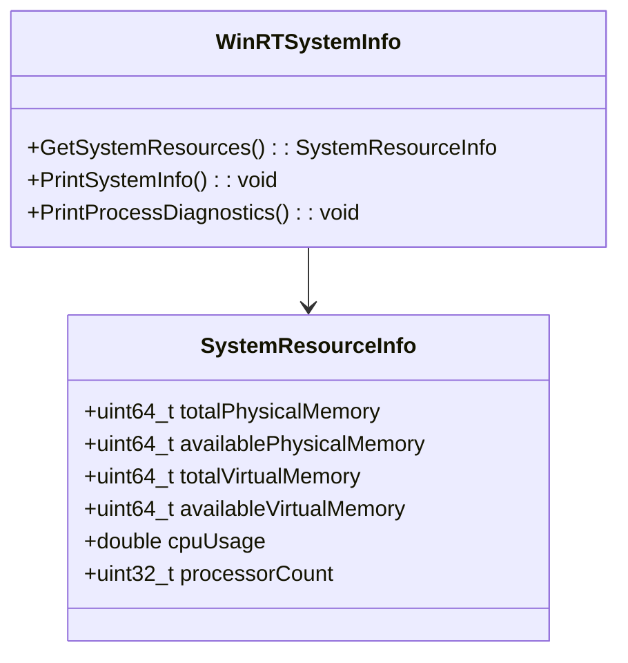
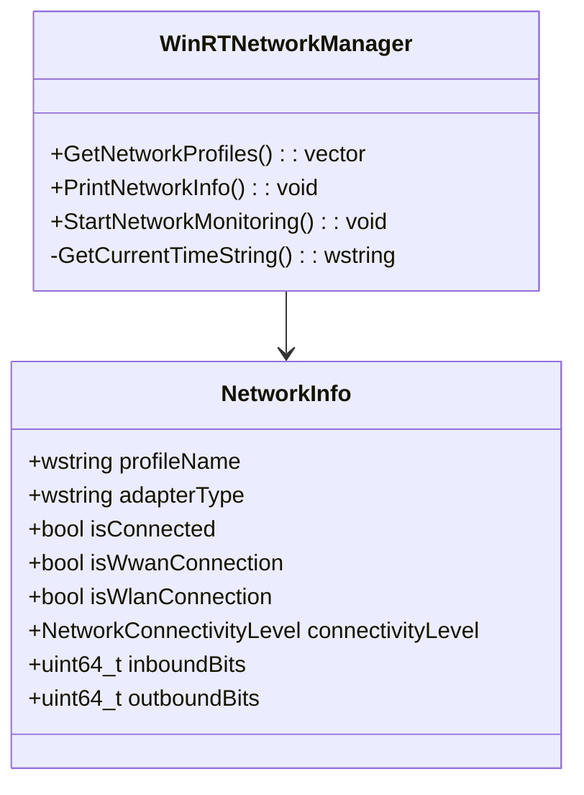
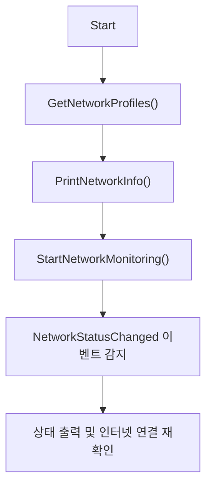
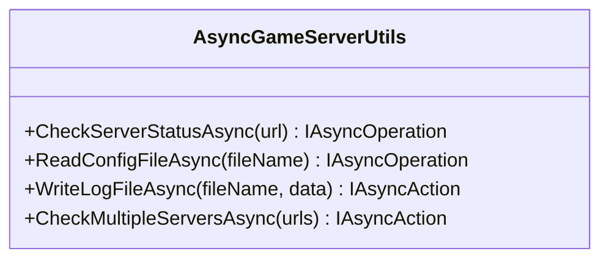
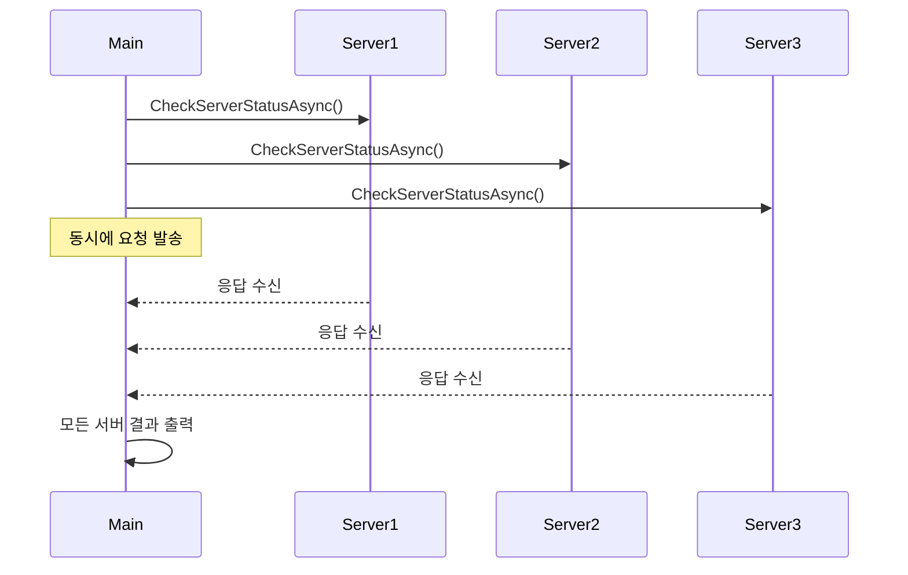
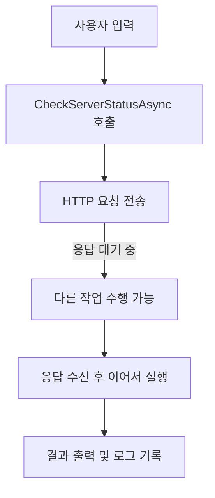
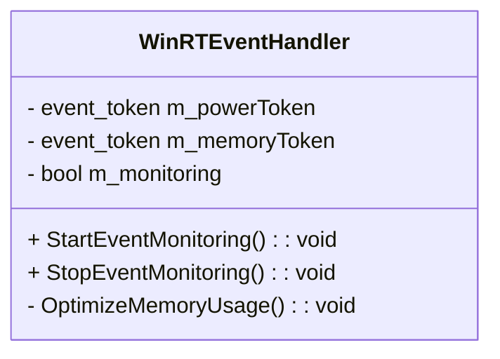
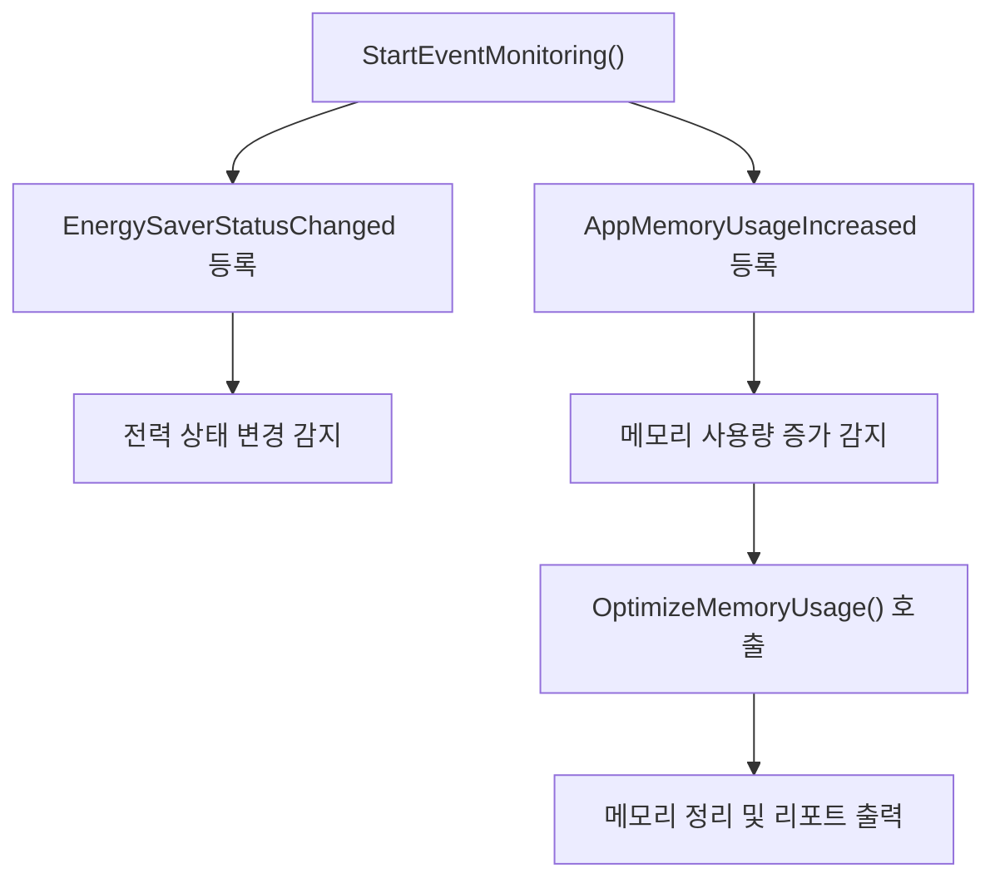

# 게임 서버 개발자를 위한 최신 Win32 API 프로그래밍  

저자: 최흥배, Claude AI   
    
권장 개발 환경
- **IDE**: Visual Studio 2022 (Community 이상)
- **컴파일러**: MSVC v143 (C++20 지원)
- **OS**: Windows 10 이상

-----  

# Chapter 11. COM과 WinRT
모던 Windows 개발에서는 전통적인 Win32 API 외에도 COM(Component Object Model)과 WinRT(Windows Runtime)를 통해 더 강력하고 현대적인 기능에 접근할 수 있다. 게임 서버 개발에서는 특히 시스템 모니터링, 성능 분석, 네트워크 관리 등의 영역에서 이러한 기술들이 유용하다.

## 11.1 COM 기초 개념

### 11.1.1 COM 아키텍처 이해
COM은 바이너리 표준으로, 다양한 언어와 플랫폼 간의 상호 운용성을 제공한다.

```
    ┌─────────────────────────────────────────┐
    │           Application Layer             │
    ├─────────────────────────────────────────┤
    │  ┌─────────────┐  ┌─────────────────┐  │
    │  │    Client   │  │   COM Server    │  │
    │  │ Application │  │   Component     │  │
    │  └─────────────┘  └─────────────────┘  │
    ├─────────────┬───────────────────────────┤
    │             │    COM Infrastructure    │
    │  ┌─────────────────────────────────────┐ │
    │  │         COM Library (Ole32.dll)     │ │
    │  └─────────────────────────────────────┘ │
    ├─────────────────────────────────────────┤
    │          Operating System              │
    └─────────────────────────────────────────┘
```

### 11.1.2 기본 COM 인터페이스 활용
다음은 시스템 정보를 수집하는 WMI(Windows Management Instrumentation) COM 객체 사용 예제이다:

```cpp
#include <windows.h>
#include <comdef.h>
#include <wbemidl.h>
#include <iostream>
#include <string>
#include <vector>

#pragma comment(lib, "wbemuuid.lib")

class COMHelper {
public:
    static bool Initialize() {
        HRESULT hr = CoInitializeEx(0, COINIT_MULTITHREADED);
        if (FAILED(hr)) {
            std::wcout << L"Failed to initialize COM library. Error: 0x" 
                      << std::hex << hr << std::endl;
            return false;
        }

        // COM 보안 설정
        hr = CoInitializeSecurity(
            nullptr,                    // 보안 서술자
            -1,                         // COM 인증 서비스
            nullptr,                    // 인증 서비스
            nullptr,                    // 예약됨
            RPC_C_AUTHN_LEVEL_NONE,     // 기본 인증 레벨
            RPC_C_IMP_LEVEL_IMPERSONATE,// 기본 위임 레벨
            nullptr,                    // 인증 정보
            EOAC_NONE,                  // 추가 기능
            nullptr);                   // 예약됨

        if (FAILED(hr)) {
            std::wcout << L"Failed to initialize security. Error: 0x" 
                      << std::hex << hr << std::endl;
            CoUninitialize();
            return false;
        }

        return true;
    }

    static void Cleanup() {
        CoUninitialize();
    }
};

class WMIQuery {
private:
    IWbemLocator* m_pLoc = nullptr;
    IWbemServices* m_pSvc = nullptr;
    bool m_initialized = false;

public:
    WMIQuery() = default;
    ~WMIQuery() { Cleanup(); }

    bool Initialize() {
        // WMI 로케이터 생성
        HRESULT hr = CoCreateInstance(
            CLSID_WbemLocator,
            0,
            CLSCTX_INPROC_SERVER,
            IID_IWbemLocator,
            (LPVOID*)&m_pLoc);

        if (FAILED(hr)) {
            std::wcout << L"Failed to create IWbemLocator object. Error: 0x" 
                      << std::hex << hr << std::endl;
            return false;
        }

        // WMI 서비스에 연결
        hr = m_pLoc->ConnectServer(
            _bstr_t(L"ROOT\\CIMV2"),    // WMI 네임스페이스
            nullptr,                    // 사용자 이름
            nullptr,                    // 패스워드
            0,                          // 로케일
            NULL,                       // 보안 플래그
            0,                          // 권한
            0,                          // 컨텍스트 객체
            &m_pSvc);                   // IWbemServices 프록시

        if (FAILED(hr)) {
            std::wcout << L"Could not connect to WMI. Error: 0x" 
                      << std::hex << hr << std::endl;
            m_pLoc->Release();
            m_pLoc = nullptr;
            return false;
        }

        // WMI 연결의 보안 레벨 설정
        hr = CoSetProxyBlanket(
            m_pSvc,                     // 인터페이스 포인터
            RPC_C_AUTHN_WINNT,          // 인증 서비스
            RPC_C_AUTHZ_NONE,           // 권한 부여 서비스
            nullptr,                    // 서버 주체 이름
            RPC_C_AUTHN_LEVEL_CALL,     // 인증 레벨
            RPC_C_IMP_LEVEL_IMPERSONATE,// 위임 레벨
            nullptr,                    // 클라이언트 ID
            EOAC_NONE);                 // 프록시 기능

        if (FAILED(hr)) {
            std::wcout << L"Could not set proxy blanket. Error: 0x" 
                      << std::hex << hr << std::endl;
            m_pSvc->Release();
            m_pLoc->Release();
            m_pSvc = nullptr;
            m_pLoc = nullptr;
            return false;
        }

        m_initialized = true;
        return true;
    }

    struct ProcessInfo {
        std::wstring name;
        DWORD processId;
        DWORD parentProcessId;
        ULONGLONG workingSetSize;
        ULONGLONG virtualSize;
        std::wstring commandLine;
    };

    std::vector<ProcessInfo> GetProcessList() {
        std::vector<ProcessInfo> processes;
        
        if (!m_initialized) return processes;

        IEnumWbemClassObject* pEnumerator = nullptr;
        HRESULT hr = m_pSvc->ExecQuery(
            bstr_t("WQL"),
            bstr_t("SELECT * FROM Win32_Process"),
            WBEM_FLAG_FORWARD_ONLY | WBEM_FLAG_RETURN_IMMEDIATELY,
            nullptr,
            &pEnumerator);

        if (FAILED(hr)) {
            std::wcout << L"Query failed. Error: 0x" << std::hex << hr << std::endl;
            return processes;
        }

        IWbemClassObject* pclsObj = nullptr;
        ULONG uReturn = 0;

        while (pEnumerator) {
            hr = pEnumerator->Next(WBEM_INFINITE, 1, &pclsObj, &uReturn);
            if (0 == uReturn) break;

            ProcessInfo info;
            VARIANT vtProp;

            // 프로세스 이름
            hr = pclsObj->Get(L"Name", 0, &vtProp, 0, 0);
            if (SUCCEEDED(hr) && vtProp.vt == VT_BSTR) {
                info.name = vtProp.bstrVal;
            }
            VariantClear(&vtProp);

            // 프로세스 ID
            hr = pclsObj->Get(L"ProcessId", 0, &vtProp, 0, 0);
            if (SUCCEEDED(hr) && vtProp.vt == VT_I4) {
                info.processId = vtProp.ulVal;
            }
            VariantClear(&vtProp);

            // 부모 프로세스 ID
            hr = pclsObj->Get(L"ParentProcessId", 0, &vtProp, 0, 0);
            if (SUCCEEDED(hr) && vtProp.vt == VT_I4) {
                info.parentProcessId = vtProp.ulVal;
            }
            VariantClear(&vtProp);

            // 워킹셋 크기
            hr = pclsObj->Get(L"WorkingSetSize", 0, &vtProp, 0, 0);
            if (SUCCEEDED(hr) && vtProp.vt == VT_BSTR) {
                info.workingSetSize = _wtoi64(vtProp.bstrVal);
            }
            VariantClear(&vtProp);

            // 가상 메모리 크기
            hr = pclsObj->Get(L"VirtualSize", 0, &vtProp, 0, 0);
            if (SUCCEEDED(hr) && vtProp.vt == VT_BSTR) {
                info.virtualSize = _wtoi64(vtProp.bstrVal);
            }
            VariantClear(&vtProp);

            // 명령줄
            hr = pclsObj->Get(L"CommandLine", 0, &vtProp, 0, 0);
            if (SUCCEEDED(hr) && vtProp.vt == VT_BSTR) {
                info.commandLine = vtProp.bstrVal;
            }
            VariantClear(&vtProp);

            processes.push_back(info);
            pclsObj->Release();
        }

        pEnumerator->Release();
        return processes;
    }

    struct NetworkAdapterInfo {
        std::wstring name;
        std::wstring description;
        std::wstring macAddress;
        ULONGLONG bytesReceived;
        ULONGLONG bytesSent;
        bool isConnected;
    };

    std::vector<NetworkAdapterInfo> GetNetworkAdapters() {
        std::vector<NetworkAdapterInfo> adapters;
        
        if (!m_initialized) return adapters;

        IEnumWbemClassObject* pEnumerator = nullptr;
        HRESULT hr = m_pSvc->ExecQuery(
            bstr_t("WQL"),
            bstr_t("SELECT * FROM Win32_NetworkAdapter WHERE NetEnabled=True"),
            WBEM_FLAG_FORWARD_ONLY | WBEM_FLAG_RETURN_IMMEDIATELY,
            nullptr,
            &pEnumerator);

        if (FAILED(hr)) return adapters;

        IWbemClassObject* pclsObj = nullptr;
        ULONG uReturn = 0;

        while (pEnumerator) {
            hr = pEnumerator->Next(WBEM_INFINITE, 1, &pclsObj, &uReturn);
            if (0 == uReturn) break;

            NetworkAdapterInfo info;
            VARIANT vtProp;

            // 어댑터 이름
            hr = pclsObj->Get(L"Name", 0, &vtProp, 0, 0);
            if (SUCCEEDED(hr) && vtProp.vt == VT_BSTR) {
                info.name = vtProp.bstrVal;
            }
            VariantClear(&vtProp);

            // 설명
            hr = pclsObj->Get(L"Description", 0, &vtProp, 0, 0);
            if (SUCCEEDED(hr) && vtProp.vt == VT_BSTR) {
                info.description = vtProp.bstrVal;
            }
            VariantClear(&vtProp);

            // MAC 주소
            hr = pclsObj->Get(L"MACAddress", 0, &vtProp, 0, 0);
            if (SUCCEEDED(hr) && vtProp.vt == VT_BSTR) {
                info.macAddress = vtProp.bstrVal;
            }
            VariantClear(&vtProp);

            // 연결 상태
            hr = pclsObj->Get(L"NetConnectionStatus", 0, &vtProp, 0, 0);
            if (SUCCEEDED(hr) && vtProp.vt == VT_I4) {
                info.isConnected = (vtProp.ulVal == 2); // 2 = Connected
            }
            VariantClear(&vtProp);

            adapters.push_back(info);
            pclsObj->Release();
        }

        pEnumerator->Release();
        return adapters;
    }

private:
    void Cleanup() {
        if (m_pSvc) {
            m_pSvc->Release();
            m_pSvc = nullptr;
        }
        if (m_pLoc) {
            m_pLoc->Release();
            m_pLoc = nullptr;
        }
        m_initialized = false;
    }
};
```

### 11.1.3 실제 사용 예제

```cpp
// GameServerMonitor.cpp - COM을 활용한 게임 서버 모니터링
#include "WMIQuery.h"
#include <iostream>
#include <iomanip>
#include <algorithm>

class GameServerMonitor {
private:
    WMIQuery m_wmi;
    std::wstring m_gameServerProcessName;

public:
    bool Initialize(const std::wstring& processName) {
        m_gameServerProcessName = processName;
        return m_wmi.Initialize();
    }

    void ShowGameServerStatus() {
        auto processes = m_wmi.GetProcessList();
        
        std::wcout << L"\n=== Game Server Process Information ===" << std::endl;
        std::wcout << std::setw(10) << L"PID" 
                   << std::setw(20) << L"Name"
                   << std::setw(15) << L"Memory (MB)"
                   << std::setw(15) << L"Virtual (MB)" << std::endl;
        std::wcout << std::wstring(60, L'-') << std::endl;

        bool found = false;
        for (const auto& proc : processes) {
            if (proc.name.find(m_gameServerProcessName) != std::wstring::npos) {
                found = true;
                std::wcout << std::setw(10) << proc.processId
                           << std::setw(20) << proc.name
                           << std::setw(15) << (proc.workingSetSize / 1024 / 1024)
                           << std::setw(15) << (proc.virtualSize / 1024 / 1024) 
                           << std::endl;
            }
        }

        if (!found) {
            std::wcout << L"Game server process not found!" << std::endl;
        }
    }

    void ShowNetworkStatus() {
        auto adapters = m_wmi.GetNetworkAdapters();
        
        std::wcout << L"\n=== Network Adapter Information ===" << std::endl;
        
        for (const auto& adapter : adapters) {
            std::wcout << L"Name: " << adapter.name << std::endl;
            std::wcout << L"Description: " << adapter.description << std::endl;
            std::wcout << L"MAC Address: " << adapter.macAddress << std::endl;
            std::wcout << L"Status: " << (adapter.isConnected ? L"Connected" : L"Disconnected") 
                       << std::endl;
            std::wcout << std::wstring(50, L'-') << std::endl;
        }
    }

    void MonitorPerformance() {
        std::wcout << L"Starting performance monitoring..." << std::endl;
        
        for (int i = 0; i < 10; ++i) {
            auto processes = m_wmi.GetProcessList();
            
            ULONGLONG totalMemory = 0;
            int gameServerCount = 0;
            
            for (const auto& proc : processes) {
                if (proc.name.find(m_gameServerProcessName) != std::wstring::npos) {
                    totalMemory += proc.workingSetSize;
                    gameServerCount++;
                }
            }
            
            std::wcout << L"[" << std::setw(2) << i + 1 << L"/10] "
                       << L"Game Servers: " << gameServerCount
                       << L", Total Memory: " << (totalMemory / 1024 / 1024) << L" MB"
                       << std::endl;
            
            Sleep(2000); // 2초 간격
        }
    }
};

int main() {
    // COM 초기화
    if (!COMHelper::Initialize()) {
        return 1;
    }

    GameServerMonitor monitor;
    if (!monitor.Initialize(L"GameServer")) {
        std::wcout << L"Failed to initialize WMI query" << std::endl;
        COMHelper::Cleanup();
        return 1;
    }

    // 메뉴 시스템
    int choice;
    do {
        std::wcout << L"\n=== Game Server Monitor ===" << std::endl;
        std::wcout << L"1. Show Game Server Status" << std::endl;
        std::wcout << L"2. Show Network Status" << std::endl;
        std::wcout << L"3. Monitor Performance" << std::endl;
        std::wcout << L"0. Exit" << std::endl;
        std::wcout << L"Enter choice: ";
        
        std::wcin >> choice;

        switch (choice) {
        case 1:
            monitor.ShowGameServerStatus();
            break;
        case 2:
            monitor.ShowNetworkStatus();
            break;
        case 3:
            monitor.MonitorPerformance();
            break;
        case 0:
            std::wcout << L"Exiting..." << std::endl;
            break;
        default:
            std::wcout << L"Invalid choice!" << std::endl;
            break;
        }
    } while (choice != 0);

    COMHelper::Cleanup();
    return 0;
}
```
  
</br>  
  

## 11.2 WinRT API 활용

### 11.2.1 WinRT 아키텍처 소개
WinRT는 Windows 8부터 도입된 새로운 API 계층으로, 현대적이고 타입 안전한 인터페이스를 제공한다.

```
    ┌─────────────────────────────────────────┐
    │        Application Layer               │
    │  ┌─────────────┐  ┌─────────────────┐  │
    │  │   C++/WinRT │  │   C#/.NET       │  │
    │  │ Application │  │  Application    │  │
    │  └─────────────┘  └─────────────────┘  │
    ├─────────────────────────────────────────┤
    │           Language Projections          │
    │  ┌─────────────────────────────────────┐ │
    │  │    C++/WinRT    │    .NET/WinRT   │ │
    │  └─────────────────────────────────────┘ │
    ├─────────────────────────────────────────┤
    │         Windows Runtime (WinRT)         │
    │  ┌─────────────────────────────────────┐ │
    │  │ Windows.Foundation | Windows.System │ │
    │  │ Windows.Storage   | Windows.Network │ │
    │  └─────────────────────────────────────┘ │
    ├─────────────────────────────────────────┤
    │              Win32 APIs                 │
    └─────────────────────────────────────────┘
```

### 11.2.2 C++/WinRT 기초 사용법
먼저 C++/WinRT를 사용하기 위한 설정이 필요하다:  

```cpp
// pch.h 또는 헤더 파일에 추가
#include <winrt/base.h>
#include <winrt/Windows.Foundation.h>
#include <winrt/Windows.Foundation.Collections.h>
#include <winrt/Windows.System.h>
#include <winrt/Windows.Storage.h>
#include <winrt/Windows.Networking.h>
#include <winrt/Windows.Networking.Sockets.h>
#include <winrt/Windows.Web.Http.h>

using namespace winrt;
using namespace Windows::Foundation;
using namespace Windows::System;
using namespace Windows::Storage;
using namespace Windows::Networking;
using namespace Windows::Networking::Sockets;
```

### 11.2.3 시스템 정보 수집

```cpp
#include <winrt/Windows.System.h>
#include <winrt/Windows.System.Diagnostics.h>
#include <winrt/Windows.ApplicationModel.h>
#include <iostream>
#include <iomanip>

using namespace winrt;
using namespace Windows::System;
using namespace Windows::System::Diagnostics;

class WinRTSystemInfo {
public:
    struct SystemResourceInfo {
        uint64_t totalPhysicalMemory;
        uint64_t availablePhysicalMemory;
        uint64_t totalVirtualMemory;
        uint64_t availableVirtualMemory;
        double cpuUsage;
        uint32_t processorCount;
    };

    static SystemResourceInfo GetSystemResources() {
        SystemResourceInfo info{};

        // 메모리 정보 수집
        auto memoryReport = MemoryManager::GetAppMemoryReport();
        info.totalPhysicalMemory = memoryReport.TotalCommitLimit();
        info.availablePhysicalMemory = memoryReport.AvailableCommitLimit();

        // 프로세서 정보
        info.processorCount = std::thread::hardware_concurrency();

        return info;
    }

    static void PrintSystemInfo() {
        std::wcout << L"\n=== System Information (WinRT) ===" << std::endl;

        // 디바이스 패밀리 정보
        auto deviceFamily = Windows::System::Profile::AnalyticsInfo::VersionInfo().DeviceFamily();
        std::wcout << L"Device Family: " << std::wstring_view(deviceFamily) << std::endl;

        // 프로세서 아키텍처
        auto architecture = Windows::System::Profile::AnalyticsInfo::DeviceForm();
        std::wcout << L"Device Form: " << std::wstring_view(architecture) << std::endl;

        // 메모리 정보
        auto memoryReport = MemoryManager::GetAppMemoryReport();
        std::wcout << L"Current Memory Usage: " 
                   << (memoryReport.PrivateCommitUsage() / 1024 / 1024) << L" MB" << std::endl;
        std::wcout << L"Memory Usage Limit: " 
                   << (memoryReport.TotalCommitLimit() / 1024 / 1024) << L" MB" << std::endl;

        // 전력 상태
        auto powerManager = PowerManager::EnergySaverStatus();
        std::wcout << L"Energy Saver Status: ";
        switch (powerManager) {
        case EnergySaverStatus::Disabled:
            std::wcout << L"Disabled"; break;
        case EnergySaverStatus::Off:
            std::wcout << L"Off"; break;
        case EnergySaverStatus::On:
            std::wcout << L"On"; break;
        default:
            std::wcout << L"Unknown"; break;
        }
        std::wcout << std::endl;

        // 배터리 상태 (노트북/태블릿의 경우)
        auto batteryReport = PowerManager::BatteryStatus();
        std::wcout << L"Battery Status: ";
        switch (batteryReport) {
        case BatteryStatus::NotPresent:
            std::wcout << L"Not Present"; break;
        case BatteryStatus::Discharging:
            std::wcout << L"Discharging"; break;
        case BatteryStatus::Idle:
            std::wcout << L"Idle"; break;
        case BatteryStatus::Charging:
            std::wcout << L"Charging"; break;
        default:
            std::wcout << L"Unknown"; break;
        }
        std::wcout << std::endl;
    }

    // 실행 중인 프로세스 정보 (UWP 제한 내에서)
    static void PrintProcessDiagnostics() {
        std::wcout << L"\n=== Process Diagnostics ===" << std::endl;

        // 현재 프로세스의 진단 정보
        auto processInfo = ProcessDiagnosticInfo::GetForCurrentProcess();
        if (processInfo) {
            std::wcout << L"Process ID: " << processInfo.ProcessId() << std::endl;
            std::wcout << L"Executable Name: " 
                       << std::wstring_view(processInfo.ExecutableFileName()) << std::endl;

            // 메모리 사용량
            auto memoryUsage = processInfo.MemoryUsage();
            if (memoryUsage) {
                auto report = memoryUsage.GetReport();
                std::wcout << L"Working Set: " 
                           << (report.WorkingSetSizeInBytes() / 1024 / 1024) << L" MB" << std::endl;
                std::wcout << L"Private Memory: " 
                           << (report.PrivateWorkingSetSizeInBytes() / 1024 / 1024) << L" MB" << std::endl;
                std::wcout << L"Virtual Memory: " 
                           << (report.VirtualMemorySizeInBytes() / 1024 / 1024) << L" MB" << std::endl;
            }

            // CPU 사용량
            auto cpuUsage = processInfo.CpuUsage();
            if (cpuUsage) {
                auto report = cpuUsage.GetReport();
                auto kernelTime = report.KernelTime().count();
                auto userTime = report.UserTime().count();
                
                std::wcout << L"Kernel Time: " << kernelTime << L" ticks" << std::endl;
                std::wcout << L"User Time: " << userTime << L" ticks" << std::endl;
            }

            // 디스크 사용량
            auto diskUsage = processInfo.DiskUsage();
            if (diskUsage) {
                auto report = diskUsage.GetReport();
                std::wcout << L"Bytes Read: " << report.BytesReadCount() << std::endl;
                std::wcout << L"Bytes Written: " << report.BytesWrittenCount() << std::endl;
                std::wcout << L"Read Operations: " << report.ReadOperationCount() << std::endl;
                std::wcout << L"Write Operations: " << report.WriteOperationCount() << std::endl;
            }
        }
    }
};
```
   
이 코드는 **Windows 10 이후의 WinRT(Windows Runtime) API를 사용하여 시스템의 자원 및 프로세스 정보를 수집하는 예제**이다.
게임 서버나 데스크톱 애플리케이션, 또는 UWP 앱에서 **현재 장치의 성능 상태나 리소스 점유율을 확인하기 위해** 사용한다.

즉, 이 코드는 다음과 같은 상황에서 유용하다.

* 애플리케이션 실행 환경(예: PC, 노트북, 태블릿)에 따른 동작 최적화가 필요할 때
* 메모리, CPU, 디스크 사용량을 모니터링하여 성능 튜닝을 하고 싶을 때
* 배터리나 전력 상태에 따라 동작 모드를 다르게 하고 싶을 때


#### 1️⃣ 클래스 구조와 역할
코드는 `WinRTSystemInfo`라는 클래스로 구성되어 있으며, 시스템 리소스와 프로세스 상태를 읽는 여러 정적 메서드를 제공한다.

```cpp
class WinRTSystemInfo {
public:
    struct SystemResourceInfo {
        uint64_t totalPhysicalMemory;
        uint64_t availablePhysicalMemory;
        uint64_t totalVirtualMemory;
        uint64_t availableVirtualMemory;
        double cpuUsage;
        uint32_t processorCount;
    };

    static SystemResourceInfo GetSystemResources();
    static void PrintSystemInfo();
    static void PrintProcessDiagnostics();
};
```

이 클래스의 관계를 도식화하면 다음과 같다.




#### 2️⃣ 시스템 리소스 정보 수집 (`GetSystemResources`)

```cpp
static SystemResourceInfo GetSystemResources() {
    SystemResourceInfo info{};

    auto memoryReport = MemoryManager::GetAppMemoryReport();
    info.totalPhysicalMemory = memoryReport.TotalCommitLimit();
    info.availablePhysicalMemory = memoryReport.AvailableCommitLimit();
    info.processorCount = std::thread::hardware_concurrency();

    return info;
}
```

이 함수는 **현재 시스템의 메모리와 CPU 정보를 수집**한다.

* `MemoryManager::GetAppMemoryReport()` : 현재 애플리케이션의 메모리 사용 한도와 남은 양을 반환한다.
* `std::thread::hardware_concurrency()` : 시스템의 CPU(논리 코어) 개수를 반환한다.

이 함수는 `SystemResourceInfo` 구조체를 반환하여, 다른 코드에서 시스템 리소스 상태를 쉽게 참조할 수 있게 한다.

ASCII 흐름도로 보면 다음과 같다.

```
[GetSystemResources()]
     │
     ├─> [메모리 보고서 수집]
     │       ├─ TotalCommitLimit()
     │       └─ AvailableCommitLimit()
     │
     └─> [CPU 개수 확인 → hardware_concurrency()]
```


#### 3️⃣ 시스템 정보 출력 (`PrintSystemInfo`)

이 함수는 **장치와 운영체제 관련 정보를 콘솔에 출력**한다.

```cpp
static void PrintSystemInfo() {
    std::wcout << L"\n=== System Information (WinRT) ===" << std::endl;

    // 디바이스 패밀리 (Desktop, Mobile 등)
    auto deviceFamily = Windows::System::Profile::AnalyticsInfo::VersionInfo().DeviceFamily();
    std::wcout << L"Device Family: " << std::wstring_view(deviceFamily) << std::endl;

    // 장치 형태 (Desktop, Tablet 등)
    auto architecture = Windows::System::Profile::AnalyticsInfo::DeviceForm();
    std::wcout << L"Device Form: " << std::wstring_view(architecture) << std::endl;
```

이 부분에서는 **기기의 종류(예: Desktop, Xbox, HoloLens 등)**를 식별한다.
`AnalyticsInfo::VersionInfo()`와 `DeviceForm()`은 WinRT에서 장치 형태를 식별하는 데 자주 쓰이는 API다.

다음은 메모리 및 전원 관련 정보 출력 부분이다.

```cpp
    auto memoryReport = MemoryManager::GetAppMemoryReport();
    std::wcout << L"Current Memory Usage: " 
               << (memoryReport.PrivateCommitUsage() / 1024 / 1024) << L" MB" << std::endl;
    std::wcout << L"Memory Usage Limit: " 
               << (memoryReport.TotalCommitLimit() / 1024 / 1024) << L" MB" << std::endl;
```

* `PrivateCommitUsage()` : 현재 애플리케이션이 사용하는 물리적 메모리의 양이다.
* `TotalCommitLimit()` : 시스템이 허용하는 최대 메모리 한도이다.

전력 상태와 배터리 상태도 함께 출력한다.

```cpp
    auto powerManager = PowerManager::EnergySaverStatus();
    std::wcout << L"Energy Saver Status: ..."

    auto batteryReport = PowerManager::BatteryStatus();
    std::wcout << L"Battery Status: ..."
```

이 부분은 **전력 절약 모드 여부**와 **배터리 충전 상태**를 보여준다.
이를 통해 프로그램이 “절전 모드에서는 무거운 작업을 피해야겠다” 같은 결정을 내릴 수 있다.


#### 4️⃣ 프로세스 진단 정보 (`PrintProcessDiagnostics`)
이 함수는 **현재 실행 중인 애플리케이션 프로세스의 상세 진단 정보를 출력**한다.

```cpp
auto processInfo = ProcessDiagnosticInfo::GetForCurrentProcess();
if (processInfo) {
    std::wcout << L"Process ID: " << processInfo.ProcessId() << std::endl;
    std::wcout << L"Executable Name: " 
               << std::wstring_view(processInfo.ExecutableFileName()) << std::endl;
```

먼저, `GetForCurrentProcess()`를 통해 현재 프로세스의 핸들을 가져온다.
그다음 메모리, CPU, 디스크 사용량을 각각 출력한다.
  
##### 🧠 메모리 사용량

```cpp
auto report = memoryUsage.GetReport();
std::wcout << L"Working Set: " << (report.WorkingSetSizeInBytes() / 1024 / 1024) << L" MB";
std::wcout << L"Private Memory: " << (report.PrivateWorkingSetSizeInBytes() / 1024 / 1024) << L" MB";
std::wcout << L"Virtual Memory: " << (report.VirtualMemorySizeInBytes() / 1024 / 1024) << L" MB";
```

* **Working Set**: 현재 프로세스가 실제로 사용하는 물리 메모리
* **Private Memory**: 다른 프로세스와 공유하지 않는 메모리
* **Virtual Memory**: 가상 메모리 공간 크기
  
##### ⚙️ CPU 사용량

```cpp
auto report = cpuUsage.GetReport();
auto kernelTime = report.KernelTime().count();
auto userTime = report.UserTime().count();
```

* **Kernel Time**: 운영체제 커널에서 실행된 CPU 시간
* **User Time**: 사용자 코드에서 사용된 CPU 시간

이 두 수치를 통해 프로그램이 CPU 자원을 얼마나 점유하고 있는지 알 수 있다.
  
##### 💾 디스크 I/O 사용량

```cpp
auto report = diskUsage.GetReport();
std::wcout << L"Bytes Read: " << report.BytesReadCount();
std::wcout << L"Bytes Written: " << report.BytesWrittenCount();
```

* **BytesReadCount / BytesWrittenCount**: 파일 입출력량을 나타낸다.
  이는 게임 서버의 로딩 시스템이나 데이터베이스 I/O 성능 점검에 유용하다.

  
#### ✅ 정리

| 항목                          | 기능                                |
| --------------------------- | --------------------------------- |
| **GetSystemResources**      | CPU 개수와 메모리 사용 한도를 수집한다           |
| **PrintSystemInfo**         | 장치 종류, 메모리, 전력, 배터리 상태를 출력한다      |
| **PrintProcessDiagnostics** | 현재 프로세스의 메모리·CPU·디스크 사용량을 상세 출력한다 |
| **활용 목적**                   | 성능 모니터링, 자원 제한 감지, 최적화 기준 데이터 확보  |

  
#### 💡 전체 동작 흐름 요약

```mermaid
flowchart TD
    A[Start] --> B[GetSystemResources()]
    B --> C[PrintSystemInfo()]
    C --> D[PrintProcessDiagnostics()]
    D --> E[Display All Information in Console]
```

이 코드는 **Windows 환경에서 애플리케이션의 실행 환경을 정량적으로 파악하기 위한 기본 도구**이다.
이를 이용하면 메모리 누수나 과도한 CPU 점유 같은 문제를 사전에 파악하고, **안정적인 시스템 성능 유지에 도움을 줄 수 있다**.
  
  

### 11.2.4 네트워크 관련 WinRT API

```cpp
#include <winrt/Windows.Networking.h>
#include <winrt/Windows.Networking.Connectivity.h>
#include <winrt/Windows.Web.Http.h>

using namespace Windows::Networking;
using namespace Windows::Networking::Connectivity;
using namespace Windows::Web::Http;

class WinRTNetworkManager {
public:
    struct NetworkInfo {
        std::wstring profileName;
        std::wstring adapterType;
        bool isConnected;
        bool isWwanConnection;
        bool isWlanConnection;
        NetworkConnectivityLevel connectivityLevel;
        uint64_t inboundBits;
        uint64_t outboundBits;
    };

    static std::vector<NetworkInfo> GetNetworkProfiles() {
        std::vector<NetworkInfo> profiles;

        try {
            auto networkProfiles = NetworkInformation::GetConnectionProfiles();
            
            for (auto profile : networkProfiles) {
                NetworkInfo info;
                
                // 프로필 이름
                if (profile.ProfileName().empty()) {
                    info.profileName = L"Unknown";
                } else {
                    info.profileName = profile.ProfileName().c_str();
                }

                // 연결 상태
                info.connectivityLevel = profile.GetNetworkConnectivityLevel();
                info.isConnected = (info.connectivityLevel == NetworkConnectivityLevel::InternetAccess);

                // 어댑터 정보
                auto adapter = profile.NetworkAdapter();
                if (adapter) {
                    info.adapterType = std::wstring(adapter.NetworkAdapterId().c_str());
                    
                    // 연결 타입 확인
                    info.isWwanConnection = profile.IsWwanConnectionProfile();
                    info.isWlanConnection = profile.IsWlanConnectionProfile();
                }

                // 데이터 사용량 (가능한 경우)
                auto dataUsage = profile.GetLocalUsage(
                    DateTime::clock::now() - std::chrono::hours(24),  // 24시간 전부터
                    DateTime::clock::now());                           // 현재까지
                
                if (dataUsage) {
                    info.inboundBits = dataUsage.BytesReceived();
                    info.outboundBits = dataUsage.BytesSent();
                }

                profiles.push_back(info);
            }
        }
        catch (hresult_error const& ex) {
            std::wcout << L"Error getting network profiles: " 
                       << std::wstring_view(ex.message()) << std::endl;
        }

        return profiles;
    }

    static void PrintNetworkInfo() {
        std::wcout << L"\n=== Network Information (WinRT) ===" << std::endl;

        auto profiles = GetNetworkProfiles();
        
        for (const auto& profile : profiles) {
            std::wcout << L"Profile: " << profile.profileName << std::endl;
            std::wcout << L"Connected: " << (profile.isConnected ? L"Yes" : L"No") << std::endl;
            std::wcout << L"WLAN: " << (profile.isWlanConnection ? L"Yes" : L"No") << std::endl;
            std::wcout << L"WWAN: " << (profile.isWwanConnection ? L"Yes" : L"No") << std::endl;
            
            std::wcout << L"Connectivity Level: ";
            switch (profile.connectivityLevel) {
            case NetworkConnectivityLevel::None:
                std::wcout << L"None"; break;
            case NetworkConnectivityLevel::LocalAccess:
                std::wcout << L"Local Access"; break;
            case NetworkConnectivityLevel::ConstrainedInternetAccess:
                std::wcout << L"Constrained Internet"; break;
            case NetworkConnectivityLevel::InternetAccess:
                std::wcout << L"Internet Access"; break;
            }
            std::wcout << std::endl;

            if (profile.inboundBits > 0 || profile.outboundBits > 0) {
                std::wcout << L"Data Usage (24h): " 
                           << L"Received=" << (profile.inboundBits / 1024 / 1024) << L"MB, "
                           << L"Sent=" << (profile.outboundBits / 1024 / 1024) << L"MB" 
                           << std::endl;
            }
            
            std::wcout << std::wstring(50, L'-') << std::endl;
        }
    }

    // 네트워크 상태 변경 모니터링
    static void StartNetworkMonitoring() {
        std::wcout << L"Starting network monitoring..." << std::endl;

        // 네트워크 상태 변경 이벤트 등록
        NetworkInformation::NetworkStatusChanged([](auto const&) {
            std::wcout << L"[" << GetCurrentTimeString() << L"] "
                       << L"Network status changed!" << std::endl;
            
            // 간단한 연결 상태 체크
            auto profiles = GetNetworkProfiles();
            bool hasInternet = false;
            
            for (const auto& profile : profiles) {
                if (profile.connectivityLevel == NetworkConnectivityLevel::InternetAccess) {
                    hasInternet = true;
                    break;
                }
            }
            
            std::wcout << L"Internet Access: " << (hasInternet ? L"Available" : L"Not Available") 
                       << std::endl;
        });

        std::wcout << L"Network monitoring started. Press Enter to stop..." << std::endl;
        std::cin.get();
    }

private:
    static std::wstring GetCurrentTimeString() {
        SYSTEMTIME st;
        GetLocalTime(&st);
        
        wchar_t timeStr[64];
        swprintf_s(timeStr, L"%02d:%02d:%02d", st.wHour, st.wMinute, st.wSecond);
        return timeStr;
    }
};
```
    
이 코드는 **Windows 10 이상의 환경에서 WinRT(Windows Runtime) API를 사용하여 네트워크 연결 상태를 확인하고 모니터링하는 프로그램**이다.
즉, 컴퓨터가 어떤 네트워크에 연결되어 있는지, 무선(WLAN)인지 이동통신(WWAN)인지, 인터넷에 접근 가능한 상태인지 등을 확인할 수 있다.

또한, **최근 24시간 동안의 데이터 사용량(송신/수신량)**을 가져올 수 있으며, 네트워크 상태가 변경될 때 이벤트를 받아서 실시간으로 반응할 수도 있다.
이 코드는 **서버나 클라이언트 프로그램이 네트워크 상태에 따라 동작을 다르게 해야 할 때** 유용하게 사용된다.


#### 1️⃣ 클래스 구조 및 역할

```cpp
class WinRTNetworkManager {
public:
    struct NetworkInfo { ... };
    static std::vector<NetworkInfo> GetNetworkProfiles();
    static void PrintNetworkInfo();
    static void StartNetworkMonitoring();
private:
    static std::wstring GetCurrentTimeString();
};
```

`WinRTNetworkManager`는 네트워크 관련 정보를 수집하고 출력하며, 상태 변화를 모니터링하는 기능을 가진다.

각 구성의 역할은 다음과 같다.

| 구성 요소                      | 역할                      |
| -------------------------- | ----------------------- |
| `NetworkInfo`              | 네트워크 프로필(연결) 정보를 담는 구조체 |
| `GetNetworkProfiles()`     | 시스템의 모든 네트워크 프로필을 가져옴   |
| `PrintNetworkInfo()`       | 네트워크 정보를 콘솔에 출력함        |
| `StartNetworkMonitoring()` | 네트워크 상태 변경 이벤트를 감지함     |
| `GetCurrentTimeString()`   | 현재 시간을 문자열로 반환함         |

아래는 클래스 구성의 다이어그램이다.




#### 2️⃣ 네트워크 프로필 정보 수집 (`GetNetworkProfiles`)

```cpp
auto networkProfiles = NetworkInformation::GetConnectionProfiles();
```

이 코드는 시스템에 존재하는 모든 네트워크 연결 프로필을 가져온다.
각 프로필은 유선(LAN), 무선(Wi-Fi), 이동통신(WWAN) 등의 네트워크 연결을 의미한다.
  
##### 💡 네트워크 프로필 정보 수집 과정

1. `ProfileName()`으로 네트워크 이름(SSID 등)을 가져온다.
2. `GetNetworkConnectivityLevel()`로 연결 상태를 확인한다.

   * `InternetAccess`: 인터넷에 연결됨
   * `LocalAccess`: 로컬 네트워크만 연결됨
   * `None`: 연결되지 않음
3. `NetworkAdapter()`를 통해 어댑터 정보(물리 장치) 접근
4. `IsWlanConnectionProfile()` / `IsWwanConnectionProfile()`로 무선/이동통신 여부 확인
5. `GetLocalUsage()`로 24시간 동안 송신/수신된 데이터량을 조회

이 과정을 ASCII 흐름도로 표현하면 다음과 같다.

```
[GetConnectionProfiles()]
       │
       ├─> ProfileName() ───> 네트워크 이름
       ├─> GetNetworkConnectivityLevel() ───> 연결 상태
       ├─> NetworkAdapter() ───> 어댑터 타입
       ├─> IsWlanConnectionProfile() ───> 무선 여부
       ├─> IsWwanConnectionProfile() ───> 이동통신 여부
       └─> GetLocalUsage() ───> 데이터 사용량(24시간)
```


#### 3️⃣ 네트워크 정보 출력 (`PrintNetworkInfo`)

```cpp
auto profiles = GetNetworkProfiles();

for (const auto& profile : profiles) {
    std::wcout << L"Profile: " << profile.profileName << std::endl;
    std::wcout << L"Connected: " << (profile.isConnected ? L"Yes" : L"No") << std::endl;
    std::wcout << L"WLAN: " << (profile.isWlanConnection ? L"Yes" : L"No") << std::endl;
    std::wcout << L"WWAN: " << (profile.isWwanConnection ? L"Yes" : L"No") << std::endl;
```

이 부분은 **가져온 네트워크 프로필을 하나씩 출력**한다.
네트워크가 인터넷에 연결되어 있는지, 무선인지, 이동통신인지 등을 표시한다.

다음으로 연결 수준(`NetworkConnectivityLevel`)을 해석해서 문자열로 출력한다.

```cpp
switch (profile.connectivityLevel) {
    case NetworkConnectivityLevel::None:
        std::wcout << L"None"; break;
    case NetworkConnectivityLevel::LocalAccess:
        std::wcout << L"Local Access"; break;
    case NetworkConnectivityLevel::InternetAccess:
        std::wcout << L"Internet Access"; break;
}
```

마지막으로 24시간 동안의 데이터 사용량을 MB 단위로 보여준다.

```cpp
std::wcout << L"Data Usage (24h): "
           << L"Received=" << (profile.inboundBits / 1024 / 1024) << L"MB, "
           << L"Sent=" << (profile.outboundBits / 1024 / 1024) << L"MB";
```

  
#### 4️⃣ 네트워크 상태 변경 모니터링 (`StartNetworkMonitoring`)

```cpp
NetworkInformation::NetworkStatusChanged([](auto const&) {
    std::wcout << L"Network status changed!" << std::endl;
});
```

이 코드는 **이벤트 기반으로 네트워크 상태 변화를 감지**한다.
즉, 인터넷 연결이 끊기거나 Wi-Fi가 변경될 때 자동으로 호출된다.

이벤트가 발생하면 다음 순서로 동작한다.

1. 현재 시각 출력
2. 다시 `GetNetworkProfiles()`를 호출하여 최신 상태 확인
3. 인터넷 접근 가능 여부(`InternetAccess`) 판단
4. 결과를 콘솔에 출력

  
이 기능은 예를 들어 **서버가 자동으로 네트워크 복구를 감지해야 하는 경우**에 유용하다.


#### 5️⃣ 현재 시간 문자열 (`GetCurrentTimeString`)

```cpp
SYSTEMTIME st;
GetLocalTime(&st);
swprintf_s(timeStr, L"%02d:%02d:%02d", st.wHour, st.wMinute, st.wSecond);
```

이 함수는 로그 출력용으로 현재 시간을 `HH:MM:SS` 형태로 반환한다.
네트워크 변경 시점을 로그로 남길 때 사용된다.

  
#### ✅ 정리

| 구분                           | 설명                          |
| ---------------------------- | --------------------------- |
| **GetNetworkProfiles()**     | 네트워크 프로필과 연결 상태를 수집한다       |
| **PrintNetworkInfo()**       | 수집된 네트워크 정보를 콘솔에 보기 좋게 출력한다 |
| **StartNetworkMonitoring()** | 네트워크 상태 변화를 실시간으로 감시한다      |
| **GetCurrentTimeString()**   | 로그용 시간 문자열을 생성한다            |

  
#### 💡 전체 구조 요약


  

이 프로그램은 **WinRT API를 활용하여 네트워크 상태를 쉽게 감시할 수 있는 실습 예제**이다.
실제 프로젝트에서는 이 코드를 응용하여

* 연결이 끊기면 재시도 로직 수행,
* 데이터 사용량이 많으면 경고 출력,
* 모바일 환경에서는 절전 모드 전환

같은 기능을 구현할 수 있다.

즉, 이 코드는 **“네트워크 상태에 따라 유연하게 반응하는 스마트한 프로그램을 만드는 기초”**가 되는 예제이다.
  
  
</br>  

## 11.3 Windows Runtime 인터페이스

### 11.3.1 비동기 프로그래밍
WinRT의 강력한 기능 중 하나는 비동기 프로그래밍 지원이다:

```cpp
#include <winrt/Windows.Web.Http.h>
#include <winrt/Windows.Storage.h>
#include <winrt/Windows.Storage.Streams.h>

using namespace Windows::Web::Http;
using namespace Windows::Storage;
using namespace Windows::Storage::Streams;

class AsyncGameServerUtils {
public:
    // HTTP 요청을 통한 서버 상태 체크
    static IAsyncOperation<bool> CheckServerStatusAsync(std::wstring const& serverUrl) {
        try {
            HttpClient httpClient;
            auto uri = Uri(serverUrl);
            
            auto response = co_await httpClient.GetAsync(uri);
            
            if (response.IsSuccessStatusCode()) {
                auto content = co_await response.Content().ReadAsStringAsync();
                std::wcout << L"Server Response: " << std::wstring_view(content) << std::endl;
                co_return true;
            } else {
                std::wcout << L"Server Error: " << static_cast<int>(response.StatusCode()) << std::endl;
                co_return false;
            }
        }
        catch (hresult_error const& ex) {
            std::wcout << L"HTTP Error: " << std::wstring_view(ex.message()) << std::endl;
            co_return false;
        }
    }

    // 파일 비동기 읽기
    static IAsyncOperation<std::wstring> ReadConfigFileAsync(std::wstring const& fileName) {
        try {
            auto localFolder = ApplicationData::Current().LocalFolder();
            auto file = co_await localFolder.GetFileAsync(fileName);
            auto content = co_await FileIO::ReadTextAsync(file);
            
            co_return std::wstring(content);
        }
        catch (hresult_error const& ex) {
            std::wcout << L"File Read Error: " << std::wstring_view(ex.message()) << std::endl;
            co_return std::wstring{};
        }
    }

    // 파일 비동기 쓰기
    static IAsyncAction WriteLogFileAsync(std::wstring const& fileName, std::wstring const& logData) {
        try {
            auto localFolder = ApplicationData::Current().LocalFolder();
            auto file = co_await localFolder.CreateFileAsync(fileName, CreationCollisionOption::ReplaceExisting);
            
            co_await FileIO::WriteTextAsync(file, logData);
            std::wcout << L"Log written to: " << std::wstring_view(fileName) << std::endl;
        }
        catch (hresult_error const& ex) {
            std::wcout << L"File Write Error: " << std::wstring_view(ex.message()) << std::endl;
        }
    }

    // 병렬 서버 상태 체크
    static IAsyncAction CheckMultipleServersAsync(std::vector<std::wstring> const& serverUrls) {
        std::vector<IAsyncOperation<bool>> tasks;
        
        // 모든 서버에 대해 비동기 요청 시작
        for (auto const& url : serverUrls) {
            tasks.push_back(CheckServerStatusAsync(url));
        }

        std::wcout << L"Checking " << tasks.size() << L" servers..." << std::endl;

        // 모든 작업 완료 대기
        for (size_t i = 0; i < tasks.size(); ++i) {
            bool result = co_await tasks[i];
            std::wcout << L"Server " << (i + 1) << L": " 
                       << (result ? L"Online" : L"Offline") << std::endl;
        }

        std::wcout << L"All server checks completed!" << std::endl;
    }
};

// 사용 예제
void RunAsyncExample() {
    std::wcout << L"=== Async Operations Example ===" << std::endl;

    // 단일 서버 체크
    auto checkTask = AsyncGameServerUtils::CheckServerStatusAsync(L"http://example.com/api/status");
    
    // 블로킹 방식으로 결과 대기 (실제로는 다른 작업을 수행할 수 있음)
    auto result = checkTask.get();
    std::wcout << L"Server check result: " << (result ? L"Success" : L"Failed") << std::endl;

    // 다중 서버 체크
    std::vector<std::wstring> servers = {
        L"http://server1.example.com/status",
        L"http://server2.example.com/status",
        L"http://server3.example.com/status"
    };

    auto multiCheckTask = AsyncGameServerUtils::CheckMultipleServersAsync(servers);
    multiCheckTask.get(); // 완료 대기

    // 설정 파일 읽기
    auto configTask = AsyncGameServerUtils::ReadConfigFileAsync(L"gameserver.config");
    auto config = configTask.get();
    
    if (!config.empty()) {
        std::wcout << L"Config loaded: " << config.substr(0, 100) << L"..." << std::endl;
    }

    // 로그 파일 쓰기
    auto logData = L"[" + GetCurrentTimeString() + L"] Server monitoring completed\n";
    auto writeTask = AsyncGameServerUtils::WriteLogFileAsync(L"monitor.log", logData);
    writeTask.get();
}
```
  
이 코드는 **WinRT(Windows Runtime)**의 비동기 프로그래밍 기능을 활용하여

* 서버 상태를 HTTP로 확인하고,
* 설정 파일을 읽거나,
* 로그 파일을 기록하며,
* 여러 서버를 동시에 검사하는 기능을 구현한 예제이다.

즉, **"입출력(I/O) 작업을 비동기적으로 처리하여 프로그램의 응답성을 유지하는 방법"**을 보여주는 코드이다.

비동기 프로그래밍은 서버, 클라이언트, UI 프로그램 등에서 필수적인 기법으로,
CPU는 **대기 시간 없이 다른 일을 계속 수행**할 수 있게 만들어준다.


#### 1️⃣ 클래스 구조 및 핵심 개념
먼저 전체 구조를 살펴보자.

```cpp
class AsyncGameServerUtils {
public:
    static IAsyncOperation<bool> CheckServerStatusAsync(std::wstring const& serverUrl);
    static IAsyncOperation<std::wstring> ReadConfigFileAsync(std::wstring const& fileName);
    static IAsyncAction WriteLogFileAsync(std::wstring const& fileName, std::wstring const& logData);
    static IAsyncAction CheckMultipleServersAsync(std::vector<std::wstring> const& serverUrls);
};
```

| 메서드 이름                      | 반환 타입                           | 기능 요약                 |
| --------------------------- | ------------------------------- | --------------------- |
| `CheckServerStatusAsync`    | `IAsyncOperation<bool>`         | 서버에 HTTP 요청을 보내 상태 확인 |
| `ReadConfigFileAsync`       | `IAsyncOperation<std::wstring>` | 설정 파일을 비동기적으로 읽음      |
| `WriteLogFileAsync`         | `IAsyncAction`                  | 로그 파일을 비동기적으로 저장      |
| `CheckMultipleServersAsync` | `IAsyncAction`                  | 여러 서버를 병렬로 검사         |

`IAsyncOperation<T>`는 **비동기적으로 실행되는 함수**를 나타내며,
결과가 있을 경우 `T` 형식의 값을 반환한다.

아래는 이 클래스의 구조를 간단히 시각화한 것이다.




#### 2️⃣ 서버 상태 비동기 체크 (`CheckServerStatusAsync`)
이 함수는 HTTP 요청을 보내 **서버가 정상적으로 응답하는지 확인**한다.

```cpp
HttpClient httpClient;
auto uri = Uri(serverUrl);
auto response = co_await httpClient.GetAsync(uri);
```

* `HttpClient` 객체로 서버에 GET 요청을 보낸다.
* `co_await` 키워드는 **비동기 작업을 기다리는 지점**이다.
  이 키워드가 나오면 함수 실행이 일시 중단되고,
  요청이 완료되면 자동으로 다시 이어진다.

```cpp
if (response.IsSuccessStatusCode()) {
    auto content = co_await response.Content().ReadAsStringAsync();
    std::wcout << L"Server Response: " << std::wstring_view(content);
    co_return true;
}
```

`co_return`은 비동기 함수의 반환값을 전달하는 명령이다.
즉, **성공 시 true**, 실패 시 false를 반환한다.


#### 3️⃣ 설정 파일 비동기 읽기 (`ReadConfigFileAsync`)
이 함수는 로컬 폴더의 파일을 **블로킹 없이 읽어오는 예제**이다.

```cpp
auto localFolder = ApplicationData::Current().LocalFolder();
auto file = co_await localFolder.GetFileAsync(fileName);
auto content = co_await FileIO::ReadTextAsync(file);
```

* `ApplicationData::Current().LocalFolder()`는 앱의 로컬 데이터 폴더를 가리킨다.
* `GetFileAsync()`와 `ReadTextAsync()`는 둘 다 비동기 함수이므로
  파일이 커도 프로그램이 멈추지 않는다.

ASCII 순서를 보면 아래와 같다.

```
[파일 요청] → [파일 핸들 획득] → [파일 읽기 요청] → [결과 수신 후 복귀]
```

즉, 프로그램은 파일이 읽히는 동안 다른 작업(예: UI 업데이트, 네트워크 통신)을 수행할 수 있다.


#### 4️⃣ 로그 파일 비동기 쓰기 (`WriteLogFileAsync`)

```cpp
auto localFolder = ApplicationData::Current().LocalFolder();
auto file = co_await localFolder.CreateFileAsync(fileName, CreationCollisionOption::ReplaceExisting);
co_await FileIO::WriteTextAsync(file, logData);
```

이 함수는 **기존 파일을 덮어쓰며 로그 데이터를 기록**한다.
모든 작업이 `co_await`로 처리되기 때문에, 파일 생성 및 쓰기 과정이 끝날 때까지
UI 스레드나 메인 루프가 멈추지 않는다.

  
#### 5️⃣ 병렬 서버 상태 체크 (`CheckMultipleServersAsync`)
이 함수는 **여러 서버를 동시에 검사하는 비동기 병렬 처리 예제**이다.

```cpp
std::vector<IAsyncOperation<bool>> tasks;

for (auto const& url : serverUrls) {
    tasks.push_back(CheckServerStatusAsync(url));
}
```

서버 목록을 순회하면서 각 서버에 대한 비동기 요청을 동시에 시작한다.
즉, 각 요청은 병렬로 실행되어 전체 처리 속도가 매우 빠르다.

```cpp
for (size_t i = 0; i < tasks.size(); ++i) {
    bool result = co_await tasks[i];
    std::wcout << L"Server " << (i + 1) << L": " 
               << (result ? L"Online" : L"Offline") << std::endl;
}
```

* 모든 요청이 끝날 때까지 `co_await`로 순차 대기하며 결과를 확인한다.
* 각 서버의 상태(Online/Offline)를 출력한다.

이 과정을 도식으로 표현하면 다음과 같다.



  
#### 6️⃣ 예제 실행 (`RunAsyncExample`)
마지막으로 이 함수는 앞에서 만든 기능들을 실제로 실행하는 예제이다.

```cpp
auto checkTask = AsyncGameServerUtils::CheckServerStatusAsync(L"http://example.com/api/status");
auto result = checkTask.get();
```

* `.get()`은 비동기 함수의 결과를 **동기적으로 기다리는 함수**이다.
  실제 환경에서는 UI가 멈추지 않도록 `.get()` 대신 `co_await`를 사용해야 한다.

이후,

* 여러 서버를 동시에 검사하고,
* 설정 파일을 읽으며,
* 로그 파일을 비동기적으로 기록한다.


#### ✅ 정리

| 구분                           | 설명                         |
| ---------------------------- | -------------------------- |
| **비동기 HTTP 요청**              | 서버의 상태를 네트워크 요청으로 확인함      |
| **비동기 파일 읽기**                | 설정 파일을 읽을 때 프로그램이 멈추지 않음   |
| **비동기 파일 쓰기**                | 로그를 저장하면서 다른 작업을 동시에 수행 가능 |
| **병렬 처리**                    | 여러 서버를 동시에 검사하여 시간 단축      |
| **`co_await` / `co_return`** | 비동기 작업의 일시 중단 및 결과 반환을 처리함 |

---

#### 💡 비동기 동작의 흐름 요약



이 코드는 **“WinRT의 비동기 프로그래밍 모델(co_await)”**을 실제로 체험할 수 있는 좋은 예제이다.
이 방식은 특히 서버나 게임 클라이언트처럼
네트워크·파일 I/O가 자주 발생하는 프로그램에서 매우 유용하다.

즉, 비동기 프로그래밍은 **"기다리지 않고 효율적으로 일하는 방법"**이며,
WinRT는 이를 C++에서도 자연스럽게 구현할 수 있도록 돕는 강력한 도구다.


### 11.3.2 이벤트 처리
WinRT의 이벤트 시스템을 활용한 예제이다:

```cpp
#include <winrt/Windows.System.Power.h>
#include <winrt/Windows.ApplicationModel.h>

using namespace Windows::System::Power;
using namespace Windows::ApplicationModel;

class WinRTEventHandler {
private:
    event_token m_powerToken;
    event_token m_memoryToken;
    bool m_monitoring = false;

public:
    void StartEventMonitoring() {
        if (m_monitoring) return;

        std::wcout << L"Starting event monitoring..." << std::endl;

        // 전력 상태 변경 이벤트
        m_powerToken = PowerManager::EnergySaverStatusChanged([this](auto const&, auto const&) {
            auto status = PowerManager::EnergySaverStatus();
            std::wcout << L"[Event] Energy Saver Status Changed: ";
            switch (status) {
            case EnergySaverStatus::Disabled:
                std::wcout << L"Disabled"; break;
            case EnergySaverStatus::Off:
                std::wcout << L"Off"; break;
            case EnergySaverStatus::On:
                std::wcout << L"On - Game server should reduce performance"; break;
            }
            std::wcout << std::endl;
        });

        // 메모리 압박 이벤트
        m_memoryToken = MemoryManager::AppMemoryUsageIncreased([this](auto const&, auto const&) {
            auto level = MemoryManager::AppMemoryUsageLevel();
            std::wcout << L"[Event] Memory Usage Level Changed: ";
            switch (level) {
            case AppMemoryUsageLevel::Low:
                std::wcout << L"Low"; break;
            case AppMemoryUsageLevel::Medium:
                std::wcout << L"Medium"; break;
            case AppMemoryUsageLevel::High:
                std::wcout << L"High - Consider reducing memory usage"; break;
            case AppMemoryUsageLevel::OverLimit:
                std::wcout << L"Over Limit - Critical memory situation!"; break;
            }
            std::wcout << std::endl;

            // 메모리 사용량 최적화 시도
            if (level >= AppMemoryUsageLevel::High) {
                OptimizeMemoryUsage();
            }
        });

        m_monitoring = true;
        std::wcout << L"Event monitoring started successfully!" << std::endl;
    }

    void StopEventMonitoring() {
        if (!m_monitoring) return;

        // 이벤트 핸들러 제거
        PowerManager::EnergySaverStatusChanged(m_powerToken);
        MemoryManager::AppMemoryUsageIncreased(m_memoryToken);

        m_monitoring = false;
        std::wcout << L"Event monitoring stopped." << std::endl;
    }

private:
    void OptimizeMemoryUsage() {
        std::wcout << L"[Optimization] Attempting to reduce memory usage..." << std::endl;
        
        // 실제 게임 서버에서는 다음과 같은 최적화를 수행할 수 있습니다:
        // - 캐시 정리
        // - 비활성 연결 해제
        // - 임시 데이터 정리
        // - GC 강제 실행 (관리 코드의 경우)
        
        auto memoryReport = MemoryManager::GetAppMemoryReport();
        std::wcout << L"Current memory usage: " 
                   << (memoryReport.PrivateCommitUsage() / 1024 / 1024) << L" MB" << std::endl;
    }
};
```
    
이번 코드는 **WinRT(Windows Runtime)**의 이벤트 시스템을 활용해
시스템의 **전력 상태(Power)**와 **메모리 사용량(Memory)** 변화를 실시간으로 감지하고 대응하는 방법을 보여주는 예제이다.

즉, 이 코드는 **게임 서버나 백그라운드 서비스가 시스템 자원 변화를 자동으로 감시하고, 필요한 경우 대응하도록 설계하는 방법**을 설명하기 위한 것이다.

예를 들어,

* 노트북이 절전 모드(Energy Saver Mode)로 전환되면, 게임 서버의 처리량을 줄여야 하고
* 시스템 메모리 사용량이 높아지면, 캐시나 임시 데이터를 정리해야 한다.

이 프로그램은 바로 그러한 **이벤트 기반 자원 관리의 기초 구조**를 보여준다.


#### 1️⃣ 클래스 구조 개요
먼저 전체 클래스의 구조를 간단히 살펴보자.

```cpp
class WinRTEventHandler {
private:
    event_token m_powerToken;
    event_token m_memoryToken;
    bool m_monitoring = false;

public:
    void StartEventMonitoring();
    void StopEventMonitoring();

private:
    void OptimizeMemoryUsage();
};
```

이 클래스는 크게 세 가지 역할을 담당한다.

| 구성 요소                    | 역할                   |
| ------------------------ | -------------------- |
| `StartEventMonitoring()` | 전력 및 메모리 이벤트 감시 시작   |
| `StopEventMonitoring()`  | 이벤트 감시 중단 및 리소스 해제   |
| `OptimizeMemoryUsage()`  | 메모리 사용량이 높을 때 최적화 수행 |

다음은 클래스 구조를 도식화한 것이다.




#### 2️⃣ 이벤트 모니터링 시작 (`StartEventMonitoring`)
이 함수는 시스템의 상태 변화를 감시하기 위한 **이벤트 리스너를 등록하는 함수**이다.

```cpp
void StartEventMonitoring() {
    if (m_monitoring) return;
    std::wcout << L"Starting event monitoring..." << std::endl;
```

`m_monitoring` 플래그는 중복 등록을 방지하기 위한 장치이다.
이제 전력 상태와 메모리 상태 이벤트를 등록한다.


##### ⚡ 전력 상태 변화 감지

```cpp
m_powerToken = PowerManager::EnergySaverStatusChanged([this](auto const&, auto const&) {
    auto status = PowerManager::EnergySaverStatus();
    std::wcout << L"[Event] Energy Saver Status Changed: ";
```

이 코드는 **전력 절약 모드(Energy Saver)**의 상태가 변할 때마다 호출되는 이벤트 리스너이다.
윈도우 시스템은 전원 설정이 바뀔 때(예: 전원 어댑터 분리, 배터리 절전 모드 진입 등)
자동으로 이 이벤트를 발생시킨다.

```cpp
switch (status) {
case EnergySaverStatus::Disabled:
    std::wcout << L"Disabled"; break;
case EnergySaverStatus::Off:
    std::wcout << L"Off"; break;
case EnergySaverStatus::On:
    std::wcout << L"On - Game server should reduce performance"; break;
}
```

* **Disabled**: 절전 기능이 비활성화됨
* **Off**: 절전 모드가 꺼짐 (일반 전력 모드)
* **On**: 절전 모드가 켜짐 —> 서버는 성능을 낮춰야 함

즉, “절전 모드 감지 → 성능 조정”의 흐름으로 볼 수 있다.


##### 🧠 메모리 사용량 증가 감지

```cpp
m_memoryToken = MemoryManager::AppMemoryUsageIncreased([this](auto const&, auto const&) {
    auto level = MemoryManager::AppMemoryUsageLevel();
    std::wcout << L"[Event] Memory Usage Level Changed: ";
```

이 부분은 **현재 애플리케이션의 메모리 사용량이 증가했을 때 호출되는 이벤트 리스너**이다.

```cpp
switch (level) {
case AppMemoryUsageLevel::Low:
    std::wcout << L"Low"; break;
case AppMemoryUsageLevel::Medium:
    std::wcout << L"Medium"; break;
case AppMemoryUsageLevel::High:
    std::wcout << L"High - Consider reducing memory usage"; break;
case AppMemoryUsageLevel::OverLimit:
    std::wcout << L"Over Limit - Critical memory situation!"; break;
}
```

* **Low**: 여유 있음
* **Medium**: 적당한 사용량
* **High**: 메모리 부족 경고 —> 캐시 정리 등 필요
* **OverLimit**: 심각한 메모리 부족 —> 긴급 조치 필요

만약 수준이 `High` 이상이면 다음 함수를 호출한다.

```cpp
if (level >= AppMemoryUsageLevel::High) {
    OptimizeMemoryUsage();
}
```

이렇게 이벤트 기반으로 **자동 메모리 최적화**가 이루어진다.


#### 3️⃣ 이벤트 모니터링 종료 (`StopEventMonitoring`)

```cpp
void StopEventMonitoring() {
    if (!m_monitoring) return;

    PowerManager::EnergySaverStatusChanged(m_powerToken);
    MemoryManager::AppMemoryUsageIncreased(m_memoryToken);

    m_monitoring = false;
    std::wcout << L"Event monitoring stopped." << std::endl;
}
```

이 함수는 **등록된 이벤트를 해제**하여 메모리 누수를 방지한다.
WinRT의 이벤트 시스템에서는 `event_token`을 사용하여 등록된 리스너를 추적하기 때문에,
정리 시 반드시 토큰을 이용해 이벤트를 제거해야 한다.


#### 4️⃣ 메모리 최적화 처리 (`OptimizeMemoryUsage`)

```cpp
void OptimizeMemoryUsage() {
    std::wcout << L"[Optimization] Attempting to reduce memory usage..." << std::endl;
```

이 함수는 메모리 부족 이벤트 발생 시 호출된다.
실제 서버에서는 다음과 같은 작업을 수행할 수 있다.

* 캐시 데이터 정리
* 사용하지 않는 세션 연결 해제
* 임시 객체나 리소스 해제
* GC(가비지 컬렉션) 강제 실행 (C# 등 관리 코드에서)

그리고 현재 메모리 사용량을 출력한다.

```cpp
auto memoryReport = MemoryManager::GetAppMemoryReport();
std::wcout << L"Current memory usage: " 
           << (memoryReport.PrivateCommitUsage() / 1024 / 1024) << L" MB" << std::endl;
```


#### ⚙️ 이벤트 흐름 요약
아래는 이 프로그램의 이벤트 흐름을 단순화한 다이어그램이다.



이 흐름에서 볼 수 있듯,
시스템 이벤트가 발생하면 프로그램은 자동으로 콜백을 실행하고,
필요 시 즉시 대응한다.


#### ✅ 정리

| 구분                                         | 설명                           |
| ------------------------------------------ | ---------------------------- |
| **PowerManager::EnergySaverStatusChanged** | 전력 절약 모드 상태 변화를 감지           |
| **MemoryManager::AppMemoryUsageIncreased** | 메모리 사용량이 증가했을 때 호출           |
| **event_token**                            | 이벤트 리스너를 추적하고 제거하는 데 사용      |
| **OptimizeMemoryUsage()**                  | 메모리 사용량이 높을 때 캐시 정리 등 최적화 수행 |
| **Start / Stop 모듈화**                       | 이벤트 감시의 시작과 종료를 명확히 관리       |


#### 💡 핵심 포인트

* WinRT의 이벤트 시스템은 **시스템 상태를 실시간으로 감시할 수 있게 해주는 강력한 기능**이다.
* 이벤트 기반 구조를 사용하면, 루프를 돌며 상태를 반복 확인하는 **Polling 방식보다 훨씬 효율적**이다.
* 실제 서버에서는 이 구조를 활용해 **전력·메모리·네트워크 상태에 따라 자동으로 자원 관리 로직을 적용**할 수 있다.


결국 이 코드는,
**"시스템 이벤트에 반응하는 지능형 서버 관리 구조의 기초"**를 보여주는 예제이다.
즉, 프로그램이 단순히 동작하는 것이 아니라 **환경을 감지하고 스스로 대응하는 구조를 만드는 첫 단계**라고 할 수 있다.


</br>  

## 11.4 모던 Windows API와의 연동

### 11.4.1 Win32와 WinRT 혼합 사용

```cpp
// ModernGameServer.cpp - Win32와 WinRT API를 함께 사용하는 예제
#include <windows.h>
#include <winrt/base.h>
#include <winrt/Windows.System.h>
#include <winrt/Windows.ApplicationModel.h>
#include <iostream>
#include <memory>

using namespace winrt;
using namespace Windows::System;

class HybridGameServerManager {
private:
    HANDLE m_serverProcess = nullptr;
    std::unique_ptr<WinRTEventHandler> m_eventHandler;
    bool m_useWinRTFeatures = false;

public:
    HybridGameServerManager() {
        // WinRT 초기화 시도
        try {
            init_apartment();
            m_eventHandler = std::make_unique<WinRTEventHandler>();
            m_useWinRTFeatures = true;
            std::wcout << L"WinRT features enabled" << std::endl;
        }
        catch (...) {
            std::wcout << L"WinRT initialization failed, using Win32 only" << std::endl;
            m_useWinRTFeatures = false;
        }
    }

    ~HybridGameServerManager() {
        Cleanup();
    }

    bool StartGameServer(const std::wstring& serverPath) {
        // Win32 API를 사용한 프로세스 시작
        STARTUPINFO si = {};
        PROCESS_INFORMATION pi = {};
        si.cb = sizeof(si);

        std::wstring cmdLine = serverPath;
        
        if (!CreateProcess(
            nullptr,
            cmdLine.data(),
            nullptr,
            nullptr,
            FALSE,
            0,
            nullptr,
            nullptr,
            &si,
            &pi)) {
            
            std::wcout << L"Failed to start game server. Error: " << GetLastError() << std::endl;
            return false;
        }

        m_serverProcess = pi.hProcess;
        CloseHandle(pi.hThread);

        std::wcout << L"Game server started with PID: " << pi.dwProcessId << std::endl;

        // WinRT 기능이 사용 가능하면 고급 모니터링 시작
        if (m_useWinRTFeatures) {
            m_eventHandler->StartEventMonitoring();
            StartAdvancedMonitoring();
        }

        return true;
    }

    void MonitorServer() {
        if (!m_serverProcess) return;

        std::wcout << L"Starting server monitoring..." << std::endl;

        while (true) {
            // Win32 API를 사용한 기본 프로세스 모니터링
            DWORD exitCode;
            if (!GetExitCodeProcess(m_serverProcess, &exitCode)) {
                std::wcout << L"Failed to get process status" << std::endl;
                break;
            }

            if (exitCode != STILL_ACTIVE) {
                std::wcout << L"Game server process has terminated with code: " << exitCode << std::endl;
                break;
            }

            // 메모리 사용량 체크 (Win32)
            PROCESS_MEMORY_COUNTERS pmc;
            if (GetProcessMemoryInfo(m_serverProcess, &pmc, sizeof(pmc))) {
                auto workingSetMB = pmc.WorkingSetSize / 1024 / 1024;
                std::wcout << L"Server Memory Usage: " << workingSetMB << L" MB";

                // WinRT를 사용한 추가 정보 (가능한 경우)
                if (m_useWinRTFeatures) {
                    auto memoryReport = MemoryManager::GetAppMemoryReport();
                    auto systemMemoryMB = memoryReport.TotalCommitLimit() / 1024 / 1024;
                    auto usagePercent = (double)workingSetMB / systemMemoryMB * 100.0;
                    std::wcout << L" (" << std::fixed << std::setprecision(1) << usagePercent << L"% of system)";
                }
                std::wcout << std::endl;
            }

            Sleep(5000); // 5초 간격
        }
    }

    void StopServer() {
        if (m_serverProcess) {
            std::wcout << L"Stopping game server..." << std::endl;
            
            // 먼저 정상 종료 시도
            if (!TerminateProcess(m_serverProcess, 0)) {
                std::wcout << L"Failed to terminate process. Error: " << GetLastError() << std::endl;
            } else {
                // 프로세스 종료 대기
                WaitForSingleObject(m_serverProcess, 10000); // 10초 대기
                std::wcout << L"Game server stopped" << std::endl;
            }
        }

        if (m_useWinRTFeatures && m_eventHandler) {
            m_eventHandler->StopEventMonitoring();
        }
    }

private:
    void StartAdvancedMonitoring() {
        std::wcout << L"Starting advanced WinRT monitoring..." << std::endl;
        
        // 배터리 상태 모니터링 (노트북 환경)
        auto batteryStatus = PowerManager::BatteryStatus();
        if (batteryStatus != BatteryStatus::NotPresent) {
            std::wcout << L"Battery monitoring enabled" << std::endl;
        }

        // 네트워크 상태 모니터링
        WinRTNetworkManager::StartNetworkMonitoring();
    }

    void Cleanup() {
        if (m_serverProcess) {
            CloseHandle(m_serverProcess);
            m_serverProcess = nullptr;
        }
    }
};

// 실제 사용 예제
int main() {
    std::wcout << L"=== Hybrid Game Server Manager ===" << std::endl;

    HybridGameServerManager manager;
    
    // 게임 서버 실행 파일 경로
    std::wstring serverPath = L"C:\\GameServer\\GameServer.exe";
    
    if (manager.StartGameServer(serverPath)) {
        std::wcout << L"Press Enter to start monitoring, or 'q' to quit immediately..." << std::endl;
        
        char input;
        std::cin >> input;
        
        if (input != 'q' && input != 'Q') {
            manager.MonitorServer();
        }
        
        manager.StopServer();
    }

    std::wcout << L"Program terminated." << std::endl;
    return 0;
}
```

### 11.4.2 크로스 플랫폼 호환성 고려

```cpp
// CrossPlatformHelper.h - 플랫폼별 기능 추상화
#pragma once

#include <string>
#include <memory>

class IPlatformHelper {
public:
    virtual ~IPlatformHelper() = default;
    
    virtual bool InitializePlatform() = 0;
    virtual void CleanupPlatform() = 0;
    
    virtual std::wstring GetSystemInfo() = 0;
    virtual bool IsFeatureAvailable(const std::wstring& feature) = 0;
    virtual void StartSystemMonitoring() = 0;
    virtual void StopSystemMonitoring() = 0;
};

// Windows 구현
class WindowsPlatformHelper : public IPlatformHelper {
private:
    bool m_winrtAvailable = false;
    std::unique_ptr<WinRTEventHandler> m_eventHandler;

public:
    bool InitializePlatform() override {
        try {
            winrt::init_apartment();
            m_eventHandler = std::make_unique<WinRTEventHandler>();
            m_winrtAvailable = true;
            return true;
        }
        catch (...) {
            m_winrtAvailable = false;
            return true; // Win32만으로도 동작 가능
        }
    }

    void CleanupPlatform() override {
        if (m_eventHandler) {
            m_eventHandler->StopEventMonitoring();
            m_eventHandler.reset();
        }
    }

    std::wstring GetSystemInfo() override {
        std::wstring info = L"Windows Platform\n";
        
        if (m_winrtAvailable) {
            info += L"WinRT: Available\n";
            // WinRT API를 사용한 상세 정보
            WinRTSystemInfo::PrintSystemInfo();
        } else {
            info += L"WinRT: Not Available (using Win32 only)\n";
            // Win32 API만을 사용한 정보
        }
        
        return info;
    }

    bool IsFeatureAvailable(const std::wstring& feature) override {
        if (feature == L"WinRT") {
            return m_winrtAvailable;
        } else if (feature == L"Win32") {
            return true;
        }
        return false;
    }

    void StartSystemMonitoring() override {
        if (m_winrtAvailable && m_eventHandler) {
            m_eventHandler->StartEventMonitoring();
        }
    }

    void StopSystemMonitoring() override {
        if (m_eventHandler) {
            m_eventHandler->StopEventMonitoring();
        }
    }
};

// 플랫폼 팩토리
class PlatformFactory {
public:
    static std::unique_ptr<IPlatformHelper> CreatePlatformHelper() {
#ifdef _WIN32
        return std::make_unique<WindowsPlatformHelper>();
#else
        // 다른 플랫폼 구현
        return nullptr;
#endif
    }
};

// 사용 예제
void CrossPlatformExample() {
    auto platform = PlatformFactory::CreatePlatformHelper();
    
    if (!platform) {
        std::wcout << L"Unsupported platform" << std::endl;
        return;
    }

    if (platform->InitializePlatform()) {
        std::wcout << platform->GetSystemInfo() << std::endl;
        
        if (platform->IsFeatureAvailable(L"WinRT")) {
            std::wcout << L"Using modern Windows features" << std::endl;
            platform->StartSystemMonitoring();
        } else {
            std::wcout << L"Using legacy Windows features" << std::endl;
        }

        // 게임 서버 로직 실행...
        
        platform->StopSystemMonitoring();
        platform->CleanupPlatform();
    }
}
```

이 장에서는 COM과 WinRT를 활용하여 게임 서버에서 현대적인 Windows API를 사용하는 방법을 다뤘다. 

주요 내용:
- COM 기초 개념과 WMI를 통한 시스템 모니터링
- WinRT API를 활용한 현대적인 시스템 정보 수집
- 비동기 프로그래밍과 이벤트 처리
- Win32와 WinRT의 혼합 사용법
- 크로스 플랫폼 호환성 고려사항


 