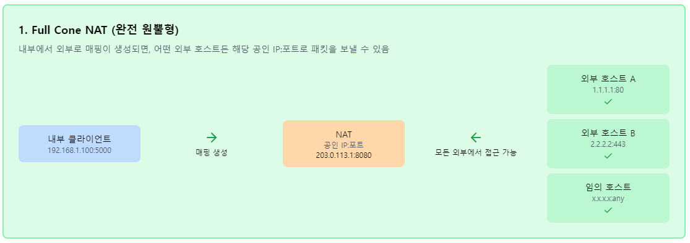
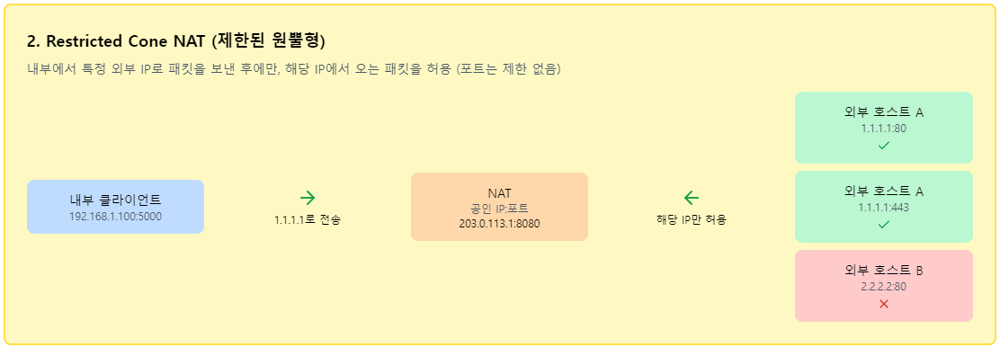
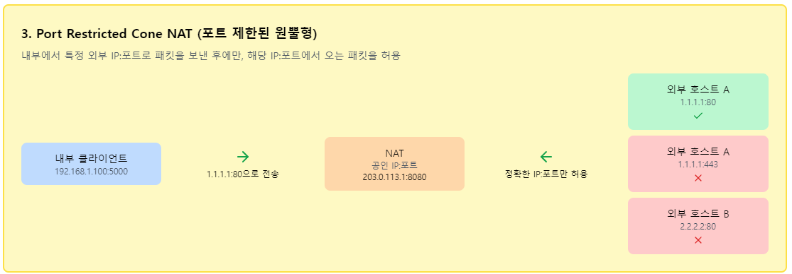
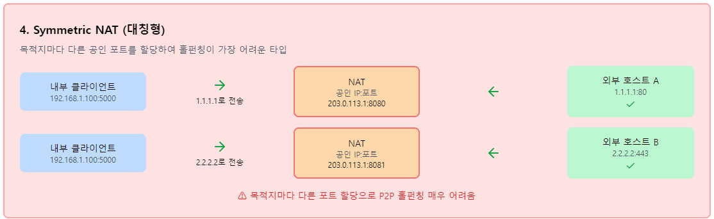
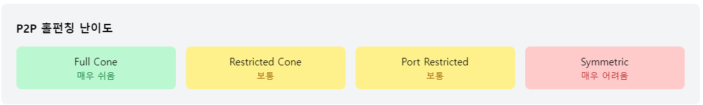

# C#과 P2P 통신을 이용한 온라인 게임 만들기

저자: 최흥배, AI-Assisted   
  
------  
  
# 1장: NAT와 방화벽의 이해
  
## 1.1 NAT(Network Address Translation)의 동작 원리
NAT는 내부 네트워크의 사설 IP 주소를 외부 네트워크의 공인 IP 주소로 변환하는 기술입니다. 이 과정에서 NAT 장비는 포트 번호도 함께 변환하여 여러 내부 장치가 하나의 공인 IP를 공유할 수 있도록 합니다.

### NAT 테이블의 동작 과정
1. **아웃바운드 트래픽**: 내부 클라이언트가 외부 서버로 패킷을 전송
2. **주소 변환**: NAT 장비가 사설 IP:포트를 공인 IP:포트로 변환
3. **테이블 기록**: 변환 정보를 NAT 테이블에 저장
4. **인바운드 트래픽**: 외부에서 응답이 오면 테이블을 참조하여 내부로 전달
  
[NAT 동작 시뮬레이터:](./images/NAT동작시뮬레이터.html)     
```
using System;
using System.Collections.Generic;
using System.Net;

namespace NATSimulator
{
    // NAT 테이블 엔트리
    public class NATEntry
    {
        public IPEndPoint InternalEndPoint { get; set; }
        public IPEndPoint ExternalEndPoint { get; set; }
        public DateTime LastActivity { get; set; }
        public int TimeoutSeconds { get; set; } = 60;

        public bool IsExpired => DateTime.Now.Subtract(LastActivity).TotalSeconds > TimeoutSeconds;
    }

    // 간단한 NAT 시뮬레이터
    public class NATSimulator
    {
        private readonly Dictionary<string, NATEntry> _natTable = new();
        private readonly IPAddress _publicIP;
        private int _nextPublicPort = 20000;

        public NATSimulator(IPAddress publicIP)
        {
            _publicIP = publicIP;
        }

        // 아웃바운드 패킷 처리 (내부 -> 외부)
        public IPEndPoint ProcessOutbound(IPEndPoint internalEndPoint, IPEndPoint destinationEndPoint)
        {
            var key = $"{internalEndPoint}:{destinationEndPoint}";
            
            if (_natTable.TryGetValue(key, out var entry) && !entry.IsExpired)
            {
                // 기존 매핑 사용
                entry.LastActivity = DateTime.Now;
                Console.WriteLine($"[NAT] 기존 매핑 사용: {internalEndPoint} -> {entry.ExternalEndPoint}");
                return entry.ExternalEndPoint;
            }

            // 새로운 매핑 생성
            var publicEndPoint = new IPEndPoint(_publicIP, _nextPublicPort++);
            _natTable[key] = new NATEntry
            {
                InternalEndPoint = internalEndPoint,
                ExternalEndPoint = publicEndPoint,
                LastActivity = DateTime.Now
            };

            Console.WriteLine($"[NAT] 새 매핑 생성: {internalEndPoint} -> {publicEndPoint}");
            return publicEndPoint;
        }

        // 인바운드 패킷 처리 (외부 -> 내부)
        public IPEndPoint? ProcessInbound(IPEndPoint sourceEndPoint, IPEndPoint publicEndPoint)
        {
            foreach (var kvp in _natTable)
            {
                var entry = kvp.Value;
                if (entry.ExternalEndPoint.Equals(publicEndPoint) && !entry.IsExpired)
                {
                    entry.LastActivity = DateTime.Now;
                    Console.WriteLine($"[NAT] 인바운드 매핑: {sourceEndPoint} -> {entry.InternalEndPoint}");
                    return entry.InternalEndPoint;
                }
            }

            Console.WriteLine($"[NAT] 매핑 없음: {sourceEndPoint} -> {publicEndPoint} (패킷 드롭)");
            return null;
        }

        // NAT 테이블 정리
        public void CleanupExpiredEntries()
        {
            var expiredKeys = new List<string>();
            foreach (var kvp in _natTable)
            {
                if (kvp.Value.IsExpired)
                {
                    expiredKeys.Add(kvp.Key);
                }
            }

            foreach (var key in expiredKeys)
            {
                _natTable.Remove(key);
                Console.WriteLine($"[NAT] 만료된 매핑 제거: {key}");
            }
        }

        // NAT 테이블 출력
        public void PrintNATTable()
        {
            Console.WriteLine("\n=== NAT 테이블 ===");
            foreach (var kvp in _natTable)
            {
                var entry = kvp.Value;
                var status = entry.IsExpired ? "만료됨" : "활성";
                Console.WriteLine($"{entry.InternalEndPoint} -> {entry.ExternalEndPoint} ({status})");
            }
            Console.WriteLine("================\n");
        }
    }

    class Program
    {
        static void Main(string[] args)
        {
            Console.WriteLine("NAT 동작 시뮬레이터");
            Console.WriteLine("==================");

            var natSimulator = new NATSimulator(IPAddress.Parse("203.0.113.1"));

            // 시뮬레이션 시나리오
            var client1 = new IPEndPoint(IPAddress.Parse("192.168.1.10"), 12345);
            var client2 = new IPEndPoint(IPAddress.Parse("192.168.1.11"), 12346);
            var server = new IPEndPoint(IPAddress.Parse("93.184.216.34"), 80);

            Console.WriteLine("1. 클라이언트들이 외부 서버로 패킷 전송");
            var public1 = natSimulator.ProcessOutbound(client1, server);
            var public2 = natSimulator.ProcessOutbound(client2, server);

            natSimulator.PrintNATTable();

            Console.WriteLine("2. 외부 서버에서 응답 패킷 수신");
            natSimulator.ProcessInbound(server, public1);
            natSimulator.ProcessInbound(server, public2);

            Console.WriteLine("\n3. 알 수 없는 외부 주소에서 패킷 수신 (차단됨)");
            var unknownSender = new IPEndPoint(IPAddress.Parse("198.51.100.1"), 8080);
            natSimulator.ProcessInbound(unknownSender, public1);

            Console.WriteLine("\n4. 동일한 클라이언트가 다른 서버로 연결");
            var anotherServer = new IPEndPoint(IPAddress.Parse("192.0.2.1"), 443);
            natSimulator.ProcessOutbound(client1, anotherServer);

            natSimulator.PrintNATTable();

            Console.WriteLine("시뮬레이션 완료. 아무 키나 누르세요...");
            Console.ReadKey();
        }
    }
}
```
  

## 1.2 NAT의 종류와 특성 (Full Cone, Restricted Cone, Port Restricted Cone, Symmetric)
NAT는 외부에서 들어오는 패킷을 어떻게 처리하는지에 따라 4가지 타입으로 분류됩니다. 이 분류는 P2P 홀펀칭의 성공 여부를 결정하는 중요한 요소입니다.

### 1. Full Cone NAT (완전 원뿔형)
- 내부에서 외부로 매핑이 생성되면, 어떤 외부 호스트든 해당 공인 IP:포트로 패킷을 보낼 수 있음
- 홀펀칭에 가장 유리한 타입  
   
  
### 2. Restricted Cone NAT (제한된 원뿔형)
- 내부에서 특정 외부 IP로 패킷을 보낸 후에만, 해당 IP에서 오는 패킷을 허용
- 포트는 제한하지 않음  
     

### 3. Port Restricted Cone NAT (포트 제한된 원뿔형)
- 내부에서 특정 외부 IP:포트로 패킷을 보낸 후에만, 해당 IP:포트에서 오는 패킷을 허용
- 가장 일반적인 NAT 타입
     
  
### 4. Symmetric NAT (대칭형)
- 목적지마다 다른 공인 포트를 할당
- 홀펀칭이 가장 어려운 타입
     
  

   

  
NAT 타입별 동작 시뮬레이터:     
```
using System;
using System.Collections.Generic;
using System.Net;

namespace NATTypesSimulator
{
    public enum NATType
    {
        FullCone,
        RestrictedCone,
        PortRestrictedCone,
        Symmetric
    }

    public class NATMapping
    {
        public IPEndPoint InternalEndPoint { get; set; }
        public IPEndPoint ExternalEndPoint { get; set; }
        public IPEndPoint DestinationEndPoint { get; set; } // Symmetric NAT용
        public HashSet<IPAddress> AllowedIPs { get; set; } = new();
        public HashSet<IPEndPoint> AllowedEndPoints { get; set; } = new();
        public DateTime LastActivity { get; set; }
        public bool IsExpired => DateTime.Now.Subtract(LastActivity).TotalSeconds > 60;
    }

    public class NATTypeSimulator
    {
        private readonly NATType _natType;
        private readonly IPAddress _publicIP;
        private readonly Dictionary<string, NATMapping> _mappings = new();
        private int _nextPublicPort = 20000;

        public NATTypeSimulator(NATType natType, IPAddress publicIP)
        {
            _natType = natType;
            _publicIP = publicIP;
        }

        public IPEndPoint ProcessOutbound(IPEndPoint internalEndPoint, IPEndPoint destinationEndPoint)
        {
            var key = GetMappingKey(internalEndPoint, destinationEndPoint);
            
            if (_mappings.TryGetValue(key, out var mapping) && !mapping.IsExpired)
            {
                mapping.LastActivity = DateTime.Now;
                UpdateAllowedEndpoints(mapping, destinationEndPoint);
                Console.WriteLine($"[{_natType}] 기존 매핑: {internalEndPoint} -> {mapping.ExternalEndPoint}");
                return mapping.ExternalEndPoint;
            }

            // 새 매핑 생성
            var publicEndPoint = new IPEndPoint(_publicIP, _nextPublicPort++);
            mapping = new NATMapping
            {
                InternalEndPoint = internalEndPoint,
                ExternalEndPoint = publicEndPoint,
                DestinationEndPoint = destinationEndPoint,
                LastActivity = DateTime.Now
            };

            UpdateAllowedEndpoints(mapping, destinationEndPoint);
            _mappings[key] = mapping;

            Console.WriteLine($"[{_natType}] 새 매핑: {internalEndPoint} -> {publicEndPoint} (목적지: {destinationEndPoint})");
            return publicEndPoint;
        }

        public IPEndPoint? ProcessInbound(IPEndPoint sourceEndPoint, IPEndPoint publicEndPoint)
        {
            foreach (var mapping in _mappings.Values)
            {
                if (mapping.ExternalEndPoint.Equals(publicEndPoint) && !mapping.IsExpired)
                {
                    if (IsInboundAllowed(mapping, sourceEndPoint))
                    {
                        mapping.LastActivity = DateTime.Now;
                        Console.WriteLine($"[{_natType}] 인바운드 허용: {sourceEndPoint} -> {mapping.InternalEndPoint}");
                        return mapping.InternalEndPoint;
                    }
                    else
                    {
                        Console.WriteLine($"[{_natType}] 인바운드 차단: {sourceEndPoint} -> {publicEndPoint}");
                        return null;
                    }
                }
            }

            Console.WriteLine($"[{_natType}] 매핑 없음: {sourceEndPoint} -> {publicEndPoint}");
            return null;
        }

        private string GetMappingKey(IPEndPoint internalEndPoint, IPEndPoint destinationEndPoint)
        {
            return _natType switch
            {
                NATType.Symmetric => $"{internalEndPoint}:{destinationEndPoint}",
                _ => internalEndPoint.ToString()
            };
        }

        private void UpdateAllowedEndpoints(NATMapping mapping, IPEndPoint destinationEndPoint)
        {
            switch (_natType)
            {
                case NATType.FullCone:
                    // 모든 주소 허용 (특별한 업데이트 불필요)
                    break;
                case NATType.RestrictedCone:
                    mapping.AllowedIPs.Add(destinationEndPoint.Address);
                    break;
                case NATType.PortRestrictedCone:
                case NATType.Symmetric:
                    mapping.AllowedEndPoints.Add(destinationEndPoint);
                    break;
            }
        }

        private bool IsInboundAllowed(NATMapping mapping, IPEndPoint sourceEndPoint)
        {
            return _natType switch
            {
                NATType.FullCone => true,
                NATType.RestrictedCone => mapping.AllowedIPs.Contains(sourceEndPoint.Address),
                NATType.PortRestrictedCone => mapping.AllowedEndPoints.Contains(sourceEndPoint),
                NATType.Symmetric => mapping.AllowedEndPoints.Contains(sourceEndPoint),
                _ => false
            };
        }

        public void PrintMappings()
        {
            Console.WriteLine($"\n=== {_natType} NAT 매핑 테이블 ===");
            foreach (var mapping in _mappings.Values)
            {
                Console.WriteLine($"{mapping.InternalEndPoint} -> {mapping.ExternalEndPoint}");
                
                switch (_natType)
                {
                    case NATType.FullCone:
                        Console.WriteLine("  허용: 모든 주소");
                        break;
                    case NATType.RestrictedCone:
                        Console.WriteLine($"  허용 IP: {string.Join(", ", mapping.AllowedIPs)}");
                        break;
                    case NATType.PortRestrictedCone:
                    case NATType.Symmetric:
                        Console.WriteLine($"  허용 EndPoint: {string.Join(", ", mapping.AllowedEndPoints)}");
                        break;
                }
            }
            Console.WriteLine("========================\n");
        }
    }

    class Program
    {
        static void Main(string[] args)
        {
            Console.WriteLine("NAT 타입별 동작 시뮬레이터");
            Console.WriteLine("=========================");

            var publicIP = IPAddress.Parse("203.0.113.1");
            var client = new IPEndPoint(IPAddress.Parse("192.168.1.10"), 12345);
            var server1 = new IPEndPoint(IPAddress.Parse("93.184.216.34"), 80);
            var server2 = new IPEndPoint(IPAddress.Parse("93.184.216.34"), 443);
            var server3 = new IPEndPoint(IPAddress.Parse("192.0.2.1"), 80);

            var natTypes = new[] { NATType.FullCone, NATType.RestrictedCone, NATType.PortRestrictedCone, NATType.Symmetric };

            foreach (var natType in natTypes)
            {
                Console.WriteLine($"\n{'='*50}");
                Console.WriteLine($"{natType} NAT 테스트");
                Console.WriteLine($"{'='*50}");

                var nat = new NATTypeSimulator(natType, publicIP);

                // 1. 클라이언트가 서버1로 패킷 전송
                Console.WriteLine("\n1. 클라이언트 -> 서버1 (93.184.216.34:80)");
                var publicEndPoint1 = nat.ProcessOutbound(client, server1);

                // 2. 클라이언트가 서버2로 패킷 전송 (같은 IP, 다른 포트)
                Console.WriteLine("\n2. 클라이언트 -> 서버2 (93.184.216.34:443)");
                var publicEndPoint2 = nat.ProcessOutbound(client, server2);

                // 3. 클라이언트가 서버3으로 패킷 전송 (다른 IP)
                Console.WriteLine("\n3. 클라이언트 -> 서버3 (192.0.2.1:80)");
                var publicEndPoint3 = nat.ProcessOutbound(client, server3);

                nat.PrintMappings();

                // 4. 홀펀칭 테스트
                Console.WriteLine("4. 홀펀칭 테스트");
                
                // 서버1에서 응답 (정상)
                Console.WriteLine("  서버1에서 응답:");
                nat.ProcessInbound(server1, publicEndPoint1);

                // 서버2에서 다른 포트로 응답 (NAT 타입에 따라 다름)
                var server2DifferentPort = new IPEndPoint(server2.Address, 8080);
                Console.WriteLine("  서버2에서 다른 포트로 응답:");
                nat.ProcessInbound(server2DifferentPort, publicEndPoint2);

                // 전혀 알 수 없는 서버에서 패킷
                var unknownServer = new IPEndPoint(IPAddress.Parse("198.51.100.1"), 80);
                Console.WriteLine("  알 수 없는 서버에서 패킷:");
                nat.ProcessInbound(unknownServer, publicEndPoint1);
            }

            Console.WriteLine("\n\n홀펀칭 성공 가능성 요약:");
            Console.WriteLine("- Full Cone NAT: 매우 높음 (모든 주소에서 접근 가능)");
            Console.WriteLine("- Restricted Cone NAT: 높음 (같은 IP면 다른 포트도 허용)");
            Console.WriteLine("- Port Restricted Cone NAT: 보통 (정확한 IP:포트만 허용)");
            Console.WriteLine("- Symmetric NAT: 낮음 (목적지마다 다른 포트 할당)");

            Console.WriteLine("\n아무 키나 누르세요...");
            Console.ReadKey();
        }
    }
}
```
  

## 1.3 방화벽과 포트 차단 메커니즘
방화벽은 NAT와 별개로 동작하는 보안 장치로, 미리 정의된 규칙에 따라 패킷을 허용하거나 차단합니다. 게임 개발자가 이해해야 할 주요 방화벽 메커니즘은 다음과 같습니다.

### 방화벽의 주요 필터링 방식

1. **상태 기반 필터링 (Stateful Filtering)**
   - 연결 상태를 추적하여 응답 패킷만 허용
   - TCP 연결의 3-way handshake 모니터링

2. **포트 기반 필터링**
   - 특정 포트 범위를 차단하거나 허용
   - 게임에서 자주 사용하는 포트들이 차단될 수 있음

3. **DPI (Deep Packet Inspection)**
   - 패킷 내용을 분석하여 특정 프로토콜이나 애플리케이션 차단
   - P2P 트래픽 탐지 및 차단
   
방화벽 동작 시뮬레이터:  
```
using System;
using System.Collections.Generic;
using System.Net;

namespace FirewallSimulator
{
    public enum FirewallAction
    {
        Allow,
        Block,
        Drop
    }

    public enum TrafficDirection
    {
        Inbound,
        Outbound
    }

    public class FirewallRule
    {
        public string Name { get; set; }
        public TrafficDirection Direction { get; set; }
        public IPAddress? SourceIP { get; set; }
        public IPAddress? DestinationIP { get; set; }
        public int? SourcePort { get; set; }
        public int? DestinationPort { get; set; }
        public string Protocol { get; set; } = "UDP";
        public FirewallAction Action { get; set; }
        public int Priority { get; set; } // 낮은 숫자가 높은 우선순위

        public bool Matches(TrafficDirection direction, IPEndPoint source, IPEndPoint destination, string protocol)
        {
            if (Direction != direction) return false;
            if (Protocol != "*" && Protocol.ToUpper() != protocol.ToUpper()) return false;
            if (SourceIP != null && !SourceIP.Equals(source.Address)) return false;
            if (DestinationIP != null && !DestinationIP.Equals(destination.Address)) return false;
            if (SourcePort.HasValue && SourcePort.Value != source.Port) return false;
            if (DestinationPort.HasValue && DestinationPort.Value != destination.Port) return false;
            
            return true;
        }
    }

    public class ConnectionState
    {
        public IPEndPoint Source { get; set; }
        public IPEndPoint Destination { get; set; }
        public DateTime Established { get; set; }
        public DateTime LastActivity { get; set; }
        public string Protocol { get; set; }
        public bool IsExpired => DateTime.Now.Subtract(LastActivity).TotalSeconds > 30;
    }

    public class StatefulFirewall
    {
        private readonly List<FirewallRule> _rules = new();
        private readonly Dictionary<string, ConnectionState> _connections = new();
        private bool _defaultBlock = true;

        public StatefulFirewall(bool defaultBlock = true)
        {
            _defaultBlock = defaultBlock;
            InitializeDefaultRules();
        }

        private void InitializeDefaultRules()
        {
            // 기본 규칙들
            AddRule(new FirewallRule
            {
                Name = "로컬 루프백 허용",
                Direction = TrafficDirection.Outbound,
                DestinationIP = IPAddress.Loopback,
                Action = FirewallAction.Allow,
                Priority = 1
            });

            AddRule(new FirewallRule
            {
                Name = "사설망 내부 통신 허용",
                Direction = TrafficDirection.Outbound,
                Action = FirewallAction.Allow,
                Priority = 10
            });

            // 게임 포트 차단 시뮬레이션
            AddRule(new FirewallRule
            {
                Name = "P2P 포트 차단",
                Direction = TrafficDirection.Inbound,
                DestinationPort = 6881, // BitTorrent 기본 포트
                Action = FirewallAction.Block,
                Priority = 5
            });

            // 일반적인 게임 포트 허용
            AddRule(new FirewallRule
            {
                Name = "게임 포트 허용",
                Direction = TrafficDirection.Inbound,
                DestinationPort = 7777,
                Action = FirewallAction.Allow,
                Priority = 15
            });
        }

        public void AddRule(FirewallRule rule)
        {
            _rules.Add(rule);
            _rules.Sort((a, b) => a.Priority.CompareTo(b.Priority));
        }

        public FirewallAction ProcessPacket(TrafficDirection direction, IPEndPoint source, IPEndPoint destination, string protocol = "UDP")
        {
            var connectionKey = $"{source}:{destination}:{protocol}";

            // 1. 기존 연결 상태 확인
            if (direction == TrafficDirection.Inbound && _connections.ContainsKey(connectionKey))
            {
                var connection = _connections[connectionKey];
                if (!connection.IsExpired)
                {
                    connection.LastActivity = DateTime.Now;
                    Console.WriteLine($"[방화벽] 기존 연결 허용: {source} -> {destination}");
                    return FirewallAction.Allow;
                }
                else
                {
                    _connections.Remove(connectionKey);
                }
            }

            // 2. 방화벽 규칙 확인
            foreach (var rule in _rules)
            {
                if (rule.Matches(direction, source, destination, protocol))
                {
                    Console.WriteLine($"[방화벽] 규칙 적용: '{rule.Name}' -> {rule.Action}");
                    
                    if (rule.Action == FirewallAction.Allow && direction == TrafficDirection.Outbound)
                    {
                        // 아웃바운드 연결 허용 시 상태 기록
                        _connections[connectionKey] = new ConnectionState
                        {
                            Source = source,
                            Destination = destination,
                            Established = DateTime.Now,
                            LastActivity = DateTime.Now,
                            Protocol = protocol
                        };
                    }
                    
                    return rule.Action;
                }
            }

            // 3. 기본 정책 적용
            var defaultAction = _defaultBlock ? FirewallAction.Block : FirewallAction.Allow;
            Console.WriteLine($"[방화벽] 기본 정책: {defaultAction}");
            return defaultAction;
        }

        public void CleanupExpiredConnections()
        {
            var expiredKeys = new List<string>();
            foreach (var kvp in _connections)
            {
                if (kvp.Value.IsExpired)
                {
                    expiredKeys.Add(kvp.Key);
                }
            }

            foreach (var key in expiredKeys)
            {
                Console.WriteLine($"[방화벽] 만료된 연결 제거: {key}");
                _connections.Remove(key);
            }
        }

        public void PrintRules()
        {
            Console.WriteLine("\n=== 방화벽 규칙 ===");
            foreach (var rule in _rules)
            {
                Console.WriteLine($"[{rule.Priority:D2}] {rule.Name}: {rule.Direction} {rule.Action}");
                if (rule.SourceIP != null) Console.WriteLine($"    Source IP: {rule.SourceIP}");
                if (rule.DestinationIP != null) Console.WriteLine($"    Dest IP: {rule.DestinationIP}");
                if (rule.SourcePort.HasValue) Console.WriteLine($"    Source Port: {rule.SourcePort}");
                if (rule.DestinationPort.HasValue) Console.WriteLine($"    Dest Port: {rule.DestinationPort}");
            }
            Console.WriteLine("==================\n");
        }

        public void PrintConnections()
        {
            Console.WriteLine("\n=== 활성 연결 ===");
            foreach (var kvp in _connections)
            {
                var conn = kvp.Value;
                var age = DateTime.Now.Subtract(conn.Established).TotalSeconds;
                Console.WriteLine($"{conn.Source} -> {conn.Destination} ({conn.Protocol}) - {age:F1}초");
            }
            Console.WriteLine("================\n");
        }
    }

    class Program
    {
        static void Main(string[] args)
        {
            Console.WriteLine("방화벽 동작 시뮬레이터");
            Console.WriteLine("====================");

            var firewall = new StatefulFirewall(defaultBlock: true);
            firewall.PrintRules();

            // 테스트 시나리오
            var localClient = new IPEndPoint(IPAddress.Parse("192.168.1.10"), 12345);
            var gameServer = new IPEndPoint(IPAddress.Parse("93.184.216.34"), 7777);
            var p2pPeer = new IPEndPoint(IPAddress.Parse("203.0.113.100"), 6881);
            var unknownServer = new IPEndPoint(IPAddress.Parse("198.51.100.1"), 8080);

            Console.WriteLine("테스트 시나리오 실행:");
            Console.WriteLine("===================");

            // 1. 정상적인 게임 서버 연결
            Console.WriteLine("\n1. 게임 서버 연결 테스트");
            firewall.ProcessPacket(TrafficDirection.Outbound, localClient, gameServer);
            firewall.ProcessPacket(TrafficDirection.Inbound, gameServer, localClient);

            // 2. P2P 포트 차단 테스트
            Console.WriteLine("\n2. P2P 포트 차단 테스트");
            firewall.ProcessPacket(TrafficDirection.Outbound, localClient, p2pPeer);
            firewall.ProcessPacket(TrafficDirection.Inbound, p2pPeer, localClient);

            // 3. 알 수 없는 서버에서 연결 시도
            Console.WriteLine("\n3. 알 수 없는 연결 시도");
            firewall.ProcessPacket(TrafficDirection.Inbound, unknownServer, localClient);

            // 4. 상태 기반 필터링 테스트
            Console.WriteLine("\n4. 상태 기반 필터링");
            firewall.ProcessPacket(TrafficDirection.Outbound, localClient, unknownServer);
            System.Threading.Thread.Sleep(1000); // 1초 대기
            firewall.ProcessPacket(TrafficDirection.Inbound, unknownServer, localClient);

            firewall.PrintConnections();

            // 5. 방화벽 우회 기법 시뮬레이션
            Console.WriteLine("5. 방화벽 우회 기법");
            
            // 포트 변경
            var alternativePort = new IPEndPoint(p2pPeer.Address, 7778);
            Console.WriteLine("  대체 포트 사용:");
            firewall.ProcessPacket(TrafficDirection.Outbound, localClient, alternativePort);
            firewall.ProcessPacket(TrafficDirection.Inbound, alternativePort, localClient);

            // UPnP 시뮬레이션 (동적 규칙 추가)
            Console.WriteLine("\n  UPnP를 통한 포트 열기 시뮬레이션:");
            firewall.AddRule(new FirewallRule
            {
                Name = "UPnP 동적 규칙",
                Direction = TrafficDirection.Inbound,
                DestinationPort = 12345,
                Action = FirewallAction.Allow,
                Priority = 3
            });

            var upnpTest = new IPEndPoint(IPAddress.Parse("198.51.100.2"), 54321);
            firewall.ProcessPacket(TrafficDirection.Inbound, upnpTest, localClient);

            Console.WriteLine("\n방화벽 시뮬레이션 완료.");
            Console.WriteLine("\n게임 개발 시 고려사항:");
            Console.WriteLine("- 기본 게임 포트는 방화벽에서 허용되는 범위 사용");
            Console.WriteLine("- UPnP를 활용한 동적 포트 개방");
            Console.WriteLine("- 대체 포트를 통한 연결 재시도");
            Console.WriteLine("- HTTPS/WSS를 활용한 시그널링");

            Console.WriteLine("\n아무 키나 누르세요...");
            Console.ReadKey();
        }
    }
}
```    
  

## 1.4 P2P 통신에서 NAT가 미치는 영향
NAT는 P2P 통신에서 가장 큰 장벽 중 하나입니다. 두 클라이언트가 모두 NAT 뒤에 있을 때, 직접적인 연결이 불가능한 이유와 이를 해결하기 위한 홀펀칭의 필요성을 이해해보겠습니다.

### NAT가 P2P 통신에 미치는 주요 문제

1. **주소 가시성 문제**: 내부 클라이언트는 자신의 공인 IP와 포트를 모름
2. **비대칭 연결**: 각 NAT는 자신이 생성하지 않은 매핑으로 들어오는 패킷을 차단
3. **포트 예측 불가**: Symmetric NAT에서는 목적지마다 다른 포트 할당
4. **타이밍 문제**: 동시에 홀펀칭을 수행해야 성공 확률이 높아짐## 1장 요약

  
### 핵심 내용

**NAT의 동작 원리**
- 사설 IP를 공인 IP로 변환하는 주소 변환 테이블 관리
- 아웃바운드 연결은 허용하지만 인바운드 연결은 기본적으로 차단

**NAT 타입별 특성과 홀펀칭 영향**
- **Full Cone**: 홀펀칭 성공률 95% (가장 유리)
- **Restricted Cone**: 홀펀칭 성공률 85% (비교적 유리)  
- **Port Restricted Cone**: 홀펀칭 성공률 75% (일반적)
- **Symmetric**: 홀펀칭 성공률 15% (가장 어려움)

**방화벽의 추가 제약**
- 상태 기반 필터링으로 연결 추적
- 특정 포트 범위 차단 가능
- UPnP를 통한 동적 포트 개방 활용

**P2P 통신의 핵심 문제점**
- 클라이언트가 자신의 공인 주소를 모름
- 양방향 동시 홀펀칭이 필요
- NAT 타입 조합에 따라 성공률이 크게 달라짐
- 실패 시 TURN 릴레이 서버 필요

  
  
# 2장: 홀펀칭 기술 개론
  
## 2.1 홀펀칭의 개념과 필요성

### 2.1.1 NAT 환경의 문제점
현대 인터넷 환경에서 대부분의 사용자는 NAT(Network Address Translation) 뒤에 위치합니다. 가정용 라우터, 회사 방화벽, 모바일 통신사의 NAT 등이 그 예입니다. NAT는 내부 네트워크의 여러 기기가 하나의 공인 IP 주소를 공유할 수 있게 해주지만, 외부에서 내부로의 직접 연결을 차단합니다.

온라인 게임에서 P2P 통신을 구현할 때 이는 심각한 문제가 됩니다. 두 플레이어가 모두 NAT 뒤에 있다면 서로에게 직접 연결할 수 없습니다. 이때 필요한 것이 홀펀칭(Hole Punching) 기술입니다.

### 2.1.2 홀펀칭의 기본 원리
홀펀칭은 NAT의 동작 방식을 이용해 "구멍"을 뚫는 기술입니다. NAT는 내부에서 외부로 나가는 패킷에 대해 임시 포트 매핑을 생성하고, 이 매핑을 통해 외부의 응답 패킷이 내부로 들어올 수 있게 합니다.

다음은 홀펀칭의 기본 시나리오를 보여주는 C# 예제입니다:

```csharp
using System;
using System.Net;
using System.Net.Sockets;
using System.Threading.Tasks;

public class BasicHolePunchingDemo
{
    private UdpClient _udpClient;
    private IPEndPoint _localEndPoint;
    private IPEndPoint _publicEndPoint;
    
    public async Task<bool> InitializeClient(int localPort)
    {
        try
        {
            _localEndPoint = new IPEndPoint(IPAddress.Any, localPort);
            _udpClient = new UdpClient(_localEndPoint);
            
            // STUN 서버를 통해 공인 IP와 포트 확인
            _publicEndPoint = await GetPublicEndPoint();
            
            Console.WriteLine($"로컬 주소: {_localEndPoint}");
            Console.WriteLine($"공인 주소: {_publicEndPoint}");
            
            return true;
        }
        catch (Exception ex)
        {
            Console.WriteLine($"클라이언트 초기화 실패: {ex.Message}");
            return false;
        }
    }
    
    private async Task<IPEndPoint> GetPublicEndPoint()
    {
        // 간단한 STUN 요청 시뮬레이션
        // 실제로는 STUN 프로토콜을 구현해야 함
        return new IPEndPoint(IPAddress.Parse("203.0.113.1"), 12345);
    }
    
    public async Task PerformHolePunching(IPEndPoint peerPublicEndPoint)
    {
        Console.WriteLine($"홀펀칭 시작: {peerPublicEndPoint}");
        
        // 상대방의 공인 주소로 패킷 전송하여 NAT에 구멍 뚫기
        var helloMessage = System.Text.Encoding.UTF8.GetBytes("HELLO");
        
        for (int i = 0; i < 10; i++)
        {
            await _udpClient.SendAsync(helloMessage, helloMessage.Length, peerPublicEndPoint);
            Console.WriteLine($"홀펀칭 패킷 전송 #{i + 1}");
            await Task.Delay(100);
        }
    }
}
```

### 2.1.3 시그널링 서버의 역할
홀펀칭을 위해서는 양쪽 클라이언트가 서로의 공인 IP 주소와 포트를 알아야 합니다. 이를 위해 시그널링 서버가 필요합니다:

```csharp
public class SignalingServer
{
    private Dictionary<string, ClientInfo> _connectedClients = new();
    private TcpListener _listener;
    
    public class ClientInfo
    {
        public string Id { get; set; }
        public IPEndPoint LocalEndPoint { get; set; }
        public IPEndPoint PublicEndPoint { get; set; }
        public NetworkStream Stream { get; set; }
    }
    
    public async Task StartServer(int port)
    {
        _listener = new TcpListener(IPAddress.Any, port);
        _listener.Start();
        
        Console.WriteLine($"시그널링 서버 시작: 포트 {port}");
        
        while (true)
        {
            var tcpClient = await _listener.AcceptTcpClientAsync();
            _ = Task.Run(() => HandleClient(tcpClient));
        }
    }
    
    private async Task HandleClient(TcpClient tcpClient)
    {
        var stream = tcpClient.GetStream();
        var buffer = new byte[1024];
        
        try
        {
            while (tcpClient.Connected)
            {
                var bytesRead = await stream.ReadAsync(buffer, 0, buffer.Length);
                if (bytesRead == 0) break;
                
                var message = System.Text.Encoding.UTF8.GetString(buffer, 0, bytesRead);
                await ProcessMessage(stream, message, tcpClient.Client.RemoteEndPoint as IPEndPoint);
            }
        }
        catch (Exception ex)
        {
            Console.WriteLine($"클라이언트 처리 오류: {ex.Message}");
        }
        finally
        {
            tcpClient.Close();
        }
    }
    
    private async Task ProcessMessage(NetworkStream stream, string message, IPEndPoint remoteEndPoint)
    {
        var parts = message.Split('|');
        var command = parts[0];
        
        switch (command)
        {
            case "REGISTER":
                await HandleRegister(stream, parts, remoteEndPoint);
                break;
            case "REQUEST_PEER":
                await HandlePeerRequest(stream, parts[1]);
                break;
        }
    }
    
    private async Task HandleRegister(NetworkStream stream, string[] parts, IPEndPoint remoteEndPoint)
    {
        var clientId = parts[1];
        var localPort = int.Parse(parts[2]);
        
        var clientInfo = new ClientInfo
        {
            Id = clientId,
            LocalEndPoint = new IPEndPoint(IPAddress.Parse("127.0.0.1"), localPort),
            PublicEndPoint = remoteEndPoint,
            Stream = stream
        };
        
        _connectedClients[clientId] = clientInfo;
        
        var response = $"REGISTERED|{remoteEndPoint}";
        var responseBytes = System.Text.Encoding.UTF8.GetBytes(response);
        await stream.WriteAsync(responseBytes, 0, responseBytes.Length);
        
        Console.WriteLine($"클라이언트 등록: {clientId} - {remoteEndPoint}");
    }
    
    private async Task HandlePeerRequest(NetworkStream stream, string targetClientId)
    {
        if (_connectedClients.TryGetValue(targetClientId, out var targetClient))
        {
            var response = $"PEER_INFO|{targetClient.PublicEndPoint}";
            var responseBytes = System.Text.Encoding.UTF8.GetBytes(response);
            await stream.WriteAsync(responseBytes, 0, responseBytes.Length);
        }
    }
}
```
  


## 2.2 UDP 홀펀칭 vs TCP 홀펀칭

### 2.2.1 UDP 홀펀칭의 특징
UDP 홀펀칭은 상대적으로 구현하기 쉽고 성공률이 높습니다. UDP는 연결 상태를 유지하지 않는 비연결형 프로토콜이므로 NAT 통과가 더 용이합니다.

```csharp
public class UdpHolePunching
{
    private UdpClient _udpClient;
    private bool _isConnected = false;
    
    public async Task<bool> ConnectToPeer(IPEndPoint localEndPoint, IPEndPoint peerEndPoint)
    {
        _udpClient = new UdpClient(localEndPoint);
        
        // 동시에 패킷을 전송하여 홀펀칭 수행
        var punchingTask = PerformUdpPunching(peerEndPoint);
        var listeningTask = ListenForPeerResponse();
        
        // 5초 내에 연결 성공 여부 확인
        var timeoutTask = Task.Delay(5000);
        var completedTask = await Task.WhenAny(listeningTask, timeoutTask);
        
        if (completedTask == listeningTask)
        {
            _isConnected = true;
            Console.WriteLine("UDP 홀펀칭 성공!");
            return true;
        }
        else
        {
            Console.WriteLine("UDP 홀펀칭 타임아웃");
            return false;
        }
    }
    
    private async Task PerformUdpPunching(IPEndPoint peerEndPoint)
    {
        var punchMessage = System.Text.Encoding.UTF8.GetBytes("UDP_PUNCH");
        
        while (!_isConnected)
        {
            try
            {
                await _udpClient.SendAsync(punchMessage, punchMessage.Length, peerEndPoint);
                Console.WriteLine($"UDP 펀칭 패킷 전송: {peerEndPoint}");
                await Task.Delay(200);
            }
            catch (Exception ex)
            {
                Console.WriteLine($"UDP 펀칭 오류: {ex.Message}");
                break;
            }
        }
    }
    
    private async Task ListenForPeerResponse()
    {
        while (!_isConnected)
        {
            try
            {
                var result = await _udpClient.ReceiveAsync();
                var message = System.Text.Encoding.UTF8.GetString(result.Buffer);
                
                if (message == "UDP_PUNCH" || message == "UDP_PUNCH_ACK")
                {
                    // 응답 전송
                    var ackMessage = System.Text.Encoding.UTF8.GetBytes("UDP_PUNCH_ACK");
                    await _udpClient.SendAsync(ackMessage, ackMessage.Length, result.RemoteEndPoint);
                    
                    _isConnected = true;
                    Console.WriteLine($"피어로부터 응답 수신: {result.RemoteEndPoint}");
                    break;
                }
            }
            catch (Exception ex)
            {
                Console.WriteLine($"UDP 수신 오류: {ex.Message}");
                break;
            }
        }
    }
    
    public async Task SendGameData(byte[] data, IPEndPoint target)
    {
        if (_isConnected && _udpClient != null)
        {
            await _udpClient.SendAsync(data, data.Length, target);
        }
    }
}
```

### 2.2.2 TCP 홀펀칭의 특징
TCP 홀펀칭은 UDP보다 복잡하지만 안정적인 연결을 제공합니다. TCP는 연결 지향적이므로 홀펀칭 후에도 연결 상태를 유지할 수 있습니다.

```csharp
public class TcpHolePunching
{
    private TcpListener _listener;
    private TcpClient _client;
    private NetworkStream _stream;
    
    public async Task<bool> ConnectToPeer(IPEndPoint localEndPoint, IPEndPoint peerEndPoint)
    {
        // 로컬 포트에서 리스닝 시작
        _listener = new TcpListener(localEndPoint);
        _listener.Start();
        
        // 동시에 연결 시도
        var connectTask = AttemptConnection(peerEndPoint);
        var acceptTask = AcceptConnection();
        
        var completedTask = await Task.WhenAny(connectTask, acceptTask, Task.Delay(10000));
        
        if (completedTask == connectTask && connectTask.Result)
        {
            _listener.Stop();
            Console.WriteLine("TCP 홀펀칭 성공 (클라이언트 역할)");
            return true;
        }
        else if (completedTask == acceptTask && acceptTask.Result != null)
        {
            _client = acceptTask.Result;
            _stream = _client.GetStream();
            Console.WriteLine("TCP 홀펀칭 성공 (서버 역할)");
            return true;
        }
        else
        {
            _listener?.Stop();
            Console.WriteLine("TCP 홀펀칭 실패");
            return false;
        }
    }
    
    private async Task<bool> AttemptConnection(IPEndPoint peerEndPoint)
    {
        for (int attempt = 0; attempt < 50; attempt++)
        {
            try
            {
                _client = new TcpClient();
                await _client.ConnectAsync(peerEndPoint.Address, peerEndPoint.Port);
                _stream = _client.GetStream();
                return true;
            }
            catch
            {
                _client?.Close();
                await Task.Delay(200);
            }
        }
        return false;
    }
    
    private async Task<TcpClient> AcceptConnection()
    {
        try
        {
            return await _listener.AcceptTcpClientAsync();
        }
        catch
        {
            return null;
        }
    }
    
    public async Task SendReliableGameData(byte[] data)
    {
        if (_stream != null && _client?.Connected == true)
        {
            await _stream.WriteAsync(data, 0, data.Length);
        }
    }
}
```

### 2.2.3 프로토콜 선택 기준
게임 개발에서 프로토콜 선택은 다음 요소들을 고려해야 합니다:

**UDP 홀펀칭 장점:**
- 높은 성공률 (약 85-95%)
- 낮은 레이턴시
- 간단한 구현
- 실시간 게임 데이터에 적합

**TCP 홀펀칭 장점:**
- 안정적인 데이터 전송
- 연결 상태 유지
- 순서 보장
- 중요한 게임 상태 동기화에 적합

**하이브리드 접근법:**
```csharp
public class HybridGameCommunication
{
    private UdpHolePunching _udpConnection;
    private TcpHolePunching _tcpConnection;
    
    public async Task<bool> EstablishConnections(IPEndPoint localUdp, IPEndPoint localTcp, 
                                               IPEndPoint peerUdp, IPEndPoint peerTcp)
    {
        _udpConnection = new UdpHolePunching();
        _tcpConnection = new TcpHolePunching();
        
        var udpTask = _udpConnection.ConnectToPeer(localUdp, peerUdp);
        var tcpTask = _tcpConnection.ConnectToPeer(localTcp, peerTcp);
        
        var results = await Task.WhenAll(udpTask, tcpTask);
        return results[0] && results[1];
    }
    
    public async Task SendPlayerMovement(PlayerMovementData movement)
    {
        // 실시간 이동 데이터는 UDP로
        var data = SerializeMovement(movement);
        await _udpConnection.SendGameData(data, movement.TargetEndPoint);
    }
    
    public async Task SendCriticalGameEvent(GameEvent gameEvent)
    {
        // 중요한 게임 이벤트는 TCP로
        var data = SerializeGameEvent(gameEvent);
        await _tcpConnection.SendReliableGameData(data);
    }
    
    private byte[] SerializeMovement(PlayerMovementData movement)
    {
        // 플레이어 이동 데이터 직렬화
        return new byte[0]; // 구현 필요
    }
    
    private byte[] SerializeGameEvent(GameEvent gameEvent)
    {
        // 게임 이벤트 직렬화
        return new byte[0]; // 구현 필요
    }
}
```

## 2.3 홀펀칭 성공률과 제약사항

### 2.3.1 NAT 타입별 성공률
홀펀칭의 성공률은 NAT의 타입에 따라 크게 달라집니다:

```csharp
public enum NATType
{
    FullCone,           // 성공률 ~95%
    RestrictedCone,     // 성공률 ~90%
    PortRestricted,     // 성공률 ~85%
    Symmetric           // 성공률 ~60%
}
```

### 2.3.2 실패 시나리오와 대응 방안

홀펀칭이 실패하는 주요 시나리오들과 대응 방안입니다:

```csharp
public class FallbackStrategy
{
    private readonly List<IConnectionMethod> _connectionMethods;
    
    public FallbackStrategy()
    {
        _connectionMethods = new List<IConnectionMethod>
        {
            new DirectConnection(),
            new UDPHolePunching(),
            new TCPHolePunching(),
            new TURNRelay(),
            new HTTPTunneling()
        };
    }
    
    public async Task<IGameConnection> EstablishConnection(PeerInfo peer)
    {
        Console.WriteLine("연결 시도 시작...");
        
        foreach (var method in _connectionMethods)
        {
            try
            {
                Console.WriteLine($"시도 중: {method.GetType().Name}");
                var connection = await method.AttemptConnection(peer);
                
                if (connection != null && await connection.TestConnection())
                {
                    Console.WriteLine($"연결 성공: {method.GetType().Name}");
                    return connection;
                }
            }
            catch (Exception ex)
            {
                Console.WriteLine($"{method.GetType().Name} 실패: {ex.Message}");
            }
        }
        
        throw new ConnectionFailedException("모든 연결 방법이 실패했습니다.");
    }
}

public class TURNRelay : IConnectionMethod
{
    private string _turnServer;
    private string _username;
    private string _credential;
    
    public TURNRelay(string turnServer = "turn.example.com", 
                     string username = "user", 
                     string credential = "pass")
    {
        _turnServer = turnServer;
        _username = username;
        _credential = credential;
    }
    
    public async Task<IGameConnection> AttemptConnection(PeerInfo peer)
    {
        Console.WriteLine("TURN 릴레이를 통한 연결 시도...");
        
        // TURN 서버에 할당 요청
        var turnClient = new TURNClient(_turnServer, _username, _credential);
        var relayAddress = await turnClient.AllocateRelay();
        
        if (relayAddress != null)
        {
            // 피어에게 릴레이 주소 전달 (시그널링 서버 통해)
            await NotifyPeerOfRelayAddress(peer, relayAddress);
            
            // 릴레이를 통한 연결 설정
            return new TURNConnection(turnClient, relayAddress);
        }
        
        return null;
    }
    
    private async Task NotifyPeerOfRelayAddress(PeerInfo peer, IPEndPoint relayAddress)
    {
        // 시그널링 서버를 통해 피어에게 릴레이 주소 전달
        // 실제 구현 필요
    }
}

public class ConnectionQualityMonitor
{
    private readonly Dictionary<string, ConnectionMetrics> _metrics = new();
    
    public async Task MonitorConnection(IGameConnection connection, string connectionId)
    {
        var metrics = new ConnectionMetrics();
        _metrics[connectionId] = metrics;
        
        while (connection.IsConnected)
        {
            var latency = await MeasureLatency(connection);
            var packetLoss = await MeasurePacketLoss(connection);
            var bandwidth = await MeasureBandwidth(connection);
            
            metrics.UpdateMetrics(latency, packetLoss, bandwidth);
            
            // 연결 품질이 임계값 이하로 떨어지면 재연결 시도
            if (metrics.ShouldReconnect())
            {
                Console.WriteLine("연결 품질 저하로 재연결 시도");
                await TriggerReconnection(connection);
            }
            
            await Task.Delay(1000); // 1초마다 모니터링
        }
    }
    
    private async Task<TimeSpan> MeasureLatency(IGameConnection connection)
    {
        var startTime = DateTime.UtcNow;
        await connection.SendPing();
        // 실제로는 pong 응답을 기다려야 함
        return DateTime.UtcNow - startTime;
    }
    
    private async Task<double> MeasurePacketLoss(IGameConnection connection)
    {
        // 패킷 손실률 측정 로직
        return 0.0; // 구현 필요
    }
    
    private async Task<double> MeasureBandwidth(IGameConnection connection)
    {
        // 대역폭 측정 로직
        return 1000.0; // 구현 필요
    }
    
    private async Task TriggerReconnection(IGameConnection connection)
    {
        // 재연결 로직
    }
}
```

## 2.4 게임에서의 홀펀칭 활용 사례

### 2.4.1 실시간 액션 게임에서의 활용

실시간 액션 게임에서는 낮은 레이턴시가 중요하므로 UDP 홀펀칭을 주로 사용합니다:

```csharp
public class ActionGameNetworking
{
    private UdpHolePunching _udpConnection;
    private Dictionary<string, PlayerState> _playerStates = new();
    private Timer _gameUpdateTimer;
    
    public async Task InitializeGameSession(List<PeerInfo> players)
    {
        Console.WriteLine("액션 게임 세션 초기화...");
        
        // 모든 플레이어와 P2P 연결 설정
        foreach (var player in players)
        {
            var connection = new UdpHolePunching();
            var success = await connection.ConnectToPeer(
                new IPEndPoint(IPAddress.Any, GetLocalPort()), 
                player.PublicEndPoint
            );
            
            if (success)
            {
                Console.WriteLine($"플레이어 {player.Id}와 연결 성공");
                _playerStates[player.Id] = new PlayerState { PlayerId = player.Id };
            }
        }
        
        // 게임 루프 시작 (60 FPS)
        _gameUpdateTimer = new Timer(GameUpdate, null, 0, 16);
    }
    
    private void GameUpdate(object state)
    {
        // 플레이어 상태 업데이트 및 브로드캐스트
        var localPlayerState = GetLocalPlayerState();
        var stateData = SerializePlayerState(localPlayerState);
        
        // 모든 피어에게 상태 전송
        BroadcastPlayerState(stateData);
        
        // 받은 상태들로 게임 월드 업데이트
        UpdateGameWorld();
    }
    
    private PlayerState GetLocalPlayerState()
    {
        // 로컬 플레이어의 현재 상태 반환
        return new PlayerState
        {
            PlayerId = "local",
            Position = new Vector3(100, 50, 200),
            Velocity = new Vector3(5, 0, 10),
            Health = 100,
            Timestamp = DateTimeOffset.UtcNow.ToUnixTimeMilliseconds()
        };
    }
    
    private void BroadcastPlayerState(byte[] stateData)
    {
        // 실제 구현에서는 각 피어에게 비동기로 전송
        foreach (var playerState in _playerStates.Values)
        {
            // UDP 패킷 전송
        }
    }
    
    private void UpdateGameWorld()
    {
        // 받은 플레이어 상태들로 게임 월드 업데이트
        foreach (var playerState in _playerStates.Values)
        {
            // 지연 보상, 예측 등의 네트워킹 기법 적용
            ApplyLatencyCompensation(playerState);
            UpdatePlayerPosition(playerState);
        }
    }
    
    private void ApplyLatencyCompensation(PlayerState playerState)
    {
        // 네트워크 지연을 고려한 위치 보정
        var latency = CalculateLatency(playerState.PlayerId);
        var compensatedPosition = playerState.Position + (playerState.Velocity * latency);
        playerState.CompensatedPosition = compensatedPosition;
    }
    
    private TimeSpan CalculateLatency(string playerId)
    {
        // 플레이어별 평균 레이턴시 계산
        return TimeSpan.FromMilliseconds(50); // 예시값
    }
    
    private void UpdatePlayerPosition(PlayerState playerState)
    {
        // 게임 월드에서 플레이어 위치 업데이트
        Console.WriteLine($"Player {playerState.PlayerId}: {playerState.CompensatedPosition}");
    }
    
    private byte[] SerializePlayerState(PlayerState state)
    {
        // 플레이어 상태를 바이트 배열로 직렬화
        using var ms = new MemoryStream();
        using var writer = new BinaryWriter(ms);
        
        writer.Write(state.PlayerId);
        writer.Write(state.Position.X);
        writer.Write(state.Position.Y);
        writer.Write(state.Position.Z);
        writer.Write(state.Velocity.X);
        writer.Write(state.Velocity.Y);
        writer.Write(state.Velocity.Z);
        writer.Write(state.Health);
        writer.Write(state.Timestamp);
        
        return ms.ToArray();
    }
}

public class PlayerState
{
    public string PlayerId { get; set; }
    public Vector3 Position { get; set; }
    public Vector3 Velocity { get; set; }
    public Vector3 CompensatedPosition { get; set; }
    public int Health { get; set; }
    public long Timestamp { get; set; }
}

public struct Vector3
{
    public float X, Y, Z;
    
    public Vector3(float x, float y, float z)
    {
        X = x; Y = y; Z = z;
    }
    
    public static Vector3 operator +(Vector3 a, Vector3 b) =>
        new Vector3(a.X + b.X, a.Y + b.Y, a.Z + b.Z);
    
    public static Vector3 operator *(Vector3 v, TimeSpan t) =>
        new Vector3(v.X * (float)t.TotalSeconds, v.Y * (float)t.TotalSeconds, v.Z * (float)t.TotalSeconds);
}
```

### 2.4.2 턴 기반 게임에서의 활용

턴 기반 게임에서는 데이터 무결성이 중요하므로 TCP 홀펀칭을 활용할 수 있습니다:

```csharp
public class TurnBasedGameNetworking
{
    private TcpHolePunching _tcpConnection;
    private Queue<GameMove> _moveQueue = new();
    private GameState _currentGameState;
    private string _currentTurnPlayer;
    
    public async Task InitializeTurnBasedGame(PeerInfo opponent)
    {
        Console.WriteLine("턴 기반 게임 초기화...");
        
        _tcpConnection = new TcpHolePunching();
        var success = await _tcpConnection.ConnectToPeer(
            new IPEndPoint(IPAddress.Any, GetLocalPort()),
            opponent.PublicEndPoint
        );
        
        if (success)
        {
            Console.WriteLine("상대방과 연결 성공");
            await StartGameSession();
        }
    }
    
    private async Task StartGameSession()
    {
        _currentGameState = new GameState();
        _currentTurnPlayer = DetermineFirstPlayer();
        
        Console.WriteLine($"게임 시작! 첫 번째 플레이어: {_currentTurnPlayer}");
        
        // 게임 루프
        while (!_currentGameState.IsGameOver)
        {
            if (IsMyTurn())
            {
                await HandleMyTurn();
            }
            else
            {
                await WaitForOpponentMove();
            }
        }
    }
    
    private async Task HandleMyTurn()
    {
        Console.WriteLine("당신의 차례입니다. 이동을 입력하세요:");
        
        // 사용자 입력 대기 (실제로는 UI에서 처리)
        var move = await GetPlayerMove();
        
        // 이동 유효성 검증
        if (ValidateMove(move))
        {
            // 로컬 게임 상태 업데이트
            ApplyMove(move);
            
            // 상대방에게 이동 전송
            await SendMoveToOpponent(move);
            
            // 차례 변경
            _currentTurnPlayer = GetOpponentId();
        }
        else
        {
            Console.WriteLine("유효하지 않은 이동입니다. 다시 시도하세요.");
        }
    }
    
    private async Task WaitForOpponentMove()
    {
        Console.WriteLine("상대방의 이동을 기다리는 중...");
        
        var move = await ReceiveMoveFromOpponent();
        
        if (move != null && ValidateMove(move))
        {
            // 게임 상태 업데이트
            ApplyMove(move);
            
            // 차례 변경
            _currentTurnPlayer = GetMyId();
            
            Console.WriteLine($"상대방이 이동했습니다: {move}");
        }
    }
    
    private async Task<GameMove> GetPlayerMove()
    {
        // 실제로는 게임 UI에서 사용자 입력을 받음
        await Task.Delay(1000); // 시뮬레이션
        return new GameMove 
        { 
            PlayerId = GetMyId(),
            MoveType = "MOVE",
            FromPosition = new Position(0, 0),
            ToPosition = new Position(1, 1),
            Timestamp = DateTimeOffset.UtcNow.ToUnixTimeMilliseconds()
        };
    }
    
    private bool ValidateMove(GameMove move)
    {
        // 이동 유효성 검증 로직
        return true; // 구현 필요
    }
    
    private void ApplyMove(GameMove move)
    {
        // 게임 상태에 이동 적용
        _currentGameState.ApplyMove(move);
        Console.WriteLine($"이동 적용됨: {move.FromPosition} -> {move.ToPosition}");
    }
    
    private async Task SendMoveToOpponent(GameMove move)
    {
        var moveData = SerializeMove(move);
        await _tcpConnection.SendReliableGameData(moveData);
    }
    
    private async Task<GameMove> ReceiveMoveFromOpponent()
    {
        // TCP 연결에서 데이터 수신 및 역직렬화
        // 실제 구현에서는 _tcpConnection에서 데이터를 받아야 함
        await Task.Delay(2000); // 시뮬레이션
        
        return new GameMove
        {
            PlayerId = GetOpponentId(),
            MoveType = "MOVE",
            FromPosition = new Position(2, 2),
            ToPosition = new Position(3, 3),
            Timestamp = DateTimeOffset.UtcNow.ToUnixTimeMilliseconds()
        };
    }
    
    private byte[] SerializeMove(GameMove move)
    {
        using var ms = new MemoryStream();
        using var writer = new BinaryWriter(ms);
        
        writer.Write(move.PlayerId);
        writer.Write(move.MoveType);
        writer.Write(move.FromPosition.X);
        writer.Write(move.FromPosition.Y);
        writer.Write(move.ToPosition.X);
        writer.Write(move.ToPosition.Y);
        writer.Write(move.Timestamp);
        
        return ms.ToArray();
    }
    
    private bool IsMyTurn() => _currentTurnPlayer == GetMyId();
    private string GetMyId() => "player1";
    private string GetOpponentId() => "player2";
    private string DetermineFirstPlayer() => "player1";
    private int GetLocalPort() => 8080;
}

public class GameMove
{
    public string PlayerId { get; set; }
    public string MoveType { get; set; }
    public Position FromPosition { get; set; }
    public Position ToPosition { get; set; }
    public long Timestamp { get; set; }
    
    public override string ToString() =>
        $"{MoveType}: {FromPosition} -> {ToPosition}";
}

public struct Position
{
    public int X, Y;
    
    public Position(int x, int y)
    {
        X = x; Y = y;
    }
    
    public override string ToString() => $"({X}, {Y})";
}

public class GameState
{
    public bool IsGameOver { get; set; }
    public string Winner { get; set; }
    
    public void ApplyMove(GameMove move)
    {
        // 게임 상태 업데이트 로직
        // 승리 조건 확인 등
    }
}
```

### 2.4.3 성능 최적화 고려사항

홀펀칭을 활용한 게임에서는 다음과 같은 성능 최적화가 필요합니다:

```csharp
public class PerformanceOptimizations
{
    // 패킷 압축
    public static byte[] CompressGameData(byte[] data)
    {
        using var input = new MemoryStream(data);
        using var output = new MemoryStream();
        using var gzip = new System.IO.Compression.GZipStream(output, 
            System.IO.Compression.CompressionMode.Compress);
        
        input.CopyTo(gzip);
        gzip.Close();
        
        return output.ToArray();
    }
    
    // 패킷 배칭
    public class PacketBatcher
    {
        private List<byte[]> _batchedPackets = new();
        private Timer _flushTimer;
        
        public PacketBatcher()
        {
            _flushTimer = new Timer(FlushBatch, null, 16, 16); // 60 FPS
        }
        
        public void AddPacket(byte[] packet)
        {
            lock (_batchedPackets)
            {
                _batchedPackets.Add(packet);
            }
        }
        
        private void FlushBatch(object state)
        {
            List<byte[]> packetsToSend;
            lock (_batchedPackets)
            {
                packetsToSend = new List<byte[]>(_batchedPackets);
                _batchedPackets.Clear();
            }
            
            if (packetsToSend.Count > 0)
            {
                var batchedData = CombinePackets(packetsToSend);
                // 실제 전송
            }
        }
        
        private byte[] CombinePackets(List<byte[]> packets)
        {
            using var ms = new MemoryStream();
            using var writer = new BinaryWriter(ms);
            
            writer.Write(packets.Count);
            foreach (var packet in packets)
            {
                writer.Write(packet.Length);
                writer.Write(packet);
            }
            
            return ms.ToArray();
        }
    }
    
    // 대역폭 제한
    public class BandwidthLimiter
    {
        private readonly double _maxBytesPerSecond;
        private double _currentBucket;
        private DateTime _lastUpdate;
        
        public BandwidthLimiter(double maxBytesPerSecond)
        {
            _maxBytesPerSecond = maxBytesPerSecond;
            _currentBucket = maxBytesPerSecond;
            _lastUpdate = DateTime.UtcNow;
        }
        
        public async Task<bool> CanSend(int bytes)
        {
            var now = DateTime.UtcNow;
            var elapsed = (now - _lastUpdate).TotalSeconds;
            
            // 토큰 버킷 알고리즘
            _currentBucket = Math.Min(_maxBytesPerSecond, 
                _currentBucket + (_maxBytesPerSecond * elapsed));
            _lastUpdate = now;
            
            if (_currentBucket >= bytes)
            {
                _currentBucket -= bytes;
                return true;
            }
            
            // 대역폭 초과 시 대기
            var waitTime = (bytes - _currentBucket) / _maxBytesPerSecond * 1000;
            await Task.Delay((int)waitTime);
            
            _currentBucket = 0;
            return true;
        }
    }
}
```  