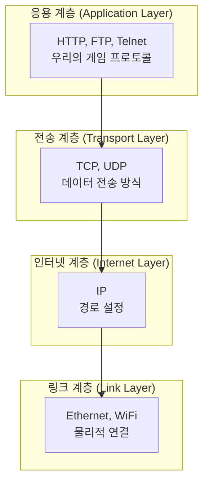
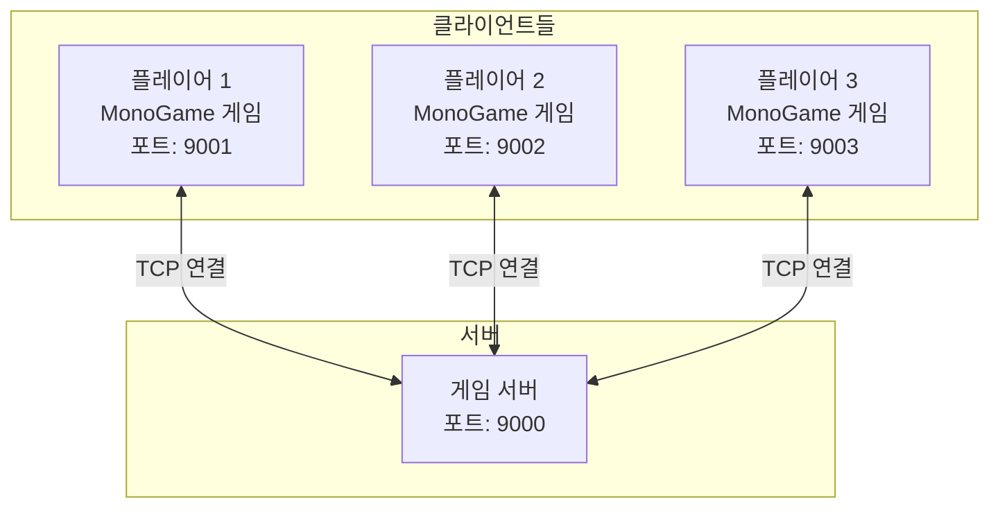
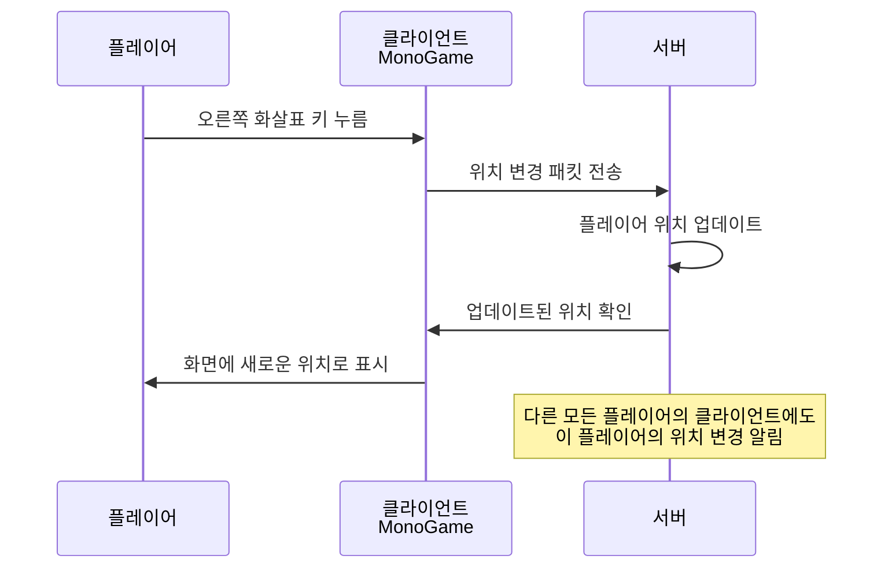

# MonoGame으로 온라인 게임 클라이언트 만들기

저자: 최흥배, Claude AI   
     
     
권장 개발 환경
- **IDE**: Visual Studio 2022 (Community 이상)
- **.NET**: .NET 9
- **OS**: Windows 10 이상
- **MonoGame**: 3.8

-----    
   
# 2장: 네트워크 통신의 기본
이 장에서는 온라인 게임 클라이언트를 만들기 위해 꼭 알아야 할 네트워크 통신의 기본 개념들을 함께 살펴볼 것이다. 게임이 서버와 어떻게 데이터를 주고받는지, 그리고 왜 그렇게 해야 하는지 이해하는 것이 매우 중요하다.


## 2.1 TCP/IP 프로토콜 개요
네트워크 통신이라고 하면 어려울 것 같지만, 사실 우리가 인터넷을 사용할 때마다 이 프로토콜이 작동하고 있다. TCP/IP 프로토콜은 인터넷 통신의 기초가 되는 규칙이며, 이를 이해하는 것이 게임 네트워킹의 첫 걸음이다.

### TCP와 UDP의 차이
네트워크 통신에는 크게 두 가지 방식이 있다. TCP(Transmission Control Protocol)와 UDP(User Datagram Protocol)이다.

**TCP**는 데이터가 반드시 도착해야 하고, 순서도 맞아야 하는 경우에 사용한다. 편지를 보낼 때 배송 추적을 통해 확실하게 도착했는지 확인하는 것처럼, TCP는 보낸 데이터가 서버에 정확히 도착했는지 확인한다. 따라서 신뢰성이 높지만, 그 과정에서 약간의 시간이 걸릴 수 있다.

**UDP**는 데이터가 빨리 도착해야 하지만 조금 손실되어도 괜찮은 경우에 사용한다. 라이브 스트리밍을 생각해보면, 한두 프레임이 손실되어도 영상을 계속 볼 수 있다. UDP는 바로 이런 특성을 가지고 있다. 빠르지만 완벽하지는 않다.

우리가 이 책에서 만드는 게임에서는 **TCP**를 사용할 것이다. 플레이어의 위치나 채팅 메시지 같은 중요한 데이터는 반드시 도착해야 하기 때문이다.

### TCP/IP 계층 구조
TCP/IP 프로토콜은 여러 계층으로 이루어져 있다. 다음 다이어그램을 보면 이해하기 쉬울 것이다.



각 계층은 아래 계층에 의존하면서도 독립적인 역할을 한다. 우리가 게임 프로토콜을 만들 때는 응용 계층에서 작동한다. 그 아래의 TCP, IP 계층은 운영 체제가 처리해주므로, 우리는 TCP 위에서 데이터를 주고받는 방법만 신경 쓰면 된다.

### 포트(Port)와 소켓(Socket)
네트워크 통신에서 포트는 매우 중요한 개념이다. 컴퓨터가 인터넷에 연결되어 있다면, 수많은 프로그램이 동시에 데이터를 주고받고 있다. 웹 브라우저, 메신저, 게임 등이 모두 네트워크를 사용한다. 그렇다면 어떤 데이터가 어느 프로그램으로 들어가야 할까?

**포트**가 바로 이 역할을 한다. 포트는 컴퓨터 내의 프로그램들을 구분하는 번호다. 0부터 65535까지의 번호가 있으며, 우리가 만드는 게임이 포트 9000번을 사용한다면, 서버로부터 포트 9000번으로 들어오는 데이터는 우리 게임이 받게 된다.

**소켓**은 포트를 통해 실제로 데이터를 주고받기 위한 통로다. .NET에서는 `System.Net.Sockets` 네임스페이스의 `Socket` 클래스나 `TcpClient` 클래스를 사용하여 소켓을 만들고 관리한다.

다음 다이어그램은 포트와 소켓의 개념을 시각화한 것이다.

```
클라이언트 컴퓨터              서버 컴퓨터
┌──────────────────┐          ┌──────────────────┐
│  게임 프로세스     │          │  게임 서버        │
│  포트: 9000       │──TCP──→  │  포트: 9000       │
│  ↓               │  연결     │  ↓               │
│  소켓 객체        │←─────────│  소켓 객체         │
│  (데이터 송수신)   │          │  (데이터 송수신)   │
└──────────────────┘          └──────────────────┘
```

이러한 구조를 이해하면, 게임이 어떻게 서버와 통신하는지 명확해진다.
  
</br>  
  

## 2.2 클라이언트-서버 아키텍처
온라인 게임은 기본적으로 클라이언트-서버 아키텍처로 동작한다. 이것이 무엇인지, 그리고 왜 이 구조를 사용하는지 알아보자.

### 클라이언트-서버 모델의 개념
**클라이언트**는 플레이어가 실행하는 게임 프로그램이다. 이것이 바로 MonoGame으로 만드는 우리의 게임이다. 클라이언트는 플레이어의 입력을 받아서 서버로 전송하고, 서버로부터 받은 정보를 화면에 보여준다.

**서버**는 게임의 중앙 관리자다. 모든 플레이어들의 데이터를 저장하고 관리하며, 클라이언트들로부터 받은 요청을 처리한다. 여러 클라이언트가 동시에 접속할 수 있으므로, 모든 플레이어가 같은 게임 세상에 있을 수 있는 것이다.

다음 다이어그램은 클라이언트-서버 구조를 보여준다.



### 클라이언트-서버 아키텍처의 장점
이 구조를 사용하는 이유는 여러 가지가 있다. 첫째, 게임의 정확성을 보장할 수 있다. 플레이어들이 각자 다른 컴퓨터에서 게임을 실행하기 때문에, 서버가 모든 플레이어의 행동을 중앙에서 검증하고 관리하면 부정행위를 방지할 수 있다.

둘째, 게임 상태가 항상 일관성 있게 유지된다. 만약 플레이어 A가 플레이어 B를 공격했다면, 모든 플레이어들이 같은 결과를 보게 된다. 서버가 하나의 진실의 원천(Single Source of Truth)이기 때문이다.

셋째, 게임을 확장하기 쉽다. 새로운 플레이어가 게임에 참여하려면 서버에 연결하기만 하면 된다. 서버가 모든 정보를 관리하므로 새 플레이어를 쉽게 추가할 수 있다.

### 데이터 흐름
게임에서 데이터가 어떻게 흘러가는지 예시를 통해 살펴보자.



1. 플레이어가 게임에서 오른쪽 화살표 키를 누른다.
2. 클라이언트가 이 입력을 감지하고, "플레이어가 오른쪽으로 이동하려고 한다"는 정보를 패킷으로 만들어 서버로 보낸다.
3. 서버가 이 패킷을 받고 플레이어의 위치를 업데이트한다.
4. 서버는 이 위치 변경을 해당 플레이어의 클라이언트에 확인해준다.
5. 클라이언트는 새로운 위치 정보를 받아 화면에 플레이어를 새로운 위치에 그린다.
6. 추가로, 서버는 같은 게임 세상에 있는 다른 모든 플레이어의 클라이언트에도 이 플레이어의 위치 변경을 알린다.

이런 구조 덕분에 여러 명의 플레이어가 같은 세상에서 게임을 할 수 있는 것이다.
  
</br>  
  

## 2.3 바이너리 직렬화의 원리
이제 우리가 게임 데이터를 어떻게 전송할 것인지에 대해 알아보자. 컴퓨터가 이해하는 데이터와 네트워크로 전송할 수 있는 데이터 형태는 다르다. 이를 변환하는 과정을 **직렬화(Serialization)**라고 부른다.
  
### 직렬화란 무엇인가
게임에서 플레이어의 위치를 나타내기 위해 다음과 같은 구조체를 사용한다고 생각해보자.

```csharp
struct Vector2
{
    public float X { get; set; }
    public float Y { get; set; }
}
```

프로그램 내에서는 `Vector2`라는 이름으로 X와 Y 좌표를 쉽게 다룰 수 있다. 하지만 이 데이터를 네트워크로 보내려면 어떻게 해야 할까? 네트워크는 바이트(Byte) 단위의 데이터만 전송할 수 있다.

**직렬화**는 메모리에 있는 객체를 바이트 스트림으로 변환하는 과정이다. 반대로 **역직렬화**는 바이트 스트림을 다시 원래의 객체로 복원하는 과정이다.

다음 다이어그램은 이 과정을 보여준다.

```
메모리                 네트워크                메모리
┌──────────┐          ┌──────┐          ┌──────────┐
│Vector2   │  직렬화   │바이트 │ 전송      │바이트     │ 역직렬화 │Vector2│
│X: 100.5f │──────→   │스트림 │───TCP──→ │스트림     │─────→   │X: 100.5f│
│Y: 200.3f │          │      │          │          │         │Y: 200.3f│
└──────────┘          └──────┘          └──────────┘
```

### 텍스트 형식 vs 바이너리 형식
데이터를 직렬화하는 방법은 두 가지다. **텍스트 형식**과 **바이너리 형식**이다.

**텍스트 형식** 예시:
```
X: 100.5, Y: 200.3
또는 JSON 형식:
{"X": 100.5, "Y": 200.3}
```

텍스트 형식은 읽기 쉽고 디버깅하기 편하다. 하지만 데이터가 많으면 파일 크기가 커진다. 게임에서는 초당 몇십 번씩 플레이어 위치를 보내야 하므로, 이렇게 하면 네트워크 트래픽이 너무 많아진다.

**바이너리 형식** 예시:
```
43 4D 19 43 CD CC 4B 43
```

바이너리 형식은 컴퓨터가 이해하는 형식 그대로다. 데이터를 바로 바이트로 변환하므로 파일 크기가 작고 처리 속도가 빠르다. 하지만 텍스트로는 읽기 어렵다.

온라인 게임에서는 **바이너리 형식**을 사용해야 한다. 네트워크 트래픽을 줄일 수 있고, 처리 속도가 빠르기 때문이다.

### .NET에서 바이너리 직렬화
.NET은 바이너리 직렬화를 쉽게 하기 위해 `BinaryWriter`와 `BinaryReader` 클래스를 제공한다. 이 클래스들은 기본 라이브러리에 포함되어 있어서 추가 설치가 필요 없다.

다음은 간단한 예제다.

```csharp
// 데이터를 바이너리로 변환하기 (직렬화)
using (var stream = new MemoryStream())
using (var writer = new BinaryWriter(stream))
{
    float x = 100.5f;
    float y = 200.3f;
    
    writer.Write(x);  // float를 4바이트로 변환
    writer.Write(y);  // float를 4바이트로 변환
    
    byte[] data = stream.ToArray();  // 바이트 배열로 변환
    // data는 이제 네트워크로 전송할 수 있다
}

// 전송받은 바이너리를 다시 원래 형식으로 복원하기 (역직렬화)
using (var stream = new MemoryStream(data))
using (var reader = new BinaryReader(stream))
{
    float receivedX = reader.ReadSingle();  // 4바이트를 float로 변환
    float receivedY = reader.ReadSingle();  // 4바이트를 float로 변환
    
    // receivedX는 100.5f, receivedY는 200.3f다
}
```

각 데이터 타입별로 바이너리 변환 크기는 다음과 같다.

- `byte`: 1바이트
- `short`: 2바이트
- `int`: 4바이트
- `long`: 8바이트
- `float`: 4바이트
- `double`: 8바이트
- `bool`: 1바이트
- `char`: 2바이트
- `string`: 가변적 (문자열 길이 + 문자들)
  

### 패킷의 개념
온라인 게임에서는 여러 종류의 정보를 보낸다. 플레이어 위치, 체력, 공격 정보, 채팅 메시지 등이 모두 다르다. 그런데 이들을 모두 같은 형식으로 보낼 수는 없다.

**패킷**은 게임 통신의 기본 단위로, 일종의 "편지"와 같다. 편지가 봉투, 주소, 내용으로 이루어져 있듯이, 패킷도 구조가 있다.

```
패킷의 구조:

┌─────────────┬──────────────┬──────────────┐
│ 패킷 타입    │ 데이터 길이    │ 실제 데이터    │
├─────────────┼──────────────┼──────────────┤
│ 1 바이트     │ 2 바이트      │ 가변 길이     │
│ 예: 1       │ 예: 10        │ 실제 내용     │
└─────────────┴──────────────┴──────────────┘
```

패킷 타입은 이 패킷이 무엇을 의미하는지를 알려준다. 타입이 1이면 "플레이어 위치 업데이트", 타입이 2면 "채팅 메시지" 이런 식이다. 데이터 길이는 실제 데이터가 몇 바이트인지를 알려주므로, 받는 쪽에서 정확히 얼마만큼 읽어야 하는지 알 수 있다.

다음은 패킷을 만들고 읽는 예제다.

```csharp
// 패킷 타입 정의
const byte PACKET_TYPE_POSITION = 1;
const byte PACKET_TYPE_CHAT = 2;

// 위치 업데이트 패킷 만들기 (직렬화)
using (var stream = new MemoryStream())
using (var writer = new BinaryWriter(stream))
{
    writer.Write(PACKET_TYPE_POSITION);  // 패킷 타입: 위치 업데이트
    writer.Write(100.5f);                // X 좌표
    writer.Write(200.3f);                // Y 좌표
    
    byte[] packetData = stream.ToArray();
    // packetData는 이제 네트워크로 보낼 수 있다
}

// 네트워크에서 받은 패킷 읽기 (역직렬화)
using (var stream = new MemoryStream(packetData))
using (var reader = new BinaryReader(stream))
{
    byte type = reader.ReadByte();       // 패킷 타입 읽기
    
    if (type == PACKET_TYPE_POSITION)
    {
        float x = reader.ReadSingle();   // X 좌표 읽기
        float y = reader.ReadSingle();   // Y 좌표 읽기
        Console.WriteLine($"새로운 위치: ({x}, {y})");
    }
}
```

### 데이터 정렬의 중요성
바이너리 직렬화를 할 때는 **순서가 매우 중요**하다. 서버와 클라이언트가 같은 순서로 데이터를 읽고 써야 한다. 만약 클라이언트가 "X, Y" 순서로 보냈는데 서버가 "Y, X" 순서로 읽으면 데이터가 뒤바뀐다.

이를 방지하기 위해 통상적으로 프로토콜 명세서를 만든다. 이 책에서는 3장에서 이에 대해 자세히 다룰 것이다.

### 직렬화 시 주의할 점
문자열을 직렬화할 때는 특히 주의해야 한다. 숫자는 고정 크기지만, 문자열은 길이가 다양하기 때문이다. `BinaryWriter`는 문자열을 쓸 때 자동으로 길이 정보를 앞에 붙여준다. 따라서 읽을 때도 `BinaryReader.ReadString()`을 사용하면 자동으로 길이를 읽고 올바른 문자열을 복원한다.

```csharp
// 문자열 직렬화
using (var stream = new MemoryStream())
using (var writer = new BinaryWriter(stream))
{
    writer.Write("안녕하세요");  // 문자열 쓰기 (길이 정보 자동 포함)
    byte[] data = stream.ToArray();
}

// 문자열 역직렬화
using (var stream = new MemoryStream(data))
using (var reader = new BinaryReader(stream))
{
    string message = reader.ReadString();  // 길이 정보 자동 읽기
    Console.WriteLine(message);  // 출력: "안녕하세요"
}
```
  
</br>  

---

## 학습 확인 과제
이 장에서 배운 내용을 확인하기 위해 다음 과제를 수행해보자.

### 과제 1: 프로토콜 설계
플레이어의 정보를 서버로 보낼 때 다음 데이터를 포함해야 한다고 하자.
- 플레이어 ID (int)
- X 좌표 (float)
- Y 좌표 (float)
- 플레이어 이름 (string)

이 정보를 바이너리로 직렬화할 때의 순서를 정하고, 각 데이터의 크기를 계산해보자. 플레이어 이름이 "철수" 2글자라고 가정할 때, 전체 패킷 크기는 몇 바이트가 될까?

### 과제 2: 바이너리 변환 코드 작성
위의 플레이어 정보를 다음과 같이 표현하는 C# 클래스를 만들자.

```csharp
class PlayerInfo
{
    public int PlayerId { get; set; }
    public float X { get; set; }
    public float Y { get; set; }
    public string Name { get; set; }
}
```

이제 `PlayerInfo` 객체를 바이너리로 직렬화하는 메서드와 역직렬화하는 메서드를 작성해보자.

```csharp
// 직렬화
byte[] SerializePlayerInfo(PlayerInfo player)
{
    // 여기에 코드 작성
}

// 역직렬화
PlayerInfo DeserializePlayerInfo(byte[] data)
{
    // 여기에 코드 작성
}
```

### 과제 3: 개념 이해
다음 질문들에 답해보자.

1. TCP와 UDP의 가장 큰 차이점은 무엇이며, 게임에서 위치 정보 전송에 TCP를 사용하는 이유는 무엇일까?

2. 클라이언트-서버 아키텍처에서 서버가 "진실의 원천(Single Source of Truth)"이라는 것은 무엇을 의미할까?

3. 바이너리 직렬화를 사용하는 이유는 텍스트 형식 대신 왜 바이너리를 사용할까?

### 과제 4: 포트 개념 이해
다음 상황을 생각해보자. 당신의 컴퓨터에서 여러 게임이 동시에 실행되고 있고, 각각 게임 서버에 연결되어 있다. 이 상황에서 포트가 왜 필요한지, 그리고 포트가 없다면 어떤 일이 일어날지 설명해보자.

이 과제들을 해결하면서 네트워크 통신의 기본을 확실히 이해할 수 있을 것이다. 다음 장에서는 이런 개념을 실제 코드로 구현해볼 것이니 참고하면 좋다.  