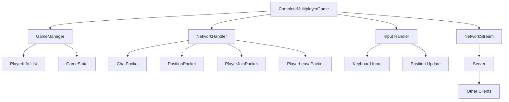

# MonoGame으로 온라인 게임 클라이언트 만들기

저자: 최흥배, Claude AI   
     
     
권장 개발 환경
- **IDE**: Visual Studio 2022 (Community 이상)
- **.NET**: .NET 9
- **OS**: Windows 10 이상
- **MonoGame**: 3.8

-----    
   
# 8장: 간단한 멀티플레이 게임 완성
이 장에서는 지금까지 배운 네트워크 통신, 패킷 프로토콜, 플레이어 동기화 기술을 모두 합쳐서 실제로 동작하는 멀티플레이 게임을 만들어본다. 단순해 보이지만 온라인 게임의 핵심 요소를 모두 포함한 프로토타입이 완성될 것이다.

## 8.1 채팅 기능 추가
게임에 채팅 기능을 추가하는 것은 멀티플레이 게임의 기본이다. 플레이어들이 서로 소통할 수 있어야 협력 게임플레이가 가능해지기 때문이다.

### 채팅 메시지 패킷 정의
먼저 채팅 메시지를 전송하기 위한 패킷 구조를 정의해야 한다. 7장에서 배운 위치 패킷처럼 패킷 ID, 플레이어 ID, 메시지 내용이 포함되어야 한다.

```csharp
public class ChatPacket
{
    public const byte PACKET_ID = 0x03;
    
    public int PlayerId { get; set; }
    public string PlayerName { get; set; }
    public string Message { get; set; }
    
    // 패킷을 바이너리로 직렬화
    public byte[] Serialize()
    {
        using (MemoryStream ms = new MemoryStream())
        {
            using (BinaryWriter writer = new BinaryWriter(ms))
            {
                writer.Write(PACKET_ID);
                writer.Write(PlayerId);
                
                // 문자열은 길이 정보와 함께 인코딩
                byte[] nameBytes = Encoding.UTF8.GetBytes(PlayerName);
                writer.Write((ushort)nameBytes.Length);
                writer.Write(nameBytes);
                
                byte[] messageBytes = Encoding.UTF8.GetBytes(Message);
                writer.Write((ushort)messageBytes.Length);
                writer.Write(messageBytes);
            }
            return ms.ToArray();
        }
    }
    
    // 바이너리 데이터를 역직렬화
    public static ChatPacket Deserialize(byte[] data)
    {
        using (MemoryStream ms = new MemoryStream(data, 1, data.Length - 1))
        {
            using (BinaryReader reader = new BinaryReader(ms))
            {
                var packet = new ChatPacket();
                packet.PlayerId = reader.ReadInt32();
                
                ushort nameLength = reader.ReadUInt16();
                packet.PlayerName = Encoding.UTF8.GetString(
                    reader.ReadBytes(nameLength));
                
                ushort messageLength = reader.ReadUInt16();
                packet.Message = Encoding.UTF8.GetString(
                    reader.ReadBytes(messageLength));
                
                return packet;
            }
        }
    }
}
```

이 코드는 채팅 메시지를 바이너리 형식으로 변환하는 방법을 보여준다. 문자열은 길이 정보(ushort)를 먼저 쓰고 그 다음 UTF-8 바이트 데이터를 쓴다. 이렇게 하면 수신하는 쪽에서 얼마나 많은 바이트를 읽어야 하는지 알 수 있다.

### 게임 클래스에 채팅 기능 통합
이제 게임의 메인 클래스에서 채팅 기능을 실제로 사용해보자.

```csharp
public class MultiplayerGame : Game
{
    private GraphicsDeviceManager graphics;
    private SpriteBatch spriteBatch;
    
    // 네트워크 관련
    private TcpClient tcpClient;
    private NetworkStream networkStream;
    
    // 게임 상태
    private int playerId;
    private string playerName;
    private Dictionary<int, RemotePlayer> remotePlayers;
    
    // 채팅 UI
    private List<ChatMessage> chatMessages;
    private string inputBuffer;
    private const int MAX_CHAT_MESSAGES = 10;
    
    private SpriteFont font;
    
    public MultiplayerGame()
    {
        graphics = new GraphicsDeviceManager(this);
        Content.RootDirectory = "Content";
    }
    
    protected override void Initialize()
    {
        remotePlayers = new Dictionary<int, RemotePlayer>();
        chatMessages = new List<ChatMessage>();
        inputBuffer = "";
        base.Initialize();
    }
    
    protected override void LoadContent()
    {
        spriteBatch = new SpriteBatch(GraphicsDevice);
        font = Content.Load<SpriteFont>("Arial");
    }
    
    protected override void Update(GameTime gameTime)
    {
        var keyboardState = Keyboard.GetState();
        
        // 채팅 입력 처리
        HandleChatInput(keyboardState);
        
        // 네트워크 메시지 수신
        ProcessNetworkMessages();
        
        base.Update(gameTime);
    }
    
    private void HandleChatInput(KeyboardState keyboardState)
    {
        // 간단한 문자 입력 처리 (실제로는 더 정교한 입력 시스템 필요)
        if (keyboardState.IsKeyDown(Keys.Enter) && inputBuffer.Length > 0)
        {
            SendChatMessage(inputBuffer);
            inputBuffer = "";
        }
    }
    
    private void SendChatMessage(string message)
    {
        var chatPacket = new ChatPacket
        {
            PlayerId = playerId,
            PlayerName = playerName,
            Message = message
        };
        
        byte[] packetData = chatPacket.Serialize();
        networkStream.Write(packetData, 0, packetData.Length);
        networkStream.Flush();
        
        // 자신의 메시지도 채팅창에 표시
        AddChatMessage(playerName, message);
    }
    
    private void ProcessNetworkMessages()
    {
        if (networkStream == null || !networkStream.DataAvailable)
            return;
        
        byte[] buffer = new byte[1024];
        int bytesRead = networkStream.Read(buffer, 0, buffer.Length);
        
        if (bytesRead > 0)
        {
            byte packetType = buffer[0];
            
            switch (packetType)
            {
                case ChatPacket.PACKET_ID:
                    HandleChatPacket(buffer);
                    break;
                case PositionPacket.PACKET_ID:
                    HandlePositionPacket(buffer);
                    break;
            }
        }
    }
    
    private void HandleChatPacket(byte[] data)
    {
        ChatPacket packet = ChatPacket.Deserialize(data);
        AddChatMessage(packet.PlayerName, packet.Message);
    }
    
    private void AddChatMessage(string playerName, string message)
    {
        var chatMsg = new ChatMessage
        {
            PlayerName = playerName,
            Message = message,
            TimeRemaining = 10f // 10초 동안 표시
        };
        
        chatMessages.Add(chatMsg);
        
        // 최대 메시지 개수 초과 시 가장 오래된 메시지 제거
        if (chatMessages.Count > MAX_CHAT_MESSAGES)
        {
            chatMessages.RemoveAt(0);
        }
    }
    
    private void HandlePositionPacket(byte[] data)
    {
        PositionPacket packet = PositionPacket.Deserialize(data);
        
        if (!remotePlayers.ContainsKey(packet.PlayerId))
        {
            remotePlayers[packet.PlayerId] = new RemotePlayer();
        }
        
        remotePlayers[packet.PlayerId].Position = new Vector2(
            packet.X, packet.Y);
    }
    
    protected override void Draw(GameTime gameTime)
    {
        GraphicsDevice.Clear(Color.CornflowerBlue);
        
        spriteBatch.Begin();
        
        // 다른 플레이어들 그리기
        foreach (var player in remotePlayers.Values)
        {
            spriteBatch.DrawString(font, "Player", player.Position, 
                Color.White);
        }
        
        // 채팅 메시지 그리기
        DrawChatMessages();
        
        spriteBatch.End();
        base.Draw(gameTime);
    }
    
    private void DrawChatMessages()
    {
        float yOffset = 10f;
        
        foreach (var message in chatMessages)
        {
            string displayText = $"{message.PlayerName}: {message.Message}";
            spriteBatch.DrawString(font, displayText, 
                new Vector2(10, yOffset), Color.White);
            yOffset += 20f;
        }
    }
}

public class ChatMessage
{
    public string PlayerName { get; set; }
    public string Message { get; set; }
    public float TimeRemaining { get; set; }
}

public class RemotePlayer
{
    public Vector2 Position { get; set; }
}
```

`MultiplayerGame` 클래스는 게임의 핵심이다. `chatMessages` 리스트는 화면에 표시할 채팅 메시지들을 저장하고 있다. 최대 10개의 메시지만 유지해서 화면이 너무 복잡해지는 것을 방지한다.

`HandleChatInput()` 메서드는 플레이어의 키보드 입력을 감지한다. 엔터 키를 누르고 입력 버퍼에 내용이 있으면 채팅 메시지를 전송한다. `SendChatMessage()` 메서드는 `ChatPacket`을 직렬화해서 네트워크로 전송한다.

`ProcessNetworkMessages()` 메서드는 네트워크에서 들어오는 데이터를 확인하고 패킷 타입에 따라 처리한다. 채팅 패킷이면 `HandleChatPacket()`을 호출하고, 위치 패킷이면 `HandlePositionPacket()`을 호출한다.

`DrawChatMessages()` 메서드는 화면 좌상단에 최근 채팅 메시지들을 표시한다. 이렇게 함으로써 플레이어들이 서로의 대화를 볼 수 있다.
  
</br>  
  

## 8.2 게임 상태 관리
멀티플레이 게임에서는 모든 플레이어의 상태를 정확히 추적해야 한다. 게임 시작, 플레이어 입장, 플레이어 퇴장 등의 상태 변화를 관리해야 한다.

### 게임 상태 정의

```csharp
public enum GameState
{
    Connecting,      // 서버에 연결 시도 중
    Connected,       // 연결됨
    InGame,          // 게임 진행 중
    Disconnected,    // 연결 끊김
    Error            // 에러 발생
}

public class GameManager
{
    public GameState CurrentState { get; private set; }
    public int LocalPlayerId { get; private set; }
    public string LocalPlayerName { get; private set; }
    public Dictionary<int, PlayerInfo> Players { get; private set; }
    
    public GameManager()
    {
        CurrentState = GameState.Connecting;
        Players = new Dictionary<int, PlayerInfo>();
    }
    
    public void UpdateState(GameState newState)
    {
        CurrentState = newState;
    }
    
    public void AddPlayer(int playerId, string playerName)
    {
        if (!Players.ContainsKey(playerId))
        {
            Players[playerId] = new PlayerInfo
            {
                PlayerId = playerId,
                PlayerName = playerName,
                Position = Vector2.Zero,
                JoinTime = DateTime.UtcNow
            };
        }
    }
    
    public void RemovePlayer(int playerId)
    {
        if (Players.ContainsKey(playerId))
        {
            Players.Remove(playerId);
        }
    }
    
    public void UpdatePlayerPosition(int playerId, float x, float y)
    {
        if (Players.ContainsKey(playerId))
        {
            Players[playerId].Position = new Vector2(x, y);
        }
    }
}

public class PlayerInfo
{
    public int PlayerId { get; set; }
    public string PlayerName { get; set; }
    public Vector2 Position { get; set; }
    public DateTime JoinTime { get; set; }
    public bool IsAlive { get; set; } = true;
}
```

`GameManager` 클래스는 게임의 전체 상태를 관리한다. 현재 게임 상태, 로컬 플레이어 정보, 그리고 모든 원격 플레이어 정보를 저장한다. `AddPlayer()`와 `RemovePlayer()` 메서드를 통해 플레이어 리스트를 관리한다.

### 플레이어 입장/퇴장 패킷
플레이어가 게임에 입장하거나 떠날 때를 서버가 다른 클라이언트에게 알려야 한다.

```csharp
public class PlayerJoinPacket
{
    public const byte PACKET_ID = 0x04;
    
    public int PlayerId { get; set; }
    public string PlayerName { get; set; }
    
    public byte[] Serialize()
    {
        using (MemoryStream ms = new MemoryStream())
        {
            using (BinaryWriter writer = new BinaryWriter(ms))
            {
                writer.Write(PACKET_ID);
                writer.Write(PlayerId);
                
                byte[] nameBytes = Encoding.UTF8.GetBytes(PlayerName);
                writer.Write((ushort)nameBytes.Length);
                writer.Write(nameBytes);
            }
            return ms.ToArray();
        }
    }
    
    public static PlayerJoinPacket Deserialize(byte[] data)
    {
        using (MemoryStream ms = new MemoryStream(data, 1, data.Length - 1))
        {
            using (BinaryReader reader = new BinaryReader(ms))
            {
                var packet = new PlayerJoinPacket();
                packet.PlayerId = reader.ReadInt32();
                
                ushort nameLength = reader.ReadUInt16();
                packet.PlayerName = Encoding.UTF8.GetString(
                    reader.ReadBytes(nameLength));
                
                return packet;
            }
        }
    }
}

public class PlayerLeavePacket
{
    public const byte PACKET_ID = 0x05;
    
    public int PlayerId { get; set; }
    
    public byte[] Serialize()
    {
        using (MemoryStream ms = new MemoryStream())
        {
            using (BinaryWriter writer = new BinaryWriter(ms))
            {
                writer.Write(PACKET_ID);
                writer.Write(PlayerId);
            }
            return ms.ToArray();
        }
    }
    
    public static PlayerLeavePacket Deserialize(byte[] data)
    {
        using (MemoryStream ms = new MemoryStream(data, 1, data.Length - 1))
        {
            using (BinaryReader reader = new BinaryReader(ms))
            {
                var packet = new PlayerLeavePacket();
                packet.PlayerId = reader.ReadInt32();
                return packet;
            }
        }
    }
}
```

이 두 패킷은 플레이어 입장과 퇴장을 알린다. `PlayerJoinPacket`은 새로운 플레이어가 게임에 입장할 때 서버가 다른 모든 클라이언트에게 보낸다. `PlayerLeavePacket`은 플레이어가 게임을 나갈 때 보낸다.

### 상태 변화 처리

```csharp
public class NetworkHandler
{
    private GameManager gameManager;
    private NetworkStream networkStream;
    
    public NetworkHandler(GameManager gameManager, NetworkStream networkStream)
    {
        this.gameManager = gameManager;
        this.networkStream = networkStream;
    }
    
    public void ProcessPacket(byte[] data)
    {
        if (data.Length == 0)
            return;
        
        byte packetType = data[0];
        
        switch (packetType)
        {
            case ChatPacket.PACKET_ID:
                HandleChatPacket(data);
                break;
                
            case PositionPacket.PACKET_ID:
                HandlePositionPacket(data);
                break;
                
            case PlayerJoinPacket.PACKET_ID:
                HandlePlayerJoin(data);
                break;
                
            case PlayerLeavePacket.PACKET_ID:
                HandlePlayerLeave(data);
                break;
        }
    }
    
    private void HandleChatPacket(byte[] data)
    {
        ChatPacket packet = ChatPacket.Deserialize(data);
        // 채팅 메시지 처리
    }
    
    private void HandlePositionPacket(byte[] data)
    {
        PositionPacket packet = PositionPacket.Deserialize(data);
        gameManager.UpdatePlayerPosition(packet.PlayerId, packet.X, packet.Y);
    }
    
    private void HandlePlayerJoin(byte[] data)
    {
        PlayerJoinPacket packet = PlayerJoinPacket.Deserialize(data);
        gameManager.AddPlayer(packet.PlayerId, packet.PlayerName);
    }
    
    private void HandlePlayerLeave(byte[] data)
    {
        PlayerLeavePacket packet = PlayerLeavePacket.Deserialize(data);
        gameManager.RemovePlayer(packet.PlayerId);
    }
}
```

`NetworkHandler` 클래스는 패킷 타입에 따라 적절한 핸들러를 호출한다. 플레이어가 입장하면 `gameManager`에 새로운 플레이어를 추가하고, 퇴장하면 제거한다.
  
</br>  
  

## 8.3 완성된 프로토타입 게임
이제 지금까지의 모든 요소를 통합해서 실제로 작동하는 멀티플레이 게임을 만들어보자.

### 통합 게임 클래스

```csharp
public class CompleteMultiplayerGame : Game
{
    private GraphicsDeviceManager graphics;
    private SpriteBatch spriteBatch;
    private SpriteFont font;
    
    // 게임 관리
    private GameManager gameManager;
    private NetworkHandler networkHandler;
    
    // 네트워크
    private TcpClient tcpClient;
    private NetworkStream networkStream;
    private Thread networkThread;
    
    // 로컬 플레이어
    private Vector2 localPlayerPosition;
    private Vector2 localPlayerVelocity;
    private const float PLAYER_SPEED = 200f;
    
    // UI
    private List<string> screenMessages;
    private string chatInput;
    
    public CompleteMultiplayerGame()
    {
        graphics = new GraphicsDeviceManager(this);
        Content.RootDirectory = "Content";
        IsMouseVisible = true;
    }
    
    protected override void Initialize()
    {
        gameManager = new GameManager();
        screenMessages = new List<string>();
        chatInput = "";
        localPlayerPosition = new Vector2(400, 300);
        localPlayerVelocity = Vector2.Zero;
        
        ConnectToServer("localhost", 5000);
        
        base.Initialize();
    }
    
    private void ConnectToServer(string host, int port)
    {
        try
        {
            tcpClient = new TcpClient();
            tcpClient.Connect(host, port);
            networkStream = tcpClient.GetStream();
            
            gameManager.UpdateState(GameState.Connected);
            AddScreenMessage("서버에 연결되었습니다");
            
            // 네트워크 수신 스레드 시작
            networkThread = new Thread(NetworkReceiveLoop);
            networkThread.IsBackground = true;
            networkThread.Start();
        }
        catch (Exception ex)
        {
            gameManager.UpdateState(GameState.Error);
            AddScreenMessage($"연결 실패: {ex.Message}");
        }
    }
    
    private void NetworkReceiveLoop()
    {
        byte[] buffer = new byte[1024];
        
        while (tcpClient.Connected)
        {
            try
            {
                int bytesRead = networkStream.Read(buffer, 0, buffer.Length);
                
                if (bytesRead > 0)
                {
                    byte[] data = new byte[bytesRead];
                    Array.Copy(buffer, data, bytesRead);
                    networkHandler.ProcessPacket(data);
                }
            }
            catch (Exception ex)
            {
                AddScreenMessage($"수신 오류: {ex.Message}");
                break;
            }
        }
    }
    
    protected override void LoadContent()
    {
        spriteBatch = new SpriteBatch(GraphicsDevice);
        font = Content.Load<SpriteFont>("Arial");
        networkHandler = new NetworkHandler(gameManager, networkStream);
    }
    
    protected override void Update(GameTime gameTime)
    {
        if (GamePad.GetState(PlayerIndex.One).Buttons.Back == ButtonState.Pressed ||
            Keyboard.GetState().IsKeyDown(Keys.Escape))
        {
            Disconnect();
            Exit();
        }
        
        if (gameManager.CurrentState == GameState.Connected)
        {
            HandlePlayerInput(gameTime);
            UpdateLocalPlayer(gameTime);
            SendPositionUpdate();
        }
        
        base.Update(gameTime);
    }
    
    private void HandlePlayerInput(GameTime gameTime)
    {
        var keyboardState = Keyboard.GetState();
        localPlayerVelocity = Vector2.Zero;
        
        if (keyboardState.IsKeyDown(Keys.W))
            localPlayerVelocity.Y = -PLAYER_SPEED;
        if (keyboardState.IsKeyDown(Keys.S))
            localPlayerVelocity.Y = PLAYER_SPEED;
        if (keyboardState.IsKeyDown(Keys.A))
            localPlayerVelocity.X = -PLAYER_SPEED;
        if (keyboardState.IsKeyDown(Keys.D))
            localPlayerVelocity.X = PLAYER_SPEED;
        
        // 채팅 입력 (T 키)
        if (keyboardState.IsKeyDown(Keys.T))
        {
            // 채팅 모드 진입 (간단한 구현)
        }
    }
    
    private void UpdateLocalPlayer(GameTime gameTime)
    {
        localPlayerPosition += localPlayerVelocity * (float)gameTime.ElapsedGameTime.TotalSeconds;
        
        // 화면 범위 제한
        localPlayerPosition.X = MathHelper.Clamp(localPlayerPosition.X, 0, GraphicsDevice.Viewport.Width);
        localPlayerPosition.Y = MathHelper.Clamp(localPlayerPosition.Y, 0, GraphicsDevice.Viewport.Height);
        
        gameManager.UpdatePlayerPosition(gameManager.LocalPlayerId, 
            localPlayerPosition.X, localPlayerPosition.Y);
    }
    
    private void SendPositionUpdate()
    {
        var posPacket = new PositionPacket
        {
            PlayerId = gameManager.LocalPlayerId,
            X = localPlayerPosition.X,
            Y = localPlayerPosition.Y
        };
        
        try
        {
            byte[] data = posPacket.Serialize();
            networkStream.Write(data, 0, data.Length);
            networkStream.Flush();
        }
        catch (Exception ex)
        {
            AddScreenMessage($"전송 오류: {ex.Message}");
        }
    }
    
    private void AddScreenMessage(string message)
    {
        screenMessages.Add($"[{DateTime.Now:HH:mm:ss}] {message}");
        if (screenMessages.Count > 5)
        {
            screenMessages.RemoveAt(0);
        }
    }
    
    protected override void Draw(GameTime gameTime)
    {
        GraphicsDevice.Clear(Color.CornflowerBlue);
        
        spriteBatch.Begin();
        
        // 게임 상태 그리기
        DrawGameStatus();
        
        // 로컬 플레이어 그리기
        DrawLocalPlayer();
        
        // 원격 플레이어들 그리기
        DrawRemotePlayers();
        
        // 화면 메시지 그리기
        DrawScreenMessages();
        
        spriteBatch.End();
        
        base.Draw(gameTime);
    }
    
    private void DrawGameStatus()
    {
        string statusText = $"상태: {gameManager.CurrentState} | 플레이어 수: {gameManager.Players.Count}";
        spriteBatch.DrawString(font, statusText, new Vector2(10, 10), Color.White);
    }
    
    private void DrawLocalPlayer()
    {
        spriteBatch.DrawString(font, "●", localPlayerPosition, Color.Yellow);
    }
    
    private void DrawRemotePlayers()
    {
        foreach (var playerInfo in gameManager.Players.Values)
        {
            if (playerInfo.PlayerId != gameManager.LocalPlayerId)
            {
                spriteBatch.DrawString(font, "●", playerInfo.Position, Color.Red);
                spriteBatch.DrawString(font, playerInfo.PlayerName, 
                    playerInfo.Position + new Vector2(0, 20), Color.White);
            }
        }
    }
    
    private void DrawScreenMessages()
    {
        float yOffset = 50f;
        
        foreach (var message in screenMessages)
        {
            spriteBatch.DrawString(font, message, new Vector2(10, yOffset), Color.Lime);
            yOffset += 20f;
        }
    }
    
    private void Disconnect()
    {
        try
        {
            networkStream?.Close();
            tcpClient?.Close();
            networkThread?.Abort();
        }
        catch { }
    }
}
```

이 코드는 상당히 길기 때문에 자세히 설명하겠다. `CompleteMultiplayerGame`는 게임의 메인 클래스로, 모든 기능을 통합한다.

`ConnectToServer()` 메서드는 서버에 연결을 시도한다. 연결 성공 후 `NetworkReceiveLoop()`를 별도의 스레드에서 실행한다. 이렇게 함으로써 메인 게임 루프를 블로킹하지 않으면서도 지속적으로 네트워크 데이터를 수신할 수 있다.

`HandlePlayerInput()` 메서드는 WASD 키로 플레이어를 움직인다. `UpdateLocalPlayer()` 메서드는 플레이어 위치를 업데이트하고 화면 범위 안에 유지한다. `SendPositionUpdate()`는 매 프레임마다 현재 위치를 서버로 전송한다.

`Draw()` 메서드는 로컬 플레이어를 노란색 점으로, 원격 플레이어들을 빨간색 점으로 표시한다. 화면 왼쪽 위에는 게임 상태와 메시지를 표시한다.

### 게임 아키텍처 다이어그램
멀티플레이 게임의 전체 구조를 이해하기 위해 다이어그램으로 표현해보자.



이 다이어그램은 게임의 주요 컴포넌트들의 관계를 보여준다. `CompleteMultiplayerGame`은 모든 것을 조율하는 중심이다. `GameManager`는 게임 상태를 관리하고, `NetworkHandler`는 패킷을 처리한다.
  
</br>  
  

## 학습 점검 과제
이 장에서 배운 내용을 확인하기 위해 다음 과제를 완성해보자.

### 과제 1: 점수 시스템 추가
게임에 점수 시스템을 추가하려고 한다. 다음을 구현해보자:

1. `ScorePacket`이라는 새로운 패킷을 정의한다. 패킷에는 플레이어 ID와 현재 점수가 포함되어야 한다.
2. `GameManager`에 플레이어의 점수를 저장하는 기능을 추가한다.
3. `CompleteMultiplayerGame`의 `Draw()` 메서드에서 모든 플레이어의 점수를 화면에 표시한다.

힌트: `ScorePacket`의 구조는 위치 패킷과 매우 유사할 것이다.

### 과제 2: 채팅 메시지 필터링
우리의 채팅 시스템이 너무 기본적이어서 욕설이나 비정상적인 메시지를 필터링할 수 없다. 다음을 구현해보자:

1. 금지된 단어 목록을 유지하는 `ChatFilter` 클래스를 만든다.
2. `SendChatMessage()` 메서드를 수정해서 메시지를 전송하기 전에 필터링한다.
3. 필터링된 단어는 별표(*) 기호로 표시한다.

예시: "hello world bad words" → "hello world ***** *****"

### 과제 3: 플레이어 리스트 UI 추가
현재 게임에는 모든 플레이어를 한눈에 볼 수 있는 리스트가 없다. 다음을 구현해보자:

1. 화면 우측에 현재 접속한 모든 플레이어의 목록을 표시한다.
2. 각 플레이어의 이름과 점수를 함께 표시한다.
3. P 키를 누르면 플레이어 리스트를 토글(보이기/숨기기)한다.

힌트: `Dictionary<int, PlayerInfo>`를 순회하면서 데이터를 표시하면 된다.

### 과제 4: 연결 끊김 재시도
네트워크 연결이 끊기면 게임이 멈춘다. 다음을 구현해보자:

1. 연결이 끊어진 것을 감지하는 기능을 추가한다.
2. 10초마다 자동으로 서버에 재연결을 시도한다.
3. 재연결 시도 횟수를 화면에 표시한다.

힌트: `GameTime`을 사용해서 시간을 추적하면 된다.

### 과제 5: 종합 프로젝트 - 간단한 협력 게임
지금까지 배운 모든 기능을 사용해서 다음과 같은 간단한 협력 게임을 만들어보자:

게임 설명:
- 화면에 떨어지는 코인(동그란 점)이 있다.
- 모든 플레이어가 협력해서 코인을 수집한다.
- 코인을 수집하면 개인 점수가 올라간다.
- 모든 플레이어의 점수 합계가 목표값(예: 100점)에 도달하면 게임을 이긴다.
- 채팅으로 전략을 짜서 협력한다.

구현해야 할 것:
1. `Coin` 클래스를 만든다. 코인은 생성되고 떨어지고 충돌 감지가 된다.
2. 코인 수집 패킷을 정의한다. (누가 어떤 코인을 수집했는가)
3. 게임 승리 조건을 확인한다.
4. 모든 플레이어에게 동기화된 게임 진행을 보장한다.

이 과제를 완성하면 멀티플레이 온라인 게임의 기본 구조를 완전히 이해할 수 있을 것이다.  